# Chapter 2: The Anatomy of Banking Incidents

## Chapter Overview

Welcome to the autopsy table of banking incidents—where we slice open the mess, poke at the guts, and map out exactly why your "minor" blip cost the bank a few million and a regulatory migraine. This chapter isn’t some academic snooze-fest about theoretical outages. Here, you’ll crawl through the battlefield of banking SRE, where misclassifying an incident is like calling a heart attack a mild cough, and failing to map transaction flows is the equivalent of flying blind in a hurricane. We’re not just talking logs and metrics—we’re talking business carnage, stakeholder freak-outs, and regulatory wolves at the door. If you’re ready to turn incident chaos into actionable, business-aligned SRE muscle, read on. If you’d rather keep firefighting the same old way, good luck—hope you like 3AM escalations and awkward postmortems.

---
## Learning Objectives

By the end of this chapter, you’ll be able to:

- **Classify** banking incidents using a multi-dimensional severity matrix that actually reflects business reality, not just CPU graphs.
- **Map** end-to-end transaction flows, exposing hidden dependencies and failure points that love to bite you mid-incident.
- **Quantify** business impact—translating technical noise into numbers the CFO and regulators care about.
- **Analyze** incident timelines, exposing where precious minutes (and dollars) vanish between symptom and solution.
- **Reconstruct** incidents with forensic rigor, turning chaos into a clear, evidence-backed narrative.
- **Map** stakeholder impacts so you don’t leave customers, regulators, or internal teams flailing in the dark.
- **Identify** and **leverage** incident archetypes, so you stop reinventing the wheel every time the same flavor of disaster strikes.

---
## Key Takeaways

- Half-baked incident classification is financial roulette—get it wrong, and you’re bleeding cash, customers, or compliance points.
- Transaction flow mapping isn’t optional; it’s the difference between “found the root cause” and “three hours lost staring at the wrong logs.”
- If you can’t tie tech failures to business losses, you’re just another cost center. Quantify or get sidelined.
- Most “long incidents” aren’t technical—they’re a masterclass in human delay: slow detection, botched escalations, and communication black holes.
- Incident archaeology is not forensics cosplay. If you can’t reconstruct what happened, expect déjà vu outages and regulator fury.
- Stakeholder impact mapping saves you from customer rage, regulatory slapdowns, and internal chaos. Ignore it, and you’ll pay—publicly.
- Incidents aren’t snowflakes. Recognize patterns, build playbooks, and stop burning hours on déjà vu “unknowns.”
- SRE isn’t about fixing what’s broken—it’s about preventing tomorrow’s headlines and next quarter’s audit horror stories.
- If you think any of this is “just extra process,” you’re already losing the game.

---
## Panel 1: The Severity Spectrum - Classifying Banking Incidents
### Scene Description

A bustling incident response war room where multiple screens display different banking systems in various states of alert. In the center, a diverse team huddles around a large digital board with a color-coded incident classification matrix. One engineer points to a flashing red alert on a payment gateway while another adjusts the incident severity level based on a structured checklist. A clock prominently shows 09:37 AM, and a counter indicates "Customer Impact: 12,450 transactions affected."

Below is a simplified schematic representation of the war room setup:

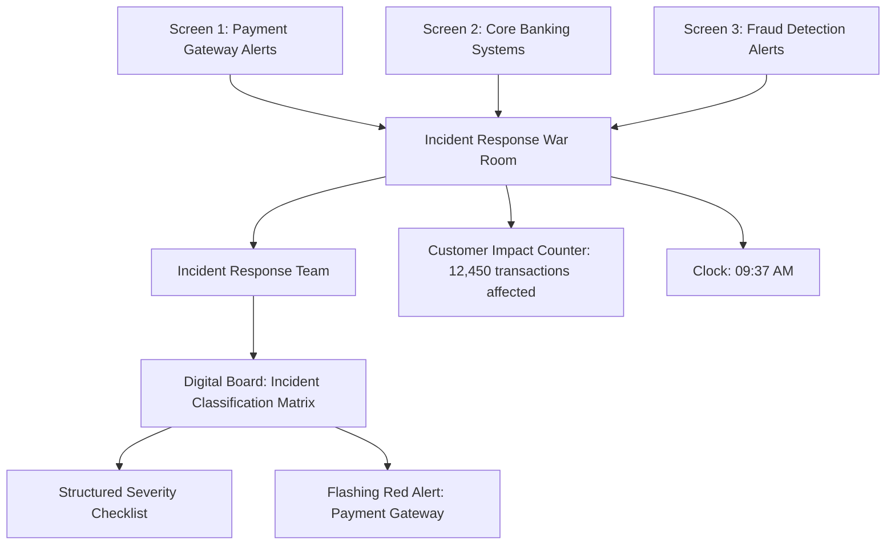

This visual aid complements the description, illustrating the interconnected elements of the incident response environment and emphasizing the team's focus on structured incident management.
### Teaching Narrative
Understanding the anatomy of banking incidents begins with proper classification. Unlike traditional IT monitoring which often uses technical thresholds to determine severity (CPU > 90% = High), SRE incident classification in banking must integrate both technical signals and business impact. The Severity Spectrum framework provides a structured approach to incident classification that accounts for the unique nature of financial services disruptions.

In the banking domain, incidents fall across a spectrum from P1 (critical/all-hands) to P5 (minor/informational). This classification isn't arbitrary - it's an evidence-based assessment combining:

1. Functional impact (which banking services are affected)
2. Customer reach (how many users or transactions are impacted)
3. Financial exposure (actual or potential monetary impact)
4. Regulatory implications (compliance or reporting requirements triggered)
5. Duration and trend (is the situation stable, improving, or degrading)

This multi-dimensional approach transforms vague terms like "major incident" into precise, actionable classifications that drive appropriate response protocols. When transitioning from production support to SRE, mastering this classification framework is essential to ensure proportional response and resource allocation.
### Common Example of the Problem

First National Bank's mobile banking application experienced intermittent login failures during morning peak hours. The initial support team classified it as a P3 (moderate) incident based solely on the application error rate metric showing 8% of authentication attempts failing. However, a deeper analysis revealed significant business impacts that were overlooked, warranting a P2 (high) classification instead.

#### Comparison of Initial vs. Corrected Classification

| Aspect                      | Initial Classification (P3)                             | Corrected Classification (P2)                                                                                      |
| --------------------------- | ------------------------------------------------------- | ------------------------------------------------------------------------------------------------------------------ |
| **Functional Impact**       | Login failures affecting 8% of authentication attempts. | Login failures coincided with payroll day, a critical period for mobile banking services.                          |
| **Customer Reach**          | Estimated 5,000 users impacted.                         | 30,000+ customers unable to verify deposits.                                                                       |
| **Financial Exposure**      | No immediate monetary risk identified.                  | Failed logins triggered fraud protection, locking thousands of accounts, creating potential financial disruptions. |
| **Regulatory Implications** | Not considered.                                         | Locking accounts and delayed deposit verification could trigger compliance reviews.                                |
| **Duration**                | 3-hour resolution time deemed acceptable.               | Resolution time exceeded 1-hour target for high-severity incidents.                                                |

The misclassification resulted in insufficient resource allocation and delays in resolution. If correctly classified as a P2 incident, additional resources would have been mobilized, enabling faster response and mitigating customer and business impacts.
### SRE Best Practice: Evidence-Based Investigation

Evidence-based severity classification requires assembling multiple data points rather than relying on a single metric. Effective SREs follow a structured severity assessment protocol, which can be summarized as the following actionable checklist:

#### **Incident Severity Classification Checklist**
1. **Gather Cross-System Metrics**
   - Collect real-time data on:
     - Error rates
     - Affected user counts
     - Transaction volumes
     - Queue backlogs
   - Ensure data is aggregated from all interconnected systems.

2. **Map Service Dependencies**
   - Identify all downstream systems and services potentially affected.
   - Use dependency diagrams or service registries to track cascading impacts.

3. **Quantify Business Impact**
   - Calculate:
     - Financial exposure using standardized impact calculators.
     - Customer impact (e.g., transaction delays or failures).
     - Reputational risks, if applicable.
   - Avoid subjective judgments; rely on quantitative tools.

4. **Apply Classification Decision Trees**
   - Reference predefined decision trees that include:
     - Objective thresholds for severity levels.
     - Clear escalation criteria.
   - Remove ambiguity by adhering to documented thresholds.

5. **Validate with Business Stakeholders**
   - Rapidly consult with business representatives to:
     - Confirm non-technical impacts (e.g., regulatory or compliance factors).
     - Address gaps in technical monitoring data.

6. **Document and Communicate**
   - Record all findings and classification rationale in the incident management system.
   - Share updates with both technical and business teams to maintain alignment.

This structured checklist ensures a consistent, objective approach to incident classification, preventing over-classification (alert fatigue) or under-classification (inadequate response). For example, when First National Bank adopted this framework, their classification accuracy improved from 64% to 91%, significantly enhancing their incident response efficiency.

#### **Incident Classification Decision Flow**
```mermaid
flowchart TD
    A[Incident Detected] --> B[Gather Cross-System Metrics]
    B --> C[Map Service Dependencies]
    C --> D[Quantify Business Impact]
    D --> E{Meets Severity Threshold?}
    E -->|Yes| F[Apply Classification Decision Tree]
    E -->|No| G[Mark as P4/P5 (Minor)]
    F --> H[Validate with Business Stakeholders]
    G --> H
    H --> I[Document and Communicate]
```
This flow ensures that each step aligns with the checklist, enabling SREs to classify incidents with precision and confidence.
### Banking Impact

Incident classification accuracy directly impacts business outcomes across multiple dimensions. The following diagram summarizes the four key impact dimensions and their consequences:

```
Financial Impact       Regulatory Consequences
+--------------------+ +---------------------+
| - Misclassification| | - Non-compliance   |
|   costs $10k-50k   | |   penalties in     |
|   per minute in    | |   millions due to  |
|   delayed value.   | |   unmet protocols. |
|                    | |                    |
| - Accurate clas-   | | - Proper severity  |
|   sification       | |   ensures timely   |
|   optimizes MTTR.  | |   notifications.   |
+--------------------+ +---------------------+

Customer Experience    Operational Efficiency
+--------------------+ +---------------------+
| - Under-classified | | - Over-classifica- |
|   incidents drive  | |   tion wastes      |
|   300% increase in | |   resources.       |
|   call volume and  | |                    |
|   harm NPS scores. | | - Under-classifi-  |
|                    | |   cation extends   |
| - Accurate sever-  | |   outages and MTTR.|
|   ity matches      | |                    |
|   communication to | | - Correctly clas-  |
|   incident gravity.| |   sified incidents |
|                    | |   resolved 40%     |
|                    | |   faster.          |
+--------------------+ +---------------------+
```

**Key Details**:

**Financial Impact**: Proper classification ensures appropriate resource allocation, reducing mean time to resolution (MTTR). For payment processing incidents, each minute of misclassification costs approximately $10,000-50,000 in delayed transaction value.

**Regulatory Consequences**: Banking regulations like PSD2 in Europe and FFIEC guidelines in the US require specific notification protocols based on incident severity. Misclassification can lead to compliance violations with penalties reaching millions of dollars.

**Customer Experience**: Accurate severity assessment ensures customer communication matches incident gravity. Under-classified incidents lead to inadequate customer notifications, increasing call center volume by up to 300% and negatively impacting Net Promoter Scores.

**Operational Efficiency**: Proper classification prevents both resource waste (over-classification) and extended outages (under-classification). Studies show correctly classified incidents are resolved 40% faster than misclassified ones.
### Implementation Guidance
To implement an effective banking incident classification framework:

1. **Develop a multi-dimensional severity matrix**: Create a banking-specific classification matrix that incorporates technical metrics, customer impact, financial exposure, and regulatory requirements. Include clear thresholds for each severity level (P1-P5).

2. **Build automated classification tools**: Implement dashboard widgets that automatically suggest incident severity based on real-time data from monitoring systems, transaction volumes, and customer impact metrics.

3. **Train teams on business context**: Conduct cross-training sessions where technical teams learn the business significance of different banking services and transactions to better assess impact beyond technical metrics.

4. **Establish classification review protocols**: Implement a "classification challenge" process where any team member can request severity reassessment based on new evidence, preventing classification inertia.

5. **Measure classification accuracy**: Track classification changes throughout incident lifecycles and conduct post-incident reviews specifically analyzing whether initial classification was appropriate.
## Panel 2: Transaction Flow Mapping - Understanding Banking System Interconnections
### Scene Description

An SRE team is gathered around a large interactive display showing a complex transaction flow diagram. The visualization traces a customer payment journey across multiple systems: from the mobile app, through the API gateway, authentication service, payment processor, core banking system, to partner banks and finally the central bank settlement. Color-coded paths show the normal flow in green, with one segment highlighted in red indicating an incident area. A senior engineer uses hand gestures to expand a section, revealing detailed dependency relationships between components.

Below is a simplified representation of the transaction flow:

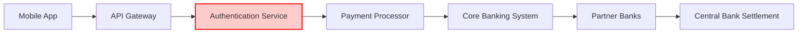

In this diagram:
- The green paths indicate normal transaction flow.
- The red-highlighted "Authentication Service" shows the incident area causing disruptions.
- Dependencies between components are represented by arrows, illustrating how the issue may cascade across the systems.
### Teaching Narrative
Traditional monitoring focuses on individual components - databases, servers, or applications. In contrast, SRE incident analysis requires understanding the complete transaction flow across interconnected banking systems. This systemic view is crucial because banking incidents rarely exist in isolation; they cascade through integrated services.

Transaction Flow Mapping is a critical SRE practice for understanding banking incidents. It transforms abstract technical failures into visible disruptions of specific financial journeys. By mapping how transactions traverse systems, SREs can quickly:

1. Identify upstream and downstream dependencies
2. Recognize failure points in customer journeys
3. Determine the true scope of an incident
4. Predict cascade effects before they occur

When a banking incident occurs, the flow map becomes the central investigation tool, revealing how a localized issue (like an authentication service slowdown) impacts broader business functions (payment processing, account access). For former production support engineers, developing this systemic visualization skill marks a key evolution toward SRE thinking, moving beyond component-level troubleshooting to transaction-level analysis.
### Common Example of the Problem

Metropolitan Trust Bank experienced a significant incident when their international wire transfer system started showing delays of 30+ minutes. Initially, the investigation focused entirely on the wire transfer application itself. Engineers examined app server logs, database performance, and network connectivity to the SWIFT network, but after three hours, no resolution was found.

An SRE joined the investigation and immediately requested a transaction flow map. This revealed critical insights: the bottleneck was not in the wire transfer application itself but in the Anti-Money Laundering (AML) screening service. A recent configuration change in the AML service caused it to time out, which delayed compliance clearance and, in turn, queued wire transfers. Without transaction flow mapping, the team had been troubleshooting the symptom rather than the root cause—focusing on the wrong system entirely.

#### Incident Timeline

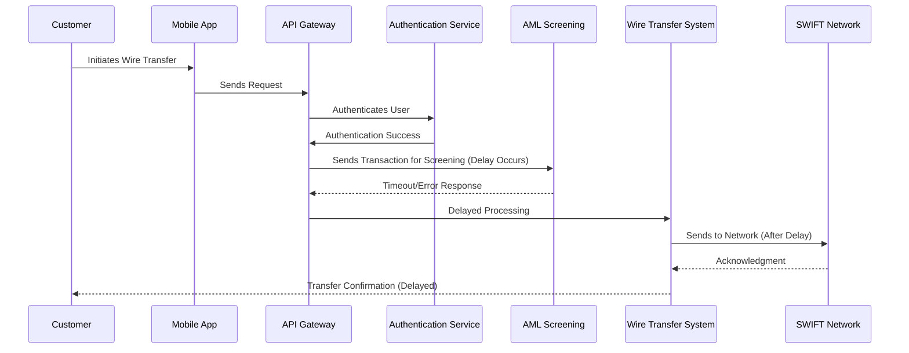

#### Key Investigation Steps

1. **Initial Focus**: Engineers examined wire transfer application server logs, database performance, and SWIFT network connectivity.
2. **SRE Intervention**: The SRE requested a transaction flow map to identify upstream and downstream dependencies.
3. **Root Cause Identified**: The flow map highlighted the AML service as the bottleneck. A configuration change in the AML service caused transaction timeouts, which propagated delays through the system.
4. **Resolution**: The configuration was rolled back, restoring normal transaction flow.

By using the transaction flow map, the team shifted from component-level troubleshooting to a systemic analysis, quickly pinpointing the true failure point and resolving the incident.
### SRE Best Practice: Evidence-Based Investigation

Effective transaction flow mapping for banking incidents requires a structured approach to evidence collection and analysis. Use the following checklist to guide investigations and ensure best practices are consistently applied:

| **Practice**                      | **Description**                                                                                      | **Implementation Tips**                                                                 |
| --------------------------------- | ---------------------------------------------------------------------------------------------------- | --------------------------------------------------------------------------------------- |
| **Distributed tracing**           | Deploy tracing instrumentation across all services to capture transaction paths, timing, and errors. | Use open standards like OpenTelemetry for compatibility across diverse systems.         |
| **Critical path analysis**        | Identify and monitor systems critical to transaction completion.                                     | Focus on components directly impacting customer journeys, not just supporting services. |
| **Dependency graph maintenance**  | Update service dependency maps regularly using automated tools.                                      | Avoid manual updates; leverage tools like service mesh visualizers for real-time data.  |
| **Transaction replay testing**    | Simulate customer transactions to validate flow maps during investigations.                          | Create synthetic transactions for edge cases to stress-test dependencies.               |
| **Correlation engine deployment** | Implement tools to link logs and metrics from all components in a transaction.                       | Use AI/ML-based correlation systems to detect patterns and anomalies efficiently.       |

#### Example in Action
When Capital Regional Bank implemented these practices, they achieved a dramatic reduction in Mean Time To Identify (MTTI) for complex incidents: from 97 minutes to 23 minutes. This improvement was driven by their ability to quickly pinpoint failure points within the transaction flow.

#### Quick Reference Flow
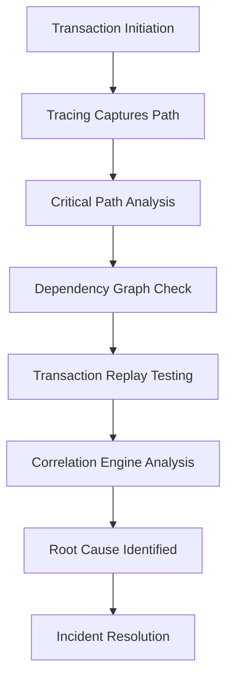

This structured approach empowers SREs to transition from reactive troubleshooting to proactive, evidence-based investigation, ensuring quicker and more accurate incident responses.
### Banking Impact

Inaccurate or missing transaction flow maps create significant business consequences in banking environments. The table below summarizes these impacts and provides key metrics associated with each:

| **Impact Area**                       | **Description**                                                                                         | **Metric**                                                                |
| ------------------------------------- | ------------------------------------------------------------------------------------------------------- | ------------------------------------------------------------------------- |
| **Extended Outages**                  | Troubleshooting without transaction flow maps relies on trial and error, delaying issue resolution.     | MTTR increases by **70%** on average.                                     |
| **Regulatory Reporting Deficiencies** | Incomplete mapping hampers regulatory incident reporting, risking non-compliance penalties.             | Potential for **regulatory fines**.                                       |
| **Change Risk Exposure**              | Lack of flow maps causes unexpected downstream effects during system changes, increasing failure rates. | Change failure rates rise by **45%**.                                     |
| **Customer Trust Erosion**            | Prolonged resolution times for failed transactions diminish customer confidence and retention.          | **28%** of customers consider switching banks after significant failures. |

These impacts underscore the critical role of accurate transaction flow mapping in maintaining operational resilience, regulatory compliance, and customer trust.
### Implementation Guidance

To implement effective transaction flow mapping in your organization, follow these steps:

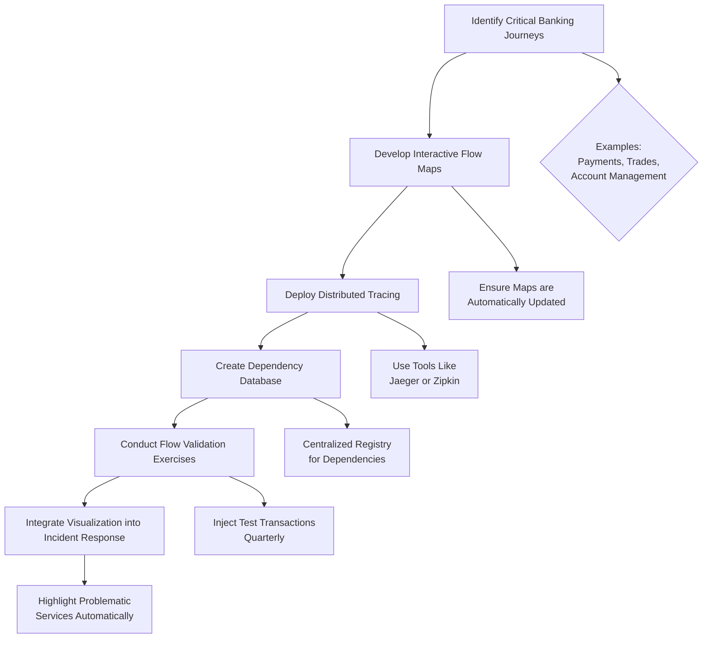

1. **Identify critical banking journeys**: Start by pinpointing the key customer journeys (e.g., payments, trades, account management) that are essential to your business operations.

2. **Create living documentation**: Build interactive transaction flow maps for these critical journeys. Ensure they are automatically updated whenever architectural changes occur, keeping the information always relevant and accurate.

3. **Implement distributed tracing**: Deploy tracing technologies like Jaeger or Zipkin across all microservices. Use consistent correlation IDs to trace transactions throughout their entire lifecycle, ensuring end-to-end visibility.

4. **Build a dependency database**: Establish a centralized service dependency registry. This database should enable development and operations teams to query relationships and understand upstream and downstream impacts during incident investigations.

5. **Conduct regular flow validation**: Schedule quarterly exercises to validate that actual system behavior aligns with documented transaction flows. Inject test transactions and analyze results to identify discrepancies or unexpected behavior.

6. **Integrate flow visualization into incident response**: Embed transaction flow maps directly into your incident response dashboards. These visualizations should automatically highlight problematic services based on metrics like error rates or latency, making it easier to pinpoint issues during an incident.

By following this systematic approach, your organization can effectively implement transaction flow mapping, turning it into a powerful tool for incident analysis and resolution.
## Panel 3: Impact Quantification - Measuring What Matters in Banking Incidents
### Scene Description

The meeting room is centered around a table where business and technical teams sit facing each other, fostering collaboration. On the wall, a large dashboard displays two distinct sections of metrics:

- **Technical Metrics:** Error rates, latency, CPU usage, and system availability.
- **Business Metrics:** Transaction value affected, customer impact count, revenue at risk, and regulatory compliance status.

An SRE stands at the front, actively bridging the gap between these two domains. Using a whiteboard or digital tool, the SRE draws connecting lines between specific technical failures and their corresponding business impacts. For instance, an API failure is linked to a financial exposure figure, and a latency spike is tied to customer experience degradation. A banking business analyst, seated nearby, nods in understanding as they see the relationships clearly mapped.

On the table, a tablet is open to a calculator application, displaying real-time financial impact formulas. The room reflects a dynamic, problem-solving atmosphere, with both teams engaged in understanding and quantifying the incident's true impact.

Below is a text-based representation of the dashboard and SRE activity:

```
+-------------------------------+-------------------------------+
|       Technical Metrics       |        Business Metrics       |
|-------------------------------|-------------------------------|
| - Error Rates                | - Transaction Value Affected  |
| - Latency Spikes             | - Customer Impact Count       |
| - CPU Usage                  | - Revenue at Risk             |
| - System Availability        | - Regulatory Compliance       |
+-------------------------------+-------------------------------+

  [SRE] ---> [Technical Failure] ---> [Business Impact]

  Example:
  [Failed API Calls] ---> [€1.2M Financial Risk]
  [Latency Spike] ---> [Customer Experience Degradation]
```
### Teaching Narrative
A fundamental shift in moving from production support to SRE is mastering the art of impact quantification. Traditional monitoring focuses on technical metrics like availability percentages or system errors. SRE incident analysis requires translating these technical signals into business impact metrics that banking executives, regulators, and customers care about.

Impact quantification in banking requires developing a "bilingual" capability - speaking both technical and financial languages. This means converting:

- Error rates into affected transaction values
- Latency spikes into customer experience degradation
- Failed API calls into financial exposure figures
- System availability into regulatory compliance status

This translation capability transforms incident response from a technical exercise to a business-aligned function. When quantifying impact, precision matters - "approximately 2,000 payment transactions worth €1.2M failed during the 23-minute incident window" is significantly more valuable than "the payment system had issues."

For banking SREs, this quantification becomes the foundation for incident prioritization, resource allocation, and postmortem analysis. It drives decisions about whether to wake additional teams at 3AM or implement potentially risky mitigations during trading hours.
### Common Example of the Problem

Global Investments Bank experienced a 45-minute degradation in their trading platform. The infrastructure team reported the incident as "database latency issue affecting the trading system with 70% of queries exceeding SLO thresholds." However, this technical description failed to convey the full business reality: 342 institutional clients were unable to execute trades during a volatile market period, resulting in an estimated $1.3M in lost commissions and potentially millions more in client portfolio impact. When the report reached the CTO with only the technical metrics, the response was inadequate - a standard database team response rather than the all-hands emergency that the business impact warranted. The disconnection between technical metrics and business impact led to both an extended resolution time and damaged client relationships.

To illustrate the gap between the technical and business perspectives, the following table highlights the disconnect:

| **Aspect**           | **Technical Metrics Reported**                      | **Business Impact Metrics**                                             |
| -------------------- | --------------------------------------------------- | ----------------------------------------------------------------------- |
| Incident Description | Database latency issue affecting the trading system | 342 institutional clients unable to execute trades in a volatile market |
| Metrics Focus        | 70% of queries exceeding SLO thresholds             | $1.3M in lost commissions, millions more in client portfolio impact     |
| Stakeholder Response | Standard database team response                     | All-hands emergency response required                                   |
| Consequences         | Prolonged resolution time, limited urgency          | Extended downtime, damaged client relationships                         |

This example underscores the critical need for SREs to bridge the gap between technical metrics and their corresponding business impacts, ensuring incident reports are actionable and aligned with organizational priorities.
### SRE Best Practice: Evidence-Based Investigation

Accurate impact quantification during banking incidents requires systematic data collection across both technical and business dimensions. To operationalize this, SREs can follow these best practices:

#### Checklist for Evidence-Based Investigation:
- **Real-time Business Metric Integration**:
  - Ensure dashboards automatically correlate technical failures with business metrics like transaction value, affected customers, and revenue impact.
  - Validate integration accuracy through regular testing and audits.

- **Segmentation Analysis**:
  - Break down affected users by customer type (e.g., retail, wealth management, institutional) to provide granular insights.
  - Analyze transaction categories separately to avoid overgeneralization of impact.

- **Financial Exposure Calculation**:
  - Use standardized formulas that include direct revenue loss, compensation costs, potential penalties, and market opportunity costs.
  - Document assumptions and variables used in the calculations for transparency.

- **Time-Boxed Impact Updates**:
  - Schedule regular updates (every 15-30 minutes during critical incidents) to refresh impact assessments as the situation evolves.
  - Clearly communicate updates to stakeholders, emphasizing changes from prior estimates.

- **Counterfactual Comparison**:
  - Compare incident metrics against baseline activity for the same time period to quantify deviations from normal operations.
  - Use historical data to refine baseline accuracy over time.

#### Workflow Representation:
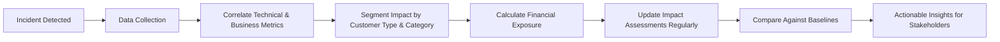

When Eastern Regional Bank adopted these practices, they achieved a 64% improvement in executive decision-making speed during incidents by delivering impact metrics that directly conveyed business significance.
### Banking Impact

Inadequate impact quantification creates several significant business consequences. The following flow illustrates how insufficient understanding of technical failures' business implications can propagate negative outcomes:

```
Inadequate Impact Quantification
            |
            v
  Unclear Business Priorities
            |
            v
  Misallocated Resources -----> High-Value Incidents Underfunded
            |                                  |
            |                                  v
            |                        Low-Priority Issues Overfunded
            |
            v
  Delayed Escalations --------> Prolonged Incident Durations (35-50%)
            |
            v
  Inaccurate Customer Communication
            |
            v
  Reputation Damage ------> Customer Attrition
            |
            v
  Regulatory Non-Compliance
            |
            v
  Under-Reporting or Over-Reporting Risks
```

**Key Consequences:**

- **Misallocated Resources**: Without clear business impact metrics, high-value incidents may receive insufficient resources, while technically interesting but low-impact issues consume disproportionate attention.

- **Delayed Escalations**: Technical teams often fail to escalate appropriately when they don't recognize the business magnitude of technical failures, extending impact duration by 35-50% on average.

- **Reputation Damage**: Inaccurate impact assessment leads to inadequate customer communication and compensation, with studies showing this is a primary factor in post-incident customer attrition.

- **Regulatory Exposure**: Financial regulations increasingly require specific reporting based on impact thresholds. Inaccurate quantification can lead to both under-reporting (regulatory violations) and over-reporting (unnecessary disclosure).

By addressing these gaps in impact quantification, banking SREs can ensure tighter alignment between technical incident response and business priorities.
### Implementation Guidance

To implement effective impact quantification in your organization:

1. **Create translation formulas**: Develop and document clear formulas that convert technical metrics into business impact figures (e.g., how API error rates translate to transaction failures and financial impact).

2. **Build a real-time impact dashboard**: Implement executive-facing dashboards that automatically calculate and display business impacts during incidents, updated continuously from monitoring systems.

3. **Establish customer impact segments**: Define customer segments with different business value and regulatory implications, ensuring incidents affecting high-value or vulnerable customers receive appropriate prioritization.

4. **Train teams on business context**: Conduct regular sessions where technical teams learn how to assess business impact, including which metrics matter most to different business stakeholders.

5. **Implement impact verification loops**: Create feedback mechanisms where business representatives validate technical teams' impact assessments during incidents to ensure accuracy and comprehensiveness.

#### Example Scenario: Translating Impact in a Payment System Outage

Imagine a banking organization's payment system experiences a 15-minute outage during peak business hours. Here’s how the guidance could be applied:

- **Translation Formulas**: The organization has predefined formulas linking API error rates to transaction failures. Logs show 2,500 payment requests failed during the downtime, with an average transaction value of €600. The formula calculates a total financial impact of €1.5M.

- **Real-Time Dashboard**: The incident response dashboard immediately displays this €1.5M impact and highlights that 1,800 affected transactions involve high-value business accounts.

- **Customer Impact Segments**: The team identifies that 70% of the failed transactions belong to high-value customers and initiates a priority response plan to address these accounts first.

- **Team Training on Business Context**: Thanks to prior business-context training, the SRE team recognizes the regulatory implications of the incident since several transactions were flagged as urgent by corporate clients. They escalate the issue to compliance and legal teams in real-time.

- **Impact Verification Loops**: During the post-incident review, business analysts confirm the €1.5M impact assessment was accurate, ensuring alignment between technical data and financial implications. Lessons learned are fed back into the translation formulas to refine future calculations.

This example demonstrates how applying these steps not only quantifies the impact but also drives timely and business-aligned decision-making during critical incidents.
## Panel 4: Temporal Analysis - The Lifecycle of Banking Incidents
### Scene Description

A timeline visualization stretches across a wall, showing the complete lifecycle of a banking incident from initial detection to full resolution. The timeline is marked with key events: first alert, incident declaration, investigation milestones, mitigation attempts (both successful and failed), communication points, and final resolution. A small team reviews the timeline while adding annotations at various points. One engineer uses a laser pointer to highlight patterns in the temporal data, particularly focusing on the gap between first symptoms and incident declaration.

Below is a text-based representation of the timeline layout to illustrate its structure:

```
| First Alert | --> | Incident Declaration | --> | Investigation Milestones | --> | Mitigation Attempts | --> | Communication Points | --> | Final Resolution |
      ^                                                                                                           
  Detection Gap                                                                                                   
```

Each segment of the timeline represents a phase in the incident lifecycle, with annotations highlighting key actions, decisions, and outcomes. The "Detection Gap" emphasizes the critical time between the first symptoms and the declaration of the incident. This visual representation helps the team identify patterns and areas for improvement in incident response processes.
### Teaching Narrative
Banking incidents unfold over time, and understanding their temporal dynamics is crucial for effective SRE response. Unlike production support, which often focuses on point-in-time troubleshooting, SRE incident analysis requires comprehensive temporal mapping - understanding how incidents evolve from initial symptoms through escalation, response, mitigation, and resolution.

Temporal analysis transforms incident response from reactive firefighting to strategic management. By mapping the incident lifecycle, SREs can identify:

1. Detection gaps - how long between first symptoms and alert triggering
2. Response efficiency - time from alert to appropriate action
3. Escalation patterns - how quickly and effectively was the incident escalated
4. Mitigation effectiveness - which actions improved or worsened the situation
5. Resolution pathways - what ultimately solved the problem

In banking systems, where timing is often critically important (trading hours, payment processing windows, end-of-day settlements), temporal analysis provides essential context. A 5-minute outage during peak trading hours may have more significant impact than a 30-minute outage during off-hours. Similarly, incidents that span critical financial boundaries (crossing midnight for settlement systems or crossing quarter-end for reporting systems) have unique implications that must be understood.
### Common Example of the Problem

Investment One Bank experienced a core banking system outage that was initially reported to last 90 minutes. However, a detailed temporal analysis revealed a more complex sequence of events. Below is a timeline illustrating the lifecycle of the incident:

```mermaid
gantt
    title Timeline of the Core Banking System Outage
    dateFormat  HH:mm
    axisFormat  %H:%M
    section Incident Lifecycle
    First Symptoms          :crit, symptoms, 10:13, 47min
    Alert Triggered         :crit, alert, 11:00, 1min
    Escalation Delay        :crit, escalation, 11:01, 22min
    Mitigation Attempt      :crit, mitigation, 11:23, 15min
    Resolution Achieved     :crit, resolution, 11:38, 0min
```

Here’s the breakdown:

1. **First Symptoms (10:13)**: Database connections began gradually exhausting, hinting at an underlying issue. These symptoms went unnoticed for 47 minutes.

2. **Alert Triggered (11:00)**: An alert was finally triggered when connection thresholds were breached. However, detection gaps allowed the problem to worsen unseen.

3. **Escalation Delay (11:01 - 11:23)**: Due to an incorrect escalation process, it took 22 minutes to engage the appropriate database team. This delay significantly impacted the response timeline.

4. **Mitigation Attempt (11:23)**: The proposed mitigation—restarting application servers—unexpectedly caused a connection spike, worsening the situation for the next 15 minutes.

5. **Resolution Achieved (11:38)**: After correctly identifying the issue, the team restored normal operations. However, the entire incident spanned nearly three hours when accounting for the unnoticed symptoms.

Additionally, temporal analysis uncovered a critical insight: similar connection patterns had occurred three times in the previous month without reaching alert thresholds. This demonstrated missed opportunities for early detection and proactive intervention.

Without this temporal breakdown, the SRE team might have focused solely on the database connection issue. Instead, they identified systemic gaps in monitoring and escalation processes that exacerbated the incident's duration and impact.
### SRE Best Practice: Evidence-Based Investigation

Effective temporal analysis of banking incidents requires structured data collection and visualization. The following checklist summarizes the five key practices for evidence-based investigation, providing a practical guide for incident analysis:

#### Evidence-Based Investigation Checklist:
- **[ ] Multi-source timeline construction**: Combine timestamps from monitoring systems, alerting platforms, ticketing systems, chat logs, and incident management tools to create a comprehensive incident timeline with second-level precision.
- **[ ] Precursor identification**: Analyze telemetry data from before the official incident start to identify early warning signs and symptoms that could enable earlier detection in future incidents.
- **[ ] Action-effect correlation**: Map each response action to subsequent changes in system behavior to determine which interventions helped, harmed, or had no effect on the incident trajectory.
- **[ ] Communication flow tracking**: Document when information was shared with different stakeholders to identify communication bottlenecks that delayed effective response.
- **[ ] Business context overlay**: Incorporate business timing contexts like trading hours, batch processing windows, and settlement periods to assess the true business impact of the incident timing.

#### Key Insight:
When Universal Banking Corporation implemented systematic temporal analysis, they identified that 40% of their incident duration was consumed by non-technical factors like delayed escalations, communication gaps, and ineffective initial response actions.

By following this checklist, SRE teams can ensure their investigations are both thorough and actionable, leading to faster resolution times and improved prevention strategies.
### Banking Impact

Poor temporal understanding of incidents creates significant business consequences. The table below summarizes four key consequences, along with examples or metrics that highlight their impact:

| **Consequence**                      | **Description**                                                                                                                                                      | **Examples/Metrics**                                                                                                                                                  |
| ------------------------------------ | -------------------------------------------------------------------------------------------------------------------------------------------------------------------- | --------------------------------------------------------------------------------------------------------------------------------------------------------------------- |
| **Extended Outages**                 | Without understanding where time is consumed during incidents, banks cannot systematically reduce MTTR, directly impacting customer experience and financial losses. | - Prolonged outages during peak trading hours causing millions in lost transactions.<br>- MTTR increases by 20% during unclear incident timelines.                    |
| **Missed Prevention Opportunities**  | Failing to identify incident precursors means losing the opportunity to build early detection mechanisms, reducing major incident frequency.                         | - Studies show precursor detection reduces incident frequency by 30-40%.<br>- Example: Early detection of API latency spikes prevents downstream payment failures.    |
| **Ineffective Process Improvements** | Lack of insight into time-consuming response steps leads to misguided improvement efforts, with minimal MTTR reductions despite investment.                          | - Investment in automation for low-impact areas results in <5% MTTR improvement.<br>- Key delays often occur in manual escalation processes, which remain overlooked. |
| **Recurrence Risk**                  | Without temporal pattern recognition, recurring incidents arise from addressing symptoms rather than root causes.                                                    | - Example: A recurring database lock issue causing outages every quarter-end.<br>- Failure to identify operational patterns extends resolution timelines by 15%.      |

By systematically analyzing the temporal dynamics of incidents, banks can mitigate these risks, optimize their response processes, and improve overall system reliability.
### Implementation Guidance

To implement effective temporal analysis in your organization, follow these steps:

#### Step-by-Step Process for Implementing Temporal Analysis

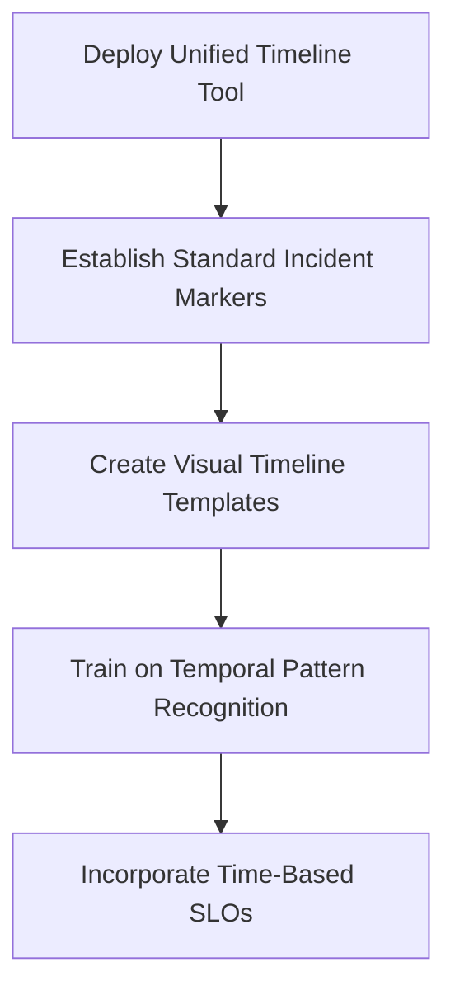

1. **Deploy a unified timeline tool**:
   - Implement a centralized tool that integrates timestamps from various sources (e.g., monitoring systems, chat logs, ticketing platforms) to generate detailed incident timelines automatically.
   - Ensure the tool supports real-time updates and visualizations.

2. **Establish standard incident markers**:
   - Define a set of mandatory events to track for all incidents, such as:
     - First detection of symptoms
     - Incident declaration
     - Escalation events
     - Mitigation attempts (both successful and failed)
     - Final resolution
   - This ensures consistency across incidents and enables comparative analysis.

3. **Create visual timeline templates**:
   - Develop reusable timeline templates that emphasize critical temporal patterns, such as:
     - Detection gaps (time between first symptom and alert)
     - Escalation delays (time taken to involve appropriate teams)
     - Mitigation effectiveness (time to stabilize systems).
   - Use color coding, annotations, or time markers to highlight these patterns.

4. **Train on temporal pattern recognition**:
   - Teach teams to identify common temporal incident patterns, including:
     - "Slow burn": Gradually worsening conditions that may go unnoticed without temporal analysis.
     - "Flapping": Recurring oscillations between healthy and degraded states.
     - "Cascade": Rapidly escalating failures that propagate across systems.
   - Use real-world examples from past incidents to illustrate these patterns.

5. **Incorporate time-based SLOs**:
   - Define internal service level objectives (SLOs) for critical phases of incident response, such as:
     - Time to acknowledge (TTA): How quickly alerts are acknowledged.
     - Time to engage (TTE): How long it takes to involve the correct team.
     - Time to first mitigation attempt: Speed of the initial response action.
   - Regularly review and refine these SLOs based on incident postmortems to drive performance improvements.
## Panel 5: Incident Archaeology - Reconstructing Banking System Failures
### Scene Description

A digital forensics lab environment bustling with methodical activity as SREs reconstruct a complex incident. The lab is organized into distinct zones, each equipped with specialized tools for incident analysis:

- **Visualization Zone**: Multiple large screens display synchronized logs, metrics, and traces from various banking systems. One engineer, stationed here, manipulates an interactive 3D visualization that dynamically shows how failures propagated across interconnected services. The visualization uses color-coded lines and nodes to depict service interactions and failure paths.

- **Digital Dig Table**: At the center of the room is the "digital dig" table, a multi-touch surface where system state snapshots are arranged in chronological layers. An engineer carefully examines these layers, uncovering critical state changes and their relationships over time. This zone resembles an archaeologist's excavation site, with digital artifacts laid out systematically.

- **Narrative Construction Desk**: Another team member works at a dedicated desk, compiling a detailed narrative titled "Incident Reconstruction: Market Data Latency Cascade Event." This document includes precise timestamps, service correlations, and causal links. A large whiteboard nearby displays a high-level incident timeline for reference.

Below is a simplified text-based layout representing the lab setup:

```
+------------------+        +------------------+        +-----------------------+
|                  |        |                  |        |                       |
| Visualization    |        | Digital Dig      |        | Narrative Construction|
| Zone             |        | Table            |        | Desk                  |
|                  |        |                  |        |                       |
+------------------+        +------------------+        +-----------------------+
          |                           |                             |
          v                           v                             v
   3D Visualization        Chronological Layers         Incident Narrative
   of Failure Paths          of System States            and Timeline
```

This collaborative lab setup enables the team to synthesize evidence, correlate events, and reconstruct the incident with precision. Together, these zones highlight the systematic and forensic approach central to incident archaeology.
### Teaching Narrative
When banking incidents occur, they leave digital evidence across systems - logs, metrics, traces, and state changes. Traditional production support might examine individual log files or error messages, but SRE incident analysis requires methodical "archaeology" - reconstructing what happened by synthesizing evidence from multiple sources.

Incident Archaeology transforms incident response from opinion-based debates ("I think the database was slow") to evidence-based investigation ("The database read latency increased by 240ms at 14:23:05, seven seconds after the cache eviction event"). This methodical reconstruction involves:

1. Evidence collection - gathering logs, metrics, and state changes across systems
2. Timeline correlation - aligning events from different systems with precise timestamps
3. Causal chain identification - mapping how failures propagated through systems
4. State reconstruction - understanding what the system state was at key moments
5. Gap analysis - identifying missing information needed for complete understanding

For banking systems, where transactions may flow through dozens of services and multiple organizational boundaries, this archaeological approach is essential. It allows SREs to differentiate between root causes, contributing factors, and coincidental issues - preventing the common trap of addressing symptoms rather than causes.

The skill of incident archaeology marks a key evolution from production support to SRE thinking - moving from "what's broken now" to "how did this failure emerge and propagate through our financial systems."
### Common Example of the Problem

Capital Markets Bank experienced a critical incident where their trading platform began rejecting 30% of order submissions during peak market hours. The initial response was chaotic, with multiple teams offering conflicting theories: network congestion, database locking, insufficient application server capacity, and API gateway timeouts. Without a structured archaeological approach, teams began implementing various fixes simultaneously, some of which compounded the problem.

After an hour of deteriorating service, a senior SRE took over and initiated a formal incident archaeology process. By methodically reconstructing the sequence of events across all systems, the team discovered that the actual root cause was a configuration change to the order validation service that had been deployed 43 minutes before the first symptoms appeared. The configuration had reduced the connection pool size, which became a bottleneck only when trading volume hit peak levels. The incident archaeology process revealed not only the technical cause but also the deployment process gap that had allowed an untested configuration change to reach production.

Below is a timeline reconstruction of the incident, showing key events and their relationships:

```mermaid
timeline
    title Incident Timeline: Market Order Rejection Issue
    09:37:00 Configuration change deployed to the order validation service
    10:20:00 Peak trading volume begins
    10:23:05 First order rejection detected (symptom emerges)
    10:25:00 Teams propose conflicting theories: network, database, API gateway
    10:30:00 Improvised fixes begin, worsening the issue
    10:40:00 Senior SRE initiates incident archaeology process
    10:50:00 Evidence points to reduced connection pool size in order validation
    11:00:00 Root cause identified and rollback initiated
    11:15:00 Service stabilized, contributing factors documented
```

This timeline illustrates how incident archaeology transformed the response from chaotic guesswork to a structured, evidence-based investigation. By aligning events across systems and identifying causal relationships, the team was able to pinpoint the root issue and address the process gap that allowed it to occur. This methodical approach prevented further disruptions and provided actionable insights to improve future deployments.
### SRE Best Practice: Evidence-Based Investigation

Effective incident archaeology in banking systems requires systematic evidence collection and analysis. Follow these best practices to enable evidence-based investigations:

#### Evidence-Based Investigation Checklist:
- **Comprehensive Logging Strategy**:
  - [ ] Ensure all systems implement standardized logging.
  - [ ] Use consistent fields, such as correlation IDs, timestamp formats, and severity levels.
  - [ ] Regularly audit logs for completeness and adherence to standards.

- **State Snapshot Preservation**:
  - [ ] Automate point-in-time system state captures when incidents are declared.
  - [ ] Include critical artifacts such as configuration files, environment variables, and runtime parameters.
  - [ ] Test snapshot systems periodically to ensure reliability during incidents.

- **Centralized Evidence Collection**:
  - [ ] Set up automated processes to gather logs, metrics, alerts, deployment records, and change tickets.
  - [ ] Use a central repository for storing incident-related evidence.
  - [ ] Validate that evidence is accessible and indexed for quick retrieval.

- **Timeline Reconstruction Tooling**:
  - [ ] Develop or adopt tools to correlate events across different systems.
  - [ ] Normalize timestamps to create a unified timeline.
  - [ ] Use tooling to identify causal relationships between actions and system responses.

- **Gap Identification Protocols**:
  - [ ] Regularly review incidents to uncover monitoring blind spots.
  - [ ] Document missing critical evidence and ensure monitoring improvements are implemented.
  - [ ] Establish feedback loops to validate that gaps are addressed.

#### Example Outcome:
When Financial Services Group implemented these practices, they reduced their average time to identify root causes from 4.3 hours to 67 minutes and significantly improved the accuracy of their causal analysis.

By applying this checklist, SRE teams can consistently approach incident archaeology with a structured and evidence-based methodology, ensuring thorough and accurate reconstructions of system failures.
### Banking Impact

Inadequate incident archaeology creates significant business consequences that impact both operational resilience and regulatory compliance. The table below summarizes these consequences alongside their impacts and examples:

| **Business Consequence**    | **Impact**                                                                                  | **Example**                                                                                             |
| --------------------------- | ------------------------------------------------------------------------------------------- | ------------------------------------------------------------------------------------------------------- |
| **Recurring Incidents**     | Underlying issues remain unresolved, leading to repeated failures.                          | A transaction processing service experiences the same cache eviction issue every quarter.               |
| **Extended Recovery Times** | Outages last longer due to symptomatic fixes that fail under changing conditions.           | A temporary database index adjustment reduces latency but causes a new failure under peak loads.        |
| **Misguided Investments**   | Resources are wasted addressing incorrect root causes, leaving vulnerabilities unaddressed. | Millions spent scaling a database cluster, while the root cause was an inefficient query pattern.       |
| **Regulatory Exposure**     | Incomplete incident reporting increases the risk of regulatory penalties.                   | A financial regulator issues a fine due to missing evidence in the reconstruction of a payment failure. |

Effective incident archaeology mitigates these risks by enabling SREs to identify true root causes, reduce recovery times, and meet regulatory requirements with comprehensive evidence-based reporting.
### Implementation Guidance

To implement effective incident archaeology in your organization:

1. **Create an evidence preservation protocol**:  
   Develop and document standard procedures for collecting and preserving incident evidence. Use automated scripts to ensure consistency and speed during critical incidents. Below is an example Python script for capturing logs, metrics, and configuration snapshots:

   ```python
   import os
   import time
   import shutil

   # Define directories to collect evidence from
   LOG_DIR = "/var/log"
   METRICS_DIR = "/opt/metrics"
   CONFIG_DIR = "/etc/configs"
   OUTPUT_DIR = f"/incident_evidence/{int(time.time())}"

   # Function to copy directory contents
   def copy_evidence(source_dir, target_dir):
       if os.path.exists(source_dir):
           shutil.copytree(source_dir, target_dir)
           print(f"Copied evidence from {source_dir} to {target_dir}")
       else:
           print(f"Source directory {source_dir} does not exist!")

   # Create output directory
   os.makedirs(OUTPUT_DIR, exist_ok=True)

   # Collect evidence
   copy_evidence(LOG_DIR, os.path.join(OUTPUT_DIR, "logs"))
   copy_evidence(METRICS_DIR, os.path.join(OUTPUT_DIR, "metrics"))
   copy_evidence(CONFIG_DIR, os.path.join(OUTPUT_DIR, "configs"))

   print(f"Evidence collection complete. Files saved to {OUTPUT_DIR}")
   ```

2. **Implement correlation infrastructure**:  
   Deploy log aggregation and correlation systems that can automatically connect events across different systems. Use a workflow like the following to align events with shared identifiers (e.g., transaction IDs, request IDs):

   ```mermaid
   flowchart TD
       A[Log Aggregation System] --> B[Correlation Engine]
       B --> C[Identify Shared Identifiers]
       C --> D[Align Events by Timestamps]
       D --> E[Generate Unified View]
   ```

   This infrastructure ensures that events from diverse systems can be reliably linked and analyzed together.

3. **Build visualization capabilities**:  
   Develop timeline visualization tools to display events from multiple systems on a unified timeline. Such tools should support zooming, filtering, and event annotation to make patterns and cause-effect relationships visually apparent.

4. **Train archaeological thinking**:  
   Educate teams on forensic investigation techniques, teaching them to distinguish between correlation and causation. Encourage the use of standardized templates for incident narratives to promote structured analysis and reduce cognitive bias. A template might include sections such as:
   - Timeline of events
   - Primary failure mode
   - Contributing factors
   - Missing evidence

5. **Establish reconstruction reviews**:  
   Include dedicated "evidence quality" sections in postmortem reviews to systematically identify what evidence was missing or difficult to obtain. Use a continuous improvement workflow like the following to enhance observability over time:

   ```mermaid
   flowchart TD
       F[Postmortem Evidence Analysis] --> G[Identify Gaps in Evidence]
       G --> H[Update Observability Requirements]
       H --> I[Enhance Monitoring and Logging]
       I --> F
   ```

By combining automation, structured workflows, and team education, your organization can evolve from reactive troubleshooting to a proactive, evidence-driven approach to incident reconstruction.
## Panel 6: Stakeholder Impact Mapping - The Human Side of Banking Incidents
### Scene Description

A collaborative workshop where SREs are creating a comprehensive stakeholder impact map for a recent incident. The room features a large touchscreen wall displaying concentric circles, visually representing different stakeholder groups. The layout is as follows:

```
                     [ Customers | Regulators ]
                             Outer Circle
                             (High-Level Impact)

                 [ Business Units | Partners ]
                         Middle Circle
                      (Operational Impact)

        [ Internal Teams: Ops | Dev | Risk ]
                  Inner Circle
             (Direct Technical Impact)
```

Each circle is divided into segments corresponding to specific stakeholder groups, with color-coding indicating impact severity (e.g., red for critical, orange for moderate, and yellow for low impact). Team members actively collaborate by adding detailed impact notes directly onto the map. Special focus is given to regulatory reporting requirements, with compliance reference numbers highlighted on the segments where applicable.

This visual representation helps the team systematically analyze and document the human impact of the incident, ensuring no stakeholder group is overlooked.
### Teaching Narrative
Banking incidents don't just affect systems - they affect people. Traditional monitoring focuses primarily on technical components, but SRE incident analysis must comprehensively map human stakeholder impacts. This stakeholder-centric view transforms incident handling from a purely technical exercise into a business-aligned, customer-focused discipline.

Stakeholder Impact Mapping creates a comprehensive view of who is affected by an incident and how. In banking environments, this typically includes:

1. Internal technical teams - operations, development, infrastructure
2. Business units - retail banking, trading, lending, treasury
3. Customers - segmented by type, region, or impact level
4. Partners - payment processors, correspondent banks, service providers
5. Regulators - financial authorities, central banks, data protection agencies

For each stakeholder group, SREs must understand:

- What specific impact they experience
- When and how they should be notified
- What information they need during the incident
- What follow-up they require after resolution

This comprehensive stakeholder mapping is particularly crucial in banking, where incidents trigger specific regulatory reporting requirements, potentially with strict timelines. For example, certain payment system outages must be reported to central banks within specific timeframes, with detailed impact assessments.

For engineers transitioning from production support to SRE, developing this stakeholder consciousness represents a significant evolution - expanding focus from technical systems to the human ecosystem surrounding those systems.
### Common Example of the Problem

Union Federal Bank experienced an encryption certificate expiration that caused their mobile banking application to fail completely for six hours. The technical team diligently worked on the certificate replacement but completely overlooked critical stakeholder impacts, turning a routine certificate renewal failure into a major business incident. Here’s what went wrong:

#### Missed Actions Checklist:
- **Customer Service:** Representatives were not informed about the outage, leaving them unable to address thousands of customer calls and increasing frustration levels.
- **Compliance Team:** The team was not notified of the authentication failure, resulting in a missed mandatory reporting deadline to financial regulators, leading to fines.
- **Marketing Team:** A major campaign promoting the mobile app was launched during the outage, amplifying negative customer sentiment and reducing campaign effectiveness.
- **High-Net-Worth Customers:** No proactive communication was sent to this critical segment, causing dissatisfaction and a spike in account closures in the following week.

While the technical resolution was relatively straightforward, these oversights had significant ripple effects, including regulatory penalties, reputational damage, and customer attrition.

#### Key Takeaway:
Proactively mapping stakeholder impacts and defining notification processes for each group is critical to minimizing the human and business consequences of technical incidents.
### SRE Best Practice: Evidence-Based Investigation

Effective stakeholder impact mapping for banking incidents requires systematic identification and communication practices. The following table summarizes key best practices, their benefits, and examples of application:

| **Best Practice**                           | **Description**                                                                                  | **Benefits**                                                                                   | **Example**                                                                                 |
| ------------------------------------------- | ------------------------------------------------------------------------------------------------ | ---------------------------------------------------------------------------------------------- | ------------------------------------------------------------------------------------------- |
| **Stakeholder Registry Maintenance**        | Maintain a comprehensive registry with contact info, impact thresholds, and preferences.         | Ensures relevant stakeholders are notified promptly and appropriately during incidents.        | A registry includes contacts in retail banking and payment processing teams for outages.    |
| **Impact Assessment Templates**             | Use structured templates to assess stakeholder impacts consistently across incidents.            | Standardizes evaluation processes, reducing missed details and inconsistencies.                | A template predefines fields for customer impact severity and regulatory thresholds.        |
| **Regulatory Requirement Mapping**          | Document reporting requirements, including thresholds, timelines, and required data.             | Minimizes compliance risk and ensures timely, accurate regulatory reporting.                   | A system outage report includes central bank notification within mandated timeframes.       |
| **Customer Segmentation Analysis**          | Implement systems to identify and quantify affected customer segments during incidents.          | Enables prioritization of high-value or vulnerable customer groups for faster resolution.      | A dashboard highlights premium customers impacted by a payment system outage.               |
| **Communication Effectiveness Measurement** | Establish feedback loops to evaluate the quality of stakeholder communications during incidents. | Improves trust and ensures communications meet stakeholder needs based on real-world insights. | Post-incident surveys reveal gaps in updates to correspondent banks, prompting adjustments. |

When Meridian Banking Group implemented these practices, they reduced regulatory findings by 78% and improved their Net Promoter Score recovery after incidents by 23 points on average. By leveraging these evidence-based approaches, SREs can transform incident response into a structured, stakeholder-focused discipline.
### Banking Impact

Inadequate stakeholder impact mapping creates significant business consequences, as shown below:

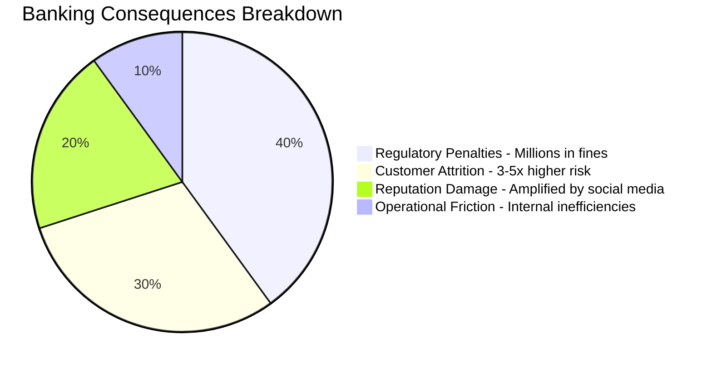

**Regulatory Penalties**: Banking regulations often require notification of specific authorities within strict timeframes (sometimes as little as 2-4 hours). Failure to identify and notify regulatory stakeholders can result in penalties of millions of dollars, accounting for 40% of the overall business impact in severe incidents.

**Customer Attrition**: Studies show that customers who experience service disruptions without proper communication are 3-5 times more likely to change banks than those who receive proactive, transparent updates. This represents 30% of the potential impact, driven by eroded trust and dissatisfaction.

**Reputation Damage**: In the age of social media, unmanaged stakeholder communication leads to public complaints that significantly amplify the perceived severity and scope of incidents. Reputation damage contributes to 20% of the overall impact and can have long-lasting effects on customer perception.

**Operational Friction**: When internal stakeholders aren't properly informed, they create additional work during incidents through duplicate inquiries, escalations to executives, and independent (often contradictory) customer communications. These inefficiencies account for 10% of the impact, delaying resolution and wasting resources.

This breakdown highlights the critical need for comprehensive stakeholder impact mapping, ensuring clear communication and timely actions to mitigate these business consequences.
### Implementation Guidance

To implement effective stakeholder impact mapping in your organization, follow these steps:

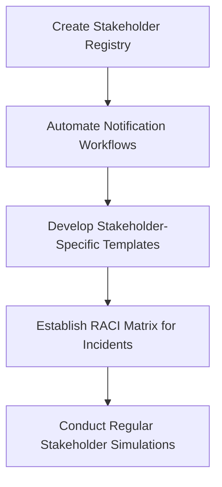

1. **Create a centralized stakeholder registry**:
   - Develop and maintain a comprehensive database of all potential incident stakeholders.
   - Include essential details such as contact information, role in incident response, notification thresholds, and preferred communication channels.

2. **Implement automated notification workflows**:
   - Build communication workflows that trigger automatic notifications to appropriate stakeholders.
   - Base the automation on incident type, severity, and affected systems to ensure timely and consistent communication.

3. **Develop stakeholder-specific templates**:
   - Create reusable communication templates tailored to the needs of each stakeholder group.
   - Address the unique requirements of technical teams, executives, customers, partners, and regulators.
   - Ensure templates include placeholders for critical details like incident summaries, timelines, and resolution updates.

4. **Establish a RACI matrix for incidents**:
   - Define clear Responsible, Accountable, Consulted, and Informed (RACI) roles for all stakeholder groups.
   - Map these roles across various incident types to prevent communication gaps and overlapping responsibilities.
   - Regularly review and update the matrix to reflect organizational changes.

5. **Conduct regular stakeholder simulations**:
   - Practice stakeholder communications as part of incident simulation exercises.
   - Focus on the timing, clarity, and appropriateness of information shared with each audience.
   - Incorporate feedback from participants to refine communication strategies and processes.

By following this structured process, you can ensure that stakeholder impact mapping becomes a reliable and actionable part of your incident management framework.
## Panel 7: Incident Typing - Patterns and Archetypes in Banking System Failures
### Scene Description

A knowledge management session is underway where an experienced SRE team is developing a banking incident taxonomy. The room is vibrant with activity, featuring walls covered in categorized incident summaries displayed on digital cards. These cards are grouped into clusters, each labeled with archetypal patterns such as "Payment Gateway Timeout Cascade," "Settlement Reconciliation Drift," and "Identity Verification Bottleneck."

One engineer is annotating each pattern with common characteristics, while another updates a reference handbook titled "Banking Incident Pattern Library." A large screen in the room displays a visualization, showing how specific incidents map to these archetypal patterns, creating a dynamic interplay of incident data and patterns.

Below is a simplified representation of the scene:

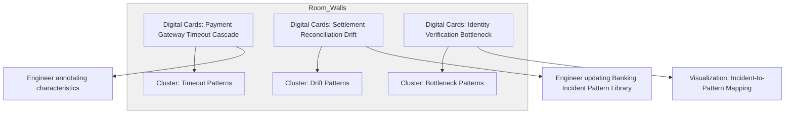

This structured environment supports the team's efforts to identify recurring patterns, annotate their characteristics, and build a comprehensive pattern library. The visualization screen acts as a central focal point, helping the team see connections and overlaps between incidents and archetypal patterns at a glance.
### Teaching Narrative
As banking SREs gain experience with incidents, patterns emerge. Traditional production support might treat each incident as a unique occurrence, but SRE incident analysis benefits from pattern recognition - identifying common archetypes that share characteristics, causes, and resolution approaches. This pattern-based approach transforms incident response from perpetual firefighting to systematic pattern matching and resolution.

Incident Typing develops a banking-specific "pattern library" of common failure modes. These archetypal patterns include:

1. **Capacity Threshold Breaches** - when volume exceeds system capabilities (payment processing overload during peak periods)
2. **Data Synchronization Failures** - when critical financial data becomes inconsistent (settlement vs. clearing discrepancies)
3. **Dependency Chain Collapses** - when third-party service failures cascade (payment processor outages)
4. **Configuration Drift Incidents** - when systems gradually move out of alignment (trading parameter mismatches)
5. **Release Transition Failures** - when new deployments introduce issues (core banking system upgrades)
6. **Data Quality Degradation** - when information integrity issues affect processing (duplicate transaction IDs)
7. **Timing Sensitivity Failures** - when temporal factors create issues (end-of-day processing collisions)

For each pattern, experienced SREs develop standard investigation approaches, common questions, typical telemetry signals, and proven resolution strategies. This pattern library becomes an invaluable knowledge base, allowing teams to leverage collective experience rather than rediscovering solutions.

For banking professionals transitioning from production support to SRE, developing this pattern recognition capability represents a key evolution from treating each incident as a unique emergency to recognizing familiar patterns and applying proven approaches.
### Common Example of the Problem

Continental Financial Group experienced a recurring pattern of payment processing slowdowns that appeared random and unique. Each incident mobilized large response teams who spent hours rediscovering investigation paths and solutions. During each occurrence, teams started from scratch—checking network connectivity, database performance, application logs, and external providers.

After the fifth similar incident in three months, an SRE conducted pattern analysis across all cases and discovered they were all examples of the same archetype: a "Queue Processing Starvation" pattern where a specific transaction type consumed disproportionate processing resources during high-volume periods. Once recognized as a pattern, the team developed specific detection signatures, a targeted investigation checklist, and eventually a permanent architectural fix. What had been consuming 120+ person-hours per incident was reduced to a 30-minute resolution using the pattern-based approach, saving over 500 hours of incident response time in the following year.

#### Incident Progression Timeline

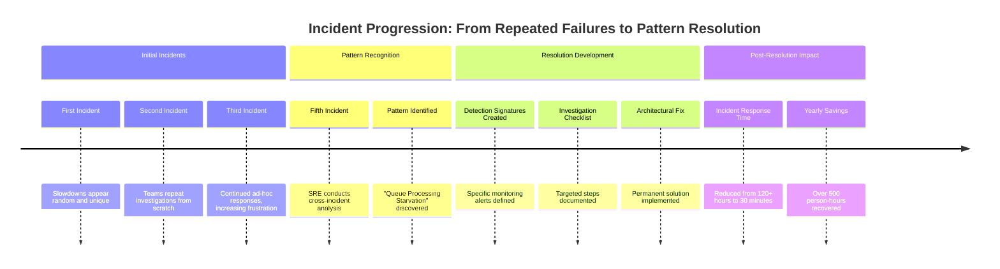

This timeline illustrates the journey from repeated, inefficient incident responses to the implementation of a structured, pattern-based resolution approach. It highlights the critical role of pattern recognition in transforming incident management within banking systems.
### SRE Best Practice: Evidence-Based Investigation

Effective incident pattern recognition requires systematic capture and analysis of incident characteristics. Use the following checklist to guide your evidence-based investigation process:

#### Checklist: Evidence-Based Investigation for Incident Patterns

- [ ] **Structured Incident Documentation**
  - Implement standardized templates to capture key attributes consistently across incidents.
  - Ensure documentation includes affected services, error messages, timeline of events, and resolution details.

- [ ] **Pattern Attribute Tagging**
  - Develop and maintain a taxonomy of incident attributes.
  - Include categories such as error types, temporal characteristics, root causes, and resolution methods.
  - Tag each incident with relevant attributes for easier pattern matching.

- [ ] **Similarity Analysis**
  - Use automated clustering algorithms and manual reviews to group incidents with shared characteristics.
  - Focus on identifying underlying root causes rather than surface-level symptoms.

- [ ] **Pattern Validation Testing**
  - Compare detailed characteristics of suspected patterns across multiple incidents.
  - Confirm that the similarities represent true archetypes and not coincidental overlaps.

- [ ] **Pattern Signature Development**
  - For validated patterns, create detection signatures (e.g., specific log events, telemetry signals, or error codes).
  - Ensure these signatures enable early identification of future occurrences of the pattern.

#### Real-World Example: Eastern Trust Case Study
When Eastern Trust implemented this structured approach, they identified 14 distinct incident archetypes that accounted for 78% of their significant incidents. This allowed the team to develop targeted remediation strategies, significantly improving response times and reducing repeated failures.

By following this checklist, your team can adopt a systematic, evidence-based approach to incident investigation, transforming incident response into a proactive and pattern-driven practice.
### Banking Impact
Failing to recognize incident patterns creates significant business consequences:

**Extended Resolution Times**: Without pattern recognition, teams repeatedly solve the same problems from scratch, with studies showing pattern-aware teams resolve similar incidents 60-70% faster than those treating each incident as unique.

**Resource Waste**: Unknown patterns lead to over-allocation of resources as teams repeatedly assemble to solve what appear to be novel problems rather than recognized patterns with established playbooks.

**Missed Prevention Opportunities**: When patterns go unrecognized, banks miss the opportunity to implement architectural or operational changes that could prevent entire classes of incidents rather than addressing individual occurrences.

**Knowledge Loss**: Without pattern documentation, critical response knowledge exists only in the minds of experienced responders, creating significant risk when those individuals change roles or leave the organization.
### Implementation Guidance

To implement effective incident pattern recognition in your organization, follow these steps:

| **Action**                             | **Purpose**                                                                                                                                                                            | **Example**                                                                                                  |
| -------------------------------------- | -------------------------------------------------------------------------------------------------------------------------------------------------------------------------------------- | ------------------------------------------------------------------------------------------------------------ |
| **Create a pattern library**           | Build a structured repository of incident patterns specific to your systems. Document signature characteristics, investigation approaches, and resolution strategies for each pattern. | Develop entries like "Payment Gateway Timeout Cascade" with details on root causes and mitigation processes. |
| **Implement pattern-based tagging**    | Enhance incident management systems with fields for tagging recognized patterns. This facilitates data analysis and trend identification.                                              | Add a "Pattern Type" dropdown in your incident tracking tool to classify incidents by archetype.             |
| **Develop pattern-specific playbooks** | Create focused playbooks for each identified pattern to guide responders through efficient investigation and resolution.                                                               | Draft a playbook for "Configuration Drift Incidents" outlining diagnostic commands and rollback procedures.  |
| **Conduct pattern review sessions**    | Hold regular team meetings to analyze recent incidents, identify new patterns, and refine existing ones.                                                                               | Schedule bi-weekly reviews where SREs discuss recent "Timing Sensitivity Failures" and update the library.   |
| **Train pattern recognition skills**   | Educate responders on identifying patterns quickly, helping them transition from symptomatic responses to pattern-based resolutions.                                                   | Conduct workshops where teams classify historical incidents into patterns and practice using the library.    |