# Chapter 3: Alert Design and Initial Response

## Chapter Overview

Welcome to the SRE house of horrors: Alert Design and Initial Response. Picture this—2:15 AM, a rookie SRE drowning in a relentless tsunami of red notifications while the banking world teeters on the brink of chaos. This chapter takes you on a guided tour through the battleground of alert storms, meaningless metrics, and the fine art of not missing the multi-million-dollar outage hiding behind a "green" dashboard. Forget feel-good theory—this is about building a fortress of actionable alerts, slashing through noise, and turning panicked firefighting into cold, methodical incident triage. If your current alerting strategy is “let’s hope for the best and sort it out later,” buckle up. We’re about to show you how to build systems that don’t just shout—they actually tell you where to aim the fire extinguisher.

---
## Learning Objectives

- **Diagnose** alert fatigue and alert storms, and **map** their real-world impact on banking operations.
- **Design** hierarchical and correlated alerting systems that surface root causes, not just symptoms.
- **Prioritize** alerts based on business impact, not just technical oddities.
- **Engineer** actionable, user-centric alert rules that actually matter to customers and revenue.
- **Implement** disciplined first responder protocols that turn chaos into coordinated action.
- **Validate** customer impact beyond dashboards, ensuring real-world failures don’t slip through.
- **Classify** incident severity with evidence, not gut feeling, using business-aware frameworks.
- **Document** and **communicate** initial incident assessments to prevent siloed confusion.
- **Automate** repetitive remediation safely, with self-healing systems that know when to call for backup.

---
## Key Takeaways

- You’re not paid to acknowledge 30 alerts at 2 AM—**fix your alert design or keep your résumé updated**.
- If your monitoring only cares about CPU usage, expect to miss every customer-impacting failure that matters.
- Alert storms don’t just waste engineer time—they **bleed millions and make regulators salivate**.
- “Green dashboard” ≠ “Happy customer.” If you’re not validating with real transactions, you’re flying blind.
- Manual, ad-hoc incident response is a ticket to regulatory hell and executive rage. **Protocols aren’t optional—they’re survival gear**.
- Severity is not a vibe. If your “P1” depends on who’s on-call, your classification matrix is worthless.
- Documentation isn’t bureaucracy; it’s how you survive audits and avoid finger-pointing postmortems.
- If you’re manually fixing the same outage every holiday season, **you’re the automation candidate—replace yourself before someone else does**.
- Business impact always trumps technical purity. If your alerts don’t tie to dollars, customers, or compliance, you’re just making noise.
- The only thing worse than false positives is false negatives. **Tune your signals or prepare for customer churn and executive escalations**.

---

There you go: brutal, practical, and guaranteed to make an SRE mutter “finally, someone gets it.”

---
## Panel 1: The Midnight Alert Avalanche
### Scene Description

A banking operations center at 2:15 AM. Hector Alavaz, a new SRE transitioning from production support, sits alone at a monitoring station surrounded by multiple screens. His phone buzzes repeatedly with alerts. The screens show a dashboard for a payment processing system with multiple red indicators. Hector Alavaz looks overwhelmed, staring at dozens of simultaneous alerts, unsure which ones matter. His expression shows panic as he scrolls through the flood of notifications.

Below is a conceptual representation of Hector Alavaz's monitoring station and the overwhelming alert storm he faces:

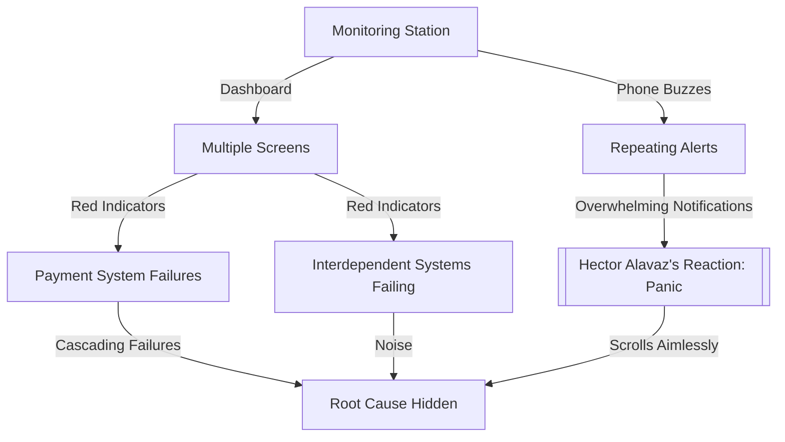

This diagram illustrates the chaotic nature of the alert storm and highlights how the volume and lack of prioritization obscure the root cause, leaving Hector Alavaz unsure of where to focus.
### Teaching Narrative
Alert fatigue is a critical challenge in financial systems monitoring. Traditional alerting approaches often generate "alert storms" where numerous related alerts fire simultaneously, making it impossible to identify the true issues requiring immediate attention. This panel introduces the concept of alert design hierarchy - the practice of structuring alerts to provide clear signals rather than noise. In the banking environment, where multiple interdependent systems generate cascading failures, properly designed alerts must differentiate between causal issues and their downstream effects. The transition from monitoring to incident response begins with recognizing that alerts should be actionable signals that guide response, not just notifications of state change.
### Common Example of the Problem

A major retail bank's payment gateway experiences performance degradation at 2:15 AM. Within seconds, Hector Alavaz's phone and dashboard explode with over 30 different alerts: database connection timeouts, API response latency violations, queue depth thresholds, memory utilization spikes, and transaction failure rates – all triggered by the same root cause. Additionally, downstream systems begin generating their own alerts as the issue cascades through the payment ecosystem. Mobile banking alerts, ATM transaction failures, and merchant processing warnings create an overwhelming cacophony of notifications. Hector Alavaz, unable to determine which alerts represent the primary issue versus secondary effects, wastes precious minutes jumping between dashboards while the incident continues to expand in scope.

#### Alert Cascade Timeline

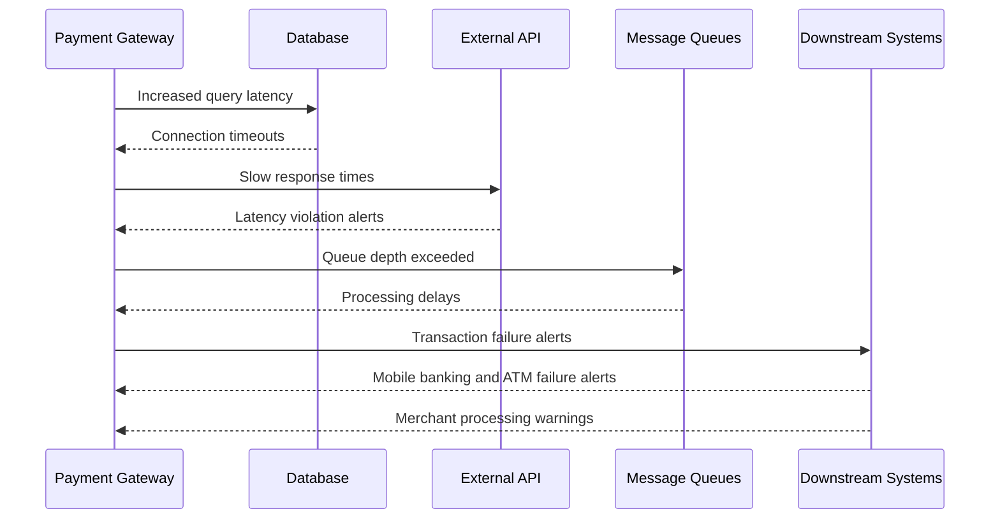

#### Key Stages of Alert Escalation
1. **Root Cause Alert**: The payment gateway's performance degrades due to a bottleneck in the database.
2. **System-Level Alerts**: The database timeout triggers cascading alerts in the API, message queues, and other core services.
3. **Downstream System Alerts**: Dependent systems, including mobile banking and merchant processing, detect failures and generate their own alerts.
4. **Noise Accumulation**: The overwhelming number of secondary alerts obscures the root cause, delaying incident response.

This sequence illustrates how a single root cause can propagate through interconnected systems, creating an alert storm that complicates identification and resolution.
### SRE Best Practice: Evidence-Based Investigation

The SRE approach to alert storms implements a structured hierarchy that organizes alerts based on their causal relationships and customer impact. This hierarchy uses correlation techniques to group related alerts and highlight potential root causes rather than symptoms. Below is a checklist summarizing the five key methodologies for evidence-based investigation:

| **Methodology**                         | **Description**                                                                                                       | **Actionable Steps**                                                                                                                      |
| --------------------------------------- | --------------------------------------------------------------------------------------------------------------------- | ----------------------------------------------------------------------------------------------------------------------------------------- |
| **1. Alert Correlation Mapping**        | Create a dependency graph of services to establish parent-child relationships between alerts.                         | - Identify service dependencies.<br>- Map alerts to their respective parent-child relationships.<br>- Suppress downstream alerts.         |
| **2. Criticality-Based Prioritization** | Rank alerts by customer impact metrics, focusing on business-critical issues over technical severity.                 | - Define customer impact metrics.<br>- Assign priority levels based on impact.<br>- Ensure critical alerts are escalated promptly.        |
| **3. Dynamic Alert Thresholds**         | Use adaptive thresholds that adjust based on historical patterns and time-of-day baselines to reduce false positives. | - Analyze historical alert data.<br>- Set dynamic thresholds for predictable traffic patterns.<br>- Continuously refine thresholds.       |
| **4. Causal Chain Visualization**       | Present alerts visually to show propagation paths and dependencies, aiding in root cause identification.              | - Use visualization tools to display alert relationships.<br>- Highlight propagation paths leading to the root cause.                     |
| **5. Alert Suppression Rules**          | Suppress predictable cascade alerts when their parent alert has already fired, reducing noise.                        | - Define suppression rules based on known alert cascades.<br>- Test suppression logic to ensure accuracy.<br>- Continuously update rules. |

This evidence-based approach transforms chaotic alert floods into structured, actionable intelligence that guides effective response.
### Banking Impact

Alert avalanches in banking environments directly impact incident resolution time, leading to significant financial and reputational consequences. The following table summarizes key impacts to highlight the urgency of effective alert triage:

| Impact Area                      | Description                                                                   | Quantitative Impact Example                        |
| -------------------------------- | ----------------------------------------------------------------------------- | -------------------------------------------------- |
| **Transaction Outages**          | Extended downtime delaying customer transactions                              | $10,000-$50,000 lost revenue per minute            |
| **Regulatory Reporting**         | Increased scrutiny and mandatory reporting for incidents exceeding thresholds | Potential fines ranging from $100,000 to $1M+      |
| **Customer Attrition**           | Loss of trust as customers switch to competitors during service failures      | 5-10% attrition risk after critical outages        |
| **Operational Escalation Costs** | Unnecessary team activations and overtime expenses                            | $1,000-$5,000 per incident in additional costs     |
| **Partial Fix Risks**            | Incomplete resolution leading to repeated incidents                           | 20%-30% additional downtime due to follow-up fixes |

For international banks, the stakes are even higher. A middle-of-the-night incident in one region can cascade into peak business hours in another, impacting global operations. Consider the following example flow of impact for a global bank:

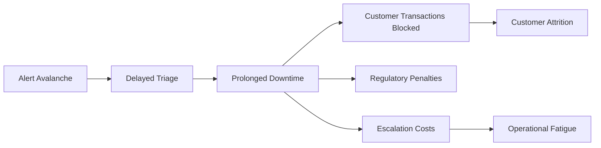

Efficient alert triage is essential to mitigate these impacts, ensuring that SREs can focus on actionable issues and minimize the cascading effects of downtime.
### Implementation Guidance

To transform alert chaos into structured intelligence, implement these five actionable steps:

1. **Conduct alert dependency mapping**: Document relationships between services and create a visual dependency graph. For each alert, identify which upstream service failures would trigger it, and classify alerts as either "root cause candidates" or "downstream effects." Below is an example of a simple service dependency map:

    ```plaintext
    Service A --> Service B --> Service C
                 |--> Service D
    ```
    - If Service A fails, alerts for Services B, C, and D should be grouped under the root cause alert for Service A.

2. **Implement correlation identifiers**: Modify alerting systems to include correlation IDs that connect related alerts. Configure your monitoring platform to group related alerts using these identifiers, presenting them as a single incident with multiple symptoms. Example code snippet for adding correlation IDs:

    ```python
    import uuid

    def generate_alert(service_name, error_message):
        correlation_id = uuid.uuid4()
        alert = {
            "service": service_name,
            "error": error_message,
            "correlation_id": str(correlation_id)
        }
        send_alert(alert)

    def send_alert(alert):
        # Simulate sending the alert to the monitoring system
        print(f"Alert sent: {alert}")

    # Example usage
    generate_alert("Service A", "Timeout occurred")
    ```

3. **Create tiered alert routing rules**: Configure different notification channels based on alert priority and causal position. Route potential root cause alerts directly to engineers while sending related secondary alerts to dashboard-only displays or a secondary notification channel. The workflow below illustrates tiered routing:

    ```mermaid
    flowchart TD
        Alert[Alert Generated] -->|Root Cause Candidate| Engineer[Engineer Notification]
        Alert -->|Downstream Effect| Dashboard[Dashboard Display]
        Engineer -->|Escalation Needed| OnCall[On-Call Engineer]
    ```

4. **Develop service-focused aggregation views**: Build dashboards that aggregate alerts by service rather than by metric type. Include customer impact indicators at the top of each service view, ensuring business impact remains visible amid technical alerts. Example dashboard hierarchy:

    ```plaintext
    Service A:
      - Customer Impact: High
      - Alerts: 
        - Root Cause: Database connection timeout
        - Downstream: API latency, Payment failures
    ```

5. **Establish alert noise reduction targets**: Set measurable goals for reducing alert volume without decreasing detection capabilities. Track metrics like signal-to-noise ratio, time-to-identification, and alert-to-incident ratios, with quarterly reviews to refine alerting strategies. Example metric goals:

    ```plaintext
    - Signal-to-noise ratio: > 80%
    - Time-to-identification (TTI): < 5 minutes
    - Alert-to-incident ratio: < 3:1
    ```
## Panel 2: Designing Meaningful Alerts
### Scene Description

A whiteboard session in a bright conference room. Maya, a senior SRE, leads a workshop with Hector Alavaz and other team members. On the whiteboard is a diagram showing a banking transaction flow with multiple components. Maya is highlighting specific points in the flow where alerts should be placed. She's drawing connections between user impact and technical metrics. Sample alert templates are visible on one section of the board with the words "ACTIONABLE" and "USER-CENTRIC" underlined.

Below is a simplified text representation of the banking transaction flow diagram on the whiteboard:

```
[User Initiates Transaction]
           |
           v
[Authentication Service] --> [Auth Success/Failure]
           |
           v
   [Transaction Service]
           |
           v
[Payment Gateway Integration] --> [Payment Success/Failure]
           |
           v
[Notification Service] --> [User Alert Sent]
```

Maya emphasizes key points in the flow where alerts should be placed:
- **Authentication Service**: Alert on high failure rates, as this directly impacts the ability of users to log in or perform transactions.
- **Transaction Service**: Monitor for anomalies in transaction success rates to detect potential issues affecting customer payments.
- **Payment Gateway Integration**: Place alerts on payment failures or delays to quickly identify external system issues.
- **Notification Service**: Ensure alerting when user notifications fail, as this impacts communication of transaction outcomes.

This flow helps the team align technical metrics with areas that directly affect the customer experience.
### Teaching Narrative
Effective alerts in financial services must be designed around meaningful signals that correlate with user experience, not just system state. This requires a fundamental shift from component-based to service-based thinking. While traditional monitoring focuses on infrastructure metrics (CPU, memory, disk), SRE alert design starts with the question: "What indicates a degraded customer experience?" For banking platforms, this means prioritizing alerts on transaction success rates, authentication completions, and response times over infrastructure health. The "symptom-based alerting" approach ensures that alerts trigger on conditions that directly impact customers rather than technical details that may not affect service. This panel introduces the concepts of alert signal-to-noise ratio and how proper alert design significantly reduces mean time to detection (MTTD) while preventing alert fatigue.
### Common Example of the Problem

A retail banking platform has extensive monitoring for its infrastructure components. One morning, multiple customers report being unable to complete mortgage application submissions, despite no alerts triggering in the monitoring system. The existing alerts monitor database connection counts, CPU utilization, memory consumption, and disk space—all showing normal operations within thresholds. Investigation eventually reveals that a third-party credit check API is timing out, causing mortgage applications to fail silently in the final submission step. Because monitoring focused on infrastructure rather than customer journeys, the issue remained undetected by automated systems despite significant business impact. The bank lost several high-value mortgage applications to competitors during the three-hour window before manual reports brought attention to the problem.

#### Checklist: Key Issues in the Example
- **Lack of customer journey monitoring:** Alerts were not designed to track the end-to-end user experience, such as successful mortgage application submissions.
- **Over-reliance on infrastructure metrics:** Monitoring focused on low-level metrics (e.g., CPU, memory, disk) rather than service-level indicators like transaction success rates.
- **Blind spots in third-party dependencies:** No monitoring or alerting was in place for critical external components, such as the credit check API.
- **Delayed detection of business impact:** Automated systems failed to detect the issue, leading to significant customer and revenue loss before manual intervention.
- **Poor signal-to-noise ratio:** Existing alerts provided no actionable insight into the issue impacting the customer experience.

By addressing these gaps, teams can design meaningful alerts that prioritize user-centric outcomes and ensure faster detection of issues that matter most.
### SRE Best Practice: Evidence-Based Investigation

SRE best practices for alert design shift focus from monitoring technical components to tracking customer experience. This evidence-based approach includes the following key practices:

| Practice                           | Purpose                                                                                                                                | Example                                                                                                       |
| ---------------------------------- | -------------------------------------------------------------------------------------------------------------------------------------- | ------------------------------------------------------------------------------------------------------------- |
| **Customer journey mapping**       | Document complete user workflows and identify critical technical components at each step.                                              | Mapping a mortgage application submission flow to identify dependencies like authentication and payment APIs. |
| **Multi-level SLI development**    | Create Service Level Indicators (SLIs) at technical and user experience levels, correlating them to understand user impact.            | Linking API response times (technical SLI) to transaction success rates (user experience SLI).                |
| **Alert golden signals**           | Implement Google's four golden signals (latency, traffic, errors, saturation) with thresholds tied to customer experience degradation. | Setting latency alerts for payment processing when response times exceed thresholds that impact customers.    |
| **Critical dependency monitoring** | Monitor third-party and internal dependencies with synthetic transactions to validate end-to-end workflows.                            | Running synthetic tests across all steps of a loan approval process to ensure full functionality.             |
| **Business activity monitoring**   | Correlate technical metrics with business KPIs, using statistical deviations to trigger alerts.                                        | Alerting on drops in transaction completion rates linked to backend service errors or degraded performance.   |

This methodology ensures alerts reflect actual customer experience rather than just system internals, significantly reducing the gap between technical monitoring and business impact.
### Banking Impact

Poorly designed alerts that fail to detect customer-impacting issues create substantial business consequences for financial institutions. The cascading effects of such failures can be illustrated as follows:

```
Undetected Issue
      ↓
  Service Degradation
      ↓
 Customer Impact
      ↓
  Customer Complaints
      ↓
  Revenue Loss
      ↓
Competitive Disadvantage
```

Key outcomes of these cascading effects include:

1. **Revenue Loss**: Abandoned transactions, particularly high-value services like mortgage applications, wealth management activities, and business banking operations.
2. **Diminished Customer Trust**: When issues are reported by users rather than proactively detected by the bank, customer confidence in the platform erodes.
3. **Competitive Disadvantage**: Customers migrate to more reliable banking platforms after negative experiences, impacting market share.
4. **Increased Contact Center Load**: Customers call to report issues that should have been detected automatically, straining support resources.
5. **Regulatory Exposure**: Service disruptions that affect required financial services but go undetected by monitoring systems can lead to compliance violations and penalties.

For large retail banks, the impact of a single undetected customer-facing issue can easily reach millions in lost revenue and recovery costs. This is especially true for high-value transaction types like loan processing and wealth management functions, where customer expectations for reliability are highest.
### Implementation Guidance

Transform your alerting approach with these five practical steps. Use the checklist below to ensure a structured and actionable implementation:

#### Checklist: Designing Meaningful Alerts

- [ ] **Conduct customer journey workshops**:
  - [ ] Assemble business, product, and technical teams.
  - [ ] Map the top 5-10 critical customer journeys that directly impact revenue and satisfaction.
  - [ ] Document all technical components involved in these pathways.

- [ ] **Implement synthetic transaction monitoring**:
  - [ ] Create automated scripts that mimic real user behaviors for critical journeys.
  - [ ] Configure scripts to execute continuously from internal and external perspectives.
  - [ ] Set alerts for journey failures or when performance thresholds are exceeded.

- [ ] **Create alert design templates**:
  - [ ] Standardize templates to include:
    - [ ] Affected customer journey.
    - [ ] Business impact.
    - [ ] Technical details.
    - [ ] Recommended first response actions.
  - [ ] Apply templates consistently across all new alerts.

- [ ] **Establish alert quality criteria**:
  - [ ] Define mandatory elements for all alerts, including:
    - [ ] Specific customer impact.
    - [ ] Whether action is required or the alert is informational.
    - [ ] Suggested first steps.
    - [ ] Links to relevant runbooks or dashboards.

- [ ] **Review and refine alert portfolios quarterly**:
  - [ ] Evaluate alerts against metrics like false positive rate, customer impact accuracy, and actionability.
  - [ ] Deprecate alerts that fail to drive appropriate response or duplicate other signals.

#### Summary Flow of Implementation

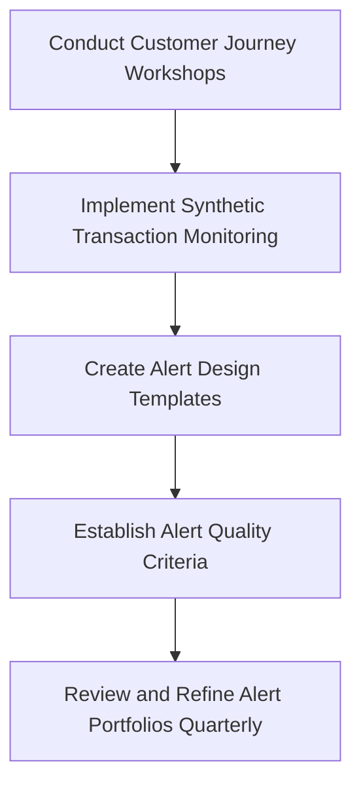

By following this checklist and structured flow, you can design alerts that align with customer-centric, actionable, and quality-focused principles, ensuring a meaningful impact on both user experience and operational efficiency.
## Panel 3: First Responder Protocol
### Scene Description

Hector Alavaz's workstation during an active incident is organized and purpose-driven for rapid response. On his desk, a printed checklist labeled "First Responder Protocol" rests beside his keyboard, clearly visible for quick reference. His computer screen displays a structured incident response dashboard prominently showing payment gateway errors, with key metrics highlighted for immediate attention. A digital timer in the corner of the dashboard reads "Incident Duration: 4:32," emphasizing the urgency of the situation. Hector Alavaz is focused, methodically following the checklist while simultaneously typing updates into the team chat to maintain real-time communication.

Below is a text-based representation of Hector Alavaz's workstation setup:

```
+----------------------------------------------------------+
| INCIDENT RESPONSE DASHBOARD                                     |
| --------------------------------------------------------------- |
| Payment Gateway Errors                                          |
| - Error Code: 502                                               |
| - Affected Transactions: 1,342                                  |
| - Severity: High                                                |
|                                                                 |
| [ Incident Duration: 4:32 ]                                     |
|                                                                 |
| [Team Chat Window]                                              |
| > Hector Alavaz: Acknowledged alert, verifying customer impact. |
| > Team Member: Copy that. Notify payments team next.            |
+----------------------------------------------------------+

[Printed Checklist]
  1. Acknowledge alert
  2. Verify customer impact
  3. Classify severity
  4. Notify appropriate teams
```

This structured visualization reinforces the critical elements of the protocol and helps readers picture the tools and mindset required for effective incident triage.
### Teaching Narrative
The critical first minutes of incident response set the trajectory for resolution time and impact mitigation. This panel introduces the structured first responder protocol that transforms reactive alert handling into systematic incident triage. Banking incidents require especially disciplined initial response due to their financial and regulatory impact. The protocol establishes clear steps: acknowledge the alert, validate real customer impact (not just system alerts), classify severity based on established criteria, assemble the appropriate response team, and establish communication channels. This approach replaces the common anti-pattern where responders immediately dive into debugging without establishing incident scope or impact. The first responder acts as an initial incident commander, making critical decisions about escalation and coordination before technical investigation begins.
### Common Example of the Problem

At a global investment bank, an alert triggers indicating elevated error rates in the equity trading platform during market hours. The on-call engineer immediately begins troubleshooting the technical issue, focusing on application logs and database performance metrics. For 17 minutes, the engineer works in isolation, attempting various diagnostics while traders increasingly report problems executing transactions. No formal incident is declared, no communication is established with trading desk representatives, and no escalation occurs to additional technical teams. When the issue is finally recognized as a significant incident affecting multiple trading desks with potential financial losses, nearly 20 minutes of critical market time has elapsed without coordinated response.

#### Timeline of Events

```mermaid
gantt
    title Incident Response Timeline
    dateFormat  HH:mm
    axisFormat  %H:%M
    section Timeline
    Alert Triggered           : milestone, t1, 09:00, 0min
    Initial Troubleshooting   : active, t2, 09:00, 17min
    Traders Report Issues     : milestone, t3, 09:05, 0min
    No Communication Established : crit, t4, 09:00, 17min
    Incident Declared         : milestone, t5, 09:17, 0min
    Team Mobilization Begins  : active, t6, 09:17, 3min
    Coordinated Response Starts : milestone, t7, 09:20, 0min
```

#### Key Problems Observed
- **Delayed Incident Declaration**: The on-call engineer focused solely on troubleshooting without formally declaring an incident, delaying coordinated action.
- **Lack of Communication**: No communication was established with the trading desk or other stakeholders, leaving critical business impact unaddressed.
- **Missed Escalation Opportunities**: Additional technical teams were not mobilized promptly, prolonging resolution.

This timeline illustrates how critical response time was lost during the initial 20 minutes due to the absence of a structured first responder protocol. Implementing the protocol would have ensured immediate acknowledgment of the alert, early validation of customer impact, and timely escalation to appropriate teams.
### SRE Best Practice: Evidence-Based Investigation

The SRE approach to first response implements a structured protocol that prioritizes coordination and impact assessment before deep technical investigation. These evidence-based practices ensure critical early minutes are used effectively to establish incident context and mobilize appropriate resources rather than jumping prematurely to technical troubleshooting.

#### Checklist: Key Components of Evidence-Based Investigation

| Step                                       | Description                                                                                         | Example Tools/Methods                               |
| ------------------------------------------ | --------------------------------------------------------------------------------------------------- | --------------------------------------------------- |
| **1. Triage before troubleshooting**       | Follow a documented sequence to establish incident boundaries and impact before resolution efforts. | Incident runbooks, documented workflows             |
| **2. Multi-dimensional verification**      | Confirm incidents through diverse sources to ensure a comprehensive understanding.                  | Monitoring systems, synthetic tests, impact reports |
| **3. Impact-based classification**         | Classify severity using standardized definitions based on business impact factors.                  | Severity matrices, business impact thresholds       |
| **4. Response team composition modeling**  | Assemble a response team tailored to the affected services and incident severity.                   | On-call schedules, service ownership mappings       |
| **5. Structured communication initiation** | Initiate communication channels with standard templates for consistency across stakeholders.        | Predefined notification templates, chat tools       |

#### Example Workflow: Evidence-Based Investigation

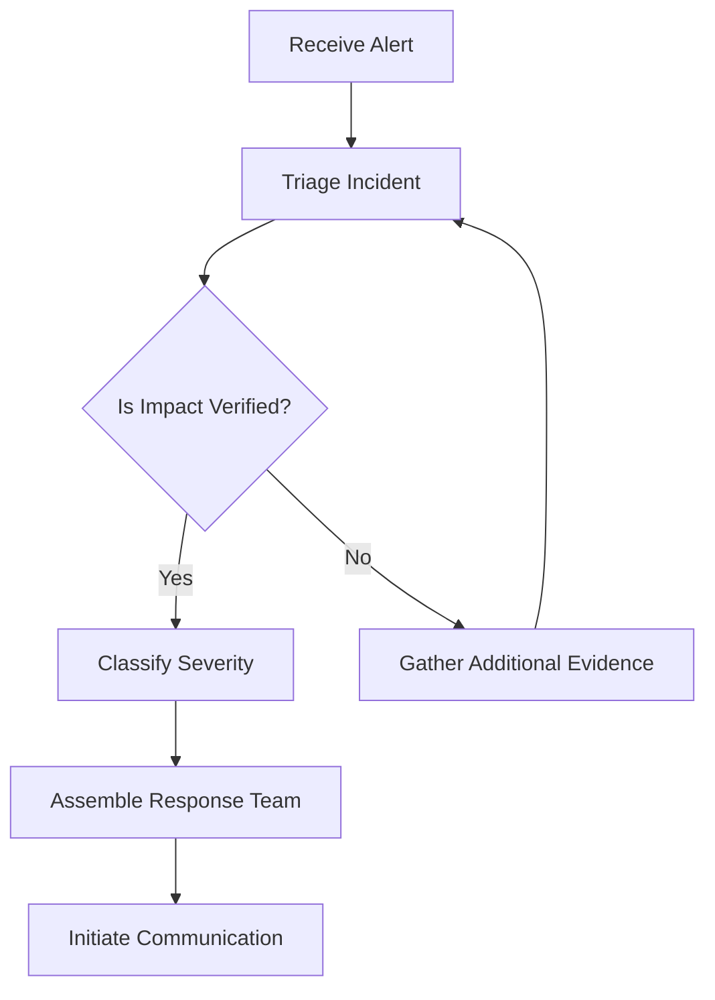

This checklist and workflow provide responders with clear, actionable steps to navigate initial incident handling systematically, ensuring disciplined response and effective coordination.
### Banking Impact

Poor initial response procedures in banking environments directly affect both resolution time and total business impact:

1. Increased financial exposure as trading, payment, or lending disruptions continue without coordinated response
2. Regulatory reporting failures when incidents requiring timely notification aren't properly classified at onset
3. Reputation damage from delayed or inconsistent customer communications about service disruptions
4. Operational inefficiency through duplicated efforts when multiple teams begin uncoordinated troubleshooting
5. Extended resolution times due to incomplete initial assessment and subsequent misallocation of technical resources

#### Case Study: Payment Gateway Outage in a Retail Bank

In 2022, a retail bank experienced a 27-minute payment gateway outage during peak business hours. The first responder failed to classify the incident severity within the initial 5 minutes, delaying escalation to the required payment systems team. The delay resulted in:

- **Financial Impact**: $3.2 million in lost transaction revenue, including penalties from failed high-value corporate transactions.
- **Regulatory Impact**: A missed deadline for incident reporting to the financial authority, resulting in a $250,000 fine.
- **Reputation Impact**: Over 1,500 customer complaints logged within 24 hours, with a 12% increase in account closures within the following month.

This example highlights how a disciplined first responder protocol prevents cascading failures, ensuring timely escalation, accurate classification, and coordinated response. By following the protocol steps—acknowledge, validate, classify, notify, and coordinate—the bank could have reduced both the financial and reputational damage significantly.
### Implementation Guidance
Implement an effective first responder protocol with these five concrete steps:

1. **Create service-specific response playbooks**: Develop one-page first responder guides for each critical banking service (payments, trading, authentication, etc.). Include verification steps, key dashboards, impact assessment methods, and team mobilization procedures specific to each service.

2. **Implement a dedicated first responder role**: Designate the initial alert recipient as "First Responder" with clear responsibilities distinct from incident commander and technical investigator roles. Train all on-call staff on first responder duties with regular simulation exercises.

3. **Build technical verification shortcuts**: Create bookmarked dashboard collections and pre-configured CLI commands that allow rapid verification of different service states. Group these by incident type to enable comprehensive assessment within the first 2-3 minutes.

4. **Develop an incident classification matrix**: Create a specific, quantitative matrix for determining incident severity based on metrics like number of affected customers, transaction value impact, and regulatory reporting requirements. Include decision trees to guide consistent classification.

5. **Establish automated team mobilization**: Configure communication platforms to support standard incident channel creation with appropriate stakeholders automatically added based on incident classification. Include templates for initial announcements and status updates.
## Panel 4: Validating Customer Impact
### Scene Description

Split screen visualization:

- **Left Side: Monitoring Dashboards**
  - Several panels showing system health metrics.
  - Indicators mostly green with a few yellow warnings.
  - Metrics like latency, error rates, and resource utilization displayed in charts and gauges.

- **Right Side: Customer Experience**
  - A frustrated customer on a mobile banking app.
  - Attempting to complete a transfer and encountering an error message: "Transaction failed. Please try again later."
  - Phone screen showing the error prominently.

- **Foreground: Hector Alavaz's Actions**
  - Hector Alavaz seated at a workstation with both screens in view.
  - One hand navigating the payment system in a test environment.
  - The other hand holding a notebook or typing on a laptop.
  - His expression shifting to concern as he notices mismatches between the dashboards and the customer’s failed transaction.

To illustrate this scenario conceptually, here’s a simple text-based representation:

```
+---------------------------+     +---------------------------+
| Monitoring Dashboards |  | Customer Experience |
| --------------------- || ------------------------- |
| Latency: Green            |     | Mobile Banking App        |
| Error Rate: Green         |     | Error: "Transaction       |
| Resource Utilization:     |     | failed. Please try        |
| Mostly Green, Some Yellow |  | again later." |
| ------------------------- || ------------------------- |
+---------------------------+     +---------------------------+

                    Hector Alavaz Observing Both Screens
                    - Testing Payment System
                    - Noticing the Discrepancy
```
### Teaching Narrative
Alert validation is a critical skill that distinguishes effective SREs from traditional operations teams. This panel explores the common "green dashboard fallacy" - when monitoring systems suggest services are healthy while real customers experience failures. Financial systems are particularly susceptible to this issue due to their complex transaction flows and multiple dependent services. The SRE approach requires developing systematic methods to validate real user impact, including synthetic transactions, end-to-end tests, and direct service checks. This validation step prevents both false positives (responding to non-issues) and false negatives (missing actual customer impact), ensuring that incident response efforts align with business priorities. The focus shifts from "Is the system reporting problems?" to "Can customers complete their financial transactions?"
### Common Example of the Problem

A large commercial bank's treasury management platform appears fully operational according to all monitoring dashboards. CPU, memory, and database connection metrics show normal patterns. API response time averages are within expected thresholds, and the status page shows all systems operational. However, corporate customers begin calling to report they cannot initiate wire transfers above $100,000. The monitoring system fails to detect this issue because:

1. Test transactions in monitoring use small amounts under $10,000
2. The failure occurs in a fraud detection rule that only activates for high-value transfers
3. The error presents to customers as a generic "transaction cannot be processed" message rather than a system error
4. The overall volume of affected transactions is small compared to total platform traffic, so aggregate error rates remain below alert thresholds

The sequence of events that highlights this issue is shown below:

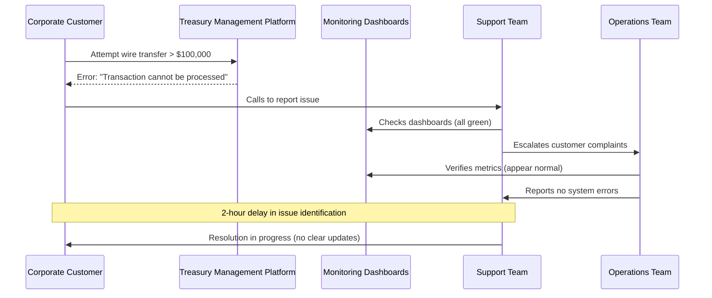

This disconnect between monitoring and real customer experience results in prolonged resolution times and frustrated corporate clients conducting time-sensitive business transactions. The example underscores the need for monitoring systems that validate real user impact, rather than relying solely on system health metrics.
### SRE Best Practice: Evidence-Based Investigation

The SRE approach to customer impact validation implements systematic reality-checking that goes beyond monitoring dashboards. Key methodologies include:

1. **Representative synthetic transactions**: Implementing monitoring that performs real business functions with relevant transaction types, amounts, and customer profiles, ensuring tests reflect actual customer behaviors rather than simplified technical checks.

2. **Segmented health assessments**: Breaking monitoring down by customer segment, transaction type, and channel to detect issues affecting specific subsets of users that might be masked in aggregate metrics.

3. **Canary user monitoring**: Tracking experience metrics for a representative sample of real users across different segments, enabling early detection of issues that might affect only certain user profiles.

4. **Direct service testing**: Bypassing frontend interfaces to test critical backend services directly, isolating potential failure points in complex transaction flows.

5. **Statistical anomaly detection**: Implementing advanced analytics that identify deviations from normal patterns in customer behavior and transaction completion rates, even when traditional thresholds aren't breached.

#### Checklist: Implementing Evidence-Based Investigation

Use the following checklist to ensure effective customer impact validation:

- [ ] Have you implemented synthetic transactions that reflect realistic customer behaviors, including diverse transaction types and profiles?
- [ ] Are health assessments segmented by customer demographics, transaction types, and access channels?
- [ ] Is canary monitoring in place to observe real-user experience across representative samples?
- [ ] Have you set up direct tests for critical backend services to isolate potential failure points?
- [ ] Are statistical anomaly detection tools configured to identify subtle deviations in customer transaction patterns?
- [ ] Have you validated that your evidence-based methodologies cover both false positives and false negatives effectively?

These evidence-based approaches, combined with the checklist, bridge the gap between technical monitoring and actual customer experience, significantly reducing incidents where dashboards and reality diverge.
### Banking Impact

The disconnect between monitoring systems and customer reality creates substantial business impact beyond technical concerns. The table below summarizes key issues, their consequences, and real-world examples to illustrate the gravity of validating customer impact in banking systems:

| **Issue**                                             | **Consequence**                                             | **Example**                                                                                                      |
| ----------------------------------------------------- | ----------------------------------------------------------- | ---------------------------------------------------------------------------------------------------------------- |
| Extended mean-time-to-detection (MTTD)                | Increased financial losses from failed transactions         | A delayed detection of a payment processing outage results in thousands of failed high-value transfers.          |
| Erosion of trust between technical and business teams | Misalignment in priorities and ineffective collaboration    | Business stakeholders lose confidence in SRE teams when customer complaints contradict "green" dashboards.       |
| Customer frustration during issues                    | Negative customer experience and increased churn            | A retail banking customer repeatedly encounters failed transfers while receiving "all systems normal" responses. |
| Missed regulatory reporting deadlines                 | Non-compliance penalties and reputational damage            | Failure to acknowledge service disruptions leads to incomplete reports filed with financial regulators.          |
| Competitive disadvantage                              | Loss of clients to competitors with more reliable platforms | A commercial client switches to a competitor after experiencing repeated failed bulk payment operations.         |

For treasury management and commercial banking services, where individual transactions often represent significant value, even low-volume issues can have outsized financial and relationship impacts if not detected promptly. This underscores the importance of aligning monitoring systems with real customer experiences.
### Implementation Guidance
Implement robust customer impact validation with these five practical steps:

1. **Diversify synthetic transaction portfolios**: Create multiple synthetic monitor profiles that represent different customer segments and transaction types. For payment systems, implement separate monitors for retail transfers, business payments, international wires, and high-value transactions, using amounts and patterns representative of real usage.

2. **Implement direct customer feedback channels**: Add simple "report an issue" options in digital banking interfaces that feed directly into technical monitoring systems, creating early warning signals when customers experience problems not detected by automated monitoring.

3. **Create customer journey success dashboards**: Develop executive-level dashboards showing completion rates for critical customer journeys (account opening, loan applications, payments), with statistical anomaly detection to highlight unusual failure patterns even when below traditional thresholds.

4. **Deploy real user monitoring (RUM)**: Implement client-side monitoring in web and mobile applications that captures actual customer experience metrics, including errors only visible in the client interface and not reflected in backend systems.

5. **Build a cross-channel correlation engine**: Develop analytics that correlate multiple weak signals across different channels (slight increases in mobile errors, minor elevation in contact center calls, small uptick in failed transactions) to identify potential issues before they generate traditional alerts.
## Panel 5: Alert Severity Classification
### Scene Description

A team huddle in the operations center. A large display shows a severity classification matrix specific to banking services, with levels from P1 to P5. Each level outlines criteria based on transaction impact, affected customer segments, and financial implications. Below is a simplified representation of the severity classification matrix being referenced:

```
+------+----------------------+------------------------+-------------------+
| Level| Transaction Impact   | Affected Customers    | Financial Impact  |
+------+----------------------+------------------------+-------------------+
| P1   | Critical (e.g., >50%)| Majority (e.g., >80%) | Severe (> $1M)    |
| P2   | Major (e.g., 30-50%) | Significant (50-80%)  | High ($500K-$1M)  |
| P3   | Moderate (e.g., 10-30%)| Moderate (30-50%)  | Medium ($100K-$500K)|
| P4   | Minor (e.g., <10%)   | Small (10-30%)        | Low (< $100K)     |
| P5   | Minimal/Nil          | Minimal/Nil           | Minimal/Nil       |
+------+----------------------+------------------------+-------------------+
```

Hector Alavaz is actively discussing an ongoing incident with the team, pointing to specific criteria in the matrix to determine the correct severity level. Team members are contributing additional context regarding affected services and providing estimates for transaction and customer impact percentages. The matrix serves as a shared reference, enabling structured decision-making during the discussion.
### Teaching Narrative
Severity classification transforms chaotic incident response into structured action. This panel introduces the concept of standardized severity levels and their crucial role in driving appropriate response. In banking environments, severity must incorporate both technical and business dimensions: number of affected transactions, financial impact, regulatory implications, and customer segments. The severity framework ensures proportional response - critical issues receive all-hands attention while minor incidents are handled without disrupting the entire organization. This structured approach replaces subjective severity assessment ("this feels like a big problem") with evidence-based classification that triggers the appropriate response playbooks, escalation paths, and communication templates. The panel highlights how proper classification immediately sets expectations for resolution timeframes and resource allocation.
### Common Example of the Problem

A regional bank's online banking platform experiences intermittent login failures affecting approximately 8% of authentication attempts. The on-call engineer receives the alert and must determine the appropriate severity level. Without clear classification criteria, the following problems emerge:

| **Issue**                               | **Description**                                                                                        | **Impact**                                                                                           |
| --------------------------------------- | ------------------------------------------------------------------------------------------------------ | ---------------------------------------------------------------------------------------------------- |
| **Subjective Assessment**               | Initial severity classification is based on personal judgment rather than standardized criteria.       | Inconsistent responses to incidents and potential underestimation of severity.                       |
| **Lack of Business Impact Translation** | No standardized method exists to convert "8% of logins" into customer or business impact metrics.      | Difficulty in quantifying scope, leading to delays in appropriate resource allocation.               |
| **Timing Considerations Ignored**       | Weekend timing and limited branch access are not factored into the severity calculation.               | Missed opportunities to assess heightened customer impact due to timing-specific conditions.         |
| **Regulatory Implications Overlooked**  | Authentication failures with potential reporting requirements are not considered in the severity.      | Increased risk of non-compliance with regulatory obligations and potential penalties.                |
| **Escalation Based on Comfort Level**   | Escalation decisions are driven by the engineer’s subjective comfort level rather than clear criteria. | Critical stakeholders are not promptly informed, and the incident remains under-resourced for hours. |

#### Key Consequences:
- **Delayed Response**: The lack of immediate escalation leads to prolonged service impact.
- **Stakeholder Mistrust**: Executive leadership questions the delay in recognizing and addressing the incident's true severity.
- **Regulatory Risks**: Regulatory reporting requirements are almost missed, creating additional risk for the organization.

#### Checklist for Avoiding Similar Issues:
- [ ] Use a severity matrix to classify incidents based on both technical and business criteria.
- [ ] Implement clear guidelines to quantify transaction and customer impact percentages.
- [ ] Incorporate timing factors (e.g., weekends, holidays) into severity assessments.
- [ ] Identify and flag potential regulatory implications during initial triage.
- [ ] Standardize escalation protocols to reduce reliance on individual judgment.
### SRE Best Practice: Evidence-Based Investigation

The SRE approach to severity classification implements a structured, evidence-based framework that combines technical and business impact factors. This ensures consistent and objective severity assessment, driving proportional responses. Below is a step-by-step flow illustrating the evidence-based investigation process:

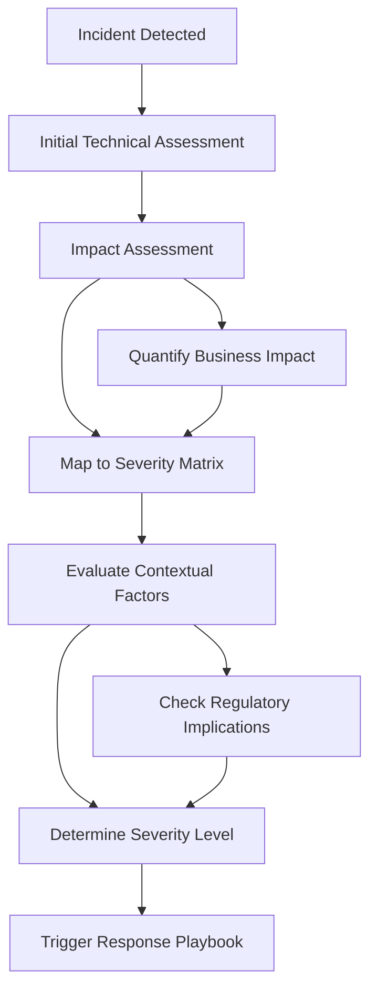

#### Step-by-Step Framework:

1. **Incident Detected**: Begin with the identification of the incident through monitoring systems or user reports.

2. **Initial Technical Assessment**: Analyze the technical symptoms, including error rates, service outages, or transaction failures.

3. **Impact Assessment**: Quantify the business impact using tools like impact calculators to convert technical metrics into measurable business outcomes (e.g., number of affected transactions, revenue impact).

4. **Map to Severity Matrix**: Cross-reference the findings with a multi-dimensional severity matrix that includes customer segments, transaction volumes, financial impact, and regulatory implications.

5. **Evaluate Contextual Factors**: Factor in time-sensitive or contextual considerations, such as peak hours, end-of-month processing, or concurrent high-priority incidents.

6. **Determine Severity Level**: Assign the incident to a severity level (e.g., P1 to P5) based on evidence and mapped criteria.

7. **Trigger Response Playbook**: Initiate the appropriate response playbook, ensuring alignment with predefined escalation paths, communication protocols, and compliance requirements.

This evidence-based methodology leverages tools like quantitative thresholds, automated impact calculators, and regulatory compliance mapping to ensure consistent, objective classification. By integrating technical and business dimensions, this approach minimizes subjectivity, enabling teams to respond proportionally and effectively to incidents.
### Banking Impact

Inappropriate severity classification leads to significant business consequences beyond technical considerations:

1. Resource misallocation where critical incidents are under-resourced while minor issues consume disproportionate attention
2. Regulatory compliance failures when incidents requiring mandatory reporting aren't properly classified
3. Reputation damage when customer-impacting issues aren't treated with appropriate urgency
4. Unnecessary business disruption when minor technical issues trigger excessive response protocols
5. Inconsistent stakeholder experience when similar incidents receive different treatment based on subjective assessment

**Real-World Example: Misclassification Consequences in Banking**

In 2022, a mid-sized financial institution experienced a technical outage that affected a small percentage of their online banking transactions. Due to subjective assessment, the incident was initially classified as a low-severity issue (P4), leading to delayed escalation and a slow response. However, the affected transactions included high-net-worth customers, and the issue coincided with a regulatory reporting deadline.

The misclassification had several downstream effects:
- **Resource Misallocation:** Limited staff were assigned to the incident, delaying resolution and causing frustration among impacted customers.
- **Regulatory Impact:** The delay in addressing the issue led to late reporting, triggering a regulatory fine.
- **Reputation Damage:** News of the affected high-net-worth customers leaked to the media, resulting in public criticism and loss of client trust.

This example underscores the importance of consistent severity classification that accounts for both technical and business dimensions. For financial institutions, such frameworks ensure that incidents are assessed with precision, enabling effective response while safeguarding compliance, reputation, and customer trust.
### Implementation Guidance

Implement effective severity classification with these five practical steps. Use the checklist below or follow the step-by-step diagram for a structured approach.

#### Checklist for Severity Classification Implementation:
- [ ] **Develop a Banking-Specific Classification Matrix**
  - Incorporate factors like transaction types, customer segments, regulatory implications, and financial exposure.
  - Define at least 4 severity levels with clear, measurable thresholds.

- [ ] **Build an Automated Severity Calculator**
  - Create a tool to input impact factors (e.g., error rates, affected services, estimated customer numbers).
  - Ensure the tool aligns with the matrix and calculates severity automatically.

- [ ] **Define Contextual Severity Modifiers**
  - Identify factors that elevate severity (e.g., market trading hours, end-of-quarter processes).
  - Document these modifiers and integrate them into classification workflows.

- [ ] **Create Service-Specific Classification Guides**
  - Develop tailored examples for each major service, mapping P1-P5 scenarios.
  - Ensure guides are easy to reference during incidents.

- [ ] **Establish a Regular Review Process**
  - Conduct quarterly reviews of classifications to compare against actual impacts.
  - Refine thresholds, address misclassifications, and schedule team training based on findings.

#### Step-by-Step Diagram:

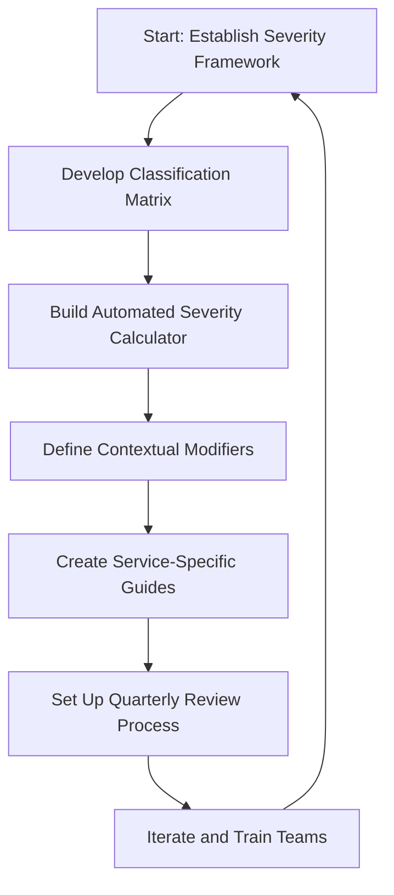

By following this structured approach, teams can ensure consistent and effective severity classification, transforming incident response into a predictable and evidence-driven process.
## Panel 6: The Initial Assessment
### Scene Description

Hector Alavaz is seated at his workstation, focused on creating an initial incident document. His primary monitor displays a structured template with distinct sections: "Affected Services," "Customer Impact," "Initial Timeline," and "Working Hypothesis," each being populated with preliminary information. A clock on the wall indicates that 5 minutes have passed since the alert.

To his left, a secondary monitor shows a video call interface with multiple team members joining to collaborate on the incident. To his right, a third monitor displays real-time dashboard data, featuring metrics and alerts relevant to the ongoing issue. The setup is a hub of activity, balancing documentation, communication, and monitoring.

Below is a text-based representation of Hector Alavaz's workstation layout for better visualization:

```
+----------------------------+   +--------------------------+   +----------------------------+
|                            |   |                          |   |                            |
|      Primary Monitor       |   |  Secondary Monitor       |   |     Tertiary Monitor      |
|  Initial Incident Template |   |   Active Video Call      |   |  Real-Time Dashboards      |
|                            |   |                          |   |  (Metrics and Alerts)     |
+----------------------------+   +--------------------------+   +----------------------------+

                           [Hector Alavaz's Workstation]
```

This configuration emphasizes the centrality of the structured template for capturing key details while ensuring parallel communication and monitoring, essential for an effective initial assessment.
### Teaching Narrative
The initial assessment bridges alert response and full incident investigation. Once an alert is validated and classified, effective SREs quickly establish what is known and unknown before deeper troubleshooting begins. This panel introduces the concept of the "incident snapshot" - a time-bound activity to capture initial observations, affected components, and working hypotheses. In financial environments, this initial assessment creates crucial documentation for regulatory requirements while also preventing multiple responders from duplicating efforts. The assessment isn't about finding root causes but about creating a shared understanding of the incident landscape. This approach replaces the common anti-pattern of responders working in silos with different understanding of the incident scope. The initial assessment becomes the foundation for structured investigation and sets the stage for effective incident command.
### Common Example of the Problem

A global bank's foreign exchange trading platform begins showing elevated error rates during Asian market hours. Multiple teams activate in response, but without an initial structured assessment, the following problems emerge:

| **Time Elapsed** | **Action Taken**                                                                               | **Consequence**                                                                                                    |
| ---------------- | ---------------------------------------------------------------------------------------------- | ------------------------------------------------------------------------------------------------------------------ |
| 0-5 minutes      | Alert triggers and teams activate                                                              | No single leader or central document established to guide the response.                                            |
| 5-10 minutes     | Infrastructure team investigates network issues while application team focuses on code changes | Efforts are uncoordinated, leading to siloed investigations and duplicated work.                                   |
| 10-15 minutes    | Teams work from different data sources and timestamps                                          | Conflicting timelines emerge, delaying identification of when and where the issue started.                         |
| 15-20 minutes    | Business stakeholders request updates                                                          | Inconsistent information is shared as technical teams report individual findings without a unified understanding.  |
| 30 minutes       | Executives ask about customer impact                                                           | No clear answer is available because initial assessment did not systematically capture affected services or users. |

The fragmented response extends resolution time as teams pursue separate investigative paths without a shared understanding of the incident scope, customer impact, or working hypotheses. For example, trading desks lack clear information about which currencies and transaction types are affected, creating uncertainty about whether to route trades through alternate channels. These missteps highlight the cascading impact of an unstructured initial assessment and reinforce the importance of creating a unified "incident snapshot" early in the response process.
### SRE Best Practice: Evidence-Based Investigation

The SRE approach to initial assessment implements a structured, time-boxed process that creates a shared foundation for coordinated response. Below is a checklist summarizing the key methodologies to ensure an effective, evidence-based investigation:

#### Checklist for Evidence-Based Initial Assessment:
1. **Standardized Incident Documentation**
   - Use an approved template to capture essential incident details within the first 5-10 minutes.
   - Focus on defining scope rather than diving into technical specifics.

2. **Service Dependency Mapping**
   - Identify affected services and their dependencies.
   - Assess the potential blast radius to prioritize response efforts effectively.

3. **Impact Qualification Techniques**
   - Quantify customer impact using structured methods:
     - Identify transaction types affected.
     - Estimate failure volumes and financial exposure.

4. **Hypothesis Formulation Protocols**
   - Develop initial hypotheses based on observed symptoms and recent changes.
   - Use these hypotheses to guide structured troubleshooting.

5. **Unified Timeline Construction**
   - Create a single authoritative timeline capturing key events.
   - Reconcile data from monitoring tools, logs, and team observations.

#### Text Diagram: Evidence-Based Initial Assessment Flow

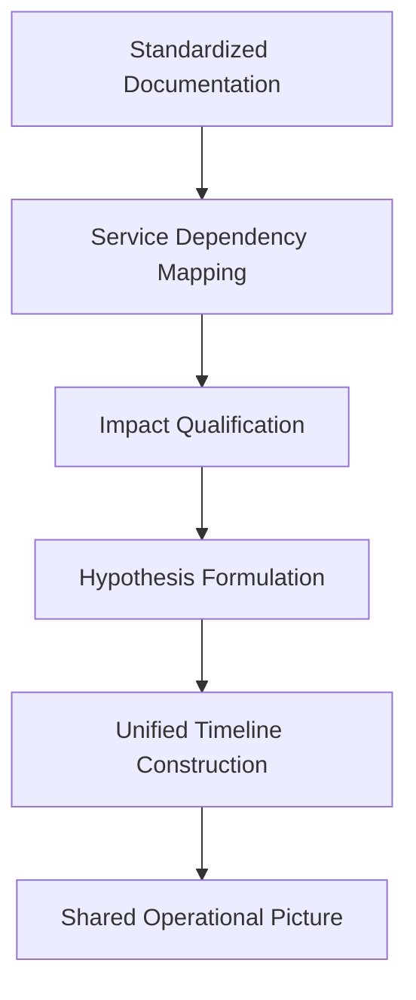

This evidence-based approach ensures a common operational picture, enabling coordinated investigation and response while fulfilling regulatory documentation requirements. Use this checklist and flow as a guide during initial assessments to maintain consistency and efficiency under time pressure.
### Banking Impact

Inadequate initial assessment creates business impacts that extend beyond delayed technical resolution:

1. Increased financial exposure when trading or payment systems operate without clear understanding of which functions are impaired. For example, in high-frequency trading environments, a five-minute delay in identifying impacted systems could result in losses exceeding $500,000 due to missed opportunities or incorrect trades.
2. Compliance documentation gaps when incident details aren't systematically captured from the outset. Think of this as failing to log critical steps in a forensic investigation—it leaves blind spots that can complicate audits and regulatory reporting.
3. Customer communication delays while teams attempt to reconcile conflicting information about incident scope. This is akin to a relay race where runners start off-track, wasting precious time to realign instead of advancing.
4. Resource inefficiency through duplicated investigation efforts and uncoordinated troubleshooting. Imagine multiple mechanics trying to fix a car without agreeing on what’s broken—it wastes time and effort while the car remains non-functional.
5. Extended resolution times due to fragmented understanding of the incident landscape. In financial markets, every minute of downtime can compound exponentially, much like a chain reaction, magnifying the impact across interconnected systems.

For financial market operations, where time directly correlates with financial impact, the minutes saved through structured initial assessment translate directly to reduced trading losses and market exposure. A well-executed initial assessment can mean the difference between containing a $100,000 issue or facing a $1,000,000 cascading failure.
### Implementation Guidance
Implement effective initial assessment with these five practical steps:

1. **Develop standardized assessment templates**: Create service-specific initial assessment documents with pre-populated sections for common failure modes. Include structured fields for affected services, customer impact, known timelines, and initial hypotheses, designed to be completed within 10 minutes of incident declaration.

2. **Implement collaborative documentation tools**: Configure shared incident documentation platforms that allow real-time collaborative editing with clear section ownership. Ensure these platforms are accessible from both office and remote locations with mobile compatibility.

3. **Create service relationship visualizations**: Develop dependency maps for key banking services that can be quickly referenced during initial assessment to understand potential impact propagation. Make these available as interactive diagrams that can be annotated during incidents.

4. **Build assessment verification checklists**: Create brief checklists for validating that initial assessments are complete and accurate before proceeding to full investigation. Include items like "customer impact confirmed through multiple sources" and "all directly connected services evaluated."

5. **Conduct regular assessment drills**: Practice creating initial assessments using historical or simulated incident data, with timers to reinforce the time-bound nature of this activity. Score assessments on both speed and accuracy to develop team proficiency.
## Panel 7: Automated Response and Self-Healing Systems
### Scene Description

```markdown
### Scene Description

A modern NOC with advanced monitoring systems is depicted. The main display highlights an automated response system addressing a payment processing error that was automatically detected and remediated. Below is a timeline illustrating the flow of events:

```
+----------------+-------------------------+
| Event          | Timestamp              |
+----------------+-------------------------+
| Alert Generated| 03:42:15               |
| Automated Recovery Initiated |03.42:18|
| Service Restored              03:42:34
### Teaching Narrative
The evolution of incident response includes eliminating human intervention for known failure modes. This final panel introduces the concept of automated remediation and self-healing systems - the ultimate maturation of alert response. While traditional operations rely on humans to execute recovery steps, mature SRE practices implement automation that can detect and resolve common issues without human intervention. In banking systems, where downtime has immediate financial impact, automated recovery significantly reduces mean time to repair (MTTR). However, financial services also require careful consideration of when automation is appropriate, as incorrect remediation can potentially compound issues or violate regulations. The panel explores the balance between automated response for well-understood failure modes and human judgment for complex scenarios, introducing concepts like gradual automation, canary testing for remediation scripts, and using post-remediation analysis to continuously improve automated responses.
### Common Example of the Problem

A large bank's credit card authorization system experiences periodic connection pool exhaustion during peak shopping periods. The standard manual remediation process involves several steps, each introducing delays and potential for error. Below is a breakdown of the typical workflow and its time impact:

| Step # | Action                                              | Estimated Time (minutes) |
| ------ | --------------------------------------------------- | ------------------------ |
| 1      | Verify that the issue is connection pool saturation | 2-4                      |
| 2      | Check for unusual transaction patterns              | 3-5                      |
| 3      | Restart the connection management service           | 4-6                      |
| 4      | Verify restoration of processing capacity           | 2-3                      |
| 5      | Monitor for recurrence over 15 minutes              | 15                       |

**Total Time to Resolution:** 12-20 minutes

This process, while effective, is entirely manual and introduces significant delays in restoring service. During this time, thousands of credit card transactions are declined, leading to customer frustration and lost revenue. The issue has occurred 14 times in the past year, with identical symptoms and resolution steps each time. Despite the predictable nature of the problem and its solution, the reliance on engineer intervention creates undue operational inefficiency.

The following flowchart illustrates the manual remediation process:

```mermaid
flowchart TD
    A[Alert Generated] --> B[Verify Connection Pool Saturation]
    B --> C[Check for Unusual Transaction Patterns]
    C --> D[Restart Connection Management Service]
    D --> E[Verify Processing Capacity Restored]
    E --> F[Monitor for Recurrence (15 mins)]
    F --> G[Resolution Complete]
```
### SRE Best Practice: Evidence-Based Investigation

The SRE approach to automated remediation implements a progressive automation strategy based on failure pattern recognition and risk assessment. Key methodologies include:

1. **Remediation automation assessment**: Systematically evaluating incident types for automation potential based on frequency, consistency of resolution steps, verification capability, and risk profile.

2. **Graduated automation implementation**: Developing automation along a spectrum from notification-only to fully automated recovery, with appropriate human verification gates based on risk level.

3. **Canary remediation techniques**: Implementing automated fixes on small subsets of affected components first, verifying success before expanding to the full scope, limiting potential negative impact.

4. **Decision tree automation**: Creating structured logic that evaluates multiple data points before triggering remediation, mimicking the human decision process while executing at machine speed. Below is an example of a simple decision tree for automating database failover:

   ```python
   def automate_failover(db_health, replication_status, latency):
       if db_health == "unhealthy":
           if replication_status == "synced" and latency < 100:
               trigger_failover()
               return "Failover triggered"
           else:
               log_issue("Replication or latency issue detected. Manual review required.")
               return "Failover deferred for manual review"
       else:
           return "No action needed. Database is healthy."
   ```

5. **Post-execution verification**: Building comprehensive automated checks that validate successful remediation, including customer-perspective testing rather than just internal metrics.

#### Checklist for Implementing Evidence-Based Automation
- [ ] Identify recurring incidents and document failure patterns.
- [ ] Assess feasibility of automation based on resolution consistency and risk profile.
- [ ] Develop automation scripts with clear decision logic (e.g., decision trees).
- [ ] Test automation on canary environments or subsets of affected systems.
- [ ] Implement robust post-remediation verification steps:
  - [ ] Validate service metrics and logs.
  - [ ] Test from a customer perspective (e.g., end-to-end transactions).
- [ ] Monitor and iterate based on results of automated remediations.

This evidence-based approach automates repetitive remediation while maintaining appropriate safeguards for financial services environments.
### Banking Impact

Manual response to well-understood failure patterns creates preventable business impacts:

1. Extended transaction outages for predictable, recurrent issues that could be resolved in seconds rather than minutes.
2. Competitive disadvantage in payment processing where transaction approval rates directly affect customer card preference and merchant relationships.
3. Unnecessary off-hours engineer activation, contributing to team burnout and increased operational costs.
4. Inconsistent remediation quality when different engineers apply slightly different approaches to identical problems.
5. Missed opportunity to redirect engineering talent from repetitive operational tasks to service improvement initiatives.

#### Quantitative Example: High-Volume Shopping Period
Consider a payment processing system handling 500 transactions per second during a peak shopping event, such as Black Friday. A failure causing a 5-minute manual response outage could result in 150,000 failed transactions. Assuming an average transaction value of $50, this equates to $7.5 million in lost revenue. By implementing automated recovery that resolves the issue in 20 seconds, the loss is reduced to just 10,000 transactions, or $500,000—a 93% reduction in financial impact.

#### Case Study: Automated Recovery in Action
During a holiday season promotion, a large retail bank experienced a surge in transaction volume. A known failure mode in their payment gateway triggered an automated response system. The system detected the issue at 14:03:12, initiated recovery at 14:03:15, and restored service by 14:03:30. In total, only 18 seconds of downtime occurred, preserving over 99.5% of transactions during the incident. Post-incident analysis revealed that prior to automation, similar failures averaged 8 minutes to resolve, often requiring multiple engineers to triage and fix. The automation not only reduced mean time to repair (MTTR) but also saved an estimated $2.4 million in prevented transaction loss and avoided operational costs.

For payment processing systems, where each transaction represents both revenue and customer experience, automating remediation for well-understood failure modes ensures both financial and reputational resilience.
### Implementation Guidance

Implement appropriate automated remediation with these five practical steps. Use the following checklist and visual guide to ensure a structured and effective approach:

#### Step-by-Step Checklist

1. **Conduct Remediation Pattern Analysis**
   - [ ] Review incident records from the past 12 months.
   - [ ] Identify recurring issues with consistent resolution patterns.
   - [ ] Categorize issues based on:
     - Frequency of occurrence.
     - Resolution consistency.
     - Business impact.
     - Ease of verification.
   - [ ] Prioritize automation candidates based on the above factors.

2. **Develop an Automation Risk Framework**
   - [ ] Define clear criteria for determining automation levels.
   - [ ] Assess risks in terms of:
     - Transaction integrity.
     - Regulatory compliance.
     - Verification complexity.
     - Potential negative impact.
   - [ ] Document the framework for use in decision-making processes.

3. **Implement Progressive Automation Levels**
   - [ ] Start with "human-approved automation":
     - Scripts prepare remediation but require manual approval for execution.
   - [ ] Advance to fully automated solutions:
     - Ensure they are applied only to proven remediations.
     - Include comprehensive verification capabilities.

4. **Create Automated Verification Suites**
   - [ ] Develop post-remediation testing to validate success, covering:
     - Service availability.
     - Transaction processing capability.
     - Data integrity.
     - Customer experience.
   - [ ] Define criteria for marking remediation as complete.

5. **Establish Automated Remediation Governance**
   - [ ] Set up review processes for all automated remediation activities.
   - [ ] Monitor the following performance metrics:
     - Success rate.
     - MTTR impact.
   - [ ] Conduct regular code reviews and audits.
   - [ ] Implement continuous improvement cycles based on:
     - Execution data.
     - Evolving system knowledge.

#### Visual Guide: Automation Workflow

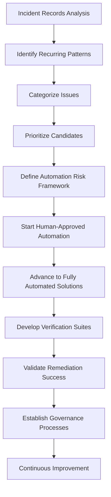