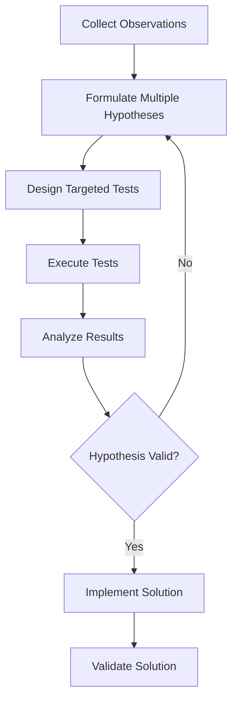
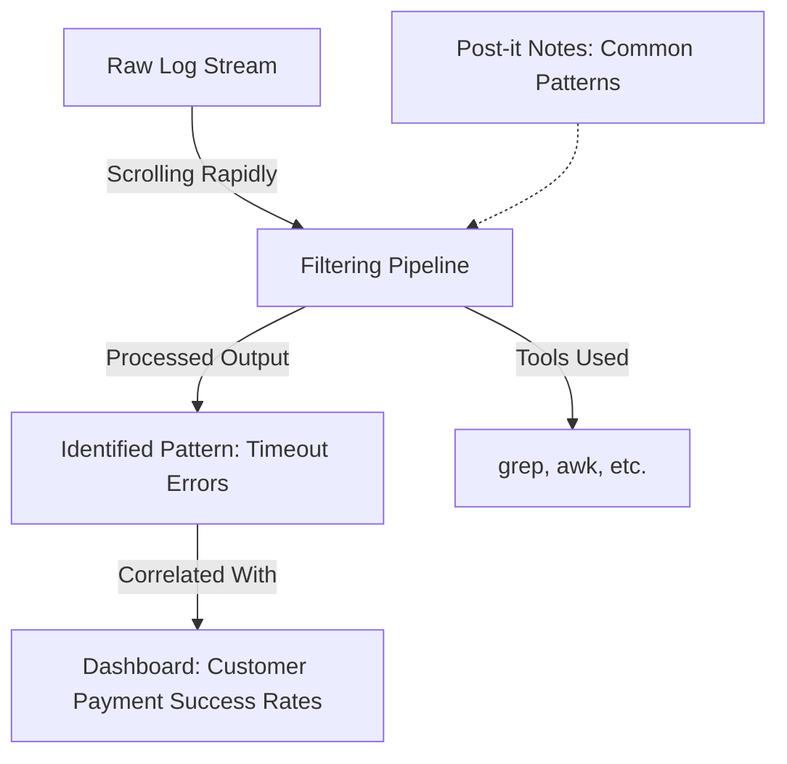
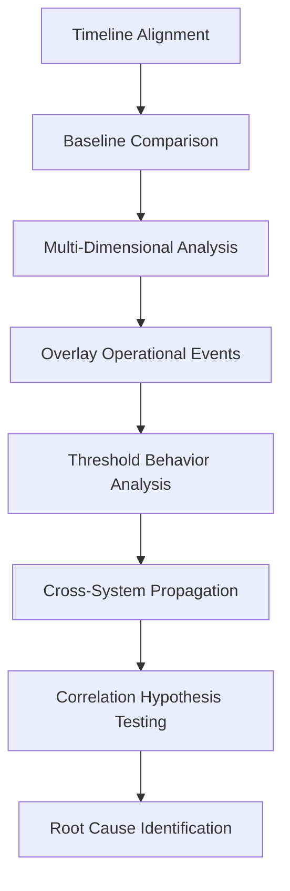
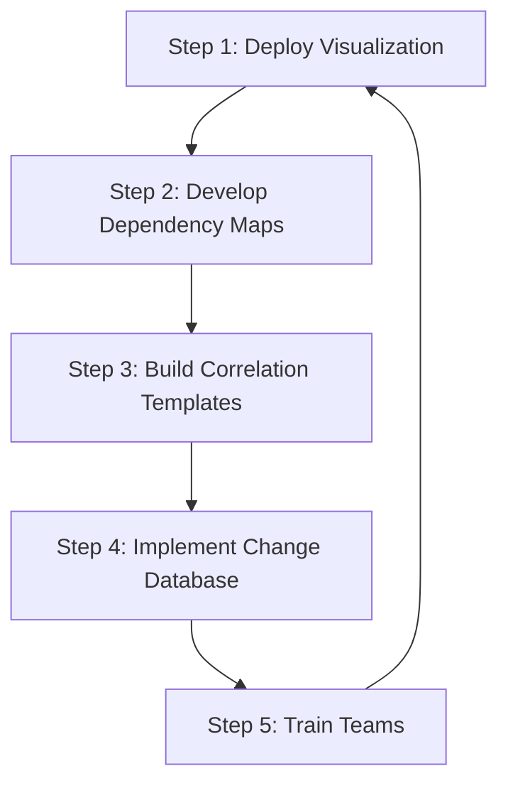
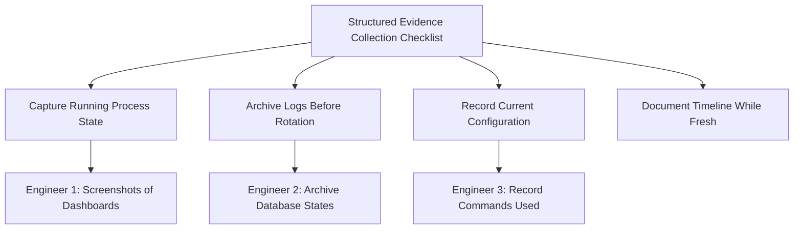

# Chapter 4: Structured Investigation Methodologies

## Chapter Overview

Welcome to the SRE equivalent of CSI: Banking Edition. This chapter is your crash course in not screwing up incident investigations—because in financial systems, wild guessing and “fix and hope” are good ways to set piles of money on fire (and invite the wrath of both customers and regulators). We’re talking about structured methodologies, not the “turn it off and on again” school of ops. You’ll learn to separate signal from noise, hunt down root causes with the scientific method, and preserve evidence like a digital Sherlock Holmes. Think of this as your toolkit for turning outages from expensive whodunits into routine, efficient crime scenes—complete with checklists, reproducible test cases, and zero tolerance for magical thinking. If you’re still treating symptoms or chasing vague log lines, buckle up. This is where SREs become fixers, not firefighters.

---
## Learning Objectives

- **Apply** the scientific method to incident investigation, moving from panic-driven fixes to evidence-based troubleshooting.
- **Dissect** massive log streams to extract actionable patterns instead of drowning in noise.
- **Correlate** and **differentiate** between “correlation” and “causation” using metric detective work (and avoid the classic “post hoc, ergo propter hoc” facepalm).
- **Trace** transactions end-to-end across a labyrinth of microservices, exposing hidden dependencies and bottlenecks.
- **Profile** systems at the code and infrastructure level to pinpoint the real performance vampires, not just the usual suspects.
- **Capture** and **preserve** volatile post-incident data before it vanishes, ensuring you can actually learn from what just happened.
- **Construct** minimal, reproducible test cases that turn mysterious outages into testable, fixable bugs.
- **Deploy** playbooks, tools, and training to institutionalize structured investigation across your organization.

---
## Key Takeaways

- If you’re “fixing” symptoms without evidence, you’re not solving problems—you’re just buying time until the next, bigger incident (and possibly a regulatory slap).
- Logs aren’t helpful unless you can filter out 99.9% of the garbage—otherwise, you’re just looking for a needle in a burning haystack.
- Metrics alone rarely tell the whole story. Correlate timelines and operational events, or prepare to waste a fortune scaling the wrong thing.
- Distributed tracing will expose the real villain behind multi-service outages—stop guessing, start mapping transaction journeys.
- Profiling isn’t optional if you care about performance. Without it, you’ll keep overprovisioning hardware and underdelivering to customers.
- Forgetting post-incident data collection is like leaving the crime scene before dusting for fingerprints—don’t expect to solve the case later.
- If you can’t reproduce the failure, you haven’t solved it. “It just went away” is not an acceptable root cause in banking.
- Regulators don’t care about your excuses. If you can’t show your work, expect fines, audits, and a lot of awkward meetings.
- Structured, methodical investigation is the only way to break the cycle of recurring incidents, spiraling costs, and customer rage.
- “Just do what worked last time” is not a strategy. Build institutional memory and playbooks, or repeat your mistakes forever.

---
## Panel 1: Beyond Symptoms - The Scientific Method for Incident Investigation
### Scene Description

In a dimly lit incident war room, Katherine stands at a whiteboard divided into four columns, each clearly labeled: "Observations," "Hypotheses," "Tests," and "Results." Each column contains neatly written notes, with arrows connecting related items across the columns, creating a web of potential causes and effects. Below is a simplified representation of the whiteboard setup:

```
+-------------------+-------------------+-------------------+-------------------+
|   Observations    |    Hypotheses     |       Tests       |      Results      |
+-------------------+-------------------+-------------------+-------------------+
| - High CPU usage  | - Lock contention | - Simulate load   | - Confirmed DB    |
| - Slow queries    | - Query patterns  | - Analyze logs    |   locks causing   |
| - Error spikes    | - Disk I/O issue  | - Run metrics     |   slow queries    |
+-------------------+-------------------+-------------------+-------------------+
```

Digital clocks showing different time zones hang on the wall, with one prominently displaying "Incident Duration: 47 minutes." Around the room, team members are in various states of focus—some examining dashboards, others scrolling through logs. Katherine methodically draws lines between observed symptoms and possible causes, crossing out disproven hypotheses while circling a promising lead about transaction database locks. The structured setup of the whiteboard serves as a visual guide, keeping the team aligned on the investigation's progress and next steps.
### Teaching Narrative
When faced with a banking system incident, the natural human impulse is to jump directly to fixing what looks broken. This reactive approach, while understandable, often leads to treating symptoms rather than identifying true root causes.

The scientific method—a cornerstone of structured investigation in SRE—transforms incident response from reactive firefighting to systematic problem-solving. By clearly separating observations (what we know) from hypotheses (what we think might be happening), we create a foundation for evidence-based decision-making.

In this scene, Katherine demonstrates the disciplined approach that distinguishes SRE investigators from traditional operations teams. Rather than immediately implementing fixes based on the most obvious symptoms, he's guiding the team through a methodical process: documenting observed behaviors, generating multiple plausible hypotheses, designing specific tests to validate or disprove each hypothesis, and recording results to narrow down the investigation.

This structured approach prevents common pitfalls like confirmation bias (looking only for evidence that supports your initial guess) and premature remediation (fixing symptoms while leaving root causes intact). For banking systems where incorrect remediation can compound financial impact, this methodical approach isn't just good practice—it's essential for maintaining system integrity during incident resolution.
### Common Example of the Problem

A major retail banking platform begins experiencing intermittent payment failures during peak hours. The initial alerts show increased error rates on the payment gateway microservice. The operations team, under pressure to resolve the highly visible issue, immediately focuses on the payment service itself—restarting instances, scaling up capacity, and reviewing recent code changes to that specific service. However, these actions only provide temporary relief.

The timeline below illustrates the sequence of events during this incident:

```mermaid
gantt
    title Incident Timeline: Symptom-Focused Investigation
    dateFormat HH:mm
    axisFormat %H:%M
    section Alerts and Symptoms
    09:00: Alert: Increased error rates on payment gateway :done, 09:00, 09:02
    09:02: Customer complaints about payment failures begin :done, 09:02, 09:05
    section Initial Actions
    09:05: Restart payment gateway service (1st attempt) :done, 09:05, 09:10
    09:15: Temporary improvement, errors return :done, 09:15, 09:20
    09:20: Restart payment gateway service (2nd attempt) :done, 09:20, 09:25
    09:30: Scaling up payment service capacity :done, 09:30, 09:35
    09:40: Errors persist, customer complaints increase :crit, 09:40, 09:45
    section Root Cause Discovery
    10:00: Authentication service issue identified :active, 10:00
    10:10: Auth service timeouts cascading to payment service :active, 10:10
    10:20: Corrective action taken on authentication service :done, 10:20, 10:30
    10:30: Errors resolved, system stabilizes :done, 10:30, 10:35
```

Two hours into the incident, transaction volume has dropped by 35% as frustrated customers abandon payment attempts. The true cause—a degraded authentication service causing timeout cascades—remains unidentified until much later because the team prematurely fixated on the most visible symptom rather than methodically investigating possible causes.

This example highlights the risks of symptom-focused investigation. A structured approach, such as the scientific method, can prevent wasted effort, reduce incident duration, and minimize customer impact by ensuring all potential causes are systematically explored and validated.
### SRE Best Practice: Evidence-Based Investigation

The scientific method applied to incident investigation follows a structured path. Use the checklist below to ensure each step is systematically followed during an incident:

#### Checklist for Evidence-Based Incident Investigation

- [ ] **Collect Observations**
  - Gather all available data about the incident without interpretation.
  - Include error rates, affected services, timing patterns, and customer impact.
  - Document facts precisely with timestamps and specific metrics.

- [ ] **Formulate Multiple Hypotheses**
  - Generate several plausible explanations for the observed behavior.
  - Consider common causes for payment systems, such as:
    - Backend database contention.
    - Authentication service degradation.
    - Third-party payment processor issues.
    - Network latency problems.
    - Effects of recent deployments.

- [ ] **Design Targeted Tests**
  - For each hypothesis, create tests that produce different results depending on whether the hypothesis is correct.
  - Example: If database contention is suspected, design a test to check query execution times or lock wait statistics.

- [ ] **Execute Tests and Analyze Results**
  - Perform each test methodically while documenting the results.
  - Treat tests that confirm or eliminate hypotheses as equally valuable—they both narrow the problem space.

- [ ] **Refine Hypotheses**
  - Use test results to eliminate disproven hypotheses.
  - Refine remaining hypotheses and continue testing iteratively until the root cause is identified with high confidence.

- [ ] **Implement and Validate Solutions**
  - Apply targeted fixes based on confirmed root causes, not symptoms.
  - Verify that the implemented solution resolves the root issue and does not merely mask it.

#### Example Workflow (Mermaid Diagram)



#### Why This Matters
Evidence from financial service organizations shows this approach reduces mean time to resolution by up to 60% compared to unstructured troubleshooting, particularly for complex, distributed system failures. By transforming incident investigation into a methodical and evidence-based process, SRE teams ensure they address root causes effectively and minimize operational risk.
### Banking Impact

The business consequences of focusing on symptoms rather than root causes in banking incidents are severe. The following table summarizes key impacts, along with metrics and examples to illustrate their significance:

| **Impact Area**              | **Description**                                                                                                          | **Metrics**                                       | **Examples**                                                                                  |
| ---------------------------- | ------------------------------------------------------------------------------------------------------------------------ | ------------------------------------------------- | --------------------------------------------------------------------------------------------- |
| **Extended Outage Duration** | Failed remediation attempts prolong the incident timeline, increasing financial losses.                                  | Average cost: $300,000/hour for mid-sized banks   | A payment processor outage lasting 3 hours results in $900,000 in lost revenue.               |
| **Reputation Damage**        | Repeated service disruptions frustrate customers more than a single, longer outage and erode trust.                      | 28% of customers consider switching providers     | Customers abandon mobile apps after experiencing repeated failed transaction attempts.        |
| **Regulatory Scrutiny**      | Financial regulators demand structured incident investigations, and poor documentation creates compliance risks.         | Rising number of fines and audit findings         | A bank faces fines for failure to provide root cause analysis during an audit.                |
| **Resource Inefficiency**    | Unstructured investigations escalate unnecessarily and involve redundant efforts, inflating resolution costs.            | +30-40% in resolution costs due to inefficiencies | Multiple teams working in parallel on false leads delay incident resolution by several hours. |
| **Recurring Incidents**      | Lack of root cause analysis leads to repeated failures, increasing operational disruptions and customer dissatisfaction. | 3-4x higher recurrence rate for unresolved issues | A database lock issue recurs weekly, causing regular payment delays for customers.            |

This concise breakdown highlights how symptom-focused troubleshooting can compound financial, operational, and reputational risks in banking. Adopting structured investigation practices mitigates these risks and ensures more resilient system operations.
### Implementation Guidance
To implement scientific method-based incident investigation in your banking organization:

1. **Create Hypothesis Templates**: Develop standardized templates for common banking service failures (payment processing, account access, data retrieval) that prompt investigators to document observations separately from hypotheses and include specific, testable predictions for each hypothesis.

2. **Establish Test Libraries**: Build a repository of pre-defined diagnostic tests for common hypotheses, including SQL queries to check database health, API calls to verify service responses, and scripts to validate authentication flows—allowing faster testing during incidents.

3. **Implement Collaborative Documentation**: Deploy shared, real-time incident documentation tools where observations, hypotheses, test results, and conclusions are visible to all responders, preventing duplicate efforts and preserving the investigation trail.

4. **Conduct Training Simulations**: Run regular tabletop exercises simulating complex banking incidents where teams practice applying the scientific method, with experienced facilitators guiding them away from premature conclusions and symptom-chasing.

5. **Review Investigation Quality**: Establish post-incident metrics that evaluate not just time-to-resolution but the quality of the investigation process—tracking metrics like "percentage of incidents with multiple tested hypotheses" and "resolution attempts before root cause identification."
## Panel 2: The Art of Log Analysis - Finding Signal in the Noise
### Scene Description

A split-screen view shows Sarah, an SRE, at her workstation with multiple terminal windows open. On the left, a raw log stream scrolls rapidly with thousands of entries highlighted in various colors. On the right, she's constructed a precise filtering pipeline using grep, awk, and other tools that has distilled the chaotic stream into a clear pattern: periodic timeout errors occurring exactly 30 seconds after each batch of payment authentication requests. Post-it notes with common log filtering patterns are stuck to her monitor's edge, and a dashboard shows customer payment success rates dropping in sync with the pattern she's identified.

Below is a conceptual representation of Sarah's workspace:



This diagram illustrates the flow from the chaotic raw log stream on the left to the distilled and actionable insights Sarah uncovers using her filtering pipeline. It also highlights how the identified pattern correlates with the customer-facing impact visible on the dashboard, while emphasizing the supporting tools and notes that guide her analysis.
### Teaching Narrative
In modern banking systems, the challenge isn't a lack of logs—it's drowning in them. When a critical payment service fails, millions of log lines may be generated across dozens of interconnected components. The ability to rapidly extract meaningful patterns from this deluge is what separates effective SREs from those who remain stuck in analysis paralysis.

Log analysis is both art and science. The science lies in understanding log structures, building effective filtering techniques, and applying statistical approaches to identify anomalies. The art comes from developing intuition about which logs matter most and recognizing subtle patterns that machines might miss.

Sarah demonstrates key SRE log analysis practices: starting with a wide view to understand the scale and scope of the issue, progressively applying filters to eliminate noise, correlating logs across multiple services, focusing on timing patterns and error frequency, and connecting log patterns to observable customer impact.

Unlike traditional monitoring approaches that might simply count error messages, she's examining the relationship between different system behaviors—in this case, discovering that authentication batch processing is triggering downstream timeouts. This correlation becomes a crucial clue that wouldn't be visible in any single dashboard or alert.

For banking systems handling thousands of transactions per second, effective log analysis can mean the difference between a minor incident with limited impact and a prolonged outage affecting millions of customers. While automated analysis tools help, the skilled SRE investigator still plays a critical role in connecting technical signals to real-world financial implications.
### Common Example of the Problem

A global banking platform's foreign exchange system begins rejecting a subset of currency conversion requests around month-end processing. The monitoring dashboard shows only general error rates without clear patterns. The logs contain over 10 million entries per hour across 30 microservices. Initial investigation attempts become overwhelming as teams try to manually scan logs from multiple systems. Support agents report that certain international business customers are experiencing transaction rejections, but patterns are unclear. After six hours of unfocused log review and escalation to multiple teams, frustration mounts as investigators continue to be overwhelmed by the volume and complexity of log data without a coherent investigation strategy.

#### Investigation Timeline and Key Challenges

**00:00 - 01:00**
- **Event:** Alerts triggered for increased error rates on the foreign exchange system.
- **Actions:** Teams begin broad log scans across multiple services, but no clear root cause emerges.
- **Challenge:** Lack of filtering strategy leads to analysis paralysis amidst massive log volumes.

**01:00 - 02:30**
- **Event:** Support agents report transaction failures primarily affecting international business customers.
- **Actions:** Teams attempt to cross-reference customer reports with system logs, but patterns remain unclear.
- **Challenge:** Difficulty correlating logs across 30 microservices due to inconsistent log formats and timestamps.

**02:30 - 04:00**
- **Event:** Engineers escalate the issue to additional teams, leading to duplicated efforts and miscommunication.
- **Actions:** Ad-hoc log parsing with tools like `grep` and `awk` begins, but no systematic approach is applied.
- **Challenge:** Lack of centralized investigation ownership leads to redundant and fragmented analysis.

**04:00 - 05:00**
- **Event:** A subtle pattern is noticed—timeouts occurring every 30 minutes align with a specific batch-processing job.
- **Actions:** Investigators focus on logs related to the batch job but struggle to isolate relevant entries.
- **Challenge:** High noise-to-signal ratio in logs slows the identification of actionable insights.

**05:00 - 06:00**
- **Event:** Teams finally pinpoint the issue: a misconfigured authentication service is causing cascading timeouts.
- **Actions:** The configuration is adjusted, and error rates decline. Post-mortem planning begins.
- **Challenge:** The six-hour delay in identifying the root cause highlights the need for more effective log analysis workflows.

#### Checklist for Effective Log Analysis in Similar Scenarios
- **Start Broad:** Understand the scale of logs and the scope of the issue before diving into specifics.
- **Correlate Logs:** Align logs across services by normalizing timestamps and identifying shared identifiers (e.g., request IDs).
- **Iterative Filtering:** Use tools like `grep`, `awk`, `jq`, or log aggregators to progressively filter irrelevant entries.
- **Focus on Patterns:** Look for timing anomalies, repeated error codes, or correlations with external events.
- **Centralize Ownership:** Assign a lead investigator to coordinate log analysis and reduce duplicated efforts.
- **Document Findings:** Keep a running record of observations and hypotheses to maintain focus and aid post-mortem reviews.
### SRE Best Practice: Evidence-Based Investigation

Effective log analysis in complex banking systems follows a structured methodology:

1. **Scoping the Investigation**:  
   Begin with temporal correlation—identifying when errors started and establishing a time window for investigation. This immediately reduces the volume of logs to analyze.  
   Example command:
   ```bash
   grep "ERROR" application.log | awk '$1 >= "2023-10-01T12:00:00" && $1 <= "2023-10-01T13:00:00"'
   ```

2. **Progressive Filtering**:  
   Apply successive filters to reduce noise while preserving signal. Start with error-level logs during the affected time period, then narrow to specific services or transaction types showing failures.  
   Example command:
   ```bash
   grep "ERROR" application.log | grep "PaymentService" | grep "timeout"
   ```

3. **Pattern Recognition**:  
   Look for recurring patterns in error messages, timestamps, user IDs, or transaction types. Use tools like `awk`, `grep`, and `sed` to extract and count similar log entries, revealing hidden patterns.  
   Example commands:
   - Count occurrences of a specific error message:
     ```bash
     grep "timeout" application.log | awk '{print $5}' | sort | uniq -c
     ```
   - Extract suspicious transaction IDs:
     ```bash
     grep "timeout" application.log | sed -n 's/.*TransactionID:\([0-9]*\).*/\1/p'
     ```

4. **Contextual Enhancement**:  
   Correlate raw error logs with business context by joining transaction IDs across systems to follow customer journeys. This connects technical failures to customer impact.  
   Example command:
   ```bash
   grep -f transaction_ids.log payment_service.log | grep "customer_id"
   ```

5. **Timing Analysis**:  
   Examine precise timings between related events, looking for consistent delays, timeouts, or synchronization issues that indicate systemic problems rather than random failures.  
   Example command:
   ```bash
   awk '{print $1, $2}' application.log | sort | uniq -c
   ```

6. **Frequency Analysis**:  
   Quantify error frequency and distribution, distinguishing between constant background errors and significant spikes that correlate with customer impact.  
   Example command:
   ```bash
   grep "timeout" application.log | awk '{print $1}' | sort | uniq -c
   ```

7. **Cross-Service Correlation**:  
   Compare logs across interdependent services to identify causal relationships, particularly focusing on services that communicate in sequence during transaction processing.  
   Example command:
   ```bash
   grep "TransactionID:12345" serviceA.log serviceB.log serviceC.log
   ```

This methodical approach, supported by practical tooling, transforms log analysis from overwhelming chaos to systematic investigation, enabling the identification of subtle patterns that explain complex failures in banking systems.
### Banking Impact

Ineffective log analysis in banking environments leads to substantial business impacts. The following table summarizes key impacts, associated metrics, and their implications:

| **Impact**                                  | **Description**                                                                     | **Key Metrics**                                    | **Implications**                                                             |
| ------------------------------------------- | ----------------------------------------------------------------------------------- | -------------------------------------------------- | ---------------------------------------------------------------------------- |
| **Extended Mean Time to Resolution (MTTR)** | Immature log analysis capabilities increase resolution times for complex incidents. | 3.5x longer MTTR for complex issues                | Prolonged customer impact and higher operational strain.                     |
| **Transaction Integrity Risks**             | Poor log diagnostics lead to unresolved transaction integrity issues.               | 70 person-hours per incident for manual resolution | Increased operational costs and financial reconciliation challenges.         |
| **Compliance Exposure**                     | Inadequate log analysis creates gaps in audit trails for financial transactions.    | Regulatory fines or audit failures                 | Potential legal and financial penalties, damaging organizational reputation. |
| **Support Cost Escalation**                 | Lack of root cause clarity drives higher tier escalations during incidents.         | 3x cost increase per escalation tier               | Elevated operational expenses and strained support teams.                    |
| **Customer Experience Degradation**         | Undiagnosed system issues lead to random transaction failures.                      | 18-point average drop in NPS during incidents      | Erosion of customer trust and reduced customer retention.                    |

This overview highlights how ineffective log analysis amplifies risks, costs, and customer dissatisfaction in banking systems. By improving log analysis practices, organizations can mitigate these impacts and ensure smoother financial operations.
### Implementation Guidance

To enhance log analysis capabilities in your banking environment, follow this step-by-step guide:

#### Step 1: Standardize and Structure Logs
- **Action**: Implement consistent structured logging across all banking services.
- **Key Fields to Include**: Transaction IDs, customer IDs, service names, timestamps, and error codes.
- **Outcome**: Enables seamless correlation of logs across system boundaries and simplifies downstream analysis.

#### Step 2: Build a Centralized Logging Infrastructure
- **Action**: Set up a centralized log aggregation platform.
- **Features to Include**:
  - Indexing capabilities for fast searches.
  - Real-time log ingestion and analysis.
  - Retention policies compliant with regulatory requirements for financial data.
- **Outcome**: A single source of truth for logs across distributed systems.

#### Step 3: Develop Service-Specific Analysis Playbooks
- **Action**: Create playbooks for high-priority banking services (e.g., payments, trading, authentication).
- **Content to Include**:
  - Service-specific filtering patterns (e.g., `grep`/`awk` commands).
  - Known critical error signatures and thresholds.
  - Common log correlation points between services.
- **Outcome**: Speeds up incident response by providing tailored analysis guides.

#### Step 4: Create Custom Analysis Tools
- **Action**: Design tools tailored to your banking environment.
- **Key Features**:
  - Ability to extract and correlate key fields (e.g., transaction timelines).
  - Visualization of cross-service dependencies and latency trends.
- **Outcome**: Reduces manual effort and highlights systemic issues faster.

#### Step 5: Establish Log Analysis Training
- **Action**: Conduct hands-on training for SREs and operational teams.
- **Training Format**:
  1. Use sanitized logs from real incidents.
  2. Start with basic filtering exercises, then progress to complex correlation scenarios.
  3. Include quizzes or challenges to build pattern recognition skills.
- **Outcome**: Teams gain practical experience and develop intuition for detecting anomalies.

#### Step 6: Implement a Continuous Improvement Loop
- **Action**: Regularly review and refine your log analysis practices.
- **Steps**:
  - Gather feedback from incident postmortems.
  - Update playbooks and tools based on lessons learned.
  - Monitor trends in log usage and adapt infrastructure as needed.
- **Outcome**: Your log analysis framework evolves with your banking system’s complexity.

#### Checklist Summary
- [ ] Logs are standardized with mandatory fields.
- [ ] Centralized logging infrastructure is operational.
- [ ] Service-specific playbooks are documented and accessible.
- [ ] Custom analysis tools are deployed and user-friendly.
- [ ] Hands-on training sessions are conducted quarterly.
- [ ] Continuous improvement processes are in place.

By following these steps, your team can transform overwhelming log data into actionable insights, ensuring rapid and effective responses to incidents in a high-stakes banking environment.
## Panel 3: Metrics Detective Work - Correlation and Causation
### Scene Description

In a glass-walled conference room converted into an incident bridge, Dev and Priya stand before a large display showing multiple metric graphs from a trading platform dashboard. Using tablet styluses, they've annotated a timeline with key events, including:

- "API Gateway Change"
- "Traffic Spike"
- "First Error Reports"
- "Database Contention Alert"

The timeline reveals a clear sequence of events: the database connection count begins steadily climbing, followed by a sudden spike in average response time after a 3-minute gap. A third metric graph shows trading volumes remaining constant, contradicting the initial assumption that the traffic spike was the root cause.

Priya points out an unusual relationship between the database connection pattern and a recent code deployment, drawing a connection that hadn't been immediately obvious. Team members on video calls observe intently as the timeline and graphs are analyzed.

Below is a textual representation of their annotated timeline and metric patterns:

```
Timeline:                     |---------------------------3 min gap---------------------------|
Event:       API Gateway Change   Traffic Spike   First Error Reports   Database Contention Alert
Metric 1:    |----------------->   |                       |                            |
             Database connection count steadily climbing
Metric 2:    |----------------->   |                       |                            |
             Avg. response time normal        Sudden spike in response time
Metric 3:    Trading volumes remain constant throughout
```

This visualization helps highlight the critical 3-minute gap between the rising database connection count and the performance degradation, guiding the team toward identifying a potential connection leak in the newly deployed code.
### Teaching Narrative
When systems fail, they rarely announce the root cause directly. Instead, they leave behind a trail of metric breadcrumbs that skilled investigators must follow. The challenge in complex banking systems is distinguishing correlation (things that happen together) from causation (one thing actually causing another).

Metric investigation is fundamentally about timeline reconstruction and pattern recognition. In this scene, Dev and Priya demonstrate advanced SRE investigation techniques by creating a visual timeline that merges system metrics with operational events. By annotating the sequence precisely, they've uncovered something the initial alerts missed: the critical relationship between gradually increasing database connections and the sudden performance collapse.

This approach challenges the common tendency to focus solely on metrics that are currently in alarm state. Often, the most important clues come from metrics that changed subtly before the obvious alarms triggered—like the database connection count that began climbing before performance degraded.

For financial trading platforms where milliseconds matter, understanding the precise sequence and timing of metric changes is essential. The 3-minute gap between rising connection count and performance degradation reveals a critical system relationship: the database maintained performance until a specific threshold was breached, creating a non-linear response pattern that explains why the system appeared healthy until it suddenly wasn't.

By combining metric analysis with deployment history, the team can now form a hypothesis about a potential connection leak in the recently deployed code—a hypothesis that wouldn't have emerged from looking at individual alerts or dashboards in isolation.
### Common Example of the Problem

A major investment bank's trading platform experiences severe performance degradation during market hours, with trade execution times increasing from milliseconds to several seconds. Initial alerts focus only on the high latency in the order execution service. The incident response team immediately blames increased market volatility and trading volume, directing efforts toward scaling the order execution service horizontally. Despite adding significant capacity, the problems persist. Customer complaints escalate as trading opportunities are missed due to delays.

The following timeline summarizes the sequence of events and actions taken during the incident:

| **Time** | **Event/Action**                                                                                          | **Observation/Impact**                                                        |
| -------- | --------------------------------------------------------------------------------------------------------- | ----------------------------------------------------------------------------- |
| 9:30 AM  | Market opens; trading volumes steadily increase.                                                          | System performance is normal.                                                 |
| 10:15 AM | Alerts triggered for high latency in the order execution service.                                         | Trade execution times rise from milliseconds to several seconds.              |
| 10:30 AM | Incident response team identifies increased trading volume as the likely cause.                           | Focus shifts to scaling the order execution service.                          |
| 11:00 AM | Horizontal scaling efforts begin for the order execution service.                                         | Additional capacity does not resolve latency issues.                          |
| 12:00 PM | Customer complaints escalate as trading delays cause missed opportunities.                                | Performance degradation persists despite scaling efforts.                     |
| 1:30 PM  | Analysis reveals high database connection counts in the market data service, unrelated to trading volume. | Team identifies a database connection leak introduced by a recent deployment. |
| 1:45 PM  | Deployment rolled back to resolve the connection leak.                                                    | Database connection count normalizes, and system performance improves.        |

**Key Takeaway:**  
The root cause—a database connection leak in the market data service—was initially overlooked because the team focused solely on the most visible symptom (high latency in the order execution service). Only by correlating metrics across services and examining deployment history was the true issue identified. This example highlights the importance of holistic metric analysis and timeline reconstruction when diagnosing complex system failures.
### SRE Best Practice: Evidence-Based Investigation

Effective metric correlation in banking systems follows these key practices. Use the checklist below as a quick reference during investigations:

#### Checklist: Evidence-Based Metric Investigation

1. **Temporal Alignment**
   - Normalize all metrics to the same timeline and granularity.
   - Compare when changes began across different components.
   - Identify leading indicators versus lagging effects.

2. **Baseline Comparison**
   - Compare current metrics to historical norms.
   - Consider the same time period, day of the week, and business conditions.
   - Distinguish between typical variations and true anomalies.

3. **Multi-Dimensional Analysis**
   - Analyze related metrics together rather than in isolation.
   - For trading platforms, correlate transaction latency, database connections, queue depths, memory utilization, and business metrics like order volume.

4. **Operational Event Overlay**
   - Annotate metric timelines with operational events (e.g., deployments, configuration changes, infrastructure updates).
   - Identify possible triggers for metric shifts.

5. **Threshold Behavior Identification**
   - Detect non-linear responses where metrics remain stable until a critical threshold is crossed.
   - Look for sudden system behavior changes, especially in databases or queue-based systems.

6. **Cross-System Propagation Analysis**
   - Map how metric changes in one system precede changes in dependent systems.
   - Trace the direction of failure propagation through the technology stack.

7. **Correlation Testing**
   - Form hypotheses about metric relationships.
   - Test patterns for consistency across multiple instances, time periods, or similar incidents.

#### Example Flow of Investigation



By following these steps systematically, SREs can transform isolated data points into a cohesive narrative. This method reveals complex system behaviors, identifies true root causes, and avoids mistaking correlation for causation.
### Banking Impact

Inadequate metric correlation in banking environments leads to significant business consequences. Below is an overview of the key impacts, supported by a text-based representation of the data for clarity:

1. **Extended Trading Disruptions**  
   Financial trading platforms experiencing performance issues without proper metric correlation see average incident durations **2.8x longer** than those using advanced correlation techniques, directly impacting trading revenue.

   ```
   Incident Duration Comparison (Relative Scale):
   Without Correlation: ██████████████████████████████ (2.8x)
   With Correlation:    ████████ (1x)
   ```

2. **Misallocated Resources**  
   Banks typically overspend by **40-60%** on unnecessary infrastructure scaling when addressing symptoms rather than causes identified through proper metric correlation.

   ```
   Infrastructure Overspend (%):
   Without Correlation: ████████████████████████ (40-60%)
   With Correlation:    ██████ (0-20%)
   ```

3. **Delayed Market Opportunities**  
   During trading platform incidents, clients miss an average of **15%** of intended trading opportunities due to extended diagnosis times, potentially costing millions in missed market movements.

   ```
   Missed Trading Opportunities (%):
   Normal Operations:         ████ (0%)
   During Incident (No Correlation): ████████████ (15%)
   ```

4. **Regulatory Reporting Gaps**  
   Financial regulators increasingly require detailed incident analysis. Without proper metric correlation, **63%** of financial institutions report difficulty providing sufficiently detailed explanations for trading platform disruptions.

   ```
   Institutions Reporting Regulatory Challenges (%):
   Without Correlation: ██████████████████ (63%)
   With Correlation:    ██████ (10-15%)
   ```

5. **Recurring Incident Patterns**  
   Banking systems where root causes remain unidentified due to poor metric analysis experience **3.2x higher recurrence rates** of similar incidents within 30 days.

   ```
   Incident Recurrence Rate (Relative Scale):
   Without Correlation: ████████████████████████████████ (3.2x)
   With Correlation:    ████████ (1x)
   ```

By visualizing these impacts, it becomes evident how inadequate metric correlation affects the operational and financial health of banking systems. Adopting advanced correlation techniques can dramatically reduce these risks and improve system reliability.
### Implementation Guidance

To enhance metric correlation capabilities in your financial organization, follow this step-by-step workflow:

#### Step 1: Deploy Unified Metric Visualization
- **Objective**: Enable clear, synchronized comparison of metrics across systems.
- **Actions**:
  1. Select and configure a monitoring tool that supports:
     - Side-by-side metric visualization.
     - Synchronized timelines for multi-system metrics.
     - Automated anomaly detection and operational event annotations.
  2. Define key performance indicators (KPIs) and ensure their metrics are captured across all critical systems.
  3. Test the dashboard's usability by simulating multi-metric investigation scenarios.

#### Step 2: Develop Service Dependency Maps
- **Objective**: Visualize interconnections between services to simplify root cause analysis.
- **Actions**:
  1. Use service discovery tools or dependency mapping software to document system relationships.
  2. Generate dynamic maps that automatically overlay related metrics during incidents.
  3. Update maps regularly as services evolve to maintain accuracy.

#### Step 3: Build Metric Correlation Templates
- **Objective**: Streamline investigations with pre-designed views for common scenarios.
- **Actions**:
  1. Identify frequent operational scenarios (e.g., trading slowdowns, payment processing delays).
  2. Define the metrics most relevant to each scenario.
  3. Create templates with these predefined metric combinations in your monitoring tool.
  4. Test templates using historical incident data to confirm their practical value.

#### Step 4: Implement Change Event Database
- **Objective**: Correlate system changes with metric anomalies seamlessly.
- **Actions**:
  1. Automate the tracking of all system changes, including:
     - Code deployments.
     - Configuration updates.
     - Scaling events.
  2. Integrate the change database with your monitoring tool to enable one-click overlays of change events on metric graphs.
  3. Periodically audit the database for completeness and accuracy.

#### Step 5: Train Teams in Correlation Analysis
- **Objective**: Develop reliable pattern recognition and causal analysis skills.
- **Actions**:
  1. Conduct regular training sessions using historical incidents as case studies.
  2. Begin with simple scenarios and progressively introduce more complex cases to build expertise.
  3. Include exercises that focus on detecting subtle metric changes leading up to incidents.
  4. Incorporate team retrospectives to identify improvement areas in investigation techniques.

#### Workflow Summary


By following this workflow, your organization will enhance its ability to distinguish correlation from causation and improve its incident investigation capabilities.
## Panel 4: Distributed Tracing - Following the Transaction Journey
### Scene Description

Elena stands before a large touchscreen displaying an intricate visualization of a single payment transaction's journey through the bank's microservices architecture. The trace diagram resembles a subway map with dozens of colored lines representing different services, with timestamps at each node. She's highlighting an unusual pattern with her finger—a payment authorization request that travels normally through the first seven services but then encounters a 2.5-second delay in the fraud detection service before ultimately timing out in the core banking interface.

To help the team visualize the issue, Elena draws attention to the following simplified representation of the trace:

```
[User Request] --> [API Gateway] --> [Auth Service] --> [Payment Processor] --> [Fraud Detection] --(2.5s delay)--> [Core Banking] --> [Timeout]
```

On adjacent screens, similar traces from other failed transactions show identical patterns, while successful transactions follow a different path that bypasses a specific fraud detection instance:

```
[User Request] --> [API Gateway] --> [Auth Service] --> [Payment Processor] --> [Fraud Detection (Instance B)] --> [Core Banking] --> [Success]
```

Physical architecture diagrams and service dependency maps are pinned to nearby walls, with Elena drawing connections between the trace visualization and the physical systems. These visual aids allow the team to correlate the unusual delay with a specific fraud detection instance, narrowing the scope of the investigation.
### Teaching Narrative
In modern banking architectures comprising dozens or hundreds of microservices, incidents often result from complex interactions rather than single-point failures. Distributed tracing gives SREs an invaluable tool: the ability to follow a single transaction's entire journey through the system, illuminating where and why it fails.

Trace analysis represents a fundamental evolution in troubleshooting distributed systems. While metrics tell us something is wrong and logs may show isolated errors, only traces reveal the complete transaction journey—exposing hidden dependencies, timing issues, and service interactions that otherwise remain invisible.

Elena demonstrates how effective trace analysis can rapidly narrow down problem scope. By comparing successful and failed transaction traces side-by-side, she's identified a pattern that metrics and logs alone couldn't reveal: failed requests are being routed through a specific fraud detection instance that's introducing critical delays.

This approach transforms the investigation from a system-wide search to a targeted inquiry. Rather than broadly investigating the payment platform, API gateways, and downstream services, the team can now focus specifically on understanding what's different about that particular fraud detection instance—perhaps a configuration issue, resource constraint, or networking problem.

In banking systems where regulatory requirements demand both high performance and thorough fraud checks, understanding these service interdependencies is crucial. Trace analysis helps balance these competing priorities by pinpointing exactly where performance degradation occurs, allowing teams to address specific bottlenecks rather than making broad architectural compromises.
### Common Example of the Problem

A tier-1 bank's corporate banking portal begins experiencing intermittent transaction failures affecting wire transfers over $100,000. The symptoms appear inconsistently across different customers and transaction types. Initial monitoring shows general API errors in the payment gateway but provides no clear pattern. The operations team investigates each component in isolation—examining the payment API, checking database performance, and verifying network connectivity. Customer impact continues for over five hours as the team struggles to identify why only certain high-value transactions fail while others succeed. Without visibility into the complete transaction journey across twenty interconnected microservices, they miss that a specific compliance checking service is causing timeouts only for transactions flagged as high-risk—a pattern that would be immediately obvious with proper distributed tracing.

#### Checklist for Investigating Similar Issues
1. **Identify Symptoms and Scope**:
   - Determine which transactions or requests are failing (e.g., high-value wire transfers).
   - Note any patterns in the failures (e.g., specific customer types, flagged risks).

2. **Review Metrics and Logs**:
   - Examine metrics for spikes in latency or error rates across services.
   - Correlate log entries to identify common errors or anomalies.

3. **Leverage Distributed Tracing**:
   - Trace the complete journey of failed transactions through all interconnected microservices.
   - Compare traces from failed transactions with successful ones to isolate differences.

4. **Narrow Down the Problem**:
   - Identify specific services or instances introducing delays or failures.
   - Focus on dependencies or conditions unique to the failing transactions.

5. **Investigate Root Cause**:
   - Check for issues like misconfigurations, resource constraints, or networking bottlenecks.
   - Validate whether impacted services handle specific transaction types differently.

6. **Implement Solutions**:
   - Address the root cause (e.g., optimize service behavior, adjust configurations, allocate resources).
   - Validate fixes with distributed tracing to ensure resolution.

7. **Proactively Monitor**:
   - Set up alerts and dashboards to detect similar patterns in the future.
   - Continuously refine tracing and monitoring to improve visibility.

By following this structured approach, future incidents can be diagnosed more efficiently, minimizing customer impact and reducing downtime.
### SRE Best Practice: Evidence-Based Investigation

Effective distributed tracing in banking systems follows these key practices, summarized below for clarity:

| **Best Practice**                     | **Description**                                                                                                                               | **Key Benefits**                                                                                      | **Example Use Case**                                                                                                        |
| ------------------------------------- | --------------------------------------------------------------------------------------------------------------------------------------------- | ----------------------------------------------------------------------------------------------------- | --------------------------------------------------------------------------------------------------------------------------- |
| **End-to-End Transaction Visibility** | Capture the complete lifecycle of financial transactions across all services, from customer initiation to confirmation.                       | Provides a holistic view of transaction flow, enabling precise issue localization.                    | Tracing a payment from initiation in the mobile app through fraud detection to final processing in the core banking system. |
| **Comparative Trace Analysis**        | Compare successful and failed transaction traces with similar characteristics to identify divergence points.                                  | Highlights specific service interactions or paths causing failures.                                   | Identifying that failed transactions are consistently routed through a specific fraud detection instance.                   |
| **Latency Breakdown Analysis**        | Examine timing data at each service hop to pinpoint delays and compare them against baseline performance expectations.                        | Isolates performance bottlenecks and helps prioritize optimization efforts.                           | Detecting a 2.5-second delay introduced by a single fraud detection service instance.                                       |
| **Service Dependency Mapping**        | Dynamically generate real service dependency maps based on actual transaction flows rather than theoretical architecture diagrams.            | Provides accurate, up-to-date insights into service interactions and dependencies.                    | Mapping how fraud detection services interact with downstream core banking systems in a live environment.                   |
| **Trace Filtering and Aggregation**   | Filter traces by transaction type, customer segment, or error condition, then analyze patterns across multiple matches.                       | Reduces noise in the data, focusing attention on relevant traces for specific investigations.         | Filtering traces to analyze high-value transactions that fail within the fraud detection service.                           |
| **Critical Path Identification**      | Identify services on the critical path for transaction completion versus supporting services, focusing on delays in path-critical components. | Ensures troubleshooting is targeted on services with the most impact on transaction success.          | Prioritizing investigation of a critical database service causing delays for all high-priority payment transactions.        |
| **Error Propagation Analysis**        | Track how errors originating in one service propagate and transform across the transaction lifecycle.                                         | Reveals how initial issues manifest as symptoms in downstream systems, improving root cause analysis. | Tracing how a database connection timeout in fraud detection causes multiple retry errors in the core banking interface.    |

This systematic approach transforms complex distributed system troubleshooting into precision diagnosis. By leveraging these practices, SRE teams can reduce mean time to identification for banking transaction issues by up to 75%, aligning with financial industry benchmarks.
### Banking Impact

Inadequate transaction tracing in banking environments creates substantial business consequences, as illustrated below:

```mermaid
graph LR
    A["Extended Transaction Uncertainty"]
    B["Compliance Exposure"]
    C["Misattributed Root Causes"]
    D["Customer Trust Erosion"]
    E["Higher Resolution Costs"]

    A -->|4.5x longer periods in \"unknown state\"| F["Heightened customer anxiety & support calls"]
    B -->|58% report difficulty| G["Challenges in regulatory examinations"]
    C -->|40% of complex incidents| H["Recurring issues due to ineffective remediation"]
    D -->|3.2x higher dissatisfaction| I["Failures without clear explanations"]
    E -->|60% more staff hours| J["Higher operational expenses"]

    style F fill:#f9f,stroke:#333,stroke-width:2px
    style G fill:#f9f,stroke:#333,stroke-width:2px
    style H fill:#f9f,stroke:#333,stroke-width:2px
    style I fill:#f9f,stroke:#333,stroke-width:2px
    style J fill:#f9f,stroke:#333,stroke-width:2px
```

1. **Extended Transaction Uncertainty**: Financial transactions without proper tracing experience 4.5x longer periods in "unknown state" during incidents, causing heightened customer anxiety and increased support call volumes.

2. **Compliance Exposure**: Regulatory requirements mandate complete audit trails for financial transactions. Without comprehensive tracing, 58% of financial institutions report difficulty reconstructing transaction flows during regulatory examinations.

3. **Misattributed Root Causes**: Banks without effective tracing misidentify root causes in approximately 40% of complex incidents, leading to ineffective remediation and recurring issues.

4. **Customer Trust Erosion**: Transaction failures without clear explanations of what went wrong and where lead to 3.2x higher customer dissatisfaction compared to incidents with transparent resolution details.

5. **Higher Resolution Costs**: Financial services organizations lacking transaction tracing capabilities spend an average of 60% more staff hours on incident resolution for distributed system failures.
### Implementation Guidance

To implement effective distributed tracing in your banking environment:

1. **Standardize Instrumentation Framework**: 
   Adopt a consistent tracing framework, such as OpenTelemetry or Jaeger, across all services. Ensure trace propagation is standardized through HTTP headers, message queues, and database calls. Below is an example of an OpenTelemetry setup in a Python-based microservice:

   ```python
   from opentelemetry import trace
   from opentelemetry.sdk.trace import TracerProvider
   from opentelemetry.sdk.trace.export import BatchSpanProcessor, ConsoleSpanExporter
   from opentelemetry.instrumentation.requests import RequestsInstrumentor

   # Set up the Tracer Provider
   trace.set_tracer_provider(TracerProvider())
   tracer = trace.get_tracer(__name__)

   # Configure span processor and exporter
   span_processor = BatchSpanProcessor(ConsoleSpanExporter())
   trace.get_tracer_provider().add_span_processor(span_processor)

   # Instrument external HTTP requests
   RequestsInstrumentor().instrument()

   # Example of creating a span for tracing
   with tracer.start_as_current_span("process_payment"):
       # Simulate a service call
       response = requests.get("https://fraud-detection-service/api/check")
       print(f"Fraud check response: {response.status_code}")
   ```

   This example demonstrates how to initialize OpenTelemetry, set up a console exporter for debugging, and instrument a service call for trace propagation.

2. **Implement Contextual Enrichment**: 
   Enhance trace data with banking-specific context such as transaction types, amounts, customer segments, and regulatory flags. For example, add custom attributes to spans using the tracing framework:

   ```python
   with tracer.start_as_current_span("process_payment") as span:
       span.set_attribute("transaction_type", "payment")
       span.set_attribute("amount", 150.75)
       span.set_attribute("customer_segment", "premium")
       # Simulate work here
   ```

   These custom attributes enable more granular filtering and business-relevant analysis of trace data.

3. **Deploy Trace Visualization Tools**: 
   Implement specialized visualization interfaces that display transaction journeys in banking-specific terms. Tools like Jaeger or Grafana Tempo can be configured to group traces by business workflows, enabling both technical and business stakeholders to follow transaction flows effectively.

4. **Create Traced Transaction Library**: 
   Develop a comprehensive library of traced example transactions for each critical banking function. For instance, catalog successful and failed transactions for payments, loan applications, and fund transfers. Use these traces to establish performance baselines and serve as comparison references during incident investigations.

5. **Establish Trace-Based Playbooks**: 
   Create investigation playbooks for common transaction issues. These playbooks should outline trace analysis steps, including which trace attributes to filter on and which service interactions to examine first. For example:

   ```
   Playbook: Investigating Payment Delays
   Step 1: Filter traces by transaction_type="payment" and status="failed".
   Step 2: Compare failed transaction traces with successful ones.
   Step 3: Identify service nodes with higher latency or errors (e.g., fraud detection).
   Step 4: Examine contextual attributes (e.g., customer_segment, region) for patterns.
   Step 5: Escalate findings to the responsible service team for in-depth analysis.
   ```

By combining standardized instrumentation, enriched trace data, and structured playbooks, you can optimize your team's ability to troubleshoot complex banking transactions efficiently.
## Panel 5: System Profiling - Diving Below the Surface
### Scene Description

In a specialized performance lab with multiple high-powered workstations, Rafael is conducting a live profiling session on a replica of the production trading system experiencing sporadic latency spikes. His workstation setup is meticulously organized, designed to capture every detail of the system's behavior:

- **Screens**:
  - One monitor displays a CPU flame graph, breaking down call stacks and highlighting the functions consuming the most CPU cycles.
  - Another shows memory allocation patterns, exposing anomalies in the market data processing component.
  - Additional screens visualize garbage collection statistics and thread contention, pinpointing potential bottlenecks.

- **Whiteboard**:
  - Nearby, a whiteboard lists performance hypotheses the team has systematically worked through.
  - Most hypotheses are crossed out, but one remains underlined: "Excessive memory allocation during high market activity."

- **Replica Dashboard**:
  - A dashboard mirrors the production system's symptoms, showing latency spikes occurring under controlled conditions.
  - Rafael can safely trigger the issue on demand, enabling precise data collection.

Below is a conceptual text-based diagram of Rafael's workstation setup for clarity:

```
+----------------------------+       +----------------------------+
| CPU Flame Graph            |       | Memory Allocation Patterns |
| (Call Stacks)              |       | (Anomalies Highlighted)    |
+----------------------------+       +----------------------------+
       |                                           |
       |                                           |
+----------------------------+       +----------------------------+
| Garbage Collection Stats   |       | Thread Contention View     |
| (Pause Durations)          |       | (Potential Bottlenecks)    |
+----------------------------+       +----------------------------+

Whiteboard:                               Replica Dashboard:
- Hypotheses List                         - Mirrored Symptoms
  - Crossed-out ideas                     - Latency Data
  - Underlined active focus               - Trigger Controls
```

Using this setup, Rafael has captured the exact moment when the system experiences a latency spike, revealing an unexpected memory allocation pattern tied to garbage collection pauses. This controlled environment allows him to gather data that would be impossible to collect in production, transforming vague performance issues into actionable insights.
### Teaching Narrative
Some of the most challenging banking system incidents can't be solved through logs, metrics, or traces alone because the problem lies beneath the application layer—in memory management, CPU utilization patterns, or underlying infrastructure behavior. System profiling represents the deepest level of SRE investigation, revealing what's happening below the surface of observable symptoms.

Profiling tools allow SREs to answer crucial questions about *how* a system is consuming resources, not just *that* it's consuming them. While standard metrics might show high CPU utilization, profiling reveals which specific functions are consuming CPU cycles and in what proportion. This distinction is critical for diagnosing complex performance issues in banking applications where milliseconds matter.

Rafael demonstrates the sophisticated approach to performance investigation that distinguishes advanced SREs. By creating a controlled replica environment, he can safely apply intensive profiling tools that would be too risky to use in production. The flame graphs and memory allocation visualizations provide insights that logs and metrics simply can't capture—showing exactly which code paths contribute to latency and resource consumption.

This approach transforms fuzzy hypotheses ("the system is slow") into precisely testable theories ("excessive memory allocation in the market data processor creates garbage collection pauses under specific market conditions"). For banking systems processing millions in transactions per minute, this level of precision can mean the difference between an unresolved chronic issue and a targeted fix.

Modern trading and payment systems contain such complex technology stacks that surface-level investigation often proves insufficient. Profiling provides the magnifying glass SREs need to examine the inner workings of these systems, connecting application behavior to underlying infrastructure realities.
### Common Example of the Problem

A major investment bank's algorithmic trading platform experiences random latency spikes of 200-300ms during periods of heavy market volatility—just enough to disrupt trading strategy execution but not enough to trigger standard alerts. The issue is inconsistent, appearing unpredictably across different trading sessions. Below is a step-by-step breakdown of how the problem unfolded and was eventually resolved using system profiling:

#### Timeline of Investigation

1. **Week 1: Initial Observations**
   - Latency spikes are first noticed during a high-volatility trading day, with execution delays of 200-300ms.
   - The team begins by suspecting network latency or upstream market data feed issues.
   - Network engineers analyze connection patterns and API performance, but no abnormalities are found.

2. **Week 2: Broader Investigation**
   - The latency issue persists intermittently, but no clear correlation emerges between incidents.
   - Application logs are reviewed for anomalies, and dashboards monitoring CPU, memory, and error rates show no significant deviations.
   - Multiple teams are engaged, including DevOps and application developers, but the root cause remains elusive.

3. **Week 3: Escalation**
   - With trading opportunities missed and estimated revenue losses reaching $3.2 million, the issue is escalated to senior SREs.
   - A decision is made to create a replica of the production environment in a controlled lab and apply intensive profiling techniques.

4. **Controlled Environment Setup**
   - A high-fidelity replica of the production system is deployed, matching hardware, software, and market data conditions.
   - Tools like CPU flame graphs, memory allocation profilers, and garbage collection analyzers are prepared for use.

5. **Profiling and Root Cause Identification**
   - Profiling captures the precise moment a latency spike occurs, revealing excessive memory allocation in the pricing calculation library.
   - Analysis shows that under heavy market data loads, this pattern triggers frequent garbage collection pauses, directly causing the latency spikes.

6. **Resolution**
   - Developers optimize the memory allocation routines in the pricing calculation library, significantly reducing garbage collection activity.
   - The fix is tested in the replica environment and then deployed to production, eliminating the latency spikes during subsequent high-volatility sessions.

#### Key Takeaway

Without deep system profiling tools, the inefficient memory allocation pattern would have remained hidden beneath surface-level metrics and logs. This example underscores the critical role profiling plays in diagnosing and resolving complex performance issues, especially in high-stakes systems where milliseconds can cost millions.
### SRE Best Practice: Evidence-Based Investigation

Effective system profiling for banking applications follows these key practices:

1. **Targeted Resource Investigation**: Rather than general system monitoring, use specialized profiling tools that reveal internal application behavior: memory allocation patterns, garbage collection frequency, thread utilization, and call stack depth.

2. **Comparative Profiling Analysis**: Capture profiling data during both normal operation and degraded performance periods, then perform differential analysis to identify behavior patterns unique to problem states.

3. **Code Path Visualization**: Use flame graphs and other visualization techniques to identify which specific functions and code paths consume disproportionate resources or create bottlenecks during transaction processing.

4. **Safe Replica Testing**: Create isolated environments that replicate production configurations and load patterns where intensive profiling tools can be safely applied without affecting customer transactions.

5. **Trigger Condition Identification**: Methodically test different transaction patterns, data volumes, and concurrency levels to identify precise conditions that reproduce performance issues, enabling controlled investigation.

6. **Hotspot Analysis**: Focus on the critical "hot paths" most frequently executed during financial transactions, as small inefficiencies in these paths create outsized performance impacts under scale.

7. **Allocation Pattern Analysis**: For garbage-collected languages, examine object allocation and promotion patterns, identifying memory leaks, excessive temporary object creation, or inefficient data structure usage.

#### Best Practice Checklist

To ensure a structured and thorough approach to evidence-based investigation, use the following checklist:

- [ ] Identify the specific resource bottleneck to investigate (CPU, memory, threads, etc.).
- [ ] Leverage profiling tools to capture detailed data during both normal and degraded states.
- [ ] Compare profiling data to isolate unusual behavior patterns.
- [ ] Visualize code paths using flame graphs or equivalent tools to pinpoint inefficiencies.
- [ ] Set up a controlled replica environment for safe and repeatable profiling.
- [ ] Test systematically to identify triggering conditions for performance issues.
- [ ] Focus analysis on high-impact transaction paths (hotspots).
- [ ] Review memory allocation patterns for inefficiencies or leaks in garbage-collected environments.
- [ ] Document findings and proposed fixes with precision to address root causes.

This checklist complements the detailed practices outlined above, providing a concise reference for SREs tackling complex performance issues. By adhering to these steps, teams can confidently translate vague system slowdowns into actionable insights and solutions in high-stakes banking environments.
### Banking Impact

Inadequate system profiling capabilities in financial environments can lead to significant business consequences. The table below summarizes key impacts and the associated quantitative data:

| **Impact Area**                       | **Description**                                                                              | **Quantitative Impact**                                                         |
| ------------------------------------- | -------------------------------------------------------------------------------------------- | ------------------------------------------------------------------------------- |
| **Unsolved Performance Mysteries**    | Performance-related incidents remain unresolved, leading to recurring issues.                | 35% of incidents remain partially or completely unresolved.                     |
| **Trading Strategy Underperformance** | Algorithmic trading platforms lose competitive edge due to unoptimized performance.          | 3.8% average underperformance in execution quality, directly impacting revenue. |
| **Excessive Infrastructure Costs**    | Overprovisioning compensates for unresolved inefficiencies.                                  | 40-60% overprovisioning of hardware resources.                                  |
| **Extended Time-to-Market**           | Engineering time increases due to lack of actionable profiling data.                         | 22% additional time spent on performance-related issues.                        |
| **Degraded Customer Experience**      | Poorly optimized applications lead to higher abandonment rates during critical transactions. | 27% higher abandonment rates for complex transactions.                          |

These impacts illustrate how insufficient system profiling directly translates to financial loss, competitive disadvantages, and customer dissatisfaction. Advanced profiling tools and practices can mitigate these risks, ensuring optimal performance and resource utilization in banking systems.
### Implementation Guidance

To enhance system profiling capabilities in your financial organization:

1. **Establish Profiling Environments**: Create isolated testing environments that precisely mirror production configurations, enabling safe application of intensive profiling tools without customer impact. For example, use container orchestration tools like Kubernetes to replicate production workloads in a controlled environment. Below is a sample Kubernetes YAML configuration for deploying a replica service:

    ```yaml
    apiVersion: apps/v1
    kind: Deployment
    metadata:
      name: market-data-processor-replica
    spec:
      replicas: 3
      selector:
        matchLabels:
          app: market-data-processor
      template:
        metadata:
          labels:
            app: market-data-processor
        spec:
          containers:
          - name: market-data-processor
            image: market-data-processor:prod-replica
            resources:
              limits:
                cpu: "2"
                memory: "4Gi"
            env:
            - name: ENV
              value: "replica"
    ```

2. **Build a Profiling Toolkit**: Develop a standardized set of profiling tools tailored to your technology stack. For JVM-based systems, include tools like `jstack` for thread dumps, `jmap` for heap analysis, and VisualVM or YourKit for in-depth profiling. For example, to generate a flame graph for CPU profiling in a Java application, you can use `async-profiler`:

    ```bash
    # Run async-profiler to capture a CPU profile
    ./profiler.sh -d 30 -f cpu-profile.svg <PID>
    ```

   This will generate an interactive flame graph (`cpu-profile.svg`) to analyze.

3. **Implement Conditional Production Profiling**: Deploy limited, safe profiling capabilities in production that can be temporarily activated during incidents. For instance, use `eBPF`-based tools like `bcc` or `perf` for low-overhead profiling. Below is an example of using `bcc`'s `offcputime` tool to analyze off-CPU time:

    ```bash
    # Capture off-CPU time for a specific process
    sudo /usr/share/bcc/tools/offcputime -p <PID> -d 10 > offcpu.txt
    ```

   Analyze the resulting data to pinpoint potential bottlenecks.

4. **Create Performance Baseline Library**: Establish a reference library of profiling data from normal operations across different business conditions (e.g., market open/close, month-end processing, peak trading hours). Store this data in a version-controlled repository, organizing it by time period and system component. For example, use a naming convention like `baseline/{component}/{condition}/{timestamp}.json` to structure the repository.

5. **Develop Technical Investigation Playbooks**: Create detailed guides for using profiling tools to investigate specific types of banking application performance issues. Include step-by-step instructions and examples. For instance, a playbook for investigating high garbage collection (GC) pauses in a Java application could include:

    - Generate GC logs with the following JVM argument:
      ```bash
      -Xlog:gc*:file=gc.log:time,uptime,level,tags
      ```
    - Analyze the GC logs using tools like `gceasy.io` or `GCViewer`.
    - Cross-reference GC patterns with memory allocation profiles from tools like VisualVM or async-profiler.

   Consider using Markdown tables in the playbooks to summarize common patterns and their root causes, such as:

   | Symptom             | Possible Cause              | Suggested Tool/Action            |
   | ------------------- | --------------------------- | -------------------------------- |
   | High GC pause times | Excessive object allocation | Analyze heap with `jmap`         |
   | Thread contention   | Locking bottlenecks         | Use `jstack` or `async-profiler` |
   | CPU spikes          | Inefficient code paths      | Generate flame graph with `perf` |
## Panel 6: Post-Incident Data Collection - Preserving the Crime Scene
### Scene Description

As tension visibly eases in the incident room following a successful fix, Naomi interrupts the team's relief by standing up and asserting, "Hold on—we're not done yet." She projects a structured evidence collection checklist onto the main screen, which the team quickly organizes around. The checklist includes:

- Capture running process state
- Archive logs before rotation
- Record current configuration
- Document timeline while fresh

Naomi assigns specific tasks to team members to ensure no critical steps are missed. One engineer is taking screenshots of current dashboards, another is running scripts to archive database states, and a third is documenting the exact commands used during remediation. On a separate screen, a 24-hour countdown timer emphasizes the limited window for preserving volatile evidence before system changes and log rotations erase crucial data.

To visualize this process, the following diagram outlines the checklist and role assignments:



This structured and collaborative approach ensures that all evidence is captured methodically, even as the team transitions from crisis mode to recovery.
### Teaching Narrative
One of the most common and costly mistakes in incident response occurs after the immediate crisis ends: failing to collect critical data before it disappears. When a banking system recovers from an incident, logs rotate, cache states reset, and temporary files disappear—often taking with them the very evidence needed to prevent recurrence.

Post-incident data collection isn't merely about documentation—it's about preserving the "crime scene" before crucial evidence vanishes. In traditional operations approaches, the priority after resolution is returning to normal operations as quickly as possible. The SRE approach recognizes that the window immediately following an incident provides a unique and fleeting opportunity to gather data that might prevent future failures.

Naomi demonstrates a core SRE principle: the incident isn't truly over until you've preserved the evidence needed for thorough analysis. The structured checklist approach ensures that in the relief following resolution, critical data collection steps aren't overlooked or forgotten. By assigning specific team members to capture different types of evidence, she ensures comprehensive coverage.

For banking systems where regulatory requirements mandate thorough incident documentation, this disciplined approach serves multiple purposes: it satisfies compliance needs, provides essential data for postmortems, and captures the detailed information necessary to prevent recurrence. Without this evidence, teams often find themselves unable to reconstruct what really happened, leading to incomplete understanding and inadequate preventive measures.

The countdown timer emphasizes a crucial reality: much of the most valuable incident data has a limited lifespan. Memory states, temporary files, and unarchived logs might disappear within hours—taking with them irreplaceable insights about what really happened during the incident.
### Common Example of the Problem

A major retail bank experiences a 45-minute outage in its online banking platform due to an unusual database deadlock condition. After a stressful resolution effort, the tired team concludes the incident as soon as customer access is restored. Everyone disconnects for a well-deserved break without capturing detailed system state.

The next morning, when executives request a detailed analysis, the team discovers critical evidence has been lost: logs have rotated, temporary files have been purged, and database diagnostic tables have been reset by automated maintenance jobs. The exact queries involved in the deadlock, the session IDs of affected users, and the precise timing of events can no longer be reconstructed. The team can't determine with confidence why the deadlock occurred or how to prevent recurrence. Three weeks later, the same issue happens again during peak hours, affecting 30% more customers because the team couldn't implement targeted preventive measures without understanding the root cause.

#### What Should Have Been Collected

To avoid such a scenario, the following checklist could have been used to preserve critical evidence:

- **Logs**:
  - Archive all relevant application, database, and system logs before rotation.
  - Include error logs, transaction logs, and access logs for the affected systems.

- **Database State**:
  - Snapshot diagnostic tables (e.g., `INNODB_TRX`, `INNODB_LOCKS`, `INNODB_LOCK_WAITS` for MySQL).
  - Export query execution plans and session details for active connections.
  - Capture the list of currently running queries and their execution parameters.

- **System State**:
  - Record CPU, memory, and disk usage statistics from the time of the incident.
  - Capture active network connections and open sockets.

- **Timeline and Commands**:
  - Document a precise timeline of the incident, including when symptoms started and when actions were taken.
  - Record all commands executed during the remediation process, along with their output.

- **Volatile Data**:
  - Snapshot system memory (RAM) if feasible.
  - Preserve temporary files or directories linked to the incident.

By following this structured checklist, the team would have captured the necessary evidence to perform a detailed postmortem analysis and identify the root cause of the deadlock. This approach not only prevents recurrence but also supports regulatory compliance and improves overall incident handling maturity.
### SRE Best Practice: Evidence-Based Investigation
Effective post-incident data collection in banking systems follows these key practices:

1. **Structured Evidence Preservation**: Use comprehensive checklists specific to different banking systems (payments, trading, core banking) that identify all volatile data sources needing preservation before they expire.

2. **State Capture Automation**: Deploy scripts and tools that can rapidly capture critical system states—running processes, memory usage, connection tables, lock information, and queue depths—before they change.

3. **Configuration Documentation**: Record precise system configurations at the time of the incident, including load balancer settings, feature flags, database parameters, and service discovery states that might change during normal operations.

4. **Timeline Reconstruction**: Document the precise sequence of events, including all actions taken during troubleshooting and resolution, while team memory is fresh and accurate.

5. **Environmental Context Preservation**: Capture contextual information like transaction volumes, user load patterns, batch processing status, and market conditions that might be relevant to understanding why the incident occurred.

6. **Command History Collection**: Record all commands, queries, and scripts executed during investigation and remediation, documenting both what worked and what didn't.

7. **Incident Boundary Definition**: Precisely document when the incident began, when impact was first detected, when resolution efforts started, and when service was fully restored to establish a complete timeline.

This methodical evidence collection transforms post-incident analysis from speculation based on limited data to comprehensive investigation with complete information, enabling truly effective prevention measures.
### Banking Impact

Inadequate post-incident data collection in financial environments leads to significant business consequences. The table below summarizes key statistics on the impact of insufficient evidence preservation:

| **Impact Area**                    | **Statistic**                                                                                         | **Consequence**                                                           |
| ---------------------------------- | ----------------------------------------------------------------------------------------------------- | ------------------------------------------------------------------------- |
| **Recurring Incidents**            | 2.7x higher recurrence rates of similar incidents within 90 days                                      | Prolonged customer impact and increased operational risk                  |
| **Regulatory Compliance Failures** | 47% of banks unable to provide sufficiently detailed explanations to regulators after major incidents | Risk of fines, sanctions, and reputational damage                         |
| **Extended Investigation Cycles**  | Post-incident analysis takes 3.2x longer and requires 40% more staff hours                            | Increased operational costs and delayed remediation                       |
| **Ineffective Remediations**       | Prevention measures based on incomplete evidence fail 58% of the time                                 | Higher likelihood of repeated failures and erosion of internal confidence |
| **Loss of Trust**                  | Net Promoter Score decreases by up to 23 points for recurring incidents of the same type              | Significant customer trust erosion and potential loss of business         |

These statistics highlight the critical importance of structured and thorough post-incident data collection in banking systems. Failure to preserve the "crime scene" leads to incomplete understanding, ineffective remediation, and long-term damage to both regulatory standing and customer trust.
### Implementation Guidance

To enhance post-incident data collection in your financial organization:

1. **Create System-Specific Collection Playbooks**: Develop detailed data collection playbooks for each critical banking system (payments, trading, core banking) that identify all volatile data sources and how to preserve them. These playbooks should include step-by-step instructions, required tools, and designated team roles during evidence collection.

2. **Implement "Evidence First" Protocols**: Establish formal incident closure procedures that require evidence collection sign-off before an incident can be considered resolved, regardless of time of day or pressure to move on. This ensures that evidence preservation is prioritized over immediate return to normal operations.

3. **Deploy Automated Collection Tools**: Implement one-click tools that automatically gather standard evidence packages, including log snapshots, configuration states, process information, and system metrics at the point of incident resolution. Below is an example of a simple evidence collection script:

   ```bash
   #!/bin/bash

   TIMESTAMP=$(date +"%Y%m%d_%H%M%S")
   OUTPUT_DIR="/incident_evidence/${TIMESTAMP}"

   mkdir -p "${OUTPUT_DIR}"

   echo "Collecting system logs..."
   cp /var/log/syslog "${OUTPUT_DIR}/syslog_${TIMESTAMP}.log"
   cp /var/log/auth.log "${OUTPUT_DIR}/auth_${TIMESTAMP}.log"

   echo "Capturing running processes..."
   ps aux > "${OUTPUT_DIR}/process_list_${TIMESTAMP}.txt"

   echo "Saving current configuration..."
   cp /etc/nginx/nginx.conf "${OUTPUT_DIR}/nginx_conf_${TIMESTAMP}.conf"
   cp /etc/my.cnf "${OUTPUT_DIR}/mysql_conf_${TIMESTAMP}.cnf"

   echo "Dumping database state..."
   mysqldump -u root -p --all-databases > "${OUTPUT_DIR}/db_dump_${TIMESTAMP}.sql"

   echo "Archiving collected evidence..."
   tar -czf "/incident_evidence/evidence_${TIMESTAMP}.tar.gz" -C "${OUTPUT_DIR}" .
   rm -rf "${OUTPUT_DIR}"

   echo "Evidence collection complete. Archive saved to /incident_evidence/evidence_${TIMESTAMP}.tar.gz"
   ```

   This script demonstrates how to collect logs, running process states, and database snapshots, and package them into an archive for secure storage. Adjust paths and commands based on your organization's specific systems.

4. **Establish Preservation Time Windows**: Define specific time windows for different data types (e.g., transaction logs must be preserved within 2 hours, database diagnostic tables within 30 minutes) to create clear priorities for post-resolution activities. Use tools like cron jobs or task schedulers to enforce these deadlines automatically.

5. **Create Evidence Storage Repository**: Implement a secure, long-term storage system specifically for incident evidence. Ensure it meets regulatory requirements for financial data retention while providing easy access for post-incident analysis. Use versioning and access control mechanisms to maintain data integrity and security.

6. **Train and Drill the Team**: Regularly conduct incident response drills that include evidence collection exercises. Familiarity with tools and procedures ensures that teams can execute evidence collection quickly and effectively under pressure.
## Panel 7: Creating Reproducible Test Cases - From Mystery to Mechanism
### Scene Description

In a specially configured development environment, Tarek and Imani are methodically recreating the conditions that led to a payment processing failure. Their workstations are set up side by side, each with dual monitors displaying critical information:

- **Left Monitor**: Production logs from the incident, highlighting key timestamps and error messages.
- **Right Monitor**: A testing environment where they're incrementally building a simplified reproduction of the issue.

On a nearby whiteboard, they've outlined a minimal test case, focusing on the essential components required to trigger the bug. The simplified architecture includes:

- The **payment gateway**, responsible for processing transactions.
- The **fraud detection service**, which analyzes and flags anomalies.
- The **database connection pool**, which manages connections to the database.

As Tarek adjusts transaction parameters in the test environment, Imani closely monitors system behavior, comparing it against the production logs. Their goal is to reliably reproduce the exact error signature seen in production. After painstaking iterations, they celebrate when the failure condition is successfully replicated.

A third monitor displays a simple Python test script they've developed, which reliably triggers the issue when executed. This script, once validated, will be added to the regression test suite to ensure the problem does not reoccur in future releases.

To better visualize their setup, here's a text-based representation of the workspace layout:

```
+------------------------+    +------------------------+
| Production Logs        |    | Testing Environment    |
| [Error Logs]           |    | [Minimal Test Setup]   |
| Timestamp A -> Error X |    | Adjust Parameters ->   |
| Timestamp B -> Error Y |    | Observe Behavior       |
+------------------------+    +------------------------+

    Whiteboard:
    -------------------------
    - Minimal Test Case:
      * Payment Gateway
      * Fraud Detection Service
      * Database Connection Pool
    -------------------------

+------------------------+
| Python Test Script     |
| [Automated Trigger]    |
| Reliable Reproduction  |
+------------------------+
```

This setup illustrates their methodical approach, combining analytical tools, iterative testing, and precise documentation to move from mystery to mechanism.
### Teaching Narrative
Understanding an incident well enough to reproduce it represents the ultimate level of investigative mastery in SRE. When you can consistently trigger the same failure under controlled conditions, you've moved from observing symptoms to understanding mechanisms—turning an unpredictable mystery into a solvable problem.

Creating reproducible test cases transforms incident investigation in three critical ways. First, it validates your understanding of the root cause—if you can't reproduce the issue, you likely don't fully understand it. Second, it provides a safe environment to test potential fixes without risking production systems. Third, it creates the foundation for regression testing to ensure the issue doesn't return in future releases.

Tarek and Imani demonstrate several sophisticated SRE practices in this scene. By creating a minimal reproduction environment rather than copying the entire production stack, they're isolating the essential components involved in the failure. This approach not only makes reproduction more manageable but also clearly identifies which systems are actually implicated in the incident.

The methodical parameter adjustment process shows the scientific approach in action—systematically modifying variables until the exact error condition emerges. For banking systems where transactions flow through multiple complex systems, identifying the precise conditions that trigger failures is crucial for effective remediation.

The Python test script they're developing represents a key artifact that bridges incident response and long-term reliability. By codifying the reproduction steps, they're creating both documentation of the issue and an automated test that can be run before future deployments, ensuring this specific failure mode never returns to production undetected.
### Common Example of the Problem

A wealth management platform experiences intermittent transaction failures for high-net-worth clients attempting to execute multi-fund rebalancing operations. The issue appears seemingly at random, impacting approximately 8% of large rebalancing requests. After each occurrence, engineering teams investigate logs and recent changes but cannot identify a clear pattern. Multiple potential fixes are deployed based on best guesses, but none resolve the issue. The problem persists for over six weeks, causing client frustration and several escalations to executive management. The wealth management division reports losing two major clients with portfolios totaling over $30 million due to lack of confidence in the platform.

The root cause—a race condition in the order execution service that only manifests when multiple rebalancing operations execute concurrently with certain asset class combinations—remains unidentified because the team hasn't developed a reproducible test case that can consistently trigger the failure.

To make such an issue actionable, the following checklist and code snippet illustrate how the team could systematically isolate and reproduce the problem:

---

#### Checklist for Isolating the Issue:
1. **Simplify the Environment**: Replicate only the essential components involved (e.g., order execution service, database, and transaction scheduler).
2. **Identify Key Variables**: Focus on parameters like asset class combinations, transaction size, and concurrency levels.
3. **Simulate Concurrency**: Use tools or scripts to generate concurrent requests that mimic real-world usage patterns.
4. **Capture Detailed Logs**: Enable debug-level logging for the suspected services to capture timing and sequencing details.
5. **Iterate Methodically**: Adjust one variable at a time (e.g., number of concurrent requests) to narrow down the conditions that trigger the issue.

---

#### Simplified Code Snippet to Reproduce Concurrency Race Condition:
```python
import threading
import time
import random

# Mocked order execution service
class OrderExecutionService:
    def __init__(self):
        self.asset_balances = {"fund_a": 1000, "fund_b": 1000}

    def rebalance(self, source, target, amount):
        if self.asset_balances[source] >= amount:
            # Simulate processing delay
            time.sleep(random.uniform(0.01, 0.05))
            self.asset_balances[source] -= amount
            self.asset_balances[target] += amount
        else:
            raise ValueError("Insufficient balance in source fund")

# Instantiate the service
service = OrderExecutionService()

# Function to simulate a rebalancing operation
def execute_rebalance(source, target, amount):
    try:
        service.rebalance(source, target, amount)
        print(f"Rebalance successful: {source} -> {target}, amount: {amount}")
    except ValueError as e:
        print(f"Rebalance failed: {str(e)}")

# Simulating concurrent requests
threads = []
for _ in range(5):  # Simulate 5 concurrent rebalancing requests
    t = threading.Thread(target=execute_rebalance, args=("fund_a", "fund_b", 300))
    threads.append(t)
    t.start()

# Wait for all threads to complete
for t in threads:
    t.join()

print("Final asset balances:", service.asset_balances)
```

---

In this example, the race condition is triggered when multiple threads attempt to rebalance the same funds concurrently. While this is a simplified scenario, the pattern demonstrates how concurrency can lead to unexpected results due to unsynchronized access to shared resources. By starting with a minimal reproduction like this, teams can iteratively refine their understanding of the issue, eventually reproducing the exact conditions observed in production.
### SRE Best Practice: Evidence-Based Investigation

Effective test case development for banking system incidents follows these key practices. The following checklist provides a structured, evidence-based approach to investigation:

| **Practice**                      | **Description**                                                                                                                                                                                           | **Key Question**                                                             |
| --------------------------------- | --------------------------------------------------------------------------------------------------------------------------------------------------------------------------------------------------------- | ---------------------------------------------------------------------------- |
| **Minimal Viable Reproduction**   | Identify the smallest possible subset of components and interactions needed to reproduce the issue rather than duplicating the entire production environment.                                             | What is the minimal setup needed to reliably trigger the problem?            |
| **Parameter Space Exploration**   | Systematically explore different input parameters, transaction types, timing patterns, and concurrency levels to identify the precise conditions that trigger the failure.                                | Have all relevant variables (inputs, timing, concurrency, etc.) been tested? |
| **Controlled Variable Isolation** | Change one variable at a time while holding others constant to clearly identify which factors contribute to the issue and which are coincidental.                                                         | Can we isolate the exact variable causing the failure?                       |
| **Environmental Bracketing**      | Test under various environmental conditions that bracket the production scenario—lower and higher load, different data volumes, varied timing patterns—to understand the boundaries of the issue.         | Under which conditions does the issue occur and when does it not?            |
| **Signature Matching Validation** | Verify that the reproduced issue creates the exact same error signatures, timing patterns, and system behaviors observed in production, confirming true reproduction rather than a similar-looking issue. | Does the reproduced error perfectly match the production signature?          |
| **Scripted Automation**           | Codify the reproduction steps into automated scripts that can consistently trigger the issue on demand, enabling efficient testing of potential fixes.                                                    | Can the reproduction steps be automated for consistent results?              |
| **Regression Test Creation**      | Transform the reproduction case into permanent regression tests that will catch recurrence of the same issue in future development cycles.                                                                | Has this test case been added to the regression suite?                       |

This methodical approach transforms mysterious, unreproducible incidents into well-understood, testable failure modes that can be addressed with confidence and verified as resolved. Use the checklist above to ensure a systematic and thorough investigation for every incident.
### Banking Impact

Failure to create reproducible test cases for banking system incidents leads to substantial business consequences. The following breakdown highlights the key impacts, supported by a bar chart for quick reference:

**Key Impacts of Non-Reproducible Banking Incidents**:

| Impact Type                    | Magnitude/Statistic                                     |
| ------------------------------ | ------------------------------------------------------- |
| Prolonged Resolution Cycles    | 4.2x longer resolution time on average                  |
| Fix Verification Uncertainty   | 67% report low confidence in deployed fixes             |
| Excessive Resource Consumption | 3-4x more engineers involved per incident               |
| Regulatory Explanation Gaps    | 53% struggle to meet regulatory requirements            |
| Recurring Reputation Damage    | Up to 18-point NPS drop for unresolved recurring issues |

```mermaid
barChart
    title Banking Incident Impacts
    axisTitle Impact Categories, Magnitude/Statistic
    "Prolonged Resolution Cycles": 4.2
    "Fix Verification Uncertainty": 67
    "Excessive Resource Consumption": 3.5
    "Regulatory Explanation Gaps": 53
    "Recurring Reputation Damage": 18
```

This visualization underscores the critical need for reproducible test cases in banking systems. Without them, resolution timelines expand significantly, confidence in fixes plummets, and resource strain intensifies. Moreover, regulatory compliance becomes more challenging, and recurring failures erode customer trust, as evidenced by substantial Net Promoter Score declines.
### Implementation Guidance

To enhance test case development capabilities in your banking organization, follow this step-by-step framework:

#### Step 1: Build Reproduction Environments
- Set up isolated environments dedicated to incident reproduction, separate from production and other test systems.
- Include key components such as payment gateways, fraud detection services, and database connections.
- Ensure these environments support controlled load generation and are easily reconfigurable to replicate different production scenarios.

#### Step 2: Develop a Component Isolation Framework
- Design a framework to test individual services in isolation, using simulated dependencies for external systems.
- Focus on isolating critical services (e.g., payment processing) to streamline debugging and avoid reproducing the entire system stack.
- Implement service mocks or stubs for dependent systems to simulate realistic behavior.

#### Step 3: Create a Parameter Testing System
- Build tools or scripts to systematically vary key parameters such as transaction attributes, timing patterns, and concurrency levels.
- Automate the comparison of test results against production incident logs to pinpoint the exact conditions that trigger failures.
- Use a scientific, iterative approach to refine test parameters until the issue is reliably reproduced.

#### Step 4: Implement Reproduction Libraries
- Develop reusable libraries for common banking operations, such as payments, trades, loans, and account updates.
- Structure these libraries to allow quick assembly of reproduction scenarios, enabling faster response to different incident types.
- Ensure libraries are well-documented and regularly updated to reflect system changes.

#### Step 5: Establish a Test Case Repository
- Create a centralized, searchable repository for all successfully reproduced incidents and their corresponding test cases.
- Include detailed metadata for each test case: incident description, root cause analysis, reproduction steps, and resolution status.
- Regularly review and maintain the repository to keep it relevant and useful for future investigations.

#### Checklist Summary
- [ ] Isolated reproduction environments are operational and configurable.
- [ ] Component isolation framework is implemented with reliable service mocks.
- [ ] Parameter testing system is in place with automated result comparisons.
- [ ] Reusable reproduction libraries cover all common transaction types.
- [ ] Centralized test case repository is established and up-to-date.

By following this structured framework, your team can efficiently develop reproducible test cases, validate root cause hypotheses, and ensure long-term reliability through robust regression testing.