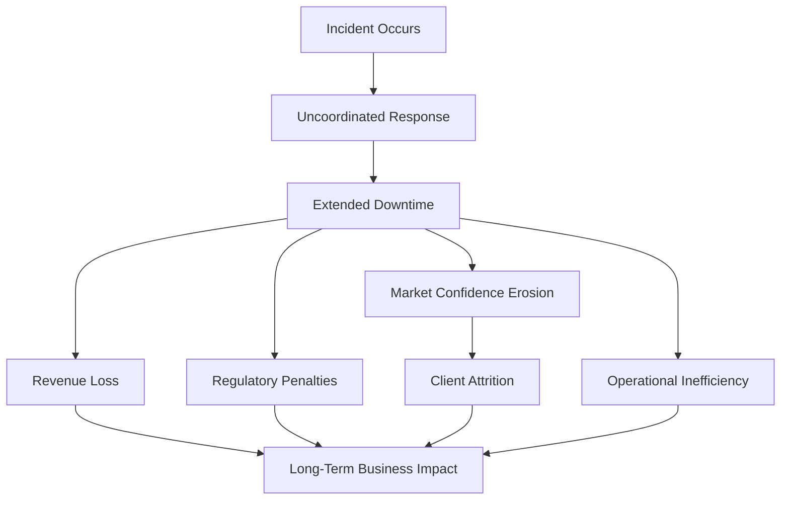
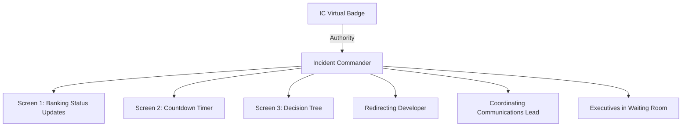
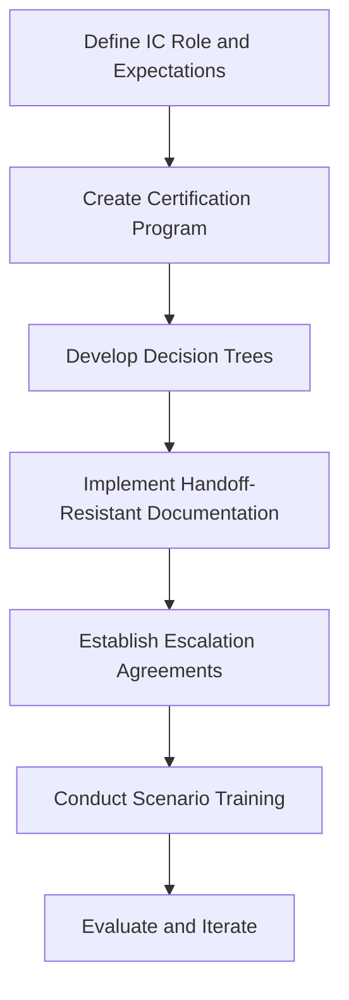
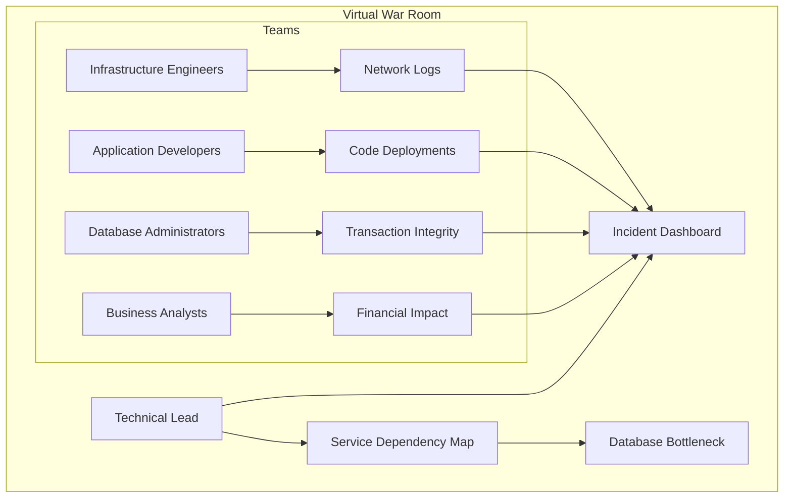
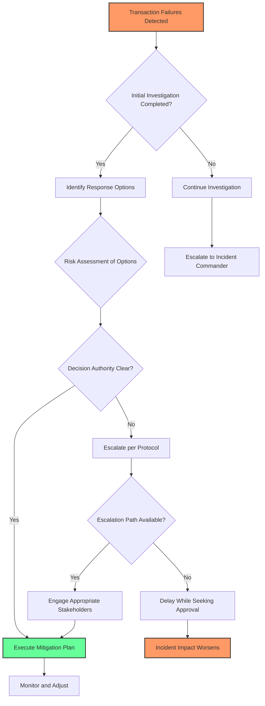
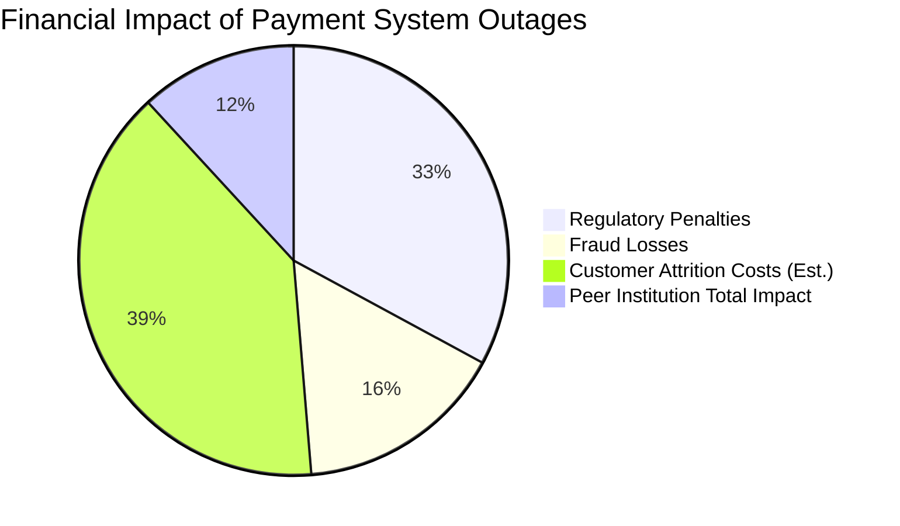
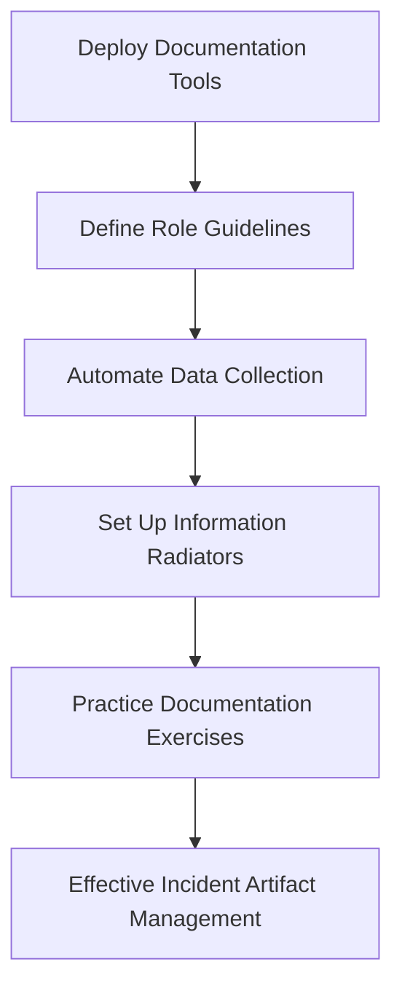
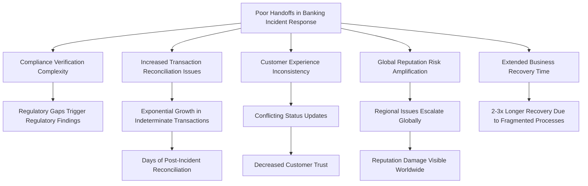
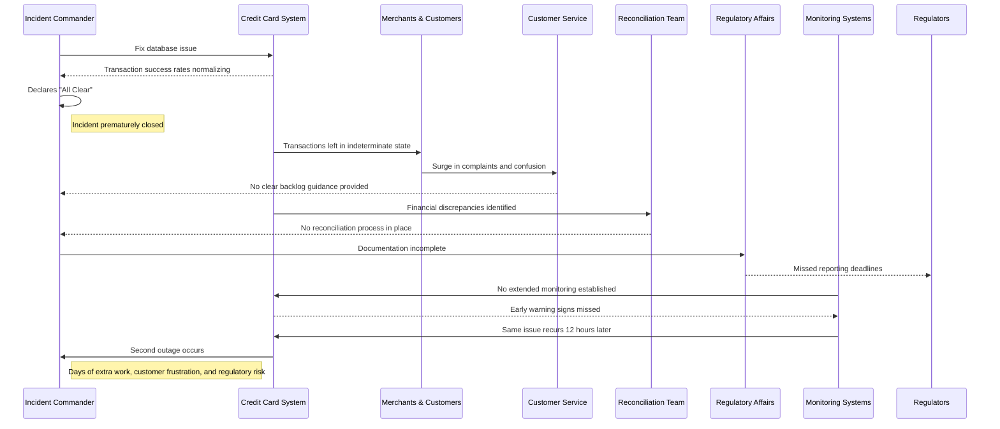

# Chapter 5: Incident Command and Coordination

## Chapter Overview

Welcome to the war room, where chaos is currency and your only weapon is organizational clarity. This chapter rips apart the fantasy that SREs can wing it through a high-stakes banking outage with nothing but “team spirit” and caffeine. Instead, we’re serving a brutal reality check: incident response in financial services is a full-contact sport, and the scoreboard is measured in millions of dollars, regulatory beatdowns, and brand damage you can’t walk off.

You’ll get a front-row seat to the anatomy of incident command—think “fire department for billion-dollar systems” meets “herding cats with laser pointers.” From the iron-fisted Incident Commander to cross-team bridge-builders, every role matters (or the market will remind you). We’ll dissect how to prevent the classic “everybody does everything, nobody does anything” meltdown, enforce escalation discipline, and make sure no information gets lost in the global game of operational telephone.

If you like your incident response fluffy, you’re in the wrong book. If you want your career (and your bank’s reputation) to survive the next meltdown, keep reading.

---

## Learning Objectives

- **Establish** a real incident command structure that stops chaos from breeding more chaos.
- **Differentiate** incident roles—know why your Incident Commander shouldn’t be debugging code at 2am.
- **Implement** cross-team coordination that kills silos before they kill your MTTR.
- **Apply** escalation protocols that don’t require a séance to figure out who can approve a system rollback.
- **Document** incidents in a way that satisfies auditors, regulators, and your future self (who’s stuck on the next shift).
- **Execute** seamless handoffs across time zones so you don’t relive Groundhog Day with every follow-the-sun handover.
- **Close** incidents methodically, verifying recovery before you declare victory and go back to sleep.

---

## Key Takeaways

- “All hands on deck” is a disaster, not a response plan. Assign roles or enjoy the fireworks.
- The Incident Commander’s job is to orchestrate—not to be the hero coder. Stay out of the logs.
- Siloed investigations are a great way to double your incident duration and triple your postmortem regret.
- If escalation protocols are unclear, your payment system will become a case study—just not the good kind.
- Incident documentation scattered across Slack, email, and sticky notes is regulatory roulette. Centralize or suffer.
- Handoffs without structure are how you turn a four-hour outage into a multi-day bank reconciliation nightmare.
- Declaring “all clear” before verifying data integrity? Congrats, you’ve just scheduled your next incident.
- In banking, every minute lost is tens of thousands of dollars, and every sloppy process gets you closer to a regulator’s crosshairs.
- Simulate, practice, and iterate—because “we’ll figure it out when it happens” is the motto of the next headline-grabbing failure.

---

## Panel 1: Establishing the Incident Command Structure
### Scene Description

The scene depicts a large trading floor in chaos as systems show irregular patterns. Digital screens flash red alerts, highlighting critical errors and a significant drop in trading volumes. Engineers are scattered across the floor, some frantically typing commands, others on phone calls, creating a sense of uncoordinated urgency.

In the foreground, a confident SRE takes charge, setting up a virtual war room. The SRE stands beside a whiteboard, calmly sketching the incident command structure:

```
Incident Command Structure
--------------------------
| Incident Commander      |
|--------------------------|
| Technical Lead           |
| Communications Lead      |
| Scribe                   |
----------------------------
```

Nearby, engineers are seen organizing into roles: one connects to a conference bridge, another creates a dedicated Slack channel titled "#incident-trading-platform-05082025". The trading floor begins to show signs of order as the team aligns under the clear command structure, preparing to tackle the incident efficiently.
### Teaching Narrative
When a major incident strikes a banking system, the difference between a four-hour outage and a forty-minute recovery often comes down to one critical factor: a clear incident command structure. Many production support teams transitioning to SRE roles make the fundamental error of jumping straight into troubleshooting without establishing who is responsible for what. This creates duplicate efforts, communication gaps, and decision paralysis.

The Incident Command System (ICS), adapted from emergency response frameworks, provides a structured approach to incident management that scales from small issues to major outages. Unlike traditional "all hands on deck" approaches where everyone tries to fix everything, ICS establishes clear roles with specific responsibilities:

- Incident Commander: The single decision-maker who coordinates the overall response
- Technical Lead: Directs the technical investigation and implementation of fixes
- Communications Lead: Manages updates to stakeholders and coordinates external messaging
- Scribe: Documents actions, decisions, and timeline for real-time awareness and post-incident review

This structure prevents the common banking incident pitfall where multiple teams implement conflicting fixes while executives receive inconsistent updates about the situation. By establishing this structure in the first five minutes of an incident, you create the organizational clarity needed to efficiently resolve complex problems in high-pressure financial environments.
### Common Example of the Problem

A foreign exchange trading platform begins experiencing intermittent failures during peak market hours. Multiple teams immediately begin independent investigations: infrastructure engineers restart servers, network specialists check connectivity, application teams search for code issues, and database administrators examine query performance. Meanwhile, traders are flooding the service desk with urgent requests while senior management demands status updates from anyone they can reach.

#### Timeline of Uncoordinated Actions and Consequences

```mermaid
gantt
    dateFormat HH:mm
    axisFormat %H:%M
    title Uncoordinated Response Extends Outage

    section Incident Timeline
    Incident Detected           :done, 00:00, 1min
    Infra Team Restarts Servers :active, 00:01, 5min
    Network Team Checks Links   :active, 00:02, 10min
    App Team Searches Code      :active, 00:03, 15min
    DB Team Analyzes Queries    :active, 00:05, 10min
    Traders Flood Help Desk     :crit, 00:06, 15min
    Mgmt Demands Updates        :crit, 00:07, 20min

    section Conflicting Remediation
    Cache Disabled by Infra Team:crit, 00:11, 5min
    Cache Scaled Up by App Team :crit, 00:12, 5min
    Outage Worsens              :done, 00:13, 10min
    Communication Breakdowns    :crit, 00:15, 20min

    section Resolution
    Coordinated Response Begins :done, 00:35, 30min
    Outage Fully Resolved       :done, 01:05, 10min
```



#### Key Consequences of Uncoordinated Response

- **Conflicting Actions:** Infrastructure engineers disable a caching layer, while application teams scale up the same cache, exacerbating latency and memory utilization issues.
- **Communication Overload:** Traders overwhelm the help desk, while senior management bypasses formal reporting channels, leading to mixed and inaccurate updates.
- **Extended Outage:** What could have been a 30-minute resolution is drawn out to 3 hours, disrupting thousands of trades worth millions of dollars.

This illustrates the critical need for an Incident Command Structure to ensure clear roles, coordinated actions, and effective communication during high-pressure incidents.
### SRE Best Practice: Evidence-Based Investigation

The evidence-based approach to incident command establishes a structured response in the critical first minutes of an incident. Follow these five steps to ensure clarity and efficiency during incident response:

| Step                                   | Action                                                                                                                                               | Example                                                                             |
| -------------------------------------- | ---------------------------------------------------------------------------------------------------------------------------------------------------- | ----------------------------------------------------------------------------------- |
| **1. Declare the Incident**            | Formally acknowledge the incident and establish its initial severity based on customer impact metrics.                                               | "Traders experiencing 30% failure rate on EUR/USD transactions."                    |
| **2. Establish Clear Roles**           | Assign the four core roles (Incident Commander, Technical Lead, Communications Lead, Scribe) from a predefined roster.                               | Ensure each responder understands their specific responsibilities.                  |
| **3. Create a Single Source of Truth** | Set up one primary communication channel and one incident document to serve as the authoritative record of status, hypotheses, and actions.          | Example: A dedicated Slack channel and a shared Google Doc.                         |
| **4. Implement Structured Check-ins**  | Schedule regular synchronization points (every 15-30 minutes initially) to align teams and prevent divergent troubleshooting paths.                  | Example: A 15-minute check-in cadence during the first hour of the incident.        |
| **5. Escalate Based on Data**          | Use quantitative impact metrics and predefined thresholds to guide escalation decisions, avoiding subjective assessments or organizational pressure. | Example: Escalate if transaction failure rates exceed 50% for more than 10 minutes. |

#### Key Benefits of Evidence-Based Investigation
- **Focus on Customer Impact**: Decisions are grounded in metrics that reflect the user experience.
- **Role Clarity**: Predefined roles eliminate confusion and prevent duplicated efforts.
- **Aligned Actions**: A single source of truth and structured check-ins ensure teams stay coordinated.
- **Data-Driven Escalation**: Escalation decisions are objective and defensible.

Research from Google's SRE teams shows that incidents with clear command structures and evidence-based practices are resolved an average of 40% faster than those with ad-hoc coordination—particularly in complex, multi-team incidents common in banking environments.
### Banking Impact

The financial consequences of uncoordinated incident response in banking are severe and multi-faceted. The following table summarizes the key impacts across financial, regulatory, and operational dimensions:

| **Impact Area**           | **Description**                                                                                                                      | **Consequences**                                                                           |
| ------------------------- | ------------------------------------------------------------------------------------------------------------------------------------ | ------------------------------------------------------------------------------------------ |
| **Direct Revenue Impact** | Each minute of disruption on trading platforms results in lost transaction fees and missed trading opportunities.                    | Revenue losses often measured in tens of thousands of dollars per minute.                  |
| **Regulatory Penalties**  | Poor incident handling leads to reporting failures, incomplete documentation, and inadequate customer communication.                 | Increased likelihood of regulatory fines and sanctions.                                    |
| **Market Confidence**     | Trading partners and institutional clients monitor incident management closely. Uncoordinated responses erode trust and reliability. | Potential drop in trading volumes and loss of key clients.                                 |
| **Settlement Risk**       | Prolonged outages crossing settlement windows create financial reconciliation challenges, even after systems are restored.           | Residual operational and financial issues that extend beyond the immediate incident.       |
| **Operational Overhead**  | Without defined roles, technical teams duplicate efforts, leaving critical areas unexplored and prolonging incident recovery.        | Wasted resources and extended recovery times, leading to higher overall operational costs. |

#### Key Insight
A McKinsey study of financial institutions found that banks with formalized incident command structures reduced their mean time to resolution by 35-45% for critical trading system outages compared to peers using ad-hoc response methods.

#### Incident Impact Flowchart
The following flowchart outlines how uncoordinated incident responses can cascade into broader impacts:



By establishing a clear incident command structure, banks can significantly mitigate these risks, ensuring faster recovery and minimizing both immediate and downstream consequences.
### Implementation Guidance

To establish effective incident command in your banking organization:

1. **Define Role Qualifications and Rotation**: Create clear qualification criteria and training paths for each incident command role, then establish a rotation schedule ensuring 24/7 coverage with primary and backup responders for each position.

2. **Implement a Role Identification System**: Develop visual indicators for each role in both physical and virtual environments (virtual badges in video conferences, designated seating in war rooms) to ensure everyone knows who holds which role.

3. **Create Role-Specific Playbooks**: Develop concise, actionable guides for each incident command role with checklists for their first 5, 15, and 30 minutes. Below is a sample playbook for the **Incident Commander** role:

   #### Incident Commander Playbook
   **First 5 Minutes**
   - Acknowledge leadership of the incident and communicate this to the team.
   - Confirm the severity of the incident and assign a preliminary severity level.
   - Ensure a war room or virtual bridge is set up and all relevant stakeholders are informed.

   **First 15 Minutes**
   - Assign key roles (Technical Lead, Communications Lead, Scribe).
   - Ensure all incident participants understand their responsibilities.
   - Verify that critical monitoring systems are accessible and operational.
   - Request initial status updates from team leads on known impact and suspected cause.

   **First 30 Minutes**
   - Approve a prioritized action plan for investigation and mitigation.
   - Monitor progress on initial tasks and ensure dependencies are unblocked.
   - Initiate external stakeholder communication if required (e.g., notifying executives or regulators).
   - Prepare for escalation decisions if the situation worsens or new risks emerge.

4. **Establish Authority Boundaries**: Clearly define what decisions each role can make independently and what requires escalation, with particular attention to decisions with financial or regulatory impact.

5. **Practice Regularly with Simulations**: Conduct monthly incident simulations with rotating team members to ensure everyone experiences different roles and builds muscle memory for structured response. Use realistic banking scenarios with simulated market conditions and executive stakeholders for a high-fidelity experience.
## Panel 2: The Incident Commander Role in Banking Contexts
### Scene Description

A focused incident commander (IC) sits at the center of a digital command center, orchestrating the incident response. She wears a distinctive "IC" virtual badge on her video conference profile, ensuring her authority is immediately clear. Surrounding her are multiple screens displaying critical information:

- **Screen 1**: Status updates from various banking systems, with a trading platform alert flagged in bold red.
- **Screen 2**: A countdown timer prominently displayed: `Time since incident declared: 00:17:42`.
- **Screen 3**: A decision tree document open, guiding the IC through structured response options.

The IC is actively engaged, firmly redirecting a senior developer who is pushing for an immediate, unvetted fix. In the background, executives wait in a separate virtual room for updates, their presence adding pressure to the situation. The IC gestures to the communications lead to prepare a briefing, ensuring stakeholders are kept informed.

Below is a simplified representation of the IC's command center setup:



This structured environment ensures the IC maintains situational awareness, prioritizes effectively, and keeps the response team aligned on resolution efforts.
### Teaching Narrative
The Incident Commander (IC) serves as the central nervous system during a banking incident, making the critical decisions that keep resolution efforts focused and effective. This role requires a specific mindset that differs fundamentally from both traditional production support approaches and regular SRE work.

In banking environments, the IC faces unique challenges: regulatory requirements for incident handling, the financial impact of each minute of downtime, and complex dependencies between trading, payment, and core banking platforms. An effective banking IC understands that their primary role is not to solve the technical problem but to create the conditions where others can solve it efficiently.

The IC's key responsibilities include:

1. Maintaining situational awareness across all dimensions of the incident
2. Making clear, decisive calls on prioritization and approach
3. Managing the incident tempo through regular synchronization points
4. Shielding the technical team from external pressures while keeping stakeholders informed
5. Escalating or de-escalating the incident response based on evolving severity

What separates expert ICs from novices is their ability to balance decisive action with appropriate delegation. They avoid both micromanagement (trying to direct every technical investigation detail) and absentee leadership (simply asking for updates without driving the response). Instead, they maintain constant awareness of the big picture—including business impact, customer experience, and regulatory implications—while empowering technical experts to resolve the underlying issues.
### Common Example of the Problem

A major retail bank's mobile banking platform begins experiencing authentication failures, preventing customers from logging in. The initial response is chaotic as an inexperienced IC attempts to directly solve the technical problem. They join every technical debugging call, personally examine logs, and start suggesting specific fixes based on their own hypothesis about SSL certificate issues. This technical focus causes them to miss critical developments: the problem has begun affecting ATM transactions, call center volumes are overwhelming customer service, and the bank's social media accounts are being flooded with customer complaints. The IC has lost situational awareness by diving too deep into one technical area. Meanwhile, the bank's COO is demanding updates that the IC is too busy to provide, and the regulatory affairs team is unsure whether the incident requires formal notification to financial authorities. Without proper incident command, the response lacks coordination across these different dimensions, extending both the technical resolution time and the overall business impact.

#### Key Takeaways: Avoiding Common IC Pitfalls
- **Do not lose situational awareness:** Stay informed about all dimensions of the incident, including technical, business, and customer impacts.
- **Avoid micromanagement:** Resist the urge to personally debug or solve technical problems—delegate effectively to subject matter experts.
- **Prioritize communication:** Allocate time to keep key stakeholders, such as executives and regulatory teams, informed with concise and accurate updates.
- **Maintain coordination:** Synchronize efforts across teams to ensure a unified response rather than isolated, unaligned efforts.
- **Focus on the big picture:** Balance technical resolution progress with the broader business and regulatory implications of the incident.
### SRE Best Practice: Evidence-Based Investigation

Effective Incident Commander practice follows specific patterns validated across high-reliability organizations. The following table compares effective and ineffective behaviors to illustrate how ICs can adopt evidence-based investigation practices:

| **Aspect**                           | **Effective IC Behavior**                                                                                   | **Ineffective IC Behavior**                                                             |
| ------------------------------------ | ----------------------------------------------------------------------------------------------------------- | --------------------------------------------------------------------------------------- |
| **Primary Focus**                    | Coordination and orchestration of teams                                                                     | Diving into technical troubleshooting                                                   |
| **Information Gathering**            | Uses structured formats to collect data on impact, scope, theories, and timelines                           | Requests ad-hoc updates or focuses on technical specifics                               |
| **Decision Making**                  | Maintains a decision log with timestamps, rationales, and expected outcomes                                 | Relies on memory or verbal agreements for critical decisions                            |
| **Investigation Strategy**           | Applies the "Focus, Align, Accelerate" pattern: targets key hypotheses, aligns teams, and removes obstacles | Investigates multiple directions without prioritization or alignment                    |
| **Emotional and Cognitive Approach** | Practices "Detached Evaluation" to objectively assess competing theories                                    | Becomes emotionally invested in specific solutions or theories                          |
| **Stakeholder Management**           | Shields technical teams from external pressure while providing clear updates                                | Over-explains technical details to stakeholders or allows interruptions to derail focus |

#### Core Best Practices Explained

1. **Focus on Coordination, Not Technical Resolution**: Research from Google and Amazon's incident management frameworks shows that ICs who maintain orchestration focus rather than diving into technical troubleshooting reduce mean time to resolution by 30-50%, particularly for complex multi-system incidents.

2. **Implement Structured Information Collection**: Successful ICs use standardized formats to gather information from technical teams, focusing on impact, scope, working theories, and estimated resolution times rather than detailed technical specifics.

3. **Maintain a Decision Log**: Document all significant decisions with timestamps, rationales, and expected outcomes. This creates accountability, helps with post-incident review, and fulfills regulatory recordkeeping requirements.

4. **Apply the "Focus, Align, Accelerate" Pattern**: Evidence from financial industry incidents shows that effective ICs spend equal time on three activities: focusing investigation efforts on the most likely hypotheses, aligning teams on a common understanding of the situation, and accelerating resolution by removing obstacles and providing resources.

5. **Practice "Detached Evaluation"**: The incident commander maintains emotional distance from the technical problem, enabling objective evaluation of competing theories and approaches without confirmation bias or attachment to particular solutions.

Facebook's research on incident management found that ICs who operate as coordinators rather than technical leads reduced MTTR by 37% compared to those who attempted to personally solve technical issues during large-scale incidents.
### Banking Impact

Poor incident command in banking contexts has distinct consequences beyond technical resolution time:

1. **Regulatory Exposure**: Financial regulators specifically evaluate incident management effectiveness, with poorly managed incidents triggering additional scrutiny even when technical root causes are addressed.

2. **Customer Trust Erosion**: Research shows that customers judge their bank not just by the occurrence of incidents but by the perceived control and professionalism of the response; disorganized command signals institutional weakness.

3. **Financial Loss Acceleration**: For payment platforms, uncoordinated incidents often result in transaction reconciliation issues that persist long after technical recovery, creating financial losses that grow geometrically rather than linearly with incident duration.

4. **Cross-Channel Contagion**: Banking systems are uniquely interconnected—inadequate incident command often fails to contain issues, allowing them to spread from one channel (mobile) to others (branch, ATM, call center).

5. **Operational Risk Management Failure**: Regulators require banks to demonstrate operational risk control; poor incident command represents a control deficiency that can affect regulatory capital requirements.

#### Case Study: The Payment Platform Outage

In 2018, a major European bank experienced a payment platform outage that lasted over six hours. The incident began as a localized issue in the mobile banking channel but escalated to impact ATMs, online banking, and in-branch systems due to uncoordinated response efforts. The incident commander at the time lacked formal training and failed to establish a clear prioritization framework, leading to conflicting actions by multiple teams.

As a result:
- Regulatory bodies imposed a €15 million fine for inadequate incident handling practices.
- Customer trust plummeted, with a 20% spike in account closures in the following quarter.
- Reconciliation errors caused an additional €10 million in financial losses over the next three months.
- Internal audits revealed that poor communication between teams allowed the issue to cascade across systems, amplifying its impact.

This case underscores the importance of disciplined incident command in minimizing both immediate and downstream risks. A structured response, led by a well-trained IC, could have contained the issue within the mobile banking channel, reducing financial, operational, and reputational damage.

A European Banking Authority study found that financial institutions with formalized incident command roles and training experienced 45% fewer "severity escalations," where incidents grew from moderate to severe impact during the response phase.
### Implementation Guidance

To develop effective Incident Commanders (ICs) for banking environments, follow this structured framework to build skills, tools, and processes. The framework is designed to ensure clarity and consistency while aligning with the unique demands of banking incidents.

#### Step-by-Step Framework for Building an IC Program

1. **Define the IC Role and Expectations**
   - Identify the core responsibilities and authority of the IC in your organization.
   - Specify how the IC interacts with technical teams, stakeholders, and executives during incidents.

2. **Design a Formal IC Certification Program**
   - **Objective**: Certify candidates with the necessary technical, leadership, and regulatory expertise.
   - **Steps**:
     1. Develop curriculum covering:
        - Banking systems architecture and dependencies.
        - Regulatory requirements for incident management.
        - Leadership and decision-making under pressure.
     2. Include shadowing opportunities where candidates observe experienced ICs during live or simulated incidents.
     3. Require candidates to lead mock incidents and receive feedback from peers and mentors.
   - **Output**: A pool of certified ICs ready to handle high-stakes banking incidents.

3. **Create Banking-Specific Decision Trees**
   - **Objective**: Provide ICs with predefined frameworks to guide decision-making during common incident types.
   - **Steps**:
     1. Identify frequent incident categories (e.g., payment outages, trading system failures, data integrity issues).
     2. Develop decision trees that outline:
        - Key diagnostics (e.g., logs, metrics to check).
        - Immediate containment actions.
        - Escalation triggers and criteria.
        - Regulatory or business-specific considerations.
     3. Test decision trees through scenarios and refine them based on feedback.
   - **Output**: A library of decision trees tailored to banking incident types.

   Example Decision Tree:
   ```mermaid
   graph TD
       A[Incident Declared] --> B{Incident Type?}
       B --> C[Payment Outage]
       B --> D[Trading System Failure]
       B --> E[Data Integrity Issue]
       C --> F[Containment: Disable Payment Endpoint]
       C --> G[Diagnostics: Check Gateway Logs]
       G --> H{Resolve or Escalate?}
       H --> I[Resolve: Monitor Recovery]
       H --> J[Escalate: Notify Execs]
   ```

4. **Implement "Handoff-Resistant" Documentation**
   - **Objective**: Ensure continuity when incidents span shifts or require multiple ICs.
   - **Steps**:
     1. Use tools designed for real-time collaborative updates (e.g., incident management platforms).
     2. Standardize documentation templates to capture:
        - Incident timeline and key decisions.
        - Current state and unresolved action items.
     3. Train ICs on maintaining accurate, concise documentation during live incidents.
   - **Output**: Seamless transitions between ICs with no loss of situational awareness.

5. **Establish Escalation Agreements with Executives**
   - **Objective**: Define clear engagement protocols with leadership to reduce friction during high-pressure incidents.
   - **Steps**:
     1. Work with executives to predefine:
        - Frequency and format of updates.
        - Criteria for direct involvement (e.g., customer impact thresholds, regulatory triggers).
     2. Document agreements and communicate them widely within the organization.
   - **Output**: A shared understanding of when and how executives will engage during incidents.

6. **Conduct Specialized Scenario Training**
   - **Objective**: Build IC skills through realistic practice.
   - **Steps**:
     1. Run quarterly tabletop exercises simulating:
        - Regulatory audits during incidents.
        - Executive pressure for updates or decisions.
        - Ambiguous or incomplete technical information.
     2. Rotate IC candidates through different roles (e.g., observer, IC, technical responder) to build empathy and perspective.
     3. Debrief after each session to extract lessons learned and refine processes.
   - **Output**: ICs who are prepared to handle the unique challenges of banking incidents.

#### Flowchart: Summary of Implementation Process



This structured approach ensures that organizations can consistently develop and support Incident Commanders capable of managing the high-pressure, high-stakes nature of banking incidents.
## Panel 3: Effective Cross-Team Coordination During Financial Service Disruptions
### Scene Description

A virtual war room shows split screens with multiple teams – infrastructure engineers examining network logs, application developers reviewing code deployments, database administrators checking transaction integrity, and business analysts calculating financial impact. At the center, a coordination board displays a service dependency map with affected components highlighted. The technical lead, positioned at the center of the room, is using a laser pointer to indicate a suspected database bottleneck while team members from different specialties collaborate on a shared investigation document. Status updates from each team flow into a structured template that automatically updates the incident dashboard.

Below is a visual representation of the war room setup:



This diagram illustrates the interaction between team roles, their areas of focus, and the central coordination artifacts such as the service dependency map and incident dashboard. The unified structure enables real-time collaboration and visibility, ensuring all teams contribute effectively to the resolution process.
### Teaching Narrative
Financial services incidents rarely respect team boundaries. A payment processing failure might involve database latency, API timeouts, network congestion, and authentication issues—requiring coordination across multiple technical domains. The traditional approach of having each team investigate their own components independently creates silos that obscure the holistic view needed for effective resolution.

In the SRE model, cross-team coordination is not an afterthought but a core capability built into the incident response process. This requires both structural elements (shared tooling, communication channels, and visibility) and cultural elements (collaborative mindset, t-shaped skills, and blameless investigation).

The Technical Lead facilitates this coordination by creating a unified investigation approach that leverages specialized expertise without fragmenting the overall effort. Effective techniques include:

1. Establishing shared visibility through unified dashboards that show end-to-end service health
2. Creating a structured format for sharing hypotheses and findings across domain boundaries
3. Facilitating joint debugging sessions where specialists collaborate in real-time
4. Maintaining a single source of truth for current understanding and next steps
5. Bridging terminology differences between teams (e.g., translating between database, network, and application concepts)

The shift from team-based to service-based incident response represents one of the most significant evolutions when moving from production support to SRE practices. Instead of asking "Is my component working?", the focus becomes "Is the service delivering value to customers?", requiring tightly coordinated investigation across traditional boundaries.
### Common Example of the Problem

A corporate banking platform handling international wire transfers begins experiencing delayed transactions. The incident response fragments immediately:

```plaintext
Payments Team:       Assumes SWIFT gateway issue -> Investigates connection logs
Database Team:       Notices query slowness -> Optimizes indexes
Network Engineers:   Detect increased latency to 3rd-party service -> Reroute traffic
Security Team:       Observes unusual patterns -> Initiates threat hunting
```

Despite each team's diligent efforts, no single group has a complete view of how these issues might interconnect. The lack of coordination leads to compounding problems:

```plaintext
Application Team:    Implements config change to increase connection timeouts
   └──> Triggers unexpected authentication failure
        └──> Amplifies original delay
```

Corporate clients with urgent international payments worth millions report inconsistent status updates from different bank representatives, further escalating the situation. Four hours into the incident, teams are still working in parallel silos without a coherent understanding of the overall system behavior, extending what could have been a 45-minute resolution into a half-day of business disruption.

This fragmented response demonstrates how siloed actions, without shared visibility and coordination, can exacerbate financial service disruptions.
### SRE Best Practice: Evidence-Based Investigation

Cross-team coordination effectiveness has been extensively studied, with clear patterns emerging. The table below summarizes key best practices, their benefits, and supporting evidence:

| **Best Practice**                                   | **Benefits**                                                                   | **Supporting Evidence**                                                                               |
| --------------------------------------------------- | ------------------------------------------------------------------------------ | ----------------------------------------------------------------------------------------------------- |
| **Establish a Service-Centric Investigation Model** | Reduces MTTR by 40-60% for complex incidents.                                  | Research from Google SRE and financial industry incident analysis.                                    |
| **Implement the "Shared Consciousness" Pattern**    | Creates a common operating picture for real-time updates, improving alignment. | Adapted from military coordination tactics; applied successfully by tech companies.                   |
| **Create Specialized Technical Coordination Roles** | Speeds up resolution by bridging domain expertise gaps.                        | Evidence from Amazon and Microsoft shows improved resolution speed for cross-domain incidents.        |
| **Apply Hypothesis-Driven Investigation**           | Reduces wasted effort by 30-40% compared to siloed investigations.             | Based on the scientific method; supports explicit documentation and testing of cross-team hypotheses. |
| **Use Dynamic Service Maps**                        | Improves understanding of cascade effects and investigation priorities.        | Studies by LinkedIn and Netflix demonstrate effectiveness over static documentation.                  |

Additional research published in the *Journal of Systems and Software* analyzed 352 cross-team incidents, finding that teams employing structured coordination approaches resolved incidents 47% faster than those using traditional siloed methods.

By adopting these best practices, organizations can create a more systematic, evidence-based approach to cross-team investigations, ensuring faster resolution times and improved service reliability.
### Banking Impact

Failed cross-team coordination in banking environments has unique business implications:

1. **Reconciliation Complexity**: Incomplete coordination often leads to partial fixes that resolve symptoms but create reconciliation exceptions that may take days or weeks to resolve, particularly for cross-border transactions.

2. **Extended Service Recovery Time**: Even after technical resolution, poorly coordinated incidents typically require 2-3x longer to restore full business service due to transaction verification, data consistency checking, and compliance verification.

3. **Increased Regulatory Reporting Burden**: Fragmented incident understanding leads to incomplete or inaccurate regulatory reports, often triggering additional reporting requirements and regulatory scrutiny.

4. **Client Relationship Damage**: Corporate and institutional clients expect cohesive information during incidents; conflicting updates from different bank teams significantly damage relationship trust and may violate service level agreements.

5. **Resolution Cost Multiplication**: A study by the Financial Services Information Sharing and Analysis Center (FS-ISAC) found that poorly coordinated cross-team incidents cost 3-4x more to resolve than comparable incidents with strong coordination, due to duplicate effort and extended business impact.

---

#### Checklist: Key Business Implications of Failed Cross-Team Coordination

- [ ] Are reconciliation processes producing exceptions that delay transaction settlement?
- [ ] Is the service recovery timeline aligned with business expectations for full operational restoration?
- [ ] Are regulatory reports accurate, complete, and in compliance with reporting standards?
- [ ] Are client communications consistent, accurate, and aligned with service-level agreements?
- [ ] Are incident-related costs being multiplied due to duplicate efforts or prolonged business impact?
- [ ] Has the organization quantified financial impacts and identified areas for coordination improvement?

Data from major financial institutions shows that implementing structured cross-team coordination reduces mean time to resolve complex payment platform incidents by 52%, with corresponding reductions in financial impact and customer compensation.
### Implementation Guidance

To establish effective cross-team coordination for banking incident response:

1. **Deploy a Unified Incident Command System**: Implement a centralized platform that all teams use during incidents. Examples include tools like PagerDuty, Atlassian Opsgenie, or Slack with incident management apps, which offer capabilities for shared documentation, timeline maintenance, and structured updates. These tools help replace fragmented communication methods such as email chains or disconnected chat rooms with a single operational hub.

2. **Create System Boundary Maps**: Develop and maintain visual service maps showing the boundaries and interactions between different teams' areas of responsibility. Use tools like Lucidchart, Miro, or even open-source options such as Draw.io to create diagrams that illustrate transaction flows across system boundaries. For example, a payment processing map could show how requests move from the front-end application, through the API gateway, to the database, and finally to the settlement system.

3. **Establish Cross-Team Communication Protocols**: Define explicit channels, formats, and cadences for inter-team updates during incidents. For instance, adopt Slack channels named by incident number and severity, with pinned templates for status updates. Additionally, schedule regular syncs (e.g., every 15 minutes during critical incidents) to ensure all teams are aligned on progress and next steps. Structured communication frameworks, such as the Incident Command System (ICS), can further reduce misunderstandings.

4. **Implement Technical Bridge Roles**: Identify and train individuals with multi-domain knowledge to serve as "technical bridges" between specialized teams. For example, an engineer with knowledge of both database architecture and API integration can help connect observations about query performance issues to potential API bottlenecks. These bridge roles can also leverage shared documentation tools like Confluence or Google Docs to create and maintain glossaries that translate across domain-specific terminologies.

5. **Conduct Regular Cross-Team Simulations**: Schedule quarterly incident simulations that deliberately span multiple technical domains. Use tools like Gremlin or GameDay to inject faults into systems and simulate real-world scenarios. For example, a simulation could involve a cascading failure starting with a database performance issue that degrades API response times, leading to front-end errors and customer impact. Assign cross-team roles during these exercises to ensure effective collaboration and identify process gaps.

6. **Integrate Incident Postmortem Learnings**: After resolving incidents, conduct blameless postmortems and use tools like Jira or ServiceNow to track action items tied to cross-team coordination. For example, if a simulation uncovers delays due to unclear ownership of a failing API, document and assign corrective actions, such as updating ownership in the service map or revising communication protocols.

By incorporating these practices and leveraging specific tools and frameworks, teams can transform cross-team coordination from a reactive process into a well-oiled system that supports rapid and effective incident resolution.
## Panel 4: Escalation Protocols and Decision Authority
### Scene Description

A tense scene unfolds during a critical decision point in a major payment processing incident. The incident commander (IC) is intently reviewing a severity matrix document while consulting with the technical lead. A status board prominently displays key incident metrics:

- **Incident Duration**: 37 minutes
- **Financial Impact Counter**: Rapidly increasing
- **Regulatory Reporting Countdown**: 23 minutes remaining before mandatory notification

On a separate screen, three potential solutions are outlined, each labeled with varying risk levels and implementation times:

1. **Solution A**: Low risk, slow implementation (45 minutes)
2. **Solution B**: Medium risk, moderate implementation (30 minutes)
3. **Solution C**: High risk, fast implementation (15 minutes)

The business stakeholder, visibly concerned, is deferring to the IC's judgment. The tension is palpable as the regulatory reporting timer continues to count down, amplifying the urgency of the decision.

#### Visual Representation (Text-Based)
Below is a simplified text-based visualization of the scene for clarity:

```
+-------------------------------+----------------------------+
| Status Board                 | Regulatory Countdown Timer |
|-------------------------------|----------------------------|
| Incident Duration: 37 mins   | Time Remaining: 23 mins    |
| Financial Impact: Increasing |                            |
+-------------------------------+----------------------------+

+--------------------------------------------+
| Solutions Screen                           |
|--------------------------------------------|
| 1. Solution A - Low Risk (45 mins)         |
| 2. Solution B - Medium Risk (30 mins)      |
| 3. Solution C - High Risk (15 mins)        |
+--------------------------------------------+

Incident Commander: Reviewing severity matrix
Technical Lead: Providing input on risks and trade-offs
Business Stakeholder: Concerned but deferring to IC
```

This representation emphasizes the complexity and time-sensitive nature of the situation, illustrating the interplay of technical, financial, and regulatory pressures that the team must navigate.
### Teaching Narrative
In banking systems, knowing when and how to escalate an incident can mean the difference between a minor disruption and a front-page news story. Traditional escalation protocols often focus on hierarchical notification (informing increasingly senior managers) rather than obtaining the right expertise and decision authority when needed.

Effective SRE escalation frameworks instead focus on these key elements:

1. **Predefined Thresholds**: Objective criteria for when to escalate based on duration, impact, complexity, and uncertainty
2. **Role-Based Escalation**: Bringing in specific capabilities (not just seniority) when needed
3. **Decision Authority Matrix**: Clarity on who can authorize different types of high-risk actions
4. **Time-Based Triggers**: Automatic escalation points when incidents extend beyond expected resolution times
5. **External Notification Protocols**: Clear guidelines for when to inform regulators, partners, and customers

In banking environments, escalation becomes particularly critical when facing trade-offs between different values—such as whether to restart a system (risking data inconsistency) or continue extensive diagnosis (extending the outage). These decisions require both technical understanding and business context.

The SRE approach establishes clear decision rights before incidents occur, so that in the heat of the moment, teams know exactly who has the authority to make different types of calls. This prevents both analysis paralysis (where no one feels empowered to make a difficult decision) and unilateral actions (where decisions are made without appropriate risk assessment).
### Common Example of the Problem

A bank's credit card authorization system begins experiencing intermittent transaction failures during the Friday evening shopping peak. Initial investigation suggests two possible causes: a recent code deployment or database performance degradation. The incident has been running for 30 minutes with failure rates increasing. The Technical Lead believes a rollback of the morning's deployment would resolve the issue but carries a 5% risk of creating transaction duplication. The alternative is a more thorough investigation while customers continue experiencing failures.

The incident response team faces escalation uncertainty: the Engineering Director is unavailable, and it's unclear whether the on-call Product Manager has authority to approve a rollback with potential data integrity implications. The Operations Manager wants to escalate to the CIO, but that will take at least 15 minutes to arrange. Meanwhile, the compliance team is unsure whether the current failure rate triggers mandatory regulatory reporting. Without clear escalation protocols and decision authority, the team wastes crucial minutes seeking approval while thousands of additional transactions fail and customer complaints multiply on social media.

#### Decision Flowchart for Escalation and Authority Gaps



This flowchart illustrates the gaps in the current escalation process. The lack of clarity around decision authority (e.g., whether the on-call Product Manager can approve risky actions) and delays in stakeholder engagement (e.g., waiting 15 minutes to involve the CIO) create bottlenecks that exacerbate the incident's impact.

Key issues highlighted:
- No predefined thresholds for escalation (e.g., failure rate or incident duration).
- Role-based escalation is missing, resulting in reliance on unavailable individuals (e.g., Engineering Director).
- The absence of a decision authority matrix leads to confusion about who can approve high-stakes actions.
- Critical time is lost while waiting for approvals or clarifications, worsening customer and business impact.
### SRE Best Practice: Evidence-Based Investigation

Research and practice have established clear patterns for effective escalation in complex systems. Use the following checklist and table to guide evidence-based investigation during incident response:

#### Checklist for Evidence-Based Escalation
- [ ] **Tiered Response Framework**: Predefine response tiers with clear escalation criteria to reduce ad-hoc handling.
- [ ] **Bounded Authority Models**: Explicitly document decision-making boundaries for all roles to prevent delays.
- [ ] **RACI Matrices**: Establish Responsible-Accountable-Consulted-Informed roles for key incident decisions.
- [ ] **Escalate Then Investigate**: Prioritize early escalation for customer-impacting issues, followed by thorough investigation.
- [ ] **Golden Signal Metrics**: Define critical metrics (e.g., error rates, latency, saturation, traffic) and automatic triggers.

#### Summary Table: Evidence-Based Best Practices

| Best Practice                  | Key Benefit                                            | Example Application                                                                 |
| ------------------------------ | ------------------------------------------------------ | ----------------------------------------------------------------------------------- |
| **Tiered Response Frameworks** | Reduces incident impact by 35-50%                      | Use predefined escalation tiers in critical incidents (e.g., SEV-1 vs. SEV-2).      |
| **Bounded Authority Models**   | Prevents delays caused by unnecessary approval seeking | Allow on-call engineers to restart services within agreed boundaries.               |
| **RACI Matrices**              | Reduces decision time by 60-70%                        | Define decision roles for actions like service failovers or customer notifications. |
| **Escalate Then Investigate**  | Ensures faster resolution of customer-facing issues    | Escalate immediately for outages impacting user transactions before deep diagnosis. |
| **Golden Signal Approach**     | Removes subjective judgment during critical incidents  | Automatically escalate when error rates exceed 5% or latency surpasses 2 seconds.   |

#### Example Workflow: Evidence-Based Escalation Process (Text-Based Representation)

```text
Incident Detected
   ├── Evaluate Critical Metrics (Golden Signals)
   │       ├── Metrics Exceed Thresholds? (Yes → Escalate, No → Investigate)
   ├── Follow Tiered Response Framework
   │       ├── SEV-1 → Engage Incident Commander
   │       ├── SEV-2 → Consult Technical Lead
   ├── Check Bounded Authority and RACI Matrices
   │       ├── Decision Role Identified? (Yes → Execute, No → Escalate)
   └── Escalate Then Investigate
           ├── Notify Stakeholders
           ├── Begin Root Cause Analysis
```

Analysis of 500+ banking system incidents by the Financial Services Incident Analysis Center found that clear escalation protocols reduced mean time to resolve customer-facing incidents by 37%, with the greatest improvements seen during off-hours incidents where authority uncertainty typically causes the longest delays.
### Banking Impact

Unclear escalation and decision authority in banking creates distinct business consequences:

1. **Regulatory Compliance Failures**: Banking regulations often include strict notification timeframes; escalation delays can directly cause compliance violations with potential regulatory penalties.

2. **Increased Fraud Exposure**: During payment system incidents, slow escalation frequently extends the window where fraud detection may be compromised, increasing financial losses beyond the direct impact of the technical issue.

3. **Reputational Amplification**: Studies show that customer perception of incident severity correlates more strongly with the bank's response time than with the actual technical impact—slow escalation directly damages brand reputation.

4. **Secondary System Impact**: In interconnected banking environments, delayed escalation often allows issues to cascade into secondary systems, transforming isolated incidents into complex, multi-system failures.

5. **Settlement Risk Materialization**: When incidents extend across settlement windows due to escalation delays, they create financial reconciliation challenges that can take days to resolve, potentially affecting liquidity positions and regulatory capital requirements.

#### Case Study: Escalation Protocols in Action
A major regional bank experienced a critical payment system outage that lasted 3 hours due to unclear escalation thresholds. The delay resulted in:

- **Regulatory Penalties**: A $2.5 million fine for failing to notify regulators within the mandated 30-minute window.
- **Fraud Losses**: $1.2 million in unauthorized transactions processed while fraud detection systems were offline.
- **Reputational Damage**: A 15% spike in customer attrition within the following quarter, as reported in post-incident surveys.

In contrast, a peer institution with a mature escalation framework faced a similar outage but resolved it within 45 minutes. The faster response prevented regulatory penalties, minimized fraud exposure, and preserved customer trust.

#### Financial Impact Comparison


A McKinsey analysis of major financial institutions corroborates these findings, showing that banks with mature escalation protocols experience 45% lower financial impact from similar incidents compared to peers with informal or ad-hoc approaches.
### Implementation Guidance
To create effective escalation protocols for banking incident response:

1. **Develop a Multi-Dimensional Severity Framework**: Create an incident classification matrix that incorporates technical impact, customer experience, financial implications, and regulatory considerations, with clear escalation triggers for each severity level.

2. **Implement a RACI Decision Authority Matrix**: Document explicitly who is Responsible, Accountable, Consulted, and Informed for different types of incident decisions (system restarts, rollbacks, feature disablement, public communications) at each severity level.

3. **Create "Break Glass" Procedures**: Establish clear protocols for emergency actions when normal decision-makers are unavailable, including designated deputies and documented acceptance of increased risk levels during critical situations.

4. **Establish Parallel Notification Workflows**: Implement systems that simultaneously notify all potentially needed resources at appropriate severity levels, replacing sequential escalation chains that create delays when specific individuals are unavailable.

5. **Integrate Regulatory Thresholds into Escalation Processes**: Map regulatory reporting requirements directly to escalation protocols, automatically triggering compliance processes when incidents reach thresholds that have regulatory implications.
## Panel 5: Managing Incident Artifacts and Information Flow
### Scene Description

The incident response team's virtual workspace shows a sophisticated information management system in action. The incident scribe is efficiently documenting key events in a structured timeline while automated tools capture system metrics and chat messages. Multiple information radiators display the current incident status, active investigations, and action items. Team members reference a shared runbook with pre-defined investigation paths. The communications lead is crafting updates from the structured incident notes, ensuring consistent messaging across different stakeholders. A senior executive is viewing a simplified dashboard that shows status without requiring technical context.

Below is a simplified text diagram illustrating the key roles, their interactions, and the flow of information during incident management:

```
+-------------------+      +---------------------+      +-------------------+
|   Incident Scribe | ---> | Incident Artifacts  | ---> | Communications    |
|  (Documents key   |      | (Timeline, Current  |      | Lead (Crafts      |
|   events, actions,|      | Understanding,      |      | stakeholder       |
|   and decisions)  |      | Action Tracker,     |      | updates)          |
|                   |      | Decision Log,       |      +-------------------+
|                   |      | Status Updates)     |               |
+-------------------+      +---------------------+               v
        ^                                                      +-------------------+
        |                                                      | Senior Executive  |
        |                                                      | (Views simplified |
        |                                                      | status dashboard) |
        +------------------------------------------------------+-------------------+

Automated tools (e.g., system metrics, chat logs) feed into the Incident Artifacts, supporting real-time updates and decision-making.
```

This visualization highlights how roles like the Scribe, Communications Lead, and Senior Executive interact with tools and artifacts to ensure efficient information flow and effective incident management.
### Teaching Narrative
During complex banking incidents, information management becomes as critical as technical troubleshooting. In traditional production support models, information is often scattered across multiple channels—email threads, chat conversations, monitoring tools, and individual notes—making it difficult to maintain a coherent understanding of the incident.

The SRE approach treats incident artifacts and information flow as a core capability rather than an administrative burden. By centralizing information capture and standardizing communication formats, teams dramatically improve their decision quality and response efficiency.

Key incident artifacts that should be maintained in real-time include:

1. **Incident Timeline**: Chronological record of significant events, actions, and decisions
2. **Current Understanding**: Evolving assessment of root cause, impact, and affected systems
3. **Action Tracker**: Clear documentation of who is doing what and expected completion times
4. **Decision Log**: Record of key decisions made, including context and rationales
5. **Status Updates**: Standardized communications suitable for different stakeholder audiences

The Scribe role is particularly crucial in banking incidents where post-incident regulatory reporting requirements demand accurate records of the response process. An effective Scribe doesn't simply transcribe conversations but organizes information to support real-time decision-making and creates the foundation for thorough post-incident analysis.

By establishing consistent formats for these artifacts before incidents occur, teams can focus their cognitive resources on solving the problem rather than figuring out how to document it. This structure becomes even more valuable as incident response scales across multiple teams and time zones during extended financial system disruptions.
### Common Example of the Problem

A major retail bank's online bill payment system experiences an outage during month-end processing. As the incident unfolds, information chaos ensues: the infrastructure team discusses potential causes in their Slack channel while application developers debate code fixes in a separate Teams chat. The incident commander conducts coordination calls, but no one consistently captures action items or decisions. Meanwhile, customer service representatives are piecing together status updates from various partial sources, giving conflicting information to customers. Regulatory affairs cannot produce a clear timeline of the incident for compliance reporting. When a new team takes over after four hours, they have no coherent record of what's been tried, what's been ruled out, or what's currently in progress. This information fragmentation extends the incident by hours as the new team essentially restarts the investigation. After resolution, the lack of clear documentation hampers root cause analysis and regulatory reporting, turning a technical incident into a compliance and governance issue.

#### Checklist of Key Failures
To better identify and address the root causes of such scenarios, consider the following checklist of common failures observed in this example:

- **Lack of Centralized Documentation**: No single source of truth for incident artifacts such as timelines, decisions, or action items.
- **Fragmented Communication Channels**: Critical information scattered across multiple tools (e.g., Slack, Teams) with no integration or visibility.
- **Inconsistent Incident Notes**: Missing or incomplete capture of key decisions, actions, and outcomes during coordination efforts.
- **Unclear Handoffs Between Teams**: Inadequate documentation leads to confusion and duplication of efforts when shifts or teams change.
- **Conflicting Stakeholder Updates**: Customer service and other stakeholders rely on inconsistent or partial information, causing reputational damage.
- **Poor Post-Incident Reporting**: Inability to produce a coherent timeline or decision log impacts root cause analysis, compliance reporting, and governance.

By proactively addressing these pitfalls through standardized processes and tools, teams can significantly reduce resolution time and improve incident outcomes.
### SRE Best Practice: Evidence-Based Investigation

Research in incident management highlights specific practices for effective information management. These practices are designed to enhance decision quality, improve response efficiency, and ensure alignment with both technical and business objectives.

| **Best Practice**                                        | **Description**                                                                                              | **Benefits**                                                                                   |
| -------------------------------------------------------- | ------------------------------------------------------------------------------------------------------------ | ---------------------------------------------------------------------------------------------- |
| **Implement a "Single Source of Truth"**                 | Centralize incident documentation to ensure all stakeholders access consistent, up-to-date information.      | Reduces resolution time by 30-40%, minimizes conflicting data, and streamlines collaboration.  |
| **Apply "Working Backward" Documentation**               | Start with customer impact and work backward to technical details, ensuring business context is preserved.   | Supports business-driven decision-making and keeps artifacts aligned with customer priorities. |
| **Utilize Structured Templates with Progressive Detail** | Use standardized documentation formats with varying levels of detail for different audiences.                | Improves technical resolution and enhances communication effectiveness with stakeholders.      |
| **Implement the "History of Now" Model**                 | Maintain an accurate, real-time narrative of the current incident state instead of just collecting raw data. | Ensures situational awareness, reduces delays in understanding, and supports rapid actions.    |
| **Apply "Real-Time Distillation" Techniques**            | Actively synthesize information during the incident rather than waiting for post-incident analysis.          | Enhances decision quality, reduces duplicate efforts, and accelerates incident resolution.     |

Analysis of financial service incidents by Forrester Research further reinforces the value of these practices. Organizations with structured incident documentation approaches reduced resolution times by 35% and post-incident regulatory reporting effort by over 60% compared to those with ad-hoc documentation practices.
### Banking Impact

Poor information management during banking incidents creates distinct business consequences, akin to an emergency response team attempting to combat a fire without a shared plan, clear communication, or accessible tools. Imagine firefighters arriving at a scene with no central command, each carrying different maps, mismatched radio frequencies, and no understanding of who is responsible for what. The resulting chaos delays critical actions, jeopardizes outcomes, and escalates the damage. Similarly, disorganized information flows during banking incidents exacerbate challenges and lead to significant negative outcomes:

1. **Regulatory Compliance Challenges**: Financial regulators require detailed incident documentation; fragmented information often leads to incomplete reports, triggering additional regulatory scrutiny and potential penalties.

2. **Extended Resolution Timelines**: Studies show that teams without shared incident artifacts spend up to 40% of their response time rediscovering information that was already known but not effectively shared.

3. **Stakeholder Trust Erosion**: Inconsistent or contradictory communications to executives, customers, and partners during incidents significantly damages institutional credibility and relationship trust.

4. **Knowledge Transfer Failure**: Banking systems often require specialized expertise; without proper documentation, key insights are lost during handovers, particularly for complex incidents that span multiple shifts.

5. **Root Cause Analysis Impediment**: Post-incident investigations become unreliable when based on reconstructed timelines rather than contemporaneous documentation, undermining the ability to prevent recurrence.

Financial institutions with mature incident artifact management report 47% faster mean time to resolution for complex incidents and 65% reduction in post-incident regulatory compliance effort compared to industry averages.
### Implementation Guidance

To establish effective incident artifact management in banking environments, follow these steps:

#### Checklist for Implementation

- [ ] **Deploy Specialized Incident Documentation Tools**  
  Implement purpose-built platforms designed for real-time collaborative incident documentation. Ensure these tools include structured templates tailored for banking-specific needs, such as regulatory evidence collection.

- [ ] **Create Role-Specific Documentation Guidelines**  
  Define clear documentation expectations for each incident role. Emphasize the Scribe role's responsibility to maintain the authoritative incident record, ensuring accuracy and completeness.

- [ ] **Establish Automated Information Collection**  
  Configure systems to automatically capture essential data, including:
    - Technical telemetry
    - Chat transcripts
    - System state changes  
      This reduces manual effort while improving the comprehensiveness of the incident record.

- [ ] **Implement Multi-Audience Information Radiators**  
  Deploy dashboards that dynamically transform incident documentation into stakeholder-specific formats, ensuring clear communication for:
    - Executives
    - Regulators
    - Customers
    - Technical teams

- [ ] **Conduct Regular Documentation Exercises**  
  Schedule simulations focused on information capture and communication, practicing skills such as:
    - Real-time synthesis of incident updates
    - Tailoring information for diverse audiences
    - Building fluency with incident documentation tools

#### Workflow Diagram for Implementation



By following this checklist and workflow, teams can ensure a consistent, efficient approach to managing incident artifacts, enabling better decision-making and streamlined post-incident processes.
## Panel 6: Handoffs and Follow-the-Sun Response
### Scene Description

The global banking operations center is a dynamic environment designed for seamless handoffs during critical incidents. At the center of the room, digital displays show live incident dashboards, providing an at-a-glance view of system health, active investigations, and incident severity. A prominent world map highlights active response teams in New York, London, and Singapore, with color-coded indicators reflecting their current status (e.g., green for stable, yellow for monitoring, red for critical).

To the side, the outgoing incident commander (IC) is seated with the incoming IC, reviewing a structured handover template that includes:

- **Current Status**: A high-level summary of the incident
- **Ongoing Investigations**: Key areas being explored and their findings
- **Pending Decisions**: Actions requiring immediate attention
- **Key Contacts**: Names and details of subject matter experts and stakeholders

In parallel, the incoming team is carefully reviewing detailed incident documentation on shared screens, ensuring familiarity with the situation before taking over. The outgoing team provides verbal context, explaining decisions already made, rejected hypotheses, and next steps under consideration. A handover checklist is displayed prominently on a shared platform to ensure no critical detail is overlooked.

Below is a simplified text-based representation of the operations center layout:

```
+--------------------------------------+
| Incident Dashboards                  |
| [ System Health | Investigations ]  |
| [ Severity Levels | Alerts ]        |
+--------------------------------------+

+--------------------------------------+
| World Map                            |
| [ New York: Red ]  [ London: Yellow ]|
| [ Singapore: Green ]                |
+--------------------------------------+

+-------------------+  +-------------------+
| Outgoing IC       |  | Incoming IC       |
| [ Template Review]|  | [ Documentation ]|
+-------------------+  +-------------------+

+--------------------------------------+
| Handover Checklist                   |
| [ Status | Decisions | Contacts ]    |
+--------------------------------------+
```

This structured setup ensures continuity and minimizes the risk of losing context or investigative momentum during the shift change.
### Teaching Narrative
Banking systems operate globally, 24/7, but human responders do not. One of the most vulnerable moments in incident response occurs during shift changes or regional handoffs, when context and momentum can be lost. Traditional production support often relies on informal handovers or expects incoming teams to piece together the current state from disparate sources.

The SRE approach recognizes that handoffs are not an interruption of incident response but a critical component that requires careful design. In global financial institutions, effective follow-the-sun response becomes a key differentiator between organizations that can sustain effective incident management across time zones and those that repeatedly lose progress during transitions.

Key elements of effective incident handoffs include:

1. **Structured Handover Protocols**: Standardized processes and templates for transferring incident command
2. **Staggered Transitions**: Overlapping shifts to ensure knowledge transfer and continuity
3. **Comprehensive Documentation**: Real-time records detailed enough for new responders to understand context
4. **Persistent Incident Tooling**: Shared platforms that maintain state across team transitions
5. **Cross-Region Shadowing**: Having incoming regions observe before taking over response responsibility

The most sophisticated banking SRE teams develop handoff practices that preserve not just the facts of an incident but also the investigative momentum and decision context. This requires moving beyond simple status updates to include the reasoning behind approaches taken, hypotheses eliminated, and alternatives considered.

By investing in handoff capabilities before incidents occur, organizations can transform a traditional weakness into a strategic advantage, maintaining continuous effective response regardless of which regional team is currently leading the effort.
### Common Example of the Problem

A global bank's payment processing platform begins experiencing intermittent transaction failures shortly before the end of the New York team's workday. Despite spending four hours investigating, developing several promising theories, and eliminating dead ends, the New York team struggles to fully resolve the issue before their shift ends. The handoff to the Singapore team consists of a brief email summary and a 15-minute call. However, the Singapore team receives insufficient context, leading to redundant investigations, missed insights, and unintended consequences. Below is a timeline summarizing the sequence of events, key failures, and their cascading effects:

| **Time (UTC)** | **Event**                                 | **Key Failure**                                                                                  | **Impact**                                                                                                                     |
| -------------- | ----------------------------------------- | ------------------------------------------------------------------------------------------------ | ------------------------------------------------------------------------------------------------------------------------------ |
| 21:00          | Initial transaction failures observed     | -                                                                                                | Payment processing begins to fail intermittently, affecting critical financial operations.                                     |
| 21:30          | New York team begins investigation        | -                                                                                                | Multiple hypotheses formed; dead ends and eliminated theories documented locally.                                              |
| 01:00          | Handoff to Singapore team                 | Insufficient context transfer: critical details about past investigations and decisions omitted. | Singapore team restarts investigations New York had already completed, wasting valuable time.                                  |
| 04:00          | Singapore team identifies a solution path | Lack of awareness of previous testing results.                                                   | A fix is implemented but triggers an issue New York had specifically avoided, causing regression.                              |
| 05:00          | Regression identified and rollback begins | Context loss during handoff prevents proactive mitigation.                                       | Additional delays as the Singapore team restarts the investigation from scratch.                                               |
| 09:00          | Handoff to London team                    | Persistent gaps in context transfer.                                                             | London team repeats redundant steps, further delaying resolution.                                                              |
| 17:00          | Incident finally resolved                 | Poor handoff practices prolong the incident.                                                     | Total incident duration exceeds 20 hours, affecting millions of transactions and triggering regulatory reporting requirements. |

This timeline illustrates how inadequate handoff protocols can lead to cascading delays, redundant work, and compounding impacts. The lack of structured context transfer and continuity not only prolonged the incident but also increased the risk of unintended side effects, ultimately impacting both customers and regulatory compliance.
### SRE Best Practice: Evidence-Based Investigation

Research and industry experience have established clear patterns for effective incident handoffs. The following table summarizes actionable best practices for evidence-based investigation during handoffs, providing a structured reference for implementation:

| Best Practice                 | Description                                                                                                      | Key Benefit                                                      |
| ----------------------------- | ---------------------------------------------------------------------------------------------------------------- | ---------------------------------------------------------------- |
| **"Andon Cord" Principles**   | Treat handoffs as critical quality control points where potential issues are surfaced and addressed proactively. | Improves handoff quality by identifying risks early.             |
| **Cognitive Apprenticeship**  | Explain the reasoning behind decisions during handovers, not just the actions taken.                             | Increases new team effectiveness by 40-60%.                      |
| **Three-Level Documentation** | Structure handoff documentation into three levels: executive summary, key details, and full context.             | Ensures comprehensive and efficient information transfer.        |
| **Hypothesis Persistence**    | Document both current and discarded hypotheses, including the rationale for elimination.                         | Prevents cyclical investigations and preserves decision context. |
| **Shadowing Transition**      | Introduce overlapping handoffs where incoming teams observe before taking control.                               | Reduces errors by 30-45% and improves continuity.                |

#### Checklist for Evidence-Based Handoffs

Use this checklist to ensure thorough and effective handoffs during incident response:

1. **Review and Update Documentation**:
   - Is the documentation structured with an executive summary, key details, and full context?
   - Have all current and eliminated hypotheses been documented with rationale?

2. **Facilitate Knowledge Transfer**:
   - Has the outgoing team explained the reasoning behind critical decisions?
   - Are potential risks or uncertainties explicitly highlighted?

3. **Enable Overlapping Transitions**:
   - Is there a shadowing period for the incoming team to observe ongoing investigations?
   - Has the outgoing team remained available for questions after the handoff?

4. **Verify Clarity and Comprehension**:
   - Have all key points been reviewed with the incoming team for understanding?
   - Is the incoming team confident in the next steps and investigative priorities?

By systematically applying these practices and using the checklist during handoffs, global SRE teams can maintain investigative momentum, reduce errors, and improve resolution times across regions.
### Banking Impact

Poor handoffs in banking incident response create distinct business impacts, illustrated below in a cascading flowchart that highlights the interconnected consequences:



Key impacts:

1. **Compliance Verification Complexity**: Regulatory requirements often mandate verifying that all required steps were followed during an incident; fragmented handoffs create gaps in this verification chain, potentially triggering regulatory findings.

2. **Increased Transaction Reconciliation Issues**: Each additional hour of payment system incidents exponentially increases reconciliation complexity as more transactions enter indeterminate states, with handoff-extended incidents often requiring days of post-incident financial reconciliation.

3. **Customer Experience Inconsistency**: Handoff failures frequently create inconsistent customer communications as different regional teams provide conflicting status updates or estimated resolution times.

4. **Global Reputation Risk Amplification**: For multinational banking organizations, handoff failures can transform regional incidents into global reputation issues as problems visible in one region become visible to customers worldwide.

5. **Extended Business Recovery Time**: Beyond technical resolution, poorly managed handoffs typically extend business recovery by 2-3x as teams struggle to consistently implement post-incident verification procedures across regions.

Analysis by the Banking Infrastructure Protection Association found that financial institutions with structured global handoff procedures experienced 37% shorter incident durations and 54% fewer "resolution regressions" where fixes were implemented then rolled back due to unexpected consequences.
### Implementation Guidance

To establish effective handoff capabilities for global banking incident response:

1. **Create Standardized Handoff Templates**: Develop structured templates that capture all essential incident information, including investigation status, attempted remediations, eliminated hypotheses, pending decisions, and key stakeholders. Below is an example handoff template that can be adapted to your organization’s needs:

   **Example Handoff Template**:
    ```
    **Incident ID**: [Unique Identifier]
    **Current Severity Level**: [e.g., SEV-1, SEV-2]
    **Incident Summary**: [Brief description of the issue]
    **Current Status**: [Active/Resolved/Monitoring]
    **Key Events Timeline**: 
        - [Timestamp]: [Event/Action Taken]
        - [Timestamp]: [Event/Action Taken]
    **Investigations Conducted**:
        - [Hypotheses tested and results]
        - [Eliminated causes and rationale]
    **Pending Actions**:
        - [Action]: [Owner/Team] - [Priority/Deadline]
    **Key Decisions Made**:
        - [Decision]: [Reason/Context]
    **Contacts**:
        - **Outgoing IC**: [Name, Role, Contact Info]
        - **Key SMEs/Teams**: [Name, Role, Contact Info]
    **Next Regional Team**: [Region, Team Name, IC Contact Info]
    ```

2. **Implement Overlapping Shift Schedules**: Establish 30-60 minute overlap periods between regional teams, with clearly defined handoff protocols that occur during this overlap rather than at the exact shift boundary. During this overlap, both outgoing and incoming teams should review the handoff template collaboratively.

3. **Deploy 24/7 Persistent Incident Platforms**: Implement collaboration tools specifically designed to maintain incident state across shifts and regions. These platforms should include features like real-time dashboards, centralized documentation, and audit logs for maintaining continuity across transitions.

4. **Establish "Follow-the-Sun" Playbooks**: Develop region-specific procedures that account for varying team compositions, available expertise, and local regulatory requirements while maintaining consistent overall incident management approaches. These playbooks should outline step-by-step actions for initiating, conducting, and completing handoffs.

5. **Conduct Cross-Region Handoff Exercises**: Practice inter-regional handoffs through simulations designed to test the effectiveness of information transfer. Use scenarios that mimic real incidents, emphasizing the communication of decision context, investigative reasoning, and pending actions.

By integrating these practices with tools and templates, teams can minimize disruptions during handoffs and maintain investigative momentum, ensuring seamless incident response across global regions.
## Panel 7: Recovery and Incident Closure
### Scene Description
The incident war room atmosphere has shifted from crisis to controlled recovery. The incident commander is leading a structured incident closure process with a recovery checklist prominently displayed. Engineers are systematically verifying system health across multiple dashboards showing normalized transaction volumes and response times. The communications lead is preparing the "all clear" message while consulting with compliance about regulatory reporting requirements. The scribe is finalizing the incident timeline and tagging key events for the upcoming postmortem. A separate team is already beginning the postmortem preparation process while the primary incident responders complete their verification steps.
### Teaching Narrative

The final phase of incident response—recovery and closure—often receives less attention than the high-pressure investigation and remediation stages. Yet in banking environments, rushed or incomplete recovery processes can lead to lingering problems, inconsistent data states, or missed regulatory requirements.

Traditional approaches often declare victory too early, focusing only on restoring core functionality without systematic verification or considering downstream impacts. The SRE approach instead treats recovery as a distinct phase with its own disciplines and success criteria.

A comprehensive incident closure process should include:

1. **Service Verification**: Methodical testing of all affected and dependent services beyond basic availability.
2. **Data Integrity Confirmation**: Validation that transactions and financial data remained consistent.
3. **Backlog Processing**: Managed handling of accumulated transaction queues and delayed processing.
4. **System Stabilization**: Monitoring for aftershocks or secondary issues following the main incident.
5. **Formal Declaration**: Clear signaling of incident end to all stakeholders with appropriate documentation.

A recovery checklist can help ensure a consistent, thorough closure process. Below is a sample checklist to guide teams through this phase:

**Incident Recovery and Closure Checklist**:

- [ ] Verify the health and functionality of all affected services, including dependencies.
- [ ] Confirm data integrity across all involved systems (e.g., transaction consistency, database states).
- [ ] Process any backlog of queued transactions or delayed operations.
- [ ] Monitor for secondary issues or aftershocks over a defined observation period.
- [ ] Prepare and share the "all clear" communication with all stakeholders.
- [ ] Confirm compliance requirements are met (e.g., evidence preservation, reporting timelines).
- [ ] Capture and tag key incident details in the timeline for postmortem preparation.
- [ ] Ensure all documentation is finalized and accessible for regulatory or audit purposes.
- [ ] Formally declare incident closure and release the incident response team.

In financial services, the recovery process must also prioritize regulatory and compliance obligations, including documentation standards and mandatory reporting timelines. The incident isn't truly "closed" until these requirements are fulfilled.

The transition to postmortem preparation should begin while recovery is still underway, with the scribe ensuring that all relevant information is captured and preserved. By treating incident closure with the same rigor as the initial response, organizations prevent premature declarations of recovery and ensure that systems are truly stable before standing down the incident response team.
### Common Example of the Problem

A bank's credit card authorization system experiences a two-hour outage due to a database issue. After implementing a fix and seeing transaction success rates return to normal, the incident commander quickly declares "all clear" and dismisses the response team. The decision to close the incident prematurely leads to cascading issues over the following days, as illustrated below:



This sequence demonstrates how the lack of a thorough recovery process can create downstream failures:

1. **Indeterminate Transactions**: Thousands of transactions remain incomplete, causing confusion for merchants and customers.
2. **Customer Service Overload**: Representatives are overwhelmed by complaints without clear instructions for resolution.
3. **Reconciliation Challenges**: Financial discrepancies emerge without established processes to address them.
4. **Regulatory Non-Compliance**: Required documentation for mandatory reporting is incomplete or delayed, risking penalties.
5. **Missed Early Warnings**: The absence of extended monitoring prevents detection of recurring issues, culminating in a second outage.

What initially appeared to be a resolved incident spirals into additional work, frustration, and compliance risks. This underscores the importance of treating recovery and closure with the same rigor as the initial response.
### SRE Best Practice: Evidence-Based Investigation

Research and industry experience have identified clear patterns for effective incident closure. The following table summarizes these best practices, their definitions, and associated benefits:

| **Best Practice**                     | **Definition**                                                                                                             | **Benefits**                                                                              |
| ------------------------------------- | -------------------------------------------------------------------------------------------------------------------------- | ----------------------------------------------------------------------------------------- |
| **Define Done Recovery Criteria**     | Establishing clear, measurable criteria for declaring an incident resolved, rather than relying on subjective assessments. | Prevents premature closure, ensures alignment across teams, and reduces recurrence rates. |
| **Extended Monitoring Window**        | Maintaining heightened monitoring for 2-4x the incident duration after apparent resolution.                                | Reduces "flare-up" incidents by 40-60% and improves confidence in system stability.       |
| **Recovery Testing Protocols**        | Explicit verification testing to identify residual issues in the recovery process.                                         | Detects latent issues in 35-45% of incidents and ensures comprehensive resolution.        |
| **Staged Closure Models**             | Phased closure process moving from technical resolution to business recovery to formal closure.                            | Minimizes post-incident complications and ensures thorough validation across all phases.  |
| **Impact-Based Verification Scaling** | Scaling verification efforts proportionally to the incident's impact rather than using a one-size-fits-all approach.       | Optimizes resource use, ensures appropriate diligence, and enhances team efficiency.      |

Analysis by the Financial Services Information Sharing and Analysis Center (FS-ISAC) found that organizations with structured incident closure processes experienced:

- **65% fewer echo incidents** (recurrences within 72 hours).
- **42% less post-incident reconciliation effort** compared to those with informal closure approaches.

By adopting these evidence-based practices, teams can drive more reliable incident recovery, reduce operational risk, and achieve long-term system resilience.
### Banking Impact

Inadequate incident closure in banking environments creates distinct business consequences:

1. **Transaction Reconciliation Challenges**: Premature incident closure often leaves transactions in inconsistent states, creating financial reconciliation issues that can take days or weeks to resolve and potentially affecting regulatory reporting.

2. **Customer Trust Erosion**: Research shows that customers judge incident handling not just by initial resolution but by how completely the organization returns to normal operations—premature closure often leads to lingering customer impact.

3. **Compliance Documentation Gaps**: Financial regulators require comprehensive incident documentation; rushed closure frequently results in incomplete records that trigger additional regulatory scrutiny.

4. **Recovery Debt Accumulation**: Inadequate recovery creates "recovery debt" where minor issues remain unaddressed, accumulating over time and increasing system fragility for future incidents.

5. **Business Impact Underestimation**: Without proper closure processes, organizations often fail to capture the full business impact of incidents, leading to underinvestment in prevention and resilience measures.

#### Case Study: The Consequences of Rushed Incident Closure at FinBank
In 2022, FinBank experienced a major outage in its online banking platform during a peak transaction period. The incident response team restored basic functionality within four hours and prematurely declared the incident closed. However, a lack of thorough recovery steps led to several downstream issues:

- **Unreconciled Transactions**: Over 25,000 transactions were left in an inconsistent state, requiring manual intervention to reconcile accounts. This process took over two weeks, delaying financial reporting and incurring regulatory penalties.
- **Customer Backlash**: Customers reported missing payments and incorrect balances, leading to a 15% spike in customer complaints and a sharp decline in Net Promoter Score (NPS).
- **Regulatory Scrutiny**: The incident documentation was incomplete, missing key timestamps and remediation details. This triggered an investigation by the financial regulator, resulting in additional compliance costs and reputational damage.
- **Recovery Debt**: Minor system glitches that were overlooked during the rushed closure caused recurring issues in subsequent months, requiring additional engineering resources to resolve.

This case highlights the critical importance of adhering to a structured recovery and closure process. By treating incident closure with the same rigor as incident response, financial institutions can mitigate these risks and ensure long-term stability and trust.
### Implementation Guidance

To establish effective incident closure capabilities for banking environments:

1. **Develop Service-Specific Recovery Checklists**: Create detailed verification lists for each critical banking service, explicitly defining what "recovered" means beyond basic functionality restoration.

2. **Implement Phased Closure Protocols**: Establish a clear progression from technical resolution to business recovery to formal closure, with distinct criteria and responsible parties for each phase. The following Mermaid diagram illustrates a phased closure protocol:

   ```mermaid
   flowchart TD
       A[Incident Detected] --> B[Technical Resolution]
       B --> C[Service Verification]
       C --> D[Business Recovery]
       D --> E[Formal Closure]
       B --> F[Extended Monitoring]
       D --> G[Regulatory Reporting]
       E --> H[Postmortem Preparation]

       subgraph Phase1[Technical Resolution]
           B
       end
       subgraph Phase2[Recovery]
           C --> D
       end
       subgraph Phase3[Closure]
           E --> H
       end
   ```

3. **Create Post-Resolution Monitoring Plans**: Define extended monitoring periods and heightened alerting thresholds to be implemented after apparent resolution, with service-specific guidance on what patterns might indicate recurrence.

4. **Develop Transaction Reconciliation Procedures**: Create pre-defined processes for handling financial transactions affected during incidents, including clear workflows for reconciliation, customer adjustment, and financial reporting.

5. **Establish Regulatory Evidence Collection**: Implement automated collection of incident documentation required for regulatory reporting, capturing this information during the incident rather than reconstructing it afterward.