# Chapter 6: Communication During Banking Incidents

## Chapter Overview

Welcome to the war room, where a single wrong email can tank your stock price, land you on a regulator’s naughty list, or spark a customer exodus that makes your CFO sweat blood. This chapter tears apart the fantasy that “just tell everyone everything and hope for the best” works in banking incidents. Instead, we dissect the grim realities of incident comms in financial services: translation between geek and C-suite, keeping customers calm without lying, feeding the regulatory beast, and preventing cross-team chaos from dragging you into the abyss. You’ll learn why “communication is everyone’s job” is a lie, how automation can save your bacon (or cook it), and why postmortems that don’t measure communication are just expensive group therapy. If you’re looking for fluff, close this tab. If you want to stop being the reason your bank trends on Twitter for all the wrong reasons, read on.

---

## Learning Objectives

- **Distinguish** between audience-specific communication needs and **tailor** messages for technical teams, executives, customers, and regulators—no more one-size-fits-none updates.
- **Establish** and **operate** evidence-based communication cascades grounded in real data, not wishful thinking or CYA posturing.
- **Balance** transparency with sanity—**communicate** clearly without triggering bank runs or social media meltdowns.
- **Design** and **implement** automated, auditable incident comms infrastructure that scales faster than your outages do.
- **Integrate** regulatory requirements directly into incident response workflows—**avoid** fines by making compliance part of the process, not an afterthought.
- **Execute** post-resolution communication strategies that actually rebuild trust and prevent recurring failures (instead of just declaring “all clear!” and hiding).
- **Enforce** cross-team communication protocols that eliminate jargon jousts and status black holes.
- **Measure** and **improve** communication effectiveness with the same rigor as uptime metrics—because if you don’t measure it, you’ll keep screwing it up.

---

## Key Takeaways

- Communication isn’t a warm fuzzy—get it wrong and you’ll burn cash, lose customers, attract regulators, and become a meme on fintech Twitter.
- One message for all = nobody gets what they need. Translate or die. Executives don’t want stack traces. Customers don’t care about your Redis latency. Regulators want receipts, not stories.
- Evidence before email: Data-driven comms kill speculation and reduce panic. Guessing turns minor outages into existential crises.
- Silence is not golden. It’s a vacuum begging to be filled with rumor, speculation, and market-moving nonsense.
- Over-communicate the wrong way and you’ll flood call centers, tank transaction volumes, and make execs question your existence. Under-communicate and you’ll breed mistrust, lose accounts, and anger the FCA.
- Manual comms break down under stress. Automate what you can, but keep humans in the loop for nuance—robots don’t do nuance or legal liability.
- Regulatory reporting windows are not suggestions. Miss them and your next meeting is with auditors, not engineers.
- Post-incident, “All systems operational” is not enough. Customers and internal teams want to know what broke, why, and how it won’t happen again. Fail here and you’ll lose trust faster than you lose packets.
- Cross-team translation isn’t optional—if you can’t make the payment team and the fraud team speak the same language, enjoy your extended outage.
- If you aren’t measuring comms, you’re not improving. “Communicate better next time” is corporate-speak for “repeat the same mistakes.”
- In banking, communication is a core SRE competency—not a nice-to-have. Ignore it and you’ll learn humility through headlines, fines, and churn rates you can’t explain to the board.

---

## Panel 1: The Communication Cascade - Tailoring Messages to Different Stakeholders
### Scene Description
A large digital war room displays multiple screens showing a critical payment processing incident in progress. Senior SRE Mira stands at the center, simultaneously managing three different communication channels. On her left screen, she's drafting a technical incident report for the engineering team with detailed system logs and metrics. On her right screen, she's preparing a simplified executive summary using business impact terms for the C-suite. On her tablet, she's reviewing a carefully worded customer-facing notification that explains the impact without creating panic. The scene conveys the simultaneous but distinct communication streams flowing from a single incident.
### Teaching Narrative
Communication during incidents isn't one-size-fits-all. Effective SREs understand that different stakeholders require different information, delivered in different formats and languages. This "Communication Cascade" concept represents how incident information must be transformed and tailored as it flows to various audiences.

Traditional production support often focuses solely on technical communication or escalates raw technical details to leadership, creating confusion and misalignment. In contrast, SRE practices implement structured communication patterns that preserve critical information while adapting the format, content, and terminology to match each audience's needs and decision-making requirements.

The communication cascade follows a deliberate pattern:

1. Technical teams receive detailed diagnostic information and action items
2. Leadership receives business impact assessments and decision points
3. Customers receive simplified status updates and concrete next steps
4. Regulators receive compliance-focused information with audit trails

Each level of the cascade requires careful translation of the same core incident facts into the language and priorities that matter to that specific audience.
### Common Example of the Problem

During a recent credit card authorization system incident, a mid-tier bank's operations team detected a sudden spike in transaction latency that led to authorization failures. The initial communication was a technically detailed message sent to everyone on the escalation list:

> "Redis cache cluster experiencing 72% increased latency with TCP connection timeout exceptions causing 503 responses from the auth-service API."

This resulted in widespread confusion across the organization, as illustrated below:

| **Stakeholder Group**     | **Received Message**                                                                      | **Reaction / Confusion**                                                                                       |
| ------------------------- | ----------------------------------------------------------------------------------------- | -------------------------------------------------------------------------------------------------------------- |
| **Business Executives**   | "Redis cache cluster experiencing 72% increased latency..."                               | Unclear about the business impact, e.g., "How many transactions are failing? What does this mean for revenue?" |
| **Customer Service**      | "Redis cache cluster experiencing 72% increased latency..."                               | No actionable information to share with concerned cardholders.                                                 |
| **Risk/Compliance Teams** | "Redis cache cluster experiencing 72% increased latency..."                               | Unable to determine if regulatory thresholds were breached or if a report is required.                         |
| **Engineering Teams**     | Same technical message, but followed by additional questions from all other stakeholders. | Overwhelmed with non-technical queries, distracting them from resolving the issue.                             |

The lack of tailored communication turned what could have been a manageable technical incident into a cross-organizational crisis. Below is a representation of how the confusion cascaded:

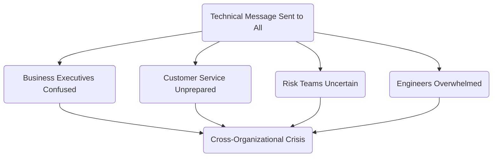

This example highlights the importance of tailoring incident communication to meet the needs of each audience. A structured communication cascade ensures clarity, alignment, and efficient incident resolution.
### SRE Best Practice: Evidence-Based Investigation

Effective communication cascades are built on evidence-based foundations. Before crafting any messaging, SREs must establish accurate situational awareness by following these steps:

#### Checklist for Evidence-Based Investigation:

1. **Systematic Data Collection**: Gather structured incident data from multiple sources:
   - Real-time monitoring alerts and dashboards.
   - Customer impact metrics (e.g., failed transactions, affected users).
   - Temporal data (e.g., incident start time, detection time, current duration).
   - Scope information (e.g., affected services, geographical impact).
   - Current status (e.g., active investigation, mitigation in progress, resolved).

2. **Establish a Single Source of Truth**:
   - Centralize all verified facts, current understanding, and planned actions in a continuously updated incident document.
   - Use this as the authoritative reference for all communications to ensure consistency.

3. **Audience Analysis**:
   - Map stakeholder information needs and terminology requirements:
     - **Technical Teams**: Require detailed system data for troubleshooting.
     - **Business Leaders**: Need impact assessments and decision-making support.
     - **Customer Support**: Require clear explanations and talking points for affected customers.
     - **Customers**: Need to understand personal impact and available alternatives.
     - **Regulators**: Require compliance status and adherence to reporting obligations.

4. **Information Distillation**:
   - Develop a systematic process to extract and tailor relevant information for each audience:
     - Ensure factual consistency across all communication streams.
     - Adapt language and focus to match the priorities of each stakeholder group.

#### Visual Workflow for Incident Evidence-Based Investigation:

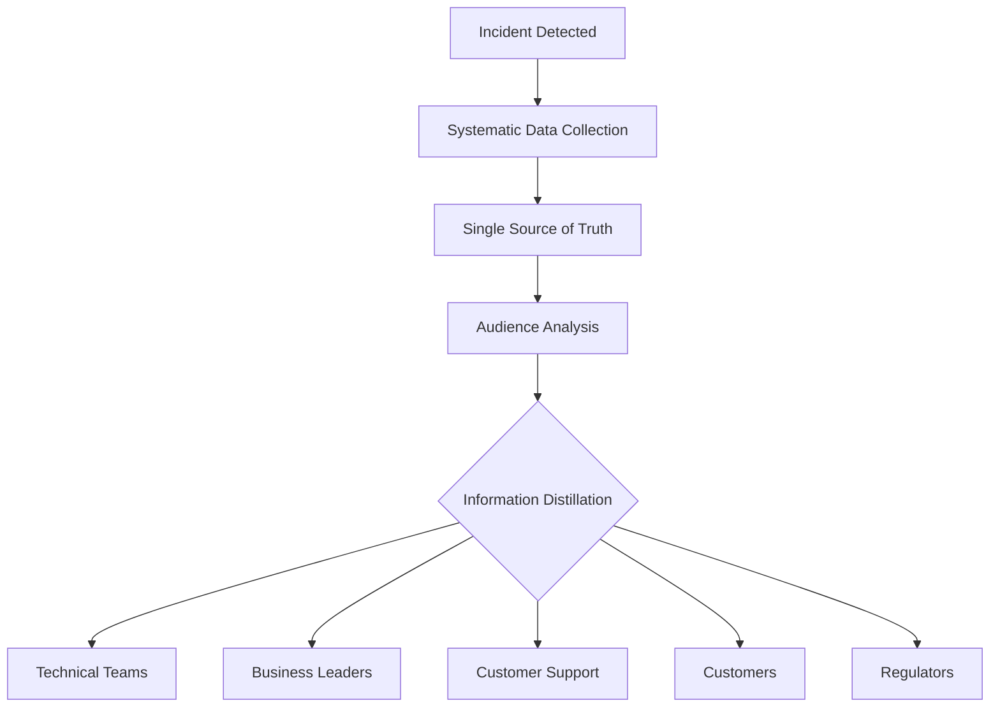

By adhering to this checklist, SREs ensure that all communications—while tailored to their audiences—are grounded in the same verified evidence, fostering trust and alignment during critical incidents.
### Banking Impact

Poor communication cascades in banking incidents create multilayered business impact. The table below summarizes key impact categories, their descriptions, and examples to highlight the consequences of communication failures in banking environments:

| **Category**                  | **Description**                                                                                      | **Example**                                                                                              |
| ----------------------------- | ---------------------------------------------------------------------------------------------------- | -------------------------------------------------------------------------------------------------------- |
| **Extended Resolution Times** | Technical teams are interrupted by stakeholders seeking clarification, delaying incident resolution. | Engineers spend additional hours explaining logs to executives instead of resolving the root cause.      |
| **Decision Latency**          | Executives receive unclear or overly technical updates, delaying critical business decisions.        | Delayed decision on customer compensation leads to increased dissatisfaction and escalations.            |
| **Trust Erosion**             | Inconsistent messaging across channels damages trust with customers, partners, and regulators.       | Customers receive conflicting updates, leading to confusion and reduced confidence in the bank.          |
| **Regulatory Consequences**   | Inadequate or delayed communication with regulators triggers formal investigations or penalties.     | Failure to meet reporting deadlines results in fines and additional regulatory scrutiny.                 |
| **Market Perception**         | Missteps in communication during incidents negatively impact stock price and market confidence.      | A vague public statement causes a sharp drop in investor confidence and a temporary stock price decline. |

In banking environments, where incidents directly affect customers' financial well-being and trigger regulatory reporting requirements, communication failures can transform manageable technical incidents into existential business crises.
### Implementation Guidance

To implement effective communication cascades in your banking organization, follow these steps:

---

#### **Checklist for Implementation**

1. **Develop Audience-Specific Templates**
   - [ ] Create pre-approved templates tailored to each stakeholder group.
   - [ ] Use audience-appropriate terminology and focus on decision-critical information.
   - [ ] Include placeholders for incident-specific details.
   - [ ] Maintain a consistent structure for all incidents.

2. **Establish a Central Communications Role**
   - [ ] Designate a communications coordinator for significant incidents.
   - [ ] Ensure they consume and translate technical information for various audiences.
   - [ ] Verify consistency across communication channels.
   - [ ] Control the timing and sequence of notifications.

3. **Build Stakeholder Maps**
   - [ ] Identify all stakeholder groups requiring incident information.
   - [ ] Map each group's information needs and technical proficiency.
   - [ ] Document preferred communication channels and formats.
   - [ ] Define clear escalation paths within each group.

4. **Implement Approval Workflows**
   - [ ] Define approvers for messages targeting each audience.
   - [ ] Establish SLAs for review and approval turnaround times.
   - [ ] Design expedited approval processes for urgent communications.
   - [ ] Document final authority for each type of message.

5. **Measure and Improve**
   - [ ] Collect feedback from stakeholders post-incident to assess communication quality.
   - [ ] Track metrics such as time-to-first-communication and update frequency.
   - [ ] Compare message approval times against SLA targets.
   - [ ] Regularly refine templates and processes based on lessons learned.

---

#### **Process Diagram**

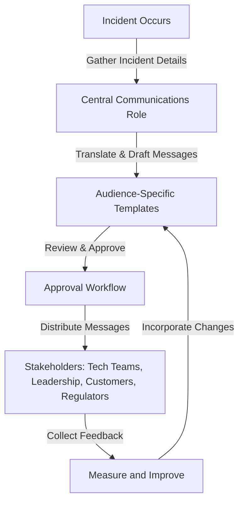

By following this checklist and process flow, your organization can ensure that incident communication meets the needs of all stakeholders, maintains consistency, and supports continuous improvement.
## Panel 2: Maintaining Transparency Without Causing Panic
### Scene Description
The scene shows a split-screen view of two different approaches to communication during the same banking incident. On the left, we see the "before" approach: a flustered support engineer sends an alarming all-company email with the subject "URGENT: ALL PAYMENT SYSTEMS DOWN!!!" causing visible panic among business teams. On the right, we see the "after" SRE approach: a composed incident commander provides a structured update through official channels stating: "Payment processing experiencing 18% transaction failure rate affecting corporate clients only. Mitigation in progress with ETA 45 minutes. Retail banking unaffected." The contrast between chaos and calm is visually striking.
### Teaching Narrative
Banking incidents require a delicate balance in communication - transparent enough to establish trust, but controlled enough to prevent unnecessary panic or reputation damage. This balance becomes even more critical in financial services, where customer confidence directly impacts business stability.

The traditional approach often swings between two problematic extremes: either complete silence until resolution (creating an information vacuum that breeds speculation) or unfiltered alarm-raising that amplifies the actual impact. SRE practices instead establish a "transparency framework" that provides accurate, timely information within appropriate guardrails.

Effective SRE communication during banking incidents follows specific principles:

1. Communicate facts, not speculation, clearly labeling what is known vs. suspected
2. Provide context around the scope and impact (who is affected and who isn't)
3. Include concrete next steps and expectations to create certainty
4. Update at regular, predictable intervals even when there's no resolution yet
5. Use consistent terminology and severity classifications across all incidents

This structured approach creates trust through transparency while preventing the amplification of concern that can trigger additional problems like customer panic or market reactions in financial services.
### Common Example of the Problem

A regional bank experienced a 45-minute disruption in its online banking authentication service. The initial customer service response was to tell customers that "all online services are down with no estimated time of resolution." In reality, only new login attempts were affected; existing sessions continued to function normally, and the mobile app used a different authentication path that was unaffected.

The overly broad communication triggered a chain reaction of unnecessary escalation:

```mermaid
graph TD
    A[Authentication Service Disruption] --> B[Overly Broad Communication: "All Online Services Down"]
    B --> C[Unnecessary Customer Support Calls]
    C --> D[Speculation Among Unaffected Customers]
    D --> E[Large Clients Hear "Complete System Outage" Rumors]
    E --> F[Clients Activate Contingency Plans]
    F --> G[Transaction Volume Rerouted to Competitors]

    G --> H[Exaggerated Crisis Damages Confidence]
    H --> I[Temporary Reduction in Transaction Volume]
    I --> J[Impact Persists After Issue Resolved]
```

What began as a contained technical issue with a clear workaround became an exaggerated crisis. The miscommunication not only damaged customer confidence but also temporarily reduced transaction volume, highlighting the importance of accurate and measured updates during incidents.
### SRE Best Practice: Evidence-Based Investigation

Balancing transparency and appropriate concern requires rigorous evidence collection and analysis before any communication is released. Use the following checklist to guide your evidence-based investigation process:

#### **Checklist for Evidence-Based Investigation**

1. **Impact Scope Verification**
   - [ ] Identify exactly which services and functions are affected.
   - [ ] Determine which customer segments are impacted.
   - [ ] Confirm whether the issue affects all transactions or only specific types.
   - [ ] Define geographic or time-based boundaries of the impact.
   - [ ] Check if alternate channels or workarounds are functioning.

2. **Quantitative Impact Assessment**
   - [ ] Replace vague terms with specific measurements (e.g., percentage of transactions affected).
   - [ ] Document specific error types and their frequencies.
   - [ ] Measure performance degradation in precise terms (e.g., "3x normal processing time").
   - [ ] Calculate the number or percentage of customers experiencing issues.
   - [ ] Quantify the transaction value impacted, especially in financial systems.

3. **Confidence Level Determination**
   - [ ] Clearly distinguish between confirmed facts and working theories.
   - [ ] Identify information gaps and outline ongoing investigations.
   - [ ] Explicitly state confidence levels when providing estimates.
   - [ ] Update confidence levels as certainty improves during the investigation.

4. **Risk Analysis**
   - [ ] Evaluate the potential outcomes of over-communication (e.g., unnecessary panic, resource misdirection).
   - [ ] Consider the risks of under-communication (e.g., trust erosion, reputation damage).
   - [ ] Assess regulatory implications of communication approaches.
   - [ ] Analyze the operational impact of potential customer responses.

#### **Flow of Evidence Collection and Communication**

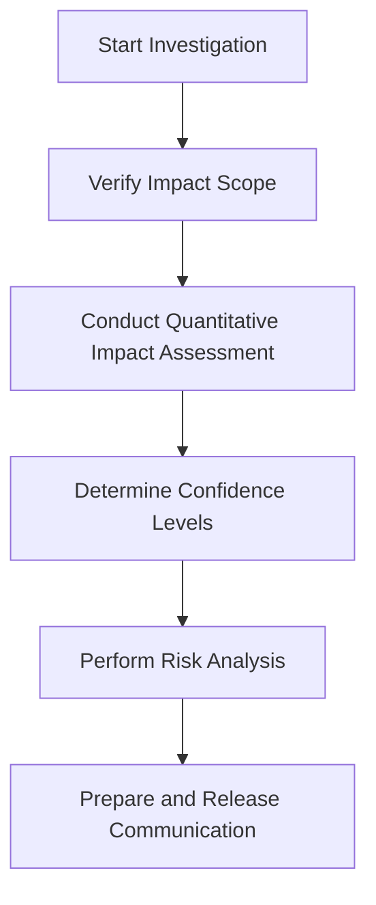

This checklist-driven and structured flow ensures that communications are precisely calibrated to the actual situation, avoiding both alarming exaggeration and harmful minimization. By following this approach, teams can establish trust while maintaining control over the narrative during incidents.
### Banking Impact

The business consequences of poorly calibrated communication in banking are substantial and can manifest in various ways. The table below summarizes key risks, their descriptions, and examples to illustrate their impact:

| **Risk**                     | **Description**                                                                                                                    | **Example**                                                                                                                    |
| ---------------------------- | ---------------------------------------------------------------------------------------------------------------------------------- | ------------------------------------------------------------------------------------------------------------------------------ |
| **Bank Run Risk**            | Panic-inducing communications can erode customer confidence, leading to mass deposit withdrawals or account closures.              | A poorly worded incident email causes rumors of insolvency, prompting customers to withdraw funds en masse.                    |
| **Channel Shifting**         | Overcommunication about issues can redirect customers to alternative channels, overwhelming branches or call centers.              | An update misrepresents the scope of a payment outage, resulting in a surge of support calls and branch visits.                |
| **Transaction Revenue Loss** | Exaggerated communications may lead customers to delay or cancel transactions, reducing fee income and payment processing revenue. | Customers defer high-value transfers due to uncertainty over system stability, leading to a drop in daily transaction revenue. |
| **Competitive Displacement** | Business customers may move transactions to competitors if they perceive extended unavailability of critical systems.              | A corporate client switches to a rival bank after an incident is communicated as more widespread than it actually is.          |
| **Market Valuation Impact**  | Miscommunicated incidents can cause stock price volatility that exceeds the true business impact of the technical issue.           | An ambiguous outage update triggers speculation, leading to a sharp drop in the institution's stock price.                     |

For banking institutions, where the foundation of business is customer trust, communication calibration directly influences both short-term operational stability and long-term customer relationships.
### Implementation Guidance

To implement balanced transparency in your financial institution:

1. **Develop a Severity Classification Matrix**: Create a standardized framework that:

   - Defines different incident severity levels with objective criteria
   - Maps each severity level to appropriate communication approaches
   - Includes guidance on communication frequency and detail level
   - Specifies approval requirements based on severity
   - Incorporates regulatory reporting thresholds

   ```mermaid
   graph TD
     A[Incident Occurs] --> B[Assess Severity]
     B --> C[Low Severity]
     B --> D[Medium Severity]
     B --> E[High Severity]
     C --> F[Minimal Communication]
     D --> G[Targeted Communication]
     E --> H[Full-Scale Communication]
     F --> I[Updates Every 2 Hours]
     G --> J[Updates Every 1 Hour]
     H --> K[Updates Every 30 Minutes]
   ```

2. **Create Factual Communication Templates**: Develop structured templates that:

   - Focus on verified facts rather than speculative language
   - Clearly separate known information from ongoing investigations
   - Include specific sections for scope and limitations of the issue
   - Provide explicit guidance on what actions to take or avoid
   - Use precise language that prevents misinterpretation

3. **Establish a Communications Review Process**: Implement a lightweight but effective review workflow:

   - Designate reviewers with both technical and business perspective
   - Create checklists for reviewing message accuracy and tone
   - Set time limits for reviews based on incident severity
   - Establish escalation paths for disagreements about messaging
   - Document who has final approval authority

   ```mermaid
   flowchart LR
     A[Draft Communication] --> B[Technical Review]
     B --> C[Business Review]
     C --> D{Disagreement?}
     D -- No --> E[Approve and Send]
     D -- Yes --> F[Escalate to Final Authority]
     F --> E
   ```

4. **Implement Regular Update Cadences**: Develop a predictable communication rhythm:

   - Set standard update intervals based on incident severity
   - Communicate the update schedule to all stakeholders
   - Provide updates even when there's no significant change
   - Include timestamp and "next update expected at" in all communications
   - Ensure shorter intervals for higher severity incidents

5. **Build a Communication Testing Program**: Verify effectiveness before incidents occur:

   - Conduct regular simulations using realistic incident scenarios
   - Test message interpretation with representatives from different audiences
   - Analyze how messages could be misinterpreted or misused
   - Practice rapid communication cycles during incident drills
   - Incorporate communication failures into chaos engineering exercises
## Panel 3: Real-Time Status Communication Infrastructure
### Scene Description

The scene depicts an SRE team that has built a sophisticated status communication ecosystem for banking incidents. At the center is a large screen displaying a unified status dashboard with real-time incident updates. The dashboard aggregates key metrics, incident timelines, and the current status of updates across channels.

Below is a text-based representation of the communication flow and team interactions:

```
+-------------------------+
| Unified Status Dashboard|
| (Real-Time Updates)     |
+-------------------------+
           |
           v
+---------------------+       +---------------------+
| Monitoring Alerts   |-----> | Human Verification  |
+---------------------+       +---------------------+
           |                           |
           v                           v
   +--------------------+      +--------------------------+
   | Incident Mgmt System|---->| Pre-approved Templates   |
   +--------------------+      +--------------------------+
           |                           |
           v                           v
+---------------------+       +-----------------------------+
| Automated Distribution|---->| Multi-Channel Updates       |
| Systems              |      | (Customer, Internal, Reg.)  |
+---------------------+       +-----------------------------+
```

Team members are shown collaborating to ensure seamless integration of automated monitoring alerts with human-verified updates. One engineer is actively programming the flow of automatic updates from the incident management system to multiple channels, including:

1. **Customer-facing status page**
2. **Internal employee portal**
3. **Regulatory reporting API**
4. **Executive dashboard app**

A bank of preset message templates is prominently visible, categorized by incident type and severity, ensuring quick and consistent communication. A timeline on the dashboard illustrates how status updates are propagated, showing that all channels are updated within minutes of approval. This setup highlights the efficiency and reliability of the status communication infrastructure during high-stress banking incidents.
### Teaching Narrative
In modern banking environments, effective communication during incidents cannot rely on manual processes. SRE best practices establish communication as infrastructure - built, tested, and automated like any critical system.

Traditional incident communication often depends on manual updates, email chains, and individual responder decisions about what and when to communicate. This leads to inconsistent messaging, delayed updates, and information silos. SRE transforms communication into a systematic, partially automated process that ensures speed, consistency, and proper information flow.

Communication infrastructure for banking incidents includes:

1. Pre-approved message templates for different incident types and severities
2. Automated distribution systems that push updates to multiple channels simultaneously
3. Role-based approval workflows that balance speed with accuracy
4. Status aggregation dashboards that provide a single source of truth
5. Integration between technical monitoring systems and human-verified status updates

This infrastructure approach ensures that even during high-stress banking incidents, communication follows established patterns that maintain quality and consistency. It transforms communication from an ad-hoc activity to a core component of the incident response system itself.
### Common Example of the Problem

A major investment bank struggled with inconsistent communication during a trading platform incident. The problem began when a database performance issue started causing order execution delays. The database team updated their internal Slack channel, but the information wasn't propagated to the trading desk support team. Meanwhile, client relationship managers, unaware of any issue, continued to assure key clients that the system was operating normally. Some clients received conflicting information depending on which employee they contacted. The bank's status page remained green even as the incident escalated. When compliance was finally notified, they discovered the issue had crossed regulatory reporting thresholds 45 minutes earlier. By the time a coordinated communication was released, nearly two hours had passed since the initial detection, with thousands of trades affected and numerous inconsistent messages circulating among clients and internal teams. The reputational damage exceeded the actual technical impact, especially among institutional clients who received contradictory information from different bank representatives.

#### Timeline of Events and Delays

```mermaid
gantt
    title Incident Timeline: Communication Failures
    dateFormat HH:mm
    axisFormat %H:%M
    section Incident Detected
    Database issue occurs          :done, a1, 09:00, 5min
    Initial detection by database team :done, a2, 09:05, 5min

    section Internal Communication
    Database team updates their Slack channel :done, b1, 09:10, 5min
    No update sent to trading desk support :crit, b2, 09:15, 20min
    Compliance remains unaware :crit, b3, 09:15, 45min

    section External Communication
    Clients given conflicting updates :crit, c1, 09:30, 30min
    Status page remains green :crit, c2, 09:30, 55min

    section Resolution
    Compliance team notified :done, d1, 09:55, 10min
    Coordinated update released :done, d2, 10:05, 15min
    Final resolution and postmortem begins :done, d3, 10:20, 10min
```

This timeline highlights the cascading delays in communication and their impact:

- **09:00**: Database performance issue begins.
- **09:05**: Database team detects and documents the issue internally.
- **09:10-09:30**: Critical communication gaps emerge:
  - Trading desk support remains unaware of the problem for 20+ minutes.
  - Client relationship managers provide conflicting updates.
  - Compliance is not informed despite regulatory thresholds being crossed.
- **09:55**: Compliance is notified, but by then, the damage has been done. Regulatory reporting is late, inconsistent narratives are circulating, and the status page remains inaccurate.
- **10:05**: A coordinated communication is finally released, nearly two hours after the issue began.

This real-world example underscores the need for automated, integrated communication systems to eliminate delays, ensure consistency, and protect the organization’s reputation.
### SRE Best Practice: Evidence-Based Investigation

Building effective communication infrastructure requires systematic analysis of both technology and process elements. Use the following checklist to guide your efforts:

#### Checklist: Evidence-Based Investigation for Communication Infrastructure

1. **Communication Flow Mapping**
   - [ ] Track actual information flows during recent incidents.
   - [ ] Measure time delays between detection and various notifications.
   - [ ] Identify bottlenecks, approval gates, and decision points.
   - [ ] Map disconnected communication channels and information silos.
   - [ ] Analyze where inconsistencies and divergent messaging occur.

2. **Channel Effectiveness Assessment**
   - [ ] Measure delivery reliability and timing for each mechanism.
   - [ ] Assess recipient engagement and acknowledgment rates.
   - [ ] Validate that messages remain consistent across channels.
   - [ ] Test accessibility under various conditions (e.g., after hours, remote access).
   - [ ] Review historical effectiveness during previous incidents.

3. **Automation Opportunity Analysis**
   - [ ] Identify repetitive updates that follow predictable patterns.
   - [ ] Pinpoint cross-posting tasks for identical information across multiple channels.
   - [ ] Flag simple status updates based on monitoring metrics for automation.
   - [ ] Automate scheduled reminder messages and update notifications.
   - [ ] Implement message consistency verification and adherence to templates.

4. **System Integration Evaluation**
   - [ ] Verify API availability for incident management platforms.
   - [ ] Check webhook capabilities for alerting systems.
   - [ ] Ensure authentication mechanisms are compatible between systems.
   - [ ] Assess data transformation requirements between systems.
   - [ ] Evaluate rate limits and throttling considerations.

This checklist ensures that your communication infrastructure investments are data-driven, targeting verified deficiencies. It also helps focus automation on suitable tasks while retaining human oversight for critical decisions.
### Banking Impact

Inadequate communication infrastructure in banking creates significant business consequences. The table below highlights key issues, their impacts, and real-world examples:

| **Issue**                     | **Impact**                                                                                       | **Example**                                                                                                           |
| ----------------------------- | ------------------------------------------------------------------------------------------------ | --------------------------------------------------------------------------------------------------------------------- |
| Delayed Customer Notification | Extends the window of confusion and negative customer experience by 15-30 minutes.               | A critical payment system outage delays notifying customers, leading to increased call center volume and frustration. |
| Compliance Violations         | Missed regulatory reporting timeframes result in fines and reputational damage.                  | Failure to report a system downtime to regulators within the mandated 1-hour window leads to a $500,000 fine.         |
| Resource Diversion            | Up to 40% of technical responders’ time is spent on communication tasks instead of resolution.   | Engineers manually draft incident updates, delaying the root cause investigation for a major outage.                  |
| Message Inconsistency         | Factual inconsistencies across channels occur approximately 65% of the time.                     | Conflicting updates about ATM availability confuse customers and erode trust in the bank’s communication.             |
| Resolution Friction           | Return questions and clarifications interrupt technical teams, extending resolution time by 20%. | Misaligned updates between monitoring tools and customer-facing messages cause repeated escalations.                  |

For banking institutions handling billions in daily transaction volume, even small improvements in communication efficiency directly impact financial outcomes, regulatory standing, and customer retention.
### Implementation Guidance

To build effective communication infrastructure for your banking organization, follow these steps. The flow diagram below provides a visual representation of how the systems and processes interact to deliver seamless incident communication.

#### Incident Communication Flow Diagram
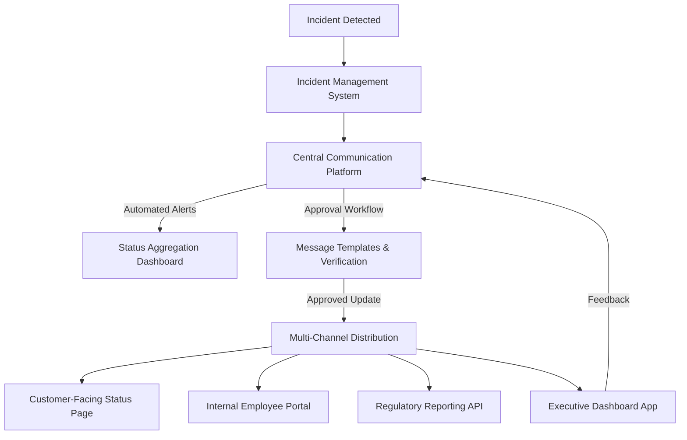

#### Key Implementation Steps

1. **Implement a Central Incident Communication Platform**: Deploy a dedicated system that:
   - Serves as the single source of truth for all incident information
   - Integrates with monitoring tools for automatic incident creation
   - Provides structured templates for different incident types
   - Supports role-based access for different stakeholder groups
   - Maintains a comprehensive audit trail of all communications

2. **Develop Multi-Channel Distribution Capabilities**: Create automated publication workflows that:
   - Push approved updates to multiple channels simultaneously
   - Transform content to appropriate format for each channel
   - Include status page, email, SMS, mobile app notifications, and internal systems
   - Support categorization by service, severity, and audience
   - Maintain delivery metrics and confirmation tracking

3. **Create Approval and Verification Workflows**: Implement processes that balance speed with accuracy:
   - Define role-based approval pathways based on message type and severity
   - Create streamlined review interfaces with clear accept/reject options
   - Implement automatic escalation for delayed approvals
   - Include message preview functionality across all target channels
   - Provide one-click approval for pre-authorized templates

4. **Build Status Aggregation Dashboards**: Develop unified status views that:
   - Consolidate incident information across all banking systems
   - Provide appropriately filtered views for different audiences
   - Include historical status and incident timeline visualization
   - Support both public (customer) and internal (employee) versions
   - Integrate real-time monitoring data with human-verified status information

5. **Establish Backup Communication Methods**: Implement resilient alternatives that:
   - Function independently from primary banking infrastructure
   - Include out-of-band notification systems for critical updates
   - Provide manual override capabilities when automated systems fail
   - Support degraded operation during severe infrastructure issues
   - Are regularly tested during normal operations to ensure readiness
## Panel 4: Regulatory and Compliance Communication
### Scene Description

An SRE team is actively managing a banking system incident with regulatory implications. The scene depicts a specialized communication workflow explicitly designed to meet stringent regulatory requirements. The workflow integrates multiple roles, tools, and processes, ensuring compliance is maintained in real-time throughout the incident response.

Below is a textual representation of the workflow diagram:

```
+---------------------+       +----------------------+       +-----------------------+
| Real-Time Audit Log |       | Compliance Checklist |       | Regulatory Reporting  |
| Maintained by Team  |       | Interface Operated   |       | System Interacting    |
| Member 1            |       | by Team Member 2     |       | with Team Member 3    |
+---------------------+       +----------------------+       +-----------------------+
          |                                |                              |
          |                                |                              |
          V                                V                              V
+--------------------------------------------------+  +-------------------+
| Incident Investigation Actions Captured & Logged |  | Countdown Timer   |
| Real-Time Decisions Tracked for Audit Purposes   |  | Regulatory Reporting|
+--------------------------------------------------+  | Deadline Displayed |
                                                    +-------------------+
          |                                |                              |
          +----------------------------------------------------------------+
                             Verification System
       Documentation Assembled to Show Proper Response Protocols Followed
```

**Roles and Tools:**
1. **Team Member 1** manages a meticulous real-time audit log to capture all investigative actions and decisions for compliance and post-incident review.
2. **Team Member 2** operates the compliance checklist interface, which dynamically tracks required notifications based on the incident's classification.
3. **Team Member 3** interacts with an automated regulatory reporting system that formats incident details according to various regulatory frameworks (e.g., FCA, PRA, ECB).

**Key Visual Elements:**
- A countdown timer prominently displays the regulatory reporting deadline.
- A verification system provides real-time updates on documentation being compiled to demonstrate adherence to response protocols.
### Teaching Narrative
Banking incidents operate under unique regulatory requirements that transform communication from a best practice into a legal obligation. SRE in financial services must integrate regulatory communication into core incident response workflows.

Traditional approaches often treat regulatory reporting as an after-the-fact burden, completed once the technical incident is resolved. This creates compliance risks and often results in rushed, incomplete reporting. The SRE approach integrates regulatory requirements directly into the incident response process, treating compliance communication as a first-class operational concern.

Key elements of regulatory communication in banking incidents include:

1. Real-time audit trails that capture all incident response actions for later review
2. Threshold-based triggers that automatically initiate regulatory notification workflows
3. Jurisdictional mapping that identifies which regulations apply based on the affected systems
4. Dual-purpose documentation that serves both operational and compliance needs
5. Time-bound reporting frameworks that ensure deadlines are tracked and met

When regulatory communication is embedded into SRE practices rather than bolted on afterward, it becomes more accurate, less burdensome, and a natural extension of good incident management rather than competing with it.
### Common Example of the Problem

A multinational bank experienced a data processing issue that caused settlement delays in its treasury management system. The technical team focused exclusively on resolving the core issue, correctly prioritizing system restoration. However, they failed to notify the compliance team until after resolution, unaware that the incident had crossed reporting thresholds for multiple regulatory bodies. By the time compliance became involved, mandatory reporting windows for the SEC, FCA, and ECB had already closed. The technical documentation created during the incident lacked critical details required for regulatory submissions, forcing compliance officers to interview response team members retroactively to reconstruct the timeline and impact assessment. The bank ultimately faced regulatory penalties and increased scrutiny not because of the technical incident itself, which was resolved effectively, but due to the late and incomplete regulatory communications. What's more, the lack of proper documentation made it difficult to demonstrate the otherwise appropriate technical response, creating the impression of inadequate incident management processes.

#### Checklist: Key Failures in the Example
- **Missed Notifications**: Regulatory thresholds were crossed without timely notifications to the SEC, FCA, and ECB.
- **Delayed Compliance Involvement**: The compliance team was not engaged until after the technical issue was resolved.
- **Incomplete Documentation**: Incident documentation lacked critical details required for regulatory submissions, such as:
  - Exact timeline of investigative actions
  - Impact assessment on affected systems
  - Justifications for decision-making during the incident
- **Reconstruction Efforts**: Compliance officers had to manually reconstruct events by interviewing the response team, delaying submissions further.
- **Regulatory Penalties**: The bank faced penalties and increased scrutiny due to late and incomplete reporting, despite resolving the technical issue effectively.
- **Erosion of Trust**: Poor documentation created an impression of inadequate incident management, damaging the bank's credibility with regulators.

By embedding regulatory communication into incident workflows, organizations can prevent these failures and ensure compliance obligations are met as part of the natural response process.
### SRE Best Practice: Evidence-Based Investigation

Effective regulatory communication requires systematic analysis and integration of compliance requirements into incident management. The following table summarizes the four investigation steps and their key actions:

| **Investigation Step**                | **Key Actions**                                                                      |
| ------------------------------------- | ------------------------------------------------------------------------------------ |
| **Regulatory Mapping Analysis**       | - Identify applicable financial regulations with incident reporting requirements     |
|                                       | - Map reporting thresholds for different incident types and severities               |
|                                       | - Document required reporting timeframes for each authority                          |
|                                       | - Catalog specific information required in each report type                          |
|                                       | - Define jurisdictional applicability based on affected systems, data, and customers |
| **Process Gap Assessment**            | - Measure time from incident detection to regulatory notification                    |
|                                       | - Assess completeness of historical regulatory submissions                           |
|                                       | - Identify missing data elements in typical incident documentation                   |
|                                       | - Evaluate awareness of regulatory requirements among technical teams                |
|                                       | - Review previous regulatory findings related to incident reporting                  |
| **Compliance Trigger Analysis**       | - Define objective, measurable criteria that trigger reporting obligations           |
|                                       | - Identify who is responsible for making reporting determinations                    |
|                                       | - Document how incident classification connects to regulatory thresholds             |
|                                       | - Analyze how incident scope changes affect reporting requirements                   |
|                                       | - Verify detection mechanisms for reportable conditions                              |
| **Documentation Sufficiency Testing** | - Compare incident records against regulatory submission requirements                |
|                                       | - Identify missing elements that must be gathered separately                         |
|                                       | - Evaluate terminology alignment between technical and regulatory contexts           |
|                                       | - Test whether documentation would satisfy regulatory inquiries                      |
|                                       | - Verify that evidence collection practices meet compliance standards                |

This structured, evidence-based approach ensures that regulatory communication is built on a complete understanding of both compliance requirements and current process limitations. By following these steps, SRE teams can implement targeted improvements that integrate compliance seamlessly into incident management workflows.
### Banking Impact

Inadequate regulatory communication creates significant business consequences beyond the immediate technical incident. The following cause-and-effect diagram illustrates how poor communication cascades into these outcomes:

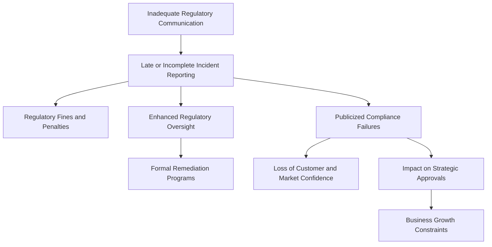

1. **Direct Financial Penalties**: Regulatory fines for late or incomplete incident reporting can range from tens of thousands to millions of dollars, often exceeding the operational impact of the original incident.

2. **Increased Oversight**: Reporting failures typically trigger enhanced supervisory attention, requiring additional resources for regulatory management and limiting operational flexibility.

3. **Remediation Costs**: Regulatory findings usually mandate formal remediation programs with external validation, creating significant project costs and diverting resources from other initiatives.

4. **Reputational Amplification**: Regulatory actions are typically public, transforming an otherwise contained technical incident into a publicized compliance failure that damages market and customer confidence.

5. **Strategic Impact**: Serious or repeated reporting failures can affect regulatory approvals for new products, services, or markets, directly impacting business strategy and growth.

For banking institutions, the long-term business consequences of poor regulatory communication often far outweigh the immediate impact of the technical incident itself, making compliance communication an essential component of overall incident management.
### Implementation Guidance

To implement effective regulatory communication in your banking organization, follow these five steps. Use the checklist below to ensure thorough and consistent application.

#### Checklist: Implementing Regulatory Communication in Banking Incidents
1. **Create a Regulatory Reporting Playbook**
   - [ ] Map incident types to specific regulatory reporting requirements.
   - [ ] Define objective thresholds that trigger reporting obligations.
   - [ ] Include templates pre-aligned with regulatory submission formats.
   - [ ] Specify reporting timeframes and escalation procedures.
   - [ ] Assign clear responsibilities for reporting decisions and submissions.

2. **Implement Automated Notification Triggers**
   - [ ] Deploy systems to automatically identify potentially reportable conditions.
   - [ ] Configure alerts to notify compliance teams early in the incident lifecycle.
   - [ ] Track regulatory reporting deadlines with clear visual indicators.
   - [ ] Set up early warning mechanisms for incidents nearing reporting thresholds.
   - [ ] Implement redundant notification paths for critical regulatory issues.

3. **Develop Integrated Documentation Processes**
   - [ ] Design workflows to capture information for both technical and regulatory purposes.
   - [ ] Use terminology that bridges technical and compliance contexts.
   - [ ] Include explicit sections for regulatory report requirements.
   - [ ] Maintain a chain of custody for evidence required in regulatory investigations.
   - [ ] Enable attestation and verification of key facts by appropriate personnel.

4. **Establish a Compliance Liaison Role**
   - [ ] Designate individuals to act as compliance observers during significant incidents.
   - [ ] Ensure liaisons provide real-time guidance on regulatory implications.
   - [ ] Assist with documentation to satisfy regulatory requirements.
   - [ ] Prepare preliminary notifications while incidents are ongoing.
   - [ ] Facilitate communication between technical teams and compliance departments.

5. **Build Testing and Simulation Capabilities**
   - [ ] Regularly test regulatory reporting processes in incident simulations.
   - [ ] Include regulatory scenarios in chaos engineering exercises.
   - [ ] Practice regulatory communications with the same rigor as technical responses.
   - [ ] Validate communication systems for compliance with regulatory standards.
   - [ ] Simulate realistic time pressure using actual reporting deadlines.

#### Summary Flow of Implementation
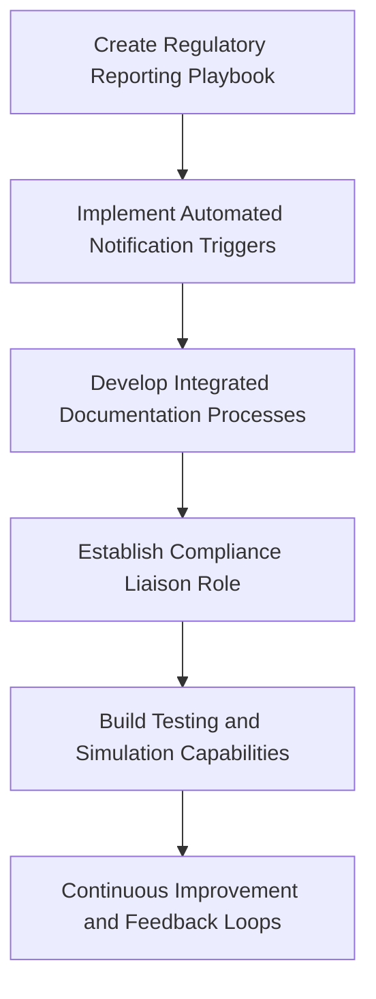

By adhering to this checklist and workflow, your organization can embed regulatory communication into incident response, ensuring compliance obligations are met without compromising operational efficiency.
## Panel 5: Post-Resolution Communication Strategy
### Scene Description

The scene shows an incident that has just been resolved after affecting a banking payment system for several hours. The SRE team is now executing a structured post-resolution communication plan. This process is depicted as a sequence of communications and timing milestones:

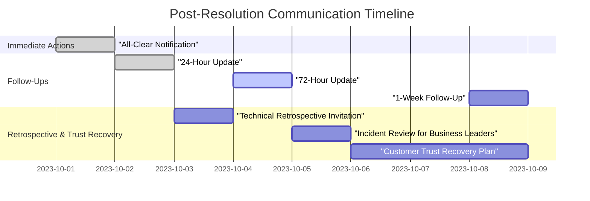

The sequence includes the following key elements:
1. **Immediate "all-clear" notification** with basic resume details to confirm service restoration.
2. **Planned follow-up communications** at defined intervals (24 hours, 72 hours, and one week) to keep stakeholders informed.
3. **Audience-specific invitations and communications**, such as a technical retrospective for engineering teams and an incident review for business leaders with impact analysis.
4. **Trust recovery communication plans** for affected customers, providing explanations, root cause transparency, and preventative measures.

Team members are shown actively assigning ownership for each communication stream and setting reminders for scheduled updates. This structured approach ensures all stakeholders are kept informed and reassured, transforming incident recovery into an opportunity for improvement and trust-building.
### Teaching Narrative
Incident communication doesn't end when systems are restored. The post-resolution communication strategy is critical for rebuilding trust, capturing learnings, and preventing future incidents - particularly in banking where customer confidence is paramount.

Many organizations make the mistake of abruptly ending communication once technical systems are functioning, leaving stakeholders with unanswered questions and uncertainty about root causes and future prevention. SRE practices establish post-resolution communication as a critical phase with its own templates, timelines, and ownership.

An effective post-resolution communication strategy includes:

1. Immediate "all-clear" notifications with confirmation of service restoration
2. Planned follow-up communications at defined intervals (24h, 72h, 1 week)
3. Audience-specific retrospective invitations and summary reports
4. "Trust recovery" communications that explain root causes and prevention measures
5. Impact transparency that acknowledges the disruption caused and remediation steps

In banking environments, where a single incident can damage long-term customer trust, this structured approach to post-resolution communication is essential for maintaining relationships and demonstrating accountability. It transforms the incident's conclusion from an ending into a transition toward prevention and improvement.
### Common Example of the Problem

A digital-first bank experienced a mobile app authentication issue that prevented customers from logging in for approximately three hours. Once the engineering team resolved the root cause – a certificate expiration – they sent a simple status update: "The mobile app login issue has been resolved. All systems operating normally." They then immediately shifted focus to their next scheduled release. No explanation was provided to customers about what happened, how it was fixed, or what would prevent recurrence. Customer service representatives had no additional information to share with concerned clients.

In the information vacuum, social media speculation suggested the bank had experienced a security breach, causing lingering concern even after services were restored. Several large clients cited the bank's poor communication, rather than the technical issue itself, as their reason for reducing their relationship with the institution. Internal teams had no formal mechanism to learn from the incident, and multiple similar certificate-related issues occurred in subsequent months because the root cause and prevention measures weren't properly communicated to operations teams.

#### Key Takeaways and Checklist

**Key Mistakes:**
- Failure to provide transparency about the issue, resolution, and preventative measures.
- Lack of customer-facing communication beyond a basic status update.
- No actionable information provided to customer service representatives.
- Missed opportunity for internal learning and root cause dissemination.
- Repeated incidents due to the absence of preventative measures.

**Checklist to Avoid Similar Issues:**
1. **Transparency:** Include a clear explanation of the root cause, resolution steps, and preventative measures in follow-up communications.
2. **Audience-Specific Messaging:** Tailor updates for customers, business leaders, and internal teams to address their unique concerns and needs.
3. **Empower Customer Service:** Ensure representatives have timely and detailed information to handle client inquiries confidently.
4. **Social Media Monitoring:** Actively monitor and address misinformation on public platforms during and after the incident.
5. **Internal Retrospectives:** Conduct a formal retrospective with cross-functional teams to document learnings and implement preventative actions.
6. **Proactive Follow-Ups:** Schedule follow-up communications at key intervals (e.g., 24h, 72h) to maintain trust and demonstrate accountability.
### SRE Best Practice: Evidence-Based Investigation

Effective post-resolution communication strategies are built on systematic assessment of stakeholder needs and communication effectiveness. The following table organizes the key steps, their purpose, and the expected outcomes to ensure clarity and actionable insights.

| **Step**                                              | **Purpose**                                                            | **Expected Outcome**                                                                 |
| ----------------------------------------------------- | ---------------------------------------------------------------------- | ------------------------------------------------------------------------------------ |
| **Stakeholder Impact Analysis**                       | Identify affected audiences and their specific needs                   | Comprehensive understanding of stakeholder concerns and tailored communication plans |
| - Identify all stakeholder groups affected            | Understand the full scope of impacted parties                          | Complete list of stakeholders to address                                             |
| - Assess each group's specific concerns and questions | Pinpoint unique needs for each group                                   | Clear categorization of concerns                                                     |
| - Determine what information provides closure         | Define what resolutions stakeholders need to rebuild trust             | Targeted messaging for each audience                                                 |
| - Map optimal communication channels                  | Select the best methods to reach each audience                         | Increased communication efficiency and satisfaction                                  |
| - Identify trust remediation requirements             | Outline steps for rebuilding trust with severely impacted stakeholders | Strengthened stakeholder relationships and confidence                                |

| **Communication Gap Assessment** | Identify areas where information is incomplete or unclear                  | Fully addressed questions and accurate dissemination of information                |
| - Review repeated questions during the incident | Understand common areas of confusion                                         | Prioritized clarification of recurring concerns                                    |
| - Identify unavailable information during the incident | Analyze missing data that hindered resolution                                | Transparent acknowledgment of gaps and follow-up                                   |
| - Assess root causes and contributing factors | Determine explanations needed for technical and business audiences          | Root cause analysis communicated effectively                                       |
| - Communicate future prevention plans | Reassure stakeholders by addressing how similar incidents will be avoided   | Increased confidence in organizational accountability                              |
| - Analyze potential misinformation risks | Mitigate risks of miscommunication or speculation                            | Proactive correction of misinformation                                             |

| **Temporal Needs Mapping**       | Plan communication timing to align with audience and compliance needs       | Timely delivery of relevant updates                                               |
| - Analyze timing needs for follow-ups | Ensure communications are sent at appropriate intervals                      | Stakeholders receive information when needed                                      |
| - Identify regulatory deadlines  | Fulfill legal and compliance obligations                                    | Avoidance of penalties and audit issues                                           |
| - Map internal learning sessions | Ensure retrospectives are scheduled for maximum participation               | Effective internal knowledge sharing                                              |
| - Align customer communications  | Match updates to service recovery milestones                                | Enhanced customer satisfaction and trust                                          |

| **Resource Requirement Analysis** | Ensure necessary resources are in place for execution                      | Well-prepared and efficient communication delivery                                |
| - Identify responsible creators   | Assign ownership for each communication type                                | Clear accountability and streamlined execution                                    |
| - Determine approval requirements | Understand necessary sign-offs for sensitive messages                      | Reduced delays and proper oversight                                               |
| - Assess bandwidth for response channels | Confirm capacity for handling stakeholder inquiries                         | Improved response times and stakeholder experience                                |
| - Evaluate technical platforms    | Ensure tools are available for effective communication                      | Seamless delivery of messages                                                     |
| - Calculate total effort required | Estimate workload to allocate resources appropriately                       | Balanced workloads and on-time communication                                      |

This structured and evidence-based approach ensures that post-resolution communication is systematically scaled, targeted to actual stakeholder needs, and aligned with organizational goals, rather than relying on assumptions or minimal compliance standards.
### Banking Impact

Inadequate post-resolution communication creates significant business consequences in banking environments. The following data highlights the tangible effects:

```mermaid
barChart
    title Banking Impact of Poor Post-Resolution Communication
    axis X "Metrics" 
    axis Y "Impact Severity"
    barWidth 50
    data "Extended Trust Recovery Period" 4
    data "Transaction Volume Depression" 18
    data "Customer Attrition Likelihood" 5
    data "Incident Recurrence Rate" 3
    data "Regulatory Scrutiny Escalation" 3
```

**Key Insights:**

1. **Extended Trust Recovery Period**: Financial institutions with poor post-incident communication typically require 3-4 times longer to restore customer confidence levels compared to those with comprehensive strategies.

2. **Transaction Volume Depression**: Studies show that unclear resolution communications result in 12-18% lower transaction volumes for up to 30 days following an incident as customers remain hesitant about system reliability.

3. **Customer Attrition**: Banking customers who receive inadequate incident explanation are 5 times more likely to reduce their relationship or change providers within 90 days compared to those who receive comprehensive follow-up.

4. **Incident Recurrence**: Organizations without effective internal post-resolution communication experience similar incidents at 3 times the rate of those with structured knowledge sharing, creating compounding reputation damage.

5. **Regulatory Scrutiny Escalation**: Financial regulators typically increase oversight requirements when post-incident documentation and communication are insufficient, creating ongoing compliance burden.

For banking institutions, where customer relationships are built on long-term trust, the business impact of poor post-resolution communication often exceeds the impact of the original incident.
### Implementation Guidance

To implement effective post-resolution communication in your banking organization, follow these actionable steps. Use the checklist and flowchart below to ensure a structured and comprehensive approach.

---

#### **Checklist: Post-Resolution Communication Implementation**

1. **Create a Post-Resolution Communication Matrix**:
   - [ ] Map audience segments to specific communication needs.
   - [ ] Define timing for each communication type (immediate, 24h, 72h, 1 week, etc.).
   - [ ] Specify channels and formats for each communication (email, dashboard, etc.).
   - [ ] Assign ownership for creation, approval, and delivery of communications.
   - [ ] Prepare templates for different incident types and severities.

2. **Develop a Trust Recovery Communication Plan**:
   - [ ] Prepare templates that acknowledge impact without admitting liability.
   - [ ] Draft clear, non-technical explanations of technical issues.
   - [ ] Outline preventative measures implemented to avoid future incidents.
   - [ ] Establish approval workflows for customer compensation or remediation offers.
   - [ ] Design mechanisms for collecting customer feedback on their experience.

3. **Implement Knowledge-Sharing Mechanisms**:
   - [ ] Schedule technical deep-dive sessions to share learnings.
   - [ ] Create incident summary documents for company-wide distribution.
   - [ ] Develop targeted communications for teams managing similar systems.
   - [ ] Establish executive briefing formats focused on systemic improvements.
   - [ ] Build a searchable knowledge base of incidents and resolutions.

4. **Create Communication Measurement Systems**:
   - [ ] Deploy short surveys to assess communication effectiveness.
   - [ ] Monitor social media and customer service channels for unresolved concerns.
   - [ ] Track communication delivery and engagement metrics.
   - [ ] Measure sentiment change across different audience segments.
   - [ ] Compile metrics on timeliness vs. established communication goals.

5. **Establish a Communication Calendar**:
   - [ ] Create automated reminders for follow-up communications.
   - [ ] Develop a visual timeline of all planned post-incident messages.
   - [ ] Assign clear ownership for every scheduled communication.
   - [ ] Verify that all communications are sent as planned.
   - [ ] Include checkpoints to evaluate the need for additional communications.

---

#### **Flowchart: Post-Resolution Communication Workflow**

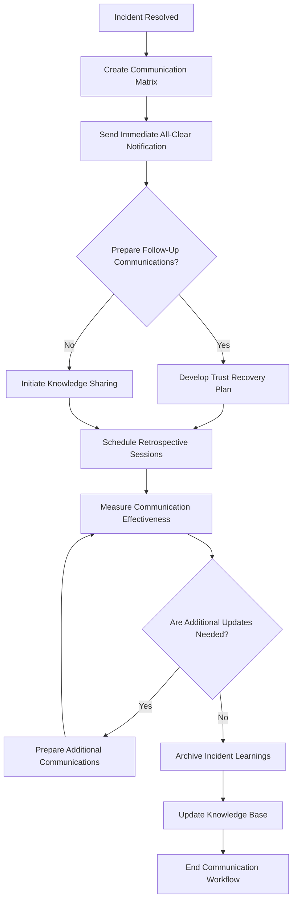

By following the checklist and using the flowchart as a guide, your team can ensure a thorough and reliable post-resolution communication process that builds trust and drives continuous improvement.
## Panel 6: Cross-Team Communication Protocols
### Scene Description

The scene illustrates a complex banking incident affecting multiple interconnected systems. At the center of the operation is a structured cross-team communication hub designed with clear protocols to manage the incident efficiently. Below is a simplified text diagram that represents the flow of information and roles within the hub:

```
            +---------------------------+
            | Cross-Team Communication  |
            |           Hub             |
            +---------------------------+
                        |
   +--------------------+---------------------+
   |                    |                     |
   v                    v                     v
+----------------+  +----------------+  +----------------+
| Core Banking   |  | Payment Gateway|  | Fraud Detection|
| Platform       |  | (Red: Degraded)|  | (Yellow: Delayed|
| (Green: Oper.) |  |                |  | Processing)    |
+----------------+  +----------------+  +----------------+
        |                    |                     |
        v                    v                     v
+----------------+  +----------------+  +----------------+
| Liaison:       |  | Liaison:       |  | Liaison:       |
| Formats and    |  | Formats and    |  | Formats and    |
| Reports Status |  | Reports Status |  | Reports Status |
+----------------+  +----------------+  +----------------+

                        +
                        |
                        v
+---------------------------------------------------------+
| "Technical Translator" Role:                            |
| Bridges specialized terminology gaps between teams,     |
| ensuring that all updates are clear and actionable.     |
+---------------------------------------------------------+

                        +
                        |
                        v
+---------------------------------------------------------+
| Shared Glossary Dashboard:                              |
| Ensures consistent terminology across all specialized   |
| domains, preventing misunderstandings and confusion.    |
+---------------------------------------------------------+

```

The command center also establishes specific communication channels tailored to different interaction types:
- **Major Updates:** High-priority broadcasts to all teams for synchronized awareness.
- **Coordination Requests:** For cross-team collaboration and alignment.
- **Resource Needs:** Requests for additional support or tools required for resolution.

This structured flow ensures that all teams—despite their diverse specialties—operate with the same information, priorities, and terminology during the incident.
### Teaching Narrative
Banking incidents rarely affect isolated systems. When incidents span multiple teams and technologies, communication can quickly become the biggest obstacle to resolution - especially when teams use different terminology, tools, and communication styles.

Traditional incident management often relies on point-to-point communication between teams, creating confusion, duplication, and information asymmetry. The SRE approach establishes standardized cross-team communication protocols that ensure everyone works with the same information, priorities, and terminology despite their different specialties.

Effective cross-team communication protocols include:

1. Standardized status reporting formats that all teams use regardless of their internal practices
2. Designated communication liaisons who focus on information exchange while others troubleshoot
3. Shared terminology glossaries that prevent misunderstanding across specialized domains
4. Clear escalation and coordination pathways that prevent fragmented communication
5. Centralized information repositories that serve as a single source of truth during the incident

These protocols are especially crucial in banking environments where incidents often cross traditional boundaries between payment systems, core banking platforms, security services, and customer-facing channels. Structured communication becomes the connective tissue that enables effective coordination across these specialized domains.
### Common Example of the Problem

A major banking outage began when an authentication issue prevented customers from accessing online and mobile banking. The incident initially appeared isolated to the identity management team, who began troubleshooting. However, the authentication problem was actually a symptom of network connectivity issues between data centers, which also affected payment processing and account management systems.

Each technology team created their own incident bridges and worked in isolation:
- The **network team** believed they were addressing a routing issue unrelated to customer impact.
- The **authentication team** was attempting to restart services that would immediately fail again due to the network problem.
- The **payment processing team** was implementing a workaround that increased load on the already troubled network.

Customer service had no visibility into the fragmented response and provided contradictory information to clients. Four hours into the incident, the teams remained unaware they were working on different aspects of the same problem until an alert manager noticed similar patterns across multiple incident tickets. Once properly coordinated, the actual resolution took less than 30 minutes, but the fragmented communication had quadrupled the effective outage duration and created unnecessary customer confusion.

Below is a timeline illustrating the sequence of events and miscommunications during the incident:

```mermaid
timeline
    title Incident Timeline: Miscommunication and Resolution
    00:00:00 : Authentication issue reported; identity management team begins troubleshooting.
    00:30:00 : Authentication team restarts services, unaware of underlying network problem.
    01:00:00 : Network team investigates routing issues, believing them unrelated to customer impact.
    01:30:00 : Payment processing team implements a workaround, increasing network load.
    02:00:00 : Customer service provides contradictory updates due to lack of visibility.
    04:00:00 : Alert manager identifies patterns across incident tickets; teams coordinate.
    04:30:00 : Root cause identified and addressed; all systems restored.
```

This timeline highlights how fragmented communication prolonged the outage and compounded its impact. A structured, cross-team communication protocol could have surfaced the shared root cause earlier, significantly reducing downtime and preventing customer confusion.
### SRE Best Practice: Evidence-Based Investigation

Effective cross-team communication protocols are built on systematic analysis of organizational communication patterns. Use the following checklist to guide your evidence-based investigation and ensure actionable insights:

#### Checklist for Evidence-Based Investigation

1. **Communication Pathway Mapping**
   - [ ] Identify all teams that typically participate in major incidents.
   - [ ] Map current communication channels between teams (direct, hierarchical, etc.).
   - [ ] Document the tools and platforms each team uses for communication.
   - [ ] Measure typical delays in cross-team information sharing.
   - [ ] Identify where information gets lost or transformed between teams.

2. **Terminology and Mental Model Analysis**
   - [ ] Catalog different terms used for the same concepts across teams.
   - [ ] Identify differences in how teams visualize and describe the same systems.
   - [ ] Document where specialized knowledge is required to interpret status updates.
   - [ ] Assess comprehension when one team's updates are read by other teams.
   - [ ] Map expertise boundaries and translation requirements.

3. **Coordination Gap Assessment**
   - [ ] Analyze previous incidents for coordination failures.
   - [ ] Identify decision points that require multi-team input.
   - [ ] Determine where teams have conflicting priorities during incidents.
   - [ ] Assess awareness of dependencies between team actions.
   - [ ] Measure how long it takes to achieve aligned understanding across teams.

4. **Information Consistency Analysis**
   - [ ] Compare incident documentation created by different teams.
   - [ ] Measure fact consistency across team-specific communications.
   - [ ] Identify where critical details are lost in translation.
   - [ ] Evaluate timeline consistency in cross-team incident narratives.
   - [ ] Assess where technical details become oversimplified or exaggerated.

#### Flow of an Evidence-Based Investigation

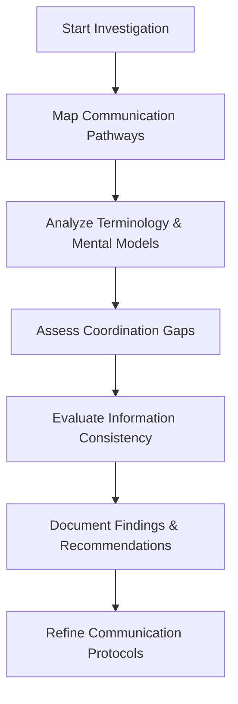

By following this checklist and structured process, you can ensure that your cross-team communication protocols address actual organizational friction points rather than relying on generic best practices. Tailoring protocols based on evidence ensures they align with the specific communication challenges of your banking environment.
### Banking Impact

Poor cross-team communication in banking creates substantial business consequences. The table below summarizes key statistics and their implications:

| **Impact Area**                           | **Statistic**                                                                            | **Implications**                                                                               |
| ----------------------------------------- | ---------------------------------------------------------------------------------------- | ---------------------------------------------------------------------------------------------- |
| **Extended Incident Duration**            | Incidents with inadequate coordination take **3.7 times longer** to resolve.             | Prolonged customer impact, increased financial losses, and higher operational costs.           |
| **Increased Incident Scope**              | Communication failures cause issues to spread to additional systems in **62%** of cases. | Localized problems escalate, leading to broader outages and compounding resolution complexity. |
| **Diagnostic Misdirection**               | Teams spend **45% of incident time** investigating symptoms rather than causes.          | Inefficiencies in resolution efforts and longer mean time to recovery (MTTR).                  |
| **Contradictory Customer Communications** | Inconsistent messaging occurs in **78%** of multi-team incidents.                        | Damage to reputation, reduced customer trust, and increased complaint handling workload.       |
| **Compliance Documentation Gaps**         | Siloed documentation leads to factual inconsistencies in regulatory reports.             | Additional regulatory scrutiny, potential penalties, and reputational harm.                    |

In the interconnected world of modern banking, where incidents routinely span multiple technical domains, effective cross-team communication directly impacts resolution time, customer experience, and regulatory compliance.
### Implementation Guidance

To implement effective cross-team communication protocols in your banking organization:

1. **Create a Common Operating Picture**: Develop a unified status dashboard that:

   - Displays real-time system status across all banking domains
   - Uses consistent status categories and definitions for all teams
   - Highlights dependencies between different components
   - Visualizes the customer impact of technical issues
   - Is accessible to all teams involved in incident response

2. **Implement a Liaison Officer Model**: Establish dedicated communication roles:

   - Designate team members specifically responsible for cross-team coordination
   - Train these individuals in both technical concepts and communication skills
   - Rotate this responsibility to build broad organizational capability
   - Create dedicated channels connecting liaison officers during incidents
   - Measure and recognize effective performance in this critical role

3. **Develop a Technical Translation Glossary**: Create language bridges across domains:

   - Document domain-specific terminology with clear definitions
   - Map equivalent terms used by different technical teams
   - Develop visual references that show how systems interconnect
   - Create templated messages that use consistent terminology
   - Implement terminology standards for incident communication

4. **Establish Cross-Functional Communication Channels**: Build dedicated pathways:

   - Create separate channels for different communication types (updates vs. coordination)
   - Implement standard formats for team status updates
   - Develop clear protocols for requesting assistance across team boundaries
   - Establish regular synchronization points during extended incidents
   - Create escalation paths for cross-team coordination issues

5. **Implement Coordination Training Exercises**: Build cross-team communication muscle:

   - Conduct regular incidents drills that span multiple teams
   - Practice communication protocols during simulated incidents
   - Rotate team members across different communication roles
   - Provide feedback on communication effectiveness after exercises
   - Continuously refine protocols based on exercise learnings

6. **Visualize Communication Protocols**: Use diagrams to clarify roles and communication flows:

   ```mermaid
   flowchart TD
       subgraph Incident_Response
           A[Incident Detected] --> B[Core Banking Liaison]
           A --> C[Payment Gateway Liaison]
           A --> D[Fraud Detection Liaison]
           A --> E[Customer Authentication Liaison]
       end

       subgraph Communication_Flows
           B --> F[Unified Status Dashboard]
           C --> F
           D --> F
           E --> F
           F --> G[Incident Command Center]
       end

       subgraph Escalation_Paths
           G --> H[Major Updates Channel]
           G --> I[Coordination Requests Channel]
           G --> J[Resource Needs Channel]
       end
   ```

   - The **Incident Response** subgraph defines the initial roles for cross-team liaisons.
   - The **Communication Flows** subgraph illustrates how status updates converge into a unified view.
   - The **Escalation Paths** subgraph outlines the channels used by the command center to communicate major updates, coordinate actions, and address resource requirements.

   This diagram can serve as a reference during training exercises and real incidents, ensuring all stakeholders understand their roles and the flow of communication.
## Panel 7: Measuring Communication Effectiveness
### Scene Description

The visual scene captures an SRE team deeply engaged in analyzing communication effectiveness following a major banking incident. The room is organized into distinct areas, each focusing on a key aspect of the analysis:

- **Metrics Wall**: Displays tracked metrics such as:
  - Time to first notification
  - Update frequency
  - Message consistency
  - Stakeholder acknowledgment rates
  - Action item completion status

- **Feedback Screen**: Highlights feedback collected from stakeholders, evaluating the clarity, usefulness, and actionability of incident communications.

- **Communication Journey Map**: A team member reviews a detailed flow diagram tracing the speed and accuracy of information dissemination to various groups during the incident.

- **Timeline Visualization**: Another team member examines a timeline chart pinpointing where miscommunications or delays occurred, identifying critical bottlenecks in the process.

- **Documentation Area**: The team collaborates on updating their incident response playbook with actionable improvements based on insights gained from the analysis.

Below is a simplified representation of how the elements in the room are laid out:

```
+----------------------------+
|        Metrics Wall        |
| (timing, quality, outcome) |
+----------------------------+

     +------------------+      +------------------------+
     |  Feedback Screen |      | Communication Journey  |
     | (stakeholder     |      | Map (flow visualization|
     | feedback metrics)|      | of information paths)  |
     +------------------+      +------------------------+

        +-------------------------------+
        |      Timeline Visualization   |
        | (delays and miscommunication  |
        | analysis with bottlenecks)    |
        +-------------------------------+

+---------------------------------------+
|        Documentation Area             |
| (updating response playbook with data)|
+---------------------------------------+
```

This structured environment allows the team to systematically measure, analyze, and improve communication processes with the same rigor applied to technical systems. Each element contributes to building a comprehensive understanding of communication performance, ensuring actionable insights are captured for future incidents.
### Teaching Narrative
Communication during banking incidents must be treated as a measurable process that can be continuously improved. SRE practices apply the same rigorous measurement approach to communication effectiveness that they apply to technical systems.

Traditional incident response often evaluates communication subjectively or not at all, missing opportunities to identify and address systematic communication failures. The SRE approach establishes specific metrics and feedback mechanisms to quantify communication performance and drive improvement.

Effective communication measurement includes:

1. Timing metrics: speed of initial notifications, consistency of update intervals
2. Quality metrics: accuracy of information, clarity of messaging, actionability of updates
3. Reception metrics: acknowledgment rates, stakeholder feedback scores
4. Outcome metrics: correct actions taken based on communications, reduced escalations
5. Improvement tracking: communication-related action items and their implementation

By measuring communication with the same rigor as technical metrics, SRE teams can identify patterns of communication breakdown, implement targeted improvements, and develop more resilient communication practices over time. This measurement-driven approach is especially valuable in banking, where miscommunication can have significant regulatory, financial, and reputational consequences.
### Common Example of the Problem

A medium-sized bank believed their incident communication was effective based on anecdotal feedback, but had never systematically measured it. During a credit card processing outage, initial notifications were sent to all standard distribution lists. However, subsequent investigation revealed several critical breakdowns:

| Breakdown                                           | Root Cause                            | Impact                                                                               |
| --------------------------------------------------- | ------------------------------------- | ------------------------------------------------------------------------------------ |
| 20% of stakeholders missed notifications            | Outdated distribution lists           | Delayed awareness, leading to slower response times in critical areas                |
| Customer service received technical updates         | Lack of tailored messaging            | Inability to provide customer-friendly explanations, increasing customer frustration |
| Executives received inconsistent impact assessments | Poor alignment on reporting standards | Complicated decision-making and delays in implementing effective mitigations         |
| Updates averaged 90-minute intervals                | No defined update frequency           | Created information vacuums, leading to speculation and misinformed actions          |

#### Timeline of Incident Communication Issues

```mermaid
gantt
    title Incident Communication Breakdown Timeline
    dateFormat  HH:mm
    section Notifications
    Initial notifications sent         :done, a1, 00:10, 10m
    Notification gaps discovered       :crit, a2, 01:30, 10m
    section Updates
    Technical update to Customer Service :done, b1, 00:30, 10m
    Inconsistent executive updates       :crit, b2, 01:00, 20m
    Information vacuum, speculation      :crit, b3, 01:30, 90m
    section Feedback
    Customer dissatisfaction escalates   :active, c1, 02:30, 30m
```

Follow-up customer surveys indicated that the poor communication during the incident damaged satisfaction scores more than the actual outage. However, without systematic measurement, the organization had no way to identify which specific communication practices needed improvement. This led to generic "communicate better" action items that produced no meaningful change. The same communication failures recurred in subsequent incidents because the root causes remained unidentified and unaddressed.
### SRE Best Practice: Evidence-Based Investigation

Measuring communication effectiveness requires systematic data collection and analysis. Below is a checklist summarizing the key steps for implementing an evidence-based investigation:

#### **Checklist: Evidence-Based Investigation for Communication Effectiveness**

1. **Develop a Communication Metrics Framework**:
   - [ ] Identify key performance indicators (KPIs) for incident communication.
   - [ ] Define objective measures for speed, clarity, and reach.
   - [ ] Establish baselines for current communication performance.
   - [ ] Set target performance levels for various incident types.
   - [ ] Implement automated data collection where feasible.

2. **Assess Stakeholder Experience**:
   - [ ] Design brief, targeted surveys tailored to different stakeholder groups.
   - [ ] Embed feedback mechanisms directly into communication channels.
   - [ ] Conduct post-incident interviews with key stakeholders.
   - [ ] Review help desk tickets and inquiries for communication-related issues.
   - [ ] Measure stakeholder actions directly influenced by communications.

3. **Perform Comparative Analysis**:
   - [ ] Benchmark communication performance across similar incidents.
   - [ ] Analyze variations based on timing, type, or scale of incidents.
   - [ ] Compare metrics against industry standards, if available.
   - [ ] Identify high-performing communication instances to extract best practices.
   - [ ] Track improvement trends over time to evaluate progress.

4. **Create Communication Journey Maps**:
   - [ ] Map how specific information items flow through the organization.
   - [ ] Measure transmission times between detection and different audiences.
   - [ ] Identify bottlenecks or points where information degrades or gets blocked.
   - [ ] Highlight decision points influenced by communication.
   - [ ] Calculate end-to-end latency for critical information paths.

#### **Example Workflow: Evidence-Based Investigation**
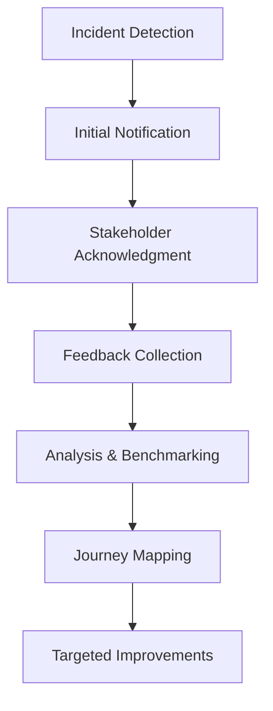

By following this checklist and workflow, SRE teams can transition from subjective communication assessments to a rigorous, data-driven approach. This ensures communication challenges are identified, quantified, and resolved with precision, fostering continuous improvement over time.
### Banking Impact

Unmeasured and unimproved communication creates significant business consequences in banking. The following key impacts are summarized below:

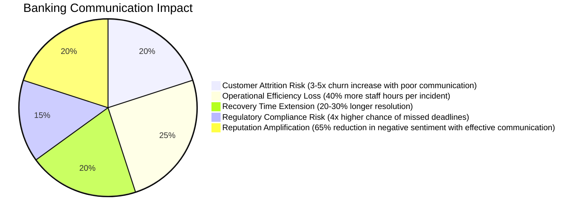

#### Detailed Breakdown:

1. **Customer Attrition Risk**: Research shows that poor incident communication increases customer churn by 3-5x compared to similar incidents with effective communication, directly impacting revenue and lifetime customer value.

2. **Operational Efficiency Loss**: Organizations without measured communication performance spend approximately 40% more staff hours per incident on clarification, redundant updates, and misinformation correction.

3. **Recovery Time Extension**: Ineffective communication extends incident resolution by 20-30% on average due to delayed resource allocation, duplicated efforts, and misunderstood priorities.

4. **Regulatory Compliance Risk**: Banks with unmeasured communication effectiveness are 4x more likely to miss regulatory reporting deadlines during incidents, increasing exposure to fines and enhanced supervision.

5. **Reputation Amplification**: Studies demonstrate that effective communication can reduce negative social media sentiment by up to 65% during incidents, significantly limiting broader reputation damage.

For banking institutions, where a single major incident can affect millions of customers and billions in transactions, even modest improvements in communication effectiveness deliver substantial business value.
### Implementation Guidance

To implement effective communication measurement in your banking organization, follow this structured process:

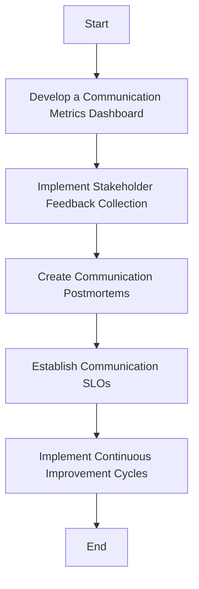

#### Step 1: Develop a Communication Metrics Dashboard
Create visible measurement tools to track communication performance:

- Implement tracking for key timing metrics (e.g., time to first notification, update frequency).
- Measure message consistency across channels and stakeholders.
- Track acknowledgment and read receipts for critical communications.
- Calculate technical accuracy scores based on post-incident verification.
- Visualize trends over time and across incident types.

#### Step 2: Implement Stakeholder Feedback Collection
Build systematic mechanisms to gather input from stakeholders:

- Create brief, targeted post-incident surveys for different audiences.
- Implement real-time feedback options within communication channels.
- Conduct structured interviews with key stakeholders after significant incidents.
- Analyze help desk tickets and inquiries for communication-related patterns.
- Establish regular communication effectiveness reviews with business leaders.

#### Step 3: Create Communication Postmortems
Analyze communication performance after every major incident:

- Review the complete communication timeline against the technical incident.
- Assess accuracy and clarity of messaging at each stage.
- Identify gaps, delays, and points of confusion.
- Evaluate the effectiveness of different channels and formats.
- Document specific improvement opportunities for future incidents.

#### Step 4: Establish Communication SLOs
Define clear performance targets to measure and improve communication:

- Set maximum time thresholds for initial notifications by incident severity.
- Establish minimum update frequencies for ongoing incidents.
- Define acknowledgment rate targets for critical communications.
- Set quality standards for message clarity and actionability.
- Create escalation triggers when communication performance falls below thresholds.

#### Step 5: Implement Continuous Improvement Cycles
Ensure ongoing enhancement of communication practices:

- Prioritize communication improvements based on measured impact.
- Assign clear ownership for specific enhancement initiatives.
- Set measurable targets for improvement in key metrics.
- Conduct targeted experiments with new communication approaches.
- Regularly review progress and adjust strategies based on measurement data.

By following this step-by-step process, your organization can establish a robust system for measuring and improving communication effectiveness during incidents.