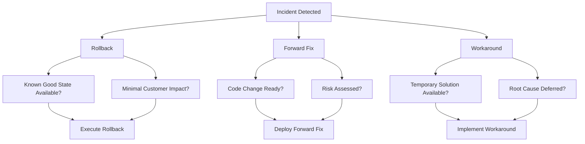
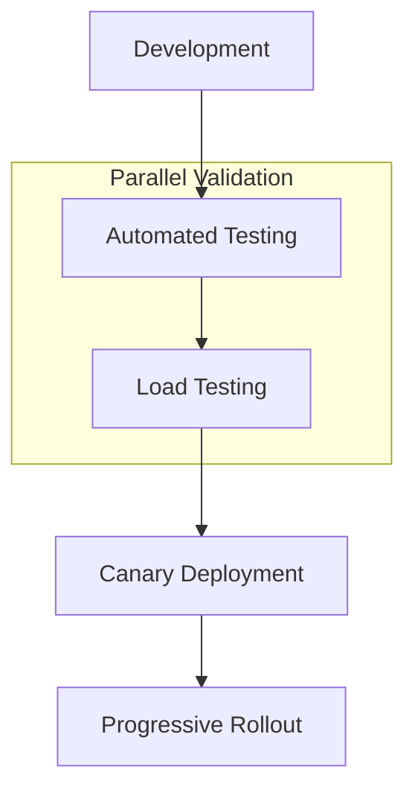
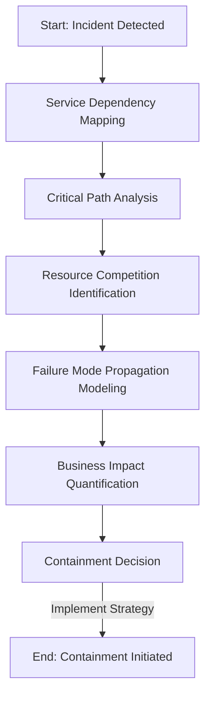
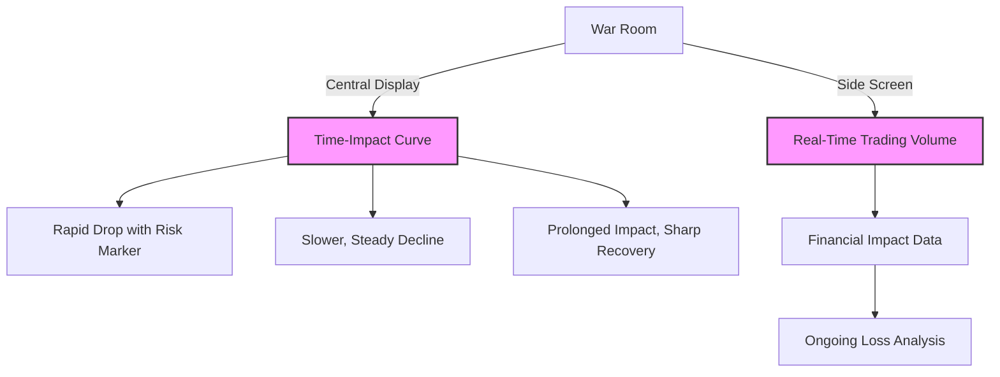
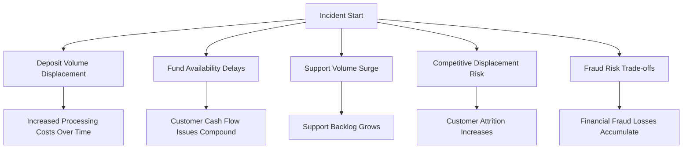
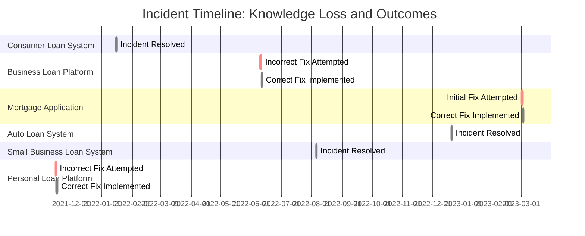
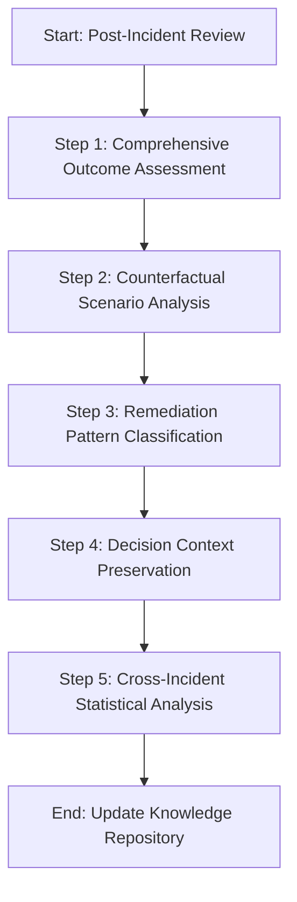
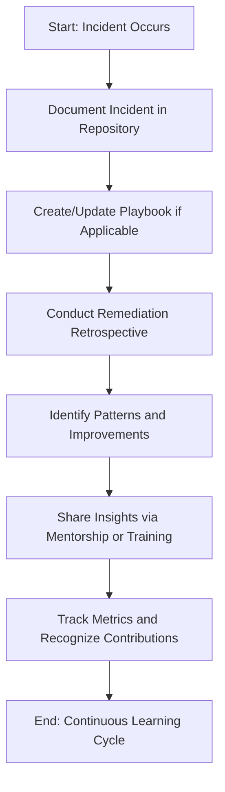

# Chapter 7: Remediation Strategies and Decision-Making

## Chapter Overview

Welcome to the SRE equivalent of “choose your own adventure,” except every choice triggers millions in losses, regulatory headaches, or a social media meltdown. This chapter rips the band-aid off the fantasy that incident remediation is just about “fixing stuff fast.” In the world of banking, every remediation decision is a high-stakes bet—pick wrong, and you’re not just toast, you’re the burnt offering at the next board meeting. We’ll drag you through the war rooms, rollbacks that can vaporize transaction data, “forward fixes” that might save or sink your platform, and the art of containment when your only option is to stop the bleeding. Forget heroics. This is about making cold-blooded, evidence-based decisions while the clock and your CFO are both screaming. If you want to survive (and maybe even look smart), read on.

---

## Learning Objectives

- **Apply** structured remediation frameworks to select between rollbacks, forward fixes, and workarounds under pressure.
- **Construct** multi-dimensional decision matrices that balance speed, risk, regulatory, and business impact—no more gut feels.
- **Engineer** precision rollbacks that preserve data integrity and transaction consistency, even when everything’s on fire.
- **Deploy** accelerated validation pipelines for forward fixes without blowing up your financial controls.
- **Design** and **activate** blast radius containment strategies to limit collateral damage during incidents.
- **Implement** decision authority matrices so execs stop playing incident-hot-potato with your recovery efforts.
- **Analyze** Time-Impact Curves to visualize and compare the real-world consequences of different remediation strategies.
- **Document** and **leverage** organizational knowledge to avoid reinventing the wheel (or repeating past disasters) in future incidents.

---

## Key Takeaways

- “Just roll it back” is how you turn a bad day into a regulatory inquiry—precision matters, or you’re knee-deep in reconciliation hell.
- Fastest fix ≠ safest fix. Sometimes the “hero” move is the one that tanks customer trust and your stock price.
- Consensus doesn’t mean groupthink; if your remediation plan is based on seniority or tradition, enjoy your next audit.
- Evidence beats ego. The right answer isn’t always what makes the room feel good—it’s what keeps the business out of the news.
- Rollbacks without transactional mapping? That’s not recovery, that’s organized sabotage.
- “Fix forward” pipelines without real validation? Prepare to double your incident count—and buy lunch for the compliance team.
- Containment isn’t surrender; it’s strategic triage. Know what to sacrifice. Hint: It’s rarely the high-value clients.
- Clear authority beats executive drive-bys. If “who can approve this?” is asked during the incident, you already lost precious minutes.
- Every minute of indecision leaks dollars, trust, and customers. Your time-impact curve is not just a pretty graph—it’s your P&L bleeding out.
- “Lessons learned” that aren’t institutionalized are just therapy sessions. Build a knowledge base or enjoy Groundhog Day, SRE edition.

---

## Panel 1: The Remediation Crossroads
### Scene Description

A tense war room where a diverse team of banking SREs and application owners focus on a large digital decision tree projected on the wall. The tree branches into three primary paths: "Rollback," "Forward Fix," and "Workaround," with each path further subdivided by criteria such as risk, recovery time, and customer impact. Below the tree, a payment processing dashboard displays a growing queue of failed transactions, with the error count climbing steadily. A large clock on the wall reads 10:34 AM, emphasizing that the incident has been ongoing for 47 minutes.

The atmosphere is thick with urgency as the incident commander, a woman with a determined expression, points to the decision tree. Her gesture highlights the "Rollback" path, where a set of conditions is illuminated, including "Known Good State Available" and "Minimal Customer Impact." Team members, displaying varying degrees of anxiety and focus, analyze the options, occasionally glancing between the decision tree and the dashboard.



The decision tree's structure makes the trade-offs visually clear, reinforcing the weight of the choice at hand. The team members' expressions reveal the gravity of the situation, as every passing second increases the potential business and customer impact.
### Teaching Narrative
When facing a critical banking incident, the remediation approach you choose can significantly impact both recovery time and business consequences. Many production support professionals transitioning to SRE roles struggle with this pivotal moment, often defaulting to the most familiar solution rather than the most appropriate one. The Remediation Decision Framework provides a structured approach to selecting between three primary options: rollbacks (reverting to a known good state), forward fixes (deploying new code to address the issue), or workarounds (implementing temporary solutions that restore service without addressing the root cause). This decision isn't merely technical—it requires balancing recovery speed, risk of further disruption, customer impact, and regulatory implications. The most experienced SREs know that sometimes the fastest technical fix isn't the safest choice for a financial institution, and the safest option may come with unacceptable business delays. This panel introduces the systematic evaluation approach that transforms reactive "best guess" remediation into evidence-based decision making.
### Common Example of the Problem

Global Bank's payments platform began experiencing intermittent transaction failures following a routine morning deployment that introduced a new fraud detection algorithm. Initially impacting only 2% of transactions, the failure rate has steadily climbed to 15% over the past 45 minutes, primarily affecting high-value international transfers. The deployment included both database schema changes and API modifications, making a simple rollback potentially destructive to in-flight transactions. Customers are increasingly reporting failed payments on social media, amplifying the pressure for a quick resolution. The incident commander faces three options: roll back the entire deployment and potentially lose transaction data, push a fix for the algorithm that engineers believe is causing the issue but haven't fully validated, or implement a temporary workaround that would bypass enhanced fraud checks for all international payments—potentially increasing fraud exposure.

#### Incident Progression Timeline

```mermaid
gantt
    title Incident Timeline
    dateFormat HH:mm
    axisFormat %H:%M
    section Deployment Events
    Deployment Completed      :done, d1, 09:47, 5min
    Failures Begin to Appear  :active, d2, 09:52, 10min
    Escalation Triggered      :crit, d3, 10:02, 5min
    Severity Upgraded         :crit, d4, 10:07, 5min
    Incident War Room Starts  :active, d5, 10:12, 10min
    Decision Point Reached    :milestone, d6, 10:34

    section Failure Metrics
    Initial Failure Rate (2%) :done, f1, 09:52, 10min
    Failure Rate Climbs (5%)  :active, f2, 10:02, 10min
    Failure Rate Climbs (15%) :crit, f3, 10:22, 12min
```

This timeline highlights the rapid escalation of the incident, from the deployment at 9:47 AM to the critical decision point at 10:34 AM. The growing failure rate and the severity upgrades underline the urgency of choosing the appropriate remediation path. Each decision carries significant technical and business trade-offs, making structured evaluation essential in avoiding further escalation or long-term damage.
### SRE Best Practice: Evidence-Based Investigation

Evidence-based remediation selection requires systematically evaluating options against multiple dimensions, not just technical feasibility. The Structured Remediation Analysis approach transforms reactive decision-making into a data-driven process. Use the checklist and table below to guide your investigation:

#### **Checklist: Steps for Evidence-Based Investigation**
1. **Document all viable options**
   - Identify at least three potential remediation approaches.
   - Ensure diversity in strategies (e.g., rollback, forward fix, workaround) rather than variations of the same approach.

2. **Perform a multi-dimensional assessment**
   - Evaluate each option across critical dimensions (see table below).

3. **Collect supporting data**
   - Use metrics such as historical incident data, test results, and live system telemetry.

4. **Create a weighted decision matrix**
   - Assign weights based on incident context and service criticality.

5. **Facilitate consensus-based selection**
   - Incorporate input from technical, compliance, and business stakeholders.

---

#### **Table: Multi-Dimensional Assessment Framework**

| **Dimension**               | **Key Question**                                  | **Example Metrics**                                                  |
| --------------------------- | ------------------------------------------------- | -------------------------------------------------------------------- |
| **Recovery Time**           | How quickly can service be restored?              | Estimated time to rollback, deploy a fix, or implement a workaround. |
| **Implementation Risk**     | What is the likelihood of causing further issues? | Historical failure rates, complexity of changes.                     |
| **Verification Confidence** | Can we confirm the fix will work?                 | Test results, monitoring coverage, pre-deployment validations.       |
| **Regulatory Impact**       | Are there compliance or reporting concerns?       | Potential breaches of SLA, audit trails, or legal obligations.       |
| **Customer Experience**     | How will this affect users during and after?      | Downtime visibility, user complaints, or degraded performance.       |

---

#### **Example: Weighted Decision Matrix**

Below is a simplified example of how a decision matrix might look for a payment processing incident. Adjust weights and scores based on organizational priorities:

| **Option**      | **Recovery Time (30%)** | **Risk (25%)** | **Confidence (20%)** | **Regulatory Impact (15%)** | **Customer Impact (10%)** | **Total Score** |
| --------------- | ----------------------- | -------------- | -------------------- | --------------------------- | ------------------------- | --------------- |
| **Rollback**    | 8 (0.30)                | 6 (0.25)       | 9 (0.20)             | 8 (0.15)                    | 7 (0.10)                  | **7.75**        |
| **Forward Fix** | 6 (0.30)                | 7 (0.25)       | 8 (0.20)             | 9 (0.15)                    | 8 (0.10)                  | **7.55**        |
| **Workaround**  | 9 (0.30)                | 5 (0.25)       | 7 (0.20)             | 7 (0.15)                    | 9 (0.10)                  | **7.70**        |

- **Scoring**: Each dimension is scored on a 1-10 scale, with weights applied to reflect importance.
- **Interpretation**: The option with the highest total score should generally be prioritized, but expert judgment should refine the final choice.

---

This evidence-based approach ensures that remediation decisions move beyond familiarity ("we always roll back") or authority ("the senior architect says to fix forward"). By systematically analyzing key dimensions and incorporating input from all stakeholders, it balances technical, business, and regulatory considerations for optimal outcomes.
### Banking Impact

Poor remediation decisions in banking environments can cascade into multi-dimensional business impacts that extend far beyond the immediate technical incident. The table below summarizes the five primary business impacts, along with real-world examples and relevant metrics:

| **Business Impact**      | **Description**                                                                                   | **Example/Metric**                                                                                     |
| ------------------------ | ------------------------------------------------------------------------------------------------- | ------------------------------------------------------------------------------------------------------ |
| **Financial losses**     | Direct revenue impact from failed transactions.                                                   | Global Bank processes $2.7B daily through this platform, with each hour of degradation costing ~$5.2M. |
| **Regulatory penalties** | Compliance violations for transaction processing SLAs and data integrity.                         | Potential fines of up to 2% of global turnover for severe payment service disruptions.                 |
| **Reputation damage**    | Customer trust erosion, particularly for high-net-worth clients.                                  | Customer attrition rates double following significant payment incidents.                               |
| **Market perception**    | Impact on stock price for publicly traded financial institutions.                                 | A major payment incident in 2023 caused a 4.3% single-day stock price drop for a competitor.           |
| **Operational overhead** | Increased workload from customer service spikes, compliance reporting, and post-incident reviews. | Incidents lasting >2 hours trigger mandatory regulatory reporting in multiple jurisdictions.           |

The crossroads decision significantly influences whether the incident remains a minor operational event or becomes a board-level crisis with lasting business implications.
### Implementation Guidance

To implement effective remediation decision frameworks in your banking organization:

1. **Create service-specific decision templates**: Develop pre-populated remediation decision matrices for each critical banking service, with weighted criteria specific to that service's regulatory and business context (e.g., payment platforms prioritize transaction integrity; trading platforms prioritize availability). Below is an example decision matrix for a payment processing service:

   | Criteria                     | Rollback | Forward Fix | Workaround | Weight (%) |
   | ---------------------------- | -------- | ----------- | ---------- | ---------- |
   | Recovery Speed               | High     | Medium      | High       | 40%        |
   | Risk of Further Disruption   | Low      | Medium      | Medium     | 25%        |
   | Regulatory Impact            | Low      | Medium      | Low        | 20%        |
   | Customer Impact              | High     | Medium      | Medium     | 15%        |
   | **Weighted Score (Example)** | **85**   | **70**      | **80**     | **N/A**    |

   Use weighted scores to guide the team towards the most balanced decision based on the context.

2. **Establish decision authority guidelines**: Define in advance which roles have authority to approve different remediation types based on risk level and potential impact (e.g., CTO approval for high-risk production database changes during business hours). This prevents delays during incidents by ensuring the decision chain is clear.

3. **Build a remediation pattern library**: Document successful and unsuccessful remediation approaches from past incidents, categorized by failure type, to accelerate future decision-making with empirical data. For instance, capture scenarios such as "payment queue overload" or "unexpected API behavior" and the remediation paths that worked best.

4. **Implement "pre-mortems" for major changes**: Before significant deployments, conduct exercises where teams anticipate potential failures and pre-plan remediation approaches, creating ready-to-execute plans for likely scenarios. For example, before launching a new payment gateway, simulate database overload scenarios and define remediation steps for rollback, forward fix, and workaround options.

5. **Practice remediation selection**: Include decision-making exercises in incident response simulations, specifically practicing the evaluation and selection process under time pressure to build organizational muscle memory. Consider the following case study:

   **Case Study: Payment Gateway Outage**  
   During a high-traffic period, a new payment gateway deployment caused a critical outage. The team used a pre-populated decision matrix and determined rollback was the fastest path to recovery with minimal customer impact. The rollback completed in 12 minutes, restoring service and mitigating further transaction failures. Post-incident analysis revealed that the pre-planned rollback steps and clear authority guidelines were key to the quick resolution.

By integrating these practices, your organization can foster a structured, evidence-based approach to incident remediation, reducing both recovery time and risk.
## Panel 2: Rollback Precision Engineering
### Scene Description

In a monitoring center, an SRE is executing a carefully orchestrated rollback process. The environment is a hive of coordinated activity, visualized as follows:

#### Monitoring Center Layout
- **Central Screen**: Displays a prominent "EXECUTE ROLLBACK" button, surrounded by panels showing:
  - Database transaction states
  - Status of in-flight payments
  - Deployment pipeline progress
- **Side Screens**: Provide supplemental data, such as logs, error metrics, and system health graphs.

#### Whiteboard Details
On a whiteboard in the background, a detailed checklist titled "Trading Platform Rollback Protocol" is visible. Key items include:
- Transaction Boundary Identification
- Data Consistency Verification
- Coordinated Component Sequencing

#### Team Coordination
- The SRE’s hands hover over the keyboard, ready to execute the rollback.
- Other team members are on phones, actively coordinating the rollback sequence across multiple systems and ensuring alignment between database states, applications, and external services.

Below is a simplified text-based layout representing the scene:

```
+---------------------------+       +---------------------------+
|   EXECUTE ROLLBACK        |       |   Logs and Error Metrics  |
|   Database States         |       |   System Health Graphs    |
|   In-flight Payments      |       |                           |
|   Deployment Pipelines    |       +---------------------------+
+---------------------------+       

    [ Whiteboard: Trading Platform Rollback Protocol ]        
    - Transaction Boundary Identification                    
    - Data Consistency Verification                          
    - Coordinated Component Sequencing                       

        [ SRE at Keyboard ]       [ Team Members on Phones ] 
```

This layout emphasizes the complexity and precision of the rollback process, situating the SRE and their team in a high-stakes, tightly controlled environment.
### Teaching Narrative
Rollbacks in financial systems aren't simple "undo" operations—they're precisely engineered processes that must maintain data integrity and transaction consistency. Traditional support approaches often view rollbacks as emergency actions with acceptable collateral damage, but in SRE practice, rollbacks are designed as clean operations that preserve system state integrity. This panel explores the concept of "transactional boundaries" in banking systems, where the complexity isn't just in reverting code but in understanding and preserving the state of in-flight financial transactions. We'll examine how effective rollbacks require comprehensive knowledge of system dependencies, transaction lifecycles, and state management. The SRE approach transforms rollbacks from risky last resorts into precise, well-rehearsed recovery mechanisms that can be executed with confidence even in high-stakes financial environments.
### Common Example of the Problem

Investment Bank X deployed a new version of their trading platform's order matching engine at **8:30 AM**, just before market open. The deployment included both algorithm changes and data schema modifications aimed at improving matching efficiency. By **9:15 AM**, anomalies began to surface: some clients received duplicate trade confirmations, while others saw orders stuck in a "pending" state despite being executed in the market.

The incident team identified the root cause as a synchronization problem between the order book and the confirmation system. However, they now face a highly complex rollback scenario: hundreds of trades worth over **$500M** are in various states of execution across multiple interconnected systems. Simply reverting to the previous software version would leave these trades in an inconsistent state, risking financial losses, regulatory violations, and a reconciliation nightmare.

Below is a timeline illustrating the sequence of events and the challenges encountered:

```mermaid
gantt
    title Rollback Timeline: Investment Bank X
    dateFormat HH:mm
    section Deployment
    Deploy New Version :done, dep_start, 08:30, 15min
    Monitor Initial Activity :active, monitor, 08:45, 30min
    section Incident Detection
    Anomalies Detected :crit, detect_start, 09:15, 10min
    Root Cause Analysis Begins :active, rca_start, 09:25, 30min
    section Rollback Challenges
    Identify In-Flight Transactions :crit, inflight, 09:55, 20min
    Validate Data Consistency :crit, consistency, 10:15, 30min
    Plan Coordinated Rollback :crit, rollback_plan, 10:45, 30min
    Execute Rollback Safely :rollback_exec, 11:15, 45min
    Complete Post-Rollback Verification :post_verify, 12:00, 30min
```



This timeline highlights key points of complexity in the rollback process, particularly around the **identification of in-flight transactions** and **data consistency validation**. These steps require the team to carefully map out the state of every trade and ensure that no financial or transactional integrity is compromised. Unlike a simple code rollback, a financial system rollback demands precision, coordination, and an in-depth understanding of transaction dependencies to avoid cascading failures.
### SRE Best Practice: Evidence-Based Investigation

Precision rollbacks in financial systems require a systematic approach that treats the rollback as an engineered process, not an emergency reaction. The following checklist outlines the five key steps, their associated actions, and expected outcomes for effective evidence-based investigation:

| **Step**                                   | **Key Actions**                                                                                                                                                   | **Expected Outcomes**                                                               |
| ------------------------------------------ | ----------------------------------------------------------------------------------------------------------------------------------------------------------------- | ----------------------------------------------------------------------------------- |
| **1. Transaction State Mapping**           | - Use observability tools to query the processing status of in-flight transactions. <br> - Document database states and external system integrations.             | Comprehensive understanding of all in-flight transactions and their current states. |
| **2. Transaction Boundary Identification** | - Identify "clean points" where transactions can be paused without creating inconsistencies. <br> - Analyze transaction lifecycles and dependencies.              | Clear definition of safe rollback points to ensure data consistency.                |
| **3. Dual-State Compatibility Analysis**   | - Assess if the current and previous versions can process transactions concurrently. <br> - Determine if a "quiet period" is needed for queuing new transactions. | Defined compatibility strategy for managing transaction states during rollback.     |
| **4. Recovery State Verification**         | - Design and execute tests to verify data consistency before, during, and after rollback. <br> - Perform reconciliation checks between interrelated systems.      | Confidence in data integrity and system alignment throughout the rollback process.  |
| **5. Coordinated Execution Plan**          | - Develop a rollback sequence that accounts for inter-component dependencies. <br> - Execute steps with verification at each stage.                               | Precise, sequenced rollback minimizing risks and ensuring system stability.         |

By applying this evidence-based approach, SREs transform rollbacks from high-risk emergency procedures into precise, controlled operations that maintain financial data integrity throughout the process.
### Banking Impact

Failed or imprecise rollbacks in trading systems create cascading business consequences that extend beyond the immediate technical incident. The following table summarizes the key impacts, their descriptions, and potential costs:

| **Impact**                          | **Description**                                                                                                  | **Potential Cost**                        |
| ----------------------------------- | ---------------------------------------------------------------------------------------------------------------- | ----------------------------------------- |
| **Financial reconciliation costs**  | Inconsistent transaction states require manual reconciliation involving multiple departments and counterparties. | ~$2.1M (based on past events)             |
| **Regulatory reporting violations** | Inaccurate or delayed trade reporting to regulatory bodies can trigger investigations and penalties.             | $250K–$5M (severity-dependent)            |
| **Client compensation**             | Trades executed at disadvantageous prices due to system issues often require compensation to clients.            | ~$750K (average per incident)             |
| **Market reputation damage**        | Technical problems spread quickly, leading to institutional clients redirecting flow to competitors.             | ~7% decline in trading volume (quarterly) |
| **Extended downtime**               | Failed rollbacks lead to longer resolution times, compounding the original issue with rollback-induced problems. | Incident duration extended 3.4x           |

Well-executed rollbacks substantially mitigate these impacts by maintaining transaction integrity and providing cleaner resolution paths.
### Implementation Guidance

To implement precision rollback capabilities for banking systems:

1. **Create service-specific rollback playbooks**: Develop detailed, tested procedures for each critical service that document component dependencies, required sequencing, and verification points. Update these playbooks after each deployment that changes transaction flows or data models. Below is an example structure for a rollback playbook:

    ```yaml
    # Example Rollback Playbook: Payment Processing Service
    service: payment-processing
    rollback_steps:
      - step: Identify in-flight transactions
        action: Query transaction logs for uncommitted payments
        verification: Ensure all in-flight transactions are logged
      - step: Pause payment processing
        action: Scale worker nodes to zero
        verification: Confirm no new transactions are initiated
      - step: Restore database to point-in-time backup
        action: Execute point-in-time recovery (timestamp: {{rollback_timestamp}})
        verification: Validate restored state against reconciliation checks
      - step: Redeploy previous stable version
        action: Deploy version {{previous_version}}
        verification: Confirm application and API health checks pass
      - step: Resume payment processing
        action: Scale worker nodes back to operational levels
        verification: Monitor transaction throughput and error rates
    ```

2. **Implement database journaling and point-in-time recovery**: Configure database systems with appropriate journaling and backup mechanisms that support transaction-consistent recovery points, with particular attention to cross-database consistency. Use tools like the following command example for PostgreSQL:

    ```bash
    pg_restore -d banking_db --clean --if-exists --single-transaction --data-only --restore-target={{rollback_timestamp}}
    ```

   Ensure recovery scripts include checks for referential integrity and row-level consistency post-restore.

3. **Build rollback simulation capabilities**: Create testing environments where teams can practice complex rollbacks using production-like data and realistic in-flight transactions. Use the following example sequence for a simulation workflow:

    ```plaintext
    [Start Simulation]
        |
        v
    Inject Mock Transactions --> Pause Processing --> Restore Backup --> Rollback Application --> Verify System State
        |
        v
    [End Simulation]
    ```

   Document results after each simulation and update playbooks accordingly.

4. **Design deployment packages for clean rollbacks**: Require all significant changes to include pre-validated rollback scripts and verification tests as part of the deployment package. Example directory structure for a deployment package:

    ```plaintext
    deployment_package/
    ├── app_code/
    ├── rollback/
    │   ├── rollback_script.sh
    │   └── verification_tests/
    │       ├── test_integration.py
    │       └── test_data_consistency.py
    ├── deployment_config.yaml
    └── README.md
    ```

5. **Establish "go/no-go" criteria for rollbacks**: Define clear, measurable thresholds for when rollbacks should be executed versus other remediation strategies. For example:

    ```plaintext
    Go/No-Go Criteria:
    - Maximum acceptable data loss: < $10,000 in unprocessed transactions
    - Reconciliation effort: < 4 hours of manual intervention
    - Business impact: No major service outage exceeding 15 minutes
    ```

   Use these criteria during post-incident reviews to refine decision-making processes.
## Panel 3: The Forward Fix Validation Pipeline
### Scene Description

A split-screen visual shows two SREs working in parallel. On one side, a developer rapidly codes a fix for a critical authentication service issue while automated tests run in a separate window. On the other side, another SRE is setting up a sophisticated staging environment that replicates production traffic patterns with synthetic transactions representing various banking operations. Between them is a shared dashboard showing the current system degradation—customers unable to access their accounts—with a counter of affected users steadily increasing.

The workflow diagram on the wall is represented below, illustrating the accelerated validation pipeline. The pipeline stages are designed to parallel-process validation steps while maintaining essential safeguards:



This diagram highlights how the pipeline accelerates incident-driven forward fixes by overlapping critical validation steps, ensuring speed without compromising quality or safety in a high-stakes banking environment.
### Teaching Narrative
When time is critical and a rollback isn't viable, forward fixes provide the path to resolution—but they come with significant risk in banking environments. The traditional approach of "fix fast, fix twice" is unacceptable when handling financial data. This panel introduces the concept of the "Accelerated Validation Pipeline," which maintains rigorous quality controls while dramatically compressing the timeframe for deploying critical fixes. Unlike standard deployments that might take days or weeks to move through testing cycles, incident-driven forward fixes require specialized pipelines that parallel-process validation steps without compromising essential safeguards. We explore how SREs balance the urgency of restoration with the discipline of proper testing, especially when financial transactions are at stake. This approach transforms high-pressure coding from a dangerous necessity into a controlled, methodical process that maintains appropriate guardrails even under extreme time constraints.
### Common Example of the Problem

#### Timeline of Events

```mermaid
gantt
    title Incident Timeline: Regional Credit Union Authentication Failure
    dateFormat HH:mm
    axisFormat %H:%M
    section Detection
    Failure Detected :done, det, 07:45, 15min
    Incident Escalation Begins :active, esc, 08:00, 10min
    section Investigation
    Root Cause Identified :crit, root, 08:10, 20min
    Fix Development Begins :active, dev, 08:30, 30min
    section Decision Making
    Risk Assessment Completed :crit, assess, 09:00, 20min
    Emergency Deployment Approved :done, deploy, 09:20, 10min
```



#### Incident Summary

At **7:45 AM**, Regional Credit Union's mobile banking authentication service began failing, preventing **60% of customers** from logging in to check accounts or make payments. The issue was traced to a certificate validation error in the authentication microservice, introduced during a deployment the previous evening. The microservice's certificate chain verification logic was incorrectly rejecting valid credentials.

Key constraints:
- A rollback of the deployment isn't viable because it included **irreversible database schema changes**.
- The normal deployment process for fixes takes **3-5 days** due to rigorous testing cycles.

Meanwhile:
- Call center volume surged by **800%**, overwhelming staff.
- Social media complaints escalated exponentially, amplifying reputational risk.

By **8:10 AM**, the root cause was identified, and the development team began creating a fix. The incident commander faced a critical decision: whether to approve an **emergency deployment process** for the fix, balancing the urgent need to restore service against the potential risks of deploying a hastily validated change in a financial environment.
### SRE Best Practice: Evidence-Based Investigation

Forward fixes during active incidents require a specialized validation approach that maintains essential quality controls while significantly accelerating the deployment process. The following checklist summarizes the five best practices for evidence-based investigation to ensure controlled and reliable fixes under time pressure:

#### Checklist: Evidence-Based Investigation for Forward Fixes
1. **Targeted Scope Validation**
   - Identify specific components and functionality affected by the change.
   - For authentication services, prioritize validation for:
     - Credential processing.
     - Session management.
     - Security controls.
   - Avoid unnecessary validation of unrelated downstream functions.

2. **Parallel Validation Streams**
   - Execute multiple validation processes simultaneously:
     - Automated security scans.
     - Manual functionality testing.
     - Load testing for performance.
   - Coordinate these streams to share results in real-time.

3. **Risk-Weighted Test Selection**
   - Use statistical analysis to prioritize high-value test cases:
     - Focus on areas with historically high defect likelihood.
     - Optimize test coverage for constrained timelines.

4. **Production-Mirrored Validation**
   - Leverage techniques like traffic shadowing:
     - Route copies of production requests to test environments.
     - Validate fixes against real-world traffic patterns and edge cases.
   - Ensure no customer impact during this process.

5. **Incremental Deployment with Real-Time Verification**
   - Deploy fixes incrementally with robust monitoring:
     - Start with a small percentage of traffic.
     - Progressively increase traffic based on real-time quality signals.
   - Detect and address issues immediately during rollout.

This evidence-based approach transforms emergency fixes from high-risk activities to controlled and reliable processes with appropriate safety mechanisms, even under severe time constraints.
### Banking Impact

Authentication service failures create particularly severe business impacts for financial institutions. The following table summarizes the five key impacts and their associated metrics:

| **Impact**                         | **Description**                                                             | **Metric**                                                                                 |
| ---------------------------------- | --------------------------------------------------------------------------- | ------------------------------------------------------------------------------------------ |
| **Transaction Volume Collapse**    | Customers unable to authenticate cannot transact, causing revenue loss.     | Loss of $312K per hour in transaction volume (based on $7.5M daily transactions at peak).  |
| **Operational Cost Surge**         | Exponential increase in call center and support requests during outages.    | Increased support costs of $15K per hour with full staff mobilized.                        |
| **Payment Obligation Failures**    | Missed bill payments or financial obligations due to account access issues. | 2,300 missed scheduled payments recorded in previous similar outages.                      |
| **Customer Attrition Risk**        | Prolonged disruptions erode trust, leading to permanent customer loss.      | 0.5% permanent customer loss for outages exceeding 4 hours (historical data).              |
| **Regulatory Reportable Incident** | Extended failures trigger mandatory reporting and potential investigations. | Risk of regulatory escalation if service is not restored within jurisdictional timeframes. |

The forward fix decision directly impacts how quickly these business effects can be mitigated versus the risk of introducing additional problems.
### Implementation Guidance

To implement effective forward fix capabilities for banking systems:

1. **Establish an emergency deployment pipeline**: Create a specialized CI/CD pipeline specifically designed for incident remediation that parallels validation steps while maintaining critical quality gates. Document and practice this pipeline regularly before it's needed in a crisis. Below is an example of a YAML configuration for such a pipeline using a popular CI/CD tool:

   ```yaml
   pipelines:
     branches:
       master:
         - step:
             name: "Run Unit Tests"
             script:
               - npm install
               - npm test
         - step:
             name: "Build and Package"
             script:
               - npm run build
               - zip -r application.zip ./dist
         - step:
             name: "Deploy to Staging"
             script:
               - ./deploy.sh staging
         - step:
             name: "Run Smoke Tests"
             script:
               - ./run-smoke-tests.sh
         - step:
             name: "Deploy to Production (Emergency)"
             script:
               - ./deploy.sh production
             condition: changeset("critical-fix")
   ```

2. **Create validation test suites by component**: Develop targeted test packages for each critical system component that can be executed rapidly during incidents, focusing on critical functionality and known risk areas rather than exhaustive coverage. For example, a priority test suite for an authentication service might include:

   ```python
   import unittest
   from authentication_service import login, logout

   class AuthenticationTests(unittest.TestCase):
       def test_successful_login(self):
           self.assertTrue(login("valid_user", "valid_password"))

       def test_failed_login(self):
           self.assertFalse(login("invalid_user", "wrong_password"))

       def test_logout(self):
           login("valid_user", "valid_password")
           self.assertTrue(logout())
   ```

3. **Implement feature flagging infrastructure**: Build sophisticated feature flag capabilities that allow rapid enablement/disablement of functionality without full redeployments, creating safer mechanisms for emergency changes. A sample configuration for feature flags using a common library like `LaunchDarkly` might look like:

   ```javascript
   import { initialize } from "launchdarkly-node-client-sdk";

   const client = initialize("YOUR_SDK_KEY", { user: { key: "banking-service" } });

   client.on("ready", () => {
       const enableNewAuthFlow = client.variation("enable-new-auth-flow", false);

       if (enableNewAuthFlow) {
           console.log("New authentication flow is enabled.");
           // Execute new logic
       } else {
           console.log("Using existing authentication flow.");
           // Execute legacy logic
       }
   });
   ```

4. **Develop canary deployment capabilities**: Implement the technical infrastructure to deploy changes to small traffic segments first, with automated rollback triggers if quality metrics show degradation. Below is a simplified example of a canary deployment strategy using a load balancer configuration:

   ```
   upstream canary_backend {
       server 10.0.0.1 max_fails=3 fail_timeout=30s weight=1; # Canary instance
   }

   upstream main_backend {
       server 10.0.0.2 max_fails=3 fail_timeout=30s weight=9; # Main instances
   }

   server {
       listen 80;

       location / {
           proxy_pass http://canary_backend;
           proxy_pass http://main_backend;
       }
   }
   ```

5. **Create "limited blast radius" deployment strategies**: Design component isolation that allows deploying fixes to specific services or instances without affecting the entire system, limiting potential negative impact. For example, using Kubernetes, you can label specific pods for targeted deployments:

   ```yaml
   apiVersion: apps/v1
   kind: Deployment
   metadata:
     name: authentication-service-limited
   spec:
     replicas: 2
     selector:
       matchLabels:
         app: authentication-service
         environment: critical-fix
     template:
       metadata:
         labels:
           app: authentication-service
           environment: critical-fix
       spec:
         containers:
         - name: auth-service
           image: banking/auth-service:v2.3.1
   ```
## Panel 4: Blast Radius Containment
### Scene Description

An SRE team is gathered around a large, touch-enabled transparent display that serves as the focal point for incident analysis. The display shows a dynamic banking system topology map with interconnected services represented as nodes and their relationships as edges. One section of the map glows red, indicating the incident's origin in the core transaction processing service. Neighboring nodes are either orange or yellow, signifying varying levels of potential impact based on dependency proximity.

Using gesture controls, team members draw containment boundaries around the affected area. These boundaries are visualized as translucent overlays on the map, with different colors representing containment strategies. For example:

- Blue overlay: Service degradation strategy (e.g., preserving core banking while disabling wealth management features).
- Green overlay: Traffic shaping to redirect users to alternate systems.
- Purple overlay: Capacity reallocation to prioritize critical services.

Near the display, a decision matrix is projected on a smaller adjacent screen, providing additional context for containment decisions. It outlines key factors:

```
+-----------------------+-------------------------+
| Factor                | Containment Impact     |
+-----------------------+-------------------------+
| Customers affected    | Medium (Wealth clients)|
| Transaction types     | High (Core banking)    |
| Regulatory reporting  | Low                    |
+-----------------------+-------------------------+
```

As containment simulations are run, the display updates in real time, showing how each strategy would affect customer-facing services. For instance:

1. A simulation with reduced functionality for wealth management clients preserves seamless operation of core banking services.
2. Another simulation shows all services operational but with degraded performance levels across the board.

The team balances these visualized trade-offs with a deep understanding of technical dependencies and business priorities as they work toward an effective containment strategy.
### Teaching Narrative
When full remediation requires extended time, containing the impact becomes the critical first step in managing a banking incident. The concept of "blast radius containment" is a foundational SRE practice that focuses on limiting damage rather than immediately pursuing complete resolution. Traditional support approaches often attempt to fix everything simultaneously, but effective SREs recognize the value of isolation strategies that allow unaffected systems to continue normal operation. This panel explores containment patterns including service degradation (maintaining core functionality while disabling non-essential features), traffic shaping (redirecting users to alternate systems), and capacity reallocation (redistributing resources to prioritize critical functions). We'll examine how these decisions require deep understanding of both technical dependencies and business priorities—which transaction types are most critical to maintain, which customer segments must be prioritized based on regulatory requirements, and which operational compromises are acceptable during incident resolution.
### Common Example of the Problem

Multinational Bank's payment processing platform is experiencing severe degradation due to a database performance issue. The core database cluster is showing 300% higher latency than normal, causing cascading timeouts across multiple services. Initial diagnostics indicate a complex query optimization problem that will require several hours to fully resolve. Meanwhile, the platform processes 17 different payment types—from high-value SWIFT transfers to routine bill payments—for retail, commercial, and institutional clients across multiple countries. System-wide failure would violate regulatory requirements in several jurisdictions and create a backlog that would take days to clear.

The incident team must determine how to contain the impact while the database issue is resolved, deciding which functions to preserve, which to degrade, and which to temporarily disable based on technical, business, and regulatory priorities. Below is a summary of the 17 payment types, their assigned priorities, and the associated impacts to guide this decision-making process:

| **Payment Type**              | **Priority Level** | **Impact if Disabled**                                     | **Notes**                                                            |
| ----------------------------- | ------------------ | ---------------------------------------------------------- | -------------------------------------------------------------------- |
| SWIFT High-Value Transfers    | Critical           | Regulatory violations; significant client dissatisfaction  | Required to meet compliance in multiple jurisdictions.               |
| Retail Credit Card Payments   | High               | Customer complaints; loss of revenue                       | Impacts retail customers directly; revenue-generating service.       |
| Routine Bill Payments         | Medium             | Minor customer inconvenience                               | Can defer processing for a limited time without significant fallout. |
| Merchant Settlement           | High               | Business client dissatisfaction; delayed fund availability | High business impact for commercial clients.                         |
| ATM Withdrawals               | Critical           | High customer dissatisfaction; potential media attention   | Essential for preserving customer trust and operational continuity.  |
| Payroll Processing            | Critical           | Regulatory exposure; significant employee dissatisfaction  | Time-sensitive; impacts large volumes of employees.                  |
| Wealth Management Transfers   | Medium             | Reduced functionality for high-net-worth clients           | Can degrade temporarily while preserving core banking operations.    |
| Mortgage Payments             | Medium             | Potential for short-term delays                            | Customers can tolerate brief delays with clear communication.        |
| Cross-Currency Transactions   | High               | Regulatory and contractual penalties                       | Essential for institutional and international clients.               |
| Mobile Wallet Top-ups         | Low                | Minimal impact; primarily affects retail convenience       | Can disable temporarily without major consequences.                  |
| Wire Transfers                | High               | Institutional and commercial client dissatisfaction        | High business and regulatory importance.                             |
| Fraud Detection Processing    | Critical           | Increased risk of financial loss                           | Must remain operational to mitigate potential fraud incidents.       |
| Account-to-Account Transfers  | High               | Customer dissatisfaction; business impact                  | Frequently used for both retail and commercial purposes.             |
| Loan Disbursements            | Medium             | Delayed customer satisfaction                              | Can tolerate temporary delays during containment.                    |
| POS Terminal Transactions     | Critical           | Retail and commercial impact; high visibility              | Essential for retail and business continuity.                        |
| International Remittances     | High               | Significant customer dissatisfaction; regulatory penalties | Critical for cross-border customers, especially in emerging markets. |
| Internal Bank Reconciliations | Low                | Back-office processing delays                              | Can defer without immediate customer-facing impact.                  |

This table enables the team to quickly assess which payment types should be prioritized for preservation, degraded gracefully, or temporarily disabled to contain the blast radius effectively and minimize overall impact.
### SRE Best Practice: Evidence-Based Investigation

Blast radius containment requires systematic analysis to make optimal containment decisions rather than arbitrary service triage. The following checklist and flowchart summarize key steps to guide evidence-based investigation during an incident:

#### Checklist: Steps for Evidence-Based Investigation

1. **Service Dependency Mapping**
   - [ ] Generate a real-time service map (automated tools preferred).
   - [ ] Identify direct dependencies of the failing component.
   - [ ] Trace transitive dependencies for a complete impact view.

2. **Critical Path Analysis**
   - [ ] Analyze transaction flows to identify core processing requirements.
   - [ ] Differentiate essential services from auxiliary functions.
   - [ ] Document minimum viable paths to maintain core functionality.

3. **Resource Competition Identification**
   - [ ] Profile resource usage (e.g., CPU, memory, database connections).
   - [ ] Identify components experiencing contention.
   - [ ] Prioritize targeted resource reallocation.

4. **Failure Mode Propagation Modeling**
   - [ ] Use fault injection data or simulation tools to model failure propagation.
   - [ ] Identify high-risk propagation paths.
   - [ ] Plan proactive containment measures.

5. **Business Impact Quantification**
   - [ ] Correlate technical metrics with business outcomes.
   - [ ] Rank transaction types by criticality (e.g., regulatory vs. operational).
   - [ ] Evaluate customer segment impacts and prioritize accordingly.
   - [ ] Weigh compromises based on minimizing overall business impact.

#### Flowchart: Evidence-Based Investigation Workflow



This evidence-based approach transforms containment from subjective decisions to systematic triage based on comprehensive system understanding and business alignment. By following the checklist and workflow, SREs can ensure methodical and data-driven containment strategies during critical incidents.
### Banking Impact

Payment processing degradation creates multiple dimensions of business impact that must be balanced in containment decisions. The table below provides a comparative breakdown of key factors to consider, helping SREs make informed containment choices:

| **Factor**                               | **Description**                                                                                                                                       | **Example/Impact**                                                                                                     |
| ---------------------------------------- | ----------------------------------------------------------------------------------------------------------------------------------------------------- | ---------------------------------------------------------------------------------------------------------------------- |
| **Transaction Value Exposure**           | Different payment types represent vastly different financial exposures.                                                                               | SWIFT transfers average $1.2M per transaction, while bill payments average $175, creating disproportionate risks.      |
| **Client Segment Variation**             | Impact varies based on customer segment, with different legal, financial, and reputational stakes.                                                    | Institutional clients often have SLAs with penalty clauses; retail clients experience broader but less severe impacts. |
| **Regulatory Jurisdiction Requirements** | Payment services face country-specific and payment-type-specific regulatory availability requirements, with significant penalties for non-compliance. | High-value clearing systems may incur fines of up to $500K per hour of disruption.                                     |
| **Peak Processing Windows**              | Severity of impact depends on time-sensitive payment volumes and processing windows.                                                                  | End-of-month payroll represents 22% of daily payment volume but must be processed within a 3-hour window.              |
| **Recovery Backlog Implications**        | Each transaction type requires varying levels of complexity for reconciliation and recovery, influencing recovery timelines.                          | International transfers involve correspondent banks, leading to extended recovery times compared to simpler payments.  |

Effective containment decisions must balance these factors to minimize overall business impact rather than focusing solely on technical metrics. For example, prioritizing SWIFT transaction processing during a disruption may mitigate the highest financial exposure, while deferring bill payment processing might be an acceptable trade-off given its lower individual value and complexity.
### Implementation Guidance

To implement effective blast radius containment capabilities:

1. **Create service criticality tiers**: Develop and maintain a service prioritization framework that classifies all banking services by regulatory requirements, financial impact, customer sensitivity, and recovery complexity to guide rapid triage decisions.

2. **Implement circuit breaker patterns**: Deploy circuit breakers at key service boundaries that can be manually triggered during incidents to isolate failing components while allowing degraded but functional operation of dependent services. Below is an example of a circuit breaker configuration using a popular resilience library (e.g., Netflix Hystrix or Resilience4j):

   ```java
   import io.github.resilience4j.circuitbreaker.CircuitBreaker;
   import io.github.resilience4j.circuitbreaker.CircuitBreakerConfig;

   import java.time.Duration;

   public class CircuitBreakerExample {
       public static void main(String[] args) {
           CircuitBreakerConfig config = CircuitBreakerConfig.custom()
               .failureRateThreshold(50) // Open circuit if 50% of requests fail
               .waitDurationInOpenState(Duration.ofSeconds(30)) // Wait 30s before retry
               .slidingWindowSize(100) // Analyze last 100 requests
               .build();

           CircuitBreaker circuitBreaker = CircuitBreaker.of("transactionService", config);

           // Example usage
           Runnable protectedCall = CircuitBreaker.decorateRunnable(
               circuitBreaker, 
               () -> transactionService.processTransaction()
           );

           try {
               protectedCall.run();
           } catch (Exception e) {
               System.out.println("Circuit breaker triggered: " + e.getMessage());
           }
       }
   }
   ```

3. **Build resource isolation mechanisms**: Implement technical controls that allow dynamic resource allocation during incidents—separate connection pools, CPU/memory limits, and request quotas that can be adjusted to prioritize critical functions. For example, in Kubernetes, you can define resource requests and limits for critical services:

   ```yaml
   apiVersion: v1
   kind: Pod
   metadata:
     name: critical-service
   spec:
     containers:
     - name: core-functionality
       image: critical-service:latest
       resources:
         requests:
           memory: "512Mi"
           cpu: "500m"
         limits:
           memory: "1Gi"
           cpu: "1"
   ```

4. **Develop traffic shaping capabilities**: Create the technical ability to selectively route, throttle, or queue different transaction types based on priority, including both automated and manual controls for incident response. For instance, using NGINX to throttle requests for lower-priority services:

   ```nginx
   http {
       limit_req_zone $binary_remote_addr zone=low_priority_zone:10m rate=5r/s;

       server {
           location /low-priority-service {
               limit_req zone=low_priority_zone burst=10;
               proxy_pass http://low-priority-service-backend;
           }
       }
   }
   ```

5. **Establish containment decision authority**: Define which roles have authority to make different types of containment decisions, with clear escalation paths when containment requires significant business impact or customer-visible degradation. Use a decision matrix to document roles and escalation thresholds, such as:

   ```
   +----------------------+--------------------+---------------------------+
   | Decision Type        | Authorized Roles  | Escalation Threshold      |
   +----------------------+--------------------+---------------------------+
   | Circuit Breaker Use  | SRE Lead          | Requires >10% service     |
   |                      |                   | degradation to customers   |
   +----------------------+--------------------+---------------------------+
   | Traffic Shaping      | Incident Manager  | Requires regulatory       |
   |                      |                   | approval for financial    |
   |                      |                   | transaction rerouting     |
   +----------------------+--------------------+---------------------------+
   ```

By combining these practices with both technical and organizational readiness, teams can achieve effective blast radius containment during critical incidents.
## Panel 5: The Decision Authority Matrix
### Scene Description
A banking executive is rushing into the incident command center where the SRE team is mid-response to a major incident affecting the bank's international wire transfer system. On the wall, a clearly defined "Decision Authority Matrix" shows different decision types (rollback, customer communication, feature disablement, etc.) mapped to roles rather than individuals. The executive points to a specific cell in the matrix showing that the decision to disable a specific payment feature temporarily falls to the Incident Commander, not executive management. The Incident Commander, a calm SRE with a headset, is explaining the technical rationale for the decision while the executive listens attentively, visibly transitioning from concern to understanding.
### Teaching Narrative
In high-pressure remediation scenarios, clear decision authority prevents delays and confusion that could extend outages. Traditional organizational hierarchies often break down during incidents, with unclear escalation paths and approval requirements creating costly delays. The SRE approach establishes predefined decision frameworks that assign authority based on incident type, impact level, and remediation category—not just organizational title. This panel introduces the concept of "delegated authority" in incident response, where senior leadership explicitly transfers certain decision-making powers to technical responders for specific scenarios. We explore how this matrix balances the need for rapid technical decisions with appropriate governance oversight, especially in regulated financial environments. By establishing these boundaries in advance, organizations transform crisis decision-making from an ad-hoc, personality-driven process into a structured framework that enables faster recovery while maintaining appropriate controls.
### Common Example of the Problem

Global Investment Firm is experiencing a critical incident with their securities trading platform during peak market hours. A race condition in the order management system is causing approximately 18% of trades to fail with inconsistent error messages. The incident has been ongoing for 22 minutes, and market volatility is increasing. The incident commander has identified that disabling a recently deployed smart-order routing algorithm will restore basic trading functionality while the development team investigates the root cause.

However, under normal governance procedures, this change requires multiple approvals: the trading desk head, compliance officer, and CTO must all sign off, with a typical approval time of 2-3 hours. Meanwhile, trading losses and regulatory reporting issues compound by the minute. When the CTO arrives at the incident bridge, he questions whether the incident team has authority to make such a significant change without going through standard approval channels, creating confusion and delaying the remediation despite the growing business impact.

#### Approval Process Comparison

Below is a comparison of the traditional approval flow versus the streamlined decision authority process using a Decision Authority Matrix:

**Traditional Approval Flow:**

```
Incident Commander --> Trading Desk Head Approval --> Compliance Officer Approval --> CTO Approval --> Action Taken
(Time to Resolution: 2-3 Hours)
```

**Streamlined Decision Authority Process:**

```
Incident Commander (Predefined Authority) --> Action Taken
(Time to Resolution: Minutes)
```

By bypassing the hierarchical bottlenecks and empowering the Incident Commander with predefined authority, the streamlined process enables faster decision-making during critical incidents. This highlights the need for a clear Decision Authority Matrix to reduce delays and confusion in high-pressure scenarios.
### SRE Best Practice: Evidence-Based Investigation

Effective decision authority frameworks are built on evidence-based principles that balance governance requirements with incident response needs. The following checklist summarizes key principles to help implement evidence-based decision authority frameworks in your organization:

#### **Evidence-Based Decision Authority Checklist**
1. **Decision Type Categorization**
   - Analyze historical incident data to identify common decision types (e.g., feature disablement, capacity changes, traffic rerouting).
   - Create a taxonomy of incident-time decisions to standardize categorization.

2. **Impact-Based Authority Mapping**
   - Correlate decision types with potential impact dimensions:
     - **Customer Experience**: How does the decision affect user satisfaction or usability?
     - **Financial Exposure**: What is the potential monetary cost of inaction or delay?
     - **Regulatory Compliance**: Are there legal or compliance implications?
     - **Security Posture**: Could this decision mitigate or introduce security risks?
   - Develop a multi-dimensional impact assessment framework to guide authority assignments.

3. **Time-Sensitivity Analysis**
   - Assess how response times for specific decision types influence incident duration and business outcomes.
   - Identify which decisions require expedited authority to minimize delays and reduce impact.

4. **Expertise-Based Routing**
   - Align decision types with the roles possessing the most relevant technical expertise, rather than defaulting to hierarchical seniority.
   - Ensure decisions are made by those best qualified to understand both the technical and business context.

5. **Authority Boundary Definition**
   - Define objective thresholds where decision authority escalates or shifts based on quantifiable metrics:
     - **Customer Impact Percentage**: e.g., >10% of users affected.
     - **Financial Exposure Level**: e.g., >$1M at risk.
     - **Regulatory Reporting Triggers**: e.g., incidents requiring immediate disclosure to regulators.
   - Clearly document escalation criteria and communicate them across teams.

#### **Key Takeaway**
This evidence-based approach transforms incident decision-making from an organizational hierarchy question to a systematic process optimized for faster, more effective resolutions. By leveraging historical data, impact assessments, and expertise-driven authority, organizations can establish a structured framework that reduces ambiguity under pressure.
### Banking Impact

Unclear decision authority creates compounding business impacts during trading platform incidents. The table below summarizes key impacts, relevant metrics, and examples to illustrate the urgency of addressing decision-making bottlenecks:

| **Impact Category**                  | **Description**                                                                             | **Relevant Metric**                           | **Example**                                                                                      |
| ------------------------------------ | ------------------------------------------------------------------------------------------- | --------------------------------------------- | ------------------------------------------------------------------------------------------------ |
| **Extended Trading Disruption**      | Authority confusion directly extends outage duration, increasing financial exposure.        | $7.8M in trading volume affected per minute   | During market hours, a 10-minute delay results in approximately $78M in impacted trading volume. |
| **Missed Market Opportunities**      | Disruptions during volatile markets create opportunity costs beyond technical losses.       | $2.5M in missed opportunities per incident    | Previous incidents during volatility spikes caused significant unrealized gains.                 |
| **Regulatory Reporting Violations**  | Extended incidents trigger mandatory reporting requirements with strict timelines.          | SEC/FINRA: Notify within specific timeframes  | Failing to notify regulators for incidents affecting >10% of trading volume can incur penalties. |
| **Client Relationship Damage**       | Institutional clients redirect trading flow to competitors during prolonged disruptions.    | 15 minutes: Client flow redirection threshold | Historical data shows clients begin redirecting flow after 15 minutes of downtime.               |
| **Internal Reputation Consequences** | Poor incident handling erodes confidence in technical leadership and governance structures. | 38% drop in confidence post-incident surveys  | Surveys show nearly 40% of employees lose trust in leadership after poorly managed incidents.    |

Clear decision authority directly mitigates these impacts by enabling rapid, structured remediation without unnecessary delays.
### Implementation Guidance

To implement effective decision authority frameworks for banking incidents:

1. **Create a tiered authority matrix**: Develop a comprehensive decision authority document that maps specific remediation decisions to roles based on expertise and accountability, with clear criteria for when authority elevates to more senior levels.

2. **Implement "break glass" protocols**: Establish formalized procedures for emergency decisions that bypass normal governance but create appropriate documentation and post-action review, balancing speed with accountability.  
   **Example Scenario**: During a critical outage affecting international wire transfers, the payment feature responsible for routing transactions begins to fail intermittently, causing cascading errors. The Incident Commander decides to invoke a "break glass" protocol to temporarily disable the feature, bypassing the normal executive approval process. This decision is immediately documented in the incident log, along with the technical rationale and mitigation steps. Post-incident, the decision is reviewed in detail to ensure the protocol was used appropriately and to refine its future application.

3. **Conduct scenario-based training**: Run regular simulations where teams practice making decisions using the authority matrix, including scenarios where authority boundaries are tested to build organizational muscle memory. For example, simulate a cross-border payment system outage where decisions to disable features or reroute transactions need to be made quickly, ensuring responders use the matrix to justify their actions in real time.

4. **Develop decision documentation templates**: Create standardized formats for documenting incident-time decisions that capture rationale, considered alternatives, and expected outcomes, ensuring appropriate governance without slowing response. Include fields for decision type, authority level, and timestamps to maintain clarity during high-pressure situations.

5. **Establish post-incident authority reviews**: Include explicit evaluation of decision authority effectiveness in all major incident reviews, analyzing where authority frameworks helped or hindered effective response and iterating accordingly. For instance, review whether the correct roles were empowered to make key decisions during the incident and adjust the matrix if gaps or bottlenecks are identified.
## Panel 6: The Time-Impact Curve
### Scene Description

A war room where an SRE team is intensely debating remediation options for a degraded trading platform. The central display prominently features a graph labeled "Time-Impact Curve," showcasing three distinct remediation scenarios. The graph plots customer impact on the y-axis and time on the x-axis, with each line representing a different approach to recovery. One line demonstrates a rapid drop in impact but is flagged with a risk marker, indicating potential instability or side effects. Another line shows a slower but steadier decline in impact, reflecting a more conservative approach. The third line maintains the current impact level for a prolonged duration before a sharp recovery to full resolution.

In addition to the main display, a side screen provides real-time data on trading volume, underlining the immediate financial impact of the ongoing issue. Team members are gathered around, pointing to different sections of the curves on the display. Speech bubbles capture their discussions about key considerations such as **"acceptable impact duration,"** **"risk tolerance,"** and **"recovery certainty."**

To help visualize the scene, here is a conceptual diagram of the war room setup and the Time-Impact Curve:



This visual representation emphasizes the dynamic nature of the discussion, with the SRE team balancing technical trade-offs, financial implications, and customer experience as they analyze the Time-Impact Curve and its implications for the degraded platform.
### Teaching Narrative
Not all remediation approaches are created equal, and selecting between options requires understanding both the time dimension and the impact profile of each strategy. This panel introduces the "Time-Impact Curve" concept, which visualizes how different remediation approaches affect service recovery over time. Traditional incident response often fixates exclusively on total resolution time without considering the shape of the recovery curve. The SRE approach examines not just when full resolution occurs, but how impact diminishes throughout the remediation process. Some approaches offer immediate partial improvement followed by gradual recovery, while others maintain the current impact level until a complete fix enables full restoration. We explore how financial services require special consideration of "impact tolerance thresholds"—points beyond which regulatory reporting, financial losses, or reputational damage become severe. This analysis transforms remediation selection from a one-dimensional time estimate into a sophisticated modeling exercise that accounts for the full customer experience throughout the recovery journey.
### Common Example of the Problem

Digital Bank's mobile check deposit system is experiencing intermittent failures affecting approximately 65% of deposit attempts. The system was updated overnight with a new machine learning model for fraud detection that is incorrectly flagging legitimate deposits as potentially fraudulent. The incident team has identified three potential remediation paths, each with distinct time-to-recovery profiles and risk implications:

| Option | Description                                                                                                                    | Time to Recovery                       | Risks                                                             |
| ------ | ------------------------------------------------------------------------------------------------------------------------------ | -------------------------------------- | ----------------------------------------------------------------- |
| 1      | **Immediate rollback** to the previous model, restoring full functionality.                                                    | ~20 minutes                            | Loss of all model improvements, reprocessing 37,000 transactions. |
| 2      | **Parameter adjustment** to the new model, reducing false positives to 10% within 30 minutes, with full resolution in 3 hours. | ~30 minutes (partial), ~3 hours (full) | Prolonged degraded functionality until full resolution.           |
| 3      | **Bypass fraud controls** for deposits under $2,000, restoring most functionality quickly.                                     | ~15 minutes (partial), ~4 hours (full) | Increased fraud exposure for deposits under $2,000.               |

As deposit volume grows with the start of the business day, the incident commander must weigh these options carefully. Each choice presents trade-offs between recovery speed, residual risk, and the operational complexity of implementation.
### SRE Best Practice: Evidence-Based Investigation

Time-Impact Curve analysis transforms remediation selection from gut feeling to quantitative decision-making. The following checklist summarizes the five steps of evidence-based investigation for quick reference during real-world incidents:

#### Checklist: Evidence-Based Investigation Steps
1. **Impact Quantification**
   - Measure the current user impact in concrete business terms, such as:
     - Failed deposits per minute
     - Number of affected customers
     - Total transaction value impacted
   - Establish the baseline impact level being addressed.

2. **Recovery Trajectory Modeling**
   - For each remediation option, model how impact metrics will change over time.
   - Consider intermediate states, including:
     - Partial improvements
     - Potential temporary degradation during implementation.

3. **Confidence Interval Analysis**
   - Apply statistical confidence levels to recovery estimates using historical data and technical complexity.
   - Recognize that faster approaches often carry wider uncertainty ranges.

4. **Risk Event Mapping**
   - Identify potential failure points in each remediation approach and their likelihood.
   - Incorporate these risks into the recovery model as potential branches with different outcomes.

5. **Threshold Identification**
   - Determine critical time thresholds where impact severity changes significantly, such as:
     - Regulatory reporting deadlines
     - Business day cutoffs
     - Peak usage periods
   - Evaluate how each remediation approach intersects with these thresholds.

This structured, evidence-based approach enables quantitative comparison between remediation strategies based on their expected impact profile over time, moving beyond simplistic "fastest option" selection.
### Banking Impact

Mobile check deposit failures create time-sensitive business impacts that influence remediation decisions. The time-impact curve shapes how these effects evolve and compound across five key areas:

1. **Deposit volume displacement**: Customers unable to deposit checks electronically must use alternative channels.
   - Digital Bank processes ~75,000 mobile deposits daily worth $12.3M.
   - Branch deposits cost 17x more to process.

2. **Fund availability delays**: Customers experience delayed access to deposited funds.
   - Previous similar incidents affected ~8,400 customers with short-term cash flow issues.

3. **Support volume surge**: Failed deposits drive immediate customer service contacts.
   - Current incident is generating ~650 additional support contacts per hour at $18 per contact.

4. **Competitive displacement risk**: Customers may switch providers for critical functions.
   - Industry data shows 15% of customers with repeated deposit failures switch to competitors.

5. **Fraud risk trade-offs**: Remediation options bypassing fraud controls create direct financial exposure.
   - Digital Bank's average mobile deposit fraud rate is 0.023%, representing ~$2,800 daily.

#### Incident Evolution Diagram

Below is a simplified representation of how these impacts evolve over time during an incident:



As time progresses without remediation, the effects cascade and magnify:

- **Early stage (0-2 hours)**: Surge in support volume and branch deposit processing begins.
- **Mid stage (2-6 hours)**: Customer cash flow issues emerge; competitive risks escalate.
- **Late stage (6+ hours)**: Attrition and fraud losses compound, increasing financial and reputational damage.

Understanding these dynamics is critical for selecting remediation strategies that minimize cumulative impact.
### Implementation Guidance

To implement Time-Impact Curve analysis in your banking organization:

1. **Develop impact metric templates**: Create standardized metrics for quantifying customer impact by service type, with specific formulas for calculating impact severity that incorporate transaction volume, financial exposure, and customer experience factors.

2. **Build recovery modeling tools**: Implement simple modeling tools that allow incident teams to quickly visualize how different remediation approaches will affect impact over time, including confidence intervals and risk factors.

3. **Create historical recovery databases**: Maintain structured data on past incidents and their remediation approaches, including actual recovery trajectories, to improve future modeling accuracy and provide reference cases.

4. **Establish business threshold documentation**: Document critical time thresholds for different services (e.g., daily processing deadlines, peak usage periods, regulatory reporting cutoffs) to incorporate into recovery planning.

5. **Implement real-time impact tracking**: Deploy monitoring that tracks actual business impact metrics during incidents and recovery, allowing teams to validate whether remediation is progressing according to the expected trajectory and adjust as needed.

#### Example Use Case: Real-Time Recovery in a Trading Platform Incident

A global trading platform recently applied Time-Impact Curve analysis during a high-severity incident involving degraded order processing. The SRE team used pre-defined impact metric templates to quantify the customer and financial impact, focusing on transaction delays and missed trades. Recovery modeling tools helped the team evaluate two remediation options: an immediate partial fix that reduced customer impact by 40% in 10 minutes but carried a 20% risk of rollback, versus a slower but more stable fix requiring 30 minutes for full resolution.

The team referred to their historical recovery database, which revealed that a similar partial fix strategy in the past succeeded 85% of the time under comparable conditions. Armed with this data, they aligned on the partial fix, monitoring the impact metrics in real time to ensure progress matched the expected trajectory. Critical business thresholds, such as regulatory reporting deadlines, were factored into the decision, ensuring the chosen approach minimized both financial loss and compliance risk. The incident was resolved within 15 minutes, with impact reduced to acceptable levels long before the full resolution was completed.

This success story highlights how combining historical insights, real-time tracking, and impact modeling tools empowers teams to make data-driven decisions, reducing both customer impact and operational risk during incidents.
## Panel 7: Learning from Remediation Choices
### Scene Description

A post-incident review meeting is in progress, where the team is analyzing the effectiveness of their remediation decision. On a split screen, the left side displays what actually happened during the incident, while the right side visualizes potential outcomes of alternative approaches. Below the split screen, a decision tree illustrates the path taken, highlighted in green, with abandoned options shown in gray. Key metrics are presented through data visualizations, including actual recovery time, customer impact metrics, and financial consequences.

The following diagram provides a conceptual layout of the scene:

```mermaid
flowchart TD
    A[Post-Incident Review Meeting] --> B[Split Screen View]
    B --> C[What Actually Happened]
    B --> D[Alternative Outcomes]
    A --> E[Decision Tree]
    E --> F[Path Taken (Green)]
    E --> G[Abandoned Options (Gray)]
    A --> H[Data Visualizations]
    H --> I[Recovery Time]
    H --> J[Customer Impact Metrics]
    H --> K[Financial Consequences]
    A --> L[Team Discussion]
    L --> M[Taking Notes for Playbooks]
    A --> N[Remediation Decision Repository]
    N --> O[Similar Past Incidents]
    N --> P[Approaches and Outcomes]

```

Team members are actively engaged in thoughtful discussion, taking detailed notes to incorporate into future playbooks. On a large board titled "Remediation Decision Repository," similar incidents from the past are categorized with their resolution approaches and outcomes. This creates a structured, searchable knowledge base that captures effective strategies and supports continuous organizational learning.
### Teaching Narrative
Each remediation decision is an opportunity to build organizational wisdom about effective resolution strategies. This panel explores how experienced SREs transform isolated incident decisions into systematic learning that improves future response. The concept of the "Remediation Decision Repository" moves beyond traditional "lessons learned" documents to create structured, searchable knowledge about which approaches work best for specific incident types. Unlike siloed post-mortems that focus only on what went wrong, this repository captures both successful and unsuccessful remediation attempts, creating pattern recognition that informs faster, more effective future decisions. We examine how effective remediation learning requires capturing not just what was done, but why specific options were selected or rejected, including the constraints and priorities that drove the decision. This systematic approach transforms incident remediation from isolated emergency response into a continuous learning cycle that incrementally improves the organization's ability to effectively resolve future incidents.
### Common Example of the Problem

Regional Bank recently experienced a major incident in their online mortgage application platform. During the four-hour outage, approximately 230 mortgage applications were affected, creating both customer satisfaction issues and potential revenue impact as some applicants abandoned the process. The incident was eventually resolved by implementing a forward fix that addressed a data validation error, but only after two other remediation approaches were attempted unsuccessfully.

Further investigation revealed a troubling pattern: over the past two years, the bank had experienced six similar incidents across different lending platforms. Each incident reflected recurring issues with knowledge sharing and inconsistent remediation approaches. The table below summarizes these incidents, highlighting the resolution time, chosen remediation approach, and key outcomes:

| Incident Date | Platform Affected          | Initial Remediation Attempts      | Final Remediation Approach | Resolution Time | Key Outcome                                     |
| ------------- | -------------------------- | --------------------------------- | -------------------------- | --------------- | ----------------------------------------------- |
| 9 months ago  | Consumer Loan System       | Restart service, roll back change | Data validation fix        | 2 hours         | Minimal impact, early resolution                |
| 1 year ago    | Business Loan Platform     | Increase server capacity          | Data validation fix        | 5 hours         | Prolonged downtime due to incorrect initial fix |
| 15 months ago | Mortgage Application       | Patch unrelated component         | Data validation fix        | 6 hours         | Customer abandonment, revenue loss              |
| 18 months ago | Auto Loan System           | Roll back change                  | Data validation fix        | 3 hours         | Moderate customer impact                        |
| 20 months ago | Small Business Loan System | Restart service                   | Data validation fix        | 4 hours         | Delayed resolution, repeated error              |
| 2 years ago   | Personal Loan Platform     | Patch unrelated component         | Data validation fix        | 7 hours         | Severe impact due to misaligned priorities      |

This recurring pattern highlights the consequences of institutional knowledge loss and inadequate documentation. The mortgage team, for example, was unaware that a similar incident in the consumer loan system nine months earlier had been resolved quickly with the correct solution. As team members transitioned or project focus shifted, valuable remediation knowledge was not retained or shared effectively, leading to repeated mistakes and extended resolution times.

To visualize how these incidents unfolded and identify gaps in the decision-making process, the timeline below illustrates the sequence of events and outcomes:



These repeated incidents underscore the need for a structured, searchable "Remediation Decision Repository." Such a repository would ensure that institutional knowledge is preserved and accessible across teams, enabling faster and more effective responses to future incidents.
### SRE Best Practice: Evidence-Based Investigation

Creating effective remediation knowledge repositories requires systematic processes that transform individual incident experiences into organizational learning. The following checklist and flowchart provide a quick-reference framework for applying these best practices systematically:

#### Checklist: Five Steps for Evidence-Based Investigation
1. **Comprehensive Outcome Assessment**
   - Analyze actual remediation outcomes versus expectations.
   - Assess whether the approach worked and how closely recovery matched predictions.

2. **Counterfactual Scenario Analysis**
   - Evaluate alternative approaches that were considered but not implemented.
   - Use data to model their likely outcomes and assess the optimality of the chosen approach.

3. **Remediation Pattern Classification**
   - Categorize incidents and remediation approaches by failure patterns, affected components, and technical characteristics.
   - Enable pattern matching for future incidents.

4. **Decision Context Preservation**
   - Document the full context of the decision, including constraints, priorities, and knowledge limitations.
   - Ensure the reasoning behind the selected approach is preserved.

5. **Cross-Incident Statistical Analysis**
   - Conduct quantitative analysis across similar incidents.
   - Identify success factors and failure patterns to derive data-driven insights.

#### Flowchart: Evidence-Based Remediation Workflow



This evidence-based approach creates a continuously improving knowledge base that transforms remediation from reactive problem-solving to pattern-based response informed by organizational experience. By following the checklist and workflow, teams can ensure that every incident contributes to the organization's long-term operational excellence.
### Banking Impact

Remediation knowledge gaps create significant business impacts for financial institutions. The following metrics highlight the tangible effects:

1. **Prolonged incident duration**: Repeating unsuccessful remediation approaches directly extends outage time. For example, Regional Bank's analysis showed an average 47-minute reduction in resolution time when teams applied previously documented solutions.

2. **Unnecessary service disruption**: Failed remediation attempts often create additional customer impact beyond the original incident. Data indicates that 40% of unsuccessful remediation attempts caused collateral impact to integrated services.

3. **Inconsistent customer experience**: Different teams solving similar problems differently creates variable customer outcomes. For instance, resolution time variance for similar incidents across different banking products reached 320%.

4. **Wasted engineering resources**: Teams repeatedly solving the same problems independently creates significant resource inefficiency. It’s estimated that 1,200 engineering hours are spent annually rediscovering existing solutions.

5. **Missed regulatory improvement opportunities**: Failure to systematically learn from incidents prevents demonstrating continuous improvement to regulators. A recent regulatory assessment cited "inconsistent incident remediation approaches" as a notable concern.

#### Visualizing Business Impacts
The following bar chart illustrates the relative scale of these impacts, based on aggregated internal data from financial institutions:

```mermaid
barChart
    title Banking Impact Metrics
    axisX Categories
    axisY Impact Scale
    "Prolonged Incident Duration" : 47
    "Collateral Impact Incidents (%)" : 40
    "Resolution Time Variance (%)" : 320
    "Engineering Hours Wasted" : 1200
    "Regulatory Concerns" : 1
```

Effective remediation learning directly addresses these impacts by creating a virtuous cycle of continuous improvement in incident resolution capabilities.
### Implementation Guidance

To implement effective remediation learning in your banking organization, consider the following steps, illustrated through a case study from a financial institution that successfully operationalized these practices:

1. **Create a structured remediation database**:  
   A major banking institution began by implementing a searchable repository called the "Incident Resolution Library." This centralized database categorized incidents by failure patterns, affected systems, and successful remediation approaches. For example, after a critical payment processing outage, the team documented the root cause (database replication lag), the chosen remediation (manual failover to a secondary database), and alternative options considered but rejected. Metadata included incident severity, affected services, and time to resolution, enabling quick reference for similar incidents during live responses.

2. **Develop remediation pattern playbooks**:  
   Using data from the repository, the institution created structured playbooks for recurring incident types. One such playbook addressed high-latency alerts in customer-facing APIs. It outlined step-by-step procedures: verifying the alert, assessing upstream dependencies, and applying throttling policies to stabilize the system. Each step included verification methods (e.g., monitoring specific metrics) and detailed rollback instructions to mitigate risks. These playbooks became a go-to resource for on-call engineers, reducing response ambiguity.

3. **Implement "remediation retrospectives"**:  
   The organization introduced quarterly "remediation retrospectives," where cross-functional teams analyzed remediation effectiveness across multiple incidents. For instance, after a series of unrelated outages, they identified a common pattern: delays caused by miscommunication between platform and application teams. This insight led to new communication protocols and escalation paths, which were added to the playbooks and repository.

4. **Establish remediation mentorship programs**:  
   To scale knowledge sharing, the bank launched a mentorship initiative pairing experienced responders with newer team members. During shadowing sessions, mentors explained the reasoning behind past remediation decisions, including trade-offs made under pressure. New engineers also participated in simulation exercises, such as replicating a real-world production outage in a controlled environment, where mentors guided them through remediation steps.

5. **Measure and incentivize remediation learning**:  
   The institution tracked key metrics like remediation success rate, time to resolve, and frequency of recurring issues. Teams contributing to the "Incident Resolution Library" were recognized at quarterly town halls, with contributions tied to professional development goals. For example, one team that significantly reduced recovery time for a recurring storage failure was given a departmental award, reinforcing the importance of continuous learning.

---

#### Example Visualization: Decision Flow for Remediation Learning Implementation



By following these practical steps, your banking organization can transform isolated remediation efforts into a systematic, knowledge-driven approach that enhances incident resolution capabilities over time.