# Chapter 8: Blameless Postmortems and Continuous Learning

## Chapter Overview

Welcome to the postmortem autopsy, where we dissect not just bodies, but entire organizational mindsets. If your idea of an incident review is a public hanging followed by everyone pretending it’s business as usual, congratulations: you’re the problem. Blameless postmortems aren’t some HR kumbaya—they’re the only antidote to the blame-driven rot undermining your uptime, your compliance, and your team’s will to live.

This chapter rips apart the myth of “root cause” and exposes why scapegoating junior engineers is a surefire way to sabotage reliability and drive away talent. We’ll drag your sacred cows—like “human error” and “who broke prod”—into the light, torch them, and show you how real SREs convert incidents into actionable intelligence (and maybe regulatory gold stars). If you want a culture where mistakes are hidden, innovation is dead, and the regulators are sharpening their knives, skip this chapter. Everyone else: sharpen your wits and prepare to make your organization uncomfortably accountable.

---
## Learning Objectives

- **Recognize** blame culture for the productivity and morale dumpster fire it is.
- **Conduct** blameless, evidence-based postmortems that focus on systems, not scapegoats.
- **Construct** detailed, multi-source incident timelines that withstand both peer and regulatory scrutiny.
- **Apply** systems thinking to move beyond “root cause” and uncover the messy, interconnected reality behind failures.
- **Prioritize** and **implement** postmortem actions that actually get done—no more backlog graveyards.
- **Build** a learning culture where psychological safety isn’t just lip service, but a force multiplier for reliability.
- **Integrate** regulatory compliance into your postmortem process so the auditors leave impressed instead of furious.

---
## Key Takeaways

- The phrase “human error” is just corporate-speak for “I stopped thinking and started blaming.” If that’s your root cause, your system’s real problem is leadership.
- Blame culture is an innovation killer. Fear-driven teams move slowly, hide mistakes, and eventually quit—taking your uptime and your secrets with them.
- Superficial postmortems create action item graveyards. If your “fixes” never ship, don’t be surprised when the same incident bites you again (and again).
- Real postmortems are forensic, not theatrical. If your timeline can’t withstand cross-examination from both DevOps and legal, you’re just making up stories.
- Systems thinking reveals that most incidents are the lovechild of bad process, shoddy design, and organizational dysfunction. The “root cause” is almost always a committee.
- Regulatory compliance isn’t a parallel universe. Smart SREs bake compliance into postmortems and turn regulatory pain into a business advantage.
- Learning cultures don’t exist by accident. If you don’t deliberately reward candor and knowledge-sharing, you’ll end up rewarding silence and cover-ups.
- Incident reviews are only as good as the actions they generate—and those actions are only as good as your willingness to prioritize and track them. If nobody owns it, it doesn’t happen.
- The most reliable banking systems aren’t the ones that never fail; they’re the ones that fail, learn, and adapt faster than the competition (and the auditors).
- If your leaders don’t model blamelessness and continuous learning, nothing else you do will matter. Culture is a team sport, and the C-suite sets the scoreboard.

Welcome to the blameless postmortem: check your ego and your pitchfork at the door.

---
## Panel 1: The Blame Game Fallacy
### Scene Description

The conference room is a pressure cooker of tension, with team members sitting stiffly around a long table. At one end, a senior manager leans forward, arm outstretched, finger pointed directly at a junior engineer who appears small and hunched in their chair. The junior engineer avoids eye contact, their shoulders slumped under the weight of the moment. Around the table, other team members sit frozen, their gazes fixed on the table or the floor, unwilling to meet the manager's glare or the engineer's panicked expression.

On the wall behind the manager, a large digital dashboard glows ominously, displaying a graph that highlights the timeline of a significant banking service outage. The graph's sharp red spike stands out, a visual representation of the thousands of customers affected. Nearby, a whiteboard looms with the words "ROOT CAUSE: HUMAN ERROR" scrawled in bold, aggressive red marker—its presence a silent indictment.

Through the glass walls of the room, the outer office is visible. Small clusters of employees whisper to one another, glancing occasionally toward the conference room. Their expressions mix relief and unease, relieved they are not inside but worried about the fallout.

Below is a simplified diagram of the conference room layout to help visualize the dynamics:

```
          +-----------------------+
          |   Digital Dashboard   |
          |    [Outage Graph]     |
          +-----------------------+

         Manager --> [Junior Engineer]
           (pointing)        (shrinking)
         [Team Member] [Team Member] [Team Member]
         [avoiding eye contact]

         +-----------------------+
         |   Whiteboard          |
         | "ROOT CAUSE:          |
         |   HUMAN ERROR"        |
         +-----------------------+

   Glass Walls
      <Whispering Colleagues Observing>
```

This scene captures the palpable discomfort and blame-centric atmosphere, emphasizing the counterproductive dynamics of the traditional "blame game."
### Teaching Narrative
One of the most critical mindset shifts in modern SRE practice is moving from a culture of blame to a culture of learning. Traditional incident reviews often focus on finding "who" caused an issue rather than understanding "how" the system allowed it to occur. This blame-oriented approach creates fear, destroys psychological safety, and ultimately leads to hiding information that would prevent future incidents.

The scene depicts the traditional "witch hunt" that occurs after a major banking incident - seeking a single person or action to blame. This approach assumes perfect systems operated by imperfect humans, rather than acknowledging that humans operate within complex systems with inherent risks. When we write "human error" as the root cause, we stop our investigation far too early and miss the opportunity to build more resilient systems.

In banking environments where precision and accountability are highly valued, the blame culture can be particularly entrenched. However, this mindset directly opposes the transparency needed to truly improve reliability. Blaming individuals doesn't prevent incidents - it merely encourages people to hide mistakes, avoid taking risks, and withhold critical information.
### Common Example of the Problem

#### Sequence of Events: How a Blame Culture Unfolds

Below is a step-by-step breakdown of how a routine configuration change escalated into a blame-driven incident, highlighting critical failure points in the process:

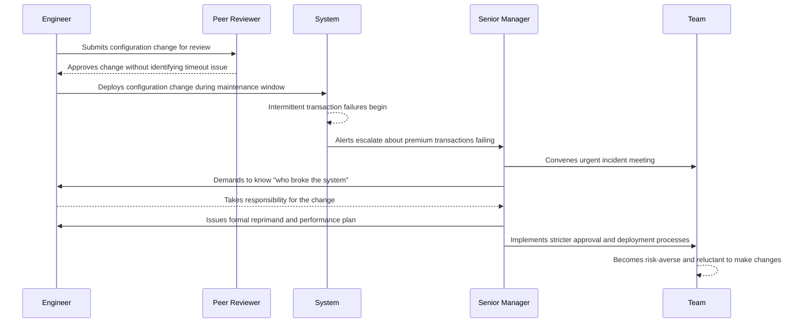

#### Key Points of Failure

1. **Pre-Deployment Review**: Despite following the approved change process, the timeout parameter error was not identified during peer review, showcasing a gap in the review's effectiveness.
2. **System Design**: The system lacked safeguards to detect and mitigate configuration errors before they impacted customers.
3. **Incident Response**: The focus of the investigation was solely on identifying the individual "at fault," neglecting a systemic analysis of how the error reached production.
4. **Cultural Impact**: The reprimand created a fear-based environment, where engineers became hesitant to propose or implement changes. This led to:
   - A 60% decrease in change velocity.
   - Increased bottlenecks due to redundant approval layers.
   - Hidden risks, as engineers avoided documenting or sharing potential issues.

#### Aftermath and Lessons Learned

While the immediate reaction of identifying and reprimanding an individual may have satisfied leadership's desire for accountability, it failed to address the root causes. Systemic issues—such as inadequate review processes, insufficient testing mechanisms, and a culture of fear—remained unaddressed. This approach not only reduced operational efficiency but also increased the likelihood of future undisclosed risks, undermining long-term reliability and resilience.
### SRE Best Practice: Evidence-Based Investigation

Blameless postmortems shift focus from "who" to "how" by acknowledging that humans act logically based on the information available to them at the time. Evidence-based investigation examines the entire socio-technical system rather than isolating individual actions.

The SRE approach starts with the assumption that everyone involved was acting with good intentions based on their understanding of the situation. This fundamental shift creates psychological safety that allows the team to uncover the complete picture of what happened.

#### Key Principles of Evidence-Based, Blameless Investigation

1. **Neutral Language**  
   Use language that focuses on events and system behaviors rather than assigning blame to individuals.  
   Example: Instead of "John failed to update the config," say, "The config was not updated prior to deployment."

2. **Context Reconstruction**  
   Reconstruct the context and information available at each decision point, including tools, dashboards, alerts, and documentation.  
   Example: "The on-call engineer responded based on the alert message, which lacked specific details about downstream impacts."

3. **System Conditions**  
   Identify conditions within the system that made the error possible or difficult to detect.  
   Example: "A missing validation check allowed the misconfigured parameter to propagate to production."

4. **Organizational Factors**  
   Examine broader organizational factors such as time pressure, unclear priorities, or communication gaps.  
   Example: "The team was under pressure to meet the release deadline, which deprioritized peer reviews."

5. **Pattern Recognition**  
   Look for patterns in past incidents to identify systemic issues rather than isolated ones.  
   Example: "Similar misconfigurations have occurred in previous releases, indicating a need for better safeguards in the CI/CD pipeline."

#### Checklist: Conducting an Evidence-Based Investigation

Use this checklist to ensure your postmortem process is thorough and actionable:

- [ ] Start with the assumption of good intentions by all involved.
- [ ] Use neutral, event-focused language throughout the review.
- [ ] Gather and analyze all available evidence, including logs, dashboards, and communications.
- [ ] Reconstruct the decision-making context for key actions.
- [ ] Identify system-level conditions that contributed to the incident.
- [ ] Investigate organizational and cultural factors that may have influenced outcomes.
- [ ] Compare the current incident to similar past events to detect systemic patterns.
- [ ] Document findings in a way that prioritizes learning and continuous improvement.

When rigorously applied, this approach reveals that most incidents result from multiple contributing factors and system conditions, rather than individual failures. It transforms incident analysis from punishment to learning, building a foundation for more resilient systems.
### Banking Impact

The blame culture in financial institutions creates significant business impacts beyond the immediate incident. The table below summarizes key impacts, their descriptions, and associated business consequences:

| **Impact**               | **Impact Description**                                                                                                                         | **Business Consequences**                                                                                        |
| ------------------------ | ---------------------------------------------------------------------------------------------------------------------------------------------- | ---------------------------------------------------------------------------------------------------------------- |
| **Regulatory Risk**      | Superficial root cause analyses focusing on individual blame often fail to satisfy regulatory requirements for comprehensive incident reviews. | Heightened regulatory scrutiny, potential fines, and erosion of trust with regulatory bodies.                    |
| **Innovation Paralysis** | Fear of punishment for failures discourages engineers from implementing changes or suggesting improvements.                                    | Technical stagnation, competitive disadvantage, and reduced ability to adapt to evolving market demands.         |
| **Hidden Risks**         | Teams hide potential issues and near-misses to avoid scrutiny, leading to an incomplete understanding of system health.                        | Increased likelihood of catastrophic failures due to unaddressed vulnerabilities and blind spots in operations.  |
| **Talent Attrition**     | High-performing engineers often leave organizations with toxic blame cultures.                                                                 | Loss of institutional knowledge, increased recruitment and training costs, and difficulty attracting top talent. |
| **Recurring Incidents**  | Failure to address systemic causes results in repeated incidents despite personnel changes.                                                    | Continued customer impact, mounting reputation damage, and long-term erosion of trust in the organization.       |

The financial impact of these effects often exceeds the direct cost of incidents. Studies suggest that blame cultures can reduce productivity by 20-30% while having no positive impact on system reliability.
### Implementation Guidance

Transitioning from a blame culture to a learning culture requires deliberate action at multiple organizational levels. The following flowchart outlines a step-by-step roadmap for driving this transformation:

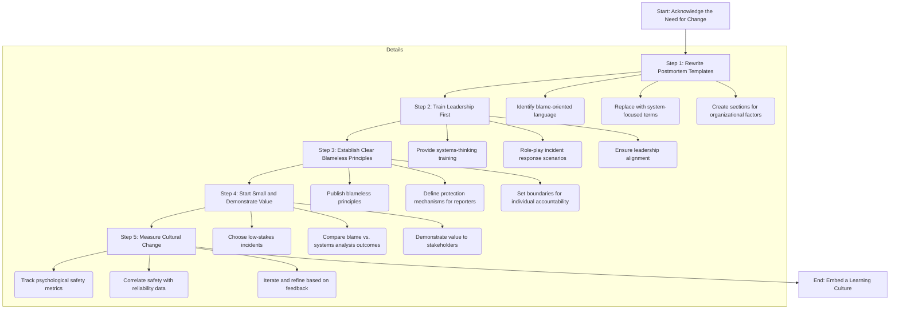

#### Step-by-Step Breakdown

1. **Rewrite Postmortem Templates**
   - Identify and remove blame-oriented language.
   - Replace terms like "responsible party" with "contributing factors" and "system conditions."
   - Add explicit sections for examining organizational and systemic factors beyond technical issues.

2. **Train Leadership First**
   - Provide training for executives and senior managers on systems thinking and the harm caused by blame.
   - Conduct role-playing exercises where leaders practice blameless responses to incidents.
   - Ensure leadership alignment as a foundation for broader cultural change.

3. **Establish Clear Blameless Principles**
   - Publish organizational principles that commit to blameless incident analysis.
   - Define and document protection mechanisms for individuals who report errors or incidents.
   - Clearly establish boundaries between blameless reviews and cases requiring individual accountability.

4. **Start Small and Demonstrate Value**
   - Begin with lower-stake incidents to test and refine the blameless review process.
   - Conduct side-by-side comparisons of blame-oriented versus systems-oriented analyses to highlight the differences in insights and outcomes.
   - Use these demonstrations to build confidence and buy-in across teams.

5. **Measure Cultural Change**
   - Track psychological safety metrics, such as self-reported errors, near-miss reporting frequency, and team survey results.
   - Correlate these metrics with technical reliability data to demonstrate the link between safety and performance.
   - Use feedback loops to iterate on the process and reinforce the learning culture.

By following this roadmap, organizations can systematically shift from a blame culture to one that prioritizes learning and continuous improvement, fostering resilience and reliability across teams.
## Panel 2: Anatomy of a Blameless Postmortem
### Scene Description

A bright, collaborative space with diverse team members engaged in constructive discussion. The room is organized to encourage participation, with a central digital whiteboard displaying a structured postmortem template. A facilitator stands by the whiteboard, guiding the discussion and annotating key points. Surrounding the group are digital displays showing a detailed timeline of the incident from Panel 1, now annotated with system interactions and decision points.

On one wall, clusters of Post-it notes are neatly organized under headers: "Contributing Factors," "What Went Well," and "Improvement Opportunities." These clusters represent the team's collective insights, gathered through active participation. The junior engineer from Panel 1 is visibly more confident and shares valuable observations, while a regulatory compliance officer collaborates with developers and operations staff, emphasizing the multidisciplinary nature of the analysis.

Below is a conceptual representation of the scene:

```mermaid
flowchart TD
    Whiteboard[Digital Whiteboard: Postmortem Template]
    Facilitator --> Whiteboard
    Timeline[Digital Displays: Annotated Incident Timeline]
    PostIts[Wall of Post-it Notes]
    SubClusters[Sub-clusters: "Contributing Factors," "What Went Well," "Improvement Opportunities"]
    PostIts --> SubClusters
    Team[Team Members: Developers, Ops, Regulatory Officer, Junior Engineer]
    Team --> Facilitator
    Team --> Timeline
    Team --> PostIts
```

The collaborative setup provides a safe environment where all participants, regardless of role or experience, can contribute to the discussion. The visual and physical elements of the space reinforce the core principles of a blameless postmortem: openness, shared responsibility, and a focus on actionable learning.
### Teaching Narrative
Blameless postmortems transform incidents from sources of shame into opportunities for organizational learning. Rather than seeking someone to blame, they focus on understanding the complex interactions and conditions that enabled the incident to occur. This approach acknowledges that in complex systems, failures are rarely caused by a single action but emerge from the interaction of multiple components and conditions.

The key elements of effective blameless postmortems include:

1. A focus on systems and processes rather than individuals
2. The assumption that everyone involved was acting with good intentions based on the information they had
3. A detailed timeline that captures not just what happened, but what people knew and why they made their decisions
4. Analysis of contributing factors rather than a single "root cause"
5. Clear, actionable improvement items with ownership and timelines

In banking systems, where incidents can have significant financial and regulatory impact, blameless postmortems don't diminish accountability - they enhance it by distributing responsibility across the organization rather than concentrating it on individuals. They acknowledge that reliability is a collective responsibility that extends beyond individual actions to include system design, processes, and organizational factors.
### Common Example of the Problem

At a regional bank, quarterly postmortems had devolved into performative exercises that produced little actual improvement. The standard practice involved the incident manager presenting a prepared slide deck with a pre-determined root cause and assigned blame. Team members rarely spoke except when directly questioned, and discussions focused on defending actions rather than understanding system behavior. This approach led to repeated incidents and a culture of fear rather than learning.

After a particularly severe mobile banking outage, the CTO discovered that three nearly identical incidents had occurred in the previous 18 months, each attributed to different individual errors. Despite multiple postmortems and action items, the underlying system vulnerability remained unaddressed. These superficial postmortems created a false sense of resolution while leaving the bank vulnerable to recurring issues. Team members began dreading incident reviews as exercises in blame allocation rather than learning opportunities.

#### Before-and-After Comparison Table

| Aspect                      | Ineffective Postmortem Practices                                           | Effective Blameless Postmortem Practices                                    |
| --------------------------- | -------------------------------------------------------------------------- | --------------------------------------------------------------------------- |
| **Primary Focus**           | Identifying and blaming an individual "root cause"                         | Understanding system behavior and contributing factors                      |
| **Team Dynamics**           | Defensive discussions, minimal collaboration                               | Open, collaborative discussions where all voices are valued                 |
| **Incident Review Process** | Pre-determined conclusions and slide decks, limited participant engagement | Detailed exploration of the timeline, decisions, and system interactions    |
| **Action Items**            | Generic or punitive actions targeting individuals                          | Clear, actionable improvements addressing system-level vulnerabilities      |
| **Cultural Impact**         | Fear of blame, reluctance to share insights                                | Psychological safety, encouraging contributions and organizational learning |
| **Outcome**                 | Repeated incidents, unresolved systemic issues                             | Long-term reliability improvements and enhanced accountability              |

By transitioning from ineffective to effective practices, the bank was able to foster a culture of continuous improvement. Team members felt empowered to share their insights, enabling the organization to address systemic vulnerabilities and prevent repeat incidents. This shift reinforced the principle that reliability is a collective responsibility, encouraging proactive engagement across teams.
### SRE Best Practice: Evidence-Based Investigation

Effective blameless postmortems follow a structured format that deliberately shifts focus from individuals to systems while generating actionable insights. The evidence-based approach is guided by the following checklist:

#### Checklist for Evidence-Based Investigation

1. **Prepare the Postmortem Session**
   - Designate a trained facilitator to guide the discussion and maintain a blameless environment.
   - Gather all relevant logs, metrics, and incident reports prior to the session.
   - Ensure participation from all key stakeholders, including those directly involved and others with relevant expertise.

2. **Reconstruct a Comprehensive Timeline**
   - Document the sequence of events as accurately as possible, including system behavior and human actions.
   - Focus on what information was available to individuals at each decision point.
   - Validate the timeline with participants to ensure accuracy and completeness.

3. **Conduct Multi-Causal Analysis**
   - Use structured techniques (e.g., "5 Whys," fishbone diagrams) to uncover contributing factors across:
     - Technical systems
     - Processes
     - Organizational structures
     - External conditions
   - Avoid narrowing the focus to a single "root cause."

4. **Apply Counterfactual Thinking**
   - Ask "What could have prevented or mitigated this incident?" to identify missed opportunities for safeguards.
   - Explore both technical and process-based improvements.

5. **Ensure Narrative Consistency**
   - Reassess the incident narrative from multiple perspectives to identify gaps or contradictions.
   - Incorporate feedback from diverse team members to strengthen the overall analysis.

6. **Identify Actionable Improvements**
   - Define clear, practical improvement items with assigned ownership and realistic timelines.
   - Ensure that improvement actions address system-level changes rather than individual behavior.

7. **Document and Share Findings**
   - Compile the postmortem document, including the timeline, contributing factors, and improvement actions.
   - Share the findings across the organization to promote transparency and collective learning.

#### Flow of Evidence-Based Investigation

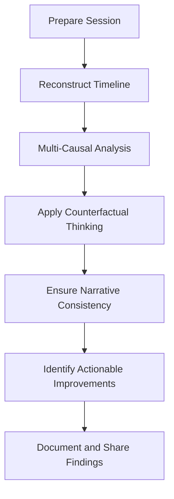

By following this step-by-step approach, teams can transform postmortems from blame sessions into rich learning experiences, fostering system-wide improvements and a culture of accountability.
### Banking Impact

Properly conducted blameless postmortems directly impact key business metrics in banking organizations:

1. **Reduced Mean Time Between Failures (MTBF)**: Organizations that implement true blameless postmortems typically see 40-60% reduction in recurring incident types as they address systemic issues rather than just individual errors.

2. **Accelerated Resolution Times**: Teams build collective knowledge about system behavior through effective postmortems, leading to 30-50% faster identification and resolution of similar issues in the future.

3. **Regulatory Compliance Enhancement**: Comprehensive blameless postmortems provide the thorough documentation and improvement tracking required by financial regulators, reducing findings during audits and examinations.

4. **Operational Cost Reduction**: Addressing systemic issues rather than applying superficial fixes reduces the total number of incidents, with many organizations reporting 25-35% decrease in overall incident volume within 12 months.

5. **Improved Team Performance**: Banking teams that practice blameless postmortems report higher collaboration across organizational boundaries, reducing the "silo effect" that contributes to many financial system incidents.

The following chart illustrates the tangible impact of these metrics across a 12-month period for a hypothetical banking organization:

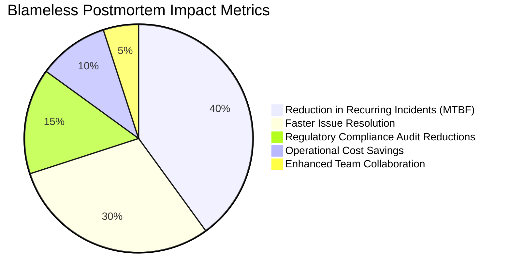

For financial institutions, these improvements translate directly to enhanced customer experience, reduced regulatory risk, and lower operational costs - creating a compelling business case for blameless postmortems beyond technical benefits.
### Implementation Guidance

To implement effective blameless postmortems in a banking environment, follow these steps:

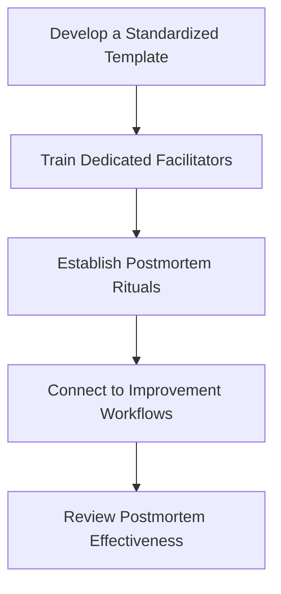

1. **Develop a Standardized Template**: Create a structured postmortem template that guides the analysis toward systems thinking. Include sections for:
   - Timeline of events
   - Contributing factors across multiple dimensions (technical, process, organizational, external)
   - What went well
   - Improvement items
   - Explicit learning opportunities  
     Ensure the template meets regulatory documentation requirements.

2. **Train Dedicated Facilitators**: Identify and train postmortem facilitators who understand both the technical environment and facilitation techniques. Focus on:
   - Managing group dynamics
   - Preventing blame language
   - Extracting maximum learning from incidents

3. **Establish Postmortem Rituals**: Create consistent practices around postmortems, including:
   - Standard scheduling (within 5-7 days of incident resolution)
   - Required preparation
   - Expected participation
   - Follow-up mechanisms  
     Ensure these rituals remain consistent regardless of incident severity or visibility.

4. **Connect to Improvement Workflows**: Establish clear pathways for postmortem action items to enter work queues. Ensure:
   - Appropriate prioritization
   - Visibility of action items  
     Implement tracking mechanisms to maintain visibility of postmortem-generated improvements until they are implemented.

5. **Review Postmortem Effectiveness**: Regularly assess the quality and impact of postmortems by reviewing:
   - Action item completion rates
   - Recurring incident patterns
   - Participant feedback  
     Use these insights to continuously refine the process.
## Panel 3: The Timeline Detective
### Scene Description

A digital war room serves as the command center where an SRE lead orchestrates the construction of a detailed incident timeline. The room is equipped with large screens prominently displaying:

- Chronologically ordered log entries
- Metrics graphs
- System alerts with precise timestamps

The team is organized around these displays, each member contributing their expertise:

- **SRE Lead**: Facilitating the timeline construction and guiding the investigation.
- **Engineer 1**: Highlighting discrepancies between automated system timestamps and human-reported times.
- **Engineer 2**: Correlating customer impact reports with backend system behavior.
- **Engineer 3**: Documenting "dark areas" where monitoring data is missing.
- **Banking Compliance Officer**: Noting points relevant to regulatory reporting requirements.

Below is a conceptual layout of the war room setup:

```
+---------------------------------------------+
|               Large Central Screen          |
|  [ Logs | Metrics Graphs | Alerts ]         |
+---------------------------------------------+
        |                |               |
        v                v               v
+----------------+ +----------------+ +----------------+
|  Engineer 1    | |  Engineer 2    | |  Engineer 3    |
| (Timestamps)   | | (Customer      | | (Dark Areas)   |
|                | | Impact &       | |                |
|                | | Backend        | |                |
|                | | Correlation)   | |                |
+----------------+ +----------------+ +----------------+
        ^                ^               ^
        |                |               |
   +-----------------------------+       |
   |       Banking Compliance    |       |
   |       Officer (Regulatory)  +-------+
   +-----------------------------+
```

Each team member adds context to specific timeline points by documenting what they knew at the time and explaining their decision-making process. This collaborative effort transforms raw data into a comprehensive narrative, revealing critical insights into the incident.
### Teaching Narrative
The foundation of effective postmortems is establishing a detailed, accurate timeline of events. This forensic process goes beyond logging "what" happened to include the critical context of "why" decisions were made. In complex banking systems with hundreds of microservices, constructing this narrative requires meticulous detective work.

The timeline investigation should:

1. Integrate multiple data sources (logs, metrics, alerts, chat records, ticket updates)
2. Document when information became available to different participants
3. Capture decision points and their rationale based on available information at that moment
4. Identify gaps in observability ("dark areas") where critical information was unavailable
5. Correlate technical events with customer impact
6. Document both automated system actions and human interventions

This process often reveals surprising insights: actions that seemed questionable in hindsight were actually reasonable given the information available at the time, while system design issues created conditions where even correct procedures led to failures. In banking environments with strict audit requirements, this detailed timeline also serves as crucial documentation for regulatory reporting and compliance verification.

The timeline becomes the shared factual foundation upon which all analysis and improvement efforts are built. It transforms subjective recollections and assumptions into an objective record of events that the entire organization can learn from.
### Common Example of the Problem

#### Incident Case: Credit Card Processing Outage

During a major credit card processing outage at a multinational bank, the incident response process revealed several common challenges in constructing an accurate timeline:

#### Key Issues Summary

| Issue                      | Description                                                                                      | Impact                                                                                |
| -------------------------- | ------------------------------------------------------------------------------------------------ | ------------------------------------------------------------------------------------- |
| Fragmented Narrative       | Teams worked in silos, each focusing on isolated parts of the issue with no shared timeline.     | Inconsistent understanding of the incident, leading to misaligned efforts.            |
| Timestamp Discrepancies    | Logs and monitoring systems from different teams had misaligned timestamps.                      | Confusion over the true sequence of events and potential misdiagnosis of root causes. |
| Competing Narratives       | Payments and infrastructure teams disagreed on the incident's origin (database vs. network).     | Discussions devolved into disputes rather than building a cohesive understanding.     |
| Lack of Unified Timeline   | No integration of data sources (logs, metrics, alerts) into a single, consolidated view.         | Prevented identification of causal relationships across systems.                      |
| Insufficient Observability | Missing monitoring data ("dark areas") from critical systems during key moments of the incident. | Left gaps in understanding the full scope and progression of the outage.              |
| Compliance Concerns        | No definitive sequence of events to provide to regulators.                                       | Increased regulatory risk and delays in compliance reporting.                         |

#### Consequences

The fragmented timeline and lack of agreement among teams led to:

1. Wasted time debating conflicting data instead of addressing the root cause.
2. Management's inability to prioritize remediation efforts effectively.
3. Compliance teams raising alarms about the risk of regulatory non-compliance.

This example highlights the critical need for a unified, detailed timeline to serve as a single source of truth for all stakeholders.
### SRE Best Practice: Evidence-Based Investigation

Timeline construction requires both technical skill and investigative methodology. The SRE approach to timeline forensics includes the following key steps, which are interconnected and iterative:

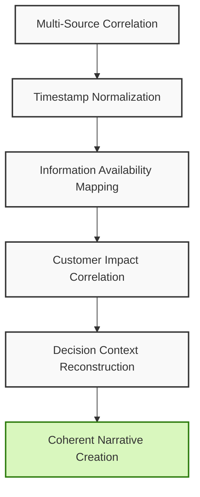

1. **Multi-Source Correlation**: Systematically gather and correlate events from disparate sources, including application logs, infrastructure metrics, monitoring alerts, deployment records, change management systems, chat logs, and ticket updates.

2. **Timestamp Normalization**: Resolve timestamp inconsistencies across systems with different time zones, clock skew, or formatting conventions to create a single, accurate chronology.

3. **Information Availability Mapping**: Document not just when events occurred, but when different teams became aware of them, revealing gaps between occurrence and detection.

4. **Customer Impact Correlation**: Link internal technical events with customer-facing impacts and support ticket creation to understand the relationship between technical failures and business consequences.

5. **Decision Context Reconstruction**: Capture the rationale behind key decisions by documenting what information was available to decision-makers at each point in time.

Through this methodical approach, scattered observations are transformed into a coherent narrative. This narrative reveals both technical and organizational factors contributing to the incident, laying the groundwork for thorough analysis and informed improvements.
### Banking Impact

Accurate timeline reconstruction directly impacts key aspects of banking operations. The following table summarizes the primary areas of impact:

| **Impact Area**            | **Description**                                                                                                                                                      |
| -------------------------- | -------------------------------------------------------------------------------------------------------------------------------------------------------------------- |
| **Regulatory Compliance**  | Financial regulators require precise incident documentation, including accurate chronologies. Detailed timelines demonstrate control and reduce regulatory scrutiny. |
| **Customer Reimbursement** | Determines which transactions were affected during payment processing incidents, ensuring proper compensation and managing financial remediation costs.              |
| **SLA Management**         | Enables accurate calculation of SLA breaches, penalties, or credits, ensuring both revenue protection and contractual compliance.                                    |
| **Fraud Detection**        | Improves the tuning of fraud detection rules by analyzing timelines of security-related incidents, reducing false positives and missed fraud cases.                  |
| **Root Cause Isolation**   | Prevents unnecessary post-incident changes by clearly identifying the actual problem, reducing change risks and improving resolution accuracy.                       |

Financial institutions that master timeline reconstruction typically see a 25-40% reduction in mean time to resolution (MTTR) for complex incidents, directly decreasing financial and reputational impact.
### Implementation Guidance
To implement effective timeline reconstruction in banking environments:

1. **Deploy Centralized Logging with Consistent Timestamps**: Implement logging infrastructure that normalizes timestamps across all systems, preferably using UTC as the standard reference with millisecond precision. Ensure all systems synchronize with reliable time sources and use consistent formatting.

2. **Create Timeline Construction Tools**: Develop or adopt specialized tools that can automatically aggregate events from multiple sources into a unified chronological view. These tools should support both automatic ingestion from technical systems and manual entry of human observations.

3. **Standardize Observability Instrumentation**: Implement consistent instrumentation across applications that captures key transitions between services, enabling transaction tracing across system boundaries. Pay special attention to customer-facing transaction flows to ensure end-to-end visibility.

4. **Establish "Source of Truth" Hierarchy**: Create explicit guidelines for resolving conflicts between different data sources, establishing which systems should be considered authoritative for specific types of events when discrepancies occur.

5. **Train Timeline Construction Skills**: Develop timeline construction capabilities as a core skill for incident responders and postmortem facilitators. Create exercises that practice timeline reconstruction from fragmented data to build this investigative competency.
## Panel 4: Beyond Root Cause to Systems Thinking
### Scene Description

The team collaborates in a dynamic workspace designed for systems investigation, moving beyond linear timeline analysis. At the center of the room, a large visual diagram dominates the space, illustrating interconnected banking services. Key interaction points are circled, with failure modes highlighted in red. The diagram uses color-coded nodes and arrows to represent dependencies, feedback loops, and cascading effects.

```
graph TD
    A[Banking Service A] --> B[Banking Service B]
    B --> C[Failure Mode X]
    C --> D[Service Dependency D]
    D --> E[Failure Mode Y]
    A --> F[Service Dependency F]
    F --> G[External Factor G]
    G --> C
    E --> H[Organizational Process Issue]

```

One wall displays an expanded "5 Whys" analysis, branching into multiple interconnected paths. Each branch is labeled with contributing factors, revealing how technical, human, and organizational elements interrelate. Unlike traditional linear "5 Whys," this version emphasizes non-linear cause-and-effect relationships.

Another wall features a "contributing factors" diagram. This diagram integrates technical components (e.g., configuration settings, APIs), process elements (e.g., incident response steps), organizational factors (e.g., team communication gaps), and external dependencies (e.g., third-party integrations).

Team members actively engage with these visual representations, drawing new connections on the diagrams to uncover hidden relationships. A senior architect stands near a note about a seemingly minor configuration setting. This setting, initially overlooked, is identified as a pivotal factor that unexpectedly contributed to the incident cascade, sparking further discussion about systemic vulnerabilities and design assumptions.
### Teaching Narrative
Traditional incident analysis often seeks a single "root cause" - the one defect or action that supposedly triggered everything else. This reductionist approach fundamentally misunderstands how complex systems fail. In modern SRE practice, we recognize that incidents emerge from the interaction of multiple contributing factors, none of which would be sufficient to cause the incident alone.

Instead of asking "what was the root cause?" effective postmortems ask:

1. What system conditions and interactions enabled this incident to occur?
2. How did our technical safeguards, processes, and organizational structures respond?
3. What assumptions in our system design were violated or revealed to be incorrect?
4. How did local optimizations in individual components affect global system behavior?
5. What feedback loops were missing that could have provided earlier detection?

This systems thinking approach reveals that many incidents occur not because something broke, but because the system behaved exactly as designed - just not as intended or expected. It shifts focus from fixing a single component to understanding and improving the entire system's resilience.

In banking systems with strict change control and complex dependencies, this approach is particularly valuable as it identifies how seemingly isolated changes can interact across component boundaries to create unexpected outcomes. It also helps identify "guardrails" that can constrain the impact of future incidents regardless of their specific triggers.
### Common Example of the Problem

A major investment bank experienced a trading platform outage during peak market hours. The initial investigation identified a storage subsystem failure as the "root cause" and focused all remediation efforts on hardening that specific component. A storage upgrade was expedited and implemented at significant cost and risk.

Two months later, a nearly identical outage occurred despite the upgraded storage. The second investigation revealed that the storage failures were actually a symptom of a deeper problem: database connection exhaustion caused by a combination of factors including an application memory leak, inconsistent timeout settings across services, and an auto-scaling policy that exacerbated the problem during high load.

To better understand the sequence of events and interactions that led to the first outage, consider the following timeline:

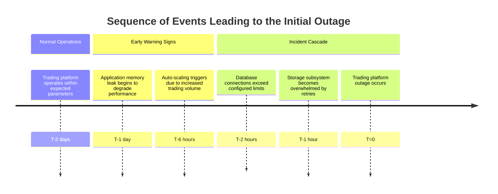

None of these factors alone would have caused a significant incident, but their interaction created conditions where routine fluctuations in trading volume could trigger catastrophic failure. By focusing narrowly on the storage "root cause" after the first incident, the team had missed the systemic issues that were the actual source of instability.

The narrow focus cost the bank millions in trading losses from the repeat incident and damaged client relationships who lost confidence in the platform's reliability. This example illustrates the importance of systems thinking in identifying and addressing the broader contributing factors that enable such failures to occur.
### SRE Best Practice: Evidence-Based Investigation

Systems thinking in postmortems requires specific analytical techniques that reveal complex interactions. To apply these methods systematically, use the following checklist to guide your investigation:

#### Evidence-Based Investigation Checklist:

1. **Multi-Factor Analysis Frameworks**
   - Use structured approaches like AcciMap, STAMP, or Systems-Theoretic Accident Model and Processes (STAMP).
   - Examine technical, procedural, organizational, and regulatory factors as interconnected elements.
   - Identify how these factors influence each other during system failures.

2. **Assumption Testing**
   - List key assumptions about system design and operations.
   - Challenge assumptions regarding component interactions and failure modes.
   - Evaluate which assumptions were violated or revealed to be incorrect.

3. **Counterfactual Analysis**
   - Explore what factors could have prevented the incident or mitigated its impact.
   - Focus on systemic safeguards rather than individual actions.
   - Identify opportunities to strengthen existing guardrails or introduce new ones.

4. **Interaction Mapping**
   - Create a visual map of component interactions, including:
     - Coupling points.
     - Feedback mechanisms.
     - Information flows.
   - Highlight how local behaviors contributed to system-level effects.
   - Use diagrams or flowcharts to document and share findings.

5. **Variance Analysis**
   - Compare actual system behavior during the incident with expected behavior.
   - Document discrepancies between mental models and reality.
   - Identify areas where expectations failed to align with observed outcomes.

---

By following this checklist, practitioners can systematically uncover the complex, interconnected factors that contributed to an incident. These insights lead to more comprehensive improvement strategies, moving beyond single-cause remediation to enhance overall system resilience.
### Banking Impact
Systems thinking approaches to incident analysis deliver significant business benefits for financial institutions:

1. **Reduced Change Risk**: Understanding system interactions allows more precise risk assessment of proposed changes, reducing unexpected side effects by 30-50% according to industry benchmarks.

2. **More Effective Investment**: Remediation resources target systemic vulnerabilities rather than symptoms, improving the return on reliability investments by addressing underlying patterns rather than individual manifestations.

3. **Enhanced Compliance Posture**: Regulators increasingly expect financial institutions to demonstrate systemic understanding of incidents rather than simplistic cause-effect analysis, particularly for recurring issues.

4. **Improved Cross-Team Collaboration**: Systems analysis naturally spans organizational boundaries, breaking down silos that contribute to many banking technology incidents.

5. **Reduced Incident Frequency**: Organizations that adopt systems thinking typically see 25-40% reduction in overall incident rates as they address patterns rather than isolated occurrences.

For complex banking platforms, these benefits translate directly to improved customer experience, reduced operational losses, and enhanced regulatory standing.
### Implementation Guidance

To implement systems thinking in banking incident analysis, consider the following steps. The table below summarizes each step with its objective and example outcome for clarity and actionability:

| **Step**                                    | **Objective**                                                                                 | **Example Outcome**                                                                                               |
| ------------------------------------------- | --------------------------------------------------------------------------------------------- | ----------------------------------------------------------------------------------------------------------------- |
| **Adopt Multi-Causal Analysis Templates**   | Shift focus from single root cause to identifying interacting contributing factors.           | A postmortem template categorizes factors (technical, process, organizational) and highlights their interactions. |
| **Train Systems Thinking Capabilities**     | Build expertise in analyzing complex interactions, feedback loops, and emergent behaviors.    | Technical teams complete training programs featuring case studies of interaction-driven incidents in banking.     |
| **Visualize System Relationships**          | Make complex system dependencies and interactions visible for better understanding.           | A system dynamics diagram reveals how a minor configuration change cascaded into a major service outage.          |
| **Implement Contributing Factors Taxonomy** | Standardize the classification of contributing factors to ensure comprehensive investigation. | Postmortem analysis includes non-technical causes, such as misaligned incentives or unclear communication paths.  |
| **Create Cross-Functional Analysis Teams**  | Incorporate diverse perspectives to identify hidden relationships and systemic weaknesses.    | A cross-functional team uncovers how a regulatory process created delays that amplified incident impact.          |

These steps collectively facilitate a shift from reductionist incident analysis to a holistic systems thinking approach, enabling teams to better understand and improve system resilience in the face of complex failures.
## Panel 5: From Insights to Actions
### Scene Description

A digital Kanban board occupies the center of the workspace, visually organizing categorized improvement items derived from the postmortem. Each card is structured with key details: an action, an owner, a priority, and the expected impact. The board is divided into five clear sections:

- **Technical Debt:** Actions addressing long-standing code or architecture issues
- **Process Improvements:** Enhancements to workflows or team practices
- **Observability Enhancements:** Steps to improve monitoring and reduce blind spots
- **Automation Opportunities:** Initiatives to reduce manual effort and potential for human error
- **Knowledge Sharing:** Activities aimed at improving team understanding and expertise

Team members gather around the board, actively discussing implementation strategies. A senior manager and product owner are seen collaborating on prioritization, weighing impact against feasibility.

Below is a conceptual representation of the Kanban board layout:

```
+---------------------+---------------------+---------------------+---------------------+----------------------+
| Technical Debt      | Process Improvements| Observability       | Automation          | Knowledge Sharing    |
|                     |                     | Enhancements        | Opportunities       |                      |
+---------------------+---------------------+---------------------+---------------------+----------------------+
| Action 1: Fix X     | Action 1: Streamline| Action 1: Add logs  | Action 1: Automate  | Action 1: Create doc |
| Owner: Alice        | Owner: Bob          | Owner: Carol        | Owner: Dave         | Owner: Eve           |
| Priority: High      | Priority: Medium    | Priority: High      | Priority: Low       | Priority: Medium     |
| Impact: Significant | Impact: Moderate    | Impact: Significant | Impact: Low         | Impact: Moderate     |
+---------------------+---------------------+---------------------+---------------------+----------------------+
```

To the side, a **dashboard** displays key reliability metrics with their respective improvement targets. Metrics such as Mean Time to Recovery (MTTR), alert noise reduction, and system uptime are prominently featured. Another screen shows a **calendar view** of scheduled resilience exercises, such as game days and chaos engineering tests, designed to validate the effectiveness of the proposed changes.

This setup fosters a collaborative and structured environment, ensuring that insights from the postmortem are translated into actionable steps that drive system resilience.
### Teaching Narrative
The true value of postmortems comes not from the analysis itself but from the improvements it drives. Effective postmortems translate insights into concrete, prioritized actions that address systemic issues rather than just symptoms. These actions must be tracked, measured, and validated to ensure they actually improve system resilience.

Key principles for effective postmortem actions include:

1. Focus on systemic improvements rather than individual training or punishment
2. Prioritize based on impact potential and implementation feasibility
3. Balance between immediate tactical fixes and longer-term strategic improvements
4. Consider not just prevention of similar incidents but detection and response capabilities
5. Design feedback mechanisms to validate whether improvements achieve their intended outcomes

In banking environments where change windows are limited and regulatory requirements are strict, prioritization becomes especially critical. Not all actions can be implemented immediately, so the team must determine which improvements will provide the greatest reliability benefit while meeting regulatory and business constraints.

The most powerful postmortem actions often focus on:

- Improving observability to reduce "dark areas" in monitoring
- Adding guardrails that limit failure propagation regardless of root cause
- Enhancing automation to reduce human error opportunities
- Creating runbooks and playbooks that improve incident response
- Implementing chaos engineering practices to proactively identify weaknesses
### Common Example of the Problem

A mid-size retail bank conducted thorough postmortems after incidents, generating insightful analyses and lengthy action item lists. However, six months after implementing this process, an audit revealed that less than 20% of postmortem actions had been completed. Most items were languishing in various backlogs without clear ownership or prioritization.

When a major mobile banking outage occurred, the team discovered that three previous incidents had identified the same vulnerable authentication service as a contributing factor. Each postmortem had generated actions to improve the service's resilience, but these actions had never been prioritized against feature development and were repeatedly deferred.

Despite significant investment in incident analysis, the bank wasn't realizing reliability improvements because insights weren't translating into implemented changes. The recurring mobile banking incidents eroded customer trust, with customer satisfaction scores dropping by 15 points and mobile app store ratings declining from 4.5 to 3.2 stars.

#### Summary Checklist of Key Failures

| **Failure Area**               | **Description**                                                                                          | **Impact**                                                                                   |
| ------------------------------ | -------------------------------------------------------------------------------------------------------- | -------------------------------------------------------------------------------------------- |
| Lack of Ownership              | No clear accountability was assigned for implementing postmortem actions.                                | Actions were left incomplete, leading to recurring incidents.                                |
| Poor Prioritization            | Actions were deprioritized in favor of feature development.                                              | Systemic vulnerabilities remained unaddressed, increasing the risk of outages.               |
| Insufficient Tracking          | Actions were added to backlogs without proper tracking or follow-up mechanisms.                          | Teams lost visibility into progress, resulting in low completion rates.                      |
| Failure to Align with Business | Postmortem actions were not balanced against broader business priorities, such as customer satisfaction. | Recurring outages directly impacted customer trust and satisfaction metrics.                 |
| Reactive Focus                 | Improvements targeted immediate issues but failed to address systemic detection and response gaps.       | Detection and response capabilities remained insufficient, prolonging the impact of outages. |

#### Lessons Learned

- Assign clear ownership for each postmortem action item, with defined deadlines.
- Use a prioritization framework (e.g., impact vs. effort matrix) to ensure systemic issues are addressed promptly.
- Implement tools or dashboards to track the status of postmortem actions and provide visibility to stakeholders.
- Regularly align postmortem actions with business objectives to balance technical and customer impact considerations.
- Address not just the root cause but also the surrounding detection and response gaps to improve overall resilience.
### SRE Best Practice: Evidence-Based Investigation

Effective action management transforms insights into measurable improvements through a structured approach. The following table summarizes the key steps, providing clarity and actionable guidance:

| **Step**                                 | **Description**                                                                                                                                                    | **Key Questions**                                                                                           |
| ---------------------------------------- | ------------------------------------------------------------------------------------------------------------------------------------------------------------------ | ----------------------------------------------------------------------------------------------------------- |
| **1. Impact-Based Prioritization**       | Evaluate potential improvements based on quantifiable reliability impact, such as risk reduction, customer minutes saved, or error budget preservation.            | - What is the measurable reliability gain? <br> - How does this align with business and user priorities?    |
| **2. Action Classification Framework**   | Categorize improvements into types (e.g., preventative, detective, response) and scopes (e.g., technical, process, organizational) to ensure balanced remediation. | - Does the action address prevention, detection, or response? <br> - Which teams or domains are impacted?   |
| **3. Implementation Pathway Definition** | Define clear pathways for actions to enter appropriate work streams, whether immediate technical changes or long-term architectural improvements.                  | - What is the required sponsorship or approval? <br> - What dependencies or risks exist for implementation? |
| **4. Validation Mechanism Design**       | Develop specific tests or metrics to validate whether implemented changes achieve their intended effect on system reliability.                                     | - What metrics will confirm success? <br> - How will the results be tracked or reported?                    |
| **5. Progress Visualization**            | Use transparent tracking mechanisms to maintain visibility of postmortem actions from identification to implementation and validation.                             | - How will progress be communicated to stakeholders? <br> - Are there blockers delaying implementation?     |

This systematic approach ensures that valuable insights generate real improvements, rather than languishing as good intentions in forgotten documents. By following these steps, SREs can drive meaningful, measurable reliability enhancements that align with organizational goals.
### Banking Impact

Effective action management delivers measurable business benefits in banking environments. The following outcomes highlight its impact, supported by data:

#### Key Benefits and Metrics
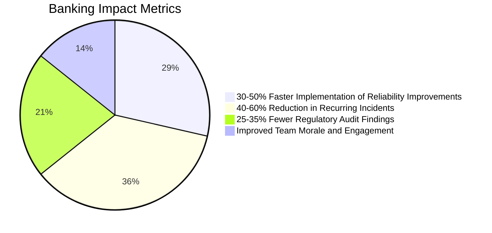

1. **Accelerated Reliability Improvement**: Organizations with structured action management typically see 30-50% faster implementation of critical reliability improvements compared to those without such processes.

2. **Reduced Recurring Incidents**: Effective action implementation reduces repeat incidents by 40-60%, directly impacting customer experience metrics and operational costs.

3. **Optimized Reliability Investment**: Prioritized action management ensures limited engineering resources target the highest-impact improvements, maximizing return on reliability investment.

4. **Enhanced Regulatory Standing**: Demonstrating effective remediation tracking and completion improves regulatory examinations, with some institutions reporting 25-35% reduction in audit findings related to incident management.

5. **Improved Team Morale**: When teams see their postmortem insights translated into actual improvements, engagement in the process increases, creating a virtuous cycle of continuous improvement.

#### Business Outcomes
For financial institutions, these outcomes directly impact:

- **Top-Line Revenue**: Improved customer experience drives retention and growth.
- **Bottom-Line Performance**: Reduced operational losses and regulatory penalties strengthen profitability.
### Implementation Guidance

To implement effective action management for banking incident postmortems, follow these five key steps. The process is summarized in the checklist and flow diagram below for clarity and actionable guidance.

#### Checklist for Implementation
1. **Develop an Action Classification System**
   - Categorize actions by impact potential, implementation effort, and type (prevention, detection, response).
   - Define clear criteria for "must-do" versus optional improvements.

2. **Establish Action Implementation Paths**
   - Design workflows for integrating actions into emergency changes, sprint planning, or strategic roadmaps.
   - Ensure visibility and sponsorship for all implementation paths.

3. **Implement Cross-Functional Prioritization**
   - Facilitate regular forums involving engineering and business leaders.
   - Prioritize actions against other work with decision authority to allocate resources.

4. **Create Action Validation Mechanisms**
   - Define metrics or testing procedures to validate outcomes (e.g., chaos testing, MTTD).
   - Ensure each improvement has measurable success criteria.

5. **Establish Action Dashboards and Reviews**
   - Track actions transparently with regular review cycles at team and executive levels.
   - Monitor metrics such as action completion rate, time to implementation, and reliability impact.

#### Flow Diagram for Implementation

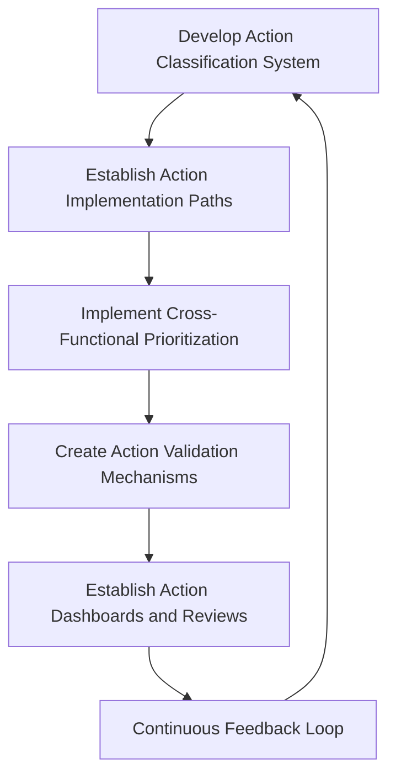

#### Detailed Steps in Implementation

1. **Develop an Action Classification System**  
   Start by creating a standardized framework to classify postmortem actions. Use criteria such as:
   - **Impact Potential**: What is the expected improvement to reliability?
   - **Implementation Effort**: What resources and time are required?
   - **Action Type**: Does this improve prevention, detection, or response?  
     Establish clear guidelines for prioritization to distinguish critical "must-do" actions from lower-priority tasks.

2. **Establish Action Implementation Paths**  
   Define the appropriate workflows for moving actions into execution. Examples include:
   - **Expedited Emergency Changes** for urgent fixes.
   - **Regular Sprint Planning** for medium-term improvements.
   - **Strategic Roadmap Incorporation** for long-term initiatives.  
     Assign owners and ensure each path is visible to stakeholders with the necessary sponsorship.

3. **Implement Cross-Functional Prioritization**  
   Create a decision-making forum where engineering and business stakeholders collaborate to prioritize actions. This forum should:
   - Balance reliability improvements with other business objectives.
   - Have clear authority to allocate resources and adjust priorities as needed.

4. **Create Action Validation Mechanisms**  
   Develop validation methods to ensure the effectiveness of implemented actions. Examples include:
   - Running **chaos engineering experiments** to test resilience.
   - Measuring metrics such as **Mean Time to Detect (MTTD)** for observability enhancements.  
     Each action should include measurable outcomes to confirm its impact.

5. **Establish Action Dashboards and Reviews**  
   Implement a system for tracking and reviewing postmortem actions. Include:
   - **Action Dashboards**: Display progress, owners, and timelines.
   - **Review Cycles**: Regular team- and executive-level reviews to assess metrics like completion rates and reliability improvements.  
     Use these reviews to maintain accountability and ensure continuous progress.

By following this structured approach, teams can ensure that postmortem insights translate into impactful, measurable improvements that enhance system resilience.
## Panel 6: Building a Learning Culture
### Scene Description

Imagine a bright, open space designed for collaborative learning and innovation. The room is thoughtfully organized into distinct zones, each fostering a specific type of learning activity:

```
+-------------------------+-----------------------+-------------------------+
|                         |                       |                         |
|  Failure Friday Zone    |   Pre-Implementation  |     Resilience Zone     |
|  - Engineer presents    |       Review Zone     |  - Simulated failures   |
|    recent incident      |  - Facilitator-led    |    to test response     |
|  - Lessons shared       |    review sessions    |  - Team collaboration   |
|                         |  - Identifying risks  |                         |
|                         |    pre-deployment     |                         |
+-------------------------+-----------------------+-------------------------+
|                         |                       |                         |
|       Reliability       |   Digital Dashboards  |   Collaborative Space   |
|         Library         |  - Live metrics show  |  - Open discussions of  |
|  - Wall of documented   |    reliability trends |    successes & failures |
|    incidents & patterns |  - Steady improvement |  - Energetic & positive |
|  - Lessons learned      |                       |    atmosphere           |
|                         |                       |                         |
+-------------------------+-----------------------+-------------------------+
```

- **Failure Friday Zone**: An engineer stands at the front, animatedly sharing lessons learned from a recent incident during a "failure Friday" session. The audience listens attentively, taking notes and asking questions.

- **Pre-Implementation Review Zone**: A facilitator leads a proactive discussion with the team, identifying failure modes before deployment. Sticky notes and diagrams cover the table as ideas flow freely.

- **Resilience Zone**: A team conducts a resilience exercise, deliberately introducing controlled failures to test system response. Laptops are open, and team members collaborate closely to analyze outcomes in real time.

- **Reliability Library**: A prominent wall displays a curated collection of documented incidents, patterns, and lessons learned. Team members are seen browsing the library, looking for insights to apply to their own projects.

- **Digital Dashboards**: Monitors display live reliability metrics, highlighting steady improvements over time. The visual data serves as a testament to the team's commitment to learning and system resilience.

- **Collaborative Space**: In another area, team members engage in open discussions about successes and failures. The atmosphere is energetic and positive, with visible psychological safety enabling candid conversations and shared growth.

This dynamic layout supports a holistic learning culture, where every corner of the space is designed to empower teams to learn, adapt, and improve continuously.
### Teaching Narrative
Blameless postmortems are not isolated events but elements of a broader learning culture. Organizations with high reliability transform every incident into a learning opportunity that strengthens overall system resilience. This culture views failures not as embarrassments to be hidden but as valuable investments in knowledge that should be leveraged for maximum return.

Key elements of effective learning cultures include:

1. Psychological safety that encourages open discussion of failures without fear of punishment
2. Regular sharing of incidents, near-misses, and lessons learned across teams
3. Proactive identification of potential failure modes before they cause incidents
4. Deliberate introduction of controlled failures to test system resilience (chaos engineering)
5. Recognition and rewards for contributions to organizational learning
6. Leadership behaviors that model vulnerability and learning from failure

In banking environments with low risk tolerance, building this culture requires careful balancing of learning and accountability. It's not about eliminating consequences, but ensuring they focus on improving the system rather than punishing individuals. When leaders demonstrate that the primary consequence of failure is learning rather than blame, they unlock tremendous potential for innovation and improvement.

The most reliable systems are not those that never fail, but those that learn and adapt continuously from both successes and failures. Banking organizations that embrace this mindset build not just more reliable systems but more engaged teams capable of responding to ever-changing threats and opportunities.
### Common Example of the Problem

A large commercial bank operated with a strong "prevention-only" mindset that treated incidents as aberrations to be eliminated rather than learning opportunities. The operations culture emphasized perfect execution and minimizing change to avoid risk. Incident discussions focused narrowly on specific events rather than patterns, and knowledge remained siloed within individual teams.

When a novel distributed denial of service (DDoS) attack pattern affected the bank's public-facing services, the response was fragmented and slow. Despite experiencing similar attack patterns to other financial institutions in previous months, the bank hadn't implemented protective measures because those incidents happened to "other banks" and weren't seen as relevant learning opportunities.

The bank's isolation extended to internal knowledge as well—a branch banking application team had developed effective mitigations for similar attack patterns six months earlier, but this knowledge never reached the main online banking team because there was no systematic learning sharing across departments.

#### Key Failures and Their Impacts

| Failure Type                  | Description                                                              | Impact                                                                                                 |
| ----------------------------- | ------------------------------------------------------------------------ | ------------------------------------------------------------------------------------------------------ |
| **Siloed Knowledge**          | Teams operated in isolation, lacking cross-department knowledge sharing. | Mitigations developed by one team were not utilized by another, leading to avoidable extended outages. |
| **Prevention-Only Mindset**   | Focus on avoiding incidents rather than learning from them.              | Slow response to novel attack patterns due to a lack of preparedness for unexpected failures.          |
| **Lack of External Learning** | Disregard for incidents at other organizations as irrelevant.            | Missed opportunities to proactively implement protective measures from observed industry trends.       |
| **Narrow Incident Focus**     | Incident discussions focused on isolated events instead of patterns.     | Limited ability to identify systemic issues, reducing overall resilience.                              |

#### Key Takeaways

- A culture that prioritizes knowledge sharing—both internally and externally—can significantly reduce response times to incidents.
- Moving from a prevention-only mindset to a learning-focused approach enables organizations to proactively adapt to emerging threats.
- Recognizing patterns across teams and external environments is critical to building reliable systems.
### SRE Best Practice: Evidence-Based Investigation

Building a learning culture requires systematic practices that transform incidents from isolated events into organizational knowledge. The following best practices illustrate how to operationalize this approach, supported by real-world examples:

1. **Continuous Learning Forums**: Establishing regular, structured opportunities for teams to share reliability learnings, including incident reviews, near-miss discussions, and external event analysis.  
   *Example*: A global e-commerce platform implemented bi-weekly "Reliability Circles," where teams discuss recent incidents and near-misses. In one session, an engineer presented a DNS outage postmortem, which led to the adoption of a more resilient multi-provider DNS strategy, reducing similar incidents by 80%.

2. **Learning Artifact Creation**: Converting incident insights into durable, accessible knowledge artifacts like pattern libraries, case studies, and decision frameworks that extend learning beyond those directly involved.  
   *Example*: A fintech company created a "Resilience Playbook" as a centralized repository for lessons learned. After a major database outage, they documented the root causes and remediation patterns, which later guided another team in preventing a similar failure during a system migration.

3. **Proactive Failure Analysis**: Implementing practices like Failure Mode and Effects Analysis (FMEA) and pre-mortems that identify potential failure modes before they occur in production.  
   *Example*: A payments processor conducted a pre-mortem for an upcoming feature release. The exercise identified a potential bottleneck in the API layer under high traffic. Mitigations were implemented preemptively, avoiding potential downtime during the release launch.

4. **Controlled Experimentation**: Conducting regular resilience testing through game days, chaos engineering, and simulation exercises that validate system behavior under failure conditions.  
   *Example*: A cloud services provider scheduled monthly chaos engineering exercises, such as randomly terminating database nodes in a controlled environment. These tests revealed and resolved gaps in failover mechanisms, improving mean time to recovery (MTTR) by 40%.

5. **Cross-Industry Learning Integration**: Systematically incorporating reliability insights from other organizations and industries through external research, conference participation, and collaborative forums.  
   *Example*: A banking institution partnered with an airline to study their reliability practices under high-availability demands. This collaboration inspired the bank to adopt a "zero-downtime deployment" approach, modeled on the airline's continuous delivery pipeline.

These practices transform learning from an informal, ad-hoc activity into a structured capability that continuously improves system resilience. By leveraging real-world examples, organizations can better understand how to embed these practices into their own operational culture.
### Banking Impact

Financial institutions that establish effective learning cultures realize significant business benefits:

1. **Accelerated Incident Response**: Organizations with mature learning cultures typically reduce mean time to resolution by 30-50% through better pattern recognition and applied experience.

2. **Preemptive Risk Mitigation**: Learning-oriented banks implement protective measures for emerging threats 2-3x faster than reactive organizations, reducing exposure to novel attack patterns and failure modes.

3. **Improved Change Success Rate**: Teams with access to organizational learning artifacts experience 25-40% fewer failed deployments and changes, reducing business disruption from implementation errors.

4. **Enhanced Innovation Capacity**: Despite the seemingly contradictory relationship, learning cultures actually enable more rapid innovation by creating safer systems that can absorb the risk of change with fewer customer-impacting incidents.

5. **Talent Attraction and Retention**: Engineering talent increasingly values psychological safety and learning opportunities, giving banks with learning cultures a significant advantage in recruiting and retention.

Below is a bar chart summarizing these key benefits for easier interpretation:

```mermaid
barChart
  title Banking Impact Metrics
  xAxis Categories
  yAxis Percentage Improvement
  "Mean Time to Resolution" 40
  "Risk Mitigation Speed" 200
  "Change Success Rate" 32
  "Innovation Enablement" 50
  "Talent Retention Advantage" 100
```

These benefits directly impact both operational performance and strategic capabilities, making learning culture a competitive differentiator in the financial services sector.
### Implementation Guidance

To build an effective learning culture in banking environments, follow these actionable steps:

#### Checklist for Implementation:
- [ ] **Establish Regular Learning Rituals**
  - Schedule structured learning activities such as incident reviews, "near-miss" discussions, "failure Friday" sessions, and pre-implementation risk reviews.
  - Ensure these rituals are accessible across teams and occur on a consistent cadence.
  - Use facilitation techniques to encourage participation and psychological safety.

- [ ] **Create a Reliability Knowledge Base**
  - Develop a centralized, searchable repository for incident patterns, failure modes, and lessons learned.
  - Ensure the repository includes clear categorization, practical takeaways, and cross-referencing for easy application.
  - Regularly update and curate content to maintain relevance and usability.

- [ ] **Implement Learning-Focused Metrics**
  - Define and track metrics such as repeat incident rates, cross-team application of lessons, and proactive risk mitigation activities.
  - Integrate these metrics into performance reviews alongside traditional reliability KPIs.
  - Use dashboards to share progress and trends transparently across the organization.

- [ ] **Design Recognition Systems for Learning Contributions**
  - Establish formal recognition programs that reward behaviors like transparent incident reporting, effective knowledge sharing, and proactive risk identification.
  - Balance recognition of "heroic" incident responses with acknowledgment of preventative and learning-focused contributions.
  - Make recognition public to reinforce desired behaviors throughout the organization.

- [ ] **Train Leaders in Learning Facilitation**
  - Provide leadership training focused on psychological safety, blameless incident analysis, and modeling vulnerability.
  - Target senior technical leaders and executives first to set the organizational tone.
  - Incorporate feedback loops to refine and adapt leadership training over time.

#### Summary Flow of Implementation

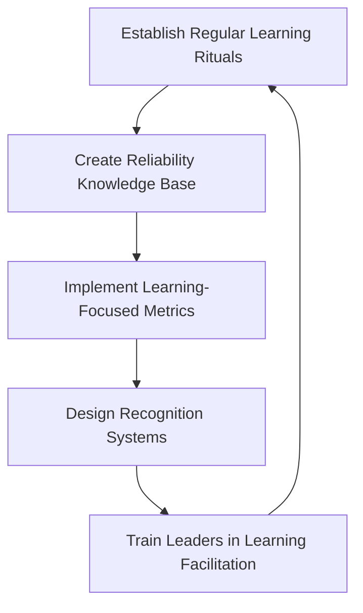

By following this checklist and iterative flow, organizations can embed a sustainable learning culture that drives both system reliability and team engagement.
## Panel 7: Regulatory Compliance Through Learning
### Scene Description
A collaborative space where SRE team members meet with regulatory compliance officers. They review a comprehensive incident report that maps postmortem findings to specific regulatory requirements. One screen shows how system improvements directly address regulatory controls. Another displays an audit trail of postmortem actions and their implementation status. A third screen shows trend lines of key incidents categorized by regulatory impact, with steadily improving metrics. The compliance officers look impressed by the depth of analysis and systematic improvements. SRE team members look confident rather than defensive, seeing regulators as partners in improving system reliability.
### Teaching Narrative
In heavily regulated industries like banking, postmortems serve not just operational improvement but regulatory compliance. Rather than seeing these as competing priorities, effective SRE teams integrate regulatory requirements directly into the incident response process, treating compliance communication as a first-class operational concern.

Key principles for regulatory-aware postmortems include:

1. Documenting the connection between identified issues and specific regulatory requirements
2. Mapping improvement actions to regulatory controls and frameworks
3. Maintaining rigorous evidence of implementation and effectiveness
4. Incorporating regulatory reporting requirements into postmortem templates
5. Including compliance stakeholders in postmortem processes

This approach transforms the relationship with regulators from adversarial to collaborative by demonstrating a proactive approach to identifying and addressing potential compliance issues. Rather than fearing regulatory scrutiny, teams welcome it as an opportunity to validate their learning processes.

For banking SRE teams, this integration is especially valuable as it aligns technical and compliance priorities. The same improvements that enhance system reliability often strengthen regulatory controls around data integrity, transaction security, and operational resilience. By documenting how postmortem learnings directly address regulatory concerns, teams can secure support and resources for critical reliability improvements.

The most mature financial organizations use their learning culture as a competitive advantage in regulatory compliance, demonstrating not just adherence to specific rules but a systematic approach to continuous improvement that exceeds regulatory expectations.
### Common Example of the Problem

A global bank treated regulatory compliance and technical incident management as entirely separate domains. The compliance team would become involved only after incidents were resolved, often weeks later, to complete required regulatory filings. They had little visibility into the technical details or remediation plans, forcing them to rely on simplified summaries created specifically for regulatory consumption.

#### Sequence of Events: Payment Processing Incident

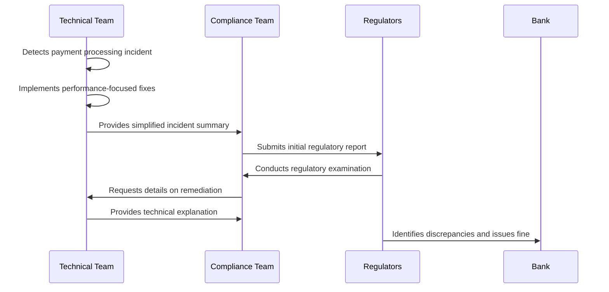

#### Key Disconnects

- **Delayed Involvement**: Compliance team engaged only after technical resolution, missing critical context.
- **Simplified Communication**: Technical details were overly distilled, omitting regulatory-specific nuances.
- **Misaligned Goals**: Technical fixes addressed system performance but overlooked regulatory controls for transaction integrity.

#### Outcome of the Incident

Two months after the incident, during a regulatory examination, examiners identified discrepancies between the technical remediation implemented and the controls described in regulatory filings. The bank was cited for inadequate incident management processes and fined for incomplete regulatory disclosure, despite having resolved the technical issues.

#### Lessons Learned

The separation between technical postmortems and regulatory compliance created unnecessary regulatory exposure, even though both teams were attempting to address the same underlying issues. This example highlights the critical need for integrated processes that bridge technical and compliance priorities from the outset.
### SRE Best Practice: Evidence-Based Investigation

Effective integration of regulatory requirements into the postmortem process requires systematic practices. Use the following checklist to ensure comprehensive, compliance-aware investigations:

#### Checklist for Evidence-Based Investigation

1. **Regulatory Mapping of Incidents**
   - Classify incidents based on their regulatory implications.
   - Use a structured framework to identify impacted regulations, requirements, and controls.

2. **Compliance-Aware Investigation**
   - Incorporate regulatory considerations into the investigation process.
   - Capture information needed for both technical resolution and regulatory reporting.

3. **Control-Based Remediation Planning**
   - Align improvement actions with relevant regulatory controls and frameworks.
   - Explicitly document how technical changes enhance compliance posture.

4. **Evidence Preservation**
   - Maintain comprehensive, immutable records of investigations, decisions, and remediation actions.
   - Ensure documentation satisfies regulatory requirements for auditability.

5. **Compliance Stakeholder Integration**
   - Include compliance perspectives throughout the postmortem process.
   - Engage stakeholders from initial classification through final implementation validation.

This integrated approach ensures that postmortems satisfy both technical and regulatory needs without duplication of effort or misalignment of outcomes.
### Banking Impact

Integrating regulatory considerations into postmortems delivers specific business benefits for financial institutions. The table below summarizes these benefits, along with corresponding metrics to illustrate their impact:

| **Benefit**                                                  | **Description**                                                                        | **Typical Metric/Impact**                                                     |
| ------------------------------------------------------------ | -------------------------------------------------------------------------------------- | ----------------------------------------------------------------------------- |
| **Reduced Regulatory Penalties**                             | Fewer regulatory findings related to incident management and remediation controls.     | 40-60% reduction in findings compared to non-integrated approaches.           |
| **Accelerated Examination Cycles**                           | Comprehensive documentation reduces the time regulators spend investigating incidents. | 20-30% decrease in examination duration.                                      |
| **More Efficient Compliance Resource Utilization**           | Eliminating duplicate work between technical and compliance teams.                     | Lower compliance costs and improved cross-functional collaboration outcomes.  |
| **Enhanced Regulatory Relationships**                        | A mature, integrated approach fosters trust and positive perception from regulators.   | Potentially less intensive oversight in other operational areas.              |
| **Better Alignment of Technical and Compliance Investments** | Ensures technical improvements also enhance regulatory controls.                       | Maximized return on reliability investments through dual-purpose initiatives. |

These benefits translate directly into tangible business outcomes, such as reduced regulatory costs, decreased penalties, and improved institutional reputation. By adopting an integrated approach, financial organizations not only achieve better compliance but also strengthen their operational resilience and industry standing.
### Implementation Guidance

To effectively integrate regulatory compliance into banking postmortems, follow this structured process:

#### Step-by-Step Process Overview
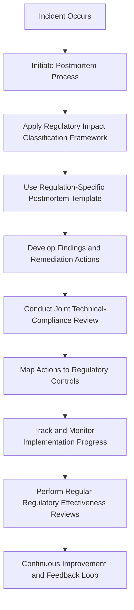

#### Detailed Steps

1. **Create a Regulatory Impact Classification Framework**  
   Develop a structured approach for quickly determining the regulatory implications of an incident. This includes identifying affected regulations, understanding reporting requirements, and mapping relevant controls. Apply this classification framework at the beginning of the postmortem process to ensure regulatory considerations are prioritized from the outset.

2. **Develop Regulation-Specific Postmortem Templates**  
   Adapt standard postmortem templates to include sections explicitly addressing common regulatory requirements. These tailored templates ensure investigations capture all necessary compliance-related information without adding redundant processes.

3. **Establish Joint Technical-Compliance Review**  
   Introduce a collaborative review process where technical and compliance teams jointly validate postmortem findings and remediation plans. This ensures both perspectives are incorporated, fostering alignment and accountability.

4. **Create Compliance-Mapped Action Tracking**  
   Enhance action tracking systems to include explicit mappings between remediation actions and regulatory controls. This enables both technical and compliance stakeholders to monitor progress collaboratively in a shared system, ensuring transparency and alignment.

5. **Implement Regular Regulatory Effectiveness Reviews**  
   Establish a recurring process to evaluate how effectively postmortems address regulatory requirements. This review should consider regulatory examination findings, feedback from compliance teams, and internal assessments. Use insights to refine postmortem processes and improve integration over time.

6. **Continuous Improvement and Feedback Loop**  
   Leverage data from effectiveness reviews to iteratively enhance the regulatory compliance integration process. Use this feedback loop to strengthen both system reliability and adherence to regulatory expectations, ensuring long-term alignment and improvement.