# Chapter 9: SLOs and Error Budgets in Financial Services

## Chapter Overview

Welcome to the financial services SLO rodeo, where uptime isn’t just a bragging number, it’s the difference between profit and public humiliation. This chapter drives a stake through the heart of vanity monitoring and forces you to stare down the cold reality: nobody cares about your CPU graphs when customers can’t move their money. Forget patting yourself on the back for five nines on the login page—if trades fail or payments die, you’re out millions and your regulator is on speed dial. We’ll show you how to replace your metric spam with SLOs that actually matter, spend error budgets like a ruthless CFO, and tier reliability so you stop gold-plating internal dashboards while your ATM network is on fire. This is SRE for adults: data-driven, business-aware, and allergic to pointless heroics. Read on if you’re ready to align your reliability investments with what actually matters—customer trust, revenue, and keeping the auditors at bay.

---
## Learning Objectives

- **Identify** customer-critical journeys in financial services and translate them into meaningful SLOs.
- **Define** SLIs that reflect real user outcomes, not just infrastructure vanity metrics.
- **Set** SLO targets using actual business impact, technical feasibility, and regulatory context—no more “four nines for everything.”
- **Calculate** and **manage** error budgets to balance innovation with not wrecking your service (or your career).
- **Classify** services into differentiated SLO tiers, and **allocate** engineering effort where it won’t be wasted.
- **Implement** robust SLO measurement pipelines that don’t give you false confidence or regulatory migraines.
- **Integrate** SLOs into business processes so reliability stops being an engineering hobby and starts driving real decisions.

---
## Key Takeaways

- Monitoring that misses customer pain is a career-limiting move. Your server can be “green” while your customers rage-quit and move their money elsewhere. Don’t be that bank.
- SLIs that measure technical trivia, not customer outcomes, are just noise pollution. If your SLI wouldn’t make a customer flinch, it’s not good enough.
- Arbitrary SLO targets (“give me five nines everywhere!”) are a great way to set your money and engineers on fire. Tie targets to business impact, or enjoy endless budget battles and feature delays.
- Error budgets are not just a Google fairy tale—they’re your shield against reckless launches and your weapon against the Department of No. If you’re not tracking and enforcing error budgets, you’re just guessing.
- Uniform reliability policies are a tax on innovation and a gift to your competitors. Differentiate SLOs by service criticality, or prepare to explain to your CFO why you spent millions on internal reporting while the payment system crashed.
- SLO measurement that tracks the wrong boundary is worse than useless—it’s dangerous. Measuring “API up” instead of “payment actually works” is how you get million-dollar blind spots and regulatory audits.
- SLOs are only magic if the whole business buys in. If your execs ignore error budgets and launch anyway, get ready for public postmortems and angry customers. Reliability is a team sport, not an engineering side project.
- Your SLOs and error budgets should survive regulator scrutiny, business reviews, and production chaos. If they can’t, they’re just theater.

In short: if your SLO program isn’t making your business safer, faster, and less expensive to run, you’re doing it wrong. Fix it before the market—or the regulator—fixes you.

---
## Panel 1: Beyond Monitoring - The Promise of SLOs
### Scene Description

In a modern banking operations center, a team gathers around a large display showing a new dashboard. Unlike traditional monitoring screens filled with CPU graphs and server stats, this one prominently features customer-centric metrics with clear thresholds. At the center of the display is a gauge titled "Payment Success Rate," currently reading **99.95%**, with a green zone indicating acceptable performance, a yellow zone for warnings, and a small red zone for critical issues. Below the gauge, a clear label reads: "Error Budget: 43% Remaining," with a horizontal bar chart tracking historical trends over the past week.

Here is a simple conceptual representation of the dashboard layout:

```
+-----------------------------------------------------------+
|                      Payment Success Rate                |
|                          99.95%                          |
|       Green    |    Yellow    |    Red                   |
|   (<99.90%)    | (99.90%-99.95%) | (>99.95%)             |
|                                                     O     |
| Error Budget: 43% Remaining                              |
|                                                         []|
| Historical Trends:                                        |
|    Mon  ██████████ 98.5%                                 |
|    Tue  ████████████ 99.2%                               |
|    Wed  ██████████████ 99.8%                             |
|    Thu  █████████████ 99.6%                              |
|    Fri  ████████████ 99.4%                               |
+-----------------------------------------------------------+
```

A senior SRE gestures toward the gauge while explaining its significance to a mix of operations staff and business stakeholders. The focus is on how these customer-centric metrics directly tie reliability to customer experience, illustrating a departure from traditional infrastructure-focused monitoring.
### Teaching Narrative
Service Level Objectives (SLOs) represent a fundamental shift in how we approach system reliability in financial services. Traditional monitoring focuses on infrastructure health: "Are the servers up? Is CPU usage normal? Do we have enough memory?" However, SLOs reorient our attention to what truly matters: customer experience. An SLO answers a critical question: "Is our service reliable enough for our customers?" By defining clear, measurable reliability targets based on customer experience, SLOs create a common language between technical and business teams. In financial services, where reliability directly impacts customer trust and regulatory compliance, SLOs provide the quantitative framework needed to make informed trade-offs between innovation speed and system stability. Rather than pursuing perfection at any cost, SLOs help us determine "how reliable is reliable enough" for each specific financial service.
### Common Example of the Problem

First National Bank's digital transformation team was proud of their monitoring systems. Dashboards displayed hundreds of metrics—CPU utilization stayed under 70%, server uptime reached 99.999%, and network bandwidth never exceeded 60% capacity. Yet customer complaints about mobile banking failures doubled quarter over quarter. During a major promotion offering special mortgage rates, the mobile app showed green dashboards while thousands of customers received error messages when trying to apply. The monitoring team insisted "all systems are operational" while the customer service team faced a barrage of frustrated customers.

This disconnect occurred because the bank was measuring technical metrics instead of customer outcomes. Their monitoring showed healthy infrastructure components while completely missing the customer's inability to complete core banking functions. Without customer-centric SLOs, they had no way to quantify reliability from the perspective that mattered most—the customer experience.

#### Comparison of Technical Metrics vs. Customer-Centric Metrics

| **Category**         | **Technical Metric**                      | **Customer-Centric Metric**                      |
| -------------------- | ----------------------------------------- | ------------------------------------------------ |
| **Infrastructure**   | CPU utilization: < 70%                    | Payment success rate: 99.95%                     |
| **Availability**     | Server uptime: 99.999%                    | Mortgage application success rate: 97%           |
| **Network**          | Bandwidth usage: < 60% capacity           | Percentage of users completing transactions: 95% |
| **Error Visibility** | Error logs generated by server components | Percentage of customers experiencing errors: 5%  |

This table highlights the gap between traditional infrastructure-focused metrics and customer-centric metrics. While infrastructure metrics indicate system health in technical terms, they fail to capture the actual user experience. For First National Bank, this gap meant they were blind to critical issues affecting their customers during a high-stakes promotion. By shifting to customer-centric SLOs, they could have proactively monitored and addressed the real problem—ensuring that customers could reliably complete their intended actions.
### SRE Best Practice: Evidence-Based Investigation

Leading SRE teams address the monitoring-to-SLO gap by conducting customer journey mapping and defining clear, measurable reliability indicators focused on outcomes. The investigation approach follows a structured methodology, which can be summarized in the following checklist and flowchart:

#### Checklist: Evidence-Based Investigation Steps
1. **Customer Journey Analysis**
   - Examine customer support tickets and app store reviews.
   - Identify critical customer functions (e.g., mortgage application completion during promotions).

2. **Technical Dependency Mapping**
   - Trace the technical workflow supporting key customer interactions.
   - Identify all microservices, teams, and dependencies involved.

3. **Reliability Correlation Study**
   - Analyze correlations between system metrics (e.g., CPU, memory) and successful customer outcomes.
   - Focus on metrics impacting user journeys during peak conditions.

4. **Canary User Testing**
   - Set up synthetic transactions simulating user behavior.
   - Track success rates to provide actionable, real-time insights.

5. **Comparative Benchmarking**
   - Conduct customer surveys to capture reliability expectations.
   - Compare customer perceptions with technical measurements to uncover gaps.

#### Flowchart: Evidence-Based Investigation Process
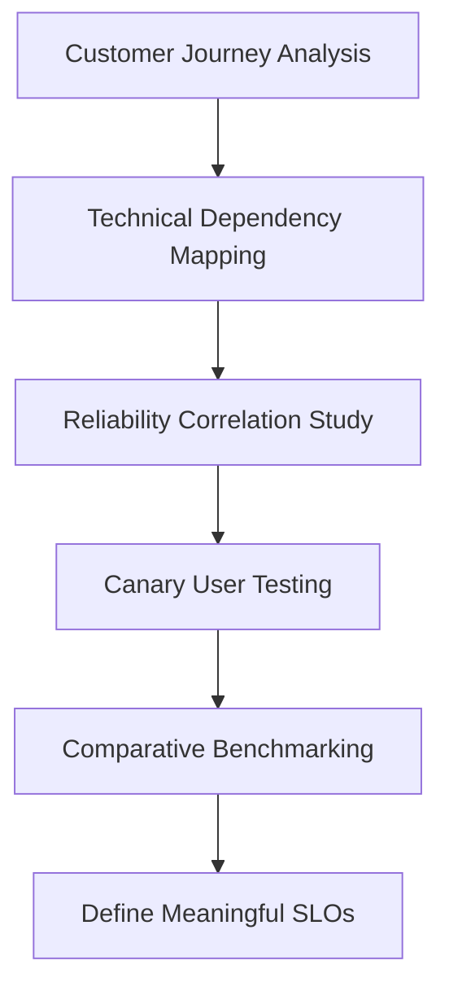

This evidence-based approach ensures that SRE teams bridge the gap between traditional technical monitoring and customer experience. By identifying reliability gaps and aligning with customer expectations, this methodology lays the foundation for meaningful, customer-centric SLOs.
### Banking Impact

The business consequences of lacking customer-centric SLOs extend far beyond technical metrics. Below is a summary of the financial and operational impacts experienced by First National Bank due to undetected reliability issues:

---

#### Key Metrics Summary

| **Impact Area**          | **Details**                                                                   |
| ------------------------ | ----------------------------------------------------------------------------- |
| **Direct Revenue Loss**  | $2.4M in mortgage applications abandoned during promotion period.             |
| **Customer Attrition**   | 4% increase in account closures, representing $1.8M in lost lifetime value.   |
| **Regulatory Scrutiny**  | Triggered a review due to discrepancies between system health and experience. |
| **Market Share Erosion** | Competitors gained 2.3% mortgage market share during the same period.         |
| **IT Misallocation**     | $850K spent optimizing non-impactful infrastructure components.               |

---

#### Visual Breakdown of Impact Areas

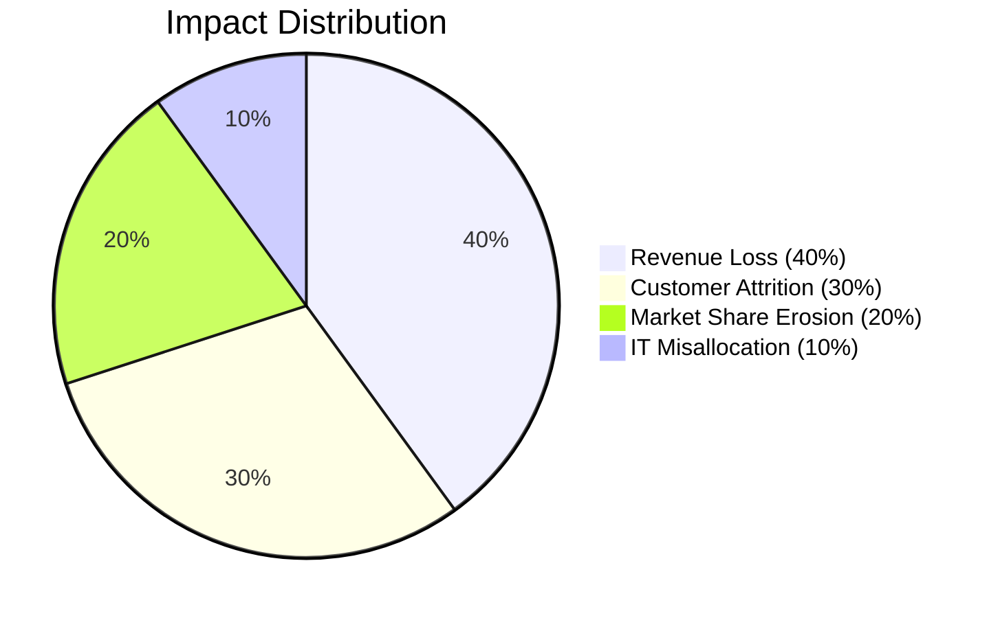

---

These metrics highlight the critical need for customer-focused SLOs. Without them, First National Bank's significant investments in monitoring and infrastructure failed to protect core business outcomes, resulting in financial loss, customer dissatisfaction, and regulatory challenges.
### Implementation Guidance

To implement effective SLOs that bridge the gap between technical monitoring and customer experience, follow these steps:

1. **Select Customer-Critical Journeys**: Identify 3-5 core customer journeys that directly impact business outcomes. Start with high-volume, high-value transactions like payments, account access, and application processes. Map these journeys end-to-end across your technical stack.

2. **Define Clear SLIs**: For each journey, establish specific Service Level Indicators that directly measure customer success. For example: "Percentage of payment transactions that complete in under 3 seconds," "Proportion of successful logins on first attempt," or "Ratio of completed mortgage applications to started applications."

3. **Establish Appropriate SLO Targets**: Set realistic reliability targets based on business requirements, customer expectations, and technical capabilities. For critical banking functions, start with 99.9% reliability (allowing 43 minutes of failure per month) and adjust based on customer impact analysis.

4. **Implement Measurement Infrastructure**: Deploy the technical capabilities needed to accurately measure your SLIs, including synthetic transactions, real user monitoring, and aggregation pipelines that can process high-volume transaction data in near real-time.

5. **Create SLO Dashboards and Reports**: Develop clear visualizations that make SLO performance accessible to both technical and business stakeholders. Include error budget consumption, historical trends, and correlation with business metrics to facilitate data-driven decisions about reliability investments.

#### Example SLO Dashboard Template

Below is a text-based representation of a sample SLO dashboard layout to help you get started:

```
+-----------------------------------------------------------+
|                   Customer Reliability Dashboard          |
+-----------------------------------------------------------+
| SLO Metric                     | Target   | Current Value |
|-----------------------------------------------------------|
| Payment Success Rate           | 99.95%   | 99.92%        |
| First Attempt Login Success    | 99.90%   | 99.87%        |
| Mortgage Application Completion| 99.80%   | 99.75%        |
+-----------------------------------------------------------+
| Error Budget Remaining: 43%                               |
+-----------------------------------------------------------+
| Historical Trends:                                         |
| - Payment Success Rate:      [#####---] (99.92%, stable)  |
| - Login Success Rate:        [#####-- ] (99.87%, declining)|
| - Application Completion:    [######--] (99.75%, improving)|
+-----------------------------------------------------------+
| Notes:                                                    |
| - Payment issues identified in region X, mitigation in    |
|   progress (ETA 2 hours).                                 |
| - Login rate drop correlates with new authentication      |
|   rollout.                                                |
+-----------------------------------------------------------+
```

This template outlines the key components of a useful SLO dashboard:
- **SLO Metrics Table**: Displays the SLOs, their targets, and current performance.
- **Error Budget Indicator**: Shows remaining error budget for quick assessment.
- **Historical Trends**: Highlights trends to aid in identifying patterns or anomalies.
- **Actionable Notes**: Provides context and updates related to ongoing issues.

By using this structure, you can ensure your SLO dashboards are both informative and actionable for a wide range of stakeholders.
## Panel 2: Finding Your North Star - Identifying SLIs in Banking
### Scene Description

A workshop room with walls covered in sticky notes grouping different banking services and customer journeys. A diverse team including developers, operations engineers, product owners, and customer experience specialists cluster around a whiteboard. They're collaboratively mapping customer journeys for mobile banking authentication, breaking down the technical components involved at each step.

To the side of the whiteboard, a simple funnel diagram is sketched out, illustrating how multiple technical measurements contribute to a single customer-perceived outcome. The diagram starts with broad technical metrics at the top (e.g., API latency, database queries, authentication service calls) and narrows down to a focused outcome at the bottom: "Can log in within 2 seconds." Below is a text-based representation of the funnel:

```
Technical Metrics:
  - API Latency
  - Database Queries
  - Authentication Service Calls
       ↓
Aggregated System Performance
       ↓
Customer Outcome:
  "Can log in within 2 seconds"
```

The sticky notes and the funnel diagram together emphasize the importance of connecting technical performance to customer experience. The scene reflects a dynamic brainstorming process where technical and business teams align on how to measure success in terms of customer-perceived reliability.
### Teaching Narrative
Service Level Indicators (SLIs) are the measurable metrics that form the foundation of effective SLOs. In banking systems, identifying the right SLIs requires looking beyond infrastructure metrics to focus on customer-perceived reliability. The key question shifts from "what can we measure?" to "what should we measure?" Effective SLIs for financial services directly reflect customer experience: payment success rates, transaction processing times, authentication success ratios, and account data availability. The most powerful SLIs measure the boundary between your systems and your customers - the moments where technical performance becomes customer experience. For banking systems, this often means focusing on critical customer journeys: completing a transaction, viewing account balances, or authenticating into services. Good SLIs are both a technical measurement and a business relevant metric that everyone from engineers to executives can understand and rally behind. The process of identifying these metrics brings technical and business teams together around a shared understanding of what constitutes "reliability" for your specific financial services.
### Common Example of the Problem

Metropolitan Trust Bank had invested heavily in their trading platform monitoring. The operations team maintained dashboards tracking 237 different metrics, from database query times to network latency. Despite this extensive monitoring, the bank faced a critical incident when high-net-worth clients couldn't execute trades during a market volatility spike. The monitoring dashboards showed minor degradation in some systems but nothing that triggered critical alerts.

Post-incident analysis revealed the core problem: none of their metrics measured what actually mattered to customers—the ability to successfully execute trades in a timely manner. The operations team was tracking component health rather than customer outcomes. As one frustrated trader commented, "I don't care if your database latency is 25ms instead of 20ms—I care that my $2 million trade didn't execute and I lost $43,000 while your systems were 'operating normally.'" Without meaningful SLIs tied to customer experience, Metropolitan Trust had no way to detect this critical failure.

#### Technical Metrics vs. Customer-Centric SLIs

| **Category**            | **Example Metric**                   | **Relevance to Customers**                                            | **Key Gap**                                                                |
| ----------------------- | ------------------------------------ | --------------------------------------------------------------------- | -------------------------------------------------------------------------- |
| Database Performance    | Database latency (e.g., 20ms)        | Minimal impact if customer-facing functionality remains responsive    | Does not indicate whether trades are successfully executed                 |
| Network Health          | Packet loss or network throughput    | Important for backend systems but invisible to the end user           | Fails to capture transaction success or failure                            |
| Application Performance | API response time (e.g., 99.9% < 2s) | Useful for internal SLAs but not tied to specific customer outcomes   | Does not directly reflect whether a trade completes within acceptable time |
| Customer-Centric Metric | Trade execution success rate         | Directly measures the customer’s ability to complete critical actions | Missing from monitoring, leading to blind spots during incidents           |

This table emphasizes the misalignment between technical monitoring and customer experience. By focusing exclusively on infrastructure and backend metrics, Metropolitan Trust Bank overlooked the most critical indicator of reliability from a customer perspective: the ability to execute trades successfully. This gap highlights the importance of identifying SLIs that bridge the divide between internal technical performance and customer outcomes.
### SRE Best Practice: Evidence-Based Investigation

Leading SRE teams use a structured approach to identify meaningful SLIs that accurately reflect customer experience. Below is a checklist summarizing the five steps for evidence-based investigation, designed to help your team apply this approach effectively:

#### Checklist: Evidence-Based Investigation for Identifying SLIs
- [ ] **Customer Interaction Analysis**: Analyze historical data and user interaction patterns to identify which metrics correlate most strongly with customer satisfaction.  
  *Example*: Metropolitan Trust's SRE team found that 82% of trader satisfaction was linked to trade execution success rate, order confirmation speed, and price accuracy.

- [ ] **Failure Mode Examination**: Conduct interviews and analyze support tickets to uncover the most common and impactful failure modes from the customer’s perspective.  
  *Example*: Delayed trade execution was deemed more disruptive than system unavailability due to the uncertainty it caused.

- [ ] **Technical Journey Mapping**: Trace complete transaction workflows, from user interface to backend systems, to identify critical measurement points where technical performance impacts customer experience.  
  *Example*: A transaction flow analysis revealed 17 services involved in trade execution but only 4 on the critical path.

- [ ] **Signal-to-Noise Analysis**: Evaluate existing metrics to determine their correlation with customer satisfaction and complaint rates. Identify which metrics are irrelevant and uncover gaps where critical indicators are missing.  
  *Example*: The team found that some commonly tracked metrics had no meaningful impact on customer experience, while critical indicators like trade confirmation latency were under-measured.

- [ ] **Comparative Testing**: Run controlled experiments by deliberately degrading components to assess their impact on customer experience. Use these insights to prioritize SLIs.  
  *Example*: Testing revealed that trade confirmation latency had the highest influence on trader perception.

#### Key Outcome
This evidence-based methodology enables teams to identify SLIs that act as reliable proxies for customer experience, fostering alignment between technical performance and business objectives.
### Banking Impact

The lack of customer-centric SLIs created significant business consequences for Metropolitan Trust. The table below summarizes these impacts:

| **Business Consequence**       | **Description**                                                                                                                                      |
| ------------------------------ | ---------------------------------------------------------------------------------------------------------------------------------------------------- |
| **Trading Revenue Loss**       | During the 47-minute incident, approximately $18.7 million in trading volume was lost as clients switched to competitors for time-sensitive trades.  |
| **Client Relationship Damage** | Two institutional clients managing over $500 million in assets moved their primary trading relationships to competitors due to reliability concerns. |
| **Reputation Impairment**      | Financial media coverage questioned the bank's technical capabilities and risk management practices, damaging its reputation.                        |
| **Regulatory Attention**       | Financial regulators demanded a comprehensive review of the bank's trade execution reliability measures and incident response protocols.             |
| **Operational Inefficiency**   | The operations team spent approximately 340 person-hours per month monitoring ineffective metrics that failed to reflect customer experience.        |

Metropolitan Trust realized that without meaningful SLIs, their substantial investments in monitoring technology were failing to protect their core business value.
### Implementation Guidance

To identify and implement effective SLIs for banking services, follow these steps. Use the checklist below to ensure a structured and actionable approach:

#### Checklist for SLI Implementation in Banking:

1. **Map Critical Customer Journeys**
   - ☐ Identify the most important customer interactions with your systems (e.g., payments, transfers, account access).
   - ☐ Document the complete technical flow for each journey, including all services and dependencies involved.

2. **Define Customer-Perceived Success**
   - ☐ Clearly articulate what "success" looks like for the customer in each journey.
     - Example: For payments, success means the customer receives confirmation within 3 seconds, and funds are delivered within the promised timeframe.

3. **Identify Measurement Points**
   - ☐ Determine where in your technical stack you can measure success criteria accurately.
   - ☐ Focus on points that reflect customer experience, not just internal system health.
     - Example: For authentication, measure the success rate and latency of complete login attempts rather than individual component metrics.

4. **Design Appropriate SLI Formulas**
   - ☐ Create SLI definitions that express the ratio of successful events to total events.
     - Example: "The proportion of trade execution requests that complete within 500ms" or "The percentage of account balance queries that return accurate data in under 1 second."
   - ☐ Ensure formulas are simple, clear, and align with customer priorities.

5. **Validate With Stakeholders**
   - ☐ Review proposed SLIs with both technical teams and business stakeholders to confirm they reflect customer priorities and are feasible to measure.
   - ☐ Use historical data to simulate how the SLIs would have performed during previous incidents.

6. **Iterate and Refine**
   - ☐ Monitor the SLIs once implemented and periodically review their relevance and accuracy.
   - ☐ Adjust SLIs as customer expectations, system architecture, or business priorities evolve.

#### Example Flow for SLI Identification:

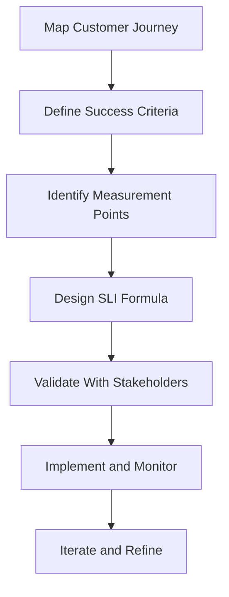

By following this checklist and iterative process, your team can confidently implement SLIs that bridge technical performance and customer experience, ensuring alignment with business goals.
## Panel 3: The Art of Setting Targets - Crafting Meaningful SLOs
### Scene Description

A financial services leadership meeting where technical and business teams are negotiating reliability targets. Charts on display show historical reliability measurements for different banking services alongside competitor benchmarks and regulatory requirements. One slide features a decision matrix with axes for "Customer Impact" and "Technical Feasibility," with different services plotted according to their characteristics:

```
Customer Impact
  ^
  |                               +-------------------------------+
  |                               |                               |
High                            [Mobile Banking Availability]     |
  |                               |                               |
  |           [Payment Processing Reliability]                   |
  |                               |                               |
  |    [Internal Reporting System Reliability]                   |
  +--------------------------------------------------------------> Technical Feasibility
                                  Low
```

The CTO and head of retail banking are in animated discussion about the appropriate target for mobile banking availability. Data from customer surveys and technical assessments is spread out on the table between them, emphasizing the balance needed between ambitious customer-facing goals and realistic engineering capabilities.
### Teaching Narrative
Setting appropriate SLO targets is where science meets art in reliability engineering. While SLIs tell us what to measure, SLOs define how reliable is "reliable enough." In financial services, this means balancing customer expectations, business requirements, regulatory constraints, and technical realities. The ideal SLO target should be ambitious enough to meet customer needs but realistic enough to be achievable without excessive engineering costs. For critical banking services like payment processing or account access, SLOs typically start at "three nines" (99.9%) and may reach "four nines" (99.99%) for core services, reflecting the high stakes and low tolerance for disruption in financial transactions. However, not all services require the same reliability level - internal reporting systems might target lower reliability to conserve engineering resources for customer-facing services. The most effective SLO targets in banking are derived from a combination of historical performance data, customer expectations, competitive analysis, and regulatory requirements. The key is creating a target that serves as both a technical guidepost for engineering teams and a meaningful commitment to service quality that business stakeholders can understand and support.
### Common Example of the Problem

Alliance Bank faced a classic challenge when establishing reliability targets for their digital banking platform. The executive team, eager to compete with fintech disruptors, mandated "five nines" (99.999%) availability across all services—a target requiring enormous engineering investment. Meanwhile, the engineering team pushed back, arguing for a more achievable "three nines" (99.9%) target based on their infrastructure capabilities.

The conflict came to a head during budget planning when the CTO requested an additional $4.7 million for infrastructure improvements to approach the mandated reliability levels. The CFO questioned the investment, noting that customer satisfaction scores hadn't declined despite occasional outages. Without data connecting reliability levels to business outcomes, the discussion devolved into subjective opinions rather than strategic decision-making.

To illustrate the misalignment between targets, costs, and impact, the following table summarizes the trade-offs Alliance Bank faced:

| Reliability Target | Availability (%) | Estimated Cost Increase | Customer Impact                            | Business Impact                           |
| ------------------ | ---------------- | ----------------------- | ------------------------------------------ | ----------------------------------------- |
| Three Nines        | 99.9%            | Baseline                | Minimal outages, generally tolerable       | Aligns with existing infrastructure costs |
| Four Nines         | 99.99%           | +$4.7M                  | Rare outages, improved customer trust      | Significant engineering investment        |
| Five Nines         | 99.999%          | +$12M                   | Virtually no outages, highest satisfaction | Excessive cost, diminishing returns       |

In the end, they implemented an arbitrary "four nines" (99.99%) target as a compromise, leaving both teams dissatisfied. The lack of a data-driven approach to SLO targets led to misaligned expectations, inefficient resource allocation, and reliability goals disconnected from customer needs.

This example underscores the importance of balancing technical feasibility, customer expectations, and business priorities when crafting meaningful SLOs.
### SRE Best Practice: Evidence-Based Investigation

Leading SRE organizations use a structured, evidence-based approach to establish appropriate SLO targets. Below is a five-step checklist to guide teams in applying this best practice effectively:

#### Checklist: Evidence-Based SLO Target Setting

1. **Historical Performance Analysis**
   - Collect at least 12–18 months of historical reliability data for your services.
   - Identify average performance and analyze variability across different services.
   - Example: Alliance Bank's SRE team found a 99.93% average availability with significant variation between services.

2. **Customer Impact Study**
   - Correlate reliability data with customer behavior metrics (e.g., support calls, transaction volume).
   - Determine thresholds at which reliability impacts customer satisfaction or behavior.
   - Example: Availability below 99.95% for payment processing increased support calls and reduced transaction volume.

3. **Competitive Benchmarking**
   - Conduct an analysis of competitor reliability using synthetic transactions or third-party reports.
   - Compare your service performance against industry standards and market leaders.
   - Example: Market leaders maintained 99.97% availability for payment services but accepted lower reliability for secondary features.

4. **Cost-Benefit Modeling**
   - Build financial models to quantify the cost of achieving incremental reliability improvements.
   - Compare these costs against projected business benefits (e.g., revenue retention, reduced support costs).
   - Example: Improving payment processing from 99.9% to 99.95% cost $1.2M but prevented $3.7M in lost transaction revenue.

5. **Regulatory Compliance Review**
   - Review applicable regulations to identify mandatory reliability requirements for critical services.
   - Ensure your SLO targets meet or exceed these regulatory thresholds.
   - Example: Certain payment systems required 99.95% availability to meet settlement window requirements.

#### Summary of Approach

This evidence-based methodology combines historical data, customer insights, competitive analysis, cost modeling, and regulatory compliance to derive meaningful SLO targets. By following this checklist, SRE teams can ensure their targets align with both business priorities and technical capabilities, fostering collaboration between technical and business stakeholders.
### Banking Impact

Setting inappropriate SLO targets—whether too aggressive or too lenient—creates significant business consequences. The ripple effects of these missteps can be visualized as a cascading flow of issues:

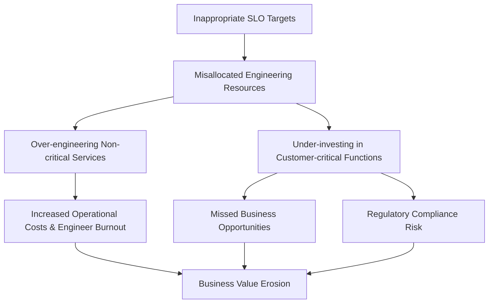

#### Real-World Examples of Missteps:

1. **Misallocated Engineering Resources**: Alliance Bank's arbitrary reliability targets led to over-engineering non-critical services while under-investing in customer-critical functions. An estimated $2.1 million was spent improving the reliability of internal reporting systems that delivered minimal customer benefit.

2. **Competitive Disadvantage**: While engineering resources focused on meeting uniform reliability targets across all services, competitors with more strategic approaches delivered innovative features faster, gaining 3.7% market share in mobile banking.

3. **Increased Operational Costs**: The pursuit of "five nines" for all services required 24/7 on-call rotations across all teams, leading to a 23% increase in operational costs and contributing to engineer burnout and turnover.

4. **Missed Business Opportunities**: The overly cautious change management required to maintain unrealistic reliability targets delayed the launch of new revenue-generating features by an average of 27 days, resulting in approximately $780,000 in lost revenue opportunities per quarter.

5. **Regulatory Compliance Risk**: Despite heavy investment in reliability, the lack of service-specific targets aligned with regulatory requirements left the bank vulnerable to compliance issues in critical financial reporting systems.

The bank ultimately discovered that arbitrary SLO targets not only wasted resources but also increased business risk, focusing engineering effort on the wrong priorities and eroding overall business value.
### Implementation Guidance
To establish meaningful SLO targets for banking services, follow these steps:

1. **Classify Services by Criticality**: Categorize all services based on their impact on customer experience and business operations. Create at least three tiers: Critical (payment processing, authentication), Important (account management, transaction history), and Supporting (personalization, analytics). This segmentation allows for differentiated reliability targets.

2. **Analyze Historical Performance**: Measure the actual reliability performance of your services over the past 12-24 months. This baseline helps establish realistic targets based on your current capabilities and identifies services already operating below acceptable thresholds.

3. **Define Reliability-Business Correlations**: For each service tier, determine the reliability threshold where business impact occurs. Analyze customer support data, transaction volumes, and user behavior patterns to identify where reliability issues begin to affect business metrics. This establishes a minimum acceptable reliability level.

4. **Model the Economics**: Calculate both the cost of achieving various reliability levels and the business impact of failing to meet them. For critical banking services, this should include revenue loss, customer attrition, regulatory penalties, and reputational damage. This economic model provides objective justification for reliability investments.

5. **Establish Tiered SLO Targets**: Set differentiated SLO targets based on service criticality and business impact. For example: Critical services: 99.95% availability, Important services: 99.9% availability, Supporting services: 99.5% availability. Document these targets along with their business justification and review them quarterly as both technical capabilities and business needs evolve.
## Panel 4: Spending Wisely - Implementing Error Budgets
### Scene Description

A sprint planning meeting is underway, where a development team collaborates with their SRE counterparts to prioritize work. At the center of the discussion is a digital display showing an "Error Budget Dashboard." The dashboard highlights multiple services, each with a visual indicator of their remaining error budgets for the quarter:

- **Service A**: ████████░░ (80% remaining)
- **Service B**: ████░░░░░░ (40% remaining)
- **Service C**: ██░░░░░░░░ (20% remaining) - **Attention Required**
- **Service D**: ██████████ (100% remaining)

The team is focusing on whether to proceed with a major feature deployment for **Service C**, which has a low remaining error budget. Beside the display, the SRE gestures toward a calendar with planned maintenance windows highlighted and points to historical incident patterns that align with previous deployments. On a nearby screen, documentation titled "Error Budget Policy" is open, outlining the organization's approach to balancing reliability and innovation.

Below is a simplified text-based diagram representing the meeting setup:

```
+---------------------------------------+
|             Error Budget              |
|               Dashboard               |
|                                       |
|   Service A: ████████░░ (80%)         |
|   Service B: ████░░░░░░ (40%)         |
|   Service C: ██░░░░░░░░ (20%)         |
|   Service D: ██████████ (100%)        |
+---------------------------------------+

   [Team Discussion Area]          [Calendar]
   * Debate feature deployment     * Planned maintenance
   * Review incident patterns      * Historical incidents

              [Error Budget Policy Document]
              * Policy details on reliability vs. innovation
```

This setup fosters a data-driven conversation, ensuring decisions are aligned with both technical and business priorities while leveraging the error budget framework as a quantifiable guide.
### Teaching Narrative
Error budgets transform reliability from a subjective goal to a quantifiable resource that can be measured, allocated, and spent strategically. Simply put, an error budget is the allowed amount of unreliability within your SLO - the gap between perfection (100%) and your SLO target (e.g., 99.95%). This budget creates a powerful framework for balancing innovation and stability in financial services. When error budgets are healthy, teams can move quickly and take calculated risks with new features or infrastructure changes. When budgets are depleted, the organization shifts to a more conservative posture, focusing on reliability improvements before introducing more change. This dynamic creates a self-regulating system where reliability becomes everyone's responsibility. For banking systems, error budgets offer particular value in quantifying the reliability cost of maintenance activities, deployments, and experiments against customer impact. Most importantly, error budgets move technical teams away from being the "Department of No" and toward being partners in managing calculated risks. They provide objective data for deciding when to accelerate innovation and when to strengthen reliability, replacing subjective debates with data-driven decisions that align technical and business priorities.
### Common Example of the Problem

Excelsior Financial's digital banking team operated in a state of constant tension. The development team, under pressure to release new features to compete with fintech startups, pushed for frequent deployments. Meanwhile, the operations team, responsible for platform stability and facing severe consequences for outages, consistently resisted change. Each deployment request became a battleground.

Below is a timeline summarizing a critical quarterly release cycle that illustrates the consequences of not utilizing error budgets:

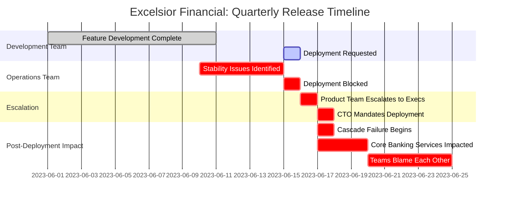

### Key Events and Impacts

| Date       | Event                              | Impact                                                                              |
| ---------- | ---------------------------------- | ----------------------------------------------------------------------------------- |
| 2023-06-01 | Feature development completed      | Development team accelerated new feature for investment platform.                   |
| 2023-06-10 | Stability issues identified        | Operations team flagged recent incidents affecting platform reliability.            |
| 2023-06-15 | Deployment request submitted       | Operations team blocked deployment due to risk concerns.                            |
| 2023-06-16 | Escalation to executive leadership | Product team argued delay would cost millions in revenue.                           |
| 2023-06-17 | CTO mandated deployment            | Deployment triggered a cascade failure across investment and core banking services. |
| 2023-06-20 | Post-incident blame and fallout    | Adversarial team dynamics worsened; no clear resolution.                            |

This example highlights how the lack of an error budget framework can lead to subjective, politically charged decision-making and catastrophic consequences. Instead of relying on objective metrics to balance innovation and reliability, teams fell into conflict, damaging trust and impacting both customer experience and financial outcomes.
### SRE Best Practice: Evidence-Based Investigation

Leading SRE organizations implement error budgets as an objective, data-driven framework for balancing innovation and reliability. The following step-by-step checklist outlines how to apply evidence-based investigation when managing error budgets:

#### Checklist: Evidence-Based Investigation Process

1. **Establish a Reliability Measurement Baseline**
   - Measure the actual reliability of each service against its SLO target.
   - Identify any "reliability debt" where services fall short of their stated targets.  
     *Example*: The investment platform was operating at 99.78% availability, below its 99.9% SLO.

2. **Calculate Error Budgets**
   - Translate SLO targets into concrete, measurable error budgets.
   - Define the allowable downtime for each service.  
     *Example*: A 99.9% SLO equates to 43.2 minutes of allowable downtime per month.

3. **Perform Change Impact Analysis**
   - Analyze historical deployment data to understand the reliability impact of various changes.
   - Quantify average error budget consumption for each type of change.  
     *Example*: Major feature deployments consumed an average of 12 minutes, while infrastructure changes used 8 minutes.

4. **Study Seasonal Variations**
   - Review incident data over time to detect patterns or seasonal trends.
   - Adjust operational strategies during high-risk periods.  
     *Example*: End-of-quarter periods had 2.3x higher incident rates, requiring more conservative deployment postures.

5. **Track Error Budget Consumption in Real-Time**
   - Use real-time tools to monitor error budget consumption.
   - Surface critical insights to guide deployment decisions.  
     *Example*: The investment platform had consumed 93% of its monthly error budget, prompting a pause on non-critical changes.

6. **Use Data to Align Teams**
   - Share findings with both development and operations teams to ensure transparency.
   - Base deployment and operational decisions on objective data rather than subjective opinions.

#### Summary Flowchart: Evidence-Based Investigation

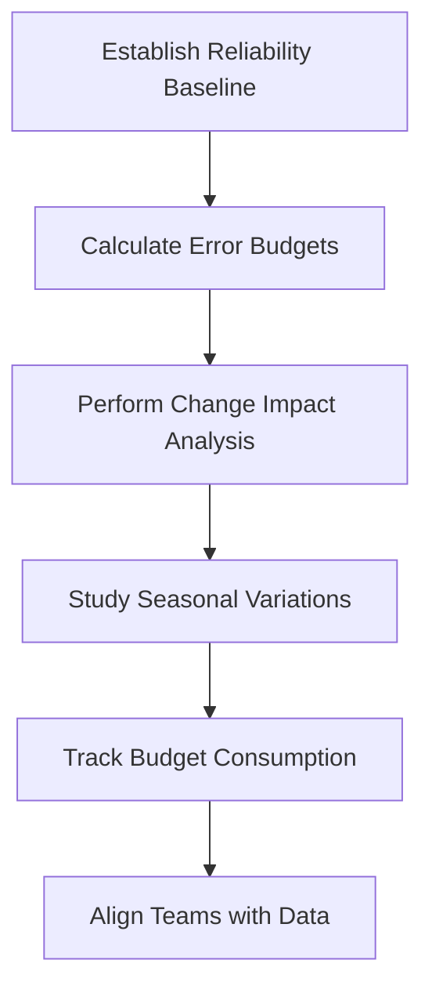

By following this checklist, SREs can ensure their investigations are structured, data-driven, and actionable. This approach fosters collaboration and supports informed decision-making, balancing innovation with reliability.
### Banking Impact

Operating without an error budget framework created significant business consequences, as summarized below:

| **Category**                   | **Impact Description**                                             | **Quantified Impact**                                                                        |
| ------------------------------ | ------------------------------------------------------------------ | -------------------------------------------------------------------------------------------- |
| **Service Disruption Costs**   | Failed investment platform deployment caused a major outage.       | 3.7-hour outage prevented ~$4.2M in transactions and generated 2,800+ support calls.         |
| **Development Inefficiency**   | Lack of deployment criteria led to prolonged release negotiations. | ~14 hours per sprint in contentious meetings, reducing delivery capacity by ~17%.            |
| **Operational Overhead**       | Excessive change management processes delayed deployments.         | Added ~8 days to deployment timelines, slowing time-to-market for competitive features.      |
| **Risk Management Failures**   | Inability to assess technical risks hindered regulatory reporting. | Inconsistent reporting to authorities, increasing regulatory scrutiny risks.                 |
| **Team Culture Deterioration** | Adversarial dynamics caused senior engineering attrition.          | 23% attrition rate among senior engineers, leading to knowledge gaps and reliability issues. |

The lack of an objective error budget framework forced the bank to make critical business decisions based on subjective opinions and organizational politics rather than data, undermining both innovation and reliability.
### Implementation Guidance
To implement effective error budgets for banking services, follow these steps:

1. **Establish Clear SLO Foundations**: Ensure every service has well-defined SLOs with appropriate targets before implementing error budgets. Calculate the specific error budget for each service by determining the allowable unreliability (e.g., a 99.9% SLO provides 43.2 minutes of "downtime budget" per month).

2. **Create Error Budget Policies**: Develop clear, documented policies for how error budgets will be used in decision-making. Include guidelines for when depleted budgets should restrict deployments, what exceptions are allowed, and how budget calculations reset (typically aligned with business reporting periods).

3. **Implement Real-Time Tracking**: Deploy the necessary measurement infrastructure to track error budget consumption in real-time. Create dashboards that make current budget status visible to all stakeholders, with appropriate alerting when consumption approaches defined thresholds (typically 50%, 75%, and 90%).

4. **Integrate With Release Processes**: Incorporate error budget checks into deployment workflows, change management processes, and release planning. Configure CI/CD pipelines to verify error budget status before proceeding with deployments, with appropriate approval workflows for exceptions.

5. **Educate and Empower Teams**: Train both development and operations teams on the error budget concept and its practical application. Empower teams to make data-driven decisions about deployment timing and risk management based on current budget status rather than requiring escalation to management.
## Panel 5: When Excellence Varies - Differentiated SLOs for Banking Services
### Scene Description

A service architecture diagram dominates a war room wall, visually dividing banking domains into tiers based on their SLO requirements. Each domain is color-coded, with core payment processing systems highlighted in red and annotated with "99.99%", while secondary and tertiary services are shown in progressively lighter shades, representing lower SLO targets (e.g., 99.9% for supporting services, 99.5% or lower for administrative functions). Below the architecture diagram, a risk assessment matrix is prominently displayed, showcasing how stricter SLOs correlate with more rigorous testing and deployment strategies.

The architecture diagram can be represented as follows:

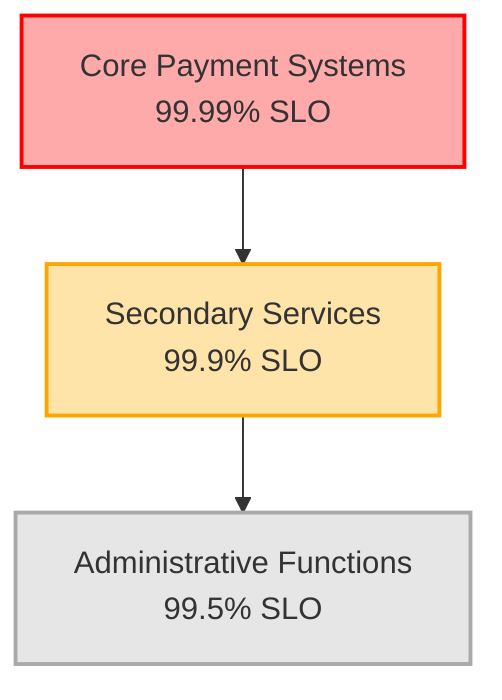

A team is shown conducting an impact analysis for a planned feature. Their decision-making process follows distinct paths based on the SLO tier of the affected service. For instance, systems within the "99.99%" tier demand comprehensive testing, redundancy validations, and a phased rollout. In contrast, lower-tier services undergo streamlined testing and simpler deployment procedures. The risk assessment matrix reinforces these workflows, illustrating how higher SLOs require proportionally greater engineering effort and safeguards.
### Teaching Narrative
Not all banking services require the same level of reliability, and differentiated SLOs reflect this reality. Attempting to maintain uniformly high reliability across all systems is both technically impractical and economically inefficient. The strategic approach is to create a tiered SLO framework where reliability requirements align with business criticality. Core transaction services that directly handle customer money generally warrant the highest SLOs (99.99% or higher), while supporting services like account preferences or personalization features might target 99.9%. Administrative or back-office functions may function adequately at 99.5% or lower. These differentiated targets enable focused investment of engineering resources where they deliver the greatest customer and business value. For financial institutions, this tiered approach should consider factors beyond immediate customer impact, including regulatory requirements, downstream dependencies, and recovery capabilities. The real power of differentiated SLOs comes from how they inform architectural decisions - critical high-SLO services warrant additional redundancy, isolation, and resilience mechanisms that would be overengineering for lower-tier services. This approach creates clarity around reliability expectations across the organization and ensures proportional effort in building and maintaining different services.
### Common Example of the Problem

Heritage Banking Group struggled with their "reliability at all costs" mandate. Following a major outage covered in financial news, executive leadership decreed that all systems must maintain "four nines" (99.99%) availability. This blanket policy created significant challenges for the technology organization.

The investment required to bring all 47 banking services to this reliability level was enormous—approximately $14.3 million in infrastructure improvements alone. The mortgage application system, used primarily during business hours and processing only 30-40 applications daily, required the same expensive redundancy as the core payment platform handling millions of real-time transactions. Meanwhile, critical ATM and payment card services that truly needed ultra-high reliability received the same engineering resources as internal reporting tools, creating an inefficient allocation of limited resources.

The uniform SLO approach also created deployment bottlenecks. All services, regardless of criticality, required the same extensive pre-deployment testing and gradual rollout procedures. This slowed the release of competitive features in less critical services while providing no additional protection for truly mission-critical functions.

| **Aspect**                 | **Uniform SLO Approach**                                                          | **Differentiated SLO Approach**                                                           |
| -------------------------- | --------------------------------------------------------------------------------- | ----------------------------------------------------------------------------------------- |
| **Total Cost**             | $14.3 million for infrastructure upgrades                                         | $8.7 million, with resources focused on critical services                                 |
| **Deployment Speed**       | Slowed for all services due to identical testing and rollout requirements         | Faster for non-critical services; critical services receive tailored processes            |
| **Resource Allocation**    | Equal allocation across all services, regardless of importance                    | Proportional allocation based on business criticality                                     |
| **Customer Impact**        | Limited improvement for critical services; overengineering for low-impact systems | High reliability where it matters most; cost-effective handling of less critical services |
| **Engineering Efficiency** | Wasted effort on low-priority systems                                             | Focused effort on systems delivering maximum business value                               |

This comparison highlights the inefficiency and ineffectiveness of a one-size-fits-all reliability mandate. A differentiated SLO framework allows banking organizations to target their investments, improve deployment flexibility, and maximize the impact of engineering resources. For Heritage Banking Group, adopting such an approach could have avoided unnecessary costs while ensuring mission-critical systems met their reliability needs.
### SRE Best Practice: Evidence-Based Investigation

Leading SRE organizations implement differentiated SLOs based on systematic service classification and impact analysis. Below is a five-step checklist to guide evidence-based investigation when defining differentiated SLOs:

#### Checklist for Evidence-Based Investigation

1. **Service Criticality Assessment**
   - Evaluate all services against consistent criteria: transaction volume, financial impact of failures, customer visibility, regulatory requirements, and recovery complexity.
   - Identify which services genuinely require "four nines" (99.99%) or higher reliability.

2. **Business Impact Modeling**
   - Analyze historical incident data to quantify the financial and operational impact of outages for each service.
   - Use concrete metrics, e.g., cost of a 1-hour outage, to prioritize reliability targets based on business impact.

3. **Customer Journey Mapping**
   - Trace key customer journeys to identify services directly affecting customer experience.
   - Highlight services where customer visibility or user experience demands higher reliability, even if transaction volume is lower.

4. **Regulatory Requirement Analysis**
   - Review all applicable regulatory requirements to identify mandates for specific services (e.g., financial reporting, logging systems).
   - Ensure compliance-related systems meet externally imposed reliability standards, independent of customer-facing considerations.

5. **Cost-to-Serve Analysis**
   - Calculate the incremental cost of achieving various reliability levels for each service.
   - Use cost curves to determine the point of diminishing returns, ensuring investments in reliability deliver optimal business value.

#### Example Workflow

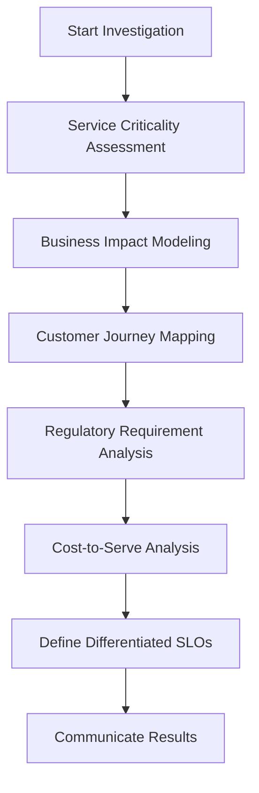

This evidence-based approach provides a structured foundation for creating a differentiated SLO framework tailored to actual business needs. By leveraging this checklist, teams can align reliability efforts with organizational priorities and avoid arbitrary or over-engineered standards.
### Banking Impact

The uniform reliability approach created significant business consequences, as illustrated below:

```
  Misallocated Resources
        |
        v
+------------------------+
| Overinvestment in non- |
| critical systems       |
+------------------------+
        |
        v
+------------------------+
| Underinvestment in     |
| customer-facing        |
| innovations            |
+------------------------+
        |
        v
+------------------------+
| Reduced Competitive    |
| Edge                   |
+------------------------+
```

1. **Misallocated Engineering Investment**: Heritage Bank invested approximately $5.7 million in raising reliability for non-critical internal systems that delivered minimal business value, while under-investing in customer-facing payment innovations that could have generated new revenue streams.

```
  Extended Time-to-Market
        |
        v
+------------------------+
| Uniform change         |
| management delays      |
+------------------------+
        |
        v
+------------------------+
| Delayed competitive    |
| features               |
+------------------------+
        |
        v
+------------------------+
| Market share loss      |
| (1.8%) to agile        |
| competitors            |
+------------------------+
```

2. **Extended Time-to-Market**: The uniform change management process added an average of 12 days to deployment timelines for all services, regardless of criticality. This delayed multiple competitive features in digital banking and wealth management, contributing to a 1.8% loss in market share to more agile competitors.

```
  Operational Complexity
        |
        v
+------------------------+
| 24/7 on-call for all   |
| services               |
+------------------------+
        |
        v
+------------------------+
| Higher costs ($1.2M/yr)|
| and engineer turnover  |
| (27%)                  |
+------------------------+
```

3. **Operational Complexity**: Maintaining uniform high reliability across all services required 24/7 on-call rotations for all 12 engineering teams, leading to increased operational costs of approximately $1.2 million annually and contributing to a 27% increase in engineer turnover.

```
  Regulatory Compliance Risks
        |
        v
+------------------------+
| Generic reliability    |
| approach fails to      |
| address specific needs |
+------------------------+
        |
        v
+------------------------+
| Incidents in critical  |
| compliance services    |
+------------------------+
```

4. **Regulatory Compliance Risks**: Despite the focus on uniform reliability, several regulatory compliance services still experienced incidents because the generic approach didn't address their specific requirements for data integrity and reporting timeliness.

```
  Infrastructure Overcapacity
        |
        v
+------------------------+
| Redundant resources    |
| for low-priority       |
| services               |
+------------------------+
        |
        v
+------------------------+
| Unnecessary costs      |
| ($900K annually)       |
+------------------------+
```

5. **Infrastructure Overcapacity**: The bank maintained expensive redundant infrastructure for services with minimal actual reliability requirements, resulting in an estimated 37% overcapacity in certain environments and unnecessary cloud computing costs exceeding $900,000 annually.

Through these missteps, Heritage Bank realized that their well-intentioned but undifferentiated reliability approach was not only wasting resources but actually increasing business risk by diverting attention from truly critical services.
### Implementation Guidance

To implement differentiated SLOs for banking services, follow these steps:

1. **Create a Service Tiering Framework**: Develop a structured methodology for classifying services into distinct reliability tiers. Include criteria such as direct financial impact, customer visibility, transaction volume, regulatory requirements, and recovery complexity. For banking systems, a typical framework includes:
   - **Tier 1**: Core transaction processing
   - **Tier 2**: Customer-facing services
   - **Tier 3**: Internal/administrative functions

2. **Assign Appropriate SLO Targets by Tier**: Establish differentiated reliability targets based on service tier. A typical banking framework might use:
   - **Tier 1**: 99.99% availability (52 minutes downtime per year)
   - **Tier 2**: 99.9% availability (8.8 hours downtime per year)
   - **Tier 3**: 99.5% availability (43.8 hours downtime per year)

   Adjust these targets based on your specific business context and technical capabilities.

3. **Align Engineering Practices with Service Tiers**: Develop tier-appropriate engineering standards that match the reliability requirements. For example:
   - **Tier 1 services**: Fully redundant active-active deployments across multiple regions
   - **Tier 3 services**: Simpler active-passive configurations

   Document these standards to ensure consistent implementation.

4. **Implement Tiered Change Management**: Create differentiated deployment and change management processes based on service tier:
   - **Tier 1 services**: Extensive pre-deployment testing and gradual rollout procedures
   - **Tier 3 services**: Streamlined processes to enable faster innovation

5. **Review and Adjust Periodically**: Establish a quarterly review process to reassess service classifications and SLO targets. As business priorities shift, customer behavior changes, or regulatory requirements evolve, service tiers should be adjusted accordingly. This ensures your reliability investments remain aligned with current business needs rather than becoming fixed and outdated.

#### Visualizing the Tiering Framework

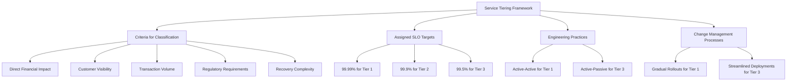

This diagram provides a high-level view of how the tiering framework connects service classification criteria, SLO targets, engineering practices, and change management processes, ensuring alignment across all aspects of implementation.
## Panel 6: Measuring What Matters - SLO Implementation in Banking Systems
### Scene Description

A technical implementation session where SREs are collaborating with platform engineers to configure monitoring systems for SLO measurement. The environment is dynamic, with multiple screens displaying key elements of the system:

- **Monitoring Dashboards**: Visualizing live reliability metrics, error budgets, and historical trends.
- **Code Snippets**: Showing instrumentation for telemetry collection and transformation.
- **Data Pipelines**: Mapping the flow of raw telemetry data into meaningful SLIs.

One engineer demonstrates how raw telemetry data from payment gateways is aggregated, filtered, and transformed into customer-centric SLIs. Another is designing alert rules with varying thresholds: one for immediate response to critical issues and another for monitoring error budget burn rates. A whiteboard displays annotated challenges unique to distributed financial transactions, including:

- "Choosing the right service boundaries"
- "Correlating customer impact"

The session's technical interactions can be summarized with the following visual representation:

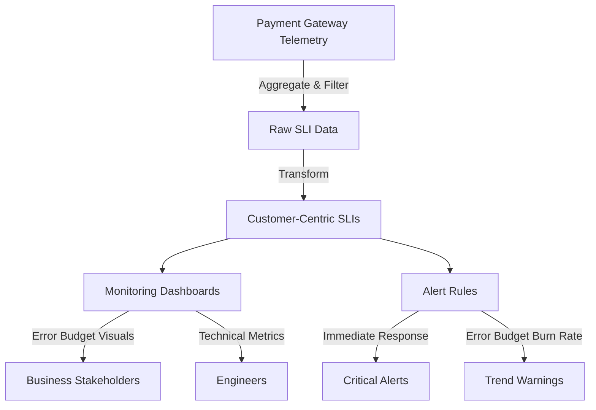

This diagram captures the flow of data from telemetry collection through transformation into actionable SLIs, and highlights how these metrics are consumed by both technical and business stakeholders. It also shows the dual-path alerting logic designed for immediate response and longer-term trend analysis. The goal is to create a self-service platform where reliability metrics are easily accessible and actionable for all involved parties.
### Teaching Narrative

Implementing effective SLO measurement requires thoughtful instrumentation and data engineering. In banking systems, the journey from raw telemetry data to meaningful reliability metrics presents unique challenges. First, measurement boundaries must be carefully defined - does a transaction SLO cover only the payment gateway or include downstream processing systems? Second, measurement methodology matters - is a payment considered successful only when the money moves, or when appropriate confirmation reaches the customer? Third, sampling strategies must balance accuracy against performance overhead, particularly for high-volume financial services. The most robust implementation approaches combine multiple measurement methods: synthetic transactions that simulate customer actions, real user monitoring that captures actual customer experience, and infrastructure metrics that provide supporting technical context. Banking SLO implementations must also consider data retention requirements for compliance and auditability, often necessitating longer storage of reliability metrics than typical monitoring data. The technical implementation should automate not only the collection of SLI data but also the calculation of error budgets, visualization of trends, and alerting on significant deviations. The goal is creating a self-service platform where both technical and business stakeholders can understand current reliability status and historical patterns without specialized knowledge.

#### Implementation Checklist

To guide effective SLO implementation in banking systems, consider the following checklist:

1. **Define Measurement Boundaries**
   - Identify the scope of the SLO (e.g., payment gateway only vs. entire transaction chain).
   - Ensure service boundaries align with customer impact and business objectives.

2. **Establish Measurement Methodologies**
   - Define what constitutes success (e.g., money movement vs. customer confirmation).
   - Align SLIs to customer-centric outcomes.

3. **Select Sampling Strategies**
   - Balance accuracy requirements with performance overhead.
   - Use representative sampling for high-volume systems to avoid undue load.

4. **Combine Multiple Measurement Methods**
   - Implement synthetic transactions to simulate customer behavior.
   - Use real user monitoring to capture actual experiences.
   - Leverage infrastructure metrics for supporting context.

5. **Incorporate Compliance and Auditability Requirements**
   - Ensure data retention policies meet regulatory needs.
   - Store reliability metrics for longer periods compared to standard monitoring data.

6. **Automate Key Processes**
   - Automate SLI data collection and error budget calculations.
   - Set up visualizations for trends and historical analysis.
   - Configure alerting mechanisms for deviations and error budget burn rates.

7. **Enable Self-Service Platforms**
   - Design dashboards accessible to both technical and business stakeholders.
   - Provide clear, actionable insights without requiring specialized knowledge.

By following this checklist, teams can streamline the implementation of SLOs, ensuring banking systems achieve meaningful reliability metrics that align with customer and business needs.
### Common Example of the Problem
Global Commerce Bank struggled with their initial SLO implementation. Despite defining clear SLOs for critical services, their measurement methodology created significant blind spots. Their payment processing SLO tracked "API endpoint availability" rather than complete transaction success. This led to a critical incident where the API endpoints responded with success codes while actual transactions were failing to complete due to a downstream database issue.

During a high-volume trading day, the system reported 99.98% availability while customers experienced widespread transaction failures. Customer service was flooded with complaints while the operations team insisted all systems were operating normally, pointing to their SLO dashboard. The disconnect created confusion, delayed incident response, and eroded trust in the reliability framework.

The root issue was a measurement implementation that tracked technical components rather than customer outcomes. The bank learned the hard way that an SLO is only as good as its implementation—measuring the wrong things perfectly is worse than measuring the right things imperfectly.
### SRE Best Practice: Evidence-Based Investigation

Leading SRE organizations develop robust measurement implementations through careful analysis and validation. The table below summarizes key practices, their descriptions, and outcomes:

| **Practice**                                  | **Description**                                                                                                                                                        | **Outcome**                                                                                                                                                     |
| --------------------------------------------- | ---------------------------------------------------------------------------------------------------------------------------------------------------------------------- | --------------------------------------------------------------------------------------------------------------------------------------------------------------- |
| **End-to-End Transaction Tracing**            | Implementing distributed tracing across the payment processing stack to measure transaction success from initiation to final settlement confirmation.                  | Revealed a gap between API endpoint availability (99.98%) and complete transaction success (94.3%), highlighting areas below the 99.9% SLO target.              |
| **Multi-Perspective Measurement Correlation** | Combining synthetic transactions, real user monitoring, and infrastructure metrics to analyze customer journeys and identify blind spots in monitoring.                | Correlation analysis helped uncover specific blind spots missed by individual measurement methods, improving overall monitoring coverage.                       |
| **Failure Mode Analysis**                     | Introducing controlled failures in test environments to identify which failure types were detected or missed by current measurement implementations.                   | Identified gaps where service unavailability was detected, but degraded performance and partial failures were not, prompting improvements in failure detection. |
| **Statistical Validity Assessment**           | Reviewing sampling methodologies to ensure sufficient statistical significance, particularly for high-volume transaction flows with low-frequency, high-impact issues. | Found that a 0.1% sampling rate was insufficient, leading to adjustments for increased accuracy in detecting rare but critical issues.                          |
| **Business Correlation Validation**           | Correlating SLI measurements with business impact metrics like customer support tickets, transaction abandonment rates, and revenue impact.                            | Exposed gaps where technical metrics failed to align with business outcomes, enabling adjustments to prioritize customer-centric reliability metrics.           |

This evidence-based approach enabled the team to design a measurement implementation that accurately reflects customer experience rather than just technical status.
### Banking Impact

Inadequate SLO measurement implementation created significant business consequences. The following summarizes the key impacts:

#### Consequences Breakdown:
- **Extended Incident Duration**
  - Incident went undetected for 47 minutes, identified only through customer complaints.
  - Resulted in $3.7 million in failed transactions.

- **Customer Trust Erosion**
  - Disconnect between system status and actual customer experience.
  - Customer satisfaction scores for digital banking dropped by 17 percentage points.

- **Regulatory Scrutiny**
  - Inaccurate performance measurement triggered additional reporting requirements.
  - Led to an external audit costing approximately $380,000 in compliance efforts.

- **Misallocated Engineering Resources**
  - $1.2 million invested in optimizing API infrastructure that was not the root issue.
  - Resource allocation was driven by flawed reliability data.

- **Data-Driven Decision Failures**
  - Platform investment, feature prioritization, and risk management decisions were based on unreliable metrics.
  - Resulted in suboptimal strategic outcomes.

#### Key Takeaway:
The bank discovered that implementing SLOs with flawed measurement methodology created more risk than having no SLOs at all, as it provided false confidence in system reliability.

#### Text Representation of Impacts:
```plaintext
+----------------------+
|  Inadequate SLOs     |
+----------------------+
          |
          v
  +----------------+
  | Extended       |--> $3.7M failed transactions
  | Incident       |--> 47-minute detection delay
  | Duration       |
  +----------------+
          |
          v
  +----------------+
  | Customer Trust |--> -17% satisfaction score
  | Erosion        |
  +----------------+
          |
          v
  +----------------+
  | Regulatory     |--> $380K compliance cost
  | Scrutiny       |
  +----------------+
          |
          v
  +----------------+
  | Misallocated   |--> $1.2M wasted investment
  | Resources      |
  +----------------+
          |
          v
  +----------------+
  | Data-Driven    |--> Suboptimal decisions made
  | Decision       |--> False confidence in reliability
  | Failures       |
  +----------------+
```
### Implementation Guidance

To implement effective SLO measurement for banking services, follow these steps:

1. **Define Clear Measurement Specifications**: For each SLI, document precisely what constitutes a successful versus failed event, including specific criteria, measurement points, and exclusions. For example, a payment transaction SLI might specify:

   ```
   PaymentTransactionSLI = {
       "name": "payment_success_rate",
       "description": "Percentage of payments completed within 3 seconds",
       "success_criteria": "time_to_complete <= 3s AND status == 'confirmed'",
       "exclusions": ["maintenance_window", "invalid_customer_input"]
   }
   ```

2. **Implement Multi-Layer Measurement**: Deploy three complementary measurement approaches for comprehensive coverage:
   - **Synthetic Transactions**: Simulate customer journeys at regular intervals using tools like Puppeteer or Selenium.
   - **Real User Monitoring (RUM)**: Capture actual customer interactions by embedding JavaScript instrumentation in web applications or using mobile SDKs.
   - **Infrastructure Metrics**: Extract technical context from components such as databases and API gateways.

   Example of a synthetic transaction script:
   ```javascript
   const puppeteer = require('puppeteer');

   async function simulatePayment() {
       const browser = await puppeteer.launch();
       const page = await browser.newPage();

       await page.goto('https://banking.example.com/payment');
       await page.type('#account', '12345678');
       await page.type('#amount', '100.00');
       await page.click('#submit');
       await page.waitForResponse(response => response.url().includes('/confirmation') && response.status() === 200);

       console.log('Synthetic transaction completed successfully');
       await browser.close();
   }

   simulatePayment();
   ```

3. **Establish Statistical Validity**: Determine appropriate sampling rates for high-volume services based on statistical significance calculations. For critical financial services, aim for at least 5% sampling of production traffic. Use tools like Apache Beam or Spark for large-scale sampling and aggregation.

   Example sampling logic in Python:
   ```python
   import random

   def sample_transactions(transactions, sample_rate=0.05):
       return [txn for txn in transactions if random.random() < sample_rate]
   ```

4. **Build Aggregation Pipelines**: Develop data processing pipelines that transform raw telemetry data into meaningful SLIs. Use stream processing frameworks like Kafka Streams or Flink for real-time aggregation and filtering.

   Example Kafka Streams topology:
   ```java
   StreamsBuilder builder = new StreamsBuilder();
   KStream<String, PaymentEvent> payments = builder.stream("payment-events");

   KStream<String, SLI> sliStream = payments
       .filter((key, event) -> event.getStatus().equals("confirmed"))
       .mapValues(event -> new SLI("payment_success", event.getDuration() <= 3000))
       .groupByKey()
       .windowedBy(TimeWindows.of(Duration.ofMinutes(1)))
       .aggregate(SLI::new, (key, event, aggregate) -> aggregate.update(event));

   sliStream.to("sli-metrics");
   ```

5. **Create Tiered Alerting Framework**: Implement a multi-level alerting strategy based on SLO performance:
   - **Urgent Alerts**: Trigger when services are significantly outside SLO parameters and require immediate response.
   - **Burn Rate Alerts**: Trigger when error budgets are being consumed faster than expected but don't require immediate action.
   - **Trend Alerts**: Trigger to identify slow degradations before they impact customers.

   Example alert rule configuration in Prometheus:
   ```yaml
   groups:
     - name: SLO_Alerts
       rules:
         - alert: UrgentAlert
           expr: error_budget_burn_rate > 2
           for: 5m
           labels:
             severity: critical
           annotations:
             summary: "Urgent: Error budget burn rate exceeds threshold"
         - alert: BurnRateAlert
           expr: error_budget_burn_rate > 1
           for: 30m
           labels:
             severity: warning
           annotations:
             summary: "Warning: Error budget burn rate is elevated"
         - alert: TrendAlert
           expr: slo_degradation_rate > 0.1
           for: 1h
           labels:
             severity: info
           annotations:
             summary: "Info: Slow degradation detected in SLO performance"
   ```
## Panel 7: From Metrics to Culture - SLOs as Organizational Alignment
### Scene Description

The quarterly business review meeting brings together technical and business leaders to evaluate SLO performance across key banking services. The room is arranged to encourage collaboration and discussion:

- **Participants**: The CEO, product managers, technical leads, SREs, and business analysts.
- **Screens**:
  - Screen 1 displays a dashboard correlating historical SLO performance with business metrics such as customer satisfaction scores, retention rates, and revenue trends.
  - Screen 2 highlights a timeline showing the organization's progression from reactive incident management to proactive reliability engineering.
- **Meeting Notes**: Visible on a shared tablet or document are agenda items like "Q3 error budget planning" and "reliability investment prioritization".

The CEO leads the session by asking insightful questions about reliability trends. Product teams present upcoming features, explicitly addressing their estimated reliability impacts. The following diagram illustrates the meeting setup:

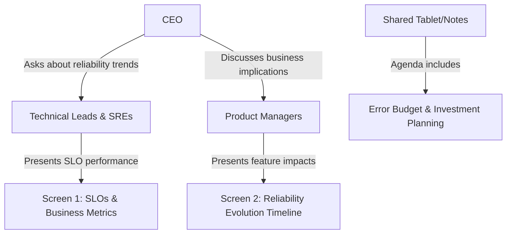

This setup ensures a holistic discussion where reliability is framed as a shared responsibility and a strategic business asset, fostering alignment across all stakeholders.
### Teaching Narrative
The true power of SLOs in financial services emerges when they evolve from technical metrics to cultural cornerstones that align the entire organization. Mature SLO implementations become a common language that bridges technical and business domains, creating shared understanding and accountability for reliability. This alignment manifests in how the organization makes decisions: product roadmaps that explicitly account for reliability impacts, feature prioritization that balances innovation with stability, and investment decisions that appropriately fund infrastructure resilience. For banking institutions, SLOs become particularly powerful when connected to business outcomes like customer satisfaction, retention, and regulatory compliance. This connection transforms reliability from a technical concern to a strategic business asset. The cultural shift is evident when business leaders spontaneously ask about error budget status before pushing for accelerated feature delivery, or when developers proactively consider reliability implications in their design decisions. In the most mature organizations, SLOs become the framework through which everyone understands the reliability-innovation tradeoff, replacing subjective opinions with objective measurement and creating a foundation for truly reliable financial services that earn and maintain customer trust.
### Common Example of the Problem

Meridian Bank had successfully implemented SLOs from a technical perspective. They had appropriate targets, accurate measurements, and functional dashboards. However, the SLO framework remained largely confined to the technical organization with minimal influence on broader business decisions.

This disconnect became evident during the launch planning for their new wealth management platform. Product management had committed to an aggressive launch date to coincide with a major marketing campaign. When the SRE team raised concerns about reliability readiness based on pre-production testing results showing the platform would likely violate its SLO targets, they were overruled. A senior executive commented, "We can't miss this market window—we'll fix any reliability issues after launch."

The result was predictable: the platform launched on schedule but experienced significant reliability issues, with availability dropping to 98.7% against a 99.9% SLO target. Customer acquisition fell 47% below projections as potential clients encountered errors during onboarding. The marketing campaign generated high interest but poor conversion as the platform failed to deliver a reliable experience.

Without organizational alignment around reliability as a business priority, technically sound SLOs failed to influence critical business decisions.

#### Timeline of Events

| **Event**                   | **Details**                                                                                   | **Impact**                                                                                    |
| --------------------------- | --------------------------------------------------------------------------------------------- | --------------------------------------------------------------------------------------------- |
| **Pre-launch testing**      | SRE team identified reliability risks based on pre-production testing, likely SLO violations. | Risks were communicated, but concerns were dismissed to prioritize marketing campaign timing. |
| **Launch date**             | Wealth management platform launched to coincide with aggressive marketing schedule.           | Platform immediately experienced reliability issues, violating SLO targets.                   |
| **Post-launch reliability** | Availability dropped to 98.7%, below the 99.9% SLO target.                                    | Customers experienced errors during onboarding, undermining trust and usability.              |
| **Customer acquisition**    | Marketing campaign generated high interest but poor conversion.                               | Customer acquisition fell 47% below projections.                                              |
| **Outcome**                 | Misalignment between technical and business priorities led to failed organizational goals.    | Highlighted need for SLOs as a cultural and decision-making framework.                        |
### SRE Best Practice: Evidence-Based Investigation

Leading SRE organizations build reliability-centric cultures through systematic alignment practices. The following checklist summarizes key steps for implementing an evidence-based investigation approach to connect reliability with business outcomes:

#### Checklist: Steps for Evidence-Based Investigation
1. **Conduct Business Impact Correlation Analysis**
   - Identify and correlate reliability metrics (e.g., availability, latency) with key business outcomes such as customer satisfaction, revenue, and operational costs.
   - Example: Analyze how a 0.1% drop in availability below SLO targets impacts customer behaviors (e.g., application completion rates) and cost metrics (e.g., increased support costs).

2. **Develop Reliability Economics Models**
   - Quantify the financial implications of achieving specific reliability levels versus the cost of falling short.
   - Example: Model the cost of reliability issues, such as $2.4 million in lost client acquisition revenue due to platform downtime.

3. **Incorporate Customer Experience Research**
   - Use structured research methods (e.g., surveys, interviews) to understand how customers prioritize reliability within the context of your services.
   - Example: Rank reliability as a competitive factor, showing its importance relative to security, features, or interface design.

4. **Analyze Decision-Making Processes**
   - Map how reliability data is used (or overlooked) in organizational decisions, such as product roadmaps, marketing strategies, and feature prioritization.
   - Example: Identify gaps where reliability insights are not integrated into business planning timelines.

5. **Facilitate Cross-Functional Workshops**
   - Organize collaborative sessions with product, marketing, executive, and engineering teams to align on reliability metrics and their business implications.
   - Example: Use workshops to establish SLOs as a shared decision-making framework across departments.

#### Evidence-Based Investigation Workflow
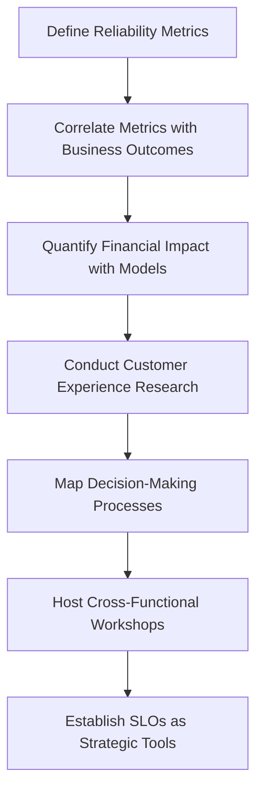

By systematically following this approach, SRE teams can transform SLOs from technical metrics into strategic business tools that inform decisions at all levels, fostering a culture of shared accountability and alignment.
### Banking Impact

The lack of organizational alignment around reliability created significant business consequences. The following table summarizes the financial, reputational, and operational impacts:

| **Category**               | **Impact Description**                                                                                                                                  | **Quantifiable Impact**                                       |
| -------------------------- | ------------------------------------------------------------------------------------------------------------------------------------------------------- | ------------------------------------------------------------- |
| **Financial**              | Launch failure of the wealth management platform due to reliability issues.                                                                             | $3.8M in lost revenue; $780K in emergency engineering costs.  |
| **Reputational**           | Industry publications criticized platform reliability, damaging the bank's brand as a technology leader and affecting customer trust in other products. | Decline in customer confidence and broader market perception. |
| **Leadership Credibility** | Disconnect between pre-launch warnings and outcomes eroded executive trust in the technology organization.                                              | Increased skepticism of future technical assessments.         |
| **Engineering Morale**     | Launch decisions undervaluing reliability led to senior engineer attrition, creating staffing gaps and compounding reliability challenges.              | Higher attrition rates and slower progress on improvements.   |
| **Operational Efficiency** | Misaligned investment priorities undervalued infrastructure resilience, leading to escalating technical debt and operational costs.                     | 23% year-over-year increase in operational costs.             |

The bank discovered that without organizational alignment around reliability as a business priority, even technically perfect SLOs couldn't deliver their intended benefits. This misalignment not only hindered immediate technical outcomes but also had cascading effects on the bank's financial performance, market positioning, and internal operations.
### Implementation Guidance

To build an SLO-centric culture that aligns the entire organization, follow these steps. The process is illustrated in the accompanying flowchart for clarity:

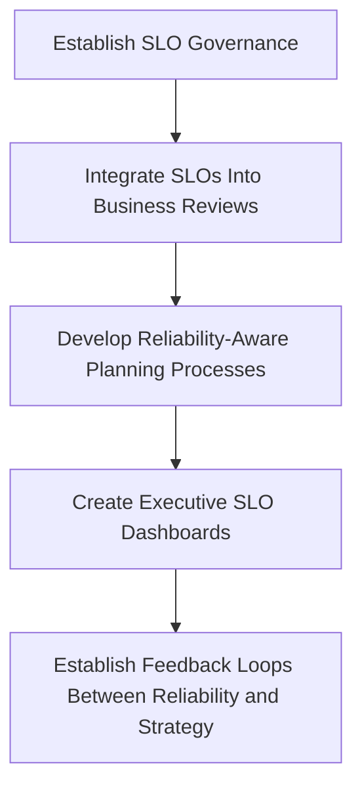

1. **Establish SLO Governance**:  
   Create a cross-functional SLO governance body with representation from engineering, product, operations, customer support, and executive leadership. This group should:
   - Review SLO performance.
   - Approve target changes.
   - Ensure reliability considerations are integrated into business planning cycles.

2. **Integrate SLOs Into Business Reviews**:  
   Make reliability metrics a standard component of all business review meetings, alongside traditional metrics like revenue, customer acquisition, and feature delivery. Display SLO performance and error budget status in business-friendly terms that connect technical reliability to customer experience and financial outcomes.

3. **Develop Reliability-Aware Planning Processes**:  
   Implement planning processes that explicitly account for reliability impact:
   - Product roadmaps should include both feature development and reliability investments.
   - Launch readiness assessments should incorporate SLO-based certification criteria that can trigger go/no-go decisions.

4. **Create Executive SLO Dashboards**:  
   Develop executive-friendly reliability dashboards that translate technical SLO metrics into business impact terms. These dashboards should include:
   - Current reliability status.
   - Trends over time.
   - Comparisons to targets.
   - Correlation with business metrics like customer satisfaction, revenue, and operational costs.

5. **Establish Feedback Loops Between Reliability and Strategy**:  
   Create formal mechanisms for reliability insights to influence business strategy. This includes:
   - Incorporating SLO performance into quarterly business planning.
   - Using reliability data to inform competitive positioning.
   - Allocating investment based on reliability ROI analysis.
   - Ensuring major business decisions explicitly consider reliability impact as a standard evaluation criterion.