# Chapter 10: Building Resilient Banking Systems

## Chapter Overview

Welcome to the SRE equivalent of a banking boot camp, where “resilience” isn’t some hand-wavy buzzword—it’s the difference between operational survival and public humiliation. Forget green dashboards and feel-good uptime reports. This chapter is your guided tour through the seven deadly sins of banking fragility, and how to actually engineer for the inevitable: things breaking, people panicking, and regulators circling like sharks. If you think resilience is a feature you can bolt on after launch, prepare to have your illusions shattered—along with your next quarterly bonus if you get this wrong. Here, we’re not patching holes after the ship springs a leak. We’re building ships that can take a torpedo, stay afloat, and still deliver champagne to the VIP lounge. Welcome to resilience the way only SREs can deliver: blunt, empirical, and always business-critical.

---
## Learning Objectives

- **Diagnose** systemic fragility in banking systems using evidence-based analysis instead of post-mortem bingo.
- **Map** system dependencies and identify failure modes before they become tomorrow’s headline.
- **Engineer** resilience with patterns like circuit breakers, chaos testing, and disaster recovery as code—because hope is not a strategy.
- **Quantify** risk and resilience debt to prioritize investments that actually move the business reliability needle.
- **Integrate** regulatory requirements with technical controls so compliance stops being a last-minute scramble.
- **Automate** disaster recovery and resilience tests so “it worked in staging” isn’t your corporate epitaph.
- **Cultivate** a blameless, learning-driven culture that makes near-misses more valuable than “heroic” firefighting.
- **Correlate** observability data with real business outcomes so you spot trouble before the CFO does.

---
## Key Takeaways

- Banking resilience is a blood sport, not a checkbox. If you’re still “green on the dashboards,” you’re probably green behind the ears.
- Every incident ignored or covered up is a future headline waiting to happen—and regulators love headlines.
- Chaos engineering isn’t just for Netflix. In banking, it’s your only shot at finding what blows up before customers (and auditors) do.
- Circuit breakers aren’t optional—they’re the difference between losing a service and losing the entire platform. Screw this up, and your competitors will thank you for the new clients.
- Regulatory resilience isn’t just paperwork—align it with your tech or prepare to spend your weekends fixing “findings.”
- Observability without business context is just noise. If your monitoring can’t tell you which customers are bleeding, you’re playing reliability roulette.
- Manual DR runbooks are the corporate equivalent of a fire drill with locked exits. Automate, or expect to fail when it matters.
- A blame culture is a shortcut to burnout, turnover, and seven-figure “investments” in the wrong places. Celebrate learning, or repeat your mistakes until someone else gets your job.
- SREs who treat resilience as an afterthought become historians, not engineers. Build for failure, or you’re just building your next investigation.

---

Now, go apply this before your next outage makes the news.

---
## Panel 1: Beyond Reactive Fixes - Designing for Resilience
### Scene Description

A diverse group of engineers is gathered in a modernized war room equipped with state-of-the-art interactive displays. The centerpiece of the room is a large 3D visualization of the bank's complex distributed system architecture, projected onto a central table. This visualization dynamically illustrates transaction flows across various banking services, highlighting dependencies and potential bottlenecks. Surrounding this, the walls are adorned with digital panels, one of which features a timeline of past incidents. Each incident is color-coded to indicate the resilience improvements implemented afterward, forming a visual narrative of the system's evolution.

At the front of the room, a senior SRE stands near a display, pointing out critical failure points in the architecture. The engineers, a mix of development and infrastructure team members, take detailed notes and actively discuss potential mitigations. Below is a simplified text-based representation of the room's layout for clarity:

```
+-------------------------+-------------------------+-------------------------+
|                                                             TIMELINE PANEL                                              |
|        (Past incidents with color-coded resilience improvements)        |
+--------------------------------------------------------------------------+

+-------------+       +----------------+       +-------------+
|  Dev Team   |       |    3D System   |       | Infra Team  |
|  Members    |       | Visualization  |       |  Members    |
|             |       |  (Transaction  |       |             |
|             |       |     Flows)     |       |             |
+-------------+       +----------------+       +-------------+

                          SENIOR SRE
                     (Pointing to failure points)
```

This proactive setting signifies a shift in engineering culture, moving beyond reactive firefighting to designing for resilience. The visual tools and collaborative atmosphere empower teams to anticipate failures and ensure the system can adapt and maintain functionality under stress.
### Teaching Narrative
The transition from reactive incident response to proactive resilience engineering represents the pinnacle of SRE maturity. While previous chapters equipped you with tools to detect, diagnose, and repair banking system failures, true reliability comes from designing systems that maintain functionality despite inevitable component failures. Resilience engineering shifts focus from "fixing quickly" to "continuing to operate through failure." This mindset change means acknowledging that in complex distributed systems like modern banking platforms, failures are normal, not exceptional. The goal isn't perfect stability—it's controlled adaptability.

In traditional banking operations, teams often celebrate long periods without incidents. However, this "green dashboard" mentality can mask fragility. Truly resilient systems have experienced and survived numerous failures, with each one strengthening the system's ability to withstand future disruptions. As Werner Vogels, Amazon's CTO famously said, "Everything fails, all the time." In financial services, where system availability directly impacts customer trust and regulatory compliance, designing for resilience isn't optional—it's imperative.
### Common Example of the Problem

#### Incident Timeline: GlobalBank's Payment Processing Failures

During a six-month period, GlobalBank's payment processing platform suffered three major outages. Each incident followed a similar trajectory, highlighting a pattern of reactive responses rather than proactive resilience. Below is a timeline illustrating the sequence of events and responses:

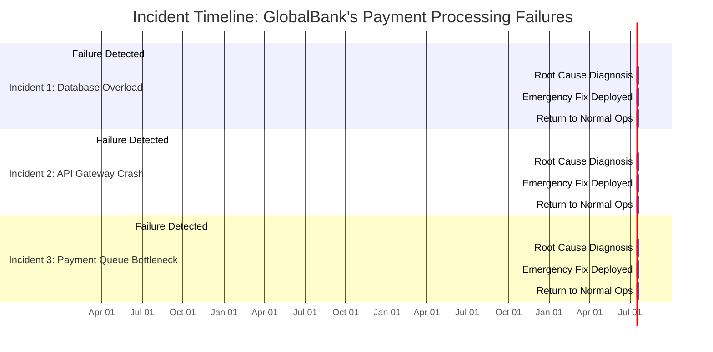

#### Recurring Pattern Analysis

1. **Incident 1 (Jan 15, 2023)**: A sudden spike in transactions caused a critical database overload, leading to widespread payment failures. The team diagnosed the issue and implemented an emergency database indexing fix to restore operations.

2. **Incident 2 (Mar 10, 2023)**: An API gateway crash occurred due to a memory leak introduced by a recent update. After identifying the root cause, the team patched the gateway software and restarted services.

3. **Incident 3 (Jun 5, 2023)**: Payment queues became bottlenecked when a downstream service exceeded its processing capacity during peak hours. The team adjusted queue thresholds and added temporary processing nodes as a stopgap measure.

Despite faster incident resolution times, the frequency of failures remained consistent, with each outage exposing a new unanticipated failure mode. This reactive cycle frustrated customers, increased operational strain, and raised concerns about the platform’s reliability among GlobalBank executives.

#### Flowchart: Reactive Incident Response Cycle

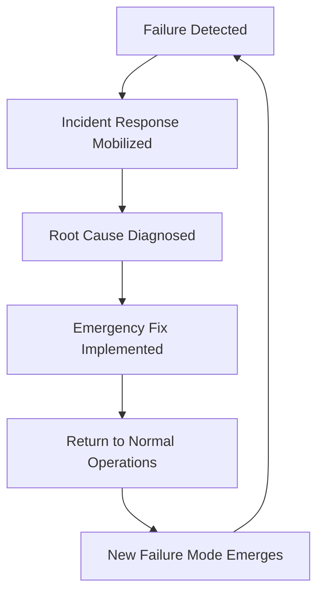

This flowchart illustrates the repetitive nature of GlobalBank's approach: detect, fix, recover, and repeat. Without addressing systemic resilience, the platform remained vulnerable to cascading failures, undermining customer trust and regulatory confidence.
### SRE Best Practice: Evidence-Based Investigation

The SRE approach to breaking the cycle of "fail and fix" is transitioning to "anticipate and prevent" through evidence-based resilience engineering. This involves a systematic process that can be broken down into five actionable steps:

#### Checklist for Evidence-Based Investigation

| Step                                     | Description                                                                                                           | Example                                                                                               |
| ---------------------------------------- | --------------------------------------------------------------------------------------------------------------------- | ----------------------------------------------------------------------------------------------------- |
| **1. System-wide resilience assessment** | Analyze the entire platform as an interconnected system. Map dependencies, critical paths, and resilience mechanisms. | Map how payment services depend on databases, third-party APIs, and internal authorization systems.   |
| **2. Failure mode cataloging**           | Document past failure modes and hypothesize potential future failures based on architecture.                          | Catalog includes hardware failures, network disruptions, software bugs, and dependency outages.       |
| **3. Resilience gap analysis**           | Identify protection gaps by comparing current capabilities to known/potential failure modes.                          | Example: Strong database failover exists, but no degraded mode for third-party API downtime.          |
| **4. Probability-impact mapping**        | Quantify likelihood and impact of failure scenarios to prioritize investments in resilience.                          | Focus on high-impact, medium-probability scenarios like regional outages affecting multiple services. |
| **5. Resilience debt tracking**          | Track unresolved vulnerabilities ("resilience debt") to ensure visibility and accountability.                         | Maintain a backlog of known issues, e.g., lack of redundancy in a key service dependency.             |

#### Example Flow for Evidence-Based Investigation

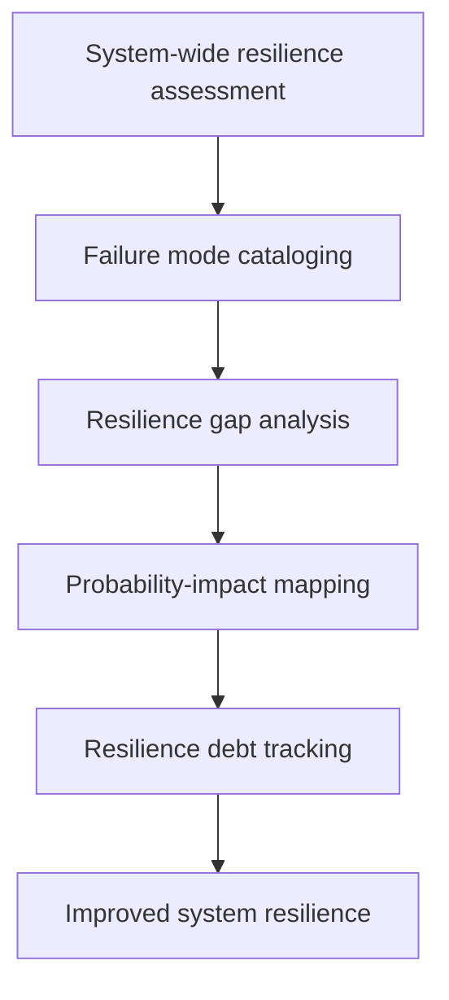

By following this checklist and iterative flow, teams can systematically enhance resilience, ensuring the system continues to operate smoothly even during failures.
### Banking Impact

The business consequences of insufficient resilience engineering in banking systems are severe and multifaceted. The table below summarizes key impacts across financial, regulatory, and reputational dimensions:

| **Impact Area**              | **Description**                                                                     | **Example**                                                                                |
| ---------------------------- | ----------------------------------------------------------------------------------- | ------------------------------------------------------------------------------------------ |
| **Direct Financial Losses**  | Revenue loss from transaction failures and downtime.                                | Each hour of payment system downtime cost GlobalBank ~$150,000 in fees.                    |
| **Regulatory Penalties**     | Increased scrutiny and fines from financial regulators for inadequate resilience.   | GlobalBank incurred a $2.8M fine for failing to maintain business continuity capabilities. |
| **Customer Attrition**       | Loss of high-value clients to competitors following repeated reliability issues.    | GlobalBank lost 7% of corporate clients seeking more reliable services.                    |
| **Market Reputation Damage** | Downgraded industry ratings and decreased client trust due to reliability concerns. | Analysts downgraded GlobalBank’s digital capabilities, affecting client acquisition.       |
| **Operational Costs**        | Higher expenses due to reactive approaches and emergency incident responses.        | Major incidents cost GlobalBank an average of $75,000 each in response costs.              |

This data underscores the importance of proactive resilience engineering in mitigating these risks and ensuring long-term operational stability.
### Implementation Guidance

To implement proactive resilience engineering in your banking systems, follow this structured process:

1. **Establish a resilience baseline**  
   Conduct a comprehensive inventory of all critical banking services and their current resilience capabilities. Document recovery mechanisms, dependency maps, and known failure modes to create a resilience "current state" assessment.

2. **Develop service resilience targets**  
   Define clear, measurable resilience goals for each banking service based on business criticality. For example: "Payment processing must maintain 99.95% availability even when any single datacenter or third-party service fails."

3. **Create a prioritized resilience roadmap**  
   Based on gap analysis between current capabilities and targets, develop a prioritized improvement plan. Focus initial efforts on high-impact, high-probability failure scenarios in the most critical services.

4. **Implement resilience design patterns**  
   Systematically introduce architectural patterns that enhance resilience: circuit breakers for dependency failures, bulkheads for fault isolation, caching strategies for temporary service degradation, and failover mechanisms for critical components.

5. **Establish resilience governance**  
   Create organizational structures that maintain focus on resilience work amid feature pressure. This includes dedicated resilience improvement time in sprints, executive-level resilience metrics, and integration of resilience requirements into the development lifecycle.

#### Visualizing the Process

The following workflow diagram illustrates the step-by-step process for implementing resilience engineering in your banking systems:

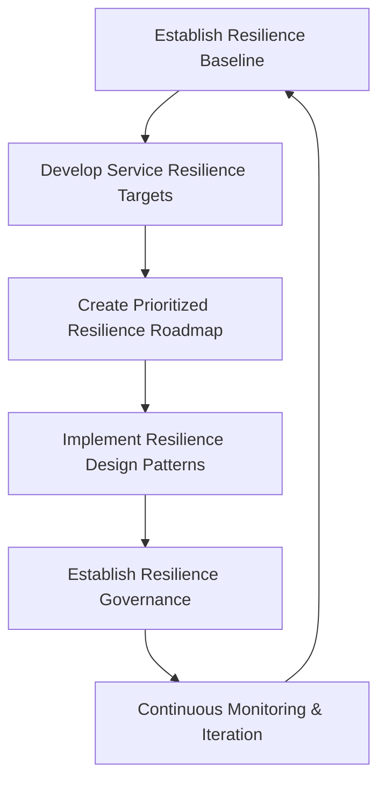

- **Establish Resilience Baseline**: Inventory critical services, map dependencies, and assess current recovery mechanisms.
- **Develop Service Resilience Targets**: Define measurable goals based on business needs and criticality.
- **Create Prioritized Resilience Roadmap**: Identify and prioritize gaps between current capabilities and resilience targets.
- **Implement Resilience Design Patterns**: Apply proven architectural strategies to improve system robustness.
- **Establish Resilience Governance**: Build organizational structures and processes to sustain long-term focus on resilience.
- **Continuous Monitoring & Iteration**: Regularly evaluate system performance and refine resilience strategies based on observed failures.

This cyclical approach ensures resilience becomes an integral, evolving part of your system design rather than a one-time initiative.
## Panel 2: Implementing Failure Injection in Banking Systems
### Scene Description

In a secure testing environment, engineers are conducting a planned "game day" exercise. The room is equipped with multiple screens displaying a simulated banking platform under controlled stress conditions. One engineer activates a failure injection tool that simulates a database cluster failure, while others monitor how payment processing systems respond. A centralized dashboard shows real-time metrics, including transaction success rates and failover times, providing a comprehensive view of system performance during the test. A physical timer is prominently placed, counting down and creating a sense of urgency as teams validate recovery mechanisms. Nearby, a compliance officer observes the process, meticulously reviewing documentation to ensure all regulatory guidelines are followed.

Below is a simplified text-based representation of the testing environment setup:

```
+---------------------------------------------------------------+
|                     Secure Testing Environment                |
+---------------------------------------------------------------+
|                                                               |
|  [ Screen 1: Banking Platform Simulation ]    [ Timer: 00:15 ]|
|                                                               |
|  [ Screen 2: Real-Time Metrics Dashboard ]                   |
|                                                               |
|  Engineer 1: Activates Failure Injection Tool                 |
|  Engineer 2: Monitors Payment Processing Responses            |
|                                                               |
|  Compliance Officer: Reviews Regulatory Documentation         |
|                                                               |
+---------------------------------------------------------------+
```
This setup illustrates the collaborative and controlled nature of the exercise, emphasizing the interaction between engineers, monitoring tools, and compliance oversight.
### Teaching Narrative
Chaos engineering—the practice of intentionally introducing controlled failures to validate system resilience—represents a paradigm shift for financial institutions. While pioneered in tech companies like Netflix with their Chaos Monkey tool, applying these concepts in banking requires careful adaptation to meet regulatory requirements and ensure financial data integrity. The core principle remains: proactively discovering weaknesses is better than having customers discover them.

Implementing failure injection in banking systems requires a methodical approach: starting with isolated test environments, moving to pre-production, and eventually conducting carefully controlled experiments in production. Each step requires increasingly rigorous safety precautions. Unlike traditional testing that validates known behaviors, chaos engineering uncovers unknown dependencies and assumptions—critical for complex banking platforms where no single person understands the entire system.

When properly implemented, these controlled experiments transform abstract architectural discussions into evidence-based resilience improvements. Rather than debating theoretical failure scenarios, teams gain empirical data about how systems actually respond to disruptions. This approach is particularly valuable for validating recovery mechanisms that might otherwise remain untested until a real incident occurs—when customer transactions and reputation are at stake.
### Common Example of the Problem

EuroTrade Bank implemented an advanced trading platform with comprehensive high-availability features, including database clustering, application redundancy, and automated failover. During quarterly disaster recovery tests, the system consistently passed all checkpoints when individual components were manually taken offline. However, when a production database failover actually occurred during trading hours, the system behaved unexpectedly—authentication services remained functional, but trade execution failed silently, with customers receiving confirmation messages while transactions weren't actually completing. The recovery playbook proved insufficient because it focused on isolated component failures rather than system-wide behavioral testing. The resulting confusion caused nearly €4M in misreported trades that required manual reconciliation, triggering both regulatory reporting and customer trust issues.

#### Timeline of the EuroTrade Incident

The following timeline illustrates the sequence of events during the failure, highlighting critical moments where the system's resilience was tested and gaps were exposed:

```mermaid
gantt
    title EuroTrade Incident Timeline
    dateFormat HH:mm
    axisFormat %H:%M
    section Event Progression
    Database failover triggered         :done, db_failover, 10:00, 5min
    Authentication remains functional   :crit, auth_ok, after db_failover, 15min
    Trade execution fails silently      :crit, trade_fail, after auth_ok, 10min
    Customer confirmations sent         :crit, confirmations, after trade_fail, 5min
    Issue identified by monitoring team :active, monitoring_alert, after confirmations, 30min
    Recovery playbook initiated         :active, recovery_start, after monitoring_alert, 20min
    Manual reconciliation begins        :done, reconciliation, after recovery_start, 4h
```

This timeline underscores the importance of system-wide testing. While the failover mechanism was successfully triggered at 10:00, downstream dependencies—such as trade execution—were not accounted for, leading to silent failures. Customers continued receiving confirmations until the monitoring team detected the issue at 10:50. The reliance on incomplete recovery playbooks further delayed resolution until manual reconciliation efforts commenced, stretching the incident's impact through the afternoon.

By introducing failure injection techniques, EuroTrade Bank could have uncovered these hidden dependencies earlier, allowing teams to refine their recovery strategies and prevent customer-facing impacts during critical trading hours.
### SRE Best Practice: Evidence-Based Investigation

The SRE approach to preventing such scenarios involves systematic failure injection testing that validates both technical recovery and business functionality. Below is a concise checklist summarizing the five steps for evidence-based investigation:

#### Checklist: Evidence-Based Investigation for Failure Injection
1. **Hypothesis-Driven Testing**
   - Define clear hypotheses about system behavior under failure conditions.
   - Example: "If the primary database cluster fails, the trading platform will automatically failover within 30 seconds with zero data loss and maintain full transaction capability."

2. **Controlled Experiment Design**
   - Design precise experiments targeting specific failure scenarios.
   - Document:
     - Expected behavior
     - Success criteria
     - Blast radius limitations
     - Abort conditions

3. **Full-Stack Validation**
   - Validate both infrastructure recovery and business functionality.
   - Use synthetic transactions to simulate real customer activity during the failure sequence.

4. **Observability Validation**
   - Ensure monitoring systems detect the intended failure conditions.
   - Confirm alerts and dashboards function correctly during disruptions.

5. **Recovery Measurement**
   - Measure recovery timing, data consistency, and system behavior during recovery.
   - Compare results against:
     - Service Level Objectives (SLOs)
     - Regulatory requirements
   - Identify and document gaps for follow-up actions.

By systematically following this checklist, teams can conduct rigorous failure injection exercises that provide actionable insights into system resilience and recovery capabilities.
### Banking Impact

The business consequences of untested recovery mechanisms in banking environments can be significant. The table below summarizes five key consequences, along with their financial and operational impacts, using EuroTrade as a case study:

| **Consequence**                         | **Description**                                                                                   | **Financial Impact**                                 | **Operational Impact**                                                              |
| --------------------------------------- | ------------------------------------------------------------------------------------------------- | ---------------------------------------------------- | ----------------------------------------------------------------------------------- |
| **Transaction integrity risks**         | Silent failure mode created mismatches between customer expectations and actual processed trades. | Estimated up to €12M in potential legal liabilities. | Risk of financial disputes and erosion of customer trust.                           |
| **Extended time-to-recovery**           | Mean time to recovery (MTTR) increased by 300-400% due to unvalidated mechanisms.                 | N/A                                                  | Recovery time stretched to 4.7 hours instead of the expected 45 minutes.            |
| **Operational confusion**               | Improvised recovery attempts due to untested scenarios led to delays.                             | N/A                                                  | Three failed recovery attempts extended the impact window and delayed resolution.   |
| **Regulatory non-compliance**           | Failure to demonstrate effective recovery capabilities to regulators.                             | N/A                                                  | Formal supervisory notices required immediate remediation of testing programs.      |
| **Misallocated resilience investments** | Investments focused on redundant components that weren’t failure points.                          | N/A                                                  | Underinvestment in the transaction commit pipeline caused critical system failures. |

This structured view highlights the dual nature of these consequences—financial penalties and operational inefficiencies. By proactively implementing failure injection and chaos engineering practices, banks can mitigate these risks and strengthen overall resilience.
### Implementation Guidance

To implement failure injection testing in your banking environment, follow this graduated testing framework:

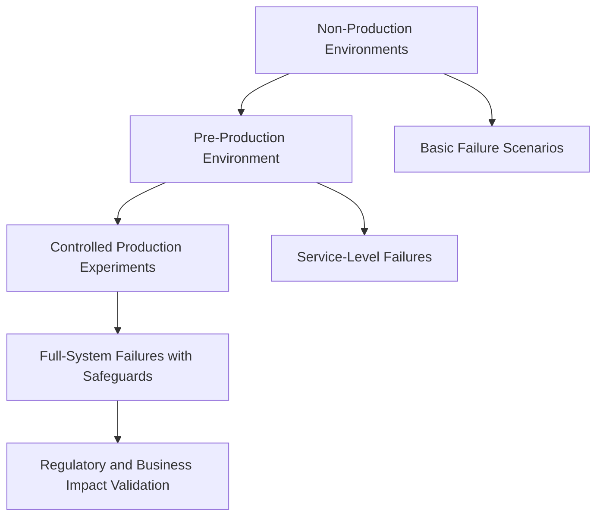

1. **Start with non-production environments**: Begin in development and test environments by simulating basic failure scenarios such as server shutdowns, network degradation, or process terminations. Document baseline system behavior and refine tools and processes before progressing to more complex tests or environments.

2. **Develop a graduated testing framework**: Move systematically through the framework:
   - **Non-production environments**: Focus on isolated component failures and foundational testing.
   - **Pre-production environment**: Test service-level failures and validate interdependencies in an environment closely mirroring production.
   - **Controlled production experiments**: Simulate full-system failures with strict safeguards, including automated abort mechanisms, detailed audit logs, and predefined impact thresholds.

3. **Build specialized tooling**: Develop or adapt failure injection tools tailored to financial systems. Include features such as automatic aborts when deviations exceed thresholds, transaction verification mechanisms, and comprehensive audit logs to ensure compliance.

4. **Create game day exercises**: Conduct regular resilience exercises involving cross-functional teams. Simulate real-world scenarios by combining failure injection with incident response. Include stakeholders from engineering, operations, compliance, and business units to validate and improve both technical and business recovery processes.

5. **Implement metrics-driven improvement**: After each exercise, document findings in a structured resilience database. Track metrics such as detection times, recovery times, and transaction success rates. Use these insights to prioritize and implement measurable improvements that strengthen overall system resilience.
## Panel 3: Designing Circuit Breakers for Financial Transactions
### Scene Description

A developer and SRE are paired at a workstation, collaborating on implementing circuit breaker patterns into a payment processing service. The workstation setup includes three key elements:

1. **Code Editor**: The screen displays code being written to define circuit breaker logic, such as thresholds for failure detection and recovery strategies.
2. **Whiteboard Diagram**: A nearby whiteboard illustrates the architecture, showing how the circuit breaker interacts with upstream and downstream services:
   ```
   [Client Request] --> [Circuit Breaker] --> [Downstream Service]
                            |                     |
                         [Monitoring]        [Fallback Logic]
   ```
   The diagram highlights states like "closed" (normal operation), "open" (blocking traffic), and "half-open" (testing recovery).
3. **Monitoring Dashboard**: A real-time dashboard shows traffic flowing through various microservices, with indicators for the circuit breakers' states:
   - **Green**: Closed (operational)
   - **Red**: Open (blocking)
   - **Yellow**: Half-open (recovering)

Standing behind them, a banking executive observes the progress. They are visibly impressed by how the solution prevents full service outages while maintaining essential transaction capabilities, reflecting the practical importance of the circuit breaker pattern in financial systems.
### Teaching Narrative
In interconnected banking systems, failures can cascade rapidly—a single slow database query can eventually bring down an entire trading platform. Circuit breakers represent one of the most powerful patterns for preventing these cascading failures. Borrowed from electrical engineering and popularized in software by Michael Nygard's "Release It!" book, circuit breakers automatically detect when a dependent service is failing and temporarily stop sending requests to it, preventing the "thundering herd" problem where retries worsen an already struggling system.

For banking applications, circuit breakers must be thoughtfully implemented to balance reliability with customer experience. When a circuit "opens" (stops forwarding requests), what should happen to financial transactions? Options include queuing for later processing, routing to alternative services, or gracefully degrading functionality while maintaining core services. These decisions must be made deliberately, with clear business input on transaction criticality.

Properly implemented circuit breakers create systems that fail partially rather than completely. During incidents, this translates to targeted impact—perhaps slowing non-essential services while maintaining critical payment processing. This approach aligns perfectly with the SRE principle of managing error budgets, allowing organizations to focus resources on protecting the most business-critical functions while accepting measured risk in less critical areas.
### Common Example of the Problem

AsiaMarket Bank's mobile app experienced a complete outage lasting 6 hours when their identity verification service became overloaded during a promotional campaign. Here's how the cascading failure unfolded:

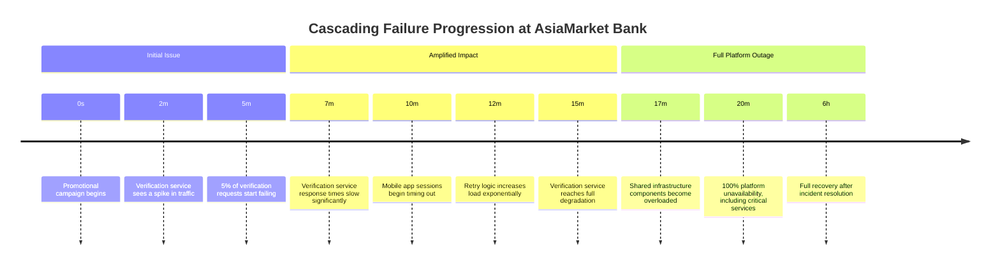

The verification service's slow response times initially caused 5% of requests to fail. However, the mobile app's retry logic exacerbated the issue by generating an exponentially growing load. Within 15 minutes, the verification service was fully degraded, and by the 20-minute mark, the failure had spread to shared infrastructure components, leading to a complete outage of the mobile banking platform. Critical functions like balance checking and money transfers were rendered inaccessible, impacting millions of users.

This timeline demonstrates how quickly a localized issue can cascade into a full platform outage without mechanisms like circuit breakers to stop the amplification of failures.
### SRE Best Practice: Evidence-Based Investigation

The SRE approach to preventing cascade scenarios focuses on implementing protective patterns based on empirical system behavior. Below is a checklist summarizing key steps and considerations for evidence-based investigation, enabling faster implementation and reference during system design or incident mitigation:

| **Step**                             | **Description**                                                                                                                                                    | **Key Outputs**                                                                             |
| ------------------------------------ | ------------------------------------------------------------------------------------------------------------------------------------------------------------------ | ------------------------------------------------------------------------------------------- |
| **1. Dependency Health Modeling**    | Analyze dependencies to understand failure modes, error patterns, and degradation signatures. Define health criteria for each dependency.                          | Dependency health matrix, documented failure modes, and monitoring metrics.                 |
| **2. Failure Pattern Analysis**      | Review past incidents to identify failure propagation paths. Map "failure pathways" to reveal how localized issues escalate into broader outages.                  | Failure pathway diagrams, root cause analysis documentation.                                |
| **3. Threshold Calibration**         | Use historical data to establish activation thresholds for circuit breakers (e.g., error rates, latency, resource exhaustion).                                     | Circuit breaker configuration settings and thresholds tuned to historical data.             |
| **4. Impact-Driven Fallback Design** | Design fallback behaviors for each service based on business priorities. Categorize transactions into **must-complete**, **can-delay**, and **can-degrade** tiers. | Fallback strategies for transaction categories, aligned to business impact.                 |
| **5. Recovery Behavior Validation**  | Test circuit breaker behavior under failure scenarios. Validate protection mechanisms and fallback strategies for both technical and business appropriateness.     | Test reports, validated recovery behaviors, and adjusted thresholds based on test outcomes. |

#### Visual Representation: Failure Pathways
To further assist in understanding failure propagation and circuit breaker decisions, below is an example of a simplified failure pathway represented as an ASCII flowchart:

```
[Service A] --> [Service B] --> [Service C]
     |              |               |
     v              v               v
[Partial Outage] [Increased Latency] [Resource Exhaustion]
     |              |               |
     v              v               v
[Fallback Triggered] --> [Circuit Breaker Opens]
```

By following this evidence-based process, SREs ensure circuit breakers are not only technically sound but also align with business priorities, creating resilient systems designed to fail gracefully.
### Banking Impact

The business consequences of cascading failures in banking systems can be significant, affecting multiple dimensions of operations and strategy. The table below summarizes five key impacts with brief descriptions and measurable metrics for clarity:

| **Impact Dimension**        | **Description**                                                           | **Example Metric**                                                | **Case Study: AsiaMarket Bank**                                                                                 |
| --------------------------- | ------------------------------------------------------------------------- | ----------------------------------------------------------------- | --------------------------------------------------------------------------------------------------------------- |
| **Outage Scope**            | The extent of systems or customers affected by a failure.                 | Number of affected customers or services.                         | A minor verification service issue escalated to a platform-wide outage, affecting 2.3M users instead of 50,000. |
| **Recovery Time**           | The time required to restore normal operations after a failure.           | Percentage increase in recovery time.                             | Recovery time increased by 400-500%, extending from 30 minutes to 6 hours due to cascading failures.            |
| **Reputation Damage**       | Negative perception and trust loss from customers and stakeholders.       | Change in Net Promoter Score (NPS).                               | Significant social media backlash during a promotional campaign caused a 12-point NPS drop in one month.        |
| **Revenue Loss**            | Direct financial loss from transaction interruptions or service downtime. | Revenue loss as a percentage of daily income or transaction fees. | The bank lost approximately $450,000 in transaction fees during the outage.                                     |
| **Regulatory Consequences** | Compliance risks and additional scrutiny from financial regulators.       | Triggered regulatory reports or fines.                            | Mandatory reporting resulted in enhanced supervisory monitoring and resilience requirements.                    |

By understanding these potential impacts, banking institutions can prioritize circuit breaker implementations to minimize systemic disruptions and maintain core service reliability during incidents.
### Implementation Guidance

To implement effective circuit breakers in your banking systems:

1. **Map your dependency topology**: Create a comprehensive dependency graph of all services, APIs, databases, and external providers. Identify critical paths and shared dependencies that could create cascade risks. Prioritize protection for dependencies that support the highest-value transaction flows.

    ```mermaid
    graph TD
        A[Payment Gateway] --> B[Transaction Service]
        B --> C[Database]
        B --> D[Third-Party Fraud Check]
        D --> E[External Fraud API]
    ```

   The above diagram shows an example dependency graph. In this case, the `Transaction Service` is a critical path, and the `External Fraud API` is a shared dependency prone to failures.

2. **Implement circuit breakers with business-appropriate fallbacks**: Add circuit breaker protection to key service communication points. For each implementation, define appropriate fallback behaviors: queue for later processing, use cached data, route to alternative services, or degrade functionality while preserving core capabilities.

    ```python
    from circuitbreaker import CircuitBreaker

    # Example Circuit Breaker configuration
    @CircuitBreaker(failure_threshold=5, recovery_timeout=30, expected_exception=Exception)
    def call_fraud_check_service(transaction):
        # Simulate a call to an external API
        response = external_fraud_api.verify(transaction)
        return response
    ```

   In this example, a Python circuit breaker is used to protect the call to an external fraud check service. If the service fails 5 times consecutively, the circuit opens and stops attempts for 30 seconds, allowing time for stabilization.

3. **Establish monitoring for circuit breaker health**: Create dedicated dashboards that show circuit breaker status across the system. Implement alerts for circuit state changes to detect emerging problems before they become outages. Track circuit breaker metrics over time to identify problematic dependencies. Example metrics to monitor include:
    - Circuit state (open, closed, half-open)
    - Failure counts and thresholds
    - Average response times of protected services

   Example text-based monitoring dashboard structure:
    ```
    +---------------------+-----------------+-----------------+
    | Service Name        | Circuit State   | Failure Count   |
    +---------------------+-----------------+-----------------+
    | Fraud Check Service | OPEN            | 5/5            |
    | Payment Processor   | CLOSED          | 0/3            |
    | Notification API    | HALF-OPEN       | 1/4            |
    +---------------------+-----------------+-----------------+
    ```

4. **Develop circuit breaker testing capabilities**: Create testing frameworks that can simulate dependency failures to validate circuit breaker behavior. Include these tests in CI/CD pipelines to prevent regressions in resilience capabilities. Example pseudocode for testing:

    ```python
    def test_circuit_breaker_behavior():
        # Simulate dependency failure
        for _ in range(6):  # Exceed failure threshold
            try:
                call_fraud_check_service(mock_transaction)
            except Exception:
                pass

        assert circuitbreaker.state == "OPEN"
    ```

5. **Create circuit breaker governance**: Establish an operational review process that examines circuit breaker activations. Each "open circuit" event should be investigated to understand root causes and improve the underlying dependency, not just rely on the circuit breaker as permanent protection. Use a structured review format such as:

    ```
    Circuit Breaker Activation Report:
    - Service: Fraud Check Service
    - Activation Time: 2023-10-01 10:45:00 UTC
    - Root Cause: High latency from External Fraud API
    - Actions Taken: Increased API timeout, optimized retry logic
    ```

By following these steps, your banking systems will be more resilient, able to mitigate cascading failures while maintaining critical transaction flows.
## Panel 4: Designing for Regulatory Resilience
### Scene Description

A cross-functional workshop is underway with SREs, developers, compliance officers, and risk managers. They're gathered around a resilience matrix that maps technical capabilities to regulatory requirements. One wall displays financial regulations (PSD2, SOX, Basel III) while another shows technical implementations that satisfy them. A risk officer is highlighting concerns about an upcoming stress test from regulators, while an SRE explains how their resilience testing provides evidence of compliance. A shared dashboard demonstrates how system metrics map directly to regulatory reporting requirements.

Below is a simplified representation of the resilience matrix being used in the workshop:

```
Regulations       | Technical Capabilities         | Evidence/Implementation
------------------|--------------------------------|--------------------------
PSD2             | High system availability       | Health checks, failover mechanisms
SOX              | Data integrity and traceability| Immutable logs, audit trails
Basel III        | Recovery from stress scenarios | Chaos engineering, DR drills
GDPR             | Data availability and recovery | Backup systems, recovery SLAs
------------------|--------------------------------|--------------------------
```

This matrix visually connects the regulatory requirements on one axis with the technical engineering capabilities and their corresponding implementations on the other. The shared dashboard in the workshop complements this by demonstrating real-time system metrics that align with these mapped controls. This setup fosters collaboration and clarity, ensuring all stakeholders understand how resilience engineering directly supports compliance objectives.
### Teaching Narrative
Banking SREs face a unique challenge: balancing technical innovation with stringent regulatory compliance. While tech companies can often accept higher risk levels for faster innovation, financial institutions must meet regulatory requirements that directly address resilience. However, this constraint can become a competitive advantage when approached correctly—regulation becomes a driver for resilience rather than just a compliance exercise.

Regulatory resilience means designing systems where the technical controls directly satisfy compliance requirements while enabling business agility. For example, the ability to rapidly restore systems after failure isn't just good engineering—it's mandated by regulations like GDPR (with its focus on availability) and various financial regulations requiring business continuity. The key is implementing these controls as engineering practices rather than documentation exercises.

When resilience capabilities are built with regulatory requirements in mind, audits transform from stressful events into opportunities to demonstrate engineering excellence. Rather than scrambling to produce evidence of compliance, teams can point to their continuous resilience testing, automated recovery mechanisms, and comprehensive observability as proof of regulatory adherence. This approach satisfies both regulators and engineering best practices, turning a potential constraint into a driver of system quality.
### Common Example of the Problem

NordicFinance, a mid-sized retail bank, treated regulatory compliance and system resilience as separate domains. The compliance team maintained detailed documentation of business continuity procedures, recovery time objectives, and control frameworks to satisfy regulatory requirements. Meanwhile, the engineering team implemented their own resilience approaches focused on modern SRE practices. During a regulatory examination, auditors found significant discrepancies between documented procedures and actual technical implementations. While both approaches might have been effective individually, the misalignment created a compliance gap.

The table below highlights key discrepancies identified during the examination:

| **Aspect**                         | **Compliance Team's Documented Procedures**                                   | **Engineering Team's Technical Implementations**                  | **Discrepancy Impact**                                                                |
| ---------------------------------- | ----------------------------------------------------------------------------- | ----------------------------------------------------------------- | ------------------------------------------------------------------------------------- |
| **Recovery Time Objectives (RTO)** | RTOs set at 30 minutes for critical systems in regulatory filings.            | Automated recovery processes targeting an average of 45 minutes.  | Non-compliance with regulatory commitments, requiring immediate remediation.          |
| **Business Continuity**            | Manual failover procedures documented with detailed step-by-step actions.     | Automated failover processes implemented via orchestration tools. | Auditors flagged the mismatch as a lack of validated evidence for the manual process. |
| **Testing and Reporting**          | Quarterly compliance testing with static checklist-based evidence collection. | Continuous resilience testing integrated with CI/CD pipelines.    | Evidence from automated testing not considered auditable under current documentation. |

These misalignments resulted in a formal supervisory finding requiring remediation and additional reporting. The teams faced months of extra work to harmonize their approaches by aligning technical implementations with documented compliance procedures. This example underscores the importance of designing resilience capabilities that simultaneously meet engineering best practices and regulatory expectations.
### SRE Best Practice: Evidence-Based Investigation

The SRE approach to regulatory resilience focuses on creating demonstrable, evidence-based capabilities that satisfy both technical and regulatory requirements. To make this actionable, follow these steps and utilize the provided example for automated compliance validation:

#### Checklist for Evidence-Based Investigation:

1. **Regulatory Requirement Mapping**
   - Analyze applicable financial regulations (e.g., PSD2, SOX, Basel III).
   - Extract specific, measurable resilience requirements.
   - Translate regulatory language into concrete technical capabilities that can be implemented and tested.

2. **Control Effectiveness Measurement**
   - Define metrics for resilience controls (e.g., Recovery Time Objective (RTO), Recovery Point Objective (RPO)).
   - Track and report success rates for recovery attempts, data integrity validation, and incident response times.

3. **Continuous Compliance Validation**
   - Design automated tests to ensure control effectiveness on an ongoing basis.
   - Integrate these tests into CI/CD pipelines to validate compliance during deployments.

4. **Resilience Telemetry Design**
   - Implement observability systems that generate evidence required by regulators.
   - Align logging, metrics, and reporting systems with both regulatory needs and operational goals.

5. **Technical-Regulatory Translation**
   - Build a shared vocabulary between technical and compliance teams.
   - Document mappings that show how engineering practices (e.g., continuous testing, automated recovery) satisfy specific regulatory controls.

#### Example: Automated Compliance Validation with Resilience Testing

The following code snippet demonstrates an example of integrating automated compliance validation into a CI/CD pipeline. This ensures that recovery mechanisms meet regulatory requirements for availability and continuity:

```yaml
# CI/CD Pipeline Configuration Example
stages:
  - resilience-testing
  - deployment

resilience-testing:
  stage: resilience-testing
  script:
    # Simulate failure and validate recovery
    - echo "Simulating system failure..."
    - ./simulate_failure.sh
    # Verify recovery time meets RTO
    - echo "Validating recovery time..."
    - ./validate_rto.sh --max-time=120
    # Verify data integrity after recovery
    - echo "Checking data integrity..."
    - ./validate_data_integrity.sh
  allow_failure: false
  artifacts:
    paths:
      - resilience_test_report.log

deployment:
  stage: deployment
  script:
    - echo "Deploying application..."
    - ./deploy_app.sh
  dependencies:
    - resilience-testing
```

This pipeline ensures that resilience controls are tested during every deployment, generating compliance evidence (e.g., logs, test reports) that can be reviewed by both engineering and regulatory teams.

By following this structured approach and leveraging automation, teams can effectively satisfy regulatory requirements while enhancing system reliability and operational excellence.
### Banking Impact

The business consequences of misalignment between regulatory compliance and technical resilience can be significant. Below is a summary of key impacts, represented visually for clarity:

#### Key Impacts of Misalignment

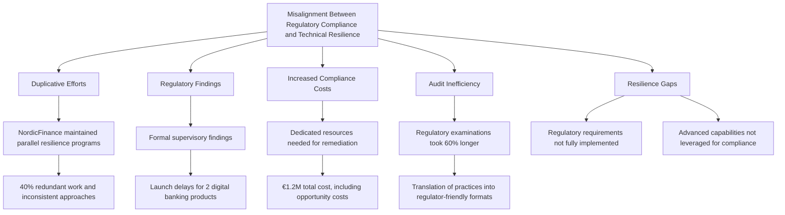

1. **Duplicative efforts**: NordicFinance maintained parallel resilience programs—one for regulatory compliance and one for technical operations—creating approximately 40% redundant work and inconsistent approaches.

2. **Regulatory findings**: The misalignment resulted in formal supervisory findings that restricted business activities. NordicFinance had to delay launching two digital banking products while addressing the resilience framework issues.

3. **Increased compliance costs**: Remediation required dedicated resources from both engineering and compliance teams. NordicFinance estimated the total cost of remediation at €1.2M, including both direct expenses and opportunity costs.

4. **Audit inefficiency**: Regulatory examinations took 60% longer than necessary because technical teams had to translate their actual practices into the language and framework expected by regulators and auditors.

5. **Resilience gaps**: Some regulatory requirements weren't fully implemented in technical systems, while some advanced technical capabilities weren't leveraged for compliance purposes, creating both compliance and operational risks.

The diagram above highlights how these interconnected impacts stem from misalignment, underscoring the importance of integrating regulatory compliance with technical resilience practices.
### Implementation Guidance

To align regulatory requirements with technical resilience in your organization, follow these steps:

| Step                                                                   | Description                                                                                                                                                                                                 | Key Actions                                                                                                                                                                        |
| ---------------------------------------------------------------------- | ----------------------------------------------------------------------------------------------------------------------------------------------------------------------------------------------------------- | ---------------------------------------------------------------------------------------------------------------------------------------------------------------------------------- |
| **1. Create a regulatory control to technical implementation mapping** | Develop a comprehensive matrix that maps regulatory resilience requirements to technical implementations. Identify gaps where requirements lack technical alignment or where capabilities aren't leveraged. | - Analyze relevant regulations (e.g., PSD2, SOX, Basel III).<br>- Create a mapping matrix.<br>- Identify gaps and prioritize remediation.                                          |
| **2. Implement "compliance as code" approaches**                       | Automate compliance validation by embedding it into engineering workflows. Build testing frameworks that continuously verify control effectiveness and generate regulatory evidence.                        | - Automate compliance checks.<br>- Build continuous testing pipelines.<br>- Generate evidence as part of normal system operations.                                                 |
| **3. Redesign resilience reporting for dual audiences**                | Create dashboards and reports that serve both engineers and regulators. Ensure metrics provide actionable insights for system improvement and demonstrate compliance.                                       | - Design dashboards for operational and regulatory needs.<br>- Develop metrics that align with resilience goals and compliance standards.<br>- Validate reports with stakeholders. |
| **4. Establish joint resilience governance**                           | Form a cross-functional team with authority to align resilience engineering with regulatory requirements. Ensure decisions satisfy both technical and compliance needs.                                     | - Assemble a cross-functional team (engineering, operations, risk, compliance).<br>- Define governance processes.<br>- Document approved approaches.                               |
| **5. Develop a resilience evidence repository**                        | Create a centralized system to collect, organize, and maintain evidence of resilience capabilities. Ensure evidence integrity for audits and continuous improvement.                                        | - Build a secure repository.<br>- Automate evidence collection.<br>- Implement controls for data integrity and access.                                                             |

By following this structured approach, you can ensure that regulatory requirements are seamlessly integrated with technical resilience, reducing audit stress and enhancing system quality.
## Panel 5: Building Resilience Through Observability
### Scene Description

An operations center shows a team responding to early warning signals rather than a full-blown incident. High-resolution displays show multi-dimensional observability data—logs, metrics, and distributed traces—revealing subtle patterns in system behavior. The following depicts the collaborative activities in the operations center:

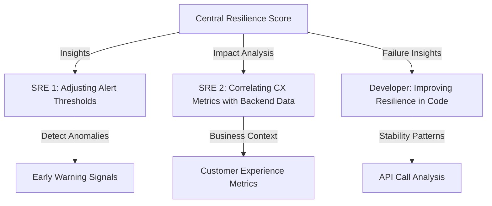

- **SRE 1** is adjusting alerting thresholds based on detected anomalies, ensuring proactive measures are in place.
- **SRE 2** is correlating customer experience metrics with backend performance data, linking technical performance to business outcomes.
- **Developer** is using observed failure modes to improve code resilience, examining the effects of specific API call patterns on system stability.
- On a central screen, the **Resilience Score** provides a real-time view of the system's current ability to withstand various types of failure.
### Teaching Narrative
Advanced observability is the foundation of resilient systems—you can't protect what you can't see. While traditional monitoring focuses on known failure modes, true observability enables teams to understand novel system behaviors and address issues before they impact customers. For banking systems, where the cost of downtime is measured not just in revenue but in customer trust and regulatory scrutiny, deep observability is essential.

The difference between basic monitoring and resilience-driven observability is context. Rather than tracking isolated metrics, mature observability connects technical telemetry with business outcomes. For example, instead of simply monitoring database response times, resilience-focused observability tracks how those response times correlate with payment processing success rates and customer satisfaction metrics. This business context enables teams to make informed decisions about reliability investments.

Observability becomes a resilience tool when it enables teams to answer previously unknown questions about system behavior. When a novel failure mode occurs, can engineers quickly determine what's happening without deploying new instrumentation? Can they understand not just what failed, but why it failed and how it affects customers? This exploratory capability is what separates true observability from basic monitoring, and it's essential for building banking systems that can withstand unanticipated disruptions.
### Common Example of the Problem

CapitalCore Bank's fraud detection system experienced a subtle degradation that went undetected for 17 days before culminating in a critical outage. Traditional monitoring showed all components operating within normal parameters—CPU usage was acceptable, services responded to health checks, and no explicit errors were logged. However, behind the scenes, a progressive degradation was unfolding, which eventually triggered a cascade failure. The monitoring focused on component health rather than system behavior, resulting in "all green" dashboards while customer impact steadily escalated.

Below is a timeline that illustrates the progression of the problem:

```mermaid
gantt
    title Degradation Timeline: CapitalCore Fraud Detection System
    dateFormat  YYYY-MM-DD
    section Early Warning Signs (Undetected)
    Gradual increase in processing latency :active, lat1, 2023-07-01, 7d
    Subtle memory leaks emerge             :active, memleak, 2023-07-05, 7d
    Queue depths start to grow             :active, queue, 2023-07-08, 3d
    section Escalation Phase
    Latency crosses critical threshold     :crit, latency, 2023-07-11, 5d
    Increased customer impact starts       :crit, impact, 2023-07-13, 2d
    section Failure and Investigation
    Cascade failure occurs                 :crit, fail, 2023-07-15, 1d
    Root cause investigation begins        :milestone, root, 2023-07-15
```

During the early warning phase, the system exhibited subtle but critical anomalies: a gradual increase in processing latency for specific transaction types, subtle memory leak patterns, and steadily growing queue depths. These indicators were not part of the monitored metrics, so they remained undetected. By the escalation phase, the processing latency eventually crossed a critical threshold, leading to increased customer impact as transaction processing began to fail intermittently.

Finally, a cascade failure occurred, resulting in a complete outage of the fraud detection system. Investigators found that the early warning signs had been present for weeks but were not surfaced due to a lack of system-wide observability. The bank was forced to temporarily disable certain transaction types, causing both financial losses and reputational harm. This example highlights the critical need for observability that extends beyond component health, connecting technical signals to broader system behavior and business outcomes.
### SRE Best Practice: Evidence-Based Investigation

The SRE approach to observability transforms monitoring from component-focused to behavior-focused through several key practices. Use the following checklist to implement evidence-based investigation effectively:

#### Checklist: Evidence-Based Investigation Best Practices

- **Define Service-Level Telemetry**:
  - [ ] Identify what constitutes healthy service behavior from the customer perspective.
  - [ ] Map the customer journey to specific technical indicators reflecting actual experience.
  - [ ] Ensure telemetry signals are directly tied to customer-impacting behaviors.

- **Enable Multi-Dimensional Correlation**:
  - [ ] Implement systems that can correlate telemetry signals across time, services, and layers of the stack.
  - [ ] Regularly analyze relationships between metrics to detect emerging issues before thresholds are exceeded.
  - [ ] Automate correlation analysis where possible to reduce manual effort.

- **Detect Anomaly Patterns**:
  - [ ] Establish baseline behavior patterns using statistical methods or machine learning.
  - [ ] Monitor for deviations in relationships between metrics, not just absolute values.
  - [ ] Prioritize anomaly detection techniques that align with your system's risk profile.

- **Integrate Business Context**:
  - [ ] Align technical telemetry with business metrics such as transaction success rates, customer satisfaction scores, or processing volumes.
  - [ ] Use business context to prioritize incidents based on customer and revenue impact.
  - [ ] Regularly review and refine the mapping between technical and business metrics.

- **Test Observability Systems**:
  - [ ] Introduce controlled anomalies to validate observability accuracy and responsiveness.
  - [ ] Conduct regular "detection gap" reviews to identify blind spots in your observability setup.
  - [ ] Ensure that alerting systems are calibrated for both technical and business relevance.

By following this checklist, teams can ensure that their observability practices are robust, customer-focused, and capable of driving resilience through actionable insights.
### Banking Impact

The business consequences of insufficient observability in banking systems can be severe, leading to operational, customer, and regulatory challenges. The following table summarizes key issues, their impacts, and associated costs:

| **Issue**                               | **Impact**                                                                                                                      | **Cost**                                         |
| --------------------------------------- | ------------------------------------------------------------------------------------------------------------------------------- | ------------------------------------------------ |
| **Prolonged detection time**            | Incident at CapitalCore went undetected for 15 extra days, increasing remediation complexity and recovery time.                 | **Increased recovery cost and time**             |
| **Customer impact blindness**           | Lack of visibility into growing transaction delays affected 42,000 customers before the final outage.                           | **Customer dissatisfaction and trust erosion**   |
| **Reactive vs. preventive costs**       | Emergency response and recovery cost $380,000, compared to an estimated $15,000 for early detection using better observability. | **$365,000 in avoidable costs**                  |
| **Misallocated engineering resources**  | 30% of resilience engineering capacity wasted targeting non-critical components due to lack of clear system visibility.         | **Wasted engineering effort**                    |
| **Compliance and reporting challenges** | Inability to provide detailed incident data to regulators increased compliance risks and potential penalties.                   | **Regulatory penalties and reputational damage** |

This table highlights how insufficient observability directly translates into significant business risks, operational inefficiencies, and financial costs. By investing in advanced observability, banks can address these issues proactively, ensuring better customer experiences, optimized engineering efforts, and enhanced regulatory compliance.
### Implementation Guidance

To build resilience through observability in your banking systems, follow this structured process:

1. **Implement the three pillars of observability**
   - Collect metrics (numeric measurements over time), logs (detailed event records), and traces (transaction paths through systems).
   - Design each pillar with attention to both technical and business contexts, ensuring you track not just system health but customer experience outcomes.

2. **Create service-level objectives based on customer journeys**
   - Define SLOs that reflect complete customer transactions rather than isolated components.
   - Instrument key customer journeys like "log in to account," "complete payment," or "view transaction history" with end-to-end telemetry to capture the full customer experience.

3. **Develop anomaly detection capabilities**
   - Use statistical methods to detect changing patterns in system behavior, gradual degradations, and correlation shifts between related metrics.
   - Implement systems that can identify emerging problems before thresholds are breached.

4. **Build business-technical dashboards**
   - Create unified visualizations that connect technical metrics with business outcomes.
   - Ensure dashboards are accessible and meaningful to both technical and business stakeholders, fostering a shared understanding of system health.

5. **Establish observability review processes**
   - After every incident, analyze whether appropriate signals were available but not monitored, or whether new telemetry is needed.
   - Continuously evolve your observability approach based on these findings through regular reviews.

#### Process Flow Diagram

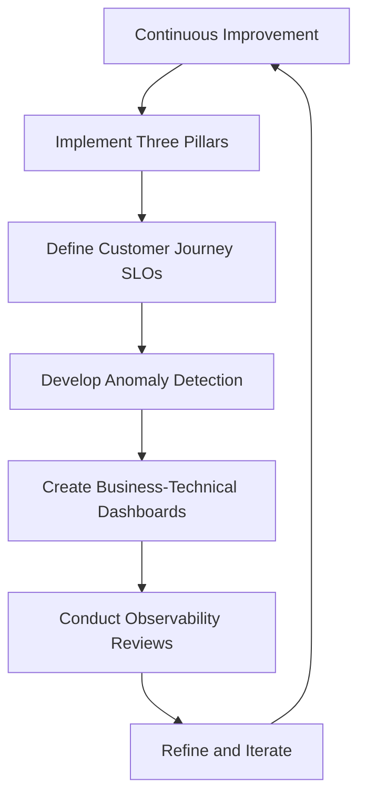

This step-by-step process ensures that observability capabilities are not only implemented but continuously matured, enabling your banking systems to proactively withstand disruptions and maintain customer trust.
## Panel 6: Disaster Recovery as Code
### Scene Description

A team is conducting a full disaster recovery test, replacing outdated manual runbooks with infrastructure-as-code scripts that automatically rebuild their banking platform in a secondary region. Large screens in the room display the following:

- **Automated Recovery Flow:** A step-by-step process where infrastructure components are rebuilt and services are sequentially restored.
- **Verification Tests:** Automated checks confirming that each recovered component is functioning correctly.
- **RTO Dashboard:** A live countdown of recovery time objectives (RTOs) for each service, with most services recovering well within their deadlines.

In one corner of the room, engineers are reviewing test results, closely analyzing transactions that required manual intervention. In another corner, a compliance officer receives real-time, automatically generated documentation that provides evidence of recovery capabilities, ensuring regulatory requirements are met.

Here’s a simplified representation of the automated recovery flow:

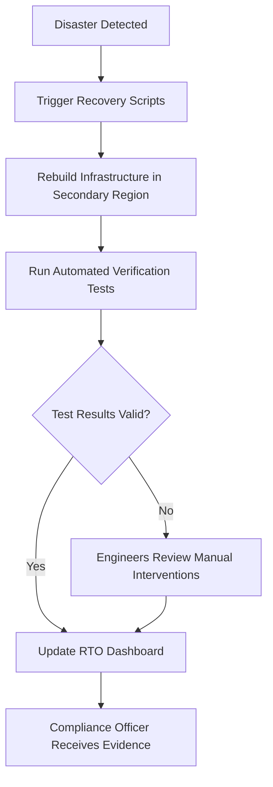

This scene illustrates the seamless integration of automation, engineering expertise, and compliance, showcasing the efficiency and reliability of disaster recovery as code.
### Teaching Narrative
The evolution from manual disaster recovery procedures to "disaster recovery as code" represents a quantum leap in banking resilience. Traditional approaches relied on detailed runbooks that were rarely tested comprehensively and quickly became outdated. Modern resilience engineering treats recovery capabilities as code—automated, version-controlled, and continuously tested.

This approach transforms disaster recovery from theoretical documentation to practical capability. When recovery procedures are codified, they can be validated with the same rigor as application code: through automated testing, code reviews, and incremental improvements. For financial institutions, where recovery capabilities are both regulatory requirements and business necessities, this approach provides robust protection while reducing operational overhead.

The key principle is that recovery mechanisms deserve the same engineering attention as the primary systems they protect. By applying software engineering practices to disaster recovery—including version control, continuous integration, automated testing, and infrastructure as code—organizations create recovery capabilities that work reliably when needed. This is particularly critical for banking systems where failed recovery attempts compound both financial losses and reputational damage.
### Common Example of the Problem

MidwestBank’s disaster recovery practices illustrate the pitfalls of manual approaches. They relied on a set of detailed, 200-page runbooks stored in their regulatory compliance system. While comprehensive on paper, these documents often failed in practice. During annual disaster recovery (DR) tests, numerous issues arose:

| **Aspect**                    | **Manual Approach (MidwestBank)**                                                                  | **Automated Approach (Disaster Recovery as Code)**                                   |
| ----------------------------- | -------------------------------------------------------------------------------------------------- | ------------------------------------------------------------------------------------ |
| **Documentation Maintenance** | 200-page static runbooks were difficult to keep up-to-date, resulting in outdated procedures.      | Recovery scripts are version-controlled, ensuring updates align with system changes. |
| **Error Rate**                | 45% of procedures failed or required significant modifications during testing.                     | Automated scripts are continuously tested, drastically reducing errors.              |
| **Infrastructure Changes**    | Infrastructure updates invalidated key recovery steps (e.g., deprecated tools, changed passwords). | Infrastructure-as-code ensures recovery scripts match the current environment.       |
| **Recovery Time**             | Scheduled 4-hour recovery extended to 26 hours due to troubleshooting and workarounds.             | Automated recovery executed within RTO commitments, often completing early.          |
| **Testing Frequency**         | Annual testing revealed recurring issues that weren’t addressed year-over-year.                    | Continuous testing catches issues early, enabling iterative improvements.            |
| **Regulatory Compliance**     | Extended recovery times jeopardized regulatory commitments.                                        | Automated evidence generation simplifies compliance and ensures adherence.           |

During one test, recovery of the core banking platform spiraled into chaos: critical steps were missing, administrator passwords were outdated, and database restore scripts referenced deprecated tools. Teams spent hours troubleshooting and crafting ad-hoc solutions, ultimately stretching the recovery process to 26 hours—far beyond their 4-hour RTO. Even after passing the test, they encountered post-recovery transaction reconciliation problems. Alarmingly, these issues persisted annually, despite efforts to revise the documentation after each test.

By transitioning to disaster recovery as code, organizations like MidwestBank can avoid these pitfalls. Automating recovery ensures procedures remain up-to-date, reduces human error, and provides reliable, repeatable recovery capabilities critical for financial institutions.
### SRE Best Practice: Evidence-Based Investigation

The SRE approach to disaster recovery transforms manual processes into programmatic, testable systems through several key practices. Below is a checklist and example code snippet to help implement these practices effectively:

#### Checklist for Evidence-Based Investigation
1. **Recovery Automation Assessment**:
   - [ ] Inventory existing recovery procedures and document each step.
   - [ ] Categorize steps as:
     - Fully automatable
     - Partially automatable with human verification
     - Requiring manual intervention
   - [ ] Prioritize automatable steps for implementation.

2. **Infrastructure as Code Implementation**:
   - [ ] Select appropriate IaC tools (e.g., Terraform, AWS CloudFormation).
   - [ ] Codify infrastructure provisioning and configuration.
   - [ ] Validate parity between recovery and production environments.

3. **Recovery Testing Frequency Analysis**:
   - [ ] Identify critical systems and their acceptable recovery times.
   - [ ] Determine testing cadences based on:
     - Deployment frequency
     - Business criticality
     - Recovery complexity
   - [ ] Replace infrequent large-scale tests with smaller, automated validations.

4. **Dependency-Aware Recovery Sequencing**:
   - [ ] Map dependencies between applications and services.
   - [ ] Define and codify startup sequences.
   - [ ] Test sequences to ensure proper recovery order.

5. **Pipeline-Based Verification**:
   - [ ] Integrate recovery validation into CI/CD pipelines.
   - [ ] Automate tests for every infrastructure or application change.
   - [ ] Review pipeline results regularly for discrepancies.

#### Example Code Snippet: Terraform for Recovery Infrastructure
Below is a simplified Terraform example for creating a recovery environment:

```hcl
# Define the recovery environment
provider "aws" {
  region = "us-west-2"
}

resource "aws_vpc" "recovery_vpc" {
  cidr_block = "10.0.0.0/16"
  tags = {
    Name = "recovery-vpc"
  }
}

resource "aws_subnet" "recovery_subnet" {
  vpc_id     = aws_vpc.recovery_vpc.id
  cidr_block = "10.0.1.0/24"
  tags = {
    Name = "recovery-subnet"
  }
}

resource "aws_instance" "recovery_instance" {
  ami           = "ami-12345678"
  instance_type = "t2.micro"
  subnet_id     = aws_subnet.recovery_subnet.id
  tags = {
    Name = "recovery-instance"
  }
}
```

#### Example: CI/CD Pipeline for Recovery Validation
Here is a YAML example for integrating recovery validation into a CI/CD pipeline using GitHub Actions:

```yaml
name: Recovery Validation

on:
  push:
    branches:
      - main

jobs:
  recovery-test:
    runs-on: ubuntu-latest

    steps:
    - name: Checkout Code
      uses: actions/checkout@v3

    - name: Set Up Terraform
      uses: hashicorp/setup-terraform@v2
      with:
        terraform_version: 1.5.0

    - name: Initialize Terraform
      run: terraform init

    - name: Apply Recovery Plan
      run: terraform apply -auto-approve

    - name: Run Recovery Tests
      run: |
        # Add your automated test scripts here
        echo "Running recovery validation tests..."
        exit 0
```

These practical tools and examples help ensure disaster recovery processes are reliable, testable, and aligned with production environments.
### Banking Impact

The business consequences of outdated or untested recovery procedures can be significant, especially for financial institutions. Below is a summary of the key impacts, illustrating the risks and inefficiencies of traditional disaster recovery approaches:

#### Key Impacts Overview
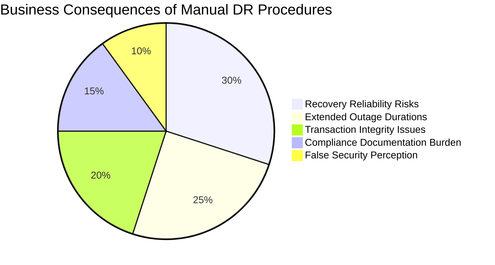

1. **Recovery reliability risks**: MidwestBank's manual approach resulted in only 55% of procedures working as documented. This created significant uncertainty about whether actual disaster recovery would succeed when needed.

2. **Extended outage durations**: Manual procedures typically extended recovery time by 3-5x compared to automated approaches. MidwestBank's 26-hour recovery far exceeded their 4-hour regulatory commitment, which could trigger both customer compensation requirements and regulatory consequences.

3. **Transaction integrity issues**: Inconsistent recovery procedures created data reconciliation problems. MidwestBank discovered approximately 340 transactions required manual reconciliation after recovery, creating both operational overhead and financial risk.

4. **Compliance documentation burden**: Maintaining detailed manual runbooks required approximately 120 person-days annually just for documentation, with most of this effort providing limited actual recovery value.

5. **False security perception**: Regular "successful" DR tests created a false sense of security despite requiring significant real-time troubleshooting. Management believed recovery capabilities were more mature than actual evidence indicated.
### Implementation Guidance

To implement disaster recovery as code in your banking environment:

1. **Convert recovery runbooks to code**: Transform manual procedures into infrastructure-as-code templates and automated scripts. Start with the most critical systems and those with the most frequent changes. Use the same tools and practices used for production deployments (e.g., Terraform, Ansible) to ensure consistency. Below is an example of converting a runbook step into infrastructure-as-code using Terraform:

   **Example: Recovery of a Database Instance**
    ```hcl
    resource "aws_db_instance" "recovery_db" {
      identifier          = "recovery-db-instance"
      engine              = "mysql"
      instance_class      = "db.m5.large"
      allocated_storage   = 100
      username            = var.db_username
      password            = var.db_password
      parameter_group_name = "recovery-db-parameters"
      backup_retention_period = 7
      multi_az            = true
      availability_zone   = "secondary-region-1a"
      tags = {
        "Environment" = "Recovery"
        "Owner"       = "DR-Team"
      }
    }
    ```

2. **Implement recovery testing automation**: Build CI/CD pipelines specifically for validating recovery capabilities. These pipelines should:
    - Automatically deploy recovery environments using infrastructure-as-code.
    - Execute recovery procedures, such as database restores or application redeployments.
    - Verify successful operation through functional tests. For instance, test a payment system by initiating transactions and ensuring they are processed correctly.

   **Example: High-Level CI/CD Pipeline for Recovery Tests**
    ```plaintext
    [Trigger: Scheduled or Manual] --> [Provision Recovery Environment]
         --> [Run Recovery Scripts] --> [Execute Functional Tests]
         --> [Generate Test Reports] --> [Notify Team/Compliance]
    ```

3. **Create graduated recovery testing program**: Develop a multi-tiered testing approach:
    - **Component-level recovery**: Focus on individual elements, such as restoring databases or redeploying specific applications.
    - **Service-level recovery**: Ensure critical services (e.g., payment processing, user authentication) can function end-to-end.
    - **Full environment recovery**: Simulate a catastrophic failure and rebuild all components in a secondary region.

   Example testing schedule:
    - Component-level tests: Weekly
    - Service-level tests: Monthly
    - Full environment tests: Quarterly

4. **Develop recovery metrics dashboard**: Create objective measures of recovery capability, such as:
    - Recovery time actuals vs. objectives (RTA vs. RTO)
    - Percentage of automated vs. manual recovery steps
    - Test success rates
    - Recovery validation coverage

   Use these metrics to identify improvement areas. Here’s an example of a simple recovery metric tracking template:

   | Metric                        | Target Value    | Current Value  |
   | ----------------------------- | --------------- | -------------- |
   | Recovery Time Objective (RTO) | ≤ 4 hours       | 3 hours 45 min |
   | Automation Coverage           | ≥ 90% automated | 85% automated  |
   | Test Success Rate             | 100%            | 97%            |

5. **Establish recovery code management practices**: Treat recovery code with the same rigor as production code:
    - Store recovery scripts in version control systems (e.g., Git).
    - Implement mandatory code reviews for changes to recovery procedures.
    - Use automated testing to validate recovery scripts before deployment.
    - Assign clear ownership for maintaining recovery capabilities, ensuring they evolve alongside production systems.

   **Example Git Workflow for Recovery Code Changes**
    ```plaintext
    [Developer Branch] --> [Pull Request] --> [Code Review] 
         --> [Automated Testing] --> [Merge to Main] --> [Tag Release]
    ```
## Panel 7: Cultivating Resilience Culture
### Scene Description
A quarterly resilience day is in progress, with teams from across the organization participating in resilience-building activities. In one area, developers are presenting "resilience wins" from recent projects, while in another, executives are participating in a tabletop simulation of a major outage. A wall displays the organization's "resilience principles" alongside metrics showing improvement trends. Several teams are engaged in "pre-mortems" for upcoming releases, identifying potential failure modes before deployment. The atmosphere is collaborative rather than accusatory, with teams openly discussing near-misses and lessons learned.
### Teaching Narrative
Technical solutions alone cannot create resilient systems—organizational culture is equally important. Resilience culture is characterized by psychological safety, where team members can report potential issues without fear, and continuous learning, where incidents are seen as improvement opportunities rather than failures. In banking environments, where the consequences of failure are significant, cultivating this culture requires deliberate effort and executive support.

True resilience culture transcends individual teams or technologies. It's reflected in how the organization makes decisions about risk, how it balances innovation with stability, and how it responds when things go wrong. For banking institutions, building this culture means recognizing that resilience isn't the responsibility of a single team—it's a distributed capability that must be embedded throughout the organization, from development practices to operational procedures to executive decision-making.

The most resilient organizations practice what John Allspaw calls "the infinite game"—focusing not on avoiding all incidents but on continuously improving their response capabilities. They recognize that while perfect prevention is impossible, excellent adaptation is achievable. This mindset shift—from preventing failure to managing it gracefully—is what distinguishes mature SRE cultures. For banking systems, this approach creates both technical resilience and the organizational adaptability needed to thrive in a rapidly changing financial landscape.
### Common Example of the Problem

SecureBank prided itself on reliability, enforcing this through a strict "zero tolerance for outages" policy. While seemingly positive, this approach created a problematic culture where teams concealed smaller issues fearing repercussions, near-misses went unreported, and "heroes" who fixed problems quietly were celebrated while systemic improvements were neglected. The culmination of this culture was a major service disruption that affected their mortgage application platform for eight hours. Below is a timeline of the incident progression:

```mermaid
timeline
    title SecureBank Incident Progression
    section Pre-Incident
        Previous Weeks: Three smaller, similar incidents occur but are resolved quietly without reporting.
        Configuration Workarounds: Engineers apply undocumented fixes to avoid blame for mistakes.
    section Incident
        00:00: Mortgage application platform experiences a major outage.
        02:00: Teams begin troubleshooting but lack historical context due to hidden issues.
        04:00: Miscommunication delays root cause identification.
        08:00: Service is restored, but systemic flaws remain.
    section Post-Incident
        Investigation: Warning signs from previous incidents are discovered.
        Cultural Impact: Fear of reporting and focus on "no incidents" suppressed learning opportunities.
        Outcome: Executive team recognizes the need to shift from a blame-oriented culture.
```

Investigators found that engineers avoided documenting certain types of workarounds to prevent "getting in trouble" for configuration mistakes. The executive team's focus on "no incidents" had unintentionally created an environment where learning was suppressed, systemic issues remained unaddressed, and incidents eventually grew larger and more impactful because early warning signs were hidden. This example highlights how a blame-oriented culture can undermine resilience by prioritizing short-term optics over long-term improvement.
### SRE Best Practice: Evidence-Based Investigation

The SRE approach to building resilience culture focuses on creating psychological safety and learning systems through key practices. Below is a checklist to help organizations implement evidence-based investigation techniques effectively:

#### Evidence-Based Investigation Checklist

1. **Blameless Review Standardization**:
   - [ ] Establish consistent, structured protocols for incident and near-miss reviews.
   - [ ] Ensure reviews focus on systems and processes, avoiding individual blame.
   - [ ] Protect individuals involved in incidents while enabling honest analysis of contributing factors.

2. **Learning System Implementation**:
   - [ ] Develop formal mechanisms to capture and share lessons from incidents and near-misses.
   - [ ] Create knowledge repositories to document findings and improvements.
   - [ ] Implement systems for applying insights to prevent recurrence.

3. **Resilience Practice Measurement**:
   - [ ] Define metrics to assess the health of resilience culture (e.g., near-miss reporting rates, post-incident improvement adoption).
   - [ ] Regularly track and review these metrics with the same rigor as technical reliability indicators.
   - [ ] Use measurement results to guide cultural and process improvements.

4. **Safety Language Development**:
   - [ ] Create a shared vocabulary for discussing reliability that emphasizes learning rather than blame.
   - [ ] Train leaders and teams to use language that fosters psychological safety and encourages open dialogue.
   - [ ] Promote frameworks and terminology that support continuous improvement.

5. **Cross-Functional Resilience Modeling**:
   - [ ] Facilitate joint resilience activities across development, operations, business, and compliance teams.
   - [ ] Align technical and business perspectives through shared goals and incentives for resilience investments.
   - [ ] Encourage collaboration to identify and mitigate potential failure modes holistically.

#### Key Guiding Principle:
Remember, evidence-based investigation is not just about identifying causes—it's about creating a culture where teams can learn and adapt together. Use this checklist as a foundation to embed resilience into your organization's DNA.
### Banking Impact

The business consequences of punitive or blame-oriented reliability cultures can have significant and measurable impacts on banking institutions. The table below summarizes key issues and their specific effects:

| **Issue**                   | **Impact**                                                                                      | **Specific Example**                                                                            |
| --------------------------- | ----------------------------------------------------------------------------------------------- | ----------------------------------------------------------------------------------------------- |
| **Hidden risks**            | Near-misses and smaller issues are not reported, preventing early detection of larger problems. | Approximately 70% of near-misses at SecureBank went unreported, leading to avoidable incidents. |
| **Knowledge silos**         | Critical expertise remains isolated with individuals, increasing dependency on key personnel.   | When key staff left SecureBank, recovery techniques and workarounds were often lost.            |
| **Misallocated investment** | Resources are spent on areas that do not address the most critical vulnerabilities.             | SecureBank spent $2.3M hardening infrastructure while ignoring application design issues.       |
| **Delayed innovation**      | Excessively cautious processes stifle progress and slow feature delivery.                       | SecureBank's feature delivery timelines were 40% slower than competitors.                       |
| **Burnout and turnover**    | High-pressure environments increase staff attrition, reducing institutional knowledge.          | SecureBank experienced 35% annual turnover in key technical roles.                              |

By addressing these issues, organizations can build a resilience culture that not only reduces operational risks but also fosters innovation and long-term sustainability.
### Implementation Guidance

To cultivate resilience culture in your banking organization, follow these steps:

#### Checklist for Implementation

1. **Reframe Incident Discussions**
   - Shift from blame-focused language to learning-focused language.
   - Ask "What system conditions enabled this?" instead of "Who caused this?"
   - Celebrate teams that proactively identify and address risks.
   - Train leaders in blameless review techniques and psychological safety principles.

2. **Establish Resilience Champions**
   - Identify resilience advocates across teams.
   - Empower them with responsibilities like promoting resilience practices, facilitating learning reviews, and integrating resilience considerations into workflows.

3. **Develop Resilience Feedback Loops**
   - Create regular "resilience reviews" to share near-misses, lessons learned, and improvement ideas.
   - Design processes to systematically prioritize and implement resilience improvements.
   - Ensure feedback loops are continuous and actionable.

4. **Align Incentives with Resilience Goals**
   - Evaluate team and individual performance metrics to ensure alignment with resilience behaviors.
   - Replace "days without incidents" metrics with indicators that emphasize near-miss reporting, risk identification, and collaboration.
   - Reward behaviors that contribute to organizational resilience.

5. **Invest in Resilience Simulations**
   - Conduct regular resilience-building exercises such as tabletop simulations, game days, and chaos engineering experiments.
   - Design these activities as safe, low-stress opportunities for teams to practice and build resilience skills.
   - Involve business stakeholders to enhance shared understanding of resilience trade-offs.

#### Example Workflow for Building Resilience Culture
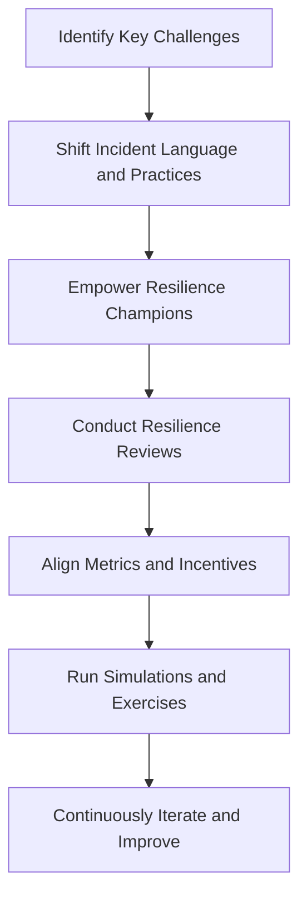

This checklist provides a clear roadmap for embedding resilience culture throughout your banking organization. By following these steps, you can create a culture that not only prioritizes technical resilience but also fosters organizational adaptability.