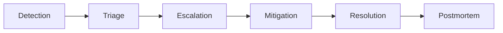
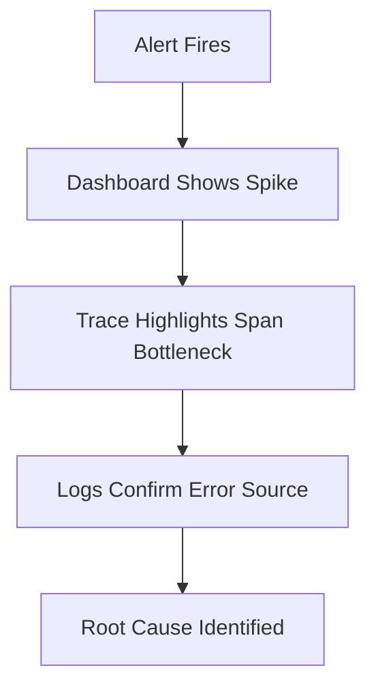

**Day 7. Welcome to the fire.**  
This is the day you stop *theorizing* about observability and start learning how to **respond** when reality shatters your SLOs.

Mina’s back—and she’s here to teach the art of **incident response**. Not the checklist. Not the Jira ticket. The real thing: triage, communication, timeline clarity, and that moment when the logs make sense and the page load drops back to 300ms.

---

# 🧱 **Day 7: Incident Response & Postmortems**

**Character:** Mina – Seoul  
**Style:** Calm, surgical, observability native  
**Vibe:** “When systems fall apart, the team must not.”

---

## 🎯 Learning Objectives

### 🔍 Beginner
- Understand the lifecycle of an incident  
- Learn the roles involved in a response  
- Know how to start a postmortem

### 🧩 Intermediate
- Build structured incident timelines from observability signals  
- Conduct live triage using logs, metrics, and traces  
- Distinguish severity levels, escalation paths, and communication patterns

### 💡 SRE-Level
- Design playbooks and automated responders  
- Use signal correlation for faster time-to-detect (TTD) and time-to-recover (TTR)  
- Facilitate high-signal, blameless postmortems and implement learnings

---

## 💥 Incident Hook: “The Cache That Crashed Checkout”

> “Checkout latency doubled. Cart abandonments soared.  
> The cache backend had hit a limit—but nobody was watching its eviction metrics.  
> The frontend team saw retries.  
> The backend team saw 200 OKs.  
> Support was flooded.  
> I opened the trace, followed the span to the failed cache lookup, and paged the right team.  
> It took 3 hours. It could’ve taken 15 minutes.”

---

## 🧠 Core Concepts

### 🔹 The Incident Lifecycle

Each stage has different tools, priorities, and roles.

---

### 🔹 Severity Definitions

| Level | Description | Example | Action |
|-------|-------------|---------|--------|
| SEV-1 | Critical outage | Checkout failing for all users | Page immediately, all-hands |
| SEV-2 | Partial disruption | Latency spike in 1 region | Triage, async resolution |
| SEV-3 | Annoyance | Broken dashboard, retry logic | Schedule fix, no page |

> Define these early. Don’t improvise at 2am.

---

### 🔹 Incident Roles

| Role | Responsibility |
|------|----------------|
| **Incident Commander** | Owns comms, decisions, timeline |
| **Subject Matter Experts** | Investigate and mitigate |
| **Communications Lead** | Updates stakeholders |
| **Scribe** | Captures events, timestamps, key actions |

🧠 The commander isn’t always the most technical—they’re the calmest voice in chaos.

---

### 🔹 Triage Flow Using Observability

> You *must* be able to pivot between signals. Otherwise, you’re hunting in the dark.

---

### 🔹 Building the Incident Timeline

**Structured Timeline Format:**

| Timestamp | Action | Who | Signal |
|-----------|--------|-----|--------|
| 10:42 | Alert fired | PagerDuty | Metric (latency spike) |
| 10:44 | IC assigned | Auto | — |
| 10:48 | Logs show auth retries | SRE | Log panel |
| 10:50 | Cache full | Backend | Trace to span to cause |
| 10:55 | Mitigation: Flush + scale | Backend | Metric drop observed |
| 11:10 | Resolved | IC | All signals green |
| 11:30 | Postmortem begins | Scribe | — |

---

## 🧪 Simulation Exercise

You are given:
- A log dump with repeated `auth_retry_failed`
- A trace showing an auth service span taking 1.4s
- A metric chart showing a spike in `/login` 5xx

📌 **Task:**
- Write the first 5 entries of the incident timeline
- Assign severity
- Identify mitigation steps based on signals

---

## 🛠 Postmortem Structure

**Template:**

- **Summary:** What happened, who was affected  
- **Impact:** Systems/users/business  
- **Timeline:** Key events and decisions  
- **Root cause:** What triggered it  
- **Mitigation:** What was done  
- **Lessons learned:** Gaps in tooling, process, people  
- **Action items:** With owners and deadlines

> **Blameless** means: assign ownership, not shame.

---

## 🕳️ Common Pitfalls

- Paging everyone = nobody knows who’s leading  
- No timeline = “I think we fixed it?”  
- Finger-pointing = no learning  
- Logs with no IDs = no timeline building  
- Only using metrics = no context

---

## 📜 Mina’s Commandments

1. “No system is reliable without a human response layer.”  
2. “Trace the failure, don’t guess the cause.”  
3. “A good timeline beats a bad memory.”

---

## 🤝 Handoff to Tomorrow

> “Tomorrow, Asha returns—this time to talk money.  
> You’ve built observability. But at what cost?  
> Log volume. Trace storage. Metrics retention.  
> She’ll help you cut noise and keep signal.”

---

## 📦 Day 7 Artifacts

- ✅ Mermaid Diagrams:
  - Incident lifecycle
  - Triage flow
- ✅ Simulation timeline builder
- ✅ Role guide + incident templates
- ✅ SEV level table
- ✅ Expanded postmortem doc structure
- ✅ Commandments + pitfalls

---

You want to:
- Continue to **Day 8: Cost & Volume Management** with Asha?  
- Or pause here to generate Day 7 diagrams for Kroki?

You're seven bricks deep in a real SRE wall. Almost there.