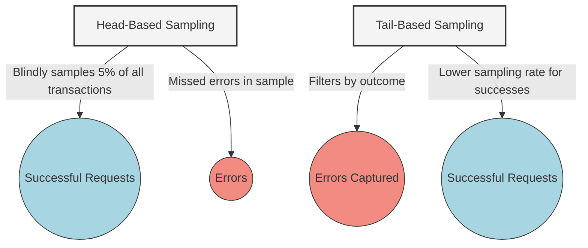
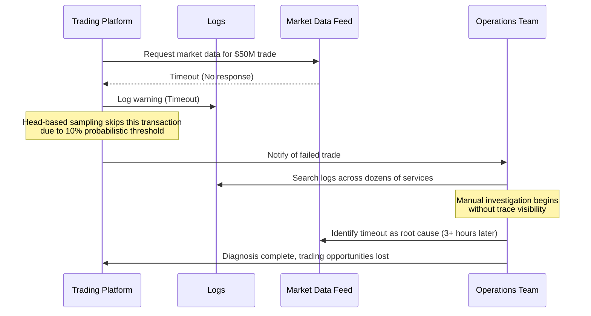
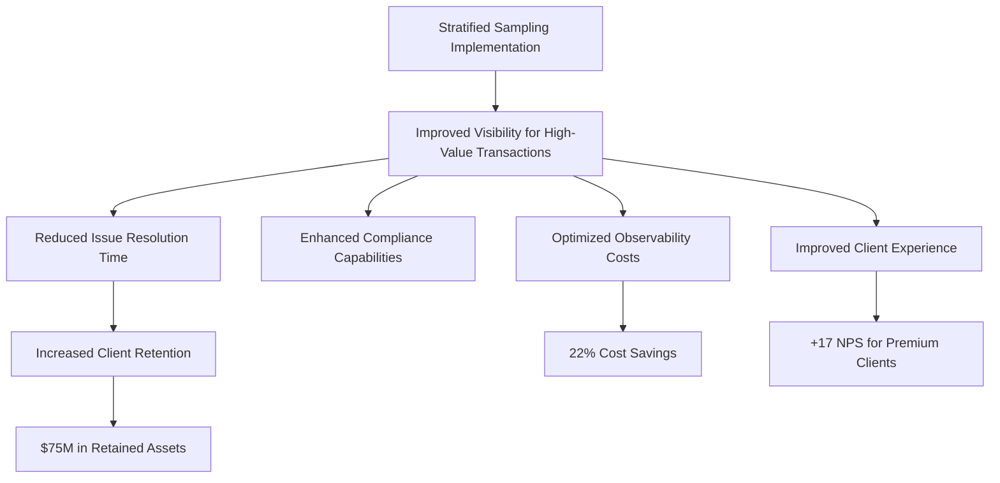
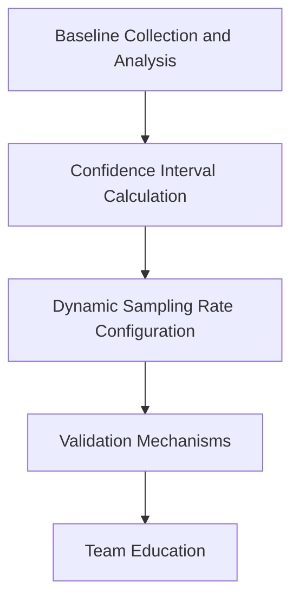
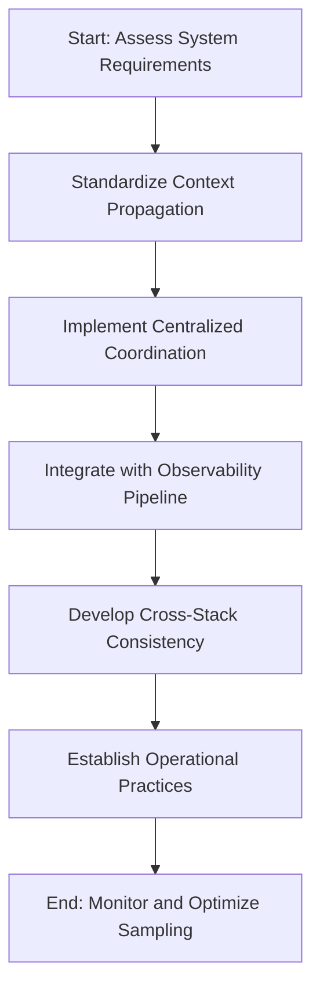
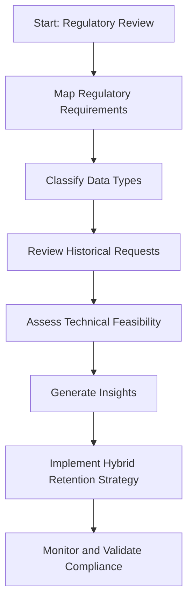

# Chapter 7: Intelligent Sampling

## Chapter Overview

Welcome to the brutal reality of observability: collecting every metric, trace, and log is like trying to drink from a firehose—except you’re paying by the gallon and still dying of thirst. This chapter is a guided tour through the graveyard of "more is better" telemetry thinking. You'll watch SREs burn budgets, miss incidents in oceans of noise, and then claw their way back to sanity with intelligent sampling. We’ll slice through the naive “collect it all” dogma and show you how statistically sound, business-aligned, and compliance-ready sampling isn't just for the penny-pinchers—it’s for anyone who actually wants working dashboards, actionable data, and a job next year. If you’ve ever watched your observability bill eat your bonus or dug through terabytes of logs for a single error, this chapter is your intervention.

## Learning Objectives

- **Identify** the pitfalls of naive, full-fidelity data collection and its business consequences.
- **Design** intelligent sampling strategies that preserve outliers and maintain statistical significance.
- **Differentiate** between head-based, tail-based, and stratified sampling—and **select** the right tool for the job.
- **Implement** context-aware, business-driven sampling rules that align observability with what actually matters.
- **Calculate** and **validate** statistical confidence intervals in sampled datasets to silence the skeptics.
- **Deploy** adaptive sampling systems that react to real-time anomalies (not just wishful thinking).
- **Standardize** sampling decision propagation and coordination across polyglot microservices.
- **Integrate** compliance requirements into your sampling strategy and **defend** it to regulators.

## Key Takeaways

- Collecting 100% of telemetry is the fastest way to bankrupt your ops—and still miss the only data point that matters during an incident.
- Most observability data is landfill. Intelligent sampling is the recycling plant: keep the gold, trash the noise, and keep costs out of the stratosphere.
- Head-based sampling is easy but dumb; tail-based is harder but actually catches the stuff that kills you. Don’t be lazy where it counts.
- Uniform sampling treats a $10,000 trade and a balance check like twins. Stratified sampling finally gets your observability spend where the business wants it: on the whales, not the minnows.
- "Trust but verify" isn’t just for arms control—statistical validation is your only defense when the CFO and the risk team ask hard questions.
- Adaptive sampling isn’t a nice-to-have. Static rates are a relic; your telemetry needs should spike when your systems do.
- Inconsistent sampling across microservices guarantees one thing: the root cause is always in the missing part of the trace.
- Regulators don’t care about your storage bill. If you can’t produce the right data on demand, you might as well hand them your wallet.
- Implementing sampling without business alignment and compliance awareness is just a fancier way to shoot yourself in the foot—only now it’s automated.
- Sampling is not a cost-cutting hack. It’s a survival skill for anyone running systems at scale and hoping to keep both their uptime and budget intact.

## Panel 1: The Firehose Fallacy

### Scene Description

A stressed SRE named Maya stares in dismay at a monitoring dashboard showing a payment processing system generating terabytes of trace data. As transactions spike during a sales event, the observability cost gauge rapidly climbs into the red zone. Her dashboard is overwhelming, with every trace, log, and metric flooding in at full volume, making it nearly impossible to distinguish meaningful anomalies from noise.

Meanwhile, her colleague Alex confidently adjusts sampling parameters on a similar system. Alex's dashboard is streamlined and focused, with anomalies and critical paths clearly highlighted. The observability cost gauge stays firmly in the green zone, demonstrating the efficiency of intelligent sampling.

```
Maya's Dashboard:                 | Alex's Dashboard:
----------------------------------|----------------------------------
[Error Rate: ???]                 | [Error Rate: 2%]
[Cost Gauge: RED]                 | [Cost Gauge: GREEN]
[Trace Data: 100% collected]      | [Trace Data: Representative Sample]
[Anomalies: Hidden in noise]      | [Anomalies: Clearly visible]
```

This contrast highlights the impact of their approaches: Maya's reliance on collecting everything leads to high costs and low clarity, while Alex's use of intelligent sampling ensures actionable insights and sustainable observability.

### Teaching Narrative

The Firehose Fallacy is the misguided belief that collecting 100% of observability data is necessary for effective system monitoring. This approach treats every transaction, log line, and metric as equally valuable, leading to unsustainable data volumes and costs. In reality, not all telemetry data provides equal insight, and collecting everything often produces more noise than signal.

Intelligent sampling provides a statistical approach to data collection that maintains visibility into system behavior while drastically reducing data volume. Rather than blindly reducing collection rates across the board, intelligent sampling uses algorithms to ensure representation of both normal operation and anomalous patterns. This approach recognizes that the value of observability data isn't in its volume but in its ability to provide actionable insights.

Core principles of intelligent sampling include preserving outliers, maintaining statistical significance, adjusting rates based on system conditions, and focusing on the critical path. When implemented correctly, sampling rates as low as 1-5% can maintain complete visibility into system health while reducing observability costs by orders of magnitude.

### Common Example of the Problem

During Black Friday sales, Global Banking Services experienced a 500% increase in payment processing volume through their online platform. The operations team, concerned about maintaining visibility during this critical period, configured their distributed tracing platform to capture 100% of all transactions. Within two hours, their observability platform costs were projected to exceed the monthly budget by 300%. Worse, the excessive data volume overwhelmed their analysis tools, actually reducing their ability to identify and resolve emerging issues. When a real problem occurred in the credit card authorization service, engineers spent 47 minutes searching through mountains of trace data before identifying the root cause, significantly extending the incident's customer impact.

#### Key Mistakes Checklist

- **100% Data Collection:** Capturing every transaction without considering the diminishing value of excessive data led to skyrocketing costs.
- **Overwhelmed Analysis Tools:** The high volume of data exceeded the capacity of their tools, slowing down troubleshooting processes.
- **Delayed Root Cause Identification:** Engineers spent nearly an hour sifting through unnecessary data to isolate the actual problem.
- **Failure to Implement Sampling:** No intelligent sampling strategy was applied, missing an opportunity to balance visibility with cost and efficiency.
- **Increased Customer Impact:** Prolonged incident resolution extended the duration of customer-facing issues, harming user trust.

By avoiding these common mistakes and adopting intelligent sampling, similar crises can be mitigated with reduced costs, faster response times, and minimal customer impact.

### SRE Best Practice: Evidence-Based Investigation

The evidence-based approach to solving the Firehose Fallacy involves implementing intelligent sampling strategies guided by statistical principles rather than gut feelings. In a controlled experiment, the Global Banking SRE team demonstrated that a 5% uniform sampling rate provided statistically equivalent visibility to 100% collection for normal transactions while reducing data volume by 95%. They further validated this approach by retrospectively analyzing previous incidents, confirming that the reduced dataset would have contained all the necessary signals to detect and diagnose the issues.

More sophisticated approaches implement error-biased sampling that automatically preserves anomalous transactions while sampling normal paths. The team demonstrated that a hybrid strategy—2% baseline sampling for all transactions plus 100% capture of error cases—would have identified all significant incidents in their six-month lookback period while reducing data volume by over 90%.

Below is a simple example of error-biased sampling logic implemented in Python-like pseudocode:

```python
def sample_transaction(transaction):
    """
    Intelligent sampling function to determine whether to retain a transaction.
    - Baseline: 2% sampling for normal transactions
    - Anomalous transactions (e.g., errors): 100% sampling
    """
    if transaction.is_error:
        return True  # Always capture error transactions
    else:
        return random.random() < 0.02  # 2% sampling for normal transactions

# Example usage
for transaction in transactions_stream:
    if sample_transaction(transaction):
        send_to_observability_pipeline(transaction)
```

This evidence-based approach shifts observability from a "more is better" mindset to a "signal-to-noise optimization" perspective, where the goal becomes maximizing useful information while minimizing data volume. By using techniques like error-biased sampling, teams can ensure that critical signals are preserved without being overwhelmed by irrelevant data.

### Banking Impact

The business consequences of the Firehose Fallacy in banking environments extend far beyond direct observability costs. When Bank of Commerce implemented intelligent sampling for their core banking platform, they documented several critical business impacts, summarized in the table below:

| **Impact Area** | **Before Intelligent Sampling** | **After Intelligent Sampling** | **Change** |
| ------------------------- | ------------------------------------------ | --------------------------------------------- | ------------------------------------- |
| **Cost Reduction** | $4.45M annual observability costs | $750K annual observability costs | **-83%** (-$3.7M annually) |
| **Incident Response** | Mean time to resolution: 2.7 hours | Mean time to resolution: 1.7 hours | **-37%** (1 hour faster) |
| **Performance** | Transaction throughput: baseline | Transaction throughput: +7% | **+7%** |
| | Average response time: baseline (110ms) | Average response time: -12% (97ms) | **-12%** |
| **Scalability** | Struggled with 100% transaction volume | Handled 300% transaction volume without | **+300% capacity** |
| | increase during promotional events | budget increase | |
| **Regulatory Compliance** | Excessive data collection for compliance | Targeted 100% sampling for compliance-related | Full compliance maintained at reduced |
| | transactions bloating overall data volumes | cost and data volumes | |

These results highlight that intelligent sampling is not merely a cost-reduction measure but a strategic enabler of operational efficiency, scalability, and customer experience improvement. By reducing noise and focusing on actionable insights, the Bank of Commerce enhanced its core systems' reliability, performance, and compliance capabilities without incurring additional costs.

### Implementation Guidance

To implement intelligent sampling in your banking observability strategy:

1. **Baseline Establishment**: Conduct a two-week period of full-fidelity collection during normal operations to establish statistical baselines for transaction patterns. Use this data to identify key transaction types, error distributions, and performance characteristics. This baseline will inform your sampling strategy design and serve as a validation reference.

2. **Sampling Strategy Design**: Develop a multi-tiered sampling strategy with different rates for different transaction types:

   - Implement 100% sampling for error cases and outliers
   - Apply higher sampling rates (10-20%) to critical financial transactions (payments, transfers)
   - Use lower sampling rates (1-5%) for informational transactions (balance checks, account views)
   - Configure baseline plus outlier sampling for high-volume operations

   ```mermaid
   graph TD
       A[All Transactions] -->|Error Cases| B[100% Sampling]
       A -->|Critical Transactions<br>(10-20%)| C[Higher Sampling Rates]
       A -->|Informational Transactions<br>(1-5%)| D[Lower Sampling Rates]
       A -->|High-Volume Operations| E[Baseline + Outlier Sampling]
       B & C & D & E --> F[Aggregated Sampled Data]
   ```

3. **Technical Implementation**: Deploy OpenTelemetry collectors with properly configured sampling processors:

   - Implement head-based sampling at service entry points
   - Configure tail-based sampling for error preservation
   - Set up consistent sampling decisions propagation through trace context
   - Create bypass mechanisms for high-value transactions

4. **Validation Testing**: Before full production deployment, run parallel systems (one with 100% collection, one with sampling) for a two-week comparison period. Analyze both datasets to verify that:

   - All significant incidents are captured in the sampled dataset
   - Sampled data accurately represents overall system health
   - Performance metrics derived from samples are statistically valid
   - Business-critical transaction flows maintain adequate visibility

5. **Monitoring and Adjustment**: Implement ongoing validation of your sampling approach:

   - Create dashboards comparing sampled metrics against periodic full-fidelity baselines
   - Configure alerts for unexpected changes in error distributions that might suggest sampling blind spots
   - Establish a regular review cycle to adjust sampling rates based on changing transaction patterns
   - Document the statistical confidence levels of your sampled metrics

## Panel 2: Head-Based vs. Tail-Based Sampling

### Scene Description

Two side-by-side monitoring stations illustrate distinct approaches to transaction sampling in a trading platform:

- **Left Station (Head-Based Sampling)**: Displays a uniformly sampled set of transactions. A large volume of successful requests dominates the view, making errors nearly invisible. Errors are scattered sparsely, and their detection is unreliable due to the blind sampling approach.

- **Right Station (Tail-Based Sampling)**: Highlights a sampling strategy that captures every error condition. Despite only sampling a fraction of the total transactions, this approach ensures all anomalies and failures are included, providing a clearer view of critical issues while minimizing unnecessary data collection.

Below is a simplified diagram representing the two stations and their sampling outcomes:



An SRE gestures toward the improved error detection rates in the right station, emphasizing the comprehensive visibility provided by tail-based sampling. Meanwhile, a financial controller highlights the cost savings achieved despite retaining only the most critical data. Together, these perspectives underscore the trade-offs between simplicity and intelligence in sampling strategies.

### Teaching Narrative

In distributed systems observability, two primary sampling approaches exist: head-based and tail-based sampling, each with distinct advantages and limitations.

Head-based sampling makes the collection decision at the beginning of a transaction, before knowing its outcome. This approach is simple to implement and resource-efficient, as the sampling decision occurs early in the process. For example, a trading platform might decide to trace 5% of all transactions by generating a random number at the entry point and only collecting telemetry when that number falls below the threshold. This method ensures statistical representation of overall traffic patterns but has a critical flaw: it samples blindly without knowledge of transaction outcomes.

Tail-based sampling, by contrast, makes collection decisions after transactions complete, when their characteristics (duration, error status, business importance) are known. This allows for far more intelligent data collection focused on anomalies and failures. A trading platform using tail-based sampling might buffer transaction data temporarily, then only persist complete traces for transactions that resulted in errors or exceeded performance thresholds. While more complex to implement, this approach ensures every error is captured while successful transactions are sampled at lower rates.

The fundamental trade-off between these approaches is between implementation simplicity and sampling intelligence. Head-based sampling is easier to implement but risks missing critical error cases, while tail-based sampling provides better visibility into failures but requires more sophisticated buffering and decision logic.

### Common Example of the Problem

Investment Banking Trading Ltd. implemented distributed tracing across their algorithmic trading platform to improve visibility into order execution paths. Initially, they chose head-based sampling with a 10% collection rate to manage costs. During the first month of operation, traders reported several instances of failed high-value trades that the operations team couldn't diagnose properly. Post-incident analysis revealed that due to head-based sampling, approximately 90% of error cases weren't captured in traces since the sampling decision was made before knowing the transaction outcome.

#### Sequence of Events in the $50M Trade Failure



In one particularly costly incident, a $50M securities trade failed during market volatility, but the trace data was not captured due to the probabilistic sampling approach. Without detailed telemetry, the team spent over three hours manually investigating logs across dozens of services before identifying the root cause in a third-party market data feed timeout. The delay in diagnosis resulted in missed trading opportunities estimated at $420,000 in unrealized gains.

This incident highlights the critical limitation of head-based sampling: by making collection decisions without knowledge of transaction outcomes, significant failures can go unobserved, delaying resolution and compounding financial losses.

### SRE Best Practice: Evidence-Based Investigation

The SRE team conducted a comprehensive analysis of their sampling approach, comparing observed error rates in logs against those captured in traces. The evidence revealed that head-based sampling was capturing only 8-12% of error cases, closely matching the overall sampling rate, which confirmed that errors were being missed randomly rather than systematically.

To address this, they implemented a hybrid approach that combined lightweight head-based sampling for baseline visibility with comprehensive tail-based sampling for error preservation. This approach required the following steps:

| Step | Action | Benefit |
| ---- | ------------------------------------------------------------------------------------------------------------------------------------------ | ------------------------------------------------------------------------------------------- |
| 1 | Configure a small percentage (e.g., 3%) of transactions for full tracing from the beginning using head-based sampling. | Ensures baseline visibility into overall traffic patterns with minimal overhead. |
| 2 | Implement a buffering mechanism to temporarily hold trace data for all transactions. | Enables a window for retrospective evaluation of transaction outcomes. |
| 3 | Create decision logic to evaluate completed transactions against preservation criteria (e.g., errors, latency thresholds, business value). | Focuses on capturing high-value diagnostic data while minimizing unnecessary storage. |
| 4 | Persist complete traces for transactions meeting the criteria, while discarding others. | Guarantees critical anomalies and failures are retained for analysis, reducing data volume. |

The evidence-based validation of this hybrid approach demonstrated the following results:

- **Error Coverage:** Captured 100% of error cases and high-latency outliers.
- **Data Efficiency:** Reduced overall data volume by 85% compared to full tracing.
- **Diagnostic Value:** Provided significantly more actionable insights for incident resolution despite increased implementation complexity.

This hybrid strategy highlights how combining sampling methods can balance resource efficiency with comprehensive error detection, enabling effective evidence-based investigation in high-performance systems.

### Banking Impact

The business impact of implementing intelligent tail-based sampling extended beyond improved technical observability. The following table summarizes the key metrics and outcomes achieved:

| **Metric** | **Before Implementation** | **After Implementation** | **Impact** |
| ----------------------------------------- | ------------------------- | ------------------------------ | ---------------------------------------------------------------------- |
| **Mean Time to Resolution (MTTR)** | ~12 hours | ~3.8 hours | 68% reduction, minimizing trading losses. |
| **Average Financial Impact per Incident** | $215,000 | $47,000 | Significant cost savings per incident. |
| **Error Capture Rate** | ~10% | ~100% | Ensured complete visibility into critical failures. |
| **Observability Costs** | Baseline | 67% reduction | Reduced costs while improving error detection. |
| **Order Execution Latency** | ~160ms | ~152ms | 5% improvement, enhancing competitiveness in time-sensitive trades. |
| **Customer Confidence** | Diagnoses took hours | Diagnoses completed in minutes | Improved institutional client satisfaction scores. |
| **Regulatory Compliance** | Partial traceability | 100% traceability | Fully satisfied audit and compliance requirements. |
| **ROI** | Not applicable | >700% | Exceptional return on investment from incident impact reduction alone. |

This optimization project demonstrated how tail-based sampling can deliver substantial business value, from regulatory alignment to cost efficiency and client satisfaction, while maintaining technical excellence.

### Implementation Guidance

To implement effective head-based and tail-based sampling in your banking systems, use the following checklist and example logic to guide your implementation:

______________________________________________________________________

#### Checklist for Implementation

1. **Service Topology Analysis**

   - [ ] Map the complete service architecture to identify optimal sampling points.
   - [ ] Identify edge services for head-based sampling decisions.
   - [ ] Locate aggregation points suitable for tail-based evaluation.
   - [ ] Determine natural buffering locations in the architecture.
   - [ ] Document transaction flows to ensure consistent propagation.

2. **Buffering Mechanism Setup**

   - [ ] Configure in-memory span storage with appropriate size limits.
   - [ ] Implement buffer management policies to prevent memory exhaustion.
   - [ ] Set up data expiration mechanisms for uncompleted traces.
   - [ ] Create evaluation triggers for completed transaction paths.

3. **Sampling Decision Logic**

   - [ ] Configure preservation rules for all error cases (e.g., HTTP 4xx/5xx, exceptions).
   - [ ] Add latency thresholds based on p95/p99 baselines for each service.
   - [ ] Include business value parameters (e.g., transaction amount, customer tier).
   - [ ] Establish preservation rules for specific transaction types requiring full visibility.

4. **Consistent Propagation**

   - [ ] Implement W3C TraceContext headers with sampling parameters.
   - [ ] Modify service instrumentation to respect upstream sampling decisions.
   - [ ] Create forced-sampling mechanisms for high-value transaction types.
   - [ ] Test cross-service propagation to verify consistent behavior.

5. **Monitoring Effectiveness**

   - [ ] Create dashboards comparing error rates in logs versus traces.
   - [ ] Perform statistical validation comparing sampled to periodically collected full datasets.
   - [ ] Configure alerts for sampling inconsistencies or unexpected pattern changes.
   - [ ] Establish regular review processes to refine decision criteria.

______________________________________________________________________

#### Example: Tail-Based Sampling Decision Logic

The following pseudocode demonstrates a basic tail-based sampling decision logic:

```python
# Pseudocode for tail-based sampling decision logic
def tail_sampling_decision(transaction):
    # Step 1: Error-based preservation
    if transaction.status_code in [400, 500]:
        return True  # Always preserve error transactions

    # Step 2: Latency-based preservation
    if transaction.duration > latency_threshold_p99:
        return True  # Preserve high-latency transactions

    # Step 3: Business value-based preservation
    if transaction.amount > high_value_threshold or transaction.customer_tier == "VIP":
        return True  # Preserve high-value or VIP transactions

    # Step 4: Default sampling rate
    return random.random() < default_sampling_rate
```

This logic can be adapted to your specific business requirements by adjusting thresholds and decision criteria. Ensure the logic is tested thoroughly in staging environments before deployment.

______________________________________________________________________

#### Tail-Based Sampling Flow Diagram (Text Representation)

```
                       +---------------------------+
Transaction Received --> Buffer Transaction Data   |
                       +---------------------------+
                                  |
                                  v
               +----------------------------------+
               | Evaluate Transaction Criteria    |
               | - Errors?                       |
               | - Latency?                      |
               | - Business Value?               |
               +----------------------------------+
                                  |
               +------------------+------------------+
               |                                     |
        Preserve Trace                        Discard Trace
```

Use this flow to design your tail-based sampling evaluation pipeline.

By following this checklist and example logic, you can implement a robust sampling strategy that balances efficiency and observability.

## Panel 3: Stratified Sampling for Business Context

### Scene Description

A wealth management platform dashboard displays a table summarizing the sampling rates applied to different customer segments:

```
+-------------------+-----------------------------+-------------------+
| Customer Segment  | Sampling Rate (%)          | Notes             |
+-------------------+-----------------------------+-------------------+
| Platinum          | 15%                        | High-value tier   |
| Regular           | 3%                         | Standard coverage |
| New Accounts      | 100%                       | Full visibility   |
+-------------------+-----------------------------+-------------------+
```

Next to the table, the dashboard includes a dynamic graph showing real-time sampling rates across segments, emphasizing the higher sampling rates for critical transactions. A "New Account" badge highlights the 100% sampling applied to onboarding traffic.

In the scene, a business analyst and an SRE review this dashboard. The analyst nods in approval, confident in the complete visibility for high-priority transactions while appreciating the overall cost efficiency. The SRE explains how stratified sampling aligns observability with business priorities, ensuring optimal resource utilization.

### Teaching Narrative

Stratified sampling introduces business context to observability data collection by applying different sampling rates to different transaction categories. This approach recognizes that transactions vary widely in their business importance, and sampling strategies should reflect these differences.

Unlike simplistic technical sampling that treats all transactions equally, stratified sampling segments requests based on business attributes such as customer tier, transaction value, or feature novelty. This ensures that high-business-value operations receive proportionally higher observability coverage, creating alignment between observability investment and business priorities.

In implementing stratified sampling, we define sampling dimensions and rates based on business impact. For example, a banking system might sample:

- 100% of transactions over $10,000
- 50% of transactions from new customers in their first 30 days
- 25% of transactions from premium account holders
- 5% of standard transactions from established customers

This approach ensures comprehensive visibility into high-value areas while applying more aggressive sampling to routine operations. The key technical challenge lies in consistently propagating business context through the distributed system to ensure sampling decisions have access to relevant attributes. This typically requires standardized context propagation through headers or metadata that carries business parameters alongside the technical request.

Stratified sampling creates a direct bridge between observability practices and business objectives, ensuring that technical decisions about data collection directly reflect business priorities rather than treating all transactions with equal technical interest.

### Common Example of the Problem

Wealth Partners Bank implemented distributed tracing across their digital investment platform but quickly encountered both cost challenges and visibility gaps. Their initial approach used uniform 5% sampling across all operations, which created two significant issues:

| **Aspect** | **Uniform Sampling (5%)** | **Stratified Sampling** |
| --------------------------- | ------------------------------------------------------------------------------------------------------------------- | ---------------------------------------------------------------------------------------------------------------------------- |
| **High-Value Transactions** | Only 5% of high-net-worth client interactions were captured, leading to diagnostic blind spots for critical issues. | 100% of high-value transactions (e.g., trades over $5M) are captured, ensuring complete visibility for critical diagnostics. |
| **Routine Operations** | Over 80% of collected observability data came from low-value operations like balance checks or portfolio views. | Sampling rates for routine operations are reduced (e.g., 5%), significantly lowering data collection volume. |
| **Incident Resolution** | Limited diagnostic data for key transactions delayed resolution of platform stability incidents. | High-priority transactions are well-represented, enabling faster incident resolution. |
| **Cost Efficiency** | High data collection costs due to excessive volume of low-value traces. | Observability budget is optimized by focusing on business-critical areas while reducing low-value data. |

#### Scenario Breakdown

During a major platform stability incident, the team discovered they had captured only 4 of 83 problematic trading sessions for clients with over $5M in assets. Simultaneously, thousands of traces were collected for routine information requests from lower-tier accounts, which contributed little to resolving the issue. This misalignment between business priority and observability coverage significantly extended the incident resolution time.

By adopting stratified sampling, Wealth Partners Bank could instead ensure comprehensive visibility into high-value transactions, such as trades from high-net-worth clients, while reducing unnecessary data collection for low-impact operations. This alignment of observability efforts with business priorities would have provided the diagnostic coverage needed to quickly address the incident without overspending on low-value data.

### SRE Best Practice: Evidence-Based Investigation

The SRE team implemented a data-driven approach to realign their sampling strategy with business priorities. They began by analyzing six months of incident data, categorizing each issue by:

- Customer segment impacted
- Transaction type and financial value
- Resolution time and business impact
- Whether sufficient telemetry was available for diagnosis

This analysis revealed clear patterns showing that high-net-worth client interactions, new customer onboarding journeys, and transactions over $100,000 had disproportionate business impact when issues occurred. It also showed that these high-impact scenarios represented less than 5% of total transaction volume but accounted for over 60% of business-impacting incidents.

Based on this evidence, they designed a stratified sampling strategy that allocated observability resources proportionally to business risk and value. This approach utilized specific business context attributes already available in their transaction metadata:

- Customer tier (standard, premium, private banking)
- Account age (new vs. established)
- Transaction value ranges
- Operation type (trading, information, account management)

The validation testing confirmed that with the same overall sampling rate (and thus similar cost), the stratified approach captured 94% of business-critical issues compared to only 31% with the uniform sampling method.

______________________________________________________________________

#### Checklist: Aligning Sampling Strategies with Business Priorities

To implement an evidence-based, stratified sampling approach, follow these steps:

1. **Analyze Historical Incident Data**

   - Collect at least 3–6 months of incident data to identify patterns.
   - Categorize incidents by:
     - Customer segment (e.g., tier, account type).
     - Transaction type and financial value.
     - Resolution time and business impact.
     - Availability and sufficiency of telemetry during incidents.

2. **Identify High-Impact Scenarios**

   - Determine which customer interactions or transaction types have the highest business impact.
   - Quantify their frequency and proportional contribution to business-impacting incidents.

3. **Define Sampling Dimensions**

   - Select attributes that represent business importance, such as:
     - Customer tier (e.g., standard, premium).
     - Account age (e.g., new, established).
     - Transaction value ranges (e.g., \<$10,000, >$100,000).
     - Operation type (e.g., trading, onboarding, account changes).

4. **Set Sampling Rates**

   - Assign higher sampling rates to high-impact scenarios and lower rates to routine operations.
   - Ensure the overall sampling volume remains within budget constraints.

5. **Validate and Iterate**

   - Test the new sampling strategy in a controlled environment.
   - Measure its effectiveness by comparing the capture rate of business-critical incidents against previous methods.
   - Adjust sampling rates or dimensions as needed based on feedback and performance.

6. **Operationalize the Strategy**

   - Implement the stratified sampling configuration in your observability tools.
   - Standardize context propagation mechanisms (e.g., headers or metadata) to ensure sampling decisions can access relevant attributes.

This checklist ensures that sampling strategies are continuously aligned with business priorities, maximizing the value of observability investments while keeping costs sustainable.

### Banking Impact

Implementing stratified sampling delivered significant business outcomes, demonstrating both technical and financial value. Below is a summary of key benefits:

#### Business Benefits at a Glance:

- **73% Faster Resolution**: High-net-worth client issues resolved more quickly, saving approximately $3.2M in potentially lost assets under management within the first year.
- **14% Lower Churn**: Improved issue resolution led to a 14% reduction in account closures among premium clients, retaining $75M in assets.
- **63% Fewer Regulatory Findings**: Full visibility into new account activities enhanced compliance efforts, reducing regulatory audit findings significantly.
- **22% Cost Reduction**: Optimized telemetry collection lowered overall observability expenses while improving coverage for critical transactions.
- **17-Point NPS Increase**: Enhanced visibility into premium client journeys enabled targeted improvements, driving a significant boost in satisfaction.

#### Impact Flow Summary:



The wealth management division's executive team highlighted stratified sampling as a pivotal driver of these outcomes during their annual business review. This approach aligned observability strategies with business priorities, creating measurable value across multiple dimensions.

### Implementation Guidance

To implement stratified sampling based on business context in your banking systems:

1. **Business Context Mapping**: Identify and document the business dimensions that should influence sampling decisions:

   - Create a matrix of customer segments, their relative business value, and appropriate sampling rates.
   - Define transaction value thresholds that warrant increased sampling.
   - Identify critical customer journeys (new account opening, first investment, etc.) requiring comprehensive visibility.
   - Map regulatory and compliance activities that require 100% tracing regardless of other factors.

2. **Context Propagation Implementation**: Ensure business parameters are available at sampling decision points:

   - Modify edge services to inject relevant business context (customer tier, transaction value) into trace context.
   - Implement standard headers or metadata fields for carrying business parameters.
   - Create service middleware that enriches trace context with business information if not already present.
   - Test propagation to ensure downstream services receive complete context.

   ```python
   # Example: Adding business context to trace headers in a Python-based edge service
   from opentelemetry.trace import get_current_span

   def add_business_context_to_trace(request):
       customer_tier = request.headers.get("X-Customer-Tier")
       transaction_value = request.headers.get("X-Transaction-Value")
       span = get_current_span()

       if span is not None:
           span.set_attribute("business.customer_tier", customer_tier)
           span.set_attribute("business.transaction_value", transaction_value)
   ```

3. **Decision Logic Configuration**: Implement the stratified sampling rules in your observability platform:

   - Configure sampling processors with condition-based rules using OpenTelemetry or vendor-specific tools.
   - Implement fallback logic for transactions without sufficient business context.
   - Create override mechanisms for special monitoring situations (incident investigation, new feature deployment).
   - Document the complete decision tree for future reference and adjustment.

   ```mermaid
   graph TD
       A[Start: Incoming Transaction] --> B{Business Context Available?}
       B -- Yes --> C[Apply Stratified Sampling Rules]
       B -- No --> D[Apply Default Sampling Rate]
       C --> E[Send to Observability Pipeline]
       D --> E
   ```

4. **Gradual Rollout Strategy**: Implement the new sampling approach incrementally:

   - Begin with a single high-value customer journey to validate the approach.
   - Compare results against baseline uniform sampling for that journey.
   - Gradually expand to additional customer segments and transaction types.
   - Monitor for any unintended consequences or blind spots before full deployment.

5. **Effectiveness Measurement**: Establish ongoing validation of your stratified approach:

   - Create dashboards showing sampling rates achieved by business category.
   - Track incident capture rates for different transaction types and customer segments.
   - Calculate "observability ROI" by comparing insight value to data volume for each category.
   - Schedule quarterly reviews to refine stratification based on changing business priorities and customer behavior.

## Panel 4: Statistical Validity and Confidence Intervals

### Scene Description

An SRE and a data scientist are analyzing a dashboard with two key charts:

1. **Latency Distribution Chart**: This chart displays a comparison of two datasets:

   - A complete dataset of payment processing latencies from yesterday, shown as a gray line.
   - A 5% sampled dataset of today's latencies, overlaid as a blue line.
     The nearly identical patterns between the two lines highlight how the sampled data closely mirrors the full dataset, even with a 95% reduction in data collection.

2. **Error Margin Chart**: This chart dynamically updates to show the real-time calculation of error margins as sampling rates are adjusted. For example:

   - At a 5% sampling rate, the margin of error is visualized as a shaded band around the metric values.
   - Narrowing of this band occurs as the sampling rate increases, illustrating the relationship between sample size and confidence interval precision.

Below is a simplified textual representation of the dashboard layout:

```
+------------------------------------+
|          Latency Chart             |
| Yesterday (Gray) vs. Today (Blue)  |
|                                    |
|    [Gray Line]   [Blue Line]       |
|                                    |
|    Nearly identical patterns       |
+------------------------------------+
+------------------------------------+
|         Error Margin Chart         |
|                                    |
|    Sampling Rate: 5%              |
|    Confidence Interval: ±10ms      |
|                                    |
|    [Shaded Band Visualizing Error] |
+------------------------------------+
```

The data scientist gestures toward the charts, emphasizing how the statistical validity of the sampled data is maintained, even at low sampling rates, and how confidence intervals provide a quantifiable measure of reliability.

### Teaching Narrative

For SREs transitioning to sampling-based observability, a common concern is: "How can we trust conclusions drawn from partial data?" The answer lies in understanding statistical validity and confidence intervals, which provide mathematical frameworks for quantifying the reliability of sampled data.

Statistical validity in observability sampling means that the collected subset of data accurately represents the characteristics of the complete dataset within quantifiable margins of error. This validity depends on both sample size and sampling methodology. For high-volume systems generating millions of events, even low sampling rates (1-5%) can provide highly accurate representations of system behavior.

Confidence intervals express the margin of error in sampled measurements. For example, if a 5% sample of transaction latencies shows a p99 value of 250ms with a 95% confidence interval of ±10ms, this means we can be 95% confident that the true p99 value falls between 240-260ms. As sample sizes increase, confidence intervals narrow, providing more precise estimates.

When implementing sampling, several techniques can ensure statistical validity:

1. Use consistent sampling methods rather than ad-hoc approaches
2. Ensure sufficient absolute sample sizes regardless of the percentage rate
3. Apply stratified sampling to maintain representation across important categories
4. Periodically validate sampling accuracy by comparing against full datasets in test environments

For critical metrics like error rates or SLO compliance, we can calculate the required sampling rate to achieve a desired confidence interval. This allows us to make data-driven decisions about minimum viable sampling rates rather than arbitrary percentage choices.

Understanding these statistical principles allows SREs to implement sampling confidently, knowing they can quantify and control the trade-off between data volume and measurement precision.

### Common Example of the Problem

Capital Markets Bank faced a pivotal challenge when its risk management team objected to the SRE organization's proposal to implement sampling for their trading platform telemetry. The risk team argued that sampling could introduce unacceptable uncertainty in performance monitoring, potentially obscuring critical patterns indicative of market manipulation or system degradation. They cited prior incidents where millisecond-level timing variations had significant financial implications.

To illustrate this sequence of events and challenges, consider the following timeline:

```text
+-------------------+----------------------------------------------------------+
| Time              | Event                                                    |
+-------------------+----------------------------------------------------------+
| T0                | SRE team proposes sampling to reduce telemetry costs.    |
|                   | Risk management raises concerns about statistical        |
|                   | validity and the potential to miss critical signals.     |
+-------------------+----------------------------------------------------------+
| T1                | Discussions stall as SREs struggle to quantify the       |
|                   | reliability of sampled data. Subjective assurances fail  |
|                   | to alleviate the risk team's concerns.                   |
+-------------------+----------------------------------------------------------+
| T2                | A major market volatility event occurs. The 100% data    |
|                   | collection overwhelms the observability platform,        |
|                   | causing query failures and dashboard timeouts.           |
+-------------------+----------------------------------------------------------+
| T3                | Incident response is delayed due to degraded visibility, |
|                   | despite high telemetry costs.                            |
+-------------------+----------------------------------------------------------+
```

This critical event highlighted a paradox: while 100% data collection ensured no data was missed, the sheer volume overwhelmed the analytics system, rendering much of the data unusable during a time of crisis.

The observability team recognized the need for a shift but lacked the tools to demonstrate how sampling could provide statistically valid insights without compromising on critical signal detection. This experience underscored the importance of leveraging confidence intervals and proper sampling methodologies to build trust and optimize performance monitoring in high-stakes environments.

### SRE Best Practice: Evidence-Based Investigation

The SRE team partnered with the bank's quantitative analysis group to develop a rigorous, evidence-based approach to sampling validation. They implemented a controlled experiment:

1. They collected 100% of telemetry data for a two-week baseline period across all trading systems.
2. They simulated different sampling rates (1%, 5%, 10%, 20%) against this complete dataset.
3. For each sampling rate, they calculated the statistical error margins for key metrics:
   - Latency percentiles (p50, p95, p99)
   - Error rates by category
   - Transaction throughput
   - Order execution timing

The analysis proved that with their transaction volumes (millions per day), even a 5% sampling rate provided p99 latency measurements accurate within ±3ms at a 95% confidence level. They further demonstrated that statistical confidence could be mathematically determined based on:

- Absolute sample count (not just percentage)
- The inherent variability in the metric being measured
- The desired confidence level (typically 95% or 99%)

To make the results actionable, the team summarized their findings into a table showing how sampling rates, sample sizes, and confidence intervals correlated for key metrics:

| Metric | Sampling Rate | Absolute Sample Size | Confidence Interval (95%) | Notes |
| ----------------- | ------------- | -------------------- | ------------------------- | ------------------------------------------- |
| Latency (p99) | 5% | ~500,000 | ±3ms | High transaction volume smooths variability |
| Error Rate (rare) | 10% | ~1,000,000 | ±0.02% | Higher sampling needed for rare events |
| Throughput | 1% | ~100,000 | ±0.5% | Low variability, smaller sample sufficient |

They also developed formulas to dynamically calculate the minimum required sampling rates for different metrics. Below is an example formula used to estimate sample size requirements:

\[
n = \\frac{Z^2 \\cdot p \\cdot (1-p)}{E^2}
\]

Where:

- ( n ): Required sample size
- ( Z ): Z-score for the desired confidence level (1.96 for 95%, 2.58 for 99%)
- ( p ): Estimated proportion of the event (e.g., error rate)
- ( E ): Desired margin of error

For example, to monitor an error rate of 0.1% ((p = 0.001)) with a 95% confidence level ((Z = 1.96)) and a ±0.02% margin of error ((E = 0.0002)):

\[
n = \\frac{(1.96)^2 \\cdot 0.001 \\cdot (1-0.001)}{(0.0002)^2} \\approx 960,400
\]

This evidence-based approach shifted the conversation from subjective assessments to quantifiable statistical guarantees, allowing the team to confidently optimize sampling rates for different metrics while maintaining reliability.

### Banking Impact

The implementation of statistically validated sampling created several significant business benefits:

1. **Reduced False Alarms**: By understanding the expected statistical variation in sampled metrics, the team reduced false positive alerts by 47%, decreasing alert fatigue and allowing faster response to genuine issues.

2. **Cost Optimization**: With sampling rates precisely calibrated to maintain statistical validity, observability costs decreased by 68% compared to full-fidelity collection.

3. **Improved Analytics Performance**: Query performance against the sampled dataset improved by 382%, enabling faster incident investigation and more responsive dashboards during high-volume trading periods.

4. **Enhanced Risk Management**: The risk team gained explicit confidence intervals for all reported metrics, allowing them to make more informed decisions about trading pattern anomalies and potential market manipulation events.

5. **Regulatory Acceptance**: The statistically rigorous approach was successfully defended during a regulatory examination, with examiners accepting the validated sampling methodology for compliance monitoring.

The business impact extended beyond cost savings to create a more responsive, confident decision-making environment where both technical and business stakeholders understood the precise reliability of their observability data.

### Implementation Guidance

To implement statistically valid sampling in your banking observability, follow this step-by-step checklist:

______________________________________________________________________

#### **Step 1: Baseline Collection and Analysis**

- [ ] **Conduct Full-Fidelity Collection**: Gather 1-2 weeks of complete data across representative services.
- [ ] **Calculate Statistical Properties**:
  - Mean and standard deviation for each metric.
  - Shape of the data distribution.
  - Inherent variability patterns in transaction types.
- [ ] **Identify Metric Interdependencies**:
  - Analyze correlations between key metrics.
  - Document patterns and potential dependencies.

______________________________________________________________________

#### **Step 2: Confidence Interval Calculation**

- [ ] **Develop Formulas**:
  - Calculate confidence intervals based on sample size and variability.
- [ ] **Create Reference Tables**:
  - Define minimum sample sizes for various confidence levels.
- [ ] **Implement Visualization**:
  - Add confidence bands to sampled metrics in dashboards.
- [ ] **Document Business Requirements**:
  - Define acceptable margins of error for critical metrics.

______________________________________________________________________

#### **Step 3: Dynamic Sampling Rate Configuration**

- [ ] **Automate Sampling Adjustments**:
  - Adjust rates dynamically to maintain minimum sample sizes.
- [ ] **Handle Low-Volume Periods**:
  - Increase sampling during off-peak times to ensure validity.
- [ ] **Set Lower Bounds**:
  - Establish a minimum viable sampling rate to avoid insufficient data.
- [ ] **Implement Overrides**:
  - Allow manual configuration for metrics requiring higher precision.

______________________________________________________________________

#### **Step 4: Validation Mechanisms**

- [ ] **Schedule Periodic Full-Fidelity Windows**:
  - Validate sampled data against complete datasets.
- [ ] **Automate Comparisons**:
  - Build tools to compare sampled and full datasets.
- [ ] **Monitor Sampling Drift**:
  - Create drift detection alerts for non-representative samples.
- [ ] **Maintain Validation Records**:
  - Document results for audits and compliance.

______________________________________________________________________

#### **Step 5: Team Education**

- [ ] **Develop Training Materials**:
  - Explain confidence intervals and statistical validity in observability.
- [ ] **Create Visual Aids**:
  - Add tools that illustrate statistical concepts in real-time dashboards.
- [ ] **Document Guidelines**:
  - Provide clear instructions for interpreting metrics and confidence intervals.
- [ ] **Establish Common Language**:
  - Define shared terms for certainty, probability, and margin of error.

______________________________________________________________________

#### **Summary Overview in Flowchart**



By following this structured approach, you can ensure statistically valid sampling while maintaining trust in your observability metrics.

## Panel 5: Implementing Adaptive Sampling

### Scene Description

A banking operations center during a system incident. As error rates rise on a payment processing service, the observability system automatically increases sampling rates from 5% to 50% for the affected components. Dozens of terminals display increasingly detailed telemetry while a cost management dashboard shows a temporary but controlled increase in data volume. As the incident resolves, sampling rates gradually return to baseline levels.

Below is a text-based flow representation of the system's telemetry flow during the incident:

```
  Incident Detected
        |
  Increased Error Rates
        |
  +-------------------------+
  | Signal Detection System |
  +-------------------------+
        |
  Adaptive Sampling Triggered
  (Sampling Rate: 5% → 50%)
        |
  +-------------------------+       +---------------------------+
  | Telemetry Flow Increases| ---> | Cost Management Dashboard |
  +-------------------------+       +---------------------------+
        |
  Detailed Telemetry Available
        |
  Incident Resolves
        |
  Gradual Cool-Down Period
  (Sampling Rate: 50% → 5%)
```

This dynamic flow illustrates how adaptive sampling responds to incidents, ensuring enhanced visibility during anomalies while maintaining cost control and automatically reverting to baseline levels as conditions normalize.

### Teaching Narrative

Adaptive sampling dynamically adjusts collection rates based on system conditions, increasing visibility during anomalous periods while conserving resources during normal operation. This approach recognizes that observability needs vary dramatically depending on system state - what's appropriate during healthy operation is insufficient during incidents.

The core principle behind adaptive sampling is that telemetry value correlates with operational exceptions. When systems behave normally, consistent patterns emerge that require less data to characterize. During anomalies, more detailed data becomes valuable for diagnosis. Adaptive sampling automates these adjustments without requiring manual intervention.

Implementation typically involves several components working together:

1. A signal detection system that monitors key health metrics (error rates, latency percentiles, queue depths)
2. Threshold definitions that trigger sampling rate adjustments
3. A metadata propagation mechanism that communicates sampling decisions across services
4. Rate limiting controls to prevent runaway costs even during incidents
5. Gradual cool-down periods to return to baseline rates after conditions normalize

Technical approaches for implementing adaptive sampling vary by observability domain. For tracing, it often involves centralized sampling coordinators that broadcast rate adjustments based on observed error patterns. For logging, it might involve dynamically adjusting verbosity levels based on detected anomalies.

The most sophisticated implementations use machine learning to identify emerging patterns and adjust sampling rates based on potential diagnostic value, automatically increasing visibility into components exhibiting unusual behavior even before threshold breaches occur.

Adaptive sampling represents the bridge between cost efficiency and operational awareness, automatically balancing observability expenses against the fluctuating value of telemetry data as system conditions change.

### Common Example of the Problem

First National Credit, a major credit card processor, implemented a static 2% sampling rate for their transaction processing platform to control observability costs. During a normal Tuesday afternoon, they began receiving reports of intermittent transaction failures from several major retail partners. The on-call engineer checked their dashboards, which showed slightly elevated error rates but nothing conclusive due to the low sampling rate.

As the situation escalated, the team realized they lacked sufficient telemetry to diagnose the emerging problem. The support engineer manually increased sampling to 100%, but vital evidence from the problem's initial onset had already been lost. Additionally, the sudden increase in data volume overwhelmed their analytics platform, causing dashboard timeouts exactly when they needed insights most.

Below is a timeline representation of the sequence of events during the incident:

```mermaid
gantt
    dateFormat HH:mm
    axisFormat %H:%M
    title Incident Timeline - First National Credit
    section Incident Progression
    Reports from retail partners received       :done, 14:05, 5m
    On-call engineer observes elevated errors   :crit, active, 14:10, 10m
    Sampling rate manually increased to 100%    :crit, 14:20, 5m
    Analytics platform overwhelmed              :crit, 14:25, 10m
    Resolution initiated                        :done, 14:35, 25m
    Incident resolved                           :done, 15:00, 0m
```



The incident eventually impacted over 1.2 million consumer transactions before resolution, with a total business cost of approximately $4.8M in lost processing fees, compensation to partners, and brand damage. Post-incident analysis identified that the static sampling approach created two critical problems: insufficient data during the critical initial problem development and system overload when they reactively increased collection.

### SRE Best Practice: Evidence-Based Investigation

The SRE team conducted a thorough investigation of how adaptive sampling could prevent similar diagnosis challenges. They analyzed historical incident data and identified clear patterns where subtle metric shifts preceded major incidents, creating potential trigger points for automated sampling adjustments.

They designed and tested an adaptive sampling system with these key components:

1. **Real-time anomaly detection service** that monitored key health indicators:

   - Error rate deviations from established baselines
   - Latency increases beyond statistical norms
   - Unusual patterns in transaction volume or distribution
   - Backend service health metrics showing early degradation signs

2. **Graduated response mechanism** that adjusted sampling rates proportionally to detected anomalies:

   - Minor deviations triggered modest increases (2% → 5%)
   - Significant anomalies escalated collection substantially (2% → 25%)
   - Confirmed incidents maximized visibility (2% → 75%)
   - Each level included specific cool-down periods and threshold definitions

3. **Distributed coordination service** that ensured sampling changes propagated consistently across all system components.

The team validated this approach through both retrospective analysis and controlled chaos engineering experiments. Their evidence showed that adaptive sampling would have provided adequate telemetry for 94% of historical incidents while maintaining average daily collection rates below 3.5% of total transaction volume.

#### Adaptive Sampling Implementation Checklist

Use this checklist to guide the design and implementation of an adaptive sampling system:

- [ ] **Anomaly Detection**:

  - [ ] Define key health metrics to monitor (e.g., error rates, latency, transaction volume).
  - [ ] Establish baselines and statistical thresholds for normal operations.
  - [ ] Implement real-time monitoring to detect subtle shifts in system behavior.

- [ ] **Response Mechanism**:

  - [ ] Design multiple sampling levels to increase visibility proportionally to anomaly severity.
  - [ ] Define clear thresholds for triggering sampling rate adjustments.
  - [ ] Incorporate cool-down periods to prevent premature reversion to baseline rates.

- [ ] **Coordination and Propagation**:

  - [ ] Develop a distributed coordination service to synchronize sampling decisions across services.
  - [ ] Ensure propagation of metadata for consistent tracing and logging adjustments.

- [ ] **Validation and Testing**:

  - [ ] Conduct retrospective analysis on historical incidents to identify potential trigger points.
  - [ ] Perform chaos engineering experiments to simulate anomalies and refine system behavior.
  - [ ] Measure the system’s impact on telemetry coverage and resource utilization.

By following this checklist, SRE teams can implement an adaptive sampling system that balances cost efficiency and incident diagnostic effectiveness.

### Banking Impact

Implementing adaptive sampling created measurable business benefits beyond improved technical incident response. The table below summarizes the key outcomes:

| **Business Benefit** | **Metric Improvement** | **Impact** |
| ---------------------------------- | ---------------------------------------------------------------------------------------------------------------- | ------------------------------------------------------------------------------------------------------------- |
| **Reduced Incident Impact** | Mean time to diagnosis improved by **58%** | Faster issue resolution led to an estimated **$2.3M annual reduction in incident costs**. |
| **Optimized Cost Structure** | Overall observability costs decreased by **43%**, despite increased visibility during incidents | Resources were reallocated more efficiently, reducing operational expenses. |
| **Improved System Performance** | Baseline instrumentation overhead reduced, resulting in a **3.8% increase in transaction throughput** | Allowed processing of approximately **900,000 additional transactions daily** without infrastructure changes. |
| **Enhanced Customer Satisfaction** | **22% decrease in merchant escalations** and **17% reduction in consumer complaints** about transaction failures | Faster incident resolution improved overall customer trust and experience. |
| **Better Business Continuity** | Off-hours mean time to resolution improved by **64%** | Automatic adjustments ensured optimal visibility during weekend incidents with reduced staff availability. |

Adaptive sampling transformed observability from a cost center to a strategic asset, directly contributing to improved service delivery and customer satisfaction.

### Implementation Guidance

To implement adaptive sampling in your banking observability strategy:

1. **Define Anomaly Triggers**: Identify and quantify conditions that should adjust sampling rates:

   - Calculate baseline performance metrics with standard deviations for each service
   - Define graduated threshold levels for error rates, latency, and system metrics
   - Create service-specific trigger definitions based on historical incident patterns
   - Document dependencies between services to enable coordinated sampling changes

2. **Design Adjustment Mechanics**: Create the technical mechanisms for sampling modifications:

   - Implement a centralized sampling coordinator service with appropriate redundancy
   - Develop APIs for both automatic and manual sampling adjustments
   - Create client libraries for consistent sampling behavior across services
   - Define cool-down algorithms that gradually return to baseline rates

   ```python
   import time

   class SamplingCoordinator:
       def __init__(self, baseline_rate=0.05, max_rate=0.5, cooldown_time=300):
           self.baseline_rate = baseline_rate
           self.current_rate = baseline_rate
           self.max_rate = max_rate
           self.cooldown_time = cooldown_time
           self.last_adjustment_time = time.time()

       def adjust_sampling_rate(self, anomaly_score):
           """
           Adjust sampling rate based on anomaly score.
           Higher anomaly scores result in increased sampling rates.
           """
           if anomaly_score > 2.0:  # Example threshold
               self.current_rate = min(self.max_rate, self.current_rate + 0.1)
           elif time.time() - self.last_adjustment_time > self.cooldown_time:
               self.current_rate = max(self.baseline_rate, self.current_rate - 0.05)
           self.last_adjustment_time = time.time()
           return self.current_rate

   # Example usage
   coordinator = SamplingCoordinator()
   new_rate = coordinator.adjust_sampling_rate(anomaly_score=3.5)
   print(f"Adjusted Sampling Rate: {new_rate:.2%}")
   ```

3. **Implement Circuit Breakers**: Establish cost protection mechanisms:

   - Define maximum sampling rate limits even during severe incidents
   - Create budget-based caps that prevent excessive daily data collection
   - Implement time-based limitations for how long elevated sampling can continue
   - Design override protocols for exceptional circumstances requiring extended visibility

4. **Service Integration**: Deploy the necessary components for cross-service coordination:

   - Modify service instrumentation to check sampling coordination service
   - Implement metadata propagation to maintain consistent sampling across transaction paths
   - Create fallback mechanisms for when coordination service is unavailable
   - Develop sampling decision caching to prevent excessive coordination traffic

   ```mermaid
   flowchart TD
       A[Service A] -->|Check Sampling Coordinator| B[Sampling Coordinator]
       B -->|Adjust Sampling Rate| A
       B -->|Broadcast New Rate| C[Service B]
       B -->|Broadcast New Rate| D[Service C]
       C -->|Propagate Metadata| D
   ```

5. **Validation and Monitoring**: Establish oversight of your adaptive sampling system:

   - Create dashboards showing current sampling rates across services
   - Implement automated testing of sampling adjustment mechanism
   - Configure alerts for sampling system failures or unexpected behavior
   - Establish regular effectiveness reviews comparing trigger accuracy to actual incident needs

## Panel 6: Sampling Implementation Patterns

### Scene Description

The setup consists of multiple monitor screens, each showcasing a critical aspect of sampling implementation across a distributed banking system. Below is a text-based representation of the scene:

```
+---------------------------------------------------+
| Monitor 1: Code Editor                            |
| ------------------------------------------------  |
| Developer implementing consistent parent-based    |
| sampling. Highlighted trace context headers:      |
| - `traceparent`                                   |
| - `tracestate`                                    |
+---------------------------------------------------+

+---------------------------------------------------+
| Monitor 2: System Design Diagram                  |
| ------------------------------------------------  |
| System architect designing a centralized          |
| sampling coordinator service.                     |
| - Dynamic adjustments to collection rates         |
| - Coordination across all microservices           |
+---------------------------------------------------+

+---------------------------------------------------+
| Monitor 3: Metrics Dashboard                      |
| ------------------------------------------------  |
| Visualization of sampling effectiveness:          |
| - Collected samples by transaction type           |
| - Adaptive sampling strategies in action          |
+---------------------------------------------------+
```

This arrangement emphasizes both the technical depth and the collaborative nature of implementing sampling strategies. Each screen contributes uniquely to the narrative: from hands-on coding to high-level architectural planning and real-time performance monitoring. Highlighted elements, such as trace context headers and dynamic adjustments, guide the reader's focus to key concepts.

### Teaching Narrative

Implementing effective sampling across distributed banking systems requires consistent technical patterns to ensure coherent visibility despite reduced data collection. These patterns must address the challenges of distributed decision making, context propagation, and integration with existing observability tooling.

The most critical implementation pattern is consistent parent-based sampling, which ensures that once a sampling decision is made for a transaction, that decision propagates to all downstream services. This prevents fragmented visibility where parts of a transaction path are captured while others are missing. The W3C Trace Context specification provides standardized headers (`traceparent` and `tracestate`) that facilitate this propagation across service boundaries.

#### Example: Propagation of Sampling Decisions Using W3C Trace Context

Below is a simplified example of how `traceparent` and `tracestate` headers propagate sampling decisions across services in a distributed transaction:

```plaintext
Service A: Receives an incoming request and makes a sampling decision.
  traceparent: 00-4bf92f3577b34da6a3ce929d0e0e4736-00f067aa0ba902b7-01
  tracestate: vendor1=sampled

Service A forwards the request to Service B, including the headers:
  traceparent: 00-4bf92f3577b34da6a3ce929d0e0e4736-00f067aa0ba902b7-01
  tracestate: vendor1=sampled

Service B processes the request and propagates the headers to Service C:
  traceparent: 00-4bf92f3577b34da6a3ce929d0e0e4736-00f067aa0ba902b7-01
  tracestate: vendor1=sampled
```

This ensures that all services in the transaction path maintain consistent visibility by respecting the initial sampling decision.

#### Text Diagram of Header Flow

```plaintext
+-----------+       +-----------+       +-----------+
| Service A | ----> | Service B | ----> | Service C |
+-----------+       +-----------+       +-----------+
     |                   |                   |
traceparent:         traceparent:         traceparent:
00-4bf92f35         00-4bf92f35         00-4bf92f35
     |                   |                   |
tracestate:          tracestate:          tracestate:
vendor1=sampled      vendor1=sampled      vendor1=sampled
```

For banking systems with strict reliability requirements, the reservoir sampling pattern enables capturing a statistically representative sample without pre-determining exact rates. This allows systems to collect "N examples per minute" rather than "X% of traffic," ensuring sufficient examples of each transaction type regardless of fluctuating volume.

Centralized sampling coordination emerges as a critical pattern for enterprise-scale implementations. A dedicated service monitors system-wide metrics and dynamically adjusts sampling configurations across components. This approach enables adaptive sampling strategies that respond to changing conditions while maintaining global cost controls.

#### Example: Centralized Sampling Coordinator Pseudocode

```python
def centralized_sampling_coordinator(system_metrics):
    # Dynamically adjust sampling rates based on observed metrics
    if system_metrics['error_rate'] > 0.05:
        return {"sampling_rate": 0.5}  # Increase sampling for high error rates
    elif system_metrics['traffic_volume'] > 10000:
        return {"sampling_rate": 0.1}  # Decrease sampling for high traffic
    else:
        return {"sampling_rate": 0.2}  # Default sampling rate
```

For systems using OpenTelemetry, the sampling processor pattern allows sampling decisions to be made at multiple points in the telemetry pipeline. Head-based samplers make early decisions to reduce immediate resource usage, while tail-based samplers make context-aware decisions before data leaves the service.

Implementation also requires integration patterns with existing monitoring tools. This often involves exporter configurations that understand sampling rates and can appropriately scale metrics when displaying sampled data, ensuring visualizations correctly represent system behavior despite receiving only a subset of events.

### Common Example of the Problem

Global Finance Corp attempted to implement distributed tracing with sampling across their retail banking platform consisting of 87 microservices spanning three technology stacks (Java, .NET, and Node.js). Their initial implementation allowed each service team to implement sampling independently, creating a fragmented and inconsistent approach.

Customer journey tracing quickly revealed serious visibility gaps. When a customer reported an issue with a failed money transfer, the traces showed the transaction entering the authentication service (which sampled at 10%) but then disappearing because the payment service (sampling at 5%) made an independent decision not to trace that particular transaction. This pattern repeated across service boundaries, creating disconnected trace fragments that made end-to-end analysis impossible.

Further complicating matters, each technology stack team implemented different sampling mechanisms. The following table highlights the inconsistencies and their effects:

| Technology Stack | Sampling Mechanism | Sampling Rate | Observed Problem |
| ---------------- | ------------------------- | ------------- | -------------------------------------------------------------------------------- |
| Java | Custom probability-based | 10% | Partial trace visibility; critical authentication traces missing downstream. |
| .NET | Rate-limiting sampling | 5% | Independent sampling decisions; payment service traces often excluded entirely. |
| Node.js | Third-party library-based | 15% | Fragmented traces; no consistency with upstream or downstream service decisions. |

The lack of a unified strategy across these stacks forced the bank to choose between two undesirable options: either enabling 100% tracing, which was prohibitively expensive, or accepting fragmented visibility that severely hindered root cause analysis and customer issue resolution. This example underscores the importance of consistent, parent-based sampling to ensure coherent end-to-end traceability across distributed systems.

### SRE Best Practice: Evidence-Based Investigation

The SRE platform team developed a systematic approach to resolve these implementation challenges. They evaluated five different sampling pattern implementations against real transaction data to identify the most effective approach.

#### Investigation Focus Areas

The investigation was structured around the following key criteria:

| Evaluation Criteria | Description |
| ----------------------------- | -------------------------------------------------------------------------------------------- |
| **Trace Completeness** | Measured the ability to propagate sampling decisions consistently across service boundaries. |
| **Implementation Complexity** | Assessed the ease of integration across varied technology stacks. |
| **Performance Overhead** | Evaluated the resource impact of different propagation mechanisms on system performance. |
| **Incident Behavior** | Tested how sampling patterns performed under simulated incident conditions. |
| **Cost Implications** | Analyzed the financial trade-offs of sampling strategies, including coordination overhead. |

#### Key Findings

1. **Consistent Parent-Based Sampling**:

   - **Result**: Achieved 99.8% trace consistency across service boundaries using W3C Trace Context headers.
   - **Comparison**: Outperformed other methods, which showed only 31-67% consistency.
   - **Advantages**: Balanced implementation simplicity, cross-platform compatibility, and trace accuracy.

2. **Centralized Sampling Coordination**:

   - **Result**: Demonstrated 78% faster response to changing system conditions compared to decentralized methods.
   - **Advantages**: Maintained consistent sampling decisions across the platform, enabling adaptive strategies.

#### Checklist for Sampling Pattern Evaluation

Use this checklist to evaluate and compare sampling implementation patterns in your own systems:

- [ ] Does the pattern ensure high trace completeness across distributed services?
- [ ] Can the pattern be easily integrated into existing technology stacks?
- [ ] Does the pattern minimize performance overhead under typical and peak conditions?
- [ ] How does the pattern behave during simulated or real incident scenarios?
- [ ] Are the cost implications aligned with the system's operational and budgetary constraints?

By following this evidence-based approach and leveraging the findings, SRE teams can implement sampling strategies that optimize visibility, performance, and costs across distributed systems.

### Banking Impact

Implementing consistent sampling patterns created several significant business benefits:

1. **Enhanced Diagnostic Capabilities**: End-to-end transaction visibility improved dramatically, with complete trace availability for 99.2% of investigated incidents compared to 41% previously. This contributed to a 47% reduction in mean time to resolution.

2. **Regulatory Compliance**: The consistent sampling approach enabled reliable reconstruction of transaction flows for regulatory inquiries, successfully satisfying examiners' requirements during a compliance audit.

3. **Cost Optimization**: Coordinated sampling eliminated redundant trace collection, reducing overall observability costs by 64% while actually improving visibility coverage.

4. **Improved Development Experience**: The standardized approach across technology stacks simplified the development process, reducing instrumentation-related issues in new services by 83% and accelerating feature delivery.

5. **Customer Experience Impact**: Faster incident resolution directly improved customer satisfaction metrics, with the retail banking division reporting a 14-point increase in Net Promoter Score following implementation.

The most significant business impact came from enabling complex customer journey analysis that was previously impossible with fragmented tracing. The product team used these insights to identify and streamline high-friction processes, directly contributing to a 23% increase in digital banking adoption.

### Implementation Guidance

To implement effective sampling patterns across your banking systems, follow these steps. The flowchart below outlines the high-level process, followed by detailed guidance for each step.

#### High-Level Flowchart



#### Step-by-Step Guidance

1. **Standardize Context Propagation**\
   Ensure consistent propagation of sampling decisions across services:

   - Adopt W3C Trace Context specification (`traceparent` and `tracestate` headers).
   - Develop shared libraries for each technology stack to handle propagation uniformly.
   - Implement middleware that automatically extracts and forwards sampling context.
   - Define fallback policies for handling missing or corrupted sampling context.

2. **Implement Centralized Coordination**\
   Build a robust infrastructure to govern sampling decisions across the system:

   - Deploy a redundant, highly available sampling coordination service.
   - Create a configuration API to update and manage sampling policies.
   - Provide a monitoring interface showing real-time sampling rates and decisions.
   - Use caching mechanisms to reduce coordination overhead between services.
   - Define fallback behaviors for when the coordination service is unavailable.

3. **Integrate with Observability Pipeline**\
   Align sampling patterns with your observability tools and processes:

   - Configure OpenTelemetry collectors with head-based or tail-based sampling processors as needed.
   - Ensure exporters can handle and indicate sampled data correctly.
   - Adjust visualization systems to scale metrics appropriately for sampled data.
   - Enrich telemetry metadata to include sampling origin information for better traceability.

4. **Develop Cross-Stack Consistency**\
   Achieve uniform behavior across diverse technologies and frameworks:

   - Create detailed implementation guides tailored to each language or framework.
   - Develop validation tests to ensure consistent sampling behavior across stacks.
   - Integrate automated checks into CI/CD pipelines to enforce compliance with sampling standards.
   - Build adaptors or shims for legacy systems to ensure compatibility with modern sampling patterns.

5. **Establish Operational Practices**\
   Set up processes to maintain and improve sampling effectiveness over time:

   - Define procedures for temporary adjustments to sampling rates during incidents.
   - Automate testing of sampling behavior during system deployments.
   - Develop playbooks for diagnosing and troubleshooting sampling issues.
   - Schedule periodic reviews to evaluate and refine sampling strategies.

By following these steps and referring to the flowchart for the overall structure, you can implement robust and consistent sampling patterns across your distributed banking systems.

## Panel 7: Compliance Considerations in Sampling

### Scene Description

A compliance officer and an SRE review a sampling strategy document for a financial transaction system. The document includes annotations that clearly delineate where 100% retention is required for compliance-critical operations and where sampling can be applied for standard transactions. To aid understanding, the annotations are visually structured as follows:

```
+-----------------------------------------------------------+
| Sampling Strategy Document                                |
|                                                           |
| [Section: Regulatory Transactions]                       |
| - 100% Retention Required                                 |
|   - Example: Customer-Initiated Trade (SEC Rule 17a-4)    |
|   - Example: Credit Card Authorization (PCI DSS)         |
|                                                           |
| [Section: Financial Integrity Transactions]              |
| - High Retention Rates Recommended                       |
|   - Example: Reconciliation Batch Process                |
|                                                           |
| [Section: Standard Operational Transactions]             |
| - Aggressive Sampling Allowed                            |
|   - Example: Internal Health Check Logs                 |
|                                                           |
| [Margin Annotations]                                     |
| - Regulatory References:                                 |
|   - SEC Rule 17a-4 -> Business Records                   |
|   - PCI DSS -> Payment Data Retention                    |
+-----------------------------------------------------------+
```

The document emphasizes the importance of contextual metadata for identifying transaction types in real-time. Key regulatory frameworks such as SEC Rule 17a-4 and PCI DSS are annotated in the margins, providing guidance on which operations require stricter retention policies. This approach ensures a clear, actionable mapping of compliance requirements to the sampling strategy.

### Teaching Narrative

In the highly regulated banking industry, sampling strategies must carefully balance cost efficiency with compliance requirements. The key challenge is determining which data requires 100% retention for regulatory purposes versus what can be sampled without compliance risk.

Regulatory frameworks rarely explicitly address modern observability practices, creating ambiguity that must be carefully navigated. For example, SEC Rule 17a-4 requires broker-dealers to preserve records of transactions, but doesn't specify whether every internal system trace must be retained or only business-level records of the transaction completion.

Implementing compliant sampling requires a clear classification system that identifies transaction types subject to different regulatory requirements. This classification drives strategic decisions about what telemetry must be fully preserved versus what can be sampled:

1. Legal record transactions: Customer-initiated activities with legal or regulatory record-keeping requirements (100% preservation of business outcomes, though internal system telemetry may be sampled)

2. Financial integrity transactions: Operations affecting financial accounting and reconciliation (typically requiring high preservation rates with careful consideration of audit requirements)

3. Standard operational transactions: Internal system operations without specific regulatory mandates (candidates for aggressive sampling based on technical needs)

The compliant implementation involves both technical and procedural controls. Technically, the sampling system must be able to identify regulatory transactions at decision time, typically through transaction metadata or context attributes. Procedurally, the sampling approach should be documented in the organization's compliance framework with clear justification for retention decisions.

A key best practice is separating business record retention from system telemetry collection. The former addresses regulatory compliance directly, while the latter supports system reliability. This separation allows aggressive sampling of system telemetry while maintaining 100% collection of business records where required by regulation.

### Common Example of the Problem

Universal Banking Corporation implemented an aggressive sampling strategy across their entire technology stack, retaining only 5% of distributed traces to reduce escalating observability costs. Six months later, during a regulatory examination, they received a critical finding when they couldn't produce complete transaction flows for a suspicious activity investigation.

The compliance team and SRE organization found themselves in conflict. The compliance team demanded 100% tracing of all transactions to ensure regulatory requirements could be met. The SRE team calculated this would increase observability costs by approximately $6.2M annually, making their observability platform financially unsustainable.

Further complicating matters, different regulations imposed varying and sometimes conflicting requirements. The following table summarizes these regulatory requirements and their specific implications for data retention and sampling:

| Regulation | Key Requirement | Retention Implications |
| ------------------ | ---------------------------------------------------------------------------- | --------------------------------------------------------------------------------------------------------------------------- |
| **PCI DSS** | Protect cardholder data and enable secure processing. | Requires retention of transaction traces involving card data, though sampling may apply to non-sensitive telemetry. |
| **BSA/AML** | Monitor and report suspicious activities for anti-money laundering purposes. | Retention of all relevant traces for flagged transactions; sampling must not compromise suspicious activity investigations. |
| **SEC Rule 17a-4** | Preserve trade records for broker-dealers. | Business-level record retention is mandatory, though internal system telemetry can often be sampled. |
| **GDPR** | Enforce data minimization and protect personal data. | Encourages limited retention, especially for non-critical telemetry, while preserving user privacy. |

This table highlights the challenge: PCI DSS and BSA/AML push for extensive retention for compliance-critical transactions, while GDPR favors minimization. The bank needed a coherent approach that satisfied all these requirements without maintaining 100% of all telemetry.

To address this problem, Universal Banking Corporation had to balance these competing demands by introducing a classification system tied to transaction metadata. This allowed selective retention of telemetry based on compliance-critical attributes, ensuring they met regulatory requirements while controlling observability costs.

### SRE Best Practice: Evidence-Based Investigation

The SRE and compliance teams collaborated on a comprehensive analysis of regulatory requirements and technical capabilities. Their investigation focused on precisely identifying which data elements were required for compliance versus those collected primarily for technical troubleshooting.

#### Systematic Review Checklist

To ensure a thorough and actionable investigation, the following steps were followed:

1. **Map Regulatory Requirements**

   - Identify and document specific compliance mandates (e.g., SEC Rule 17a-4, PCI DSS).
   - Map each requirement to corresponding data elements and retention periods.

2. **Differentiate Data Types**

   - Classify data into two categories:
     - **Business Records**: Required for compliance and regulatory audits.
     - **System Telemetry**: Used for technical operations and troubleshooting.

3. **Analyze Historical Requests**

   - Review past regulatory examinations and internal audits.
   - Identify data types and formats most frequently requested during these reviews.

4. **Evaluate Technical Feasibility**

   - Assess technical systems for their ability to selectively preserve compliance-critical information.
   - Validate whether current telemetry systems can enforce hybrid retention strategies.

#### Evidence-Based Insights

The investigation revealed three critical insights:

- Most regulations required **business records of transaction outcomes**, not complete system telemetry.
- Selective data elements from each transaction were sufficient for compliance, avoiding the need for full traces.
- Regulatory requirements could be satisfied through targeted 100% collection of specific transaction types and attributes rather than comprehensive tracing.

#### Recommended Hybrid Approach

Based on these findings, the following hybrid strategy was implemented:

- **100% Capture**: Business-level transaction records for all customer-initiated activities.
- **Selective Tracing**: Full tracing for specifically designated regulatory transaction types.
- **Regular Sampling**: Internal system operations and non-regulatory transactions.
- **Higher Sampling Rates**: Applied to transactions with potential compliance implications.

#### Step-by-Step Flow Diagram

To visualize the process, here’s the workflow for evidence-based investigation:



This structured approach allowed the SRE and compliance teams to satisfy regulatory requirements while optimizing costs through strategic sampling and targeted retention.

### Banking Impact

Implementing compliance-aware sampling created significant business benefits:

1. **Regulatory Compliance**: The bank successfully passed subsequent regulatory examinations with no findings related to transaction visibility, demonstrating that the approach satisfied compliance requirements.

2. **Cost Optimization**: Compared to full-fidelity collection, the targeted approach reduced observability costs by 73% while maintaining complete compliance coverage.

3. **Audit Efficiency**: When responding to regulatory inquiries, the time required to produce supporting documentation decreased by 67% due to better organization of compliance-relevant telemetry.

4. **Risk Reduction**: By clearly documenting the compliance rationale for their sampling strategy, the bank reduced its regulatory risk profile and created auditable evidence of due diligence.

5. **Improved Data Governance**: The classification of data for compliance purposes improved overall data governance, contributing to enhanced privacy protection and data minimization efforts.

The financial impact extended beyond direct cost savings. By demonstrating mature compliance practices, the bank qualified for reduced regulatory holding capital requirements, freeing approximately $14M in capital for productive use.

### Implementation Guidance

To implement compliance-aware sampling in your banking environment:

1. **Regulatory Mapping**: Create a comprehensive compliance framework:

   - Document all applicable regulations affecting transaction records.
   - Create a transaction classification system identifying compliance requirements.
   - Map specific data elements required for each regulatory obligation.
   - Define minimum retention periods for each data category.
   - Validate the framework with legal and compliance stakeholders.

2. **Technical Implementation**: Deploy the necessary infrastructure:

   - Create transaction-type identification mechanisms at service entry points.
   - Implement 100% capture mechanisms for compliance-critical transactions.
   - Configure selective field extraction for regulatory purposes.
   - Develop separate storage paths for business records versus technical telemetry.
   - Implement compliant data lifecycle management with appropriate retention periods.

   #### Example: Pseudocode for Transaction-Type Identification

   ```python
   def classify_transaction(transaction_metadata):
       # Define compliance-critical transaction types
       compliance_critical_types = ["SEC_17a4", "PCI_DSS"]

       # Determine transaction type
       transaction_type = transaction_metadata.get("type", "unknown")

       # Check if transaction is compliance-critical
       if transaction_type in compliance_critical_types:
           return "compliance_critical"
       elif transaction_type == "financial_integrity":
           return "high_preservation"
       else:
           return "standard_operational"

   # Example usage
   metadata = {"type": "SEC_17a4", "id": "txn_12345"}
   classification = classify_transaction(metadata)
   print(f"Transaction classification: {classification}")
   ```

   #### Example: Sampling Configuration

   ```yaml
   sampling_config:
     compliance_critical:
       retention: 100% # Full retention for compliance-critical transactions
     high_preservation:
       retention: 90%  # High retention rate for financial integrity transactions
     standard_operational:
       retention: 10%  # Aggressive sampling for non-critical transactions
   ```

3. **Verification and Testing**: Validate the compliance approach:

   - Create test scenarios that simulate regulatory inquiries.
   - Conduct mock audits to verify data retrievability.
   - Implement automated compliance checks that verify preservation.
   - Document test results for regulatory evidence.
   - Create dashboards showing compliance coverage metrics.

4. **Documentation Development**: Create a defensible compliance position:

   - Develop a formal written sampling and retention policy.
   - Create clear rationales for sampling decisions with regulatory citations.
   - Document the technical implementation of compliance controls.
   - Implement change management procedures for sampling adjustments.
   - Prepare explanatory materials for regulatory examiners.

5. **Ongoing Compliance Monitoring**: Establish continuous governance:

   - Implement automated monitoring of compliance-critical sampling rates.
   - Create alerts for any failures in regulatory transaction capture.
   - Schedule regular compliance reviews of the sampling approach.
   - Track regulatory changes that might affect sampling requirements.
   - Conduct periodic testing of data retrievability for regulatory scenarios.
