# Chapter 1: The Cost-Aware Mindset


## Chapter Overview

Welcome to the financial horror story your CFO has nightmares about: “The Cost-Aware Mindset.” If you thought observability was just about slapping more metrics on the board and calling it “insight,” prepare for a rude (and expensive) awakening. This chapter drags the sacred cow of “monitor everything” out behind the barn and introduces it to the business end of a million-dollar invoice. We’ll dissect the myth that more data equals more value, expose the technical and fiscal carnage of metric hoarding, and show you how signal, not noise, pays the bills (and keeps the lights on). If you’re tired of playing whack-a-mole with budget overruns and pointless dashboards, this is your manual for transforming observability from a bottomless pit into a strategic asset. Buckle up: it’s time to treat telemetry like it costs money—because it does.

## Learning Objectives

- **Identify** the true cost drivers of modern observability platforms (beyond just the sticker price).
- **Audit** telemetry usage to separate valuable signals from expensive junk data.
- **Prioritize** high-signal, business-relevant instrumentation over vanity metrics and log spam.
- **Quantify** the performance and fiscal impact of instrumentation overhead on critical systems.
- **Classify** and control cardinality to prevent metric explosions that tank both your dashboards and your budget.
- **Design** data lifecycle policies that minimize storage waste while satisfying compliance and operational needs.
- **Embed** cost-awareness into your team’s DNA through transparency, accountability, and incentives.
- **Govern** observability investments with ROI models and service tiering, not gut feelings.

## Key Takeaways

- More data ≠ more insight. It usually just means more money down the drain and longer incident calls.
- The “collect everything” mentality is a legacy habit that will immolate your budget and your credibility.
- 70%+ of your telemetry is probably never read by a human—unless you count the finance team’s audit.
- High-cardinality metrics are metric debt bombs. Add unique IDs at your peril (and expense).
- Instrumentation overhead can crash your system before the actual bug does. Yes, you can trace yourself into an outage.
- Retention policies that treat all data equally ignore business value and regulatory reality—enjoy your seven-figure storage bill.
- Observability is an investment, not a sunk cost. If you can’t prove value, expect your budget to get axed.
- Culture is your biggest cost lever. Hide the bill, and you’ll get reckless engineers. Show it, and you’ll get optimization.
- If dashboards are slow and alerts routinely time out, your observability is now a liability, not an asset.
- In the real world, you either control observability costs, or they’ll control you—usually when you least expect it.

If your observability makes you look smart to auditors but dumb to your CFO, you’re doing it wrong. Fix it before finance fixes it for you.

## Panel 1: The Million-Dollar Dashboard
### Scene Description

A bustling banking operations center hums with activity. Wall-mounted screens dominate the room, each displaying a kaleidoscope of colorful graphs, metrics, and alerts. Teams of engineers are seated at rows of desks, their eyes glued to the screens, some frantically typing as new data streams in. In the foreground, a finance manager, wearing a tense expression, hands a printout to a visibly stunned SRE lead. The paper shows last month's observability platform bill, with a seven-figure total circled in bold red ink.

Below is a simple representation of the scene:

```
+-----------------------------------------------------------+
|  [Screen 1] [Screen 2] [Screen 3] [Screen 4] [Screen 5]   |
|                                                           |
|  Teams of engineers working at desks, staring at screens  |
|                                                           |
|                  [Colorful graphs & metrics]              |
|                                                           |
|  Finance Manager --> "Bill: $1,000,000+" --> Shocked SRE  |
|                                                           |
|  Engineers adding new metrics, oblivious to the cost      |
+-----------------------------------------------------------+
```

Despite the chaotic energy, the focus remains on the interaction between the finance manager and the SRE lead, underscoring the hidden financial impact of unchecked data collection. Meanwhile, other engineers continue to add metrics to dashboards, unaware of the growing cost burden.
### Teaching Narrative
The traditional approach to monitoring and observability has operated under a dangerous assumption: that more data automatically means better insights. This mindset developed during an era when monitoring tools charged flat licensing fees regardless of data volume. Today's modern observability platforms operate on fundamentally different economic models, where costs scale directly with data ingestion. Without a conscious shift to cost-aware practices, organizations often find themselves facing unsustainable observability bills that force painful choices between visibility and fiscal responsibility.

The cost-aware mindset begins with recognizing that observability is not about collecting everything possible, but about strategically capturing the signals that deliver actual business and technical value. This represents a profound transformation from quantity-focused to quality-focused instrumentation. The most mature SRE teams understand that selective, thoughtful instrumentation often provides more actionable insights than exhaustive data collection, while simultaneously optimizing costs.
### Common Example of the Problem

A global bank's payment processing platform recently migrated from a legacy monitoring system with fixed annual licensing to a modern observability platform. Following the "collect everything" approach they'd used for years, the team instrumented every microservice, capturing all possible metrics, logs, and traces at maximum verbosity. One month after deployment, the finance team received an observability bill exceeding $1.2 million—nearly 8× their expected budget.

#### Key Data Breakdown
| Data Category              | Volume Collected | Percentage of Data Unused | Monthly Cost Contribution |
| -------------------------- | ---------------- | ------------------------- | ------------------------- |
| Metrics                    | 5TB              | 40%                       | $200,000                  |
| Logs (Transaction History) | 45TB             | 70%                       | $800,000                  |
| Traces                     | 10TB             | 50%                       | $200,000                  |
| **Total**                  | **60TB**         | **~70% Overall**          | **$1,200,000**            |

#### Observations
- Over 70% of the collected data was never viewed in dashboards or used for troubleshooting.
- The transaction history service alone generated 45TB of logs monthly, primarily from debug-level statements that provided minimal operational value.
- Most of the cost stemmed from high-volume, low-value data, highlighting the need for a more selective and cost-aware instrumentation strategy.
### SRE Best Practice: Evidence-Based Investigation

Effective SRE teams conduct systematic telemetry utilization analyses before making cost-reduction decisions. This investigation involves a structured process to analyze observability signal usage and prioritize high-value data sources.

#### Investigation Checklist:
1. **Catalog Signals and Volumes**
   - Inventory all metrics, logs, and traces currently collected.
   - Record their respective volumes over the past 30-90 days.

2. **Analyze Dashboard Usage**
   - Track view frequency and identify dashboards with low or no engagement.
   - Identify unused or redundant visualizations.

3. **Evaluate Alert Effectiveness**
   - Calculate alert-to-metric ratios to determine how many metrics contribute to actionable alerts.
   - Remove metrics that do not support meaningful alerts.

4. **Incident Response Data Analysis**
   - Review query patterns during recent incidents to identify which signals are critical for troubleshooting.
   - Deprioritize data sources that are rarely or never used during incidents.

5. **Perform Cardinality Analysis**
   - Identify metrics or tags with high cardinality that provide minimal business or technical value.
   - Optimize cardinality by eliminating unnecessary dimensions.

6. **Audit Log Level Usage**
   - Analyze the distribution of log levels (DEBUG, INFO, WARN, ERROR).
   - Identify and reduce excess DEBUG logs that are not accessed during investigations.

#### Step-by-Step Diagram (Text Representation)

```
Start --> [Step 1: Catalog Signals] --> [Step 2: Analyze Dashboard Usage] --> 
[Step 3: Evaluate Alert Effectiveness] --> [Step 4: Incident Response Analysis] --> 
[Step 5: Cardinality Analysis] --> [Step 6: Audit Log Levels] --> End
```

#### Case Study Insight:
At one major bank, this evidence-based approach uncovered that:
- Only **12%** of collected metrics were used in dashboards or alerts.
- **93%** of DEBUG-level logs were never accessed during incident investigations.

By focusing on utilization data rather than theoretical needs, the bank implemented targeted reductions and avoided arbitrary cuts that could compromise troubleshooting capabilities.
### Banking Impact

The direct financial impact of uncontrolled observability costs extends far beyond the platform bills. Banks often respond to unexpected observability costs by making emergency budget reallocations from innovation or resiliency initiatives, creating technical debt that increases operational risk. For regulated financial institutions, the fiscal pressure may lead to compliance risks if teams reduce visibility into regulatory-relevant systems to control costs.

Consider the case of a mid-sized regional bank, which faced a sudden spike in its observability platform expenses after migrating to a modern cloud-based system. The SRE team, under pressure to justify the costs, discovered that over 60% of the ingested data came from non-critical services that provided little actionable insight. As a stopgap, they disabled some telemetry streams, only to realize later that this decision obscured key performance issues in a payments processing system. The result? A two-hour outage during peak business hours, delaying thousands of transactions and triggering regulatory scrutiny.

This anecdote underscores the hidden dangers of unchecked observability costs. Beyond the immediate financial strain, such scenarios erode trust between engineering teams and executive leadership. Observability begins to be seen as a cost center rather than a value creator, leading to budget cuts that further reduce visibility. The business impact compounds as system issues take longer to resolve due to insufficient insights, directly affecting customer experience and transaction completion rates.
### Implementation Guidance

To begin developing a cost-aware observability mindset:

1. **Conduct a comprehensive telemetry value assessment**: Audit all existing metrics, logs, and traces against actual usage patterns. Quantify both data volume and utilization frequency to identify low-value, high-cost telemetry.

2. **Implement consistent tagging for cost attribution**: Ensure all observability data includes standardized tags/labels for team, service, and business function to enable meaningful cost allocation and accountability. Here is an example of tagging for cost attribution in a logging pipeline configuration:

   ```yaml
   processors:
     attributes:
       actions:
         - key: "team"
           value: "payments"
           action: insert
         - key: "service"
           value: "transaction-processor"
           action: insert
         - key: "business_unit"
           value: "finance"
           action: insert
   ```

3. **Create visibility into observability costs**: Develop dashboards that show telemetry costs by team, service, and data type, with trend analysis and projections. Below is an example layout for a cost-visibility dashboard:

   ```
   +---------------------------------------------+
   | Telemetry Cost Dashboard                    |
   +---------------------------------------------+
   | Team: Payments                              |
   |---------------------------------------------|
   | Metric Type       | Daily Cost | % of Total |
   |-------------------|------------|------------|
   | Logs              | $200       | 40%        |
   | Metrics           | $150       | 30%        |
   | Traces            | $150       | 30%        |
   |---------------------------------------------|
   | Total:            | $500       | 100%       |
   +---------------------------------------------+
   | Trend Analysis: [Graph of daily costs over time] |
   +---------------------------------------------+
   ```

4. **Establish observability budgets**: Define clear cost targets for each application or domain, with regular review cycles and approval processes for exceeding allocations. For example, set a budget of `$5,000/month` for a specific service, with alerts triggered at 80% utilization to encourage proactive adjustments.

5. **Train teams on cost-value assessment**: Develop training materials and workshops that teach engineers how to evaluate the troubleshooting value of potential instrumentation against its cost implications. Include exercises where participants analyze sample data and identify opportunities to reduce high-cost, low-value telemetry.
## Panel 2: The Signal and the Noise
### Scene Description

Split screen illustrating two SREs responding to the same critical banking incident.

**Left Panel:**  
An engineer sits in front of a cluttered dashboard, frantically scrolling through thousands of logs and metrics. Charts and graphs overflow with data, and red error markers flash across the screen. The engineer’s posture is tense, and their facial expression shows clear frustration. A small indicator in the corner displays:  
**Data Processed: 50TB/day**

**Right Panel:**  
Another engineer works calmly, analyzing a simplified dashboard with a smaller, focused set of critical signals. Key metrics related to the payment processing service are highlighted in green, with one flagged in red, clearly pointing to the root cause. The engineer’s demeanor is composed, reflecting confidence in their observability approach. A corresponding indicator reads:  
**Data Processed: 5TB/day**

Below the split screen, a comparison table highlights the differences:

| Metric                 | Left Engineer | Right Engineer |
| ---------------------- | ------------- | -------------- |
| Data Volume Processed  | 50TB/day      | 5TB/day        |
| Signal-to-Noise Ratio  | Low           | High           |
| Time to Identify Issue | Extended      | Rapid          |

This visual contrast underscores the impact of intentional curation in observability strategies.
### Teaching Narrative
The central paradox of modern observability is that more data often leads to less insight. When teams instrument everything without strategic consideration, they create a "needle in the haystack" problem where critical signals become buried in noise. This problem is particularly acute in complex banking systems where thousands of components generate millions of potential data points. Without intentional curation, the signal-to-noise ratio becomes so poor that identifying actionable patterns becomes nearly impossible.

Cost-aware observability recognizes that the goal is not comprehensive data collection but rather comprehensive understanding. This requires a disciplined approach that prioritizes high-value signals – those directly tied to user experiences, business operations, and system health. By focusing instrumentation efforts on these critical indicators rather than attempting to capture everything, teams simultaneously improve troubleshooting effectiveness while reducing data volumes and associated costs. The most valuable observability data directly answers questions about system behavior; everything else is potentially expensive noise.
### Common Example of the Problem

A major retail bank's mobile application experienced intermittent transaction failures during peak hours. The operations team had comprehensive monitoring generating over 30TB of daily telemetry across their infrastructure. Despite this extensive data collection, the team spent 7.5 hours identifying the root cause—a connection pool misconfiguration in a specific API service. Post-incident analysis revealed the troubleshooting delay stemmed not from insufficient data but from information overload. The excessive noise extended the outage duration, directly impacting customer experience and transaction completion rates.

#### Timeline: Troubleshooting Breakdown

```mermaid
%% Timeline representing the troubleshooting process and delays caused by noise
gantt
    dateFormat  HH:mm
    axisFormat  %H:%M
    title Troubleshooting Timeline - Intermittent Transaction Failures
    section Incident Timeline
    Incident Detected         :done, 00:00, 15min
    Initial Data Review       :active, 00:15, 2h
    Sifting Through Logs      :active, 02:15, 3h
    Investigating Wrong Signals:active, 05:15, 2h
    Identifying Connection Timeout :done, 07:15, 30min
    Root Cause Resolved       :done, 07:45, 15min
```



#### Step-by-Step Breakdown

1. **Incident Detection (00:00)**  
   Monitoring alerts flagged increased transaction failures, triggering the incident response process.

2. **Initial Data Review (00:15 - 02:15)**  
   Engineers began reviewing telemetry and dashboards but were overwhelmed by the sheer volume of data.

3. **Sifting Through Logs (02:15 - 05:15)**  
   The team spent hours searching through thousands of irrelevant log entries and metrics, struggling to identify actionable insights.

4. **Investigating Wrong Signals (05:15 - 07:15)**  
   Time was wasted analyzing misleading metrics that appeared correlated but did not explain the root issue.

5. **Identifying the Critical Signal (07:15)**  
   A single connection timeout metric, buried among hundreds of similar graphs, was finally identified as the key signal.

6. **Root Cause Resolution (07:45)**  
   The connection pool misconfiguration in the API service was corrected, restoring normal operations.

This timeline illustrates how information overload delayed resolution. By curating high-value signals, the team could have identified the connection timeout metric earlier, reducing downtime and mitigating customer impact.
### SRE Best Practice: Evidence-Based Investigation

Effective signal curation comes from analyzing actual incident response patterns, not theoretical needs. Leading SRE teams maintain "signal path" documentation for common failure modes that traces the actual telemetry used to diagnose specific issues. This evidence-based approach focuses on the following five practices:

| **Practice**                          | **Description**                                                                                         | **Actionable Tip**                                                                                            |
| ------------------------------------- | ------------------------------------------------------------------------------------------------------- | ------------------------------------------------------------------------------------------------------------- |
| **1. Map Critical User Journeys**     | Identify key user interactions and trace their dependencies across services and infrastructure.         | Create a service dependency graph that ties user actions to backend components.                               |
| **2. Document Signals for Diagnosis** | Record specific telemetry signals that successfully helped diagnose previous incidents.                 | Maintain a "signal history log" for each major failure mode, updating it after every incident postmortem.     |
| **3. Analyze Incident Data Volume**   | Correlate incident response times with the volume of data processed to identify optimal signal density. | Evaluate whether reducing non-critical data improves detection speed without losing diagnostic coverage.      |
| **4. Conduct Signal Quality Reviews** | Regularly assess signals for false positives and diagnostic value to ensure they remain actionable.     | Schedule quarterly reviews to prune low-value signals and update thresholds for high-value ones.              |
| **5. Validate Key Failure Detection** | Use synthetic tests to ensure critical failure modes are still detectable after signal reductions.      | Implement automated testing pipelines that simulate failures and confirm visibility in observability systems. |

By applying these practices, one global bank reduced their observability data volume by 78% while decreasing mean time to detection by 45%. Their success relied on historical incident analysis and deliberately mapping which signals actually led to successful root cause identification, rather than relying on theoretical importance.
### Banking Impact

The business consequences of poor signal-to-noise ratios extend far beyond operational inefficiency. When critical banking transactions fail, every minute of extended troubleshooting translates to direct revenue impact, regulatory exposure, and customer attrition.

#### Quantitative Impact Table

| **Impact Area**          | **Example Scenario**                                         | **Estimated Cost/Impact**                |
| ------------------------ | ------------------------------------------------------------ | ---------------------------------------- |
| **Revenue Loss**         | Payment processing outage affecting transaction settlements  | $2M+ per hour in lost transaction value  |
| **Reputational Damage**  | Prolonged incident causing negative press and customer churn | 5-15% customer attrition post-incident   |
| **Regulatory Penalties** | Delayed reporting of incidents to regulators                 | Up to $1M in fines per violation         |
| **Operational Costs**    | Extended troubleshooting with overloaded observability data  | $10K-$50K per hour in engineering effort |

#### Case Study: Payment Processing Outage

In a 2022 incident, a payment processing platform for a major retail bank experienced degraded service for 3 hours due to a misconfigured observability pipeline. The platform was generating 40TB of telemetry data daily with poorly tuned alerts, causing engineers to spend 2 hours sifting through irrelevant logs before identifying the root cause in a single upstream service. The impact included:

- **Revenue Loss**: $6M in delayed transactions and settlement issues.
- **Reputational Damage**: A 12% increase in account closures over the following month.
- **Regulatory Exposure**: A $500K fine for late incident reporting under financial compliance laws.
- **Operational Cost**: An additional $75K in overtime and incident response costs.

This example underscores the importance of prioritizing high-value signals to minimize noise. By curating observability data to focus on user-critical metrics, the same incident could have been diagnosed in under 30 minutes, reducing both financial and reputational impacts.
### Implementation Guidance
To improve your signal-to-noise ratio while reducing observability costs:

1. **Conduct incident signal path analysis**: Review your last 10-15 significant incidents and document exactly which signals led to resolution. Prioritize preservation and enhancement of these high-value indicators.

2. **Implement a signal value classification system**: Categorize all telemetry into tiers based on diagnostic value, criticality, and usage frequency. Use this classification to guide retention and sampling decisions.

3. **Create service-level signal maps**: Document the minimum viable telemetry required for each critical service, focusing on signals that directly indicate customer impact or service health rather than implementation details.

4. **Develop golden signal dashboards**: Create consolidated views focused exclusively on high-value signals with direct correlation to user experience and business functionality. Make these the starting point for all incident response.

5. **Establish noise reduction targets**: Set measurable goals for reducing low-value telemetry, with regular review cycles that validate troubleshooting effectiveness is maintained or improved despite data reduction.
## Panel 3: The Observer Effect
### Scene Description

A banking technology architect reviews a production incident report showing how a trading platform crashed under load. The architect examines diagrams revealing that the extensive tracing and logging added to debug the system created enough overhead to cause the failure. In the background, a whiteboard displays calculations of CPU and memory overhead from different types of instrumentation, with some approaches consuming up to 30% of system resources.

To illustrate the impact, consider the following simplified breakdown of resource consumption:

```
+---------------------+---------------------+---------------------+
| Component           | CPU Usage (%)      | Memory Usage (GB)   |
+---------------------+---------------------+---------------------+
| Baseline System     | 40                 | 8                   |
| Added Tracing/Logs  | 20                 | 4                   |
| Total (Observed)    | 60                 | 12                  |
+---------------------+---------------------+

Impact: High resource usage leads to degraded performance under load.
```

This visualization highlights how the accumulation of tracing and logging overhead contributes significantly to resource consumption, ultimately pushing the system beyond its operational limits during peak demand.
### Teaching Narrative
Heisenberg's Uncertainty Principle has an analog in software systems: the act of observation changes the system being observed. Every log entry, metric collection, and distributed trace consumes computational resources, network bandwidth, and storage capacity. In high-throughput banking systems processing thousands of transactions per second, this overhead can substantially impact performance, reliability, and ultimately, the customer experience.

Cost-aware observability considers not just the direct financial costs of data storage and processing, but also the performance tax imposed on production systems. This expanded definition of "cost" includes everything from increased latency to degraded throughput to additional infrastructure required to compensate for observability overhead. When viewed holistically, observability becomes a careful balancing act between gaining system insights and minimizing the impact of the instrumentation itself. The most sophisticated SRE teams design their observability strategies to be adaptive – dynamically reducing instrumentation during periods of high load or stress while maintaining visibility into critical functions.
### Common Example of the Problem

A global investment bank implemented comprehensive distributed tracing across their high-frequency trading platform to diagnose intermittent latency issues. During normal trading volumes, the instrumentation overhead was negligible. However, during a period of exceptional market volatility, transaction volumes increased tenfold within minutes. The extensive tracing—capturing every database query, HTTP call, and message queue operation with full payload details—suddenly consumed significant resources. The additional CPU and memory overhead from the tracing infrastructure (approximately 22% during peak load) created a cascading failure as services became overloaded, ironically triggering the very latency issues the tracing was meant to diagnose. Several million dollars in trading transactions were delayed or failed before engineers disabled the tracing to restore system stability.

#### Checklist: Key Takeaways and Actions

- **When to Monitor for Instrumentation Overhead:**
  - During periods of expected high load (e.g., market volatility, promotional events, seasonal spikes).
  - After deploying new or expanded observability tools (e.g., tracing, logging, metrics collection).

- **Signs of Cascading Failures Linked to Instrumentation:**
  - Sudden increases in CPU or memory usage without corresponding increases in transaction volume.
  - Degraded throughput or increased latency across critical services.
  - Observability tools themselves showing delays or failing to send data.

- **Immediate Actions to Mitigate Overhead Issues:**
  1. **Reduce Instrumentation Granularity:** Temporarily disable high-detail tracing (e.g., payload inspection) while maintaining visibility into critical paths.
  2. **Implement Dynamic Sampling:** Adjust tracing or logging rates based on system load to minimize resource consumption during peak periods.
  3. **Scale Infrastructure:** If possible, allocate additional resources to handle temporary spikes in both transaction volume and observability workload.
  4. **Disable Non-Essential Overhead:** Shut down low-priority monitoring features until system stability is restored.

- **Preventative Measures for the Future:**
  - Design observability strategies that adapt dynamically to system load.
  - Regularly test the impact of instrumentation under stress conditions.
  - Establish thresholds for acceptable observability overhead (e.g., <10% CPU utilization).

By integrating these practices, teams can avoid the pitfalls of excessive observability overhead and strike a balance between insight and performance.
### SRE Best Practice: Evidence-Based Investigation

Effective observability overhead management requires systematic measurement and controlled experimentation rather than assumptions. Leading SRE teams implement a structured approach, summarized in the table below:

| **Step** | **Description**                                                                                        | **Expected Outcome**                                                 | **Tools/Methods**                                  |
| -------- | ------------------------------------------------------------------------------------------------------ | -------------------------------------------------------------------- | -------------------------------------------------- |
| 1        | Establish baseline performance benchmarks for critical services without enhanced instrumentation       | Clear understanding of system performance under normal conditions    | Benchmarking tools, A/B testing frameworks         |
| 2        | Incrementally add different types of telemetry (metrics, logs, traces) while measuring impact          | Quantified impact of each telemetry type on resources                | Profilers, system resource monitors                |
| 3        | Conduct controlled load tests with different instrumentation configurations to identify tipping points | Identification of load thresholds where overhead becomes significant | Load testing tools (e.g., JMeter, Locust)          |
| 4        | Measure overhead across different dimensions: CPU, memory, network bandwidth, and latency              | Comprehensive view of overhead impacts on system resources           | System monitors, custom telemetry analysis scripts |
| 5        | Analyze how instrumentation overhead scales with transaction volume to identify non-linear effects     | Insights into scaling behavior and potential bottlenecks             | Statistical analysis, regression testing           |

This systematic measurement approach revealed critical insights for one major payment processor. For example, the overhead from distributed tracing was found to scale non-linearly with transaction volume. While tracing consumed only 3% of CPU during normal operations, it spiked to 35% during peak volumes due to contention patterns in the tracing library. This discovery led the team to implement dynamic sampling based on system load, optimizing both observability and performance.
### Banking Impact

The business consequences of observability overhead extend beyond immediate performance issues and can ripple across critical banking systems. Financial systems operate with strict latency requirements—trading platforms, payment processors, and fraud detection systems all have millisecond-level performance expectations that directly impact customer experience, regulatory compliance, and transaction success rates.

For trading platforms, increased latency from excessive instrumentation can directly affect trade execution, potentially violating best execution requirements and exposing institutions to regulatory penalties. For example, a trading algorithm with additional logging may miss profitable opportunities or execute trades at less favorable prices due to delays introduced by observability overhead.

In payment processing systems, slowdowns caused by heavy instrumentation can lead to increased transaction abandonment rates, particularly during high-traffic periods such as holiday shopping events. Customers expect near-instantaneous transactions, and even small delays can erode trust in the payment system. Furthermore, regional payment networks with tight SLAs (Service Level Agreements) risk contractual penalties when these delays cascade into missed processing deadlines.

Fraud detection systems face unique challenges, as they often operate in real-time to intercept fraudulent transactions before completion. Excessive overhead from distributed tracing or logging can delay fraud scoring models, allowing malicious transactions to slip through. For instance, a fraud detection pipeline delayed by even 50 milliseconds may fail to block a fraudulent transaction in time, leading to financial losses and reputational damage.

Additionally, the increased infrastructure costs required to compensate for observability overhead represent a hidden tax on operational efficiency. In extreme cases, teams may deploy redundant capacity solely to sustain observability tooling during peak loads, driving up both cloud expenditure and energy consumption. A holistic review of observability strategies across these critical banking systems can help strike a balance between actionable insights and operational performance.
### Implementation Guidance

To manage observability overhead effectively:

1. **Establish instrumentation overhead budgets**: Define acceptable performance impact thresholds for different types of systems based on their criticality and performance sensitivity. Typical ranges are 1-3% for latency-critical services and 5-10% for standard services.

2. **Implement adaptive sampling mechanisms**: Deploy systems that automatically adjust telemetry collection based on current load. For example, reduce trace sampling from 15% to 1% when system load exceeds 70% capacity. Below is a code snippet demonstrating adaptive sampling in an OpenTelemetry-based setup:

   ```python
   from opentelemetry.sdk.trace import TracerProvider
   from opentelemetry.sdk.trace.sampling import ParentBased, TraceIdRatioBased
   from opentelemetry.sdk.resources import Resource

   def get_dynamic_sampler(system_load):
       if system_load < 50:  # Low load
           return TraceIdRatioBased(0.15)  # 15% sampling
       elif system_load < 70:  # Moderate load
           return TraceIdRatioBased(0.05)  # 5% sampling
       else:  # High load
           return TraceIdRatioBased(0.01)  # 1% sampling

   # Example usage
   system_load = get_current_system_load()  # Function to fetch current system load
   sampler = get_dynamic_sampler(system_load)

   tracer_provider = TracerProvider(
       sampler=ParentBased(root=sampler),
       resource=Resource.create({"service.name": "trading-platform"}),
   )
   ```

3. **Conduct regular overhead assessments**: Schedule quarterly performance testing that specifically measures the impact of your observability instrumentation under various load conditions to identify potential problems before they affect production.

4. **Select efficient instrumentation methods**: Evaluate and benchmark different observability libraries and approaches, as implementation efficiency varies dramatically. Choose solutions optimized for high-throughput environments.

5. **Create emergency circuit breakers**: Implement automated mechanisms to reduce observability overhead during critical incidents. These should progressively disable non-essential telemetry as performance degrades to prioritize system stability over complete visibility. Below is a conceptual example of a circuit breaker logic flow:

   ```plaintext
       +---------------------------+
       |  Monitoring System Load   |
       +---------------------------+
                  |
                  v
       +---------------------------+
       | Is Load > Critical Limit? |
       +---------------------------+
                  |
         Yes      |       No
        +---------+----------+
        |                    |
   +----------------+   Continue Normal
   | Reduce Logging |   Observability
   |   Verbosity    |       Level
   +----------------+
        |
   +---------------------+
   | Disable Non-Essential|
   |   Telemetry Sources  |
   +---------------------+
   ```

   The circuit breaker can be implemented programmatically by integrating with observability libraries and dynamically modifying telemetry configurations based on predefined thresholds.
## Panel 4: The Economics of Insight
### Scene Description

A quarterly planning meeting where an SRE director presents a slide comparing two approaches to payment gateway observability. The director walks the team through the trade-offs using the table below, which highlights cost, detection rate, and ROI for each approach:

| Approach                      | Monthly Cost | Incident Detection Rate | ROI Considerations                                                                              |
| ----------------------------- | ------------ | ----------------------- | ----------------------------------------------------------------------------------------------- |
| Comprehensive Instrumentation | $200,000     | 99.9%                   | High visibility but costly; ROI depends on criticality of 0.4% additional detection.            |
| Targeted Instrumentation      | $30,000      | 99.5%                   | Focuses on customer-impacting metrics; delivers better cost-efficiency and strategic alignment. |

The presentation concludes with ROI calculations demonstrating that the targeted approach delivers greater overall business value by aligning observability investments with the organization's financial and operational priorities.
### Teaching Narrative
Observability is ultimately an investment that should deliver measurable returns in the form of improved reliability, faster incident resolution, and enhanced customer experiences. The cost-aware mindset frames observability decisions in terms of return on investment rather than technical completeness. This economic framing forces teams to articulate the specific value derived from each class of telemetry data and to continuously evaluate whether that value justifies the associated costs.

Sophisticated observability strategies recognize that not all system components deserve the same level of instrumentation investment. Critical services handling financial transactions may warrant comprehensive (and costly) observability, while background batch processes might require only basic health metrics. This tiered approach aligns observability investments with business priorities, creating a portfolio of instrumentation that optimizes for both technical insight and financial efficiency. By establishing clear observability budgets tied to service criticality and implementing governance around instrumentation changes, organizations can maintain an optimal balance between visibility and cost.
### Common Example of the Problem

A retail banking division implemented identical observability approaches across all systems in their digital banking platform. Their "platinum standard" instrumentation captured comprehensive metrics, detailed logging, and 100% trace sampling for everything from the mission-critical payment gateway to background reporting services. While this provided excellent technical visibility, it created significant financial strain, with observability costs exceeding $350,000 monthly.

Analysis revealed striking disparities in the value of this investment. The payment processing and authentication services regularly utilized their telemetry for incident detection and resolution, justifying the expense. However, the marketing analytics and reporting systems—which had identical observability implementations—rarely experienced critical issues requiring this level of visibility. Despite consuming nearly 40% of the observability budget, these non-critical systems generated less than 5% of customer-impacting incidents.

The following table summarizes the cost and value discrepancies:

| **System Type**          | **Observability Cost Allocation** | **Customer-Impacting Incidents Detected** | **ROI Observations**                                                                   |
| ------------------------ | --------------------------------- | ----------------------------------------- | -------------------------------------------------------------------------------------- |
| Mission-Critical Systems | 60%                               | 95%                                       | High ROI: Comprehensive observability enables rapid response to high-impact issues.    |
| Non-Critical Systems     | 40%                               | 5%                                        | Low ROI: Expensive instrumentation provides minimal added value for business outcomes. |

This example underscores the importance of aligning observability investments with the criticality and business impact of each system. Over-investing in non-critical systems can lead to unnecessary financial strain without meaningful returns, highlighting the need for a tiered and cost-aware observability strategy.
### SRE Best Practice: Evidence-Based Investigation

Optimizing observability economics requires quantitative assessment rather than intuition. Effective SRE teams implement a structured approach to observability ROI analysis:

1. **Catalog Observability Signals**  
   Identify and inventory all telemetry data by system, type, and volume to establish a baseline understanding of what is being collected.

2. **Measure Utilization**  
   Analyze query logs, dashboard usage statistics, and alerting patterns to understand how telemetry data is consumed by teams.

3. **Correlate Signal Usage with Outcomes**  
   Track which signals directly contributed to incident detection, resolution, or prevention, and measure their impact on key metrics like MTTR.

4. **Evaluate Historical Effectiveness**  
   Use historical incident data to determine which signals provided actionable insights and assess their reliability in resolving past issues.

5. **Calculate Cost per Useful Insight**  
   Quantify the cost of maintaining each class of telemetry data relative to the value it delivers, identifying opportunities for optimization.

#### Checklist: ROI Analysis for Observability Investments

- [ ] **Inventory Signals:** Catalog all telemetry data and its associated costs.
- [ ] **Analyze Usage Patterns:** Review query logs, dashboards, and alerts to assess signal consumption.
- [ ] **Assess Contribution to Incidents:** Correlate signals with incident detection and resolution metrics.
- [ ] **Review Historical Data:** Identify telemetry types that consistently contributed to reducing MTTR.
- [ ] **Compute Efficiency:** Calculate the cost-efficiency of each telemetry type (cost per useful insight).
- [ ] **Prioritize Investments:** Focus on high-value, cost-effective telemetry types, and de-prioritize low-impact signals.
- [ ] **Iterate and Govern:** Regularly revisit the observability strategy and enforce governance for instrumentation changes.

This data-driven approach enabled one major bank to create an observability value map that guided strategic investments. They discovered that while distributed tracing was their most expensive telemetry type (representing 45% of costs), it contributed to root cause identification in only 12% of incidents. Conversely, their SLI/SLO metrics framework, despite representing only 8% of costs, was instrumental in detecting 73% of service degradations before customers reported issues.
### Banking Impact

Inefficient observability economics in banking environments can be compared to managing a household budget. Imagine a family spending excessively on premium cable channels they rarely watch, while neglecting essential expenses like home repairs or savings for future goals. Similarly, overspending on low-value telemetry in observability reduces the funds available for critical system improvements and innovation. Every dollar wasted on unnecessary instrumentation is a missed opportunity to invest in better reliability, new capabilities, or enhanced customer experiences.

For financial institutions, the stakes are even higher. Operating under strict regulatory capital and efficiency requirements, observability costs directly influence key financial metrics. Just as a household facing mounting credit card bills might struggle to qualify for a mortgage, a bank burdened by excessive and inefficient observability spending could face challenges maintaining competitive pricing and delivering shareholder value.

When observability becomes a perceived "runaway cost center" rather than a strategic investment, it risks arbitrary budget cuts. Much like skipping basic home maintenance to save money can lead to costly repairs later, cutting observability budgets without careful consideration can compromise system reliability and create larger business risks down the line. By balancing observability costs with measurable returns, banks can ensure their investments remain aligned with business priorities and financial health.
### Implementation Guidance
To optimize your observability economics:

1. **Implement service criticality tiering**: Categorize all systems based on business impact, customer visibility, and regulatory importance. Create differentiated observability standards for each tier with appropriate investment levels.

2. **Develop observability ROI models**: Create frameworks that quantify the value of different observability investments in terms of incident reduction, MTTR improvement, and customer experience enhancement.

3. **Establish observability budgets by domain**: Allocate specific observability spending targets for different business domains based on their criticality, complexity, and historical incident patterns.

4. **Create value-based instrumentation reviews**: Implement regular assessment processes that evaluate existing telemetry against its demonstrated troubleshooting value and business impact.

5. **Define graduated retention policies**: Implement tiered data retention based on signal value and usage patterns rather than applying uniform retention periods across all telemetry types.
## Panel 5: The Cardinality Trap
### Scene Description

An incident room buzzes with tension as engineers grapple with unresponsive dashboards on their monitors, their frustration mounting. In the center of the room, a developer's laptop screen displays a snippet of code where unique customer IDs have been added as a dimension to every metric in their fraud detection system. Nearby, a database administrator gestures toward a whiteboard, explaining how this change has led to a massive increase in the number of unique time series, crippling performance and causing a 15x spike in observability costs overnight.

Below is a simplified representation of the situation:

```
+-----------------------------+    +-----------------------------+
|     Engineer's Monitor      |    |     Engineer's Monitor      |
|  [ Unresponsive Dashboard ] |    |  [ Unresponsive Dashboard ] |
+-----------------------------+    +-----------------------------+
              |                               |
              v                               v
    +--------------------------------------------+
    |         Developer's Laptop Screen          |
    |  Code: Added customer IDs as dimensions    |
    +--------------------------------------------+
              |
              v
    +--------------------------------------------+
    |          Database Administrator            |
    |  "This created millions of new time        |
    |   series and a 15x cost increase!"         |
    +--------------------------------------------+
```

This chaotic scene highlights the immediate impact of uncontrolled cardinality, setting the stage for a deeper exploration of its root causes and mitigation strategies.
### Teaching Narrative
One of the most dangerous and common observability anti-patterns is uncontrolled cardinality – the explosion of unique time series when high-volume dimensions like user IDs, transaction IDs, or session IDs are added to metrics. Unlike traditional monitoring systems that typically tracked hundreds or thousands of pre-defined metrics, modern dimensional metrics can scale to millions or even billions of time series when high-cardinality labels are applied indiscriminately.

Cost-aware observability requires a sophisticated understanding of cardinality and its exponential impact on both platform performance and costs. Each added dimension multiplies the number of time series being tracked, creating a combinatorial explosion that can quickly overwhelm even the most robust observability platforms. This necessitates deliberate dimension design, careful label selection, and governance practices that prevent high-cardinality fields from being used as metric dimensions without appropriate review. The most mature teams implement automated guardrails that detect and prevent cardinality explosions before they impact production systems or budgets.
### Common Example of the Problem

A bank's fraud detection team aimed to enhance the analysis of transaction patterns across their customer base. A well-intentioned developer added customer ID as a dimension to core transaction processing metrics, believing this would improve fraud pattern detection. However, this single change drastically increased metric cardinality, creating severe performance and cost issues.

Below is a comparison of the system's metrics before and after the change:

| Metric                           | Before Change | After Change      | Impact                                       |
| -------------------------------- | ------------- | ----------------- | -------------------------------------------- |
| **Time Series Count**            | ~15,000       | >120,000,000      | Exploded cardinality overwhelmed the system. |
| **Average Dashboard Query Time** | ~50ms         | ~3-5 minutes      | Dashboards became unresponsive.              |
| **Monthly Observability Costs**  | $95,000       | $1,400,000+       | Costs increased by over 15x.                 |
| **Alerting System Performance**  | Reliable      | Frequent timeouts | Alerts failed, degrading fraud detection.    |

The next morning, the team found their observability dashboards unresponsive as the platform struggled to process the massive increase in data points. Queries for basic visualizations, which previously took milliseconds, now required minutes to complete. When the monthly bill arrived, observability costs had surged, increasing from $95,000 to over $1.4 million.

Worse still, the performance of the fraud detection system itself was impacted. Alerts based on these metrics began timing out, rendering them ineffective for real-time detection. The original goal of improving fraud detection was entirely defeated by this uncontrolled cardinality spike, highlighting the critical importance of deliberate dimension design and governance practices.
### SRE Best Practice: Evidence-Based Investigation

Managing metric cardinality requires systematic analysis rather than reactive responses. Effective SRE teams implement a structured approach to cardinality management. Use the checklist below to guide your investigations:

#### Checklist for Cardinality Management
1. **Conduct Regular Cardinality Audits**
   - Identify metrics with unusual growth patterns.
   - Use automated tools to flag high-cardinality metrics over time.

2. **Analyze Label Combinations**
   - Quantify the contribution of specific label combinations to overall cardinality.
   - Focus on labels with exponential growth patterns, such as user IDs or session IDs.

3. **Measure Query Performance**
   - Benchmark query execution times against cardinality levels.
   - Document tipping points where performance begins to degrade.

4. **Evaluate Cost vs. Analytical Value**
   - Assess the analytical value of high-cardinality dimensions.
   - Compare their cost impact to alternative approaches.

5. **Test Alternative Aggregation Strategies**
   - Experiment with reducing label granularity (e.g., city-level to region-level).
   - Verify that insights remain actionable without introducing excessive cardinality.

#### Code Snippet: Cardinality Audit Example
The following Python snippet demonstrates how to perform a cardinality audit using a metrics dataset:

```python
from collections import Counter

# Sample metric data with labels
metrics = [
    {"metric_name": "request_count", "labels": {"user_id": "123", "region": "us-east"}},
    {"metric_name": "request_count", "labels": {"user_id": "124", "region": "us-east"}},
    {"metric_name": "request_count", "labels": {"user_id": "125", "region": "us-west"}},
    # Add more data as needed
]

# Function to calculate cardinality per label
def calculate_cardinality(metrics, label_key):
    label_values = [metric["labels"].get(label_key) for metric in metrics]
    return len(set(label_values))

# Example audit
user_id_cardinality = calculate_cardinality(metrics, "user_id")
region_cardinality = calculate_cardinality(metrics, "region")

print(f"User ID Cardinality: {user_id_cardinality}")
print(f"Region Cardinality: {region_cardinality}")
```

#### Case Study: Real-World Impact
This methodical approach helped one payment provider identify that their geographical dimensions were unnecessarily granular. By adjusting from city-level (thousands of values) to region-level (dozens of values) granularity, they reduced cardinality by 98% while maintaining the geographical insights needed for performance analysis and capacity planning.

By following these steps, your team can proactively manage cardinality, ensuring observability platforms remain performant and cost-efficient.
### Banking Impact

Cardinality explosions create multilayered business impacts in banking environments, much like traffic congestion on a major highway during rush hour. Imagine a highway designed to handle a steady flow of cars suddenly overloaded with vehicles during peak traffic times—what was once a smooth commute becomes a gridlocked nightmare. Similarly, when high-cardinality dimensions like customer IDs or transaction IDs are added indiscriminately to metrics, the observability platform becomes overwhelmed, leading to significant slowdowns and inefficiencies.

The immediate financial effect comes from the direct increase in observability platform costs, which can grow exponentially rather than linearly. Many observability platforms charge based on active time series or data points ingested, making high cardinality particularly expensive. This cost surge often takes teams by surprise, much like an unexpected toll increase on that same overcrowded highway.

To illustrate the operational impact, consider the case of a large retail bank that introduced individual transaction IDs as a label in their fraud detection metrics. Overnight, their observability platform went from handling a manageable number of time series to tracking tens of millions. Dashboards that previously loaded in seconds began timing out, and critical alerts for fraud detection were delayed or missed entirely. This caused a ripple effect: fraud incidents took longer to detect, leading to direct financial losses and reputational damage. In more severe cases, the delays could have resulted in regulatory compliance violations, compounding the business impact.

The operational impact often exceeds the direct cost increase. As dashboards and alerts slow down or time out, the team's ability to detect and diagnose issues degrades significantly. This directly affects mean time to detection and resolution, extending the duration of customer-impacting incidents. For systems like fraud detection or payment processing, these delays can translate directly to financial losses or compliance violations. Like clearing rush-hour traffic after a major accident, recovering from a cardinality explosion takes time and careful planning, highlighting the importance of proactive guardrails to prevent such scenarios.
### Implementation Guidance

To manage metric cardinality effectively:

1. **Implement cardinality impact analysis in CI/CD**: 
   Create automated checks that estimate cardinality impact when new metrics or dimensions are added. For example, integrate a script into your CI pipeline that analyzes the proposed changes to metric configurations:

   ```python
   import itertools

   def estimate_cardinality(metrics_config):
       total_series = 0
       for metric in metrics_config:
           dimension_counts = [len(values) for values in metric['dimensions'].values()]
           total_series += itertools.product(*dimension_counts).__sizeof__()
       return total_series

   # Example usage:
   configs =  [{…}]  # 
   if total_series > thresholds
   ```
## Panel 6: The Data Lifecycle
### Scene Description


This timeline visualization illustrates the journey of observability data through different storage tiers, highlighting their associated costs and performance characteristics. Data starts in high-cost hot storage for real-time troubleshooting, then transitions to moderately priced warm storage for intermediate analysis, and finally moves to low-cost cold storage for archival and compliance purposes.

The scene depicts a compliance officer and an SRE architect collaborating to design retention policies. These policies must satisfy regulatory requirements while optimizing storage costs across the lifecycle, aligning business needs with data access patterns and storage capabilities.
### Teaching Narrative
All observability data follows a lifecycle where its value and access patterns change over time. Recent data is frequently queried for active troubleshooting and typically requires high-performance storage for fast access. Historical data is accessed less frequently but often must be retained for compliance purposes or long-term pattern analysis. The cost-aware mindset recognizes these changing access patterns and implements tiered data management strategies that match storage solutions to the appropriate lifecycle stage.

Advanced observability architectures implement automated data lifecycle management that progressively moves telemetry through different storage tiers based on age, access patterns, and business value. This might include high-performance hot storage for recent data, compressed warm storage for intermediate retention, and highly economical cold storage for long-term archival. By aligning storage capabilities with actual usage requirements, organizations can reduce observability costs by 40-70% while maintaining compliance with data retention regulations. The most sophisticated implementations even include automated data summarization that preserves insights while reducing storage requirements for aging data.
### Common Example of the Problem

A global bank maintained all observability data in high-performance storage for uniform retention periods regardless of data type or age. Their regulatory team had established a conservative seven-year retention requirement for all operational data based on the most stringent possible interpretation of financial regulations. This approach led to spiraling storage costs as their observability data accumulated, eventually reaching $4.2 million annually just for storage.

Analysis of query patterns revealed that less than 0.1% of queries accessed data more than 60 days old, yet this historical data represented over 95% of their storage costs. The few queries that did access historical data were primarily for annual compliance audits and typically involved simple aggregate analysis rather than requiring high-performance access to raw data points.

| **Data Age**      | **Access Frequency**    | **Primary Use Case**          | **Optimal Storage Tier** | **Cost per GB (Example)** | **Retention Period** |
| ----------------- | ----------------------- | ----------------------------- | ------------------------ | ------------------------- | -------------------- |
| 0-30 days         | High                    | Active troubleshooting        | Hot Storage              | $0.30                     | 30 days              |
| 31-60 days        | Moderate                | Recent trend analysis         | Warm Storage             | $0.10                     | 30 days              |
| 61 days - 7 years | Rare (<0.1% of queries) | Compliance audits, aggregates | Cold Storage             | $0.01                     | Up to 7 years        |

This example highlights the inefficiency of treating all data equally. By shifting older, infrequently accessed data to economical cold storage and optimizing retention policies based on actual usage patterns, organizations can significantly reduce costs while still meeting compliance needs.
### SRE Best Practice: Evidence-Based Investigation

Optimizing data lifecycle management requires understanding actual usage patterns rather than making assumptions. Effective SRE teams implement a systematic approach:

#### Checklist for Evidence-Based Investigation
- **Analyze Query Patterns:** Examine how query frequency and type change over time to identify active versus historical data usage.
- **Map Compliance Requirements:** Align regulatory obligations to specific data types, avoiding one-size-fits-all retention policies.
- **Benchmark Performance:** Test and document performance needs for different query types to determine suitable storage tiers.
- **Evaluate Costs:** Calculate the financial impact of retention strategies across hot, warm, and cold storage tiers.
- **Validate Data Restoration:** Regularly test data recovery workflows from archival storage to ensure compliance and operational readiness.

#### Case Study: Financial Institution Success
One financial institution used this evidence-based approach to implement a tiered storage strategy. Their analysis revealed that:
- **Operational troubleshooting** required sub-second query response times, necessitating high-performance storage.
- **Compliance queries** could tolerate a 1-2 minute response time, making economical archival storage viable.

By leveraging these insights, the institution reduced observability storage costs by 55% while maintaining full compliance and operational efficiency.
### Banking Impact

Inefficient data lifecycle management can have cascading financial, operational, and compliance impacts for banking organizations. Beyond the direct costs of retaining data in high-performance storage tiers, excessive retention increases database size, degrading query performance. This results in slower dashboard responsiveness and alert evaluations, which hampers incident response and troubleshooting efficiency.

From a compliance perspective, undifferentiated retention policies introduce significant risks. Treating all data identically obscures the distinction between datasets required for regulatory compliance and those needed for operational use. This can lead to excessive costs from unnecessary retention or, worse, the inadvertent deletion of critical regulatory evidence. During audits or investigations, the inability to quickly locate and retrieve specific historical data can result in compliance findings, regulatory penalties, and reputational damage.

#### Relationship Between Storage Costs, Query Performance, and Compliance Risks

A clear understanding of these cascading impacts can be summarized as follows:

```
[ High-Performance Storage (Hot) ]
       |
       v
  ↑ Query Costs (Due to increased data size)
  ↓ Query Performance (Slower dashboards/alerts)
       |
       v
Operational Risks (Delayed incident response)

[ Undifferentiated Retention Policies ]
       |
       v
  ↑ Compliance Risks (Unnecessary retention or critical data loss)
       |
       v
Financial & Reputational Impact (Penalties, audit failures)
```

By implementing tiered storage strategies and fine-tuning retention policies, banking organizations can mitigate these interconnected risks. Automated data lifecycle management ensures optimal use of storage tiers, improving query performance, reducing costs, and maintaining compliance with regulatory requirements.
### Implementation Guidance

To implement effective data lifecycle management:

1. **Create tiered storage architecture**: Implement a multi-level storage structure with performance-optimized storage for recent data (0-30 days), cost-optimized storage for intermediate data (30-180 days), and archival storage for long-term retention.

2. **Develop data-type specific retention policies**: Define granular retention requirements based on data type, regulatory needs, and query patterns rather than applying uniform retention periods across all telemetry.

3. **Implement automated tiering mechanisms**: Deploy tools that automatically move data between storage tiers based on age and access patterns without requiring manual intervention or compromising data accessibility. Below is a pseudocode example for an automated tiering mechanism:

   ```python
   import datetime
   from storage_api import move_to_tier

   # Define storage tiers
   TIERS = {
       "hot": {"days": 30},
       "warm": {"days": 180},
       "cold": {"days": float('inf')}
   }

   # Function to determine appropriate storage tier
   def determine_tier(data_age_days):
       if data_age_days <= TIERS["hot"]["days"]:
           return "hot"
       elif data_age_days <= TIERS["warm"]["days"]:
           return "warm"
       else:
           return "cold"

   # Automated tiering process
   def automated_tiering(data_entries):
       today = datetime.date.today()
       for entry in data_entries:
           data_age_days = (today - entry["creation_date"]).days
           target_tier = determine_tier(data_age_days)
           if entry["current_tier"] != target_tier:
               move_to_tier(entry["id"], target_tier)
               print(f"Moved data {entry['id']} to {target_tier} tier.")

   # Example usage
   data_entries = [
       {"id": "data1", "creation_date": datetime.date(2023, 6, 1), "current_tier": "hot"},
       {"id": "data2", "creation_date": datetime.date(2022, 12, 1), "current_tier": "warm"},
       {"id": "data3", "creation_date": datetime.date(2021, 10, 1), "current_tier": "cold"},
   ]

   automated_tiering(data_entries)
   ```

4. **Create downsampling and aggregation workflows**: Implement processes that intelligently reduce data resolution as it ages—for example, transitioning from per-second granularity to hourly or daily aggregates for long-term storage. This can be achieved using pipeline tools such as Apache Spark or database partitioning strategies.

5. **Establish compliance-focused retrieval procedures**: Develop and test processes for efficiently retrieving and analyzing historical data during audits or investigations, ensuring regulatory requirements can be met despite reduced storage performance for older data.
## Panel 7: The Observability Culture
### Scene Description

A banking platform team's workspace reflects their cost-aware observability culture. The centerpiece is a large dashboard prominently displaying current monthly observability costs alongside historical trends, framed by annotations highlighting key changes or alerts. Nearby, a whiteboard outlines the team's "Metric of the Month" award, featuring the name of an engineer who recently optimized a high-volume data pipeline to reduce costs while improving insight quality. On the wall, a set of observability principles is clearly posted, emphasizing transparency, efficiency, and shared accountability.

Below is a textual representation of the workspace layout:

```
+-------------------------------------------+
|                Dashboard                  |
|  [ Monthly Costs | Historical Trends ]    |
|  [ Key Alerts & Annotations ]             |
+-------------------------------------------+
|                                           |
|  Team Whiteboard                          |
|  - Metric of the Month: [Name]            |
|  - Optimization Details: [Pipeline Info]  |
|                                           |
+-------------------------------------------+
|                                           |
|  Wall Display                             |
|  "Our Observability Principles"           |
|  1. Transparency in Costs                 |
|  2. Efficiency as a Priority              |
|  3. Shared Responsibility                 |
|                                           |
+-------------------------------------------+
```

The team ceremonies are part of this culture, with "telemetry reviews" occurring alongside code reviews to evaluate and improve instrumentation efficiency. The workspace's design and practices consistently reflect a commitment to sustainable and accountable observability.
### Teaching Narrative
Sustainable cost-aware observability requires more than technical solutions – it demands a cultural transformation that builds awareness and accountability throughout the organization. This culture change begins with transparency about observability costs and their business impact, making the financial consequences of instrumentation decisions visible to all stakeholders. It continues with shared responsibility, where observability efficiency becomes an explicit quality metric for all engineering work rather than an afterthought.

The most successful observability cultures implement governance structures that balance innovation with fiscal responsibility. This includes establishing clear ownership for observability costs, creating review processes for significant instrumentation changes, and developing team-specific budgets that align with business priorities. Education plays a crucial role in this cultural transformation, ensuring that all team members understand observability economics and possess the skills to implement efficient instrumentation. By celebrating and recognizing improvements in observability efficiency alongside other engineering achievements, organizations reinforce the value of the cost-aware mindset and encourage continuous optimization.
### Common Example of the Problem

A major bank's digital transformation initiative generated dozens of new microservices, each implemented by different teams with their own observability practices. Without shared cultural values around cost-efficiency, each team independently maximized their telemetry collection. This resulted in a lack of coordination and significant, unoptimized costs. The following table illustrates the problematic telemetry practices and their associated cost impacts:

| **Team**   | **Telemetry Practice**                                                     | **Impact**                                                                                    |
| ---------- | -------------------------------------------------------------------------- | --------------------------------------------------------------------------------------------- |
| **Team A** | Captured 100+ custom metrics per service instance with high dimensionality | Skyrocketing storage costs due to the sheer volume of metrics and associated metadata.        |
| **Team B** | Logged every database query with full payload details                      | Massive logging costs and increased noise, making critical issues harder to identify.         |
| **Team C** | Enabled 100% sampling rates for distributed tracing                        | Exponential increase in tracing costs without actionable insights from redundant data points. |

These uncoordinated practices contributed to the quarterly observability bill reaching $3.5 million—nearly triple the budgeted amount. The response was a panicked, top-down mandate to "cut monitoring costs by 50%" without strategic guidance. This led to arbitrary data reductions, causing:

- Dangerous visibility gaps in critical services.
- Excessive instrumentation remaining untouched in low-priority areas.
- Frustration across teams due to unclear priorities and lack of cost-awareness.

This example underscores the importance of fostering a cost-aware observability culture where teams are educated and incentivized to balance visibility needs with financial responsibility.
### SRE Best Practice: Evidence-Based Investigation

Building a cost-aware observability culture requires understanding the human and organizational factors that drive behavior. Effective SRE teams implement a structured approach to diagnose and address inefficiencies:

#### Checklist for Evidence-Based Investigation

1. **Survey Awareness and Perceptions**
   - Assess current team awareness of observability costs and their perceptions of cost impacts.
   - Identify knowledge gaps or misconceptions that may drive inefficient practices.

2. **Analyze Decision Patterns**
   - Investigate decision-making processes to pinpoint where and why excessive instrumentation occurs.
   - Look for patterns such as over-reliance on default settings or lack of review processes.

3. **Evaluate Incentives**
   - Examine team incentives that may unintentionally encourage inefficient observability practices.
   - Determine if performance goals align with cost-aware principles.

4. **Benchmark Against Peers**
   - Compare your team's observability culture and practices with similar organizations.
   - Use benchmarks to establish realistic targets and identify best practices.

5. **Measure Impact of Transparency**
   - Track how cost transparency influences decision-making and instrumentation choices over time.
   - Use data to validate the effectiveness of cultural and process changes.

---

This evidence-based approach helped one financial institution develop a targeted culture change initiative. Through their investigation, they discovered that engineers were not inherently wasteful but lacked visibility into cost implications and the tools to make cost-effective decisions. By introducing cost dashboards and embedding efficiency guidance into their instrumentation libraries, they achieved a 65% reduction in per-transaction observability costs within six months—without imposing mandatory restrictions.
### Banking Impact

The business impact of observability culture extends beyond direct costs. When organizations lack a cost-aware mindset, observability often becomes viewed as a necessary evil rather than a strategic capability. This perception leads to damaging cycles where costs grow until they trigger aggressive cuts, creating alternating periods of excessive spending and dangerous visibility gaps.

For banking organizations, these cycles amplify risks around regulatory compliance and security monitoring. A real-world example highlights this: A mid-sized financial institution faced regulatory penalties after a cost-cutting directive led to the decommissioning of specific telemetry streams. These streams had been critical for tracking suspicious activity patterns required under anti-money laundering (AML) regulations. Without the necessary observability data, the bank failed to detect fraudulent transactions in time, resulting in both financial losses and reputational damage.

Similarly, another major bank faced a security breach when cost-driven decisions reduced logging retention periods for authentication systems. Key forensic data needed to investigate and contain the breach had been purged, delaying incident response and escalating recovery costs.

These cases demonstrate how cost-blind observability decisions can lead to increased fraud losses, compliance violations, and security vulnerabilities—all of which typically cost far more than the short-term savings achieved. A mature, cost-aware observability culture helps prevent these outcomes by ensuring critical telemetry is maintained even during periods of budget pressure, aligning operational visibility with business priorities and regulatory obligations.
### Implementation Guidance

To build a cost-aware observability culture, follow these five steps:

| Step                                                | Description                                                                                  | Key Actions                                                                                                                                                                                                |
| --------------------------------------------------- | -------------------------------------------------------------------------------------------- | ---------------------------------------------------------------------------------------------------------------------------------------------------------------------------------------------------------- |
| **1. Create observability cost transparency**       | Make telemetry costs visible and understandable to all stakeholders.                         | - Set up dashboards showing costs by team, service, and data type.<br>- Include trends and comparisons.<br>- Ensure visibility across all engineering levels.                                              |
| **2. Establish shared principles and standards**    | Define core principles for cost-effective observability to guide decisions without rigidity. | - Collaboratively draft and socialize principles.<br>- Use these principles to inform instrumentation design and reviews.                                                                                  |
| **3. Integrate telemetry reviews into development** | Embed cost-awareness into existing engineering workflows.                                    | - Add observability cost assessments to code reviews, architecture reviews, and deployment approvals.<br>- Regularly review high-volume telemetry pipelines.                                               |
| **4. Implement recognition programs**               | Encourage and reward efforts to improve observability efficiency.                            | - Create a "Metric of the Month" award.<br>- Highlight efficiency improvements in team meetings and company updates.                                                                                       |
| **5. Provide education and tools**                  | Equip engineers with the knowledge and resources needed to optimize observability.           | - Develop training modules on observability economics.<br>- Offer tools and libraries that simplify cost-effective instrumentation.<br>- Encourage knowledge sharing through workshops or internal forums. |

For quick reference during your observability culture transformation, use the following checklist:

- [ ] Observability cost dashboards are in place and accessible to all engineers.
- [ ] Core principles for cost-effective observability have been documented and shared.
- [ ] Telemetry reviews are integrated into engineering workflows (e.g., code reviews, architecture reviews).
- [ ] Recognition programs for observability efficiency improvements are active and visible.
- [ ] Educational resources and tools for cost-aware instrumentation are available and promoted.