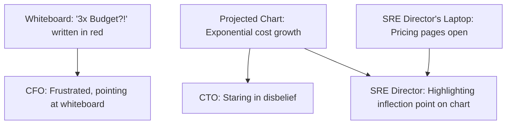
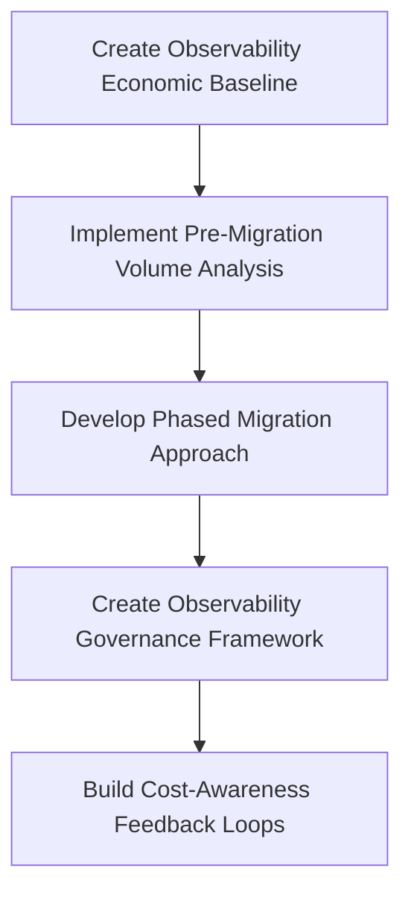
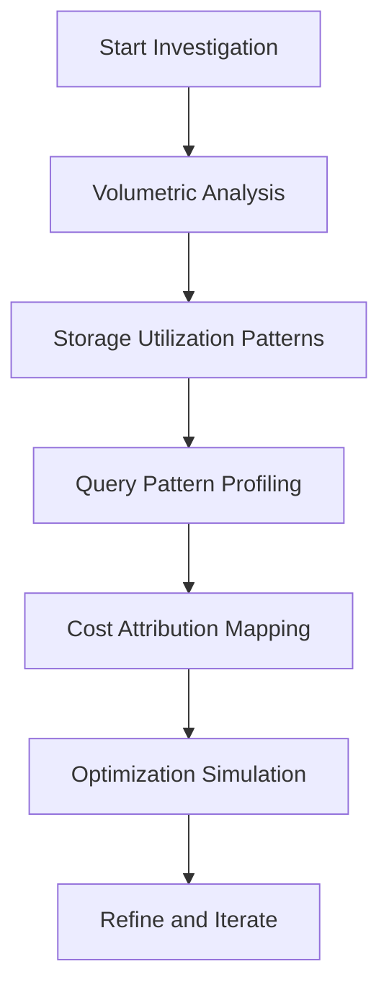
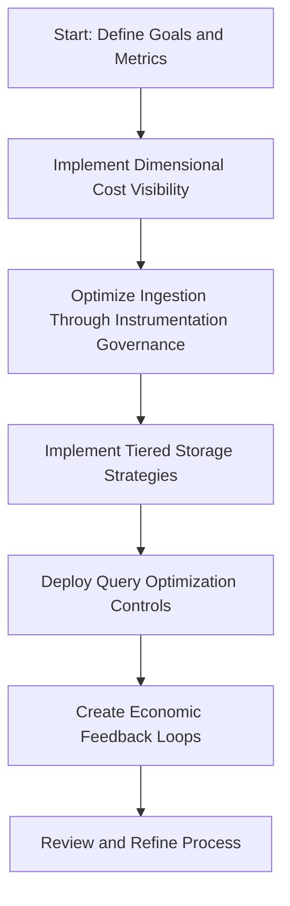
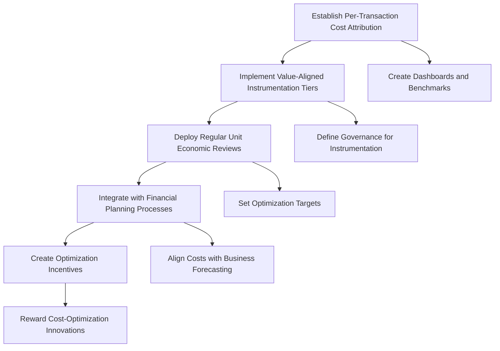
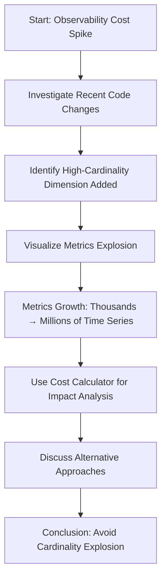
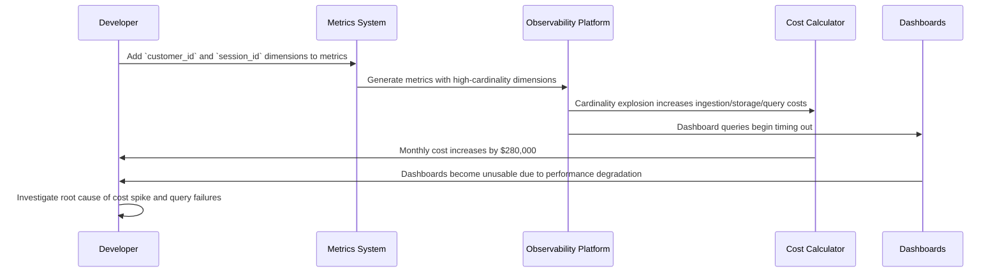
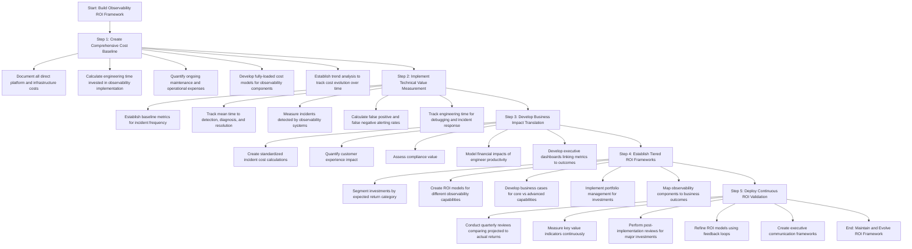

# Chapter 2: Observability Economics 101

## Chapter Overview

Welcome to the bloodbath that is Observability Economics—a joyless parade of billing shocks, cardinality explosions, and CFOs questioning your life choices. This isn’t just about “tools” or “dashboards”; it’s a game of financial whack-a-mole where every extra log line or metric can vaporize your budget faster than an SRE’s weekend plans. In a world where vendors price by the gigabyte, the second, or the phase of the moon, you’ll learn why blindly “monitoring everything” is a rookie mistake. This chapter arms you with the economic street smarts to avoid burning millions on data nobody reads, survive the next vendor pitch, and keep your observability practice from bankrupting your digital transformation. Spoiler alert: cost governance is not optional. Let’s get ruthless.

## Learning Objectives

- **Diagnose** the root causes of observability billing shocks and runaway costs.
- **Dissect** the ingestion, storage, and query cost triad (and why their multiplication is your wallet’s worst enemy).
- **Calculate** telemetry unit economics, from per-metric costs to per-transaction profitability.
- **Detect and neutralize** cardinality explosions before they nuke operational budgets and dashboards.
- **Build** ROI frameworks that translate SRE investments into hard business value (because “trust us” doesn’t cut it in the boardroom).
- **Implement** sustainable budget governance models that make cost overruns somebody’s problem—preferably before yours.
- **Evaluate** vendor pricing models with a clear-eyed, skeptical view—no more “surprise” overage charges.
- **Establish** feedback loops and governance that make cost control a routine, not a post-mortem.

## Key Takeaways

- Budget shock isn’t a bug, it’s the default. Move to modern observability without an economic plan and your CFO will be phoning your replacement.
- Consumption-based pricing punishes “monitor everything” thinking. Data volume is now your enemy, not your friend.
- Ingest, store, and query costs don’t add up—they multiply. Ignore this and you’ll be explaining seven-figure invoices to people who don’t know what a trace is.
- 80% of your telemetry is never used. Collecting it is a tax you pay for not governing your instrumentation.
- Per-transaction observability costs can quietly kill product margins. If you can’t measure it, you’re probably losing money.
- Cardinality is the secret assassin of observability. Add an unbounded label and you may as well set cash on fire.
- “Just cut the budget” is a classic response to surprise costs—and it always leads to less visibility and more incidents.
- Vendor pricing models are traps for the unwary. If you don’t model costs for your architecture, you’re buying a black box with a blank check.
- ROI frameworks aren’t optional—they’re survival. If you can’t prove business value, expect your tools to be “right-sized” out of existence.
- Governance is the only way out. If you’re not enforcing cost controls and ownership, you’re one billing cycle away from an incident report.
- Every observability dollar spent without visibility or accountability is a future regret. Don’t be the next cautionary tale.

Welcome to Observability Economics. Bring your calculator and a flak jacket.

## Panel 1: The Billing Shock

### Scene Description

The setting is a tense monthly budget review meeting. The CTO, CFO, and SRE director sit around a conference table, their attention fixed on a projected chart at the front of the room. The chart shows observability costs skyrocketing over the past six months, with a clear inflection point marking the transition from legacy monitoring tools to a modern observability platform.

On the side, a whiteboard displays the CFO's frustrated scrawl in red marker: "3x Budget?!". Meanwhile, the SRE director gestures toward the chart, highlighting the inflection point, while their laptop sits open on the table. The screen shows multiple browser tabs open to pricing pages of various observability vendors, revealing a tangle of consumption-based pricing models.

Below is a simplified visual representation of the meeting setup:



This setup underscores the financial shock and confusion the team faces as they confront the unexpected economic realities of modern observability platforms.

### Teaching Narrative

The transition from traditional monitoring to modern observability often triggers a profound financial shock for organizations unprepared for fundamentally different economic models. Legacy monitoring tools typically operated on predictable licensing costs - fixed annual fees based on the number of servers or applications monitored, regardless of data volume. In stark contrast, today's observability platforms use consumption-based pricing where costs scale directly with the amount of data ingested, stored, and queried.

This shift represents more than a simple pricing change - it's a complete inversion of the economic incentives that govern observability practices. Under the old model, organizations were incentivized to monitor everything possible since additional data points carried no marginal cost. The new consumption-based reality demands intentional choices about what data to collect, how long to retain it, and how frequently to analyze it. Without developing this economic awareness, organizations commonly experience "billing shock" as their observability costs quickly outpace budgets, sometimes growing 5-10x faster than the infrastructure being monitored. Understanding these new economics is the essential first step toward developing sustainable observability practices.

### Common Example of the Problem

A mid-sized retail bank recently migrated from their legacy ITRS Geneos monitoring platform to a modern cloud-based observability solution for their digital banking platform. Under the old model, they paid an annual license fee of $450,000, which covered all servers and applications monitored regardless of data volume. However, three months after migrating to the new platform, the infrastructure team received an invoice for $1.2 million—nearly triple their quarterly budget.

To better understand the cost explosion, the team broke down the expenses from both the legacy and modern platforms:

| Cost Component | Legacy ITRS Geneos (Annual) | Modern Observability (Quarterly) |
| ------------------------------ | --------------------------- | -------------------------------- |
| License Fee | $450,000 | N/A |
| Data Ingestion (Logs) | N/A | $500,000 |
| Data Storage (Metrics) | N/A | $400,000 |
| Query Costs (Tracing/Analysis) | N/A | $300,000 |
| **Total** | **$450,000/year** | **$1,200,000/quarter** |

The investigation revealed that during implementation, teams had enabled verbose logging across all microservices, full-fidelity metrics collection at 10-second intervals, and distributed tracing for 100% of user sessions. This approach, while technically comprehensive, resulted in a massive data volume. Unlike the predictable costs of the legacy system, the new consumption-based pricing model directly tied these choices to unexpected, skyrocketing expenses. Without economic constraints or clear guidelines for data collection, the organization inadvertently created an unsustainable observability cost structure.

### SRE Best Practice: Evidence-Based Investigation

When facing unexpected observability costs, SREs should implement a systematic data-driven approach to understand and address the underlying causes. Follow these five steps to conduct an evidence-based investigation:

1. **Data Volume Analysis**

   - Examine telemetry volume trends across data types (logs, metrics, traces).
   - Identify which data types are driving cost increases.
   - Look for imbalances—often 20% of services generate 80% of data volume.

2. **Cost Driver Identification**

   - Perform a Pareto analysis to determine which services and telemetry types contribute most to costs.
   - Pinpoint high-volume services with excessive verbosity or high-cardinality metrics.

3. **Utilization Assessment**

   - Assess how much of the collected telemetry is actively used for alerting, dashboarding, or troubleshooting.
   - Analyze unused data—evidence shows less than 30% of collected telemetry is typically utilized.

4. **Comparison Benchmarking**

   - Compare your observability costs with industry benchmarks.
   - Common benchmarks include observability costs as 6-10% of overall infrastructure spend or per-transaction costs.

5. **Value-Stream Mapping**

   - Correlate telemetry usage during incidents with resolution outcomes.
   - Identify high-value signals that contribute to successful incident resolution and deprioritize low-value data.

#### Investigation Checklist

To ensure a thorough investigation, use this checklist as a guide:

- [ ] Analyze telemetry volumes and identify disproportionate data contributors.
- [ ] Conduct a Pareto analysis to find high-cost services or telemetry types.
- [ ] Evaluate the percentage of telemetry actively queried or used post-collection.
- [ ] Benchmark observability costs against industry standards.
- [ ] Map telemetry usage to incident resolution outcomes and prioritize high-value data.

This structured approach ensures that observability practices are both cost-effective and aligned with organizational needs.

### Banking Impact

The financial impact of unexpected observability costs extends beyond the immediate budget concerns to affect broader banking operations. Consider the following real-world challenges:

1. **Technology Investment Diversion**: Excessive observability spending frequently forces reallocation of funds from planned customer experience initiatives. For example, a large regional bank faced unexpected observability costs that ballooned to 4x their initial estimates within the first year of adopting a modern platform. To manage the budget shortfall, the bank deferred its flagship mobile app refresh—a critical project for improving customer retention—by nine months, resulting in a dip in user satisfaction metrics during that period.

2. **Operational Rigidity**: To control runaway costs, many banking organizations implement emergency restrictions on instrumentation, inadvertently creating visibility gaps during critical initiatives like payments modernization. In one instance, a major financial institution restricted log collection during a core payment system upgrade, which led to delayed troubleshooting when anomalies occurred, ultimately extending the project timeline and increasing operational risks.

3. **Cloud Migration Delays**: Unpredictable observability economics have caused several financial institutions to pause cloud migration initiatives due to concerns about cost controllability, directly impacting their digital transformation roadmaps. A multinational bank, for example, postponed its migration of critical workloads to the public cloud by over a year after initial observability costs during a pilot project exceeded the allocated budget by 60%.

4. **Regulatory Compliance Risk**: Cost-cutting reactions often include reducing data retention periods below optimal levels for compliance investigations, creating potential regulatory exposure for transaction traceability requirements. One mid-sized bank, under pressure to reduce storage costs, shortened its log retention to 14 days, only to face significant challenges during a regulatory audit that required six months of historical data for transaction disputes.

5. **Technology Partner Tensions**: The disconnect between vendor pricing models and internal budgeting processes has created adversarial relationships between banking technology teams and their observability providers, reducing collaboration on strategic initiatives. An example involves a global financial institution renegotiating its contract with a leading observability vendor after tensions escalated over unpredictable monthly bills that exceeded agreed-upon forecasts. This strained relationship delayed co-development efforts on a joint initiative to improve real-time fraud detection.

These examples underscore the cascading consequences of failing to align observability practices with sustainable economic models, particularly in highly regulated and cost-sensitive industries like banking.

### Implementation Guidance

To avoid observability billing shock and establish sustainable economic governance, follow these five actionable steps. The visual flowchart below provides a high-level overview of the process, with details outlined further in the steps that follow:



1. **Create an Observability Economic Baseline**

   - Document current monitoring costs across all existing tools.
   - Identify per-service and per-environment monitoring expenses.
   - Establish clear cost attribution mechanisms before platform migration.
   - Develop standardized cost-per-transaction and cost-per-service metrics.
   - Create visibility into these metrics for all engineering teams.

2. **Implement Pre-Migration Volume Analysis**

   - Measure current telemetry volume by data type and service.
   - Calculate projected costs under the new consumption model.
   - Identify high-volume services requiring optimization.
   - Create volume forecasts that account for growth projections.
   - Establish alerting thresholds for abnormal volume increases.

3. **Develop Phased Migration Approach**

   - Begin with non-critical services to refine cost models.
   - Implement service-by-service migration rather than all-at-once cutover.
   - Create progressive budget allocations that allow for adjustment.
   - Run parallel monitoring during transition with clear success criteria.
   - Establish incremental approval gates based on economic validation.

4. **Create Observability Governance Framework**

   - Establish standardized instrumentation guidelines by service type.
   - Implement approval processes for high-volume telemetry sources.
   - Develop cost attribution models that create team accountability.
   - Create an observability budget review cycle with clear ownership.
   - Integrate cost projections into the CI/CD deployment pipeline.

5. **Build Cost-Awareness Feedback Loops**

   - Deploy real-time dashboards showing teams their observability costs.
   - Implement automated anomaly detection for unusual volume increases.
   - Create a cross-team knowledge sharing forum for cost optimization.
   - Develop incentive structures that reward efficient instrumentation.
   - Establish regular economic reviews as part of technical governance.

## Panel 2: The Three Pillars of Cost

### Scene Description

An SRE architect stands before a whiteboard divided into three columns labeled: "Ingest," "Storage," and "Query." Each column contains detailed calculations and cost factors for different observability signals. The whiteboard is structured as follows:

```
+----------------+----------------+----------------+
|    Ingest      |    Storage     |     Query      |
|----------------|----------------|----------------|
| - Per GB fees  | - Hot storage  | - Query scans  |
| - Cardinality  | - Warm storage | - Complex calcs|
| - Verbosity    | - Cold storage | - Dash refresh |
+----------------+----------------+----------------+
```

- **Ingest Column**: Highlights per-gigabyte ingestion fees, the impact of high cardinality, and the influence of instrumentation verbosity.
- **Storage Column**: Displays tiered costs for retaining "hot," "warm," and "cold" data, emphasizing the need to balance retention periods against budget constraints.
- **Query Column**: Explains how large time ranges and frequent dashboard updates amplify computational costs.

Team members take notes as the architect draws arrows between the columns, illustrating the multiplicative relationship between the three cost dimensions. The whiteboard visual serves as a central reference, helping the team grasp how decisions in one area cascade into the others.

### Teaching Narrative

Modern observability costs are driven by three fundamental dimensions that interact in complex ways: ingestion, storage, and query costs. Understanding each dimension and how they influence total expenditure is essential for effective cost management.

Ingestion costs are determined by the volume of data flowing into the observability platform, typically charged per gigabyte or per data point. These costs are directly influenced by instrumentation choices - how many metrics are collected, at what granularity, how verbose logs are configured, and how extensively distributed tracing is implemented. In high-throughput banking systems processing thousands of transactions per second, seemingly minor instrumentation decisions can result in massive data volumes.

Storage costs reflect both the volume of data retained and for how long. Most platforms implement tiered storage pricing where recent "hot" data costs significantly more than older "cold" data. This creates a complex optimization problem where retention periods must balance analytical needs, compliance requirements, and budget constraints. The compounding effect of daily data accumulation means that extended retention periods can drive exponential storage growth.

Query costs represent the computational resources required to analyze and visualize observability data. Complex queries scanning large time ranges or performing sophisticated analytics can drive significant expenses, especially when embedded in frequently refreshed dashboards viewed by multiple team members. Some platforms explicitly charge for query computation, while others bundle these costs into overall usage fees.

The most insidious aspect of observability economics is how these three dimensions multiply rather than simply add. High ingest volumes combined with long retention periods and frequent complex queries can create cost explosions that quickly outpace budgets. Effective cost management requires a holistic view that optimizes across all three dimensions simultaneously.

### Common Example of the Problem

A major investment bank implemented a new fraud detection system that generated detailed observability data for each trading transaction. The initial design created 50GB of daily log data (ingestion), which they retained for 2 years for compliance purposes (storage), with complex queries running every 15 minutes to update risk dashboards (query). The cost projection seemed manageable at approximately $10,000 monthly.

However, during the first month of operation, the bill reached $175,000. Investigation revealed three interacting factors creating a multiplicative cost effect:

1. **Log verbosity** was 10x higher than estimated due to debugging settings left enabled.
2. The **compliance team** had configured high-performance storage for the entire retention period rather than tiering to cold storage.
3. The **risk dashboards** were configured with no query limitations, causing them to scan the entire 2-year dataset with each 15-minute refresh.

To better understand the cost drivers, the following table breaks down the monthly costs before and after optimization:

| **Cost Component** | **Before Optimization** | **After Optimization** | **Optimization Explanation** |
| ------------------ | ---------------------------- | -------------------------------- | ------------------------------------------------------------------------------ |
| **Ingestion** | 50GB/day × $0.10/GB = $1,500 | 5GB/day × $0.10/GB = $150 | Reduced log verbosity by disabling unnecessary debugging information. |
| **Storage** | 50GB/day × 730 days = $7,300 | 5GB/day × 90 days (hot) = $1,350 | Enabled tiered storage, moving older data to cold, lower-cost storage. |
| **Query** | $166,200 | $3,000 | Limited queries to relevant time ranges and reduced refresh frequency. |
| **Total** | **$175,000** | **$4,500** | Holistic optimizations across all three dimensions led to significant savings. |

This breakdown illustrates how small inefficiencies in each dimension (ingestion, storage, query) compounded to create a massive cost overrun. By addressing these factors holistically, the team reduced costs by over 95%, demonstrating the importance of balancing observability requirements with budget constraints.

### SRE Best Practice: Evidence-Based Investigation

When analyzing observability economics, effective SREs implement a systematic investigation across all three cost dimensions. Use the following checklist to guide your approach and ensure a thorough, evidence-based investigation:

#### Checklist for Evidence-Based Investigation

1. **Volumetric Analysis**

   - Measure data volume by type, source, and growth rate.
   - Identify unexpected cardinality growth (e.g., unique time series) as a potential cost driver.
   - Focus on both absolute data volume and hidden exponential growth factors.

2. **Storage Utilization Patterns**

   - Analyze query patterns to understand actual usage versus retention policies.
   - Validate whether hot storage aligns with the most queried data (e.g., \<7 days for 80% of queries).
   - Identify opportunities to transition older, less-accessed data to lower-cost storage tiers.

3. **Query Pattern Profiling**

   - Enable query logging to capture and analyze execution patterns.
   - Detect inefficient or overly broad queries, particularly those scanning excessive time ranges.
   - Prioritize optimization of dashboard queries, which often represent 70-80% of computational costs.

4. **Cost Attribution Mapping**

   - Implement precise cost attribution tooling to trace expenses to specific services, teams, or features.
   - Use attribution data to identify areas with the highest optimization potential.
   - Encourage accountability by aligning cost visibility with ownership.

5. **Optimization Simulation**

   - Develop and use predictive modeling tools to simulate cost impacts of optimization strategies.
   - Test scenarios for reducing ingest volume, shortening retention periods, or refining queries.
   - Aim for modest improvements across all dimensions, leveraging compounding effects for significant savings.

#### Summary Flow of Investigation Steps



This structured approach ensures that cost management efforts are data-driven, targeted, and impactful, avoiding blind optimizations that fail to address the root causes of cost inefficiencies.

### Banking Impact

The three-dimensional nature of observability costs creates several specific impacts for banking organizations. To illustrate, consider the case of a regional retail bank implementing observability improvements during a core banking system upgrade:

**Case Study: Regional Retail Bank**\
This bank processes an average of 500,000 transactions daily, with peaks reaching 1 million during promotional campaigns. Despite completing a successful migration to a new observability platform, the team began noticing unplanned cost surges. A detailed analysis uncovered the following interconnected impacts:

1. **Regulatory Compliance Tensions**: To meet a mandatory 7-year retention requirement for transaction logs, the bank's storage tiers ballooned. "Hot" storage costs made up 60% of their total observability bill due to a misconfigured pipeline retaining near-realtime data unnecessarily. After reconfiguring log retention policies to offload older data to "cold" storage, they achieved a 40% cost reduction on storage without breaching compliance.

2. **Transaction Profitability Erosion**: A profitability review revealed that observability costs were consuming 2.8% of the lifetime value of low-balance savings accounts. High-cardinality metrics, such as detailed per-user latency distributions, were driving excessive ingest volumes. By sampling these metrics for lower-priority accounts, the bank reduced ingest costs by 15%, preserving profitability.

3. **Technology Investment Displacement**: Midway through the fiscal year, unanticipated observability cost overruns forced the delay of a planned fraud detection upgrade. The bank responded by implementing a query cost management policy, including time-range limits on dashboards and automated query usage audits, which freed up budget for the delayed initiative in the following quarter.

4. **Operational Rigidity**: To control costs, the bank imposed strict limits on monitoring new microservices introduced during their digital transformation. This led to several incidents where root cause analysis was delayed due to missing telemetry. A subsequent investment in smarter instrumentation practices ensured critical signals were captured without inflating ingest costs, reducing risk without creating cost spikes.

5. **Cloud Migration Hesitancy**: The bank delayed migrating its credit card processing system to the cloud, citing fears of unpredictable query costs during peak usage periods. Leveraging query sampling techniques and predictive cost modeling, the team demonstrated a sustainable cost profile, enabling the migration within 6 months.

This case illustrates the compound effects of ingest, storage, and query costs on banking operations. By addressing these dimensions holistically, the bank achieved significant cost optimizations while maintaining operational excellence.

### Implementation Guidance

To effectively manage observability economics across all three cost dimensions, follow these actionable steps. The process is visualized in the step-by-step flow below:



#### Step 1: Implement Dimensional Cost Visibility

- Deploy tooling that separately tracks ingestion, storage, and query costs.
- Create dashboards showing the relative contribution of each dimension.
- Implement service-level attribution for each cost dimension.
- Develop trend analysis that forecasts growth by dimension.
- Establish alerting for unusual patterns in any cost dimension.

#### Step 2: Optimize Ingestion Through Instrumentation Governance

- Create standard instrumentation patterns for common banking services.
- Implement pre-deployment volumetric analysis in CI/CD pipelines.
- Deploy automated detection for high-cardinality metrics.
- Establish log level governance with automatic verbosity control.
- Create centralized approval processes for new high-volume telemetry sources.

#### Step 3: Implement Tiered Storage Strategies

- Analyze query patterns to identify optimal storage tier transitions.
- Create automated data lifecycle policies based on access frequency.
- Deploy compression and downsampling for aging data.
- Implement exception processes for compliance-critical datasets.
- Develop retention standards based on data value and usage patterns.

#### Step 4: Deploy Query Optimization Controls

- Implement query timeout and computational limits on dashboards.
- Create query optimization tooling to identify inefficient patterns.
- Deploy caching mechanisms for frequently accessed data views.
- Establish dashboard efficiency standards and review processes.
- Implement time range restrictions for expensive exploratory queries.

#### Step 5: Create Economic Feedback Loops

- Deploy real-time cost attribution dashboards to all engineering teams.
- Implement anomaly detection for changes in query patterns.
- Create optimization recommendation engines based on usage analysis.
- Establish regular reviews combining cost and value metrics.
- Develop cross-team knowledge sharing for cost optimization techniques.

#### Step 6: Review and Refine Process

- Regularly reassess cost trends and refine metrics based on updated business priorities.
- Incorporate feedback from engineering teams to improve governance and tooling.
- Iterate on optimization strategies to adapt to changing system demands.

## Panel 3: The Unit Economics of Telemetry

### Scene Description

A banking platform team conducts a data-driven review of their observability costs. Spreadsheets and diagrams show calculations breaking down costs to the individual metric, log line, and trace span level. A particularly revealing chart compares the per-transaction observability cost across different banking services, highlighting notable differences. Engineers debate the business justification for these varying cost structures based on transaction values and risk profiles.

#### Observability Cost Comparison Table

| Banking Service | Observability Cost per Transaction |
| ---------------------- | ---------------------------------- |
| Credit Card Processing | $0.0003 |
| Wealth Management | $0.0052 |
| Loan Applications | $0.0011 |
| Securities Trading | $0.0038 |
| Informational Queries | $0.0001 |

This table provides a clear comparison, emphasizing how observability costs differ significantly depending on the type of service. For example, credit card processing, with its high transaction volume, incurs a much lower cost per transaction compared to wealth management, which involves fewer but higher-value interactions. These insights spark discussion among engineers about aligning observability investments with the business impact and risk profile of each service.

### Teaching Narrative

Cost-effective observability requires developing a sophisticated understanding of unit economics - the cost to monitor individual transactions, user sessions, or business operations. This granular perspective transforms abstract platform bills into actionable insights that can drive optimization efforts and enable meaningful cost-benefit analysis.

Calculating telemetry unit economics begins with understanding the "cost per signal" - how much a single log line, metric data point, or trace span costs to collect, store, and analyze. This baseline measure provides the foundation for more sophisticated analysis that links observability costs to business activities. For example, by dividing monthly observability expenditure by the number of transactions processed, organizations can determine the "observability cost per transaction" - a powerful metric that directly connects technical decisions to business operations.

Advanced unit economic analysis recognizes that different services and transactions justify different observability investments. High-value banking operations like securities trading or large money transfers may warrant more extensive (and costly) instrumentation due to their business impact and risk profile. In contrast, routine informational queries might justify only minimal observability investment. This differentiated approach aligns observability spending with business value rather than treating all system components identically.

The most sophisticated organizations establish clear target ranges for observability unit economics, creating benchmarks that guide instrumentation decisions and drive continuous optimization. These targets evolve based on system changes, business requirements, and technology advancements, forming the foundation of sustainable observability economic governance.

### Common Example of the Problem

A global bank's digital transformation team launched a new mobile banking platform with comprehensive observability instrumentation. Six months after launch, the CFO questioned why observability costs had grown 300% while transaction volume increased only 40%. The monitoring team defended the spending as necessary for reliability but couldn't connect costs to specific business activities.

Investigation revealed vastly different per-transaction costs across features: basic balance checks cost $0.0007 per transaction, bill payments $0.0025, and international transfers $0.0158. However, these differences weren't the result of strategic decisions but rather inconsistent instrumentation approaches across teams. The balance check feature team had implemented careful sampling and filtering, while the international transfers team had instrumented everything at full fidelity regardless of business value. Without unit economics visibility, these differences remained hidden, preventing optimization of the highest-cost components.

#### Key Issues Summary

| Problem | Description | Impact |
| ------------------------------------ | -------------------------------------------------------------------------------------------- | -------------------------------------------------------- |
| Inconsistent Instrumentation | Different teams applied varying levels of sampling and filtering without unified guidelines. | Higher costs for features with full fidelity monitoring. |
| Lack of Visibility into Unit Costs | Observability costs couldn't be traced back to specific business activities or transactions. | Prevented cost optimization and meaningful analysis. |
| Misaligned Observability Investments | High-cost features were not prioritized based on business value or risk profile. | Resources were spent inefficiently across the platform. |

#### Checklist for Identifying Similar Problems

- [ ] Are observability costs growing faster than transaction volumes or platform usage?
- [ ] Can observability costs be traced back to specific features or business activities?
- [ ] Are there significant cost disparities across features without clear justification?
- [ ] Are sampling and filtering strategies consistently applied across teams?
- [ ] Are high-cost features aligned with business value and risk profiles?

### SRE Best Practice: Evidence-Based Investigation

Effective management of telemetry unit economics requires systematic analysis and benchmarking. The following best practices and their expected outcomes provide actionable guidance:

| **Best Practice** | **Description** | **Expected Outcomes** |
| ------------------------------------- | --------------------------------------------------------------------------------------------- | ---------------------------------------------------------------------------------------------------------------- |
| **Transaction-Based Cost Allocation** | Attribute observability costs to specific transaction types and business operations. | Identify optimization opportunities, reducing overall costs by 30-50%. |
| **Signal Value Analysis** | Evaluate which telemetry signals effectively contribute to incident detection and resolution. | Focus on the ~20% of signals with high operational value, minimizing storage and processing costs. |
| **Business Alignment Assessment** | Ensure observability spending aligns with transaction value and risk profiles. | Address misaligned investments, improving visibility for high-value or high-risk transactions. |
| **Comparative Benchmarking** | Develop internal and external benchmarks for observability costs per transaction type. | Target cost ranges like 0.05%-0.15% of transaction value, ensuring cost-effectiveness and competitive standards. |
| **Optimization Targeting** | Prioritize optimization for the highest-volume or highest-cost transaction types. | Achieve significant cost reduction by addressing 60-70% of overall concerns through 3-5 key transaction types. |

These practices enable teams to transform telemetry data into actionable insights, driving cost optimization while maintaining alignment with business priorities.

### Banking Impact

Poorly managed observability unit economics create significant business impacts for banking organizations. The table below summarizes five key impacts along with examples and associated metrics:

| **Impact** | **Description** | **Examples / Metrics** |
| ------------------------------------- | ------------------------------------------------------------------------------------------------ | ---------------------------------------------------------------------------------------------------------------- |
| **Unprofitable Transaction Types** | Monitoring costs consume a significant portion of transaction profitability. | Retail banks discovered low-value transactions where observability costs exceeded 5% of total revenue. |
| **Misaligned Risk Management** | Insufficient observability for high-risk transactions and over-monitoring of routine operations. | Critical services with failures caused by inadequate monitoring; over-instrumentation on informational queries. |
| **Product Launch Delays** | Uncertainty about observability costs delays product launches. | Teams unable to forecast operational expenses; major banks now require cost modeling before launch approval. |
| **Competitive Disadvantage** | Inefficient observability leads to stricter controls, limiting insights and slowing innovation. | Product teams restricted in instrumentation; slower innovation versus competitors with efficient practices. |
| **Inaccurate Profitability Analysis** | Decisions made without factoring in observability costs, leading to misallocation of resources. | Investment in services that appear profitable but incur high operational costs; incomplete profitability models. |

This structured approach highlights the critical need for well-managed observability economics in modern banking, ensuring alignment between monitoring investments and business outcomes.

### Implementation Guidance

To implement effective telemetry unit economics, follow these actionable steps. Use the checklist below or the step-by-step diagram to guide your process:

#### Checklist for Implementation

1. **Establish Per-Transaction Cost Attribution**

   - [ ] Implement tracing and tagging to associate telemetry with transaction types.
   - [ ] Create data pipelines that calculate per-transaction observability costs.
   - [ ] Develop dashboards showing cost trends by transaction category.
   - [ ] Establish benchmark ranges for appropriate costs by transaction type.
   - [ ] Create anomaly detection for transactions exceeding cost thresholds.

2. **Implement Value-Aligned Instrumentation Tiers**

   - [ ] Define standard observability tiers based on transaction value and risk.
   - [ ] Create instrumentation templates for each tier with appropriate sampling rates.
   - [ ] Develop exception processes for transactions requiring enhanced visibility.
   - [ ] Implement automatic tier assignment based on transaction attributes.
   - [ ] Establish governance to ensure implementations align with assigned tiers.

3. **Deploy Regular Unit Economic Reviews**

   - [ ] Establish monthly reviews of per-transaction observability costs.
   - [ ] Create optimization targets for highest-cost transaction types.
   - [ ] Implement competitive benchmarking against industry standards.
   - [ ] Develop instrumentation improvement plans for outlier services.
   - [ ] Create executive dashboards connecting unit economics to business value.

4. **Integrate with Financial Planning Processes**

   - [ ] Add observability unit costs to product profitability models.
   - [ ] Create forecasting tools that project costs based on business growth.
   - [ ] Develop ROI models that justify observability investments.
   - [ ] Establish coordinated planning between finance and SRE teams.
   - [ ] Implement chargeback mechanisms based on transaction volumes.

5. **Create Optimization Incentives**

   - [ ] Establish team-level targets for unit economic improvement.
   - [ ] Create recognition programs for cost-optimization innovations.
   - [ ] Implement shared best practices repositories for efficient instrumentation.
   - [ ] Develop training programs focused on cost-efficient observability.
   - [ ] Create hackathon events focused on unit cost optimization.

#### Step-by-Step Diagram



Both the checklist and diagram can be used collaboratively to ensure a structured and thorough approach to implementing telemetry unit economics. Customize these tools based on your organization’s specific requirements and maturity level.

## Panel 4: The Cardinality Cost Multiplier

### Scene Description

A debugging session unfolds as an engineering team investigates an unexpected observability cost spike. The team identifies a recent code change that added a high-cardinality customer ID dimension to a core transaction metric. This discovery leads them to a visualization that illustrates the impact: a metrics explosion from thousands to millions of time series. To clarify how this happened, a cost calculator is used to demonstrate how each additional dimension multiplies, rather than adds to, the total series count. The team discusses alternative approaches to achieve similar analytical capabilities without triggering a cardinality explosion.

Below is a simplified flowchart of the debugging process:



Key takeaways:

- High-cardinality dimensions, such as customer IDs, can exponentially increase time series counts.
- Visual tools and cost calculators are critical for diagnosing and understanding the impact.
- Teams must evaluate cost-effective alternatives, balancing analytical needs with the risk of cost spikes.

### Teaching Narrative

Cardinality - the number of unique time series generated by metrics - represents one of the most significant and least understood cost drivers in modern observability. Unlike traditional monitoring with fixed metric sets, dimensional metrics create new time series for each unique combination of labels or tags. This can trigger exponential growth when high-cardinality dimensions like user IDs, transaction IDs, or session IDs are added to metrics.

The mathematics of cardinality are unforgiving. A single metric with no dimensions creates one time series. Add a dimension with 10 possible values, and you now have 10 time series. Add another dimension with 100 possible values, and you've created 1,000 time series (10 × 100). In real-world systems with dimensions containing thousands or millions of unique values, this combinatorial explosion can create billions of time series from just a handful of base metrics.

#### Cardinality Math Examples

| Number of Dimensions | Values per Dimension | Total Time Series |
| -------------------- | --------------------- | ----------------- |
| 0 | - | 1 |
| 1 | 10 | 10 |
| 2 | 10, 100 | 1,000 |
| 3 | 10, 100, 1,000 | 1,000,000 |
| 4 | 10, 100, 1,000, 1,000 | 1,000,000,000 |

This cardinality explosion directly impacts costs across all three economic pillars:

- **Ingestion Costs**: Each unique time series requires separate processing and indexing.
- **Storage Costs**: Every series must be stored individually, multiplying storage requirements.
- **Query Costs**: Analytical operations must process exponentially more data points.

Some observability platforms explicitly charge based on the number of active time series, making the financial impact of cardinality even more direct.

#### Checklist for Evaluating Cardinality Impact

Before adding new metrics or dimensions, consider the following:

1. **Dimension Necessity**: Is this dimension critical for analysis or debugging?
2. **Cardinality Awareness**: Estimate the number of unique values this dimension will introduce.
3. **Combinatorial Growth**: Assess how this dimension interacts with existing ones to multiply time series.
4. **Alternatives**: Can you reduce cardinality using techniques like hashing, binning, or sampling?
5. **Cost Assessment**: Calculate the potential ingestion, storage, and query costs.
6. **Review**: Submit new metric definitions for a peer or automated cardinality review.
7. **Guardrails**: Use automated systems to detect and prevent cardinality explosions before deployment.

Controlling cardinality requires both technical approaches and organizational discipline. Technically, teams must carefully select which dimensions to add to metrics, avoiding high-cardinality fields or implementing strategies like hashing or binning to reduce unique values. Organizationally, new metric definitions should undergo review to assess cardinality impact before deployment. The most mature organizations implement automated guardrails that detect and prevent cardinality explosions before they impact production.

### Common Example of the Problem

A major retail bank launched a new customer journey analytics initiative for their online banking platform. To improve visibility into user experiences, a developer added `customer_id` and `session_id` dimensions to core performance metrics. The change was deployed on a Friday afternoon. By Monday morning, the platform had generated 38 million unique time series, increasing monthly costs by $280,000 and causing dashboard queries to time out due to the massive dataset.

The sequence of events leading to the issue can be visualized as follows:



The root issue was that these two high-cardinality dimensions combined multiplicatively. With approximately 5 million active customers, each potentially creating multiple sessions daily, the cardinality exploded beyond what the observability platform could efficiently handle. The team initially thought they were adding valuable customer-specific insights, but the approach created untenable costs while making dashboards unusable due to query performance degradation.

To avoid such issues, high-cardinality dimensions like `customer_id` and `session_id` should typically be captured in logs or traces, which are better suited for detailed, granular data. Metrics, on the other hand, are designed for aggregation and pattern detection, making them unsuitable for storing such fine-grained dimensions without significant cost and performance trade-offs.

### SRE Best Practice: Evidence-Based Investigation

When addressing cardinality management, effective SREs implement systematic investigation approaches:

1. **Cardinality Impact Analysis**: Implement pre-deployment evaluation of potential cardinality for new or modified metrics. Evidence shows that organizations that perform this analysis prevent 90%+ of cardinality explosions by identifying high-risk dimensions before production deployment.

2. **Dimension Value Distribution Analysis**: Evaluate the distribution characteristics of potential metric dimensions. Research indicates dimensions with exponential growth patterns (like unique IDs) create disproportionate cardinality issues compared to bounded categories, even when initial value counts seem manageable.

3. **Alternative Instrumentation Assessment**: Systematically evaluate whether high-cardinality data belongs in metrics, logs, or traces based on intended use cases. Evidence consistently shows that organizations with clear guidance on appropriate telemetry types reduce cardinality-related costs by 40-60%.

4. **Incremental Testing**: Implement canary deployments for significant metric changes to evaluate actual cardinality impact before full release. Organizations using this approach typically identify and mitigate 75% of potential cardinality issues during limited testing rather than after full deployment.

5. **Usage Pattern Analysis**: Regularly audit query patterns against high-cardinality metrics to determine whether the granularity actually delivers analytical value. Studies show that over 70% of high-cardinality dimensions are rarely used in actual analysis once implemented, indicating they could be removed or relocated to more appropriate telemetry types.

### Banking Impact

Cardinality explosions create particularly acute impacts in banking environments, where precision, reliability, and cost predictability are paramount. The following table and case study illustrate the tangible consequences and lessons learned:

#### Real-World Case Study: Cardinality Crisis at GlobalBank

At GlobalBank, a prominent financial institution, a well-intentioned update added a high-cardinality "customer_id" tag to a core transaction metric. Within hours, the following cascade of challenges unfolded:

- **Dashboard Failures**: Critical incident dashboards timed out, leaving teams blind during a major payment processing outage. Incident resolution times doubled due to the lack of visibility.
- **Cost Surge**: The observability platform's active time series count ballooned from 50 million to 1.3 billion, triggering a 5x increase in monthly costs.
- **Emergency Response**: Engineers raced to disable costly metrics, inadvertently removing essential monitoring for other production systems.
- **Long-Term Repercussions**: Compliance requirements forced GlobalBank to retain the high-cardinality data, locking the company into years of elevated storage costs.

The incident ultimately led to a $10M platform migration and a six-month delay in planned feature development. Post-mortem efforts emphasized stricter governance and automated guardrails to prevent recurrence.

#### Summary of Banking Impacts

| Impact Type | Description | Example Consequence |
| ------------------------------- | ---------------------------------------------------------------------------------------------- | -------------------------------------------------------------------------------- |
| **Critical Dashboard Failures** | Operational dashboards become unresponsive during high-cardinality query loads. | Incident dashboards failing during outages, prolonging resolution times. |
| **Emergency Cost Containment** | Sudden cardinality spikes force disabling of critical metrics to reduce costs. | Loss of monitoring visibility during production incidents. |
| **Technical Debt Accumulation** | Historical high-cardinality data becomes costly to retain and difficult to clean up. | Long-term storage costs and compliance obligations for unnecessary data. |
| **Implementation Paralysis** | Overly restrictive metric governance limits necessary instrumentation. | Teams avoid adding essential dimensions, increasing operational risk. |
| **Platform Migration Cycles** | Observability platforms unable to handle cardinality lead to disruptive and expensive changes. | Multi-million-dollar migrations to scalable platforms, causing duplicated costs. |

By learning from these examples, banking organizations can address cardinality challenges preemptively, ensuring their observability strategies align with operational and financial goals.

### Implementation Guidance

To effectively manage metric cardinality and prevent cost explosions, implement these actionable steps:

1. **Develop Clear Dimension Guidelines**

   - Create explicit rules for appropriate dimension cardinality by metric type.
   - Establish standard dimension sets for common banking services.
   - Implement reference architectures showing where to use metrics vs. logs vs. traces.
   - Develop specific guidance for handling high-cardinality fields such as customer IDs, session IDs, and transaction IDs.
   - Create decision frameworks for appropriate dimension selection.

   ```yaml
   # Example: Dimension guidelines in YAML format
   dimension_guidelines:
     - metric_type: "transaction_count"
       allowed_dimensions:
         - "region"
         - "service"
         - "transaction_type"
       disallowed_dimensions:
         - "customer_id"
         - "session_id"
     - metric_type: "error_rate"
       allowed_dimensions:
         - "region"
         - "service"
         - "error_code"
       disallowed_dimensions:
         - "transaction_id"
   ```

2. **Implement Automated Cardinality Protection**

   - Deploy static analysis tools that detect potential cardinality issues in code.
   - Create CI/CD pipeline checks that estimate cardinality impact before deployment.
   - Implement runtime cardinality limiting in your instrumentation libraries.
   - Deploy monitoring for sudden cardinality increases with automated alerts.
   - Create circuit breakers that prevent catastrophic cardinality growth.

   ```python
   # Example: CI/CD pipeline check for cardinality estimation
   def estimate_cardinality(metric_definition):
       base_cardinality = 1
       for dimension in metric_definition['dimensions']:
           base_cardinality *= dimension.get('unique_values', 1)
       if base_cardinality > 10000:  # Example threshold
           raise ValueError(f"Potential cardinality explosion: {base_cardinality}")

   # Example metric definition
   metric = {
       "name": "transaction_count",
       "dimensions": [
           {"name": "region", "unique_values": 10},
           {"name": "customer_id", "unique_values": 1000}
       ]
   }

   estimate_cardinality(metric)
   ```

3. **Design Alternative High-Cardinality Approaches**

   - Implement exemplar-based systems that connect metrics to trace samples.
   - Deploy dimension reduction techniques like bucketing and hashing.
   - Create customer analytics approaches that use logs instead of metrics.
   - Develop sampling strategies for high-cardinality use cases.
   - Implement separated storage systems for truly high-cardinality needs.

   ```python
   # Example: Hashing customer IDs to reduce cardinality
   import hashlib

   def hash_dimension(value, bucket_count=1000):
       hash_digest = hashlib.md5(value.encode()).hexdigest()
       return int(hash_digest, 16) % bucket_count

   customer_id = "customer123456"
   hashed_bucket = hash_dimension(customer_id)
   print(f"Customer ID hashed to bucket: {hashed_bucket}")
   ```

4. **Establish Cardinality Governance Processes**

   - Create an approval workflow for metrics with potential cardinality concerns.
   - Implement regular cardinality audits across all instrumented services.
   - Develop cardinality budgets for teams and applications.
   - Create training programs specific to cardinality management.
   - Establish post-incident reviews for cardinality explosions.

   ```text
   Example: Cardinality Approval Workflow
   --------------------------------------
   1. Developer submits a new metric definition.
   2. Automated analysis estimates cardinality impact.
   3. If estimated cardinality > approved threshold:
      - Metric is flagged for review by observability team.
      - Observability team provides recommendations (e.g., reduce dimensions, hash fields).
   4. Approved metrics are deployed with guardrails in place.
   ```

5. **Deploy Cardinality Optimization Initiatives**

   - Conduct a systematic review of existing high-cardinality metrics.
   - Implement label aggregation for historical high-cardinality data.
   - Create migration paths from high-cardinality metrics to more appropriate solutions.
   - Develop cost impact analyses to prioritize optimization efforts.
   - Implement regular cardinality reduction targets in technical planning.

   ```mermaid
   graph TD
       A[Identify High-Cardinality Metrics] --> B[Analyze Usage and Cost Impact]
       B --> C[Prioritize Optimization Candidates]
       C --> D[Apply Mitigation Strategies]
       D --> E[Monitor and Validate Results]
   ```

## Panel 5: The ROI Framework

### Scene Description

A quarterly business review where SRE leadership presents an observability ROI analysis to executive stakeholders. The presentation highlights before-and-after comparisons of key business metrics following observability investments, showing substantial improvements:

- **Mean Time to Detection (MTTD):** Decreased by 65%
- **Customer-Impacting Incidents:** Reduced by 38%
- **Engineer Productivity:** Improved by 22%

The ROI analysis includes a detailed breakdown comparing observability platform costs against quantified business benefits. This demonstrates a positive return on investment, even considering significant platform expenditures. The meeting concludes with executive approval for continued funding based on the evident business value.

Below is a summary of the key metrics presented, formatted as they might appear on one of the slides:

```
+-----------------------------------+-------------------+-------------------+
| Metric                            | Before Investment | After Investment  |
+-----------------------------------+-------------------+-------------------+
| Mean Time to Detection (MTTD)     | 120 minutes       | 42 minutes        |
| Customer-Impacting Incidents      | 50 per quarter    | 31 per quarter    |
| Engineer Productivity (Debugging) | 80 hours/month    | 62 hours/month    |
+-----------------------------------+-------------------+-------------------+

**Key Improvements:**
- MTTD: 65% decrease
- Incidents: 38% reduction
- Productivity: 22% improvement
```

This clear visualization helps stakeholders quickly grasp the value of observability investments, reinforcing the strategic importance of continued funding.

### Teaching Narrative

For observability to be sustainable, organizations must move beyond viewing it as a pure cost center and develop frameworks that quantify its business value. This return on investment (ROI) approach transforms technical observability decisions into business investments with measurable returns, creating a foundation for strategic decision-making and continued executive support.

Calculating observability ROI begins with comprehensive cost accounting that captures all direct and indirect expenses. Direct costs include platform fees, storage expenses, and related infrastructure. Indirect costs encompass engineering time for instrumentation, dashboard creation, and ongoing maintenance. This total cost of ownership (TCO) provides the investment baseline against which returns are measured.

Quantifying returns requires identifying and measuring specific business benefits derived from observability investments. These typically fall into several categories: incident reduction (fewer customer-impacting events), decreased mean time to recovery (faster incident resolution), engineering productivity improvements (less time spent debugging), and innovation enablement (faster and safer feature deployment). Advanced ROI models also factor in avoided costs like prevented outages, reduced customer churn, and maintained regulatory compliance.

The most sophisticated organizations develop tiered ROI frameworks that recognize different observability investments yield different returns. Core service health monitoring typically delivers the highest ROI through direct incident reduction. More advanced observability capabilities like distributed tracing may show returns primarily through productivity improvements. Specialized capabilities like user journey analytics might deliver value through product improvements rather than operational benefits. By segmenting investments and returns, organizations can optimize their observability portfolio for maximum business impact.

### Common Example of the Problem

A major investment bank struggled to justify its growing observability budget during annual planning. The CTO faced pushback when requesting a $4.8 million annual budget for a new observability platform, with finance executives questioning why monitoring costs were increasing while overall IT spending was under pressure to decrease. The platform team argued passionately about technical benefits but couldn't articulate financial value, leading to a 40% budget reduction that forced them to scale back critical observability improvements.

The following year, the team implemented a comprehensive ROI framework before budget discussions. They calculated how observability investments had reduced trading platform incidents by 32%, decreased mean time to resolution by 58%, and improved developer productivity by reducing debugging time from 35% to 18% of total hours. These improvements were translated into financial terms, summarized below:

| Metric | Before Observability Investment | After Observability Investment | Financial Impact |
| ------------------------------ | ------------------------------- | ------------------------------ | --------------------------------- |
| Trading Platform Incidents | Baseline | 32% reduction | $8.2M in prevented outage costs |
| Mean Time to Resolution (MTTR) | Baseline | 58% decrease | Faster recovery reduced penalties |
| Developer Debugging Time (%) | 35% of total hours | 18% of total hours | $3.7M in productivity gains |
| Regulatory Penalties Avoided | N/A | N/A | $12.4M in avoided penalties |

With a clear ROI of 5.1x on their observability investment, the team not only secured their requested budget but received approval for a 20% increase to expand the program.

### SRE Best Practice: Evidence-Based Investigation

Effective SRE teams implement systematic approaches to observability ROI measurement. Use this step-by-step guide to ensure thorough and actionable evidence-based investigation practices:

#### Step-by-Step Guide for Evidence-Based Investigation

1. **Quantify Incident Impact**

   - Standardize methodologies to calculate the financial impact of production incidents.
   - Include metrics like revenue loss, recovery costs, and reputation damage in your analysis.
   - **Checklist**:
     - [ ] Define impact categories (e.g., revenue, recovery, reputation).
     - [ ] Collect data on historical incidents for benchmarking.
     - [ ] Validate calculations with cross-functional stakeholders (e.g., finance, product).

2. **Analyze Before/After Metrics**

   - Measure key operational metrics (e.g., mean time to detection, mean time to recovery) before and after observability investments.
   - Use comparative studies to reveal improvements obscured by system changes or growth.
   - **Checklist**:
     - [ ] Identify baseline metrics prior to investment.
     - [ ] Track improvements post-implementation.
     - [ ] Ensure consistent measurement methodologies across teams.

3. **Assess Engineering Productivity**

   - Track time spent on debugging, incident response, and unplanned work.
   - Quantify productivity gains enabled by observability tools.
   - **Checklist**:
     - [ ] Set up time-tracking mechanisms for incident-related work.
     - [ ] Compare pre- and post-investment productivity data.
     - [ ] Identify specific tools or processes driving improvements.

4. **Perform Root Cause Attribution**

   - Attribute incidents prevented or mitigated to specific observability capabilities.
   - Analyze which incidents would have been missed without enhanced observability.
   - **Checklist**:
     - [ ] Develop a framework to categorize incidents by detection source.
     - [ ] Conduct post-incident reviews to attribute observability impact.
     - [ ] Quantify the percentage of incidents prevented through new capabilities.

5. **Correlate Customer Impact**

   - Link reliability improvements to customer retention and satisfaction metrics.
   - Use industry benchmarks or internal data to estimate business impact.
   - **Checklist**:
     - [ ] Measure customer satisfaction before and after reliability improvements.
     - [ ] Analyze correlations between availability and churn rates.
     - [ ] Present findings with clear, quantified customer benefits.

#### Summary of Benefits

By following this guide, organizations can:

- Develop accurate ROI calculations based on standardized, data-driven methods.
- Identify high-impact observability investments with clear business value.
- Strengthen executive buy-in through quantifiable evidence of customer and operational benefits.

### Banking Impact

Poorly articulated observability ROI creates significant challenges for banking organizations. These challenges are exacerbated by the criticality of reliability and compliance in financial systems, where even minor disruptions can lead to significant business and reputational impacts. The following outlines key issues and includes a real-world case study to illustrate the high stakes of observability in banking:

1. **Investment Cycle Disruption**: Without clear ROI frameworks, observability budgets frequently face disproportionate cuts during cost reduction initiatives. Several major banks reported complete cancellation of critical observability programs during budget cycles, only to reinstate them after major incidents demonstrated their necessity.

2. **Technology Modernization Barriers**: The inability to articulate observability ROI particularly impacts banking modernization efforts, as legacy systems transition costs often include significant observability investments that appear as pure overhead without proper value articulation.

3. **Regulatory Compliance Risk**: Inadequate observability investment frequently creates compliance exposure when financial institutions cannot provide required transaction traceability during regulatory examinations. Several banks reported regulatory findings directly tied to observability underinvestment justified by cost concerns.

4. **Digital Transformation Hesitancy**: Uncertainty about observability economics has caused multiple banking organizations to delay cloud migration and microservice adoption due to concerns about unpredictable monitoring costs, directly impacting their competitive position.

5. **Technology-Business Alignment Challenges**: The inability to translate technical observability benefits into business value metrics creates persistent tension between technology teams and business stakeholders, reducing organizational alignment around reliability investments.

#### Case Study: Observability ROI in a Major Retail Bank

A major retail bank faced significant challenges during its digital transformation initiative, which included migrating core services to the cloud and adopting microservice architectures. Initially, the observability investment was deprioritized due to cost concerns, and only minimal monitoring was implemented. However, within six months of the migration, the bank experienced a critical outage in its online banking platform, resulting in over 12 hours of downtime.

During the post-incident review, the root cause was traced to a failure in a newly implemented microservice. The lack of distributed tracing capabilities and insufficient log aggregation delayed root cause identification by 8 hours, leading to prolonged customer impact. The bank also faced regulatory scrutiny, as it could not provide sufficient audit logs to demonstrate transaction integrity during the outage period.

Following this incident, the bank's leadership approved a strategic investment in observability, which included implementing a robust platform with distributed tracing, real-time log analysis, and advanced dashboarding. Within a year, the bank reported:

- **Incident Reduction**: A 45% decrease in customer-impacting incidents due to proactive anomaly detection.
- **Mean Time to Recovery (MTTR) Improvement**: MTTR reduced by 60%, with most issues resolved in under 2 hours.
- **Regulatory Compliance**: Enhanced traceability and audit capabilities ensured compliance during the next regulatory examination cycle.
- **Business Impact**: Improved platform reliability contributed to a 15% increase in customer satisfaction scores and a 10% reduction in churn.

This case demonstrates the critical role of articulating observability ROI in securing executive buy-in and avoiding reactive investment cycles. By quantifying the business benefits, the bank not only mitigated operational and compliance risks but also strengthened its competitive position in a rapidly evolving financial landscape.

### Implementation Guidance

To build an effective observability ROI framework, implement these actionable steps. The process can be visualized as follows:



#### Step-by-Step Breakdown:

1. **Create a Comprehensive Cost Baseline**

   - Document all direct platform and infrastructure costs.
   - Calculate engineering time invested in observability implementation.
   - Quantify ongoing maintenance and operational expenses.
   - Develop fully-loaded cost models for different observability components.
   - Establish trend analysis to track cost evolution over time.

2. **Implement Technical Value Measurement**

   - Establish baseline metrics for incident frequency before improvements.
   - Track mean time to detection, diagnosis, and resolution with timestamp precision.
   - Measure percentage of incidents detected by different observability systems.
   - Calculate false positive and false negative rates for alerting systems.
   - Implement engineering time tracking for debugging and incident response.

3. **Develop Business Impact Translation**

   - Create standardized incident cost calculations based on transaction volume.
   - Establish methodologies for quantifying customer experience impact.
   - Implement regulatory compliance value assessment.
   - Develop models for engineer productivity financial impact.
   - Create executive dashboards that connect technical metrics to financial outcomes.

4. **Establish Tiered ROI Frameworks**

   - Segment observability investments by expected return category.
   - Create different ROI models for various observability capabilities.
   - Develop differentiated business cases for core versus advanced capabilities.
   - Implement portfolio management approaches to observability investments.
   - Create value-stream mapping between observability components and business outcomes.

5. **Deploy Continuous ROI Validation**

   - Implement quarterly reviews comparing projected to actual returns.
   - Create ongoing measurement of key value indicators.
   - Develop post-implementation reviews for major observability investments.
   - Establish feedback loops to refine ROI models based on actual results.
   - Create executive communication frameworks that reinforce value narrative.

## Panel 6: The Budget Governance Model

### Scene Description

A monthly observability steering committee meeting where technology and finance leaders review cost metrics and address budget exceptions. Dashboards display observability spending by team, service, and signal type with trend analysis and forecasting. A team lead presents a justification for exceeding their allocation due to a new product launch, requesting a permanent budget adjustment based on transaction volume increases. Committee members evaluate the request against established governance principles and business impact before making a decision. In the background, a wall display shows the organization's documented observability budget governance framework.

#### Meeting Flow Overview

```text
1. Review Metrics:
   - Examine dashboards showing spending by team, service, and signal type.
   - Analyze trend data and cost forecasts.

2. Present Justification:
   - Team lead explains reasons for exceeding allocation.
   - Justification tied to business events (e.g., product launch, transaction growth).

3. Evaluate Request:
   - Assess alignment with governance principles.
   - Consider business impact and trade-offs.

4. Make Decision:
   - Approve, modify, or reject the budget adjustment request.
   - Document decision for transparency and accountability.
```

### Teaching Narrative

As observability matures from a technical practice to a strategic investment, organizations need formal governance structures that balance innovation, operational requirements, and financial discipline. Effective budget governance creates sustainable frameworks for making observability investment decisions aligned with business priorities rather than reacting to monthly billing surprises.

The foundation of observability governance is transparent cost allocation that attributes expenses to the appropriate teams, services, and business functions. This requires tagging or labeling strategies that distinguish between different data sources and implementing chargeback or showback mechanisms that make costs visible to decision-makers. Without this transparency, organizations cannot implement meaningful accountability or make informed trade-offs.

Mature governance models establish tiered approval frameworks where routine instrumentation changes proceed with minimal oversight while significant modifications that could substantially impact costs require additional review and justification. These frameworks typically include pre-established thresholds for automatic review triggers (e.g., any change that would increase data volume by more than 15%) and escalation paths for exception handling.

The most sophisticated governance approaches incorporate dynamic budgeting that adjusts observability allocations based on business metrics like transaction volume, user count, or revenue. This creates natural scaling that accommodates growth without requiring constant budget revisions while maintaining appropriate fiscal constraints. By linking observability budgets directly to business activity, these models create sustainable economics that evolve with the organization.

### Common Example of the Problem

A leading commercial bank implemented a modern observability platform without clear governance, giving all development teams unrestricted access. Within six months, costs grew from the projected $350,000 quarterly to over $1.2 million, triggering an emergency executive review. Finance immediately implemented a hard spending cap that inadvertently removed visibility from critical systems just as the bank launched its new corporate payments platform.

The incident investigation revealed multiple governance failures that contributed to the crisis:

#### Checklist of Governance Failures:

- **Redundant Telemetry**: Three teams independently instrumented the same payment workflow without coordination, leading to duplicated data collection and inflated costs.
- **Volume-Insensitive Instrumentation**: The fraud detection team implemented full-fidelity tracing for all transactions without evaluating the cost implications of high transaction volumes.
- **Over-Scoped Development Environments**: Development environments had the same comprehensive instrumentation as production systems, despite significantly lower usage and criticality.
- **Lack of Ownership and Accountability**: No clear ownership model existed to ensure teams adhered to shared cost-efficiency goals.
- **Absent Approval Processes**: Teams made instrumentation decisions without a formal review or approval framework to evaluate the financial impact.
- **Missing Cost Visibility**: Teams lacked access to cost attribution data, preventing them from understanding the financial consequences of their decisions.

This lack of governance created unsustainable economics, forcing reactive cost-cutting measures that ultimately compromised visibility during a critical product launch. The bank later implemented a structured governance model to prevent similar issues, including transparent cost allocation, tiered approval processes, and dynamic budgeting tied to business metrics.

### SRE Best Practice: Evidence-Based Investigation

Effective observability governance requires a systematic approach to budget management. The table below summarizes five key practices, their benefits, and example metrics to help organizations implement evidence-based investigation strategies effectively:

| Practice | Benefit | Example Metrics |
| ------------------------------------ | ------------------------------------------------------------------------------------------------ | ------------------------------------------------------------------------------------------------------ |
| **Cost Attribution Analysis** | Identifies unexpected sources of observability expenditures, enabling targeted cost controls. | Percentage of costs attributed to development environments or automated testing systems. |
| **Utilization Assessment** | Highlights unused telemetry data, uncovering immediate cost optimization opportunities. | Percentage of collected data queried or used in alerts; unused data volume. |
| **Variance Trend Analysis** | Pinpoints common patterns behind budget variances, allowing for precise governance controls. | Percentage of variances attributable to specific causes (e.g., overprovisioning, misconfigurations). |
| **Exception Pattern Identification** | Reveals systemic issues behind exception requests, informing policy refinements. | Percentage of exceptions falling into predictable categories (e.g., feature launches, scaling events). |
| **Correlation Mapping** | Links spending directly to business metrics, improving predictability and alignment with growth. | Observability costs per transaction, per user, or per feature launch. |

By implementing these practices, organizations can move from reactive cost management to proactive, evidence-based governance that aligns observability investments with business priorities. Each practice builds a foundation for greater transparency, accountability, and sustainability in observability budget management.

### Banking Impact

Inadequate observability budget governance can be likened to poor financial management in personal or business contexts—without a clear plan and discipline, the consequences cascade into broader issues. For banking organizations, the impacts are particularly pronounced:

1. **Emergency Cost Cutting**: Similar to a household slashing expenses indiscriminately after overspending, banks without governance often resort to reactive across-the-board cuts when observability costs exceed budgets. This has led to disabling critical monitoring functions, directly contributing to production incidents.

2. **Innovation Hesitancy**: Imagine a small business that delays investing in updated tools after a budget overrun, slowing its growth. Similarly, many banks impose excessive approval requirements for new instrumentation post-budget overruns. This results in significant delays—several institutions report 4-6 week approval cycles that stifle innovation.

3. **Operational Risk Elevation**: Cutting corners in observability is akin to neglecting routine maintenance on machinery to save costs, only to face expensive breakdowns later. Unpredictable observability economics often lead banks to compromise on coverage, with some removing observability from high-cost components. This has resulted in incidents that could have been prevented.

4. **Platform Trust Erosion**: Just as inconsistent financial planning erodes trust in a business’s stability, cost volatility undermines confidence in observability platforms. Several banks have abandoned strategic observability initiatives after budget surprises, reverting to limited but predictable legacy monitoring solutions.

5. **Technical Debt Accumulation**: Short-term fixes for observability costs resemble using temporary patches in a struggling business budget—quick solutions that create long-term problems. Banks frequently implement monitoring workarounds during cost constraints, which persist for years and lead to significant architectural debt.

By understanding observability governance through the lens of financial management, organizations can better appreciate the importance of proactive planning and disciplined execution. Just as sound budgeting ensures financial health, robust governance ensures observability remains a strategic enabler rather than a reactive liability.

### Implementation Guidance

To establish effective observability budget governance, implement these actionable steps:

1. **Create Clear Cost Attribution Models**

   - Implement consistent tagging across all observability data sources
   - Develop automated cost allocation based on telemetry origin
   - Create regular attribution reports for all engineering teams
   - Establish showback or chargeback mechanisms to drive accountability
   - Implement trend analysis of costs by team, service, and environment

2. **Establish Tiered Governance Frameworks**

   - Create standardized approval processes based on cost impact tiers
   - Implement automated estimation for instrumentation changes
   - Develop exception processes with clear criteria and ownership
   - Establish threshold-based triggers for enhanced review
   - Create governance bodies with cross-functional representation

3. **Implement Dynamic Budget Models**

   - Correlate observability budgets to business activity metrics
   - Create automatic budget adjustments based on transaction volumes
   - Implement different allocation approaches for different service types
   - Establish buffer mechanisms for unexpected growth
   - Develop forecasting tools to predict budget needs based on business plans

4. **Create Cost-Aware CI/CD Integration**

   - Implement pre-deployment analysis of cost impact
   - Create automated warning systems for potential budget issues
   - Establish integration between cost projections and approval workflows
   - Develop canary deployment approaches for significant instrumentation changes
   - Implement post-deployment verification of actual versus projected costs

5. **Deploy Governance Feedback Mechanisms**

   - Establish regular review cycles for budget performance
   - Create continuous improvement processes for governance policies
   - Implement cross-team knowledge sharing for cost optimization
   - Develop training programs on observability economics
   - Establish recognition for teams demonstrating effective cost management

## Panel 7: The Vendor Economics

### Scene Description

A platform selection committee evaluates proposals from five observability vendors. Whiteboards display a visual breakdown of complex pricing structures, highlighting dramatically different approaches. One section shows a comparison table of pricing models:

```
+-------------------+--------------------+----------------------+
| Pricing Model     | Key Metric        | Incentives/Constraints |
+-------------------+--------------------+----------------------+
| Ingestion-Centric | Data Volume       | Limits instrumentation,   |
|                   | Ingested          | encourages filtering,     |
|                   |                   | billing volatility        |
+-------------------+--------------------+----------------------+
| Retention-Based   | Storage Duration  | Encourages refined data   |
|                   |                   | collection, challenges    |
|                   |                   | long-term retention       |
+-------------------+--------------------+----------------------+
| Entity-Based      | Monitored Units   | Predictable budgeting,    |
|                   | (e.g., containers,| discourages instrumenting |
|                   | spans)            | additional services       |
+-------------------+--------------------+----------------------+
```

Another section includes a simple line chart sketched to illustrate five-year TCO projections for each vendor under different growth scenarios. Each line represents a vendor, showing how costs scale as data volume, retention needs, and monitored entities grow. The chart emphasizes significant cost divergence based on vendor pricing models.

The discussion around the whiteboards highlights how each pricing model creates unique incentives and constraints for observability practices. Financial analysts and engineers debate which approach aligns best with the organization's strategic observability goals, factoring in future growth, compliance requirements, and engineering behavior.

### Teaching Narrative

The observability market encompasses diverse vendor approaches with substantially different economic models that profoundly impact long-term costs and incentives. Understanding these differences is crucial for making strategic platform decisions that align with organizational needs and avoid unexpected financial consequences as observability practices mature.

| **Pricing Model** | **Key Characteristics** | **Pros** | **Cons** | **Best Fit For** |
| ---------------------- | ----------------------------------------------------------------------------- | -------------------------------------------------------------------------------------------- | ---------------------------------------------------------------------------------------------------------------------- | --------------------------------------------------------------------------------------------------- |
| **Ingestion-Centric** | Charges based on data volume entering the platform. | - Encourages selective, thoughtful instrumentation. <br> - Incentivizes efficient filtering. | - Costs can discourage comprehensive instrumentation. <br> - High billing volatility with workload variability. | Organizations with predictable workloads and a focus on reducing data ingestion volumes. |
| **Retention-Based** | Focuses on storage duration rather than ingestion volume. | - Promotes refined data retention strategies. | - Long-term retention costs can dominate. <br> - May conflict with regulatory or compliance needs. | Teams managing modest retention requirements or prioritizing short-term data storage. |
| **Agent/Entity-Based** | Charges based on the number of monitored resources (e.g., containers, hosts). | - Predictable budgeting. | - Disincentivizes monitoring additional services. <br> - May include volume-based charges if thresholds are surpassed. | Organizations prioritizing budgeting stability with fixed resource counts or minimal scaling needs. |

The most sophisticated organizations recognize that no single pricing model is universally optimal. Instead, they evaluate platforms based on how pricing aligns with their specific observability strategy and growth projections. This assessment includes:

- Modeling future costs under different business scenarios.
- Understanding contract structures and commitment requirements.
- Evaluating how platform economics will influence engineering behavior.

By treating vendor selection as a strategic economic decision rather than a purely technical one, organizations establish a sustainable foundation for long-term observability practice.

### Common Example of the Problem

A regional bank selected an observability vendor based primarily on technical capabilities and initial pricing, without thoroughly analyzing the economic model. The platform used a complex pricing structure based on "monitored objects" with different rates for various components. The initial implementation covered their core banking platform with a reasonable annual commitment of $600,000.

Six months later, the bank launched a containerized microservices architecture for their new digital banking initiative. The first monthly bill after this launch included a shocking $380,000 overage charge. Investigation revealed that their vendor counted each container instance as a separately monitored object, and their auto-scaling environment created thousands of ephemeral containers during peak periods. The bank faced an impossible choice: dramatically reduce their container instrumentation, abandon their auto-scaling architecture, or absorb massive cost increases not included in their annual technology budget.

The fundamental issue was a misalignment between the vendor's economic model and the bank's technical strategy. The pricing structure created direct financial penalties for architectural patterns the bank had strategically committed to, forcing them to choose between observability and innovation. Without understanding these economic implications during vendor selection, they had inadvertently created an unsustainable situation that required a costly mid-year platform migration.

#### Checklist: Avoiding Common Vendor Economics Pitfalls

Use the following checklist to ensure vendor economic models align with your organizational strategy and avoid similar challenges:

- **Understand Pricing Structures**

  - Identify whether the vendor charges primarily based on ingestion, retention, monitored entities, or a proprietary metric.
  - Clarify how costs scale with specific architectural patterns, such as auto-scaling or containerized environments.

- **Model Future Growth Scenarios**

  - Project observability costs under realistic growth scenarios for 1, 3, and 5 years.
  - Account for expected changes like increased system complexity, higher data volumes, or evolving compliance requirements.

- **Examine Overage and Scaling Policies**

  - Determine how overages are calculated and whether thresholds or penalties may apply.
  - Verify whether the pricing model introduces hidden constraints on scaling or incentivizes undesirable trade-offs.

- **Align Vendor Model with Strategy**

  - Assess whether the pricing model supports your technical strategy (e.g., microservices, auto-scaling, distributed systems).
  - Ensure the model does not penalize innovation or create financial disincentives for adopting best practices.

- **Evaluate Contract Flexibility**

  - Review contract terms for adjustments to commitments, usage caps, or renegotiations as needs evolve.
  - Investigate whether the vendor offers predictable pricing options or caps for dynamic workloads.

By following this checklist, organizations can reduce the risk of misalignment between vendor economics and strategic goals, ensuring a sustainable observability practice.

### SRE Best Practice: Evidence-Based Investigation

Effective vendor economics analysis requires rigorous evaluation across multiple dimensions. The following flowchart outlines a structured approach to conducting evidence-based investigations for vendor selection:

```mermaid
flowchart TD
    A[Start: Vendor Economics Analysis] --> B[Develop TCO Projections]
    B --> B1[Model scenarios for 3-5 year growth]
    B1 --> B2[Compare vendor estimates vs. actual cost variance]
    B2 --> C[Conduct Growth Sensitivity Analysis]
    C --> C1[Test cost impact of scaling patterns]
    C1 --> C2[Identify 3-5x cost differences in growth scenarios]
    C2 --> D[Analyze Contract Commitments]
    D --> D1[Evaluate trade-offs: commitment vs. flexibility]
    D1 --> D2[Identify overpayment risks (15-25% variance)]
    D2 --> E[Assess Economic Alignment]
    E --> E1[Review alignment with architectural evolution plans]
    E1 --> E2[Identify friction points causing cost multipliers (2-3x)]
    E2 --> F[Analyze Behavioral Incentives]
    F --> F1[Evaluate pricing-driven technical decisions]
    F1 --> F2[Identify suboptimal decisions due to cost constraints]
    F2 --> G[End: Evidence-Based Investigation Complete]

```

1. **Total Cost of Ownership Modeling**: Develop comprehensive TCO projections under various growth scenarios. Evidence shows organizations that implement detailed modeling typically discover 30-50% variance between vendor-provided estimates and actual costs over multi-year horizons.

2. **Growth Sensitivity Analysis**: Conduct systematic testing of how different growth patterns affect costs across vendors. Research indicates that apparently similar initial pricing can lead to 3-5x cost differences after typical three-year growth when pricing models interact with specific scaling patterns.

3. **Contract Commitment Optimization**: Analyze trade-offs between commitment levels, discount structures, and flexibility needs. Evidence demonstrates most organizations overpay by 15-25% through either excessive commitments with underutilization or insufficient commitments that miss available discounts.

4. **Economic Alignment Assessment**: Evaluate how vendor pricing models align with architectural evolution plans. Studies show organizations that assess this alignment discover potential friction points that can create 2-3x cost multipliers when implementing planned architectural changes.

5. **Incentive Structure Analysis**: Review how pricing models create behavioral incentives for engineering teams. Evidence indicates that misaligned pricing models frequently drive suboptimal technical decisions, with over 60% of organizations reporting architectural compromises made specifically to avoid observability cost impacts.

### Banking Impact

Vendor economic model misalignment creates significant impacts in banking environments and other industries with complex regulatory or operational needs:

1. **Architectural Constraint Imposition**: Poorly aligned vendor economics frequently force banks and similar organizations to modify technical architectures to contain costs. Several financial institutions reported delaying container adoption, function-as-a-service implementation, or microservice decomposition specifically due to observability pricing concerns. Similarly, healthcare organizations have faced similar constraints, delaying the adoption of modern cloud-native architectures to avoid unmanageable observability costs tied to entity-based pricing models.

2. **Compliance Cost Explosion**: Many banks discover vendor pricing models interact catastrophically with regulatory retention requirements. Multiple institutions reported 5-10x cost escalation for compliance-mandated data retention when vendor pricing heavily penalizes long-term storage. Similarly, industries like pharmaceuticals and energy, which face strict regulatory data retention requirements, have reported similar challenges. For example, a pharmaceutical company adhering to FDA-mandated data retention policies incurred substantial cost overruns due to retention-based pricing models that penalized multi-year storage.

3. **Budget Cycle Disruption**: Unexpected cost scaling frequently creates mid-cycle budget crises. Several banks reported requiring emergency funding approvals when observability costs exceeded annual budgets within months of implementation, creating organization-wide financial disruption. Retail organizations with seasonal traffic spikes have also reported similar budget disruptions under ingestion-based pricing models, where holiday season traffic surges caused observability costs to exceed planned budgets dramatically.

4. **Vendor Relationship Deterioration**: Economic surprises transform what should be strategic partnerships into adversarial relationships. Multiple financial institutions reported complete breakdown in vendor collaboration following pricing disputes, reducing their ability to leverage vendor expertise for optimization. Similarly, in the telecommunications sector, operators managing complex distributed systems have faced deteriorating vendor relationships due to unexpected billing volatility under volume-based pricing models, leading to reduced trust and collaboration.

5. **Platform Migration Cycles**: Misaligned economics frequently force costly platform migrations. Several banks reported implementing complete observability platform changes solely due to economic factors, incurring significant direct migration costs and operational risks during transition periods. The automotive industry has encountered similar challenges; for example, automobile manufacturers transitioning to electric vehicle platforms have reported migrating observability tools to avoid the escalating costs tied to proprietary pricing models that penalized the high volume of telemetry data produced by connected vehicles.

### Implementation Guidance

To effectively evaluate and manage vendor economics, implement these actionable steps:

1. **Develop Comprehensive Economic Models**

   - Create detailed data volume projections based on technical roadmaps
   - Build growth models considering transactions, services, and infrastructure
   - Implement sensitivity analysis for different scaling scenarios
   - Develop five-year TCO projections across vendor options
   - Create comparative analyses showing cost crossover points between vendors

2. **Align Economics with Technical Strategy**

   - Evaluate how pricing models interact with planned architecture evolution
   - Identify potential friction points between vendor economics and technical roadmaps
   - Assess cost implications of containerization, serverless, and microservice adoption
   - Create alignment scores for different vendors against strategic initiatives
   - Develop risk assessments for potential economic constraints on innovation

3. **Optimize Contract Structures**

   - Analyze trade-offs between commitment levels and flexibility
   - Create multi-year commitment models with appropriate growth buffers
   - Implement automated commitment utilization tracking
   - Develop optimization strategies for discount tier achievement
   - Create renewal roadmaps aligned with technology evolution plans

4. **Implement Cost Control Mechanisms**

   - Deploy real-time usage monitoring against commitment levels
   - Create automated alerting for unusual consumption patterns
   - Implement governance controls aligned with vendor-specific pricing models
   - Develop optimization playbooks for different vendor economic structures
   - Establish vendor-specific cost allocation models that reflect pricing realities

5. **Establish Vendor Economic Reviews**

   - Create quarterly reviews of actual versus projected costs
   - Implement systematic analysis of pricing model efficiency
   - Develop optimization roadmaps in collaboration with vendors
   - Establish executive-level economic reviews prior to major architecture changes
   - Create feedback loops that refine economic models based on actual experience
