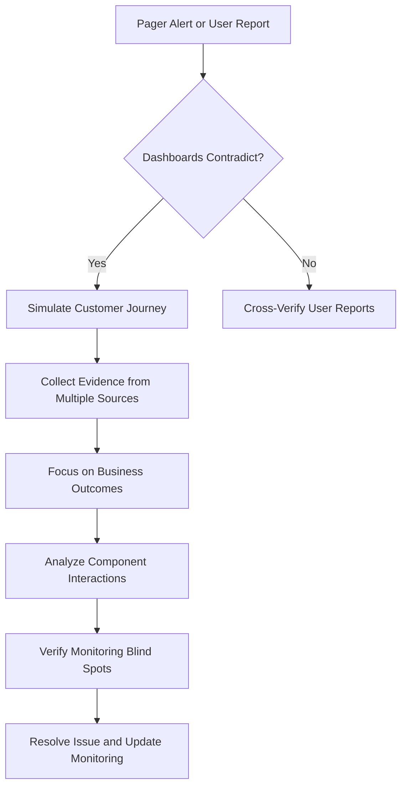
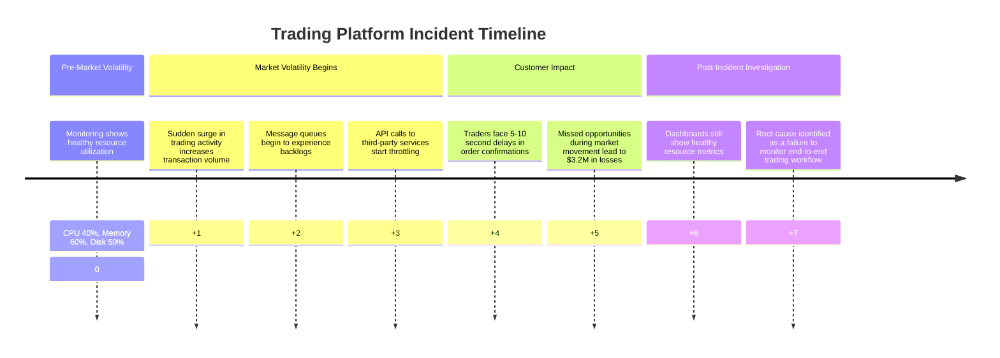
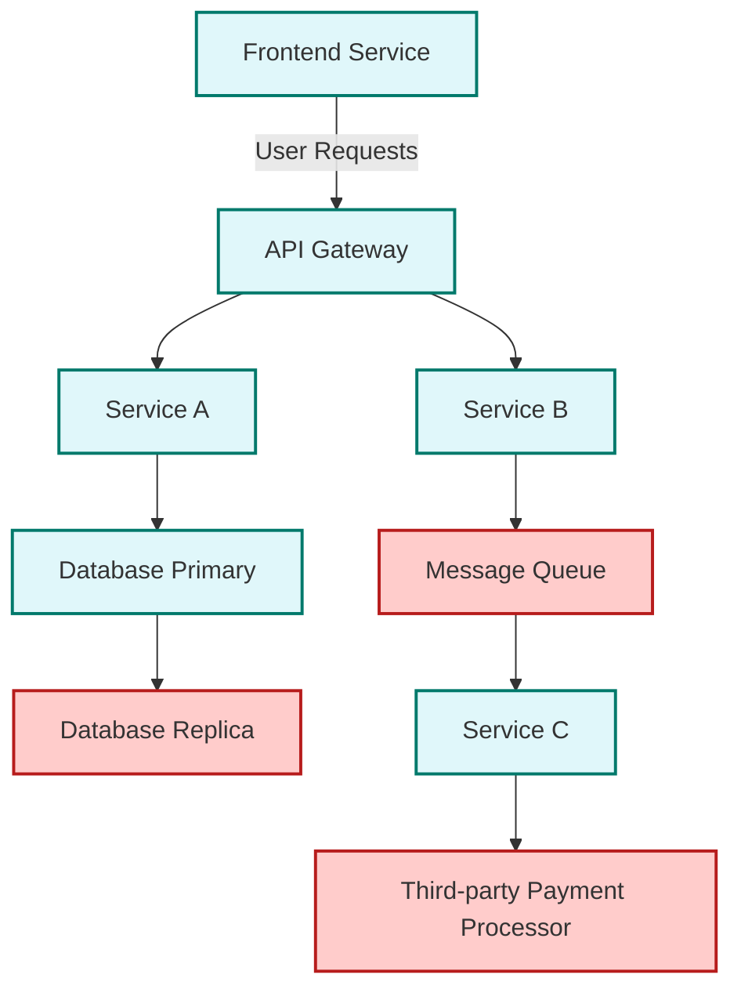
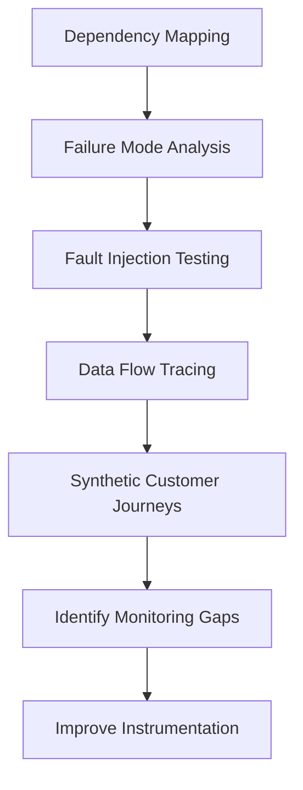
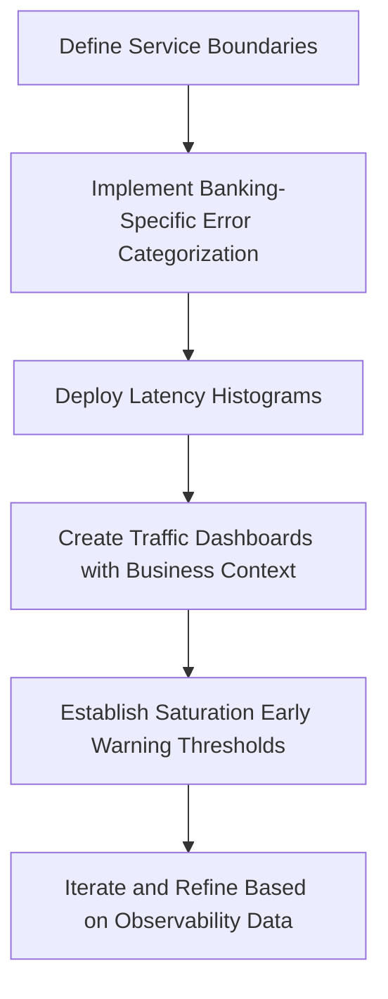

# Chapter 3: Beyond the Green Wall

## Chapter Overview

Welcome to the reality behind the “everything’s green” dashboard fantasy—where SREs wake up at 3AM, only to discover that their systems are lying to them with a pixelated wall of false confidence. This chapter rips apart the Green Wall Fallacy, exposing the ugly underbelly of traditional monitoring in banking: business-impacting failures that your dashboards blissfully ignore. We’ll show you how to go from dashboard-worshipping zombie to evidence-driven incident hunter, using real user experience as your north star. No more worshipping at the altar of CPU metrics while your customers rage on Twitter. We’ll teach you how to hunt blind spots, trust nothing, and triangulate the truth—because in financial systems, “all green” is just another way of saying, “we have no idea what’s really happening.” Buckle up: hope is not a monitoring strategy.

## Learning Objectives

- **Identify** the Green Wall Fallacy and **recognize** its business and technical consequences.
- **Shift** from system health metrics to outcome-based monitoring that reflects real customer impact.
- **Conduct** evidence-based investigations using direct testing, cross-system verification, and raw telemetry.
- **Map** and **eliminate** monitoring blind spots, especially at service boundaries and third-party dependencies.
- **Implement** the Four Golden Signals for critical banking workflows.
- **Design** systems for observability from the start, with explicit telemetry and failure detection baked in.
- **Create** and **apply** triangulation strategies to validate reality, not just what dashboards tell you.
- **Build** playbooks and escalation frameworks that prioritize user-reported issues over dashboard status.
- **Connect** observability practices directly to business outcomes: revenue protection, compliance, customer trust, and operational efficiency.

## Key Takeaways

- If your dashboard is a wall of green but customers are screaming, your monitoring is a placebo. Don’t be seduced by pretty colors.
- System health ≠ business health. No one cares about your 40% CPU if payments won’t process and Twitter is on fire.
- “No evidence of system issues” is code for “we’re not looking in the right place.” Start with the user, not the dashboard.
- Blind spots aren’t just unfortunate—they’re expensive. Hidden failures mean real money lost, regulatory fines, and public humiliation.
- Relying on traditional monitoring in banking is like checking your heartbeat while ignoring the fact that you’re bleeding out.
- Synthetic transactions and black-box monitoring aren’t “nice to have”—they’re your only defense against silent disasters.
- The Four Golden Signals are your new religion. Worship at the altar of latency, traffic, errors, and saturation—or prepare to suffer.
- Observability isn’t a bolt-on. If you can’t see it, you can’t run it. If you can’t measure it, you can’t fix it. And if you ship without it, you’re an accomplice.
- Evidence beats opinion. Triangulate reality with direct tests, raw data, and external confirmation. Dashboards lie—logs, traces, and users don’t.
- Business impact is not a theoretical concern. Every minute of “green wall” blindness is revenue lost, customers gone, and compliance nightmares multiplied.
- If you’re not designing for observability from day zero, you’re just writing expensive, untraceable bugs.
- Your incident response process should start with “trust the user, verify the system”—not the other way around.
- In banking, “hope it works” is not a strategy. “Prove it works, in production, every minute” is.

Congratulations. You’re now ready to stop being fooled by green tiles and start acting like an SRE who actually protects the business.

## Panel 1: The Pager Screams at 3AM

### Scene Description

In a dimly lit bedroom, Katherine is jolted awake by her pager at 2:57 AM. She scrambles for her laptop, still groggy, and logs into the monitoring dashboard. Her face is illuminated by the screen showing a wall of green status indicators despite the critical alert. In a smaller window, users are reporting payment failures. Confusion and doubt cross her face as she mutters, "But everything's green..."

### Teaching Narrative

When the pager wakes you at 2:57 AM, your first instinct is to trust your dashboards. This natural impulse represents one of the most dangerous anti-patterns in monitoring: the Green Wall Fallacy.

The Green Wall Fallacy occurs when monitoring systems display a "wall of green" tiles suggesting everything is functioning normally, while critical services are actually failing. Production support professionals transitioning to SRE roles must overcome this cognitive bias of trusting dashboard colors over actual user experience.

This disconnect happens because traditional monitoring focuses on system health metrics (CPU, memory, disk space) rather than service outcomes (successful transactions). While your servers might have plenty of resources and appear healthy, users could be experiencing complete service failure. In observability terminology, we're measuring the wrong signals – the ones that are easy to collect rather than the ones that matter.

### Common Example of the Problem

A major retail bank's online payment processing system begins rejecting customer transactions at 2:57 AM. Customer support receives multiple complaints about failed bill payments and transfers. The on-call engineer logs into the monitoring dashboard to find all systems showing green status:

- **CPU utilization:** 45%
- **Memory usage:** 60%
- **Network traffic:** Normal
- **Server status:** All reporting "UP"

Despite these reassuring indicators, customers cannot complete transactions, and money is not moving between accounts. After 47 minutes of investigation, the engineer discovers the root cause: a database credential rotation failed to propagate to all application servers, leading to silent authentication failures that didn't trigger traditional monitoring alerts.

#### Breakdown of the Disconnect

Here’s a simplified text diagram to illustrate the issue:

```
[Database Credential Rotation]
            |
            v
[Application Servers]
  |          |         |
  v          v         v
[Server A] [Server B] [Server C]
   |           |           |
   v           v           v
(FAILED)    (SUCCESS)    (FAILED)
   |           |           |
   v           v           v
[Monitoring Dashboard] --> [All Green]
       (Checks system      (Misses user-facing
        health only)        failures)
```

This diagram highlights the gap: while system health metrics like CPU and memory report normal status, user-facing issues like failed database authentication go undetected. The monitoring dashboard’s "wall of green" misleads engineers, delaying incident resolution and impacting customer experience.

### SRE Best Practice: Evidence-Based Investigation

When dashboards contradict user reports, experienced SREs immediately adopt an evidence-based approach that trusts user experience over system metrics. This requires shifting from passive dashboard monitoring to active service validation.

#### Checklist: Steps for Evidence-Based Investigation

1. **Direct Service Testing**

   - Simulate actual customer journeys to validate user-reported issues.
   - For example: Execute test transactions through production pathways to verify functionality.

2. **Triangulation from Multiple Sources**

   - Gather evidence from diverse sources such as:
     - Synthetic transactions
     - Real user monitoring data
     - Log anomalies
     - Direct customer reports

3. **Outcome-Based Verification**

   - Focus investigations on business outcomes (e.g., successful payments, completed transfers) rather than system health metrics (e.g., CPU, memory, disk).

4. **Analyze Interactions in Distributed Systems**

   - Investigate failures in the interactions between components, especially in recently changed ones, as these are common culprits.

5. **Trust but Verify**

   - Assume monitoring systems may have blind spots when dashboards show green but users report issues.
   - Operate under the principle that user reports often highlight real problems.

#### Quick Reference Flow



By following this checklist and flow, SREs can conduct methodical, evidence-driven investigations, minimizing downtime and improving incident response effectiveness.

### Banking Impact

The business consequences of the Green Wall Fallacy in banking environments are severe and multi-dimensional. The table below summarizes the five key impact areas with examples and potential metrics:

| **Impact Area** | **Description** | **Examples or Metrics** |
| --------------------------- | ---------------------------------------------------------------------------------------------------- | ------------------------------------------------------------------------------------ |
| **Financial Loss** | Revenue loss due to undetected payment processing outages. | - $X per minute of failed transactions<br>- Total value of delayed payments |
| **Regulatory Exposure** | Violations of regulatory requirements for system availability or incident reporting. | - Breach of uptime thresholds (e.g., 99.9%)<br>- Fines for late compliance reporting |
| **Customer Attrition** | Loss of customers who lose trust after experiencing rejected transactions or poor issue handling. | - Churn rate increase<br>- Negative Net Promoter Score (NPS) changes |
| **Reputation Damage** | Public backlash amplified through social media when institutions appear unresponsive or unaware. | - Number of negative social media posts<br>- Media coverage of outages |
| **Response Time Penalties** | Extended resolution times due to delayed detection, leading to SLA breaches or compensation payouts. | - SLA violation count<br>- Compensation costs paid to affected customers |

This structured view highlights the broad and interconnected risks caused by undetected service failures, emphasizing the need for outcome-focused monitoring in critical banking systems.

### Implementation Guidance

To overcome the Green Wall Fallacy in banking systems:

1. **Implement Black-Box Monitoring**: Deploy synthetic transaction monitors that execute complete customer journeys (e.g., login, balance check, fund transfer) every 1-2 minutes. These monitors should alert on failures regardless of infrastructure health. Below is an example of a synthetic transaction script using a Selenium-based approach in Python:

   ```python
   from selenium import webdriver
   from selenium.webdriver.common.by import By
   from selenium.webdriver.common.keys import Keys
   import time

   # Initialize WebDriver
   driver = webdriver.Chrome()

   try:
       # Step 1: Navigate to the login page
       driver.get("https://your-banking-app.com/login")

       # Step 2: Enter login credentials
       username_field = driver.find_element(By.ID, "username")
       password_field = driver.find_element(By.ID, "password")
       username_field.send_keys("test_user")
       password_field.send_keys("secure_password")
       password_field.send_keys(Keys.RETURN)

       # Step 3: Wait for login to complete
       time.sleep(5)

       # Step 4: Navigate to balance check
       driver.get("https://your-banking-app.com/balance")
       balance = driver.find_element(By.ID, "balance").text
       print(f"Account Balance: {balance}")

       # Step 5: Perform a fund transfer
       driver.get("https://your-banking-app.com/transfer")
       recipient_field = driver.find_element(By.ID, "recipient")
       amount_field = driver.find_element(By.ID, "amount")
       recipient_field.send_keys("recipient_account")
       amount_field.send_keys("100")
       amount_field.send_keys(Keys.RETURN)

       # Step 6: Confirm success message
       time.sleep(2)
       success_message = driver.find_element(By.ID, "success").text
       if "Transfer Successful" not in success_message:
           raise Exception("Fund transfer failed!")
   finally:
       driver.quit()
   ```

2. **Establish Business Metric SLIs**: Define and monitor Service Level Indicators that directly track business outcomes, such as payment success rates, transaction completion percentages, and authorization approval rates. Example Prometheus SLI configuration for tracking transaction success rate:

   ```yaml
   - record: transaction_success_rate
     expr: sum(rate(transaction_success_total[5m])) / sum(rate(transaction_attempt_total[5m]))
   ```

3. **Deploy Real User Monitoring**: Implement client-side telemetry using tools like OpenTelemetry to capture actual customer experience metrics. This includes tracking page load times, error rates, and user flows in real-time.

4. **Create Service Dependency Maps**: Document all dependencies between services to identify potential failure points. Below is an example of a service dependency map using text-based representation:

   ```
   [Web Frontend] --> [API Gateway] --> [Authentication Service]
                  |                 --> [Payment Processor]
                  --> [Database Service]
   ```

5. **Implement Proactive Credential Testing**: For systems relying on database or API credentials, set up automated monitors to validate credential validity proactively. For example, use a periodic script to test database credentials:

   ```python
   import psycopg2

   try:
       connection = psycopg2.connect(
           dbname="example_db",
           user="example_user",
           password="example_password",
           host="db.example.com",
           port="5432"
       )
       print("Database credentials are valid.")
   except Exception as e:
       print(f"Credential validation failed: {e}")
   finally:
       if 'connection' in locals() and connection:
           connection.close()
   ```

By integrating these practices into your monitoring strategy, you can shift focus from infrastructure health to actual user experience and service outcomes, ensuring critical issues are detected and addressed promptly.

## Panel 2: Metrics That Matter

### Scene Description

A split-screen highlights two contrasting monitoring approaches:

```
Traditional Dashboard                          Service-Oriented Dashboard
+-----------------------+                      +-----------------------------+
| CPU Usage: 15% (Green)|                      | Transaction Success Rate: 27% |
| Memory Usage: 40%     |                      | Avg Response Time: 12 sec     |
| Disk Space: 60%       |                      | Error Count: Increasing       |
+-----------------------+                      +-----------------------------+
```

In the center, Sofia, an experienced SRE, stands confidently. She gestures toward the service-oriented dashboard on the right, emphasizing the critical drop in transaction success rate, the spike in response time, and the escalating error counts. A group of production support engineers, transitioning into an SRE role, listens attentively as Sofia contrasts the two approaches. The traditional dashboard on the left remains static, focused on resource utilization, while the right screen prioritizes user-centric metrics that reveal the real impact on customer experience.

### Teaching Narrative

The fundamental shift from monitoring to observability begins with reorienting what we measure. Traditional monitoring asks: "Are my systems running?" Observability asks: "Are my systems serving users effectively?"

This transition requires moving beyond resource utilization metrics to service-level indicators (SLIs) that directly reflect the user experience. For banking applications, these critical metrics include:

1. Transaction success rates (what percentage of payment attempts succeed?)
2. Error rates by error type (are we seeing authentication failures vs. processing errors?)
3. End-to-end transaction latency (how long do users wait for confirmation?)
4. Dependency availability (are third-party services responding correctly?)

The metrics that truly matter are those that correlate directly with user experience and business outcomes. An observability mindset recognizes that a system with 20% CPU utilization that can't process transactions is far worse than a system running at 90% CPU that successfully handles every user request.

### Common Example of the Problem

A major investment bank's trading platform experienced severe performance degradation during market volatility events. Despite millions invested in monitoring tools, traders reported 5-10 second delays in order confirmations while all monitoring dashboards showed healthy systems. Investigation revealed that while individual microservices had normal CPU and memory profiles, the end-to-end transaction path experienced severe message queue backlogs and API throttling. The operations team had been monitoring component health rather than trading workflow completion, missing the actual customer experience.

To illustrate the sequence of events, here's a timeline of how the issue unfolded:



This example highlights the critical gap between traditional resource-focused monitoring and the need for observability-driven metrics. While individual microservices appeared to perform normally, the lack of visibility into the full transaction workflow obscured the user impact. During a major market movement, traders lost millions while operations teams insisted systems were "performing normally" based on their resource utilization dashboards.

### SRE Best Practice: Evidence-Based Investigation

SREs transform monitoring effectiveness by implementing outcome-based telemetry strategies. These strategies focus on aligning metrics with user experience and ensuring actionable insights. To apply these best practices, use the checklist below:

#### Evidence-Based Investigation Checklist

1. **Customer Journey Mapping**

   - Document complete user workflows (e.g., placing a trade, executing a transfer).
   - Ensure each workflow step is instrumented to measure:
     - Success rates
     - Latency
     - Error rates

2. **Criticality-Based Coverage**

   - Identify the most critical user journeys for each service.
   - Implement comprehensive outcome-based metrics for these critical paths to ensure visibility into what matters most.

3. **Error Budget Derivation**

   - Define acceptable performance thresholds based on business impact.
   - Derive error budgets that reflect customer experience requirements rather than technical capacity.

4. **Dependency Instrumentation**

   - Identify all critical service dependencies (e.g., authentication services, payment processors, market data feeds).
   - Implement specific metrics to verify the correct functioning of these dependencies.

5. **False Positive Elimination**

   - Continuously refine alerting systems to eliminate notifications that lack correlation with actual customer impact.
   - Focus on reducing alert fatigue and improving response effectiveness.

By using this checklist, SREs can systematically implement evidence-based investigation practices to enhance observability and prioritize metrics that directly impact the user experience.

### Banking Impact

Shifting to outcome-based metrics creates significant business advantages for financial institutions:

1. **Revenue Protection**: Detecting customer experience issues before they affect large transaction volumes prevents direct revenue loss, particularly in high-frequency trading and payment processing.

2. **Competitive Advantage**: Faster detection and resolution of customer-impacting issues creates measurable differentiation in financial services where reliability directly influences institution selection.

3. **Regulatory Compliance**: Many financial regulations (e.g., PSD2, MiFID II) require monitoring and reporting on service availability from the customer perspective, which resource-based monitoring fails to address.

4. **Investment Optimization**: Understanding which metrics correlate with actual customer impact helps prioritize infrastructure investments toward improvements that directly enhance experience.

5. **Reputation Management**: Detecting and resolving customer-impacting issues before they generate complaints significantly reduces negative social media exposure and brand damage.

### Implementation Guidance

To implement outcome-based metrics in banking environments, follow these steps. The table below maps each step to specific benefits and challenges to provide clarity and structure for your implementation journey.

| Step | Benefits | Challenges |
| -------------------------------------------- | ------------------------------------------------------------------------------------------------ | ------------------------------------------------------------------------------------------- |
| **Define Service-Level Indicators** | Ensures focus on metrics that directly impact customer experience, e.g., payment success rates. | Requires cross-team alignment to identify meaningful SLIs for each critical service. |
| **Implement Golden Signals Monitoring** | Provides comprehensive coverage of customer journeys, highlighting latency, errors, and traffic. | May require reconfiguring existing monitoring systems and tuning alert thresholds. |
| **Create Executive Dashboards** | Offers business stakeholders clear visibility into user experience and operational performance. | Balancing simplicity with depth can be challenging when designing dashboards. |
| **Deploy Synthetic Transaction Monitoring** | Detects issues proactively by simulating user journeys, reducing downtime impact. | Can generate additional load on systems; requires careful scheduling and coverage analysis. |
| **Establish SLI-to-Business Impact Mapping** | Aligns technical metrics with business outcomes, improving stakeholder communication. | Requires collaboration between technical teams and business units to correctly map impacts. |

### Detailed Steps for Implementation

1. **Define Service-Level Indicators**: For each critical banking service, identify 3-5 SLIs that directly reflect customer experience. Examples include payment success rates, transfer completion times, trade execution latency, and authentication success rates.

2. **Implement Golden Signals Monitoring**: Deploy the four golden signals (latency, traffic, errors, saturation) for all critical customer journeys. Configure alert thresholds based on customer impact rather than infrastructure utilization to ensure user-focused monitoring.

3. **Create Executive Dashboards**: Develop dashboards tailored to business stakeholders that highlight transaction success rates, customer completion rates, and journey abandonment metrics. These dashboards should prioritize actionable insights over technical details.

4. **Deploy Synthetic Transaction Monitoring**: Set up automated scripts or robots to execute key customer journeys (e.g., payments, transfers, trades) at regular intervals (e.g., every 1-5 minutes) across critical systems. Use the results to identify and resolve issues before they impact users.

5. **Establish SLI-to-Business Impact Mapping**: Document the relationship between SLIs and business outcomes. For example, show how a decline in payment success rates impacts revenue. Use this mapping to educate stakeholders and prioritize improvements.

By following this structured approach, teams can transition from traditional resource-based monitoring to observability-driven practices that prioritize user experience and business outcomes.

## Panel 3: When Alerts Contradict Dashboards

### Scene Description

A war room where a team is responding to a payment processing incident. The atmosphere is tense, with multiple engineers focused on their screens, which display conflicting information. Paper coffee cups and energy drink cans are scattered across the table, evidence of the long hours spent troubleshooting. On the main screen at the front of the room, critical alerts flash red, signaling potential issues, while the monitoring dashboard still shows mostly green tiles, adding to the confusion.

To the side, a team lead is engaged in a heated conversation on the phone with a customer support representative, who reports numerous customer complaints about failed payments. At the whiteboard, an SRE actively sketches a system diagram, circling a component labeled "Payment Gateway" that isn't being directly monitored, suggesting a potential blind spot in the system.

Below is a simplified representation of the war room setup:

```
+-------------------------------------------------------------+
|                             Main Screen                     |
|        [ Critical Alerts: RED ]    [ Dashboard: GREEN ]     |
+-------------------------------------------------------------+
                    ↑                           ↑
    Engineers analyzing logs         Engineers watching metrics
          (confusion)                          (confusion)

+-------------------------------------------------------------+
|                         War Room Table                      |
|   Coffee cups | Energy drinks | Laptops | Notes scattered   |
+-------------------------------------------------------------+
        ↑                                                          
    SRE at Whiteboard     --->   [System Diagram with "Payment Gateway" circled]
        ↓                                                          
  Team Lead on Phone  --->   [Reports of customer payment failures]
```

This setup highlights the contrast between visible system health indicators and external signals of failure, emphasizing the need for deeper exploration into unmonitored components.

### Teaching Narrative

Incident response fundamentally changes when you move from a monitoring mindset to an observability mindset. When alerts contradict dashboards, the monitoring mindset asks: "Is this a false alarm?" The observability mindset asks: "What aren't we seeing?"

This represents a critical cognitive shift for production support professionals transitioning to SRE roles. Traditional approaches often trust the monitoring system over external reports, leading to delayed response and extended outages. The observability approach treats user reports as primary truth and uses telemetry to understand why the system isn't detecting the problem.

The root cause of this contradiction often lies in monitoring gaps – critical components or interfaces that aren't directly observed but impact user experience. In complex banking systems, these gaps frequently occur at service boundaries, in asynchronous processing queues, or in third-party dependencies.

Effective SREs develop a systematic approach to rapidly validate whether user-reported issues are real, regardless of what dashboards show. This typically involves direct testing of user-facing functionality (such as sending test transactions) before diving deeper into system internals.

### Common Example of the Problem

A global bank's mobile payment application began experiencing intermittent transaction failures during peak hours. Customer support received over 200 complaints in 30 minutes, but the monitoring dashboards showed all systems operating normally. The team struggled to reconcile conflicting data between the alerts and dashboards, leading to delays in identifying the root cause.

Below is a timeline of the key events during the incident:

```plaintext
[00:00] Peak hour begins; transaction volume increases.
[00:15] Intermittent transaction failures start occurring.
[00:30] Customer support receives 200+ complaints about failed payments.
[00:35] Monitoring dashboards still show all systems as healthy.
[00:40] Initial NOC assessment concludes: "No evidence of system issues."
[01:10] SRE team begins investigating user-reported failures.
[01:45] Discovery: API gateway is silently dropping a percentage of responses.
[02:00] Root cause identified: TLS certificate issue at the API gateway.
[02:30] Fix deployed; transaction flow stabilizes.
[03:00] Full resolution achieved; incident closed.

Total Incident Duration: 3 hours
Avoidable Downtime: 2.5 hours (if customer reports were prioritized sooner)
```

The investigation revealed that the payment authorization service was correctly receiving requests and returning responses, but an API gateway was silently dropping responses due to a TLS certificate issue. This failure occurred at a service boundary, a critical blind spot in the current monitoring setup. Because monitoring focused on individual service health rather than complete transaction flows, this service boundary failure remained invisible despite significant customer impact.

This incident highlights the importance of shifting from a monitoring mindset to an observability mindset. By prioritizing user reports and systematically testing end-to-end user-facing functionality, the team could have identified the issue much earlier and reduced downtime significantly.

### SRE Best Practice: Evidence-Based Investigation

To effectively investigate incidents where alerts and dashboards contradict each other, SREs can follow this structured checklist:

| Step | Action | Key Focus Areas |
| ------------------------------------- | ----------------------------------------------------------------------------------------------------------- | ---------------------------------------------------- |
| **1. Reality Verification** | Perform direct user-facing tests to validate the issue (e.g., send test transactions). | Confirm whether the reported issue is reproducible. |
| **2. Boundary Tracing** | Investigate service boundaries and integration points for potential blind spots. | Identify gaps in monitoring at service interfaces. |
| **3. Protocol-Level Validation** | Analyze network traffic (e.g., packet captures, proxies) to verify full request-response cycles. | Ensure communication between components is intact. |
| **4. Silent Failure Detection** | Look for non-obvious failure modes such as dropped messages, stalled queues, or expired credentials. | Detect issues that may not generate explicit errors. |
| **5. Monitoring System Verification** | Validate the monitoring system itself (e.g., data freshness, collection completeness, alert configuration). | Confirm the reliability of your observability tools. |

By following this checklist, SREs can systematically uncover the root cause of discrepancies, ensuring a faster and more accurate resolution of incidents.

### Banking Impact

When monitoring systems miss real customer issues, financial institutions face cascading business consequences. The table below summarizes key impacts with quantitative examples:

| **Impact Area** | **Description** | **Example Metrics** |
| ------------------------------- | ------------------------------------------------------------------------------------------------------------ | -------------------------------------------------------------------------------------- |
| **Transaction Abandonment** | Customers experiencing payment failures typically abandon transactions after 1-2 retries. | $50,000 lost revenue per 1,000 abandoned transactions (average transaction $50). |
| **Support Cost Escalation** | Undetected incidents generate waves of customer support contacts, increasing operational costs. | $5-$25 per contact; 1,000 contacts = $5,000-$25,000 additional cost per incident. |
| **Double-Spend Risk** | Customers often submit duplicate transactions, creating reconciliation challenges and financial exposure. | 2% of failed transactions result in duplicates, leading to potential write-off losses. |
| **Partner Relationship Damage** | Failures at integration points with payment networks and banking partners can strain relationships. | Penalty fees range from $10,000-$50,000 per SLA breach, depending on the partner. |
| **Compliance Violations** | Financial regulations require timely detection and reporting of incidents; undetected issues risk penalties. | Fines up to $250,000 per violation under regulatory frameworks like PSD2 or PCI DSS. |

These impacts highlight the critical need for a robust observability strategy that prioritizes user experience and proactively addresses monitoring gaps before they escalate into significant financial or operational risks.

### Implementation Guidance

To resolve the contradiction between alerts and dashboards:

1. **Implement End-to-End Transaction Tracing**: Deploy distributed tracing across all services with particular focus on capturing complete payment and transfer workflows from initiation to confirmation. For example, in a system using OpenTelemetry, you can instrument services with code similar to the following:

   ```python
   from opentelemetry import trace
   from opentelemetry.instrumentation.requests import RequestsInstrumentor

   # Initialize tracer
   trace.set_tracer_provider(TracerProvider())
   tracer = trace.get_tracer(__name__)

   # Instrument HTTP requests
   RequestsInstrumentor().instrument()

   def process_payment(order_id):
       with tracer.start_as_current_span("process_payment") as span:
           span.set_attribute("order.id", order_id)
           # Simulate a payment processing step
           response = requests.post("https://payment-gateway/charge", json={"order_id": order_id})
           span.set_attribute("response.status_code", response.status_code)
           return response
   ```

   This approach ensures that each transaction is traceable across services, with detailed metadata for better debugging.

2. **Create Service Boundary Monitors**: Develop specific monitors for integration points between services, particularly API gateways, message queues, and third-party connections. For example, using Prometheus, you can set up a probe to monitor an API gateway's health:

   ```yaml
   - job_name: 'api_gateway_health'
     metrics_path: '/health'
     static_configs:
       - targets: ['api-gateway.example.com:8080']
   ```

   Additionally, ensure metrics like request latency, error rates, and response codes are exposed and monitored for these boundaries.

3. **Deploy Black-Box Validation**: Implement external synthetic transactions that execute complete customer journeys through production pathways, bypassing internal health checks to validate actual functionality. For instance, using a tool like Selenium for web-based workflows:

   ```python
   from selenium import webdriver

   driver = webdriver.Chrome()
   try:
       driver.get("https://example.com/login")
       driver.find_element("id", "username").send_keys("test_user")
       driver.find_element("id", "password").send_keys("secure_password")
       driver.find_element("id", "login_button").click()

       # Validate navigation to dashboard
       assert "Dashboard" in driver.title
   finally:
       driver.quit()
   ```

   Regularly schedule these synthetic tests and alert on failures indicative of customer-impacting issues.

4. **Establish Alert Priority Framework**: Create an alert classification system that prioritizes customer-impacting signals over resource utilization warnings. For instance, configure your alert manager (e.g., in Prometheus) to route customer-impacting alerts to a high-priority channel:

   ```yaml
   route:
     group_by: ['alertname']
     routes:
       - match:
           severity: critical
         receiver: on-call-team
       - match:
           severity: warning
         receiver: ops-dashboard
   ```

   This ensures that critical alerts are immediately surfaced to the appropriate team.

5. **Define Middle-of-Night Decision Tree**: Develop a clear escalation framework for on-call engineers that prioritizes rapid validation of customer reports over dashboard verification. The following text-based decision tree can guide common scenarios:

   ```
   Is there a customer report of an issue? (Yes/No)
       |
       Yes --> Is the issue reproducible via synthetic tests? (Yes/No)
                |
                Yes --> Begin investigating system internals (e.g., traces, logs, metrics).
                No  --> Escalate to the appropriate service owner or team lead.
       |
       No --> Review dashboard and alerts for anomalies. Proceed based on existing playbooks.
   ```

   Ensure this decision tree is documented in the team's runbook for easy access during incidents.

## Panel 4: The Hidden Failures

### Scene Description

The architectural diagram below represents a banking payment system with multiple components, highlighting areas prone to hidden failures. Components with clear instrumentation and monitoring are marked with "eye" icons, while unmonitored or under-monitored components are left blank. Three critical blind spots are circled in red:

1. A database replica used exclusively for reporting
2. A message queue facilitating communication between services
3. A connection to a third-party payment processor

The SRE is walking new team members through these blind spots, explaining how failures in these areas can occur unnoticed while monitoring systems display a healthy state.



This diagram emphasizes the importance of identifying and instrumenting blind spots to prevent hidden failures, reinforcing the concept that even mature monitoring setups can leave critical gaps. The SRE encourages the team to adopt an observability mindset, constantly questioning, "If this component failed, would we know immediately?"

### Teaching Narrative

The most dangerous failures in complex systems are those that occur in unmonitored or under-monitored components – the "blind spots" that exist in even mature monitoring setups. These hidden failures often manifest in several common patterns:

1. **Silent Failures**: Components that degrade or fail without generating errors, such as database replicas that fall behind primary instances
2. **Asynchronous Processing Issues**: Message queues or batch processing systems where failures don't immediately affect front-end services
3. **Partial System Failures**: Situations where redundant systems mask individual component failures until all redundancy is exhausted
4. **Third-Party Dependencies**: External services with insufficient visibility into their operational state

Transitioning from monitoring to observability means systematically identifying and eliminating these blind spots by implementing comprehensive instrumentation. This requires a thorough understanding of the entire system architecture and all critical dependencies.

An observability mindset constantly asks: "If this component failed, would we know immediately?" For any component where the answer is "no," you have a potential source of confusing incidents where dashboards show green while users experience failures.

### Common Example of the Problem

A major bank's wealth management platform experienced a critical data inconsistency issue that went undetected for 17 hours. Customers viewing their investment portfolios saw incorrect holdings and valuations, leading to numerous complaints and several large erroneous trades. Investigation revealed that the database replication process between the transaction database and the reporting database had silently failed, causing the reporting system to display outdated information. Since the primary transaction database was functioning correctly, all monitoring dashboards showed green status. The replication process itself had no specific monitoring beyond basic server health checks. The failure was eventually discovered only when a customer called to report that a trade they had executed hours earlier wasn't reflected in their portfolio view. The incident resulted in the bank covering over $450,000 in trading losses from decisions made using incorrect data.

#### Timeline of Events

```mermaid
timeline
    title Data Inconsistency Incident Timeline
    section Undetected Failure
        00:00 Silent failure in database replication process begins
        01:00 Monitoring dashboards continue showing green status
        08:00 Customers unknowingly begin viewing outdated portfolio data
    section Customer Impact
        10:00 Erroneous trades made based on incorrect data
        17:00 Customer reports discrepancy in portfolio view
    section Detection and Resolution
        17:30 Incident investigation begins
        19:00 Root cause identified: replication process failure
        20:00 Database replication restored; data consistency verified
        22:00 Bank compensates customers for trading losses
```

This timeline illustrates how the issue progressed from an undetected silent failure to a significant customer-impacting event. By the time the failure was discovered, it had already caused financial losses and damaged customer trust. A key lesson here is the importance of proactive monitoring for critical processes like database replication to detect silent failures before they escalate into larger incidents.

### SRE Best Practice: Evidence-Based Investigation

SREs systematically eliminate monitoring blind spots through comprehensive system analysis. The following checklist summarizes the key steps for conducting an evidence-based investigation:

#### Checklist for Evidence-Based Investigation:

1. **Dependency Mapping**:

   - Create a complete service dependency map.
   - Include all components in the transaction path, even those without direct customer impact.
   - Highlight systems that could cause downstream failures if unmonitored.

2. **Failure Mode Analysis**:

   - Document potential failure modes for each component.
   - Pay special attention to silent failures that wouldn't trigger traditional alerts.
   - Assess the likelihood and impact of each potential failure.

3. **Fault Injection Testing**:

   - Conduct controlled chaos engineering experiments regularly.
   - Simulate failures in critical components to verify monitoring system effectiveness.
   - Ensure alerts are triggered appropriately during simulated failures.

4. **Data Flow Tracing**:

   - Implement checks to validate complete data flows within the system.
   - Focus on asynchronous processes, replication systems, and batch jobs.
   - Confirm that data integrity is maintained across the flow.

5. **Synthetic Customer Journeys**:

   - Deploy robots to perform complete end-to-end workflows.
   - Verify the accuracy and consistency of results, not just their delivery.
   - Use these tests to proactively detect potential issues in customer-facing systems.

#### Quick Reference: Evidence-Based Investigation Flow



By following this checklist and flow, SREs can systematically identify and address blind spots, ensuring that monitoring evolves into true observability.

### Banking Impact

Hidden failure points create significant business risks specific to financial services:

1. **Data Inconsistency Exposure**: Financial decisions made with inconsistent or outdated data can result in direct monetary losses that the institution may be liable for covering.

2. **Reconciliation Failures**: Undetected issues in batch processing or settlement systems can create reconciliation challenges that compound over time and eventually require costly manual correction.

3. **Compliance Violations**: Regulatory requirements often mandate complete audit trails and consistent data, which silent failures may compromise without detection.

4. **Customer Trust Erosion**: Discovering that institutions were unaware of system issues affecting financial data severely damages customer confidence in operational competence.

5. **Recovery Complexity**: The longer hidden issues persist, the more complex and costly recovery becomes, often requiring extensive reconciliation and correction processes.

### Implementation Guidance

To identify and eliminate monitoring blind spots in banking systems, follow these steps. The table below maps each step to specific monitoring tools or techniques for practical application.

| Step | Recommended Tools/Techniques |
| --------------------------------------------- | ------------------------------------------------------------------------------------------------------------------------------------------------------------------------------------- |
| **Conduct System Component Inventory** | Use architectural diagrams, dependency mapping tools, and manual audits to document all components. |
| **Implement Database Replication Monitoring** | Set up database monitoring tools like Prometheus, Cloud-native monitoring (e.g., AWS RDS Performance Insights), or custom scripts for replication lag and data consistency checks. |
| **Develop Async Process Validation** | Utilize tools like RabbitMQ Management Plugin, Kafka Monitoring (e.g., Confluent Control Center), or custom metrics for queue depth and message tracking. |
| **Deploy Data Consistency Checks** | Implement automated tests using frameworks like dbt, custom SQL scripts, or financial data reconciliation tools to verify data consistency. |
| **Establish Third-Party Service Monitors** | Use synthetic monitoring tools (e.g., Pingdom, New Relic), integrate third-party status pages, and employ API testing frameworks like Postman to validate third-party service health. |

By systematically applying these tools and techniques, you can transition from basic monitoring to a robust observability framework, ensuring that hidden failures are detected and addressed promptly.

## Panel 5: Triangulating Truth

### Scene Description

An SRE named Amara demonstrates a methodical incident investigation approach to a group of transitioning production support engineers. The setup is as follows:

```
+------------------+      +------------------+      +---------------------+
|   Monitor 1:     |      |   Monitor 2:     |      |   Monitor 3:         |
| curl command     |      | Real-time log    |      | Distributed tracing  |
| against API:     |      | stream showing   |      | tool with a red      |
| HTTP 500 error   |      | exceptions       |      | failed span          |
+------------------+      +------------------+      +---------------------+

                          +----------------------+
                          | Whiteboard:          |
                          | Checklist titled     |
                          | "Proving Reality"    |
                          | Steps for validating |
                          | system behavior      |
                          | across evidence      |
                          | sources              |
                          +----------------------+
```

Amara uses these tools in tandem to walk the group through a structured incident investigation. The layout visually integrates direct functional testing, raw telemetry data, and external validation, reinforcing the key principles of the triangulation method.

### Teaching Narrative

When dashboards and reality disagree, SREs must become detectives who systematically triangulate the truth using multiple evidence sources. This evidence-based approach represents a fundamental principle of observability culture: no single monitoring system is ever comprehensive enough to be trusted implicitly.

Effective triangulation involves gathering evidence from at least three distinct sources:

1. **Direct Functional Testing**: Simulating real user actions to validate or reproduce reported issues
2. **Raw Telemetry Data**: Examining logs, metrics, and traces directly rather than through dashboard abstractions
3. **External Confirmation**: Verifying issues through user reports, synthetic monitoring, or third-party status pages

This methodical approach contrasts with traditional monitoring culture, which often relies heavily on predefined dashboards and alerts. Experienced SREs develop standardized investigation patterns that quickly validate whether user-reported issues are real, regardless of what monitoring systems indicate.

The triangulation mindset embodies a core SRE principle: that observable reality takes precedence over any monitoring system's interpretation of that reality. As the saying goes in observability culture: "Trust, but verify—and when in doubt, believe the user."

### Common Example of the Problem

During a major market volatility event, a global investment bank's trading platform exhibited sporadic trade execution delays. The monitoring dashboard displayed normal system performance, leading initial responders to classify reports as "user error." However, an experienced SRE applied a triangulation approach to uncover the root cause. Below is a timeline of the investigation:

```mermaid
gantt
    title Incident Investigation Timeline
    dateFormat HH:mm
    axisFormat %H:%M
    section Actions Taken
    Execute Test Trades         :done, 10:00, 10m
    Examine Raw Application Logs:done, after 10m, 20m
    Review Distributed Traces   :done, after 30m, 15m
    Identify Root Cause         :done, after 45m, 10m
    section Findings
    Test Trades Show Delays (4-8s):crit, done, 10:10, 0m
    Logs Show Intermittent DB Exhaustion:crit, done, 10:30, 0m
    Traces Show DB Connection Limits Hit:crit, done, 10:45, 0m
```



#### Key Investigation Steps:

1. **Direct Functional Testing**: The SRE executed test trades, confirming delays of 4-8 seconds despite normal-looking metrics on the monitoring dashboard.
2. **Raw Telemetry Data Analysis**: By examining raw application logs, the SRE uncovered intermittent database connection pool exhaustion, which was otherwise obscured by aggregated metrics.
3. **Distributed Trace Review**: The SRE identified that increased trade volume caused microservice instances to exceed their database connection limits, pinpointing the bottleneck.

This evidence-based approach revealed a legitimate issue that standard monitoring tools had missed. By systematically triangulating evidence, the SRE prevented significant trading losses that could have accumulated had the incident remained misclassified as "no technical issues found."

### SRE Best Practice: Evidence-Based Investigation

SREs implement systematic triangulation methods to validate system reality. The following checklist summarizes key best practices to guide evidence-based investigations:

#### **Checklist: Evidence-Based Investigation**

- **[ ] Multi-Source Verification**: Gather evidence from at least three distinct sources, such as logs, metrics, traces, synthetic tests, and user reports. Avoid relying on any single data source.
- **[ ] Raw Data Analysis**: Access raw telemetry data directly, bypassing dashboard abstractions to uncover hidden patterns or discrepancies.
- **[ ] Cross-System Correlation**: Investigate interactions between components, focusing on system boundaries where issues often originate.
- **[ ] Time Synchronization**: Verify precise time alignment across systems to ensure accurate correlation of events from different sources.
- **[ ] Hypothesis Testing**: Formulate clear hypotheses about system behavior and test them through controlled experiments or simulated failures.
- **[ ] User-Centric Validation**: When in doubt, prioritize user-reported issues and validate them through direct functional testing or external confirmation.

This checklist reinforces the SRE principle that observable reality takes precedence over monitoring system interpretations. By systematically applying these steps, SREs can confidently identify and resolve incidents, ensuring system truth is accurately triangulated.

### Banking Impact

Evidence-based investigation creates significant business advantages in financial systems:

1. **Faster Mean Time to Resolution**: Triangulation approaches typically reduce incident resolution time by 35-65% compared to dashboard-only analysis, directly reducing financial impact.

2. **Trading Loss Prevention**: In investment banking and trading platforms, rapid identification of execution issues can prevent exponential loss accumulation during market volatility.

3. **Transaction Integrity Protection**: Thorough investigation prevents incorrect transaction processing from continuing while issues are being debated, protecting financial data integrity.

4. **Customer Communication Accuracy**: Evidence-based approaches provide clear, factual incident details that improve customer communication and prevent misinformation.

5. **Root Cause Identification**: Triangulation significantly improves root cause analysis success rates, enabling permanent fixes rather than temporary mitigations.

### Implementation Guidance

To implement effective triangulation in banking environments:

1. **Create Investigation Playbooks**: Develop standardized investigation workflows for common scenarios (e.g., payment issues, trading delays, authentication problems). Each playbook should include specific steps for gathering evidence from direct testing, raw telemetry, and external confirmation sources. For example:

   **Sample Playbook: Investigating Payment Failures**

   - **Direct Testing**: Use a custom CLI tool to simulate a payment API request with test data, capturing the response and validating expected behavior.
   - **Raw Telemetry**: Query application logs for recent payment attempt logs, filtering by the test transaction ID.
   - **External Confirmation**: Check third-party payment processor status pages for ongoing outages or synchronization issues.

2. **Deploy Distributed Tracing**: Implement end-to-end distributed tracing for all critical financial transactions. Ensure traces include detailed metadata (e.g., user ID, transaction ID) to enable precise correlation during incident investigations. Below is an example of a tracing query to identify failed spans:

   ```shell
   # Example query using Jaeger CLI
   jaeger-query --service payment-service --operation processTransaction --status error --lookback 1h
   ```

3. **Build Direct Testing Tools**: Create simple command-line tools that allow on-call engineers to directly test critical APIs, execute synthetic transactions, and validate actual system behavior. Below is a basic example of a direct testing script for an API endpoint:

   ```bash
   # payment_api_test.sh: Simple script to test payment API
   # Usage: ./payment_api_test.sh <user_id> <amount>
   # Example: ./payment_api_test.sh 12345 50.00

   USER_ID=$1
   AMOUNT=$2

   curl -X POST https://api.bank.com/payments \
        -H "Content-Type: application/json" \
        -d '{
              "userId": "'"$USER_ID"'",
              "amount": "'"$AMOUNT"'"
            }' \
        -w '\nHTTP Code: %{http_code}\n'
   ```

4. **Establish Reality Verification Protocol**: Implement a standard "reality check" procedure requiring verification from at least three independent data sources before dismissing any reported issue. For instance:

   - Run a direct API test to replicate the problem.
   - Inspect logs for error patterns matching the reported timeframe.
   - Validate with external monitoring (e.g., synthetic checks or user reports).

5. **Conduct Triangulation Training**: Develop hands-on training scenarios that simulate real-world incidents where dashboard data conflicts with reality. Use mock systems to demonstrate:

   - How to identify discrepancies in telemetry data.
   - The importance of direct testing and external confirmation.
   - Patterns of evidence that indicate systemic vs. user-specific issues.

   **Example Training Flow:**

   ```
   Incident: User reports failed login attempts.
   1. Direct Testing: Simulate a login attempt using a test account.
   2. Raw Telemetry: Review authentication service logs for errors.
   3. External Confirmation: Check third-party identity provider status.
   Outcome: Identify root cause (e.g., misconfigured OAuth redirect URL).
   ```

## Panel 6: The Four Golden Signals

### Scene Description

The classroom is set up with an SRE instructor standing next to a large whiteboard at the front of the room. At the top of the whiteboard, "The Four Golden Signals" is written in bold letters, underlined for emphasis. Below this title, the four key metrics are listed with corresponding banking-specific examples:

- **Latency**: Payment processing time
- **Traffic**: Transactions per second
- **Errors**: Failed payments percentage
- **Saturation**: Queue depth

The instructor is gesturing toward the "Errors" metric, emphasizing its direct impact on customer experience. Around the room, engineers from various banking teams are seated at desks, taking notes and engaging with the discussion. Some are nodding in agreement, while others are jotting down questions about their specific services.

Below is a simplified text-based diagram of the whiteboard setup to help visualize the scene:

```
+---------------------------------------------+
|          The Four Golden Signals            |
|---------------------------------------------|
| 1. Latency: Payment processing time         |
| 2. Traffic: Transactions per second         |
| 3. Errors: Failed payments percentage       |
| 4. Saturation: Queue depth                  |
+---------------------------------------------+

Instructor --> [  Errors: Directly impacts customer experience  ]
```

This structured visualization highlights the key metrics and their relevance to the discussion, creating a clearer mental picture of the classroom setting and the focus on actionable insights.

### Teaching Narrative

Moving beyond the Green Wall Fallacy requires implementing a core set of metrics that accurately reflect service health from the user's perspective. The Four Golden Signals, popularized by Google's SRE practices, provide a foundational framework for meaningful service monitoring:

1. **Latency**: The time it takes to service a request. In banking contexts, this includes payment processing time, account access speed, or transaction confirmation delay.

2. **Traffic**: The demand placed on your system, measured in domain-specific terms. For banking systems, this includes transactions per second, login attempts per minute, or API calls to account services.

3. **Errors**: The rate of failed requests. This includes failed payments, authentication rejections, timeout errors, and any response that indicates the user couldn't accomplish their goal.

4. **Saturation**: How "full" your service is, approaching the point where performance degrades. In banking applications, this might be payment queue depth, database connection pool usage, or authentication service capacity.

These signals are powerful because they directly correlate with user experience rather than internal system metrics. By focusing first on these four signals, teams can avoid the Green Wall Fallacy and build dashboards that reflect actual service health from the customer's perspective.

Implementing these signals requires careful consideration of what constitutes an "error" or acceptable "latency" in your specific banking context, creating the foundation for more advanced observability practices like SLOs.

### Common Example of the Problem

A major retail bank implemented extensive monitoring covering dozens of infrastructure metrics, but neglected the Four Golden Signals for their online banking platform. This oversight became evident during a major system upgrade. Below is a timeline illustrating the sequence of events during the incident:

```mermaid
gantt
    title Incident Timeline: System Upgrade and Customer Impact
    dateFormat HH:mm
    axisFormat %H:%M
    section System Upgrade
    Upgrade Begins       :done, upgrade_start, 09:00, 30min
    Dashboard Shows Green:active, dashboards_green, 09:30, 30min

    section Customer Reports
    First Slow Page Report:crit, first_report, 10:00, 15min
    Transaction Timeouts Surge:crit, timeouts_surge, 10:15, 30min

    section Investigation
    Operations Team Engaged :active, ops_engaged, 10:45, 30min
    Database Saturation Identified:crit, saturation_found, 11:15, 45min

    section Resolution
    Root Cause Mitigated:done, root_cause_fixed, 12:00, 30min
    Systems Fully Stable:done, systems_stable, 12:30, 15min
```



Initially, the operations team confidently proceeded with the upgrade, relying on "green" dashboard statuses that showed healthy CPU, memory, and disk metrics. However, by 10:00 AM, customers began reporting extremely slow page loads and frequent transaction timeouts. Investigation revealed that while infrastructure resources were sufficient, the application was experiencing database connection saturation and increased error rates—problems that were not visible on existing dashboards.

The incident affected over 40,000 customers and resulted in a 214% increase in call center volume. Post-incident analysis demonstrated that properly implemented Golden Signals would have detected the degradation 47 minutes earlier, alerting the team to the database saturation and error rate spike before customers were impacted. This example underscores the critical importance of monitoring service outcomes rather than just system resources.

### SRE Best Practice: Evidence-Based Investigation

SREs implement the Four Golden Signals through systematic instrumentation and investigation practices. The following checklist outlines five key steps to ensure effective and actionable monitoring in banking systems:

#### Evidence-Based Investigation Checklist:

1. **Request Classification**

   - Define what constitutes a "request" for your service (e.g., payment initiation, account inquiry, trade execution).
   - Ensure consistent measurement and tagging across all services to enable cross-system correlation.

2. **Error Definition Protocol**

   - Establish clear definitions for "errors," including technical (e.g., 5xx responses) and business-level failures (e.g., "insufficient funds" responses with 200 OK).
   - Regularly review and refine error definitions to align with evolving customer expectations.

3. **Latency Percentile Tracking**

   - Track latency using percentiles (e.g., p50, p90, p99) instead of averages to capture outlier experiences.
   - Focus on high-percentile latency to identify bottlenecks and improve the most critical customer interactions.

4. **Saturation Multi-Indicator**

   - Identify multiple saturation signals per service (e.g., queue depth, connection pool usage, thread utilization).
   - Set proactive thresholds to detect and mitigate capacity risks before they affect customers.

5. **Golden Signal Correlation**

   - Analyze relationships between the Four Golden Signals to uncover patterns (e.g., increased latency correlating with rising error rates under saturation).
   - Use these insights to predict and address cascading failures in complex systems.

#### Implementation Tip:

To operationalize this checklist, integrate these practices into your observability tooling and dashboards. Regularly validate that the signals and thresholds reflect real-world customer experiences and business priorities.

### Banking Impact

Implementing the Four Golden Signals creates direct business benefits for banking operations. The table below summarizes these benefits, their specific impacts, and measurable outcomes:

| **Business Benefit** | **Specific Impact** | **Measurable Outcome** |
| -------------------------------- | ------------------------------------------------------------------------------------------- | ------------------------------------------------------------------------ |
| **Earlier Incident Detection** | Faster identification of service disruptions by monitoring latency, errors, and traffic. | 40-70% reduction in incident detection and resolution times. |
| **Improved Customer Experience** | Proactive monitoring of customer-facing metrics like payment processing and account access. | Increased customer satisfaction and retention; fewer complaints logged. |
| **Capacity Planning Accuracy** | Data-driven insights from traffic and saturation signals to optimize resource allocation. | Reduced overprovisioning costs by up to 20%; minimized risks of outages. |
| **Performance Optimization ROI** | Focused latency improvements on high-impact areas, enhancing critical transaction flows. | Up to 30% faster transaction processing; higher success rates. |
| **Regulatory Reporting Support** | Reliable service reliability metrics for compliance with financial regulations. | Improved audit outcomes; fewer penalties related to SLA violations. |

These benefits not only enhance operational efficiency but also contribute to improved financial outcomes and stronger regulatory compliance, making the Four Golden Signals a vital framework for modern banking observability.

### Implementation Guidance

To implement the Four Golden Signals in banking systems, follow these step-by-step guidelines:

1. **Define Service Boundaries**\
   Clearly define each banking service (e.g., payments, accounts, authentication) and establish consistent instrumentation points at service boundaries for measuring Golden Signals.

2. **Implement Banking-Specific Error Categorization**\
   Create a taxonomy of banking-specific errors (e.g., payment declined, fraud hold, insufficient funds) that count toward error rates, even when returning normal HTTP status codes.

3. **Deploy Latency Histograms**\
   For each critical customer journey, implement histogram-based latency measurements with appropriate buckets for banking contexts:

   - Sub-50ms for authentication
   - Sub-500ms for account information
   - Sub-2s for payments

4. **Create Traffic Dashboards with Business Context**\
   Develop traffic monitoring that correlates technical metrics with business cycles (e.g., paydays, tax seasons, trading hours). This helps distinguish between expected and unexpected traffic patterns.

5. **Establish Saturation Early Warning Thresholds**\
   Define and monitor "early warning" thresholds at 60-70% of known saturation points for critical resources, allowing time to respond before customer impact occurs.

#### Step-by-Step Implementation Process



1. **Define Service Boundaries**: Start by mapping out all customer-facing services, ensuring you understand where each service begins and ends.
2. **Implement Error Categorization**: Develop a robust error taxonomy tailored to banking-specific scenarios.
3. **Deploy Histograms**: Instrument your services with latency histograms and ensure proper bucket sizing for your key customer journeys.
4. **Build Dashboards**: Create meaningful traffic dashboards that overlay technical and business metrics for actionable insights.
5. **Set Thresholds**: Proactively monitor resource saturation levels and define early warning thresholds to address issues before they impact customers.
6. **Iterate and Refine**: Use observability data to continuously improve metric definitions, thresholds, and instrumentation.

## Panel 7: Designing for Observability

### Scene Description

A system architecture review meeting for a new mobile banking feature is underway. The whiteboard displays a service diagram with explicit monitoring points marked at key interfaces, providing a clear visualization of the system's observability design. Engineers are actively discussing instrumentation requirements before any code is written. On the wall, a checklist outlines critical observability tasks:

```
Checklist:
1. Define SLIs for each service boundary
2. Implement distributed tracing across all components
3. Create synthetic tests for critical user journeys
```

Below is a simplified text representation of the whiteboard diagram:

```
[Mobile App] --> [API Gateway] --> [Core Banking Service] --> [Database]
     |                 |                     |                  |
  (Metrics)         (Traces)            (Logs, Metrics)     (Query Stats)
```

The senior SRE is emphasizing the importance of designing observability into the system from the outset, highlighting that it cannot be successfully retrofitted later. This proactive approach ensures visibility into system behavior across all critical paths and interfaces.

### Teaching Narrative

The ultimate solution to the Green Wall Fallacy is to design systems with observability as a first-class requirement rather than an afterthought. This represents a fundamental shift from traditional approaches where monitoring is added after systems are built.

Designing for observability means making deliberate architectural choices that enable comprehensive visibility into system behavior. Key principles include:

1. **Instrumentation as a Requirement**: Treating proper instrumentation as a non-negotiable feature requirement, not an optional add-on
2. **Standardized Telemetry**: Implementing consistent instrumentation across all services using shared libraries and conventions
3. **Boundaries and Interfaces**: Ensuring all service boundaries and critical interfaces emit appropriate telemetry
4. **User Journey Instrumentation**: Capturing metrics that reflect complete user journeys, not just individual service performance
5. **Failure Injection Testing**: Proactively testing that failures are properly detected by observability systems

In banking environments, this design-first approach for observability is particularly crucial given the high cost of undetected issues. Every new service or feature should answer the question: "How will we know if this is failing in production?" before it's deployed.

The observability-first mindset recognizes that the ability to understand system behavior is just as important as the system's functional requirements. In modern SRE practice, a system that works but can't be observed is considered incomplete and not production-ready.

### Common Example of the Problem

A large retail bank launched a new peer-to-peer payment service to compete with popular financial technology applications. The development team focused entirely on functional requirements and performance, treating observability as a post-launch concern. When the system went live, unexpected usage patterns quickly emerged, with transaction volumes 5x higher than anticipated during evening hours. Several critical issues occurred, including duplicate payments and failed transfers, but the operations team had minimal visibility into what was happening.

The following timeline illustrates how the lack of proper observability led to compounding issues:

```mermaid
gantt
    dateFormat  HH:mm
    axisFormat  %H:%M
    title Incident Timeline: Observability Gaps in Action

    section Launch and Initial Usage
    Service Launched           :done, launch, 00:00, 0h
    Surge in Transaction Volume:active, surge, 19:00, 5h

    section Incident Emerges
    Duplicate Payments Detected:crit, dp_detected, 21:00, 1h
    Failed Transfers Begin      :crit, ft_begin, 22:00, 2h
    Customer Complaints Surge   :crit, complaints, 23:00, 1h

    section Response and Impact
    Operations Investigate      :active, ops_investigate, 00:00, 12h
    Root Cause Identified       :milestone, root_cause, after ops_investigate
    Extended Downtime Begins    :crit, downtime, 12:00, 2w
```

Without distributed tracing across the payment flow or proper error categorization, diagnosing the issues took significantly more time. The lack of visibility extended the time to resolve incidents from hours to days, causing customers to abandon the service and generating negative social media coverage.

Post-incident analysis revealed that basic observability design—including distributed tracing and error telemetry—would have reduced the impact by an estimated 80%. The bank was ultimately forced to take the service offline for two weeks to retrofit proper observability, significantly damaging adoption and market position.

### SRE Best Practice: Evidence-Based Investigation

SREs implement observability-by-design through systematic architecture practices. Use the following checklist to ensure evidence-based investigation principles are embedded in your observability design process:

- [ ] **Define Observability Requirements**\
  Establish explicit observability requirements alongside functional requirements. Specify which system behaviors must be visible and measurable.

- [ ] **Conduct Instrumentation Design Reviews**\
  Perform formal reviews of instrumentation approaches before implementation. Validate that the planned telemetry will provide adequate visibility into critical behaviors.

- [ ] **Map Failure Modes**\
  Systematically identify potential failure modes for new systems. Verify that each failure mode would be clearly detectable through the planned instrumentation.

- [ ] **Create Telemetry Contracts**\
  Define explicit telemetry contracts for each service, specifying the data each service must expose. Treat these contracts with the same rigor as API contracts.

- [ ] **Test Observability Instrumentation**\
  Implement automated tests to verify that expected telemetry is generated under various conditions, including error scenarios. Ensure observability mechanisms function as designed.

By following this checklist, teams can proactively design observability into their systems, enabling evidence-based investigation and reducing the risk of undetected issues in production.

### Banking Impact

Designing systems for observability creates substantial business value in banking contexts. The table below summarizes key impact areas, their benefits, and example metrics used to measure success:

| **Impact Area** | **Benefit** | **Example Metric** |
| ------------------------------------------ | ------------------------------------------------------------------------------------------------- | ------------------------------------------ |
| **Reduced Mean Time to Resolution (MTTR)** | Faster incident resolution, directly reducing financial losses during outages. | Incident MTTR (e.g., in minutes) |
| **Deployment Confidence** | Enables more frequent and confident deployments, accelerating feature delivery. | Deployment frequency |
| **Operational Efficiency** | Fewer engineers required for maintenance, lowering costs and improving service quality. | On-call escalations per week |
| **Risk Reduction** | Fewer undetected issues, minimizing financial losses, data inconsistencies, and regulatory risks. | Number of incidents detected automatically |
| **Innovation Enablement** | Teams can experiment with new features more confidently, driving faster innovation. | Time to detect issues in new features |

This structured approach highlights how observability-first designs directly contribute to improved performance, resilience, and business outcomes in high-stakes banking environments.

### Implementation Guidance

To implement observability-by-design in banking systems:

1. **Create Instrumentation Standards**: Develop banking-specific instrumentation standards that define required metrics, logs, and traces for different service types, with particular emphasis on financial transaction visibility.

2. **Implement Telemetry SDKs**: Deploy standardized observability libraries for all supported languages and frameworks that automatically implement consistent telemetry with banking-specific context. For example, the following code snippet demonstrates how to implement OpenTelemetry tracing in a Python-based payment service:

   ```python
   from opentelemetry import trace
   from opentelemetry.sdk.trace import TracerProvider
   from opentelemetry.sdk.trace.export import BatchSpanProcessor
   from opentelemetry.exporter.otlp.proto.grpc.trace_exporter import OTLPSpanExporter
   from opentelemetry.instrumentation.requests import RequestsInstrumentor

   # Set up the tracer provider and exporter
   provider = TracerProvider()
   exporter = OTLPSpanExporter(endpoint="https://otel-collector.example.com")
   span_processor = BatchSpanProcessor(exporter)
   provider.add_span_processor(span_processor)
   trace.set_tracer_provider(provider)

   # Instrument HTTP requests
   RequestsInstrumentor().instrument()

   # Example usage of a tracer in a payment processing function
   tracer = trace.get_tracer(__name__)

   def process_payment(user_id, amount):
       with tracer.start_as_current_span("process_payment") as span:
           span.set_attribute("user.id", user_id)
           span.set_attribute("payment.amount", amount)
           # Simulate payment processing logic
           if amount > 10000:
               span.set_status(trace.Status(trace.StatusCode.ERROR, "High-value payment requires approval"))
               raise ValueError("Payment amount exceeds limit")
           # Payment processed successfully
           span.add_event("Payment processed", {"status": "success"})
           return "Payment successful"
   ```

3. **Establish Design Review Gates**: Add explicit observability review checkpoints to the system design process, requiring teams to demonstrate how new services will be monitored before implementation begins. For instance, teams must specify SLIs (Service Level Indicators) for key service boundaries during design.

4. **Develop Observable Patterns**: Create and document observable architecture patterns for common banking components (payment processors, account systems, fraud detection), making it easy for teams to implement proven observability approaches. Example: A reusable pattern for payment processing might require each transaction to log unique identifiers, timestamps, and outcomes as trace spans.

5. **Build Observability Testing Framework**: Implement automated testing that validates observability implementation, verifying that systems generate appropriate telemetry during normal operation, degraded states, and failure conditions. For example, a test could inject a simulated database failure and ensure that the system emits a trace with the failure details and recovery attempts.
