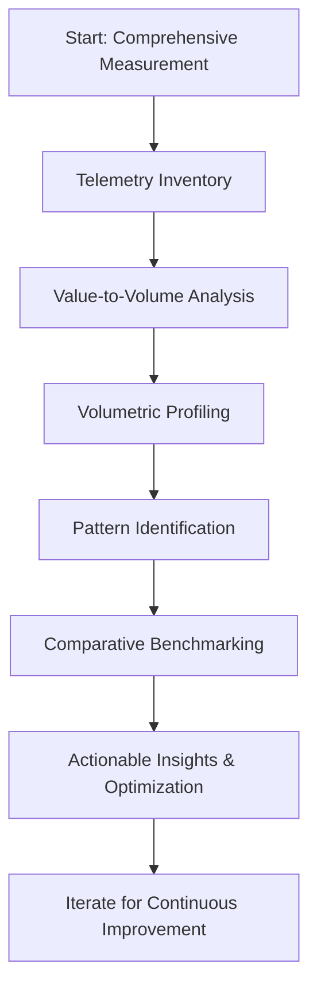
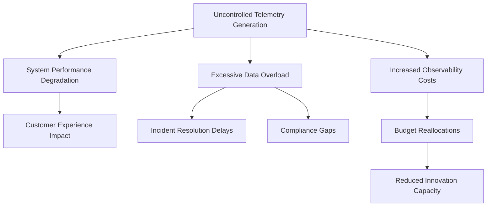
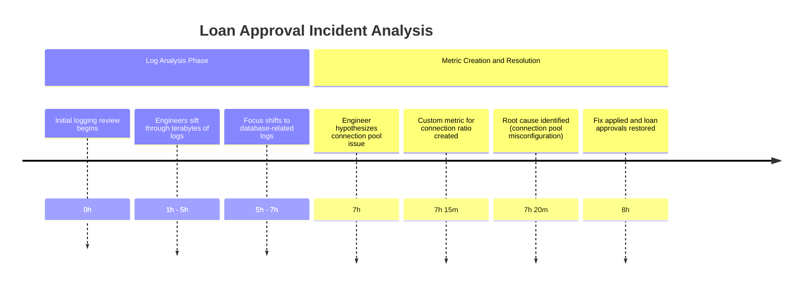
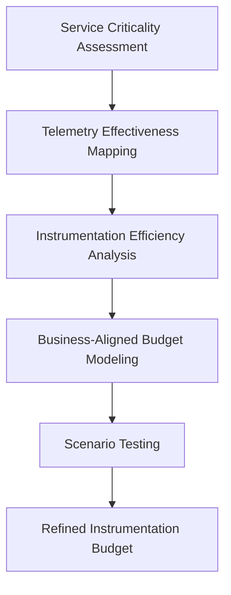
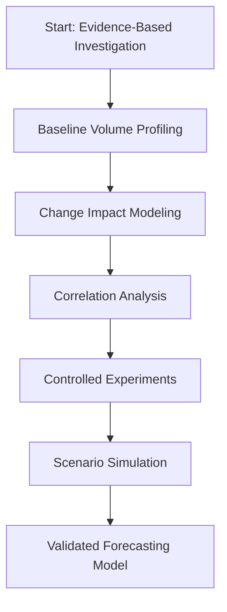
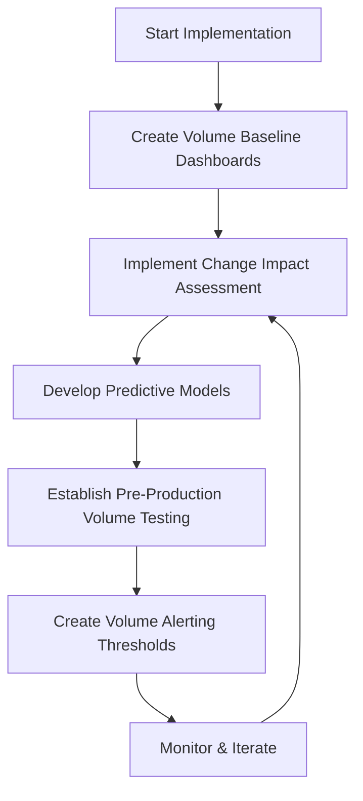
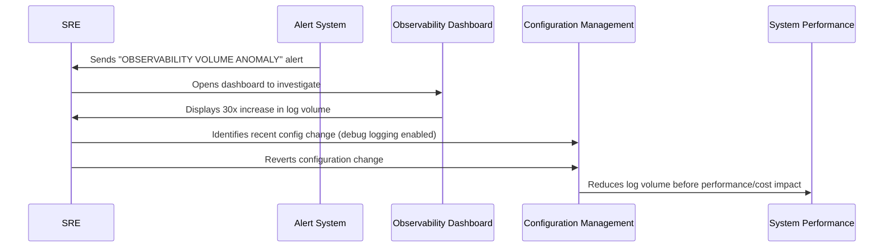
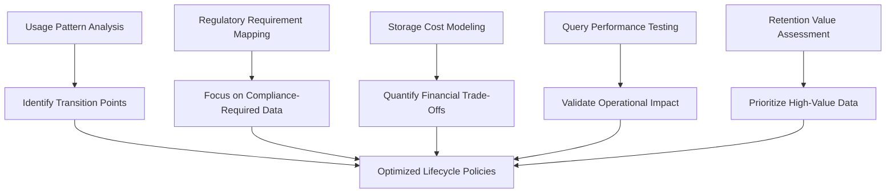
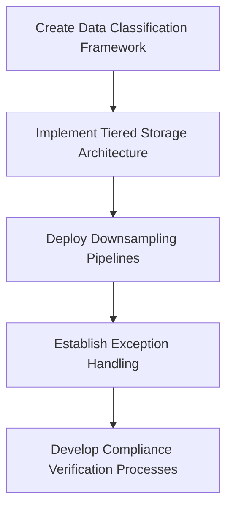

# Chapter 4: Volumetric Awareness


## Chapter Overview

Welcome to the world of Volumetric Awareness, where every log line is a lottery ticket—except the jackpot is a seven-figure observability bill. Modern banking SREs get to play Whac-A-Mole with their data producers while finance teams hover with torches and pitchforks. Telemetering everything "just in case" is the new way to set money on fire, while debugging in production is a speedrun to budget purgatory. This chapter pulls no punches: if you treat your observability platform like an infinite landfill, don’t be surprised when the stench attracts auditors, CFOs, and the occasional compliance inquisition. Read on if you’d rather avoid being the punchline at the next quarterly cost review.

## Learning Objectives

- **Quantify** telemetry generation rates across your entire system, not just the obvious suspects.
- **Correlate** business activity with observability data volumes to predict financial impact before it torpedoes your runway.
- **Identify** hidden high-volume telemetry sources lurking in your architecture’s shadows.
- **Evaluate** the return on investment for every telemetry signal—so you stop paying premium rates for garbage data.
- **Establish** and enforce instrumentation budgets that align with actual business value, not gut feelings.
- **Forecast** the effects of new features and releases on data volumes using real models, not wishful thinking.
- **Implement** proactive volume-based alerting to catch runaway data before it eats your lunch (and your capex).
- **Manage** the full lifecycle of observability data to balance compliance, performance, and cold, hard cost.

## Key Takeaways

- If you can’t measure your telemetry volumes, your observability bill is a ticking time bomb—hope your CFO likes surprises.
- Debug-level logging in production is the digital equivalent of stuffing dollar bills into a shredder.
- Your worst data offenders are probably not your shiny transaction systems—more likely it’s that “harmless” microservice you forgot about.
- More data ≠ more insight. Drowning in logs is not the same as knowing what’s broken.
- Instrumentation budgets aren’t bureaucracy—they’re your only defense against “death by a thousand log lines.”
- Feature launches without volume forecasting are how SREs end up running post-mortems with finance, not engineering.
- If you’re not alerting on telemetry volumes, you’re letting money walk out the door every time someone toggles a debug flag.
- Treating all observability data as equally valuable is a rookie mistake—store what matters, dump the rest, and keep the auditors happy.
- Compliance isn’t an excuse for hoarding petabytes of data in gold-plated storage. Tier, compress, and downsample like your job depends on it—because it might.
- The only thing scarier than unexpected outages is an unexpected invoice. Volumetric awareness is your insurance policy. Use it.

---

Now go forth and instrument responsibly—your budget, systems, and sense of self-respect are depending on it.

## Panel 1: The Data Deluge Dilemma
### Scene Description

The scene unfolds within a bustling banking operations center, visually dominated by a series of large wall monitors arranged in a grid. Each monitor displays rapidly incrementing counters, vividly representing data volumes streaming in from various systems. At the center of the room, a team of engineers stands frozen in shock, their attention fixed on one screen showing a jaw-dropping observability platform bill. Another monitor highlights a graph with two starkly correlated curves: one illustrating an exponential surge in data ingestion, the other predicting an equally steep rise in costs.

To the right, a junior engineer hunches over their workstation, frantically enabling verbose logging on a critical service. Above their desk, a smaller monitor flashes configuration changes in progress. The junior engineer’s actions, oblivious to the financial implications, are emblematic of the disconnect between technical decisions and cost awareness.

Below is a simplified textual layout of the scene for clarity:

```
+-----------------------------------------------+
| Monitor 1: Data Volumes (Rapidly Incrementing)|
+-----------------------------------------------+
| Monitor 2: Cost Projection (Exponential Curve)|
+-----------------------------------------------+
| Monitor 3: Observability Bill (Shocking Total)|
+-----------------------------------------------+

[Team of Engineers Standing in Shock]

+-----------------------------------------------+
| Monitor 4: Configuration Changes in Progress  |
+-----------------------------------------------+

[Junior Engineer Enabling Verbose Logging]
```

This visual composition emphasizes the chaotic interplay between telemetry generation, cost implications, and human decision-making, setting the stage for a deeper exploration of volumetric awareness.
### Teaching Narrative
Volumetric awareness is the foundation of cost-effective observability. In traditional monitoring environments, data volume rarely translated directly to cost—most tools used flat licensing models regardless of how much data you collected. This fundamental difference is why many teams transitioning to modern observability platforms experience "bill shock."

Every log line, metric data point, and trace span has a measurable cost in modern observability platforms. Without volumetric awareness, teams unknowingly create financial liabilities with each new instrumentation decision. The banking industry is particularly vulnerable to this problem due to the massive transaction volumes processed daily.

Understanding your data generation rate is the first step toward cost control. Teams must develop the ability to quantify and predict how much telemetry their systems produce, and more importantly, how instrumentation changes affect these volumes. This means developing a baseline understanding of:
- Normal data generation rates across different service types
- The relationship between transaction volume and telemetry generation
- How code changes and configuration adjustments impact data volume
- Which systems are your highest-volume telemetry producers

Without this volumetric understanding, observability costs become unpredictable and often unsustainable. Developing this awareness doesn't mean collecting less data—it means collecting the right data with full understanding of the economic implications.
### Common Example of the Problem

A major retail bank recently migrated their monitoring system from a legacy on-premise solution to a modern cloud-based observability platform. During the first month, engineers configured logging levels based on their historical practices, setting most services to DEBUG level "just to be safe" during the transition. When the first month's bill arrived, it was 8 times the expected amount, triggering an emergency review by the CFO. Analysis revealed that their credit card transaction processing service alone was generating over 2TB of logs daily—primarily from DEBUG-level statements recording routine successful transactions that provided minimal troubleshooting value.

To illustrate the issue more concretely, the following table summarizes the telemetry volume, cost, and impact across key services:

| Service                       | Logging Level | Telemetry Volume (Daily) | Monthly Cost Impact | Observability Value                       |
| ----------------------------- | ------------- | ------------------------ | ------------------- | ----------------------------------------- |
| Credit Card Processing        | DEBUG         | 2TB                      | High (unexpected)   | Minimal (routine successful transactions) |
| Fraud Detection Engine        | INFO          | 200GB                    | Medium              | High (critical anomaly alerts)            |
| Customer Notification Service | DEBUG         | 1.5TB                    | High (unexpected)   | Low (verbose message delivery logs)       |
| Data Aggregation Pipeline     | WARN          | 50GB                     | Low                 | Medium (error aggregation insights)       |

This example underscores the importance of volumetric awareness. Misconfigured logging levels, especially DEBUG on high-throughput systems, can result in disproportionately high costs while delivering minimal operational value. Teams must carefully evaluate the trade-offs between logging verbosity, data volume, and the corresponding impact on their observability budget.
### SRE Best Practice: Evidence-Based Investigation

The SRE approach to addressing volumetric awareness begins with comprehensive measurement and data-driven analysis rather than intuition or reaction. A systematic investigation includes the following steps:

#### Checklist for Evidence-Based Investigation
1. **Telemetry Inventory**
   - Conduct a full audit of all observability signals across your architecture.
   - Categorize by type (logs, metrics, traces), source service, and volume.
   - Establish a baseline understanding of your current telemetry state.

2. **Value-to-Volume Analysis**
   - Evaluate the signal-to-noise ratio for each telemetry source.
   - Determine how often the data contributes to incident detection or resolution.
   - Prioritize high-value signals while identifying low-value, high-cost sources.

3. **Volumetric Profiling**
   - Continuously measure telemetry generation rates.
   - Correlate these rates with business transaction volumes.
   - Identify areas where instrumentation can be optimized for efficiency.

4. **Pattern Identification**
   - Analyze telemetry generation patterns for cyclical trends (daily, weekly, monthly).
   - Correlate these patterns to business events to improve forecasting.
   - Use this insight to implement targeted optimizations.

5. **Comparative Benchmarking**
   - Establish normalized metrics such as "observability cost per transaction."
   - Compare these metrics across similar services to identify outliers.
   - Leverage high-performing services as models for improvement.

#### Summary Flowchart of Key Steps


This evidence-based approach transforms vague concerns about observability costs into concrete, actionable insights. By following these steps, teams can target improvements where they'll have the greatest impact, ensuring sustainable and cost-effective observability practices.
### Banking Impact

The financial and operational implications of poor volumetric awareness in banking institutions cannot be overstated. Below is a concise breakdown of key impacts:

#### Financial and Operational Impacts:

- **Operational Expense Surge**:
  - Observability costs can escalate from hundreds of thousands to millions annually.
  - Directly affects operational expense ratios, which are under constant scrutiny in the financial sector.

- **System Performance Issues**:
  - Excessive telemetry generation adds computational overhead.
  - Reduces transaction processing capacity, especially during high-demand periods (e.g., month-end processing, holiday shopping seasons).

- **Incident Resolution Inefficiency**:
  - Excessive data increases the time required to identify actionable insights.
  - Lengthens outages for critical systems (e.g., payment processing, trading platforms).

- **Compliance Risks**:
  - Critical compliance-related logs get buried in excessive routine telemetry.
  - Increases the likelihood of missing mandatory deadlines for reporting security events or regulatory violations.

- **Budgetary Strain**:
  - Unpredictable observability costs force emergency reallocations of funds.
  - Diverts resources from innovation projects that could enhance customer value and competitiveness.

#### Summary of Impact Flow:


#### Key Takeaway:
To mitigate these impacts, banking institutions must prioritize volumetric awareness, ensuring telemetry generation aligns with operational needs and financial constraints. This approach enables cost predictability, system performance stability, and compliance assurance while preserving innovation budgets.
### Implementation Guidance

To establish effective volumetric awareness in your banking environment:

1. **Implement Telemetry Tagging**: Add standardized metadata tags to all observability signals to identify their source system, service, and purpose. This enables accurate attribution and targeted optimization of high-volume sources. For example, ensure all logs include tags such as `service_name`, `environment`, and `transaction_id`:
    ```python
    import logging

    # Example Python logging configuration with telemetry tagging
    logger = logging.getLogger("banking_service")
    handler = logging.StreamHandler()
    formatter = logging.Formatter(
        '{"timestamp": "%(asctime)s", "level": "%(levelname)s", '
        '"service_name": "accounts_service", "environment": "production", '
        '"transaction_id": "%(transaction_id)s", "message": "%(message)s"}'
    )
    handler.setFormatter(formatter)
    logger.addHandler(handler)
    logger.setLevel(logging.INFO)

    # Usage example
    logger.info("Transaction processed successfully", extra={"transaction_id": "12345ABC"})
    ```

2. **Establish Volumetric Baselines**: Create baseline measurements of telemetry volume for each service under normal operating conditions. These baselines act as reference points for detecting unexpected volume changes. Use metrics like log lines per second (LPS), spans per transaction, and metrics payload size to monitor the volume.

3. **Deploy Volume Monitoring**: Implement automated monitoring of telemetry generation rates, with alerting for unusual increases. For instance, set dynamic thresholds using baselines and trigger alerts when a service exceeds a percentage increase over its normal LPS:
    ```yaml
    # Example Prometheus alert rule for telemetry volume monitoring
    groups:
      - name: telemetry-alerts
        rules:
          - alert: HighTelemetryVolume
            expr: rate(service_logs_total[5m]) > (baseline_logs_rate * 1.5)
            for: 2m
            labels:
              severity: warning
            annotations:
              summary: "High telemetry volume detected for {{ $labels.service_name }}"
              description: "The telemetry volume for {{ $labels.service_name }} exceeded the normal baseline rate by 50%."
    ```

4. **Create Service-Specific Logging Policies**: Develop differentiated logging policies based on service criticality and transaction value. For example, define a YAML-based logging policy that enforces sampling rates for high-volume services:
    ```yaml
    logging_policy:
      - service_name: "transaction_processor"
        sampling_rate: "1:100"  # Log 1 out of every 100 events
        retention_period: "7 days"
      - service_name: "risk_engine"
        sampling_rate: "1:10"
        retention_period: "30 days"
      - service_name: "audit_service"
        sampling_rate: "1:1"  # Log all events
        retention_period: "90 days"
    ```

5. **Integrate Volumetric Review in CI/CD**: Add automated checks in your deployment pipeline to analyze the volumetric impact of code changes. Use static analysis tools or custom scripts to estimate telemetry generation. For instance, a CI/CD pipeline step could parse changes in logging statements and flag increases:
    ```bash
    # Example CI/CD volumetric check script
    NEW_LOG_LINES=$(git diff --name-only HEAD~1 | xargs grep -E "logger\.(info|debug|warn|error)" | wc -l)
    if [ "$NEW_LOG_LINES" -gt 10 ]; then
      echo "Warning: This commit adds $NEW_LOG_LINES new log statements, which may impact telemetry volume."
      exit 1  # Fail the pipeline for review
    fi
    ```

By implementing these measures, teams can proactively manage telemetry volumes, avoiding unexpected cost spikes while maintaining effective observability.
## Panel 2: Discovering the Hidden Data Generators
### Scene Description

The scene shows an SRE team gathered around a visualization that maps their banking system architecture. Each component is sized proportionally to its observability data production. The visualization, resembling a node-link diagram, highlights an oversized authentication microservice as the largest node, dwarfing even the node representing their core transaction processing platform.

Below is a textual representation of the architecture diagram:

```
          [User Interface]
                  |
    ---------------------------------
    |                               |
[Transaction Core]         [Authentication Service]
         |                      (Largest Node)
         |                               |
[Database]                      [Session Manager]
```

An engineer is pointing to a small code block on a laptop screen that displays a debug statement inside a high-frequency authentication loop. This detail contextualizes the unexpected data generation, drawing attention to overlooked instrumentation issues in supporting services.
### Teaching Narrative
The highest volume data generators in your system are rarely the ones you expect. In banking environments, teams often focus their cost-management efforts on obvious high-transaction components like payment processors or trading platforms. However, these well-known high-volume systems usually have mature instrumentation practices.

The true "data explosions" typically come from overlooked supporting services that were never designed with observability volumes in mind. Authentication services, session managers, and validation components often process orders of magnitude more requests than core transaction systems.

Discovering these hidden data generators requires systematic measurement rather than intuition. SREs must implement volumetric profiling across all system components to identify where telemetry is actually being generated. This profiling should:
- Measure data volume by service, not just by system
- Track volumes across different telemetry types (logs, metrics, traces)
- Identify high-cardinality metrics that multiply data points
- Monitor for unexpected volume changes that indicate instrumentation problems

Volumetric awareness also means understanding the natural patterns in your data generation. Banking systems typically have predictable patterns tied to business hours, end-of-day processing, month-end closings, and seasonal activities. Establishing these baseline patterns allows teams to quickly identify anomalous data production that might indicate both system issues and unexpected cost increases.
### Common Example of the Problem

A global investment bank was struggling with rapidly escalating observability costs despite stable transaction volumes. Initial investigation focused on their high-profile trading platform, which processed millions of transactions daily. However, volumetric analysis revealed that 68% of their total observability data was actually coming from a seemingly minor session management service. Further investigation showed that this service was logging every user interaction with the trading platform, mobile app, and web portal—approximately 300 events per minute per active user. With 50,000 active users during trading hours, this single service was generating over 20 million log entries per day, most of which were never used for troubleshooting.

The following table summarizes the telemetry breakdown for key services:

| Service Name               | Percentage of Total Data | Key Issues Identified                                  |
| -------------------------- | ------------------------ | ------------------------------------------------------ |
| Trading Platform           | 15%                      | High-cardinality metrics for individual trade IDs      |
| Mobile/Web Session Manager | 68%                      | Excessive logging of interactions, low-value telemetry |
| Payment Gateway            | 10%                      | Duplicate metrics for API retries                      |
| Authentication Service     | 5%                       | Debug logging left enabled in production               |
| Miscellaneous Services     | 2%                       | Minor contributions from various utilities             |

This illustrates how a single overlooked component—like the session management service—can far outweigh more obvious high-transaction systems in data generation. Without systematic volumetric profiling, such issues can lead to massive cost inefficiencies and operational blind spots.
### SRE Best Practice: Evidence-Based Investigation

Identifying hidden data generators requires a methodical, data-driven approach that looks beyond superficial assumptions about which services generate the most telemetry. Below is a checklist summarizing the core steps for evidence-based investigation:

#### Checklist: Steps for Evidence-Based Investigation
- [ ] **Comprehensive Telemetry Mapping**  
  Collect metadata about telemetry itself—count log lines, metric cardinality, and trace spans by service, instance, and event type. This provides visibility into the true sources of observability volume.

- [ ] **Dimensional Analysis**  
  Break down telemetry volume by service, operation type, log level, and user segment. Identify specific interaction points generating disproportionate volume.

- [ ] **Time-Series Pattern Analysis**  
  Examine telemetry generation patterns over multiple time scales (hourly, daily, weekly, monthly). Correlate these patterns with business events or system processes.

- [ ] **Instrumentation Code Review**  
  Conduct targeted code reviews for high-volume services. Focus on instrumentation patterns, checking for anti-patterns like logging in tight loops, excessive dimensionality, or debug statements in high-frequency operations.

- [ ] **Controlled Experiments**  
  Perform temporary, targeted adjustments to instrumentation in suspected high-volume services. Measure the impact on overall telemetry volume to empirically validate findings.

#### Best Practice Highlights
- Let data, not assumptions, guide the investigation.
- Focus on overlooked services and subtle patterns rather than obvious high-transaction components.
- Use systematic profiling and iterative testing to uncover optimization opportunities.

This structured approach ensures that SREs can methodically identify and address hidden data generators, enabling more efficient observability practices while managing telemetry costs effectively.
### Banking Impact

Unidentified high-volume data generators create several significant impacts for banking organizations:

1. **Unpredictable Cost Escalation**: Hidden data generators often operate outside normal governance processes, creating unexpected cost increases that can arrive without warning in monthly bills.

2. **Disproportionate Resource Allocation**: Without accurate visibility into true data generation sources, banks often misallocate optimization efforts to visible but less impactful services while ignoring the actual cost drivers.

3. **Degraded Performance During Peak Periods**: Excessive telemetry from hidden generators often creates performance bottlenecks during critical banking periods like market open/close or end-of-quarter processing.

4. **Storage Infrastructure Strain**: The volume from hidden generators frequently overwhelms on-premise storage infrastructure designed for expected telemetry rates, necessitating emergency expansions or retention policy changes.

5. **Query Performance Degradation**: Excessive telemetry from unexpected sources degrades query performance across observability platforms, increasing dashboard load times and slowing incident investigations when rapid response is most critical.

To illustrate how these impacts cascade, the following text-based flowchart outlines the typical progression of issues caused by hidden data generators:

```text
[Hidden Data Generators]
         ↓
[Unpredictable Cost Escalation]
         ↓
[Misallocation of Optimization Efforts]
         ↓
[Resource Overload]
         ↓
[Degraded System Performance]
         ↓
[Critical Banking Operations Impacted]
```

This chain reaction highlights why early identification and mitigation of hidden data generators are crucial. By proactively profiling telemetry volumes and addressing unexpected spikes, banking organizations can prevent these cascading effects from disrupting business-critical operations and escalating costs.
### Implementation Guidance

To effectively identify and address hidden data generators in your banking environment:

1. **Deploy Universal Telemetry Tagging**: Implement standardized tagging across all services that clearly identifies the source application, service, environment, and instrumentation type for every piece of telemetry data. Here's an example of a standard telemetry tagging implementation in Python using OpenTelemetry:

    ```python
    from opentelemetry import trace
    from opentelemetry.sdk.trace import TracerProvider
    from opentelemetry.sdk.trace.export import BatchSpanProcessor, ConsoleSpanExporter

    # Set up tracer provider
    provider = TracerProvider()
    trace.set_tracer_provider(provider)

    # Add a console exporter to review telemetry outputs
    processor = BatchSpanProcessor(ConsoleSpanExporter())
    provider.add_span_processor(processor)

    # Standardized attributes for telemetry tagging
    common_attributes = {
        "service.name": "authentication-service",
        "environment": "production",
        "instrumentation.type": "logging",
        "team": "SRE",
    }

    tracer = trace.get_tracer("authentication")
    with tracer.start_as_current_span("high_frequency_loop") as span:
        span.set_attributes(common_attributes)
        for i in range(1000):  # Simulate high-frequency operations
            span.add_event("loop_iteration", {"iteration": i})
    ```

2. **Create a Telemetry Inventory Dashboard**: Build a comprehensive visualization that displays telemetry volume by service, type, and time period. Ensure it includes breakdowns by logs, metrics, and traces, and highlights high-cardinality sources. This dashboard should be prominently available to all engineering teams to increase organizational awareness.

3. **Implement Anomaly Detection**: Deploy automated monitoring that detects unusual changes in telemetry volume from any service. For example, configure a Prometheus alert for logs exceeding a baseline threshold:

    ```yaml
    groups:
      - name: telemetry-anomalies
        rules:
          - alert: HighTelemetryVolume
            expr: rate(service_logs_total{service="authentication-service"}[5m]) > 1000
            for: 5m
            labels:
              severity: warning
            annotations:
              summary: "High telemetry volume detected for authentication-service"
              description: "The authentication-service is generating logs at a rate of over 1000 entries per second. Investigate high-frequency code paths."
    ```

4. **Establish a Top-N Review Process**: Implement a regular review of the top 10 telemetry generators in your environment. Require teams to document and justify the volume relative to their business importance and troubleshooting value. Use these reviews as opportunities to identify and remediate unnecessary or overly verbose instrumentation.

5. **Create Instrumentation Guidelines**: Develop specific instrumentation patterns and anti-patterns documentation with examples from your environment. Include actionable guidance on handling high-frequency code paths to avoid volume explosions, such as rate-limiting debug statements or batching telemetry events.

By incorporating these practices into your observability strategy, your team will be better equipped to discover and address hidden data generators, reducing unexpected costs and improving system reliability.
## Panel 3: Telemetry ROI Analysis
### Scene Description

A split-screen view illustrates two contrasting banking incidents:

- **Left Screen**: Engineers are overwhelmed by terabytes of verbose debug logs while attempting to pinpoint the cause of a failed trade reconciliation. The visualization highlights the chaos with a cluttered log representation, accompanied by a rapidly incrementing cost counter in the corner, symbolizing escalating expenses.

- **Right Screen**: An SRE swiftly identifies a recurring payment failure pattern using a concise set of well-designed metrics and traces. The depiction emphasizes clarity and efficiency, with minimal data volume delivering maximum actionable insights.

Between the two screens, a formula is prominently displayed to link the comparison:
```
Value = Insight / (Data Volume × Cost)
```

Below the split-screen, a summary table outlines the differences:

| Aspect                 | Left Screen (Verbose Logs) | Right Screen (Optimized Metrics) |
| ---------------------- | -------------------------- | -------------------------------- |
| Data Volume            | Extremely High             | Minimal                          |
| Cost Impact            | Rapidly Increasing         | Controlled                       |
| Insight Value          | Low                        | High                             |
| Time to Diagnose Issue | Extended                   | Immediate                        |

This visual comparison drives home the importance of prioritizing high-value telemetry, showcasing how strategic data design can transform incident resolution and operational efficiency.
### Teaching Narrative
Not all observability data provides equal value, yet many teams instrument their systems as if it does. The core principle of volumetric awareness is understanding the return on investment (ROI) for different types of telemetry.

High-value observability data provides actionable insights that directly enable problem identification or business decisions. Low-value data consumes storage and processing resources without contributing proportional insights. SREs must develop frameworks for evaluating this telemetry ROI before instrumentation decisions are made, not after bills arrive.

This evaluation should consider:
- Problem detection value: How effectively does this data identify issues?
- Diagnostic value: How crucial is this data for root cause analysis?
- Uniqueness: Does this data provide insights not available from other sources?
- Frequency needs: Does this data need constant collection, or only during specific conditions?
- Cardinality impact: How many dimensions multiply this data's volume?

Banking systems, with their high transaction volumes and strict reliability requirements, particularly benefit from this ROI approach. For example, detailed traces of every authentication attempt might generate enormous data volumes with minimal insight value, while strategic tracing of payment authorization flows could provide critical visibility with manageable data volumes.

Developing volumetric awareness means shifting from "more data is better" to "the right data is better." This requires technical understanding of observability systems, business knowledge of what insights matter most, and economic awareness of the cost implications of instrumentation decisions.
### Common Example of the Problem

A commercial banking division instrumented their loan processing pipeline with comprehensive logging at every step of the application workflow. The system generated over 5GB of logs daily, with each loan application producing approximately 12,000 log lines from application submission through approval. During a critical incident where loan approvals were failing intermittently, the team spent over 7 hours reviewing logs without identifying the root cause. Eventually, an engineer created a single custom metric that measured the ratio of database connection attempts to successful connections, immediately revealing a connection pool configuration issue. The solution came from a targeted 2KB metric rather than terabytes of logs that lacked the specific signal needed, despite their comprehensive nature and significant cost.

Below is a timeline illustrating the sequence of events during the incident:



This timeline highlights the inefficiency of relying solely on verbose logs for problem resolution. A well-designed custom metric, created earlier, could have provided actionable insights in minutes instead of hours. This underscores the importance of evaluating telemetry ROI to focus on high-value data that accelerates detection and diagnosis.
### SRE Best Practice: Evidence-Based Investigation

Evaluating telemetry ROI requires a rigorous analytical approach that quantifies both the costs and benefits of different observability signals. Use the checklist below to structure your evaluation and decision-making process:

| **Step**                             | **Description**                                                                                          | **Key Output**                                                                |
| ------------------------------------ | -------------------------------------------------------------------------------------------------------- | ----------------------------------------------------------------------------- |
| **1. Value Stream Mapping**          | Trace critical user journeys and system workflows to identify decision points and failure modes.         | A framework showing where signals provide actionable insights.                |
| **2. Signal Effectiveness Analysis** | Analyze historical incidents to determine which telemetry contributed to detection and resolution.       | A list of high-impact signals driving successful troubleshooting outcomes.    |
| **3. Controlled Reduction Testing**  | Reduce telemetry volume in targeted areas and measure impacts on detection and diagnosis capabilities.   | Empirical data on the relationship between data volume and operational value. |
| **4. Cost-per-Insight Calculation**  | Calculate the collection, storage, and query costs of different telemetry types relative to their value. | Metrics showing efficiency differences across instrumentation approaches.     |
| **5. Comparative Scenario Testing**  | Simulate incident resolution using different instrumentation to measure success and resolution time.     | Evidence of which strategies deliver the highest value per effort.            |

#### Checklist for Evidence-Based Investigation
- [ ] Identify critical user journeys and system workflows.
- [ ] Map key decision points and potential failure modes.
- [ ] Review historical incidents to pinpoint high-value signals.
- [ ] Test telemetry reductions and measure operational impact.
- [ ] Calculate cost-per-insight for different telemetry types.
- [ ] Conduct scenario tests for comparative strategy evaluation.
- [ ] Use findings to refine telemetry instrumentation decisions.

By following these steps, SREs can shift from subjective opinions about telemetry value to data-driven decisions that optimize for both visibility and cost efficiency.
### Banking Impact

Poorly optimized telemetry ROI creates several significant impacts for banking organizations. Below are specific examples and scenarios illustrating these impacts:

1. **Delayed Incident Resolution**:  
   Example: During a payment processing outage, engineers spent over six hours parsing through verbose debug logs to identify a misconfigured API gateway. High-priority customer transactions failed in the meantime, resulting in reputational damage and regulatory scrutiny. By contrast, having pre-designed metrics for API response failures could have pinpointed the issue in minutes.

2. **Compliance Verification Challenges**:  
   Example: A bank undergoing a routine audit faced delays in proving compliance with transaction monitoring requirements because critical fraud detection telemetry was buried within terabytes of unrelated system performance logs. This delay resulted in additional audit costs and strained regulator relationships. A focused ROI approach could have ensured that compliance signals were easily accessible and auditable.

3. **Diminished Investment Capacity**:  
   Example: A banking team allocated 40% of their observability budget to high-cardinality logs capturing every database query, the majority of which were irrelevant for performance insights. This overspending meant they lacked the budget to implement critical synthetic monitoring for their mobile app, leading to undetected issues during a high-traffic promotional event.

4. **Operational Cost Inefficiency**:  
   Example: A bank’s storage costs ballooned after retaining telemetry for every backend microservice interaction without assessing its diagnostic value. This inefficiency increased the bank's cost-income ratio by 0.5%, affecting quarterly financial performance. Streamlining telemetry based on ROI could have reduced this overhead while maintaining operational insight.

5. **Customer Experience Degradation**:  
   Example: Excessive low-value telemetry strained database performance during a peak trading period, leading to a 2-second delay in transaction confirmations. This latency caused frustration among high-net-worth clients and a spike in complaint calls. Strategic instrumentation of high-value telemetry could have preserved performance, even during traffic surges.
### Implementation Guidance

To implement effective telemetry ROI analysis in your banking environment:

1. **Create a Telemetry Value Framework**: Develop a structured evaluation framework that scores different types of telemetry based on detection value, troubleshooting utility, business insights, and unique information content. For example:

   ```python
   def score_telemetry(signal):
       detection_value = signal['detection_value']
       troubleshooting_utility = signal['troubleshooting_utility']
       business_insights = signal['business_insights']
       uniqueness = signal['uniqueness']
       return detection_value + troubleshooting_utility + business_insights + uniqueness

   telemetry_signals = [
       {'name': 'trace_auth_flows', 'detection_value': 8, 'troubleshooting_utility': 7, 'business_insights': 9, 'uniqueness': 8},
       {'name': 'auth_debug_logs', 'detection_value': 3, 'troubleshooting_utility': 5, 'business_insights': 2, 'uniqueness': 4},
   ]

   scored_signals = sorted(telemetry_signals, key=score_telemetry, reverse=True)
   print("Ranked Telemetry Signals:", scored_signals)
   ```

2. **Implement Signal Utilization Tracking**: Deploy tooling that tracks how frequently different metrics, logs, and traces are actually used. Use the results to prioritize high-value signals. For example, you can use a tagging system and counters to collect utilization stats:

   ```python
   from collections import Counter

   signal_usage = Counter()

   # Example usage tracking
   signal_usage.update(['metric:payment_latency', 'trace:auth_flow'])
   signal_usage.update(['trace:auth_flow', 'metric:payment_latency', 'log:transaction_debug'])

   # Analyze usage
   print("Signal Usage Frequency:", signal_usage)
   ```

3. **Develop Service-Specific Telemetry Plans**: Create tailored observability plans for different service types by mapping key signals to service goals. For example:

   ```
   Service: Payment Processing
   Key Signals:
   - Metric: payment_latency
   - Trace: payment_authorization_flows
   - Log: payment_error_summary

   Service: Authentication
   Key Signals:
   - Metric: auth_success_rate
   - Trace: auth_flow
   - Log: auth_error_details
   ```

4. **Establish Regular Signal Reviews**: Implement quarterly reviews of your telemetry portfolio to ensure cost-effective observability. Use a process like the following to evaluate signals:

   ```mermaid
   flowchart TD
       Start[Start Review] --> Identify[Identify Signals]
       Identify --> Collect[Collect Utilization Data]
       Collect --> Evaluate[Evaluate Value vs Cost]
       Evaluate --> Action{Retain, Optimize, or Remove?}
       Action --> Retain[Retain High-Value]
       Action --> Optimize[Optimize Medium-Value]
       Action --> Remove[Remove Low-Value]
   ```

5. **Integrate ROI Analysis in Instrumentation Design**: Require all new services and significant features to include telemetry ROI analysis during design review. Use a workflow like the following:

   ```mermaid
   flowchart LR
       Design[Service/Feature Design] --> DefineTelemetry[Define Critical Telemetry]
       DefineTelemetry --> EvaluateROI[Evaluate Telemetry ROI]
       EvaluateROI --> Approve[Approve Design with ROI Justified]
       Approve --> Implement[Implement Service/Feature]
   ```

By combining these steps with practical tools and workflows, teams can maximize the value of their telemetry investments while controlling costs.
## Panel 4: The Instrumentation Budget
### Scene Description

An SRE team is gathered in a planning session, seated around a conference table, with a large dashboard prominently displayed on the wall. The dashboard features a grid-like layout, where each row represents a banking service (e.g., "Mortgage Applications," "Credit Card Transactions," "Account Management") and columns show key metrics like "Current Quota," "Utilization," and "Proposed Allocation." A bar chart in each row visually indicates the distribution of observability "points" across services.

The team is actively debating how to allocate their limited observability budget. One engineer gestures toward the dashboard, pointing out how increasing the quota for a seemingly minor service—labeled "Mortgage Auxiliary API"—could significantly improve visibility into customer experience during mortgage applications. Another team member expresses concern about exceeding the limits in critical areas, such as "Credit Card Transactions," where maintaining full visibility is essential for fraud detection.

Below is a simplified representation of the dashboard being discussed:

```
+-------------------------+------------+---------------+--------------------+
| Service                | Current Quota | Utilization   | Proposed Allocation |
+-------------------------+------------+---------------+--------------------+
| Mortgage Applications  |  40 points  |     38%       |        45 points   |
| Credit Card Transactions|  50 points  |     48%       |        50 points   |
| Account Management     |  30 points  |     25%       |        25 points   |
| Mortgage Auxiliary API |  10 points  |     90%       |        20 points   |
+-------------------------+------------+---------------+--------------------+
```

The discussion becomes increasingly heated as the team weighs the trade-offs of reallocating points. Each proposed adjustment is tied to business value and troubleshooting impact, with team members making cases for their priorities. The scene highlights the tension between operational constraints and the need for strategic decision-making in observability.
### Teaching Narrative
Resource constraints drive innovation. When teams operate with unlimited observability budgets, they rarely develop efficient instrumentation strategies. The instrumentation budget is a powerful concept that forces teams to make deliberate, strategic decisions about where and how to apply observability.

Unlike traditional budgeting focused solely on cost, an instrumentation budget optimizes for maximum visibility within sustainable data volumes. This approach recognizes that observability is a finite resource that should be allocated based on business priority and troubleshooting value.

Implementing an instrumentation budget requires:
- Establishing volume baselines for existing systems
- Setting appropriate limits based on business value and criticality
- Creating allocation mechanisms for distributing the budget across services
- Implementing technical guardrails that prevent accidental budget overruns
- Developing exception processes for temporary budget increases during incidents

This budgeting approach naturally shifts teams from indiscriminate instrumentation to strategic observability. For banking systems, this often means allocating larger budgets to customer-facing services and critical transaction paths, while implementing more efficient instrumentation in supporting infrastructure.

The instrumentation budget concept doesn't reduce overall system visibility. Instead, it creates incentives for teams to implement more efficient observability practices, such as dynamic sampling, targeted logging, and cardinality management—ultimately delivering better insights with lower data volumes.
### Common Example of the Problem

A multinational bank's digital platform team was instructed to reduce observability costs by 30% following a dramatic bill increase. Without strategic guidance, the team implemented across-the-board reductions in retention periods and sampling rates. During a subsequent incident with their mobile banking authentication system, the team discovered they had insufficient telemetry to diagnose the root cause, resulting in extended downtime for 2.3 million customers. Meanwhile, their internal reporting systems continued to generate comprehensive telemetry despite having minimal business impact when experiencing issues. The unstructured approach to reduction had preserved visibility where it delivered little value while eliminating it where it was most critical.

| **Category**             | **Before (Unstructured Reduction)**                        | **After (Strategic Instrumentation Budgeting)**                                     |
| ------------------------ | ---------------------------------------------------------- | ----------------------------------------------------------------------------------- |
| **Retention Periods**    | Reduced uniformly across all services                      | Adjusted based on criticality (e.g., longer retention for customer-facing services) |
| **Sampling Rates**       | Lowered arbitrarily across all logs                        | Tuned dynamically for high-value services; optimized for lower-volume systems       |
| **Telemetry Allocation** | Internal reporting systems retained full visibility        | Focused on customer-facing systems and transaction paths                            |
| **Incident Response**    | Insufficient data to diagnose mobile authentication issues | Sufficient telemetry to pinpoint root causes quickly                                |
| **Business Impact**      | 2.3M customers affected; extended downtime                 | Minimized customer impact; faster time to resolution                                |
| **Cost Management**      | Short-term cost reduction, long-term inefficiencies        | Sustainable cost management aligned with business priorities                        |

This comparison highlights how unstructured observability cuts can lead to catastrophic business impacts, while a strategic instrumentation budget ensures critical services maintain the visibility needed to deliver seamless customer experiences.
### SRE Best Practice: Evidence-Based Investigation

Developing an effective instrumentation budget requires a systematic approach that aligns observability investment with business value and operational risk. Use the following step-by-step checklist to guide your process:

---

#### **Checklist: Evidence-Based Instrumentation Budgeting**

1. **Service Criticality Assessment**
   - Evaluate each service based on:
     - Customer impact
     - Revenue implications
     - Regulatory requirements
     - Upstream/downstream dependencies
   - Prioritize services for budget allocation based on these factors.

2. **Telemetry Effectiveness Mapping**
   - Review incident resolution data to determine:
     - The types of telemetry (logs, metrics, traces) most valuable for resolution.
     - Historical effectiveness of telemetry volume per service type.
   - Avoid relying on theoretical assumptions—use empirical data.

3. **Instrumentation Efficiency Analysis**
   - Audit current instrumentation across services:
     - Identify redundancies or inefficiencies in data collection.
     - Explore improvements like strategic sampling, cardinality limits, or dynamic verbosity adjustments.
   - Aim to maintain or improve visibility while reducing data volume.

4. **Business-Aligned Budget Modeling**
   - Build budget models tied to tangible business metrics:
     - Transaction volume
     - Customer count
     - Revenue contribution
   - Scale observability budgets naturally as the business grows.

5. **Scenario Testing**
   - Simulate incident scenarios to validate budget effectiveness:
     - Model how visibility changes under different budget allocations.
     - Identify trade-offs between constraint and coverage.
   - Use these tests to refine and optimize allocation strategies.

---

#### **Flowchart: Evidence-Based Investigation Process**



---

This evidence-based approach ensures that instrumentation budgets reflect actual operational needs rather than historical patterns or subjective preferences. By following these steps, teams can maximize visibility and insights within constrained observability resources, driving both efficiency and operational excellence.
### Banking Impact

Poorly managed instrumentation budgets create several significant impacts for banking organizations:

1. **Misaligned Visibility Investment**: Without explicit budgeting, banks typically over-invest in observability for low-impact internal systems while under-instrumenting critical customer-facing services, creating a misalignment between business priorities and technical visibility. For example, a regional bank found that 30% of their telemetry budget was consumed by low-traffic batch processing systems, while their mortgage application service—impacting 70% of customer interactions—was missing critical trace data during outages.

2. **Unpredictable Cost Growth**: The absence of instrumentation budgets leads to continuous expansion of telemetry volume as teams independently add new signals, resulting in recurring cost surprises that disrupt financial planning. A case study from a national banking institution showed a 200% year-over-year growth in telemetry storage costs due to unregulated logging, forcing unplanned reallocation of IT budgets.

3. **Extended Mean Time to Repair (MTTR)**: When critical services lack sufficient observability due to underallocation of resources, incident resolution times extend significantly, directly impacting customer experience and regulatory compliance. One bank reduced MTTR for its online payment service by 40% after reallocating 15% of its observability points from less critical back-office systems to enable high-cardinality trace analysis.

4. **Degraded Innovation Capacity**: Unconstrained observability spending consumes resources that could otherwise support product innovation, creating opportunity costs that affect competitive positioning. A financial services provider identified that $1.2M annually was being spent on redundant logs, funds that were redirected to accelerate the launch of a new loan product, driving a 10% increase in revenue.

5. **Operational Efficiency Reduction**: The performance overhead from excessive telemetry in some services while others lack adequate visibility creates system inefficiencies that reduce overall platform capacity and reliability. For instance, a bank implemented dynamic sampling and reduced telemetry volume by 35%, freeing up compute resources to improve transaction processing times by 15%.

These examples demonstrate how implementing an instrumentation budget not only curbs costs but also enhances operational performance, customer satisfaction, and strategic business outcomes.
### Implementation Guidance

To implement effective instrumentation budgeting in your banking environment:

1. **Establish Service Criticality Tiers**: Create a structured framework that classifies services into criticality tiers based on customer impact, transaction volume, regulatory requirements, and revenue implications. Use these tiers to guide base budget allocation.

2. **Define Normalized Budget Metrics**: Develop standardized methods for measuring observability usage (e.g., data points per transaction, instrumentation cost per customer) that enable meaningful comparison and allocation across different service types.

3. **Implement Technical Enforcement**: Deploy tooling that monitors telemetry generation against established budgets and provides automated alerts when services approach or exceed their allocations, enabling proactive management. For example, using Prometheus and Grafana:

    ```yaml
    # Example Prometheus Alert Rule to Track Service Budget Usage
    groups:
      - name: telemetry_budget_alerts
        rules:
          - alert: TelemetryBudgetExceeded
            expr: sum(rate(telemetry_data_generated_bytes[5m])) by (service) > service_budget_bytes
            for: 2m
            labels:
              severity: warning
            annotations:
              summary: "Service {{ $labels.service }} is exceeding its telemetry budget"
              description: "{{ $labels.service }} generated {{ $value }} bytes, exceeding its budget of {{ $labels.service_budget_bytes }} bytes."
    ```

   This alert rule monitors telemetry data usage per service and triggers warnings when budgets are exceeded. Pair this with Grafana dashboards to visualize telemetry usage trends.

4. **Create a Budget Adjustment Process**: Establish clear procedures for services to request temporary or permanent budget adjustments based on changing business requirements, new feature deployments, or incident response needs. Example workflow:

    ```
    [Service Owner] --> Request Submission --> [SRE Team Review]
        --> Approved? --> [Update Budget Limits] --> Notify Teams
            --> Denied? --> [Feedback Loop] --> [Refine Request]
    ```

5. **Develop Budget Optimization Resources**: Provide teams with guidance, patterns, and tools for maximizing observability effectiveness within their allocated budgets through techniques like intelligent sampling, dimensional optimization, and strategic instrumentation. For example, using OpenTelemetry SDK for dynamic sampling:

    ```python
    from opentelemetry.sdk.trace.sampling import TraceIdRatioBased

    # Set dynamic sampling rate at 10%
    sampling_rate = 0.1
    sampler = TraceIdRatioBased(sampling_rate)

    # Apply the sampler to the tracer provider
    from opentelemetry.sdk.trace import TracerProvider
    from opentelemetry.trace import set_tracer_provider

    tracer_provider = TracerProvider(sampler=sampler)
    set_tracer_provider(tracer_provider)
    ```

   This configuration enables dynamic control over trace sampling rates, helping teams reduce telemetry volume while maintaining visibility into critical operations.
## Panel 5: Forecasting Data Volume Changes
### Scene Description

The scene depicts an SRE team gathered around a conference table, reviewing a proposed banking app feature designed to track detailed customer interactions across all UI elements. At the center of their discussion is a simulation dashboard displayed on a large screen. The dashboard consists of several key components:

- **Projected Data Volume Chart**: A line graph illustrating how observability data volume is expected to change over time for each proposed instrumentation approach.
- **Cost Impact Table**: A tabular view summarizing the estimated monthly costs associated with each approach, highlighting how they align with the team's volumetric budget.
- **Feature Impact Breakdown**: A visual representation (e.g., bar chart) showing how specific feature interactions—such as button clicks, page views, and form submissions—contribute to the overall data volume.

The team is also reviewing a comparison matrix that outlines the alternative instrumentation approaches, including their telemetry footprints, data granularity, and associated trade-offs. Below is a simplified text-based representation of the simulation dashboard:

```
+-----------------------------+----------------+----------------+----------------+
| Instrumentation Approach    | Data Volume    | Monthly Cost   | Budget Status  |
+-----------------------------+----------------+----------------+----------------+
| Approach A (High Fidelity)  | 1.5TB/month    | $15,000/month  | Over Budget    |
| Approach B (Moderate Detail)| 1.0TB/month    | $10,000/month  | Within Budget  |
| Approach C (Minimal Detail) | 0.5TB/month    | $5,000/month   | Under Budget   |
+-----------------------------+----------------+----------------+----------------+
```

In this discussion, the SRE team evaluates the trade-offs between observability depth and data volume. Their goal is to select an approach that ensures sufficient visibility for the new feature while remaining within their allocated volumetric budget.
### Teaching Narrative
Volumetric awareness isn't just about understanding current data generation—it requires the ability to forecast how system changes will affect future volumes. This predictive capability allows teams to identify potential cost implications before changes are deployed rather than discovering unexpected bills weeks later.

Effective volumetric forecasting requires developing models that connect business activities to data generation. In banking environments, these models might predict how customer transaction volumes translate to log volumes, how new features impact trace generation, or how promotional events might create observability cost spikes.

Building these forecasting capabilities involves:
- Creating baseline volume metrics for typical operations
- Understanding the telemetry footprint of different transaction types
- Developing multiplication factors for feature releases and system changes
- Implementing pre-deployment volumetric impact analysis
- Building simulation tools to model "what-if" scenarios for major changes

For banking systems, this forecasting becomes particularly important during planning for high-volume events like tax season, major promotional campaigns, or new product launches. Effective SRE teams can predict observability costs alongside other resource needs, ensuring that visibility doesn't become a casualty of cost-cutting when volumes increase.

The most sophisticated organizations incorporate observability volume forecasting directly into their development process, making it a standard consideration alongside performance, security, and functionality requirements. This ensures that every new feature or service is designed with appropriate volumetric awareness from inception.
### Common Example of the Problem

A major retail bank launched a redesigned mobile application with enhanced personalization features. The new version included detailed analytics tracking every user interaction to improve the customer experience. The development team estimated modest data increases based on historical patterns but failed to account for the combinatorial explosion of tracking interactions across hundreds of UI elements for millions of users. Within two weeks of launch, the mobile app was generating 15x its previous telemetry volume, triggering emergency meetings when the observability platform provider warned they were on track to exceed their annual contract limits in less than three months. The engineering team was forced to deploy an emergency update that dramatically reduced instrumentation, losing valuable insights and creating inconsistent analytics data.

#### Key Mistakes and How to Avoid Them

| Mistake                                          | Consequence                                                               | How to Avoid                                                                                  |
| ------------------------------------------------ | ------------------------------------------------------------------------- | --------------------------------------------------------------------------------------------- |
| Underestimating data volume growth               | Telemetry volume grew 15x, leading to cost overruns and emergency actions | Conduct thorough volumetric forecasting, including combinatorial impact analysis              |
| Failing to model the impact of UI-level tracking | Exceeded annual contract limits within weeks                              | Simulate volumetric impacts of tracking across all UI elements before deployment              |
| Relying solely on historical patterns            | Did not account for new feature behavior                                  | Incorporate feature-specific data generation models into forecasts                            |
| Delayed identification of cost implications      | Emergency patching disrupted analytics and lost valuable insights         | Implement pre-deployment volumetric impact analysis as a standard part of the release process |
| Lack of a contingency plan for overages          | Reacted under pressure, leading to rushed decisions                       | Build flexible instrumentation strategies with scalable options to adjust telemetry volume    |

#### Lessons Learned Checklist

- [ ] Perform volumetric forecasting for all new features, considering worst-case scenarios.
- [ ] Model data growth for combinatorial effects, such as UI tracking for large user bases.
- [ ] Simulate "what-if" scenarios to estimate telemetry impact for major changes.
- [ ] Establish clear thresholds and alerts for telemetry volume overages.
- [ ] Develop a scalable instrumentation plan to avoid emergency rollbacks.
### SRE Best Practice: Evidence-Based Investigation

Accurate forecasting of observability volumes requires a systematic, data-driven approach that combines historical analysis with structured modeling of future states. The following flowchart outlines a step-by-step methodology for evidence-based investigation:



#### Step-by-Step Process:

1. **Baseline Volume Profiling**:
   - Establish detailed measurements of current telemetry generation patterns across different time periods (hourly, daily, weekly, monthly).
   - Analyze natural variations in the data to create a reliable baseline for detecting meaningful changes.

2. **Change Impact Modeling**:
   - Develop structured models that estimate how different types of changes (e.g., new features, increased user counts, transaction volume growth) influence telemetry generation.
   - Continuously refine these models using actual results from previous changes or deployments.

3. **Correlation Analysis**:
   - Identify statistical relationships between business metrics (active users, transaction counts, etc.) and observability volumes.
   - Use these correlations to predict telemetry changes based on projected business growth or activity changes.

4. **Controlled Experiments**:
   - Deploy changes or new features in limited-scope environments to measure their actual impact on telemetry generation.
   - Use these experiments to validate or adjust forecasting models with empirical data.

5. **Scenario Simulation**:
   - Create "what-if" models to simulate different conditions, such as rapid user growth, seasonal spikes, or feature launches.
   - Use these simulations to identify potential cost or resource risks before they occur.

By following this evidence-based approach, SRE teams can transform volumetric forecasting from guesswork into a disciplined and proactive practice, enabling better management of observability resources and costs.
### Banking Impact

Poor volumetric forecasting creates several significant impacts for banking organizations. The table below summarizes these impacts, their potential consequences, and suggested mitigation strategies to address them effectively.

| **Impact**                             | **Consequences**                                                                                             | **Mitigation Strategies**                                                                                                                   |
| -------------------------------------- | ------------------------------------------------------------------------------------------------------------ | ------------------------------------------------------------------------------------------------------------------------------------------- |
| **Budget Disruption**                  | Emergency budget reallocations disrupt planned investments and create friction with finance teams.           | - Integrate observability costs into financial planning.<br>- Use pre-deployment volume simulations to anticipate budget impacts.           |
| **Reactive Instrumentation Reduction** | Hasty, across-the-board cuts to telemetry damage visibility into critical banking services.                  | - Define critical telemetry data before incidents occur.<br>- Implement tiered retention policies for non-critical data.                    |
| **Deployment Delays**                  | Last-minute delays to major features or products impact go-to-market plans and competitive positioning.      | - Conduct volumetric impact analysis during early development phases.<br>- Include observability reviews in CI/CD pipelines.                |
| **Observability Platform Instability** | Unforecasted volume increases overwhelm platforms, degrading monitoring performance during critical periods. | - Build platform capacity buffers for high-volume periods.<br>- Use load-testing tools to simulate peak observability demands.              |
| **Compliance Risk Exposure**           | Emergency telemetry cuts reduce logging of regulatory-required activities, risking compliance violations.    | - Maintain separate telemetry pipelines for compliance-critical data.<br>- Regularly audit logging configurations for regulatory adherence. |

By addressing these potential impacts proactively, SRE teams can ensure that banking operations remain resilient, compliant, and cost-effective in the face of data volume changes.
### Implementation Guidance

To implement effective volumetric forecasting in your banking environment, follow these steps:

#### Checklist for Volumetric Forecasting Implementation:
- [ ] **Create Volume Baseline Dashboards**: Develop visualizations of current telemetry generation by service, type, and time period. Use these dashboards as the foundation for tracking and analyzing volume changes.
- [ ] **Implement Change Impact Assessment**: Require observability volume estimation in feature design documents and change requests. This ensures telemetry impact is explicitly reviewed before implementation.
- [ ] **Develop Predictive Models**: Build models that correlate business metrics (e.g., user counts, transaction volumes, active sessions) with observability data generation. Use these models to forecast volumes based on projected business changes.
- [ ] **Establish Pre-Production Volume Testing**: Set up pre-production environments to measure and report telemetry generation rates for new features or services prior to production deployment.
- [ ] **Create Volume Alerting Thresholds**: Configure automated alerts to monitor observability volume trends. Use these alerts to detect unexpected growth patterns early, enabling proactive intervention.

#### Example Workflow for Implementation:


By following this checklist and workflow, your team can ensure that volumetric forecasting becomes a reliable and proactive part of your observability strategy.
## Panel 6: Implementing Volume-Based Alerting
### Scene Description

An SRE receives an urgent alert on their phone showing "OBSERVABILITY VOLUME ANOMALY" for a critical payment processing service. The attached dashboard shows log volume suddenly increasing at 30x normal rates, well before any customer-impacting symptoms have appeared. The SRE quickly traces the issue to a recently deployed configuration change that accidentally enabled debug logging in production. They correct the configuration before the excessive logging impacts system performance or generates significant costs.

#### Sequence of Events


### Teaching Narrative
Reactive cost management is a losing strategy. By the time unusual charges appear on your observability bill, weeks of excessive data collection have already occurred. Volume-based alerting transforms observability cost control from reactive to proactive by detecting data volume anomalies in real-time.

This approach treats observability telemetry volumes as a critical system metric deserving the same monitoring diligence as latency, errors, or resource consumption. By establishing normal volumetric baselines and alerting on deviations, teams can detect instrumentation issues before they become financial problems.

Implementing effective volume-based alerting requires:
- Establishing baseline telemetry generation rates for all services
- Creating adaptive thresholds that account for normal business patterns
- Implementing alerts for both sudden spikes and gradual volume creep
- Developing different sensitivity levels based on service criticality
- Building automated remediation for known volume issues

Banking environments particularly benefit from this approach due to their predictable transaction patterns. Volume alerts can be tailored to normal business cycles, with different thresholds for trading hours, batch processing periods, and maintenance windows.

The most sophisticated implementations incorporate machine learning to detect subtle volumetric anomalies that might indicate not just instrumentation issues, but potential security incidents or application problems. For example, an unusual pattern of authentication logging might indicate both a potential observability cost issue and a security threat.

By treating observability volumes as a first-class metric, teams transform cost management from a monthly surprise to an operational discipline integrated into their standard practices.
### Common Example of the Problem

A regional bank's wealth management platform experienced a routine configuration deployment on Friday afternoon. Unnoticed by the deployment team, the change included a modified logging configuration that increased verbosity to DEBUG level across all services. Over the weekend, the system generated over 4TB of logs—more than the previous six months combined—while processing normal weekend transaction volumes. The issue wasn't discovered until Monday morning when dashboard queries began timing out due to the massive data volume. By that point, the bank had already exceeded its monthly observability budget and was incurring premium overage charges, while also dealing with degraded monitoring capabilities precisely when the trading week began.

#### Key Lessons Checklist
- **Pre-Deployment Verification:**
  - Review and validate logging levels as part of the configuration change approval process.
  - Ensure deployment pipelines include automated checks for logging verbosity changes.
- **Post-Deployment Monitoring:**
  - Monitor telemetry volumes immediately after deploying configuration changes.
  - Set up temporary, high-sensitivity volume alerts for newly deployed services or configurations.
- **Volume Alerting Standards:**
  - Establish baseline telemetry volumes for all services to detect anomalies early.
  - Configure alerts for both sudden spikes (e.g., DEBUG logging enabled) and gradual volume increases.
- **Operational Practices:**
  - Schedule non-critical deployments during business hours to ensure issues are detected promptly.
  - Train teams to recognize the cost and performance impacts of excessive logging.
- **Remediation Preparedness:**
  - Implement automated rollback mechanisms for configuration changes causing volume anomalies.
  - Maintain a documented response playbook for high-volume telemetry incidents.
### SRE Best Practice: Evidence-Based Investigation

Implementing effective volume-based alerting requires a systematic approach that combines statistical analysis with operational knowledge. The following table summarizes the five key practices for evidence-based investigation:

| **Practice Name**                     | **Description**                                                                                                                                   | **Example**                                                                                                      |
| ------------------------------------- | ------------------------------------------------------------------------------------------------------------------------------------------------- | ---------------------------------------------------------------------------------------------------------------- |
| **Pattern Baseline Establishment**    | Analyze historical telemetry generation across multiple time frames (hourly, daily, weekly, monthly) to establish normal patterns and variations. | Use historical logs to determine the typical daily log volume for a payment service during peak hours.           |
| **Multi-Dimensional Volume Tracking** | Monitor telemetry volume across multiple dimensions: by service, by type (logs, metrics, traces), by severity level, and by environment.          | Track log volume spikes in production environments specifically for error-level logs in critical services.       |
| **Adaptive Threshold Development**    | Create dynamic alerting thresholds that adapt to known business patterns, reducing false positives while maintaining sensitivity to anomalies.    | Configure lower thresholds for after-hours logging and higher thresholds for peak trading periods.               |
| **Change Correlation Analysis**       | Correlate telemetry volume changes with recent system modifications (deployments, configuration changes, feature flags).                          | Automatically link an increase in debug-level logs to a configuration change deployed in the past hour.          |
| **Graduated Alert Response**          | Develop tiered alerting protocols based on the magnitude, duration, and business impact of anomalies, ensuring proportional responses.            | Trigger a low-priority alert for minor volume increases but escalate to a high-severity incident for 30x spikes. |

This evidence-based approach transforms volume alerting from simplistic threshold violations to sophisticated anomaly detection, balancing sensitivity and specificity for effective operational control.
### Banking Impact

The absence of volume-based alerting can lead to several critical consequences for banking organizations. Below is a summary of the key impacts:

---

**Key Impacts of Missing Volume-Based Alerting in Banking:**

```plaintext
+---------------------------+---------------------------------------------------+
| Impact                   | Description                                       |
+---------------------------+---------------------------------------------------+
| Delayed Cost Discovery   | Excessive telemetry continues unnoticed for weeks, |
|                           | leading to significant, unbudgeted expenses.      |
+---------------------------+---------------------------------------------------+
| Extended Performance     | Volume anomalies degrade system performance,       |
| Degradation              | impacting customer-facing transactions.           |
+---------------------------+---------------------------------------------------+
| Data Pipeline Saturation | Sudden telemetry spikes overwhelm pipelines,       |
|                           | disrupting both observability and critical        |
|                           | processes like fraud detection.                   |
+---------------------------+---------------------------------------------------+
| Observability Platform   | Unchecked volumes destabilize monitoring systems,  |
| Instability              | creating potential blind spots during critical     |
|                           | business periods.                                 |
+---------------------------+---------------------------------------------------+
| Troubleshooting          | Excessive telemetry generates "noise," making     |
| Inefficiency             | issue resolution slower and more complex.          |
+---------------------------+---------------------------------------------------+
```

---

This structured approach highlights the risks of omitting volume-based alerting in banking environments, emphasizing its importance in maintaining operational efficiency and cost control.
### Implementation Guidance

To implement effective volume-based alerting in your banking environment:

1. **Deploy Telemetry Volume Metrics**: Implement specific metrics that track the rate of telemetry generation by service, type, and importance level. These metrics should be treated as critical system health indicators. For example, in Prometheus, you can define a metric to track log volume:

   ```yaml
   # Example Prometheus metric definition
   - job_name: 'telemetry_volume'
     scrape_interval: 15s
     static_configs:
       - targets: ['service-telemetry-endpoint']
     metric_relabel_configs:
       - source_labels: [__name__]
         regex: 'log_volume_(.*)'
         action: keep
   ```

   Then, use a PromQL query to monitor the rate of log volume changes:
   ```promql
   rate(log_volume_total[1m])
   ```

2. **Create Business-Aware Baselines**: Develop baseline telemetry volume expectations that incorporate normal business patterns—trading hours, batch processing windows, month-end closing periods—to reduce false positives while maintaining sensitivity. For instance, you can use a time-based query in PromQL to adjust baselines dynamically:

   ```promql
   avg_over_time(log_volume_total[1h]) by (service, business_period)
   ```

   Define `business_period` as labels reflecting patterns, such as `trading_hours` or `maintenance_windows`.

3. **Implement Graduated Alerting Thresholds**: Establish multiple alerting thresholds with different response protocols based on deviation magnitude and duration. Here’s an example of configuring graduated alerts in Prometheus Alertmanager:

   ```yaml
   groups:
     - name: telemetry-volume-alerts
       rules:
         - alert: HighLogVolume
           expr: rate(log_volume_total[5m]) > 1000
           for: 5m
           labels:
             severity: warning
           annotations:
             summary: "High log volume detected"
             description: "Log volume rate exceeded 1000 logs/second for 5 minutes."
         - alert: CriticalLogVolume
           expr: rate(log_volume_total[5m]) > 5000
           for: 2m
           labels:
             severity: critical
           annotations:
             summary: "Critical log volume detected"
             description: "Log volume rate exceeded 5000 logs/second for 2 minutes."
   ```

4. **Develop Anomaly Playbooks**: Create standardized response procedures for different types of volume anomalies, including investigation steps, containment actions, and remediation approaches for common causes. Example playbook steps might include:

   ```
   - Step 1: Validate the alert by cross-checking telemetry metrics.
   - Step 2: Identify the affected service and recent configuration changes.
   - Step 3: Roll back the change or adjust logging levels if debug logging was enabled.
   - Step 4: Monitor for stabilization and confirm resolution.
   ```

5. **Build Circuit-Breaking Capabilities**: Implement emergency "circuit breakers" that can automatically adjust logging levels or sampling rates when extreme volume anomalies are detected. For example, in dynamic environments, you can use an automated script with API calls to throttle logging:

   ```python
   import requests

   def adjust_logging(service, level):
       endpoint = f"https://logging-api.example.com/{service}/config"
       payload = {"log_level": level}
       response = requests.post(endpoint, json=payload)
       if response.status_code == 200:
           print(f"Logging level for {service} adjusted to {level}")
       else:
           print(f"Failed to adjust logging level: {response.text}")

   # Example usage
   adjust_logging("payment-service", "INFO")
   ```
## Panel 7: Data Retention Lifecycle Management
### Scene Description

A visualization illustrates the journey of observability data through its lifecycle in a banking environment. Fresh, high-value data enters high-performance, high-cost storage. Over time, automated policies transition the data through progressively cheaper and less performant storage tiers, applying compression and aggregation at each stage. At every transition, compliance checks are performed to ensure regulatory obligations are met. A group of SREs monitors these transitions and reviews data usage patterns to determine which data should remain in premium storage and which can be downsampled or archived earlier.

Below is a conceptual representation of the data lifecycle journey:

```mermaid
flowchart TD
    A[Fresh Data<br>High-Performance Storage] -->|Time Passes<br>Initial Retention Period Ends| B[Mid-Tier Storage<br>Compressed Data]
    B -->|Further Aging<br>Retention Policies Trigger| C[Cold Storage<br>Highly Aggregated]
    C -->|Retention Period Expires| D[Data Purged<br>(If No Exceptions)]
    A -->|Compliance Check| A_Check[Compliance Verified]
    B -->|Compliance Check| B_Check[Compliance Verified]
    C -->|Compliance Check| C_Check[Compliance Verified]
    subgraph SRE Review
        A_Check
        B_Check
        C_Check
    end
    SRE_Review[[SRE Team Reviews Data Usage and Policy Effectiveness]]
    SRE_Review --> A_Check
    SRE_Review --> B_Check
    SRE_Review --> C_Check
```

This diagram highlights the progression of data through different storage tiers, the associated compliance checks, and the role of SREs in ensuring the efficiency and regulatory alignment of the data retention process. By visualizing this journey, teams gain a clearer understanding of how observability data is managed throughout its lifecycle.
### Teaching Narrative
Volumetric awareness extends beyond data generation to encompass the entire lifecycle of telemetry data. Many teams focus exclusively on ingest rates while ignoring the cumulative cost of data retention, missing significant optimization opportunities.

The principle of data lifecycle management recognizes that the value of observability data typically decreases over time while compliance requirements often necessitate long retention periods. This creates a natural opportunity for tiered approaches that balance immediate operational needs with long-term storage efficiency.

Implementing effective lifecycle management requires:
- Defining clear retention requirements based on operational needs and compliance obligations
- Creating tiered storage strategies that move data to progressively cheaper storage
- Implementing downsampling and compression policies for aging data
- Developing exception mechanisms for preserving high-value historical data
- Automating purging processes for data that exceeds its required retention period

For banking systems, this lifecycle approach is particularly valuable given the strict regulatory requirements that often mandate multi-year retention of certain operational data. Without careful management, these requirements can create unsustainable observability costs.

The most sophisticated implementations also incorporate usage tracking to identify which historical data is actually being queried, allowing teams to make data-driven decisions about what deserves premium storage and what can be moved to cold storage more aggressively.

By extending volumetric awareness across the entire data lifecycle, teams can significantly reduce total observability costs while still maintaining compliance and operational effectiveness.
### Common Example of the Problem

An international bank's compliance department mandated seven-year retention of all system logs related to customer data access and transaction processing to satisfy various regulatory requirements (PCI-DSS, GDPR, AML). The infrastructure team implemented this as a blanket seven-year retention policy for all observability data, storing everything in high-performance storage to ensure rapid access. This approach caused storage costs to increase continuously as data accumulated. By the third year, observability storage costs exceeded $4.2 million annually, with 92% of that cost attributed to data older than 90 days. Analysis revealed that data older than 30 days was accessed only rarely—typically during specific compliance audits—yet was being stored in the same expensive, high-performance tier as real-time operational data.

The table below summarizes the data retention policy inefficiencies and highlights the relationship between data age, storage costs, and access frequency:

| **Data Age**   | **Storage Tier Used**    | **Annual Cost Contribution** | **Access Frequency**                        | **Observations**                                                                 |
| -------------- | ------------------------ | ---------------------------- | ------------------------------------------- | -------------------------------------------------------------------------------- |
| 0–30 days      | High-performance storage | $336,000 (8%)                | Frequent (real-time operational needs)      | Appropriate use of high-performance storage for active monitoring and debugging. |
| 31–90 days     | High-performance storage | $336,000 (8%)                | Occasional (recent issue investigations)    | Despite moderate access needs, stored in expensive, high-performance storage.    |
| 91 days–1 year | High-performance storage | $1,260,000 (30%)             | Rare (compliance audits)                    | Significant cost for data accessed infrequently.                                 |
| 1–7 years      | High-performance storage | $2,268,000 (54%)             | Very rare (specific compliance audits only) | Majority of storage cost tied to rarely accessed historical data.                |

This example underscores the inefficiencies of a one-size-fits-all retention strategy. Storing all data in high-performance storage—regardless of its age or access patterns—results in escalating costs with diminishing returns. A more effective lifecycle management approach could reduce costs by transitioning older, infrequently accessed data to lower-cost storage tiers while maintaining compliance.
### SRE Best Practice: Evidence-Based Investigation

Implementing effective data lifecycle management requires a systematic approach that balances operational needs, compliance requirements, and economic constraints. Use the following checklist to guide your evidence-based investigation and ensure actionable outcomes:

#### Checklist for Evidence-Based Investigation:
1. **Usage Pattern Analysis**
   - Study actual query patterns against historical data.
   - Identify how access frequency changes over time.
   - Pinpoint natural age thresholds for transitioning data to lower-cost tiers.

2. **Regulatory Requirement Mapping**
   - Analyze which specific telemetry elements are bound by regulatory retention.
   - Avoid blanket retention policies; focus on the subset of data subject to compliance mandates.

3. **Storage Cost Modeling**
   - Build models projecting storage costs under various retention and tiering strategies.
   - Quantify the financial impact of each approach to guide cost-efficient decisions.

4. **Query Performance Testing**
   - Test query performance against data in different storage tiers.
   - Validate operational impact and ensure acceptable performance for older, lower-cost tiers.

5. **Retention Value Assessment**
   - Evaluate historical data's value during incidents and investigations.
   - Identify which types of data maintain long-term value and prioritize their retention accordingly.

#### Visualizing the Process


This evidence-based approach ensures lifecycle management decisions align with actual operational usage and compliance needs. By following this checklist, teams can reduce costs while maintaining regulatory adherence and operational effectiveness.
### Banking Impact
Poor data lifecycle management creates several significant impacts for banking organizations:

1. **Unsustainable Cost Scaling**: Without effective lifecycle policies, observability storage costs grow continuously as data accumulates, creating budget pressures that eventually force reactive cuts to telemetry collection.

2. **Compliance Risk Exposure**: Blunt retention policies often lead to premature deletion of some regulatory-required data while over-retaining non-critical telemetry, creating potential compliance gaps.

3. **Query Performance Degradation**: Retaining all historical data in primary storage eventually degrades query performance across the observability platform, slowing incident investigation and compliance verification activities.

4. **Operational Inefficiency**: Teams waste significant time managing storage infrastructure and performance issues that result from undifferentiated data growth rather than focusing on service improvements.

5. **Innovation Constraint**: The growing "tax" of inefficient historical data storage consumes resources that could otherwise support new capabilities, limiting the bank's ability to implement expanded observability practices.
### Implementation Guidance

To implement effective data lifecycle management in your banking environment, follow these sequential steps:



1. **Create Data Classification Framework**: Develop a structured classification system for observability data that identifies retention requirements, access patterns, and compliance obligations for different telemetry types. This framework will serve as the foundation for all subsequent steps.

2. **Implement Tiered Storage Architecture**: Deploy a multi-tiered storage solution with varied performance and cost characteristics aligned to the age and access patterns of the data. Configure automated policies to seamlessly migrate data between tiers based on its classification and lifecycle stage.

3. **Deploy Downsampling Pipelines**: Set up automated workflows to reduce the resolution of aging metric data while preserving important patterns. For instance, transition from per-second to per-minute and then to hourly resolution as the data ages.

4. **Establish Exception Handling**: Design mechanisms to identify and flag high-value or incident-related data for extended retention in higher-performance storage tiers. This ensures critical historical context is preserved even when general policies move other data to lower-cost solutions.

5. **Develop Compliance Verification Processes**: Conduct regular audits of your lifecycle management system to ensure regulatory retention requirements are being met. Document these verifications comprehensively to facilitate compliance during regulatory reviews or inspections.