# Chapter 5: Retention Strategies


## Chapter Overview

Welcome to the unglamorous world of retention strategy, where SREs are forced to choose between compliance, budgets, and their will to live. This chapter is a guided tour of the data hoarder’s graveyard—where logs nobody reads rack up costs that would make a Wall Street banker blush. Forget “keep everything forever” or “delete and pray” policies—those are for amateurs and soon-to-be-ex-SREs. We’ll dissect real-world banking disasters where observability costs balloon until the finance team starts eyeing your monitoring cluster like it’s a line item for the guillotine. You’ll learn how to weaponize tiered storage, intelligent aggregation, and ruthless data classification to keep regulators and accountants off your back. If you think retention is just a compliance problem, get ready for a reality check. This is survival engineering: only the pragmatic, data-driven, and slightly cynical make it out with their systems—and budgets—intact.

## Learning Objectives

- **Analyze** real-world access patterns to differentiate between compliance theater and actual business needs.
- **Design** and **implement** tiered storage architectures that don’t require a second mortgage.
- **Develop** data transformation pipelines that turn noisy log piles into slim, compliant, and useful datasets.
- **Map** regulatory requirements to data types, so you only keep what law and risk actually demand.
- **Construct** progressive aggregation strategies to kill off high-res data zombies haunting your storage.
- **Build** query-aware retention frameworks by understanding who actually uses what, when, and why.
- **Deploy** selective retention mechanisms that treat security events and CPU metrics as the very different beasts they are.
- **Validate** your retention strategy with aggressive, automated “fire drills” so compliance and finance both sleep at night.
- **Govern** your strategy with cross-functional oversight, so you’re not the only one holding the bag when the auditors come knocking.

## Key Takeaways

- Keeping everything “just in case” is not a strategy—it’s a slow-motion budgetary suicide.
- The cost of storing ancient logs nobody reads will outpace your innovation budget faster than you can say “compliance audit.”
- Regulators care about content, not format. Stop gold-plating your data when a summary will do.
- Tiered storage isn’t optional—it’s the only way to avoid CFO rage and SRE burnout.
- Progressive aggregation is your best friend: high-res for now, low-res for later, and no-res for never.
- Query-aware storage means you stop paying Ferrari prices to park tricycles.
- Treating all data equally is like giving your CEO and the janitor the same office. Stupid, expensive, and impossible to justify.
- If you haven’t tested your retention system with real audit queries, you’re one compliance check away from panic-induced chaos.
- Governance isn’t a meeting—it’s the difference between your SRE team running the show and being run out of it.
- Every dollar you waste on unnecessary retention is a dollar you can’t spend on actual reliability, security, or innovation. Don’t be the bottleneck—be the SRE who makes cost and compliance look easy.

## Panel 1: The Compliance Archive Avalanche
### Scene Description

An SRE team faces a crisis during a quarterly budget review. Projected screens dominate the room, each telling a critical part of the story:

- **Screen 1**: A sharply rising exponential cost curve labeled "Observability Platform Costs." A bold annotation emphasizes that 85% of these costs are driven by storing years of rarely-accessed logs and metrics.
- **Screen 2**: A compliance chart listing regulatory data retention requirements. Key regulations are highlighted, such as "7 years for transaction logs" and "3 years for user activity metrics."
- **Screen 3**: A breakdown of current storage tiers, showing the majority of data residing in high-performance, high-cost systems, regardless of age or access frequency.

In the foreground, the lead SRE stands before a group of banking executives, gesturing at the screens to explain the unsustainable trajectory. Team members at the table exchange anxious glances as financial officers lean forward, questioning the long-term viability of their approach.

#### Visual Representation

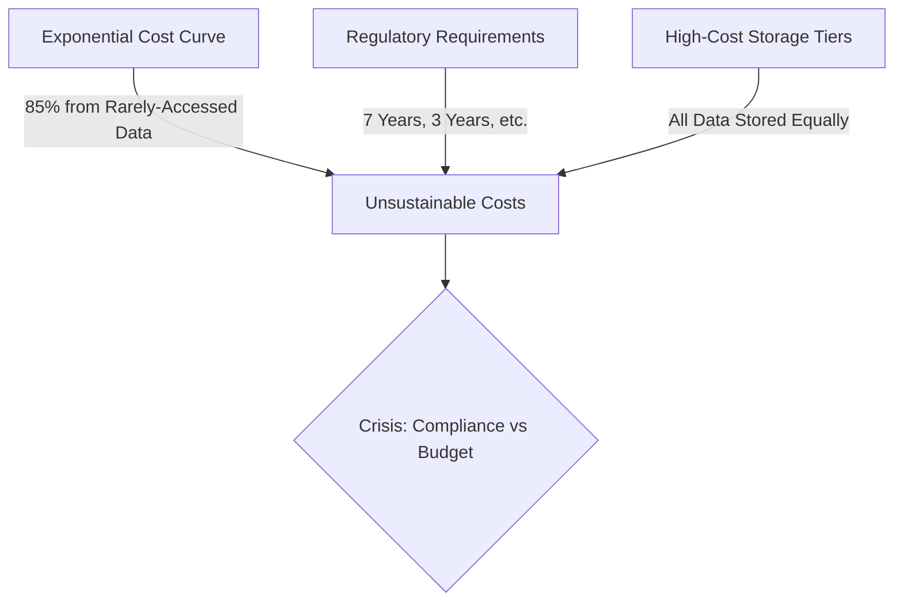

The tension in the room is palpable, with the data vividly illustrating the critical need for a more strategic approach to observability retention.
### Teaching Narrative
The most common mistake in observability retention is binary thinking: either delete data or keep it forever. This all-or-nothing approach creates an unsustainable cost trajectory that eventually forces painful decisions between compliance and budgets.

Effective retention strategy begins with recognizing that observability data has a lifecycle. The value and access patterns of telemetry change dramatically over time, yet most organizations store all data in high-performance, high-cost storage tiers. This approach treats day-old logs the same as three-year-old logs, despite radical differences in their query frequency and business value.

The foundation of cost-effective retention is tiered storage architecture that aligns storage performance with actual access patterns. Just as financial institutions use different storage systems for real-time transaction processing versus historical records, observability data requires similar stratification. By matching storage characteristics to data age and importance, we can dramatically reduce costs while maintaining both compliance and analytical capabilities.
### Common Example of the Problem

A major retail bank implemented full observability across its digital banking platform, collecting comprehensive logs, metrics, and traces for every customer interaction. To ensure regulatory compliance, they configured their observability platform to retain all data for seven years in high-performance storage.

Within 18 months, their quarterly observability bill grew from $200,000 to over $2.8 million, with storage costs representing 85% of the total. Analysis revealed that data older than 30 days was accessed less than 0.1% of the time, almost exclusively during compliance audits or major incident investigations. Despite this minimal access, the bank was paying premium rates for high-performance storage of all historical data, treating month-old logs and three-year-old logs identically despite vastly different access patterns.

#### Storage Cost Breakdown Over Time

The following table illustrates how storage costs ballooned due to the bank's "one-size-fits-all" storage strategy, highlighting the imbalance between cost and access frequency.

| Data Age         | Access Frequency (%) | Storage Tier Used        | Cost Percentage (%) |
| ---------------- | -------------------- | ------------------------ | ------------------- |
| < 30 Days        | 95%                  | High-Performance Storage | 10%                 |
| 30 Days - 1 Year | 4.9%                 | High-Performance Storage | 40%                 |
| 1 - 3 Years      | 0.09%                | High-Performance Storage | 30%                 |
| 3 - 7 Years      | 0.01%                | High-Performance Storage | 20%                 |

#### Observable Trends

The table reveals that the vast majority of access requests are concentrated on data less than 30 days old, while older data (1-7 years) is rarely accessed but contributes disproportionately to storage costs. This misalignment between access patterns and storage strategy created an unsustainable cost curve, as shown in the following cost growth trend:


When the CIO demanded cost reductions, the SRE team faced an impossible choice: compromise compliance by reducing retention periods or maintain unsustainable expenses that threatened their entire observability program.
### SRE Best Practice: Evidence-Based Investigation

To develop an effective and sustainable observability retention strategy, the SRE team followed a structured, evidence-based investigation process. The key steps and findings are summarized in the table below:

| **Step**                            | **Description**                                                                                    | **Key Findings**                                                                                                                                                                                                                                                    |
| ----------------------------------- | -------------------------------------------------------------------------------------------------- | ------------------------------------------------------------------------------------------------------------------------------------------------------------------------------------------------------------------------------------------------------------------- |
| **Access Pattern Analysis**         | Tracked query frequencies across data ages to understand usage patterns.                           | - Data 0-7 days old: Accessed thousands of times daily for active monitoring and incident response. <br> - Data 8-90 days old: Accessed dozens of times weekly. <br> - Data 91+ days old: Accessed only a few times monthly for compliance or major investigations. |
| **Compliance Requirement Mapping**  | Collaborated with legal and compliance teams to identify retention requirements by telemetry type. | - Only 12% of total data volume required strict long-term retention. <br> - 88% of data could be managed flexibly without violating regulations.                                                                                                                    |
| **Query Performance Benchmarking**  | Tested query speeds across various storage technologies to evaluate performance trade-offs.        | - No significant impact from slower response times (milliseconds vs. seconds) for infrequently accessed historical data.                                                                                                                                            |
| **Regulatory Documentation Review** | Reviewed regulatory requirements to determine acceptable data formats for compliance.              | - Retention requirements focused on content, not format. <br> - Transformed, compressed, or summarized data could meet compliance needs.                                                                                                                            |
| **Cost-Benefit Analysis**           | Modeled storage costs relative to query frequency to assess optimization opportunities.            | - High-performance access to rarely queried data was costing millions annually without delivering proportional business value.                                                                                                                                      |

This structured approach helped the team identify actionable opportunities for aligning storage costs with actual data usage patterns, ensuring compliance without compromising efficiency or budget.
### Banking Impact

The bank's unsustainable observability costs were creating several significant business impacts:

- 💸 **Budget Displacement**  
  The exploding storage costs were consuming budget that could otherwise be invested in new banking features or security enhancements. Several digital banking initiatives were delayed due to cost constraints.

- 🏦 **Competitive Disadvantage**  
  The high observability expenses created a competitive disadvantage, as peer institutions with more efficient retention strategies were able to invest more in customer-facing innovations.

- 🚨 **Risk of Observability Reduction**  
  Financial pressure was leading executives to consider cutting back on observability coverage for new services, potentially increasing operational risk and incident impact.

- 📋 **Regulatory Examination Concerns**  
  Ironically, while the approach was designed for compliance, the unsustainable cost trajectory raised regulatory concerns about the bank's technology governance and cost control processes.

- 🔧 **Technology Innovation Barriers**  
  The significant expenditure on storage was preventing investment in more advanced observability capabilities like anomaly detection and AIOps that could improve system reliability.
### Implementation Guidance

The SRE team implemented a structured approach to retention optimization. The following flowchart outlines the key steps and their relationships:

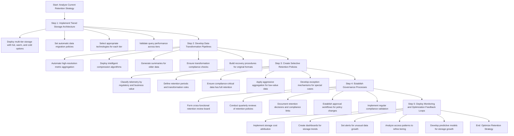

#### Key Steps in Detail:

1. **Implement Tiered Storage Architecture**:
   - Deploy a multi-tier storage solution with hot, warm, and cold storage options.
   - Configure automatic data migration policies based on age and access patterns.
   - Select appropriate technologies for each tier (e.g., high-performance databases for hot data, object storage for cold data).
   - Implement transparent query interfaces to abstract storage location from users.
   - Validate query performance across all tiers to ensure acceptable user experience.

2. **Develop Data Transformation Pipelines**:
   - Create automated processes to aggregate high-resolution metrics as they age.
   - Implement intelligent compression algorithms for older log data.
   - Develop summary generation workflows to extract key insights from detailed data.
   - Establish validation checks to ensure transformed data maintains regulatory compliance.
   - Build robust recovery procedures for rare cases requiring original formats.

3. **Create Selective Retention Policies**:
   - Classify all telemetry based on regulatory requirements and investigation value.
   - Define retention periods and transformation rules for each classification.
   - Configure compliance-critical data for full retention with appropriate tiering.
   - Apply aggressive aggregation to high-volume, low-regulatory-value metrics.
   - Develop exception mechanisms for preserving specific data beyond standard periods.

4. **Establish Governance Processes**:
   - Create a cross-functional retention review board including SRE, legal, and business representatives.
   - Conduct quarterly reviews of retention policies and their effectiveness.
   - Maintain clear documentation linking retention decisions to regulatory requirements.
   - Establish approval workflows for retention policy changes.
   - Implement regular compliance validation processes to ensure all requirements are consistently met.

5. **Deploy Monitoring and Optimization Feedback Loops**:
   - Implement storage cost attribution to create team accountability.
   - Create dashboards to visualize storage consumption trends by data type and age.
   - Set up alerts for unusual data growth patterns.
   - Analyze access patterns regularly to refine tiering strategies.
   - Develop predictive models for storage growth to enable proactive optimization.
## Panel 2: The Data Lifecycle Revolution
### Scene Description

In a modernized operations center, an SRE is demonstrating a new observability architecture on a large touchscreen. The visualization shows data flowing through distinct lifecycle stages, color-coded by age and importance. Fresh metrics and logs flow into high-performance storage, while progressively older data transition through warm and cold storage tiers. The following diagram represents the data lifecycle stages and their transitions:

```mermaid
flowchart TD
    A[Fresh Data<br>(Minutes to Hours)] -->|High-Performance Storage| B[Warm Data<br>(Days to Weeks)]
    B -->|Warm Storage| C[Cold Data<br>(Months+)]
    C -->|Cold Storage| D[Archived Data<br>(Retention Policies Met)]

    subgraph Storage Tiers
        A
        B
        C
        D
    end
```

The SRE highlights how different query patterns access specific storage tiers based on data age and importance, ensuring optimal performance and cost-efficiency. Compliance officers nod approvingly at indicators confirming retention policies are being met. To the side, a cost dashboard prominently displays dramatic savings compared to the previous quarter, showcasing the impact of the tiered storage architecture.
### Teaching Narrative

Observability data naturally follows a predictable lifecycle that should inform how we store and manage it. When data is fresh—minutes to hours old—it requires maximum performance for real-time dashboards, alerting, and incident response. As data ages into the days and weeks range, it primarily serves debugging, performance analysis, and short-term trend examination. After months, data primarily supports compliance requirements, occasional historical investigations, and long-term pattern analysis.

This natural aging process presents the opportunity for dramatic cost optimization through tiered storage architecture. High-performance, high-cost storage should be reserved for the most recent data that demands rapid query response. As data ages, it can move to progressively less expensive storage tiers with different performance characteristics.

The most sophisticated SRE teams implement automated lifecycle management that transparently handles these transitions. By defining explicit retention periods for each storage tier and automatic migration policies, data flows through the system without manual intervention while maintaining appropriate accessibility throughout its lifecycle.

#### Checklist: Implementing Observability Data Lifecycle Management

- **Understand Your Data's Lifecycle**
  - Identify how your observability data is used at different stages:
    - Fresh data (minutes to hours): Real-time dashboards, alerting, incident response.
    - Recent data (days to weeks): Debugging, performance analysis, short-term trends.
    - Older data (months+): Compliance, historical investigations, long-term patterns.

- **Design a Tiered Storage Architecture**
  - Reserve high-performance storage for fresh data that requires rapid queries.
  - Use cost-effective warm or cold tiers for older data with lower performance needs.

- **Define Retention and Migration Policies**
  - Set explicit retention periods for each storage tier.
  - Automate data migration between tiers based on age and usage patterns.

- **Leverage Automation Tools**
  - Implement tools or scripts to handle lifecycle transitions without manual effort.
  - Ensure policies align with compliance and accessibility requirements.

- **Monitor and Optimize Regularly**
  - Continuously review storage usage and query performance.
  - Adjust retention policies and tier configurations to maximize cost savings and efficiency.
### Common Example of the Problem

A global investment bank maintained a single high-performance Elasticsearch cluster for all observability data from their trading platform. To support both real-time monitoring and regulatory retention requirements, the cluster had grown to over 300 nodes, costing $1.2 million monthly in infrastructure alone.

Despite this massive investment, the cluster frequently experienced performance issues. Real-time operational dashboards would slow to a crawl during market volatility as they competed for resources with large historical queries run by compliance teams. Compliance investigations were also bottlenecked, with queries spanning months of data timing out or consuming excessive resources.

The fundamental problem was architectural: the bank used a single storage system optimized for real-time performance to serve wildly different access patterns. This approach satisfied neither operational nor compliance needs while maximizing costs. A comparison of the single-tier approach versus a potential multi-tier architecture highlights the core issues and opportunities:

| **Aspect**                 | **Single-Tier Approach**                                                             | **Multi-Tier Solution**                                                                                   |
| -------------------------- | ------------------------------------------------------------------------------------ | --------------------------------------------------------------------------------------------------------- |
| **Cost**                   | High infrastructure costs due to reliance on premium storage for all data            | Significant savings by using tiered storage (high-cost storage for fresh data, lower-cost for older data) |
| **Performance**            | Real-time dashboards and historical queries compete for resources, causing slowdowns | Optimized performance as each storage tier is tailored to specific query patterns and access needs        |
| **Scalability**            | Limited scalability; adding nodes increases costs exponentially                      | Scales more efficiently by distributing data across storage tiers with appropriate resource allocations   |
| **Compliance Support**     | Historical queries are slow and prone to timeouts                                    | Historical data stored in cost-efficient tiers with query performance tuned for compliance needs          |
| **Operational Complexity** | Simple but inflexible; requires manual workarounds for issues                        | Automated lifecycle policies handle data migration transparently, reducing manual intervention            |

By transitioning to a multi-tier architecture, the bank could better meet the distinct needs of real-time operations and compliance teams while significantly reducing costs and improving overall system performance.
### SRE Best Practice: Evidence-Based Investigation

The SRE team conducted a comprehensive analysis of their observability data lifecycle. Below is a text diagram summarizing the key steps and findings of their evidence-based investigation:

```mermaid
graph TD
    A[Start: Observability Data Lifecycle Analysis] --> B[Query Pattern Analysis]
    B --> B1[Data 0-24 hours: Dashboards, sub-second response]
    B --> B2[Data 1-30 days: Trend analysis, 1-5 second response]
    B --> B3[Data 31-365 days: Compliance reviews, 30+ second response]
    B --> B4[Data >1 year: Regulatory examinations, minute-level response]

    A --> C[Storage Performance Testing]
    C --> C1[High-performance (Elasticsearch): Real-time data]
    C --> C2[Columnar DBs (ClickHouse): Intermediate storage]
    C --> C3[Object storage (S3 with Athena): Long-term archival]

    A --> D[Access Frequency Measurement]
    D --> D1[0-24 hours: 1000+ queries/min]
    D --> D2[1-30 days: 100-200 queries/hour]
    D --> D3[31-365 days: 10-20 queries/day]
    D --> D4[>1 year: 1-5 queries/week]

    A --> E[Cost Modeling]
    E --> E1[Single-tier: $1.2M/month]
    E --> E2[Two-tier (hot/cold): $450K/month]
    E --> E3[Three-tier (hot/warm/cold): $320K/month]

    A --> F[Transformation Trade-off Analysis]
    F --> F1[Raw data vs. statistical summaries]
    F --> F2[Full-resolution metrics vs. downsampled aggregates]
    F --> F3[Complete logs vs. pattern extraction]
```

#### Detailed Investigation Steps and Findings:

1. **Query Pattern Analysis**  
   The team implemented detailed query tracking to understand how data was accessed throughout its lifecycle:
   - **0-24 hours old:** Primarily accessed through dashboards requiring sub-second response times
   - **1-30 days old:** Used for trend analysis and incident investigation with tolerance for 1-5 second responses
   - **31-365 days old:** Accessed for quarterly compliance reviews with acceptance of 30+ second response times
   - **>1 year old:** Rarely accessed except during regulatory examinations where even minute-level responses were acceptable

2. **Storage Performance Testing**  
   Test environments were built to compare various storage technologies:
   - **High-performance document stores (e.g., Elasticsearch):** Optimized for real-time data
   - **Columnar databases (e.g., ClickHouse):** Ideal for intermediate storage and analytical queries
   - **Object storage (e.g., S3 with Athena):** Suited for long-term archival
   - Performance, storage efficiency, and operational overhead were measured for each option.

3. **Access Frequency Measurement**  
   Query patterns were quantified based on data age:
   - **0-24 hours:** 1000+ queries per minute
   - **1-30 days:** 100-200 queries per hour
   - **31-365 days:** 10-20 queries per day
   - **>1 year:** 1-5 queries per week

4. **Cost Modeling**  
   Financial models were developed to compare architectural options:
   - **Single-tier approach:** $1.2M per month
   - **Two-tier (hot/cold):** $450K per month
   - **Three-tier (hot/warm/cold):** $320K per month
   - Models factored in storage, compute for queries, data migration, and operational overhead.

5. **Transformation Trade-off Analysis**  
   Evaluations were conducted on how data transformations impacted costs and analytical capability:
   - **Raw data maintenance** vs. **statistical summaries**
   - **Full-resolution metrics** vs. **downsampled aggregates**
   - **Complete log retention** vs. **pattern extraction**
   - Both quantitative metrics and user feedback informed the analysis.
### Banking Impact
The bank's single-tier storage approach created significant business impacts:

1. **Operational Reliability Risk**: Performance degradation during high-volume trading periods threatened the reliability of critical monitoring systems exactly when they were most needed.

2. **Compliance Delays**: Regulatory investigations that should take hours often extended to days due to query performance limitations, creating risk of missed deadlines for regulatory reporting.

3. **Inflated Technology Costs**: The excessive observability storage costs were affecting the bank's efficiency ratio, a key metric scrutinized by investors and analysts.

4. **Resource Competition**: The massive infrastructure dedicated to observability storage was consuming data center capacity that could otherwise support new business initiatives.

5. **Scalability Concerns**: As trading volumes continued to increase, the existing architecture faced fundamental scaling limitations that threatened future observability coverage.
### Implementation Guidance

The team implemented a comprehensive data lifecycle architecture, with actionable steps and example code snippets for key processes:

1. **Design Multi-Tier Storage Architecture**:
   - Map data types to appropriate storage technologies based on access patterns.
   - Create a hot tier using high-performance document stores for 0-7 day data.
   - Implement a warm tier using columnar databases for 8-90 day data.
   - Deploy a cold tier using object storage with query engines for data older than 90 days.
   - Develop unified query interfaces that abstract storage location from end users.
   - Implement automated rehydration mechanisms for occasionally accessing cold data.

   **Checklist**:
   - [ ] Identify data types and their access patterns.
   - [ ] Define storage tiers with performance and cost trade-offs.
   - [ ] Implement unified query access and rehydration processes.
   - [ ] Test storage tier integration and query response times.

2. **Build Automated Data Migration Pipelines**:
   - Develop data transformation processes for tier transitions.
   - Implement data consistency validation during migrations.
   - Create downsampling algorithms that preserve analytical value.
   - Deploy background migration processes with minimal operational impact.
   - Build reconciliation checks that verify complete data transfer.
   - Design exception handling for failed migrations.

   **Example Code Snippet for a Data Migration Pipeline** (Python with a cloud storage SDK):
   ```python
   import time
   from cloud_storage_sdk import HotTier, WarmTier, ColdTier

   def migrate_data(data, source_tier, target_tier):
       try:
           # Validate data consistency before migration
           if not source_tier.validate(data):
               raise ValueError("Data consistency check failed.")

           # Transform data for the target tier
           transformed_data = target_tier.transform(data)

           # Migrate data
           target_tier.store(transformed_data)

           # Reconcile to ensure transfer completion
           if not target_tier.verify(data.id):
               raise RuntimeError("Data reconciliation failed.")

           print(f"Data {data.id} successfully migrated to {target_tier.name}.")
       except Exception as e:
           print(f"Migration failed: {e}")

   # Example usage
   data = HotTier.retrieve("log_20231023")
   migrate_data(data, HotTier, WarmTier)
   ```

3. **Implement Data Transformation Strategies**:
   - Create progressive aggregation policies that increase summary levels with age.
   - Deploy intelligent compression for logs moving to colder tiers.
   - Implement field reduction to eliminate unnecessary context in older data.
   - Develop format conversion to optimize storage efficiency in each tier.
   - Create metadata indexing that maintains searchability despite transformations.
   - Enable on-demand access to original formats when required.

   **Checklist**:
   - [ ] Design aggregation and compression policies for each tier.
   - [ ] Implement metadata indexing to support efficient search.
   - [ ] Validate field reduction strategies for storage efficiency.
   - [ ] Test on-demand access to ensure data integrity.

4. **Develop Unified Query Capabilities**:
   - Create abstraction layers that hide storage complexity from users.
   - Implement query federation across storage tiers.
   - Deploy caching mechanisms for frequently accessed historical data.
   - Build query optimization to automatically target appropriate storage tier.
   - Develop cross-tier correlation capabilities for investigations spanning multiple time ranges.
   - Implement query monitoring to continuously optimize tier boundaries.

   **Mermaid Diagram – Query Federation Workflow**:
   ```mermaid
   graph LR
       A[User Query] --> B[Query Abstraction Layer]
       B --> C[Hot Tier Query Engine]
       B --> D[Warm Tier Query Engine]
       B --> E[Cold Tier Query Engine]
       C --> F[Hot Tier Results]
       D --> G[Warm Tier Results]
       E --> H[Cold Tier Results]
       F --> I[Aggregated Results]
       G --> I
       H --> I
       I --> J[Return Results to User]
   ```

5. **Establish Operational Processes**:
   - Create monitoring for the entire data lifecycle pipeline.
   - Implement alert thresholds for migration failures.
   - Develop capacity planning processes for each storage tier.
   - Build emergency access procedures for critical historical data.
   - Create regular testing processes for data accessibility across tiers.
   - Establish performance benchmarks and alerting for query degradation.

   **Checklist**:
   - [ ] Set up monitoring dashboards for lifecycle pipelines.
   - [ ] Define and test alert thresholds for migration and query failures.
   - [ ] Implement capacity planning for growing data volumes.
   - [ ] Create and validate emergency access workflows.
   - [ ] Regularly test tier accessibility and system performance.
## Panel 3: Compliance Without Bankruptcy
### Scene Description

A meeting room where compliance, legal, and SRE teams are collaboratively reviewing a new retention framework document. On the wall is a matrix that visually organizes data types, their regulatory requirements, and corresponding retention strategies. The matrix is structured as follows:

```
+------------------+---------------------+--------------------------+
| Data Types       | Regulations         | Retention Strategies     |
+------------------+---------------------+--------------------------+
| Transaction Logs | PCI-DSS, SOX, AML  | Aggregation Over Time    |
| PII Data         | KYC, GDPR          | Selective Field Retention|
| Audit Logs       | SOX, Basel III     | Compression by Age       |
| Metadata         | None               | Aggressive Pruning       |
+------------------+---------------------+--------------------------+
```

The left column lists common data types in banking systems (e.g., transaction logs, PII data, metadata). The middle column connects these data types to specific regulatory frameworks, such as Basel III, PCI-DSS, or GDPR. The right column outlines tailored retention strategies, like "Aggregation Over Time" for transaction logs or "Compression by Age" for audit logs.

Team members are actively discussing how these strategies can satisfy compliance while significantly reducing storage costs. For example, they highlight that older transaction logs, which no longer require detailed fields for compliance, can be aggregated to maintain just the relevant summaries. Financial projections displayed alongside the matrix demonstrate the potential of this approach to reduce costs by 70% while adhering to all regulatory requirements.
### Teaching Narrative
Regulatory compliance in banking creates unique challenges for observability retention. Requirements like PCI-DSS, SOX, and KYC/AML impose specific retention periods that can extend from 3 to 10+ years for certain transaction data. This regulatory reality has led many organizations to adopt blanket retention policies that keep all observability data for the longest required period—a safe but extraordinarily expensive approach.

The breakthrough insight for compliant cost optimization is that regulations rarely specify the format or completeness of retained data. This creates opportunities for transformation strategies that satisfy compliance while dramatically reducing storage requirements. Techniques like selective field retention, aggregation over time, and compression ratios that increase with age can maintain compliance while reducing storage footprints by orders of magnitude.

The most successful banking SRE teams partner closely with legal and compliance departments to create nuanced retention policies that distinguish between different data types. This allows for customized approaches that maintain full regulatory compliance while implementing aggressive cost optimization for data elements without specific regulatory requirements.
### Common Example of the Problem

A multinational bank operating across 30 jurisdictions implemented a comprehensive observability platform for their payments infrastructure. To ensure compliance with the strictest regulations across all regions (particularly GDPR, PCI-DSS, and MiFID II), they adopted a conservative approach: retaining all observability data in its original form for 7 years.

Within two years, they faced a critical problem: observability storage costs had reached $15 million annually and were growing at 40% year-over-year. Audits revealed they were storing massive volumes of system-level metrics like CPU, memory, and disk utilization for the full 7-year period, despite these metrics having no regulatory retention requirements. Additionally, they were keeping complete HTTP payloads including sensitive customer data, creating both expense and potential privacy compliance issues.

To illustrate the scope of the problem, the following table summarizes the retention strategy, associated costs, and compliance relevance for key data types:

| **Data Type**              | **Retention Period** | **Regulatory Requirement** | **Annual Storage Cost** | **Key Observations**                                                                |
| -------------------------- | -------------------- | -------------------------- | ----------------------- | ----------------------------------------------------------------------------------- |
| System Metrics (CPU, Disk) | 7 years              | None                       | $3M                     | No compliance requirement; over-retention contributes to unnecessary cost.          |
| HTTP Payloads              | 7 years              | GDPR, PCI-DSS              | $9M                     | Sensitive data stored unnecessarily long; creates privacy compliance risks.         |
| Transaction Logs           | 7 years              | MiFID II, PCI-DSS          | $2M                     | Regulatory requirement; storage format could be optimized (e.g., aggregation).      |
| Debug Logs                 | 7 years              | None                       | $1M                     | No compliance requirement; could be purged or compressed without regulatory impact. |

The compliance team resisted any changes to retention policies, citing regulatory risk. Meanwhile, finance demanded immediate cost reductions. The resulting deadlock threatened the entire observability program, potentially forcing the bank to reduce critical monitoring coverage to meet budget constraints.
### SRE Best Practice: Evidence-Based Investigation

The SRE team partnered with legal and compliance specialists to perform a rigorous analysis. Below is a checklist summarizing their evidence-based investigation process, ensuring actionable steps for replicable success:

#### Checklist: Steps for Evidence-Based Investigation

1. **Regulatory Requirement Mapping**
   - [ ] Identify and list all relevant data types subject to retention regulations.
   - [ ] Document explicit regulatory language on retention format and completeness.
   - [ ] Map retention requirements to specific observability signals (e.g., logs, metrics, traces).
   - [ ] Quantify the percentage of telemetry data with no explicit regulatory requirements.

2. **Compliance Intent Analysis**
   - [ ] Collaborate with regulatory specialists to analyze intent behind retention requirements.
   - [ ] Determine which retention requirements focus on transactional outcomes versus system metrics.
   - [ ] Identify requirements targeting specific use cases, such as fraud investigation or market manipulation.
   - [ ] Validate that non-essential telemetry data is excluded from compliance scope.

3. **Transformation Validation**
   - [ ] Design and test representative samples of transformed data sets.
   - [ ] Conduct mock audits with compliance teams using transformed data formats.
   - [ ] Ensure regulatory questions can be answered using optimized data.
   - [ ] Document traceability between original telemetry and its transformed representation.

4. **Risk Assessment**
   - [ ] Quantify likelihood and impact of potential regulatory findings for each retention strategy.
   - [ ] Assess operational risks from reduced historical visibility.
   - [ ] Evaluate financial risks tied to ongoing storage cost growth.
   - [ ] Create a balanced risk profile addressing compliance and cost trade-offs.

5. **Legal Precedent Research**
   - [ ] Investigate how peer institutions handle similar compliance challenges.
   - [ ] Identify regulatory examinations that accepted transformed data formats.
   - [ ] Document industry standards and best practices for observability retention.
   - [ ] Verify that data transformation practices align with legal precedents and have not led to regulatory actions.

#### Summary
By following this structured checklist, SRE teams can systematically analyze and optimize observability retention strategies, ensuring compliance while significantly reducing storage costs. This evidence-based approach not only minimizes risk but also fosters collaboration between SRE, legal, and compliance teams for long-term success.
### Banking Impact

The bank's blanket retention approach was creating significant business impacts:

- 📈 **Unsustainable Cost Growth**  
  The $15 million annual expense with 40% growth was projected to reach $41 million within three years, threatening the viability of the entire observability program.

- 🛑 **Operational Inefficiency**  
  Huge volumes of rarely-accessed data were creating performance bottlenecks in compliance investigations, ironically making it harder to satisfy the very regulations driving the retention.

- 🔒 **Privacy Compliance Risk**  
  Retaining complete data, including customer information, created tension with privacy regulations like GDPR that mandate data minimization.

- 💸 **Resource Displacement**  
  Expensive storage was consuming budget that could otherwise fund enhanced security monitoring or resilience improvements.

- 🏦 **Competitive Disadvantage**  
  Peer institutions with more sophisticated retention strategies were achieving comparable compliance with significantly lower technology expenses.
### Implementation Guidance

The team implemented a compliance-optimized retention strategy through the following structured steps. The process is visualized below, combining the key phases into a cohesive flowchart for clarity:

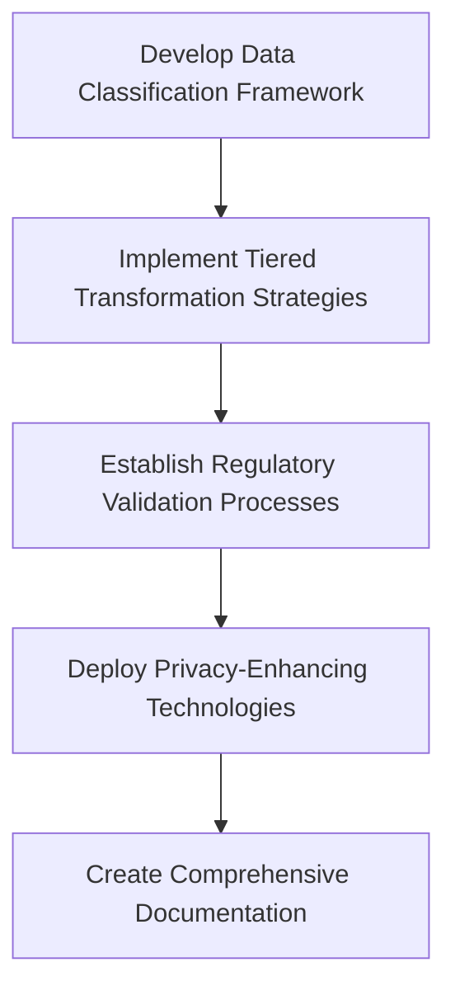

#### Step 1: Develop Data Classification Framework
- **Create detailed classification** of all telemetry based on regulatory requirements.
- **Establish retention categories** with specific periods and transformation rules.
- **Document regulatory basis** for each retention decision to maintain clarity.
- **Implement metadata tagging** to ensure proper policy application.
- **Create governance processes** for classifying new data sources.
- **Develop clear documentation** linking policies to specific regulatory language.

#### Step 2: Implement Tiered Transformation Strategies
- **Design progressive transformation rules** based on data age and type.
- **Create field-level filtering** to remove non-regulatory data while preserving required elements.
- **Implement progressive summarization** that maintains regulatory compliance.
- **Develop specialized archival formats** optimized for compliance queries.
- **Create validation processes** to verify compliance capabilities are maintained.
- **Build audit trails** documenting all transformations applied to regulated data.

#### Step 3: Establish Regulatory Validation Processes
- **Create "compliance testing" scenarios** that validate transformed data usability.
- **Develop regular audits** simulating regulatory examinations.
- **Implement periodic validation** of transformation processes.
- **Create attestation documentation** for compliance stakeholders.
- **Establish rollback capabilities** for transformation strategies.
- **Build regular review cycles** with legal and compliance teams.

#### Step 4: Deploy Privacy-Enhancing Technologies
- **Implement field-level encryption** for sensitive data elements.
- **Deploy automated PII detection and redaction** for logs.
- **Create data minimization processes** that activate with age.
- **Develop privacy-compliant access controls** for historical data.
- **Implement purpose limitation enforcement** in query interfaces.
- **Build privacy impact analysis processes** for retention decisions.

#### Step 5: Create Comprehensive Documentation
- **Develop detailed retention policy documentation** with regulatory citations.
- **Create transformation strategy documents** explaining compliance alignment.
- **Implement data maps** showing where regulated information is stored.
- **Build accessibility procedures** for regulatory examinations.
- **Develop regular compliance reports** showing retention adherence.
- **Create executive briefing materials** explaining the compliance approach.

By following this structured process, teams can achieve a balance between regulatory compliance and aggressive cost optimization, ensuring long-term sustainability and adherence to banking regulations.
## Panel 4: The Intelligent Aggregation Engine
### Scene Description

A senior SRE is configuring a new data transformation pipeline on a multi-screen workstation. The setup includes three primary screens:

1. **Data Flow Visualization**: High-volume, high-resolution metrics stream through processing stages, illustrated as a flowchart where data resolution progressively decreases over time. Key stages include:
   - **Raw Data Ingestion**: Incoming metrics at millisecond precision.
   - **Progressive Aggregation**: Data consolidated into minute, hourly, and daily intervals.
   - **Retention Tiers**: Final storage layers where resolution matches data age.

2. **Dashboard Comparison**: A side-by-side view displays the original high-resolution time series alongside downsampled versions. Patterns remain nearly identical despite significant data reduction, reinforcing the effectiveness of the aggregation strategy.

3. **Cost Projection Analysis**: A graph dynamically updates to show storage costs plummeting as aggregation ratios increase. Color-coded trends illustrate the correlation between data age, resolution, and cost savings.

Below the screens, team members are visible testing queries against both original and aggregated datasets. A quick summary of query responses verifies that analytical capabilities remain intact and consistent across different data resolutions.

#### Example Data Flow Representation:
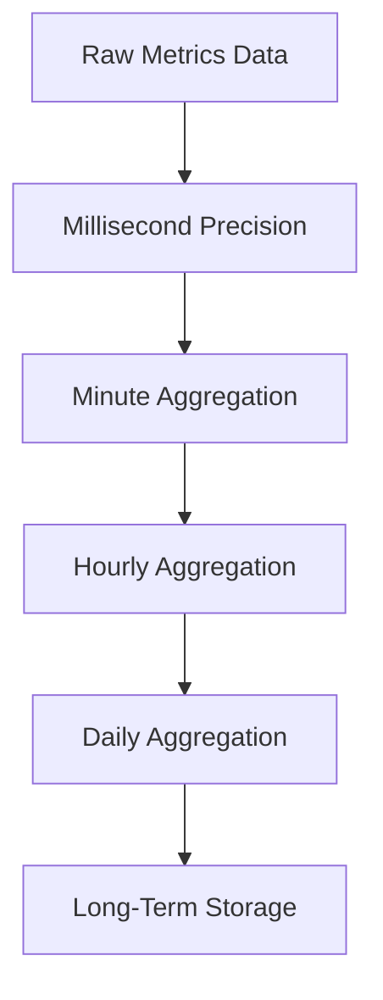
The visual representation reinforces the concept of progressive aggregation, showing how data moves through stages of reduced granularity while maintaining analytical value.
### Teaching Narrative
As observability data ages, the granularity required for analysis naturally decreases. While millisecond-level precision is crucial for real-time incident investigation, monthly or quarterly trends can be accurately represented with much lower resolution. This changing precision requirement creates powerful opportunities for progressive aggregation strategies.

Progressive aggregation applies mathematical reduction techniques to observability data as it ages, preserving the statistical significance and analytical value while dramatically reducing storage requirements. For metrics, this involves increasing the time window for data points—from seconds to minutes to hours to days—as data moves through retention tiers. For logs, it involves transitioning from complete entries to statistical summaries and representative samples.

The key insight is that data reduction should be a progressive, planned process rather than a binary keep-or-delete decision. By implementing automated aggregation pipelines that transform data at specific age thresholds, we maintain analytical capabilities proportionate to the typical queries made against data of that age. This preserves business value while eliminating unnecessary storage costs for granularity that no longer serves practical purposes.
### Common Example of the Problem

A digital-only bank implemented comprehensive infrastructure monitoring across their cloud platform, collecting metrics at 10-second intervals from thousands of components. Their observability platform ingested over 50 million data points daily, providing excellent real-time visibility for operations.

To support capacity planning and trend analysis, they retained all metrics at full resolution for 2 years. This approach initially worked well, but as their customer base grew, storage requirements expanded dramatically. Within 18 months, they were storing over 27 trillion data points, with storage costs exceeding $400,000 monthly.

When capacity planners analyzed usage patterns, they discovered key inefficiencies in data retention. While 10-second granularity was essential for real-time troubleshooting, trend analysis typically relied on hourly or daily aggregations for historical data. This meant they were incurring massive costs for storing high-resolution data that was rarely, if ever, queried at its original precision.

#### Storage Growth vs. Usage Patterns

The table below summarizes the disparity between data growth, storage costs, and actual query patterns:

| **Metric**                | **Initial State**       | **After 18 Months**       | **Observed Usage Patterns**                                  |
| ------------------------- | ----------------------- | ------------------------- | ------------------------------------------------------------ |
| Data Points per Day       | 50 million              | 90 million                | Queries on historical data used hourly or daily aggregations |
| Total Data Retained       | ~36 billion (2 years)   | ~27 trillion (2 years)    | Full-resolution data rarely accessed                         |
| Storage Costs per Month   | $50,000                 | $400,000                  | Real-time queries required only recent data                  |
| Typical Query Granularity | Millisecond (real-time) | Hourly/Daily (historical) | Historical queries did not need high precision               |

#### Data Aggregation Opportunity

This example highlights a common problem in observability: high-resolution data is retained far longer than necessary, leading to unsustainable costs. By implementing a progressive aggregation strategy, the bank could reduce storage costs drastically while maintaining analytical accuracy for both real-time and historical queries.
### SRE Best Practice: Evidence-Based Investigation

The SRE team conducted a detailed analysis of their aggregation opportunities, summarized in the checklist and table below for actionable insights and results.

---

#### Checklist for Evidence-Based Investigation

- [ ] **Query Pattern Analysis**: Review historical data query patterns to determine resolution requirements based on data age.
- [ ] **Statistical Significance Testing**: Analyze the impact of aggregation on data accuracy and identify metrics requiring custom rules.
- [ ] **Storage Impact Modeling**: Calculate potential storage savings at different aggregation levels.
- [ ] **Anomaly Detection Impact**: Assess changes in anomaly detection effectiveness with aggregated data.
- [ ] **Business Impact Assessment**: Validate that aggregation supports business-critical functions and reporting accuracy.

---

#### Summary Table: Key Actions and Findings

| Investigation Area             | Actions Taken                                                                          | Key Findings                                                                                                                         |
| ------------------------------ | -------------------------------------------------------------------------------------- | ------------------------------------------------------------------------------------------------------------------------------------ |
| **Query Pattern Analysis**     | Reviewed historical queries against time-series data.                                  | Resolution needs by age: <br> - 0-24 hrs: 10s <br> - 1-7 days: 1m <br> - 8-30 days: 5m <br> - 31-90 days: 1hr <br> - >90 days: daily |
| **Statistical Significance**   | Tested aggregation methods & quantified error margins.                                 | - Patterns remained detectable. <br> - Specific metrics required custom aggregation.                                                 |
| **Storage Impact Modeling**    | Calculated storage reductions at each aggregation tier.                                | Cumulative reduction for older data: **99.9%+**.                                                                                     |
| **Anomaly Detection Impact**   | Analyzed false positive/negative rates and resolution requirements.                    | Minimum resolution identified for effective anomaly detection.                                                                       |
| **Business Impact Assessment** | Validated aggregation effects on capacity planning, SLA/SLO reporting, and dashboards. | Seasonal patterns and reporting accuracy maintained.                                                                                 |

---

#### Aggregation Storage Impact: Reduction Percentages by Tier

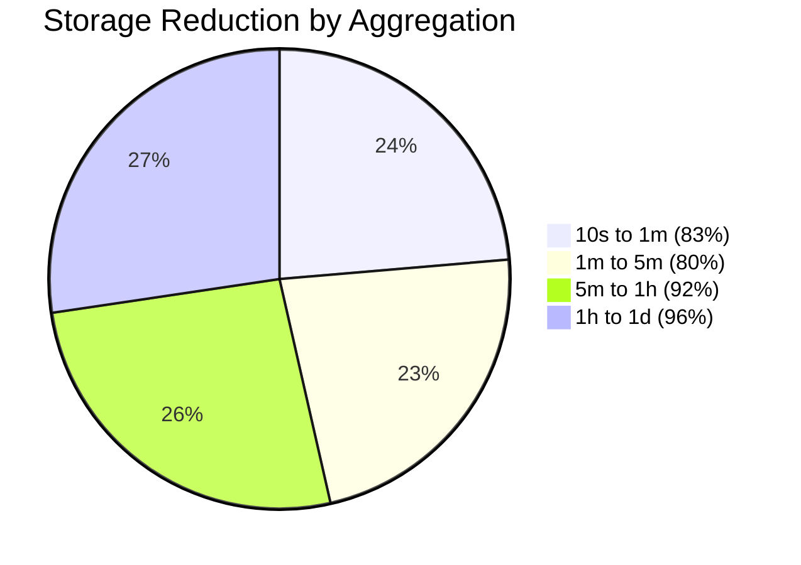

By following these steps and leveraging the findings, the SRE team optimized their data pipeline to balance analytical utility with cost efficiency.
### Banking Impact

The bank's full-resolution storage approach was causing significant business impacts. Key challenges and their implications are summarized below:

#### Key Issues:
- **Unsustainable Cost Trajectory**:
  - Monthly storage expenses of $400,000 were escalating at a rate of 35% per quarter.
  - Projected to surpass $2 million monthly within a year as customer growth continued.

- **Query Performance Degradation**:
  - Historical queries against the vast dataset experienced significant slowdowns.
  - Limited the effectiveness of capacity planning and long-term trend analysis.

- **Analytical Limitations**:
  - Excessive data volume led to query timeouts, making certain analyses impractical.
  - Prevented actionable insights from being extracted in a timely manner.

- **Infrastructure Overhead**:
  - Observability storage costs became one of the largest technology expenses.
  - Surpassed even the core banking platform in operational expenditure.

- **Agility Constraints**:
  - High fixed costs discouraged the instrumentation of new services.
  - Limited visibility into customer-facing features, potentially impacting product innovation.

#### Summary of Impacts:
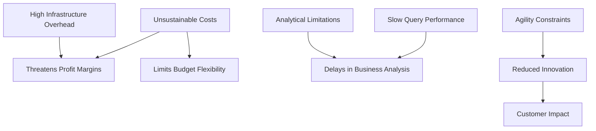
### Implementation Guidance

The team implemented an intelligent aggregation strategy. The following steps and flowchart outline the progressive aggregation architecture and pipeline stages:

#### Flowchart Representation
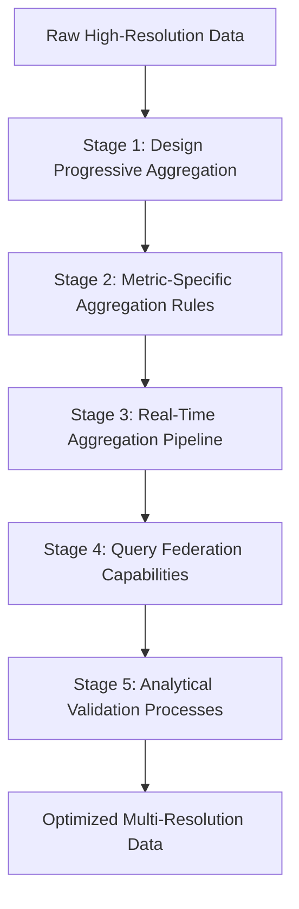

#### Step-by-Step Implementation Details

1. **Design Progressive Aggregation Architecture**:
   - Create a multi-stage data pipeline with clear transformation rules.
   - Implement time-based triggers for moving data between resolution tiers.
   - Define appropriate resolution levels for different data ages.
   - Select optimal statistical aggregation methods for each metric type.
   - Build exception handling for metrics requiring special treatment.
   - Develop buffering mechanisms to handle pipeline processing delays.

2. **Implement Metric-Specific Aggregation Rules**:
   - Classify metrics by their statistical properties (counters, gauges, distributions).
   - Define appropriate aggregation functions for each metric type.
   - Create custom aggregation rules for business-critical metrics.
   - Implement anomaly-aware sampling that preserves unusual patterns.
   - Develop composable aggregation functions for complex metric types.
   - Build validation logic that ensures mathematical correctness.

3. **Deploy Real-Time Aggregation Pipeline**:
   - Implement streaming aggregation for immediate processing.
   - Create background jobs for historical data transformation.
   - Build monitoring for aggregation job performance.
   - Develop retry logic for failed aggregation tasks.
   - Implement data consistency validation between tiers.
   - Create alerting for aggregation process failures.

4. **Develop Query Federation Capabilities**:
   - Build query interfaces that automatically select appropriate resolution.
   - Implement transparent querying across multiple resolution tiers.
   - Create caching mechanisms for frequent historical queries.
   - Develop clear visual indicators of data resolution in UIs.
   - Build "drill-down" capabilities that access higher resolutions when available.
   - Implement query planning optimization for multi-resolution data.

5. **Establish Analytical Validation Processes**:
   - Create comparison workflows between raw and aggregated data.
   - Implement regular testing of business reports using aggregated data.
   - Develop statistical validation of aggregation accuracy.
   - Build user feedback mechanisms for aggregation quality.
   - Create exception processes for accessing raw historical data when needed.
   - Implement continuous improvement cycle for aggregation algorithms.
## Panel 5: The Query-Aware Storage Strategy
### Scene Description

An SRE team is gathered around a large monitor displaying a heatmap of query patterns across their observability data. The heatmap vividly shows how query frequency and complexity change with data age:

- **Recent Data (0-7 days)**: High-intensity regions where complex queries dominate, fueled by dashboards, alerts, and real-time investigations.
- **Intermediate Data (1-6 months)**: Noticeable drop in query density, with occasional clusters reflecting targeted investigations or pattern analysis.
- **Older Data (6+ months)**: Sparse activity, highlighting infrequent access for compliance audits or major incident retrospectives.

Below the heatmap, a simple cost-performance diagram illustrates the relationship between query patterns and storage tiers. Recent data is mapped to high-performance, high-cost storage, while intermediate and older data are progressively assigned to lower-cost options optimized for their access patterns.

In another window, the team is implementing a new storage architecture to align with these patterns. A small flowchart on the screen outlines the strategy:

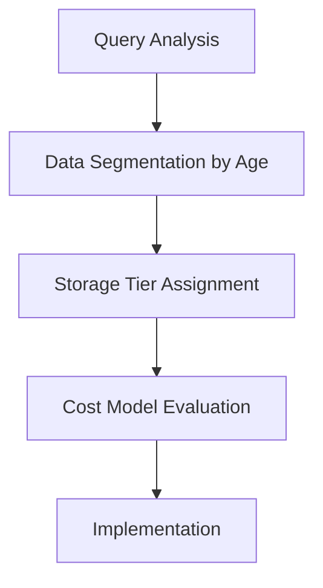

This evidence-based approach immediately reflects in the cost models shown on-screen, highlighting how eliminating high-performance storage for rarely-queried data reduces expenses while maintaining operational effectiveness.
### Teaching Narrative
The most sophisticated retention strategies are built on query pattern analysis—understanding exactly how different ages of observability data are actually used. This evidence-based approach reveals that query patterns change dramatically as data ages, creating opportunities for targeted optimization.

For most banking systems, observability data experiences a rapid drop-off in query frequency after its initial collection. Real-time and very recent data may be queried thousands of times per hour for dashboards, alerts, and active investigations. Data weeks old might see only occasional queries for specific investigations or pattern analysis. Years-old data might be accessed only during compliance audits or major incident retrospectives.

By analyzing these actual usage patterns, we can implement storage strategies that align perfectly with business needs. This means selecting storage technologies based on their query performance characteristics relative to actual usage. High-cost, high-performance technologies should be reserved for data requiring rapid, frequent access. Data with infrequent, predictable access patterns can leverage far less expensive storage options without impacting operational effectiveness.
### Common Example of the Problem

A global credit card processor maintained comprehensive observability data for fraud detection and compliance purposes. Their architecture used a premium time-series database cluster costing $225,000 monthly to store 24 months of data with uniform high-performance SLAs regardless of age.

When analyzing actual usage, they discovered dramatic pattern variations. Current-day data received millions of queries hourly from dashboards, alerts, and fraud detection algorithms. Week-old data saw only thousands of queries daily from periodic reports and recent trend analysis. Month-old data received just dozens of queries weekly, almost exclusively from monthly business reviews. Data older than 90 days was accessed only a few times quarterly, primarily during compliance audits or fraud pattern investigations.

Despite this extreme access disparity, they were paying the same premium storage and performance costs for all data. Their architecture optimized for peak performance across all ages, while actual business usage required peak performance for only the most recent data.

#### Query Frequency vs. Storage Costs by Data Age

| Data Age      | Query Frequency              | Typical Query Use Cases                         | Storage Cost (Monthly) | Cost Efficiency       |
| ------------- | ---------------------------- | ----------------------------------------------- | ---------------------- | --------------------- |
| Current Day   | Millions of queries per hour | Dashboards, alerts, fraud detection             | High                   | Misaligned (overused) |
| Week Old      | Thousands of queries per day | Periodic reports, recent trend analysis         | High                   | Misaligned (overused) |
| Month Old     | Dozens of queries per week   | Monthly business reviews                        | High                   | Misaligned (overused) |
| > 90 Days Old | Few queries per quarter      | Compliance audits, fraud pattern investigations | High                   | Highly inefficient    |

#### Usage Pattern Timeline

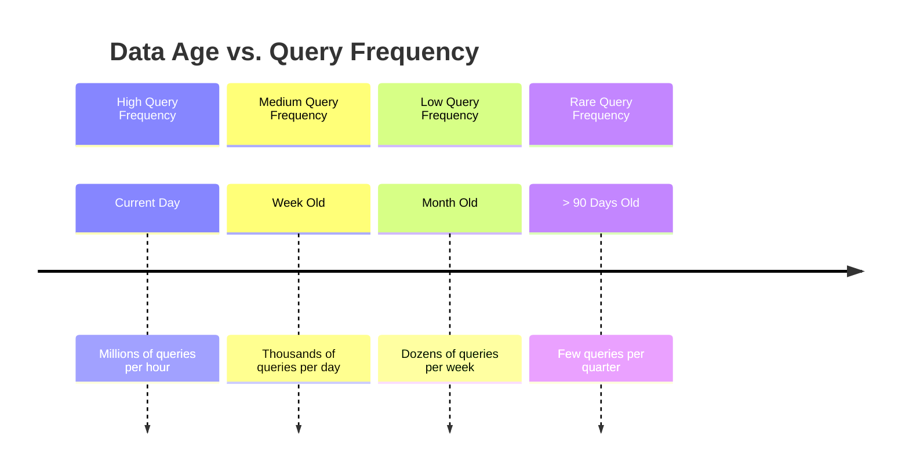

This comparison highlights the inefficiencies in maintaining high-performance storage across all data ages. By aligning storage technologies with these observed query patterns, significant cost savings can be achieved without sacrificing operational effectiveness.
### SRE Best Practice: Evidence-Based Investigation

The SRE team conducted a detailed query analysis to inform their storage strategy. Below is a checklist and flowchart summarizing the steps for an evidence-based investigation:

#### Investigation Checklist:
1. **Query Pattern Mining**:
   - [ ] Implement comprehensive query logging across observability platforms.
   - [ ] Capture query frequency, complexity, data ranges, and response times.
   - [ ] Segment analysis by data age, query source, and use case.
   - [ ] Create visualizations of access patterns over time.
   - [ ] Identify threshold points where query patterns shift dramatically.

2. **Performance Requirement Analysis**:
   - [ ] Map business use cases to specific performance needs.
   - [ ] Define response time requirements for real-time, operational, investigative, compliance, and deep historical use cases.

3. **Storage Technology Evaluation**:
   - [ ] Benchmark storage options for performance, cost, complexity, and flexibility.
   - [ ] Evaluate technologies such as time-series databases, distributed SQL, columnar analytical stores, and object storage with query engines.

4. **Cost-Performance Modeling**:
   - [ ] Develop financial models for different storage architectures.
   - [ ] Compare costs for single-tier, two-tier, three-tier, and multi-tier approaches.

5. **Business Impact Assessment**:
   - [ ] Measure impact on critical business functions (e.g., fraud detection, monitoring, compliance reporting, analytics).
   - [ ] Test workflows against chosen storage options to ensure operational effectiveness.

#### Investigation Flowchart:
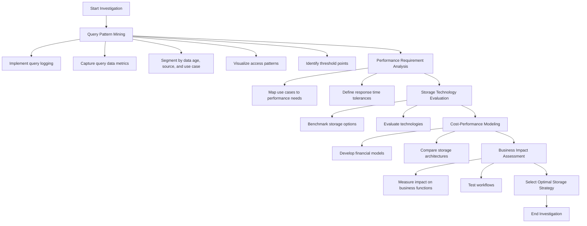

By following this structured approach, the SRE team ensures that their storage strategy is fully aligned with actual query patterns and business requirements, maximizing both cost efficiency and operational effectiveness.
### Banking Impact

The uniform high-performance storage approach was creating significant business impacts:

1. **Excessive Technology Expenses**: The $225,000 monthly cost represented nearly 40% of the entire fraud detection technology budget, limiting investment in improved detection algorithms.

2. **Operational Inefficiency**: The focus on supporting rarely-used historical queries was creating complexity that impacted the reliability of critical real-time monitoring.

3. **Scalability Limitations**: The high cost of the uniform approach was creating resistance to expanding observability coverage, potentially missing valuable fraud signals.

4. **Performance Paradox**: Ironically, by trying to optimize everything for performance, the overloaded system sometimes delivered suboptimal performance for the most critical real-time queries.

5. **Innovation Constraints**: The massive fixed cost of the existing architecture was consuming budget that could otherwise fund next-generation observability capabilities.

---

#### Summary of Impacts:

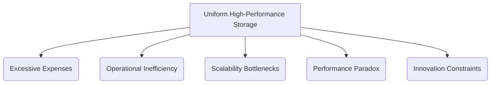

**Key Takeaways:**
- **Cost Inefficiency**: A large portion of the budget was allocated to unnecessary high-performance storage.
- **Reduced Reliability**: Complexity in maintaining historical query support impacted real-time systems.
- **Limited Growth**: Budget constraints hindered the ability to scale observability coverage.
- **Underperformance Risks**: Overloaded systems led to inconsistent critical query performance.
- **Innovation Blockage**: Fixed costs restricted investment in advanced observability features.
### Implementation Guidance

The team implemented a query-aware storage strategy using a multi-tier architecture. The following steps outline the core components and processes:

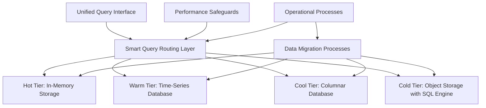

1. **Design Multi-Tier Query Architecture**:
   - Map query patterns and performance requirements to appropriate storage technologies.
   - Implement a hot tier with in-memory components for real-time fraud detection.
   - Deploy a warm tier using time-series databases for operational data 1-30 days old.
   - Create a cool tier using columnar databases for data 31-90 days old.
   - Implement a cold tier using object storage with SQL engines for data older than 90 days.
   - Develop a unified query interface that seamlessly routes requests to appropriate tiers.

2. **Build Smart Query Routing Layer**:
   - Create middleware that directs queries to the correct storage tier based on access patterns.
   - Implement query translation to bridge different backend technologies.
   - Develop performance monitoring tools to assess routing efficiency.
   - Build query federation capabilities for multi-tier requests.
   - Create caching mechanisms for frequently accessed historical queries.
   - Optimize query execution for each storage technology’s specific characteristics.

3. **Develop Data Migration Processes**:
   - Automate workflows to transition data smoothly between tiers.
   - Implement data validation before and after migration to ensure consistency.
   - Utilize parallel processing for large-scale, efficient transfers.
   - Develop fallback mechanisms to handle migration failures gracefully.
   - Set up monitoring and alerting systems for migration activities.
   - Conduct reconciliation checks to maintain data integrity across all tiers.

4. **Implement Performance Safeguards**:
   - Introduce query governors to prevent any single query from monopolizing resources.
   - Develop priority-based mechanisms to ensure business-critical queries are processed first.
   - Implement query queuing systems for extensive historical analyses.
   - Define tier-specific performance SLAs to align with business needs.
   - Build circuit breakers to safeguard against cascading performance degradation.
   - Provide user feedback on expected query performance and tier-specific limitations.

5. **Establish Operational Processes**:
   - Set up tier-specific monitoring and alerting to detect and resolve issues proactively.
   - Develop capacity planning processes tailored for each storage tier.
   - Build incident response procedures to address failures at any tier.
   - Regularly analyze query patterns to refine tier boundaries and optimize costs.
   - Communicate performance expectations and guidelines to users.
   - Conduct routine testing to verify cross-tier integration and functionality.
## Panel 6: The Selective Retention Framework
### Scene Description

A whiteboard session where an SRE team is developing a sophisticated retention matrix. The matrix classifies different types of observability data (transactions, authentication events, system metrics, etc.) according to their compliance requirements, investigation value, and query patterns. Team members are drawing arrows showing different retention paths for each data type, with some flowing to cold storage while others undergo transformation or deletion. A CTO observing the session is visibly impressed by the nuanced approach that optimizes both cost and value.

Below is a simplified text-based representation of the retention matrix and data flow:

```
                     +----------------------+         
                     |   Observability      |         
                     |       Data           |         
                     +----------------------+         
                                |                    
                +---------------+---------------+     
                |                               |     
      +---------+---------+           +---------+---------+
      | Transactions      |           | System Metrics    |
      | (High Compliance, |           | (Low Value,       |
      | Long Retention)   |           | Short Retention)  |
      +---------+---------+           +---------+---------+
                |                               |     
  +-------------+               +---------------+     
  |                             |                     
+---------------+       +--------------------+         
| Archival      |       | Aggregation/       |         
| (Cold Storage)|       | Deletion           |         
+---------------+       +--------------------+         
```

This diagram captures the flow of data types (e.g., transactions, system metrics) through classification and into their respective storage or processing paths. Each arrow signifies decisions based on compliance, investigation value, and storage cost optimization.
### Teaching Narrative
The ultimate evolution in retention strategy is moving beyond time-based policies to selective retention based on data characteristics. This approach recognizes that not all observability data has equal value or equal retention requirements—even data of the same age.

Selective retention frameworks classify observability data across multiple dimensions: regulatory requirements, security significance, business value, and investigation utility. This classification then determines not just how long data is retained, but in what form and at what access level.

For example, authentication events in banking environments have high security and compliance value, justifying longer retention in more accessible formats. Basic system metrics like CPU utilization have lower long-term value and can be aggressively aggregated or purged after shorter periods. Customer transaction traces might require full retention for compliance but can be moved to ultra-low-cost archival storage with acceptable retrieval delays.

By implementing this multi-dimensional approach, organizations can surgically optimize retention costs while preserving the specific data elements that deliver ongoing business and compliance value. This represents the highest form of retention strategy: precise alignment between data characteristics, business requirements, and storage investments.
### Common Example of the Problem

A regional bank with both retail and commercial operations implemented a comprehensive observability platform across their digital banking environments. Their initial retention policy was simple: 30 days of full retention for operational use, then 7 years of complete data in archival storage for compliance.

As their observability matured, they found that this binary approach created significant problems. Their retention strategy treated all data equally regardless of content: customer login events were stored with the same priority as routine CPU metrics; failed wire transfer attempts received the same retention as successful page loads; and developer debug logs were kept for the same duration as critical security events.

This one-size-fits-all approach created massive inefficiency. They were spending substantial resources storing data with minimal operational or compliance value, while high-value security and transaction data was buried in the same undifferentiated archival systems, making it difficult to access when needed for investigations.

#### Comparison Table: Retention Policy Inefficiencies

| **Data Type**                 | **Value Dimension**             | **Retention Policy (Original)**        | **Resulting Inefficiency**                                                                                       |
| ----------------------------- | ------------------------------- | -------------------------------------- | ---------------------------------------------------------------------------------------------------------------- |
| Customer Login Events         | High security and compliance    | 30 days operational + 7 years archival | Valuable data mixed with low-priority data, making investigations slower and more resource-intensive.            |
| Routine CPU Metrics           | Low operational and compliance  | 30 days operational + 7 years archival | Wasted storage resources on low-value data that could have been aggregated or purged earlier.                    |
| Failed Wire Transfer Attempts | High investigation utility      | 30 days operational + 7 years archival | Difficult to prioritize during investigations due to lack of differentiated retention handling.                  |
| Successful Page Loads         | Moderate business value         | 30 days operational + 7 years archival | Unnecessary long-term storage for data with limited relevance beyond real-time operational use.                  |
| Developer Debug Logs          | Low operational and compliance  | 30 days operational + 7 years archival | Retaining ephemeral data far beyond its useful lifespan, resulting in substantial waste.                         |
| Critical Security Events      | High security and investigation | 30 days operational + 7 years archival | Essential events are buried in undifferentiated archives, slowing down critical forensic and compliance efforts. |

This table illustrates how a uniform retention policy fails to account for the varying value dimensions of different data types, leading to inefficiencies and suboptimal use of storage resources.
### SRE Best Practice: Evidence-Based Investigation

The SRE team conducted a comprehensive analysis to inform their selective retention framework. Below is a checklist summarizing the key steps:

#### Checklist: Building a Selective Retention Framework

1. **Data Value Classification**
   - Interview key stakeholders (security, operations, development, compliance) about data usage and needs.
   - Analyze historical incident investigations to determine which data types were most valuable.
   - Review compliance requirements to identify specific retention obligations.
   - Assign value scores to data categories based on dimensions such as business value, compliance, and investigation utility.

2. **Regulatory Mapping**
   - Document regulatory requirements and map them to specific data types.
   - Identify which data must be retained in full fidelity versus summarized formats.
   - Define explicit retention periods for regulated data categories.
   - Highlight data types with no regulatory retention requirements.

3. **Security Value Assessment**
   - Collaborate with the security team to rank data types based on security relevance.
   - Identify high-value data types such as authentication events, access pattern logs, and transaction anomalies.
   - Prioritize retention for data critical to forensic investigations or security monitoring.
   - Deprioritize low-security-relevance data like basic health metrics.

4. **Access Pattern Analysis**
   - Analyze query patterns for different data types over time.
   - Identify data with consistent investigation value (e.g., transaction and authentication data).
   - Detect data with rapidly diminishing query frequency, such as system metrics or debugging logs.
   - Use access patterns to inform optimal retention strategies for each data type.

5. **Cost Impact Modeling**
   - Develop financial projections for different retention strategies:
     - Uniform retention (current approach).
     - Time-based tiering.
     - Data-type selective retention.
     - Multi-dimensional selective retention.
   - Quantify potential cost reductions and align retention strategy with business priorities.

#### Summary Table: Retention Strategy Highlights

| Data Type                | Value Dimension            | Optimal Retention Strategy       |
| ------------------------ | -------------------------- | -------------------------------- |
| Authentication Events    | High security & compliance | Long-term retention, high access |
| Transaction Data         | Compliance & investigation | Archival storage with retrieval  |
| System Metrics           | Low-value, high volume     | Aggressive aggregation/purging   |
| Developer Debugging Logs | Minimal long-term value    | Short-term retention only        |

By following this checklist, the SRE team can systematically develop a selective retention framework that balances compliance, security, business value, and cost efficiency.
### Banking Impact

The bank's uniform retention approach was creating significant business impacts. Key issues included:

- **Excessive Storage Costs**:  
  Undifferentiated retention policies resulted in over $1.8 million in annual storage expenses, with costs projected to grow alongside digital banking expansion.

- **Investigation Inefficiency**:  
  Security and fraud investigators faced challenges locating relevant data amid vast quantities of low-value telemetry, slowing response times.

- **Compliance Risk**:  
  Retaining all data indiscriminately increased regulatory risk, as sensitive customer information was often kept longer than necessary, contrary to compliance guidelines.

- **Operational Complexity**:  
  The uniform archival system led to restoration delays during investigations, complicating access to critical historical data.

- **Scale Limitations**:  
  High costs and system complexity discouraged the expansion of observability to new systems, reducing visibility into emerging digital banking channels.
### Implementation Guidance

The team implemented a selective retention framework by following these structured steps, visualized in the flowchart below:

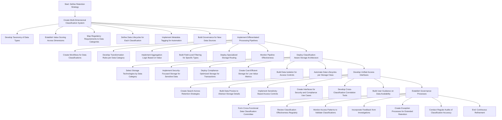

#### Detailed Steps:

1. **Create Multi-Dimensional Classification System**:
   - Develop a formal taxonomy of observability data types.
   - Establish value scoring across multiple dimensions (security, compliance, operations).
   - Map regulatory requirements to specific data categories.
   - Create data lifecycle definitions appropriate to each classification.
   - Implement metadata tagging to enable automated policy application.
   - Build governance processes for classifying new data sources.

2. **Implement Differentiated Processing Pipelines**:
   - Create separate processing workflows for different data classifications.
   - Develop appropriate transformation rules for each data category.
   - Implement custom aggregation logic based on data characteristics.
   - Build field-level filtering specific to data type and value.
   - Deploy specialized storage routing based on classification.
   - Create monitoring for pipeline processing effectiveness.

3. **Deploy Classification-Aware Storage Architecture**:
   - Select appropriate storage technologies for different data categories.
   - Implement security-focused storage for authentication and access data.
   - Deploy compliance-optimized storage for transaction records.
   - Create cost-efficient options for low-value operational metrics.
   - Build data isolation to support appropriate access controls.
   - Implement data lifecycle automation specific to each storage class.

4. **Develop Unified Access Interfaces**:
   - Create search capabilities that span different retention strategies.
   - Build data proxies that abstract storage details from users.
   - Implement appropriate access controls based on data sensitivity.
   - Create specialized interfaces for security and compliance use cases.
   - Develop cross-classification correlation capabilities.
   - Build user guidance on data availability expectations.

5. **Establish Governance Processes**:
   - Create a cross-functional data classification committee.
   - Develop regular reviews of classification effectiveness.
   - Implement monitoring of access patterns to validate classifications.
   - Build feedback loops from investigations to refine value assessments.
   - Create exception processes for extended retention needs.
   - Implement regular audits of classification accuracy.
## Panel 7: The Retention Testing Revolution
### Scene Description

The conference room is set up as a collaborative workspace, with multiple screens and dashboards prominently displayed to create an immersive demonstration environment. At the center of the room, the SRE team is presenting their retention strategy to auditors seated at a long table.

On the primary screen, a visualization shows how the retention system retrieves historical data across various timeframes. A timeline highlights data aggregation levels, with zoomed-in details illustrating how patterns from three-year-old data are still analyzable despite aggressive storage optimizations.

To the side, another team member operates a terminal displayed on a secondary screen, running a randomly selected compliance query against archived logs. The result appears promptly, confirming the system's ability to retrieve required information accurately and efficiently.

A third screen shows the cost dashboards, where a bar chart comparison emphasizes massive storage savings achieved over time. Adjacent to this, a summary panel displays "green status" indicators across all audit validation checks, signaling full compliance and operational health.

Below is a text-based representation of the room setup:

```
+--------------------------------------------------+
| Primary Screen: Historical Data Visualization    |
|  - Timeline of retention tiers                  |
|  - Aggregation and pattern analysis             |
+--------------------------------------------------+

+----------------+       +-------------------------+
| Secondary      |       | Cost Dashboard Screen   |
| Screen:        |       |  - Bar charts: Savings  |
| Compliance     |       |  - Audit: Green checks  |
| Query Terminal |       +-------------------------+
+----------------+

Auditors seated at table, SRE team presenting and operating systems
```

This setup not only reinforces the robustness of the retention system but also highlights its ability to balance cost efficiency with full compliance assurance.
### Teaching Narrative
The final component of mature retention strategy is validation testing—systematically verifying that transformed and migrated data remains sufficient for its intended purposes. This process creates confidence that cost optimization hasn't compromised essential capabilities.

Leading organizations implement "retention fire drills" that test the full lifecycle of their observability data. These structured exercises verify that data remains accessible and usable as it transitions through different storage tiers and transformation processes. Common testing scenarios include compliance audit simulations, historical incident investigations, and long-term trend analyses.

The most important validation focuses on compliance capabilities—ensuring that regulatory requirements can be satisfied despite storage optimizations. This involves regularly exercising the exact query patterns that would be used during actual compliance audits or investigations. By demonstrating that optimized data still satisfies regulatory requirements, organizations can confidently implement aggressive cost-saving measures without compliance risk.

This validation-based approach completes the retention strategy lifecycle. Rather than making retention decisions based on fear and assumptions, we create feedback loops that continuously validate our approach. This evidence-based strategy allows for continuous refinement that balances cost optimization with capability preservation.
### Common Example of the Problem

A major financial services firm implemented an aggressive cost-optimization strategy for their observability data, including tiered storage, progressive aggregation, and selective retention policies. While the new approach dramatically reduced costs, it created significant anxiety among compliance teams who feared the transformed data wouldn't satisfy regulatory requirements.

When regulators announced an upcoming examination focusing on algorithmic trading activities, the compliance team panicked. They had never tested whether their optimized historical data could actually answer the specific questions regulators typically asked. This uncertainty led to a crisis of confidence, with some leaders advocating for an emergency restoration of full historical data at enormous cost and operational risk.

The situation exposed a critical gap in their retention strategy: despite sophisticated technical implementation, they lacked validation processes to verify that their optimized data still met business and regulatory needs. Without evidence that their approach worked, fear and uncertainty threatened to undermine their entire cost optimization strategy.

---

#### Key Takeaways and Checklist for Avoiding Similar Issues:

- **Understand Compliance Requirements:**
  - Identify the exact data types and query patterns regulators are likely to request.
  - Document regulatory needs to align with retention and transformation strategies.

- **Test Before Crisis:**
  - Regularly conduct "retention fire drills" to simulate compliance audits and validate data usability.
  - Include randomized compliance queries to ensure readiness under real-world conditions.

- **Establish Validation Processes:**
  - Implement systematic checks to confirm that optimized data remains accessible and usable.
  - Use feedback loops to continuously refine storage and transformation practices.

- **Maintain Confidence Through Evidence:**
  - Proactively demonstrate that cost-optimized data satisfies business and regulatory requirements.
  - Share validation results with stakeholders to build trust and reduce fear-driven decisions.

By addressing these areas, organizations can prevent crises of confidence, balance cost optimization with compliance, and ensure long-term retention strategies remain robust.
### SRE Best Practice: Evidence-Based Investigation

To ensure clarity and actionable guidance, the SRE team's validation approach can be broken down into distinct steps, each tied to specific goals. The following table summarizes the key components of their evidence-based investigation strategy:

| **Step**                                   | **Description**                                                                                             | **Goal**                                                                                 | **Output**                                                                                 |
| ------------------------------------------ | ----------------------------------------------------------------------------------------------------------- | ---------------------------------------------------------------------------------------- | ------------------------------------------------------------------------------------------ |
| **1. Regulatory Query Pattern Analysis**   | Collaborate with compliance teams to catalog and map regulatory queries to data elements and requirements.  | Build a concrete validation framework beyond abstract requirements.                      | Library of compliance queries, mapped to minimum data elements and query patterns.         |
| **2. Mock Audit Testing**                  | Simulate regulatory audits using automated test suites and blind compliance exercises.                      | Validate the system's ability to satisfy real-world compliance requirements.             | Metrics on query success rates, response times, and data completeness for audit scenarios. |
| **3. Historical Investigation Simulation** | Recreate past incidents to test troubleshooting capabilities using optimized data.                          | Confirm that incident response capabilities remain effective after data transformations. | Comparative analysis of investigation effectiveness between full and optimized datasets.   |
| **4. Comparison Analysis**                 | Perform side-by-side testing of original and optimized data to measure preservation accuracy.               | Quantify the impact of data transformations on analysis accuracy and completeness.       | Statistical reports showing result differences and transformation impacts.                 |
| **5. Continuous Validation Automation**    | Automate validation tests that run after each data transformation to detect anomalies and ensure integrity. | Create a continuous feedback loop for retention strategy effectiveness.                  | Dashboards with validation test pass rates and anomaly detection metrics over time.        |

To further clarify the process, the following flow diagram illustrates the evidence-based investigation lifecycle:

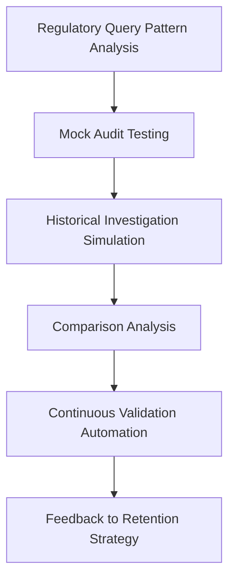

This structured approach ensures that every aspect of the retention strategy is systematically validated, providing measurable confidence that cost optimizations do not compromise critical capabilities.
### Banking Impact

The lack of retention validation created significant business impacts, leading to both operational and strategic challenges:

- **Compliance Uncertainty**  
  Without validation, the organization couldn't confidently assert that their retention strategies satisfied regulatory requirements, creating potential legal exposure.

- **Emergency Remediation Risk**  
  The last-minute panic before regulatory examinations created operational risk as teams attempted rushed data restorations or emergency changes.

- **Excessive Conservative Retention**  
  Fear of compliance failures led to maintaining unnecessarily complete data "just in case," undermining cost optimization efforts.

- **Innovation Paralysis**  
  Uncertainty about the impact of data transformations created resistance to implementing new optimization strategies.

- **Trust Deficit**  
  Business stakeholders lacked confidence in the observability platform's ability to provide historical insights, reducing adoption and utilization.

#### Summary: Business Impacts Flow

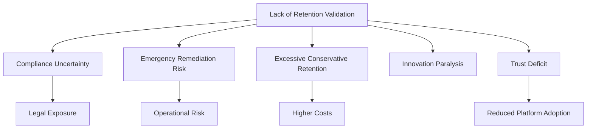
### Implementation Guidance
The team implemented a comprehensive retention validation framework:

1. **Establish Validation Test Suite**:
   - Create a comprehensive library of test queries covering key use cases
   - Develop validation scenarios for compliance, security, and operations
   - Implement automated test execution across all data tiers
   - Build result verification logic to compare against expected outcomes
   - Create performance benchmarks for query response times
   - Implement regular execution schedules for validation testing

2. **Implement Mock Examination Processes**:
   - Create realistic simulations of regulatory audits and examinations
   - Develop templates for common regulatory inquiry types
   - Build documentation of examination procedures and expectations
   - Implement randomized query selection to prevent optimization bias
   - Create formal evaluation criteria for mock audit success
   - Schedule regular mock examinations with appropriate stakeholders

3. **Deploy Continuous Validation Automation**:
   - Implement validation testing within the data lifecycle pipeline
   - Create automated verification after each transformation process
   - Build regression testing to ensure capabilities don't degrade over time
   - Develop anomaly detection for unexpected changes in query results
   - Create alerting for validation test failures
   - Implement remediation workflows when validation identifies issues

4. **Establish Control Dataset Methodology**:
   - Maintain representative sample data at full fidelity for comparison
   - Create statistical sampling approach to minimize control data volume
   - Implement automated comparison between control and transformed data
   - Develop significance testing to identify meaningful deviations
   - Build trend analysis of deviation patterns over time
   - Create documentation of acceptable deviation thresholds

5. **Develop Governance and Reporting**:
   - Create executive dashboards showing validation compliance
   - Implement regular stakeholder reviews of validation results
   - Build comprehensive documentation of testing methodology
   - Develop formal attestation processes for regulatory purposes
   - Create historical evidence preservation for validation results
   - Implement continuous improvement cycles based on validation findings