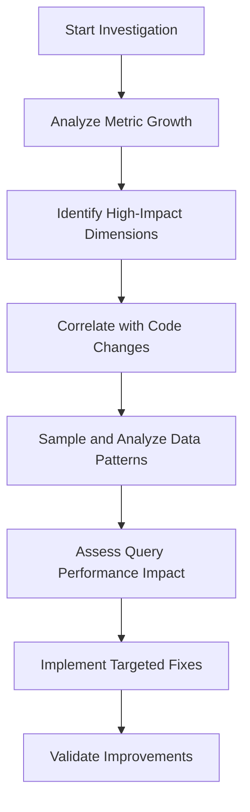
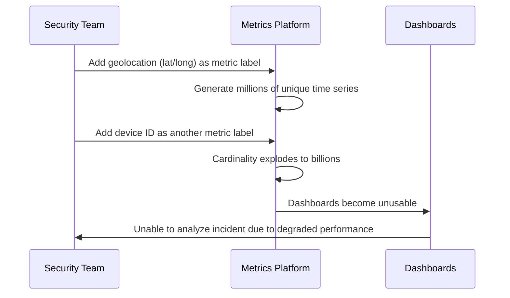
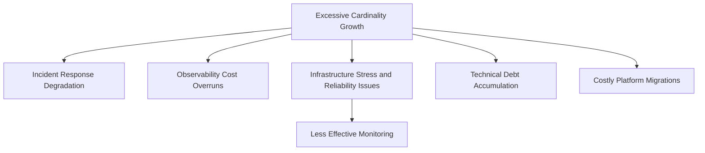
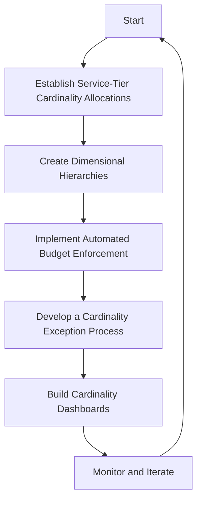
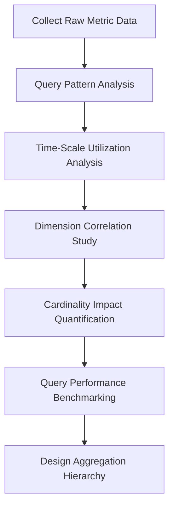
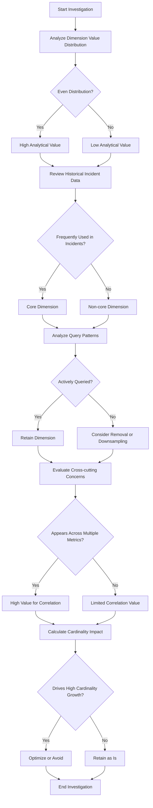
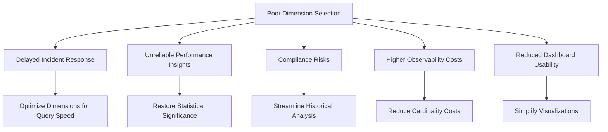
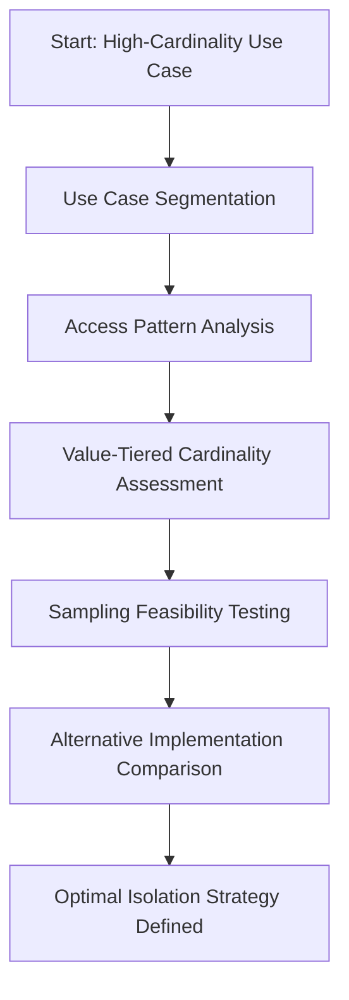
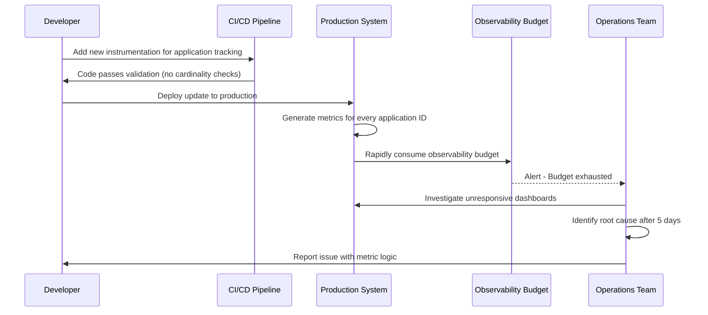

# Chapter 6: Cardinality Management


## Chapter Overview

Welcome to the metric minefield known as **Cardinality Management**. If you think logging customer IDs in your metrics is harmless, you’re about to learn otherwise—usually the hard way, like a CFO screaming about a monthly observability bill that rivals a small country’s GDP. This chapter is a guided tour through the Seven Circles of Cardinality Hell: dimension explosions, unbounded label traps, cost avalanches, and the kind of dashboard timeouts that make incident retrospectives especially spicy. In banking tech, a single rogue label can torch your budget and your monitoring reliability overnight. We’ll show you how to spot the warning signs, install real guardrails, and ensure your metrics platform doesn’t become the next root cause in a regulatory incident write-up.

## Learning Objectives

- **Identify** and **quantify** metric cardinality explosions before they nuke your observability platform.
- **Analyze** which dimensions are actually delivering value (versus just burning money).
- **Implement** preemptive guardrails and runtime protections to keep cardinality in check.
- **Establish** and **enforce** cardinality budgets that balance business needs with fiscal reality.
- **Design** aggregation hierarchies that keep metrics useful—without drowning in a sea of time series.
- **Strategize** dimension selection to maximize troubleshooting value and minimize query pain.
- **Isolate** legitimate high-cardinality use cases so they don’t take down the entire monitoring stack.
- **Automate** detection, alerting, and mitigation of cardinality anomalies—before management notices the bill.

## Key Takeaways

- Cardinality is the silent, exponential assassin of both your observability platform and your budget. Ignore it, and you’ll pay—literally.
- Every extra dimension is a loaded gun; unique IDs, precise coordinates, and anything resembling “session” or “transaction” are particularly eager to fire.
- Most “innovative” metric ideas are just expensive ways to make your dashboards unusable and your queries time out.
- Unbounded labels offer the analytical value of a black hole—devouring resources while giving almost nothing back.
- The more dimensions you add, the closer you are to needing a dedicated SRE just to explain your monitoring bill.
- Relying on manual review to catch cardinality problems is like relying on hope as an incident mitigation strategy. Automate or suffer.
- The best troubleshooting comes from 20% of your dimensions—ditch the rest unless you enjoy paying for irrelevant data.
- Special cases (like AML or fraud tracking) deserve their own padded cell: separate storage, sampling, and strict cost attribution. Don’t let them run wild.
- Without enforced cardinality budgets, cost overruns and platform-wide slowdowns are not “if” but “when.”
- Guardrails aren’t optional—they’re the difference between a minor hiccup and a five-figure incident post-mortem.
- Observability without cardinality discipline is just a ticking time bomb with a dollar sign on it.

## Panel 1: The Dimension Explosion
### Scene Description

A banking SRE team huddles around a massive dashboard covered in red alerts. Their manager bursts into the room waving an invoice. "Our observability costs just increased TEN TIMES overnight!"

On the screens, metrics graphs are frozen, with query times spiking uncontrollably. The team looks bewildered, scrolling through thousands of new metric combinations that appeared after yesterday's deployment. One engineer points to a small code change where a developer added customer account numbers as labels to every transaction metric.

Below is a simplified representation of the chaos on the dashboard:

```
+-------------------------------------------+
|              SYSTEM DASHBOARD             |
+-------------------------------------------+
| ALERTS:                                   |
|   - Critical: Metric storage exceeded!    |
|   - Warning: Query times at 5000ms+!      |
|   - Critical: Budget threshold breached!  |
+-------------------------------------------+
| METRIC GRAPHS:                            |
|   [X] Throughput: Frozen                  |
|   [X] Latency: Frozen                     |
|   [X] Errors: Frozen                      |
+-------------------------------------------+
| QUERY RESULTS:                            |
|   Metric combinations: 2,456,783          |
|   Query time: 6,732ms                     |
+-------------------------------------------+
| RECENT CHANGES:                           |
|   - Added dimension `customer_account_id` |
+-------------------------------------------+
```
### Teaching Narrative
Cardinality is the silent killer of observability budgets and performance. In the metrics world, cardinality refers to the number of unique time series being tracked. A single metric like `http_requests_total` is just one time series. But add a dimension like `status_code` with 5 possible values, and you now have 5 time series. Add another dimension like `endpoint` with 10 values, and you now have 5 × 10 = 50 time series. Each dimension multiplies the number of time series exponentially.

In banking systems, the temptation to add high-cardinality dimensions is particularly strong. Customer IDs, account numbers, transaction IDs - these unique identifiers create millions or billions of unique time series when added as labels. What starts as a simple change – "Let's track performance by customer ID" – can explode overnight into millions of unique time series, overwhelming your observability platform and exploding costs.

The core challenge of cardinality management is balancing the value of dimensional data against its exponential cost. Every dimension you add multiplies your metric count, storage requirements, and ultimately, your observability bill. Unlike logs which scale linearly with volume, metrics with high cardinality dimensions scale multiplicatively, making them particularly dangerous from a cost perspective.
### Common Example of the Problem

A global bank's fraud detection system was experiencing slower alert response times, affecting customer transactions. To improve detection capabilities, a well-intentioned developer added customer account numbers as a label to every transaction validation metric. The logic seemed sound: tracking metrics at the individual account level would help identify targeted fraud attempts against specific customers.

However, this seemingly harmless change triggered a cardinality explosion. Within 24 hours of deployment, the bank's observability costs skyrocketed tenfold, from $30,000 to $300,000 per month. Dashboard queries that previously completed in seconds now took minutes or timed out entirely. The system was tracking over 50 million unique time series, as the customer account dimension (with 8 million possible values) multiplied against other existing dimensions like transaction type, merchant category, and geographic region.

The breakdown of the multiplication that led to 50 million time series is as follows:

| Dimension            | Number of Unique Values |
| -------------------- | ----------------------- |
| Customer Account IDs | 8,000,000               |
| Transaction Types    | 10                      |
| Merchant Categories  | 50                      |
| Geographic Regions   | 125                     |

**Total Time Series:**  
`8,000,000 × 10 × 50 × 125 = 50,000,000`

When senior leadership questioned the cost spike, they discovered no one on the fraud team had anticipated the cardinality explosion. The developer had simply added the `account_id` label to the metrics without understanding the multiplicative effect on the underlying time series database. This incident highlights the critical importance of carefully managing high-cardinality dimensions to avoid unintended consequences.
### SRE Best Practice: Evidence-Based Investigation

When facing a potential cardinality explosion, SREs should conduct a systematic investigation to identify the root cause and quantify the impact. The following checklist summarizes the key steps to guide your investigation:

#### Investigation Checklist

1. **Metric Growth Analysis**
   - Use platform-specific tools like cardinality explorers or time series counters.
   - Identify metrics with the highest growth in unique combinations.

2. **Dimension Contribution Analysis**
   - Examine affected metrics to determine which dimensions contribute most to cardinality.
   - Look for high-cardinality fields such as customer IDs, session IDs, or free-form text fields added as labels.

3. **Code Change Correlation**
   - Review recent deployments for changes to instrumentation code.
   - Trace cardinality increases to specific code changes, especially those involving new or expanded label sets.

4. **Data Sampling**
   - Extract a sample of unique label combinations from high-cardinality metrics.
   - Analyze the sample for patterns, ensuring each dimension adds meaningful analytical value.

5. **Query Impact Assessment**
   - Compare query execution times before and after the cardinality spike.
   - Quantify the operational impact to prioritize remediation based on performance degradation and cost.

#### Process Flow Overview


By following this structured approach, SRE teams can precisely pinpoint the root cause of cardinality explosions and take evidence-based actions. This minimizes the need for broad instrumentation reductions while addressing both performance and cost concerns. Banking teams, for example, have successfully used this method to identify problematic code commits and resolve issues efficiently.
### Banking Impact

The business impact of cardinality explosions in banking environments extends far beyond direct observability costs. Below is a concise summary of the five key impacts, accompanied by a text-based representation to emphasize the cascading effects:

#### Summary of Impacts:
1. **Real-time Decision Delays**:
   - Query performance degrades with high-cardinality metrics.
   - Example: Dashboard loading times increased from 2 seconds to 45+ seconds, disrupting fraud detection and real-time credit decisioning.

2. **Incident Response Degradation**:
   - Overloaded metrics systems can become unresponsive during critical incidents.
   - Example: A payment processor faced a 30-minute resolution delay when dashboards failed during an outage.

3. **Platform-wide Reliability Impact**:
   - Cardinality explosions in one system ripple across the observability platform, affecting unrelated services.
   - Example: A mortgage system's cardinality spike degraded trading platform monitoring.

4. **Unexpected Budget Overruns**:
   - Sudden, exponential cardinality growth leads to financial shocks.
   - Example: A $700,000 cost overrun disrupted a bank's quarterly technology budget due to a single high-cardinality metric.

5. **Reduced Innovation Velocity**:
   - Overly restrictive governance post-incident stifles legitimate instrumentation improvements.
   - Example: Teams hesitate to innovate safely after experiencing a cardinality-related cost shock.

#### Text Diagram of Ripple Effects:
```
High Cardinality Introduced
         │
         ▼
  Query Performance Degrades
         │
         ▼
  Incident Response Fails
         │
         ▼
  Platform-wide Reliability Issues
         │
         ▼
   Budget Overruns & Governance Clamps
         │
         ▼
  Reduced Innovation Velocity
```

This cascading chain of impacts underscores the critical importance of proactive cardinality management in banking observability systems.
### Implementation Guidance

To prevent cardinality explosions in banking environments, follow these five actionable steps:

1. **Implement Cardinality Analysis in CI/CD**: Add automated checks to your deployment pipeline that identify potentially problematic cardinality increases before they reach production. For example, you can use Prometheus's cardinality analyzer or a custom script. Below is a sample script for a CI/CD pipeline step to flag high-cardinality metrics:

   ```python
   import json

   def analyze_cardinality(metrics_file, threshold=10000):
       with open(metrics_file, 'r') as f:
           metrics = json.load(f)

       high_cardinality_metrics = []
       for metric_name, labels in metrics.items():
           unique_combinations = len(set(tuple(sorted(label.items())) for label in labels))
           if unique_combinations > threshold:
               high_cardinality_metrics.append((metric_name, unique_combinations))

       return high_cardinality_metrics

   # Example usage
   problematic_metrics = analyze_cardinality('metrics.json', threshold=10000)
   if problematic_metrics:
       print("High-cardinality metrics detected:")
       for metric, count in problematic_metrics:
           print(f"{metric}: {count} unique combinations")
       exit(1)  # Fail the pipeline
   else:
       print("All metrics are within acceptable cardinality limits.")
   ```

   In this example, replace `metrics.json` with a file containing your metrics and their labels in JSON format. Adjust the `threshold` value to your organization's acceptable cardinality limit.

2. **Establish Label Standards**: Create explicit documentation defining which dimensions are appropriate for different metric types. For example, standardize that customer identifiers should never be used as metric labels but instead should be captured in logs or traces. An example policy might look like:

   ```
   - Allowed labels: endpoint, status_code, region, service_name
   - Prohibited labels: customer_id, transaction_id, account_number
   ```

3. **Create Hierarchical Dimensions**: Replace high-cardinality fields with hierarchical alternatives. Instead of using individual customer IDs, create customer segments or risk tiers as labels. For instance:

   - Instead of: `customer_id=12345`
   - Use: `customer_segment=premium`

   Similarly, for transaction amounts:
   - Instead of: `transaction_id=abc123`
   - Use: `transaction_band=101-1000`

4. **Implement Runtime Cardinality Limiters**: Deploy middleware components that can automatically detect and prevent cardinality explosions at runtime. Use a runtime limiter to enforce caps on unique label combinations and log warnings when thresholds are exceeded. Here's a pseudocode example:

   ```
   function enforce_cardinality(metric_name, labels, max_cardinality):
       label_combination = hash(labels)
       if label_combination not in allowed_combinations[metric_name]:
           if len(allowed_combinations[metric_name]) >= max_cardinality:
               log_warning(f"Cardinality limit exceeded for {metric_name}")
               return false
           allowed_combinations[metric_name].add(label_combination)
       return true
   ```

   Integrate this logic into your monitoring library to dynamically manage cardinality limits.

5. **Establish Review Thresholds**: Create governance processes requiring explicit review for any metric expected to exceed a certain cardinality threshold (e.g., 10,000 unique time series). For example, add a checklist item to code reviews:

   ```
   - [ ] Have all new metrics been evaluated for potential cardinality issues?
   - [ ] Do any metrics exceed the cardinality review threshold (e.g., 10,000 unique time series)?
   If yes, provide justification and obtain approval from the observability team.
   ```

By implementing these steps, you can proactively manage cardinality, preventing costly and disruptive explosions in metrics volume while maintaining valuable observability data.
## Panel 2: The Unbounded Label Trap
### Scene Description

Two SREs are investigating why their metrics platform keeps crashing. On a whiteboard, they've drawn a flowchart to trace the problem:

```
Metrics Platform Crash
         |
         v
   High Cardinality
         |
  -------------------
  |                 |
Fraud Detection   Geolocation Labels
Service            (Precise Coordinates)
(Adding            "37 billion unique
Transaction IDs)   combinations!")
```

Meanwhile, a developer is actively demonstrating a new feature that adds geolocation data down to precise coordinates as metric labels. The SRE's eyes widen in horror as she calculates the cardinality: "That's potentially 37 billion unique combinations for a single metric!"

Nearby, a monitor displays the budget dashboard. A bold red warning flashes: costs are rapidly approaching the monthly limit — and it's only the 3rd day of the month.
### Teaching Narrative
The most dangerous label is the unbounded one – a dimension with potentially unlimited unique values. While adding country codes (with roughly 200 possible values) creates manageable cardinality, adding fields like User IDs, Session IDs, or precise coordinates creates effectively infinite cardinality. In banking systems, transaction IDs alone can generate billions of unique values annually.

Unbounded labels create multiple critical problems. First, they overwhelm the indexed databases that power observability platforms, causing performance degradation or outright crashes. Second, they generate enormous storage costs as each unique combination must be indexed and stored separately. Third, they make visualization and alerting nearly impossible as dashboards attempt to render millions of time series. Finally, they make queries extremely slow and resource-intensive, hampering your ability to troubleshoot during outages.

The irony is that unbounded labels rarely provide useful aggregate insights. While it might seem valuable to track metrics by individual customer ID, the resulting data is often too granular for practical use in dashboards or alerts. The proper approach is to use logs or traces for instance-specific details while keeping metrics focused on aggregatable dimensions with bounded cardinality.
### Common Example of the Problem

A major investment bank deployed a new mobile trading application with enhanced location-based security features. To monitor potential geographical fraud patterns, the security team instrumented the authentication service to track login attempts with detailed geolocation data. Rather than using country or city-level locations, they added latitude and longitude coordinates with six decimal places of precision as metric labels.

The result was catastrophic. Each unique geographic coordinate created a separate time series. With customers logging in from millions of distinct locations, the cardinality expanded to over 20 million unique time series within days. Query performance degraded to the point where security analysts couldn't use the dashboards during an actual security incident, rendering the entire monitoring system ineffective when it was most needed.

What made the situation worse was that the team had simultaneously added user device identifiers as another label, creating a multiplicative effect. The combination of precise geolocation and device IDs created a theoretical combinatorial space in the billions, though only millions were actually realized before emergency measures were implemented.

#### Sequence of Events



This timeline highlights how seemingly minor design choices, like adding highly granular labels, can rapidly spiral into an unmanageable cardinality explosion. Each step compounded the problem, ultimately leading to a system failure at a critical moment.
### SRE Best Practice: Evidence-Based Investigation

When confronting unbounded labels, a structured investigation approach helps identify and remediate the issue. Use the following checklist to guide your investigation:

| **Step**                               | **Description**                                                                                                                      | **Example/Tool**                                                                                         |
| -------------------------------------- | ------------------------------------------------------------------------------------------------------------------------------------ | -------------------------------------------------------------------------------------------------------- |
| **1. Cardinality Discovery**           | Identify the highest-cardinality label combinations in your metrics.                                                                 | Use Prometheus query: `count({__name__=~".+"}) by (__name__)` to find metrics with high series counts.   |
| **2. Label Distribution Analysis**     | Analyze the distribution of values for high-cardinality labels. Look for patterns like frequent small subsets vs. a long tail.       | Identify labels with rare, unique values (e.g., transaction IDs) causing disproportionate series growth. |
| **3. Value Range Testing**             | Sample unique values for suspected unbounded labels to confirm their range and behavior.                                             | Check ID generation patterns for uniqueness or GPS coordinate precision for unnecessary granularity.     |
| **4. Utilization Analysis**            | Investigate how high-cardinality dimensions are used in dashboards or alerts. Remove unused labels.                                  | Audit existing visualizations—are these labels actionable or just adding noise and cost?                 |
| **5. Alternative Source Verification** | Verify if the high-cardinality data already exists in logs or traces, which are better suited for storing instance-specific details. | Check if logs or tracing systems already capture user/session details, reducing the need for metrics.    |

#### Summary Table: Indicators of Unbounded Label Issues
| **Indicator**                                           | **Impact**                                                                               |
| ------------------------------------------------------- | ---------------------------------------------------------------------------------------- |
| Labels include IDs, precise coordinates, or timestamps. | Extremely high cardinality leads to performance degradation and storage cost explosions. |
| Dashboards or alerts fail to utilize certain labels.    | Labels are generating cost without providing actionable insights.                        |
| Labels represent instance-specific data.                | Better suited for logs or traces rather than metrics.                                    |

Financial institutions that apply this structured approach often find unbounded labels provide little operational value while incurring disproportionate costs and performance impacts. Prioritizing bounded, aggregatable dimensions ensures a more efficient and sustainable observability strategy.
### Banking Impact

Unbounded labels create severe and far-reaching business impacts in banking environments, extending well beyond the technical issues of observability platforms. The key consequences are summarized below:

| **Impact Area**                     | **Description**                                                                                                                                       | **Example**                                                                                                                                   |
| ----------------------------------- | ----------------------------------------------------------------------------------------------------------------------------------------------------- | --------------------------------------------------------------------------------------------------------------------------------------------- |
| **Security Response Degradation**   | Query times for dashboards can increase drastically, delaying fraud investigation and security response.                                              | Dashboard queries for a bank's security team increased from sub-second to over two minutes during a breach investigation.                     |
| **Regulatory Reporting Failures**   | Overloaded metrics systems can lead to failures during critical compliance reporting periods, risking fines and legal penalties.                      | A bank missed a regulatory deadline when its risk reporting system failed due to excessive cardinality.                                       |
| **Critical System Visibility Loss** | Observability platform crashes result in a loss of monitoring for core banking systems, impacting transaction processing and operational oversight.   | A payment processor experienced a complete observability blackout during a major shopping event due to cardinality-induced database failures. |
| **Escalating Technology Costs**     | Exponential growth in observability costs due to unbounded labels increases financial strain, especially as scale grows.                              | One financial institution saw their observability costs balloon from $50,000 to $800,000 per month in a single quarter.                       |
| **Development Velocity Impact**     | Stricter governance policies introduced after cardinality issues can hinder development agility, slowing the release of legitimate business features. | Teams faced deployment delays as they navigated complex label restrictions implemented post-incident.                                         |

By understanding these impacts, banking institutions can prioritize cardinality management and avoid the cascading effects of unbounded labels on their operations and compliance obligations.
### Implementation Guidance

To avoid the unbounded label trap in banking systems, implement these five specific actions with practical examples:

1. **Create Label Cardinality Classification**:  
   Develop a formal classification system for label types based on their cardinality characteristics. Categories should include:
   - **Fixed cardinality**: Status codes (e.g., `200`, `404`, `500`).
   - **Bounded cardinality**: Country codes (e.g., `US`, `FR`, `JP` - ~200 possible values).
   - **High cardinality**: Service versions (e.g., `v1.0.0`, `v1.1.2`, etc.).
   - **Unbounded cardinality**: User IDs, session IDs, or timestamps.  
     Example in Python for classification logic:

   ```python
   def classify_label(label_name, label_values):
       if len(label_values) <= 10:
           return "Fixed cardinality"
       elif len(label_values) <= 200:
           return "Bounded cardinality"
       elif len(label_values) <= 10_000:
           return "High cardinality"
       else:
           return "Unbounded cardinality"
   ```

2. **Implement Label Validation Hooks**:  
   Add pre-commit and CI/CD hooks to scan metric definitions for unbounded label patterns. Example using a CI configuration with a Python script to reject invalid labels:

   ```python
   import re

   def validate_labels(metric_name, labels):
       unbounded_patterns = [r".*_id$", r".*_timestamp$", r"^geo_.*"]
       for label in labels:
           for pattern in unbounded_patterns:
               if re.match(pattern, label):
                   raise ValueError(f"Invalid label '{label}' in metric '{metric_name}'")

   # Example usage
   try:
       validate_labels("transaction_metric", ["user_id", "geo_coordinates"])
   except ValueError as e:
       print(e)  # Output: Invalid label 'user_id' in metric 'transaction_metric'
   ```

   Integrate this script into a CI pipeline to ensure only valid metrics are deployed.

3. **Deploy Runtime Cardinality Limiters**:  
   Implement middleware to cap unique values for any dimension during runtime. For example:

   ```python
   from collections import defaultdict

   cardinality_limits = defaultdict(lambda: 100)  # Default limit for all labels

   def enforce_cardinality(metric_name, label, value, seen_values):
       if len(seen_values[label]) >= cardinality_limits[label]:
           return "other"  # Replace with an "other" category
       seen_values[label].add(value)
       return value

   # Example enforcement
   seen_values = defaultdict(set)
   enforce_cardinality("request_metric", "user_id", "12345", seen_values)
   ```

4. **Create Domain-Specific Aggregation Rules**:  
   Define aggregation strategies for high-cardinality fields. Example: converting precise geolocation to region-level granularity.

   ```python
   def aggregate_geolocation(lat, lon):
       # Example: bucket coordinates into city-level granularity
       return round(lat, 1), round(lon, 1)

   # Original coordinates
   lat, lon = 37.7749, -122.4194  # San Francisco
   aggregated_lat, aggregated_lon = aggregate_geolocation(lat, lon)
   print(aggregated_lat, aggregated_lon)  # Output: 37.8, -122.4
   ```

   Use similar techniques to hash IDs into buckets or discretize continuous values into ranges.

5. **Develop Alternative Capture Mechanisms**:  
   Redirect high-cardinality data to logs or traces. Example: Log user-specific details while metrics remain aggregated.

   ```python
   # Metric: Aggregated by region
   increment_metric("transactions", {"region": "us-west"})

   # Log: Specific user details
   log_event("transaction_detail", {"user_id": "12345", "amount": 100.50})
   ```

   Establish clear documentation and instrumentation patterns for when to use metrics, logs, or traces.
## Panel 3: The Cardinality Budget
### Scene Description

The setting is a virtual war room where a financial services platform team is actively establishing governance rules. At the center of attention is a large screen displaying two key visuals:

1. **Hierarchy of Dimensions**  
   A structured hierarchy outlines the allowed dimensions for metrics, flowing from coarse-grained to fine-grained levels. Below is a text-based representation of the hierarchy:
   ```
   Region
      └── Data Center
           └── Service
                └── Endpoint
                     └── Status
   ```
   Each level adds meaningful segmentation while maintaining manageable cardinality.

2. **Cardinality Budget Dashboard**  
   A dashboard visualizes each service's cardinality usage as a percentage of their allocated "cardinality budget." The dashboard is segmented into three categories:
   - **Efficient Services**: Clearly within their budget, shown in green with ample room for new instrumentation.
   - **At Risk Services**: Close to their limit, shown in yellow, prompting careful evaluation of new metrics.
   - **Over-Budget Services**: Highlighted in red, such as a poorly-designed fraud detection service currently at 250% of its allocation. For these services, an automated warning system is actively preventing new deployments until cardinality is reduced.

The governance lead points to these visuals while explaining how automated enforcement mechanisms, integrated into CI/CD pipelines, ensure teams prioritize actionable dimensions without exceeding their budgets. This collaborative environment fosters a culture of cost-effective and meaningful observability.
### Teaching Narrative
Just as financial institutions implement strict budget controls, effective observability requires establishing cardinality budgets. A cardinality budget establishes the maximum number of unique time series each service or team can create. This forces teams to prioritize which dimensions truly deliver value and discourages the casual addition of high-cardinality labels.

Implementing cardinality budgets requires understanding the natural hierarchy of dimensions in your system. In banking applications, this hierarchy typically flows from coarse-grained to fine-grained: region → data center → service → endpoint → status. Each level adds meaningful segmentation while keeping cardinality manageable. The key is determining which dimensions provide actionable insights for troubleshooting and business understanding versus those that merely explode cardinality.

Effective governance requires not just establishing these budgets, but implementing automated enforcement through validation in CI/CD pipelines. By automatically detecting when new code would exceed cardinality limits, you prevent cost explosions before they reach production. This approach balances development velocity with cost control by embedding cardinality awareness into your engineering culture.
### Common Example of the Problem

A multinational bank's online banking platform experienced continuous growth in observability costs despite stable user numbers. Investigation revealed that teams were independently adding new dimensions to metrics without considering the aggregate impact.

Below is a summary of the dimensions added by each team and their respective cardinality contributions:

| Team           | Dimension              | Unique Values | Cumulative Cardinality Impact |
| -------------- | ---------------------- | ------------- | ----------------------------- |
| Retail Banking | Customer Segments      | 50            | 50                            |
|                | Account Types          | 15            | 750                           |
|                | Enrollment Channels    | 10            | 7,500                         |
| Security       | Authentication Methods | 8             | 60,000                        |
|                | Device Types           | 25            | 1,500,000                     |
|                | Risk Score Bands       | 10            | 15,000,000                    |
| Mobile App     | App Versions           | 20            | 300,000,000                   |
|                | Operating Systems      | 5             | 1,500,000,000                 |

The multiplicative effect created over 1.5 billion unique time series from what started as simple authentication status metrics. Each team's addition seemed reasonable in isolation, but collectively they created unsustainable cardinality growth. With no governance mechanism to track or limit the aggregate cardinality, costs increased 300% year-over-year while query performance degraded dramatically.

When an incident affected customer login systems, engineers struggled to identify patterns because dashboard queries timed out, extending the mean time to resolution by over 40 minutes compared to previous similar incidents.
### SRE Best Practice: Evidence-Based Investigation

Implementing effective cardinality budgets requires data-driven analysis and actionable tools. Below are step-by-step practices, enriched with examples and code snippets to help you apply these concepts effectively:

1. **Baseline Cardinality Measurement**: Start by establishing current cardinality baselines for each service using your observability platform. For Prometheus, you can use the following query to count unique time series for a service:
   ```promql
   count({service="payment-gateway"})
   ```
   To break this down further by specific dimensions, for example by `region`, modify the query:
   ```promql
   count by (region) ({service="payment-gateway"})
   ```
   These queries help identify where cardinality is concentrated, providing a foundation for further analysis.

2. **Value-Impact Analysis**: Evaluate the operational value of high-cardinality dimensions by reviewing their usage in dashboards and alerts. For example, you can query Prometheus to determine how often a specific label combination is queried:
   ```promql
   topk(10, count by (endpoint, status) ({service="payment-gateway"}))
   ```
   Document findings to differentiate between dimensions that drive actionable insights and those that only contribute to cardinality growth.

3. **Service Criticality Mapping**: Assign cardinality budgets based on the business criticality of each service. For instance, prioritize higher budgets for services like `payment-processing` over non-critical services like `internal-messaging`. Use a table like the one below to guide allocations:

   | Service            | Business Criticality | Suggested Cardinality Budget |
   | ------------------ | -------------------- | ---------------------------- |
   | Payment Processing | High                 | 2,000 time series            |
   | Fraud Detection    | Medium               | 1,500 time series            |
   | Internal Messaging | Low                  | 500 time series              |

4. **Dimension Effectiveness Review**: Use historical incident data to identify which dimensions contributed to effective troubleshooting. Incorporate these insights into your governance process. For example:
   - If the `customer_id` label appears in 5% of queries but generates 90% of cardinality, consider removing it unless explicitly required for debugging.
   - Focus on dimensions like `status` or `endpoint` that frequently appear in incident investigations.

   Here's a sample analysis workflow in Python using Prometheus API data:
   ```python
   import requests

   # Fetch time series data
   response = requests.get("http://prometheus-server/api/v1/series", params={"match[]": '{service="payment-gateway"}'})
   series = response.json()["data"]

   # Analyze dimension usage
   dimension_usage = {}
   for s in series:
       for key in s.keys():
           dimension_usage[key] = dimension_usage.get(key, 0) + 1

   # Sort dimensions by usage
   sorted_usage = sorted(dimension_usage.items(), key=lambda x: x[1], reverse=True)
   print("Top dimensions by usage:", sorted_usage[:10])
   ```

5. **Comparative Benchmark Analysis**: Benchmark cardinality metrics against industry standards or internal targets. Financial services organizations often aim for 500–2,000 time series per service for standard instrumentation. Use Prometheus queries to monitor adherence to these goals:
   ```promql
   sum(count({})) by (service)
   ```
   Visualize this data in a dashboard to track which services are within or exceeding their cardinality budgets.

   Example of a simplified cardinality budget dashboard representation:
   ```plaintext
   +----------------+-------------------+-------------------+
   | Service        | Current Usage    | Budget Allocation |
   +----------------+-------------------+-------------------+
   | Payment Gateway| 1,800 time series| 2,000 time series |
   | Fraud Detection| 3,000 time series| 1,500 time series |
   | Internal Msg   | 450 time series  | 500 time series   |
   +----------------+-------------------+-------------------+
   ```

SREs who apply this evidence-based approach consistently find that 80% of troubleshooting value comes from about 20% of dimensions. By combining baseline measurements, historical analysis, and benchmarks, you can allocate cardinality budgets effectively while maintaining operational visibility.
### Banking Impact

Uncontrolled cardinality growth creates significant business impacts in banking environments. Below is a summary of the key effects:

- **Incident Response Degradation**:
  - Increased cardinality slows down dashboard performance.
  - Directly impacts incident resolution times, with one retail bank reporting a 35% increase in mean time to resolution for customer-facing incidents due to observability performance issues.

- **Observability Cost Overruns**:
  - Cardinality growth often outpaces transaction growth, driving exponential cost increases.
  - Example: A payment processor experienced observability costs growing at 4x the rate of transaction growth over two years, leading to reduced monitoring coverage during critical business growth periods.

- **Platform Reliability Reduction**:
  - Excessive cardinality stresses the observability infrastructure, causing issues such as:
    - Larger instance sizes.
    - Cluster sprawl.
    - Frequent scaling events.
  - Paradoxically, this results in less effective monitoring despite increased instrumentation.

- **Technical Debt Accumulation**:
  - Lack of governance leads to inconsistent and redundant dimensions across services.
  - This creates confusing, overlapping metrics that are difficult for future teams to understand and maintain.

- **Observability Platform Migrations**:
  - Unchecked cardinality growth forces costly and risky migrations to new monitoring platforms.
  - These migrations can cost millions and introduce significant operational risk, as seen in several financial institutions.

#### Cardinality Impact Flow



By proactively managing cardinality, banking institutions can avoid these costly impacts and ensure their observability systems scale effectively with business growth.
### Implementation Guidance

To implement effective cardinality budgets in banking environments, follow these five steps. Use the checklist or flowchart below to guide your process.

#### Checklist for Cardinality Budget Implementation:

- [ ] **Establish Service-Tier Cardinality Allocations**
  - Define tiers based on service criticality.
  - Assign budgets, e.g., Tier 1: 5,000 time series, Tier 2: 2,000, Tier 3: 1,000.
  - Communicate allocations to teams.

- [ ] **Create Dimensional Hierarchies**
  - Identify standard dimensions for each domain (e.g., payments, accounts).
  - Define hierarchies: region → data center → service → endpoint → status.
  - Document and maintain hierarchies in a central registry.

- [ ] **Implement Automated Budget Enforcement**
  - Integrate cardinality validation into CI/CD pipelines.
  - Ensure pipelines estimate the cardinality impact of proposed changes.
  - Block deployments exceeding budgets without explicit exception approval.

- [ ] **Develop a Cardinality Exception Process**
  - Define a formal process for approving exceptions.
  - Include technical reviews, cost-benefit analyses, and time-limited approvals.
  - Schedule reevaluations for approved exceptions.

- [ ] **Build Cardinality Dashboards**
  - Create dashboards showing usage by service, team, and application.
  - Include current usage, historical trends, and growth projections.
  - Enable proactive management to prevent budget overruns.

#### Flowchart for Cardinality Budget Implementation:



By following this structured approach, teams can effectively manage cardinality budgets, ensuring observability remains cost-efficient and scalable.
## Panel 4: The Aggregation Hierarchy
### Scene Description

An architect is leading a design review for a new payment gateway system's metrics design. On a whiteboard, she's created a pyramid diagram illustrating metric aggregation levels. The diagram is structured as follows:

```
    +-----------------------------+
    | Highly Aggregated SLIs      |
    | (e.g., Overall System Health|
    | Metrics)                    |
    +-----------------------------+
              ▲
              |
    +-----------------------------+
    | Aggregated Metrics          |
    | (e.g., Payment Processor,   |
    | Country, Response Code)     |
    +-----------------------------+
              ▲
              |
    +-----------------------------+
    | Raw Customer Transaction    |
    | Events (Logs)               |
    +-----------------------------+
```

At the pyramid's wide base are customer transaction events flowing into logs. In the middle tier, these events are aggregated into bounded-cardinality metrics with key dimensions like payment processor, country, and response code. At the narrow top are highly aggregated SLIs tracking overall system health.

Next to this, a developer has sketched how these metrics can be automatically rolled up into increasingly aggregated forms for longer-term storage. The focus is on balancing granularity and retention to ensure efficient analysis and storage optimization over time.
### Teaching Narrative

The antidote to cardinality explosion is strategic aggregation. Rather than tracking everything at the finest granularity, effective metric design creates an aggregation hierarchy that captures insights at multiple levels of detail. This approach recognizes that the value of granular data diminishes over time, while the cost of storing it remains constant.

A well-designed aggregation hierarchy starts with collecting detailed event data in logs or traces. These events are then aggregated into metrics with carefully selected dimensions that balance analytical power against cardinality. For banking systems, this typically means aggregating individual transactions into metrics by service, endpoint, status, and perhaps customer segment – but not individual customer ID.

This aggregation hierarchy should extend to storage retention as well. Recent metrics may retain moderate dimensionality for detailed troubleshooting, while older data is progressively aggregated to reduce storage costs.

Below is a summarized text-based diagram of a typical aggregation hierarchy and retention strategy:

```
Aggregation Level         | Dimensions Retained            | Example Granularity | Retention Period
--------------------------|--------------------------------|---------------------|-----------------
Raw Event Logs            | All raw data                  | Event-level         | < 7 days
Moderately Aggregated     | Service, Endpoint, Status     | Per-minute          | 7 days
Highly Aggregated         | Service-level only            | Per-hour            | 30 days
Long-term Aggregation     | Minimal dimensions            | Per-day             | > 30 days
```

For example, per-minute metrics with endpoint and status code dimensions might be stored for 7 days, then aggregated to hourly metrics with only service-level dimensions for 30 days, and finally to daily metrics with minimal dimensions for longer retention. This structured approach ensures both analytical utility and cost efficiency over time.
### Common Example of the Problem

A global bank's trade processing platform was suffering from both performance issues and unsustainable observability costs. Investigation revealed they were storing individual trade-level metrics with high dimensionality for all historical data. The table below summarizes the problematic dimensions, their impact, and the resulting costs:

| Dimension      | Description                               | Impact                                | Resulting Costs                    |
| -------------- | ----------------------------------------- | ------------------------------------- | ---------------------------------- |
| Trader ID      | Unique identifier for each trader         | Extremely high cardinality            | 50M+ unique time series            |
| Customer ID    | Unique identifier for each customer       | Massive growth in metrics storage     | Increased query timeouts           |
| Instrument ID  | Identifier for financial instruments      | Complicated queries across dimensions | Ineffective historical analysis    |
| Currency Pairs | All combinations of traded currency pairs | Exponential increase in combinations  | $450,000/month observability costs |

This approach created over 50 million unique time series with full retention, making historical analysis practically impossible due to query timeouts. For example, when regulators requested a comparison of trade execution performance across regions for the past year, the analysis took over 48 hours to complete, and the resulting visualizations were too complex to interpret effectively.

The fundamental issue was treating metrics as a high-fidelity event store rather than using them for their intended purpose: providing aggregated views of system behavior that enable pattern identification and trend analysis.
### SRE Best Practice: Evidence-Based Investigation

To develop effective aggregation hierarchies, SREs should conduct evidence-based analysis. This ensures that metric design aligns with actual usage patterns and optimizes for both cost and performance. Use the following checklist to guide your investigation:

#### **Checklist for Evidence-Based Investigation**
1. **Query Pattern Analysis**:
   - Review actual query patterns against metrics.
   - Identify which dimensions and levels of granularity are most queried.
   - Example: On a trading platform, determine if queries focus on instrument-level metrics or aggregate data like currency pairs or markets.

2. **Time-Scale Utilization Analysis**:
   - Document how metric usage evolves as data ages.
   - Identify high-granularity needs for recent data (e.g., 0-24 hours) versus coarse granularity for older data.
   - Verify if trend analysis dominates queries for older data.

3. **Dimension Correlation Study**:
   - Analyze which dimensions are frequently queried together versus independently.
   - Identify natural groupings or hierarchies among dimensions.
   - Example: In payment systems, confirm if dimensions like currency, country, and payment method are often queried together.

4. **Cardinality Impact Quantification**:
   - Calculate the storage and performance costs of different aggregation strategies.
   - Assess the cardinality reduction achievable while maintaining required analytical capabilities.
   - Example: Evaluate if a three-tier hierarchy can reduce stored time series by a significant percentage (e.g., 78%) without losing dashboard or alert functionality.

5. **Query Performance Benchmarking**:
   - Benchmark query performance for raw high-cardinality data versus pre-aggregated data.
   - Measure the impact on response times for key queries.
   - Verify improvements in incident response capabilities.

#### **Example Workflow**


Using this checklist and workflow, SREs can uncover valuable insights and systematically design aggregation hierarchies that balance analytical utility, storage efficiency, and query performance. These approaches consistently demonstrate that thoughtful aggregation preserves nearly all analytical value while substantially reducing costs and complexity.
### Banking Impact

Poorly designed aggregation strategies create significant banking business impacts. Here are key challenges and examples to illustrate their effects:

1. **Regulatory Reporting Challenges**: Financial regulations frequently require historical analysis spanning months or years. Without proper aggregation strategies, these analyses become prohibitively slow or impossible.
   - Example: One bank received regulatory findings when they failed to produce a performance analysis required within a 48-hour compliance window due to their inability to query older, raw transaction-level data efficiently.
   - Example: A payment provider addressed this by aggregating metrics daily, enabling fast compliance queries spanning multiple years.

2. **Incomplete Incident Analysis**: Without accessible historical data, pattern recognition across incidents becomes difficult.
   - Example: A major retail bank struggled to determine if a recent payment outage mirrored a previous failure because querying older high-cardinality data consistently timed out.
   - Example: Another bank solved this by aggregating metrics by endpoint and status code, allowing them to quickly identify trends in recurring outages.

3. **Excessive Technology Spending**: Storing high-cardinality metrics without aggregation creates unsustainable cost growth.
   - Example: A wealth management platform was spending over $2 million annually on observability storage before implementing aggregation hierarchies. By introducing service-level metric rollups, they reduced those costs by 60%.
   - Example: A regional credit union achieved similar savings by archiving fine-granularity data after 30 days and retaining only coarse-grained metrics for long-term storage.

4. **Decision-Making Delays**: Business intelligence derived from operational metrics is delayed when queries against high-cardinality data are slow.
   - Example: A trading desk reported 30+ minute delays in receiving critical market pattern analyses due to observability performance issues. By pre-aggregating metrics into hourly summaries, they reduced query times to under 2 minutes.
   - Example: A global bank’s fraud detection team implemented aggregation at the customer segment level, enabling real-time anomaly detection for high-risk groups.

5. **Disaster Recovery Complications**: High-cardinality metrics without aggregation create massive data volumes that complicate disaster recovery processes.
   - Example: A regional bank experienced extended recovery times during a DR test because their metrics data transfer took significantly longer than anticipated. They mitigated this by limiting high-dimensional metrics to a 7-day retention window before rolling up into service-level aggregates.
   - Example: Another financial institution adopted a tiered retention strategy, reducing their DR restore times by 50% through efficient metric aggregation.
### Implementation Guidance

To implement effective aggregation hierarchies in banking systems, follow these steps:

1. **Define Multi-Level Metric Naming Conventions**: Create standardized naming patterns that reflect aggregation levels. For example, `payments_transactions_total` might be individual counts, while `payments_transactions_summary` represents pre-aggregated views with reduced dimensionality.

2. **Implement Tiered Retention Policies**: Configure your observability platform with explicit retention policies for different aggregation levels. For example, store high-cardinality metrics for 7 days, medium-cardinality weekly aggregates for 60 days, and low-cardinality monthly aggregates for 2 years. Below is an example configuration snippet for a Prometheus-based stack using `Prometheus` and `Thanos`:

   ```yaml
   # Prometheus retention policy example
   prometheus:
     global:
       scrape_interval: 15s
       scrape_timeout: 10s
     retention:
       high_cardinality: "7d"    # Retain raw metrics for 7 days
       medium_cardinality: "60d" # Retain aggregated metrics for 60 days
       low_cardinality: "2y"     # Retain coarse aggregates for 2 years
   ```

3. **Create Automated Aggregation Jobs**: Develop scheduled processes that automatically compute and store aggregated views of high-cardinality metrics. For example, in a Spark or Python-based ETL pipeline, you could aggregate transaction data by service, endpoint, and status code:

   ```python
   from pyspark.sql import SparkSession
   from pyspark.sql.functions import col, count, window

   spark = SparkSession.builder.appName("MetricsAggregation").getOrCreate()

   # Load raw transaction data
   raw_data = spark.read.parquet("s3://bucket/raw_transactions/")

   # Aggregate metrics by hour
   hourly_aggregates = (
       raw_data.groupBy(
           col("service"), 
           col("endpoint"), 
           col("status_code"), 
           window(col("timestamp"), "1 hour")
       )
       .agg(count("*").alias("transaction_count"))
   )

   # Write aggregated metrics back to storage
   hourly_aggregates.write.parquet("s3://bucket/hourly_aggregates/")
   ```

4. **Build Aggregation-Aware Dashboards**: Design dashboards to automatically select the appropriate aggregation level based on the time range being viewed. For example, if using Grafana, configure queries to dynamically switch between data sources based on the time window:

   ```sql
   SELECT
       CASE
           WHEN $__interval <= '1h' THEN high_cardinality_data
           WHEN $__interval <= '1d' THEN medium_cardinality_data
           ELSE low_cardinality_data
       END AS metrics
   FROM aggregated_metrics
   WHERE $__timeFilter(timestamp)
   ```

5. **Document Aggregation Decisions**: Create clear documentation of which dimensions are preserved at each aggregation level and the business rationale for these decisions. Use a table or text-based representation for clarity. Here's an example:

   | Aggregation Level  | Retained Dimensions       | Retention Period | Business Rationale                         |
   | ------------------ | ------------------------- | ---------------- | ------------------------------------------ |
   | High Cardinality   | Service, Endpoint, Status | 7 days           | Detailed troubleshooting for recent issues |
   | Medium Cardinality | Service, Status           | 60 days          | Trend analysis with reduced data volume    |
   | Low Cardinality    | Service                   | 2 years          | Long-term capacity planning and reporting  |
## Panel 5: Strategic Dimension Selection
### Scene Description

A monitoring architect is training a team of developers for a trading platform. She displays a matrix on the screen with potential metric dimensions on one axis and evaluation criteria on the other. The matrix looks like this:

```
| Dimension        | Troubleshooting Value | Business Insight Value | Cardinality Impact | Query Performance Impact |
|------------------|-----------------------|-------------------------|--------------------|--------------------------|
| Endpoint         | High                  | Medium                  | Medium             | Low                      |
| Customer Tier    | Medium                | High                    | Medium             | Medium                   |
| Account Type     | Medium                | Medium                  | High               | Medium                   |
| Region           | Medium                | High                    | Medium             | Low                      |
| Exact Trade Value| Low                   | High                    | Very High          | High                     |
```

The architect explains that each dimension is scored based on these criteria to determine its overall value and impact. For example, while "Exact Trade Value" provides high business insight, its cardinality impact is very high, making it less suitable for inclusion in metrics.

On a second screen, she shows sample Prometheus metric definitions to demonstrate how these decisions are implemented in code. This hands-on exercise helps the team understand how strategic selection of dimensions balances troubleshooting utility, business insights, and system performance.
### Teaching Narrative
Not all dimensions are created equal, and effective cardinality management requires strategic selection of which dimensions to include in your metrics. This selection process should balance four key factors: troubleshooting utility, business insight value, cardinality impact, and query performance.

Dimensions with high troubleshooting value help rapidly identify the source of issues. In banking systems, these typically include status codes, service names, and endpoint paths. Business-valuable dimensions provide insights into customer impact and may include customer segments, product types, or payment channels – but rarely individual customer identifiers.

The cardinality impact assessment quantifies how many new time series each dimension would create. For example, adding HTTP status codes typically adds only 5-10 values, while adding individual transaction IDs could add millions. Query performance impact addresses how the dimension affects dashboard load times and alert evaluation speed.

This strategic approach leads to consistent decisions about which dimensions to include directly in metrics, which to capture in logs or traces, and which to avoid entirely. By documenting these decisions in metric naming conventions and instrumentation standards, you create consistency across your organization.
### Common Example of the Problem

A major retail bank launched a new mobile application with extensive metric instrumentation. With a focus on understanding customer experience, the team added numerous dimensions to their core metrics: device model, operating system version, app version, customer segment, account types, feature flags, geographical region, and network provider.

While each dimension seemed valuable individually, their combination created massive cardinality. A single metric like `api_request_duration_seconds` generated over 3 million unique time series. Dashboard queries became so slow that the operations team couldn't effectively monitor the application launch. When performance issues occurred during the high-profile release, engineers couldn't quickly isolate the cause because their observability tooling was overwhelmed by cardinality.

Post-incident analysis revealed that only three dimensions (app version, API endpoint, and status code) were actually useful in diagnosing the performance issues. The other dimensions, while providing interesting demographic insights, delivered minimal troubleshooting value while contributing significantly to cardinality explosion.

#### Dimension Analysis Table

| Dimension           | Cardinality Impact | Troubleshooting Value | Notes                                                        |
| ------------------- | ------------------ | --------------------- | ------------------------------------------------------------ |
| Device model        | High               | Low                   | Added significant cardinality but rarely used for debugging. |
| Operating system    | High               | Low                   | Contributed to cardinality without aiding troubleshooting.   |
| App version         | Moderate           | High                  | Critical for isolating issues related to specific releases.  |
| Customer segment    | High               | Low                   | Useful for demographic insights, not for debugging.          |
| Account types       | High               | Low                   | Provided minimal value in understanding performance issues.  |
| Feature flags       | High               | Low                   | Added complexity without aiding debugging during the launch. |
| Geographical region | Moderate           | Low                   | Rarely contributed to identifying root causes.               |
| Network provider    | High               | Low                   | Introduced cardinality but offered little diagnostic value.  |
| API endpoint        | Low                | High                  | Essential for pinpointing performance bottlenecks.           |
| Status code         | Low                | High                  | Critical for understanding error states.                     |

This example highlights the risks of indiscriminate dimensionality. By strategically limiting included dimensions to those with high troubleshooting value (such as app version, API endpoint, and status code), the team could have avoided the cardinality explosion. A careful balance between business insights and operational metrics would have ensured both manageable cardinality and effective observability.
### SRE Best Practice: Evidence-Based Investigation

Strategic dimension selection requires systematic analysis. Use the following checklist and flowchart to guide your evidence-based investigation process:

#### Checklist for Evidence-Based Investigation
1. **Dimension Value Distribution Analysis**
   - Examine the distribution of values within each potential dimension.
   - Prioritize dimensions with relatively even distributions over those with a single dominant value or extremely long-tail distributions.

2. **Historical Incident Dimension Utilization**
   - Review past incidents to identify frequently used dimensions for diagnosing and resolving issues.
   - Focus on the 4-5 core dimensions that resolve 70-80% of incidents.

3. **Query Pattern Assessment**
   - Analyze dashboard and alert query patterns.
   - Identify dimensions actively used in operational monitoring and flag those rarely queried for potential removal or downsampling.

4. **Cross-cutting Concern Identification**
   - Determine which dimensions are common across multiple metrics versus those specific to individual metrics.
   - Prioritize dimensions like service, region, or status that enable cross-correlation across metrics.

5. **Cardinality Contribution Calculation**
   - Quantify each dimension's unique value count and its multiplicative effect on overall cardinality.
   - Identify dimensions driving significant cardinality growth for potential optimization.

#### Evidence-Based Investigation Flowchart



By following this checklist and flowchart, teams can systematically evaluate each dimension's analytical value, operational utility, and cardinality impact. Financial institutions applying this evidence-based approach report reducing metric cardinality by 60-80% while preserving over 90% of analytical and troubleshooting value.
### Banking Impact

Poor dimension selection leads to several critical business impacts. Below are key examples and case study highlights:

- **Delayed Incident Response**  
  Excessive dimensions degrade query performance, increasing mean time to resolution (MTTR).
  - *Case Study*: A payment processor achieved a 37% reduction in average incident resolution time by simplifying metric dimensions, resulting in faster dashboard rendering and query execution.

- **Unreliable Performance Insights**  
  Exploding cardinality dilutes statistical significance across time series, leading to unreliable metrics.
  - *Case Study*: A wealth management platform found their 99th percentile latency metrics were inaccurate due to insufficient data points per dimensional combination. Simplifying dimensions restored reliability.

- **Compliance Monitoring Challenges**  
  Historical transaction pattern analysis becomes prohibitively slow with excessive dimensions, risking regulatory compliance.
  - *Case Study*: A bank faced regulatory findings after failing to produce required performance analyses within mandated timeframes. Optimizing dimensions resolved this issue and ensured compliance.

- **Technology Cost Overruns**  
  High cardinality increases observability costs significantly.
  - *Case Study*: A mortgage servicing platform cut observability costs by 68% by implementing strategic dimension selection, maintaining analytical capabilities while reducing time series volume.

- **Dashboard Usability Reduction**  
  Overly complex visualizations obscure patterns, making dashboards less actionable.
  - *Case Study*: A trading desk discovered dashboards with more than 5-7 dimensions became unusable for analysts. Streamlining dimensions improved usability and enabled faster anomaly detection.

#### Summary of Impacts and Solutions



By addressing these impacts through strategic dimension selection, banking organizations can enhance system performance, ensure compliance, reduce costs, and improve operational insights.
### Implementation Guidance

To implement strategic dimension selection in banking environments, follow these steps:

1. **Create a Dimension Classification Framework**: Develop a formal classification system for metric dimensions with categories like "Core" (always included), "Situational" (included for specific use cases), and "Analytical" (captured in logs/traces but not as metric dimensions). Document this framework and use it to evaluate all proposed dimensions. Below is an example policy for classification:

   ```
   Dimension Classification Policy
   --------------------------------
   Core Dimensions:
   - service_name
   - endpoint
   - status_code

   Situational Dimensions:
   - customer_tier
   - region
   - account_type

   Analytical Dimensions:
   - exact_trade_value
   - transaction_id
   ```

2. **Implement Label Standardization**: Define standard label names and allowed values across your organization to prevent dimension explosion through inconsistent naming. For example, standardize on `customer_tier` with values like "platinum," "gold," rather than allowing both `customer_tier` and `customer_segment` with overlapping values. A sample YAML configuration for enforcing these standards might look like:

   ```yaml
   label_standards:
     - name: customer_tier
       allowed_values:
         - platinum
         - gold
         - silver
     - name: region
       allowed_values:
         - amer
         - emea
         - apac
   ```

3. **Build Dimension Review into CI/CD**: Add automated checks to your deployment pipeline that enforce dimension policies. These checks should verify that metrics only use approved dimensions from your classification framework and reject code that adds unapproved dimensions. Below is an example of a Prometheus CI/CD policy check script in Python:

   ```python
   import yaml

   def validate_metric_labels(metric_labels, policy_file):
       with open(policy_file, 'r') as file:
           policies = yaml.safe_load(file)

       for label in metric_labels:
           if label['name'] not in [policy['name'] for policy in policies['label_standards']]:
               raise ValueError(f"Unapproved label: {label['name']}")
           allowed_values = next(policy['allowed_values'] for policy in policies['label_standards'] if policy['name'] == label['name'])
           if label['value'] not in allowed_values:
               raise ValueError(f"Invalid value '{label['value']}' for label '{label['name']}'")

   # Example usage
   metric_labels = [{'name': 'customer_tier', 'value': 'gold'}, {'name': 'region', 'value': 'apac'}]
   validate_metric_labels(metric_labels, './dimension_policy.yaml')
   ```

4. **Establish a Metric Review Committee**: Create a lightweight governance process where new metrics with novel dimensions receive expert review before production deployment. This committee should include observability specialists who can evaluate cardinality impact and recommend alternatives when necessary. An example decision flow might look like this:

   ```
   +-----------------------------+
   | New Metric Proposed         |
   +-----------------------------+
               |
               v
   +-----------------------------+
   | Does it use approved        |
   | dimensions from framework?  |
   +-----------------------------+
               |
        Yes    |     No
               v
   +-----------------------------+           +-----------------------------+
   | Proceed to Deployment       |           | Route to Metric Review      |
   |                             |           | Committee for Evaluation    |
   +-----------------------------+           +-----------------------------+
   ```

5. **Develop Alternative Capture Mechanisms**: For dimensions that provide business value but create excessive cardinality, implement alternative capture mechanisms. For example, store high-cardinality dimensions like customer ID in logs or traces, then implement tooling to correlate these with metrics during analysis without embedding them directly in metrics. For instance:

   - Use a log aggregation tool (e.g., Elasticsearch) to store transaction-specific data.
   - Use trace-based identifiers in conjunction with distributed tracing systems like Jaeger or OpenTelemetry to enrich analysis workflows.

By combining these steps, organizations can enforce strategic dimension selection while maintaining observability performance and scalability.
## Panel 6: Isolation Strategies for High-Cardinality Use Cases
### Scene Description

A risk analytics team and SRE are collaborating on a solution for monitoring individual high-value transactions without causing cardinality explosion. On their shared screen, they're designing a specialized metrics subsystem isolated from the main monitoring platform. This subsystem includes its own storage, retention policies, and budget, ensuring high-cardinality data does not disrupt the performance or cost efficiency of the core observability platform.

Below is a simple text diagram illustrating the components of the specialized metrics subsystem and their interactions:

```
+-------------------------------+
| Specialized Metrics Subsystem |
+-------------------------------+
          |
          v
+-----------------------+       +--------------------------+
| Custom Sampling Logic |----->| High-Value Transactions   |
| (Statistical Filtering|       | Always Included in Sample|
|   + Representative    |       +--------------------------+
|     Subset)           |
+-----------------------+
          |
          v
+------------------------+      +-----------------------+
| Dedicated Storage      |<----| Standard Retention    |
| Backend (Isolated)     |      | Policies (e.g., 24hrs)|
+------------------------+      +-----------------------+
          |
          v
+-----------------------------+
| Cost-Optimized Query Engine |
| (Budget-Aware Queries)      |
+-----------------------------+
```

Another tab shows the custom sampling algorithm in action, designed to instrument only a statistically significant percentage of transactions while ensuring all high-value transactions are included. A dashboard display demonstrates the dramatic cost difference between sampling all transactions and their strategic approach.
### Teaching Narrative
Some banking use cases legitimately require higher-cardinality metrics – fraud detection, risk analysis, and compliance monitoring may genuinely need transaction-level visibility. Rather than allowing these specialized needs to destroy your observability budget, implement isolation strategies that quarantine high-cardinality metrics.

The first isolation approach is architectural: create separate storage backends for standard metrics versus high-cardinality metrics. This prevents high-cardinality data from impacting the performance of your core observability platform. These specialized subsystems can implement different retention periods, query controls, and cost models appropriate to their use case.

The second approach is statistical: apply intelligent sampling algorithms that capture a representative subset of high-cardinality data rather than every instance. These algorithms can be weighted to ensure critical transactions (like high-value trades or suspicious activities) are always captured while sampling more routine transactions at lower rates.

The third approach is temporal: implement dynamic retention policies that keep high-cardinality data for only as long as its value justifies its cost. This might mean retaining detailed transaction-level metrics for 24 hours for immediate troubleshooting, then aggregating to remove high-cardinality dimensions for longer-term storage.
### Common Example of the Problem

A global investment bank's regulatory compliance team needed to monitor specific high-value foreign exchange transactions for anti-money laundering (AML) purposes. They initially implemented metrics that tracked individual transaction details, including counterparty institutions, currency pairs, amount bands, and geographic corridors.

This approach created substantial challenges, summarized in the table below:

| **Metric Tracked**        | **Cardinality Impact**          | **Cost Increase**                         | **Performance Degradation**                                                                              |
| ------------------------- | ------------------------------- | ----------------------------------------- | -------------------------------------------------------------------------------------------------------- |
| Counterparty Institutions | Millions of unique combinations | Significant storage and query cost growth | Queries slowed as the system struggled to handle the increased volume of unique series                   |
| Currency Pairs            | Hundreds of combinations        | Moderate additional cost                  | Query response times became inconsistent, especially during peak trading hours                           |
| Amount Bands              | Thousands of unique bands       | High due to detailed granularity          | Reduced ability to analyze trends or anomalies effectively                                               |
| Geographic Corridors      | Tens of thousands of regions    | Extreme due to cross-region data          | Compliance analysts faced delays in investigating suspicious patterns, risking regulatory non-compliance |

The total impact was over **12 million unique time series**, driving observability costs up by **$180,000 monthly**. Worse, query performance degraded to the point where compliance analysts couldn't effectively investigate suspicious patterns in real-time, severely hampering their ability to meet regulatory obligations.

The team initially considered simply eliminating this monitoring, but regulatory requirements made that impossible. The fundamental challenge was supporting a legitimate high-cardinality use case without compromising the bank's entire observability infrastructure and budget.
### SRE Best Practice: Evidence-Based Investigation

When facing legitimate high-cardinality requirements, SREs should conduct a methodical investigation to design appropriate isolation strategies. Below is a checklist summarizing the key investigative steps to guide your approach:

#### Checklist: Evidence-Based Investigation for High-Cardinality Use Cases

1. **Use Case Segmentation**
   - Analyze the specific requirements driving high-cardinality needs.
   - Distinguish between genuine business requirements and implementation preferences.
   - Example: Confirm whether detailed metrics are truly required, or if summarized logs or aggregated data would suffice.

2. **Access Pattern Analysis**
   - Document how high-cardinality data is used in practice.
   - Review query frequency, time range coverage, common aggregations, and performance expectations.
   - Identify if analysis patterns are predictable and can be streamlined.

3. **Value-Tiered Cardinality Assessment**
   - Prioritize monitoring based on transaction value or risk.
   - Investigate whether high-cardinality metrics are necessary for all data or just for high-value/high-risk subsets.

4. **Sampling Feasibility Testing**
   - Validate if intelligent sampling can maintain sufficient accuracy.
   - Test statistical sampling rates (e.g., 1-5%) for specific use cases to reduce cardinality while retaining insights.
   - Ensure critical transactions (e.g., high-value trades) are always included.

5. **Alternative Implementation Comparison**
   - Evaluate multiple technical approaches to meet business needs.
   - Compare options like specialized time series databases, columnar data stores, and custom analytics platforms for their cardinality impact, query performance, and cost efficiency.

#### Example Workflow



By following these steps, financial institutions and other high-cardinality use cases can develop targeted isolation strategies. These ensure that even the most demanding compliance and risk monitoring needs are met without unbounded cardinality growth or unsustainable costs.
### Banking Impact

Failure to properly isolate high-cardinality use cases creates significant business impacts:

1. **Regulatory Compliance Risks**: Without appropriate isolation strategies, banks often face the choice between unsustainable observability costs or reduced compliance monitoring.
   - *Example*: One major bank received regulatory findings after scaling back transaction monitoring due to cost concerns. This occurred because they lacked an efficient strategy, resulting in gaps in fraud detection and compliance reporting.

2. **Platform-wide Performance Degradation**: High-cardinality use cases without isolation affect all observability users.
   - *Example*: A wealth management platform's risk monitoring system, which failed to isolate high-cardinality metrics, caused severe dashboard slowdowns for all teams. Even unrelated operations, like retail banking, experienced significant productivity losses as a result.

3. **Opportunity Cost from Budget Constraints**: Excessive spending on poorly isolated high-cardinality use cases consumes budget that could fund other valuable observability initiatives.
   - *Example*: Several banks reported postponing the rollout of machine learning observability tools because a single fraud detection use case consumed over 40% of their total monitoring budget.

4. **Technical Debt Accumulation**: Without isolation, teams implement workarounds and compromises to accommodate high-cardinality needs within general-purpose platforms.
   - *Example*: One bank developed a series of custom queries and storage shims to handle high-cardinality data, but these quick fixes became entrenched. Over time, this created significant maintenance challenges and slowed down their ability to adopt newer observability tools.

5. **Missed Analytical Insights**: When high-cardinality metrics overwhelm observability platforms, banks lose the ability to perform timely analysis.
   - *Example*: A financial institution failed to detect a pattern of fraudulent transactions during a critical holiday period because their observability platform was overloaded, leaving their fraud detection algorithms underutilized when they were most needed.
### Implementation Guidance

To effectively isolate high-cardinality use cases in banking environments, implement these steps:

1. **Create Dedicated Observability Instances**: Deploy separate observability platform instances specifically for high-cardinality use cases. This architectural isolation prevents performance impacts on core monitoring while allowing specialized optimization for high-cardinality workloads.

2. **Implement Value-Based Sampling Logic**: Develop sampling algorithms that capture 100% of high-value or high-risk transactions while applying statistical sampling to routine transactions. For example, sample all transactions over $1 million, 50% of transactions between $100,000-$1 million, and 5% of transactions under $100,000. Below is a pseudo-code snippet for implementing such a value-based sampling strategy:

    ```python
    def value_based_sampling(transaction):
        """
        Determines whether a transaction should be sampled based on its value.

        :param transaction: A dictionary containing transaction details, including 'value'.
        :return: Boolean indicating whether the transaction is sampled.
        """
        value = transaction.get("value", 0)

        if value > 1_000_000:
            return True  # Always sample transactions over $1M
        elif 100_000 <= value <= 1_000_000:
            return random.random() < 0.5  # 50% sample rate for transactions between $100K and $1M
        else:
            return random.random() < 0.05  # 5% sample rate for transactions under $100K
    ```

   This function can be integrated into your transaction monitoring pipeline to enforce the defined sampling logic.

3. **Create Tiered Storage Pipelines**: Build data pipelines that route high-cardinality metrics through progressively aggregated storage tiers. Store full cardinality for 24-48 hours in fast storage, medium aggregation for 15-30 days in warm storage, and highly aggregated data for longer periods in cold storage. A simple flowchart representation of tiered storage might look like this:

    ```
    [Incoming Metrics]
           |
           v
    [Fast Storage (24-48 hours)]
           |
           v
    [Warm Storage (15-30 days)]
           |
           v
    [Cold Storage (Aggregated, Long-Term)]
    ```

4. **Develop Purpose-Specific Query Interfaces**: Create specialized query interfaces tailored to specific high-cardinality use cases rather than using general-purpose tools. These interfaces can implement query optimizations and caching specific to known usage patterns.

5. **Establish Explicit Cost Attribution**: Implement direct cost attribution for high-cardinality monitoring to the specific business functions requiring it rather than absorbing it in general platform costs. This creates appropriate economic incentives for business stakeholders to support optimization efforts.
## Panel 7: Implementing Guardrails and Automated Protection
### Scene Description

An SRE is presenting a new guardrail system during a company tech talk. The setup includes four key screens, each demonstrating a critical aspect of the system:

1. **CI/CD Pipeline Screen**: This screen shows a deployment failing in the CI/CD pipeline due to a new metric introducing excessive cardinality. The guardrail prevents the issue from reaching production by identifying the unbounded metric labels during the validation process.

2. **Runtime Cardinality Limiter Screen**: Here, a runtime cardinality limiter is actively dropping excessive label values when a service unexpectedly generates too many unique combinations. This ensures system stability and prevents the observability platform from being overwhelmed.

3. **Alert System Screen**: This screen displays an alert triggered by an unexpected spike in cardinality in the payment service. The alert allows the team to investigate and address the root cause before costs can escalate.

4. **Cost Graph Screen**: The final screen shows a graph of monthly observability costs. The graph highlights how the implementation of guardrails has flattened what was previously an exponential cost curve.

Below is a high-level text-based representation of the screen setup for clarity:

```plaintext
+-----------------------------------+
|      Tech Talk Screen Layout      |
+-----------------------------------+
|  CI/CD Pipeline  |  Runtime Limiter |
|  Failing Build   |  Dropping Excess |
|  (Excess Card.)  |  Label Values    |
+-----------------------------------+
|  Alert System    |  Observability   |
|  (Sudden Spike)  |  Cost Graph      |
|                  |  (Flattened)     |
+-----------------------------------+
```

This visual layout helps attendees quickly understand the relationship between the preventative, runtime, and detective guardrails, along with their impact on observability costs.
### Teaching Narrative
Even with careful design, cardinality explosions can occur unexpectedly – a bug might cause a service to instrument every user ID, or an unforeseen edge case might generate millions of unique label values. Effective cardinality management requires implementing automated guardrails that prevent these issues from impacting cost and performance.

The first layer of protection is preventative: instrumentation validation in CI/CD pipelines can analyze metric definitions to identify potential cardinality issues before code reaches production. This catches obvious issues like adding unbounded user IDs or transaction IDs as labels.

The second layer is runtime protection: cardinality limiters in your metrics pipeline can automatically cap the number of unique label combinations per metric, dropping excessive cardinality rather than allowing it to overwhelm your observability platform. While this results in some data loss, it preserves system stability and cost predictability.

The third layer is detective: automated anomaly detection should monitor cardinality growth rates and alert when metrics suddenly generate more unique time series than expected. This allows teams to investigate and address the root cause before costs spiral out of control.

These guardrails should be complemented by clear visibility into cardinality usage through dashboards that show each service's contribution to the total metric count. By making cardinality visible, you create accountability and encourage teams to optimize their instrumentation.
### Common Example of the Problem

A major retail bank's mortgage application processing system experienced a sudden 500% increase in observability costs following what appeared to be a minor update. Engineers had added new instrumentation to track application processing steps, but a logic error caused the system to generate unique metrics for each application ID instead of aggregating across applications.

The issue wasn't caught in testing because test environments processed only a small number of synthetic applications, keeping cardinality deceptively low. In production, with thousands of daily mortgage applications, cardinality exploded immediately. Within 24 hours, the bank's entire monthly observability budget was exhausted, and dashboards tracking critical loan processing metrics became unresponsive.

The progression of the problem can be visualized as follows:



Without automated guardrails, the issue persisted for five days before being identified during cost reviews. By then, the bank had incurred over $200,000 in unexpected expenses and experienced multiple periods where observability platforms were essentially unusable due to performance degradation.

This example underscores the importance of layered protections, such as CI/CD instrumentation validation and runtime cardinality limiters, to prevent such costly and disruptive incidents.
### SRE Best Practice: Evidence-Based Investigation

Implementing effective guardrails requires systematic analysis of past cardinality incidents and potential failure modes. Use the following checklist to guide your investigation and ensure actionable outcomes:

| Step                                                      | Description                                                                                      | Key Questions                                                                                                        | Output Examples                                                                                      |
| --------------------------------------------------------- | ------------------------------------------------------------------------------------------------ | -------------------------------------------------------------------------------------------------------------------- | ---------------------------------------------------------------------------------------------------- |
| **1. Pattern Analysis of Previous Cardinality Incidents** | Review historical cardinality explosions to identify recurring patterns.                         | - What labels or dimensions caused the explosion? <br> - Are there common data sources or coding practices?          | List of common failure patterns (e.g., customer IDs as labels, URL parameters, session identifiers). |
| **2. Risk Point Mapping**                                 | Identify critical control points in your observability pipeline where guardrails can be applied. | - Where are metrics registered, collected, aggregated, or stored? <br> - Are these points currently monitored?       | Map of control points in the pipeline and corresponding protection strategies.                       |
| **3. Threshold Determination Analysis**                   | Analyze normal cardinality growth patterns to define anomaly detection thresholds.               | - What is the typical cardinality for each service? <br> - What growth rates are considered abnormal?                | Cardinality threshold values (both absolute and relative) for anomaly detection.                     |
| **4. False Positive Impact Assessment**                   | Evaluate the cost of false positives versus the risk of missed cardinality incidents.            | - How often do false positives occur? <br> - What are the engineering costs of false alarms versus missed incidents? | Sensitivity tuning plan for guardrails to minimize false positives while maintaining safety.         |
| **5. Control Circumvention Analysis**                     | Assess how teams might bypass guardrails and implement governance to prevent it.                 | - Are teams aware of guardrail policies? <br> - Are there shadow systems or practices undermining enforcement?       | Governance rules and communication plans to prevent intentional or unintentional circumvention.      |

By following this checklist, organizations can build evidence-based guardrails that proactively mitigate cardinality risks. Teams that implement these practices consistently report preventing over 90% of potential incidents before they impact production.
### Banking Impact

Failing to implement automated cardinality protection can lead to severe business consequences, particularly in the banking sector. The following table summarizes key impacts, their consequences, and real-world examples:

| **Impact**                          | **Consequence**                                                                                   | **Example**                                                                                                 |
| ----------------------------------- | ------------------------------------------------------------------------------------------------- | ----------------------------------------------------------------------------------------------------------- |
| **Catastrophic Budget Overruns**    | Exponential cost increases due to unbounded cardinality growth.                                   | A single cardinality explosion in a credit card processing system cost one bank over $500,000 unexpectedly. |
| **Customer-Impacting Outages**      | Loss of observability during critical incidents, prolonging resolution times.                     | A payment processor faced extended outage resolution times because monitoring dashboards were unresponsive. |
| **Compliance Monitoring Failures**  | Breach of financial regulations due to unavailable or unreliable monitoring of key metrics.       | Cardinality explosions degraded platform performance, creating gaps in regulatory transaction monitoring.   |
| **Development Velocity Reduction**  | Slower development cycles caused by the introduction of excessive manual review processes.        | One bank implemented a three-week review cycle for all instrumentation changes after a major incident.      |
| **Observability Platform Distrust** | Teams lose confidence in the platform, leading to shadow monitoring solutions and inefficiencies. | Financial institutions reported operational teams building alternative monitoring systems for reliability.  |

This table highlights the critical need for automated guardrails to manage cardinality effectively, ensuring observability platform reliability, cost control, and regulatory compliance in high-stakes industries like banking.
### Implementation Guidance

To implement effective cardinality guardrails in banking systems, follow these steps:

1. **Deploy Static Analysis in CI/CD Pipelines**: Implement automated static analysis tools that scan metric definitions during the CI/CD process. These tools should flag high-risk patterns like unbounded labels (customer IDs, session IDs, URLs) and reject deployments that violate cardinality policies without explicit exception approval. For example, using a static analysis tool integrated with CI pipelines:

   ```yaml
   # Example CI/CD configuration for static analysis
   jobs:
     validate_metrics:
       runs-on: ubuntu-latest
       steps:
         - name: Checkout Code
           uses: actions/checkout@v3

         - name: Run Metric Validation
           run: |
             python validate_metrics.py --config cardinality_rules.yml
   ```

   Example `cardinality_rules.yml` for validation:
   ```yaml
   rules:
     - metric: "user_activity"
       forbidden_labels: ["user_id", "session_id"]
     - metric: "transaction_metrics"
       max_cardinality: 1000
   ```

2. **Implement Runtime Cardinality Limiters**: Deploy middleware components in your metrics pipeline that enforce maximum cardinality limits per metric at runtime. These limiters should cap the number of unique label combinations and implement deterministic strategies for handling excess cardinality (such as using an "other" bucket for long-tail values). Below is an example Prometheus configuration snippet for limiting cardinality:

   ```yaml
   global:
     scrape_interval: 15s

   scrape_configs:
     - job_name: 'example_service'
       metric_relabel_configs:
         - source_labels: [service_id]
           regex: '^(service-[0-9]{1,3})$'
           action: keep
         - source_labels: [service_id]
           regex: '.*'
           replacement: 'other'
           action: replace
   ```

3. **Create Cardinality Anomaly Detection**: Build automated monitoring that tracks cardinality growth rates for each service and alerts when unusual patterns emerge. These alerts should trigger before performance or cost impacts become significant, ideally within minutes of a cardinality explosion beginning. For instance, using Prometheus and Alertmanager:

   ```yaml
   groups:
     - name: cardinality-alerts
       rules:
         - alert: CardinalitySpikeDetected
           expr: increase(metric_series_count[5m]) > 1000
           for: 2m
           labels:
             severity: warning
           annotations:
             summary: "Cardinality spike detected in {{ $labels.service }}"
             description: "Cardinality for {{ $labels.service }} increased by over 1000 series in the last 5 minutes."
   ```

4. **Develop Emergency Circuit Breakers**: Implement emergency protection mechanisms that can temporarily disable or downsample specific high-cardinality metrics during platform stability events. For example, you can use a runtime toggle system:

   ```json
   {
     "metric_circuit_breakers": {
       "order_metrics": {
         "enabled": false,
         "downsample_rate": 0.1
       },
       "payment_metrics": {
         "enabled": true,
         "downsample_rate": 1.0
       }
     }
   }
   ```

   This configuration could be dynamically loaded by your metrics processing system to activate or deactivate circuit breakers in real-time.

5. **Build Cardinality Visibility Dashboards**: Create dashboards that provide real-time visibility into cardinality metrics across the organization. These should show top metrics by cardinality, recent growth trends, and service-level cardinality budgets versus actual usage. Here's an example of how data might be structured for visualization:

   ```
   +--------------------+----------------+-------------------+----------------+
   | Service            | Unique Metrics | Cardinality Budget | Usage (%)      |
   +--------------------+----------------+-------------------+----------------+
   | payment_service    | 1,200          | 1,500             | 80%            |
   | order_service      | 2,000          | 2,500             | 90%            |
   | notification_service | 500          | 1,000             | 50%            |
   +--------------------+----------------+-------------------+----------------+
   ```

   Use these dashboards to measure adherence to cardinality budgets and identify services requiring optimization.