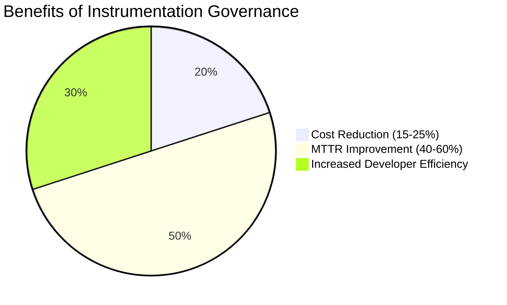
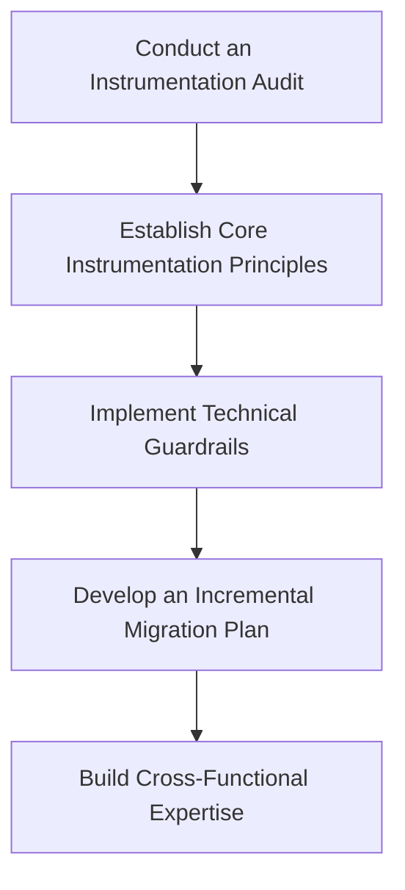
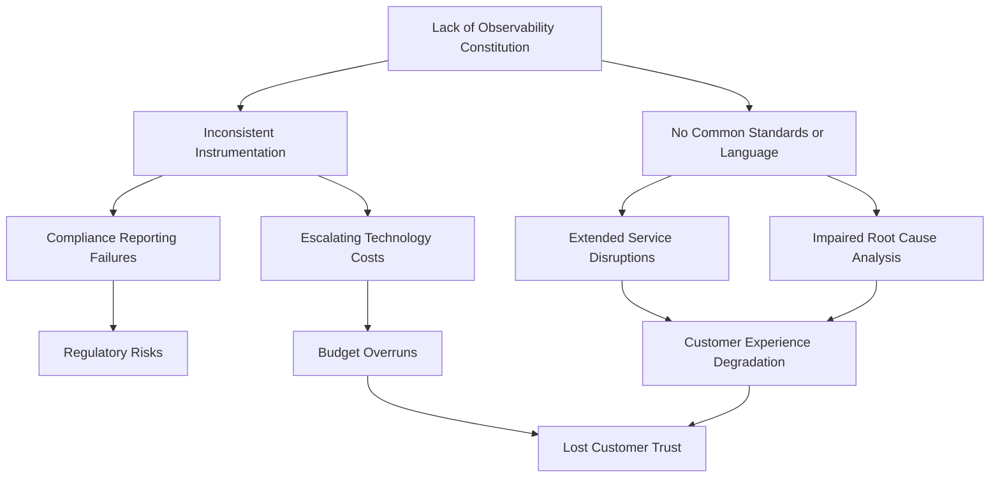
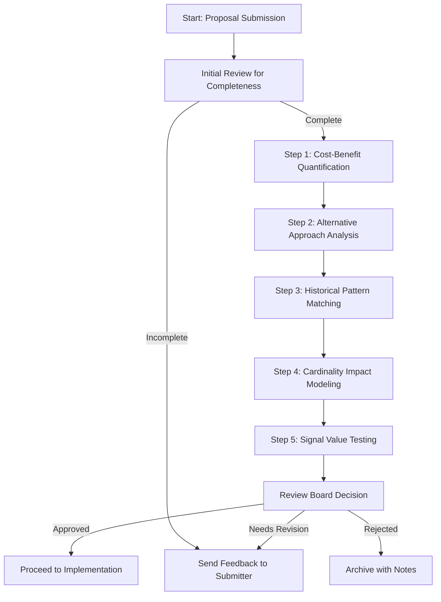
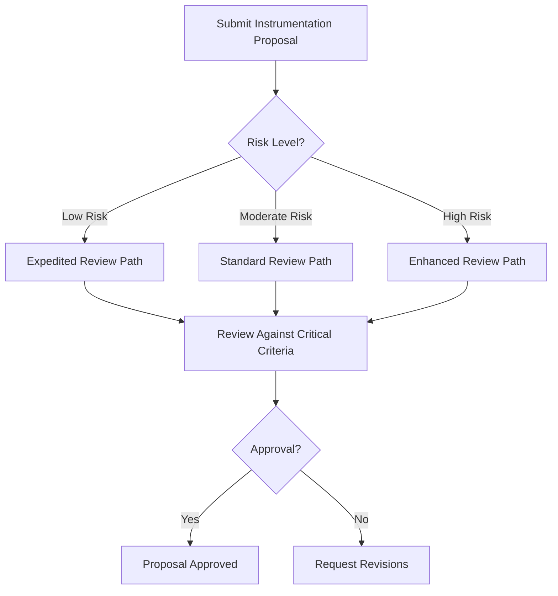
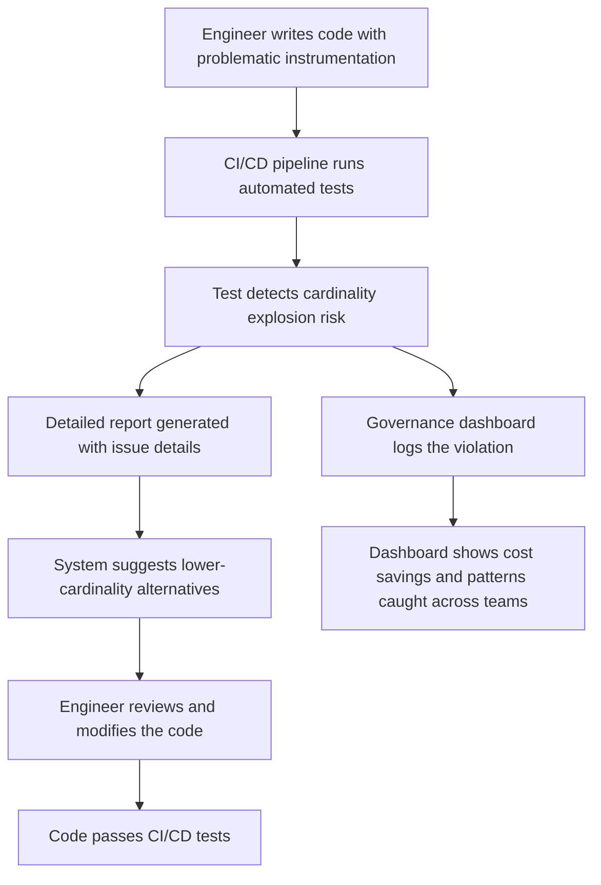
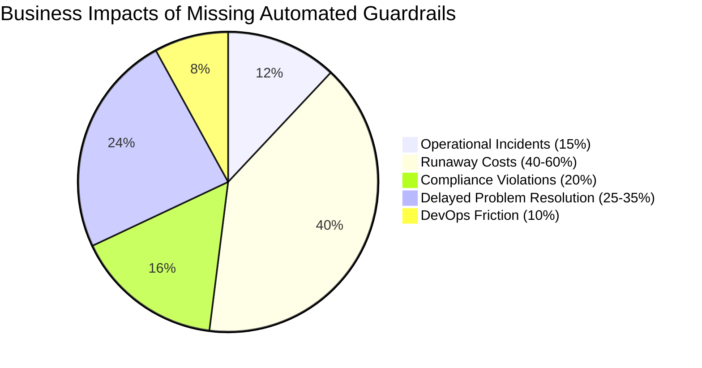
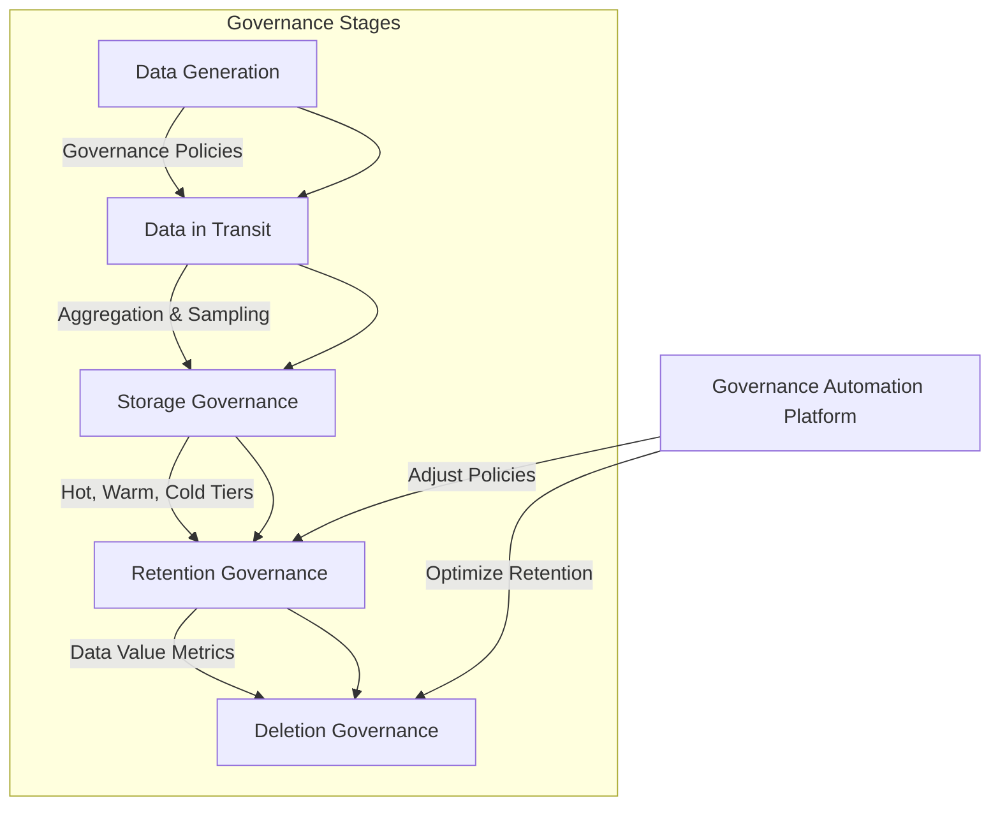
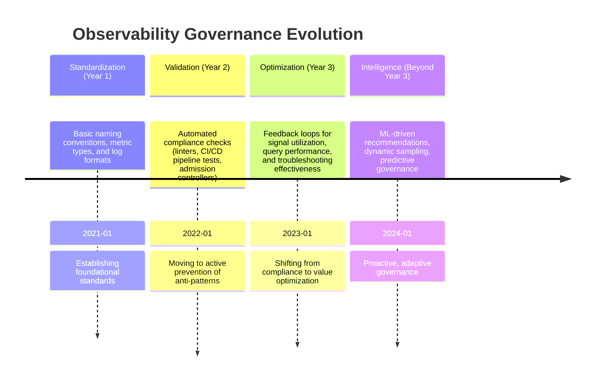
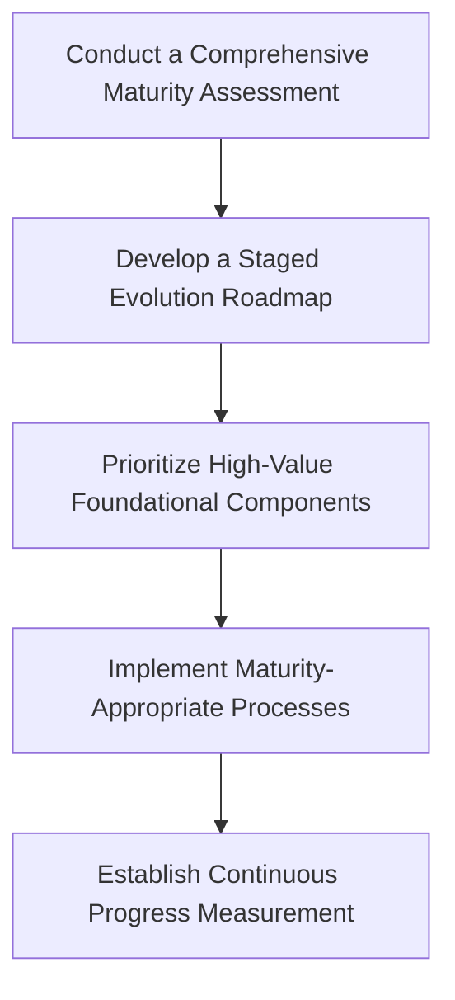

# Chapter 8: Instrumentation Governance


## Chapter Overview

Welcome to Instrumentation Governance: the only thing standing between your observability stack and a six-figure dumpster fire. Picture the SRE equivalent of a spaghetti western—guns blazing, dashboards multiplying, and your CFO waving a flaming bill. This chapter shoves a stick in the spokes of the “collect everything” bandwagon and reminds you: more telemetry isn’t more insight, it’s just more noise, more cost, and more migraines. Governance is your lasso, your constitution, and your last defense against observability entropy. We’ll show you how to replace chaos with control, bureaucracy with business value, and guesswork with cold, hard evidence. Saddle up.

---

## Learning Objectives

After this chapter, you’ll be able to:

- **Diagnose** observability chaos and its true causes (hint: it’s not “not enough data”).
- **Apply** evidence-based methods to separate signal from noise in your telemetry.
- **Establish** and **enforce** organization-wide instrumentation standards that actually matter.
- **Implement** technical and human guardrails to keep cost, cardinality, and cognitive overload in check.
- **Design** and **operate** a pragmatic Instrumentation Review Board that prevents both chaos and bureaucracy.
- **Automate** compliance using CI/CD, linters, and runtime controls without turning your pipeline into a parking lot.
- **Manage** the full lifecycle of observability data, from birth to deletion—with a cold eye on value and cost.
- **Measure** governance effectiveness using metrics that make both engineers and the CFO nod.
- **Advance** your governance maturity stepwise, without tripping over your own ambition or wasting millions.

---

## Key Takeaways

- Collecting “everything” isn’t observability—it’s digital hoarding. The only thing you’ll discover is budget overruns and migraines.
- If you don’t govern your telemetry, your telemetry will govern you—straight into compliance hell and operational paralysis.
- Standards aren’t for suits; they’re what keep incident response under five hours (and costs under six figures).
- Evidence beats opinion. If your metrics and logs don’t end up in postmortems, stop paying to store them.
- The Instrumentation Review Board isn’t a rubber stamp or a black hole—it’s your only hope for scalable, sane visibility.
- Automation is your friend, until it’s your passive-aggressive enemy. Set guardrails that catch real problems, not just make work for everyone.
- Storing petabytes of logs “just in case” is not a compliance strategy—it’s how you end up explaining to regulators why you lost both money and customer data.
- Metrics for governance aren’t vanity dashboards—they’re how you prove value and avoid the next budget guillotine.
- Governance maturity is a journey, not a quantum leap. Jump too far ahead and you’ll land face-first in the mud, surrounded by angry engineers.
- The ultimate goal: actionable insight, lower cost, faster resolution, and a governance process that’s respected, not reviled. Or, put another way: less chaos, more uptime, and fewer meetings about “why we can’t find anything in the logs.”

---

## Panel 1: The Instrumentation Wild West
### Scene Description

A chaotic war room filled with exhausted SREs staring at screens showing hundreds of dashboards and alerts. One engineer frantically scrolls through thousands of log lines while another desperately tries to make sense of a metrics dashboard with hundreds of unorganized graphs. In the corner, a financial officer holds a printout of an alarming observability bill, trying to get someone's attention. The room represents pure observability chaos - disconnected, overwhelming, and ultimately ineffective despite massive data collection.

Below is a text-based representation of the scene to better visualize the chaos:

```
+---------------------------------------------------+
|                       WAR ROOM                   |
|---------------------------------------------------|
|       [ Screen 1: 100+ Alerts Flashing ]         |
|  (SRE 1) --> "What does this alert even mean?"   |
|                                                   |
|   [ Screen 2: Logs Scrolling Endlessly ]         |
|  (SRE 2) --> "Needle in a haystack... again."    |
|                                                   |
| [ Screen 3: Metrics Dashboard - 200+ Graphs ]    |
|  (SRE 3) --> "Which graph is the right one?"     |
|                                                   |
|  (Financial Officer) --> "The bill is WHAT?!"    |
|  [ Printout of skyrocketing observability costs ]|
|                                                   |
|         * Background noise of alerts pinging *   |
+---------------------------------------------------+
```

This chaotic environment highlights the overwhelming nature of ungoverned instrumentation practices, driving home the importance of structured observability.
### Teaching Narrative
Instrumentation chaos is the inevitable result of ungoverned observability practices. As organizations transition to modern observability platforms, many fall into a dangerous pattern: engineers instrument everything they can think of, applications emit every possible log line, and metrics explode in cardinality without any coordination or standards.

This "collect everything" approach stems from good intentions - engineers want complete visibility into their systems. However, without governance, this creates several critical problems:

First, excessive instrumentation generates overwhelming data volumes that make signal discovery nearly impossible. When everything is captured, nothing stands out. Engineers waste precious time during incidents sifting through mountains of irrelevant data, unable to quickly identify the meaningful signals that would lead to resolution.

Second, this chaos drives exponential cost growth as redundant, low-value telemetry consumes expensive observability resources. Without standards and controls, each team independently instruments similar patterns, creates duplicate metrics with different naming conventions, and captures unnecessary detail that delivers minimal insight relative to its cost.

Third, ungoverned instrumentation creates cognitive overload that reduces team effectiveness. Engineers face decision paralysis when confronted with too many potential signals, dashboards become cluttered with redundant visualizations, and knowledge sharing becomes impossible without common observability language across teams.

The fundamental truth of effective observability is counterintuitive: less data, carefully selected and consistently structured, provides more actionable insight than capturing everything possible. Instrumentation governance provides the framework to make this possible.
### Common Example of the Problem

At a major investment bank, a critical trading platform began experiencing intermittent latency issues affecting high-value client transactions. When the incident response team assembled, they faced a bewildering array of monitoring data. The trading platform team had instrumented virtually every function call with detailed logging, capturing parameters and execution times. Meanwhile, the infrastructure team had implemented comprehensive metrics across the entire stack, from network throughput to CPU utilization on every node.

Despite terabytes of telemetry data, the team struggled to identify the root cause due to several key issues:

| **Category**              | **Issue**                                                                                   | **Impact**                                                                     |
| ------------------------- | ------------------------------------------------------------------------------------------- | ------------------------------------------------------------------------------ |
| **Naming Conventions**    | Different teams used inconsistent terminology (e.g., "orders" vs. "transactions").          | Confusion during queries and correlation across systems.                       |
| **Time Units**            | Systems logged events in different units (e.g., microseconds vs. milliseconds).             | Misaligned timestamps led to inaccurate event sequencing and analysis delays.  |
| **Mapping**               | Infrastructure metrics used server hostnames that didn't clearly map to application layers. | Difficulty in tracing issues across infrastructure and application boundaries. |
| **Data Volume**           | Excessive telemetry captured redundant or low-value data.                                   | Query times stretched into minutes, delaying root cause identification.        |
| **Signal-to-Noise Ratio** | Only 2% of the collected data was relevant to resolving the incident.                       | Valuable signals were buried in irrelevant telemetry, wasting engineers' time. |

After five hours of investigation, an engineer finally discovered that a database connection pool was exhausted during peak trading volume – a finding that should have been immediately obvious with proper instrumentation. This incident underscored the importance of governance to reduce noise, align teams, and ensure telemetry is actionable.
### SRE Best Practice: Evidence-Based Investigation

Mature SRE teams implement structured instrumentation governance based on evidence of what actually matters during incidents. This approach begins with a systematic review of past incidents to identify which signals consistently contribute to resolution versus those that generate noise.

The investigation follows specific patterns:

1. **Signal Contribution Analysis**: Review the last 20-30 incidents and document which specific metrics, logs, and traces actually contributed to identification and resolution. This creates a data-driven inventory of high-value signals.

2. **Noise Identification**: Analyze which telemetry is routinely collected but rarely consulted during incidents. This identifies candidates for sampling, aggregation, or elimination.

3. **Resolution Path Mapping**: Document the typical investigation steps taken during incidents, identifying common patterns that could be standardized across teams.

4. **Time-to-Signal Analysis**: Measure how long it takes engineers to discover relevant signals during incidents, identifying areas where better organization or standardization would accelerate resolution.

5. **Cross-Team Correlation Challenges**: Document instances where correlating data across team boundaries created delays, highlighting opportunities for naming and structural standardization.

To ensure this process is actionable, SRE teams can use the following checklist during investigations:

#### Evidence-Based Investigation Checklist
- [ ] Review past incidents (20-30) to identify high-value signals.
- [ ] Catalog metrics, logs, and traces that consistently aid resolution.
- [ ] Identify telemetry sources that generate frequent noise or low-value data.
- [ ] Map the typical resolution path and standardize common investigation patterns.
- [ ] Measure the average time-to-signal during incidents and address delays.
- [ ] Document cross-team correlation challenges and propose naming/structural improvements.
- [ ] Regularly update and refine the inventory of high-value signals based on new incidents.

This evidence-based approach ensures that governance is built on actual operational needs rather than theoretical concerns. It transforms governance from a bureaucratic exercise into a practical framework that demonstrably improves incident response effectiveness.
### Banking Impact

The business consequences of ungoverned instrumentation in banking environments extend far beyond technical inefficiency. Financial institutions face unique impacts including:

1. **Extended Trading Outages**: Without clear signals, trading platform incidents take 35-50% longer to resolve, directly impacting revenue generation and potentially triggering regulatory reporting requirements.

2. **Unsustainable Cost Scaling**: As transaction volumes grow, ungoverned observability costs increase exponentially rather than linearly, creating budget pressures that often lead to arbitrary cuts rather than strategic optimization.

3. **Compliance Vulnerability**: Chaotic instrumentation creates blind spots in transaction monitoring that can mask fraudulent activity and create regulatory exposure during audits.

4. **Delayed Feature Delivery**: Development teams spend up to 30% of their time implementing, maintaining, and interpreting disorganized telemetry instead of delivering customer value.

5. **Trust Erosion**: Inconsistent monitoring leads to conflicting data about system status, undermining management confidence in technology teams and creating friction between business and technical stakeholders.

---

#### Visualizing the Impact

The following illustrates the financial and operational benefits observed from implementing effective instrumentation governance in banking environments:



---

Financial analysis at multiple institutions has demonstrated that well-governed observability typically reduces annual technology costs by 15-25% while simultaneously improving mean time to resolution (MTTR) by 40-60%. Additionally, developer efficiency increases as teams spend less time managing chaotic telemetry and more time delivering customer value. These benefits create a compelling business case for governance investment.
### Implementation Guidance

To implement effective instrumentation governance, organizations should follow these five actionable steps. The following flow diagram illustrates the sequence of actions, providing a clear visual representation of the process:



1. **Conduct an Instrumentation Audit**
   - Inventory all existing metrics, logs, and traces across three representative services.
   - Classify each signal by type, cardinality, volume, and query frequency.
   - Identify redundancies, gaps, and inconsistencies across team boundaries.
   - Calculate current observability costs and attribute them to different telemetry types.

2. **Establish Core Instrumentation Principles**
   - Create a concise document of 5-7 core principles (not detailed standards).
   - Focus on naming conventions, cardinality management, and signal-to-noise ratio.
   - Validate principles with both SRE and development stakeholders.
   - Define clear decision criteria for what should and shouldn't be instrumented.

3. **Implement Technical Guardrails**
   - Add cardinality validation to CI/CD pipelines for metrics.
   - Create standard logging libraries with consistent levels and formats.
   - Implement automated detection of excessive instrumentation in code reviews.
   - Deploy telemetry volume monitoring with alerts for unexpected growth.

4. **Develop an Incremental Migration Plan**
   - Prioritize high-cost/high-value services for initial governance implementation.
   - Create service-specific remediation plans with measurable objectives.
   - Establish a realistic timeline that aligns with existing development cycles.
   - Define success metrics that balance cost reduction with observability quality.

5. **Build Cross-Functional Expertise**
   - Identify instrumentation champions within each major development team.
   - Create a regular forum for sharing observability best practices.
   - Develop training materials focused on effective instrumentation techniques.
   - Establish a lightweight design review process for new service instrumentation.
## Panel 2: The Observability Constitution
### Scene Description

A diverse group of engineers, product managers, and financial stakeholders gather around a whiteboard covered with a carefully structured document titled "Observability Constitution." The document outlines clear guidelines for instrumentation standards, naming conventions, and decision frameworks. Smaller working groups are seated around the room, each focused on specific sections such as metric naming patterns, log verbosity controls, and trace sampling guidelines. At the center of the room, a large dashboard displays a "governance health score" for various systems, visually representing the practical impact of these standards.

Below is a text-based diagram representing the scene:

```
+-----------------------+       +-----------------------+       +-----------------------+
| Working Group 1       |       | Working Group 2       |       | Working Group 3       |
| - Metric Naming       |       | - Log Verbosity       |       | - Trace Sampling      |
|   Patterns            |       |   Controls            |       |   Guidelines          |
+-----------------------+       +-----------------------+       +-----------------------+

                           [ Whiteboard: "Observability Constitution" ]
                           --------------------------------------------
                           | - Instrumentation Standards              |
                           | - Naming Conventions                    |
                           | - Decision Frameworks                   |
                           --------------------------------------------

                             [ Dashboard: Governance Health Score ]
                             --------------------------------------
                             | System A: 85%                     |
                             | System B: 92%                     |
                             | System C: 78%                     |
                             --------------------------------------
```

The combination of focused working groups, a collaborative whiteboard, and a central dashboard fosters an environment of shared purpose. This setup ensures that the Observability Constitution is both actionable and aligned with organizational goals.
### Teaching Narrative
Effective instrumentation governance begins with establishing a clear, collaborative framework of principles and standards - what we call an "Observability Constitution." This is not merely a technical document but a sociotechnical agreement that aligns engineering practices, business needs, and economic realities.

The Observability Constitution addresses four key domains. First, it establishes consistent naming conventions that make observability data discoverable and understandable across the organization. These conventions cover metric names, label taxonomies, log formats, and trace attributes, ensuring that similar concepts use similar patterns regardless of which team created them.

Second, it defines cardinality control principles that prevent metric explosions. This includes guidelines for which dimensions are appropriate to add to metrics, hierarchical aggregation requirements, and standards for handling high-cardinality identifiers like customer IDs or transaction numbers.

Third, it creates clear verbosity standards for different types of observability signals. For logs, this means defining severity levels and content expectations for each level. For metrics, it establishes collection frequencies and aggregation windows. For traces, it defines sampling approaches and span generation rules.

Fourth, and perhaps most importantly, the constitution provides decision frameworks that help teams determine what to instrument and at what level of detail. These frameworks focus on the end-user impact and troubleshooting value of each potential signal, rather than capturing data simply because it's available.

A well-crafted Observability Constitution operates as a living agreement that evolves with the organization's needs. It should be developed collaboratively, not imposed from above, and should incorporate feedback loops that measure its effectiveness at enabling troubleshooting while controlling costs.
### Common Example of the Problem

A global retail bank had recently migrated from a monolithic core banking system to a microservices architecture for its digital banking platform. Without clear standards, each team implemented observability according to their own preferences. This led to several issues:

- **Inconsistent Naming Conventions**: The payments team created hundreds of metrics with no unified naming pattern – e.g., using "payment_processing_time" and "transaction_duration" interchangeably for the same measurement.
- **Excessive Log Verbosity**: The authentication team defaulted to DEBUG-level logging for all authentication attempts, generating terabytes of largely redundant logs daily.
- **Disjointed Metric Coverage**: Some metrics, like "failed_payments," only tracked specific failure modes, while other failure modes were logged under entirely different metrics with inconsistent naming. This fragmented view caused confusion during troubleshooting.
- **Cost Escalation**: Observability costs increased 450% year-over-year despite only a 30% increase in transaction volume, due to the uncoordinated and excessive data collection practices.

When a critical incident disrupted mobile banking transactions, these problems compounded. Correlating events across disparate systems became nearly impossible, and the post-mortem revealed that over 70% of the resolution time was spent piecing together a timeline of related events across services.

#### Checklist for Identifying Similar Problems in Your Organization:
- [ ] Are metric names consistent across teams, or do similar concepts use different naming patterns?
- [ ] Are any logs generated at unnecessarily verbose levels, such as DEBUG, in production environments?
- [ ] Are high-cardinality identifiers (e.g., customer IDs) being overused in metrics or logs?
- [ ] Are there gaps or overlaps in metric coverage that make it hard to get a complete system view?
- [ ] Is there a significant gap between observability costs and the actual business value derived from the data?
- [ ] Do incident post-mortems frequently cite difficulty in correlating observability signals as a root cause for delays?

Use this checklist to identify whether your observability practices may suffer from similar governance challenges, and prioritize addressing them to avoid these costly pitfalls.
### SRE Best Practice: Evidence-Based Investigation

Developing an effective Observability Constitution requires a systematic approach based on current operational realities rather than theoretical ideals. Leading SRE organizations implement a structured investigation process to build their governance frameworks:

| **Step**                        | **Description**                                                                                                                                                     | **Expected Outcome**                                                                                    |
| ------------------------------- | ------------------------------------------------------------------------------------------------------------------------------------------------------------------- | ------------------------------------------------------------------------------------------------------- |
| **Service Interaction Mapping** | Document the key service interactions that support critical user journeys. Create visibility into cross-service dependencies where standardization is most crucial. | A clear understanding of cross-service dependencies and their impact on critical user flows.            |
| **Incident Signal Analysis**    | Review recent incidents to identify which signals proved most valuable during investigations versus which created confusion or delays.                              | Identification of high-value signals and elimination of noise or low-value signals.                     |
| **Cost-Value Assessment**       | Analyze the relationship between data volume and troubleshooting value across different telemetry types. Identify high-ROI versus low-ROI instrumentation patterns. | Prioritization of cost-effective instrumentation with a focus on maximizing troubleshooting efficiency. |
| **Naming Pattern Extraction**   | Catalog existing naming conventions across teams, identifying patterns that are intuitive and support effective troubleshooting.                                    | A consolidated set of intuitive naming conventions that can be standardized across the organization.    |
| **Query Pattern Analysis**      | Examine the most frequently used queries during both normal operations and incidents. Use these patterns to inform standardization priorities.                      | Optimized query patterns that align with operational needs and troubleshooting practices.               |

This evidence-based approach ensures that the Observability Constitution addresses actual operational needs rather than imposing theoretical standards disconnected from reality. The investigation typically reveals that 20% of potential standardization areas deliver 80% of the operational value, allowing for focused governance that minimizes bureaucratic overhead.
### Banking Impact

The absence of a clear Observability Constitution creates several significant business impacts for financial institutions:

1. **Compliance Reporting Failures**: Inconsistent instrumentation means that audit trails for transactions may be scattered across multiple systems with different formats and retention periods, creating regulatory exposure.

2. **Extended Service Disruptions**: Cross-service incidents take 45-65% longer to resolve when teams lack common observability language and standards, directly impacting customer experience and transaction completion rates.

3. **Escalating Technology Costs**: Uncoordinated observability typically results in 30-40% cost redundancy through duplicate data collection, excessive retention, and inefficient querying.

4. **Inaccurate Performance Reporting**: Without standardized measurement approaches, performance reporting to executive stakeholders becomes inconsistent, undermining confidence in technology metrics.

5. **Impaired Root Cause Analysis**: The inability to correlate events across service boundaries prevents effective identification of systemic issues, leading to recurring incidents and customer experience degradation.

The following flowchart illustrates how the absence of an Observability Constitution leads to cascading impacts across these areas:



Banks that implement comprehensive observability governance typically see a 200-300% return on investment through reduced incident duration, lower technology costs, and improved regulatory compliance posture. By addressing these cascading impacts, the Observability Constitution becomes a critical enabler of both operational and financial resilience.
### Implementation Guidance

To create an effective Observability Constitution, organizations should follow these five actionable steps:

1. **Establish a Cross-Functional Working Group**
   - Include representatives from development, operations, security, compliance, and finance.
   - Limit size to 7-9 core members with clearly defined responsibilities.
   - Create a regular cadence for initial development (typically weekly for 6-8 weeks).
   - Define explicit success criteria focused on operational outcomes, not document creation.

2. **Develop Core Naming Standards**
   - Create a metric naming hierarchy with service, subsystem, and function components.
   - Define standard label/tag taxonomies with controlled vocabulary for common dimensions.
   - Establish consistent units of measurement across similar metrics (e.g., ms vs s, bytes vs MB).
   - Document clear examples of compliant and non-compliant patterns. For instance:

   ```yaml
   # Metric Naming Example
   # Good: Follows service.subsystem.function pattern with controlled labels
   metrics:
     - name: "payment.gateway.latency"
       labels:
         - "region:us-east-1"
         - "service:payment"
         - "environment:production"
       unit: "ms"

   # Bad: Non-descriptive name and inconsistent label usage
   metrics:
     - name: "latency"
       labels:
         - "region1"
         - "prod"
         - "payment_service"
       unit: "milliseconds"
   ```

3. **Define Cardinality Management Rules**
   - Establish maximum cardinality limits for different metric types.
   - Create standard approaches for handling high-cardinality identifiers, such as hashing or bucketing.
   - Define hierarchical aggregation requirements for dimensional metrics.
   - Implement automated validation tooling for cardinality compliance. Example rule validation:

   ```python
   # Cardinality Validation Example
   def validate_cardinality(metric_name, labels):
       max_cardinality = 100  # Define acceptable limit
       unique_combinations = len(set(labels.values()))
       if unique_combinations > max_cardinality:
           raise ValueError(
               f"Metric '{metric_name}' exceeds cardinality limit with {unique_combinations} combinations."
           )
   ```

4. **Create Instrumentation Decision Frameworks**
   - Develop clear criteria for appropriate logging levels.
   - Define service-level indicator (SLI) selection guidelines.
   - Create standard sampling approaches for different transaction types. Example trace sampling configuration:

   ```yaml
   # Trace Sampling Configuration
   tracing:
     default_sampling_rate: 0.1  # Sample 10% of traces
     critical_paths:
       - path: "/checkout"
         sampling_rate: 1.0  # Sample 100% of critical transactions
       - path: "/login"
         sampling_rate: 0.5  # Sample 50% of login traces
   ```

   - Document exceptions for critical or regulated transaction pathways.

5. **Implement Incremental Adoption Mechanisms**
   - Create clear timelines for adoption across different services.
   - Develop tooling to identify compliance levels across the organization.
   - Establish regular governance reviews to evaluate effectiveness.
   - Create feedback mechanisms to evolve standards based on operational experience.
   - Example compliance dashboard workflow:

   ```text
   [Service A] --> [Compliance Checker] --> [Pass] --> [Dashboard: 95% Compliant]
                             |
                             --> [Fail] --> [Action Required: Update Naming Standards]
   ```
## Panel 3: The Instrumentation Review Board
### Scene Description

A scheduled instrumentation review meeting is underway. Three engineers present a proposal for new metrics in a payment processing system while a cross-functional review board listens attentively. On screen, the engineers display their proposal, which includes cardinality estimates, cost projections, and troubleshooting scenarios the new instrumentation would enable. A governance dashboard is prominently displayed, showing the system's current observability metrics: signal-to-noise ratio, cost per transaction, and alert actionability percentages.

The meeting room setup is as follows:

```
+-------------------------------+
|         Governance            |
|          Dashboard            |
| Signal-to-Noise Ratio: 85%    |
| Cost per Transaction: $0.03   |
| Alert Actionability: 92%      |
+-------------------------------+

   +-------------------------+          +-------------------------+
   |     Engineer 1         |          |      Engineer 2         |
   | Presenting Proposal     |          | Supporting with Data    |
   +-------------------------+          +-------------------------+

   +-------------------------+
   |     Engineer 3          |
   | Focused on Troubleshooting |
   +-------------------------+

+--------------------------------------------------------------+
|    Cross-Functional Review Board                             |
| [Platform Engineer] [SRE] [Business Stakeholder] [Tech Lead] |
| Probing questions on standards, alternatives, and alignment  |
+--------------------------------------------------------------+
```

Board members ask probing questions about alternatives considered and how the proposal aligns with established standards. The interactive discussion ensures that the proposed metrics are critically evaluated for alignment with organizational goals, while the dashboard provides real-time context to ground the conversation.
### Teaching Narrative
Sustainable observability requires more than just written standards - it demands governance structures that balance innovation with consistency. The Instrumentation Review Board (IRB) provides this structure through a lightweight, collaborative approach to observability governance.

Unlike heavyweight change control processes, an effective IRB doesn't aim to be a bottleneck or approval gate for all instrumentation. Instead, it serves three critical functions. First, it acts as a consultative body that helps teams design effective instrumentation strategies before implementation, catching potential issues like cardinality explosions or redundant metrics early in the development process.

Second, it serves as a knowledge-sharing mechanism where patterns of effective instrumentation spread throughout the organization. By reviewing proposals across different teams, the IRB identifies common needs and promotes reusable solutions rather than having each team solve similar problems differently.

Third, it provides accountability for observability costs and quality through data-driven evaluation of instrumentation effectiveness. The IRB tracks key metrics like signal utilization (how often metrics are actually queried), alert actionability (what percentage of alerts lead to meaningful intervention), and cost efficiency (value delivered relative to observability spend).

The composition of an effective IRB includes representatives from across the engineering organization, bringing diverse perspectives on what constitutes valuable observability data. It should include platform engineers who understand the technical capabilities of observability systems, SREs who rely on the data for troubleshooting, and business stakeholders who can connect technical metrics to customer impact.

The IRB process should scale with risk - minor instrumentation changes might undergo a lightweight review, while major new systems or significant changes to core services warrant more thorough evaluation. This risk-based approach ensures governance adds value without becoming bureaucratic overhead.
### Common Example of the Problem

A major corporate banking division was developing a new cash management service for international clients. The development team, eager to ensure comprehensive visibility, implemented extensive instrumentation across all components. Without review, they added customer identifiers, account numbers, and transaction IDs as dimensions to their metrics, creating millions of unique time series. They also enabled verbose tracing for all transactions regardless of value or type.

One month after launch, the finance team flagged that this single service was consuming 34% of the entire bank's observability budget. Worse, when a critical performance issue occurred, the teams found themselves overwhelmed by the sheer volume of telemetry data. Engineers reported that dashboards took minutes to load, and queries frequently timed out during incident investigation.

Post-incident analysis revealed that only a small fraction of the implemented instrumentation contributed to resolving the issue. The excessive cardinality had actually hindered troubleshooting by making it harder to identify relevant signals and patterns. Additionally, the detailed tracing of routine transactions provided little insight while generating massive storage costs.

#### Key Issues and Consequences

| **Issue**                             | **Description**                                                                     | **Consequence**                                                                                   |
| ------------------------------------- | ----------------------------------------------------------------------------------- | ------------------------------------------------------------------------------------------------- |
| Excessive Cardinality                 | Metrics included high-cardinality dimensions like customer IDs and transaction IDs. | Overwhelmed storage and query systems, leading to slow dashboards and query timeouts.             |
| Verbose Tracing                       | Traces captured all transactions, regardless of value or importance.                | Generated high storage costs without providing actionable insights.                               |
| Lack of Instrumentation Review        | No prior evaluation of the necessity or impact of the added telemetry.              | Inefficient use of observability budget and redundant or low-value metrics cluttering the system. |
| Overwhelming Volume of Telemetry Data | Sheer scale of data made identifying relevant signals difficult.                    | Hindered troubleshooting efforts, prolonging incident resolution times.                           |

#### Observability Flow Impact (ASCII Diagram)

```
[Excessive Instrumentation] --> [High Cardinality & Volume] --> [System Overload: Slow Queries & Dashboards]
                                      |                                         |
                                      v                                         v
                        [Increased Costs]                          [Reduced Troubleshooting Efficiency]
```

This example underscores the importance of pre-implementation review by an Instrumentation Review Board to balance visibility needs with cost and operational efficiency.
### SRE Best Practice: Evidence-Based Investigation

Effective Instrumentation Review Boards implement structured, evidence-based processes for evaluating proposed observability implementations. This approach applies scientific rigor to what is often treated as a subjective exercise. The following checklist and process flow ensure a systematic and actionable approach to instrumentation evaluation:

#### Checklist for Evidence-Based Investigation
1. **Cost-Benefit Quantification**:
   - Calculate projected data volume, storage requirements, and query load.
   - Map these costs to the specific troubleshooting and business visibility needs addressed.

2. **Alternative Approach Analysis**:
   - Identify at least two alternative instrumentation strategies for the same visibility goals.
   - Compare cost, performance impact, and effectiveness across alternatives.

3. **Historical Pattern Matching**:
   - Reference historical data on metrics, logs, and traces that have been useful in past incidents for similar services.
   - Identify any gaps or overlaps with proposed instrumentation.

4. **Cardinality Impact Modeling**:
   - Model high-cardinality metric growth under various transaction volume scenarios.
   - Evaluate potential cost risks and system performance impacts.

5. **Signal Value Testing**:
   - Deploy the proposed instrumentation in a pre-production environment when feasible.
   - Conduct mock incident investigations and validate the troubleshooting value of the signals.

6. **Documentation and Knowledge Sharing**:
   - Record findings, decisions, and lessons learned for organizational knowledge repositories.
   - Tag proposals with metadata to enable future pattern identification.

#### Step-by-Step Process Flow


These evidence-based approaches transform instrumentation reviews from subjective discussions into data-driven decisions. The most effective IRBs maintain databases of historical review outcomes, building institutional knowledge about which observability patterns deliver the most value relative to their cost.
### Banking Impact

Unreviewed instrumentation creates significant business impacts that extend beyond simple cost considerations. The following table summarizes these impacts for clarity and accessibility:

| **Impact Area**                   | **Description**                                                                                     | **Quantified Effect**                                 |
| --------------------------------- | --------------------------------------------------------------------------------------------------- | ----------------------------------------------------- |
| **Excess Technology Expenditure** | Overspending on observability due to redundant or low-value metrics.                                | 25-45% increase in observability costs.               |
| **Delayed Incident Resolution**   | Signal dilution and analysis paralysis lead to slower identification of root causes.                | 20-30% increase in Mean Time to Resolution (MTTR).    |
| **Infrastructure Overhead**       | High computational load from excessive metrics and traces reduces system performance.               | 5-15% of production infrastructure capacity consumed. |
| **Governance Risk**               | Lack of controls can result in sensitive data being captured in logs, leading to compliance issues. | Increased regulatory risk exposure.                   |
| **Release Velocity Impact**       | Development teams spend excessive time crafting unreviewed instrumentation.                         | 10-20% delay in feature development cycles.           |

**Key Outcomes of Effective Review Processes**:
- Financial institutions that implement robust instrumentation reviews typically achieve:
  - **30-40% reduction** in observability costs within 6-12 months.
  - Improved **system visibility** and **incident response times**, enabling faster resolution and higher availability.
### Implementation Guidance

To implement an effective Instrumentation Review Board (IRB), organizations should follow these five actionable steps. The checklist below provides a concise summary of the process, while the flowchart illustrates the decision flow for reviewing instrumentation proposals.

#### Checklist for IRB Implementation
1. **Define the IRB Charter and Scope**
   - [ ] Identify types of changes requiring review (e.g., new services, major features)
   - [ ] Establish exemption criteria for low-risk changes
   - [ ] Document the board's authority, decision criteria, and SLAs for review turnaround times

2. **Establish a Cross-Functional Membership**
   - [ ] Appoint 5-7 core members representing key domains (SRE, development, platform engineering, finance)
   - [ ] Define rotation schedules for balanced continuity and fresh perspectives
   - [ ] Assign clear roles, responsibilities, and quorum requirements for decision-making

3. **Create Standardized Review Templates**
   - [ ] Develop structured templates for instrumentation proposals
   - [ ] Include cardinality analysis, cost projections, and value justification
   - [ ] Standardize how alternatives are presented and evaluated
   - [ ] Define explicit approval criteria based on ROI and alignment with standards

4. **Implement a Tiered Review Process**
   - [ ] Define thresholds for expedited, standard, and enhanced review paths
   - [ ] Create a lightweight process for low-risk changes
   - [ ] Establish a standard process for moderate-risk changes
   - [ ] Build an enhanced review process for high-cardinality or high-cost proposals

5. **Establish Effectiveness Metrics**
   - [ ] Define metrics to assess IRB performance (e.g., review cycle time)
   - [ ] Track accuracy of cost projections versus actual outcomes
   - [ ] Measure signal value of approved instrumentation during incidents
   - [ ] Survey stakeholders on review process efficiency and value

#### Flowchart: IRB Proposal Review Process


This combination of a checklist and a visual flowchart ensures the IRB process is both actionable and scalable, offering clear guidance for implementation and day-to-day operation.
## Panel 4: Automated Guardrails
### Scene Description

An engineer attempts to deploy code containing poorly designed instrumentation that would create thousands of unique metrics. Immediately, a CI/CD pipeline test fails with a detailed report highlighting the potential cardinality explosion. The system automatically suggests alternatives that would deliver similar insights with dramatically lower cardinality. On a nearby screen, a governance dashboard shows dozens of similar violations caught automatically across different teams, with metrics showing the cost savings from prevented instrumentation anti-patterns.

#### Sequence of Events

### Teaching Narrative

While human governance processes are essential, they must be complemented by automated guardrails that enforce standards consistently and proactively. These technical controls embed observability governance directly into development workflows, catching potential issues before they impact production systems.

Automated instrumentation governance operates at multiple levels, each with distinct roles and key controls:

#### Checklist: Automated Governance Levels and Key Controls
- **Code Level**
  - Use linters and static analysis tools to:
    - Validate naming conventions for metrics, logs, and traces.
    - Enforce cardinality controls and other observability standards.
  - Integrate governance tools directly into:
    - Development environments for real-time feedback.
    - CI/CD pipelines to catch issues before deployment.

- **Runtime Level**
  - Leverage instrumentation middleware to:
    - Apply rate limiting to manage high-volume logs.
    - Enforce cardinality limits to prevent time series explosion.
    - Use circuit breakers to reduce telemetry output during incidents, preserving system stability.

- **Platform Level**
  - Implement admission controllers that:
    - Validate incoming telemetry against governance rules.
    - Reject non-compliant data or apply sampling to excessive telemetry.
    - Route data to appropriate storage tiers based on policies and query patterns.

Effective automated guardrails must balance enforcement with flexibility. They should prevent clear anti-patterns while providing paths for legitimate exceptions when necessary. For example, a cardinality limiter might allow exceeding normal limits during controlled experiments if an explicit exemption is configured, while still preventing unbounded growth.

The most sophisticated automated governance systems provide not just validation but remediation guidance. These systems suggest alternative approaches when they detect problematic patterns, transforming governance from a gatekeeper function into an enablement tool that helps teams implement best practices effectively.
### Common Example of the Problem

A treasury management system at a multinational bank was experiencing mysterious performance degradation every Monday morning. Investigation revealed that an automated weekend batch process was generating extensive DEBUG level logging for reconciliation activities, creating nearly 2TB of log data weekly. This not only increased storage costs but also put significant load on the logging infrastructure used by other critical systems.

Further analysis uncovered that a developer had added this verbose logging three months earlier as a temporary troubleshooting measure, but without proper controls, it had remained enabled in production. The excessive logging had gone unnoticed because it occurred during weekend processing when monitoring was less actively observed.

To illustrate the impact of automated guardrails, consider the following comparison:

| Aspect                    | Before Automated Guardrails                                                                   | After Automated Guardrails                                                                            |
| ------------------------- | --------------------------------------------------------------------------------------------- | ----------------------------------------------------------------------------------------------------- |
| **Logging Behavior**      | DEBUG level logging enabled for all reconciliation activities, generating 2TB of weekly logs. | Targeted logging implemented based on guardrail suggestions, reducing log volume by 95%.              |
| **Resource Utilization**  | Significant load on logging infrastructure, affecting other critical systems.                 | Optimized resource usage with minimal load on shared infrastructure.                                  |
| **Storage Costs**         | $15,000/month increase due to excessive log storage.                                          | Storage costs minimized with controlled and relevant log data.                                        |
| **Incident Detection**    | Degradation went unnoticed due to reduced weekend monitoring visibility.                      | Proactive detection and prevention during CI/CD pipeline validation.                                  |
| **Engineer Intervention** | Manual investigation required to identify and resolve the issue.                              | Automated guardrails flagged the issue and suggested targeted instrumentation during code deployment. |
| **Outcome**               | Performance degradation and increased costs due to unchecked logging.                         | Improved system stability, reduced costs, and better troubleshooting capabilities.                    |

When a similar pattern emerged in a newly developed foreign exchange service, engineers initially enabled similarly excessive logging. However, this time an automated guardrail in the CI/CD pipeline detected the potential issue, preventing deployment and suggesting more targeted instrumentation. This automated intervention not only avoided a $15,000 monthly cost increase but also improved system observability by enabling carefully designed instrumentation from the outset.
### SRE Best Practice: Evidence-Based Investigation
Implementing effective automated guardrails requires a systematic approach to identifying which controls deliver the most value with minimal friction. Leading SRE teams follow these evidence-based practices:

1. **Anti-Pattern Analysis**: Review historical incidents and cost spikes to identify common instrumentation anti-patterns that could be automatically detected and prevented.

2. **Deployment Pipeline Analysis**: Analyze code repositories and CI/CD logs to understand how instrumentation changes typically flow from development to production, identifying optimal intervention points.

3. **False Positive Impact Assessment**: Evaluate potential automated checks against historical code changes to quantify false positive rates and their potential impact on development velocity.

4. **Exception Path Analysis**: Review legitimate cases where standards needed to be bypassed, designing appropriate exception mechanisms that balance flexibility with control.

5. **Feedback Loop Effectiveness**: Measure how quickly teams adjust behavior based on automated feedback, identifying opportunities to improve guidance clarity and actionability.

These evidence-based approaches ensure that automated guardrails address the most impactful issues while minimizing unnecessary friction. The most effective implementations begin with high-value, low-controversy controls and gradually expand based on demonstrated effectiveness and team acceptance.
### Banking Impact

Lacking automated instrumentation guardrails creates several significant business impacts in banking environments:



1. **Operational Incidents**: Excessive logging and metrics collection has directly contributed to production incidents in 15% of major banking outages, as instrumentation load overwhelms infrastructure during peak periods.

2. **Runaway Costs**: Without automated controls, observability costs frequently exceed budgets by 40-60%, leading to emergency cost-cutting that often removes valuable signals alongside low-value telemetry.

3. **Compliance Violations**: Uncontrolled instrumentation regularly captures sensitive customer data in logs or metrics, creating regulatory exposure under GDPR, PCI-DSS, and other frameworks.

4. **Delayed Problem Resolution**: During major incidents, excessive telemetry volume typically increases mean time to resolution by 25-35% as teams struggle to identify relevant signals amid the noise.

5. **DevOps Friction**: Inconsistent instrumentation practices create conflict between development teams and platform operators, with each side blaming the other for observability problems.

Banking organizations with mature automated guardrails typically reduce monthly observability costs by 30-50% while improving both system performance and incident response capabilities.
### Implementation Guidance

To implement effective automated guardrails, organizations should follow these five actionable steps:

1. **Identify High-Value Control Points**
   - Map the instrumentation lifecycle from development to production.
   - Identify optimal intervention points for different types of checks.
   - Prioritize controls that prevent the most costly anti-patterns.
   - Balance thoroughness with performance impact on development workflows.

2. **Implement Static Analysis Checks**
   - Create custom linters for metric naming convention compliance.
   - Develop cardinality analysis tools for CI/CD pipelines.
   - Implement log level validation for appropriate verbosity.
   - Build standard checks into code review automation.

   Example: A linter rule for metric naming conventions using a static analysis tool.
   ```python
   import ast
   import re

   class MetricNameLinter(ast.NodeVisitor):
       METRIC_NAME_PATTERN = re.compile(r"^[a-z]+(\.[a-z]+)*$")

       def __init__(self):
           self.violations = []

       def visit_Assign(self, node):
           if isinstance(node.value, ast.Str) and "metric" in node.targets[0].id:
               metric_name = node.value.s
               if not self.METRIC_NAME_PATTERN.match(metric_name):
                   self.violations.append(
                       f"Invalid metric name '{metric_name}' at line {node.lineno}."
                   )
           self.generic_visit(node)

   # Example usage
   code = """
   metric_name = "InvalidMetricName"
   another_metric = "valid.metric.name"
   """

   tree = ast.parse(code)
   linter = MetricNameLinter()
   linter.visit(tree)

   for violation in linter.violations:
       print(violation)
   ```
   This script checks for metric names that do not follow a lowercase dot-separated format and flags violations with line numbers for easier debugging.

3. **Deploy Runtime Protection Mechanisms**
   - Implement rate limiting for high-volume log sources.
   - Create cardinality limiters for metrics pipelines.
   - Deploy circuit breakers for trace sampling during high-load periods.
   - Configure anomaly detection for unusual telemetry volume patterns.

4. **Establish Exception Processes**
   - Create clear exemption mechanisms for legitimate special cases.
   - Implement time-bound exceptions that automatically expire.
   - Require explicit justification and approval for bypassing guardrails.
   - Establish audit trails for all exemption activities.

5. **Develop Feedback Mechanisms**
   - Create clear, actionable error messages that explain violations.
   - Provide specific recommendations for resolving detected issues.
   - Develop self-service knowledge bases for common instrumentation patterns.
   - Establish metrics to track guardrail effectiveness and false positive rates.
## Panel 5: The Observability Data Lifecycle
### Scene Description

A visualization depicts the full lifecycle of observability data flowing through banking systems, emphasizing governance controls at each stage. The sequence begins with data generation policies at the source, followed by aggregation and sampling in transit, tiered storage based on query patterns, and concludes with automated purging of low-value data. Engineers are shown reviewing a dashboard that displays the "Observability Value Index" for various data sources—a composite metric that combines query frequency, alert usefulness, and troubleshooting value relative to storage cost. In the background, a governance automation platform dynamically adjusts retention policies based on real-time usage patterns.

Below is a representation of the observability data lifecycle using a flow diagram:



This diagram highlights the stages where governance controls are applied, ensuring that data is transformed, stored, and eventually purged in alignment with its value and usage patterns. By visualizing this lifecycle, readers can better understand how observability data is managed holistically within complex systems.
### Teaching Narrative
Complete instrumentation governance requires managing the entire observability data lifecycle from generation to eventual deletion. This lifecycle approach ensures that governance isn't just about controlling what gets created, but also how data flows through the system, how it's stored, and when it's removed.

The observability lifecycle begins with generation governance, which we've explored in previous panels through standards and review processes. This ensures new telemetry meets quality standards before entering the system. However, effective governance must extend beyond this initial stage.

Transit governance manages how data moves through the observability pipeline. This includes aggregation policies that combine raw data points into meaningful summaries, sampling strategies that reduce volume while preserving statistical validity, and enrichment processes that add context to raw telemetry. Transit governance ensures data is transformed appropriately before reaching its storage destination.

Storage governance implements tiered data management based on the value and access patterns of different signals. Hot storage holds frequently queried, recent data for fast access. Warm storage contains older data that still has analytical value. Cold storage archives data needed primarily for compliance or rare investigations. Governance policies automate the movement of data between these tiers based on age, query frequency, and business importance.

Retention governance determines how long different types of observability data should be kept. Rather than applying simplistic time-based rules uniformly, sophisticated retention governance uses data value metrics to make intelligent decisions. These metrics include query frequency (how often the data is actually accessed), alert utilization (whether the data drives actionable notifications), and troubleshooting value (how often the data contributes to incident resolution).

Finally, deletion governance ensures that data is properly removed when it no longer provides sufficient value relative to its storage cost. This includes not just deleting the data itself but also cleaning up associated metadata, index structures, and dashboard references to prevent system bloat.

By governing the complete lifecycle, organizations can maintain a healthy observability ecosystem where valuable data is prioritized, costs remain controlled, and signal-to-noise ratio stays high throughout the system lifecycle.
### Common Example of the Problem

A global investment banking division implemented a modern observability platform for their trading systems, replacing legacy monitoring tools. Initially, they focused entirely on instrumentation design and implementation, creating comprehensive metrics, logs, and traces across their infrastructure.

However, they neglected to implement lifecycle governance. After six months, they faced critical issues:

| **Issue**                                                       | **Root Cause**                                                                           | **Impact**                                                                         |
| --------------------------------------------------------------- | ---------------------------------------------------------------------------------------- | ---------------------------------------------------------------------------------- |
| Observability costs increased from $150,000 to $800,000 monthly | Retaining large volumes of historical data that were rarely accessed                     | 65% of the costs were spent on storing low-value, infrequently queried data        |
| Query performance degraded significantly                        | Massive data retention without proper tiering or pruning                                 | Engineers experienced slow searches, especially during critical incidents          |
| Ineffective system usage during incidents                       | Searches spanned months or years of irrelevant historical data                           | Incident resolution was delayed as queries took too long to process large datasets |
| High-performance storage misused for compliance                 | All transaction logs stored in top-tier storage instead of lower-cost archival solutions | Regulatory data storage costs were unnecessarily high                              |
| Redundant telemetry copies                                      | Lack of automated cleanup and governance of retention policies                           | Storage bloat and increased complexity in managing overlapping datasets            |

During a critical trading outage, the observability platform itself became a bottleneck as teams attempted to query massive datasets spanning months of historical data. The incident post-mortem revealed that:

- **90% of the queries during resolution only needed data from the past 24 hours.**
- **The system was burdened by unnecessary historical telemetry, providing no value during the incident.**

This example highlights the importance of lifecycle governance to ensure observability platforms remain cost-effective, performant, and operationally useful.
### SRE Best Practice: Evidence-Based Investigation

Effective observability lifecycle governance requires a systematic, data-driven approach to understanding how telemetry value changes over time. Leading SRE organizations implement these investigation practices:

1. **Query Pattern Analysis**: Analyze historical query logs to understand how different types of telemetry are accessed over time, identifying patterns that inform appropriate retention policies.

2. **Value Decay Measurement**: Quantify how the troubleshooting and analytical value of different signal types diminishes over time, creating mathematical models that inform tiered storage transitions.

3. **Usage-Based Classification**: Categorize telemetry data based on its actual usage patterns—operational (used for real-time alerting), analytical (used for trend analysis), or compliance (kept for regulatory requirements)—allowing for differentiated lifecycle policies.

4. **Cost-Value Optimization Modeling**: Calculate the optimal retention periods for different data types based on storage costs, query frequency, and business value, using techniques like marginal value analysis.

5. **Access Latency Requirements**: Document the performance requirements for different query types and use cases, informing appropriate storage tier selection and transition timing.

#### Evidence-Based Investigation Checklist

To streamline implementation of these practices, use the following checklist as a quick reference guide during lifecycle governance efforts:

- [ ] **Examine Query Logs**: Review historical query patterns to identify high-value telemetry and inform retention and storage policies.
- [ ] **Measure Value Decay**: Develop models to track how signal value decreases over time for troubleshooting and analytics.
- [ ] **Classify Telemetry Usage**: Group data into operational, analytical, and compliance categories to apply targeted lifecycle policies.
- [ ] **Model Cost vs. Value**: Perform cost-value analysis to determine the most efficient retention periods for each data type.
- [ ] **Define Latency Requirements**: Document query performance needs and review storage tier configurations to meet those requirements.
- [ ] **Review Governance Policies Periodically**: Regularly re-evaluate policies to ensure alignment with evolving query patterns and business priorities.

These evidence-based approaches, when combined with the checklist, ensure lifecycle governance reflects actual usage patterns rather than assumptions or arbitrary policies. The resulting lifecycle controls maintain an optimal balance between data availability, query performance, and cost efficiency throughout the telemetry lifecycle.
### Banking Impact

Inadequate observability lifecycle governance creates cascading business impacts for financial institutions. The following diagram illustrates the ripple effects of insufficient controls across the observability data lifecycle, highlighting key pain points and their interdependencies:

```text
[Inadequate Governance] 
         ↓
[Unsustainable Cost Scaling] → [Abrupt Budget Cuts] → [Degraded System Investment]
         ↓
[Oversized Datasets] → [Query Performance Degradation] → [Extended Outages]
         ↓
[Compliance Failures] → [Regulatory Penalties] 
         ↓
[Infrastructure Overprovisioning] → [Increased Operational Overhead]
         ↓
[Engineer Burnout] → [Reduced Development Productivity]
```

1. **Unsustainable Cost Scaling**: Organizations without lifecycle controls typically see observability costs growing at 200-300% annually, eventually forcing abrupt and often harmful budget cuts.

2. **Reduced Operational Effectiveness**: Oversized datasets degrade query performance by 5-10x during critical incidents, directly extending outage durations for customer-facing systems.

3. **Compliance Risks**: Without proper lifecycle controls, sensitive data may be retained longer than necessary or deleted prematurely, creating regulatory exposure under frameworks like GDPR and PCI-DSS.

4. **Infrastructure Overprovisioning**: The storage and computational overhead of poorly managed telemetry typically requires 30-40% more infrastructure than optimized environments.

5. **Development Productivity Impact**: Engineers spend 15-20% more time on observability-related tasks when working with bloated, inefficient systems compared to well-governed environments.

Financial institutions that implement comprehensive lifecycle governance typically reduce total observability costs by 40-60% while improving system performance and maintaining or enhancing operational visibility.
### Implementation Guidance

To implement effective observability data lifecycle governance, organizations should follow these five actionable steps:

1. **Conduct a Telemetry Value Assessment**
   - Analyze query patterns across different data types and ages.
   - Measure the frequency of access for data of different ages.
   - Document which historical data actually contributed to recent incident resolutions.
   - Identify compliance requirements for different telemetry categories.
   - Example Code Snippet:
     ```python
     from datetime import datetime, timedelta

     # Example: Analyze telemetry access patterns
     telemetry_data = [
         {"id": "log1", "last_accessed": "2023-09-15", "type": "error_log"},
         {"id": "metric1", "last_accessed": "2023-10-01", "type": "performance_metric"},
     ]

     def assess_access_pattern(data, threshold_days=30):
         threshold_date = datetime.now() - timedelta(days=threshold_days)
         valuable_data = [
             item for item in data if datetime.strptime(item["last_accessed"], "%Y-%m-%d") >= threshold_date
         ]
         return valuable_data

     valuable_telemetry = assess_access_pattern(telemetry_data)
     print("Telemetry to prioritize:", valuable_telemetry)
     ```

2. **Define Tiered Storage Architecture**
   - Design a multi-tier storage structure with appropriate technologies for each tier.
   - Define clear transition criteria between storage tiers.
   - Establish performance SLOs for different query types across tiers.
   - Create cost models for each storage tier to inform economic decisions.
   - Example Code Snippet:
     ```python
     # Example: Define storage tier transitions based on age and query frequency
     storage_tiers = {"hot": [], "warm": [], "cold": []}

     def classify_storage(data):
         for item in data:
             days_old = (datetime.now() - datetime.strptime(item["last_accessed"], "%Y-%m-%d")).days
             if days_old < 7:
                 storage_tiers["hot"].append(item)
             elif days_old < 30:
                 storage_tiers["warm"].append(item)
             else:
                 storage_tiers["cold"].append(item)

     classify_storage(telemetry_data)
     print("Storage tiers:", storage_tiers)
     ```

3. **Implement Data Classification Framework**
   - Develop a taxonomy for categorizing telemetry by business and technical value.
   - Create metadata tagging standards for automated lifecycle management.
   - Define service-specific retention requirements based on criticality.
   - Establish default classification rules for common telemetry types.
   - Example Code Snippet:
     ```python
     # Example: Add classification metadata to telemetry
     def classify_telemetry(data):
         for item in data:
             if item["type"] == "error_log":
                 item["classification"] = "critical"
             elif item["type"] == "performance_metric":
                 item["classification"] = "important"
             else:
                 item["classification"] = "normal"

     classify_telemetry(telemetry_data)
     print("Classified telemetry:", telemetry_data)
     ```

4. **Deploy Automated Lifecycle Automation**
   - Implement automated age-based tier transitions for standard telemetry.
   - Create usage-based transition rules for frequently accessed data.
   - Deploy automated purging workflows with appropriate approvals.
   - Implement exception handling for regulatory or investigation holds.
   - Example Code Snippet:
     ```python
     # Example: Automated purging of old telemetry
     def purge_old_data(data, retention_period_days=180):
         retention_date = datetime.now() - timedelta(days=retention_period_days)
         return [item for item in data if datetime.strptime(item["last_accessed"], "%Y-%m-%d") >= retention_date]

     retained_data = purge_old_data(telemetry_data)
     print("Retained telemetry:", retained_data)
     ```

5. **Establish Governance Metrics and Review Processes**
   - Define metrics to track lifecycle effectiveness (cost per GB, query performance).
   - Create dashboards showing storage distribution across lifecycle stages.
   - Implement regular reviews of retention policies against actual usage.
   - Develop feedback mechanisms to continuously refine lifecycle rules.
   - Example Code Snippet:
     ```python
     # Example: Calculate and display governance metrics
     def calculate_metrics(data):
         total_items = len(data)
         critical_items = sum(1 for item in data if item.get("classification") == "critical")
         important_items = sum(1 for item in data if item.get("classification") == "important")
         return {
             "total_items": total_items,
             "critical_percentage": (critical_items / total_items) * 100,
             "important_percentage": (important_items / total_items) * 100,
         }

     metrics = calculate_metrics(telemetry_data)
     print("Governance Metrics:", metrics)
     ```
## Panel 6: Metrics for Governance Success
### Scene Description

A quarterly observability governance review meeting is in progress. On large screens, trend lines visually represent the evolution of key governance metrics:

- **Cost per transaction**: steadily decreasing 📉
- **Mean time to detection**: improving 📈
- **Signal-to-noise ratio**: rising 📈
- **Query performance**: getting faster 🚀

Below these, one chart highlights a concerning trend:

- **Observability technical debt**: increasing in a newly acquired system not yet under governance ⚠️

The following captures the overall trends displayed on the screens:

```
Governance Metrics Trends
---------------------------------------
| Metric                    | Trend   |
---------------------------------------
| Cost per transaction      | ↓       |
| Mean time to detection    | ↑       |
| Signal-to-noise ratio     | ↑       |
| Query performance         | ↑       |
| Observability tech debt   | ↑ (new) |
---------------------------------------
```

A team lead steps forward to address the issue, presenting a targeted plan to bring the newly acquired system into compliance. They demonstrate how the governance metrics highlight both successes and areas for improvement, tying the trends to actionable next steps for the team.
### Teaching Narrative
Effective instrumentation governance, like any engineering discipline, must be measured to be improved. By establishing clear metrics for governance success, organizations can objectively evaluate their observability practices, identify improvement opportunities, and demonstrate the business value of their governance investments.

The primary metrics for evaluating instrumentation governance fall into four categories. First, economic efficiency metrics measure the financial impact of governance. These include cost per transaction (observability expenses normalized by system throughput), cost per service (showing relative observability investment across the application portfolio), and budget predictability (variance between projected and actual observability expenses).

Second, signal quality metrics evaluate whether governance is improving the usefulness of collected data. These include signal-to-noise ratio (proportion of telemetry that contributes to actual insights), alert precision (percentage of notifications that require action), and query coverage (what proportion of collected data is actually used in dashboards, alerts, or troubleshooting).

Third, operational impact metrics connect governance to system reliability outcomes. These include mean time to detection (how quickly issues are identified), mean time to diagnosis (how efficiently problems are understood), and troubleshooting efficiency (how often engineers can resolve issues using available observability data without requiring additional instrumentation).

Fourth, governance health metrics assess the effectiveness of the governance process itself. These include standards compliance (percentage of systems meeting established guidelines), review efficiency (time required for instrumentation reviews), and exception frequency (how often teams require departures from standard patterns).

The most sophisticated governance metrics programs use composite scores that combine these dimensions into overall observability health indexes. These indexes can be calculated at different levels—from individual services to entire business domains—providing a consistent way to communicate observability maturity across the organization.

By consistently tracking these metrics and sharing them transparently, governance teams transform from perceived cost-cutters to value creators, demonstrating how well-designed instrumentation standards lead to better operational outcomes and lower costs simultaneously.
### Common Example of the Problem

A commercial banking platform had implemented observability governance, developing standards and conducting reviews for all new services. However, without clear success metrics, the process was increasingly viewed as bureaucratic overhead rather than a value-adding activity. Development teams complained about governance delays while costs continued to rise.

During a major incident affecting corporate client payments, the observability data proved insufficient for rapid diagnosis despite appearing to meet governance standards. Post-incident analysis revealed that while teams were technically complying with standards, they were doing so superficially—implementing required metrics but not thoughtfully instrumenting the most critical paths.

When the bank's CTO questioned the value of the governance program given the continued incidents and rising costs, the governance team had no objective data to demonstrate its impact. Without clear metrics showing the business value of governance, the program was at risk of being dismantled, potentially leading to even worse outcomes.

This crisis highlighted that governance without measurement creates compliance without effectiveness—teams follow the letter of standards without achieving their intended outcomes. Without quantifiable success metrics, the governance program couldn't identify gaps, demonstrate value, or drive continuous improvement.

#### Checklist: Key Issues in Governance Without Metrics

- **Lack of Success Metrics**: No objective way to measure the business value or effectiveness of governance efforts.
- **Superficial Compliance**: Teams meet the letter of the standards but fail to meaningfully instrument critical paths.
- **Perception of Bureaucracy**: Governance processes are viewed as overhead rather than value-adding due to unclear outcomes.
- **Rising Costs**: Observability expenses increase without corresponding improvements in operational outcomes.
- **Insufficient Incident Support**: Collected data fails to facilitate efficient diagnosis during major incidents.
- **Inability to Demonstrate Value**: Governance teams struggle to justify their impact to leadership, risking program de-prioritization.
- **Missed Improvement Opportunities**: Without measurement, gaps in standards or implementation go unidentified, hindering continuous improvement.
### SRE Best Practice: Evidence-Based Investigation

Establishing effective governance metrics requires systematic investigation to identify the right measures and ensure they drive desired behaviors. Leading SRE organizations implement these evidence-based approaches:

| **Approach**                         | **Purpose**                                                                                                                                                                             | **Example Use Case**                                                                                    |
| ------------------------------------ | --------------------------------------------------------------------------------------------------------------------------------------------------------------------------------------- | ------------------------------------------------------------------------------------------------------- |
| **Outcome Correlation Analysis**     | Analyze historical incidents to identify which governance practices most strongly correlate with positive operational outcomes.                                                         | Determine which observability practices contributed to reducing MTTR or preventing recurring incidents. |
| **Governance Friction Measurement**  | Quantify the time and effort required for teams to comply with governance processes, identifying opportunities to reduce low-value activities while strengthening high-impact controls. | Identify unnecessary overhead in onboarding new services to meet observability standards.               |
| **Comparative Effectiveness Study**  | Compare operational metrics between systems with strong governance adherence versus those with weaker implementation, isolating the specific impact of governance practices.            | Evaluate whether systems following established telemetry guidelines experience fewer outages.           |
| **Value Stream Mapping**             | Trace the flow of observability data from generation through utilization during incidents, identifying where governance controls add value versus where they create overhead.           | Highlight bottlenecks in telemetry data flow during a critical incident to optimize data availability.  |
| **Counterfactual Scenario Analysis** | Conduct "what if" analyses to determine whether stronger or different governance would have changed outcomes, informing metric selection and targets.                                   | Assess if earlier anomaly detection alerts could have mitigated the impact of a major incident.         |

These evidence-based approaches ensure that governance metrics drive meaningful improvements rather than just measuring activity. The most effective metrics programs focus on a small number of high-impact measures rather than creating comprehensive but overwhelming measurement frameworks.
### Banking Impact

Without clear metrics for governance success, financial institutions face several significant business impacts. The cascading effects of missing or inadequate governance metrics can be visualized as follows:

```
Ineffective Investment
   ↓
Declining Operational Effectiveness
   ↓
Loss of Organizational Support
   ↓
Misaligned Optimization Efforts
   ↓
Competitive Disadvantage
```

1. **Ineffective Investment**: Banks typically spend 15-25% of their observability budgets on governance activities, but without metrics, cannot determine if this investment delivers appropriate returns.

2. **Declining Operational Effectiveness**: Governance programs without metrics tend to emphasize documentation and compliance over actual operational improvements, leading to well-documented but poorly performing observability systems.

3. **Loss of Organizational Support**: Without demonstrated value, observability governance programs typically lose executive sponsorship within 12-18 months, leading to program abandonment and regression to uncontrolled practices.

4. **Misaligned Optimization Efforts**: Teams focus on meeting governance requirements rather than improving actual operational outcomes, creating the illusion of progress without substantive improvements.

5. **Competitive Disadvantage**: As competitors implement metrics-driven governance that continuously improves operational resilience, banks with unmeasured programs fall behind in reliability, cost efficiency, and incident response capabilities.

Financial institutions that implement comprehensive governance metrics typically demonstrate 20-30% improvements in incident response times while reducing observability costs by 25-40%, creating clear business justification for continued investment.
### Implementation Guidance

To implement effective metrics for governance success, organizations should follow these five actionable steps. Use the checklist below as a quick reference to ensure all key actions are addressed.

#### Implementation Checklist
- [ ] **Define Multi-Dimensional Success Metrics**
  - [ ] Select 2-3 key metrics from each major category (economic, signal quality, operational impact).
  - [ ] Ensure metrics are objectively measurable with existing data.
  - [ ] Establish clear definitions and calculation methodologies.
  - [ ] Create appropriate benchmarks and targets based on industry and organizational baselines.

- [ ] **Implement Automated Metric Collection**
  - [ ] Develop data collection mechanisms for each selected metric.
  - [ ] Create automated dashboards showing current state and trends.
  - [ ] Set up regular reporting cadences (weekly, monthly, quarterly).
  - [ ] Ensure data quality through validation and verification processes.

- [ ] **Establish Baseline and Targets**
  - [ ] Collect at least 30 days of baseline data before setting targets.
  - [ ] Create realistic improvement goals based on historical performance.
  - [ ] Define both short-term (quarterly) and long-term (annual) targets.
  - [ ] Segment metrics by service criticality and maturity level.

- [ ] **Implement Governance Review Cadence**
  - [ ] Schedule regular reviews of metrics with key stakeholders.
  - [ ] Create standard templates for metric reviews and action planning.
  - [ ] Establish escalation paths for metrics trending negatively.
  - [ ] Develop remediation processes for areas falling short of targets.

- [ ] **Create Continuous Improvement Mechanisms**
  - [ ] Implement regular retrospectives to refine metrics and targets.
  - [ ] Develop case studies connecting governance metrics to business outcomes.
  - [ ] Create recognition programs for teams showing metric improvements.
  - [ ] Establish formal feedback loops to evolve governance based on metric insights.

By following this checklist, organizations can systematically implement robust governance metrics programs, ensuring continuous improvement and alignment with business goals.
## Panel 7: Governance Evolution and Maturity
### Scene Description

A timeline visualization illustrates the evolution of a banking organization's observability governance over three years. The progression follows four distinct maturity stages, each contributing to enhanced cost efficiency and troubleshooting effectiveness. Below is a Mermaid diagram representing these stages and their key characteristics:



The timeline also integrates a maturity model that displays teams at varying stages of governance evolution. This model highlights clear, actionable paths for advancing to the next level, ensuring that each team can progress at a pace aligned with their current capabilities and organizational context.
### Teaching Narrative
Instrumentation governance is not implemented in a single step but evolves through distinct maturity levels as organizations develop their observability capabilities. Understanding this evolution helps teams create realistic roadmaps that progressively enhance their governance practices while delivering value at each stage.

At the initial "Standardization" level, governance focuses on establishing basic consistency through naming conventions, metric types, and log formats. Organizations at this stage implement foundational standards that make observability data more discoverable and comprehensible, even without sophisticated enforcement mechanisms. The primary goal is creating a shared observability language across teams.

As organizations advance to the "Validation" level, they implement automated checks that verify compliance with established standards. This includes linters, CI/CD pipeline tests, and admission controllers that provide immediate feedback on instrumentation quality. At this stage, governance moves from purely educational to actively preventing anti-patterns while still focusing primarily on technical properties of the telemetry.

The "Optimization" level shifts focus from compliance to value optimization. Organizations at this stage implement feedback loops that measure signal utilization, query performance, and troubleshooting effectiveness. Governance processes begin considering the business value and operational utility of telemetry, not just its technical correctness, leading to more nuanced standards that vary based on service criticality and access patterns.

The most advanced "Intelligence" level employs data-driven, adaptive governance. Organizations at this stage use machine learning to identify patterns in observability usage, automatically detecting underutilized signals, recommending instrumentation improvements, and dynamically adjusting sampling rates based on detected anomalies. Governance becomes predictive rather than reactive, identifying potential issues before they impact production.

Moving through these maturity levels requires more than just technical solutions—it demands organizational evolution. Early stages focus on building awareness and securing buy-in from engineering teams. Middle stages require establishing formal processes and governance bodies. Advanced stages depend on deep integration between observability practices and overall engineering culture.

Organizations should assess their current maturity honestly and implement governance practices appropriate to their level, rather than attempting to jump directly to advanced approaches without the necessary foundation. The most successful governance programs deliver concrete value at each maturity level, building momentum and support for continued evolution toward more sophisticated practices.
### Common Example of the Problem

A regional retail banking group had launched an ambitious initiative to modernize their observability capabilities, investing heavily in a modern observability platform. Six months into the implementation, results were disappointing: costs were 60% over budget, teams reported frustration with the new tools, and incident response times had actually increased rather than improved.

Analysis revealed a critical mistake: the bank had attempted to implement advanced governance practices before establishing foundational capabilities. They created a sophisticated Instrumentation Review Board with detailed processes, but without first establishing basic naming conventions or standard metric types. Teams were submitting proposals using completely different terminologies and approaches, making meaningful review impossible. Automated validation tools had been deployed, but without clear standards to validate against, they generated confusing and often contradictory feedback.

During a major mobile banking outage, the lack of maturity became painfully apparent. Different teams had instrumented similar functions with completely different naming patterns. Some used "auth_login_duration" while others used "authentication_latency_ms" for essentially the same measurement. This inconsistency made it impossible to correlate events across services, extending the outage by several hours.

The bank's mistake was treating governance as a binary state—either fully implemented or not implemented—rather than recognizing it as an evolutionary journey requiring appropriate staging of capabilities.

#### Comparison Table: Before vs. After Governance Foundations

| Aspect                        | Before Governance Foundations                                              | After Governance Foundations                            |
| ----------------------------- | -------------------------------------------------------------------------- | ------------------------------------------------------- |
| **Naming Conventions**        | Inconsistent (e.g., "auth_login_duration" vs. "authentication_latency_ms") | Standardized (e.g., "auth_latency_ms")                  |
| **Metric Types**              | Undefined or ad hoc                                                        | Defined and aligned across teams                        |
| **Telemetry Discoverability** | Low (difficult to understand or correlate)                                 | High (easily searchable and meaningful)                 |
| **Validation Tools**          | Confusing, contradictory feedback                                          | Clear feedback aligned to defined standards             |
| **Incident Response Times**   | Increased due to data inconsistencies                                      | Decreased due to reliable, unified telemetry            |
| **Team Collaboration**        | Frustrated, misaligned                                                     | Coordinated, speaking a shared observability "language" |

This comparison highlights the importance of progressing through governance maturity levels in sequence. By first focusing on foundational practices like naming conventions and metric standardization, organizations can avoid the pitfalls of uncoordinated efforts and lay the groundwork for more advanced governance practices.
### SRE Best Practice: Evidence-Based Investigation

Effective governance evolution requires a systematic approach to assessing current capabilities and identifying appropriate next steps. Leading SRE organizations implement these evidence-based practices:

1. **Maturity Benchmarking**: Conduct structured assessments against industry-standard observability maturity models, identifying specific capability gaps rather than general deficiencies.

2. **Value Stream Mapping**: Analyze the complete lifecycle of observability implementations—from instrumentation design to incident utilization—identifying specific friction points that indicate maturity barriers.

3. **Organizational Readiness Assessment**: Evaluate team capabilities, cultural factors, and resource availability to determine realistic governance advancement targets.

4. **Sequential Value Analysis**: Identify which governance capabilities would deliver the highest immediate value given the organization's current challenges and constraints.

5. **Pilot Program Effectiveness**: Test new governance mechanisms in limited contexts before broader implementation, measuring specific outcomes to validate effectiveness.

To make these steps actionable, use the following checklist to guide your implementation:

#### Evidence-Based Investigation Checklist:
- [ ] Conduct a **Maturity Benchmarking** session using an industry-standard model. Document specific gaps and prioritize them.
- [ ] Perform **Value Stream Mapping** for key observability workflows. Identify and address friction points.
- [ ] Complete an **Organizational Readiness Assessment**, evaluating team skill sets, cultural dynamics, and resource limitations.
- [ ] Use **Sequential Value Analysis** to determine which governance improvements will drive the highest immediate impact.
- [ ] Design and execute a **Pilot Program** for new governance mechanisms. Measure effectiveness with clear success criteria before scaling.

These evidence-based approaches ensure that governance evolution focuses on delivering concrete operational improvements rather than simply implementing theoretical best practices. The most effective evolutions prioritize high-value, foundational capabilities that enable subsequent advancement rather than attempting to implement advanced practices prematurely.
### Banking Impact

Misaligned governance maturity creates significant business impacts for financial institutions. The table below summarizes key challenges, their associated metrics, and the importance of structured governance evolution:

| **Impact Area**                       | **Description**                                                                                                                                                                                    | **Associated Metrics**                                        |
| ------------------------------------- | -------------------------------------------------------------------------------------------------------------------------------------------------------------------------------------------------- | ------------------------------------------------------------- |
| **Failed Transformation Investments** | Banks typically invest $2-5 million in observability platform modernization, but without appropriate governance evolution, 30-40% of these initiatives fail to deliver expected value.             | - $2-5M investment range  <br> - 30-40% failure rate          |
| **Excessive Implementation Costs**    | Organizations that attempt to implement advanced governance without foundational capabilities typically spend 50-100% more than necessary due to rework and adaptation requirements.               | - 50-100% additional costs <br> - Significant rework efforts  |
| **Credibility Damage**                | Failed or troubled governance programs reduce organizational willingness to invest in future observability improvements, creating long-term technical debt.                                        | - Decreased future funding <br> - Accumulated technical debt  |
| **Extended Capability Gaps**          | Most banks that attempt governance maturity shortcuts ultimately require 24-36 months to achieve effective governance, versus 12-18 months for those following structured evolutionary approaches. | - 24-36 months vs. 12-18 months timeline                      |
| **Competitive Disadvantage**          | While an organization struggles with governance fundamentals, competitors implementing staged approaches gain significant advantages in reliability, cost efficiency, and innovation velocity.     | - Lagging operational metrics <br> - Reduced innovation speed |

Financial institutions that implement well-structured governance evolution typically achieve the following benefits:

- **Operational Gains**: 15-25% annual improvements in key operational metrics, such as troubleshooting effectiveness and system reliability.
- **Accelerated Maturity**: Consistent progress toward advanced governance practices within shorter timeframes.
- **Cost Efficiency**: Reduction in rework and unnecessary expenses through phased, foundational approaches.

By prioritizing structured governance evolution, banks can mitigate these risks, realize greater returns on investment, and maintain competitive parity in a rapidly evolving industry.
### Implementation Guidance

To implement effective governance evolution, organizations should follow these five actionable steps. The following flowchart provides a visual representation of the sequence and progression of these steps:



1. **Conduct a Comprehensive Maturity Assessment**
   - Evaluate current capabilities across all governance dimensions
   - Benchmark against industry maturity models and peer organizations
   - Identify specific capability gaps and interdependencies
   - Create a realistic baseline understanding of current state

2. **Develop a Staged Evolution Roadmap**
   - Create a 18-24 month roadmap with clear capability milestones
   - Ensure foundational capabilities precede advanced implementations
   - Define specific success criteria for each evolutionary stage
   - Balance technical capabilities with organizational change management

3. **Prioritize High-Value Foundational Components**
   - Implement core naming conventions and standards first
   - Deploy basic automated validation before complex governance
   - Establish fundamental lifecycle management before optimization
   - Create educational programs that align with capability development

4. **Implement Maturity-Appropriate Processes**
   - Design governance processes matching current capabilities
   - Avoid complex approvals without foundational understanding
   - Create lightweight mechanisms that can evolve over time
   - Balance human processes with appropriate automation

5. **Establish Continuous Progress Measurement**
   - Define specific metrics for each maturity level
   - Create dashboards showing evolution across different capabilities
   - Implement regular governance maturity reviews
   - Celebrate milestone achievements to maintain momentum