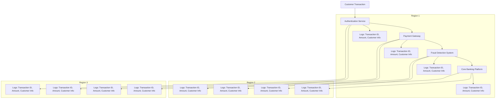
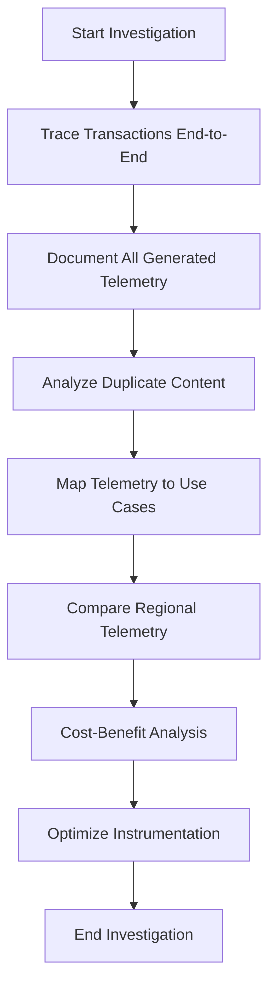
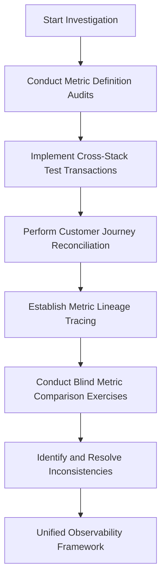
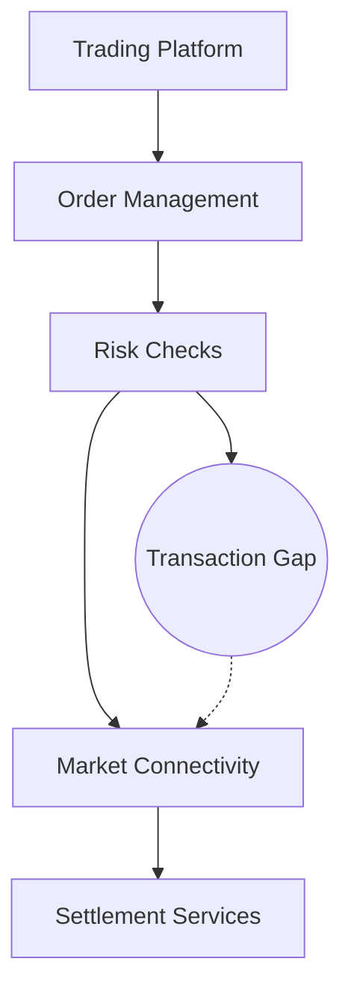
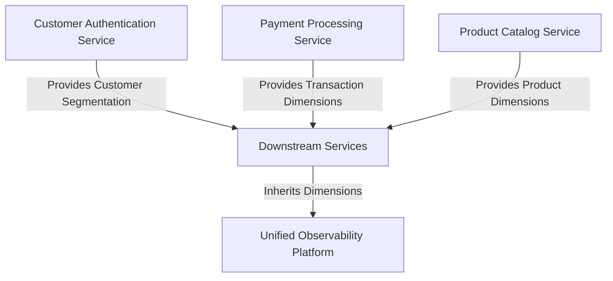

# Chapter 9: Distributed System Efficiency


## Chapter Overview

Welcome to distributed system efficiency: the art of not lighting piles of cash on fire just to feel “observant.” This chapter is a relentless tour through the seven deadly sins of modern banking observability—duplication, inconsistency, siloed context, regional echo chambers, uncorrelated chaos, metadata gluttony, and raw telemetry overload. Each one is a masterclass in how to turn your monitoring bill into a line item that makes CFOs choke on their coffee, all while drowning every incident in a tsunami of useless data.

You’ll see SREs frantically scrolling through dashboards, engineers arguing over who’s right while the customer’s wrong, and incident teams hunting for clues like overworked detectives in a Kafkaesque bureaucracy. The message: More data isn’t just noise—it’s a tax on your uptime, sanity, and bottom line. Efficiency means cutting telemetry dead weight, enforcing discipline, and building systems that see what matters (and only what matters). If you want to stop paying for the privilege of being confused, read on.

## Learning Objectives

- **Identify** and eradicate redundant telemetry across services, regions, and environments.
- **Standardize** metric definitions and calculation methods to end the “my dashboard is greener than yours” arguments.
- **Trace** transactions across service boundaries without losing context (or your mind).
- **Differentiate** observability strategies by region to avoid tripling your costs for no good reason.
- **Correlate** cross-domain events to quickly pinpoint root causes, not just symptoms.
- **Govern** metric dimensionality to stop the cardinality cancer before it metastasizes.
- **Aggregate** telemetry at the edge to shrink your data footprint and boost query performance.
- **Model** cost/benefit for every observability choice—because someone has to pay the bill.

## Key Takeaways

- Duplicating logs in every microservice and region isn’t “thorough”—it’s a money-burning ritual. Kill redundancy.
- Inconsistent metrics are the perfect way to make every incident twice as long and half as useful. Standardize or prepare for endless blame games.
- If your tracing breaks at every service boundary, you’re not “distributed”—you’re lost. Propagate context or enjoy the abyss.
- Monitoring every region at full blast isn’t “resilient.” It’s lazy, expensive, and guarantees alert fatigue. Be selective and dynamic.
- Correlation isn’t magic—it’s discipline. Without shared IDs and dimensions, you’re piecing together crime scenes with random puzzle pieces.
- Metric cardinality is exponential pain. Slap a governance process on every new label before it torpedoes your observability bill.
- Sending every raw metric upstream is a rookie mistake. Aggregate early, aggregate often, and keep raw data local unless there’s a damn good reason.
- Observability that scales linearly with infrastructure is a business model for your vendor, not for your bank. Optimize, or keep funding that yacht.
- Every telemetry decision is a trade-off. If you aren’t measuring the cost, you’re probably just paying it.

Get efficient, get ruthless, or get used to apologizing for outages you can’t explain.

## Panel 1: The Telemetry Tsunami
### Scene Description

A bustling banking operations center is filled with rows of monitoring screens, each displaying a sea of alerts from various regions. Engineers are hurriedly scrolling through dashboards, their faces tense as they monitor the sharp upward spike of the observability costs graph on a central screen.

To the left, a senior SRE stands in front of three screens arranged side by side. Each screen displays logs from the same payment processing service, but from different regional deployments. The logs are nearly identical, showing the same customer transaction journey—highlighting redundant telemetry data captured at each regional instance.

Below is a simplified representation of the scenario:



This visual illustrates how the same transaction generates redundant telemetry data across multiple services and regions, compounding the volume of observability data without adding significant troubleshooting insights.
### Teaching Narrative
In distributed banking systems, one of the most insidious observability anti-patterns is the unintentional duplication of telemetry across service instances, regions, and environments. When a single customer transaction flows through multiple microservices deployed across different regions, traditional instrumentation approaches often capture the same information repeatedly at each hop.

This redundancy happens because teams naturally instrument their own services in isolation, without considering the broader observability ecosystem. A payment transaction might generate nearly identical logs as it traverses the authentication service, the payment gateway, the fraud detection system, and the core banking platform—each service capturing similar context about the transaction identifier, amount, and customer information.

The problem compounds in multi-region deployments where banking regulations often require geographic redundancy. The same transaction details are frequently logged in each region, creating a multiplicative effect on data volume. What many teams fail to recognize is that this duplication rarely provides additional troubleshooting value while dramatically increasing observability costs.

An effective distributed observability strategy requires a system-wide perspective rather than a service-specific one. The goal isn't comprehensive logging at every point but rather strategic instrumentation that provides end-to-end visibility with minimal redundancy.
### Common Example of the Problem

A global bank implemented a new credit card payment processing system deployed across three regions (Americas, EMEA, and APAC) for regulatory compliance and disaster recovery. Each regional deployment contained identical microservices: an authentication service, payment gateway, fraud detection system, and transaction processor.

When a customer made a purchase, the same transaction generated nearly identical log entries across all components in the primary region. Additionally, for resilience, the transaction was replicated to the other regions, where the same verbose logging occurred again. A single $50 transaction could generate over 200 log entries, most containing duplicative information such as the transaction ID, amount, timestamp, merchant details, and customer identifiers.

The following table illustrates how telemetry data multiplies across services and regions for a single transaction:

| Region    | Service                | Number of Log Entries | Key Logged Data                                |
| --------- | ---------------------- | --------------------- | ---------------------------------------------- |
| Americas  | Authentication Service | 10                    | Transaction ID, amount, customer ID, timestamp |
| Americas  | Payment Gateway        | 20                    | Transaction ID, merchant details, amount       |
| Americas  | Fraud Detection System | 15                    | Transaction ID, fraud score, customer ID       |
| Americas  | Transaction Processor  | 25                    | Transaction ID, amount, processing status      |
| EMEA      | Authentication Service | 10                    | Transaction ID, amount, customer ID, timestamp |
| EMEA      | Payment Gateway        | 20                    | Transaction ID, merchant details, amount       |
| EMEA      | Fraud Detection System | 15                    | Transaction ID, fraud score, customer ID       |
| EMEA      | Transaction Processor  | 25                    | Transaction ID, amount, processing status      |
| APAC      | Authentication Service | 10                    | Transaction ID, amount, customer ID, timestamp |
| APAC      | Payment Gateway        | 20                    | Transaction ID, merchant details, amount       |
| APAC      | Fraud Detection System | 15                    | Transaction ID, fraud score, customer ID       |
| APAC      | Transaction Processor  | 25                    | Transaction ID, amount, processing status      |
| **Total** |                        | **210**               |                                                |

During a promotional event, transaction volume increased tenfold, causing the observability platform to ingest terabytes of redundant data. The monthly bill jumped from $30,000 to over $150,000, triggering an emergency cost review that revealed over 70% of collected telemetry was substantially duplicative and provided minimal additional troubleshooting value.

This example highlights the critical need for a system-wide approach to eliminate redundant telemetry and reduce observability costs without sacrificing end-to-end visibility.
### SRE Best Practice: Evidence-Based Investigation

SRE teams addressing telemetry duplication should implement a systematic investigation approach. Use the following checklist and workflow to guide your efforts and ensure actionable results:

#### Checklist for Evidence-Based Investigation
- [ ] **Conduct Telemetry Path Analysis**  
  Trace representative transactions end-to-end through all services and regions. Document every log entry, metric, and trace span generated to expose redundancy patterns.
- [ ] **Apply Duplicate Content Analysis**  
  Use text similarity algorithms or clustering methods to identify nearly identical log messages across services.
- [ ] **Perform Telemetry Value Mapping**  
  For each telemetry type, document its role in troubleshooting scenarios, dashboards, and alerts.
- [ ] **Measure Cross-Region Uniqueness**  
  Analyze telemetry from different regions to quantify differences in information entropy and identify unnecessary duplication.
- [ ] **Model Cost-Benefit Tradeoffs**  
  Calculate the cost of telemetry types versus their utility in incident resolution to prioritize valuable data and reduce waste.

#### Workflow for Evidence-Based Investigation


By following this checklist and workflow, SRE teams can systematically reduce telemetry duplication, ensuring observability costs are aligned with operational value.
### Banking Impact

Telemetry duplication in banking environments creates several critical business impacts, which can be summarized as follows:

| **Impact Area**                             | **Description**                                                                                                                                       | **Quantitative Impact**                                              |
| ------------------------------------------- | ----------------------------------------------------------------------------------------------------------------------------------------------------- | -------------------------------------------------------------------- |
| **Excessive Observability Costs**           | Unoptimized multi-region deployments lead to duplicated telemetry, inflating monitoring expenses.                                                     | Cost increases of 200-400% in multi-region expansions.               |
| **Reduced Incident Response Effectiveness** | Duplicate logs obscure critical signals, making it harder for engineers to identify root causes during incidents.                                     | MTTR increases by 25-50% during high-severity outages.               |
| **Regulatory Compliance Challenges**        | Over-logging increases the risk of violating data minimization regulations such as GDPR and CCPA, particularly when logging customer identifiers.     | Potential fines ranging from €10M to €20M or 2-4% of annual revenue. |
| **Infrastructure Scaling Pressure**         | The need to handle redundant telemetry drives up storage and processing requirements, increasing operational complexity and costs.                    | Additional infrastructure costs rise by 30-50% annually.             |
| **Budget Reallocation Impact**              | Resources spent on unnecessary telemetry cannot be invested in strategic areas like security, feature development, or system resilience improvements. | Opportunity cost: Up to 15% of annual IT budgets diverted.           |

**Key Insight:** Addressing telemetry duplication not only reduces costs but also improves operational efficiency, strengthens regulatory compliance, and enables better allocation of resources toward business-critical priorities.
### Implementation Guidance

To reduce telemetry duplication while maintaining essential visibility:

1. **Implement centralized instrumentation governance**:  
   Create a cross-team working group responsible for telemetry design across services. Establish standard patterns that designate authoritative logging points for different transaction attributes, eliminating redundant capture of the same information across multiple services. For example, use a shared library to enforce these standards across services:

   ```python
   # Shared logging helper for consistent telemetry
   def log_transaction(transaction_id, attributes, service_name, level="INFO"):
       if not attributes.get("is_authoritative"):
           return  # Skip non-authoritative logs
       log_entry = {
           "transaction_id": transaction_id,
           "service_name": service_name,
           **attributes
       }
       logger.log(level, log_entry)

   # Usage in individual services
   log_transaction(
       transaction_id="12345",
       attributes={"amount": 100, "currency": "USD", "is_authoritative": True},
       service_name="auth_service"
   )
   ```

2. **Develop regional telemetry differentiation**:  
   Configure primary regions to collect comprehensive telemetry while secondary regions capture only unique local information plus essential health indicators. Implement dynamic controls to adjust collection levels during failover scenarios. Example configuration for a dynamic telemetry agent:

   ```yaml
   telemetry:
     region: "secondary"
     collection_mode: "minimal"
     failover_dynamic_control: true
   ```

   During failover, the agent can dynamically switch to a comprehensive collection mode:

   ```yaml
   telemetry:
     region: "secondary"
     collection_mode: "comprehensive"
     failover_dynamic_control: false
   ```

3. **Create contextual enrichment services**:  
   Use a shared context propagation mechanism to avoid duplicating transaction details in logs. Pass transaction context IDs downstream and centralize context lookups. Example using OpenTelemetry:

   ```python
   from opentelemetry.trace import get_current_span

   # Propagate context
   span = get_current_span()
   span.set_attribute("transaction.id", "12345")

   # Downstream service retrieves context
   transaction_id = span.get_attribute("transaction.id")
   ```

   Centralized context lookup example:

   ```python
   # Context enrichment service
   def get_transaction_details(transaction_id):
       # Fetch details from a central store
       return transaction_store.get(transaction_id)

   details = get_transaction_details("12345")
   ```

4. **Deploy tiered sampling strategies**:  
   Implement progressive sampling rates to capture full transaction details sparingly. Configure sampling at each stage of the transaction lifecycle. Example using OpenTelemetry SDK:

   ```python
   from opentelemetry.sdk.trace.sampling import ParentBased, TraceIdRatioBased

   # Define sampling strategy
   sampler = ParentBased(
       root=TraceIdRatioBased(0.1)  # 10% root sampling
   )

   # Apply sampler to tracer provider
   tracer_provider = TracerProvider(sampler=sampler)
   ```

   Adjust sampling rates dynamically for deeper processing stages:

   ```python
   deeper_stage_sampler = TraceIdRatioBased(0.01)  # 1% sampling for deep stages
   tracer_provider.update_sampler(deeper_stage_sampler)
   ```

5. **Establish cross-region deduplication pipelines**:  
   Use telemetry processing pipelines to detect and consolidate duplicate information before ingestion. Example using Apache Kafka Streams for deduplication:

   ```java
   // Kafka Streams deduplication by transaction ID
   KStream<String, LogEntry> logs = builder.stream("telemetry-topic");

   KStream<String, LogEntry> deduplicatedLogs = logs
       .groupBy((key, value) -> value.getTransactionId())
       .reduce((aggValue, newValue) -> newValue)  // Keep latest log entry
       .toStream();

   deduplicatedLogs.to("deduplicated-telemetry-topic");
   ```

   This approach ensures region-specific anomalies can still be analyzed while reducing overall data volume. Combine this with differential analysis techniques to identify unique patterns in regional telemetry.
## Panel 2: Lost in Translation
### Scene Description

Two banking support teams are on a conference call, each viewing their own observability dashboards for the same service:

- **Team A's Dashboard**:
  - Metric: `Transaction Success Rate`
  - Value: **99.9% availability**

- **Team B's Dashboard**:
  - Metric: `Transaction Success Rate`
  - Value: **98.5% availability**

A heated discussion unfolds as both teams argue over which metric is accurate. Meanwhile, a customer service representative interrupts to report ongoing complaints about rejected transactions.

Below is a simplified representation of the conflict:

```
+----------------------+                 +----------------------+
|   Team A Dashboard   |                 |   Team B Dashboard   |
|----------------------|                 |----------------------|
| Transaction Success: |                 | Transaction Success: |
|       99.9%          |                 |       98.5%          |
+----------------------+                 +----------------------+
          |                                     |
          +-------------------------------------+
                        |
         "Which metric is correct?"
                        |
      +----------------------------------+
      |  Customer Complaints: Rejected  |
      |     Transactions Increasing     |
      +----------------------------------+
```

The scene underscores the frustration caused by conflicting observability data, delaying resolution and exacerbating customer dissatisfaction.
### Teaching Narrative
In distributed banking systems, observability consistency is just as critical as the data itself. When different teams or regions implement observability inconsistently, the result is often conflicting data that undermines trust and complicates incident response.

This inconsistency manifests in several ways. First, different teams may use varied naming conventions for the same metrics or logs. What one team calls "payment_success_rate" another might label "transaction_approval_percentage." Second, teams often implement different calculation methodologies—one team might count client timeouts as failures while another omits them entirely. Third, sampling rates and aggregation windows frequently differ across services, making cross-service comparisons impossible.

The consequences are severe: during incidents, teams waste precious time debating whose data is correct rather than solving the actual problem. Inconsistent measurements also create blind spots in service level objectives, as variations in measurement methodology can mask real issues.

This challenge is particularly acute in banking environments where different systems evolved over time—from mainframe core banking to modern cloud-native payment services—each with its own observability approach. These disparate systems must present a unified view for effective operations.

Creating observability consistency requires technical standards and governance—shared libraries, metric naming conventions, and consistent calculation methodologies. But equally important is the cultural shift toward viewing observability as a cross-system concern rather than a service-specific implementation.
### Common Example of the Problem

A major retail bank's mobile payment platform experienced customer complaints despite all monitoring dashboards showing "green" status. Investigation revealed fundamental inconsistencies in how different teams measured success:

| Team                        | Success Definition                          | Reported Metric | Key Gaps/Issues                                                                                   |
| --------------------------- | ------------------------------------------- | --------------- | ------------------------------------------------------------------------------------------------- |
| API Gateway Team            | HTTP 200 responses                          | 99.8% success   | Included responses with application-level error codes in the JSON payload, masking true failures. |
| Payment Processing Team     | Transactions reaching the payment processor | 99.5% success   | Ignored failures downstream during authorization or settlement phases.                            |
| Transaction Settlement Team | Completed end-to-end transactions           | 97.2% success   | Captured true customer experience but contradicted upstream dashboards.                           |

During a high-volume shopping period, the discrepancy widened as timely error detection was delayed by teams debating whose metrics were "correct" rather than addressing the growing authorization failure rate. Meanwhile, customer service received hundreds of complaints about declined transactions while engineering teams pointed to their mostly-green dashboards.
### SRE Best Practice: Evidence-Based Investigation

To resolve observability inconsistency, SRE teams should follow these evidence-based approaches. Use the checklist below to ensure a structured and effective investigation process:

#### Evidence-Based Investigation Checklist

1. **Conduct Metric Definition Audits**
   - Document how each team defines, collects, and calculates key metrics.
   - Include edge cases, error handling, and any assumptions made.
   - Compare definitions to identify discrepancies in methodology.

2. **Implement Cross-Stack Test Transactions**
   - Deploy synthetic transactions that simulate various failure modes.
   - Compare how observability systems across teams interpret these events.
   - Identify inconsistencies in error classification or success definitions.

3. **Perform Customer Journey Reconciliation**
   - Trace real customer transactions end-to-end across all systems.
   - Compare observability data with actual customer outcomes.
   - Validate that metrics reflect the real customer experience.

4. **Establish Metric Lineage Tracing**
   - Map the full lineage of key business metrics from raw instrumentation to final dashboards.
   - Identify transformation and aggregation points where inconsistencies may occur.
   - Ensure transparency in how metrics are processed and displayed.

5. **Conduct Blind Metric Comparison Exercises**
   - Assign teams to independently investigate the same incident using their own tools.
   - Host a structured review to compare findings and processes.
   - Highlight gaps caused by inconsistent metrics during real-world troubleshooting.

---

#### Flowchart: Evidence-Based Investigation Process



By following this checklist and process, SRE teams can systematically uncover and address inconsistencies in observability, fostering more effective collaboration and incident resolution.
### Banking Impact
Inconsistent observability creates serious business consequences in banking environments:

1. **Extended incident resolution times**: Banks report 30-50% longer MTTR when teams debate metric validity rather than collaborating on resolution.

2. **Reduced customer trust**: When internal systems show "all green" while customers experience failures, it damages credibility and increases support costs.

3. **Regulatory reporting risks**: Inconsistent metrics can lead to inaccurate reporting to financial regulators, potentially resulting in compliance violations and penalties.

4. **Investment misallocation**: Teams may optimize for metrics that don't accurately reflect customer experience, leading to misplaced engineering effort.

5. **Increased operational risk**: Measurement inconsistencies can mask emerging stability issues until they reach critical customer impact levels.
### Implementation Guidance

To establish consistent observability across distributed banking systems:

1. **Create a unified metric dictionary**:  
   Develop a centralized registry defining standard metrics, including precise calculation methodologies, inclusion/exclusion criteria, and appropriate use cases. Make this dictionary available to all teams through a searchable internal platform. Below is an example JSON schema for defining metrics in the dictionary:

   ```json
   {
       "metric_name": "payment_success_rate",
       "description": "The percentage of successfully processed payments.",
       "calculation_methodology": "successful_payments / total_attempted_payments * 100",
       "inclusion_criteria": ["Completed payments", "Approved transactions"],
       "exclusion_criteria": ["Client timeouts", "Canceled transactions"],
       "use_cases": ["SLI tracking", "Incident response"]
   }
   ```

2. **Implement shared instrumentation libraries**:  
   Develop and maintain language-specific libraries that implement standardized metrics collection, ensuring consistent methodology across services regardless of team ownership or technology stack. For example, a Python-based shared library might include:

   ```python
   from observability_lib.metrics import MetricsCollector

   collector = MetricsCollector(service_name="payment_service")

   def process_transaction(transaction):
       if transaction.success:
           collector.increment("payment_success")
       else:
           collector.increment("payment_failure")
   ```

3. **Establish end-to-end transaction identifiers**:  
   Implement consistent correlation IDs that follow transactions across all system boundaries, enabling accurate tracking of success rates and performance at each stage without methodology discrepancies. Use this workflow to propagate correlation IDs:

   ```text
   [Client Request]
        |
        v
   [API Gateway] -- Generates or validates correlation ID
        |
        v
   [Service A] -- Logs and propagates correlation ID
        |
        v
   [Service B] -- Logs and propagates correlation ID
        |
        v
   [Database / External Systems]
   ```

   Ensure all logs and metrics include the correlation ID to facilitate seamless tracing.

4. **Deploy observability consistency validation**:  
   Add automated tests to CI/CD pipelines that verify new services adhere to established observability standards. Example test flow for validation:

   ```mermaid
   flowchart TD
       A[Code Change Submitted] --> B[Run Observability Tests]
       B --> C{Are Standards Followed?}
       C -- Yes --> D[Merge to Main Branch]
       C -- No --> E[Fail Build with Error Report]
   ```

   These tests should check for adherence to naming conventions, metric schemas, and correlation ID propagation.

5. **Create unified customer journey dashboards**:  
   Develop executive-level dashboards that focus on complete customer transaction journeys rather than individual service metrics. For example, a dashboard might display:

   ```text
   Customer Journey Dashboard:
   --------------------------------
   Step 1: API Gateway    - 99.95% Success
   Step 2: Payment Service - 99.89% Success
   Step 3: Fraud Check     - 99.92% Success
   Overall Success Rate    - 99.85%
   --------------------------------
   Alerts: 2 Transaction Failures (Fraud Check)
   ```

   This approach establishes a single authoritative view of system health that transcends team boundaries and avoids metric disputes.
## Panel 3: The Cross-Service Abyss
### Scene Description

A senior engineer traces a failed trade execution through multiple banking systems. Her screen shows a transaction flowing through various services: trading platform, order management, risk checks, market connectivity, and settlement services. While the transaction's entry and exit points are visible in each individual service, there is a critical gap where the transaction disappears between services, leaving no visibility into what went wrong.

Below is a representation of the transaction flow, highlighting the gap in visibility:



In this flow, the transaction follows a sequential path through the services. However, the gap (represented as "Transaction Gap") indicates where the transaction disappeared without explanation, making it impossible for the engineer to pinpoint the failure's root cause.
### Teaching Narrative
In modern distributed banking systems, one of the most challenging observability problems is maintaining transaction context as requests traverse multiple services. When a trade execution fails, for example, the failure might occur anywhere in a complex chain involving order capture, validation, risk checks, market connectivity, execution, confirmation, and settlement services.

Traditional monitoring approaches create service-level silos, where each component has visibility only into its own behavior. This leads to the "it worked on my end" problem, where each team verifies their service functioned correctly, but no one can identify where the transaction actually failed.

Distributed tracing emerged as a solution to this challenge, providing end-to-end visibility into transaction flows. However, in high-volume banking systems, naïve implementations of distributed tracing can generate overwhelming data volumes and unsustainable costs. A single high-frequency trading system might generate millions of traces daily, with each trace containing dozens of spans across services.

The cost-aware approach to cross-service observability requires selective tracing strategies. Rather than tracing every transaction, efficient systems trace a statistical sample of normal transactions while ensuring comprehensive tracing of anomalous paths. For example, a payment processing platform might trace only 1% of successful transactions but 100% of transactions with unusual latency patterns or error responses.

This selective approach requires coordination across services. If the payment gateway decides to trace a specific transaction, downstream services must honor that decision rather than making independent sampling choices. This contextual propagation ensures complete end-to-end visibility for selected transactions while controlling overall data volume.
### Common Example of the Problem

A global investment bank implemented a new equities trading platform composed of 14 different microservices handling various aspects of the trade lifecycle. During the first week of operation, approximately 2.3% of trades failed to execute properly, but determining the exact failure point proved nearly impossible.

When investigating a specific failed trade, engineers discovered a troubling pattern: the order successfully passed through the order management system, trade validation, and risk approval services. Logs showed it was then forwarded to the market connectivity service—but no corresponding entry appeared in that service's logs. The market connectivity team insisted they never received the order, while the risk approval team showed evidence of successful transmission.

The challenge was visualized as follows:

```
Order Flow:
[Order Management] --> [Trade Validation] --> [Risk Approval] --> [Market Connectivity]
                   |                          |                        
                   |                          +--> Order sent, no log in Market Connectivity
                   +--> Success               |                        
                                              +--> No visibility of failure point
```

Without cross-service context propagation, there was no way to definitively determine what happened between services. Was the message lost in the network? Did an asynchronous queue drop the message? Was there a serialization issue in the handoff? The engineering teams spent 37 hours on investigation and ultimately had to implement temporary full-fidelity logging across all services, increasing their daily observability costs from $3,000 to $17,000 per day just to capture enough data to identify the root cause.
### SRE Best Practice: Evidence-Based Investigation

To address cross-service visibility gaps, SRE teams should implement these investigation practices. Use the checklist below to ensure a thorough and structured approach during troubleshooting:

#### Checklist for Evidence-Based Investigation
- [ ] **Distributed Transaction Reconstruction**:
  - Collect logs, metrics, and partial traces across all relevant services.
  - Manually reconstruct transaction flows to locate boundaries where context is lost.
  - Identify systemic gaps in context propagation patterns.

- [ ] **Gap-Focused Fault Injection**:
  - Inject controlled failures at service boundaries to test context propagation.
  - Observe how context is maintained or lost during these failures.
  - Identify specific handoff patterns lacking proper instrumentation.

- [ ] **Trace Sampling Validation**:
  - Verify that trace sampling decisions made at entry points propagate correctly across the service chain.
  - Check for inconsistent sampling implementations that disrupt trace continuity.

- [ ] **Message Broker Instrumentation Analysis**:
  - Review how context propagation is handled across message brokers and queues in asynchronous systems.
  - Investigate whether trace continuity is broken during queue processing or message handoffs.

- [ ] **Header Propagation Review**:
  - Audit trace context header propagation across all communication patterns (e.g., synchronous HTTP, asynchronous messaging, batch file processing).
  - Validate that every service and protocol maintains proper context propagation.

#### Troubleshooting Flow Example

```plaintext
[Start] -> [Reconstruct Transaction] -> [Inject Faults] -> [Validate Sampling] -> [Analyze Brokers] -> [Review Headers] -> [End]
```

By following this checklist, SRE teams can systematically identify and address visibility gaps, ensuring consistent and actionable context propagation across services.
### Banking Impact

Cross-service visibility gaps create significant business consequences in banking systems. The table below summarizes these impacts, highlighting the associated metrics and outcomes:

| **Business Consequence**                | **Impact**                                                     | **Details**                                                                                   |
| --------------------------------------- | -------------------------------------------------------------- | --------------------------------------------------------------------------------------------- |
| **Extended recovery time**              | MTTR increases by 300-400%                                     | Diagnosing cross-service issues takes significantly longer compared to single-service issues. |
| **Increased transaction failure rates** | Higher error repetition and reduced transaction success rates  | Without visibility, errors persist for hours or days, directly affecting customer operations. |
| **Excessive remediation costs**         | Elevated operational expenses                                  | Over-provisioned fixes address symptoms rather than root causes, inflating resource usage.    |
| **Compliance documentation gaps**       | Non-compliance with regulatory audit requirements              | Missing cross-service tracing disrupts mandated transaction audit trails.                     |
| **Customer compensation expenses**      | Direct financial losses due to extended issue resolution times | Prolonged transaction failures lead to compensations, impacting bank profitability.           |
### Implementation Guidance

To establish cost-effective cross-service observability:

1. **Implement W3C Trace Context standards**:  
   Adopt the W3C Trace Context specification for propagating distributed trace information between services. Ensure all teams use compatible implementations that maintain context across service boundaries regardless of technology stack. Below is an example of how W3C Trace Context headers can be propagated in a Python service using the `opentelemetry` library:

   ```python
   from opentelemetry import trace
   from opentelemetry.trace.propagation.tracecontext import TraceContextTextMapPropagator
   from opentelemetry.sdk.trace import TracerProvider
   from opentelemetry.sdk.trace.export import BatchSpanProcessor, ConsoleSpanExporter
   from opentelemetry.instrumentation.requests import RequestsInstrumentor

   # Set up a tracer provider
   trace.set_tracer_provider(TracerProvider())
   tracer = trace.get_tracer(__name__)
   span_processor = BatchSpanProcessor(ConsoleSpanExporter())
   trace.get_tracer_provider().add_span_processor(span_processor)

   # Enable context propagation for HTTP requests
   RequestsInstrumentor().instrument()

   # Sample HTTP request with trace context propagation
   def make_request_with_trace_context():
       with tracer.start_as_current_span("parent-span") as span:
           headers = {}
           TraceContextTextMapPropagator().inject(headers)
           response = requests.get("http://example.com/api", headers=headers)
           print(f"Response status: {response.status_code}")

   make_request_with_trace_context()
   ```

2. **Deploy strategic sampling policies**:  
   Configure instrumentation to trace 100% of error cases, unusual patterns, and high-value transactions while sampling lower percentages of routine operations. Implement head-based sampling decisions that are respected across all service boundaries. Here’s an example of configuring sampling in a Java-based system using OpenTelemetry:

   ```java
   import io.opentelemetry.sdk.trace.samplers.Sampler;
   import io.opentelemetry.sdk.trace.SdkTracerProvider;

   // Set up a tracer provider with parent-based sampling to ensure downstream services respect decisions
   SdkTracerProvider tracerProvider = SdkTracerProvider.builder()
           .setSampler(Sampler.parentBased(Sampler.traceIdRatioBased(0.01)))  // Sample 1% of traces
           .build();

   // Use the tracer provider for instrumentation
   OpenTelemetrySdk.builder().setTracerProvider(tracerProvider).build();
   ```

3. **Create service boundary testing**:  
   Develop specific tests that verify trace context propagation across every service boundary. Add these tests to CI/CD pipelines to prevent deployment of changes that would break cross-service visibility. Here’s a simple example of a test to verify trace headers in an HTTP service boundary using Python’s `unittest` framework:

   ```python
   import unittest
   from your_service import app

   class TraceContextPropagationTest(unittest.TestCase):
       def test_trace_context_propagation(self):
           client = app.test_client()
           headers = {
               "traceparent": "00-4bf92f3577b34da6a3ce929d0e0e4736-00f067aa0ba902b7-01"
           }
           response = client.get("/endpoint", headers=headers)
           self.assertIn("traceparent", response.headers)
           self.assertEqual(response.headers["traceparent"], headers["traceparent"])
   ```

4. **Establish asynchronous context bridges**:  
   For message queue-based communications, implement consistent patterns for serializing and deserializing trace context in message headers or payloads. This ensures trace continuity across asynchronous boundaries where traditional HTTP header propagation doesn’t apply. Below is an example for Kafka using the `opentelemetry-instrumentation-kafka` package:

   ```python
   from opentelemetry.instrumentation.kafka import KafkaInstrumentor
   from kafka import KafkaProducer, KafkaConsumer

   # Instrument Kafka
   KafkaInstrumentor().instrument()

   # Producer: Propagate trace context in message headers
   producer = KafkaProducer(bootstrap_servers='localhost:9092')
   headers = []
   TraceContextTextMapPropagator().inject(headers)
   producer.send('topic', key=b'key', value=b'value', headers=headers)

   # Consumer: Extract trace context from message headers
   consumer = KafkaConsumer('topic', bootstrap_servers='localhost:9092')
   for message in consumer:
       context = TraceContextTextMapPropagator().extract(dict(message.headers))
       with tracer.start_as_current_span("consumer-span", context=context):
           print(f"Processed message: {message.value}")
   ```

5. **Implement incremental adoption strategies**:  
   For legacy systems that cannot directly implement modern tracing, create integration shims that map traditional logging to trace-compatible formats. This creates end-to-end visibility without requiring complete replatforming of heritage banking systems. For example, a legacy system using basic logging can be adapted to emit trace-compatible logs as shown below:

   ```python
   import logging
   from opentelemetry.sdk.trace.export import BatchSpanProcessor, SimpleSpanProcessor
   from opentelemetry.sdk.trace.export import ConsoleSpanExporter

   # Configure logging to include trace context
   logging.basicConfig(format='%(asctime)s [trace_id=%(trace_id)s span_id=%(span_id)s] %(message)s')
   logger = logging.getLogger()

   # Example: Logging trace identifiers
   with tracer.start_as_current_span("legacy-span") as span:
       trace_id = format(span.get_span_context().trace_id, '032x')
       span_id = format(span.get_span_context().span_id, '016x')
       logger.info("Processing transaction", extra={"trace_id": trace_id, "span_id": span_id})
   ```
## Panel 4: Regional Deployment Redundancies
### Scene Description

A global bank's monitoring team reviews their observability platform usage dashboard, showing three nearly identical peaks in data volume across their Americas, EMEA, and APAC environments. The system architect draws attention to a surge in costs where the same canary testing and synthetic transaction monitoring is running at full fidelity in all regions, essentially triplicating observability costs for identical insights.

```
Data Volume Peaks Across Regions:
```
Americas    ██████████
EMEA        ██████████
APAC        ██████████
```

This visualization highlights the redundancy in observability data collection, with identical patterns across all three regions.
```
### Teaching Narrative
Financial institutions typically deploy systems across multiple geographic regions for regulatory compliance, disaster recovery, and customer proximity. However, these multi-region deployments often lead to unnecessary observability data duplication when teams implement identical monitoring in each environment.

The pattern manifests in several common ways. First, synthetic monitoring and canary testing frequently run at the same frequency and fidelity in all regions, despite these tests validating identical code paths. Second, internal system health metrics like JVM statistics, container resources, and infrastructure telemetry are often collected at full resolution across all regions. Third, pre-production environments in each region typically implement the same comprehensive observability as production, creating further multiplication.

This regional redundancy rarely provides proportional troubleshooting value. When an issue occurs in the payment authorization service, for instance, detailed observability in one region is typically sufficient to diagnose the problem—the same code running in other regions will exhibit identical behavior for identical inputs.

Cost-efficient observability in multi-region deployments requires differentiated strategies. For synthetic monitoring, comprehensive testing in one primary region coupled with minimal verification in secondary regions often provides sufficient coverage. For system health metrics, standard telemetry can use higher aggregation levels or lower capture frequency in secondary regions. For pre-production environments, sampling rates can be dramatically reduced compared to production.

Importantly, these strategies must be dynamic—when an incident occurs in any region, observability fidelity should automatically increase in that specific location while remaining reduced elsewhere. This approach maintains troubleshooting capabilities while avoiding the cost of perpetually comprehensive observability across all environments.
### Common Example of the Problem

A global bank operated a credit card processing platform deployed in three geographic regions (North America, Europe, and Asia-Pacific) to meet regulatory requirements and ensure 24/7 availability. Each regional deployment was identical—running the same code and infrastructure—with active-active configuration allowing any region to process transactions.

To ensure reliability, the bank implemented comprehensive synthetic transaction testing that executed 25 different customer scenarios every 5 minutes in each region. Additionally, detailed infrastructure metrics were collected at 15-second resolution for all components across all regions, and full distributed tracing was enabled for 10% of all transactions region-wide. This approach resulted in significant data duplication across regions, leading to disproportionately high costs and inefficiencies.

Below is a summary of the telemetry types, their configurations, and the observed duplication impact:

| **Telemetry Type**            | **Configuration**                          | **Duplication Percentage** | **Cost Contribution** |
| ----------------------------- | ------------------------------------------ | -------------------------- | --------------------- |
| Synthetic Transaction Testing | 25 scenarios every 5 minutes per region    | 90%                        | $150,000              |
| Infrastructure Metrics        | 15-second resolution across all components | 95%                        | $180,000              |
| Distributed Tracing           | 10% of transactions per region             | 85%                        | $120,000              |

During a routine cost review, the observability team discovered they were spending $450,000 monthly on their observability platform, with nearly identical data collection profiles across all three regions. Further analysis revealed that 92% of the collected telemetry from secondary regions was effectively duplicative—most issues detected in one region were present in all regions due to shared codebase and configuration, making the triplicate monitoring largely redundant.

More concerning, when a critical issue occurred in the European region's transaction processor, engineers were overwhelmed by alerting from all three regions simultaneously. This alert flood actually delayed resolution as the team struggled to determine where to focus their efforts, despite having massive amounts of essentially identical telemetry data.
### SRE Best Practice: Evidence-Based Investigation

To address regional telemetry redundancy, SRE teams should implement evidence-based investigation techniques. The following checklist summarizes five key approaches for practical application:

#### Checklist: Evidence-Based Investigation Techniques
- [ ] **Cross-Region Telemetry Correlation Analysis**  
  Compare metrics, logs, and traces across regions during both normal operations and incidents. Look for high correlation coefficients (e.g., >0.95) that indicate redundancy.

- [ ] **Failure Domain Isolation Testing**  
  Inject controlled failures in each region and measure the observability differential. Identify unique insights provided by each region's telemetry versus duplicative data.

- [ ] **Observability Value Stream Mapping**  
  Trace how telemetry from each region is used in dashboards, alerts, and troubleshooting workflows. Determine if secondary region data is primarily used only during region-specific incidents.

- [ ] **Historical Incident Telemetry Utilization Analysis**  
  Review past incidents to identify which regional telemetry contributed to resolution. Confirm if most resolutions relied on primary region data, with secondary region data providing confirmation.

- [ ] **Cost-Per-Insight Analysis**  
  Calculate the cost of insights uniquely derived from each region's telemetry. Highlight regions where the cost of redundant data far outweighs the value of unique insights.

#### Implementation Tip
Use automation to periodically re-run these investigations, ensuring your observability strategy evolves dynamically as deployment patterns and workloads change. Dynamic adjustments based on real-time findings can further optimize costs while maintaining troubleshooting capabilities.
### Banking Impact

Regional observability redundancy creates significant business impacts in banking environments:

1. **Excessive observability expenditure**: Banks typically overspend observability budgets by 150-200% due to regional duplication without corresponding value increase.
   - Example: A large bank observed that running full-fidelity synthetic monitoring in three regions resulted in an additional $2 million annually in observability costs, while providing minimal incremental troubleshooting value.

2. **Alert fatigue and delayed response**: Multiple alerts for the same underlying issue across regions create noise that delays incident response, directly impacting mean time to resolution.
   - Example: During a payment processing outage, engineers received over 300 alerts across the Americas, EMEA, and APAC regions for identical failures, causing a 45-minute delay in identifying the root cause.

3. **Resource misallocation**: Engineering resources spent maintaining duplicate monitoring configurations across regions could be redirected to higher-value resilience improvements.
   - Example: A DevOps team spent 20% of their quarterly sprint cycles managing redundant monitoring setups across five regions instead of optimizing disaster recovery processes.

4. **Compliance inefficiencies**: Regulatory requirements for regional isolation are often used to justify redundant monitoring, but more efficient approaches can satisfy compliance while reducing duplication.
   - Example: A bank running full-resolution infrastructure telemetry in all regions for compliance discovered that aggregated metrics with region-specific incident triggers met regulatory needs while saving 40% on storage and processing costs.

5. **Scalability limitations**: As banks add new regions or cloud deployments, linear scaling of observability costs becomes increasingly unsustainable, potentially limiting expansion options.
   - Example: A global bank’s expansion into two additional regions increased observability costs by 70%, prompting leadership to halt further deployments until a cost-effective monitoring strategy was implemented.
### Implementation Guidance

To optimize multi-region observability without sacrificing visibility:

1. **Implement hierarchical synthetic monitoring**: Deploy comprehensive synthetic transaction testing in one primary region while running only critical path verification in secondary regions. Configure automated failover of comprehensive testing to secondary regions during primary region incidents or maintenance. Below is an example configuration snippet for a synthetic monitoring tool:

    ```yaml
    synthetic_tests:
      regions:
        primary:
          - test_name: "full_suite"
            frequency: "1m"
            paths:
              - "/login"
              - "/checkout"
              - "/transfer"
        secondary:
          - test_name: "critical_paths"
            frequency: "10m"
            paths:
              - "/login"
              - "/checkout"
    failover:
      enabled: true
      trigger: "primary_region_outage"
      action: "promote_critical_paths_to_full_suite"
    ```

2. **Create tiered metric collection policies**: Develop differentiated collection strategies where one region captures high-resolution metrics (15-second intervals) while others collect at lower resolution (5-minute intervals) during normal operations. Implement dynamic controls that automatically increase resolution in any region experiencing anomalies. Example configuration for a telemetry pipeline:

    ```json
    {
      "metric_collection": {
        "regions": {
          "primary_region": {
            "interval": "15s",
            "aggregation": "none"
          },
          "secondary_regions": {
            "interval": "5m",
            "aggregation": "average"
          }
        },
        "dynamic_control": {
          "anomaly_trigger": true,
          "escalation_action": {
            "region": "affected",
            "interval": "15s",
            "aggregation": "none"
          }
        }
      }
    }
    ```

3. **Deploy regional trace sampling differentiation**: Configure distributed tracing to capture higher sampling rates (10-15%) in one region while implementing lower rates (1-3%) in others. Ensure the ability to temporarily increase sampling in any region during incidents or deployments. Example configuration for trace sampling:

    ```yaml
    tracing:
      sampling:
        primary_region: 0.15
        secondary_regions: 0.03
      dynamic_sampling:
        incident_trigger:
          region: "affected"
          rate: 0.15
    ```

4. **Establish cross-region alerting deduplication**: Implement intelligent alert correlation that recognizes when the same underlying issue affects multiple regions, consolidating notifications rather than triggering separate alerts for each region. Example pseudocode for alert deduplication logic:

    ```python
    def deduplicate_alerts(alerts):
        correlated_alerts = {}
        for alert in alerts:
            issue_key = generate_issue_key(alert)
            if issue_key not in correlated_alerts:
                correlated_alerts[issue_key] = alert
            else:
                correlated_alerts[issue_key].merge(alert)
        return correlated_alerts
    ```

5. **Create environment-aware observability configurations**: Develop configuration management practices that automatically apply appropriate observability profiles based on environment type (production, staging, development) and regional role (primary, secondary). This prevents duplicate high-fidelity collection across all environments by default. Example configuration for environment-aware observability profiles:

    ```yaml
    observability_profiles:
      production:
        primary_region:
          metrics: "high_fidelity"
          traces: "15%_sampling"
          logs: "full"
        secondary_regions:
          metrics: "low_fidelity"
          traces: "3%_sampling"
          logs: "errors_only"
      staging:
        all_regions:
          metrics: "low_fidelity"
          traces: "1%_sampling"
          logs: "errors_only"
      development:
        all_regions:
          metrics: "minimal"
          traces: "disabled"
          logs: "disabled"
    ```
## Panel 5: The Correlation Conundrum
### Scene Description

An incident response team huddles around screens displaying separate observability dashboards for multiple banking systems:

- **Engineer A**: Examining transaction logs from the payment gateway.
- **Engineer B**: Reviewing infrastructure metrics from the database cluster.
- **Engineer C**: Scrolling through application performance metrics.

Despite their efforts, the team struggles to piece together the narrative. The disjointed dashboards lack shared identifiers, making it nearly impossible to determine whether database latency spikes are causing payment failures.

#### Text Diagram: Disjointed Observability Dashboards

```plaintext
+---------------------+       +-------------------+       +---------------------+
| Payment Gateway     |       | Database Cluster  |       | Application Metrics |
| Transaction Logs    |       | Infrastructure    |       | Performance Metrics |
+---------------------+       +-------------------+       +---------------------+
         |                            |                           |
         v                            v                           v
  (No shared context)      (No causal links)         (Disconnected insights)

```

The lack of correlation between these systems leaves the team with fragmented data, forcing them to rely on manual, time-consuming investigations during critical incidents.
### Teaching Narrative
One of the most persistent challenges in distributed banking system observability is correlation—connecting events across separate observability domains to establish cause-effect relationships. Traditional approaches create silos between metrics, logs, traces, and events, making it difficult to understand how infrastructure issues impact application performance or how service failures affect customer transactions.

This correlation challenge has historically led to an inefficient approach: collecting excessive data in each domain hoping to manually piece together the system narrative during incidents. Teams capture verbose logs, high-frequency metrics, and comprehensive traces, dramatically increasing observability costs while still struggling to connect the dots during critical incidents.

Cost-effective correlation requires both technical implementation and strategic approaches. First, all observability signals must share consistent dimensions and identifiers. When a database latency spike occurs, the infrastructure metrics should include the same service identifiers used in application logs, enabling automatic correlation without manual investigative work.

Second, observability systems should implement unified search and context propagation. Request IDs, trace identifiers, and correlation tokens must flow across system boundaries, allowing teams to pivot seamlessly between metrics, logs, and traces during investigation.

Third, and most important for cost efficiency, is the implementation of directed acyclic graphs (DAGs) of causal relationships between services. These relationship maps allow observability systems to automatically increase data collection in interdependent services when anomalies are detected in any component. For example, when a database exhibits unusual latency, the system can temporarily increase logging verbosity in consumer services likely to be affected, rather than maintaining verbose logging everywhere perpetually.

This targeted, relationship-aware approach to cross-domain observability provides comprehensive insights during incidents while dramatically reducing baseline data collection during normal operations.
### Common Example of the Problem

A major retail bank experienced a 30-minute disruption in its mobile banking application, preventing customers from viewing transactions or making payments. The incident began at 10:15 AM and wasn't fully diagnosed until 10:45 AM, despite extensive monitoring across all components.

The root cause was ultimately identified as a database connection pool exhaustion in the account history service. However, the investigation was significantly delayed because the information existed in completely separate observability systems with no correlation between them:

- **10:13 AM**: Infrastructure metrics captured in the database monitoring system show the connection pool reaching its limits.
- **10:15 AM**: Application logs in the mobile API gateway indicate rising HTTP 500 errors.
- **10:17 AM**: Payment service dashboards report transaction failures, showing increased errors in payment processing.
- **10:20 AM - 10:45 AM**: Engineers manually compare timestamps and cross-reference transaction IDs across four disconnected observability systems to identify the root cause.

Below is a timeline diagram illustrating the sequence of events across the systems and the lack of correlation that delayed diagnosis:

```mermaid
gantt
    title Incident Timeline - Correlation Challenge
    dateFormat HH:mm
    section Database Metrics
    Connection Pool Limit Reached :done, des1, 10:13, 2m
    section Mobile API Gateway Logs
    HTTP 500 Errors Begin :done, des2, 10:15, 15m
    section Payment Service Dashboard
    Transaction Failures Start :done, des3, 10:17, 13m
    section Incident Team Investigation
    Manual Correlation and Analysis :active, des4, 10:20, 25m
```



Despite having all the necessary data, the incident team spent over 20 minutes manually comparing timestamps and attempting to establish cause-effect relationships between these disconnected signals. Engineers had to manually cross-reference transaction IDs across four different systems, each with different data formats, timestamps, and service naming conventions.

This correlation challenge turned what should have been a quick diagnosis into an extended investigation. Thousands of customers were directly impacted during the morning peak period, resulting in a significant disruption to critical banking services.
### SRE Best Practice: Evidence-Based Investigation

To address correlation challenges, SRE teams should implement these investigation practices. Use the following checklist to guide your efforts during incidents:

#### Checklist: Evidence-Based Investigation Steps
- [ ] **Conduct Temporal Pattern Analysis**
  - Align time-series data from multiple observability domains: infrastructure, application, and business.
  - Identify cascading failure patterns and cause-effect relationships.
  - Look for propagation delays between initial anomalies and subsequent impacts.

- [ ] **Implement Cross-Domain Identifier Tracing**
  - Trace the flow of identifiers (transaction IDs, request IDs, correlation tokens) across system boundaries.
  - Identify gaps in context propagation that hinder automatic correlation.

- [ ] **Create Dependency Impact Mapping**
  - Document how anomalies in one system domain correlate with effects in others during incidents.
  - Use this data to refine service dependency models and improve impact predictions.

- [ ] **Perform Service Boundary Instrumentation Analysis**
  - Investigate how context is passed between systems, especially across technology boundaries (e.g., Java to .NET).
  - Pay attention to transitions between teams with differing instrumentation practices, as these are common blind spots.

- [ ] **Analyze Metric Dimensional Consistency**
  - Check for consistent usage of dimensions (e.g., service names, environment identifiers, failure categories) across metrics, logs, and traces.
  - Address any inconsistencies that prevent automatic correlation.

By following this structured checklist, teams can adopt a methodical, evidence-based approach to uncovering root causes and improving cross-domain observability during incidents.
### Banking Impact

Poor observability correlation creates significant business consequences in banking environments. The following table summarizes the key impacts, associated costs, and examples:

| **Impact**                              | **Estimated Cost**                         | **Examples**                                                                             |
| --------------------------------------- | ------------------------------------------ | ---------------------------------------------------------------------------------------- |
| **Extended incident impact**            | 40-60% increase in mean time to resolution | Complex incidents requiring cross-domain correlation slow down root cause analysis.      |
| **Increased downtime costs**            | $100,000-300,000 per hour during outages   | Retail banking outages resulting in lost transactions and reduced customer trust.        |
| **Excessive observability expenditure** | 70-100% increase in data collection costs  | Over-collection of logs, metrics, and traces across all domains to compensate for silos. |
| **Misattributed root causes**           | Recurring costs due to unresolved issues   | Ineffective remediation leads to repeated failures, increasing operational risks.        |
| **Operational capacity reduction**      | Reduced engineering efficiency             | Engineers spend excessive time manually correlating data, limiting focus on innovation.  |

Addressing these challenges requires a shift toward integrated observability strategies, enabling faster, more accurate incident resolution while optimizing operational costs.
### Implementation Guidance

To establish cost-effective observability correlation:

1. **Implement unified correlation identifiers**: Create a standard correlation ID format that propagates across all system boundaries. These identifiers should consistently appear in logs, metrics, and traces, allowing automatic linkage between observability signals. Below is an example of how to propagate a correlation ID in a distributed Python application using a middleware approach:

   ```python
   from flask import Flask, request, g
   import uuid
   import logging

   app = Flask(__name__)
   logging.basicConfig(level=logging.INFO)

   # Middleware to generate or propagate correlation ID
   @app.before_request
   def inject_correlation_id():
       correlation_id = request.headers.get('X-Correlation-ID', str(uuid.uuid4()))
       g.correlation_id = correlation_id
       # Add correlation ID to logs
       logging.info(f"Request received with Correlation ID: {correlation_id}")

   @app.after_request
   def add_correlation_id_to_response(response):
       response.headers['X-Correlation-ID'] = g.correlation_id
       return response

   @app.route("/")
   def index():
       return "Hello, World!"

   if __name__ == "__main__":
       app.run(debug=True)
   ```

2. **Deploy consistent dimensional metrics**: Standardize the dimensions for metrics across all telemetry sources. For example, ensure metrics from both application and infrastructure layers include dimensions like `service_name`, `environment`, and `component_type`. Here’s an example configuration in Prometheus using consistent labels:

   ```yaml
   scrape_configs:
     - job_name: 'application_metrics'
       metrics_path: '/metrics'
       static_configs:
         - targets: ['app1:9100', 'app2:9100']
       relabel_configs:
         - source_labels: ['__address__']
           target_label: 'service_name'
           replacement: 'payment_gateway'
         - source_labels: ['__meta_kubernetes_namespace']
           target_label: 'environment'
         - source_labels: ['__meta_kubernetes_pod_label_app']
           target_label: 'component_type'
   ```

3. **Create cross-domain observability dashboards**: Develop integrated dashboards that combine logs, metrics, and traces on a unified timeline. Use tools like Grafana or Kibana to visualize these correlations. Include pre-configured filters for dependencies, such as `service_name` or `trace_id`, to automatically display related data.

4. **Establish causal relationship mapping**: Document service and component dependencies in a machine-readable format, such as a directed acyclic graph (DAG). Here’s a simplified example using the Mermaid syntax:

   ```mermaid
   graph TD
       A[Payment Gateway] --> B[Database]
       A --> C[Notification Service]
       B --> D[Storage Service]
       C --> E[Email Provider]
   ```

   This relationship data can be ingested by observability tools to automate impact analysis during incidents.

5. **Implement selective context enrichment**: Instead of verbose logging across all services, deploy targeted enrichment strategies. For example, use OpenTelemetry to attach relevant context dynamically:

   ```python
   from opentelemetry import trace
   from opentelemetry.sdk.trace import TracerProvider
   from opentelemetry.sdk.trace.export import BatchSpanProcessor, ConsoleSpanExporter

   # Set up tracing
   trace.set_tracer_provider(TracerProvider())
   tracer = trace.get_tracer(__name__)
   span_processor = BatchSpanProcessor(ConsoleSpanExporter())
   trace.get_tracer_provider().add_span_processor(span_processor)

   # Enrich traces with custom attributes for correlation
   with tracer.start_as_current_span("process_transaction") as span:
       span.set_attribute("service_name", "payment_gateway")
       span.set_attribute("transaction_id", "12345")
       span.set_attribute("user_id", "user_789")
       # Add additional context dynamically
   ```

   This approach ensures enriched context is available for troubleshooting exactly when and where it’s needed, reducing the volume of data collected during normal operations.
## Panel 6: The Metadata Multiplication Effect
### Scene Description

A senior SRE reviews the metrics from a payment processing platform, noticing that each data point carries extensive duplicate context—each metric includes customer ID, account type, region, product code, and transaction type as labels. The observability cost dashboard shows an exponential growth curve as these high-cardinality dimensions multiply across services, while query performance has degraded to the point where incident dashboards take minutes to load.

To better understand the issue, consider the following text diagram that illustrates the exponential growth of dimensions:

```
Dimensions: 4 (e.g., customer ID, account type, region, product code)
Values per dimension: 10
Unique combinations: 10 x 10 x 10 x 10 = 10,000

Now, apply this across 5 services:
Total unique time series = 10,000 x 5 = 50,000
```

As the SRE examines these metrics, they realize that each service independently adds similar dimensions, causing the number of unique time series to grow exponentially. This directly increases storage costs and severely degrades query performance, making it challenging to troubleshoot incidents in real time.
### Teaching Narrative
In distributed banking systems, observability data doesn't exist in isolation—it carries context that makes it meaningful. A latency measurement alone provides limited insight, but that same measurement tagged with service name, operation type, and customer segment becomes actionable information. This context-enrichment, however, creates one of the most significant cost drivers in distributed observability: the metadata multiplication effect.

The challenge occurs when each service independently adds similar dimensions to its telemetry. For example, a payment processing transaction might flow through authentication, authorization, fraud detection, core banking, and notification services. If each service independently adds customer type, transaction amount range, product category, and region as dimensions to their metrics, the cardinality multiplication becomes unsustainable. What begins as four dimensions with ten possible values each can generate 10,000 unique time series when combined—per metric, per service.

This explosion particularly impacts banking systems where regulatory requirements often necessitate detailed context for transactions. Teams add dimensions like customer segment, risk tier, account type, and product category to satisfy both operational and regulatory needs, without recognizing the exponential cost impact.

Cost-effective contextual telemetry requires a system-wide approach to dimensional modeling. First, teams should implement centralized dimensional hierarchies where high-cardinality identifiers roll up to lower-cardinality categories. For example, instead of tagging metrics with individual customer IDs (millions of values), systems can tag with customer segments (dozens of values).

Second, distributed systems should implement context propagation protocols that separate base metrics from analytical dimensions. Rather than embedding all context in metrics, efficient systems capture core measurements with minimal dimensions while sending contextual events that observability platforms can join with metrics during analysis.

Third, and most important, is the implementation of dimensional governance strategies that define which services are authoritative for specific contexts. In a well-designed system, core customer dimensions are added by authentication services, transaction dimensions by payment services, and product dimensions by catalog services—with downstream components inheriting rather than duplicating this context.
### Common Example of the Problem

A major investment bank implemented a new retail trading platform with a microservices architecture spanning 35 different services. Each development team independently added what they considered essential dimensions to their metrics, focusing on making their specific service components observable.

The following table highlights how different services contributed to the dimensional explosion by adding seemingly reasonable context dimensions:

| **Service**      | **Dimensions Added**                              | **Estimated Cardinality per Dimension** | **Total Cardinality Impact** |
| ---------------- | ------------------------------------------------- | --------------------------------------- | ---------------------------- |
| Authentication   | Customer ID, Account Tier, Registration Date      | 1M, 5, 365                              | 1,825,000                    |
| Order Management | Order Type, Instrument Type, Market, Value Band   | 10, 50, 100, 20                         | 1,000,000                    |
| Execution        | Exchange, Liquidity Provider, Settlement Method   | 50, 100, 10                             | 50,000                       |
| Notification     | Region, Language, Notification Type               | 20, 10, 5                               | 1,000                        |
| Fraud Detection  | Risk Tier, Fraud Pattern, Device Type             | 5, 50, 100                              | 25,000                       |
| Core Banking     | Account Type, Product Category, Transaction Stage | 10, 25, 5                               | 1,250                        |

**Total Unique Time Series (Approx.):** Over 12 million

Six months after launch, the bank's observability costs had increased from $80,000 to over $600,000 monthly. Analysis revealed that a single core metric—transaction latency—was being stored in over 12 million unique time series combinations due to this dimensional explosion. Worse, dashboard query performance had degraded severely, with critical monitoring screens taking 45-60 seconds to load during incidents, directly impacting response time.

When investigating a performance issue, engineers discovered that 95% of the dimensional combinations had never been queried—they were consuming storage and processing resources without providing actual analytical value. Teams had created a dimensional explosion by each independently adding context without system-wide coordination.
### SRE Best Practice: Evidence-Based Investigation

To address metadata multiplication effectively, SRE teams should integrate the following evidence-based investigation approaches into their workflows. Use the checklist below as a quick reference during analysis and planning:

#### Checklist: Evidence-Based Investigation for Metadata Multiplication
- [ ] **Dimension Utilization Analysis**  
  Evaluate which metric dimensions are actively used in queries, alerts, and dashboards. Identify and deprecate unused combinations that contribute to unnecessary costs.

- [ ] **Cardinality Impact Modeling**  
  Calculate the multiplication effect for each proposed dimension across all metrics and services. Quantify the exponential growth potential and assess feasibility before implementation.

- [ ] **Dimension Duplication Detection**  
  Examine metrics across the transaction flow to identify redundant dimensions added by multiple services. Consolidate or eliminate duplicates to streamline data.

- [ ] **Query Performance Correlation Assessment**  
  Measure how dimensional cardinality impacts query performance, particularly during high-pressure scenarios like incidents. Use findings to prioritize dimension optimization efforts.

- [ ] **Dimension Authority Mapping**  
  Trace each dimension to its source of truth, identifying where it originates and where it is propagated or duplicated. Establish authoritative ownership for key context dimensions.

By systematically applying these approaches, SRE teams can mitigate the operational and cost challenges of high-cardinality metrics while maintaining actionable observability.
### Banking Impact

Metadata multiplication creates significant business consequences in banking environments:

1. **Unsustainable observability costs**: Banks have experienced 5-10x cost increases within months due to uncontrolled dimensional cardinality, often forcing emergency remediation projects.
   - For example, a retail bank discovered that adding granular customer IDs to payment metrics caused a 700% spike in observability platform costs, triggering an urgent effort to consolidate dimensions into broader customer segments.

2. **Degraded incident response**: As query performance decreases, engineers experience delays accessing critical dashboards during incidents, directly increasing mean time to resolution (MTTR).
   - A global financial institution reported incident dashboards taking over five minutes to load during a production outage, delaying root cause analysis and extending downtime by nearly an hour.

3. **Ineffective resource utilization**: Storage and processing resources are consumed by rarely-used dimension combinations, reducing resources available for high-value observability data.
   - One bank found that over 80% of their observability storage was consumed by low-frequency queries involving rarely-accessed combinations of product category and region, leading to resource reallocation projects.

4. **Analytical capability limitations**: Excessive cardinality often forces retention period reductions as a cost-control measure, limiting the historical analysis window for business intelligence.
   - A payment provider was forced to reduce transaction metric retention from 30 days to 7 days to manage costs, significantly impacting their ability to analyze seasonal trends and regulatory compliance.

5. **Operational risk increases**: As systems grow more complex, the metadata explosion compounds, eventually reaching points where observability platforms themselves become unstable under query load.
   - In one case, a core banking system's observability platform experienced frequent crashes under the weight of high-cardinality queries, creating additional operational risks during critical business hours.
### Implementation Guidance

To implement cost-effective dimensional strategies:

1. **Create a dimensional governance framework**: Establish clear guidelines defining which services can add specific dimensions to metrics. Implement a formal review process for adding new dimensions that assesses cardinality impact, query patterns, and alternatives to high-cardinality labels.

2. **Implement hierarchical dimension modeling**: For high-cardinality values like customer IDs, create hierarchical aggregation approaches where identifiers roll up to lower-cardinality categories (customer segment, acquisition channel, tenure band). Store metrics using these lower-cardinality dimensions while maintaining the ability to drill down to specific instances when needed.

3. **Deploy authoritative dimension services**: Create designated services responsible for different dimension types, with other services referencing rather than duplicating this context. For example, the customer authentication service becomes the single source of truth for customer segmentation dimensions, which other services reference rather than recreate.



4. **Establish federated metric sourcing**: Implement a design pattern where base metrics contain minimal essential dimensions, with separate contextual metadata stores that can be joined during analysis. This approach maintains analytical capabilities while avoiding dimension explosion in core telemetry.

```mermaid
graph LR
    F[Base Metrics (Minimal Dimensions)] --> G[Contextual Metadata Store]
    G --> H[Observability Query Engine]
    H --> I[Dashboards & Alerts]
```

5. **Create dimension utilization monitoring**: Implement automated monitoring of dimension usage patterns, identifying unused or rarely-used dimensional combinations. Use this data to drive continuous optimization of metric dimensionality, removing unused dimensions over time.
## Panel 7: The Aggregation Advantage
### Scene Description

A banking platform team gathers around a screen displaying their updated observability architecture diagram. The diagram illustrates a new edge aggregation tier, where raw telemetry from hundreds of service instances flows into local aggregation points for initial processing before being forwarded to the central observability platform. Alongside the architecture diagram, a cost comparison dashboard highlights a 60% reduction in data transmittal and storage costs since implementing this edge processing approach.

Below is a textual representation of the architecture diagram:

```
+-------------------------+       +-------------------------+
| Service Instance 1      |       | Service Instance N      |
| Metrics, Logs, Traces   |       | Metrics, Logs, Traces   |
+-------------------------+       +-------------------------+
           |                              |
           |                              |
           +------------+  ...  +---------+
                        |              |
                        v              v
            +-------------------------------+
            | Local Aggregation Point       |
            | - Initial Processing          |
            | - Statistical Aggregation     |
            | - Outlier Detection           |
            +-------------------------------+
                        |
                        v
            +-------------------------------+
            | Central Observability Platform|
            | - Global Analysis             |
            | - Long-term Storage           |
            +-------------------------------+
```

This visualization emphasizes the flow of raw telemetry from individual service instances into the local aggregation tier, where data volume is reduced before being transmitted to the central observability platform. The team reflects on how this architecture significantly optimizes costs while maintaining diagnostic capability.
### Teaching Narrative
As banking systems scale to thousands of service instances across multiple regions, the naive approach of sending all raw telemetry directly to centralized observability platforms becomes prohibitively expensive. Every container, function, and service instance generates metrics, logs, and traces, creating a firehose of data that drives exponential cost growth without proportional insight value.

The key insight many organizations miss is that much of this raw telemetry has statistical properties that make it amenable to aggregation and pre-processing without significant loss of troubleshooting value. Five hundred instances of the same microservice in a single region don't need to report identical health metrics individually—their data can be statistically aggregated while preserving outlier detection.

Edge aggregation implements processing close to telemetry sources that can dramatically reduce data volumes while maintaining diagnostic capability. This approach is particularly valuable in banking environments where services often scale horizontally to handle transaction volume spikes during peak periods.

Several patterns make edge aggregation effective. First, instance-level metrics can be pre-aggregated to cluster-level distributions, transmitting percentiles rather than raw values. Second, standard deviation and other statistical measures can represent system behavior more efficiently than raw data points. Third, local pattern detection can identify anomalies at the edge, triggering increased fidelity only when unusual patterns emerge.

The implementation requires architectural changes to observability pipelines. Each region or zone implements aggregation services that collect, process, and summarize telemetry before forwarding to central platforms. These aggregation points can implement flexible policies—full fidelity during deployments or incidents, statistical sampling during normal operations—without requiring configuration changes in individual services.

Critically, edge aggregation must preserve the ability to drill down when needed. The system must maintain sufficient raw data locally to support deeper investigation, either through on-demand queries or by dynamically increasing fidelity when anomalies are detected. This balance between aggregation for efficiency and detail for troubleshooting is the hallmark of cost-effective distributed observability.
### Common Example of the Problem

A large retail bank operated a containerized mobile banking platform with over 2,000 microservice instances across three geographic regions. Each container emitted standard metrics at 15-second intervals, generating approximately 40,000 time series per instance between infrastructure metrics, JVM telemetry, and application-specific indicators.

**Key Metrics Overview:**
| Metric                              | Value                |
| ----------------------------------- | -------------------- |
| Total microservice instances        | 2,000                |
| Metrics emission interval           | 15 seconds           |
| Time series per instance            | 40,000               |
| Total time series (all instances)   | 80 million (approx.) |
| Monthly observability cost (Year 1) | $975,000             |
| Redundant telemetry                 | 78%                  |

During the first year of operation, observability costs grew linearly with the platform, eventually reaching **$975,000 monthly** as the bank scaled to meet customer demand. Analysis revealed that **78% of collected telemetry was effectively redundant**—thousands of identical containers reported nearly identical resource utilization, garbage collection patterns, and health indicators, differing only in minor statistical variations.

#### Problem Visualization:
Below is a simplified text-based representation of the telemetry flow and cost impact:

```plaintext
[Instance Telemetry (2,000 Instances)]
      |
      v
[40,000 Time Series per Instance]
      |
      v
[80 Million Time Series] --> Transmitted, Processed, Stored
      |
      v
  $975,000 Monthly Cost
      |
      v
 ~78% Redundant Data
```

During incident investigation, engineers rarely examined individual container metrics. Instead, they typically looked at **service-level aggregates and outliers**, using individual instance data only after identifying problematic patterns at higher levels. Despite this usage pattern, the bank was paying to **transmit, process, and store every raw data point** from every container instance.

The situation worsened during peak periods like month-end processing when the platform autoscaled to handle increased load, automatically doubling the instance count and proportionally increasing observability costs **without adding meaningful analytical value**.
### SRE Best Practice: Evidence-Based Investigation

To address raw telemetry explosion, SRE teams should follow this checklist for evidence-based investigation:

- [ ] **Conduct telemetry access pattern analysis**
  - Review historical incident investigations to identify how raw telemetry is actually used.
  - Focus on understanding whether individual instance data is accessed directly or primarily through aggregates and outlier identification.

- [ ] **Perform statistical significance testing**
  - Compare the diagnostic value of raw telemetry against statistical aggregates.
  - Validate that properly designed aggregates maintain 95-99% of the diagnostic capability while significantly reducing data volume.

- [ ] **Implement storage tier consumption analysis**
  - Measure the storage and processing costs for each level of telemetry granularity.
  - Analyze query frequency to determine which data tiers provide the most value relative to their cost.

- [ ] **Assess temporal resolution requirements**
  - Evaluate the time resolution needed for different metric types during normal operations and incidents.
  - Adjust collection intervals for metrics that do not require high-frequency data during steady-state periods.

- [ ] **Conduct cardinality reduction simulations**
  - Model the impact of various aggregation strategies on overall metric cardinality.
  - Ensure that key failure patterns remain detectable while reducing unnecessary data streams.

- [ ] **Document findings and adjust policies**
  - Use insights from the above steps to refine aggregation policies and telemetry pipelines.
  - Clearly document these adjustments to ensure they are reproducible and auditable.

This structured checklist ensures that SRE teams systematically analyze telemetry usage and apply targeted optimizations, balancing cost-efficiency with diagnostic integrity.
### Banking Impact

Raw telemetry explosion creates significant business consequences in banking environments:

1. **Linear cost scaling with infrastructure**: Banks experience direct proportion between infrastructure growth and observability costs without aggregation strategies, making cloud-native approaches financially challenging.  
   *Example*: A major retail bank scaling its microservices architecture to handle holiday transaction spikes saw observability costs triple in a single quarter. Without aggregation, this cost growth outpaced the revenue increase from seasonal activity.

2. **Reduced retention capabilities**: Excessive raw data volumes force shorter retention periods to control costs, limiting historical analysis capabilities for capacity planning and trend analysis.  
   *Example*: A banking team investigating a performance regression during tax season found that critical telemetry data from three months prior had already been purged, leaving them unable to compare historical patterns and delaying resolution.

3. **Query performance degradation**: Large volumes of raw telemetry reduce query performance, potentially impacting incident response times during critical outages.  
   *Example*: During a payment gateway outage, engineers found that their observability platform queries took over 10 minutes to execute due to the sheer volume of unaggregated logs, delaying mitigation efforts and extending downtime.

4. **Noise-to-signal ratio challenges**: The flood of raw data makes it harder to identify meaningful patterns, potentially masking early warning signals of developing problems.  
   *Example*: A fraud detection system failed to flag a suspicious transaction pattern because the signal was buried in high-volume, repetitive telemetry from thousands of identical service instances.

5. **Operational overhead increase**: Managing massively distributed telemetry collection creates additional administrative burden, reducing engineering capacity for service improvements.  
   *Example*: A bank's SRE team reported spending 30% of their sprint cycles configuring and maintaining telemetry pipelines, diverting resources from critical tasks such as improving transaction latency.
### Implementation Guidance

To implement edge aggregation for cost-effective observability:

1. **Deploy hierarchical aggregation architecture**: Implement a multi-tier observability pipeline where raw telemetry flows first to local aggregation services within each cluster or region. Configure these services to perform initial statistical aggregation (calculating percentiles, averages, and outlier detection) before forwarding summarized data to central platforms. Below is an example configuration snippet for deploying a local aggregation service using a common observability tool (e.g., Prometheus):

   ```yaml
   global:
     scrape_interval: 15s
     evaluation_interval: 15s

   scrape_configs:
     - job_name: 'service-metrics'
       static_configs:
         - targets: ['localhost:9100']
       metric_relabel_configs:
         - source_labels: [__name__]
           regex: '.*_latency'
           action: keep
         - source_labels: [__name__]
           regex: '.*'
           action: drop
       aggregation_rules:
         - record: 'service_latency_percentiles'
           expr: 'histogram_quantile(0.5, rate(service_latency_bucket[1m]))'
   ```

2. **Create adaptive fidelity controls**: Develop dynamic systems that adjust telemetry granularity based on detected conditions. For example, configure automatic increases in collection detail when anomalies are detected. A simple implementation might use Prometheus alerts to trigger higher-fidelity data collection:

   ```yaml
   groups:
     - name: anomaly-detection
       rules:
         - alert: HighLatencyDetected
           expr: histogram_quantile(0.99, rate(service_latency_bucket[5m])) > 500
           for: 2m
           labels:
             severity: warning
           annotations:
             summary: "High latency detected in service"
             description: "Latency exceeded 500ms in the last 5 minutes"
   ```

   Combine this with automated scripts or APIs to temporarily increase collection granularity during active alerts.

3. **Implement stateful outlier preservation**: Configure edge aggregation to maintain detailed telemetry only for statistical outliers rather than every instance. For example, using a custom processing script at the aggregation layer:

   ```python
   import statistics

   def aggregate_metrics(instance_metrics):
       mean = statistics.mean(instance_metrics)
       std_dev = statistics.stdev(instance_metrics)
       outliers = [x for x in instance_metrics if abs(x - mean) > 2 * std_dev]
       return {
           "mean": mean,
           "std_dev": std_dev,
           "outliers": outliers
       }
   ```

   This can be integrated into the local processing pipeline to filter and forward only outlier data with aggregate statistics for the rest.

4. **Establish local retention buffers**: Deploy short-term storage at the edge aggregation tier that temporarily preserves raw telemetry (typically for 1-8 hours). A configuration example for a local Prometheus instance with a retention buffer is as follows:

   ```yaml
   storage:
     tsdb:
       retention_time: 8h
       wal_compression: true
       max_block_duration: 2h
   ```

   This ensures detailed raw telemetry is available for recent data, enabling on-demand drill-down during investigations without incurring centralized storage costs.

5. **Create graduated retention policies**: Implement tiered data management where raw telemetry is aggregated into increasingly summarized forms over time. Below is a sample policy for data aggregation to reduce storage costs:

   ```
   Retention Policy:
     - Raw Metrics: 15-second granularity for 1 hour
     - Aggregated Metrics: 1-minute granularity for 24 hours
     - Summarized Metrics: 5-minute granularity for 7 days
     - Historical Metrics: Hourly granularity for 30 days
   ```

   Use tools such as Prometheus recording rules or time-series databases like InfluxDB to manage this policy. Example recording rule:

   ```yaml
   groups:
     - name: retention-rules
       rules:
         - record: 'service_latency:1m'
           expr: 'avg(rate(service_latency_bucket[1m]))'
         - record: 'service_latency:5m'
           expr: 'avg_over_time(service_latency:1m[5m])'
   ```

By following these steps and leveraging the configuration examples provided, you can implement an efficient and flexible edge aggregation solution tailored to your observability needs.