# Chapter 10: Dynamic Observability Controls


## Chapter Overview

Welcome to the world of Dynamic Observability Controls—a land where “set-and-forget” monitoring is about as useful as a screen door on a submarine. This chapter rips the corporate comfort blanket off your telemetry strategy and exposes the harsh realities of cost, context, and the law of unintended consequences. If you think static dashboards and fixed sampling rates will keep you afloat when the financial seas get choppy, think again. We’re here to arm you with adaptive sampling, anomaly response circuits, and cost-aware circuit breakers—because nobody wants to explain to the CFO why your “diagnostic heroics” just torched next quarter’s budget. It’s about surgical precision, not data hoarding. Expect to learn why most observability “best practices” are a license to print money for your SaaS vendor, and how to turn your telemetry from a passive slacker into an active, business-saving accomplice. Survival in modern banking ops isn’t about collecting more data—it’s about collecting the right data, at the right time, for the right price. Ready to hunt anomalies like a pro and keep your CFO’s blood pressure below “rupture”? Let’s get surgical.

## Learning Objectives

- **Implement** adaptive sampling strategies that balance diagnostic depth and cost like a pro gambler hedging every bet.
- **Design** anomaly response circuits that automatically escalate visibility when your system starts to sweat, not after it’s flatlined.
- **Construct** criticality-based telemetry matrices so your most expensive telemetry isn’t wasted on systems nobody cares about.
- **Establish** feedback-driven learning loops that actually get smarter over time—no, really—by integrating SRE wisdom and machine learning.
- **Deploy** cost-aware circuit breakers that throttle runaway observability before it eats your lunch (and your budget).
- **Engineer** predictive scaling sensors to anticipate business-driven spikes and ramp up telemetry before the pain hits.
- **Coordinate** cross-service propagation networks so you capture end-to-end context instead of just watching symptoms chase their own tails.

## Key Takeaways

- Static sampling rates are for amateurs and accountants—dynamic controls mean you only pay for the answers you actually need.
- “Set it and forget it” observability will make you forget root causes and remember angry customers instead.
- If your incident war room looks like a data firehose with everyone drowning, you missed the point: more isn’t better, smarter is.
- Adaptive sampling isn’t just a tech flex—it’s the only way to keep your diagnostic lights on without mortgaging the future.
- Business criticality isn’t a buzzword; it’s the difference between saving millions and burning out on noise.
- Circuit breakers aren’t just for power grids—without them, your telemetry bill goes from “line item” to “existential threat.”
- Predictive scaling is the difference between firefighting and fire prevention; only fools wait for the alarm to sound.
- Cross-service propagation means finding the *real* problem, not beating up the first poor service that tripped an alert.
- Siloed observability is how you end up with lots of logs and zero answers—propagate context, not confusion.
- If your telemetry system never adapts, neither will your incident response. Learn, iterate, and prove your worth—or get replaced by someone who will.
- The only thing worse than missing the root cause is knowing you spent a fortune doing it.
- Every dollar you save on telemetry is a dollar you can spend fixing systems, not explaining bills.

Welcome to observability for grown-ups. No fluff, no hand-holding, just the tools (and attitude) you need to win.

## Panel 1: The Adaptive Sampling Gateway
### Scene Description

In a dimly lit banking operations center, a senior SRE named Maya studies multiple dashboards showing the bank's payment processing system. One dashboard displays a heat map of transaction processing times, with most areas in cool blue, indicating normal operation. A smaller screen shows a line graph of observability data volume steadily pulsing at a low level, reflecting efficient baseline telemetry collection.

Suddenly, a section of the heat map flashes red, signaling a spike in processing times for international wire transfers. Maya notices the corresponding observability graph dynamically adjust as the data volume rises for that specific service. The system has automatically increased sampling rates in response to the anomaly. Maya nods with approval as the adaptive system ensures precise telemetry collection where it is most needed.

Below is a simplified representation of the scene for clarity:

```
Heat Map:
[Cool Blue] [Cool Blue] [Cool Blue] [Cool Blue] [Cool Blue]
[Cool Blue] [Cool Blue] [Cool Blue] [RED SPIKE] [Cool Blue]
[Cool Blue] [Cool Blue] [Cool Blue] [Cool Blue] [Cool Blue]

Observability Graph (Baseline → Anomaly):
┌───────────────┐  
│               │  
│   Baseline    │ ────▁▁▁▁▁▁▁▁▁▁▁▁▁▁▁▁▁▁▁▁▁▁▁▁▁▁▁▁▁▁▁▁▁▁▁▁▁▁▁▁▁▁▁▁▁  
│               │             ^  
│               │             |  
│   Spiked      │ ▌▌▌▌▌▌▌▌▌▌▌▌▌▌▌▌▌▌▌▌▌▌▌▌▌▌▌▌▌▌▌▌▌▌▌▌▌▌▌▌▌▌▌▌▌▌▌▌▌▌▌▌▌▌  
│   Sampling    │  
└───────────────┘  
```

This illustration highlights the interplay between the heat map and the adaptive telemetry graph, showing how the system dynamically reacts to anomalies with increased visibility while maintaining cost-efficient baseline operations.
### Teaching Narrative
Most observability implementations operate with static sampling rates that remain fixed regardless of system conditions. This "set-and-forget" approach represents a critical missed opportunity in cost-efficient observability. Dynamic observability controls implement an adaptive feedback loop that automatically modifies telemetry collection based on real-time signals from your system.

The concept operates on a simple premise: when systems are healthy and operating within normal parameters, extensive high-fidelity observability provides diminishing returns while continuing to incur full costs. Conversely, when anomalies emerge or systems approach critical thresholds, increasing observability fidelity becomes invaluable for rapid diagnosis and remediation.

Adaptive sampling represents the cornerstone of dynamic observability, where instrumentation adjusts collection rates in response to detected conditions. This requires implementing decision logic that can identify significant deviations from baseline metrics and temporarily increase sampling rates from a cost-efficient baseline (perhaps 1-5%) to a much higher rate (50-100%) for the specific components exhibiting anomalous behavior. This surgical precision in observability allows for deep visibility precisely when and where it matters most, while maintaining cost efficiency during normal operations.
### Common Example of the Problem

First National Bank's foreign exchange trading platform typically processed approximately 50,000 transactions daily, generating nearly 500GB of observability data at full collection rates. To reduce costs, they implemented a static 5% sampling rate across all services, which dramatically decreased their observability expenses but created a troubling blind spot.

The following timeline highlights the chain of events during a market volatility event, showcasing the limitations of static sampling:

| **Time**                 | **Event**                                                              | **Observability Sampling Rate** | **Impact**                                                                            |
| ------------------------ | ---------------------------------------------------------------------- | ------------------------------- | ------------------------------------------------------------------------------------- |
| Normal State             | Platform processes 50,000 transactions/day at 0.01% failure rate.      | 5%                              | Sampling is sufficient for detecting rare issues.                                     |
| Market Volatility Begins | Transaction volume doubles to 100,000/day; failure rate rises to 0.5%. | 5%                              | Many failing transactions go unobserved, leaving the system blind to critical issues. |
| Escalation               | Operations team struggles to diagnose the root cause.                  | 5%                              | Lack of diagnostic data extends mean time to resolution (MTTR) from minutes to hours. |
| Resolution               | Root cause identified and resolved after significant delay.            | 5%                              | Prolonged outage results in missed trading opportunities and reputational damage.     |

This timeline demonstrates how a static sampling strategy fails to adapt to changing conditions. During periods of normal operation, a 5% sampling rate is cost-efficient and sufficient. However, when anomalies arise, this low-fidelity approach becomes woefully inadequate, leading to extended outages and costly repercussions. An adaptive sampling strategy could have dynamically increased telemetry collection rates during the volatility event, providing the deep visibility needed to diagnose and resolve the issue in a timely manner.
### SRE Best Practice: Evidence-Based Investigation

Effective adaptive sampling requires establishing baseline metrics that accurately represent normal system behavior. By continuously analyzing statistical patterns across key performance indicators, adaptive systems can detect anomalies that warrant increased observability.

The evidence-based approach begins with multi-dimensional baseline modeling. Rather than setting simplistic thresholds on individual metrics, sophisticated detection algorithms establish correlations between related indicators. For example, transaction latency, queue depth, and error rates together provide a more reliable signal than any single metric alone.

When implementing adaptive sampling, the following checklist can guide your investigation and implementation process:

#### Checklist: Steps for Evidence-Based Investigation
1. **Baseline Establishment**
   - Identify key metrics (e.g., latency, error rates, throughput) for each system component.
   - Use historical data to model multi-dimensional baselines, correlating related metrics.
   - Define acceptable variance thresholds for normal system behavior.

2. **Anomaly Detection**
   - Implement statistical algorithms to detect deviations from baseline metrics.
   - Utilize combined signals from multiple metrics to improve detection accuracy.
   - Define confidence levels required to trigger sampling rate adjustments.

3. **Sampling Rate Adjustment**
   - Define progressive thresholds for sampling escalation (e.g., 5% → 25% → 100%).
   - Determine which components require increased sampling in response to anomalies.
   - Establish policies for how quickly sampling rates should normalize after resolution.

4. **Pre-Incident Data Retention**
   - Implement circular buffers to store high-fidelity telemetry for short periods.
   - Ensure sufficient "look-back" data is available to analyze pre-incident conditions.

5. **Cost Management**
   - Calculate maximum sampling rates sustainable during extended anomalies.
   - Continuously monitor telemetry costs to ensure alignment with budgets.
   - Optimize sampling strategies based on post-incident reviews.

For a visual summary of the process, refer to the flowchart below:


Leading organizations employ progressive response thresholds rather than binary triggers. As deviation from baseline increases, sampling rates escalate proportionally—perhaps from 5% during normal operation to 25% during moderate anomalies to 100% during critical deviations. This progressive approach balances cost efficiency with diagnostic needs.

Most importantly, adaptive systems must capture pre-incident data through circular buffers that temporarily retain higher-fidelity information before an anomaly is detected. This "look-back" capability ensures critical context is available even if sampling increases occur after initial symptoms appear.
### Banking Impact

The financial impacts of static versus adaptive sampling extend far beyond direct observability costs. While adaptive sampling typically reduces baseline expenditure by 60-80% compared to full-fidelity collection, the true value lies in maintaining diagnostic capability during critical incidents. Below is a summary of key metrics showcasing the business advantages of adaptive sampling in banking:

| **Impact Dimension**       | **Metric**                                              | **Benefit**                                                                           | **Example**                                                                                  |
| -------------------------- | ------------------------------------------------------- | ------------------------------------------------------------------------------------- | -------------------------------------------------------------------------------------------- |
| **Revenue Protection**     | Reduced Mean Time to Resolution (MTTR) by 47%           | Prevents revenue losses from payment processing outages                               | $2.3M in annual lost transaction revenue avoided by a major card issuer                      |
| **Compliance Risk**        | Availability of forensic data during critical incidents | Meets regulatory requirements without incurring perpetual full-fidelity storage costs | Enables detailed failure explanations for customer-impacting events                          |
| **Customer Retention**     | 0.7% improvement in customer retention                  | Reduces customer attrition during extended outages                                    | $4.5M in preserved annual revenue for a retail banking platform                              |
| **Operational Efficiency** | Accelerated root cause analysis                         | Reduces war room costs during incidents by collecting targeted high-fidelity data     | Large financial institutions save an average of $1,000 per minute in incident response costs |
| **Availability Metrics**   | Improved availability from 99.95% to 99.99%             | Reduces downtime from 22 minutes/month to just 4 minutes                              | Critical for time-sensitive financial transactions in global payment processors              |

This precision-focused approach to observability not only ensures cost efficiency during normal operations but also delivers significant operational and financial advantages during critical system events.
### Implementation Guidance

To implement effective adaptive sampling in banking environments, follow these actionable steps:

1. **Establish Service-Specific Baselines**:
   - Analyze at least 30 days of historical telemetry to establish normal patterns.
   - Identify key performance indicators specific to each banking service (e.g., transaction latency, authorization rates, queue depths).
   - Calculate statistical variance patterns under different business conditions (e.g., market open/close, month-end processing).
   - Document baseline metrics with acceptable deviation ranges for each service.

2. **Implement Multi-Level Sampling Configurations**:
   - Configure default low sampling rates (1-5%) for normal operating conditions.
   - Define intermediate sampling tiers (10-25%) for moderate anomalies.
   - Establish emergency sampling configurations (50-100%) for critical incidents.
   - Create service-specific configurations that reflect different risk profiles (e.g., higher baseline sampling for payment services than reporting systems).

3. **Develop Anomaly Detection Logic**:
   - Implement statistical algorithms to detect deviations from established baselines.
   - Create correlation rules that recognize patterns across multiple metrics.
   - Configure sensitivity thresholds appropriate for different services.
   - Establish voting systems that require multiple indicators before triggering sampling changes.

   ```python
   # Example: Anomaly detection logic using Python
   import numpy as np

   def detect_anomaly(metric, baseline_mean, baseline_std, threshold=3):
       """
       Detects anomaly based on Z-score.
       Args:
           metric (float): Current metric value.
           baseline_mean (float): Mean of baseline metrics.
           baseline_std (float): Standard deviation of baseline metrics.
           threshold (int): Z-score threshold for anomaly detection.
       Returns:
           bool: True if anomaly is detected, False otherwise.
       """
       z_score = (metric - baseline_mean) / baseline_std
       return abs(z_score) > threshold

   # Example usage
   current_metric = 120
   baseline_mean = 100
   baseline_std = 5
   is_anomaly = detect_anomaly(current_metric, baseline_mean, baseline_std)
   print(f"Anomaly detected: {is_anomaly}")
   ```

4. **Deploy Instrumentation Control Mechanisms**:
   - Implement centralized sampling configuration services that can push rate changes to agents.
   - Develop communication protocols that propagate sampling decisions across service boundaries.
   - Create override mechanisms that allow manual control during incident response.
   - Establish rate-limiting guardrails that prevent runaway data collection even during incidents.

   ```mermaid
   flowchart TD
       A[Centralized Sampling Service] -->|Push Configurations| B[Agents]
       B -->|Collect Data| C[Telemetry Pipeline]
       B -->|Adjust Sampling Rates| D[Service Boundaries]
       A -->|Manual Overrides| E[Incident Response Team]
       C -->|Feedback| A
   ```

5. **Establish Feedback and Optimization Loops**:
   - Implement post-incident reviews that evaluate sampling effectiveness during anomalies.
   - Create metrics that track false positive and false negative rates for sampling adjustments.
   - Continuously refine baseline models as system behavior evolves.
   - Develop ROI tracking that quantifies both cost savings and incident impact reduction.

   **Checklist for Feedback Loop Implementation**:
   1. Review anomaly detection accuracy (false positives/negatives).
   2. Compare actual incident resolution times with expected values.
   3. Update baseline metrics using post-incident data.
   4. Quantify cost savings from adaptive sampling.
   5. Adjust sensitivity thresholds based on outcomes.

By following this structured approach, you can achieve precise, cost-efficient observability tailored to the dynamic needs of your banking systems.
## Panel 2: The Anomaly Response Circuit
### Scene Description

A team of SREs is gathered in a war room during an incident. Multiple screens show a trading platform experiencing unusual patterns. At the center of their focus is a dashboard displaying the "Anomaly Response Circuit" in action.

Below is a text-based representation of the flowchart visible on the central dashboard:

```
[Start: Anomaly Detected] --> [Analyze CPU Utilization Pattern]
    --> [Increase Metric Collection Frequency (15s -> 1s)]
    --> [Enable Distributed Tracing (75% Sampling)]
    --> [Visualize New Data Patterns]
    --> [Update Observability Cost Counter (Currently 0.4% of Daily Budget)]
```

One SRE points to a dynamic visualization on the dashboard, illustrating how the additional data is already forming clear patterns that highlight the root cause. In the corner of the dashboard, a small counter updates in real-time to show the temporary increase in observability costs, reassuring the team that the response mechanism is operating within budget constraints. This visualization, combined with the flowchart, provides a clear and structured view of how the system autonomously adapts to the anomaly.
### Teaching Narrative
The Anomaly Response Circuit implements the technical architecture required for dynamic observability systems to function autonomously. Unlike traditional static observability, where human operators must manually enable additional debugging, these circuits create automated feedback mechanisms that can respond to system conditions faster than any human intervention.

The core of this pattern involves three essential components: sensors, decision logic, and actuation mechanisms. Sensors continuously monitor key health indicators across your architecture, looking for deviations from established baselines. The decision logic applies statistical analysis and anomaly detection algorithms to these signals, determining when unusual patterns warrant increased observability. Finally, actuation mechanisms modify instrumentation configurations in real-time to implement sampling rate changes, logging level adjustments, or trace collection modifications.

This approach fundamentally changes observability from a passive monitoring system to an active participant in incident response. By implementing tiered response thresholds, observability intensity can scale proportionally to detected anomaly severity. Most importantly, these circuits operate with strict guardrails that prevent runaway costs - implementing circuit breakers that limit maximum observability expenditure and ensuring automatic reversion to baseline collection after anomalies resolve or predetermined time windows expire.
### Common Example of the Problem

Global Investment Bank's algorithmic trading platform typically operated with minimal instrumentation to optimize performance. Their standard observability configuration captured high-level metrics at 30-second intervals with just 2% of transactions traced to control costs and minimize performance impact. While this approach was adequate for normal operations, it introduced a critical diagnostic gap during anomalous conditions.

The following timeline illustrates the sequence of events during a recent market volatility event:

```
Time (MM:SS)    | Event                                                                      
-----------------|----------------------------------------------------------------------------
00:00            | Market volatility triggers unexpected trade patterns in the algorithm.  
00:15            | Sparse telemetry captures high-level metrics but fails to provide detailed insights.  
05:00            | Engineers notice unusual behavior in aggregated trade results.  
10:00            | Manual investigation begins, increasing logging verbosity and trace sampling.  
15:00            | Detailed telemetry reveals the anomaly's root cause, but $3.2M in unexpected positions have already accumulated.  
20:00            | Engineers implement a fix to stabilize the algorithm and mitigate further impact.  
```

This timeline highlights how the sparse observability configuration delayed the detection and resolution of the issue. Without automatic observability adaptation, it took 15 minutes to gather actionable diagnostic data, extending the impact window of the anomaly. By the time the root cause was identified, the system had executed trades resulting in significant financial losses.

This example underscores the limitations of static observability systems and the need for dynamic mechanisms like the Anomaly Response Circuit. By automating telemetry adjustments in response to anomalous conditions, such delays and their associated costs can be significantly reduced.
### SRE Best Practice: Evidence-Based Investigation

Implementing effective anomaly response circuits requires sophisticated sensor networks that can detect subtle shifts in system behavior before they become major incidents. The following checklist summarizes key best practices for designing and implementing these detection mechanisms:

#### Checklist: Key Best Practices for Evidence-Based Investigation

| **Best Practice**                   | **Details**                                                                     | **Actionable Steps**                                                                                            |
| ----------------------------------- | ------------------------------------------------------------------------------- | --------------------------------------------------------------------------------------------------------------- |
| **1. Multi-Modal Detection**        | Combine multiple detection approaches rather than relying on simple thresholds. | - Use statistical deviation models to identify values outside normal distributions.                             |
|                                     |                                                                                 | - Implement trend analysis to detect unusual rate-of-change patterns.                                           |
|                                     |                                                                                 | - Leverage correlation detectors to identify unexpected relationships between metrics.                          |
|                                     |                                                                                 | - Apply pattern recognition for seasonal and cyclical variations in financial systems.                          |
| **2. Tiered Response Framework**    | Implement graduated responses proportional to anomaly severity.                 | - Start with modest observability increases (e.g., higher metric frequency, low sampling) for initial triggers. |
|                                     |                                                                                 | - Escalate to more aggressive data collection as anomalies persist or worsen.                                   |
|                                     |                                                                                 | - Use predefined patterns for high-risk scenarios to enable immediate maximum visibility.                       |
| **3. Differentiated Sensitivity**   | Adjust detection thresholds based on business criticality.                      | - Configure lower thresholds (greater sensitivity) for critical systems like payment processing and trading.    |
|                                     |                                                                                 | - Apply standard thresholds for less critical areas, e.g., account management and reporting.                    |
|                                     |                                                                                 | - Set higher thresholds (less sensitivity) for batch processing and analytics workloads.                        |
| **4. Time-Aware Contextualization** | Incorporate business timing into anomaly detection.                             | - Use different baselines during critical periods like market open/close.                                       |
|                                     |                                                                                 | - Adjust detection rules for high-volume times, such as month-end processing.                                   |
|                                     |                                                                                 | - Implement special detection parameters during maintenance or deployment windows.                              |
| **5. Machine Learning Integration** | Leverage ML models to refine detection and response strategies over time.       | - Train models on historical incident patterns to improve detection accuracy.                                   |
|                                     |                                                                                 | - Develop "fingerprints" of precursor signals to enable earlier detection and targeted responses.               |

#### Flowchart: Tiered Response Framework Example


By following this structured approach, SRE teams can enhance their anomaly response mechanisms, ensuring faster detection, proportional responses, and cost-effective observability adjustments.
### Banking Impact

For financial institutions, the business impact of automated anomaly response circuits extends far beyond operational efficiency. The most significant business value comes from multiple domains, summarized below:

| **Impact Area**                | **Description**                                                                                                                               | **Key Metrics/Outcomes**                                                       |
| ------------------------------ | --------------------------------------------------------------------------------------------------------------------------------------------- | ------------------------------------------------------------------------------ |
| **Trading Loss Prevention**    | Algorithm anomalies can result in substantial financial losses within minutes. Automated circuits reduce anomaly detection time dramatically. | - 82% reduction in detection time<br>- $14M in annual trading losses prevented |
| **Fraud Detection**            | Subtle fraud patterns are detected earlier, enabling preemptive action before large-scale attacks.                                            | - 34% improvement in early fraud detection                                     |
| **Regulatory Compliance**      | Automated observability provides evidence of advanced monitoring practices, aiding compliance with financial regulations.                     | - Up to 60% reduction in compliance findings                                   |
| **Customer Experience**        | Service degradations are addressed earlier, minimizing customer-visible impact and preserving trust.                                          | - 42% reduction in customer-impacting incidents                                |
| **Return on Investment (ROI)** | Quantifiable economic benefits make the case for adopting anomaly response circuits clear.                                                    | - 840% annual ROI, primarily from prevented losses                             |

The economic case for anomaly response circuits becomes particularly compelling when quantifying the full business impact. For example, a global bank calculated their annual return on investment at approximately 840%, with benefits primarily derived from prevented losses rather than direct cost savings on observability infrastructure.
### Implementation Guidance

To implement effective anomaly response circuits in banking environments, follow these five actionable steps. The following flowchart provides a high-level visual representation of the process, followed by detailed explanations of each step.


#### Step 1: Design the Sensor Network
- Identify critical health indicators specific to each banking service type.
- Implement baseline metrics that cover the "Four Golden Signals" (latency, traffic, errors, saturation).
- Add domain-specific signals such as transaction success rates, authentication failures, and database performance.
- Ensure sensor coverage across all system layers from infrastructure to business transactions.
- Deploy sensors with minimal performance impact during normal operation.

#### Step 2: Develop Detection Algorithms
- Implement statistical models appropriate for different metric types (moving averages, standard deviation, percentile-based).
- Create correlation detectors that identify unusual relationships between metrics.
- Develop pattern recognition for typical banking anomaly patterns.
- Train machine learning models using historical incident data where available.
- Test algorithm sensitivity using historical anomalies to validate detection capability.

#### Step 3: Design the Decision Engine
- Create a rules engine that translates detected anomalies into observability actions.
- Implement a scoring system that combines multiple weak signals into strong action triggers.
- Define appropriate response tiers for different anomaly types and severities.
- Build in fail-safes that prevent excessive data collection regardless of detected conditions.
- Include manual override capabilities for incident response teams.

#### Step 4: Implement Actuation Mechanisms
- Deploy configurable instrumentation that can adjust collection parameters in real-time.
- Create centralized configuration services that can push changes to distributed components.
- Implement agent-based control systems within each application environment.
- Develop sampling coordination services that maintain consistency across service boundaries.
- Build telemetry pipelines that can dynamically scale to handle increased data volumes.

#### Step 5: Establish Operational Governance
- Create dashboards that provide visibility into circuit operation and current state.
- Implement automatic notification when circuits activate increased observability.
- Develop cost tracking specific to dynamic collection increases.
- Establish regular review cycles to evaluate and tune circuit performance.
- Create documentation procedures to capture activation patterns for post-incident analysis.
## Panel 3: The Criticality-Based Telemetry Matrix
### Scene Description

In a modern banking technology workspace, a whiteboard shows a complex matrix diagram. The vertical axis lists various banking services:

```
- Payments
- Authentication
- Account Services
- Trading
```

The horizontal axis represents different system conditions:

```
- Normal
- Degraded
- Critical
- Incident
```

Within each cell of this matrix, specific observability parameters are defined, such as sampling rates, log levels, and metrics collection frequencies. Below is a simplified representation of the Criticality-Based Telemetry Matrix:

```
+-------------------+----------+----------+----------+----------+
|                   | Normal   | Degraded | Critical | Incident |
+-------------------+----------+----------+----------+----------+
| Payments          | Low      | Medium   | High     | Very High|
| Authentication    | Low      | High     | Very High| Very High|
| Account Services  | Low      | Medium   | High     | High     |
| Trading           | Low      | Low      | Medium   | High     |
+-------------------+----------+----------+----------+----------+
```

An SRE is explaining to colleagues how their newly implemented system automatically transitions between these collection profiles based on service health. The SRE gestures toward a real-time dashboard, which shows most services in the "Normal" state with minimal telemetry collection. However, Authentication has automatically shifted to the "Degraded" state, triggering enhanced observability with higher sampling rates, detailed logs, and additional metrics collection.
### Teaching Narrative
The Criticality-Based Telemetry Matrix represents a structured approach to implementing dynamic observability controls that recognize not all systems have equal importance or identical observability needs. This model creates a multidimensional framework for automated telemetry adjustments based on both the business criticality of a service and its current operational state.

The fundamental insight behind this pattern is that observability strategies should be contextually aware - a minor anomaly in a critical payment processing service may warrant more aggressive observability than a significant deviation in a non-customer-facing batch process. By mapping each service to its business criticality and defining appropriate observability profiles for different health states, organizations implement nuanced collection strategies that balance visibility and cost.

Implementation requires defining service tiers based on business impact, establishing clear health state definitions with measurable thresholds, and creating corresponding observability profiles with specific instrumentation parameters. The resulting matrix creates a deterministic system that automatically implements the right observability intensity for each service's current circumstances. This approach ensures critical systems always receive appropriate visibility while preventing observability resources from being wasted on less important components experiencing minor variations.
### Common Example of the Problem

Regional Community Bank implemented a modern observability platform during their digital transformation initiative. Following initial deployment, they applied uniform instrumentation across all systems - from their online banking platform to internal reporting tools. This one-size-fits-all approach resulted in excessive observability costs while still missing critical insights where they mattered most.

During a recent incident, their authentication service began experiencing intermittent failures affecting customer logins. Despite extensive telemetry collection across all systems, the relatively low sampling rate (5%) applied uniformly meant that many authentication failures went uncaptured, making pattern identification difficult. Meanwhile, their internal report generation system was being monitored at the same fidelity despite having minimal business impact when delayed. The result was a paradoxical situation where they simultaneously collected too much data overall while having insufficient visibility into the services that directly impacted customers and revenue.

#### Observability Comparison: Pre-Matrix vs. Post-Matrix

| Service                    | Business Criticality | Pre-Matrix Observability              | Post-Matrix Observability                            |
| -------------------------- | -------------------- | ------------------------------------- | ---------------------------------------------------- |
| **Authentication Service** | High                 | Sampling rate: 5%, uniform log levels | Sampling rate: 50%, detailed logs for errors         |
| **Payments Service**       | High                 | Sampling rate: 5%, uniform log levels | Sampling rate: 30%, increased error metrics          |
| **Internal Reporting**     | Low                  | Sampling rate: 5%, uniform log levels | Sampling rate: 1%, minimal logging                   |
| **Trading Service**        | Medium               | Sampling rate: 5%, uniform log levels | Sampling rate: 20%, enhanced observability on alerts |

#### Key Insights from the Comparison:
- **Pre-Matrix**: All services, regardless of their business criticality or operational state, were treated identically. This led to an overload of less relevant data while missing critical insights during incidents.
- **Post-Matrix**: Observability strategies dynamically adjust based on the service's business importance and current health, ensuring that critical systems like Authentication and Payments receive prioritized visibility without wasting resources on low-impact services like Internal Reporting.

This structured, context-aware approach significantly improved incident detection and resolution while reducing overall telemetry costs.
### SRE Best Practice: Evidence-Based Investigation

Developing an effective criticality-based telemetry matrix requires systematic analysis of both service importance and observability needs. The following checklist provides actionable steps to guide practitioners through the process:

#### Checklist for Building a Criticality-Based Telemetry Matrix

1. **Service Criticality Classification**  
   Evaluate each service against objective business impact criteria:
   - [ ] Assess direct revenue impact (e.g., payment processing, trading engines).
   - [ ] Evaluate customer experience impact (e.g., login services, mobile app backends).
   - [ ] Identify regulatory compliance requirements (e.g., transaction recording, audit systems).
   - [ ] Determine operational dependencies (e.g., services heavily relied upon by others).
   - [ ] Align with recovery time objectives from business continuity plans.

2. **Health State Definition**  
   Define clear, measurable states for each service's operational health:
   - [ ] Normal: Ensure all KPIs are within expected ranges.
   - [ ] Degraded: Identify metrics showing deviations without customer impact.
   - [ ] Critical: Detect customer-impacting issues or elevated error rates.
   - [ ] Incident: Confirm significant service disruptions with business impact.

3. **Observability Mapping**  
   Map observability parameters to each service-state combination:
   - [ ] Define metrics collection frequencies (e.g., 15s, 10s, 5s, 1s intervals).
   - [ ] Set log verbosity levels (e.g., ERROR, WARN, INFO, DEBUG).
   - [ ] Configure distributed tracing sampling rates (e.g., 1%, 10%, 50%, 100%).
   - [ ] Specify retention periods for collected telemetry data.
   - [ ] Activate custom instrumentation as needed (e.g., database query capturing).

4. **Transition Trigger Definition**  
   Establish evidence-based triggers for automatic state transitions:
   - [ ] Set statistical thresholds derived from historical performance data.
   - [ ] Define multi-signal triggers requiring confirmation across related metrics.
   - [ ] Implement duration-based qualifiers to avoid state flapping.
   - [ ] Account for business-hour-sensitive thresholds that reflect varying expectations.

5. **Feedback Loop Integration**  
   Continuously refine the matrix based on incident post-mortem insights:
   - [ ] Evaluate the effectiveness of observability profiles after incidents.
   - [ ] Adjust parameters dynamically (e.g., increase tracing sampling for known failure modes).
   - [ ] Automate updates to the matrix for recurring patterns or new insights.

#### Example: Transition Triggers in Action


By following this structured process, SREs can implement a robust and adaptive telemetry matrix that ensures critical systems are always monitored with the appropriate level of visibility while optimizing costs for lower-priority components.
### Banking Impact

The business impact of implementing a criticality-based telemetry matrix extends beyond direct cost optimization. Below are key case study summaries that illustrate the measurable benefits observed by banking institutions, presented in a concise tabular format:

| **Key Impact Area**                        | **Case Study**                                                                                    | **Metrics/Results**                                                                                                            |
| ------------------------------------------ | ------------------------------------------------------------------------------------------------- | ------------------------------------------------------------------------------------------------------------------------------ |
| **Aligned Observability Investment**       | A global bank optimized observability costs while enhancing coverage for critical services.       | - 32% reduction in overall observability costs<br>- $1.7M annual savings<br>- Increased telemetry for critical payment systems |
| **Reduced Mean Time to Resolution (MTTR)** | A mortgage processing platform improved incident resolution times, enhancing customer experience. | - 57% reduction in MTTR for critical services<br>- Faster issue detection and resolution during degraded states                |
| **Regulatory Compliance Efficiency**       | A bank addressed regulatory monitoring requirements while lowering overall observability costs.   | - 83% reduction in audit findings related to insufficient monitoring<br>- Optimized monitoring for regulated services          |
| **Scalable Observability Economics**       | A growing fintech company achieved sustainable cost scaling despite rapid transaction growth.     | - 215% year-over-year transaction volume growth<br>- Observability costs scaled by only 40% through efficiency improvements    |

Beyond these tangible metrics, the matrix approach fundamentally transforms observability from a technical overhead into a strategically aligned investment. Organizations leveraging this model gain the ability to dynamically allocate observability resources where they deliver the highest business value, ensuring critical services maintain high visibility while reducing unnecessary costs for lower-priority systems.
### Implementation Guidance

To implement an effective criticality-based telemetry matrix in banking environments, follow these five actionable steps. The process is summarized in the flow diagram below for clarity:


#### Step 1: Conduct Service Criticality Assessment
- Create an inventory of all services in your banking environment.
- Establish objective criticality criteria (revenue impact, customer visibility, regulatory requirements).
- Assemble cross-functional teams including business stakeholders to assess each service.
- Assign services to criticality tiers (typically 3-5 levels from most to least critical).
- Document rationale for each classification and review quarterly.

#### Step 2: Define Health States and Transitions
- Establish clear metric-based definitions for each operational state (Normal, Degraded, Critical, Incident).
- Create specific thresholds appropriate to each service based on historical performance.
- Define required duration of threshold violations to trigger state changes (avoid flapping).
- Implement different thresholds for business hours versus off-hours where appropriate.
- Document state definitions in a central knowledge base accessible to all teams.

#### Step 3: Design Observability Profiles
- For each combination of service tier and health state, define specific observability parameters.
- Create standard profiles that specify metrics frequency, log levels, and sampling rates.
- Document retention periods appropriate for different data types and services.
- Establish maximum cost parameters for each profile to prevent budget overruns.
- Validate profiles with SRE and application teams to ensure they meet diagnostic needs.

#### Step 4: Implement Technical Controls
- Develop or configure a central observability controller that can adjust instrumentation dynamically.
- Create service-specific agents or configuration endpoints that respond to profile changes.
- Implement automated state detection based on your defined thresholds.
- Develop configuration APIs that enable both automated and manual profile switching.
- Build safeguards that prevent simultaneous high-intensity collection across too many services.

#### Step 5: Establish Governance and Optimization
- Create dashboards showing current state and observability profile for each service.
- Implement alerting for state transitions to notify appropriate teams.
- Develop cost tracking and attribution specific to dynamic profile changes.
- Establish a regular review cycle to evaluate profile effectiveness during incidents.
- Create a structured process to update the matrix based on incident learnings.
## Panel 4: The Feedback-Driven Learning Loop
### Scene Description

A retrospective meeting following a major incident at a global bank. On a large screen, two SREs are presenting a visualization of how their dynamic observability system performed during the incident. The screen displays a timeline illustrating the sequence of events during the incident:

```
Time (T)   | Event
-----------|----------------------------------------------------------
T0         | Anomalies detected in subsystem A by the observability system.
T+5s       | Initial anomaly detection triggers increased telemetry collection.
T+47s      | Sampling rate increase in subsystem A is delayed, missing root cause.
T+60s      | Incident response begins; insufficient data complicates resolution.
T+N hrs    | Retrospective identifies delayed sampling as a key issue.
T+N+X hrs  | Anomaly detection thresholds updated; machine learning refines signals.
```

The screen transitions to show how the system has now updated its anomaly detection thresholds based on this experience. Machine learning algorithms have refined the signals that trigger enhanced collection. A simulation replay demonstrates how the adjusted system would have increased sampling rates 47 seconds earlier, potentially reducing incident resolution time significantly. This visualization emphasizes the importance of timely and adaptive telemetry collection in dynamic observability systems.
### Teaching Narrative
The most sophisticated dynamic observability systems incorporate feedback-driven learning loops that continuously improve their anomaly detection and response capabilities. Unlike static rules-based approaches, these systems evolve through both machine learning algorithms and human feedback integration to become increasingly effective at balancing visibility and cost.

This pattern implements a meta-observability layer that monitors the performance of the observability system itself. It collects data on key questions: Did increased sampling start early enough to capture root causes? Did collection remain elevated longer than necessary? Were the right components targeted for enhanced visibility? By analyzing these outcomes, the system gradually refines its decision models to more accurately identify when and where to adjust telemetry collection.

The implementation combines statistical analysis of historical incident data with machine learning algorithms that identify subtle precursor patterns that human operators might miss. Additionally, integration with post-incident reviews allows SREs to provide direct feedback on observability performance, creating both automated and human-guided improvement mechanisms. Over time, these learning loops dramatically increase the precision of dynamic observability controls, ensuring that costly high-fidelity data collection activates exactly when needed - not too early (wasting resources) and not too late (missing critical diagnostic information).
### Common Example of the Problem

Investment Banking Division at a major financial institution implemented dynamic observability for their trading platform, using rule-based anomaly detection to trigger increased telemetry collection during potential incidents. While generally effective, their system suffered from static thresholds that failed to adapt to evolving system behavior.

During a recent high-volatility trading session, their order matching engine experienced subtle performance degradation that eventually cascaded into a significant outage. Their anomaly detection rules, based on historical patterns, failed to identify the early warning signs of this new failure mode. By the time thresholds were breached and enhanced telemetry activated, the system was already in a critical state. Post-incident analysis revealed that unusual memory allocation patterns preceded the outage by nearly 3 minutes, but these patterns weren't part of the static ruleset triggering observability adjustments. The result was insufficient diagnostic data during the critical early stages of the incident, extending resolution time and increasing trading impact.

#### Checklist: Key Failures in Static Rule-Based Observability Systems
- **Static thresholds too rigid:** Unable to adapt to evolving system behavior or novel failure modes.
- **Missed precursor patterns:** Subtle warning signals (e.g., unusual memory allocation) were not included in detection rules.
- **Late telemetry activation:** Enhanced data collection triggered only after the system degraded significantly.
- **Inflexible anomaly detection models:** Reliance on historical patterns led to gaps in identifying emerging risks.
- **Limited feedback integration:** No mechanism to refine thresholds or detection models based on post-incident learnings.

By recognizing these common pitfalls, teams can proactively evaluate their observability systems and implement feedback-driven learning loops to avoid similar issues.
### SRE Best Practice: Evidence-Based Investigation

Implementing effective feedback-driven learning requires a systematic approach to evaluating and improving observability effectiveness. To support this, the following practices are essential:

1. **Meta-Instrumentation Implementation**: Instrument the observability system itself to collect key performance indicators (KPIs). These metrics provide the foundation for evidence-based analysis:

   | **Metric**                    | **Definition**                                                               | **Example Measurement**                                                                      |
   | ----------------------------- | ---------------------------------------------------------------------------- | -------------------------------------------------------------------------------------------- |
   | Timing of Anomaly Detection   | Time elapsed between anomaly detection and incident declaration.             | Compare detection timestamps to incident declaration logs; aim for pre-declaration triggers. |
   | False Positive/Negative Rates | Frequency of incorrect anomaly triggers or missed anomalies.                 | Measure the ratio of misclassified anomalies against total detections during incidents.      |
   | Coverage Metrics              | Percentage of incidents where enhanced observability was activated.          | Track the number of incidents with increased telemetry versus total incidents.               |
   | Precision Metrics             | Accuracy of targeting services receiving increased telemetry.                | Evaluate how often the correct components were targeted for enhanced visibility.             |
   | Cost Efficiency               | Balance between telemetry collection costs and incident resolution benefits. | Compare data collection costs against downtime reduction or mitigation impacts.              |

2. **Post-Incident Observability Analysis**: Systematically evaluate observability performance for every incident to identify gaps and opportunities:

   - Determine whether sufficient telemetry was available for efficient diagnosis.
   - Identify potential precursor signals that could have triggered earlier collection.
   - Analyze whether the right components received enhanced visibility during the incident.
   - Evaluate if collection remained elevated longer than necessary after resolution.
   - Document specific observability gaps that hindered investigation or delayed resolution.

3. **Pattern Library Development**: Build a growing catalog of anomaly signatures and telemetry insights. This library assists in faster diagnosis and enhances learning loops:

   - Maintain a database of known failure modes and their telemetry signatures.
   - Document the most reliable early indicator metrics for different types of incidents.
   - Record the observability parameters most valuable for diagnosing each failure type.
   - Capture propagation patterns to show how issues spread across services.
   - Update this library with new patterns and lessons learned after each significant incident.

4. **Continuous Threshold Refinement**: Systematically adjust detection sensitivity to improve accuracy over time:

   - Implement automated A/B testing of different threshold configurations.
   - Regularly analyze false positive and negative rates to optimize anomaly triggers.
   - Adjust detection parameters based on seasonal patterns in financial systems.
   - Employ progressive learning to refine anomaly detection models continuously.
   - Develop service-specific refinements rather than applying system-wide adjustments.

The most sophisticated approaches combine machine learning models with human expert feedback. Algorithms excel at identifying subtle patterns in large datasets, while experienced SREs recognize nuanced system behaviors that might elude automated methods. This hybrid approach drives continuous improvement in detection accuracy and observability system performance.
### Banking Impact

The business impact of feedback-driven observability optimization extends beyond operational improvements to directly affect financial outcomes:

1. **Incident Prevention Acceleration**: As learning loops improve early detection, many potential incidents are resolved before customer impact occurs. One investment bank documented a 37% reduction in customer-impacting incidents after implementing feedback-driven observability optimization, representing approximately $12.8M in prevented trading losses.

2. **Resolution Time Compression**: When incidents do occur, earlier and more precise telemetry collection accelerates diagnosis. A retail banking platform reduced mean time to resolution by 61% through optimized observability triggering, minimizing the customer impact window for service disruptions.

3. **Operational Efficiency**: Reduced false positives mean fewer unnecessary elevated collection periods. One financial institution documented 83% fewer false alarms after six months of feedback-driven optimization, reducing both observability costs and engineering distraction.

4. **Root Cause Identification**: More precise observability targeting leads to more definitive root cause analysis. A payment processor improved their root cause identification rate from 73% to 94% after implementing learning loops, enabling more effective permanent fixes rather than symptomatic mitigations.

The cumulative business effect is particularly powerful. As precision increases, institutions can afford to implement more aggressive early detection with lower thresholds, creating a virtuous cycle of ever-improving incident prevention and resolution without corresponding cost increases.


This virtuous cycle ensures that feedback-driven observability optimization improves operational performance, reduces costs, and minimizes the risk of customer-impacting incidents, delivering measurable financial and reputational benefits for banking institutions.
### Implementation Guidance

To implement effective feedback-driven learning for dynamic observability in banking environments, follow these five actionable steps:

1. **Establish Observability Performance Metrics**:
   - Define clear KPIs for measuring observability system effectiveness.
   - Implement tracking for anomaly detection timing relative to incidents.
   - Create dashboards showing false positive and negative rates over time.
   - Develop cost efficiency metrics connecting observability expense to incident impact.
   - Establish baseline measurements before implementing learning mechanisms.

2. **Integrate with Incident Management**:
   - Modify incident post-mortem templates to include observability effectiveness questions.
   - Create structured feedback mechanisms for SREs to rate telemetry quality during incidents.
   - Implement systematic tagging of incidents with observability gap information.
   - Develop processes to extract observability learnings from each significant incident.
   - Establish regular reviews focused specifically on observability performance.

3. **Implement Pattern Recognition Systems**:
   - Deploy machine learning models trained on historical incident telemetry.
   - Create a growing database of failure signatures with their precursor patterns.
   - Develop similarity detection to identify variations of known issues.
   - Implement seasonal pattern awareness for banking-specific cycles.
   - Build correlation detection to identify relationships between seemingly unrelated metrics.

4. **Develop Adaptive Threshold Management**:
   - Create mechanisms to automatically adjust detection thresholds based on performance.
   - Implement A/B testing for different sensitivity configurations.
   - Develop service-specific threshold optimization rather than global adjustments.
   - Build time-aware threshold management for different business periods.
   - Implement progressive learning that improves precision over time.

   #### Example: Adaptive Threshold Management Code Snippet
   ```python
   import numpy as np
   from sklearn.ensemble import RandomForestClassifier
   from datetime import datetime

   # Historical telemetry data (example format)
   telemetry_data = load_telemetry_data()  # Load existing data
   incident_labels = load_incident_labels()  # Load incident outcomes (0 for no incident, 1 for incident)

   # Train a model to predict anomalies
   model = RandomForestClassifier()
   model.fit(telemetry_data, incident_labels)

   # Function to adjust thresholds dynamically
   def adjust_thresholds(data, base_threshold, time_context):
       """
       Adjust thresholds based on telemetry performance and time context.
       Args:
           data: Real-time telemetry input data
           base_threshold: Default anomaly detection threshold
           time_context: Current business context (e.g., peak hours, end-of-quarter)
       Returns:
           adjusted_threshold: Dynamically calculated threshold
       """
       # Example: Factor in time context (e.g., stricter thresholds during peak hours)
       time_factor = 1.5 if time_context == "peak_hours" else 1.0

       # Predict anomaly likelihood
       anomaly_scores = model.predict_proba(data)[:, 1]
       adjusted_threshold = np.percentile(anomaly_scores, 95) * time_factor

       return max(base_threshold, adjusted_threshold)

   # Example usage
   realtime_data = fetch_real_time_telemetry()
   current_time = datetime.now().strftime("%H:%M")
   time_context = "peak_hours" if "09:00" <= current_time <= "17:00" else "off_hours"

   new_threshold = adjust_thresholds(realtime_data, base_threshold=0.7, time_context=time_context)
   print(f"Adjusted Threshold: {new_threshold}")
   ```

5. **Establish Continuous Improvement Cycles**:
   - Schedule regular reviews of observability system performance.
   - Create clear ownership for observability effectiveness.
   - Implement version control for detection configurations to track changes.
   - Develop simulation capabilities to test detection improvements against historical incidents.
   - Establish metrics showing learning progress over time.
## Panel 5: The Cost-Aware Circuit Breaker
### Scene Description

In a financial technology department, an alert suddenly appears on an SRE's monitor. The screen displays that the dynamic observability system for a loan processing application has triggered an automatic circuit breaker. A visualization illustrates the sequence of events: an unusual pattern in database queries caused the system to progressively increase telemetry collection. Once costs exceeded predefined thresholds, safety mechanisms automatically intervened to prevent budget overruns.

The SRE examines a control panel, which provides the following status breakdown:

1. **Telemetry Collection Stage**: High-fidelity data collection initially triggered by anomalous database query patterns.
2. **Cost Threshold Breach**: Detection of excessive cost accumulation exceeding daily limits.
3. **Intervention Activation**: Automatic throttling of telemetry collection for non-critical components.
4. **Critical Path Visibility**: Continued high-fidelity monitoring for key components deemed business-critical.
5. **Manual Override Notification**: A prompt for engineering management approval to override cost protection for the remainder of the billing cycle.

Below is a flow diagram representing the circuit breaker activation process:


The control panel visualization highlights in real-time how the circuit breaker has reverted collection to baseline levels for most components, while maintaining necessary visibility for critical paths. The SRE reviews the notification indicating the need for engineering management approval to override these cost protection mechanisms during the current billing cycle.
### Teaching Narrative
Even the most sophisticated dynamic observability systems require protection against unexpected cost escalation. The Cost-Aware Circuit Breaker pattern implements essential guardrails that prevent runaway observability expenses while maintaining visibility for truly critical situations.

This pattern operates on the principle that observability systems should have self-protective mechanisms similar to how electrical circuit breakers prevent damage from power surges. Without these controls, an unusual system state or misconfiguration could trigger expensive high-fidelity data collection across too many components or for extended periods, potentially causing significant budget overruns.

Implementation requires establishing multi-level cost thresholds with progressively restrictive interventions. Initial thresholds might trigger alerts while allowing continued dynamic adjustments, while higher thresholds implement automatic collection throttling for non-critical components. The most severe thresholds force system-wide reversion to baseline collection rates with manual override requirements. These circuit breakers typically operate on daily, weekly, and monthly cost accumulation timeframes, providing protection at different organizational budgeting levels. Additionally, differential circuit breakers can be implemented across service criticality tiers, ensuring business-critical systems retain necessary visibility even during cost-containment interventions.
### Common Example of the Problem

Multinational Bank's capital markets division implemented dynamic observability across their trading platforms without adequate cost controls. The system successfully detected anomalies and increased telemetry collection as designed, but lacked safeguards against prolonged or widespread collection increases.

During an unusual market event, their systems detected anomalies across multiple trading services simultaneously. The dynamic observability system responded correctly by increasing sampling rates, trace collection, and log verbosity across all affected components. However, what initially appeared to be a temporary condition persisted for nearly 18 hours due to unusual market volatility. Throughout this extended period, the observability system continued collecting at maximum fidelity across dozens of services, generating over 15TB of telemetry data—nearly 20 times normal volume.

When the monthly observability bill arrived, the capital markets division had exceeded their budget by 340%, creating significant financial and political consequences within the organization. Worse, much of the collected data provided minimal diagnostic value after the initial investigation hours, representing wasted resources that could have been avoided with proper circuit breaker implementations.

#### Event Summary Table

| **Aspect**          | **Details**                                                                |
| ------------------- | -------------------------------------------------------------------------- |
| **Event Duration**  | ~18 hours                                                                  |
| **Trigger**         | Unusual market volatility causing simultaneous anomalies across services   |
| **Data Collected**  | Over 15TB of telemetry data (20x normal volume)                            |
| **Cost Impact**     | 340% budget overrun                                                        |
| **Key Issue**       | No safeguards to limit prolonged/widespread high-fidelity data collection  |
| **Lessons Learned** | Implement cost-aware circuit breakers to prevent excessive data collection |

This example highlights the critical need for cost-aware circuit breakers to cap telemetry collection during extended or widespread anomaly events. Properly configured thresholds and fallback mechanisms could have preserved valuable resources while maintaining diagnostic visibility where it was most needed.
### SRE Best Practice: Evidence-Based Investigation

Implementing effective cost-aware circuit breakers requires sophisticated analysis of both technical needs and economic constraints. This process can be streamlined by following these best practices:

#### Checklist for Evidence-Based Investigation

1. **Multi-Dimensional Cost Modeling**
   - [ ] Analyze historical telemetry generation patterns across different service states.
   - [ ] Model the cost impact of different collection strategies per service.
   - [ ] Understand the consumption-based pricing models of your observability platforms.
   - [ ] Identify which observability dimensions (e.g., cardinality, volume, retention) drive the majority of costs.
   - [ ] Create predictive models for how costs scale during different types of incidents.

2. **Tiered Threshold Implementation**
   - [ ] Define "normal" cost envelopes for different time periods (daily, weekly, monthly).
   - [ ] Create alert thresholds at 50-70% of maximum acceptable cost.
   - [ ] Implement "soft intervention" thresholds at 70-85% that restrict non-critical collection.
   - [ ] Establish "hard circuit breaker" thresholds at 85-95% that enforce strict controls.
   - [ ] Define emergency override procedures for legitimate business-critical needs.

3. **Differential Service Protection**
   - [ ] Create distinct circuit breaker thresholds for each service criticality tier.
   - [ ] Establish protection hierarchies to maintain visibility for revenue-critical services.
   - [ ] Apply more aggressive cost controls to non-customer-facing components.
   - [ ] Define essential "always-on" telemetry that remains active regardless of cost state.
   - [ ] Identify critical paths to preserve transaction visibility while limiting peripheral data.

4. **Intelligent Intervention Design**
   - [ ] Use progressive sampling rate reductions instead of binary on/off switches.
   - [ ] Reduce high-cardinality dimensions while retaining core metrics.
   - [ ] Adjust retention periods to move data to cold storage instead of discarding it.
   - [ ] Implement query governor mechanisms to limit expensive analytical operations.
   - [ ] Increase user awareness of cost states to encourage voluntary conservation.

5. **Situational Awareness**
   - [ ] Tailor circuit breaker behavior to align with operational priorities:
     - During high-traffic periods, prioritize deeper visibility for customer-facing services.
     - During low-traffic periods, prioritize visibility for back-office or batch processes.

#### Example Workflow: Cost-Aware Circuit Breaker Response


By adhering to this checklist and workflow, SREs can balance economic constraints with the need for operational visibility, ensuring that observability systems remain both cost-effective and reliable during unexpected events.
### Banking Impact

The business impact of implementing cost-aware circuit breakers extends beyond simple cost control. The following table highlights key metrics comparing outcomes before and after implementation across real-world examples, illustrating the tangible benefits:

| **Metric**                          | **Before Implementation**                                                                   | **After Implementation**                                                                            |
| ----------------------------------- | ------------------------------------------------------------------------------------------- | --------------------------------------------------------------------------------------------------- |
| **Budget Predictability**           | One investment bank experienced a 570% monthly cost overrun during an unusual event.        | Worst month remained within 15% of budget projections, enabling predictable budget management.      |
| **Visibility Incidents**            | Frequent "observability blackout" incidents due to complete data collection shutdowns.      | A commercial bank achieved a 94% reduction in blackout incidents with progressive circuit breakers. |
| **Adoption of Observability**       | Teams hesitant to adopt dynamic observability after budget shocks.                          | A payment processor reported 92% higher adoption rates compared to peers without circuit breakers.  |
| **System Performance Under Stress** | Observability overhead contributed to cascading failures during high-volume trading events. | Circuit breakers prevented system overload, maintaining stability during critical operations.       |

#### Additional Impacts

1. **Budget Predictability**: Without circuit breakers, observability costs can spike unexpectedly during unusual conditions, leading to financial instability. With circuit breakers, organizations gain control over cost variance, creating predictability critical for effective technology budget management.

2. **Sustained Visibility**: By preventing excessive data collection from spiraling out of control, circuit breakers ensure telemetry collection remains active even during cost surges. This prevents the need for abrupt and total shutdowns, maintaining operational awareness when it matters most.

3. **Trust in Dynamic Systems**: Organizations that experience runaway costs often lose trust in dynamic observability, reverting to static or minimal practices. Circuit breakers enable teams to embrace advanced observability confidently, knowing that costs are governed.

4. **Operational Sustainability**: Excessive telemetry collection can degrade system performance, especially during high-stress periods. Circuit breakers safeguard not just budgets, but also system health, avoiding self-inflicted performance degradation.

Beyond these direct impacts, well-designed circuit breakers shift organizational perspectives. Observability evolves from an unpredictable cost liability into a managed investment with clear governance. This transformation increases willingness to adopt sophisticated observability practices, ultimately enhancing both financial and operational resilience.
### Implementation Guidance

To implement effective cost-aware circuit breakers in banking environments, follow these actionable steps. The process is illustrated in the flowchart below for clarity.

```mermaid
flowchart TD
    A[Start: Analyze Cost Drivers and Establish Baseline] --> B[Collect 90+ days of observability cost data]
    B --> C[Identify cost-driving components and services]
    C --> D[Analyze cost scaling during past incidents]
    D --> E[Define cost variability patterns across business cycles]
    E --> F[Create "normal operating envelope" definitions]
    F --> G[Design Multi-Tiered Threshold Framework]
    G --> H[Define threshold tiers as budget percentages]
    H --> I[Set time windows for thresholds (daily, weekly, monthly)]
    I --> J[Establish thresholds by service criticality]
    J --> K[Document intervention actions for breaches]
    K --> L[Create approval process for overrides]
    L --> M[Implement Progressive Intervention Controls]
    M --> N[Develop notification systems for threshold warnings]
    N --> O[Automate collection fidelity reductions]
    O --> P[Prioritize critical services during restrictions]
    P --> Q[Develop administrative interfaces for manual control]
    Q --> R[Create rollback mechanisms for stabilization]
    R --> S[Establish Governance Framework]
    S --> T[Define ownership for cost management]
    T --> U[Create structured override processes]
    U --> V[Conduct reviews to evaluate intervention effectiveness]
    V --> W[Develop reporting for circuit breaker activations]
    W --> X[Set up regular threshold adjustment reviews]
    X --> Y[Create Feedback and Optimization Mechanisms]
    Y --> Z[Monitor circuit breaker effectiveness]
    Z --> AA[Track cost savings vs. visibility impact]
    AA --> AB[Adjust thresholds based on operational experience]
    AB --> AC[Test circuit breaker mechanisms regularly]
    AC --> AD[Execute post-activation reviews for improvement]
    AD --> AE[End]
```

#### Step-by-Step Explanation:

1. **Analyze Cost Drivers and Establish Baseline**:
   - Collect at least 90 days of observability cost data to establish patterns.
   - Identify which components and services drive the majority of expenses.
   - Analyze how costs have scaled during previous incidents.
   - Establish cost variability patterns across different business cycles.
   - Create "normal operating envelope" definitions for different time periods.

2. **Design Multi-Tiered Threshold Framework**:
   - Define clear threshold tiers as percentages of budget limits.
   - Create appropriate time windows for different thresholds (daily, weekly, monthly).
   - Establish different threshold levels for different services based on criticality.
   - Document intervention actions appropriate for each threshold breach.
   - Create approval processes for threshold overrides during legitimate incidents.

3. **Implement Progressive Intervention Controls**:
   - Develop notification systems that alert appropriate teams when approaching thresholds.
   - Create automated actions that reduce collection fidelity as thresholds are crossed.
   - Implement service prioritization that protects critical visibility while restricting peripheral data.
   - Develop administrative interfaces for manual control during incidents.
   - Create rollback mechanisms that can restore normal collection when costs stabilize.

4. **Establish Governance Framework**:
   - Define clear ownership for observability cost management.
   - Create structured exception processes for legitimate threshold overrides.
   - Implement post-threshold-event reviews to evaluate intervention effectiveness.
   - Develop reporting that provides visibility into circuit breaker activations.
   - Establish regular review cycles to adjust thresholds based on changing business needs.

5. **Create Feedback and Optimization Mechanisms**:
   - Implement monitoring of circuit breaker effectiveness.
   - Develop metrics tracking cost savings versus visibility impact.
   - Create processes to adjust thresholds based on operational experience.
   - Establish regular tests of circuit breaker mechanisms to ensure proper function.
   - Implement continuous improvement through post-activation reviews.
## Panel 6: The Predictive Scaling Sensor
### Scene Description

In the operations center of a major international bank, a calendar display highlights the upcoming end-of-month financial close period. On a nearby screen, a predictive observability dashboard provides a dynamic forecast of anticipated system load across various banking services for the next 72 hours. The dashboard visualization is split into three key panels:

1. **System Load Forecast**: A time-series graph shows predicted load trends for critical and non-critical services, with peak periods highlighted.
2. **Sampling Strategy Adjustments**: A heatmap visualizes how sampling rates will shift over time — increasing for critical payment reconciliation systems and decreasing for non-essential services.
3. **Cost Projection Overview**: A bar chart compares the predicted observability costs with budget constraints, demonstrating how the proactive adjustments keep costs within limits while ensuring visibility for high-priority transaction flows.

Below is a simplified conceptual representation of the dashboard:


As the visualization plays forward in real-time, it demonstrates how the observability system will proactively adjust sampling strategies before peak periods even begin. By fine-tuning resource allocation, the system ensures total observability costs remain within budget while maximizing visibility for the most business-critical transaction flows during the high-volume period.
### Teaching Narrative
While reactive dynamic observability responds to emerging conditions, truly sophisticated systems incorporate predictive capabilities that anticipate changing observability needs before they occur. The Predictive Scaling Sensor pattern leverages historical patterns, scheduled events, and business intelligence to proactively optimize observability resources.

This approach recognizes that many system behaviors follow predictable patterns aligned with business cycles - month-end processing, trading market opens, holiday shopping seasons, or planned deployments. Rather than waiting for anomalies to emerge during these known high-stress periods, predictive systems preemptively adjust observability strategies to optimize visibility where and when it will most likely be needed.

Implementation combines time-series analysis of historical system behavior with calendar-aware scheduling and integration with business event feeds. Machine learning algorithms identify cyclical patterns in system performance and correlate them with past incidents to create probabilistic forecasts of where observability resources will deliver maximum value. This proactive approach is particularly valuable in banking environments where many critical processes follow predictable schedules, allowing organizations to shift from purely reactive to strategically proactive observability resource allocation while maintaining strict cost controls.
### Common Example of the Problem

A global payments provider historically relied on reactive observability adjustments, only increasing telemetry collection after detecting anomalies or receiving customer complaints. This approach left them perpetually one step behind during predictable high-stress periods.

#### Reactive Observability Timeline During Monthly Credit Card Statement Processing

```mermaid
gantt
    title Monthly Credit Card Statement Processing Cycle (Reactive Observability)
    dateFormat  HH:mm
    axisFormat  %H:%M
    section Predictable High-Stress Period
    Batch Processing Competes with Real-Time Transactions :active, 00:00, 6h
    section Observability Response
    Anomalies Begin to Emerge                  :crit, 00:30, 2h
    Customer Complaints or Metric Alerts Triggered :crit, 02:30, 30m
    Increased Telemetry Collection Initiated   :crit, 03:00, 30m
    Diagnosis Delayed by Insufficient Data     :crit, 03:30, 1h
    section Impact on System
    Performance Degradation Worsened by Telemetry Load :crit, 03:30, 1h
    Extended Resolution Times                 :crit, 04:30, 2h
```



During the monthly credit card statement processing cycle, the transaction authorization system regularly experienced performance degradation as batch processes competed with real-time authorizations for database resources. Despite this pattern repeating every month, their existing observability system treated each occurrence as a new anomaly, as illustrated in the timeline above.

Crucially, anomalies were only detected after a noticeable performance degradation or customer complaints, delaying telemetry adjustments by 15-20 minutes. Once telemetry collection increased, the added system load during an already high-stress period sometimes exacerbated the performance issues further, creating a vicious cycle of degraded service and delayed diagnosis.

The result was extended resolution times, unnecessary customer impact, and inefficient use of observability resources that could have been optimally provisioned in advance. This reactive model highlights the need for predictive observability to anticipate and address these challenges proactively.
### SRE Best Practice: Evidence-Based Investigation

Implementing effective predictive observability requires sophisticated analysis of historical patterns combined with forward-looking business intelligence. To make this process actionable, the following checklist summarizes the key steps:

#### Checklist for Implementing Predictive Observability

1. **Pattern Recognition and Classification**:
   - [ ] Perform time-series decomposition to identify daily, weekly, and monthly cycles.
   - [ ] Correlate system performance patterns with business calendar events.
   - [ ] Identify recurring stress periods that correspond to known business processes.
   - [ ] Classify pattern types based on their observability requirements.
   - [ ] Create pattern fingerprints to enable future recognition.

2. **Business Calendar Integration**:
   - [ ] Create integrations with corporate calendars to track planned activities.
   - [ ] Develop awareness of financial reporting and closing schedules.
   - [ ] Incorporate trading market schedules and anticipated volatility events.
   - [ ] Monitor promotional activities that might drive unusual customer behavior.
   - [ ] Include planned maintenance and release schedules in observability planning.

3. **Predictive Resource Allocation**:
   - [ ] Develop forecast models for system load and potential issues tied to upcoming events.
   - [ ] Design observability profiles tailored for different anticipated conditions.
   - [ ] Create resource allocation plans to maximize visibility during critical periods.
   - [ ] Implement pre-warming strategies for observability infrastructure.
   - [ ] Develop load-shedding plans for non-critical telemetry during peak periods.

4. **Continuous Forecast Refinement**:
   - [ ] Capture actual outcomes versus forecasts to improve model accuracy.
   - [ ] Calculate prediction accuracy metrics and track forecasting performance.
   - [ ] Incorporate manual adjustments from operators when automated systems miss patterns.
   - [ ] Implement progressive learning to refine predictions over time.
   - [ ] Develop anomaly detection mechanisms for deviations from expected patterns.

#### Advanced Approach: Combining Prediction Models
The most effective implementations utilize an ensemble of prediction models, each specialized for different scenarios:
- Time-series forecasting for regular cyclical patterns.
- Machine learning models to predict complex interactions between multiple factors.
- Calendar-based models for scheduled events.
- Anomaly detection for unexpected deviations.

By combining these models, organizations can achieve comprehensive prediction coverage and optimize observability resource allocation across diverse operational contexts.
### Banking Impact

The business impact of predictive observability extends beyond technical efficiency to create significant business value. The following table summarizes key business benefits and their quantitative results, providing a clear overview of the measurable improvements:

| **Business Benefit**                       | **Description**                                                                                             | **Quantitative Results**                                                                                       |
| ------------------------------------------ | ----------------------------------------------------------------------------------------------------------- | -------------------------------------------------------------------------------------------------------------- |
| **Proactive Issue Prevention**             | Anticipates high-stress periods and potential failure modes to address issues before they impact customers. | 47% reduction in month-end processing incidents (credit card processor case study).                            |
| **Optimized Staffing**                     | Adjusts SRE scheduling to align expertise with predicted high-risk periods, reducing response times.        | 34% faster incident resolution and reduced overtime costs (investment bank case study).                        |
| **Enhanced Customer Experience**           | Improves service reliability during peak usage, directly boosting customer satisfaction.                    | 28% reduction in mobile banking issues during high-traffic periods (retail banking platform).                  |
| **Risk Reduction During Critical Periods** | Adds a risk management layer during sensitive business periods, such as quarter-end financial closings.     | Zero critical incidents during fiscal year closings compared to an average of 2.3 incidents (bank case study). |

Beyond these immediate benefits, predictive observability transforms operational strategies in financial institutions. By shifting from a reactive "break-fix" approach to a proactive reliability engineering mindset, these organizations can anticipate and mitigate issues before they impact business operations, ensuring smoother and more reliable service delivery during critical periods.
### Implementation Guidance

To implement effective predictive observability scaling in banking environments, follow these five actionable steps. The flowchart below provides a high-level roadmap for practical implementation:


#### Step-by-Step Process:

1. **Establish Pattern Recognition Framework**:
   - Collect at least 12 months of historical performance data to capture seasonal patterns.
   - Implement time-series decomposition to identify daily, weekly, and monthly patterns.
   - Create classification systems for different types of recurring events.
   - Develop statistical baseline models for normal variation in different business cycles.
   - Build detection systems for abnormal deviations from established patterns.

2. **Create Business Event Integration**:
   - Establish connections to corporate calendars and business event systems.
   - Develop a consolidated calendar incorporating financial closing periods, market events, and promotions.
   - Create API integrations with release management systems to track planned changes.
   - Implement regular synchronization between business planning and technical operations.
   - Develop a standardized taxonomy for categorizing different event types.

3. **Build Predictive Model Ensemble**:
   - Implement multiple complementary forecasting technologies (time-series, machine learning, etc.).
   - Develop service-specific prediction models for different banking system types.
   - Create ensemble approaches that combine multiple prediction signals.
   - Implement confidence scoring for different types of predictions.
   - Develop visualization tools that communicate forecast reliability to operators.

4. **Design Proactive Observability Controls**:
   - Create pre-defined observability profiles for different anticipated conditions.
   - Implement scheduling systems that can apply profiles based on predictions.
   - Develop gradual ramp-up patterns that increase observability before peak periods.
   - Create load-shedding rules for non-critical telemetry during high-stress periods.
   - Implement override capabilities for unexpected conditions.

5. **Establish Continuous Improvement Process**:
   - Create metrics tracking prediction accuracy and effectiveness.
   - Implement regular reviews comparing forecast performance to actual outcomes.
   - Develop automated learning that improves model accuracy over time.
   - Establish ownership for prediction quality and ongoing refinement.
   - Create documentation capturing the relationship between business events and system behavior.
## Panel 7: The Cross-Service Propagation Network
### Scene Description

A visualization illustrates a complex banking architecture with dozens of interconnected microservices, each handling different aspects of customer transactions. As a performance degradation appears in the payment gateway service, the observability system dynamically responds by propagating enhanced telemetry collection to related services. This creates a dynamic "observability bubble" that follows the transaction flow across both upstream authentication services and downstream settlement systems.

Below is a simplified representation of this interaction using a Mermaid diagram:


Monitors display how sampling rates automatically increase along this service pathway while unrelated components, like the inventory and notification services, remain at baseline levels. An SRE examines the enhanced trace data, which captures the complete transaction journey at high fidelity. This trace reveals that while the performance issue surfaced in the payment gateway, the root cause lies in a database connection issue within the settlement service.
### Teaching Narrative

Modern banking systems involve complex service interactions where issues in one component often manifest as symptoms in completely different services. The Cross-Service Propagation Network implements sophisticated topology-aware dynamic observability that automatically extends enhanced telemetry collection across service boundaries to capture the complete picture of distributed transactions.

This pattern operates on the understanding that effective troubleshooting requires context beyond the immediately affected component. When anomalies are detected in one service, this approach leverages service dependency maps and request flow data to automatically propagate increased observability to upstream and downstream dependencies. This creates a dynamic "observability bubble" that follows the actual transaction paths through the system.

Below is a simplified text diagram to illustrate how observability propagates dynamically across services when an anomaly is detected:

```
[Service A (Authentication)] ---> [Service B (Payment Gateway)] ---> [Service C (Settlement)]
       |                                ↑                                  |
       |                                |                                  |
       +-------- Observability Bubble Propagation --------> Anomaly Detected
```

1. **Service A (Authentication):** An upstream service that handles user authentication.
2. **Service B (Payment Gateway):** The service where the anomaly is initially detected.
3. **Service C (Settlement):** A downstream service involved in completing the transaction.

- When the anomaly is detected in Service B, enhanced telemetry is activated there.
- Observability is then propagated upstream to Service A and downstream to Service C, creating a high-fidelity "bubble" around the affected transaction pathway.

Implementation requires maintaining accurate service topology maps with dependency relationships, implementing distributed context propagation through trace headers or correlation IDs, and creating coordination mechanisms that allow observability decisions to propagate across service boundaries. The resulting system creates temporary high-fidelity observability corridors that follow actual transaction flows, enabling the capture of complete diagnostic information across service boundaries while maintaining overall cost efficiency by keeping unrelated services at baseline collection levels.

This approach transforms observability from a collection of isolated service-specific implementations into a coordinated network that can adapt holistically to emerging conditions, dramatically improving diagnostic capabilities for complex distributed issues while avoiding unnecessary data collection across the broader environment.
### Common Example of the Problem

Digital Banking Platform at a major financial institution consisted of over 40 microservices handling everything from authentication to transaction processing to notification delivery. Each service team implemented their own observability solutions, creating siloed visibility with no coordination between components.

During a recent incident, customers reported failed transfers in the mobile app. Below is a timeline outlining the progression of the issue and the challenges faced:


Initial alerts showed high error rates in the funds transfer service, prompting that team to increase their telemetry collection. However, despite extensive data gathering from this service, they couldn't identify the root cause. After nearly 35 minutes of investigation involving multiple teams, they discovered the actual issue originated in the account validation service, which was experiencing intermittent database timeouts. These timeouts caused ripple effects that only manifested as errors in the downstream funds transfer service.

The fragmented observability approach meant that while one team was collecting excessive data from the symptom-exhibiting service, they had minimal visibility into the actual problem source. This siloed approach extended mean time to resolution while simultaneously increasing overall observability costs as multiple teams reactively enabled verbose logging in their respective services.
### SRE Best Practice: Evidence-Based Investigation

Implementing effective cross-service propagation requires sophisticated systems that understand service relationships and transaction flows. Use the following checklist to guide your evidence-based investigation and ensure a structured, actionable approach:

#### Checklist: Key Steps for Evidence-Based Investigation

1. **Service Topology Mapping**: Build a precise understanding of service dependencies.
   - [ ] Automate service discovery to identify dependencies between components.
   - [ ] Construct directed graph representations of service relationships.
   - [ ] Identify critical paths in transaction flows across multiple services.
   - [ ] Map both synchronous (API) and asynchronous (queue) dependencies.
   - [ ] Analyze data flow patterns between services to understand interaction dynamics.

2. **Transaction Context Propagation**: Maintain transaction identity across services.
   - [ ] Deploy distributed tracing with consistent correlation identifiers.
   - [ ] Standardize header propagation across all services.
   - [ ] Ensure context preservation through both synchronous and asynchronous boundaries.
   - [ ] Incorporate business context (e.g., transaction type, amount) alongside technical identifiers.
   - [ ] Use probabilistic tracking mechanisms for high-volume systems where full tracing is impractical.

3. **Coordinated Sampling Decisions**: Synchronize observability across service boundaries.
   - [ ] Implement centralized sampling coordinators to manage cross-service decisions.
   - [ ] Propagate "sampling intent" through transaction contexts.
   - [ ] Establish inheritance mechanisms for downstream services to respect upstream sampling decisions.
   - [ ] Enable bidirectional propagation to increase observability both upstream and downstream.
   - [ ] Apply rate limiting to avoid cascading over-activation of telemetry collection.

4. **Intelligent Boundary Definition**: Scope the observability bubble effectively.
   - [ ] Design algorithms to determine appropriate propagation distance (e.g., number of service hops).
   - [ ] Implement attenuation mechanisms to reduce sampling rates as distance increases.
   - [ ] Adjust propagation logic based on service criticality and type.
   - [ ] Define temporal boundaries to limit the duration of enhanced telemetry collection.
   - [ ] Use circuit breakers to prevent excessive propagation during large-scale issues.

5. **Causal Analysis**: Distinguish correlation from causation in service interactions.
   - [ ] Analyze timing patterns, error types, and historical behavior to identify causal paths.
   - [ ] Prioritize propagation to likely root cause services rather than all connected components.
   - [ ] Continuously refine algorithms with feedback from post-incident reviews.

#### Additional Visual Aid: Evidence-Based Investigation Flow


By following this checklist and leveraging these practices, SREs can ensure that their investigations are methodical, efficient, and actionable. These steps enable the creation of dynamic observability corridors that capture critical diagnostic data while minimizing unnecessary overhead.
### Banking Impact

The business impact of coordinated cross-service observability extends far beyond technical efficiency. Below is a summary of key benefits and corresponding metrics observed across banking platforms:

| **Benefit**                         | **Description**                                                                       | **Example Metric**                                   |
| ----------------------------------- | ------------------------------------------------------------------------------------- | ---------------------------------------------------- |
| **Accelerated Root Cause Analysis** | Comprehensive visibility across service boundaries improves diagnosis speed.          | 67% reduction in Mean Time to Identification (MTTI). |
| **Reduced False Starts**            | Minimizes misdirected investigations by focusing on root causes rather than symptoms. | 78% reduction in misdirected investigative efforts.  |
| **Transaction-Centric Insights**    | Enables tracking of individual transactions as business value units.                  | 93% improvement in VIP client issue resolution.      |
| **Cost Optimization**               | Reduces redundant data collection by targeting observability increases precisely.     | 41% reduction in total observability costs.          |

Beyond these measurable benefits, cross-service propagation fundamentally changes organizational dynamics during incidents. With comprehensive visibility, teams move away from siloed, service-specific troubleshooting to collaborative resolution processes. This shared understanding of distributed issues fosters a culture of cooperation, breaking down barriers and eliminating disputes over where problems originated.
### Implementation Guidance

To implement effective cross-service propagation in banking environments, follow these five actionable steps. A code snippet is included in Step 2 to demonstrate basic context propagation and sampling coordination.

1. **Implement Service Topology Discovery**:
   - Deploy service mesh or API gateway solutions that can track service relationships.
   - Implement automated dependency detection through traffic analysis.
   - Create visualization tools showing service relationships and transaction flows.
   - Establish regular updates to topology maps as architecture evolves.
   - Develop criticality classifications for different service relationships.

2. **Establish Context Propagation Standards**:
   - Implement consistent distributed tracing across all services.
   - Create standardized header propagation for maintaining transaction context.
   - Develop correlation ID standards that persist across service boundaries.
   - Implement context carriers for asynchronous communication (queues, events).
   - Create sampling decision propagation alongside business context.

   **Code Snippet: Basic Context Propagation and Sampling Coordination**
   ```python
   import uuid
   from flask import Flask, request, jsonify
   import requests

   app = Flask(__name__)

   # Middleware to propagate trace headers
   @app.before_request
   def propagate_context():
       # Extract trace ID and sampling decision from headers (or generate new ones)
       trace_id = request.headers.get("X-Trace-ID", str(uuid.uuid4()))
       sampling_decision = request.headers.get("X-Sampling-Decision", "baseline")

       # Attach propagated headers to outgoing requests
       request.context = {
           "X-Trace-ID": trace_id,
           "X-Sampling-Decision": sampling_decision
       }

   # Example endpoint to demonstrate forwarding context
   @app.route("/process", methods=["POST"])
   def process_request():
       downstream_url = "http://downstream-service/execute"
       headers = {
           "X-Trace-ID": request.context["X-Trace-ID"],
           "X-Sampling-Decision": request.context["X-Sampling-Decision"]
       }
       response = requests.post(downstream_url, json=request.json, headers=headers)
       return jsonify({"downstream_response": response.json()})

   if __name__ == "__main__":
       app.run(host="0.0.0.0", port=5000)
   ```

3. **Develop Coordinated Collection Controls**:
   - Implement centralized sampling coordination services.
   - Create APIs allowing services to report anomalies and trigger propagation.
   - Develop service-to-service communication protocols for observability coordination.
   - Build intelligent propagation algorithms that determine appropriate boundaries.
   - Implement fallback mechanisms when coordination services are unavailable.

4. **Create Observability Bubble Management**:
   - Develop time-based expiration for enhanced collection states.
   - Implement attenuation controls that reduce sampling rates at increasing distance.
   - Create circuit breakers preventing excessive propagation during large-scale issues.
   - Build authorization mechanisms ensuring only legitimate services can trigger propagation.
   - Develop budget awareness that constrains propagation based on cost impact.

5. **Establish Operational Framework**:
   - Create dashboards showing active observability bubbles across the environment.
   - Implement notification systems alerting teams when their services enter enhanced collection.
   - Develop log correlation tools that can aggregate data across the propagation boundary.
   - Build post-incident analysis capabilities to evaluate propagation effectiveness.
   - Create governance determining which services can initiate propagation under what conditions.