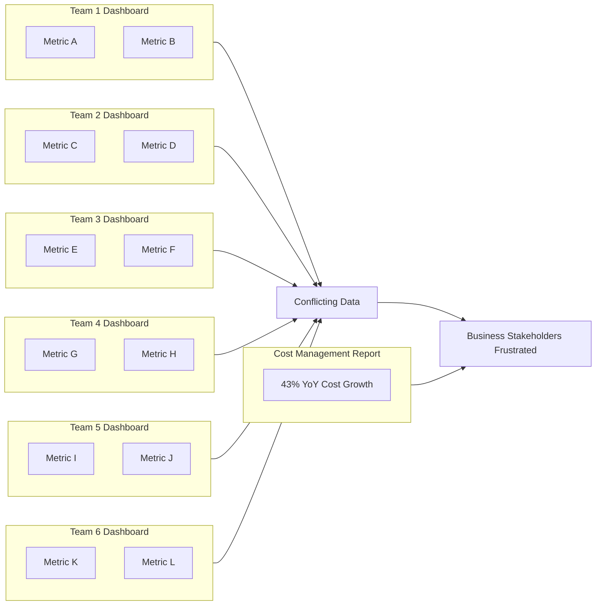
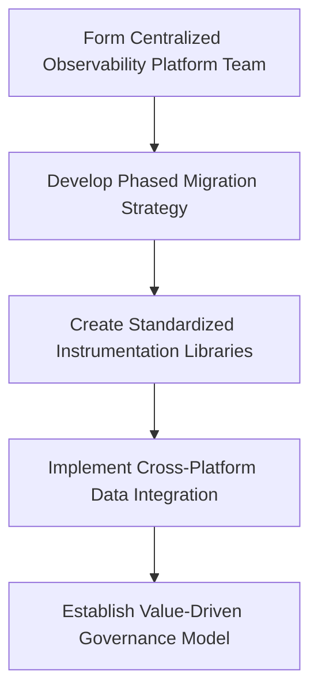
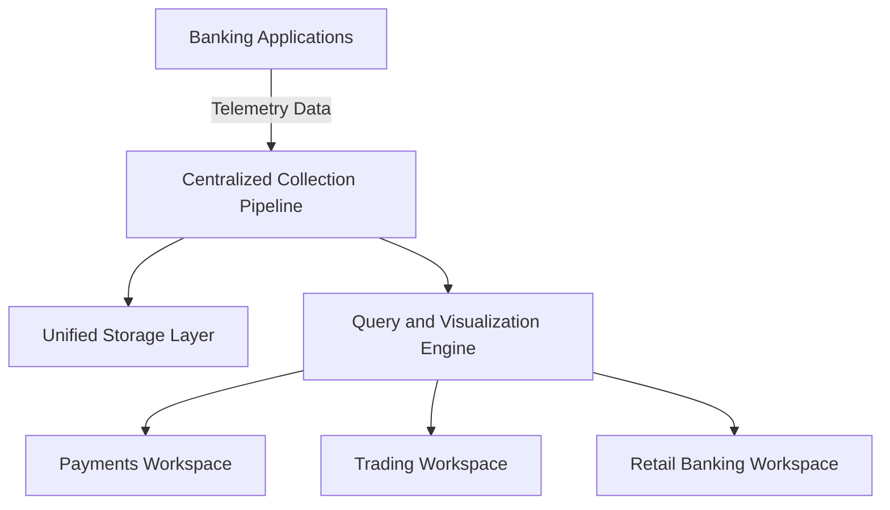
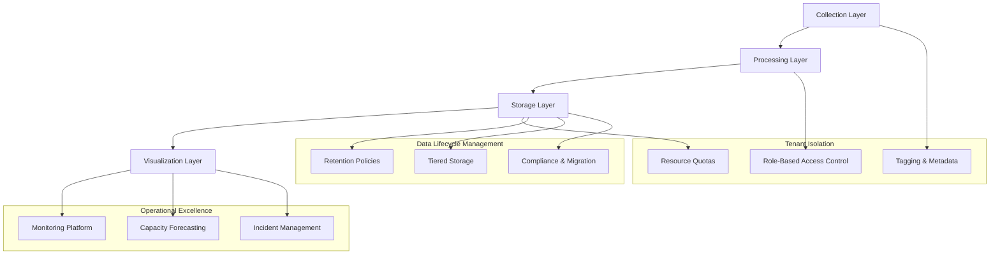
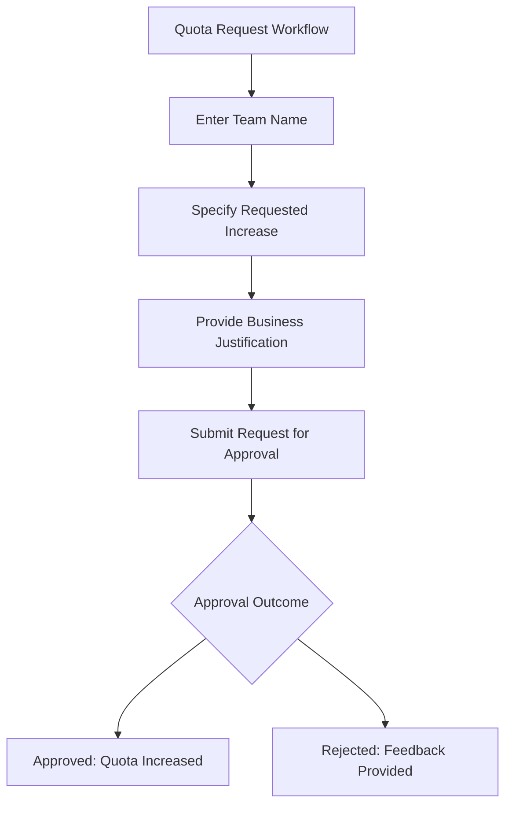
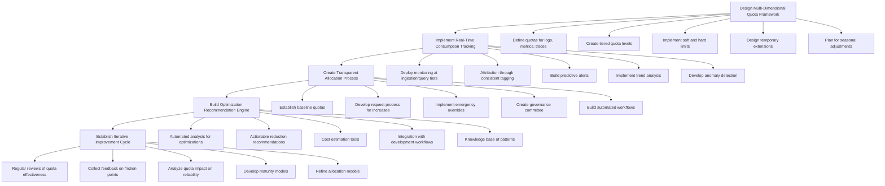
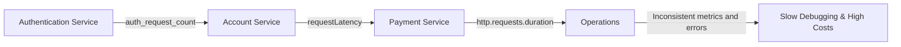
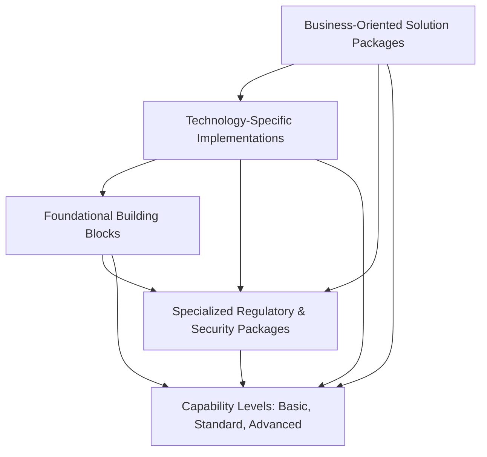
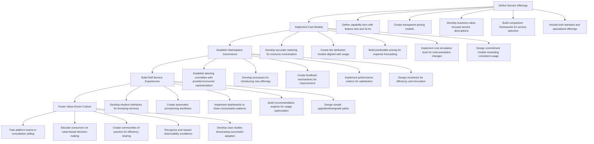

# Chapter 11: Observability as a Service

## Chapter Overview

Welcome to Observability as a Service: where your bank’s monitoring strategy is less a well-oiled machine and more a clown car crammed with dashboards, conflicting metrics, and invoices from every vendor under the sun. This chapter doesn’t bother sugar-coating the “Tower of Babel” reality—you’re hemorrhaging cash while each team clings to their favorite tools, incident timelines might as well be fan fiction, and regulatory auditors are sharpening their knives. Enter SREs with the audacious goal to drag everyone out of the chaos, build a proper platform, and make observability suck less (and cost less). We’re talking real, actionable strategies: centralization without dictatorship, multi-tenancy without anarchy, quotas with teeth, and internal marketplaces that finally make cost and value visible. If you like your advice straight, your metaphors dark, and your business cases brutal, you’re in the right place.

______________________________________________________________________

## Learning Objectives

- **Diagnose** the operational and financial carnage caused by fragmented, team-specific observability tool sprawl.
- **Design** an internal “Observability as a Service” platform that enforces standards, slashes costs, and keeps teams out of trouble with auditors.
- **Architect** multi-tenant observability systems that deliver shared resources without devolving into data free-for-alls.
- **Implement** quota management frameworks that prevent telemetry from metastasizing into a seven-figure line item.
- **Standardize** instrumentation with service catalogs that make the right path the easy (and cheap) path for development teams.
- **Establish** an internal observability marketplace that forces transparency and competition—so platform teams actually have to earn their keep.

______________________________________________________________________

## Key Takeaways

- If your bank has more observability tools than compliance officers, you’re already bleeding money and time—congratulations, you’re the status quo.
- Siloed monitoring isn’t just an inconvenience; it’s an outage multiplier and a regulatory minefield. When incidents hit, you’ll be reconciling conflicting dashboards while your competitors are counting your lost customers.
- “Observability as a Service” isn’t a buzzword—it’s the only rational way to stop teams from reinventing the wheel (badly) and burning cash in the process.
- Multi-tenant architectures are how grown-ups share their toys: enforced boundaries, common standards, and no more surprise bills when someone goes on a metrics bender.
- Quota management is not an optional feature. Treating telemetry as infinite means someone gets a call from finance—and it won’t be a friendly one.
- Service catalogs are how you stop every dev team from rolling their own half-baked metrics. Standardize, automate, and document—then watch incident resolution times drop and costs follow.
- Internal marketplaces force platform teams to compete for relevance. If your platform can’t justify its cost, don’t be surprised when shadow IT comes knocking.
- Real business impact: expect to cut costs, reduce incident times, keep regulators off your back, and maybe—just maybe—turn your SREs into heroes instead of scapegoats.
- The future is value-driven, not vendor-driven. The sooner you centralize, standardize, and expose cost, the sooner you stop subsidizing chaos.

______________________________________________________________________

## Panel 1: The Tower of Babel Monitoring

### Scene Description

In a large banking operations center, six different teams huddle around their own monitoring displays during a critical incident. Each screen shows different dashboards, with completely different metrics and visualizations for the same payment processing system. Team leads argue over conflicting data while business stakeholders grow increasingly frustrated. In the corner, a cost management report shows the bank is paying for seven separate observability platforms, with total costs growing 43% year-over-year.

Below is a simplified depiction of the fragmented setup during the incident:



This diagram illustrates how each team operates in isolation, using unique metrics and dashboards that contribute to conflicting interpretations of the same system's health. The lack of unified views exacerbates tensions during incidents, as teams struggle to align on root causes while costs spiral out of control.

### Teaching Narrative

The proliferation of team-specific monitoring tools creates a dangerous fragmentation of observability within banking organizations. This "Tower of Babel" effect occurs when different teams independently select, implement, and maintain their own observability solutions—each speaking a different metrics language and incurring separate costs.

In the traditional approach, each application team selects their preferred observability tooling, leading to multiple overlapping platforms that fail to provide a unified view of system health. This fragmentation creates three critical problems: excessive costs through platform duplication, siloed visibility that hinders incident resolution, and inconsistent instrumentation practices that prevent cross-service correlation.

The SRE solution introduces "Observability as a Service"—a unified internal platform that standardizes how teams instrument, collect, and visualize telemetry data while implementing centralized cost governance. This approach breaks down visibility silos while creating economies of scale for observability investments. By centralizing the expertise, tooling, and governance in a platform team, banks can simultaneously improve system visibility and control runaway costs.

### Common Example of the Problem

A global bank's digital banking division experienced a critical payment processing outage affecting mobile and web transactions. As the incident escalated, four separate teams mobilized their response efforts: the mobile app team using Datadog, the API gateway team with New Relic, the core banking team with Dynatrace, and infrastructure operations with Prometheus/Grafana.

Despite having access to substantial telemetry data, the teams were unable to establish a consistent timeline of events or identify the failure point. The mobile team's dashboards showed successful API calls while the gateway team reported authentication failures. Core banking metrics indicated normal transaction volumes while infrastructure alerts suggested network congestion. The reconciliation of these conflicting views required manual correlation across platforms, extending the incident resolution from minutes to hours.

Below is a timeline representation of key events during the incident, highlighting how fragmented observability delayed resolution:

```mermaid
gantt
    title Incident Timeline
    dateFormat HH:mm
    section Incident Progression
    Outage Begins (User Reports)    :crit, start, 00:00, 10m
    Mobile Team Investigates        :active, 00:10, 20m
    Gateway Team Investigates       :active, 00:15, 25m
    Core Banking Team Investigates  :active, 00:20, 30m
    Infrastructure Team Investigates:active, 00:25, 35m
    Teams Reconcile Conflicting Data:crit, 01:00, 1h
    Root Cause Identified           :done, 02:00, 30m
    Incident Resolved               :done, 02:30, 10m
```



Post-incident analysis revealed that an authentication service degradation was the root cause, but this component had minimal instrumentation because it fell between team boundaries. The conflicting data stemmed from inconsistent error classification and timing measurements across platforms, compounded by different sampling approaches that missed the critical failure patterns. This timeline underscores how fragmented observability tools can significantly extend incident resolution time by creating gaps and inconsistencies in data interpretation.

### SRE Best Practice: Evidence-Based Investigation

Evidence-based investigation of the fragmented observability problem requires quantifying both the technical and financial impacts of platform proliferation. A systematic approach begins with comprehensive discovery of existing observability investments.

#### Checklist for Evidence-Based Investigation

1. **Tooling Inventory**

   - Document all observability platforms used across the organization.
   - Include team-specific, division-level, and enterprise tools.
   - Identify overlapping capabilities and unique strengths of each platform.

2. **Cost Analysis**

   - Quantify total observability expenditure, including:
     - Direct licensing costs.
     - Storage and integration expenses.
     - Hidden costs like maintaining expertise across systems.
   - Highlight trends in year-over-year spending growth.

3. **Coverage Mapping**

   - Create a service dependency map for the system.
   - Overlay observability coverage from each platform.
   - Identify areas of overlap where multiple tools monitor the same components.
   - Detect gaps where services lack sufficient visibility.

4. **Incident Impact Assessment**

   - Review recent major incidents to determine the "observability tax":
     - Assess time lost reconciling conflicting data.
     - Evaluate delays caused by searching across multiple tools.
   - Quantify how this tax affects incident resolution times.

5. **Query Effectiveness Evaluation**

   - Analyze the most common cross-service questions during incidents.
   - Assess how many tools or dashboards are needed to fully answer these questions.
   - Identify inefficiencies caused by fragmented data sources.

#### Summary of Observability Complexity

The evidence often reveals that fragmented observability introduces exponential complexity as systems scale. For each additional service, the number of potential cross-service interactions increases, while fragmented visibility makes those interactions harder to observe and resolve. Use the checklist above to systematically quantify the impact of observability fragmentation, providing the foundation for implementing centralized solutions.

### Banking Impact

The business impact of fragmented observability extends far beyond the immediate technical challenges. The table below summarizes key financial, regulatory, customer, and operational impacts with quantitative examples:

| **Impact Area** | **Description** | **Quantitative Example** |
| ---------------------------- | ----------------------------------------------------------------------------- | ----------------------------------------------------------------------------------------------------- |
| **Extended Outage Costs** | Revenue loss due to prolonged incident resolution in payment systems. | $83,000 per minute during peak hours for core payment services at a major retail bank. |
| **Regulatory Exposure** | Failure to provide consistent audit trails and documentation during outages. | Potential compliance penalties for insufficient evidence during regulatory investigations. |
| **Customer Attrition** | Loss of customers following repeated disruptions in banking services. | 32% of customers consider switching providers after two significant mobile or online banking outages. |
| **Operational Inefficiency** | Lost engineering capacity due to managing fragmented observability platforms. | Teams reported spending 20-30% of their capacity on maintenance and data correlation. |
| **Decision Paralysis** | Delayed action due to conflicting data from disparate monitoring systems. | Extended outage duration and broader impact scope in financial services environments. |

By addressing these impacts through a centralized observability approach, banks can mitigate financial losses, ensure regulatory compliance, retain customers, and improve operational efficiency.

### Implementation Guidance

Implementing Observability as a Service requires a systematic approach that balances standardization with team autonomy. The following phased migration strategy and guidance provide a clear path to success:



1. **Establish a Centralized Observability Platform Team**

   - Create a dedicated team with combined expertise in observability, banking systems, and cost governance.
   - Assign clear ownership for platform selection, integration architecture, and observability standards.
   - Staff the team with experienced SREs who have credibility with application teams.
   - Define clear service level objectives for the platform itself.
   - Implement a transparent operating model with regular stakeholder reviews.

2. **Develop a Phased Migration Strategy**

   - Begin with greenfield applications to establish patterns and prove value.
   - Prioritize high-business-impact services for early migration.
   - Create a realistic timeline that acknowledges the complexity of migration.
   - Establish clear criteria for platform exceptions where specialized tools are genuinely needed.
   - Implement parallel operations during transition to avoid visibility gaps.

3. **Create Standardized Instrumentation Libraries**

   - Develop language-specific libraries that implement consistent observability patterns.
   - Focus on automated context propagation across service boundaries.
   - Include cost-aware defaults for sampling and cardinality management.
   - Provide easy upgrade paths that minimize application code changes.
   - Ensure libraries support graceful degradation when the platform is unavailable.

4. **Implement Cross-Platform Data Integration**

   - For systems that must remain on specialized platforms, implement data federation.
   - Create unified search capabilities that span platforms during the transition period.
   - Develop consistent metadata tagging to enable cross-platform correlation.
   - Build translation layers that normalize metrics across different systems.
   - Establish common dashboarding that integrates multiple data sources.

5. **Establish a Value-Driven Governance Model**

   - Develop clear metrics that demonstrate platform value (cost savings, MTTR improvement).
   - Create a stakeholder council with representation from major business units.
   - Implement transparent chargeback models that demonstrate economic benefits.
   - Establish exception processes for legitimate specialized needs.
   - Build a continuous feedback loop that evolves the platform based on user needs.

The diagram above illustrates the phased implementation process, reinforcing the need to sequence steps logically while maintaining a focus on business outcomes and user needs.

## Panel 2: The Multi-Tenant Observability Architecture

### Scene Description

Inside a modern SRE command center, engineers work at a central platform operations console labeled "ObservBank." Surrounding them, large displays showcase a unified architecture diagram central to the observability platform. The diagram illustrates multiple banking applications (Payments, Trading, Retail Banking) feeding telemetry data into a centralized collection pipeline. Below is a simplified representation of this architecture:



The interface highlights distinct workspaces for different teams (Payments, Trading, Retail Banking), each equipped with their own dashboards but clearly built on the same underlying platform. A status panel on one of the displays indicates 24 active teams, with real-time cost metrics showing controlled growth even as transaction volumes increase. This setup demonstrates the seamless integration and efficiency of the multi-tenant observability architecture.

### Teaching Narrative

The cornerstone of cost-effective observability at scale is a well-designed multi-tenant architecture. Unlike traditional models where each team manages their own telemetry stack, a multi-tenant observability service creates a shared infrastructure that provides isolated workspaces while leveraging common collection, storage, and query capabilities.

The multi-tenant model brings three transformative advantages to banking observability practices. First, it enables significant cost reduction through resource sharing—a single optimized storage layer serves multiple teams' needs rather than each team maintaining separate data stores. Second, it enforces consistent instrumentation standards that enable cross-service correlation during incidents. Third, it provides centralized expertise for observability optimizations that individual teams typically lack.

The architecture requires careful design to balance team autonomy with centralized governance. The platform must provide logical separation between teams' data while maintaining the ability to correlate across services. It must offer self-service capabilities for common team needs while providing guardrails against excessive data collection. Most importantly, it must deliver value that incentivizes teams to adopt the shared platform rather than maintain their own siloed solutions.

### Common Example of the Problem

A major European bank had grown through multiple acquisitions, resulting in a fragmented technology landscape spanning retail banking, wealth management, investment banking, and insurance services. Each business unit operated its own observability stack, with larger units further fragmented by team-specific solutions.

#### Timeline of Challenges During Cross-Divisional Authentication System Implementation

```text
[Phase 1] Initial Planning (Month 0-2)
    - Identified need for a shared customer authentication service spanning all divisions.
    - Discovered seven separate observability platforms in use across business units.
    - No consistent telemetry formats, making cross-unit monitoring highly complex.

[Phase 2] Integration Efforts (Month 3-6)
    - Teams began custom development for integrating telemetry from each observability stack.
    - Authentication team forced to create and manage multiple dashboards:
        - Dashboard A: Metrics from Retail Banking.
        - Dashboard B: Metrics from Wealth Management.
        - Dashboard C: Metrics from Investment Banking.
        - Etc.
    - Cost of storage and processing telemetry multiplied across duplicate data streams.

[Phase 3] Incident Response (Month 7+)
    - First major incident revealed critical limitations:
        - Teams lacked a unified view of the authentication flow across divisions.
        - Metrics definitions differed, leading to confusion during root cause analysis.
        - Alerts triggered inconsistently, delaying detection and resolution.
    - Anomaly in one division couldn't be correlated with issues in others, affecting customer experience.
```

#### Text Diagram: Fragmented Observability Landscape

```text
  Division A (Retail Banking)            Division B (Wealth Management)
+---------------------------+         +-------------------------------+
| Observability Platform A |         | Observability Platform B      |
| - Metrics A1             |         | - Metrics B1                  |
| - Logs A2                |         | - Logs B2                     |
+---------------------------+         +-------------------------------+

  Division C (Investment Banking)       Division D (Insurance)
+---------------------------+         +-------------------------------+
| Observability Platform C |         | Observability Platform D      |
| - Metrics C1             |         | - Metrics D1                  |
| - Logs C2                |         | - Logs D2                     |
+---------------------------+         +-------------------------------+

          ⬇ Authentication System ⬇
    +-----------------------------------+
    | Authentication Telemetry          |
    | - Requires integration with all   |
    |   platforms for unified monitoring|
    +-----------------------------------+
```

This fragmented observability setup forced teams to operate in silos, creating inefficiencies, duplicating costs, and hindering effective incident management. Without a multi-tenant observability architecture, the bank could not achieve a shared, holistic view of its cross-divisional authentication system, leading to operational inefficiencies and degraded customer experience.

### SRE Best Practice: Evidence-Based Investigation

Implementing effective multi-tenant observability architecture requires systematic investigation of the current state and needs. Follow this checklist to guide your evidence-based investigation process:

#### Checklist: Evidence-Based Investigation Steps

1. **Data Flow Analysis**

   - Trace the lifecycle of observability data from generation to visualization.
   - Document collection mechanisms, processing pipelines, storage tiers, and query patterns.
   - Identify strengths, weaknesses, and inefficiencies in the current architecture.

2. **Usage Pattern Profiling**

   - Analyze how each team utilizes observability data.
   - Measure key metrics such as query frequency, dashboard usage, and alert patterns.
   - Identify common requirements and unique needs across teams.

3. **Scale Requirement Modeling**

   - Calculate current data volumes across teams.
   - Project future growth based on business forecasts and transaction trends.
   - Model peak ingest rates for high-load scenarios (e.g., incidents, batch processing, market volatility).

4. **Access Control Assessment**

   - Map existing security boundaries and data visibility restrictions.
   - Identify compliance requirements and regulatory constraints impacting data sharing.
   - Document isolation needs for specific business units or services.

5. **Performance Benchmark Testing**

   - Create representative test scenarios using real-world query patterns and data volumes.
   - Evaluate performance across different architectural approaches.
   - Focus on realistic workloads rather than synthetic benchmarks to ensure actionable insights.

#### Summary of Key Findings

- Teams often have diverse visualization and alerting preferences.
- Despite these differences, the underlying data collection, storage, and query requirements are generally similar across banking applications.
- These similarities highlight opportunities for efficiency gains through shared infrastructure, enabling cost savings while maintaining team autonomy.

By systematically following this checklist, SREs can ensure a thorough, evidence-based approach to designing and implementing a multi-tenant observability architecture.

### Banking Impact

The business impact of implementing a multi-tenant observability architecture extends across multiple dimensions. The table below summarizes key benefits with before-and-after metrics to illustrate tangible improvements:

| **Impact Area** | **Before Multi-Tenant Architecture** | **After Multi-Tenant Architecture** | **Improvement** |
| -------------------------------- | ----------------------------------------------------------------- | ---------------------------------------------------------------------- | --------------------------------------- |
| **Cost Efficiency** | High expenditure due to duplicate data storage and tools. | Unified platform reduced total observability costs by 62%. | -62% in total observability costs. |
| **Incident Coordination (MTTR)** | Fragmented tooling caused delays in tracing cross-service issues. | Unified observability reduced MTTR for cross-service incidents by 47%. | -47% MTTR for cross-service issues. |
| **Standardized Risk Management** | Inconsistent risk metrics across siloed platforms. | Unified metrics enabled accurate risk aggregation. | Improved consistency in risk reporting. |
| **Regulatory Compliance** | Manual, time-consuming audits across disparate systems. | Standardized observability cut SOX compliance effort by 35%. | -35% effort for compliance. |
| **Security Visibility** | Limited visibility due to isolated monitoring systems. | Consolidated view improved fraud detection in payment systems. | Enhanced fraud detection capabilities. |

These improvements demonstrate the transformative potential of a multi-tenant observability model, driving efficiency, consistency, and enhanced operational capabilities across banking institutions.

### Implementation Guidance

Building an effective multi-tenant observability architecture requires balancing centralization benefits with team autonomy. The following steps, illustrated with a layered architecture diagram, can guide your implementation:



1. **Design a Layered Architecture with Clear Boundaries**

   - Separate collection, storage, processing, and visualization tiers with well-defined interfaces.
   - Implement tenant isolation at the appropriate architectural layers leveraging tagging, access controls, and quotas.
   - Define clear data ownership boundaries aligned with organizational structures.
   - Design for independent scaling of each architectural component to meet team-specific demands.
   - Build resilience through redundancy in critical collection and storage layers.

2. **Implement Robust Multi-Tenancy Mechanisms**

   - Develop comprehensive tagging schemas to identify data ownership and enable effective isolation.
   - Create role-based access control (RBAC) to balance team isolation with opportunities for cross-team collaboration.
   - Enforce resource quotas to ensure platform stability and prevent any single tenant from overconsumption.
   - Optimize query engines to handle both single-tenant and cross-tenant analysis efficiently.
   - Build monitoring capabilities for the observability platform itself, including per-tenant usage metrics.

3. **Establish Data Lifecycle Management**

   - Define retention policies tailored to tenant-specific business needs while ensuring regulatory compliance.
   - Implement tiered storage strategies that balance performance and cost based on data access patterns.
   - Automate data lifecycle processes to minimize manual intervention from tenants and platform teams.
   - Build compliance capabilities to meet industry regulations, including data retention and audit requirements.
   - Design clear migration paths to accommodate evolving retention or operational needs.

4. **Create a Self-Service Experience**

   - Develop onboarding processes that allow new tenants to start with minimal intervention from platform teams.
   - Provide comprehensive documentation, tutorials, and templates tailored to common banking use cases.
   - Offer secure API access for custom integration scenarios and advanced use cases.
   - Establish a feedback loop to continuously improve the tenant experience and address evolving needs.

5. **Develop Operational Excellence Capabilities**

   - Implement robust monitoring of the observability platform itself to detect and resolve issues proactively.
   - Build capacity forecasting tools to anticipate growth and ensure platform scalability.
   - Establish transparent maintenance and upgrade processes to minimize tenant disruption.
   - Create clear incident management procedures for addressing platform-related issues efficiently.
   - Incorporate tenant feedback into a continuous improvement cycle to enhance platform reliability and usability.

The architecture must integrate these principles, as depicted in the diagram, to achieve a scalable, reliable, and cost-effective multi-tenant observability platform.

## Panel 3: The Quota Management System

### Scene Description

A platform engineer demonstrates a new dashboard to application team leaders. The screen displays each banking application's observability usage through clear metrics:

- **Daily Log Volume:** Tracks the number of logs ingested per day for each application.
- **Active Time Series:** Indicates the total count of active time series being monitored.
- **Trace Span Count:** Displays the volume of trace spans generated by application workflows.

Each team's usage is visually represented against their assigned quota using color-coded indicators:

- **Green:** Usage is under 75% of the quota.
- **Yellow:** Usage is between 75% and 100% of the quota.
- **Red:** Usage has exceeded the quota.

One application is highlighted in yellow with a tooltip showing automated recommendations for reducing cardinality. Below the main metrics, a section presents the **Quota Request Workflow**, which outlines the process for teams to request increased allocations. This workflow includes fields for entering a business justification and submitting the request for approval.

#### Dashboard Layout (Text Representation)

```
+--------------------------------+--------------------+--------------------+------------------+
| Application Name               | Daily Log Volume  | Active Time Series | Trace Span Count |
+--------------------------------+--------------------+--------------------+------------------+
| App A                          | 70% (Green)       | 50% (Green)        | 80% (Yellow)     |
| App B                          | 90% (Yellow)      | 110% (Red)         | 60% (Green)      |
| App C                          | 40% (Green)       | 30% (Green)        | 50% (Green)      |
+--------------------------------+--------------------+--------------------+------------------+

Highlighted Application: **App B**
- **Recommendation:** Reduce metrics cardinality by consolidating tags with high variability.
```

#### Quota Request Workflow (Mermaid Diagram)



This enhanced representation aids in quickly grasping the metrics, their significance, and the quota management workflow, even for those unfamiliar with the system.

### Teaching Narrative

A quota management system forms the technical foundation for cost governance in observability platforms. Without explicit limits, observability consumption naturally expands to consume all available resources—a phenomenon known as "telemetry sprawl." Quotas provide the necessary constraints that drive teams toward efficient instrumentation while ensuring fair resource allocation across the organization.

Effective quota systems must balance technical enforcement with business flexibility. Hard technical limits prevent unexpected cost explosions but can potentially block critical telemetry during incidents. Soft governance through visibility and reporting drives behavior change while allowing exceptions when business needs justify increased allocation. The most sophisticated systems implement a hybrid approach: baseline quotas with automated enforcement for standard operations, combined with dynamic headroom that allows temporary expansion during anomalous conditions.

The implementation requires three critical components: a real-time usage accounting system that tracks consumption by team and application, a policy engine that evaluates usage against established quotas, and an exception workflow that permits justified quota increases through appropriate approval channels. When properly designed, these systems create the transparency needed for teams to understand their observability consumption patterns and the incentives to optimize their instrumentation practices.

### Common Example of the Problem

A global investment bank's trading platform experienced rapid observability cost growth after migrating to a cloud-based observability solution. Within three months, expenses had tripled despite only modest transaction volume increases.

The root cause was traced to several problematic patterns across teams. These patterns, along with their impact, are summarized below:

| Team | Problematic Pattern | Impact |
| ---------------- | -------------------------------------------------- | ---------------------------------------------------------------------------- |
| Equities Trading | High-cardinality metrics with instrument ID labels | Created millions of unique time series, overwhelming storage systems. |
| Fixed Income | Verbose debug logging left enabled in production | Generated terabytes of unnecessary logs, driving up costs significantly. |
| Derivatives | 100% distributed tracing sampling in all scenarios | Resulted in massive trace storage costs during periods of market volatility. |

Without visibility into their consumption or limits on resource usage, teams had no incentive to optimize their instrumentation. Each team made locally rational decisions to maximize their own visibility, but collectively, these actions created an unsustainable cost trajectory that threatened the entire observability program.

### SRE Best Practice: Evidence-Based Investigation

Implementing effective quota management requires detailed analysis of current usage patterns and future needs. Use the following checklist to guide your investigation and ensure a structured, actionable approach:

#### **Checklist for Evidence-Based Investigation**

- **Usage Pattern Analysis**

  - [ ] Collect detailed metrics on observability consumption for each team.
  - [ ] Analyze data volume by source, query patterns, and growth trends.
  - [ ] Identify baseline usage and peak consumption during incidents or high-demand periods.

- **Value-to-Volume Ratio Assessment**

  - [ ] Measure the troubleshooting value of observability data relative to its volume.
  - [ ] Analyze query frequency, dashboard usage, and alert correlation metrics.
  - [ ] Distinguish between high-value and low-value telemetry.

- **Team Needs Evaluation**

  - [ ] Conduct structured interviews with teams to understand service criticality, compliance needs, and operational patterns.
  - [ ] Document legitimate cases where higher quota allocations are justified.
  - [ ] Capture team-specific requirements for incident response and feature launches.

- **Cost Driver Identification**

  - [ ] Perform statistical analysis to pinpoint instrumentation patterns driving excessive costs.
  - [ ] Investigate high-cardinality metrics, verbose logging in high-volume components, and excessive trace sampling.
  - [ ] Identify opportunities to optimize without compromising essential visibility.

- **Baseline and Headroom Calculation**

  - [ ] Define baseline quotas based on observed efficient usage patterns.
  - [ ] Calculate appropriate headroom for incident response, seasonal variations, and growth.
  - [ ] Validate quotas against historical data to ensure fair and practical allocations.

#### **Key Insight**

This evidence-based approach typically reveals that a small percentage of instrumentation decisions drive a large percentage of costs. By systematically following the checklist, teams can uncover clear opportunities for targeted optimization while maintaining essential visibility.

### Banking Impact

The business impact of implementing quota management extends beyond simple cost control. Below are specific case studies illustrating the transformative effects across the banking sector:

1. **Cost Predictability**\
   A major retail bank reduced month-to-month observability cost variation from ±35% to ±8% after implementing quota governance. This shift enabled more accurate financial planning and budgeting, allowing the bank to allocate funds with greater confidence and precision.

   **Case Study Callout:**\
   *"Before quotas, we were frequently blindsided by observability overages, which disrupted our budget. With quotas, we now have the stability to plan ahead, making observability a predictable line item rather than a wildcard."*\
   — Chief Financial Officer, Retail Banking Division

2. **Resource Allocation Alignment**\
   Quota management allowed a global payments processor to align observability resource consumption with business priorities. Critical customer-facing services received appropriate visibility, while less critical internal systems were constrained to avoid waste.

   **Case Study Callout:**\
   *"We mapped our observability quotas directly to our service tiers. This ensured that high-priority transactions, like real-time payments, always had the visibility they needed without compromising performance."*\
   — Platform Engineering Manager, Global Payments Processor

3. **Performance Improvement**\
   By preventing unbounded telemetry growth, quota systems indirectly improved system performance at one bank. This was particularly evident during high-volume trading periods, where reduced observability overhead on production systems ensured smoother operations.

   **Case Study Callout:**\
   *"Our trading platform used to experience latency spikes during peak hours because of excessive telemetry load. Quotas helped us fine-tune data collection, eliminating these spikes without losing critical insights."*\
   — Senior Systems Architect, Investment Banking

4. **Innovation Enablement**\
   With predictable costs and clear governance, a financial institution confidently expanded observability into new areas like customer journey analytics. This innovation was achieved without fear of unexpected expense explosions, unlocking new business insights.

   **Case Study Callout:**\
   *"The quota framework gave us the confidence to explore new use cases for observability, like tracking customer behavior across channels. Now, we’re leveraging these insights to shape our digital strategy."*\
   — Head of Data Analytics, Regional Bank

5. **Cultural Transformation**\
   The transparency created by quota management transformed how teams viewed observability—from an unlimited resource to a valuable asset requiring thoughtful utilization. This cultural shift drove proactive optimization rather than reactive cost-cutting.

   **Case Study Callout:**\
   *"Quota dashboards sparked healthy competition among teams to optimize their observability usage. What started as a cost-control measure evolved into a culture of continuous improvement across the organization."*\
   — Director of Engineering, Multinational Bank

### Implementation Guidance

Implementing effective quota management requires both technical systems and organizational processes. The following steps outline the key components and their interactions:



1. **Design a Multi-Dimensional Quota Framework**

   - Define separate quotas for different telemetry types (logs, metrics, traces)
   - Create tiered quota levels based on service criticality and business impact
   - Implement both soft limits (warnings) and hard limits (enforcement)
   - Design temporary quota extensions for incident response
   - Build seasonal adjustments for known high-volume periods (tax season, holidays)

2. **Implement Real-Time Consumption Tracking**

   - Deploy monitoring that captures usage at both ingestion and query tiers
   - Create per-team and per-service attribution through consistent tagging
   - Build predictive alerts that warn of approaching limits
   - Implement trend analysis to identify unusual growth patterns
   - Develop anomaly detection for unexpected consumption spikes

3. **Create a Transparent Allocation Process**

   - Establish baseline quotas using historical analysis of efficient usage
   - Develop a clear request process for permanent quota increases
   - Implement emergency override procedures for critical incidents
   - Create a governance committee for reviewing allocation requests
   - Build automated workflows that document justifications and approvals

4. **Build Optimization Recommendation Engine**

   - Develop automated analysis that identifies optimization opportunities
   - Create specific, actionable recommendations for reducing consumption
   - Implement estimation tools that show cost impact of potential changes
   - Build integration with development workflows (PRs, code reviews)
   - Create a knowledge base of successful optimization patterns

5. **Establish an Iterative Improvement Cycle**

   - Schedule regular reviews of quota effectiveness and team satisfaction
   - Collect feedback on friction points and improvement opportunities
   - Analyze correlation between quota changes and service reliability
   - Develop maturity models that help teams progress in efficiency
   - Continuously refine allocation models based on evolving business needs

## Panel 4: The Observability Service Catalog

### Scene Description

A developer navigates a clean, well-organized internal portal titled "ObservBank Service Catalog." The interface is structured with intuitive sections, providing a seamless user experience. Below is a conceptual representation of the portal's layout:

```plaintext
+---------------------------------------------------------------+
|                      ObservBank Service Catalog               |
+---------------------------------------------------------------+
| Search Bar: [ Search for packages, tools, metrics... ]        |
+---------------------+---------------------+-------------------+
| Category:           | Category:           | Category:         |
| Payment Monitoring  | Transaction Tracing | Customer Journey  |
| ------------------- | ------------------- | ----------------- |
| [View Details]      | [View Details]      | [View Details]    |
+---------------------+---------------------+-------------------+

+---------------------------------------------------------------+
| Selected Package: Payment Monitoring                         |
+---------------------------------------------------------------+
| Technology Stacks: Java, Python, .NET                        |
| Documentation: Implementation Guides, FAQs                   |
| Metrics: Latency, Errors, Throughput                         |
| Recommended Sampling Rates: 10%, adjustable                  |
| Default Dashboards: Payment Success Rate, Error Trends       |
| -----------------------------------------------------------  |
| Cost Calculator:                                             |
| - Expected Transactions: [   10000   ]                      |
| - Estimated Monthly Cost: $[   500.00   ]                   |
+---------------------------------------------------------------+
```

Each instrumentation package includes clear documentation, cost implications, and implementation examples. Standardized metrics, recommended sampling rates, and default dashboard templates tailored for banking applications are highlighted. A built-in "cost calculator" tool allows the developer to estimate observability costs based on expected transaction volumes and chosen instrumentation options. This streamlined design ensures developers can quickly find and implement the tools they need with minimal friction.

### Teaching Narrative

A well-designed service catalog transforms how teams approach observability instrumentation. Rather than requiring each team to become experts in telemetry design, the catalog provides pre-packaged, optimized observability solutions that implement best practices while maintaining cost efficiency. This approach dramatically reduces the cognitive overhead for application teams while ensuring consistent, high-quality telemetry across the organization.

The service catalog concept applies the principle of "shifting left" to observability design—moving instrumentation decisions earlier in the development lifecycle and providing teams with standard building blocks rather than expecting them to create custom solutions. For banking platforms, these catalogs typically include specialized packages for payment processing telemetry, transaction monitoring, and customer journey tracking—each designed with appropriate sampling, cardinality controls, and data minimization techniques built in.

The most effective catalogs provide three layers of abstraction: high-level business-oriented packages (e.g., "Payment Journey Monitoring"), technology-specific implementations (Java, Python, .NET clients), and low-level building blocks for custom needs. Each offering includes clear documentation on implementation, resource consumption, and associated costs. By making the right path the easy path, service catalogs naturally guide teams toward cost-effective instrumentation without requiring expensive enforcement mechanisms.

### Common Example of the Problem

A large North American bank undertook a digital transformation initiative, replacing legacy monolithic applications with microservices across their retail banking platform. As new services proliferated, each development team implemented observability based on their own understanding and preferences.

The resulting inconsistency created significant operational challenges. When investigating a failed funds transfer, operations teams discovered that each service in the transaction flow used different naming conventions for similar metrics, error classifications, and telemetry designs. This lack of standardization led to fragmented visibility, operational inefficiencies, and escalating costs.

#### Key Challenges Illustrated

| **Category** | **Service A (Authentication)** | **Service B (Account Management)** | **Service C (Payments)** | **Impact** |
| ------------------------------- | ----------------------------------- | ---------------------------------------------- | ------------------------------------------- | ------------------------------------------------------------------------- |
| **Metric Naming** | `auth_request_count` (snake_case) | `requestLatency` (camelCase) | `http.requests.duration` (period-separated) | Difficult to create unified dashboards or correlate data across services. |
| **Error Classification** | HTTP status codes | Custom error codes | Boolean success/failure flags | Inconsistent error reporting made root cause analysis time-consuming. |
| **High-Cardinality Dimensions** | Added `user_id` and `region` labels | Added `account_id` and `transaction_id` labels | Added `customer_id` and `session_id` labels | High cardinality led to storage bloat, slow queries, and increased costs. |

#### Transaction Flow Diagram



As shown in the table and transaction flow, the lack of standardized observability practices severely hindered operations. Each team reinvented telemetry conventions without regard for cross-service alignment or cost efficiency. Unified dashboards, cross-service alerts, and efficient troubleshooting became nearly impossible, while runaway storage and query costs exacerbated the problem.

This example highlights the critical need for a centralized service catalog to enforce consistency, provide best practices, and guide teams toward cost-effective observability solutions.

### SRE Best Practice: Evidence-Based Investigation

Creating an effective observability service catalog requires systematic analysis of current practices and needs. The following checklist provides actionable steps to guide the investigation process:

#### Checklist for Creating an Observability Service Catalog

1. **Instrumentation Pattern Discovery**

   - Audit existing services to identify common observability patterns, instrumentation approaches, and measurement needs across application types.
   - Document successful practices and anti-patterns for future reference.

2. **Use Case Classification**

   - Analyze incident response patterns to determine which telemetry data provides the most troubleshooting value.
   - Categorize observability needs by service type, transaction patterns, and failure modes.

3. **Standards Gap Analysis**

   - Compare current instrumentation practices against established industry standards (e.g., OpenTelemetry, Prometheus naming conventions).
   - Identify opportunities for standardization and create migration paths where necessary.

4. **Technology Stack Inventory**

   - Catalog the programming languages, frameworks, and infrastructure components used across the organization.
   - Ensure the service catalog includes coverage for all relevant technologies.

5. **Cost-Value Optimization Analysis**

   - Evaluate the relationship between data volume and troubleshooting value for each observability pattern.
   - Determine optimal instrumentation approaches that maximize insights while minimizing resource costs.

6. **Stakeholder Collaboration**

   - Engage with development and operations teams to validate findings and gather feedback on pain points.
   - Incorporate stakeholder input into the prioritization of catalog features and enhancements.

7. **Prototype and Iterate**

   - Develop a prototype catalog entry, complete with documentation, implementation examples, and cost estimates.
   - Test the prototype with a small group of teams, gather feedback, and refine before scaling.

______________________________________________________________________

#### Key Insights from Evidence-Based Investigation

- Most services share similar core observability needs, with minor variations based on service type.
- Inconsistencies in instrumentation lead to higher costs and reduced operational effectiveness.
- An evidence-driven approach ensures that the service catalog aligns with both organizational standards and practical team needs, making the "right path" the easiest and most cost-efficient option.

### Banking Impact

The business impact of implementing an observability service catalog extends across multiple dimensions:

```mermaid
barChart
    title Observability Service Catalog Impact
    xAxis Benefits
    yAxis Improvement (%)
    "Faster Implementation" : 35
    "MTTR Reduction" : 43
    "Cost Reduction" : 28
```

1. **Accelerated Development**: Teams at a digital bank reported 35% faster implementation of new services after standardized observability packages eliminated the need to design custom instrumentation for each component.

2. **Improved Operational Consistency**: A payment processor reduced mean time to resolution for complex incidents by 43% after standardized instrumentation created consistent visibility across service boundaries.

3. **Cost Optimization**: Standardized instrumentation with built-in efficiency controls helped one bank reduce observability costs by 28% while actually increasing visibility into critical customer journeys.

4. **Enhanced Regulatory Compliance**: Pre-designed instrumentation packages with built-in compliance features ensured consistent capture of audit trail data across services, simplifying regulatory examinations and reducing compliance exceptions.

5. **Platform Adoption Acceleration**: A well-designed catalog accelerated migration from legacy monitoring tools to a modern observability platform by providing clear migration paths and pre-built alternatives to existing custom solutions.

### Implementation Guidance

Building an effective observability service catalog requires balancing standardization with flexibility. The following steps outline a structured approach, supported by a tiered diagram to illustrate the relationship between components:

#### Catalog Structure Overview:



This structure ensures:

- Alignment with banking domains (e.g., payments, accounts, trading)
- Language and framework-specific support
- Flexibility for teams with unique requirements
- Graduated offerings to support varying levels of complexity and needs

#### Implementation Steps:

1. **Create a Tiered Catalog Structure**

   - Develop business-oriented solution packages tailored to banking domains.
   - Build technology-specific implementations for supported languages and frameworks.
   - Provide foundational building blocks for specialized team needs.
   - Design graduated offerings with basic, standard, and advanced capability levels.
   - Include specialized packages for regulatory compliance and security monitoring.

2. **Implement Standardized Instrumentation Libraries**

   - Develop or adopt client libraries implementing consistent instrumentation patterns.
   - Enable automatic context propagation between services for distributed tracing.
   - Incorporate cost-efficiency features like adaptive sampling and cardinality limits.
   - Ensure backward compatibility and provide clear upgrade paths.
   - Offer automatic and manual instrumentation options to accommodate varying needs.

3. **Design Pre-Built Visualization and Alerting**

   - Develop standardized dashboards compatible with catalog instrumentation.
   - Create alert configurations tuned for banking service patterns.
   - Build cross-service views leveraging consistent naming and tagging conventions.
   - Provide SLO templates for common banking operations.
   - Design customer journey visualizations that correlate front-end and back-end telemetry.

4. **Develop Comprehensive Documentation and Support**

   - Provide clear implementation guides with detailed code examples.
   - Create interactive cost calculators to show resource implications.
   - Develop troubleshooting guides addressing common instrumentation issues.
   - Offer consultation services for teams with unique requirements.
   - Build training materials tailored to different technical roles and skill levels.

5. **Establish Continuous Evolution Mechanisms**

   - Use analytics to monitor adoption patterns and identify challenges.
   - Define processes for teams to request new catalog offerings.
   - Implement a regular release cycle for catalog updates and improvements.
   - Build feedback loops incorporating operational lessons learned.
   - Maintain a roadmap aligning with the organizational technology strategy.

## Panel 5: The Internal Observability Marketplace

### Scene Description

In a quarterly planning meeting, application and platform teams review an internal dashboard resembling a marketplace. Various observability capabilities are displayed as "products" with associated costs, SLAs, and user ratings. Team representatives discuss their requirements while platform owners present roadmap plans. A management dashboard shows cost trends across the bank, with metrics comparing observability spending to transaction volumes and incident reductions. The marketplace includes both standard platform offerings and specialized team-developed components that others can adopt.

Below is a simplified text representation of the internal marketplace dashboard:

```
+-----------------------------------------+
|          Internal Observability         |
|              Marketplace                |
+-----------------------------------------+
| Product Name  | Cost    | SLA   | Rating |
|-----------------------------------------|
| Logs Service  | $500/mo | 99.9% | 4.8/5  |
| Metrics API   | $300/mo | 99.5% | 4.5/5  |
| Tracing Tool  | $400/mo | 99.8% | 4.6/5  |
| Custom Widget | $200/mo | 99.0% | 4.2/5  |
+-----------------------------------------+

+-----------------------------------------+
|     Management Dashboard Summary        |
+-----------------------------------------+
| Metric                    | Value       |
|-----------------------------------------|
| Total Monthly Spend       | $1,400      |
| Avg Rating (All Products) | 4.5/5       |
| Observability Spend/Txn   | $0.01       |
| Incident Reduction YoY    | 15%         |
+-----------------------------------------+
```

This dashboard allows teams to quickly evaluate available observability options based on their costs, service levels, and user feedback. The management dashboard provides a high-level view of how observability investments correlate with business outcomes, helping guide decision-making in the meeting.

### Teaching Narrative

The evolution of observability platforms leads naturally to an internal marketplace model that aligns technical capabilities with business value. Unlike traditional platform approaches where teams are simply told what to use, the marketplace creates a value-driven ecosystem where platform teams must justify their offerings and application teams make informed decisions about their observability investments.

This marketplace model fundamentally changes the relationship between platform providers and consumers. Platform teams must demonstrate the value of their standardized offerings against external alternatives, creating natural incentives for continuous improvement and cost optimization. Application teams gain transparency into the real costs of their observability choices and can make explicit tradeoffs based on business priorities rather than technical limitations.

The most mature marketplaces implement three key mechanisms: transparent cost attribution that shows teams exactly what they're paying for, capability-based pricing that aligns costs with value rather than raw data volumes, and flexible consumption models that allow teams to make appropriate tradeoffs based on their specific needs. When implemented effectively, these marketplaces create organic incentives for cost efficiency while maintaining the technical benefits of standardized, centralized observability platforms.

### Common Example of the Problem

A multinational financial services company maintained a centralized observability platform that followed a traditional "one-size-fits-all" approach. The platform team implemented standardized tooling and charged back costs to business units based on headcount rather than actual usage.

This model created several persistent problems, including:

- **Subsidization of Costs**: High-volume, low-complexity services (e.g., payment processing) were subsidizing low-volume, high-complexity services (e.g., wealth management), leading to inequitable cost distribution.
- **Lack of Cost Visibility**: Teams had no insight into how their instrumentation decisions impacted overall costs, fostering a "tragedy of the commons" where resources were overutilized without accountability.
- **Limited Incentives for Innovation**: The platform team, operating in isolation from market pressures, lacked motivation to optimize or improve their offerings.
- **Shadow IT and Fragmentation**: Teams requiring specialized capabilities often bypassed the centralized platform, creating shadow observability solutions that resulted in duplicated efforts and increased costs.
- **Erosion of Trust**: Business units grew frustrated with rising observability expenses that lacked clear value justification, while the platform team struggled to meet diverse and growing demands.

#### Checklist for Identifying Key Problems:

- [ ] Are high-volume services unfairly subsidizing low-volume services?
- [ ] Do teams lack visibility into how their observability choices impact costs?
- [ ] Is the platform team insulated from feedback or market-driven incentives?
- [ ] Are teams implementing fragmented or duplicate observability solutions?
- [ ] Are business units dissatisfied with the platform's value proposition?

By addressing these issues, organizations can reduce inefficiencies, improve transparency, and foster a more collaborative relationship between platform teams and their consumers.

### SRE Best Practice: Evidence-Based Investigation

Creating an effective internal marketplace requires systematic analysis of the current state and market dynamics. The following table summarizes the five investigation steps alongside their expected outcomes, providing a clear and concise reference for execution:

| **Step** | **Description** | **Expected Outcome** |
| --------------------------------------- | ------------------------------------------------------------------------------------------------------------------------------------------------------ | --------------------------------------------------------------------------------------------------------------- |
| **Value Perception Assessment** | Conduct structured interviews with platform consumers to understand their perception of value, pain points, and unmet needs. | Identification of gaps between platform capabilities and team requirements, highlighting key improvement areas. |
| **Cost Structure Analysis** | Develop a detailed understanding of the actual costs to provide different observability services, including infrastructure, licensing, and operations. | Transparent cost models for different capability levels, enabling informed tradeoffs and cost optimization. |
| **Consumption Pattern Profiling** | Analyze how teams consume observability resources, including variations in volume, query patterns, and specialized needs across domains. | Quantification of resource usage and cost-to-serve for different consumer types, revealing inefficiencies. |
| **External Market Benchmarking** | Compare internal platform capabilities and costs against external commercial alternatives to identify competitive gaps and shadow IT drivers. | Clear understanding of market positioning and opportunities for improving platform competitiveness. |
| **Organizational Readiness Evaluation** | Assess the maturity of chargeback mechanisms, decision-making autonomy, and cultural readiness for value-based provisioning. | Assessment of organizational alignment and readiness for adopting marketplace models effectively. |

This investigation typically reveals significant misalignment between platform capabilities, team needs, and cost models. It also identifies opportunities to create more transparent, value-driven relationships through marketplace mechanisms.

### Banking Impact

The business impact of implementing an internal observability marketplace extends beyond technical improvements. Specific case studies highlight the tangible benefits achieved by various financial institutions:

1. **Resource Optimization**: A capital markets division reduced observability costs by 31% after implementing a marketplace model. By providing visibility into consumption patterns and enabling teams to make informed tradeoffs, one team leader noted, *"We could finally see where our budget was going and adjust without sacrificing critical coverage."*

2. **Innovation Acceleration**: At a global investment bank, the marketplace approach empowered the trading platforms team to introduce specialized observability tools tailored to their high-frequency requirements. This was achieved without imposing these tools on other teams, leading to a 20% faster rollout of new trading features. A senior engineer shared, *"The marketplace let us focus on what we needed without disrupting other teams' workflows."*

3. **Alignment with Business Value**: A regional bank correlated observability investments with business outcomes, demonstrating a 15% improvement in incident resolution times. This direct ROI convinced executives to increase funding for further platform enhancements. As the CTO remarked, *"The transparency of the marketplace made it clear how observability investments translated to fewer outages and happier customers."*

4. **Shadow IT Reduction**: Transparent marketplace offerings with flexible capability tiers reduced the incentive for teams to build separate observability solutions. At one financial institution, this shift consolidated eleven disparate platforms into just three, saving $2.5M annually. A platform manager noted, *"The marketplace gave teams what they needed upfront, eliminating the need for duplicative systems."*

5. **Culture Transformation**: The marketplace model transformed relationships between platform and application teams across multiple banks. Platform teams shifted from being seen as enforcers to becoming trusted advisors. One application team lead commented, *"We stopped feeling like the platform team was dictating terms—they started helping us succeed."*

By tying observability to measurable business outcomes and fostering collaboration, the internal observability marketplace model has proven to be a game-changer for financial institutions, driving both technical and cultural advancements.

### Implementation Guidance

Building an effective internal observability marketplace requires both technical and organizational changes. The following steps outline the implementation process:



1. **Define Service Offerings**

   - Define clear capability tiers with explicit feature sets and service levels.
   - Create transparent pricing models that reflect actual costs to provide services.
   - Develop service descriptions that highlight business value rather than technical features.
   - Build comparison frameworks that help teams select appropriate service levels.
   - Include both standard offerings and specialized capabilities for unique needs.

2. **Implement Consumption-Based Cost Models**

   - Develop accurate metering for resource consumption across observability types.
   - Create fair attribution models that align costs with actual usage.
   - Build predictable pricing that allows teams to forecast expenses.
   - Implement cost simulation tools that show the impact of instrumentation changes.
   - Design flexible commitment models that reward consistent usage.

3. **Establish Marketplace Governance**

   - Establish a steering committee with both provider and consumer representation.
   - Develop clear processes for introducing new marketplace offerings.
   - Create feedback mechanisms that drive continuous improvement.
   - Implement performance metrics for both platform and consumer satisfaction.
   - Design incentive structures that reward efficiency and innovation.

4. **Build Self-Service Experiences**

   - Develop intuitive marketplace interfaces for browsing and selecting services.
   - Create automated provisioning workflows that minimize human intervention.
   - Implement usage dashboards that show consumption patterns and trends.
   - Build recommendation engines that suggest optimizations based on usage.
   - Design simple upgrade/downgrade paths between service tiers.

5. **Foster a Value-Driven Culture**

   - Train platform teams in consultative selling rather than technical enforcement.
   - Educate consumers on making value-based observability decisions.
   - Create communities of practice to share efficiency techniques.
   - Recognize and reward teams that demonstrate observability excellence.
   - Develop case studies that highlight successful marketplace adoption.
