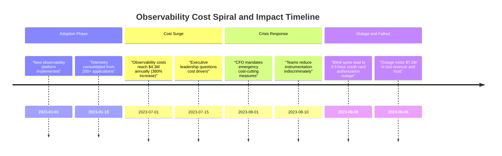
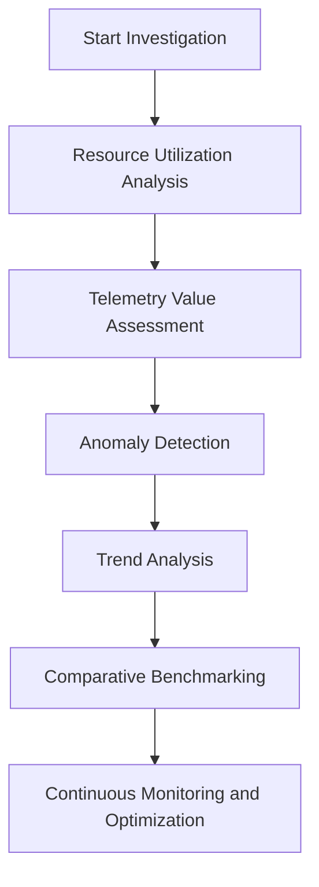
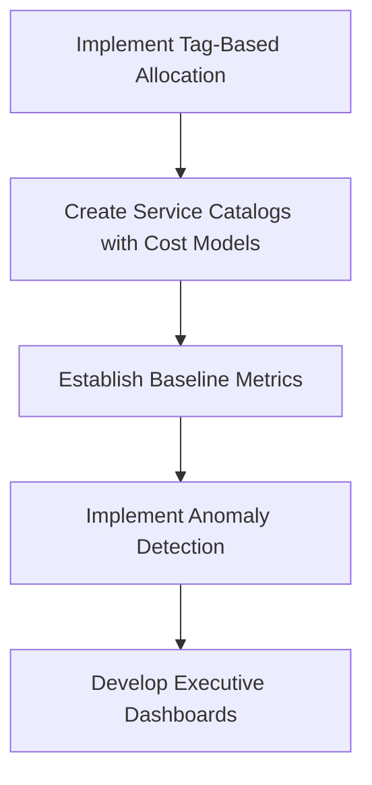
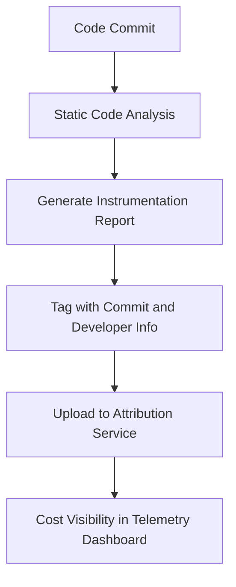
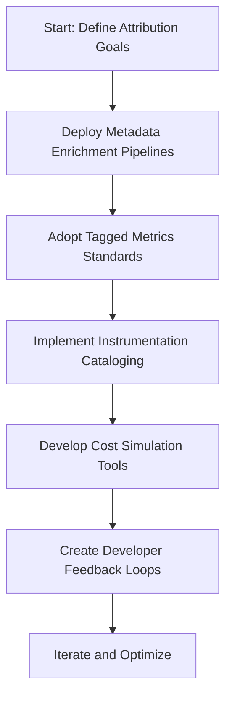
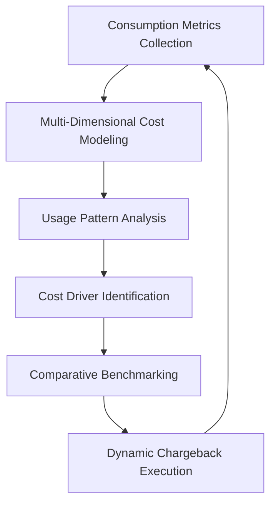
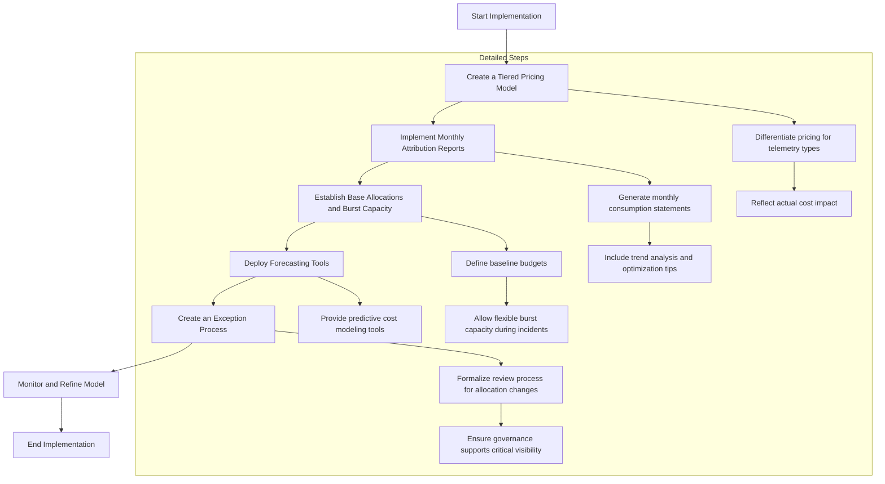
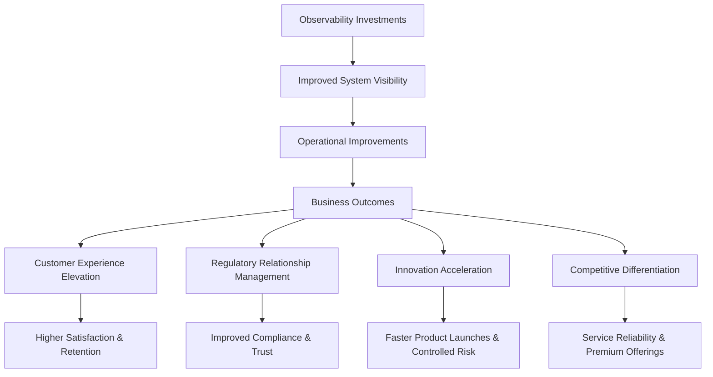
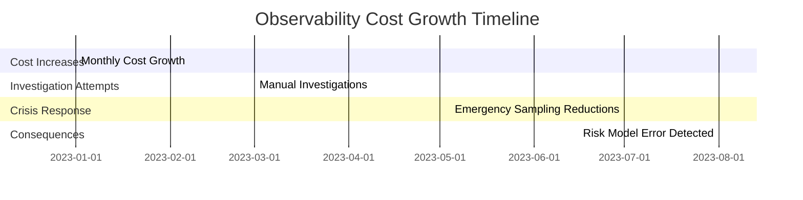
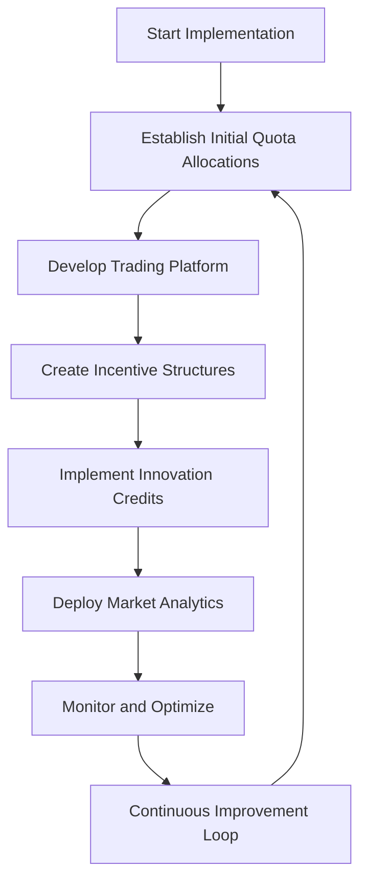

# Chapter 12: Observability Economics: Advanced


## Chapter Overview

Welcome to the shark tank of observability economics—where your telemetry doesn't just burn CPU, it devours real money. If you still think "monitoring" is a line item buried in your budget, prepare for a slap in the face. This chapter rips the rose-tinted glasses off and shoves you headfirst into the brutal reality where SREs become forensic accountants, developers double as cost center owners, and business value is the only metric anyone upstairs cares about. Gone are the days of “just add more logs.” Here, every log line, trace span, and metric comes with a price tag—and you’d better know who’s paying. We’ll walk through the carnage of cost blowouts, finger-pointing fiascos, and budgetary knife-fights, all while arming you with the tools to turn observability from a cash incinerator into a business value multiplier. If you’re allergic to accountability or allergic to the word “profit,” now’s your cue to bail.

## Learning Objectives

- **Analyze** observability spend with forensic precision—no more hand-waving about “platform costs.”
- **Attribute** costs with surgical granularity, down to the code commit and feature that’s draining your budget.
- **Design** dynamic chargeback models that actually drive behavior, not just bureaucratic misery.
- **Quantify** and **justify** observability ROI in terms business leaders can’t ignore—or slash.
- **Predict** and **optimize** future observability spend before Finance comes for your head.
- **Map** observability costs from server racks all the way up to customer journeys and revenue streams.
- **Build** internal efficiency markets that reward teams for not being the telemetry equivalent of hoarders.

## Key Takeaways

- Ignorance is expensive. If you can’t trace a spike in costs to a specific log line, you’re not running observability—you’re funding entropy.
- Arbitrary cost-cutting will buy you outages and angry execs faster than it’ll save you money.
- High-cardinality metrics are the cocaine of observability: expensive, addictive, and ruinous if unchecked.
- If your chargeback model penalizes the teams with the least data, congratulations—you’ve built an incentive system for mediocrity.
- “Business value” isn’t a hand-wavy aspiration; it’s a number tied to uptime, revenue, and customer churn. Prove it or lose your budget.
- Predictive optimization beats panic-driven cuts every time. If your only strategy is “wait for the CFO to scream,” start polishing your résumé.
- Mapping costs to customer journeys isn’t just for management consultants—it’s how you stop over-instrumenting the stuff no one cares about.
- Internal quota markets turn telemetry from a bureaucratic nightmare into a self-optimizing system. Fear the teams who game the market—they’re probably saving you millions.
- Regulators don’t care about your “DevOps culture.” They want audit trails and cost accountability. Fail here, and you’ll pay with more than just money.
- Treat observability as a strategic investment, not a tax. If you can’t articulate its ROI, someone else will decide it’s a luxury you can’t afford.

## Panel 1: The Telemetry Accountant
### Scene Description

A senior SRE and a finance analyst stand before a large interactive dashboard displaying complex heat maps of observability costs across different banking systems. The dashboard is divided into panels, each representing a key banking service like mortgage processing, credit cards, and savings accounts. The heat map pulses with activity as real-time data flows in, with colored overlays indicating cost attributions to various teams.

In the mortgage processing section, a sudden red spike draws attention, representing a significant increase in telemetry costs. The SRE points to the spike, while a tooltip appears next to their gesture, showing detailed metrics: "Telemetry Volume: 120k events/sec, Cost: $1,250/hour". Below the heat map, a dynamic bar chart updates, breaking down the costs by contributing microservices. The finance analyst nods in understanding and makes notes on a tablet displaying automated cost allocation formulas.

To visualize the scene, the following text-based layout represents the dashboard structure:

```
+---------------------------------------------+
| Banking Systems Observability Dashboard     |
+-------------------+-------------------------+
| Mortgage Processing | Credit Cards         |
|  [Heat Map]         |  [Heat Map]          |
|  Spike Detected     |                      |
|  Tooltip:           |                      |
|  - Volume: 120k     |                      |
|  - Cost: $1,250/hr  |                      |
+-------------------+-------------------------+
| Savings Accounts    | Other Systems        |
|  [Heat Map]         |  [Heat Map]          |
|                     |                      |
+---------------------------------------------+
| Cost Breakdown by Microservices            |
|  [Dynamic Bar Chart]                        |
+---------------------------------------------+
```

This representation emphasizes the interactive and granular nature of the dashboard, highlighting the correlation between telemetry data and financial impact.
### Teaching Narrative
Mature observability programs require sophisticated economic governance that goes beyond simple cost tracking. The shift from seeing observability as a technical overhead to treating it as a strategic investment demands advanced financial models that properly attribute costs, measure returns, and optimize resource allocation. Traditional IT cost models fail in modern observability environments because they lack the granularity to attribute costs to services, the flexibility to accommodate dynamic scaling, and the business context to demonstrate value creation.

Advanced observability economics creates transparent correlation between telemetry generation and cost impacts, allowing organizations to make informed decisions about their observability investments. This governance must operate at three levels simultaneously: technical implementation (the how), financial modeling (the what), and business value demonstration (the why). When properly implemented, these frameworks transform observability from a cost center into a value-generating investment with measurable business returns.
### Common Example of the Problem

A global retail bank implemented a modern observability platform to replace their legacy monitoring systems, consolidating telemetry from over 200 applications into a centralized solution. While the platform initially promised improved insights and operational efficiency, the following sequence of events unfolded:



When questioned by executive leadership, neither the platform team nor application teams could explain precisely which systems were driving these costs or justify the business value derived from this significant expense. In response, the CFO instituted an emergency cost-cutting initiative, forcing teams to arbitrarily reduce instrumentation across all systems. Unfortunately, this indiscriminate reduction eliminated critical visibility into several customer-facing services.

The lack of telemetry created blind spots that contributed to a major credit card authorization outage. Diagnosing the issue took 3.5 hours due to insufficient visibility, costing the bank an estimated $7.2 million in lost transaction revenue and significantly eroding customer trust. This example illustrates the risks of inadequate observability governance and the importance of cost attribution and value demonstration.
### SRE Best Practice: Evidence-Based Investigation

Advanced observability economics requires rigorous evidence-based approaches to cost visibility and allocation. Mature SRE teams implement comprehensive telemetry accounting systems that track costs with granularity comparable to their observability data itself. To guide these efforts, the following checklist summarizes key investigation steps, their purpose, and recommended tools or metrics:

| **Step**                          | **Purpose**                                                                               | **Tools/Metrics**                                                                   |
| --------------------------------- | ----------------------------------------------------------------------------------------- | ----------------------------------------------------------------------------------- |
| **Resource Utilization Analysis** | Correlate observability costs to technical origins through resource consumption metrics.  | Ingest volume, storage usage, query patterns, service/team breakdown.               |
| **Telemetry Value Assessment**    | Identify telemetry data delivering value by analyzing usage patterns and business impact. | Query frequency, dashboard utilization, incident resolution metrics.                |
| **Anomaly Detection**             | Detect unexpected cost drivers to uncover optimization opportunities.                     | Statistical analysis, cardinality metrics, verbosity changes, query pattern shifts. |
| **Trend Analysis**                | Differentiate between expected scaling and problematic cost acceleration.                 | Baseline growth patterns, historical cost trends, scaling metrics.                  |
| **Comparative Benchmarking**      | Enable meaningful cost comparisons across systems and business units.                     | Cost per transaction, cost per customer, cost per service.                          |

#### Workflow Diagram for Evidence-Based Investigation


The most effective implementations integrate these investigations into automated observability platforms that provide continuous visibility into costs rather than periodic manual reviews. This enables proactive optimization and ensures telemetry accounting evolves into a strategic advantage rather than a reactive cost-cutting exercise.
### Banking Impact

The business impact of advanced observability economics extends beyond mere cost control to fundamental improvements in both operational efficiency and strategic decision-making:

| **Impact Area**             | **Specific Benefits**                                                                                          | **Examples**                                                                                                       |
| --------------------------- | -------------------------------------------------------------------------------------------------------------- | ------------------------------------------------------------------------------------------------------------------ |
| **Regulatory Compliance**   | Demonstrates prudent resource management and ensures complete audit trails for critical financial systems.     | Providing audit-ready cost breakdowns for telemetry in mortgage processing to meet compliance requirements.        |
| **Investment Optimization** | Enables targeted allocation of observability resources to maximize ROI on high-value activities.               | Increasing instrumentation for high-net-worth client services while optimizing monitoring of routine transactions. |
| **Merger Integration**      | Facilitates smooth consolidation of systems by harmonizing observability models without disrupting visibility. | Identifying cost-effective integration strategies during the merger of two banking platforms.                      |
| **Risk Management**         | Correlates observability investment with quantifiable risk reduction to inform appropriate instrumentation.    | Allocating higher observability budgets to fraud detection systems while reducing spend on low-risk services.      |
| **Innovation Enablement**   | Ensures predictable budgeting that supports new service development without unexpected cost surges.            | Launching a new digital banking feature with pre-calculated observability costs built into the project budget.     |

For financial institutions, the inability to track and justify observability expenditures increasingly represents both a financial and a regulatory risk. Regulators demand sophisticated governance for all technical investments that support critical banking infrastructure, making advanced observability economics an essential capability.
### Implementation Guidance

To establish advanced observability economics in your banking organization, follow these interconnected steps:



1. **Implement Tag-Based Allocation**:  
   Deploy mandatory metadata tagging for all telemetry sources, including service name, team owner, business unit, and cost center. Use these tags in your observability platform to create automated cost attribution reports.

2. **Create Service Catalogs with Cost Models**:  
   Develop standardized observability service offerings with clear cost implications for different instrumentation levels. This allows application teams to make informed decisions based on explicit pricing and capabilities.

3. **Establish Baseline Metrics**:  
   Define normalized cost efficiency metrics for various banking service types (e.g., cost per thousand payment transactions, cost per trading operation). Track these metrics over time to identify both problems and areas for improvement.

4. **Implement Anomaly Detection**:  
   Deploy automated monitoring for observability cost patterns to flag unusual changes for investigation. Focus on areas like dimensional cardinality growth, log volume increases, and query pattern shifts.

5. **Develop Executive Dashboards**:  
   Create business-oriented visualizations that connect observability costs directly to banking KPIs. Demonstrate value through metrics like cost per prevented incident, correlation with reduced MTTR, and impact on customer experience scores.
## Panel 2: The Fine-Grained Attribution Engine
### Scene Description

A DevOps engineer examines a detailed code view showing observability instrumentation in a payment processing service. Beside the code, a real-time calculator displays the exact cost of each log line, trace span, and metric being generated. The interface is split into two panels:

```
+-------------------------+----------------------------+
|       Code View         |   Real-Time Cost Display   |
|                         |                            |
| Service: Payment API    | Log Line Cost: $0.0001     |
| Function: ProcessOrder  | Trace Span Cost: $0.0003   |
| Metric: OrdersProcessed | Metric Cost: $0.0005       |
+-------------------------+----------------------------+
```

As the engineer modifies the instrumentation code, adding a customer ID dimension to a metric, the calculator immediately updates:

```
+-------------------------+----------------------------+
|       Code View         |   Real-Time Cost Display   |
|                         |                            |
| Service: Payment API    | Log Line Cost: $0.0001     |
| Function: ProcessOrder  | Trace Span Cost: $0.0003   |
| Metric: OrdersProcessed | Metric Cost: $0.0150       |
+-------------------------+----------------------------+
```

A warning popup appears, including cost projection graphs that visualize the exponential impact if the change is deployed to production:

```
---------------------------------------------
| Warning: High-Cardinality Dimension Added |
|                                           |
| Projected Monthly Cost Increase: $50,000 |
|                                           |
| [Graph: Cost over Time with New Dimension]|
---------------------------------------------
```

The engineer sighs with realization and removes the high-cardinality dimension, watching the calculator revert to the original, lower costs. This immediate feedback loop highlights the importance of understanding the cost impact of telemetry design decisions.
### Teaching Narrative
Accurate cost attribution requires technical implementations that can track telemetry generation to its source with extreme precision. Traditional approaches that attribute costs at the team or application level fail to create the accountability needed for efficient observability. Fine-grained attribution connects every piece of telemetry data—every log line, metric, and trace span—back to its originating service, feature, and even the specific code commit that introduced it.

This granular attribution becomes possible through technical implementations that embed source information within the telemetry itself. Metadata enrichment at the collection point, standardized dimensionality that includes ownership information, and instrumentation libraries with built-in attribution all play critical roles. The most advanced implementations can track costs down to individual features or transactions, creating unprecedented visibility into how specific business capabilities drive observability expenses. This precision transforms observability economics from broad allocations to data-driven accountability.
### Common Example of the Problem

A European investment bank's trading platform team implemented a new trade reconciliation feature with enhanced observability to ensure complete visibility into settlement processes. The feature added detailed instrumentation, including high-cardinality dimensions for individual trader IDs, counterparty identifiers, and security identifiers to all metrics. When deployed to production, the bank's monthly observability bill unexpectedly increased by €175,000. The lack of fine-grained attribution created significant challenges in identifying the root cause of the cost increase.

The following table outlines the sequence of events that unfolded:

| **Event**                          | **Details**                                                                                  | **Impact**                                                                                        |
| ---------------------------------- | -------------------------------------------------------------------------------------------- | ------------------------------------------------------------------------------------------------- |
| **Feature Implementation**         | A new trade reconciliation feature was deployed with detailed instrumentation.               | Enhanced observability but included high-cardinality dimensions (e.g., trader IDs, security IDs). |
| **Cost Surge Detected**            | Monthly observability bill increased by €175,000.                                            | Triggered concerns and immediate attention from developers, SREs, and management.                 |
| **Root Cause Investigation**       | The team lacked granular visibility into which metrics or dimensions were driving the costs. | Led to disputes and finger-pointing between teams.                                                |
| **Optimization Attempts**          | Instrumentation was removed based on educated guesses.                                       | Reduced costs slightly but inadvertently eliminated critical data needed for troubleshooting.     |
| **Incident Occurred**              | A settlement failure occurred, requiring diagnostics.                                        | Missing instrumentation prolonged incident resolution, intensifying operational risks.            |
| **Reactive Instrumentation Added** | New metrics and dimensions were added to diagnose the issue.                                 | Increased costs further, perpetuating the cycle of cost spikes and reactive measures.             |

This lack of fine-grained attribution resulted in a vicious cycle where cost-cutting efforts damaged operational visibility, leading to incidents that required even more instrumentation to diagnose properly. A granular attribution system could have identified the specific high-cardinality dimensions driving costs, enabling the team to make informed decisions about optimization without compromising critical observability.
### SRE Best Practice: Evidence-Based Investigation

Effective fine-grained attribution requires systematic instrumentation practices combined with technical mechanisms that preserve cost visibility throughout the telemetry lifecycle. Use the following checklist and code example to operationalize these best practices:

#### Checklist for Evidence-Based Investigation
- **Instrumentation Analysis**:
  - [ ] Integrate static code analysis in CI/CD pipelines to identify all observability instrumentation.
  - [ ] Catalog metrics with dimensions, logging verbosity levels, and trace spans with attributes.
- **Commit-Level Tracking**:
  - [ ] Automate tagging of new or modified instrumentation with specific code commits and developer details.
  - [ ] Establish clear lineage from observability costs back to implementation decisions.
- **Dimensional Cardinality Testing**:
  - [ ] Simulate cardinality impact using sampled production-like data in pre-production environments.
  - [ ] Set thresholds to identify and prevent cost-prohibitive high-cardinality dimensions.
- **Cost Impact Calculation**:
  - [ ] Implement cost modeling to translate telemetry data characteristics into projected platform expenses.
  - [ ] Integrate real-time cost feedback into development workflows for immediate visibility.
- **Feature Flag Association**:
  - [ ] Link instrumentation to feature flags for controlled rollouts and detailed attribution.
  - [ ] Monitor cost changes tied to specific functional changes in the application.

#### Code Snippet: Commit-Level Tracking Example
```yaml
# Example CI/CD configuration for associating telemetry changes with commits
steps:
  - name: "Static Analysis - Observability Instrumentation"
    run: |
      observability_checker analyze \
        --metrics-dimensions \
        --logging-verbosity \
        --trace-attributes \
        --output instrumentation_report.json

  - name: "Tag Instrumentation with Commit Metadata"
    run: |
      git_commit=$(git rev-parse --short HEAD)
      developer=$(git log -1 --pretty=format:'%an')
      python tag_instrumentation.py \
        --report instrumentation_report.json \
        --commit $git_commit \
        --developer "$developer"

  - name: "Upload Tagged Report"
    run: |
      curl -X POST -H "Content-Type: application/json" \
        -d @instrumentation_report.json \
        http://telemetry-attribution-service.local/upload
```

#### Example Workflow Diagram


These evidence-based approaches transform observability economics from reactive cost management to proactive design decisions, empowering teams to make informed tradeoffs between visibility and expense.
### Banking Impact

Fine-grained attribution creates significant business advantages for banking organizations beyond mere cost control. A real-world example from a global retail bank illustrates these benefits:

#### Case Study: Global Retail Bank's Observability Transformation

A leading global retail bank faced spiraling observability costs, with no clear visibility into which services or features were driving the expenses. After implementing fine-grained attribution, the bank achieved transformative outcomes:

1. **Technology Investment Optimization**: The bank discovered that over 40% of its observability costs were tied to low-priority batch processing jobs that added minimal business value. Redirecting resources to customer-facing features, such as real-time fraud detection, led to measurable improvements in customer satisfaction and operational efficiency.

2. **Accurate Internal Charging**: By linking telemetry costs directly to individual business units, the bank implemented a fair and transparent chargeback model. This motivated teams to optimize their instrumentation, resulting in a 25% reduction in overall telemetry volume without sacrificing critical insights.

3. **M&A Technical Due Diligence**: During the acquisition of a regional fintech company, the bank used fine-grained attribution to analyze the acquired company's observability landscape. This uncovered $2 million in potential cost savings through consolidation and optimization of redundant telemetry pipelines.

4. **Product Profitability Analysis**: Attribution data revealed high observability costs associated with a niche digital banking feature that had low customer adoption. Armed with this insight, the bank retired the feature and reallocated engineering resources to enhance core mobile app functionality, boosting profitability.

5. **Regulatory Cost Management**: For compliance with new regulatory requirements mandating detailed transaction tracking, the bank demonstrated precise cost impacts to regulators. This led to a collaborative discussion that resulted in streamlined instrumentation guidelines, saving the bank significant ongoing expenses.

Without this level of attribution granularity, the bank previously made suboptimal technology investment decisions, either over-instrumenting systems with minimal business impact or under-investing in critical customer journeys where observability would deliver significant value. By embracing fine-grained attribution, the bank not only optimized its observability costs but also gained a strategic edge in delivering customer-centric innovations and navigating regulatory complexities.
### Implementation Guidance

To implement fine-grained attribution in your banking organization, follow these steps:



1. **Define Attribution Goals**: Begin by clearly identifying the objectives of fine-grained attribution. Outline the desired level of granularity (e.g., service, feature, or transaction-level) and specify key metadata requirements, such as ownership and deployment details.

2. **Deploy Metadata Enrichment Pipelines**: Implement standardized observability collection pipelines that automatically enrich all telemetry with attribution metadata. Include key dimensions such as service name, team owner, feature identifier, cost center, and deployment information.

3. **Adopt Tagged Metrics Standards**: Standardize on metric naming conventions and tag schemas that include ownership dimensions by default. This ensures that attribution is an intrinsic property of all collected telemetry rather than an afterthought.

4. **Implement Instrumentation Cataloging**: Create an automated inventory system to track all instrumentation across applications. Record metadata about each metric, log type, and trace, enabling a searchable registry of telemetry sources with associated costs.

5. **Develop Cost Simulation Tools**: Build pre-deployment analysis tools to model the cost impact of instrumentation changes. Provide immediate feedback on cardinality impacts and volume projections to help developers make informed decisions before production deployment.

6. **Create Developer Feedback Loops**: Implement dashboards that provide individual development teams with visibility into the direct cost implications of their instrumentation decisions, fostering awareness and accountability at the point of telemetry creation.

7. **Iterate and Optimize**: Continuously monitor the effectiveness of your attribution implementation. Adjust pipelines, standards, and tools as needed to ensure alignment with evolving organizational priorities and cost management goals.
## Panel 3: The Dynamic Chargeback Model
### Scene Description

A quarterly review meeting between platform engineering and business unit leaders is underway. On the main screen, a sophisticated dashboard displays each team's observability usage trends alongside financial projections. The wealth management division leader notices a cost spike and raises a question. The platform engineer clicks on the dashboard, revealing a detailed breakdown that shows a correlation between the launch of a new feature, increased metrics cardinality, and a resulting cost impact.

The dashboard includes the following key elements:

```
+------------------------------------------------------------+
|  Observability Usage Dashboard                             |
+------------------------------------------------------------+
|  Team/Service: Wealth Management                          |
|  Usage Trend: ↑ 25% (last quarter)                        |
|  Cost Projection: $15,000 → $18,750                       |
|------------------------------------------------------------|
|  Key Drivers:                                             |
|   - New Feature Launch                                    |
|   - Metrics Cardinality: ↑ 40%                            |
|   - Retention Policy Adjustment                           |
+------------------------------------------------------------+
| [Click to View Detailed Breakdown]                        |
+------------------------------------------------------------+
```

Upon clicking, the platform engineer demonstrates a slider interface that models different instrumentation approaches. The slider allows adjustments to metrics cardinality, retention periods, and sampling rates, with real-time updates to cost projections. This interactive tool helps the business leader evaluate trade-offs and make informed decisions about observability investments.

**Example: Slider Interface**

```
+------------------------------------------------------------+
|  Adjust Instrumentation Parameters                        |
+------------------------------------------------------------+
|  Metrics Cardinality: [|||-------] (Current: 40% ↑)       |
|  Retention Period:    [||||||----] (Current: +7 days)     |
|  Sampling Rate:       [|||-------] (Current: 10% ↓)       |
+------------------------------------------------------------+
|  Real-Time Cost Projection: $18,750 → $16,400             |
+------------------------------------------------------------+
| [Apply Changes] [Cancel]                                  |
+------------------------------------------------------------+
```

This real-time modeling fosters collaboration between technical and business teams, ensuring financial accountability while preserving operational flexibility.
### Teaching Narrative
Advanced observability economics requires moving beyond static allocation models to dynamic chargeback systems that create financial accountability while maintaining operational flexibility. These systems must balance competing needs: they must be accurate enough to attribute costs fairly, transparent enough to guide behavior, yet flexible enough to avoid creating perverse incentives that might compromise system visibility during critical moments.

Effective chargeback models operate on consumption-based principles that mirror the underlying observability platform economics. They track actual telemetry volume generated by each team, service, or feature, then apply financial calculations that account for differentiated storage costs, query engine utilization, and retention requirements. The most sophisticated implementations include variable rates that can adjust dynamically based on system conditions—for example, temporarily suspending cost accounting during incident conditions to remove financial barriers to deep system inspection when it matters most.
### Common Example of the Problem

A multinational retail bank implemented a centralized observability platform without appropriate chargeback mechanisms. The initial model applied a flat cost distribution, with observability expenses shared equally among all application teams regardless of actual usage. This approach quickly created problematic incentives: high-volume teams had no motivation to optimize their instrumentation as their costs were subsidized by others, while smaller teams faced disproportionate charges unrelated to their actual consumption.

The table below summarizes the misalignment between data usage and cost allocation across teams:

| Team                     | Telemetry Volume (%) | Allocated Cost (%) | Observed Issues                                                                                        |
| ------------------------ | -------------------- | ------------------ | ------------------------------------------------------------------------------------------------------ |
| Mortgage Application     | 5%                   | 20%                | Paying disproportionately high costs relative to their usage, leading to frustration and inefficiency. |
| Credit Card Transactions | 40%                  | 20%                | No incentive to reduce cardinality or optimize instrumentation, as costs are shared equally.           |
| Mobile Banking           | 15%                  | 20%                | Already optimized usage but forced to further reduce visibility, risking gaps in critical systems.     |
| Other Teams              | 40%                  | 40%                | Mixed usage, with some teams overpaying and others benefiting from the flat cost distribution.         |

When budget constraints led to demands for observability cost reductions, the burden fell equally on all teams regardless of efficiency. For example, the mobile banking team, which had already implemented sophisticated sampling and cardinality controls, was forced to further reduce their already-optimized instrumentation, creating dangerous visibility gaps in a customer-facing system. The fundamental disconnect between consumption and cost responsibility made rational economic decisions impossible.
### SRE Best Practice: Evidence-Based Investigation

Effective chargeback models require sophisticated technical implementations that provide accurate, timely data about actual resource consumption patterns. The following checklist offers actionable steps for implementing evidence-based chargeback systems:

#### Checklist: Implementing an Evidence-Based Chargeback Model

1. **Consumption Metrics Collection**
   - Deploy telemetry to track observability platform usage, including:
     - Ingest volume
     - Storage consumption
     - Query resource utilization
   - Ensure all metrics are tagged by originating service and team for precise attribution.

2. **Multi-Dimensional Cost Modeling**
   - Design cost attribution frameworks that:
     - Separate cost drivers (e.g., ingest, storage, compute).
     - Apply tailored allocation models to reflect the unique economic behavior of each driver.

3. **Usage Pattern Analysis**
   - Examine historical usage data to identify:
     - Seasonal variations.
     - Incident-related spikes.
     - Growth trends influencing chargeback policies.
   - Ensure policies account for legitimate operational activities without punitive charges.

4. **Cost Driver Identification**
   - Use analytics to pinpoint high-cost components in telemetry, such as:
     - High-cardinality metrics.
     - Excessive retention periods.
     - Inefficient queries.
   - Highlight specific areas for targeted optimization to guide teams effectively.

5. **Comparative Benchmarking**
   - Establish normalized efficiency metrics, such as:
     - Cost per transaction.
     - Cost per service.
   - Enable fair comparisons by factoring in differences in team functions and service scales.

#### Summary Diagram: Evidence-Based Chargeback Process


By following this checklist, SREs can ensure that chargeback models are grounded in accurate data and nuanced analysis, avoiding oversimplified approximations that may lead to misaligned incentives or unfair cost allocations.
### Banking Impact
Well-designed chargeback models create significant business advantages for financial institutions:

1. **Technology Cost Transparency**: Clear attribution creates unprecedented visibility into the true technology costs of different banking products and services, enabling more accurate profitability analysis and pricing decisions.

2. **Resource Allocation Optimization**: With accurate cost signals, technology investments naturally flow to areas with highest return, improving overall efficiency of the bank's technology portfolio without requiring centralized micromanagement.

3. **Innovation Enablement**: Proper chargeback models include provisions for innovation that prevent new initiatives from being unfairly burdened by observability costs before they demonstrate business value.

4. **Merger Integration Efficiency**: During banking consolidations, chargeback transparency highlights redundant observability investments across previously separate organizations, accelerating integration and cost synergy realization.

5. **Regulatory Cost Isolation**: Accurate attribution allows banks to precisely quantify the observability costs associated with regulatory compliance, enabling more informed engagement with regulators about implementation approaches.

The most significant impact comes from cultural and behavioral changes that naturally emerge when teams have clear visibility into the economic consequences of their technical decisions, creating organization-wide efficiency improvements without heavy-handed mandates.
### Implementation Guidance

To implement effective chargeback models in your banking organization, follow these steps:



1. **Create a Tiered Pricing Model**: Develop differentiated pricing for different types of telemetry (structured logs vs. unstructured logs, basic metrics vs. high-cardinality metrics) that reflects their actual cost impact on your observability platform.

2. **Implement Monthly Attribution Reports**: Generate detailed monthly consumption statements for each team, showing their actual resource usage with trend analysis, cost breakdowns, and specific recommendations for optimization.

3. **Establish Base Allocations and Burst Capacity**: Define baseline observability budgets for each team based on their service criticality and transaction volume, with flexible burst capacity allowed during incidents without punitive charges.

4. **Deploy Forecasting Tools**: Provide teams with predictive tools that model how different instrumentation approaches will affect their allocated costs, enabling informed decisions about observability strategy.

5. **Create an Exception Process**: Implement a formal review process for teams to request increased observability allocation for legitimate business needs, ensuring that financial governance doesn't compromise necessary system visibility.

6. **Monitor and Refine Model**: Periodically review the chargeback model to ensure it remains fair, transparent, and aligned with evolving business and technical needs.
## Panel 4: The Observability ROI Calculator
### Scene Description

An SRE director stands before the executive leadership team, presenting a comprehensive dashboard that vividly illustrates the direct correlations between observability investments and business outcomes.

The dashboard is divided into three key sections:

1. **Operational Metrics**: Trend lines demonstrate how increased instrumentation in the credit card authorization system has led to a significant decrease in error rates and faster mean time to detection (MTTD).
2. **Business Outcomes**: These improvements are linked to higher transaction completion rates and improved customer satisfaction scores.
3. **Financial Impact**: A dedicated panel translates these operational gains into revenue protection metrics, showcasing a calculated 347% ROI on the observability investment.

Below is a simplified text-based visualization of the dashboard layout:

```
+-----------------------------------+
|          Observability ROI        |
+-----------------------------------+
| Operational Metrics               |
| - Error Rate: ⬇ 32%               |
| - MTTD: ⬇ 45%                    |
|                                   |
| Business Outcomes                 |
| - Transactions: ⬆ 20%            |
| - Customer Satisfaction: ⬆ 15%   |
|                                   |
| Financial Impact                  |
| - Revenue Protection: $2.3M      |
| - ROI: 347%                      |
+-----------------------------------+
```

As the SRE director concludes their presentation, the CFO, initially skeptical, now leans forward with interest. The clarity of the visual trends and the financial model’s compelling narrative leave the room with a shared understanding of the value created by observability investments.
### Teaching Narrative
The ultimate maturity in observability economics lies in quantifying the business value created through observability investments. This requires moving beyond cost minimization to value optimization—recognizing that the primary purpose of observability is to create business impact through improved reliability, faster innovation, and enhanced customer experience. Advanced ROI models connect observability investments to specific business outcomes through both direct and indirect value chains.

These frameworks track direct benefits like reduced incident costs, improved developer productivity, and decreased mean time to resolution. But they also capture more sophisticated second-order effects: the revenue protection value of prevented outages, the customer retention impact of improved performance, and the competitive advantage created through faster feature delivery enabled by deployment confidence. The most advanced implementations create continuous feedback loops that use observability data itself to validate and refine ROI calculations, creating a self-reinforcing cycle of value demonstration.
### Common Example of the Problem

A North American commercial bank struggled to justify continued investment in their observability platform during a company-wide cost-cutting initiative. Despite the platform team's conviction about the value of their sophisticated distributed tracing implementation for the bank's payment gateway, they couldn't articulate this value in business terms that resonated with executive leadership. The CTO presented technical metrics like "99.8% trace sampling coverage" and "sub-second query performance," but the CFO remained focused on the platform's $3.2 million annual cost. Without a clear business value narrative, the observability budget was cut by 40%.

The consequences of this decision quickly became apparent. Within three months, the reduced visibility led to a critical incident where a third-party payment processor integration failure took 4.7 hours to diagnose instead of the previous average of 37 minutes. This extended outage not only delayed resolution but also resulted in significant financial and reputational damage:

| **Cost/Impact Area**                | **Details**                                                                |
| ----------------------------------- | -------------------------------------------------------------------------- |
| **Lost Transaction Revenue**        | $5.1 million in lost revenue due to failed transactions during the outage. |
| **Emergency Consultant Fees**       | $420,000 spent on external consultants to assist in incident resolution.   |
| **Customer Trust Erosion**          | Increased account closures by 3% the following month.                      |
| **Incident Response Time Increase** | Diagnosis time rose from 37 minutes to 4.7 hours.                          |

The bank had failed to translate technical observability capabilities into business value metrics that would have demonstrated its multi-million dollar ROI. This lack of alignment between technical metrics and business outcomes ultimately led to a decision that undermined operational reliability and eroded customer confidence.
### SRE Best Practice: Evidence-Based Investigation

Calculating observability ROI requires rigorous, data-driven approaches that connect technical metrics to business outcomes. To operationalize these practices, use the following checklist:

#### Checklist: Evidence-Based Approaches to Observability ROI

1. **Incident Impact Quantification**
   - Implement financial impact assessments for all incidents, including:
     - Revenue loss
     - Recovery costs
     - Compliance penalties
     - Customer attrition
   - Establish a baseline for measuring the value of reduced outages.

2. **Resolution Time Analysis**
   - Correlate mean time to detection (MTTD) and mean time to resolution (MTTR) with observability coverage.
   - Demonstrate how improved instrumentation reduces resolution times and mitigates business impact.

3. **Prevented Incident Calculation**
   - Perform near-miss analysis and leverage anomaly detection data.
   - Quantify incidents prevented through early intervention, including potential business impacts if the incidents had occurred.

4. **Developer Productivity Measurement**
   - Track the time engineers spend debugging and investigating incidents pre- and post-observability improvements.
   - Quantify recovered productivity and reallocated time towards feature development.

5. **Deployment Velocity Impact**
   - Measure observability coverage against deployment confidence.
   - Quantify the impact on:
     - Faster release cycles
     - Fewer rollbacks
     - Reduced post-deployment issues

These evidence-based approaches create credible, defensible ROI calculations that withstand scrutiny from financial stakeholders while accurately reflecting the multifaceted business value of observability investments.
### Banking Impact

The business impact of observability ROI measurement extends far beyond justifying technology budgets. Below is a flowchart illustrating how observability directly influences critical banking functions, aligning technical capabilities with strategic business outcomes:



1. **Strategic Investment Prioritization**: Quantified ROI enables banks to prioritize observability investments across their portfolio, directing resources to areas where improved visibility delivers the highest business returns.

2. **Customer Experience Elevation**: By connecting observability directly to customer impact metrics, banks can justify investments that might otherwise appear as pure technical overhead but actually drive significant improvements in client satisfaction and retention.

3. **Regulatory Relationship Management**: With quantified value metrics, banks can engage more effectively with regulators about observability requirements, demonstrating how specific instrumentation approaches deliver both compliance and business value.

4. **Innovation Acceleration**: Proven ROI creates organizational confidence to maintain appropriate observability investment during new product launches and technology transformations, enabling faster innovation with controlled risk.

5. **Competitive Differentiation**: Superior visibility translates directly to service reliability advantages that can be marketed to customers, particularly in high-value segments like wealth management and commercial banking where transaction assurance carries premium value.

For financial institutions, translating technical observability capabilities into business value metrics transforms the conversation from cost management to strategic investment, aligning technology and business priorities around shared value creation.
### Implementation Guidance

To implement observability ROI calculation in your banking organization:

1. **Create an Incident Cost Calculator**: Develop a standardized methodology for quantifying the full business impact of incidents. Start by identifying the key components of incident cost:
   - **Direct Costs**: Include expenses such as engineering time, overtime pay, and incident response tool usage.
   - **Opportunity Costs**: Estimate lost revenue from disrupted services (e.g., failed transactions during downtime).
   - **Recovery Expenses**: Capture costs for system restoration activities, including patching, testing, and redeployment.
   - **Customer Impact Metrics**: Quantify impacts like churn rate increases, reputational damage, or SLA penalties.
     Example Walkthrough:
   - Step 1: Analyze a recent incident affecting the credit card authorization system.
   - Step 2: Calculate the transaction volume lost during the outage (e.g., 5,000 transactions at $50 average value).
   - Step 3: Factor in engineering overtime (e.g., $10,000 for 50 hours of extra work), plus penalties for SLA breaches (e.g., $15,000).
   - Step 4: Aggregate these amounts to compute a total incident cost and document it for future use.

2. **Implement Before/After Measurement**: Prior to significant observability investments, establish baseline metrics for incident frequency, MTTR, and business impact. For example:
   - Before: Average incident frequency = 3/month; MTTR = 4 hours; revenue loss/incident = $50,000.
   - After: Average incident frequency = 1/month; MTTR = 2 hours; revenue loss/incident = $20,000.
     Use this data to demonstrate measurable improvement and correlate it to observability initiatives.

3. **Develop Executive Dashboards**: Create business-oriented visualizations that translate technical metrics into business outcomes. For example:
   - Show how improved fraud detection rates (e.g., from 95% to 98%) map to reduced fraudulent transaction costs.
   - Highlight increased transaction success rates and their direct impact on monthly revenue.
   - Present customer retention trends tied to higher system reliability and performance.

4. **Establish Value Benchmarks**: Define industry-standard metrics for observability ROI in different banking functions. For instance:
   - Assign a dollar value per minute of reduced MTTR for payment processing (e.g., $10,000/minute) versus investment systems (e.g., $5,000/minute).
   - Use these benchmarks to build a business case for future observability investments.

5. **Implement Continuous Feedback Loops**: Deploy mechanisms that continuously validate ROI projections against actual outcomes. Use observability tools to automate this process:
   - Correlate incident data with business impact in real-time.
   - Regularly update ROI models based on evolving metrics, such as changes in customer retention rates or transaction volumes.
   - Example: Create a self-updating model where incident frequency, MTTR, and revenue impact are ingested automatically, providing live ROI updates for executive review.
## Panel 5: The Predictive Budget Optimizer
### Scene Description

A platform engineering team huddles around a workstation displaying a machine learning interface that's actively analyzing historical observability patterns. The interface prominently highlights an anomalous 47% increase in data volume from the mortgage application system, automatically correlating this spike with a recent code deployment. Alongside the anomaly, the system projects a potential 85% increase in future telemetry costs if no action is taken.

The interface presents three optimization approaches, each visualized in a comparison table:

```
+-------------------+------------------+-------------------------+------------------+
| Optimization Plan | Cost Reduction  | Data Fidelity Impact   | Recommendations  |
+-------------------+------------------+-------------------------+------------------+
| Option 1          | 75%             | High fidelity loss      | Aggressive data  |
|                   |                 |                         | sampling, reduced|
|                   |                 |                         | retention        |
+-------------------+------------------+-------------------------+------------------+
| Option 2          | 63%             | Moderate fidelity loss  | Balanced sampling|
|                   |                 |                         | and dimension    |
|                   |                 |                         | reduction        |
+-------------------+------------------+-------------------------+------------------+
| Option 3          | 40%             | Minimal fidelity loss   | Conservative     |
|                   |                 |                         | adjustments to   |
|                   |                 |                         | retention        |
+-------------------+------------------+-------------------------+------------------+
```

The team deliberates before selecting the middle option, which balances cost savings with acceptable data fidelity trade-offs. Upon selection, the interface dynamically generates specific implementation recommendations, including adjusting sampling rates to 25%, applying dimension reduction to high-cardinality fields, and reducing retention periods for non-critical logs. A summary box in the interface confirms these adjustments are projected to reduce costs by 63% while preserving critical visibility.

Below the recommendations, a timeline visualization illustrates the projected telemetry cost trends before and after optimization, reinforcing the estimated savings and sustainability of the chosen adjustments.
### Teaching Narrative
Advanced observability economics transitions from reactive cost management to predictive optimization through the application of machine learning and statistical analysis. These systems continuously analyze telemetry patterns, identifying anomalous changes, projecting future trends, and recommending optimizations before costs escalate significantly. The core principle shifts from "reduce costs after they occur" to "predict and prevent unnecessary costs before they happen."

These predictive systems operate through continuous analysis of multiple signals: telemetry volume changes, cardinality growth rates, usage patterns across teams, and correlation with system changes or business events. They learn normal patterns for different services and can detect subtle shifts that might indicate instrumentation inefficiencies, accidental debugging enablement, or cardinality explosions. The most sophisticated implementations automatically generate specific remediation recommendations with projected cost impacts, allowing teams to make informed decisions about optimization trade-offs before costs materialize.
### Common Example of the Problem

A global investment bank's risk analytics platform experienced gradual but persistent observability cost growth over six months, eventually exceeding its annual budget by 40% within just seven months. Each monthly increase seemed small enough individually (7-12%) that it didn't trigger immediate action, but the cumulative effect became significant. Manual investigations failed to identify clear causes, as no single system component showed dramatic changes.

The timeline below illustrates the progression of the issue:



When costs reached crisis levels, the team implemented emergency across-the-board sampling reductions that inadvertently removed visibility into critical risk calculation services. During a market volatility event, this reduced visibility led to delayed detection of a risk model error, resulting in $17.2 million in trading losses.

Post-incident analysis revealed that dozens of small instrumentation changes across multiple services had collectively created the cost growth. Specific contributors included increasing cardinality in distributed trace attributes and the gradual expansion of log verbosity. Without predictive analytics to identify these patterns early and provide targeted optimization recommendations, the team was forced into blunt reductions that compromised critical business capabilities.
### SRE Best Practice: Evidence-Based Investigation

Predictive budget optimization requires sophisticated analytical approaches that can identify patterns and anomalies across complex observability datasets. Below is a checklist summarizing best practices to ensure a structured and effective investigation process:

#### Checklist: Evidence-Based Investigation for Predictive Budget Optimization
- [ ] **Time Series Pattern Analysis**:
  - Establish statistical models for normal growth patterns across telemetry types.
  - Create baselines to detect anomalies, including gradual, long-term changes.
- [ ] **Change Impact Correlation**:
  - Correlate observability data volume changes with code deployments, configuration updates, and traffic patterns.
  - Identify causal relationships to attribute specific cost drivers.
- [ ] **Cardinality Growth Detection**:
  - Regularly analyze metric dimensions for high-cardinality growth trends.
  - Focus on unbounded labels (e.g., user IDs, transaction IDs) to preempt exponential cost increases.
- [ ] **Usage Pattern Mining**:
  - Audit query patterns to differentiate high-value telemetry from unused data.
  - Identify opportunities to reduce or eliminate redundant observability data.
- [ ] **Cost Driver Attribution**:
  - Decompose cost increases into specific contributing factors with percentage impact calculations.
  - Prioritize optimizations based on targeted insights rather than broad reductions.

These evidence-based approaches transform observability cost management from reactive troubleshooting to proactive optimization. By following this checklist, teams can leverage data-driven insights about actual usage patterns and ensure visibility is balanced with cost efficiency.
### Banking Impact
Predictive optimization creates substantial business advantages for financial institutions:

1. **Budget Predictability**: By identifying and addressing cost drivers before they create significant impacts, banks can maintain stable, predictable observability budgets despite growing transaction volumes and expanding digital services.

2. **Targeted Investment**: Predictive systems enable precise allocation of observability resources to high-value banking functions while identifying opportunities to optimize or reduce instrumentation in areas with minimal business impact.

3. **Risk Mitigation**: Early detection of observability gaps or excessive reduction prevents the dangerous scenario where cost-cutting creates blind spots in critical financial systems that could lead to undetected errors in transaction processing or risk calculations.

4. **Technology Evolution Support**: Predictive optimization enables banks to confidently adopt new technologies and architectures by providing early visibility into how these changes affect observability economics, preventing unexpected cost surprises during migrations.

5. **Regulatory Compliance Assurance**: By ensuring optimal visibility into compliance-critical systems while managing overall costs, predictive approaches help banks maintain regulatory adherence without unsustainable observability expenses.

The most significant impact comes from transforming observability cost management from a reactive, often emotionally-charged process driven by budget overruns into a proactive, data-driven discipline that maintains optimal visibility within economic constraints.
### Implementation Guidance

To implement predictive budget optimization in your banking organization, follow these steps, using the table below to map each step to its expected outcome for actionable reference:

| Step                                          | Description                                                                                                                                                                                               | Expected Outcome                                                                                    |
| --------------------------------------------- | --------------------------------------------------------------------------------------------------------------------------------------------------------------------------------------------------------- | --------------------------------------------------------------------------------------------------- |
| **Deploy Anomaly Detection Systems**          | Implement automated monitoring for observability metrics to identify unusual patterns in data volume, cardinality growth, or query behavior before they create significant cost impacts.                  | Early identification of cost-driving anomalies, enabling proactive intervention.                    |
| **Create Service Baselines**                  | Establish normal growth patterns for different service types (e.g., payment processing, account management, trading systems) that account for their natural scaling characteristics.                      | Accurate anomaly detection tailored to service-specific behaviors, reducing false positives.        |
| **Implement Cost Projection Models**          | Develop forecasting algorithms to predict month-end and quarter-end costs based on current trends.                                                                                                        | Early warnings of potential budget overruns, enabling timely corrective actions.                    |
| **Build Optimization Recommendation Engines** | Create systems that automatically suggest specific high-impact optimizations based on detected patterns, such as sampling strategy adjustments, cardinality controls, and retention policy modifications. | Actionable, system-generated recommendations that balance cost savings with data fidelity.          |
| **Establish Continuous Improvement Feedback** | Deploy mechanisms to track the effectiveness of implemented optimizations, ensuring the system learns and improves its recommendations over time.                                                         | A continuously improving system that refines its ability to optimize costs and maintain visibility. |

By following these steps and leveraging the expected outcomes, your team can transition from reactive cost management to a proactive, predictive optimization approach, ensuring cost efficiency while maintaining operational visibility.
## Panel 6: The Value Stream Allocator
### Scene Description

A cross-functional team of product, engineering, and finance leaders examines a complex Sankey diagram showing how observability costs flow through the organization's value streams. The diagram traces costs from infrastructure components through services, customer journeys, and ultimately to business capabilities and revenue streams. As an example, a product manager points to a particular customer journey—"new mortgage application"—and the diagram reorganizes to show all observability costs supporting that journey across dozens of services. The finance leader then adjusts the view to show how those costs map to revenue generation and regulatory compliance requirements, creating a comprehensive picture of the business context for observability investments.

To better illustrate this flow, here is a simplified text-based representation of how observability costs are mapped:

```
Infrastructure Components
      │
      ▼
Technical Services (APIs, Databases, etc.)
      │
      ▼
Customer Journeys (e.g., "New Mortgage Application")
      │
      ▼
Business Capabilities (e.g., Loan Processing)
      │
      ▼
Revenue Streams & Compliance Requirements
```

This flow demonstrates the layering of abstraction as costs are traced from the underlying infrastructure to the ultimate business outcomes. Each step provides an opportunity to connect technical investments to customer and business value, enabling more informed decision-making.
### Teaching Narrative
The most sophisticated observability economics frameworks transcend traditional technical boundaries to align costs with business value streams. These models recognize that customers don't experience individual services; they interact with journeys that span multiple technical components. Value stream allocation connects observability investments directly to these customer journeys and business capabilities, creating true business context for technical decisions.

This approach requires mapping observability costs through multiple layers of abstraction: from infrastructure components to technical services, from services to business capabilities, and from capabilities to customer value streams. Advanced implementations leverage service dependency maps, customer journey tracking, and business capability models to create these multi-dimensional views. The resulting allocation models allow organizations to determine the true observability cost of supporting specific business functions, customer segments, or regulatory requirements—insights that traditional technical allocations cannot provide.
### Common Example of the Problem

A regional bank invested heavily in observability for their digital banking platform, including sophisticated distributed tracing and detailed metrics collection. When analyzing the $2.7 million annual cost, they could easily break down expenses by technical service: the authentication system represented 15% of costs, the account information service 22%, and so on. However, when the head of retail banking asked a seemingly simple question—"What does it cost us to support the mobile check deposit journey versus the bill payment journey?"—the technology team couldn't provide an answer. Their cost attribution was entirely structured around technical components rather than customer experiences or business capabilities.

This disconnect can be likened to splitting a restaurant bill among a group of diners. Imagine a group of friends orders various dishes and drinks, and at the end of the meal, they decide to divide the bill. If the bill is split evenly without considering what each person ordered, someone who only had a salad and water might pay the same as someone who ordered a steak and multiple cocktails. Similarly, in the bank's case, costs were divided and analyzed based on technical components (akin to splitting evenly), but there was no way to determine which business journey (the "steak" or the "salad") consumed more resources.

This lack of alignment prevented meaningful business conversations about observability investment. The bank couldn't determine if their instrumentation strategy aligned with business priorities or if they were over-investing in technically complex but low-value customer journeys while under-instrumenting high-revenue paths. Without business-oriented cost attribution, observability remained a technical expense rather than a strategic investment with clear business alignment.
### SRE Best Practice: Evidence-Based Investigation

Value stream allocation requires sophisticated technical approaches that connect technical telemetry to business contexts. To implement evidence-based investigation effectively, consider the following practices:

1. **Customer Journey Mapping**  
   Implement distributed tracing and context propagation that maintains business transaction identifiers across service boundaries, allowing end-to-end tracking of specific journeys like mortgage applications or trade executions.

2. **Service Dependency Analysis**  
   Deploy service mesh or API gateway instrumentation that creates comprehensive maps of how technical services interact to support specific business functions, enabling attribution of shared infrastructure costs to customer-facing capabilities.

3. **Business Metadata Enrichment**  
   Enhance observability data with business context tags like product line, customer segment, and journey phase, creating dimensions that enable business-oriented analysis of technical telemetry.

4. **Usage-Based Attribution**  
   Analyze traffic patterns and telemetry volume to create allocation models that distribute shared infrastructure costs based on actual consumption by different business functions rather than arbitrary allocations.

5. **Value Chain Visualization**  
   Implement Sankey diagrams or similar flow-based visualizations that show how observability costs cascade through the technical stack and ultimately support specific business capabilities and customer experiences.

#### Checklist for Evidence-Based Investigation

Use this checklist as a quick reference to guide your implementation of evidence-based investigation:

- [ ] Establish distributed tracing with business transaction identifiers for tracking customer journeys.
- [ ] Instrument a service mesh or API gateway to map service dependencies comprehensively.
- [ ] Enrich observability data with business metadata (e.g., product lines, customer segments).
- [ ] Develop usage-based allocation models using telemetry volume and consumption data.
- [ ] Visualize observability cost flows using tools like Sankey diagrams for end-to-end clarity.

These evidence-based approaches create transparency into how technical investments in observability translate to business value creation, enabling truly business-aligned decision making around instrumentation strategy.
### Banking Impact
Business-aligned value stream allocation creates significant advantages for financial institutions:

1. **Strategic Investment Alignment**: Banks can ensure observability investments directly support strategic priorities, with appropriate instrumentation for high-growth digital channels or premium customer segments.

2. **Product Profitability Enhancement**: Accurate allocation enables precise calculation of technology costs associated with specific banking products, improving profitability models and pricing decisions.

3. **Regulatory Cost Optimization**: Clear attribution of observability costs to regulatory compliance enables banks to optimize their approach to meeting requirements, potentially reducing the technology burden of compliance.

4. **Customer Experience Prioritization**: By understanding the observability costs associated with different customer journeys, banks can make informed decisions about where enhanced visibility will deliver the greatest experience improvements.

5. **Merger Due Diligence Enhancement**: During banking consolidations, value stream allocation provides unprecedented visibility into the true technology costs of acquiring business capabilities, improving valuation accuracy.

The most fundamental impact is cultural—transforming observability from a technical domain disconnected from business strategy into an integral part of how banks deliver and improve customer experiences across all channels.
### Implementation Guidance

To implement value stream allocation in your banking organization, follow these steps:

| Step                                          | Description                                                                                                                   | Expected Outcome/Benefit                                                                                      |
| --------------------------------------------- | ----------------------------------------------------------------------------------------------------------------------------- | ------------------------------------------------------------------------------------------------------------- |
| **Develop Business Capability Models**        | Create comprehensive maps of your organization's business capabilities (e.g., account opening, payment processing).           | Clear allocation dimensions for observability costs aligned with business functions.                          |
| **Implement Distributed Context Propagation** | Deploy standardized headers or metadata carriers to maintain business context across service boundaries.                      | End-to-end traceability of transactions enriched with business-relevant metadata (e.g., product ID, journey). |
| **Create Service Ownership Registry**         | Establish a centralized service catalog mapping technical components to business owners.                                      | Clear accountability for observability implementation and cost attribution.                                   |
| **Deploy Business-Oriented Tagging**          | Implement mandatory metadata tagging for all observability telemetry, including business dimensions (e.g., product, channel). | Consistent and detailed observability data enabling business-contextual analysis.                             |
| **Build Multi-Dimensional Reporting**         | Develop reporting that pivots between technical (cost by service) and business views (cost by capability/journey).            | Actionable insights for stakeholders at all levels, fostering data-driven decision-making.                    |

Each step builds upon the previous one, creating a robust framework for aligning observability costs with business value streams. Prioritize based on your organization's maturity and the specific outcomes you aim to achieve.
## Panel 7: The Efficiency Market
### Scene Description

Engineers from different banking teams gather in a virtual marketplace displayed on a large screen. The interface is divided into three main sections:

1. **Trading Dashboard**: Displays a live list of teams with excess observability quota and those requesting additional capacity. Each entry includes:
   - Team Name
   - Available or Requested Quota (in units)
   - Service Criticality Score (used to calculate fair exchange rates)

2. **Trade Negotiation Panel**: A dynamic interface where teams can initiate trades, adjust offers, and confirm agreements. The platform automatically suggests initial exchange rates based on service criticality and usage patterns, allowing teams to refine terms collaboratively.

3. **Leaderboard**: Highlights teams ranked by observability efficiency. Metrics include:
   - Percentage of unused capacity
   - Optimization actions taken
   - Recognition badges for exceptional practices

Below is a simplified text-based representation of the marketplace interface:

```
-----------------------------------------------
| Trading Dashboard                           |
-----------------------------------------------
| Team            | Status   | Quota  | Score |
|------------------|----------|--------|-------|
| Trading Platform | Excess   | +30    | 85    |
| Mobile Banking   | Request  | -25    | 90    |
| Payments Team    | Excess   | +20    | 80    |
-----------------------------------------------

-----------------------------------------------
| Trade Negotiation Panel                     |
-----------------------------------------------
| Initiate Trade:                             |
| From: Trading Platform                      |
| To: Mobile Banking                          |
| Quota Offer: 25                             |
| Suggested Rate: 1.2x                        |
| [Confirm Trade] [Adjust Terms]              |
-----------------------------------------------

-----------------------------------------------
| Leaderboard                                 |
-----------------------------------------------
| Rank | Team             | Efficiency Score  |
|------|------------------|-------------------|
| 1    | Mobile Banking   | 95               |
| 2    | Trading Platform | 90               |
| 3    | Payments Team    | 88               |
-----------------------------------------------
```

This marketplace allows a trading platform team, with 30% unused capacity for the quarter, to offer 25% quota to the mobile banking team, which urgently needs additional resources for a major release. The automated system calculates a fair exchange rate based on the criticality of their respective services, ensuring transparency and efficiency. The leaderboard fosters healthy competition by recognizing teams that excel in optimizing their observability practices.
### Teaching Narrative
The ultimate evolution in observability economics creates internal marketplaces that leverage economic principles to drive organic optimization. These systems recognize that centralized control can never match the efficiency of distributed decision-making by the teams closest to the technology. Market-based approaches establish frameworks that incentivize and reward efficient observability practices while maintaining the autonomy teams need for innovation.

These marketplace frameworks typically establish team-based quotas for observability resources, then create mechanisms for teams to trade, exchange, or reimburse each other for quota adjustments. The most advanced implementations include innovation credits that exempt new initiatives from standard quotas, critical service allowances that recognize the increased observability needs of core business functions, and efficiency dividends that reward teams for optimization with additional flexibility. By creating an internal economy around observability resources, these frameworks drive continuous efficiency improvements through cooperative competition, peer recognition, and aligned incentives.
### Common Example of the Problem

A major investment bank struggled with observability governance across its 200+ application teams. Their initial approach relied on strict centralized governance, where quota limits were assigned to teams based on historical usage and overseen by a centralized committee. However, this approach introduced significant inefficiencies and frustrations:

| Aspect                         | Centralized Governance Approach                                                                    | Market-Based Approach                                                                            |
| ------------------------------ | -------------------------------------------------------------------------------------------------- | ------------------------------------------------------------------------------------------------ |
| **Quota Allocation**           | Fixed limits based on historical usage, often outdated.                                            | Dynamic quotas based on real-time needs and trading.                                             |
| **Approval Process**           | Lengthy, requiring 3-4 weeks for committee decisions.                                              | Automated and near-instant adjustments through trading.                                          |
| **Flexibility**                | Limited, with rigid allocations stifling innovation.                                               | High, enabling teams to adapt quickly to changes.                                                |
| **Impact on Critical Systems** | High-priority teams (e.g., fraud detection) were constrained, leading to critical visibility gaps. | Critical services are prioritized through market mechanisms (e.g., critical service allowances). |
| **Resource Usage**             | Legacy systems consumed large quotas inefficiently.                                                | Inefficient systems are incentivized to optimize or trade excess capacity.                       |
| **Team Time Investment**       | Teams spent hours preparing approval documents and attending meetings.                             | Teams focus on technical optimization and trading efficiently.                                   |
| **Overall Efficiency**         | Administrative overhead and resource misallocation led to a 35% budget overrun.                    | Cooperative competition and incentives drive continuous efficiency improvements.                 |

Under the centralized governance model, the fraud detection team had to scale back critical instrumentation after exceeding their quota, while a dormant safe deposit box management system consumed a disproportionate amount of resources due to outdated and inefficient instrumentation. Instead of improving observability performance, teams focused on navigating the bureaucratic approval process. Despite the administrative burden, this approach failed to control costs or ensure adequate visibility for critical systems.

By contrast, a market-based approach would allow teams to negotiate and trade quotas dynamically, prioritizing critical needs and incentivizing optimization. This shift transforms observability governance from a bottleneck into a driver of innovation and efficiency.
### SRE Best Practice: Evidence-Based Investigation

Effective market-based approaches require sophisticated technical foundations that create transparency and facilitate efficient resource allocation. Use the following checklist and example code snippet to make these practices actionable:

#### Checklist: Five Best Practices for Evidence-Based Investigation
- [ ] **Real-Time Quota Utilization Tracking**: Continuously monitor observability resource consumption against allocated quotas to provide teams with immediate visibility into their current status and trends.
- [ ] **Comparative Efficiency Metrics**: Develop normalized benchmarks such as "observability cost per transaction" or "telemetry volume per customer interaction" to enable meaningful comparisons across services.
- [ ] **Value Realization Measurement**: Quantify the operational value of observability investments, including metrics like incident prevention rates, MTTR reduction, and developer productivity improvements.
- [ ] **Optimization Impact Analysis**: Use tools to model the impact of optimization strategies, highlighting high-return improvements that maximize visibility while minimizing resource consumption.
- [ ] **Exchange Mechanism Implementation**: Build platforms to enable transparent and auditable quota transfers between teams, incorporating fair value calculations based on timing, service criticality, and resource characteristics.

#### Example: Real-Time Quota Tracking Code Snippet
Below is an example implementation for tracking quota utilization in real-time using a Python-based monitoring system:

```python
import time
from collections import defaultdict

# Simulated team quota data
team_quotas = {
    "team_a": 1000,  # Allocated quota
    "team_b": 1200,
}

# Real-time utilization tracker
usage_tracker = defaultdict(int)

def log_usage(team, usage):
    if team in team_quotas:
        usage_tracker[team] += usage
        remaining_quota = team_quotas[team] - usage_tracker[team]
        print(f"[{team}] Usage: {usage_tracker[team]} / {team_quotas[team]}, Remaining: {remaining_quota}")
        if remaining_quota < 0:
            print(f"[ALERT] Team {team} has exceeded its quota!")
    else:
        print(f"[ERROR] Team {team} not found in quota allocation.")

# Simulate usage logging
for _ in range(5):
    log_usage("team_a", 250)
    time.sleep(1)
```

#### Example: Quota Exchange Flow (Text-Based Representation)
Below is a simplified flow for a quota exchange mechanism:

```
+------------------+        Request Quota        +------------------+
| Team A (Excess) | --------------------------> | Team B (Needs)    |
+------------------+                             +------------------+
         |                                              |
         |   Negotiate Exchange Terms (e.g., 10% Rate)  |
         +----------------------------------------------+
         |                                              |
         |     Update Quota Allocation in Platform      |
         +--------------------------------------------->+
         |                                              |
         |  Notify Teams and Update Real-Time Metrics   |
         +--------------------------------------------->+
```

These evidence-based practices create a technical and operational foundation for market mechanisms that drive organic optimization through aligned incentives rather than centralized control.
### Banking Impact
Internal efficiency markets create significant business advantages for financial institutions:

1. **Resource Optimization**: Market-based allocation naturally directs observability resources to their highest-value uses across the organization, improving overall return on investment without requiring perfect centralized knowledge.

2. **Innovation Enablement**: Flexible quota trading allows new initiatives to acquire necessary observability resources without lengthy approval processes, accelerating time-to-market for new banking products and features.

3. **Cultural Transformation**: Market mechanisms reshape organizational culture around observability, creating positive peer recognition for efficiency while maintaining team autonomy over technical implementation decisions.

4. **Governance Overhead Reduction**: By replacing bureaucratic approval processes with self-regulating markets, banks can significantly reduce the administrative burden of observability governance while improving allocation outcomes.

5. **Continuous Improvement Acceleration**: Competition and transparency naturally drive ongoing optimization as teams learn from each other's successes, spreading best practices organically throughout the organization.

The most profound impact comes from the shift in mindset—moving from treating observability as a constrained resource requiring central rationing to viewing it as a valuable asset that teams actively manage to maximize return.
### Implementation Guidance

To implement an efficiency market in your banking organization, follow these steps:

1. **Establish Initial Quota Allocations**  
   Create baseline observability budgets for each team based on service criticality, transaction volume, and business impact. This serves as the foundation for the market to optimize.

2. **Develop a Trading Platform**  
   Implement a technical platform to enable quota exchanges. The platform should support:
   - Request posting
   - Offer matching
   - Transaction execution
   - Transfer verification

3. **Create Incentive Structures**  
   Design recognition and reward systems to motivate teams achieving exceptional observability efficiency. Examples include:
   - Additional budget allocations
   - Technical investment privileges
   - Public recognition on leaderboards

4. **Implement Innovation Credits**  
   Provide temporary allocation exemptions for new initiatives. This ensures innovation is supported without being constrained by standard market rules.

5. **Deploy Market Analytics**  
   Build reporting systems to track market activity. Use analytics to monitor:
   - Commonly traded quotas
   - Price trends
   - Optimization patterns  
     These insights can guide further platform improvements and reveal organizational needs.

Below is a flowchart to illustrate the implementation process:



By following this process, teams can effectively implement an efficiency market that drives observability optimization while fostering collaboration and innovation.