# Chapter 13: Building a Cost-Aware Observability Culture

## Chapter Overview

Welcome to the financial minefield where observability meets capitalism. This chapter isn’t about “building a culture” unless your idea of culture involves accountants, SREs, and developers brawling over a pie chart. If you think “cost-awareness” is just a buzzword, think again: unchecked observability turns into a money pit, draining budgets faster than execs can say “cloud-native.” Here, we dissect the brutal reality—where your logs, metrics, and traces have real price tags, and “tragedy of the commons” isn’t just a theory, it’s your Q3 incident review. We’ll drag cost out of the shadows, force teams to own their telemetry sins, and swap naive data hoarding for ruthless, ROI-driven instrumentation. This is not a safe space for “more data is always better” thinking. Buckle up—your dashboards are about to become boardroom weapons.

## Learning Objectives

- **Establish** cross-functional observability governance that actually holds teams accountable for cost, not just uptime.
- **Implement** quarterly review frameworks that tie telemetry spend directly to business outcomes (and finally get finance off your back).
- **Design** and **enforce** telemetry budgets that prevent cardinality explosions before your CFO explodes.
- **Embed** cost modeling and value analysis into instrumentation design—before your next release sinks the budget.
- **Institutionalize** blameless postmortems for cost spikes, so you stop repeating the same expensive mistakes.
- **Quantify** and **articulate** the business value of observability to non-technical execs who think logs grow on trees.
- **Build** an Observability Center of Excellence that spreads efficiency patterns faster than a zero-day exploit.
- **Assemble** full-stack teams that treat observability as a business discipline, not just another checkbox for compliance.

## Key Takeaways

- If you don’t track observability costs, you’re one dashboard refresh away from a budgetary heart attack.
- “More telemetry” without oversight is just a slow-motion financial DDoS—except you’re attacking yourself.
- Quarterly reviews aren’t corporate theater—they’re where you stop the blame game and start fixing root causes.
- Telemetry budgets are your only defense against surprise million-dollar bills and developer “creativity” gone wild.
- Instrumentation design reviews: because “we’ll optimize later” is how you end up with 500 million useless time series and one very angry finance team.
- Centers of Excellence that only publish best practices and never enforce them are just expensive group chats. Focus on enablement, not PowerPoints.
- Cost postmortems aren’t optional “nice-to-haves”—they’re the only way to break the cycle of panic, slash, and repeat.
- If your SREs can’t explain observability’s value in dollars, expect your funding to vanish the next time the CFO gets twitchy.
- Full-stack observability teams are how you kill silos, eliminate duplicate spend, and finally get everyone rowing in the same direction (instead of three directions and off a cliff).
- Failure to connect cost and value guarantees you’ll either cut the wrong telemetry—or keep paying for data no one uses. There’s no middle ground, only the expensive one and the risky one.
- In banking, sloppy observability isn’t just a tech problem—it’s a regulatory, reputational, and existential risk. Ignore this chapter at your own peril.

## Panel 1: The Quarterly Observability Review

### Scene Description

The conference room buzzes with a sense of collaboration as a diverse team of SREs, developers, and business stakeholders gathers around a central table. The walls are lined with large digital dashboards, each displaying key observability metrics.

One dashboard prominently shows a line chart with observability cost trends over the past three quarters. The trajectory slopes clearly downward, even as an adjacent bar graph highlights a steady increase in transaction volumes. Another dashboard displays a heatmap of system reliability metrics, visually tying improvements in uptime to reduced incident response times.

At the front of the room, the SRE lead stands beside a slide titled "Observability ROI: Q3 Results." The slide features a comparative table: on one side, technical metrics like data ingestion rates and log retention periods; on the other, their corresponding cost reductions.

Key banking executives seated along the table lean forward, nodding with approval as the SRE lead explains the direct correlation between improved system reliability and reduced observability expenditure. A sense of shared achievement fills the room as the team recognizes the tangible benefits of their collective efforts.

### Teaching Narrative

Creating sustainable observability practices requires more than technical solutions—it demands a cultural shift that integrates cost awareness into the fabric of engineering decision-making. The Quarterly Observability Review represents a crucial governance mechanism that transforms observability from an invisible technical concern into a visible, measurable business asset.

In traditional production support environments, monitoring costs were often buried in infrastructure budgets, disconnected from the teams generating telemetry data. This created a "tragedy of the commons" where individual teams had every incentive to instrument extensively but bore no responsibility for the aggregate cost impact. The shift to modern observability platforms with consumption-based pricing models has made this approach unsustainable.

The Quarterly Observability Review creates a governance framework that aligns technical decisions with economic outcomes. By bringing together cross-functional stakeholders—from engineering to finance to business units—it establishes shared ownership of both system visibility and its associated costs. This regular cadence of review serves multiple crucial functions:

1. It creates transparency around observability expenditure
2. It connects technical metrics to business outcomes
3. It provides a forum for sharing cost optimization techniques
4. It establishes accountability for meeting observability budgets
5. It celebrates teams that achieve better visibility with less data

Most importantly, it transforms observability from a technical practice to an organizational capability that can be measured, improved, and valued as a strategic asset rather than merely an operational expense.

### Common Example of the Problem

A global retail bank discovered their observability costs had increased 278% year-over-year despite only a 15% increase in transaction volume. When executives demanded explanations, no single team could provide a comprehensive view of what drove the increase. The root issue lay in fragmented ownership and blame distribution, as summarized below:

| Stakeholder Group | Perspective | Action Taken | Outcome |
| ----------------------- | ----------------------------------------------- | --------------------------------- | ----------------------------------------- |
| **Infrastructure Team** | Blamed developers for excessive instrumentation | Reduced telemetry storage limits | Created visibility gaps and missed alerts |
| **Development Teams** | Pointed to platform team's expensive tooling | Disabled high-cardinality metrics | Reduced troubleshooting efficiency |
| **Platform Team** | Defended tool choice as necessary for scale | No immediate changes | Costs continued to rise |
| **Finance** | Focused solely on reducing costs | Applied pressure to cut spending | No understanding of impact on reliability |

Without a structured review process, teams optimized in isolation—often undoing each other's work or creating visibility gaps that led to extended outages during critical trading hours.

A systemic diagram of the problem further illustrates the lack of alignment:

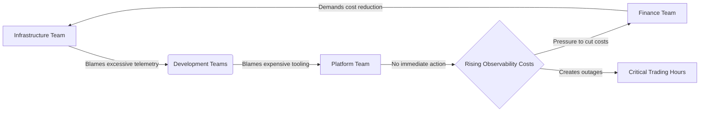

This cycle repeated until the bank implemented a Quarterly Observability Review to establish shared ownership, align priorities, and prevent siloed decisions from compounding systemic inefficiencies.

### SRE Best Practice: Evidence-Based Investigation

The SRE approach to this governance challenge combines quantitative data analysis with structured collaborative review. The foundation is comprehensive cost attribution telemetry that tracks observability expenses by service, team, and feature with the same rigor applied to other system metrics. This data must span multiple dimensions, summarized below:

| **Dimension** | **Description** | **Key Questions** |
| ---------------------------- | ------------------------------------------------------------------------------------------------------ | -------------------------------------------------------------------------------------------------------------- |
| **Volume Metrics** | Tracking telemetry production rates across logs, metrics, and traces with service-level granularity | - How much data is being produced per service? <br> - Are there spikes or trends in specific data types? |
| **Utilization Analysis** | Measuring which data is actually queried versus collected but never used | - What percentage of collected data is queried? <br> - Are there unused datasets that can be removed? |
| **Value Correlation** | Connecting observability signals to incident detection, diagnosis acceleration, and problem prevention | - Which signals contributed to resolving incidents? <br> - How does visibility improve response times? |
| **Cost Projection Modeling** | Forecasting how observability expenses will scale with business growth | - How will costs change as transaction volumes increase? <br> - Are current telemetry levels sustainable? |
| **Comparative Benchmarking** | Establishing baseline costs per transaction across similar systems | - How does our spend compare to industry or internal benchmarks? <br> - Are there outlier services to address? |

These evidence sources feed a quarterly review process that brings together technical and business stakeholders to analyze trends, identify optimization opportunities, and make data-driven decisions about observability investments. The reviews must include both backward-looking analysis (what changed and why) and forward-looking planning (projected costs and improvement initiatives).

The most effective reviews explicitly frame observability as an investment with measurable returns rather than merely a cost center. They focus on optimizing the ratio of visibility to expense—gaining maximum insight from minimum data—rather than simply reducing spending. This creates an environment where teams compete to improve efficiency rather than fighting over budget allocations.

### Banking Impact

The business consequences of ungoverned observability in banking environments are severe. Beyond the immediate financial impact of runaway costs, the lack of structured governance creates several critical business risks. Below, we outline each risk with specific examples and a brief case study to illustrate the impact:

1. **Reliability Reduction**: Without clear visibility into which observability signals provide actual value, cost-cutting often targets the wrong areas, eliminating critical telemetry while preserving low-value data.\
   *Example*: A bank reduced its telemetry ingestion costs by disabling certain high-cost logs during a cost-cutting initiative. Later, during a major payment processing outage, the missing logs delayed root cause analysis by six hours, resulting in an estimated $3M in lost transaction revenue.\
   *Case Study*: A global financial institution implemented a signal prioritization framework that identified redundant logs, enabling a 40% reduction in ingestion costs while maintaining coverage for critical services.

2. **Competitive Disadvantage**: Banks that spend excessively on observability divert resources from customer-facing innovation.\
   *Example*: A mid-sized bank spent 20% of its operational budget on telemetry, leaving insufficient funds to modernize its mobile banking app. This allowed competitors to gain market share by offering superior user experiences.\
   *Case Study*: By adopting a quarterly observability review, a regional bank reallocated 15% of its observability spend to support the launch of a new fintech product, increasing customer acquisition by 12% in six months.

3. **Regulatory Exposure**: Inconsistent observability practices create compliance blindspots, particularly around transaction monitoring and audit trails.\
   *Example*: A bank missed a critical transaction anomaly due to gaps in its observability pipeline, resulting in a $5M fine for non-compliance with anti-money laundering regulations.\
   *Case Study*: To address regulatory gaps, a leading bank standardized its observability framework across all business units, ensuring audit-ready telemetry and reducing compliance risks by 70%.

4. **Incident Prolongation**: Fragmented visibility extends the duration of customer-impacting incidents, directly affecting revenue and reputation.\
   *Example*: During a peak holiday shopping period, a payment gateway experienced downtime. Poorly integrated observability tools delayed resolution by 10 hours, leading to $10M in lost transactions and a 15% increase in customer churn.\
   *Case Study*: A bank consolidated its observability tools into a single platform, reducing mean time to recovery (MTTR) by 35% and improving customer satisfaction scores by 20%.

5. **Decision Paralysis**: Without clear governance, teams delay instrumentation decisions during critical projects, fearing budget repercussions.\
   *Example*: A development team postponed implementing telemetry for a high-priority fraud detection system due to concerns over cost overruns. As a result, the system went live with reduced visibility, leading to undetected fraud incidents worth $1.2M.\
   *Case Study*: By implementing an observability budget allocation process, a national bank empowered teams to make data-driven instrumentation decisions, accelerating project timelines by 25%.

Financial institutions that implement structured observability governance typically achieve 30-50% cost reduction while simultaneously improving key reliability metrics. More importantly, they create the conditions for sustainable scaling where observability costs grow sublinearly with transaction volumes rather than the exponential growth seen in ungoverned environments.

### Implementation Guidance

To establish effective quarterly observability reviews in your organization, follow these structured steps. The timeline below outlines key phases, with estimated durations and primary activities for each stage:

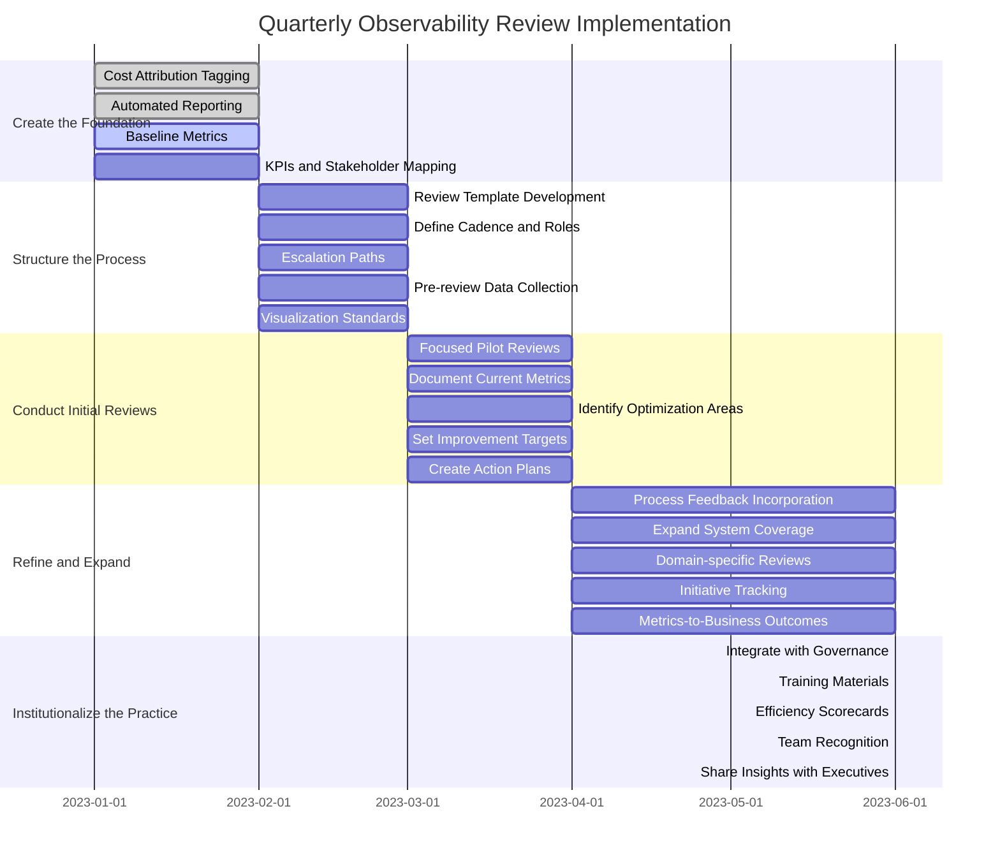

### Step-by-Step Breakdown

1. **Create the Foundation (Month 1-2)**:

   - Implement comprehensive cost attribution tagging for all observability telemetry.
   - Deploy automated reporting that connects telemetry volume to platform costs.
   - Establish baseline metrics for observability cost per transaction across different services.
   - Define key performance indicators that balance visibility and cost efficiency.
   - Map stakeholders across engineering, operations, finance, and business units.

2. **Structure the Process (Month 2-3)**:

   - Develop a standardized review template that covers cost trends, value metrics, and optimization initiatives.
   - Establish a regular cadence (typically quarterly) with defined roles and responsibilities.
   - Create clear escalation paths for exceptions and investment requests.
   - Implement pre-review data collection processes that minimize manual preparation.
   - Develop visualization standards that make complex cost data accessible to all stakeholders.

3. **Conduct Initial Reviews (Month 3-4)**:

   - Begin with a focused pilot involving 2-3 critical banking systems.
   - Document current state metrics with particular attention to cost outliers.
   - Identify initial optimization opportunities with clear ROI potential.
   - Establish improvement targets for the next review cycle.
   - Create action plans with specific ownership and timelines.

4. **Refine and Expand (Month 4-6)**:

   - Incorporate feedback to improve the review process and materials.
   - Expand coverage to include additional systems and teams.
   - Develop specific review sections for different banking domains (payments, trading, etc.).
   - Implement tracking for optimization initiatives from previous reviews.
   - Begin connecting observability metrics to business outcomes like transaction completion rates.

5. **Institutionalize the Practice (Month 6+)**:

   - Integrate observability reviews with other governance processes (architecture reviews, technology budgeting).
   - Develop training materials to onboard new participants.
   - Create an observability efficiency scorecard for each team.
   - Establish recognition mechanisms for teams demonstrating best practices.
   - Share aggregated insights with executive leadership to build strategic support.

By following this phased approach, organizations can create a scalable, transparent, and cost-effective observability framework that drives both technical and business value.

## Panel 2: The Telemetry Budget

### Scene Description

Two SREs sit side by side at a workstation, reviewing a proposed instrumentation plan for a new payment processing microservice. On their screen is a "Telemetry Budget Calculator" tool that prominently displays interactive controls and real-time cost projections. The interface includes:

- **Sliders**: Adjustments for sampling rates, cardinality limits, and retention periods.
- **Graph**: A "Cost vs. Troubleshooting Value" plot showing the tradeoff curve and the optimal balance point.
- **Summary Panel**: A breakdown of projected monthly costs alongside key metrics (e.g., high-cardinality dimensions, total data volume, and retention duration).

Below is a simplified text representation of the tool's interface:

```
Telemetry Budget Calculator
+------------------------------------------------------+
| Sampling Rate: [ |---o-------| ]    (Current: 50%)  |
| Cardinality Limit: [ |--o--------| ] (Current: 1k)  |
| Retention Period: [ |---o-------| ]   (Current: 7d) |
+------------------------------------------------------+
| Monthly Cost: $12,000                                |
| High-Value Dimensions: 3                             |
| Low-Value Dimensions: 8                              |
+------------------------------------------------------+
| [Cost vs. Troubleshooting Value Graph]               |
| Optimal Balance Point: Cost = $10,000               |
|                         Troubleshooting Value = 85% |
+------------------------------------------------------+
```

As they reduce the cardinality of a customer ID dimension using the slider, the projected monthly cost in the Summary Panel drops significantly. One engineer points to the "Cost vs. Troubleshooting Value" graph, highlighting how further reductions would impair incident response capabilities. The deliberate adjustments reflect the team's effort to align observability decisions with the defined telemetry budget.

### Teaching Narrative

The concept of a "Telemetry Budget" represents a fundamental shift in how observability is planned and implemented. Just as financial budgets guide monetary expenditures and error budgets guide reliability engineering, telemetry budgets establish boundaries for observability data generation that balance insight needs against economic constraints.

In traditional monitoring approaches, instrumentation decisions were made in isolation at the component level, often with the default assumption that "more data is better." This approach fails in modern observability environments where the relationship between data volume and cost is direct and significant. The Telemetry Budget concept introduces economic discipline to the instrumentation process without sacrificing necessary visibility.

The Telemetry Budget is more than just a cost ceiling—it's a structured approach to making deliberate, quantified decisions about what data to collect, at what fidelity, and for how long. It introduces several critical practices:

1. Pre-implementation cost modeling of observability decisions
2. Explicit prioritization of high-value signals over low-value signals
3. Quantified tradeoff analysis between data reduction and troubleshooting capability
4. Built-in review processes for instrumentation proposals that exceed budgetary guidelines
5. Regular recalibration based on actual operational needs demonstrated through incident analysis

By implementing Telemetry Budgets, organizations transform observability from an unconstrained technical practice to a disciplined engineering approach that explicitly balances value and cost. This shift is particularly crucial in banking environments where observability expenditures can easily reach millions of dollars annually if left unmanaged.

### Common Example of the Problem

A trading platform team at an investment bank was tasked with reducing their observability costs after exceeding their quarterly allocation by 340%. Upon investigation, they discovered several key issues that contributed to the problem:

| **Issue** | **Description** | **Consequence** |
| ------------------------------------- | --------------------------------------------------------------------------------------------------------------- | --------------------------------------------------------------------------------------------------- |
| **Cardinality Explosion** | Instrumentation included every trade execution with full details, using high-cardinality dimensions on metrics. | Generated over 500 million time series, drastically increasing storage and processing costs. |
| **Lack of Pre-Deployment Evaluation** | No systematic process existed to assess the cost and value of new instrumentation before release. | Instrumentation decisions were made without understanding their financial implications. |
| **Cost Visibility Gap** | Observability costs were only noticed after exceeding the quarterly budget. | Prevented timely adjustments to prevent cost overruns. |
| **No Tradeoff Framework** | There was no framework to balance the value of visibility against its expense. | Team faced an "all or nothing" decision: retain critical insights at high cost or cut data blindly. |

This situation highlights the risks of unstructured instrumentation practices. Without a Telemetry Budget or a disciplined approach to observability, organizations are vulnerable to runaway costs and operational blind spots, forcing reactive and suboptimal decisions.

### SRE Best Practice: Evidence-Based Investigation

SRE teams address this challenge by implementing structured telemetry budgeting processes built on quantitative analysis of observability value. The core practice involves establishing clear budget allocations for different services based on their criticality, complexity, and transaction volumes, then implementing a systematic approach to managing within those constraints.

#### Evidence-Based Telemetry Budgeting Checklist

1. **Service Criticality Classification**

   - Categorize services based on business impact (e.g., high, medium, low).
   - Assign observability investment levels to each tier (e.g., trading systems = high investment, internal reporting = low investment).

2. **Signal Value Analysis**

   - Review incident data to identify telemetry signals (logs, metrics, traces) that consistently contribute to faster resolution.
   - Prioritize high-value signals for retention and visibility.

3. **Usage Pattern Monitoring**

   - Track the frequency and context of queries against collected telemetry data.
   - Identify low-usage signals as candidates for reduction or elimination.

4. **Cost Driver Identification**

   - Analyze high-cost instrumentation configurations (e.g., high-cardinality metrics, verbose logging, untargeted tracing).
   - Focus on optimizing these areas to control cost.

5. **Efficiency Benchmarking**

   - Compare observability cost per transaction across similar services.
   - Identify outliers and adopt best practices from efficient services.

6. **Pre-Deployment Cost Modeling**

   - Use cost modeling tools to simulate telemetry expenses for proposed instrumentation.
   - Experiment with sampling rates, cardinality limits, and retention periods to find an optimal balance point.

7. **Regular Recalibration**

   - Review telemetry budgets periodically based on incident postmortems.
   - Adjust priorities and investments to align with operational insights and evolving business needs.

#### Flowchart: Evidence-Based Telemetry Budgeting Workflow

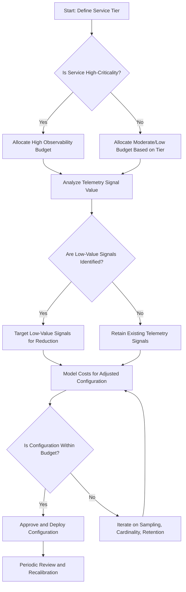

This evidence-based approach ensures that telemetry budgets reflect actual operational needs rather than arbitrary financial targets. The most sophisticated implementations develop quantified models that predict the relationship between data reduction and incident impact, allowing teams to make informed decisions about observability tradeoffs.

By leveraging pre-deployment cost modeling tools and the systematic steps outlined above, SRE teams can optimize their telemetry budgets, ensuring visibility aligns with business value while controlling costs.

### Banking Impact

Unbudgeted observability has particularly severe consequences in banking environments due to high transaction volumes and complex system interactions. The business impacts and their implications are summarized below:

| **Impact** | **Description** | **Implication** |
| ------------------------------------ | ---------------------------------------------------------------------- | ------------------------------------------------------------------------------------------------ |
| **Cost Volatility** | Unexpected observability expenses disrupt financial planning. | Leads to quarterly financial surprises and reduced flexibility for technology investments. |
| **Reliability Risk** | Reactive cost-cutting removes critical visibility. | Extends outage durations for customer-facing services, impacting reliability and customer trust. |
| **Deployment Hesitancy** | Uncertainty about observability costs delays feature rollouts. | Slows competitive responsiveness and impacts time-to-market for critical banking innovations. |
| **Infrastructure Sizing Challenges** | Unpredictable observability data volumes complicate capacity planning. | Results in overprovisioning (wasted resources) or underprovisioning (performance degradation). |
| **Technical Debt Accumulation** | Poorly designed instrumentation creates long-term burdens. | Increases maintenance costs and operational complexity over time. |

Financial institutions that adopt structured telemetry budgeting typically see the following benefits:

- **Cost Savings**: A 40-60% reduction in observability expenses while maintaining or improving incident response capabilities.
- **Predictability**: Improved financial planning and provisioning for growth aligned with business goals.

### Implementation Guidance

To implement telemetry budgeting in your banking organization, follow this structured timeline:

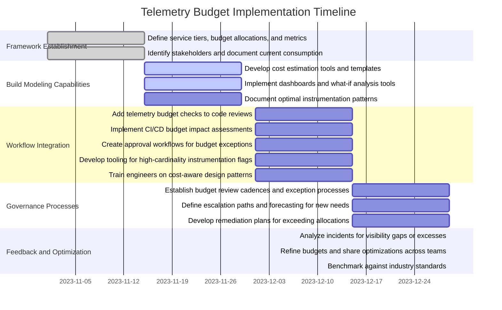

#### Week-by-Week Steps:

1. **Week 1-2: Establish the Framework**

   - Define service tiers based on business criticality and transaction volumes.
   - Develop initial telemetry budget allocations for each tier.
   - Create baseline metrics for observability cost per transaction.
   - Identify key stakeholders for budget governance.
   - Document current observability consumption patterns.

2. **Week 3-4: Build Modeling Capabilities**

   - Develop or adopt cost estimation tools that predict observability expenses.
   - Create templates for calculating cardinality impact of different instrumentation choices.
   - Implement dashboards showing real-time consumption against budgets.
   - Build what-if analysis capabilities for evaluating different instrumentation strategies.
   - Document optimal instrumentation patterns by service type.

3. **Week 5-6: Integrate with Development Workflow**

   - Add telemetry budget impact assessment to code review checklists.
   - Implement pre-deployment estimates in CI/CD pipelines.
   - Create approval workflows for exceptions that exceed budgetary guidelines.
   - Develop tooling that automatically flags high-cardinality or excessive instrumentation.
   - Train engineers on cost-aware observability design patterns.

4. **Week 7-8: Implement Governance Processes**

   - Establish regular budget review cadence (typically monthly).
   - Create exception processes for temporary budget increases.
   - Define escalation paths for resolving budget conflicts.
   - Implement forecasting to anticipate budget needs for new initiatives.
   - Develop remediation plans for services exceeding allocations.

5. **Ongoing: Optimize Through Feedback Loops**

   - Analyze incident postmortems to identify visibility gaps or excesses.
   - Refine budgets based on operational experience.
   - Share optimization techniques across teams.
   - Adjust allocations as business priorities evolve.
   - Continuously benchmark against industry standards.

## Panel 3: The Instrumentation Design Review

### Scene Description

A virtual meeting shows developers presenting a new feature's observability plan to a panel of SRE experts. On screen, a template document titled "Instrumentation Design Review" is prominently displayed, structured as follows:

```
+-----------------------------------------------------+
|                 Instrumentation Design Review       |
+-----------------------------------------------------+
| Critical User Journeys                              |
| - [Example: User login flow, payment processing]    |
|                                                     |
| Failure Modes                                       |
| - [Example: Timeout errors, validation failures]    |
|                                                     |
| Required Signals                                    |
| - [Example: Response times, error rates]            |
|                                                     |
| Sampling Strategy                                   |
| - [Example: Contextual sampling: 100% errors, 1% success] |
|                                                     |
| Cost Projection                                     |
| - [Example: Estimated storage cost: $X/month]      |
+-----------------------------------------------------+
```

The lead developer explains a novel approach leveraging contextual sampling to capture 100% of error cases while sampling only 1% of successful transactions. A simplified flow of the contextual sampling logic is illustrated below to clarify its operation:

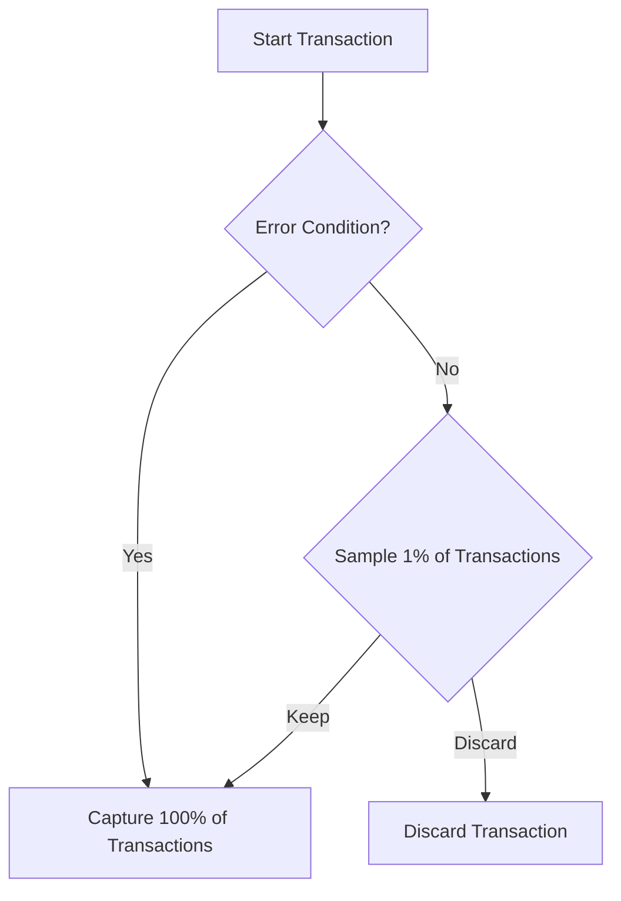

An SRE is visibly impressed, jotting down notes to incorporate this efficient sampling pattern into their team's observability standards documentation.

### Teaching Narrative

The Instrumentation Design Review represents a crucial quality gate that builds cost-awareness directly into the software development lifecycle. By integrating observability planning into the design phase—rather than treating it as an afterthought during implementation—teams can develop instrumentation strategies that balance comprehensive visibility with economic sustainability.

Traditional approaches to observability often followed an "instrument now, optimize later" pattern that inevitably led to excessive data generation and costly remediation efforts. The Instrumentation Design Review flips this paradigm by treating observability as a designed feature with specific requirements, constraints, and quality standards—including cost efficiency.

The review process creates a structured framework for answering critical questions that many teams previously left implicit or unconsidered:

1. What specific user journeys and system behaviors must be observable?
2. What failure modes require comprehensive visibility versus sampling?
3. What cardinality is truly necessary for effective troubleshooting?
4. What retention periods align with actual historical analysis needs?
5. How will observability costs scale with user growth and feature expansion?

Beyond the technical decisions, the Instrumentation Design Review serves as a cultural touchpoint that reinforces the organization's commitment to cost-aware observability. It creates a forum where teams share innovative approaches to gaining maximum insight from minimum data, establishing a collective intelligence around efficient instrumentation patterns.

For banking organizations managing hundreds of services across multiple regions, this systematic approach to observability design can reduce annual monitoring costs by millions of dollars while actually improving visibility into the most critical aspects of system behavior.

### Common Example of the Problem

A digital banking team launched a new mobile check deposit feature with default comprehensive instrumentation. Every customer interaction generated detailed logs, each processing step created multiple metrics, and every transaction produced full distributed traces. The team assumed this visibility was necessary for troubleshooting in production. Within two weeks of launch, their observability costs had increased by $150,000, vastly exceeding projections. When customers began reporting intermittent failures, despite the extensive telemetry, the team struggled to identify the root cause—drowning in data while lacking the specific signals needed for diagnosis. Without a structured approach to instrumentation design, they had created a costly system that paradoxically reduced their ability to resolve issues quickly by burying critical signals in overwhelming noise.

#### Problem Summary Table

| **Telemetry Type** | **Volume Generated** | **Cost Impact** | **Outcome** |
| ------------------ | -------------------------------------------- | ------------------------------------------ | ---------------------------------------------------------------------------------- |
| Logs | Detailed logs for every interaction | High storage and query costs | Overwhelming noise, making it hard to locate key failure events |
| Metrics | Multiple metrics per processing step | Increased aggregation costs | Limited insight into specific failure modes due to redundant or irrelevant metrics |
| Traces | Full distributed traces for all transactions | Extremely high ingestion and storage costs | High cardinality made query performance poor and obscured actionable insights |

#### Key Issues

1. **Excessive Data Volume**: Instrumentation generated far more data than the team could effectively analyze, leading to inefficiencies in troubleshooting.
2. **Cost Explosion**: Observability costs rapidly scaled beyond initial projections, creating an unsustainable financial burden.
3. **Lack of Signal Clarity**: Critical failure signals were buried in noise, delaying time-to-resolution for customer-impacting issues.

This example highlights the importance of designing instrumentation with clear intent, balancing visibility needs with cost efficiency, and ensuring the data collected aligns directly with troubleshooting requirements.

### SRE Best Practice: Evidence-Based Investigation

The SRE approach to instrumentation design incorporates structured review processes focused on value-optimized observability. The methodology centers on instrumenting for specific troubleshooting scenarios rather than general visibility. To guide teams in applying this methodology effectively, the following checklist summarizes the key practices:

#### Evidence-Based Investigation Checklist

1. **Failure Mode Analysis**

   - Identify potential failure points systematically using techniques like Failure Mode and Effects Analysis (FMEA).
   - Define the specific detection requirements for each failure mode.

2. **User Journey Mapping**

   - Document critical customer workflows and their dependencies.
   - Ensure instrumentation provides end-to-end visibility for key business transactions.

3. **Signal-to-Noise Optimization**

   - Evaluate proposed metrics, logs, and trace points against explicit troubleshooting scenarios.
   - Eliminate signals unlikely to contribute to effective problem resolution.

4. **Sampling Strategy Design**

   - Develop tiered data collection approaches:
     - Comprehensive instrumentation for high-value or anomalous events.
     - Statistical sampling for routine operations to reduce cost and noise.

5. **Cardinality Management Planning**

   - Analyze dimension requirements for metrics.
   - Establish hierarchical aggregation approaches to provide actionable insights without excessive cardinality growth.

#### Text Diagram: Application Workflow for Evidence-Based Investigation

```plaintext
[Feature Design] 
     ↓
[Critical User Journey Mapping]
     ↓
[Failure Mode Analysis]
     ↓
[Signal Evaluation (Signal-to-Noise Optimization)]
     ↓
[Sampling Strategy Design]
     ↓
[Cardinality Planning]
     ↓
[Observability Simulation & Validation]
     ↓
[Final Instrumentation Design Review]
```

The implementation centers around a formal review process that occurs during feature design rather than after implementation. Using standardized templates, teams document their observability requirements alongside functional specifications, creating explicit traceability between business needs and instrumentation decisions.

The most sophisticated implementations incorporate **observability simulation techniques** to model how different instrumentation approaches would perform during theoretical incidents. Testing detection and diagnosis capabilities against documented failure scenarios allows teams to validate their designs before implementation, ensuring robust, cost-efficient observability.

### Banking Impact

Poor instrumentation design in banking systems creates serious business consequences beyond direct costs. The table below summarizes these consequences and their impacts:

| **Business Consequence** | **Impact** |
| ----------------------------- | --------------------------------------------------------------------------------------------------------------------------------- |
| **Extended Outage Durations** | Excessive but unfocused telemetry complicates troubleshooting, directly impacting customer experience during incidents. |
| **Delayed Feature Delivery** | Remediation work required to optimize poorly designed instrumentation diverts development resources from new capabilities. |
| **Compliance Challenges** | Inconsistent observability approaches create gaps in required audit trails while generating excessive data in non-critical areas. |
| **Scalability Limitations** | Observability implementations that cannot scale economically with business growth create architectural constraints. |
| **Data Privacy Risks** | Over-instrumentation potentially captures sensitive customer information without appropriate controls. |

Financial institutions that implement structured instrumentation design reviews typically reduce feature observability costs by 60-70% while simultaneously improving mean time to detection and resolution. More importantly, they establish consistent practices that create institutional knowledge about effective observability patterns, continuously improving their practices over time.

### Implementation Guidance

To implement instrumentation design reviews in your banking organization, follow this structured timeline:

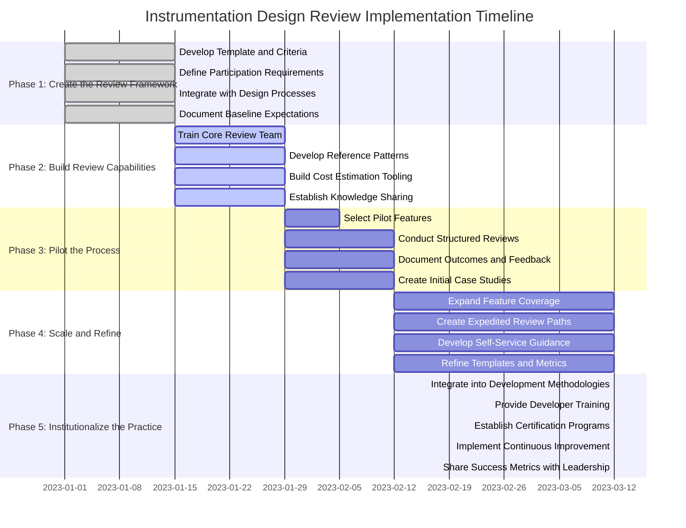

#### Week-by-Week Breakdown:

1. **Week 1-2: Create the Review Framework**

   - Develop a standardized review template with sections for user journeys, failure modes, required signals, and cost projections.
   - Define explicit evaluation criteria focused on visibility value versus data volume.
   - Establish review participation requirements (SREs, developers, product management).
   - Create integration points with existing design review processes.
   - Document baseline expectations for different application types.

2. **Week 3-4: Build Review Capabilities**

   - Train a core team of reviewers on cost-aware observability principles.
   - Develop reference patterns for common banking scenarios (payments, authentication, etc.).
   - Create tooling for estimating observability costs based on design documents.
   - Implement knowledge-sharing mechanisms for effective patterns.
   - Establish metrics for measuring review effectiveness.

3. **Week 5-6: Pilot the Process**

   - Select 2-3 upcoming features for initial implementation.
   - Conduct structured reviews with focused feedback.
   - Document cost projections and actual outcomes.
   - Identify improvement opportunities in the review process.
   - Create case studies highlighting value delivered.

4. **Week 7-10: Scale and Refine**

   - Expand coverage to all new features above defined complexity thresholds.
   - Create expedited paths for lower-risk implementations.
   - Develop self-service guidance for teams preparing for reviews.
   - Implement metrics tracking review outcomes and cost impacts.
   - Refine templates based on initial implementation feedback.

5. **Ongoing: Institutionalize the Practice**

   - Integrate observability design reviews into formal development methodologies.
   - Create training for all developers on instrumentation design principles.
   - Establish certification programs for observability reviewers.
   - Implement continuous improvement based on production outcomes.
   - Share success metrics with leadership to reinforce organizational commitment.

## Panel 4: The Observability Center of Excellence

### Scene Description

The Observability Center of Excellence is a dynamic and collaborative space designed to foster cost-efficient observability practices. At the center of the room, a senior SRE demonstrates an automated cardinality limiting tool to a group of engineers from various product teams, who are engaged in active discussion.

The walls of the room are lined with prominently displayed guides, such as:

- **"Sampling Strategies by Service Type"**
- **"Observability Cost Optimization Patterns"**

A large monitor at the front of the room showcases a leaderboard titled **"Observability Efficiency Score"**, ranking teams based on a composite metric that includes visibility coverage, MTTR, and cost-per-transaction. Opposite the monitor, a calendar highlights upcoming training sessions focused on cost-aware instrumentation techniques.

Below is a conceptual layout of the space to visualize the environment:

```
+--------------------------------------------------------+
|                                                        |
|       [ Large Monitor: Observability Leaderboard ]     |
|                                                        |
+------------------+------------------+------------------+
| [Guide: Sampling |                  | [Guide: Cost     |
|  Strategies]     |   Collaboration  |  Optimization]   |
|                  |      Tables      |                  |
| [Guide: Other    |                  | [Calendar:       |
|  Practices]      |                  |  Training]       |
+------------------+------------------+------------------+
|                                                        |
|       [Senior SRE Demonstration Area: Cardinality      |
|        Limiting Tool with Engineers Collaborating]     |
|                                                        |
+--------------------------------------------------------+
```

This thoughtfully designed space encourages knowledge sharing, experimentation, and alignment on best practices, serving as both a functional hub and an inspiration for teams across the organization.

### Teaching Narrative

The Observability Center of Excellence (OCoE) represents a strategic organizational investment in developing and propagating cost-efficient observability practices across the enterprise. Unlike centralized monitoring teams of the past—which often focused on tool administration rather than instrumentation guidance—the OCoE serves as a multiplication force that accelerates the adoption of cost-aware observability culture across all engineering teams.

Traditional approaches to observability governance often swung between two problematic extremes: either complete decentralization with no cost controls, or rigid centralized restrictions that hampered innovation. The OCoE model establishes a middle path that combines freedom of implementation with shared principles and practices that ensure economic sustainability.

The OCoE's effectiveness comes from its focus on enablement rather than enforcement. It accelerates cultural change by providing several critical functions:

1. Developing reusable instrumentation patterns that optimize visibility while minimizing data volume
2. Creating tools and libraries that implement cost-effective observability by default
3. Establishing reference architectures for different banking system types (payment processing, trading platforms, etc.)
4. Providing expert consulting to teams facing complex observability challenges
5. Continuously benchmarking and publishing observability efficiency metrics to drive improvement
6. Cultivating an internal community of practice around cost-aware observability

By investing in the OCoE model, organizations create a continuous learning loop where cost-optimization techniques evolve alongside system complexity and business requirements. This approach recognizes that sustainable observability culture cannot be mandated through policy alone—it must be cultivated through shared expertise, accessible tools, and visible success patterns.

### Common Example of the Problem

A multinational bank had implemented a modern observability platform but struggled with inconsistent adoption and escalating costs. Some teams created sophisticated, cost-efficient instrumentation, while others implemented basic patterns that generated excessive data with minimal insight value. When a major credit card processing incident occurred, teams couldn't effectively collaborate because they used different naming conventions, collection approaches, and visualization patterns. Meanwhile, quarterly observability expenses had increased 218% year-over-year, with wildly different costs per transaction across similar services. Traditional governance approaches had failed: mandatory standards were ignored, while cost limitations led some teams to abandon critical instrumentation altogether.

The challenges faced by the bank can be summarized as follows:

| **Key Issue** | **Description** | **Impact** |
| ------------------------- | ---------------------------------------------------------------------------------------------------- | --------------------------------------------------------------------------------------------- |
| **Inconsistent Adoption** | Teams applied observability practices unevenly, leading to gaps in visibility and siloed approaches. | Reduced collaboration and difficulty in diagnosing cross-team incidents. |
| **Cost Escalation** | Excessive, unoptimized data generation drove a 218% year-over-year increase in observability costs. | Unsustainable financial burden and varying cost efficiency across similar services. |
| **Governance Failures** | Rigid standards or cost controls were either ignored or caused teams to abandon critical coverage. | Loss of critical instrumentation and inability to enforce consistent, value-driven practices. |

This fragmented approach left the bank ill-equipped to handle operational crises and highlighted the need for a model that balanced consistency, cost-efficiency, and innovation. A more structured yet flexible framework, such as the Observability Center of Excellence, could address these issues by fostering shared principles, reusable patterns, and cost-aware practices.

### SRE Best Practice: Evidence-Based Investigation

The SRE approach to addressing cultural and technical observability challenges centers on establishing cross-functional excellence teams focused on enablement rather than enforcement. The Observability Center of Excellence (OCoE) leads by example, promoting evidence-based investigation practices that accelerate cost-efficient observability adoption. Below is a checklist summarizing these practices for easy reference:

| **Practice** | **Description** | **Key Benefits** |
| -------------------------------------------- | ------------------------------------------------------------------------------------------------------------------------------- | ------------------------------------------------------------------------------------------------------- |
| **Pattern Identification and Documentation** | Analyze existing observability implementations to identify reusable patterns optimized by service type. | Drives consistency and efficiency through proven, scalable approaches tailored to system needs. |
| **Tool and Library Development** | Develop shared instrumentation libraries, cost estimation tools, and automated guardrails for best practices. | Reduces redundant work and ensures cost-efficient practices are implemented by default. |
| **Metric Framework Standardization** | Create consistent naming conventions, label taxonomies, and models for cross-service correlation while controlling cardinality. | Enables effective data aggregation and correlation, avoiding unnecessary data volume and cost. |
| **Reference Implementation Creation** | Build exemplar observability implementations for common applications like payment processors or authentication services. | Provides teams with adaptable starting points, reducing setup time and ensuring adherence to standards. |
| **Knowledge Transfer Programs** | Design and deliver structured training, certifications, and mentoring to build organization-wide observability expertise. | Enhances team autonomy and accelerates widespread adoption of cost-aware observability practices. |

#### Implementation Guidance:

- The OCoE operates as an internal consultancy, collaborating with teams during design and implementation phases to provide guidance without removing ownership.
- By focusing on enablement over control, the model fosters pull-based adoption of best practices, allowing teams to innovate within a consistent and cost-efficient framework.
- This evidence-based approach ensures practices propagate organically through proven effectiveness, avoiding the pitfalls of mandatory compliance.

#### Workflow Representation:

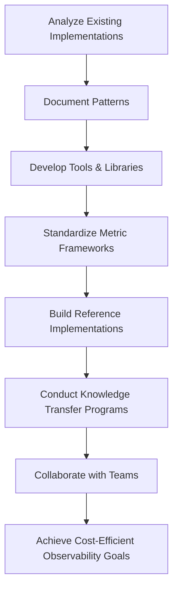

Use this checklist and workflow as a guide to implement evidence-based investigation practices that empower teams, optimize costs, and enhance observability effectiveness across the organization.

### Banking Impact

The absence of a coordinated excellence function for observability creates significant business risks in banking environments:

1. **Inconsistent Incident Response**: Fragmented observability practices that extend outage durations during critical financial transactions, directly impacting revenue and reputation

2. **Unsustainable Cost Trajectories**: Uncoordinated instrumentation approaches that create exponential expense growth, forcing reactive cuts that compromise visibility

3. **Knowledge Silos**: Isolated expertise that prevents effective practices from spreading, creating reinvention and inconsistency across teams

4. **Governance Failures**: Inability to enforce standards that leads to compliance gaps in regulated banking functions

5. **Technical Decision Paralysis**: Teams without clear guidance that either over-instrument out of caution or under-instrument out of cost fear, both compromising system reliability

Financial institutions that implement observability centers of excellence typically achieve measurable improvements. Below is a comparison of key metrics **Before OCoE** and **After OCoE** adoption:

| Metric | Before OCoE | After OCoE | Improvement (%/Impact) |
| ----------------------------------------- | ------------------------------- | ---------------------------------------------- | ----------------------------------- |
| **Organization-wide Observability Costs** | Rapid, uncontrolled growth | 30–50% cost reduction | Standardization and pattern sharing |
| **Mean Time to Detect (MTTD)** | Highly variable (hours to days) | Consistently under 15 minutes | Faster incident identification |
| **Mean Time to Recovery (MTTR)** | Prolonged (hours or more) | Reduced by 40–60% | Streamlined recovery processes |
| **Compliance Gaps** | Frequent and unpredictable | Minimal | Improved governance practices |
| **Cross-Team Knowledge Sharing** | Limited, siloed expertise | Widespread through reusable patterns and tools | Accelerated learning and scaling |
| **Instrumentation Consistency** | Ad hoc and uneven | Aligned with reference architectures | Improved reliability and visibility |

By standardizing practices and promoting a culture of cost-aware observability, the OCoE enables financial institutions to balance economic sustainability with operational excellence. This structured approach not only reduces costs and improves reliability but also ensures compliance and scalability in highly regulated environments.

### Implementation Guidance

To establish an Observability Center of Excellence in your banking organization, follow these phased implementation steps. The timeline diagram below provides a high-level overview of the process:

```mermaid
gantt
    title OCoE Implementation Timeline
    dateFormat  YYYY-MM
    section Phase 1: Define Mission and Structure
    Develop Charter                        :done, mission, 2024-01, 15d
    Define Structure and Metrics           :done, structure, 2024-01, 15d
    Identify Key Stakeholders              :active, stakeholders, 2024-01, 15d
    Establish Funding Models               :active, funding, 2024-01, 15d
    section Phase 2: Build the Core Team
    Recruit Team Members                   :crit, team, 2024-02, 30d
    Develop Knowledge Base                 :crit, knowledge, 2024-02, 30d
    Define Collaboration Models            :crit, collaboration, 2024-02, 30d
    Implement Communication Channels       :crit, communication, 2024-03, 15d
    section Phase 3: Develop Initial Capabilities
    Create Instrumentation Libraries       :active, libraries, 2024-03, 30d
    Build Cost Estimation Tools            :active, tools, 2024-03, 30d
    Establish Baseline Metrics             :active, metrics, 2024-03, 30d
    Create Training Materials              :active, training, 2024-04, 15d
    section Phase 4: Launch Initial Services
    Begin Design Reviews                   :launch, reviews, 2024-04, 30d
    Hold Office Hours                      :launch, office, 2024-04, 30d
    Launch Recognition Program             :launch, recognition, 2024-05, 15d
    Publish Metrics and Benchmarks         :launch, benchmarks, 2024-05, 15d
    section Phase 5: Expand and Institutionalize
    Develop Certification Programs         :future, certification, 2024-06, 30d
    Create Training Curricula              :future, curricula, 2024-06, 30d
    Establish Community of Practice        :future, community, 2024-07, 30d
    Integrate with SDLC Processes          :future, sdlc, 2024-07, 30d
    Implement Continuous Improvements      :future, improvements, 2024-08, 30d
```

#### Detailed Steps:

1. **Define the Mission and Structure (Month 1)**:

   - Develop a clear charter with explicit focus on enablement rather than enforcement.
   - Define the organizational structure, reporting relationships, and resource requirements.
   - Establish success metrics that balance cost efficiency with visibility improvements.
   - Identify key stakeholders across development, operations, and business units.
   - Create funding models that align incentives with organizational outcomes.

2. **Build the Core Team (Month 2-3)**:

   - Recruit members with combined expertise in observability technology, cost optimization, and banking domain knowledge.
   - Develop an initial knowledge base of best practices and anti-patterns.
   - Establish working relationships with platform teams responsible for observability tooling.
   - Create collaboration models with application teams.
   - Implement internal communication channels and knowledge-sharing mechanisms.

3. **Develop Initial Capabilities (Month 3-4)**:

   - Create standardized instrumentation libraries for common technology stacks.
   - Develop reference implementations for typical banking services.
   - Build cost estimation tools for instrumentation planning.
   - Establish baseline metrics for observability efficiency.
   - Create initial training materials and guidance documentation.

4. **Launch Initial Services (Month 4-5)**:

   - Begin offering design review consultations for new projects.
   - Implement office hours for teams seeking guidance.
   - Launch a recognition program for exemplary implementations.
   - Start publishing efficiency metrics and benchmarks.
   - Create a regular cadence of knowledge-sharing sessions.

5. **Expand and Institutionalize (Month 6+)**:

   - Develop certification programs for observability practitioners.
   - Implement formalized training curricula for different roles.
   - Create an observability community of practice across the organization.
   - Establish integration with software development lifecycle processes.
   - Implement continuous improvement mechanisms based on outcome metrics.

## Panel 5: The Observability Cost Postmortem

### Scene Description

A team huddles in a meeting room under a "Blameless Postmortem" banner. On a whiteboard, the title reads "March Observability Cost Spike: What We Learned." The whiteboard prominently features a timeline that the team is using to analyze the incident:

```
March 1    | New Feature Deployed (Instrumented for Observability)
March 3    | Initial Cost Increase Noticed (+50%)
March 5    | Cost Spike Escalates Rapidly (+300%)
March 6    | Emergency Optimization Begins
March 8    | Root Cause Identified: Excessive Telemetry Volume
March 10   | Temporary Fix Deployed (Volume Throttling)
```

Team members are mapping out the technical and procedural factors that allowed excessive instrumentation to reach production. Sticky notes and diagrams on the whiteboard highlight areas for improvement, including gaps in cost projections during the development phase and insufficient guardrails in the deployment pipeline.

The discussion is focused on systemic improvements rather than blame. One engineer is actively documenting action items such as adding cost projections to CI/CD pipelines and creating automated alerts for unusual telemetry volume increases. The atmosphere is collaborative, with team members contributing insights and brainstorming solutions to ensure similar issues are prevented in the future.

### Teaching Narrative

The Observability Cost Postmortem adapts the blameless postmortem technique—a cornerstone of mature reliability engineering—to the domain of observability economics. By treating unexpected observability cost increases as incidents worthy of systematic analysis, organizations develop institutional knowledge that continuously improves their cost-awareness practices.

In traditional environments, observability cost spikes were often addressed reactively through emergency optimization efforts or simple budget increases without addressing root causes. The Observability Cost Postmortem creates a structured learning process that transforms these incidents from mere financial anomalies into opportunities for organizational improvement.

The postmortem approach brings several powerful principles to observability cost management:

1. It focuses on systemic causes rather than individual mistakes
2. It emphasizes prevention through process improvement rather than reactive optimization
3. It creates institutional memory that prevents recurring patterns of excessive instrumentation
4. It highlights missing guardrails in the development and deployment pipeline
5. It builds shared awareness of the relationship between technical decisions and financial outcomes

Most importantly, by treating observability costs with the same seriousness as system outages, the postmortem ritual reinforces the organization's commitment to economic sustainability as a core value alongside technical excellence. It acknowledges that uncontrolled observability costs are not merely a budget issue but a technology management failure that deserves thoughtful analysis and systematic improvement.

### Common Example of the Problem

A wealth management platform at an investment bank experienced a sudden 400% increase in their monthly observability bill following a new release. The spike threatened to consume their entire quarterly IT budget, forcing emergency intervention. Finance initially responded with blanket directives to reduce observability costs immediately, regardless of potential impact on system visibility. The development team hastily implemented drastic sampling reductions and removed recently added instrumentation without careful analysis. When a trading outage occurred the following week, the team discovered they had eliminated critical telemetry needed for rapid diagnosis, extending the incident resolution time from minutes to hours. Despite the crisis response, no structured process existed to identify what went wrong with the original instrumentation decisions or how to prevent similar issues in the future—making it likely the cycle would repeat with subsequent releases.

#### Checklist: Mistakes and Lessons Learned

- **Mistakes**:

  - Released new instrumentation without cost projections or limits.
  - Failed to monitor for unusual telemetry volume increases post-deployment.
  - Responded to cost spikes with blanket reductions in telemetry, leading to blind spots.
  - Removed instrumentation without assessing its diagnostic importance.
  - Did not conduct a postmortem to analyze root causes and improve processes.

- **Lessons Learned**:

  - Integrate cost-awareness checks into the CI/CD pipeline before deployment.
  - Implement automated alerts for anomalous telemetry volume or cost spikes.
  - Prioritize telemetry reductions based on diagnostic value, not arbitrary cuts.
  - Treat observability cost issues with the same systematic rigor as outages.
  - Establish a blameless postmortem process for observability cost incidents.

### SRE Best Practice: Evidence-Based Investigation

The SRE approach to addressing observability cost spikes implements structured postmortem processes focused on systemic improvement rather than blame or simple cost reduction. The methodology centers on detailed timeline reconstruction, root cause analysis, and process improvement. The following table summarizes the key steps, their goals, and expected outputs:

| **Step** | **Goal** | **Output** |
| ---------------------------- | --------------------------------------------------------------------------------------------------------------------------------------------------------------------------- | ----------------------------------------------------------------------------------------------- |
| **Timeline Reconstruction** | Map the sequence of events leading to the cost spike, focusing on code changes, configuration adjustments, and deployment activities, especially instrumentation decisions. | A detailed timeline highlighting key events and decision points contributing to the cost spike. |
| **Cost Impact Analysis** | Quantify the components driving increased costs (e.g., cardinality growth, log volume spikes, retention changes) with service-level detail. | A breakdown of cost drivers with clear attribution to specific services or components. |
| **Root Cause Investigation** | Identify the underlying technical or procedural issues that allowed excessive instrumentation to reach production undetected. | A root cause report detailing systemic gaps and contributing factors. |
| **Counterfactual Analysis** | Explore what detection mechanisms, reviews, or guardrails could have prevented the issue. | A list of hypothetical safeguards and their potential effectiveness in preventing recurrence. |
| **Blast Radius Assessment** | Assess whether similar instrumentation patterns exist in other services that could lead to future cost spikes. | A risk assessment identifying vulnerable services and their potential cost impact. |

The implementation centers around formal postmortem sessions conducted when significant cost anomalies occur. Using standardized templates similar to reliability postmortems, teams document the incident timeline, contributing factors, and recommended improvements. A critical aspect is the blameless approach that focuses on system improvements rather than individual accountability, encouraging honest analysis without defensiveness.

The most effective implementations create a dedicated postmortem process for observability economics distinct from general incident reviews. This specialized approach recognizes the unique factors contributing to observability cost issues and ensures appropriate expertise is involved in the analysis and recommendation development.

### Banking Impact

### Banking and Industry Impact

Unaddressed observability cost incidents create serious business consequences across industries, including banking, e-commerce, and SaaS environments. Below are specific examples illustrating the potential impacts:

#### Banking

1. **Reactive Cost Cutting**: Hasty reductions in telemetry that eliminate critical visibility, potentially extending future outage durations for customer-facing services.
2. **Budget Disruption**: Unexpected observability expenses that force reallocation of resources from planned initiatives, delaying strategic projects.
3. **Decision Quality Degradation**: Teams that become hesitant to implement appropriate instrumentation due to fear of cost repercussions, reducing overall system visibility.
4. **Loss of Customer Trust**: Extended incident resolution times resulting from visibility gaps that directly impact customer experience and confidence.
5. **Regulatory Compliance Risk**: Unplanned telemetry reductions that potentially eliminate data required for regulatory reporting and investigations.

#### E-commerce

1. **Revenue Loss During Peak Events**: Anomalies in telemetry costs during high-traffic periods, such as holiday sales, can lead to reduced visibility into performance bottlenecks, resulting in lost sales opportunities.
2. **Cart Abandonment**: Insufficient instrumentation caused by reactive cost reductions can obscure real-time issues like slow checkout processes, directly impacting conversion rates.
3. **Customer Loyalty Erosion**: Delayed resolution of platform issues due to visibility gaps can erode trust, leading to higher churn rates in competitive markets.

#### SaaS

1. **Feature Rollout Risks**: New feature deployments without sufficient cost guardrails in observability pipelines can lead to runaway telemetry growth, forcing teams to roll back valuable functionality.
2. **Subscription Plan Misalignment**: Over-instrumentation may inflate infrastructure costs, causing misalignment between revenue from customer subscriptions and backend expenses.
3. **Operational Efficiency Declines**: Teams overwhelmed by telemetry noise may struggle to identify actionable insights, leading to slower incident response and higher operational overhead.

Organizations across these industries that implement structured observability cost postmortems typically reduce the frequency of significant cost anomalies by 70-80% while maintaining appropriate visibility for critical systems. More importantly, they create continuous improvement cycles that systematically enhance cost governance without compromising operational capabilities.

### Implementation Guidance

To implement observability cost postmortems in your banking organization:

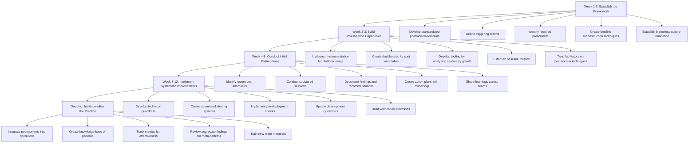

1. **Establish the Framework (Week 1-2)**:

   - Develop a standardized postmortem template focused on observability economics
   - Define triggering criteria (e.g., month-over-month cost increases exceeding 20%)
   - Identify required participants from engineering, operations, and finance
   - Create timeline reconstruction techniques specific to observability data
   - Establish a blameless culture foundation for these reviews

2. **Build Investigation Capabilities (Week 2-3)**:

   - Implement instrumentation for observability platform usage
   - Create dashboards that highlight cost anomalies by service and telemetry type
   - Develop tooling for analyzing cardinality growth and data volume changes
   - Establish baseline metrics for normal cost variations
   - Train initial facilitators on cost postmortem techniques

3. **Conduct Initial Postmortems (Week 4-8)**:

   - Identify recent cost anomalies for retrospective analysis
   - Conduct structured sessions with appropriate stakeholders
   - Document findings and systemic recommendations
   - Create action plans with clear ownership
   - Share learnings across relevant teams

4. **Implement Systematic Improvements (Week 8-12)**:

   - Develop technical guardrails based on postmortem findings
   - Create automated alerting for emerging cost anomalies
   - Implement pre-deployment checks that flag potential issues
   - Update development guidelines to address common causes
   - Build verification processes for remediation effectiveness

5. **Institutionalize the Practice (Ongoing)**:

   - Integrate cost postmortems into regular operational processes
   - Create a knowledge base of common patterns and solutions
   - Establish metrics tracking postmortem effectiveness
   - Implement periodic reviews of aggregate findings to identify meta-patterns
   - Develop training for new team members on cost-aware instrumentation

## Panel 6: The Observability Value Narrative

### Scene Description

A senior SRE stands in an executive boardroom, presenting to the bank's leadership team. Her slides show a compelling visualization that correlates improvements in user transaction success rates with strategic investments in observability. The visualization is structured as follows:

- **X-Axis**: Timeline of observability enhancements (e.g., deployment of targeted telemetry, log aggregation improvements)
- **Y-Axis**: Key business metrics (e.g., user transaction success rates, fraud detection improvements)

Below the chart, a breakdown highlights:

- A **20% reduction in observability costs** alongside improved metrics.
- The relationship between **faster mean time to detection (MTTD)** and reduced financial losses.
- A clear link between customer retention growth and system reliability.

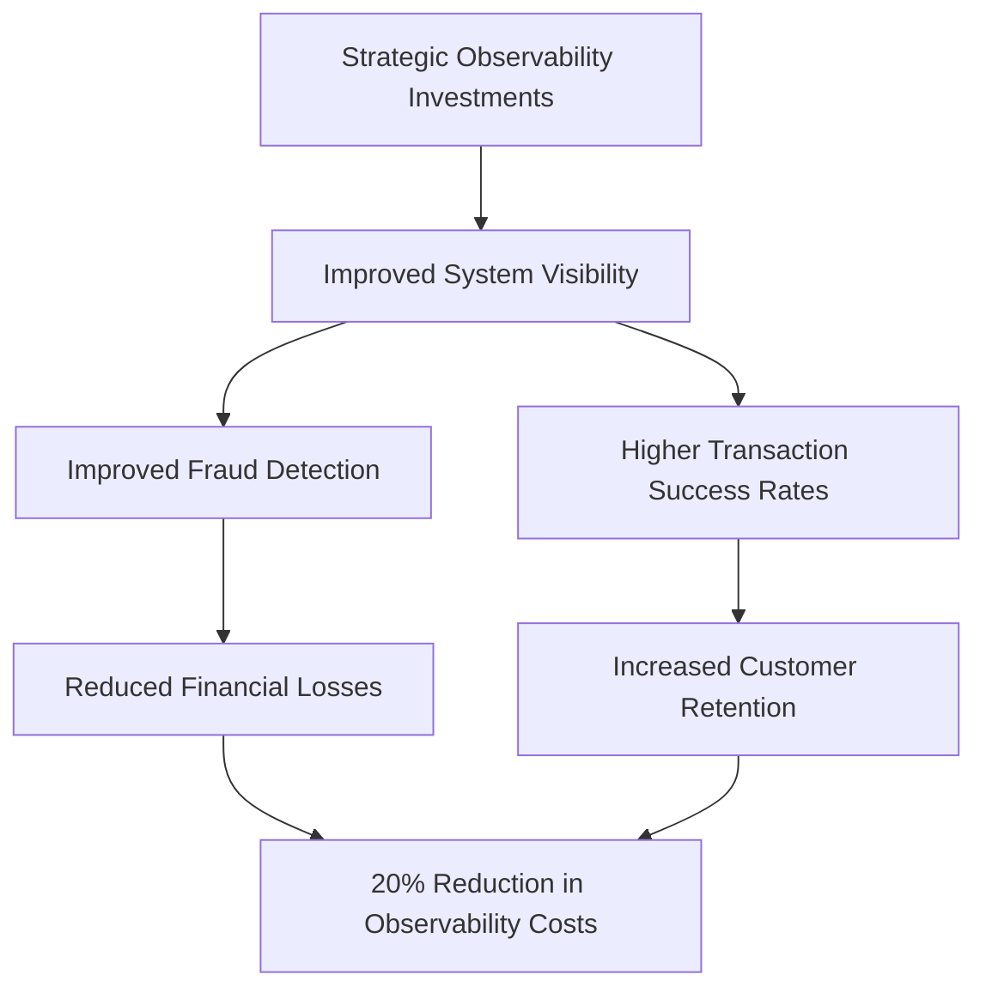

The CFO looks impressed as the SRE demonstrates how these measurable improvements directly translate to critical business outcomes. The visualization, combined with concrete financial and operational metrics, underscores the strategic importance of observability investments to the bank's leadership team.

### Teaching Narrative

The Observability Value Narrative represents the crucial practice of connecting technical observability decisions to business outcomes that executive leadership values. By developing and continuously refining this narrative, engineering teams transform the perception of observability from a technical cost center to a strategic business capability that delivers measurable value.

In traditional environments, observability was often justified through vague appeals to "system visibility" without quantifying specific business benefits. This approach increasingly fails in modern organizations where all technology investments must demonstrate clear value. The Observability Value Narrative creates a structured approach to articulating and measuring the business impact of observability investments.

The narrative practice includes several key components:

1. Identifying specific business metrics impacted by improved observability (e.g., fraud detection rates, transaction completion rates)
2. Quantifying the financial impact of faster incident detection and resolution
3. Demonstrating how observability enables more confident and rapid feature deployment
4. Showing the relationship between system visibility and regulatory compliance success
5. Calculating the return on investment from targeted observability improvements

By developing a compelling Observability Value Narrative, technical leaders create organizational alignment around the strategic importance of appropriate observability investment. This alignment is crucial for sustaining the resources needed for effective observability practices while ensuring those resources are used efficiently to deliver maximum business value.

### Common Example of the Problem

A major retail bank implemented a cost-reduction program, targeting observability for a 50% budget cut. The CFO labeled observability as "excessive monitoring costs," questioning its value compared to other technology investments. The platform team attempted to protest but relied solely on technical arguments about telemetry and system behavior, failing to connect these capabilities to business outcomes. The executive team, focused on improving quarterly earnings, approved the drastic cuts.

The sequence of events and their consequences can be summarized as follows:

| **Event** | **Action Taken** | **Result** | **Outcome** |
| ---------------------------------- | ----------------------------------------------------- | -------------------------------------------------------------------------------------------- | --------------------------------------------------------------------------------------- |
| Cost-reduction initiative launched | Observability budget cut by 50% | Platform team objections dismissed due to lack of business-value justification | Executive team proceeds with cuts, framing observability as a non-critical cost center |
| Post-cut operations | Reduced telemetry availability | Customer-impacting incidents increase by 35%; mean time to resolution triples | Engineers struggle to diagnose issues, leading to prolonged outages |
| Major mobile banking outage occurs | Engineers lack necessary telemetry to resolve quickly | Outage duration extended by 4 hours | Significant customer dissatisfaction, financial losses, and reputational damage |
| Aftermath | Executives remain unconvinced of observability value | No clear narrative connecting observability investments to reduced risks or improved metrics | Organizational misalignment persists, leaving observability undervalued and underfunded |

This example illustrates how the absence of a clear Observability Value Narrative leads to shortsighted decisions with cascading negative impacts. Despite the operational consequences, leadership remained unconvinced because no one articulated the direct connection between observability investments and measurable business outcomes.

### SRE Best Practice: Evidence-Based Investigation

The SRE approach to this communication challenge focuses on developing compelling narratives built on quantifiable business impact data. The methodology centers on establishing clear connections between observability capabilities and business outcomes that executives value.

#### Step-by-Step Checklist for Evidence-Based Investigation:

1. **Business Metric Mapping**

   - Identify key business KPIs impacted by observability (e.g., payment success rates, fraud prevention effectiveness, customer retention metrics).
   - Collaborate with business stakeholders to validate the relevance of these KPIs.

2. **Financial Impact Quantification**

   - Calculate the monetary value of avoided incidents, reduced resolution times, and improved customer experiences.
   - Use historical incident data to estimate cost savings or revenue protection.

3. **Comparative Analysis**

   - Benchmark performance against industry peers or historical organizational baselines.
   - Highlight areas where observability investments have created measurable advantages.

4. **Regulatory Compliance Enhancement**

   - Document how observability supports audit requirements, simplifies compliance reporting, and reduces regulatory risks.
   - Align observability metrics with specific regulatory frameworks relevant to the business.

5. **Innovation Enablement Assessment**

   - Measure how observability accelerates development cycles, supports frequent and stable deployments, and improves feature delivery confidence.
   - Link these improvements to competitive advantages or faster time-to-market.

#### Evidence-Based Investigation Process Diagram:

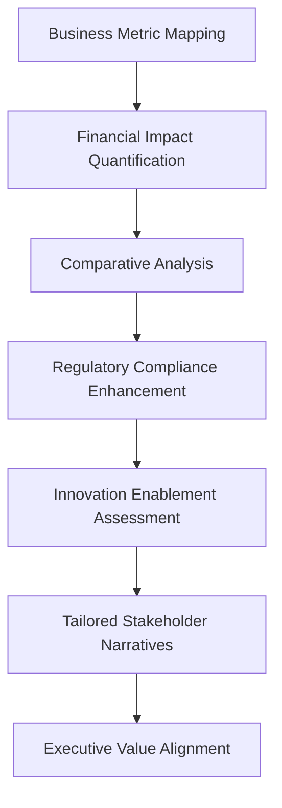

#### Implementation Guidelines:

- **Data Collection**: Ensure consistent data instrumentation that ties observability metrics directly to business outcomes. Focus not only on system health but also on business impact metrics.
- **Custom Dashboards**: Develop specialized dashboards that translate technical telemetry into business language. These should clearly show the relationship between observability investments and financial outcomes.
- **Stakeholder Tailoring**: Craft narratives that align with stakeholder priorities:
  - Present financial metrics and ROI to CFOs.
  - Emphasize customer experience impacts for COOs.
  - Highlight compliance benefits for risk officers.

By following this structured approach, technical teams can create a persuasive Observability Value Narrative that resonates with executive stakeholders and drives organizational alignment around strategic observability investments.

### Banking Impact

Failure to establish a compelling observability value narrative creates significant organizational risks:

- 📉 **Investment Misalignment**: Observability budgets that fluctuate based on financial pressures rather than actual system needs, creating dangerous visibility gaps.

- 🚫 **Innovation Constraints**: Excessive focus on cost reduction that prevents implementation of advanced observability capabilities needed for complex banking systems.

- 🔗 **Strategic Disconnection**: Technical teams that cannot effectively advocate for necessary resources because they lack business-aligned justifications.

- ⚠️ **Reactive Decision Making**: Resource allocations driven by post-incident responses rather than proactive investment in prevention.

- 🤝 **Trust Erosion**: Executives who view observability teams as cost centers rather than value creators, creating adversarial rather than collaborative relationships.

______________________________________________________________________

#### Observability Outcomes in Banking

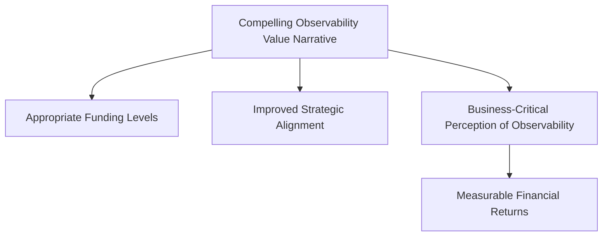

Financial institutions that implement compelling observability value narratives typically achieve appropriate funding levels while simultaneously improving the strategic alignment of their investments. More importantly, they transform the organizational perception of observability from a technical overhead to a business-critical capability that delivers measurable financial returns.

### Implementation Guidance

To develop effective observability value narratives in your banking organization, follow this phased approach. The timeline below outlines key milestones and their respective timeframes, designed to ensure a structured and efficient implementation process.

#### Implementation Timeline

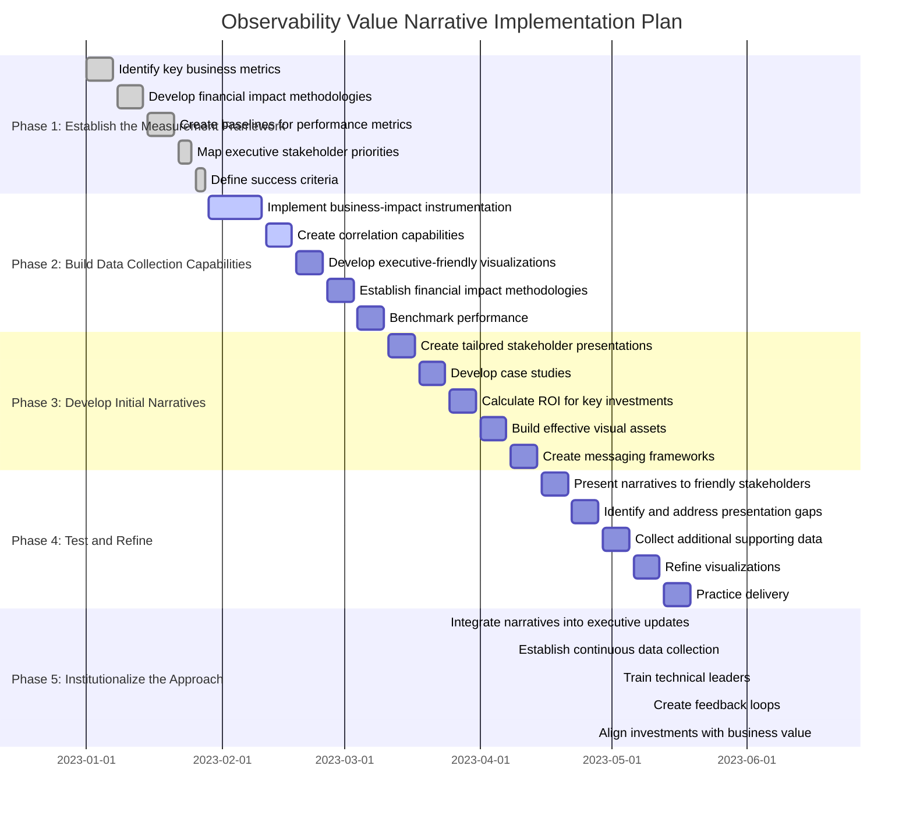

#### Phased Approach Details

1. **Establish the Measurement Framework (Week 1-3)**:

   - Identify key business metrics directly impacted by observability capabilities.
   - Develop methodologies for quantifying the financial impact of system visibility.
   - Create baselines for current performance across selected metrics.
   - Map executive stakeholders and their specific priority areas.
   - Define success criteria for narrative effectiveness.

2. **Build Data Collection Capabilities (Week 3-6)**:

   - Implement instrumentation specifically for business impact metrics.
   - Create correlation capabilities between technical telemetry and business outcomes.
   - Develop executive-friendly visualizations that translate technical data into business language.
   - Establish consistent calculation methodologies for financial impact.
   - Build comparative benchmarks against industry standards or historical performance.

3. **Develop Initial Narratives (Week 6-8)**:

   - Create tailored presentations for different stakeholder groups.
   - Develop concrete case studies connecting observability to business outcomes.
   - Establish ROI calculations for major observability investments.
   - Build visual assets that effectively communicate complex relationships.
   - Draft consistent messaging frameworks for different communication channels.

4. **Test and Refine (Week 8-10)**:

   - Present initial narratives to friendly stakeholders for feedback.
   - Identify gaps or unconvincing elements in the presentation.
   - Collect additional data to strengthen weak areas.
   - Refine visualizations based on stakeholder reactions.
   - Practice delivery to ensure technical teams can effectively communicate business value.

5. **Institutionalize the Approach (Ongoing)**:

   - Integrate value narratives into regular executive updates.
   - Create a continuous data collection process for narrative enhancement.
   - Develop training for technical leaders on business-focused communication.
   - Establish feedback loops to continuously improve narrative effectiveness.
   - Align observability investments explicitly with documented business value.

## Panel 7: The Full-Stack Observability Team

### Scene Description

A team room shows diverse specialists—performance engineers, capacity planners, financial analysts, and SREs—collaborating on a holistic observability strategy. At the center of their discussion is a digital whiteboard that visually maps different systems to observability approaches, categorized by both technical and business criteria. Next to the whiteboard, a "System Criticality Matrix" is displayed, guiding investment decisions by prioritizing systems based on their criticality to customer experience and business outcomes.

The digital whiteboard features a mapping that connects systems to observability strategies:

```
System Type           | Observability Approach
------------------------------------------------
Customer Payments     | Advanced telemetry, 24/7 monitoring
Mobile Banking        | Real-time diagnostics, error tracking
Internal Reporting    | Periodic audits, cost-efficient instrumentation
Legacy Systems        | Reduced instrumentation, deprecation planning
```

The "System Criticality Matrix" provides a visual framework for prioritization, emphasizing customer-facing systems over internal ones. Below is a simplified representation:

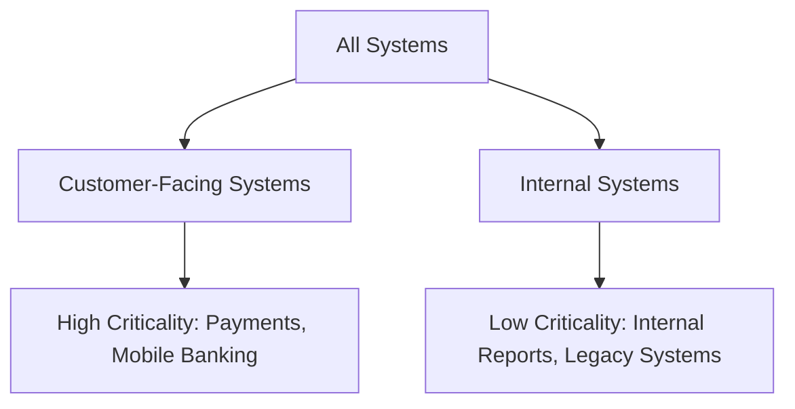

The team is actively reviewing a proposal to reallocate observability budgets, shifting resources away from over-instrumented legacy systems and toward under-instrumented mobile banking services. This adjustment aims to address customer experience issues that have been challenging to diagnose, ensuring the observability strategy delivers maximum business value.

### Teaching Narrative

The Full-Stack Observability Team represents the organizational maturity model where observability is no longer treated as merely a technical domain but as a sociotechnical system that spans technical, financial, and business dimensions. By bringing together specialists from multiple disciplines, this model creates the capabilities needed to implement truly cost-effective observability at enterprise scale.

Traditional approaches to observability were often siloed within platform teams or individual development groups, creating fragmented visibility and inconsistent cost management. The Full-Stack Observability Team creates a holistic approach that aligns technical implementations with business priorities and financial constraints.

This integrated team model provides several critical capabilities:

1. End-to-end visibility planning that crosses organizational and system boundaries
2. Risk-based investment allocation that directs observability resources where they deliver maximum value
3. Economic modeling expertise that translates technical decisions into financial projections
4. Business context that ensures observability investments align with customer experience priorities
5. Cross-system optimization that reduces redundant telemetry across related services

By implementing the Full-Stack Observability Team model, organizations create the conditions for sustainable observability scaling even as their systems grow in complexity and transaction volume. This approach recognizes that effective observability is not merely a collection of technical practices but a core business capability that requires dedicated, cross-functional expertise to develop and maintain.

The team structure creates a virtuous cycle where business priorities inform technical decisions, technical capabilities enable new business insights, and financial discipline ensures the long-term sustainability of the observability practice. This integrated approach is particularly crucial for banking organizations where observability must simultaneously support critical transaction processing, regulatory compliance, security monitoring, and customer experience optimization.

### Common Example of the Problem

A multinational bank struggled with fragmented observability across its complex ecosystem, leading to a critical trading system issue. The root cause of the problem was the lack of coordination and alignment across teams, systems, and priorities. Below is a timeline that illustrates how the fragmentation unfolded and escalated the issue:

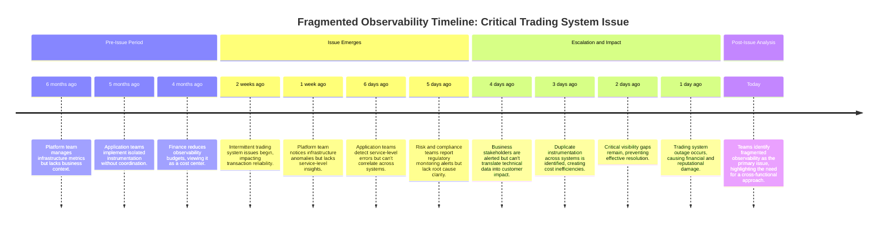

This timeline demonstrates how fragmented observability delayed detection, diagnosis, and resolution of the trading system issue. Platform teams had infrastructure metrics but no insight into business impacts. Application teams could see isolated service-level errors but couldn't correlate them with upstream or downstream systems. Risk and compliance teams operated separate monitoring tools, which created redundancy and inefficiencies. Meanwhile, business stakeholders struggled to connect technical data with customer-facing consequences.

The result was a costly outage despite significant investments in monitoring tools. This example underscores the critical need for an integrated, full-stack observability approach that aligns technical, financial, and business priorities to prevent such failures in the future.

### SRE Best Practice: Evidence-Based Investigation

The SRE approach to this organizational challenge focuses on creating cross-functional teams with end-to-end observability ownership. The core practice involves assembling diverse expertise into a dedicated team with a holistic mission spanning technical implementation, business alignment, and economic governance.

Key practices for evidence-based investigation include:

1. **Service Criticality Framework**:\
   Develop comprehensive classification systems to assess the business importance of services, enabling tiered observability approaches aligned with business priorities.

2. **Technical-Business Translation**:\
   Establish bidirectional translation capabilities to connect technical telemetry with business outcomes, ensuring both technical teams and business stakeholders can understand the impact of observability data.

3. **Economic Modeling**:\
   Implement sophisticated cost models that quantify the value and expense of observability strategies, enabling data-driven investment decisions and prioritization.

4. **System-Wide Optimization**:\
   Detect and eliminate redundant instrumentation across service boundaries while addressing critical visibility gaps to maintain efficient telemetry coverage.

5. **Regulatory Mapping**:\
   Create explicit mappings between compliance requirements and observability practices, ensuring that regulated functions maintain appropriate visibility without unnecessary over-instrumentation.

To simplify the application of these practices, teams can use the following checklist:

#### Evidence-Based Investigation Checklist

- [ ] **Define Service Criticality**: Create a framework to classify and prioritize services based on their business importance.
- [ ] **Translate Telemetry to Business Impact**: Build mechanisms to map observability data to business outcomes, ensuring mutual understanding across teams.
- [ ] **Perform Cost-Benefit Analysis**: Use economic models to evaluate the ROI of observability investments and guide resource allocation.
- [ ] **Assess Instrumentation Coverage**: Identify and resolve visibility gaps while reducing redundant telemetry across systems.
- [ ] **Ensure Compliance Alignment**: Validate that observability practices align with regulatory and compliance requirements for all critical systems.

The implementation of these practices relies on a dedicated and diverse team that includes SREs, application developers, financial analysts, business domain experts, and compliance specialists. This team operates as an internal consultancy with a dual mission: optimizing visibility for critical business functions and ensuring cost efficiency across the observability portfolio.

Successful implementations include strong executive sponsorship and clear team mandates, enabling work across organizational boundaries. Formal governance processes for observability investment decisions ensure alignment of technical, business, and financial perspectives, creating a sustainable foundation for enterprise-wide observability.

### Banking Impact

Siloed observability approaches create significant business risks in banking environments. The table below summarizes key risks, their impacts, and potential mitigations to provide a structured view of these challenges:

| **Risk** | **Impact** | **Potential Mitigation** |
| ------------------------------------- | ------------------------------------------------------------------------------------------------------------------------------------------ | --------------------------------------------------------------------------------------------------------------------------------- |
| **Incomplete Incident Understanding** | Fragmented visibility prevents comprehensive diagnosis during critical incidents, extending outage durations for customer-facing services. | Implement end-to-end visibility planning that spans organizational and system boundaries, ensuring coverage of critical services. |
| **Resource Misallocation** | Observability investments are concentrated in less critical systems, leaving visibility gaps in important customer journeys. | Use a System Criticality Matrix to prioritize observability investments based on business and customer impact. |
| **Excessive Total Cost** | Duplicate instrumentation across systems leads to unnecessary expenses without proportional visibility improvement. | Perform cross-system telemetry optimization to eliminate redundant instrumentation and reduce costs. |
| **Decision Quality Degradation** | Business leaders lack the technical context to make informed decisions about observability investments. | Integrate economic modeling expertise to translate technical observability decisions into actionable financial insights. |
| **Compliance Risk** | Disconnected monitoring approaches create regulatory blind spots despite substantial total investment. | Align observability practices with compliance requirements by integrating security and regulatory monitoring into the strategy. |

Financial institutions that implement cross-functional observability teams typically realize 20-30% cost savings through the elimination of redundancy while simultaneously improving mean time to detection and resolution for critical incidents. More importantly, they create the organizational capability to continuously align observability investments with evolving business priorities rather than relying on periodic restructuring initiatives.

### Implementation Guidance

To establish a Full-Stack Observability Team in your banking organization, follow this phased approach:

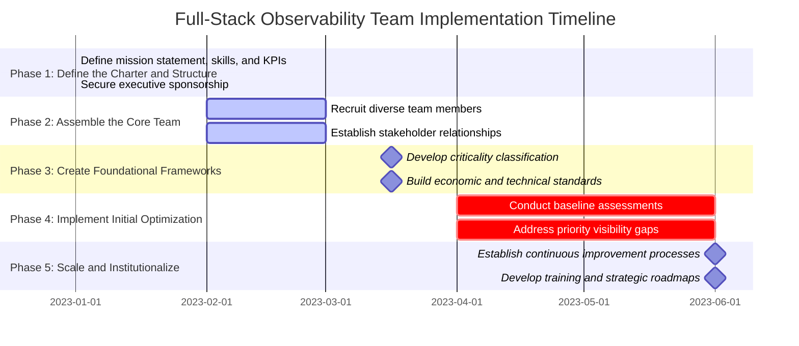

1. **Define the Charter and Structure (Month 1)**:

   - Develop a clear mission statement aligned with both technical excellence and business outcomes.
   - Identify required skills across technical, financial, and domain specialties.
   - Define reporting relationships and organizational positioning.
   - Establish key performance indicators that balance visibility, cost, and business impact.
   - Secure executive sponsorship with a clear mandate for cross-organizational influence.

2. **Assemble the Core Team (Month 2-3)**:

   - Recruit members with diverse expertise, including SRE, development, finance, and business domains.
   - Create role definitions that emphasize collaborative problem-solving.
   - Establish working relationships with key stakeholders across the organization.
   - Define interaction models with existing teams.
   - Develop initial knowledge transfer processes to build shared understanding.

3. **Create Foundational Frameworks (Month 3-4)**:

   - Develop service criticality classification systems.
   - Create observability investment models aligned with business priorities.
   - Build economic frameworks for cost-benefit analysis.
   - Establish technical standards for cross-service visibility.
   - Design governance processes for observability decisions.

4. **Implement Initial Optimization (Month 4-6)**:

   - Conduct a baseline assessment of the current observability state.
   - Identify quick wins for cost optimization without visibility reduction.
   - Address critical visibility gaps in high-priority business functions.
   - Eliminate obvious redundancy across systems.
   - Implement an initial measurement framework for team effectiveness.

5. **Scale and Institutionalize (Month 6+)**:

   - Establish a regular engagement model with application teams.
   - Create systematic review processes for observability investments.
   - Implement continuous improvement mechanisms based on incident learnings.
   - Develop training programs to spread best practices.
   - Build a strategic roadmap aligned with business priorities.
