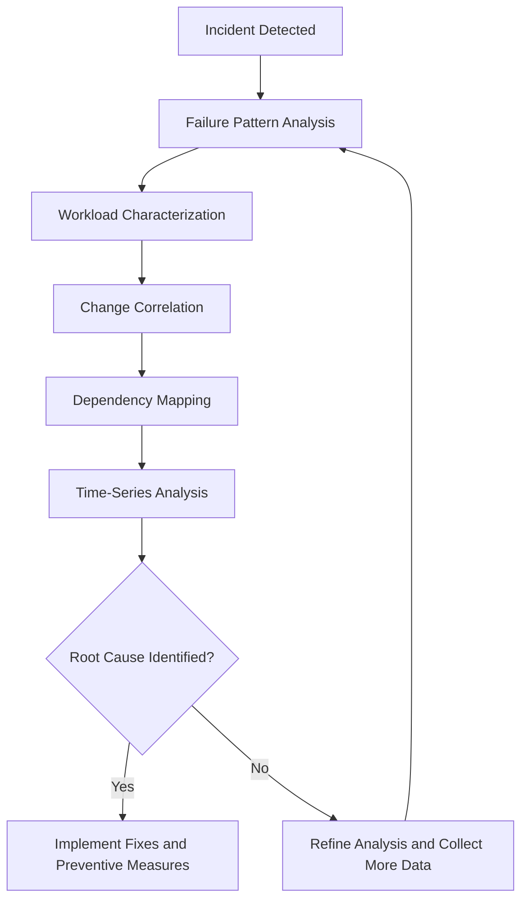
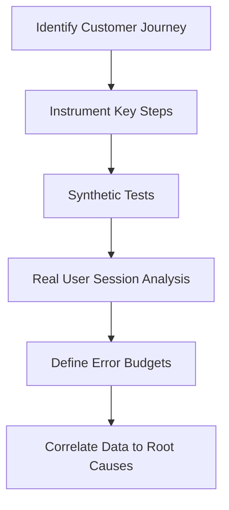
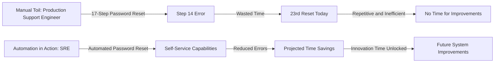
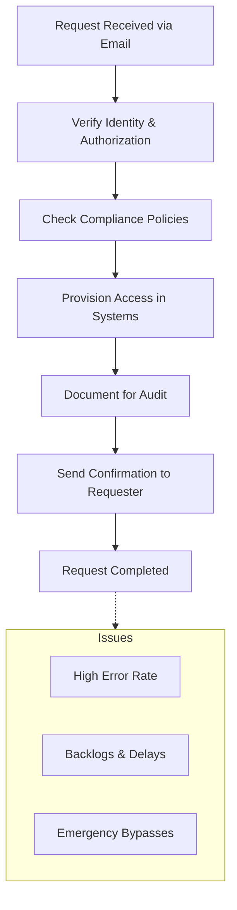
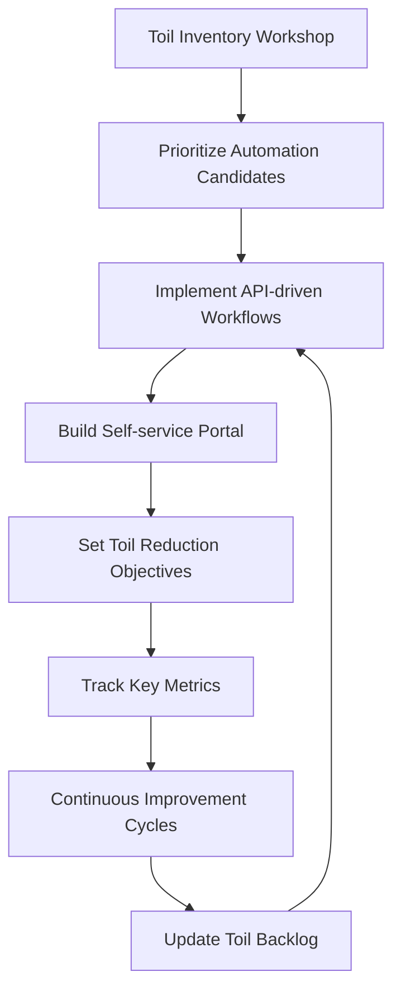
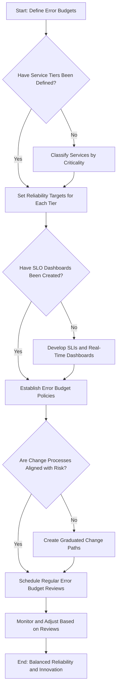
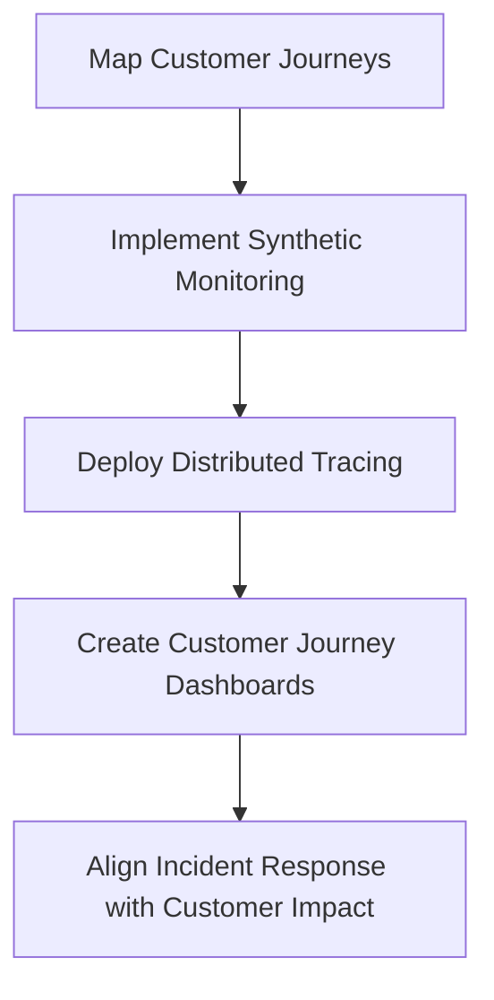

# Chapter 1: Foundations of Reliability Culture

## Chapter Overview

Welcome to the SRE equivalent of an exorcism for legacy IT thinking. This chapter takes a blowtorch to the dogmas of old-school banking ops—where heroics, handoffs, and hiding mistakes pass for culture—and replaces them with the ruthless clarity of reliability engineering. If you think “midnight firefighting” is a badge of honor, or that 99.99% uptime means your customers are happy, brace yourself: you’re about to get a reality check harder than a failed core banking migration. We’ll drag you through the graveyard of brittle processes, misaligned incentives, and monitoring dashboards that lie. Then, we’ll show you how to build a culture where reliability isn’t wishful thinking, but a systemic outcome: measurable, automatable, and business-critical. No more blaming the intern, no more worshipping toil, and no more hiding behind server stats while the customer experience dies in the shadows. This is reliability culture—unvarnished, unmerciful, and your organization’s last shot at surviving the digital banking arms race.

______________________________________________________________________

## Learning Objectives

- **Diagnose** the crippling effects of reactive, hero-based support models and articulate the business case for proactive SRE culture.
- **Design** evidence-based reliability practices, including failure pattern analysis, customer journey instrumentation, and error budget tracking.
- **Implement** blameless postmortems that uncover systemic weaknesses instead of scapegoats.
- **Reduce** operational toil by identifying, automating, and eliminating manual, error-prone drudgery.
- **Establish** true service ownership with end-to-end accountability, killing off siloed handoffs for good.
- **Balance** reliability and innovation using error budgets, turning “risk management” from a political football into a quantitative discipline.
- **Measure** what actually matters by shifting from infrastructure metrics to customer-centric observability.

______________________________________________________________________

## Key Takeaways

- Don’t confuse “heroic” with “sustainable”—nobody gets promoted for fixing the same 2AM batch job for the fifth year running.
- Uptime dashboards are security blankets for the delusional. Customers don’t care if your servers are green—they care if their money moves when they hit send.
- If your incident reviews end with “the DBA screwed up,” you’ve learned nothing. Systems fail; people are just the messengers.
- Manual work is for the birds (and auditors stuck in 1998). Automate or die under your own backlog.
- Siloed teams equal slow death by ticket ping-pong. Unless your org chart maps to customer journeys, you’re optimizing for blame, not outcomes.
- Error budgets aren’t a suggestion—they’re how you stop innovation from being held hostage by the last outage (or vice versa).
- Monitoring server stats while ignoring customer failures? That’s just expensive denial. Measure what the user actually experiences, or prepare for attrition and regulatory pain.
- Reliability culture isn’t a platitude—it’s a survival strategy. Get proactive, get quantitative, get honest, or get left behind.

Now, go forth and torch the old ways. The customers (and your sleep schedule) will thank you.

______________________________________________________________________

## Panel 1: The Midnight Alert - From Reactive to Proactive Thinking

### Scene Description

A dimly lit operations center at 2:14 AM. Katherine, a production support engineer, is hunched over her laptop, eyes red from fatigue. Multiple monitors surround her, one flashing with urgent alerts. Coffee cups litter the desk. Her phone shows multiple missed calls from her manager. On the main screen, a dashboard shows a critical banking application with transaction failure rates spiking to 37%. Katherine is frantically typing commands, trying different fixes, visibly stressed.

Below is a simplified layout of the operations center to help visualize the scene:

```
+------------------------ Operations Center Layout ------------------------+
|                                                                          |
|  [ Monitor 1 ]    [ Monitor 2 ]    [ Monitor 3 ]    [ Monitor 4 ]        |
|      Alerts          Logs View      Dashboard        Incident Tracker    |
|                                                                        |
| ---------------------------------------------------------------------- |
|                                                                        |                    |  |
|                                                                        | Katherine's Laptop |  |
|                                                                        |                    |  |
| ---------------------------------------------------------------------- |
|                                                                        |
| Desk: Coffee cups, notes, phone (flashing missed calls)                |
+--------------------------------------------------------------------------+
```

This chaotic setup reflects the intensity of a high-stakes production incident, where every second matters, and the engineer must juggle multiple tools and information streams to resolve the issue.

### Teaching Narrative

The journey from traditional production support to Site Reliability Engineering begins with a fundamental shift in thinking: from reactive to proactive. In the banking industry, production support teams often operate in a firefighting mode—responding to incidents after they've already impacted customers. This reactive approach leads to burnout, inconsistent service quality, and ultimately, customer dissatisfaction.

SRE culture introduces a paradigm shift by emphasizing systems and practices that prevent incidents before they occur. Rather than measuring success by how quickly you resolve incidents, SRE measures success by how few incidents occur in the first place. This doesn't mean eliminating all failures—systems will fail—but it means designing resilience into your systems so that failures don't impact customers.

The first step in this transformation is acknowledging that midnight firefighting, while sometimes necessary, should be the exception rather than the norm. When production support engineers spend most of their time reacting to problems, they have no time to address root causes. SRE breaks this cycle by allocating explicit time for proactive improvements, formalizing this through error budgets and service level objectives that we'll explore in later chapters.

### Common Example of the Problem

At MidCity Financial, the nightly batch processing system that reconciles daily transactions and updates customer account balances regularly experiences failures between 1 AM and 3 AM. The production support team has established a pattern: a senior engineer remains on-call during these hours, waiting for the inevitable alerts. The same failure patterns occur weekly—database locks timeout, transaction queues back up, and manual intervention is required to restart processes and validate data integrity.

Instead of analyzing why these failures keep occurring, the team has normalized the situation. They've documented detailed recovery procedures and take pride in their ability to resolve incidents quickly, often boasting about their "hero moments" when they saved the day. Management recognizes these efforts through "firefighter of the month" awards, unintentionally reinforcing reactive behavior. Meanwhile, the actual underlying issues—poorly designed database queries, insufficient capacity planning, and architectural bottlenecks—remain unaddressed.

#### Checklist: Recurring Issues and Root Causes

- **Issue:** Database locks timeout

  - **Root Cause:** Inefficient queries causing contention on critical tables.
  - **Proactive Fix:** Optimize query performance and indexing strategies.

- **Issue:** Transaction queues back up

  - **Root Cause:** Insufficient processing capacity during peak load hours.
  - **Proactive Fix:** Implement dynamic scaling and improve workload distribution.

- **Issue:** Manual intervention to restart processes

  - **Root Cause:** Lack of automated recovery mechanisms and poor exception handling.
  - **Proactive Fix:** Introduce automated retries and self-healing workflows.

- **Issue:** Data integrity validation after failures

  - **Root Cause:** Inadequate data consistency checks and monitoring.
  - **Proactive Fix:** Build robust data validation pipelines and enhance observability.

This checklist provides a starting point for identifying recurring patterns in your own systems. By addressing root causes instead of relying on reactive measures, teams can transition from firefighting to building resilient, automated solutions.

### SRE Best Practice: Evidence-Based Investigation

SRE approaches this situation by analyzing failure patterns and investing in prevention rather than celebrating heroic recovery. A key practice is conducting systematic data collection around recurring incidents, using techniques like:

1. **Failure pattern analysis**: Collecting detailed metrics on when and how batch processes fail, identifying common triggers and environmental factors.

2. **Workload characterization**: Measuring transaction volumes, resource utilization patterns, and throughput across different time periods to identify system bottlenecks.

3. **Change correlation**: Documenting all system changes and correlating them with failure incidents to identify potential causes.

4. **Dependency mapping**: Creating visual representations of system dependencies to understand how failures propagate throughout interconnected banking systems.

5. **Time-series analysis**: Comparing performance data across days, weeks, and months to identify trends and anomalies that precede failures.

Below is a simplified visualization of the investigation process using a flowchart:



This evidence-based approach reveals that the nightly batch issues stem primarily from poorly optimized database queries, insufficient connection pooling, and resource contention—all solvable problems that had been masked by the team's focus on rapid recovery rather than prevention.

### Banking Impact

The business consequences of this reactive approach extend far beyond technical issues. The table below summarizes the five key impacts, their associated costs, and consequences:

| **Impact**                   | **Description**                                                                                                                                           | **Associated Costs**                                              | **Consequences**                                                                                       |
| ---------------------------- | --------------------------------------------------------------------------------------------------------------------------------------------------------- | ----------------------------------------------------------------- | ------------------------------------------------------------------------------------------------------ |
| **Regulatory exposure**      | Delayed or inconsistent overnight processing puts the bank at risk of compliance violations with financial reporting regulations.                         | Regulatory fines and reputational damage                          | Questions from regulators about operational controls, potential penalties, and increased scrutiny.     |
| **Customer impact**          | Subtle downstream issues like delayed mobile balance updates, missed scheduled payments, and increased "where's my money?" inquiries to customer support. | Increased support costs and customer dissatisfaction              | Erosion of trust, higher support call volumes, and potential customer attrition.                       |
| **Financial costs**          | Maintaining larger overnight support teams and unaddressed technical debt in batch processing systems.                                                    | $450,000 annually for support teams; $2 million in technical debt | Higher operational expenses due to unnecessary manual interventions and infrastructure inefficiencies. |
| **Competitive disadvantage** | Batch-oriented architecture and reliability issues compared to fintech competitors offering real-time transaction processing and 24/7 availability.       | Loss of younger, tech-savvy customer base                         | Declining market share as competitors gain customers seeking modern, real-time banking solutions.      |
| **Employee burnout**         | High stress from overnight support and reactive work patterns leading to high turnover.                                                                   | 34% annual turnover, onboarding costs                             | Constant knowledge drain, increased hiring/training expenses, and reduced team morale.                 |

This table highlights the interconnected nature of these issues, emphasizing how the reactive approach to production support is not only unsustainable but also detrimental to the bank’s long-term success.

### Implementation Guidance

Transitioning from reactive to proactive reliability requires deliberate changes to both technical systems and team culture. Below are actionable strategies, enhanced with real-world examples, to guide this transformation:

1. **Implement time allocation guardrails**: Formally allocate 70% of engineer time to reactive work and 30% to proactive improvements initially, gradually shifting to a 50/50 split. Use time tracking and project management tools to make this allocation visible and enforceable. Protect proactive time by designating team members who are completely off the on-call rotation during their improvement sprints.\
   *Example*: A fintech company adopted this approach by using a shared Kanban board to track efforts. Engineers tagged their work as "reactive" or "proactive," and team leads ensured a balanced workload. Over six months, they transitioned to a 50/50 split, reducing incident frequency by 40%.

2. **Create a recurring incident pattern database**: Develop a structured repository categorizing incidents by type, impact, resolution approach, and root cause. Use this database to identify the top 5 recurring issues that consume the most operational time and prioritize them for permanent resolution.\
   *Example*: A global e-commerce platform implemented this database and discovered that 25% of their incidents stemmed from a single misconfigured API. By addressing this root cause, they eliminated hundreds of alerts monthly, freeing up significant engineering bandwidth.

3. **Establish reliability debt reviews**: Schedule monthly sessions where teams analyze incidents, quantify their impact, and document the technical improvements needed to prevent recurrence. Capture these as "reliability debt" items that are prioritized alongside feature development in sprint planning.\
   *Example*: A healthcare SaaS provider introduced reliability debt reviews during their retrospectives. They used a simple table to track incidents, their frequency, and proposed fixes. Over three months, they resolved 80% of their high-impact issues, significantly improving their service-level objectives (SLOs).

4. **Implement a "never again" process**: After any significant incident, require the team to implement at least one permanent improvement that ensures that exact scenario cannot recur. Track these improvements and celebrate their impact by measuring "days since last occurrence" for common incident types.\
   *Example*: A payment processing company experienced a major outage due to a database schema error. Their "never again" process led to implementing automated schema validation in their CI/CD pipeline. This change not only prevented recurrence but also reduced deployment failures by 30%.

5. **Redefine success metrics**: Shift performance evaluation criteria from mean-time-to-restore (MTTR) to incident prevention metrics like mean-time-between-failures (MTBF) and reduction in toil. Create visibility around these metrics and incorporate them into team and individual goals to reinforce the cultural shift from reactive to proactive work.\
   *Example*: A telecommunications firm replaced MTTR as their primary KPI with MTBF. They displayed these metrics on a shared dashboard, fostering a team culture focused on prevention. Within a year, their MTBF increased by 50%, and employee burnout decreased due to reduced firefighting.

By implementing these strategies, teams can break free from the reactive cycle, build more resilient systems, and unlock the full potential of proactive reliability engineering practices.

## Panel 2: The Metrics That Matter - Beyond Uptime

### Scene Description

A bright conference room with large windows overlooking the financial district. A team meeting is in progress with six diverse team members sitting around a table. Marcus, an experienced SRE, stands at a whiteboard. The whiteboard displays two contrasting dashboards side by side:

```
+------------------------+    +--------------------------------+
| Uptime Dashboard |  | Transaction Success Dashboard |
| ---------------- ||--------------------------------|
| Uptime: 99.98% (Green) |    | Mortgage App: 92.3% (Yellow)   |
| All systems healthy    |    | Intl. Transfers: 88.7% (Red)   |
+------------------------+    | Account Access: 95.5% (Green)  |
                              +--------------------------------+
```

The team members look concerned, comparing the conflicting information. One team member is focused on a tablet, circling the discrepancy and showing it to others. The room is filled with an air of urgency, as the group debates the implications of the customer-centric metrics on the right versus the infrastructure-focused data on the left.

### Teaching Narrative

Traditional monitoring in banking systems often focuses on binary states—a service is either up or down. This limited view creates a dangerous illusion: systems appearing healthy while customers experience significant problems. This disconnect arises because uptime metrics measure system availability, not customer experience.

SRE introduces a critical distinction between measuring what's convenient versus measuring what matters. A banking system that's technically "up" but processing transactions at unacceptable speeds or with high error rates is failing its customers, regardless of what your uptime dashboard says.

The foundation of reliability culture is identifying and tracking metrics that directly reflect the customer experience—Service Level Indicators (SLIs). These customer-centric metrics might include transaction success rates, end-to-end latency of financial operations, or correct processing of banking instructions. When a mortgage application takes 5 minutes to load or international transfers fail silently, customers don't care that your server uptime is 99.99%.

Selecting the right metrics requires deep understanding of both your technical systems and your customers' expectations. For banking systems, this often means going beyond infrastructure metrics to measure business processes: Can customers complete transactions? Are their balances accurate? Can they access their accounts when needed? These customer-focused metrics form the foundation for meaningful reliability targets.

### Common Example of the Problem

GlobalBank's digital transformation team proudly launched a new mobile banking platform, with executive dashboards showing impressive 99.97% uptime across all services. The CIO referenced these metrics in the quarterly business review as evidence of exceptional platform stability. However, during the same period, customer satisfaction scores dropped by 15 points, and mobile app store ratings plummeted from 4.5 to 3.2 stars.

The disconnect stemmed from how "uptime" was measured—the infrastructure team monitored server availability, network connectivity, and database response time, all of which showed excellent performance. But these metrics failed to capture the actual customer experience. While the servers were technically operational, customers encountered numerous problems:

| **Metric/Area**            | **Failure**                                                         | **Customer Impact**                                                                              |
| -------------------------- | ------------------------------------------------------------------- | ------------------------------------------------------------------------------------------------ |
| Biometric Authentication   | Timed out for approximately 23% of login attempts                   | Customers were unable to log in, leading to frustration and abandonment of the app.              |
| Mobile Check Deposits      | Failed to process for amounts over $5,000 without any error message | Customers were left confused and uncertain if transactions were completed, causing distrust.     |
| Bill Payment Confirmations | Delayed by up to 30 minutes                                         | Customers attempted duplicate payments, resulting in errors and potential overdraft issues.      |
| Account Balance Updates    | Lagged by up to an hour after transactions                          | Customers made decisions based on outdated balances, leading to overdrafts and financial stress. |

Despite the impressive uptime statistics, customers were experiencing a fundamentally unreliable system. The surge in support calls and branch visits—exactly what the mobile platform was supposed to reduce—highlighted the failure to align technical metrics with customer outcomes.

### SRE Best Practice: Evidence-Based Investigation

SRE addresses this metric mismatch through customer journey instrumentation and experience-focused telemetry. Below is a checklist summarizing the steps for conducting evidence-based investigations:

#### Checklist for Evidence-Based Investigation

1. **Journey Mapping and Instrumentation**

   - Identify critical customer journeys (e.g., login, check deposit, bill payment, transfers).
   - Document each step in the journey and add instrumentation to measure:
     - Success rates
     - Latency
     - Error conditions

2. **Synthetic User Transactions**

   - Configure automated tests to perform end-to-end customer transactions.
   - Simulate various conditions (e.g., high traffic, degraded services).
   - Record success rates, performance metrics, and any anomalies.

3. **User Session Analytics**

   - Collect detailed telemetry from real user sessions.
   - Analyze session data to identify:
     - Points of abandonment
     - Repeated user attempts for the same action
     - Latency or error-prone steps

4. **Define Error Budgets**

   - Set acceptable failure rate thresholds for customer journeys.
   - Base these thresholds on:
     - Business impact
     - Customer expectations
     - Service level objectives (SLOs)

5. **Perform Correlation Analysis**

   - Investigate customer-reported issues using telemetry data.
   - Detect "silent failures" where the system appears functional but fails to meet customer needs.
   - Correlate data points to uncover root causes.

#### Example Flow of Investigation



This evidence-based approach revealed that while GlobalBank's servers were operating as expected, critical user workflows were failing at unacceptable rates. The investigation identified specific services that needed redesign, particularly authentication flows, transaction processing queues, and notification systems.

### Banking Impact

The business consequences of misaligned metrics extended throughout the organization, affecting both financial performance and customer trust. The table below summarizes key impacts alongside relevant metrics and associated costs:

| **Impact Type**                  | **Metric**                                              | **Percentage Change** | **Financial Cost**                                    |
| -------------------------------- | ------------------------------------------------------- | --------------------- | ----------------------------------------------------- |
| **Lost digital engagement**      | Decline in active mobile users                          | -22% over 3 months    | High-cost branch transactions increase (unquantified) |
| **Customer attrition**           | Likelihood of account closure after failed interactions | 3.7x increase         | $14.2M in lost deposits                               |
| **Increased operational costs**  | Contact center call volume increase                     | +47%                  | $620,000 per quarter                                  |
| **Damaged brand perception**     | Trust gap in digital leadership campaigns               | N/A                   | Broader impact on brand trust (unquantified)          |
| **Wasted technology investment** | Unachieved ROI from $27M platform investment            | N/A                   | Reduced customer adoption and efficiency              |

#### Key Examples:

1. **Lost Digital Engagement**: Active mobile users declined by 22% within three months following the digital platform launch. This setback to the bank's digital transformation goals forced customers to rely on higher-cost branch services, undermining operational efficiency.

2. **Customer Attrition**: Customers encountering multiple failed mobile interactions were 3.7 times more likely to close accounts within 60 days, leading to $14.2 million in lost deposits. These issues were not reflected in traditional uptime metrics, masking the true scope of the problem.

3. **Increased Operational Costs**: A 47% surge in contact center call volume related to digital banking issues required additional staffing, resulting in $620,000 in extra quarterly costs.

4. **Damaged Brand Perception**: The bank's marketing efforts promoting "digital leadership" were undermined by poor reliability metrics. This created a credibility gap, eroding trust and damaging long-term brand perception.

5. **Wasted Technology Investment**: Despite a $27 million investment in the digital platform, poor reliability metrics hindered customer adoption and operational efficiency, resulting in a substantial missed return on investment.

### Implementation Guidance

To implement meaningful, customer-focused reliability metrics:

1. **Establish customer journey workshops**: Bring together cross-functional teams (product, engineering, customer service, operations) to map critical customer journeys and identify the specific technical components that support each step. For each journey, define what "success" means from the customer's perspective and how it can be measured technically.

2. **Implement user-centric instrumentation**: Deploy telemetry that captures customer experience metrics at each step of key journeys. Focus initial efforts on the top five most common customer activities (like login, balance check, transfers, bill payments, and mobile deposits), ensuring you can track success rates, latency, and error conditions.

3. **Create customer-focused dashboards**: Develop new monitoring dashboards that prominently display customer journey success rates alongside traditional infrastructure metrics. Make these dashboards the primary view for operations teams and leadership reviews, with infrastructure metrics available as drill-down detail rather than primary indicators.

4. **Deploy synthetic transaction monitoring**: Implement automated tests that simulate real user journeys every 5-10 minutes, executing common banking transactions from outside your network. Set up alerts based on success rates and performance thresholds that reflect actual customer expectations rather than technical limitations.

5. **Align incentives and reporting**: Modify team objectives and key results (OKRs) to focus on customer journey reliability rather than infrastructure uptime. Update executive dashboards and reporting to lead with customer experience metrics, making the connection between technical performance and business outcomes explicit at all levels of the organization.

## Panel 3: Learning from Failure - The Blame-Free Postmortem

### Scene Description

A collaborative space designed for open discussion, featuring comfortable seating and walls adorned with whiteboards and sticky notes. A diverse team of eight people sits in a circle, engaged in intense but friendly discussion. At the center of the room is a large timeline of an incident drawn on a whiteboard using colorful markers. The timeline is divided into key phases of the incident, such as "Detection," "Escalation," "Mitigation," and "Resolution."

Team members are actively adding sticky notes to the timeline, categorized by color and purpose:

- **Yellow Sticky Notes**: Observations and events as they occurred during the incident.
- **Blue Sticky Notes**: Contributing factors or systemic issues identified.
- **Green Sticky Notes**: Successful actions taken or what went well.
- **Red Sticky Notes**: Areas for improvement or unresolved questions.

Below is a text representation of the timeline setup:

```
[ Detection ]----[ Escalation ]----[ Mitigation ]----[ Resolution ]
     |                  |                  |                  |
  Yellow: Events     Yellow: Events     Yellow: Events     Yellow: Events
  Blue: Factors      Blue: Factors      Blue: Factors      Blue: Factors
  Green: Successes   Green: Successes   Green: Successes   Green: Successes
  Red: Questions     Red: Questions     Red: Questions     Red: Questions
```

A separate section titled "What Went Well" is prominently displayed on another whiteboard and is steadily filling up with green sticky notes. The facilitator, Raj, stands nearby, guiding the discussion while ensuring adherence to "Psychological Safety Principles," which are prominently displayed on a screen behind him. The atmosphere is one of collaboration and learning, with no individual being singled out. The focus remains on understanding the system and identifying opportunities for improvement.

### Teaching Narrative

A cornerstone of reliability culture is how we respond to failure. Traditional IT operations often focus on finding "who" caused an incident, creating a blame culture that drives critical information underground. People hide mistakes, avoid documenting risks, and hesitate to try improvements for fear of being blamed when things go wrong.

SRE fundamentally rejects this approach, recognizing that human error is inevitable and that complex systems fail in complex ways. Instead, SRE embraces a blameless culture—one where we examine incidents to understand the systems, processes, and environmental factors that made the error possible or even likely.

The blameless postmortem is a structured learning exercise that treats every incident as an opportunity to improve. Rather than asking "who caused this outage?", we ask "what conditions allowed this outage to occur?" and "how can we redesign our systems to prevent similar incidents?" This approach recognizes that in complex systems like banking platforms, incidents rarely have a single cause but emerge from interactions between multiple components and decisions.

For banking organizations, this cultural shift is particularly challenging due to the industry's compliance-oriented history that often seeks to assign responsibility. However, the most reliable financial organizations have learned that psychological safety—the ability to take risks without fear of punishment—is essential for building truly resilient systems. When team members feel safe reporting near-misses, discussing concerns, and suggesting improvements, overall system reliability dramatically improves.

### Common Example of the Problem

At CapitalCore Bank, a critical incident occurred during the end-of-quarter financial closing process. A senior database administrator (DBA) implemented an unauthorized optimization on the transaction processing database, attempting to improve quarterly reporting performance. The change triggered a cascade of failures that delayed regulatory reporting by 14 hours, almost resulting in compliance violations and requiring executives to request an extension from regulators.

The bank's traditional incident response kicked in: IT leadership demanded to know who made the unauthorized change, the DBA was identified and placed on administrative leave pending investigation, and an urgent all-hands email warned staff about following change management procedures. The official incident report listed "human error" and "protocol violation" as the root causes, with remediation focused on disciplinary action and retraining.

What this blame-oriented approach missed were the systemic issues that contributed to the incident:

| **Systemic Issue**                              | **Impact**                                                                |
| ----------------------------------------------- | ------------------------------------------------------------------------- |
| Performance problems reported for six quarters  | Chronic degradation led to pressure for reactive, high-risk optimizations |
| Change management delays (3 weeks for approval) | Created bottlenecks that discouraged adherence to formal processes        |
| Unaddressed optimization requests (40+ days)    | Frustrated team members, pushing them to bypass the system                |
| Insufficient database monitoring                | Allowed unauthorized changes to propagate without detection               |
| No production-like test environment             | Prevented safe validation of optimizations before deployment              |

By focusing solely on the individual's unauthorized action, the organization failed to address the systems and processes that made the violation seem necessary and allowed it to impact critical systems.

### SRE Best Practice: Evidence-Based Investigation

SRE approaches incident analysis through structured, blameless postmortems that examine the entire socio-technical system rather than isolating individual actions. The following checklist outlines the five key steps to conduct an evidence-based investigation:

#### Evidence-Based Investigation Checklist:

1. **Timeline Reconstruction**

   - Develop a detailed timeline capturing events leading up to and during the incident.
   - Include technical changes, communication patterns, and environmental factors.
   - Ensure input from multiple perspectives to avoid gaps.

2. **Counterfactual Analysis**

   - Explore "what if" scenarios to identify potential systemic defenses.
   - Evaluate how these defenses could have prevented or mitigated the incident.
   - Focus on system-level improvements, not individual actions.

3. **Contextual Inquiry**

   - Conduct interviews with participants to understand their decision-making context.
   - Assess what information was available, what pressures existed, and why actions made sense at the time.
   - Emphasize psychological safety to encourage open and honest discussions.

4. **Contributing Factor Analysis**

   - Identify all technical, organizational, and environmental factors that contributed to the incident.
   - Highlight how these factors interacted to create conditions where failure became possible or likely.
   - Avoid oversimplifying or attributing blame to a single root cause.

5. **Decision Point Mapping**

   - Document critical decision points during the incident lifecycle.
   - Analyze how alternative information, tools, or processes might have influenced different outcomes.
   - Use this mapping to identify actionable improvements in decision-making frameworks.

______________________________________________________________________

By following these steps, teams can uncover the deeper systemic causes behind incidents. For example, an evidence-based investigation might reveal that a DBA's unauthorized change was only a trigger in a system primed for failure. Contributing factors could include insufficient performance testing, inadequate monitoring, overly bureaucratic change processes, technical debt, and high-pressure deadlines. This approach shifts the focus from assigning blame to solving systemic issues, ultimately driving reliability improvements.

### Banking Impact

The business impact of blame culture in this banking example was severe, creating a cascading chain of negative outcomes that compounded over time. The flowchart below illustrates how blame culture amplified risks and hindered organizational performance:

```
Blame Culture
   ↓
Knowledge Suppression
   ↓
Increased Operational Risk
   ↓
Talent Loss
   ↓
Decreased Innovation
   ↓
Compliance Exposure
```

1. **Knowledge suppression**: After the incident, other team members became reluctant to document known issues or suggest improvements, fearing similar repercussions. Three high-priority vulnerability reports were delayed by staff who feared being associated with "problems."

2. **Increased operational risk**: The root systemic issues remained unaddressed, setting the stage for similar failures in subsequent quarters. In fact, a nearly identical incident occurred two quarters later, affecting a different system but stemming from the same underlying causes.

3. **Talent loss**: The incident contributed to the departure of two senior technical staff within six months, citing the "fear culture" as their primary reason for leaving. The cost of replacing this specialized banking technology expertise exceeded $400,000.

4. **Decreased innovation**: Change proposals across the technology organization decreased by 38% in the quarters following the incident, as staff took the "safe" approach of maintaining the status quo rather than suggesting improvements that carried personal risk.

5. **Compliance exposure**: While the immediate incident was contained, the failure to address systemic issues actually increased the bank's regulatory risk profile, eventually contributing to a regulatory finding about inadequate change management processes during the next examination cycle.

### Implementation Guidance

To effectively implement blameless postmortems in a banking environment, follow these five key steps:

1. **Establish clear learning policies**

   - Develop and publish an organizational learning policy that explicitly separates incident analysis from disciplinary processes.
   - Secure endorsement from senior leadership and legal/compliance teams to address regulatory concerns.
   - Clearly state that human error is never a root cause, emphasizing system improvement over blame.

2. **Train dedicated facilitators**

   - Identify and train facilitators who possess both technical expertise and facilitation skills to maintain psychological safety.
   - Equip facilitators to redirect blame-oriented discussions and manage complex technical conversations.
   - Empower facilitators to guide teams toward system-focused insights.

3. **Create structured postmortem templates**

   - Design templates that outline the blameless postmortem process, including sections for:
     - Timeline reconstruction
     - Contributing factors
     - What went well
     - What went poorly
     - Action items
   - Ensure the templates align with compliance requirements while prioritizing learning outcomes.

4. **Implement systematic follow-up processes**

   - Assign clear ownership and tracking for action items identified during postmortems.
   - Conduct regular reviews to verify implementation and effectiveness.
   - Measure impact by tracking whether similar incidents recur, fostering accountability for systemic improvements.

5. **Model vulnerability from leadership**

   - Encourage senior leaders to actively participate in postmortems and share their own contributions to incidents.
   - Demonstrate that the blameless approach applies to all organizational levels.
   - Build psychological safety by normalizing honest discussions about system failures.

______________________________________________________________________

#### Quick Reference Checklist: Implementing Blameless Postmortems

- [ ] **Learning Policies**: Publish a policy separating incident analysis from disciplinary actions with leadership and compliance endorsement.
- [ ] **Facilitator Training**: Train facilitators skilled in both technical systems and psychological safety techniques.
- [ ] **Templates**: Develop structured templates covering timelines, contributing factors, successes, failures, and action items.
- [ ] **Follow-Up**: Assign ownership for action items, track implementation, and verify effectiveness.
- [ ] **Leadership Modeling**: Have leaders participate and demonstrate vulnerability to reinforce the blameless culture.

## Panel 4: Embracing Toil Reduction - Automation as Strategy

### Scene Description

Split-screen view of two scenarios, illustrated below to emphasize the contrast between manual toil and automation:

**Left Side: Manual Toil**

- A production support engineer is manually executing a 17-step password reset procedure for a banking application.
  - The engineer looks bored, glancing at the clock, which shows this is the 23rd reset of the day.
  - A small error occurs on step 14, requiring additional time to correct.
  - A cluttered desk reflects the repetitive, error-prone nature of the task, with sticky notes listing other pending manual tasks.

**Right Side: Automation in Action**

- An SRE is implementing an automated password reset system with self-service capabilities.
  - Their screen shows code for the automation and a graph displaying projected time savings.
  - A nearby calendar highlights blocked time for "Innovation Projects" and "Technical Debt Reduction," with sticky notes featuring ideas for further system improvements.
  - The environment appears organized and forward-focused, emphasizing strategic use of time and resources.

**Visual Diagram Representation:**



This visual highlights the stark difference between repetitive manual toil and the strategic benefits of automation, reinforcing the importance of reducing toil for scalability and reliability.

### Teaching Narrative

One of the most visible differences between traditional production support and SRE culture is the approach to repetitive operational work—what SRE calls "toil." Toil is manual, repetitive, tactical work that scales linearly with service growth, offers no enduring value, and could be automated.

In traditional banking operations, engineers often spend most of their time performing routine tasks: password resets, certificate renewals, disk space cleanups, batch job monitoring, and manual deployments. This work is necessary but provides diminishing returns—an engineer who spends 100% of their time on toil creates no time to improve the system itself.

SRE culture establishes a radical principle: engineering time is too valuable to spend on tasks that computers can do. By codifying the goal of eliminating toil, organizations acknowledge that automation isn't just an engineering preference—it's a strategic necessity for reliability and scalability.

In practice, SRE teams typically cap operational toil at 50% of engineer time, reserving the remainder for system improvements that prevent future incidents. This means saying "no" to some manual work and investing in automation even when the short-term effort exceeds the immediate time savings. The banking industry, with its complex operational procedures and compliance requirements, often normalizes extreme levels of toil, making this principle especially transformative.

Effective toil reduction requires identifying which tasks to automate first—focusing on high-frequency, error-prone, or security-sensitive operations that offer the greatest reliability improvement. For banking systems, automated deployment pipelines, self-service capabilities, and intelligent alerting often yield the greatest benefits by reducing both human error and operational burden.

### Common Example of the Problem

TrustNational Bank's access management team handles privileged access to critical banking systems. The team of six engineers spends approximately 70% of their time processing access requests through a largely manual workflow. The process can be summarized as follows:

| Step # | Task Description                                       | Estimated Time per Request | Error Risk Level |
| ------ | ------------------------------------------------------ | -------------------------- | ---------------- |
| 1      | Receiving email requests from business units           | 5-10 minutes               | Low              |
| 2      | Verifying the requester's identity and authorization   | 10-15 minutes              | Medium           |
| 3      | Checking compliance with separation of duties policies | 5-10 minutes               | High             |
| 4      | Provisioning access in multiple disconnected systems   | 10-15 minutes              | High             |
| 5      | Documenting the approval process for audit purposes    | 5-7 minutes                | Low              |
| 6      | Sending confirmation to requesters                     | 2-3 minutes                | Low              |

**Summary Statistics:**

- **Average Requests Processed Weekly:** 175
- **Time per Request:** 35-45 minutes
- **Error Rate:** 7.3% of requests contain procedural errors
- **Peak Volume:** During audit periods or system releases, request volume can double, creating significant backlogs.

**Key Impacts:**

- **Operational Delays:** Backlogs during peak periods delay critical business activities.
- **Emergency Bypasses:** High workload leads to emergency access grants that bypass standard controls, increasing security risks.
- **Inconsistent Processing Times:** Requests range from hours to days, harming user experience and operational efficiency.

Despite the repetitive nature of this workflow, automation efforts have been resisted due to concerns about:

1. Regulatory compliance,
2. Security risks, and
3. The perceived need for complex human judgment in access decisions.

Management has historically addressed workload increases by augmenting headcount rather than redesigning the process. This approach has resulted in a growing team that remains perpetually behind, with no capacity to address the fragmented access systems that necessitate manual intervention in the first place.

The diagram below illustrates the manual workflow and its limitations:



### SRE Best Practice: Evidence-Based Investigation

SRE approaches toil reduction through systematic analysis and incremental automation. To make this process actionable, use the following checklist and flowchart to guide your investigation and prioritization:

#### Checklist for Toil Reduction

1. **Toil Accounting**

   - Track engineering activities for 2-4 weeks.
   - Quantify time spent on repetitive manual tasks.
   - Identify high-frequency, error-prone, or tedious processes.

2. **Task Decomposition**

   - Break workflows into discrete steps.
   - Classify steps as requiring human judgment or being algorithmically determinable.

3. **Error Pattern Analysis**

   - Review historical incidents and errors.
   - Identify consistency issues or areas prone to human error.

4. **Value Stream Mapping**

   - Map the end-to-end process.
   - Highlight bottlenecks, redundant steps, and opportunities for parallelization.

5. **Compliance Requirement Review**

   - Collaborate with security and compliance teams.
   - Separate regulatory requirements from historical practices.
   - Identify controls suitable for automation while maintaining compliance.

6. **Automation Prioritization**

   - Select tasks for automation based on frequency, impact, and error reduction potential.
   - Focus on improving reliability, scalability, and security.

#### Flowchart for Evidence-Based Investigation

```mermaid
flowchart TD
    Start([Start: Investigate Toil]) --> A[Track Activities (2-4 weeks)]
    A --> B[Quantify Toil Time]
    B --> C[Break Down Workflows]
    C --> D[Classify Steps (Human vs Algorithmic)]
    D --> E[Review Historical Errors]
    E --> F[Map the Value Stream]
    F --> G[Identify Bottlenecks & Redundancies]
    G --> H[Review Compliance Requirements]
    H --> I[Distinguish Automatable Controls]
    I --> J[Prioritize Automation Candidates]
    J --> End([End: Implement Automation])
```

By following this structured approach, one SRE team's analysis revealed that 83% of access management tasks could be safely automated while improving security controls. The remaining 15% of tasks, involving unusual access combinations or policy exceptions, were deemed more suitable for human review. Use evidence and data to drive decisions, ensuring that automation efforts deliver measurable value.

### Banking Impact

The business impact of manual access management extended throughout the organization, resulting in significant operational, financial, and security consequences. A summary of the key metrics is provided below for clarity:

| **Category**                   | **Impact**                                                                                      | **Quantitative Metric**                                                            |
| ------------------------------ | ----------------------------------------------------------------------------------------------- | ---------------------------------------------------------------------------------- |
| **Delayed project delivery**   | Critical project milestones were missed due to access provisioning delays.                      | Avg. wait: 3.2 days (standard), 7 days (peak); 200+ business days delayed annually |
| **Compliance risks**           | Manual processes led to inconsistent policy application, exposing the bank to regulatory risks. | ~4% of granted access violated separation of duties policies                       |
| **Security incidents**         | Rushed reviews caused inappropriate access grants, leading to serious security exposures.       | 2 incidents requiring forensic investigation and regulatory disclosure             |
| **Operational inefficiency**   | Excessive costs incurred from manual processes and delays in critical business activities.      | $780,000 annually on manual efforts; $1.5M+ in delayed business activities         |
| **Strategic opportunity cost** | Skilled engineers were focused on repetitive tasks instead of architectural improvements.       | Zero capacity for reducing access complexity or improving security posture         |

By automating access management, the bank could mitigate these impacts, significantly reducing operational costs, improving compliance, enhancing security, and enabling strategic system improvements. These changes align with SRE principles, ensuring scalable, reliable, and efficient systems that foster long-term business growth.

### Implementation Guidance

To implement strategic toil reduction in access management, follow this step-by-step checklist:

#### Phase 1: Assess and Prioritize

- [ ] **Conduct a toil inventory workshop**
  - [ ] Schedule a dedicated session with the team.
  - [ ] Catalog all routine activities, noting frequency, time required, error rates, and business impact.
  - [ ] Create a prioritized list of automation candidates based on volume, risk, and feasibility.
  - [ ] Build consensus on distinguishing true toil from tasks requiring human judgment.

#### Phase 2: Automate Access Workflows

- [ ] **Implement API-driven access workflows**

  - [ ] Develop API interfaces for existing access management systems.
  - [ ] Focus on automating the highest-volume, lowest-risk access patterns (e.g., standard application roles).
  - [ ] Retain manual review for sensitive or high-risk access combinations.

- [ ] **Create a self-service portal with automated controls**

  - [ ] Build a business-facing portal to guide users through structured access requests.
  - [ ] Integrate automated policy compliance checks for all requests.
  - [ ] Route exceptions or non-standard requests for human review.
  - [ ] Implement automated approval workflows for standard requests that meet all policy requirements.

#### Phase 3: Set Objectives and Track Progress

- [ ] **Establish toil reduction objectives**
  - [ ] Define specific, measurable goals (e.g., reduce manual effort by 40% in year one).
  - [ ] Track key metrics:
    - Manual hours per access request.
    - Percentage of requests handled through automation.
    - Error rates for both manual and automated processes.
  - [ ] Share progress metrics with both the team and leadership.

#### Phase 4: Maintain and Improve

- [ ] **Implement continuous improvement cycles**
  - [ ] Dedicate 20% of recovered engineering time to further system automation and enhancements.
  - [ ] Establish bi-weekly reviews to assess automation effectiveness.
  - [ ] Analyze remaining manual processes to identify new automation opportunities.
  - [ ] Maintain a visible "toil backlog" to track and prioritize automation ideas.

#### Summary Flow



Use this checklist to systematically reduce toil in access management, ensuring measurable progress and continuous improvement over time.

## Panel 5: Service Ownership - Shifting from Silos to End-to-End Responsibility

### Scene Description

An open-plan office showing the evolution of team structure.

On the left side, traditional siloed teams are depicted:

- Separate groups labeled "Database Team," "Application Support," "Network Operations," and "Security" are seated in isolated clusters.
- Tickets are being passed between teams, with visible bottlenecks and delays.
- A frustrated customer issue is bouncing between groups, with no clear ownership of the problem.

On the right side, the transformed structure of cross-functional product-aligned teams is displayed:

- Diverse specialists sit together in unified teams, each responsible for a specific banking service.
- Teams are gathered around a single, holistic view of their service, represented by end-to-end monitoring dashboards.
- A large digital board prominently displays the customer journey for processing a loan application, with clear ownership assigned to one cross-functional team spanning multiple technical specialties.

Here’s a simplified visual representation of the before and after states:

#### Before: Siloed Teams

```
+-------------------------+         +-------------------------+
| Database Team           |         | Application Support    |
| [DB Admins]             |         | [App Engineers]        |
+-------------------------+         +-------------------------+
         |                                      |
         v                                      v
+-------------------------+         +-------------------------+
| Network Operations      |         | Security               |
| [Net Engineers]         |         | [Sec Analysts]         |
+-------------------------+         +-------------------------+
```

#### After: Cross-Functional Teams

```
+-------------------------------------------------------------+
| Product-Aligned Team 1                                       |
| [DB Admins | App Engineers | Net Engineers | Sec Analysts]  |
| End-to-End Dashboard: Loan Application Processing           |
+-------------------------------------------------------------+

+-------------------------------------------------------------+
| Product-Aligned Team 2                                       |
| [DB Admins | App Engineers | Net Engineers | Sec Analysts]  |
| End-to-End Dashboard: International Payment Service         |
+-------------------------------------------------------------+
```

This transition from fragmented silos to unified service ownership highlights the importance of collaboration, accountability, and a customer-focused approach to reliability.

### Teaching Narrative

Traditional IT organizations typically structure teams around technical specialties—database administrators, network engineers, application support—creating handoffs between teams that slow incident response and dilute accountability. When an international payment fails, responsibility fragments across multiple teams, often resulting in finger-pointing rather than rapid resolution.

SRE culture introduces the principle of service ownership—the practice of assigning clear, end-to-end responsibility for service reliability to specific teams. Service owners are accountable for the customer experience regardless of which technical components are involved, eliminating the "not my problem" mentality that plagues siloed organizations.

This shift is profound for banking institutions that have traditionally separated duties for security and compliance reasons. Service ownership doesn't mean eliminating specialization or compromising on controls, but it does mean creating clear lines of accountability and ensuring teams have both the authority and capability to maintain their services.

Service ownership manifests in several key practices: consolidated dashboards that show end-to-end service health, streamlined on-call rotations that minimize handoffs, and development practices where teams build, deploy, and operate their own code. When a team feels true ownership over a service, they make dramatically different design decisions—prioritizing operability, monitoring, and reliability rather than just feature delivery.

For organizations transitioning to reliability culture, service ownership often begins with mapping customer journeys to technical components, identifying reliability gaps at the boundaries between teams, and gradually consolidating responsibility around customer-facing services rather than technical layers.

### Common Example of the Problem

MercantileBank's corporate payments platform processes high-value transactions for business customers. When a major corporate client reported that international wire transfers were failing intermittently, the issue triggered a complex and inefficient response due to fragmented service ownership:

```mermaid
gantt
    title Timeline of Ticket Escalation and Delays
    dateFormat  HH:mm
    axisFormat %H:%M
    section Ticket Flow Across Teams
    Customer reports issue              :done, c1, 08:00, 1h
    Ticket assigned to Payments         :done, p1, 09:00, 2h
    Payments investigates               :done, p2, 11:00, 2h
    Ticket sent to Integrations         :done, i1, 13:00, 1h
    Integrations investigates           :done, i2, 14:00, 2h
    Ticket sent to Network Operations   :done, n1, 16:00, 2h
    Network Operations investigates     :done, n2, 18:00, 2h
    Ticket sent to Database             :done, d1, 20:00, 2h
    Database investigates               :done, d2, 22:00, 2h
    Ticket sent to Security             :done, s1, 00:00, 2h
    Security investigates               :done, s2, 02:00, 2h
    Ticket loops between teams          :crit, loop, 04:00, 36h
    Issue resolved after meeting        :milestone, end, 16:00
```

1. The customer service team created a ticket and assigned it to the Payments Application team.
2. The Payments team investigated and determined the transactions were reaching the SWIFT gateway but not completing, so they reassigned the ticket to the Integrations team.
3. The Integrations team verified their connectors were functioning and transferred the ticket to the Network Operations team, suspecting connectivity issues.
4. Network Operations confirmed all connections were active and moved the ticket to the Database team to check for transaction logging issues.
5. The Database team found no data integrity problems and suggested the issue might be related to the security certificates, sending the ticket to the Security team.
6. The Security team verified all certificates were valid but noted they had recently updated the TLS configuration, sending the ticket back to the Integrations team.

This cycle continued for three business days, as shown in the timeline above, before a director-level meeting brought all teams together. It was only then discovered that a combination of network timeout settings, TLS configuration changes, and database connection pool settings was causing the intermittent failures.

Throughout this process, no single team felt responsible for the end-to-end service, each confirming only that "their" components appeared to be functioning normally. The corporate client, meanwhile, had resorted to using a competitor's payment service for urgent transactions, resulting in both revenue loss and reputational damage.

### SRE Best Practice: Evidence-Based Investigation

SRE approaches service ownership through systematic service definition and comprehensive responsibility assignment. This evidence-based methodology identifies gaps, optimizes ownership, and ensures holistic visibility across services. To apply this approach effectively, use the following checklist as a guide:

#### Checklist: Steps for Evidence-Based Investigation

1. **Define Service Boundaries**

   - Document service boundaries based on customer journeys rather than technical implementation.
   - Identify all components contributing to specific business functions.

2. **Map Dependencies**

   - Create visual representations of service interconnections.
   - Highlight critical paths, shared dependencies, and potential failure points at boundaries.

3. **Analyze Ownership Gaps**

   - Identify areas where responsibility is ambiguous or fragmented.
   - Focus on integration points between systems and clarify ownership.

4. **Implement End-to-End Instrumentation**

   - Deploy distributed tracing and consistent logging across service boundaries.
   - Ensure holistic monitoring regardless of underlying technical components.

5. **Conduct Organizational Network Analysis**

   - Map communication patterns during incidents.
   - Identify where handoffs and coordination overhead create delays in resolution.

6. **Synthesize Findings and Prioritize Actions**

   - Correlate ownership gaps and delays with incident data.
   - Prioritize changes that reduce handoffs or improve visibility across boundaries.

#### Example Insight from Evidence-Based Investigation:

An analysis of the corporate payments platform revealed the following:

- The service crossed boundaries between seven different teams, with no single group having visibility across the entire transaction flow.
- 78% of major incidents involved at least three teams, with an average of 47 minutes lost in each inter-team handoff.

By addressing these gaps, teams can achieve faster resolution times, improved accountability, and more reliable service delivery.

### Banking Impact

The business consequences of fragmented service ownership were substantial, with measurable impacts across key operational and financial dimensions. The table below summarizes these impacts with corresponding metrics to illustrate the severity of the issues:

| **Impact Area**                     | **Description**                                                                               | **Metric**                                                                                  |
| ----------------------------------- | --------------------------------------------------------------------------------------------- | ------------------------------------------------------------------------------------------- |
| **Extended Outage Duration**        | Prolonged time-to-resolution for complex incidents due to handoffs and unclear ownership.     | Average incident resolution time: **18.5 hours** (industry benchmark: 6 hours).             |
| **Revenue Leakage**                 | Loss of corporate clients' transactions to alternative providers due to reliability concerns. | Annual diverted payment volume: **$143M**, resulting in **$2.8M** lost revenue.             |
| **Increased Operational Costs**     | Redundant skillsets and high coordination overhead from siloed team structures.               | Estimated additional annual costs: **$1.2M** (40% redundancy in capabilities).              |
| **Compliance and Audit Challenges** | Accountability gaps in regulatory compliance and security controls across transaction flows.  | Audit findings: **2 major citations** for inadequate controls and unclear responsibilities. |
| **Innovation Paralysis**            | Delayed service improvements due to cross-team dependencies and lengthy approval processes.   | Average change approval time: **47 days** for significant updates.                          |

These impacts underscore the critical need for a shift to service ownership. By consolidating accountability into cross-functional teams, banks can reduce outage durations, recover lost revenue, lower operational costs, strengthen compliance, and accelerate innovation cycles.

### Implementation Guidance

To implement service ownership in a banking environment, follow these steps:

1. **Conduct Service Mapping Workshops**

   - Bring together representatives from all technical teams to map critical banking services from a customer perspective.
   - For each key service (e.g., payments, account opening, loan processing), document the complete technical stack that supports it, identifying all components, integration points, and team dependencies.
   - Create visual service maps that illustrate both the customer journey and the underlying technical components.

   ```mermaid
   flowchart TD
      CustomerJourney["Customer Journey (e.g., Loan Application)"] -->|Step 1| ComponentA[Technical Component A]
      CustomerJourney -->|Step 2| ComponentB[Technical Component B]
      ComponentA -->|Dependency| ComponentC[Technical Component C]
      ComponentB -->|Dependency| ComponentD[Technical Component D]
   ```

2. **Establish Service-Aligned Teams**

   - Reorganize team structures around banking services rather than technical specialties.
   - Start with one critical service (e.g., corporate payments) as a pilot. Form a cross-functional team by including application developers, database specialists, network engineers, and security experts.
   - Assign shared on-call responsibilities and establish unified performance objectives.

   ```mermaid
   orgchart
      BankingService --> CrossFunctionalTeam
      CrossFunctionalTeam -->|Includes| ApplicationDevelopers["Application Developers"]
      CrossFunctionalTeam -->|Includes| DatabaseSpecialists["Database Specialists"]
      CrossFunctionalTeam -->|Includes| NetworkEngineers["Network Engineers"]
      CrossFunctionalTeam -->|Includes| SecurityExperts["Security Experts"]
   ```

3. **Implement Integrated Service Dashboards**

   - Create monitoring dashboards that provide a unified view of end-to-end service health from both technical and customer perspectives.
   - Include metrics from all components in the service stack and highlight customer-impacting issues, regardless of the underlying technical cause.
   - Make these dashboards the primary view for the service team.

   ```mermaid
   flowchart TD
      Dashboard["Integrated Service Dashboard"] -->|Displays| CustomerMetrics["Customer Experience Metrics"]
      Dashboard -->|Displays| ComponentMetrics["Component-Specific Metrics"]
      Dashboard -->|Highlights| Issues["Customer-Impacting Issues"]
   ```

4. **Create Service Ownership Documentation**

   - Develop clear, concise documentation for each service, including:
     - Service definition and boundaries
     - Dependencies and responsible teams
     - Decision authority and escalation paths
     - Handoff procedures for cross-service issues
   - Ensure the documentation is easily accessible during incidents and regularly updated for accuracy.

5. **Align Incentives with Service Outcomes**

   - Modify team objectives to focus on end-to-end service reliability rather than component-specific performance.
   - Implement shared objectives tied directly to customer experience and business outcomes.
   - Celebrate team improvements in overall service reliability through recognition and reward systems.

   ```mermaid
   flowchart LR
      Objectives["Team Objectives"] -->|Aligned to| Outcomes["Customer Experience & Business Outcomes"]
      Outcomes -->|Drive| Incentives["Recognition & Rewards for Service Reliability"]
   ```

By following these steps, banking organizations can transition from siloed operations to a culture of service ownership, driving improved reliability and customer satisfaction.

## Panel 6: Balancing Reliability and Innovation - Error Budgets as Culture

### Scene Description

Picture a lively product planning meeting where business and technology leaders are collaborating to balance innovation and reliability. A digital whiteboard dominates the room, displaying a well-organized quarterly plan. On the left side of the whiteboard, development velocity metrics are listed alongside feature milestones. On the right, reliability metrics are prominently featured, including a large, central gauge that reads: **"Error Budget Remaining: 32%"** for a core banking service. Below the gauge, a timeline highlights key dates for upcoming feature launches and scheduled reliability reviews.

The product manager stands near the whiteboard, gesturing toward the feature roadmap, while an SRE points to the error budget gauge, sparking a discussion about priorities. A smaller section of the board shows sticky note-style summaries from previous meetings, such as:

- "March: Feature X delayed to address reliability concerns (Error Budget: 12%)"
- "June: Accelerated launch of Feature Y (Error Budget: 78%)"

An ASCII representation of the digital whiteboard layout could look like this:

```
+----------------------------------------------------+
| Quarterly Plan                                       |
| ---------------------------------------------------- |
| Development Velocity                                 | Reliability Metrics  |
| - Feature A: 75% complete                            | Error Budget: 32%    |
| - Feature B: 20% complete                            | Availability: 99.98% |
| - Feature C: Planned                                 | Target: 99.99%       |
| ---------------------------------------------------- |
| Feature Launch Timeline                              |
| - Feature A: April 10                                |
| - Feature B: May 15                                  |
| - Feature C: June 20                                 |
| ---------------------------------------------------- |
| Historical Notes                                     |
| - March: Feature X delayed (Error Budget: 12%)       |
| - June: Feature Y accelerated (Error Budget: 78%)    |
+----------------------------------------------------+
```

The meeting calendar includes recurring "Error Budget Reviews," ensuring that reliability and innovation are continuously balanced. The dynamic interplay between these metrics and discussions provides a clear, visual framework for decision-making, allowing teams to align on priorities based on real-time service health rather than subjective opinions.

### Teaching Narrative

Perhaps the most transformative aspect of reliability culture is how it resolves the fundamental tension between reliability and innovation. In traditional organizations, these forces oppose each other—operations teams advocate for stability and change control, while product teams push for rapid feature delivery and innovation. This creates an adversarial relationship where reliability and progress seem mutually exclusive.

SRE culture resolves this tension through the concept of error budgets—quantifiable reliability targets that allow for controlled, measured risk-taking. Rather than aiming for perfect reliability (which is both impossible and unnecessarily expensive), organizations define acceptable reliability thresholds based on customer expectations and business requirements.

The error budget approach acknowledges a powerful truth: 100% reliability isn't the goal. Instead, the goal is reliability appropriate to the service context. A banking authentication system may require 99.999% availability, while an internal reporting dashboard might target 99.9%—and both targets can be exactly right for their contexts.

Once reliability targets are established, teams gain the freedom to innovate within those constraints. When services are meeting their reliability targets, teams can move quickly, take calculated risks, and push new features. When services are consuming too much of their error budget, teams automatically redirect efforts toward reliability improvements.

This dynamic creates a self-regulating system where reliability and innovation naturally balance based on real-time service health rather than organizational politics. For banking institutions, which must balance customer expectations for both innovative digital experiences and rock-solid reliability, this approach provides a strategic framework for managing that fundamental tension.

### Common Example of the Problem

InvestBank's digital trading platform team is caught in a continual conflict between reliability and feature delivery. The operations team, scarred by past outages that triggered regulatory scrutiny and customer compensation, has implemented extensive change control processes. Any platform modification requires:

1. Multiple levels of change approval
2. Extensive documentation
3. Testing in three separate environments
4. Implementation only during weekend maintenance windows
5. Mandatory two-week "bake periods" between changes

While these controls have reduced major incidents, they've created significant problems:

| **Aspect**                       | **Traditional Change Control**                                                                      | **Agile Error Budget-Based Process**                                                                                 |
| -------------------------------- | --------------------------------------------------------------------------------------------------- | -------------------------------------------------------------------------------------------------------------------- |
| **Feature Delivery Speed**       | Quarterly releases due to slow approvals and long bake periods                                      | Faster delivery—teams can release bi-weekly or faster when within error budget constraints                           |
| **Market Responsiveness**        | 3-4 months to respond to new opportunities, creating delays in supporting new financial instruments | Weeks to respond, as risk is objectively measured and controlled                                                     |
| **Team Dynamics**                | Developers frustrated; operations defensive; team silos forming                                     | Collaborative culture—shared ownership of reliability and innovation                                                 |
| **Innovative Talent Retention**  | Developers leaving for more agile competitors                                                       | Developers motivated by opportunities for fast-paced innovation within reliability boundaries                        |
| **Business Stakeholder Actions** | Stakeholders bypassing formal processes with "emergency" changes                                    | Stakeholders align with shared priorities, as the error budget offers a clear, transparent decision-making framework |
| **Financial Impact of Delays**   | Missed revenue opportunities, like a $15M loss from delayed derivative product support              | Revenue opportunities captured faster without compromising reliability                                               |
| **Risk of Outages**              | Low but overly conservative, resulting in high opportunity costs                                    | Balanced—calculated risks taken only when error budget allows                                                        |

The situation reached a crisis point when the bank missed the market opportunity to support a new derivative product, losing an estimated $15 million in trading revenue while the change was stuck in the approval process. Yet when operations suggested accelerating changes, they were immediately reminded of a trading outage from the previous year that cost $4 million in compensation and remediation.

Both sides have valid concerns, but the organization lacks a framework for balancing these competing priorities objectively. An error budget-based culture could bridge this gap, enabling faster innovation while maintaining acceptable reliability.

### SRE Best Practice: Evidence-Based Investigation

SRE approaches the balance between reliability and innovation through a structured, evidence-based process using error budgets. Below is a step-by-step guide to implement this best practice:

1. **Classify Service Criticality**

   - Evaluate each service based on:
     - **Business Impact**: How critical is the service to revenue, operations, or customer trust?
     - **Regulatory Requirements**: Are there compliance or legal obligations tied to the service’s reliability?
     - **Customer Expectations**: What level of availability or performance do customers expect?
   - Assign an appropriate reliability target for each service based on this analysis.

2. **Define and Measure SLOs**

   - Establish Service Level Objectives (SLOs) using metrics that closely reflect customer experience, such as:
     - Latency
     - Availability
     - Error Rate
   - Ensure these SLOs are specific, measurable, and easily understood by all stakeholders.
   - Continuously monitor SLO performance using automated tools and dashboards.

3. **Calculate and Track Error Budgets**

   - Translate SLOs into error budgets that quantify the acceptable level of unreliability for each service.
   - Example Formula:
     ```
     Error Budget = 1 - SLO Target (as a decimal)
     ```
     For a service with 99.9% SLO, the error budget is 0.1% downtime or errors.
   - Set up real-time monitoring to track error budget consumption.

4. **Analyze Change Impact**

   - Implement processes to correlate system changes with reliability metrics. Consider:
     - What types of changes (e.g., code deployments, infrastructure updates) historically consume the most error budget?
     - Which changes have minimal or no impact on reliability?
   - Use this data to identify patterns and inform decision-making for upcoming changes.

5. **Adopt Risk-Adjusted Deployment Practices**

   - Design multiple deployment paths based on the assessed risk level of changes:
     - **Low-Risk Changes**: Use fast, automated deployment pipelines.
     - **High-Risk Changes**: Apply stricter controls, such as manual reviews or phased rollouts.
   - Continuously refine deployment processes based on observed outcomes and error budget impact.

6. **Review and Iterate**

   - Schedule regular error budget reviews to:
     - Evaluate ongoing performance against error budgets.
     - Adjust reliability targets or processes as necessary.
   - Share findings across teams to foster a culture of learning and continuous improvement.

______________________________________________________________________

#### Example Scenario: Trading Platform Analysis

Using this approach, an SRE team for a trading platform identified the following:

- Certain low-risk changes, such as UI tweaks, historically consumed negligible error budget, allowing for faster deployments.
- High-impact changes, like database schema modifications, required stricter governance.
- A two-week "bake period" introduced instability by batching too many changes, leading to larger error budget consumption. Adjusting to smaller, more frequent deployments improved reliability.

This step-by-step process enables organizations to make data-driven decisions, balancing innovation with the reliability required to meet customer expectations.

### Banking Impact

The business consequences of the reliability-versus-innovation deadlock were substantial. Below is a summary table outlining the key impacts and corresponding metrics for clarity:

| **Impact Area**                  | **Description**                                                               | **Metrics**                                                                                                                |
| -------------------------------- | ----------------------------------------------------------------------------- | -------------------------------------------------------------------------------------------------------------------------- |
| **Competitive Disadvantage**     | Slower innovation led to fewer features compared to competitors.              | - InvestBank: 7 new features in 1 year<br>- Competitor: 28 new features<br>- 14% decline in active trading accounts        |
| **Missed Revenue Opportunities** | Delays in launching new financial instruments and capabilities.               | - $42M in unrealized revenue opportunities over 18 months                                                                  |
| **Technical Debt Accumulation**  | Inefficient processes led to larger, riskier releases and patching delays.    | - Security patch implementation time: Increased from 3 days to 17 days<br>- Growing compliance concerns                    |
| **Innovation Culture Erosion**   | Developers were demotivated by the inability to innovate effectively.         | - Employee satisfaction: 23rd percentile compared to industry benchmarks<br>- Key feedback: "Inability to implement ideas" |
| **Misaligned Risk Management**   | Strict processes failed to mitigate risks caused by technical debt and drift. | - Reliability issues persisted despite controls<br>- Root causes: Unaddressed technical debt, environmental drift          |

These impacts illustrate the critical need for a balanced approach to reliability and innovation. By adopting the error budget framework, InvestBank can address these challenges, enabling faster feature delivery while maintaining appropriate reliability levels.

### Implementation Guidance

To implement error budgets as a cultural framework in banking, follow these steps:

1. **Define Service Tiers and Reliability Targets**\
   Create a classification system for banking services based on criticality, with corresponding reliability targets. For example:

   - Tier 1 (core transaction processing): 99.99% availability
   - Tier 2 (customer self-service): 99.9% availability
   - Tier 3 (internal reporting): 99.5% availability\
     Ensure these targets are based on business requirements and customer expectations, not just technical preferences.

2. **Implement SLO Measurement and Dashboards**\
   Develop automated measurement for service level indicators (SLIs) aligned with your defined objectives. Create real-time dashboards showing error budget consumption. These dashboards should be visible to both product and engineering teams and serve as the focal point of planning discussions.

3. **Establish Clear Error Budget Policies**\
   Document explicit policies for how error budget consumption impacts development activities. For example:

   - **\<50% budget consumed:** Normal feature development continues.
   - **50-75% budget consumed:** New deployments require additional review.
   - **>75% budget consumed:** Focus shifts to reliability improvements and critical fixes only.\
     Ensure these policies are agreed upon by both product and technical leaders.

4. **Create Graduated Change Processes**\
   Implement multiple change pathways, with governance proportional to risk and budget impact. For example:

   - **Low-risk changes:** Fast-track processes to encourage innovation.
   - **High-risk changes:** Stricter controls to protect reliability when budgets are limited.\
     This allows innovation to continue while maintaining necessary safeguards.

5. **Conduct Regular Error Budget Reviews**\
   Schedule bi-weekly reviews with product, development, and operations teams. Use these sessions to:

   - Assess error budget status.
   - Adjust plans based on reliability trends.
   - Collaboratively allocate remaining budget between initiatives.\
     This ensures decisions are data-driven and aligned with real-world system performance.

#### Decision Flowchart for Implementing Error Budgets



This step-by-step process ensures a structured and iterative approach to embedding error budgets into your banking organization, fostering a balance between reliability and innovation.

## Panel 7: Measuring What Matters - From Component Health to Customer Experience

### Scene Description

A modern banking operations center with large wall displays illustrates the evolution of monitoring approaches. The room features two distinct sets of dashboards:

- **Background:** Old-style infrastructure monitoring screens dominate a portion of the wall, showing raw server metrics like CPU utilization, memory usage, and disk space for hundreds of systems. These dashboards focus solely on the health of individual components, offering no insight into how these metrics impact the end-user experience.

- **Foreground:** In contrast, new customer journey dashboards take center stage, displaying end-to-end transaction flows across the banking platform. These dashboards highlight clear success and failure rates for customer activities:

  - "Account Opening Journey: 97.3% Success"
  - "Mortgage Application: 92.1% Success"
  - "Mobile Check Deposit: 99.4% Success"\
    A team of engineers is actively analyzing a customer complaint, leveraging these dashboards to trace the exact customer experience through the system across multiple technical components.

Below is a simplified representation of the contrast between old-style monitoring and modern customer journey dashboards:

```
+-----------------------------+          +---------------------------------+
| Old-Style Monitoring        |          | Customer Journey Dashboards    |
+-----------------------------+          +---------------------------------+
| Server Metrics              |          | End-to-End Transaction Flows   |
| - CPU: 85%                  |          | - Account Opening: 97.3%       |
| - Memory: 70%               |          | - Mortgage Application: 92.1% |
| - Disk: 60%                 |          | - Mobile Check Deposit: 99.4%  |
| Component Health Only       |          | Customer Success Rates         |
+-----------------------------+          +---------------------------------+
```

This setup highlights the shift from monitoring infrastructure components in isolation to focusing on customer-centric metrics that provide actionable insights into the user experience. The visual contrast reinforces the importance of evolving monitoring practices to align with customer outcomes.

### Teaching Narrative

The foundation of reliability engineering is measuring what truly matters—not what's easy to measure. Traditional IT monitoring focuses on infrastructure components: Is the server running? Is the database responding? Is network connectivity available? While these measurements are necessary, they're woefully insufficient for understanding actual customer experience.

SRE culture shifts focus to customer-oriented metrics that directly reflect the user experience. Instead of asking "Is the payment processing server up?" we ask "Can customers successfully complete payment transactions?" This subtle shift transforms how we evaluate system health and where we invest improvement efforts.

This customer-centric approach requires sophisticated observability—the ability to understand internal system states based on outputs. Effective observability combines metrics (quantitative measurements), logs (event records), and traces (transaction paths) to create a comprehensive picture of system behavior from the customer perspective.

For banking systems, implementing customer-centric measurement often requires instrumentation at key journey points: account access, transaction initiation, payment processing, and account management functions. By measuring success rates and performance at each step, teams can identify where customers experience friction, even when all infrastructure components appear healthy.

The transition to customer-centric measurement isn't merely technical—it represents a fundamental cultural shift from infrastructure thinking to service thinking. When teams obsess over customer experience metrics rather than server health alone, they make entirely different reliability investments, focusing on the improvements that most directly enhance customer experience rather than those that look good on infrastructure dashboards.

### Common Example of the Problem

RegionalFirst Bank recently completed a significant investment in monitoring tools for their digital banking platform. The infrastructure team proudly demonstrated their new dashboard showing detailed health metrics for all 137 servers, 42 network devices, and 15 database clusters supporting their online and mobile banking services. The dashboard displayed impressive technical detail:

- CPU utilization and memory usage for each server
- Network throughput and packet loss rates
- Database query times and connection counts
- API response times at the server level
- Disk I/O and storage capacity metrics

Despite this technical visibility, the bank continued to receive customer complaints about digital banking reliability. When executive leadership questioned the disconnect between green infrastructure dashboards and customer dissatisfaction, the monitoring team struggled to provide answers.

The fundamental problem became clear during a major incident: a subtle logic error in the funds transfer service was causing approximately 8% of transfers to appear successful to customers but fail to execute completely. Because the application servers, databases, and networks were all functioning normally, every infrastructure metric showed healthy status while customers were losing confidence in the bank's ability to move their money reliably.

This scenario highlights a critical misalignment between traditional infrastructure monitoring and customer experience. The following table summarizes the contrast:

| **Infrastructure Metric**                  | **Observed Status**       | **Customer Experience Issue**                                    |
| ------------------------------------------ | ------------------------- | ---------------------------------------------------------------- |
| CPU utilization and memory usage           | Healthy (Low utilization) | Transfer failures not detected at application logic level        |
| Network throughput and packet loss rates   | Optimal (No packet loss)  | No impact on data transmission, but transactions failed silently |
| Database query times and connection counts | Within thresholds         | No database issues; customer-facing errors went unnoticed        |
| API response times at the server level     | Fast and reliable         | API returned success codes despite logic errors in transaction   |
| Disk I/O and storage capacity metrics      | Ample capacity available  | No storage bottlenecks; failure was unrelated to infrastructure  |

When the CEO asked, "How many customers are currently unable to transfer funds?" the monitoring team could only provide infrastructure statistics that showed 100% availability—highlighting the dangerous gap between component measurements and customer experience.

This example underscores the need for customer-centric metrics that reflect the actual success and failure rates of critical user journeys. Without these, teams risk focusing on technical health while overlooking the true impact on their customers.

### SRE Best Practice: Evidence-Based Investigation

SRE addresses this measurement gap through customer journey instrumentation and integrated observability. By leveraging the following practices, teams can systematically uncover and resolve issues impacting customer experiences:

#### Checklist: Key Practices for Evidence-Based Investigation

- **Customer Journey Mapping**

  - Document the complete set of technical components involved in each critical customer interaction, from the user interface through all backend services.
  - Ensure the mapping captures dependencies and potential failure points across the system.

- **Black-Box Synthetic Transactions**

  - Implement automated tests that simulate real customer interactions from outside the network.
  - Regularly measure success rates, error conditions, and end-to-end performance to identify systemic issues.

- **Distributed Tracing Implementation**

  - Deploy tracing tools to follow customer requests through all system components.
  - Gain end-to-end visibility of transaction paths to pinpoint failures or delays.

- **Business Transaction Monitoring**

  - Correlate technical metrics with actual business outcomes, such as successful payments, completed applications, or accurate financial calculations.
  - Use these insights to prioritize fixes that directly enhance customer satisfaction.

- **Customer-to-Infrastructure Correlation**

  - Establish linkages between customer-facing metrics and underlying infrastructure components.
  - Use these correlations to rapidly identify which technical issues are impacting customers.

#### Example in Action: RegionalFirst Bank

This evidence-based approach revealed that while RegionalFirst's infrastructure was technically healthy, critical customer journeys were failing due to:

- Application logic errors,
- Timeout misconfigurations, and
- Data validation issues.

These problems occurred above the infrastructure layer but below the user interface—precisely in the blind spots of traditional monitoring. By adopting these practices, teams were able to systematically detect and resolve these hidden issues, leading to measurable improvements in customer satisfaction and reliability.

### Banking Impact

The business consequences of relying on infrastructure-focused measurement instead of customer-focused metrics are summarized below:

| **Category**                        | **Impact**                                                                           | **Example**                                                                                                                                                         |
| ----------------------------------- | ------------------------------------------------------------------------------------ | ------------------------------------------------------------------------------------------------------------------------------------------------------------------- |
| **Undetected revenue impact**       | Silent transaction failures led to financial losses for both the bank and customers. | 5.3% of bill payment transactions failed silently, affecting $3.7 million in monthly payment volume and causing late fees for customers.                            |
| **Misdirected engineering efforts** | Resources were spent on low-impact areas, neglecting customer-critical improvements. | $1.2 million invested in infrastructure reliability improvements had minimal effect on customer satisfaction, while application-level reliability was underfunded.  |
| **Extended incident resolution**    | Prolonged customer-impacting outages due to inefficient troubleshooting processes.   | Incident resolution times were 3.4 times longer on average, with teams spending 67 minutes ruling out infrastructure issues before addressing application problems. |
| **Regulatory exposure**             | Lack of end-to-end visibility created compliance risks.                              | Compliance blind spots emerged in areas like anti-money laundering monitoring and consumer protection regulations related to funds availability.                    |
| **Competitive disadvantage**        | Poor customer experience reduced satisfaction and retention rates.                   | Digital banking reliability scores were 14 points below the industry average, leading to a 7% higher attrition rate among digitally active customers.               |

### Implementation Guidance

To implement customer-centric measurement in banking, follow these steps:

1. **Map Critical Customer Journeys**\
   Conduct workshops with cross-functional teams to identify and map the top 10-15 most important customer journeys (e.g., login, balance check, transfers, bill payments, loan applications). Document each step from the customer perspective and create a service map that links customer actions to technical components. This provides a clear picture of dependencies and potential pain points.

2. **Implement Synthetic Transaction Monitoring**\
   Deploy automated tests that simulate real user behavior for each critical journey every 5-10 minutes. Configure these tests to measure success rates, performance, and functional correctness from an external, customer-focused perspective. Set up alerts based on journey outcomes rather than infrastructure component health.

3. **Deploy Distributed Tracing**\
   Introduce distributed tracing across all services supporting customer journeys. Ensure that individual transactions can be tracked end-to-end with correlation identifiers linking customer sessions to backend processing. This enables rapid troubleshooting by providing visibility into where issues occur within the system.

4. **Create Customer Journey Dashboards**\
   Build dashboards that display success rates, performance metrics, and trends for full customer journeys. Include drill-down capabilities to view underlying component health when needed. Set these dashboards as the default view for operations teams and leadership to prioritize customer experience over infrastructure metrics.

5. **Align Incident Response with Customer Impact**\
   Update incident response processes to begin with assessing customer impact. Train first responders to identify which customer journeys are affected and to what degree before investigating technical causes. Incorporate customer impact metrics into postmortem templates to ensure incidents are evaluated with the full business context.

#### Step-by-Step Implementation Flowchart



Each step builds on the previous one, creating a cohesive framework for customer-centric measurement. By following this process, teams can shift from infrastructure-focused monitoring to actionable insights that enhance the customer experience.
