# Chapter 2: From Monitoring to Observability

## Chapter Overview

Congratulations, you’ve found the real reason SREs have trust issues: **monitoring lies, dashboards gaslight, and “all green” means nothing when the customer is screaming.** This chapter drags you—kicking and cursing—through the ugly truth: legacy monitoring is a placebo, not a cure. Observability isn’t about pretty graphs or CPU percentages—it’s about facing the cold, hard reality that you don’t know what’s broken until your bank bleeds cash and reputation, and some unlucky engineer is manually pasting timestamps into spreadsheets at 3 AM. We’re not here for your comfort. We’re here to expose every illusion, every lazy metric, every “that’s fine” green tile masking a dumpster fire. If you’re still setting alerts on CPU thresholds, you’re not just behind—you’re a liability. Welcome to observability: where the only thing worse than what you see is what you’re missing.

______________________________________________________________________

## Learning Objectives

- **Recognize** the “Green Wall” illusion and **detect** when your dashboards are lying through their teeth.
- **Design** synthetic transaction tests to **validate** actual customer journeys, not just technical endpoints.
- **Correlate** logs, metrics, and traces to **build** a complete, forensic timeline of incidents—no more digital whack-a-mole.
- **Instrument** for high-cardinality, high-dimensionality telemetry that **uncovers** what aggregate metrics bury.
- **Shift** from threshold-based alerting to SLO-driven strategies that **align** on-call pain with real business impact.
- **Prepare** your systems for “unknown unknowns” by **implementing** tracing, structured logging, and universal correlation IDs.
- **Eliminate** manual incident correlation by **deploying** integrated observability platforms—because your time is worth more than copy-pasting timestamps.
- **Establish** observability as a continuous, cross-team feedback loop that **informs** product, engineering, and business decisions (not just ops fire drills).

______________________________________________________________________

## Key Takeaways

- “All green” dashboards are the adult version of hiding under the covers—comforting, but you’re still in danger.
- If your monitoring only checks what’s easy, you’re just measuring your ignorance in real time.
- Siloed logs, metrics, and traces are like three blind men describing an elephant—a complete picture requires synthesis, not wishful thinking.
- Aggregate metrics are the opiate of the ops masses; high-cardinality data is your only hope of catching the edge-case nightmares that sink banks.
- Threshold-based alerts are spam—SLOs are the signal. If you want fewer 3AM wake-up calls, tie alerts to what actually hurts the business.
- Don’t pat yourself on the back for catching “known issues”—design for the weird, emergent, nobody-saw-it-coming failures, because that’s what will take you down.
- Manual correlation is a medieval torture device for engineers; automate or watch your best talent update their LinkedIn profiles.
- Observability that ends at ops is wasted potential. If your product and engineering teams aren’t using real-world telemetry to guide roadmaps, you’re burning money and trust.
- Every minute spent on fragmented tools and spreadsheet CSI is a minute you’re not preventing the next disaster—or building something that matters.
- The real cost of bad observability isn’t just outages—it’s lost customers, regulatory fines, wasted engineering hours, and a reputation you can’t buy back.

**Face the facts: in banking, ignorance isn’t bliss—it’s expensive. Observability is your only shot at saving your weekend, your business, and maybe even your job.**

______________________________________________________________________

## Panel 1: The Green Wall Illusion

### Scene Description

A dimly lit operations center at 3 AM. Katherine, a senior SRE, sits surrounded by multiple glowing monitors displaying green status tiles. Her phone buzzes with alerts while she frantically types commands into a terminal. In contrast to the "all green" dashboards, the terminal shows HTTP 500 errors. In the background, other team members are anxiously watching, their faces illuminated by the green glow of seemingly healthy systems.

### Teaching Narrative

Traditional monitoring focuses on system health metrics—CPU, memory, disk space—creating a dangerous illusion we call "The Green Wall." This occurs when all dashboard indicators show green while real users experience failures. This foundational problem stems from monitoring what's easy to measure rather than what matters to customers. In the transition from production support to SRE, your first challenge is developing healthy skepticism about dashboard colors. True observability begins when you prioritize evidence over indicators, testing actual user journeys rather than trusting system self-reporting. Katherine demonstrates this evolution by immediately testing the endpoint herself rather than trusting the dashboard, revealing the truth despite contradictory signals from monitoring systems.

### Common Example of the Problem

**The Invisible Payment Gateway Failure**: At Global Bank, the monitoring dashboard for the payment gateway service showed all green indicators—CPU utilization at 42%, memory usage at 55%, network throughput within normal parameters, and all service health checks passing. However, customer complaints were flooding the support center. When Katherine ran a manual test transaction, she discovered that while the API endpoints responded with 200 OK status codes, the actual payment processing was failing silently with third-party processor timeouts. These timeouts weren't being captured by traditional monitoring because the service itself was returning valid responses while masking the downstream failures. Nearly 30% of customer payments had been affected for over 45 minutes before someone decided to manually test the payment flow, despite all monitoring systems indicating normal operation.

#### Text Diagram: Payment Gateway Failure Flow


This flowchart illustrates the disconnect between what the monitoring systems reported and the actual user experience. The system appeared healthy because traditional monitoring focused on surface-level metrics and API responses, while the real issue lay in the downstream third-party processor failure. This highlights the importance of testing complete user journeys to uncover hidden failures that traditional metrics may overlook.

### SRE Best Practice: Evidence-Based Investigation

Evidence-based investigation begins with skepticism toward monitoring systems and prioritizes direct verification of customer experiences. When alerts or customer reports conflict with monitoring data, SREs immediately take the following steps:

1. **Test Real User Journeys**\
   Implement synthetic transaction testing that mimics actual customer flows, not just individual component health checks. For example, Katherine created a test harness that executed complete payment flows, including third-party processor responses.

2. **Implement End-to-End Tracing**\
   Deploy distributed tracing across all system components, including third-party integrations. Analysis in this case revealed that 27% of payment traces were terminating at the processor integration point without generating appropriate error responses.

3. **Correlate Multiple Data Sources**\
   Cross-reference monitoring data with logs, customer reports, and business metrics. The investigation team discovered a pattern where payment volume metrics showed declining successful transactions despite stable traffic, indicating masked failures.

4. **Verify From Multiple Vantage Points**\
   Test services from different networks and locations to identify environment-specific issues. Testing from the customer network perspective revealed latency issues not visible from internal monitoring.

5. **Challenge Implicit Assumptions**\
   Question what monitoring isn't showing. In this scenario, the team discovered the payment gateway was implemented with a fault-tolerance mechanism that masked failures by returning success codes while quietly logging errors that weren't connected to alerting systems.

#### Quick Reference: Evidence-Based Investigation Checklist

- [ ] **Test Real User Journeys**: Use synthetic transaction testing to mimic actual customer flows.
- [ ] **Implement End-to-End Tracing**: Trace interactions across all components, including third parties.
- [ ] **Correlate Multiple Data Sources**: Cross-check monitoring data, logs, customer feedback, and business metrics.
- [ ] **Verify From Multiple Vantage Points**: Test services from different networks and locations.
- [ ] **Challenge Implicit Assumptions**: Identify gaps in monitoring and question unseen failures.

This evidence-based approach revealed that the payment gateway's resilient design, ironically, had created an observability gap by handling failures in ways that didn’t trigger traditional monitoring alerts.

### Banking Impact

The business impact of the Green Wall Illusion in banking environments extends far beyond technical concerns. The table below summarizes the key areas of impact during the incident, highlighting the multifaceted consequences:

| **Impact Area** | **Details** | **Quantitative Impact** |
| ---------------------------- | ------------------------------------------------------------------------------------------------------------------------------------------------------------ | ---------------------------------------- |
| **Financial Losses** | During the 45-minute payment gateway incident, approximately 30% of $3.2 million in transactions failed, requiring costly manual reconciliation. | $960,000 in failed transactions |
| **Regulatory Exposure** | Silent failures created discrepancies between reported and actual transaction states, potentially violating financial regulations for transaction integrity. | Risk of non-compliance |
| **Customer Trust Erosion** | Customers who experienced failed transactions were 3.8 times more likely to reduce account usage within 90 days. | Significant potential revenue loss |
| **Operational Inefficiency** | The incident triggered approximately 1,200 customer support calls, adding costs and creating negative customer experiences. | $18,000 in support costs |
| **Reputation Damage** | Social media sentiment analysis showed a 43% increase in negative mentions, and the bank’s Net Promoter Score dropped by 7 points post-incident. | 7-point NPS drop, 43% rise in complaints |

This table emphasizes how the illusion of healthy systems ("The Green Wall") can have cascading effects across financial, regulatory, customer, operational, and reputational domains. Addressing such incidents requires moving beyond surface-level metrics to uncover the true customer experience.

### Implementation Guidance

To overcome the Green Wall Illusion in your banking environment, implement these five actionable steps:

1. **Implement Black-Box Monitoring**: Deploy synthetic transaction monitors that regularly execute complete customer journeys from outside your network, measuring success based on business outcomes rather than technical responses. Start with your top 5 customer journeys, including account access, balance inquiries, transfers, payments, and mobile deposits. Below is an example of a simple synthetic transaction monitor using Python and the `requests` library:

   ```python
   import requests

   def check_account_access():
       try:
           response = requests.get("https://yourbank.com/login", timeout=5)
           if response.status_code == 200 and "Welcome" in response.text:
               print("Account access check: SUCCESS")
           else:
               print("Account access check: FAILURE")
       except Exception as e:
           print(f"Account access check: ERROR - {e}")

   def monitor_customer_journeys():
       print("Running synthetic transaction checks...")
       check_account_access()
       # Add similar functions for balance inquiries, transfers, etc.

   if __name__ == "__main__":
       monitor_customer_journeys()
   ```

2. **Create Business-Technical Correlation Dashboards**: Develop integrated views that place business metrics (successful transactions, completion rates, customer-reported issues) alongside technical metrics, making discrepancies immediately visible. Include transaction volume trends, success rates, and customer complaint correlations. Use tools like Grafana or Kibana to visualize this data. For example, you can correlate transaction success rates with API latency using a dashboard query:

   ```
   SELECT 
       timestamp, 
       transaction_success_rate, 
       api_latency_ms 
   FROM 
       monitoring_data 
   WHERE 
       service = 'payment_service'
   ORDER BY 
       timestamp DESC;
   ```

3. **Establish Regular Reality Checks**: Institute a "see for yourself" protocol where on-call engineers routinely verify critical customer journeys manually, regardless of monitoring status. Create a checklist of top 10 functions to test during suspicious alerts or quiet periods. For example:

   ```
   Manual Verification Checklist:
   - Log in to user account
   - View account balance
   - Make a funds transfer
   - Confirm receipt of payment
   ```

4. **Implement Failure Injection Testing**: Regularly introduce controlled failures into production-like environments to verify that monitoring systems correctly detect and report issues. Start with monthly chaos engineering sessions targeting one critical service area. Here's an example using the `Gremlin` tool to simulate a server outage:

   ```bash
   # Simulate a server outage on a payment service
   gremlin attack-container \
       --target "service=payment_service" \
       --attack-type shutdown \
       --duration 300
   ```

   Ensure monitoring tools detect the outage and alert appropriately.

5. **Deploy Multi-Level Alerting**: Create a tiered alerting system that incorporates technical metrics, business outcomes, and customer feedback channels, with automation to correlate signals across these sources. Establish clear thresholds for what constitutes an actionable alert to reduce false positives and negatives. Below is a simple representation of a tiered alerting flow:

   ```text
   [ Technical Metric Alert ]
           |
           v
   [ Business Metric Correlation ]
           |
           v
   [ Customer Feedback Analysis ]
           |
           v
   [ Actionable Alert Notification ]
   ```

   Use tools like Prometheus Alertmanager to define alerting rules that combine multiple signal types:

   ```yaml
   groups:
     - name: tiered-alerts
       rules:
         - alert: HighErrorRateWithLowSuccessRate
           expr: rate(http_500_errors[5m]) > 0.05 and rate(successful_transactions[5m]) < 0.95
           for: 1m
           labels:
             severity: critical
           annotations:
             summary: "Critical alert: High error rate and low success rate"
             description: "HTTP 500 errors exceed 5% while successful transactions fall below 95% for the last 5 minutes."
   ```

## Panel 2: The Three Pillars Perspective

### Scene Description

A collaborative war room is bustling with activity. At its center is a large whiteboard divided into three clearly labeled columns: **Logs**, **Metrics**, and **Traces**. Each column contains scattered sticky notes, scribbled diagrams, and arrows connecting key points of data. On one side of the room, Marcus, a production support engineer transitioning to SRE, stands with a furrowed brow, holding a stack of log entries that seem disconnected and overwhelming.

Zara, a senior SRE, stands beside him, marker in hand, actively drawing connections on the whiteboard. She links specific log entries to spikes on a graph in the **Metrics** column and ties them to a distributed trace visualization in the **Traces** column, which outlines the journey of a transaction across multiple services.

Other team members are gathered around, collaborating to arrange sticky notes and draw connecting lines that span all three pillars. The scene reflects the complexity of incident investigation, with the team working to correlate evidence across logs, metrics, and traces into a unified story about the system’s behavior.

### Teaching Narrative

Observability transcends monitoring by connecting three essential data types—logs, metrics, and traces—into a cohesive story about system behavior. Where monitoring collects data in isolation, observability correlates these pillars to reconstruct the complete narrative of what happened during an incident. This correlation is vital when transitioning from production support, where you might have relied primarily on logs or basic metrics, to an SRE role where you must synthesize multiple telemetry sources. The key mindset shift is moving from "collecting data" to "asking questions of your system." In true observability, you don't need to predict every failure mode in advance—instead, you instrument systems to answer questions you haven't thought to ask yet. This requires deeper telemetry than traditional monitoring provides, spanning from infrastructure to user experience.

### Common Example of the Problem

**The Fragmented Mortgage Application Mystery**: At Regional Trust Bank, customers reported that mortgage applications were stalling inconsistently at different stages of the process. The production support team had access to extensive logs showing API calls, detailed metrics on system performance, and even rudimentary traces of user sessions. However, each data source was isolated in separate tools: developers checked application logs in Splunk, operations monitored system metrics in Grafana, and the network team viewed connectivity data in their proprietary tools.

When investigating a reported stall, the team found themselves jumping between disconnected dashboards and log interfaces, manually trying to correlate timestamps across systems. The disjointed investigation process led to confusion and inefficiency. Below is a timeline representation of a typical incident investigation:

```mermaid
gantt
    title Mortgage Application Investigation Timeline
    dateFormat HH:mm
    axisFormat %H:%M
    section Production Support Team
    Check Splunk logs          :done, logs, 10:00, 30min
    Review Grafana metrics     :done, metrics, 10:30, 20min
    Check network connectivity :done, network, 10:50, 20min
    Attempt manual correlation :active, correlate, 11:10, 1h
    Escalate to broader team   :crit, escalate, 12:10, 30min
    section Customer Impact
    User encounter stall       :milestone, user_stall, 09:50
    Support delay affects users:crit, support_delay, 10:00, 3h
```

After hours of investigation, the team still couldn't determine why some mortgage applications completed successfully while others stalled. Production support would see normal system metrics and conclude nothing was wrong, while application logs showed successful API calls despite users experiencing failures. Without the ability to connect these isolated data points, the team was blind to the actual customer experience and the root cause remained elusive for weeks.

This example highlights the critical need for correlating logs, metrics, and traces into a unified timeline to reconstruct the full system behavior and user experience. Without this cohesion, teams are left chasing disconnected data, wasting time, and leaving customer issues unresolved.

### SRE Best Practice: Evidence-Based Investigation

Effective observability investigation requires seamlessly connecting all three telemetry pillars to reconstruct the complete user experience. Below is a summary of best practices used by SRE teams to optimize evidence-based investigation, along with a checklist for implementation.

#### Best Practices Summary

| Practice | Description | Example |
| -------------------------------------- | -------------------------------------------------------------------------------------------------------------------- | ----------------------------------------------------------------------------------------------------------------- |
| **Unified Observability Integration** | Integrate logs, metrics, and traces with consistent correlation identifiers for holistic analysis. | Identified stalled mortgage applications by correlating browser type, document upload size, and service latency. |
| **Context-Preserving Instrumentation** | Ensure consistent trace context propagation across services to enable end-to-end transaction tracking. | Revealed timeout issues caused by mismatched configurations across services during document processing. |
| **Cross-Pillar Query Capability** | Enable complex queries spanning logs, metrics, and traces for granular insights into system behavior. | Pinpointed slow mortgage applications tied to specific services and failed submission workflows. |
| **Event Correlation Timeline** | Overlay system events, user actions, and telemetry data into unified timelines to reveal cause-effect relationships. | Discovered additional verification workflows triggered by certain document types, affecting application tracking. |
| **Anomaly Detection Across Pillars** | Use machine learning to identify patterns and correlations across all three pillars for advanced insights. | Detected subtle performance degradation during batch processing jobs impacting shared storage resources. |

#### Implementation Checklist

- [ ] **Set up a unified observability platform** that integrates logs, metrics, and traces with shared correlation identifiers.
- [ ] **Instrument services with trace context propagation** to maintain continuity across the entire transaction lifecycle.
- [ ] **Adopt a cross-pillar query language** to enable advanced questions involving multiple telemetry sources.
- [ ] **Develop event correlation timelines** that overlay telemetry data for visualizing relationships across system boundaries.
- [ ] **Implement anomaly detection mechanisms** that analyze data patterns across logs, metrics, and traces simultaneously.

By following this checklist and adopting these practices, SRE teams can transform scattered telemetry data into actionable insights, enabling faster and more accurate incident resolution.

### Banking Impact

The business consequences of fragmented observability in mortgage processing were substantial. The following table summarizes the key financial and operational impacts:

| **Category** | **Description** | **Impact** |
| ------------------------------------- | ------------------------------------------------------------------------------------------------- | -------------------------------------------------------------------------------------------------------------------------- |
| **Revenue Delays** | Stalled mortgage applications delayed revenue generation. | Average loan value: $320,000 per application.<br>Weekly delayed revenue: $120,000–$160,000. |
| **Regulatory Compliance Risks** | Inconsistent stalls created risks under regulations like TRID (TILA-RESPA Integrated Disclosure). | Potential penalties: Up to $21,000 per violation. |
| **Customer Acquisition Costs Wasted** | High application abandonment rate due to technical issues during stalls. | Marketing cost per lead: $1,200.<br>Weekly wasted costs: ~$24,000. |
| **Competitive Disadvantage** | Customers abandoned stalled applications and moved to competitors quickly. | 78% cited technical issues as the reason for abandonment.<br>Lost customers completed mortgages elsewhere within 72 hours. |
| **Operational Inefficiency** | Stalled application investigations consumed significant resources. | Investigation cost per application: $1,500.<br>Monthly costs: $22,500–$30,000. |

This fragmented observability not only undermined the bank’s financial outcomes but also eroded customer trust and operational efficiency. Addressing these issues requires a unified observability strategy to minimize delays, reduce regulatory risks, and improve customer satisfaction.

### Implementation Guidance

To implement the Three Pillars approach effectively in your banking environment, follow these five actionable steps. The flowchart below illustrates the sequential process and key decision points:


#### Step-by-Step Guide:

1. **Implement Consistent Correlation IDs**\
   Deploy a unified correlation ID strategy that propagates a unique identifier across all services involved in customer journeys. These IDs must appear in every log entry, metric tag, and trace span related to a specific transaction. Begin with the top three critical customer journeys: account opening, loan applications, and payment processing.

2. **Deploy Integrated Observability Tooling**\
   Select and implement an observability platform that natively integrates logs, metrics, and traces with cross-pillar query capabilities. Ensure the chosen solution includes banking-specific compliance features such as immutable audit logs and fine-grained access controls to safeguard sensitive financial data.

3. **Establish Observability Standards**\
   Define clear standards detailing what must be logged, what metrics must be exposed, and what transactions must be traced. Standards should include consistent formatting, mandatory fields, and appropriate detail levels to maintain a balance between observability, privacy, and security requirements.

4. **Conduct Three-Pillar Training**\
   Organize and deliver training sessions for technical staff, focusing on the combined usage of logs, metrics, and traces. Include hands-on exercises based on recent incidents where correlating the three pillars could have expedited resolution.

5. **Create Unified Investigation Playbooks**\
   Develop detailed investigation playbooks to guide responders in collecting and correlating evidence across all three observability pillars. These playbooks should feature specific queries, visualization techniques, and common patterns tailored to banking services like payment processing, loan origination, and fraud detection.

By following these steps and leveraging the flowchart for guidance, your team can build a robust observability practice that aligns with the Three Pillars approach.

## Panel 3: Cardinality and Dimensionality - Beyond Simple Metrics

### Scene Description

Two adjacent workstations display dashboards with stark contrasts in their design and utility.

#### Left Workstation: Simplistic Dashboard

- **Overview**: A basic dashboard with low-cardinality metrics.
- **Metrics Displayed**:
  - Total transactions processed.
  - Current payment success rate (%).
  - Aggregate system error count.
- **Visualization Style**: Simple counters and gauges providing high-level aggregate information.
- **Key Limitation**: Masks underlying patterns, offering no visibility into specific subsets of data.

#### Right Workstation: Multidimensional Dashboard

- **Overview**: A high-cardinality, high-dimensionality dashboard.
- **Metrics Displayed**:
  - Transactions sliced by:
    - Customer segment.
    - Transaction type.
    - Geographic region.
    - Device type.
  - Error rates for specific combinations (e.g., region×device).
- **Visualization Style**: Interactive, multidimensional charts and heatmaps.
- **Key Insight**: Reveals granular patterns, such as a localized error spike affecting certain users.

#### Interaction

A senior engineer stands between the two, gesturing toward the multidimensional dashboard on the right. They point to a highlighted region×device combination where error rates are spiking, emphasizing how this pattern is invisible on the simplistic dashboard.

Below is a text-based representation of the dashboards:

```
Simplistic Dashboard (Left):
+----------------------------------+
| Metric             | Value      |
+----------------------------------+
| Total Transactions | 1,234,567  |
| Success Rate (%)   | 99.8%      |
| Error Count        | 245        |
+----------------------------------+

Multidimensional Dashboard (Right):
+-----------------------+--------------+-------------+-------------+--------------+
| Region   | Device     | Transactions | Success (%) | Error Count | Error Rate % |
+-----------------------+--------------+-------------+-------------+--------------+
| US-West  | Mobile     | 123,456      | 99.9        | 5           | 0.004        |
| US-West  | Desktop    | 98,765       | 99.7        | 25          | 0.025        |
| EU-Central | Mobile   | 87,654       | 99.6        | 35          | 0.04         |
| EU-Central | Desktop  | 76,543       | 97.8        | 180         | 0.235        | <- Error Spike
+-----------------------+--------------+-------------+-------------+--------------+
```

This comparison highlights the importance of high-cardinality, high-dimensionality data for uncovering hidden issues that aggregate metrics fail to reveal.

### Teaching Narrative

The evolution from monitoring to observability requires understanding two key concepts: cardinality and dimensionality. Cardinality refers to the number of unique values a metric can have, while dimensionality involves the different ways you can slice and analyze that data. In traditional monitoring, we often rely on low-cardinality metrics—simple counters and gauges that provide aggregate information but mask underlying patterns. True observability embraces high-cardinality, high-dimensionality data that can be queried in real-time along multiple axes. This shift is critical because production incidents rarely affect all users equally—they impact specific subsets of your user base in ways that aggregate metrics will completely miss. The SRE mindset requires designing telemetry that captures these dimensions from the start, allowing you to identify "who" is affected, not just "what" is affected.

### Common Example of the Problem

**The Hidden Fraud Alert Pattern**: Capital Commerce Bank implemented a new fraud detection system for their mobile banking platform. The aggregate metrics looked excellent—the overall fraud alert rate was within expected parameters at 3.2%, which matched historical patterns. Traditional monitoring showed healthy system performance with all components functioning normally.

However, customer complaints about false fraud alerts began increasing from certain segments. When viewed only through aggregate metrics, these complaints seemed like isolated incidents against an otherwise well-functioning system. The production support team was confounded—the top-level metrics showed everything was normal, so they focused on addressing individual customer complaints as one-off issues rather than identifying a systemic problem.

**The Underlying Pattern**: A closer examination revealed that specific combinations of dimensions were driving disproportionately high false positive rates. The table below illustrates the breakdown:

| **Dimension** | **Key Value(s)** | **Fraud Alert Rate** | **Notes** |
| --------------------------- | ----------------------------- | -------------------- | ------------------------------------------------------------------------ |
| Operating System | Newest iOS version | 37% | Over 10× the average rate, primarily affecting users with the latest OS. |
| Transaction Amount | Below $100 | 35% | Small transactions were erroneously flagged as suspicious. |
| IP Location | International addresses | 39% | Particularly impacted international travelers using the app abroad. |
| Combined (OS × Amount × IP) | Newest iOS + \<$100 + Intl. IP | 37% | This high-cardinality combination revealed the root cause of complaints. |

This affected a relatively small portion of the overall user base but created a disastrous experience for international travelers using the bank's services. The traditional low-dimensionality monitoring completely masked this problem because it only tracked overall alert rates without breaking down by relevant dimensions.

**Key Takeaway**: Without leveraging high-cardinality, high-dimensionality telemetry, the bank's monitoring system failed to identify critical subsets of users who were disproportionately impacted. This example highlights the importance of designing observability systems that can surface granular patterns, enabling teams to pinpoint and address systemic issues quickly.

### SRE Best Practice: Evidence-Based Investigation

The SRE team implemented high-cardinality, multi-dimensional observability to uncover and address the hidden pattern. Use the following checklist and flowchart to guide your evidence-based investigation process:

#### Checklist for Evidence-Based Investigation:

- [ ] **Dimensional Analysis Strategy**\
  Analyze metrics across relevant dimensions (e.g., device type, OS version, geolocation, etc.) to identify patterns.
- [ ] **Stratified Sampling Methodology**\
  Preserve telemetry for representative subsets of data to maintain granularity without overwhelming storage.
- [ ] **Correlation Matrix Analysis**\
  Visualize correlations to surface statistically significant deviations between dimensional combinations.
- [ ] **Anomaly Band Comparison**\
  Compare current metrics against historical norms on a per-segment basis to spot localized anomalies.
- [ ] **Outlier Dimension Identification**\
  Automate the identification of dimension combinations most predictive of elevated alert rates.

#### Investigation Flowchart


#### Example Application of Process:

1. **Dimensional Analysis Strategy**:\
   Analyzed fraud alerts by dimensions such as device type, OS version, transaction range, and geolocation. Discovered excessive alerts tied to specific iOS versions combined with international IPs.

2. **Stratified Sampling Methodology**:\
   Retained telemetry for key subsets of transactions to ensure sufficient granularity in investigations, despite high overall data volume.

3. **Correlation Matrix Analysis**:\
   Highlighted unusual correlations—e.g., iOS + international IP + small transaction size—indicating a problematic pattern.

4. **Anomaly Band Comparison**:\
   Identified customer segments with fraud alert rates far outside historical norms, despite aggregate metrics appearing stable.

5. **Outlier Dimension Identification**:\
   Pinpointed a recent iOS update as the root cause, where changes to location services interacted unexpectedly with the fraud detection algorithm.

By following this structured approach, SRE teams can systematically uncover and address hidden patterns, ensuring robust and precise incident detection and resolution.

### Banking Impact

The business consequences of overlooking dimensionally-specific issues were substantial. Below is a summary table highlighting the financial and operational impacts, along with corresponding metrics:

| **Impact Area** | **Description** | **Metrics** | **Estimated Cost** |
| ------------------------------- | ------------------------------------------------------------------------------------------------------------------------------------------- | ------------------------------------------------------------------------------------------------ | --------------------- |
| **Customer Attrition** | Customers experiencing false fraud alerts while traveling internationally reduced account usage or closed accounts entirely within 90 days. | 3,200 high-value customers impacted, representing ~$17.8M in managed assets at risk. | N/A |
| **Transaction Revenue Loss** | Declined transactions led to lost interchange revenue. | ~47,000 affected transactions over three months, with $1.20 lost per transaction. | $56,400 |
| **Emergency Card Replacements** | False alerts prompted customers to request emergency card replacements. | ~890 replacement requests at $45 per incident. | $40,050 |
| **Support Volume Increase** | Affected customers generated increased support contacts, especially costly international support calls. | 2.3 support contacts per customer on average; $28 per international support call. | $205,000 |
| **Reputation Damage** | Negative sentiment increased among high-value international travelers, a demographic with disproportionately high account balances. | 28% rise in negative sentiment within travel-focused communities; 3.1x higher balances impacted. | Difficult to quantify |

### Key Insights:

- High-cardinality, high-dimensionality metrics could have identified false fraud alerts affecting specific region×device combinations, mitigating these losses.
- Aggregate metrics masked the disproportionate impact on international travelers, a high-value segment critical to the bank's reputation and revenue.

### Implementation Guidance

To implement high-cardinality, multi-dimensional observability in your banking environment, follow these five actionable steps. Use the checklist below as a reference and leverage the provided code snippet for implementing dimensional tagging.

#### Checklist for High-Cardinality Observability:

1. **Identify Critical Dimensions**

   - Conduct a systematic analysis of your customer base and transaction types.
   - Focus on dimensions such as:
     - Customer segment, account type, transaction channel (e.g., mobile, web, branch, ATM), transaction amount range, geographic location, time of day/week, device type, and customer tenure.
   - Document these dimensions for consistent implementation.

2. **Implement Dimensional Tagging**

   - Update telemetry instrumentation to tag data with the identified dimensions.
   - Modify logging frameworks, metrics collection, and tracing systems to propagate dimensional context.

3. **Deploy High-Cardinality Storage Solutions**

   - Evaluate time-series databases, columnar storage, or purpose-built observability platforms.
   - Ensure the chosen solution supports efficient querying of billions of unique dimensional combinations.

4. **Create Multi-Dimensional Dashboards**

   - Design dashboards with pivoting, heatmaps, outlier detection, and comparative views.
   - Ensure accessibility for both SRE teams and business stakeholders.

5. **Establish Segmented Baselines**

   - Define "normal" operation for individual segments (e.g., specific customer or transaction types).
   - Implement anomaly detection and alerting based on deviations from these baselines.

#### Code Snippet: Adding Dimensional Tags in a Logging Framework (Python Example)

Below is an example of how you can implement dimensional tagging in a Python logging framework using structured logging:

```python
import logging
import json

# Configure the logging framework
class JSONFormatter(logging.Formatter):
    def format(self, record):
        log_record = record.__dict__.copy()
        # Ensure log message is part of the formatted output
        log_record['message'] = log_record.pop('msg', '')
        return json.dumps(log_record)

# Set up logger with JSON formatter
logger = logging.getLogger("banking_service")
handler = logging.StreamHandler()
handler.setFormatter(JSONFormatter())
logger.addHandler(handler)
logger.setLevel(logging.INFO)

# Example function with dimensional tagging
def log_transaction(customer_id, transaction_id, segment, transaction_channel, device_type, amount, region):
    logger.info("Transaction processed", extra={
        "customer_id": customer_id,
        "transaction_id": transaction_id,
        "customer_segment": segment,
        "transaction_channel": transaction_channel,
        "device_type": device_type,
        "transaction_amount": amount,
        "region": region
    })

# Log a sample transaction
log_transaction(
    customer_id="12345",
    transaction_id="txn-67890",
    segment="premium",
    transaction_channel="mobile",
    device_type="iOS",
    amount=250.75,
    region="US-West"
)
```

This snippet demonstrates how to enrich logs with critical dimensions, making it easier to later query and analyze high-cardinality data.

#### Summary

By following this checklist and implementing dimensional tagging as shown in the code snippet, you can build a robust observability system capable of handling high-cardinality and multi-dimensional data. This enables faster detection of issues and deeper insights into how incidents affect specific user subsets.

## Panel 4: From Threshold Alerts to Service Level Objectives

### Scene Description

A split-screen visual illustrates two distinct approaches to alerting.

On the left side, a traditional NOC dashboard is depicted with threshold-based alerts. The dashboard shows a critical alert: "CPU usage at 87%" highlighted in red. An on-call engineer appears stressed, responding urgently to the alert. A calendar in the background shows a dense on-call schedule with minimal gaps, representing the high frequency of interruptions caused by noisy alerts.

On the right side, an SRE team reviews an SLO-based dashboard. The display highlights key service metrics: "99.9% availability target" and "70% error budget remaining." Despite high CPU usage, no alerts are triggered because the service is still meeting its objectives. The team is shown calmly discussing priorities and planning proactive improvements. A calendar in the background reflects a balanced on-call schedule with ample time for focused project work, emphasizing the reduced burden of alert fatigue.

Below the split-screen, a simple comparison table reinforces key differences:

| Feature | Threshold-Based Alerting | SLO-Based Alerting |
| ---------------- | ----------------------------- | ------------------------ |
| Alert Trigger | CPU > 85% | SLO violation risk |
| Focus | Resource metrics | Customer experience |
| Team Impact | Frequent, noisy interruptions | Fewer, meaningful alerts |
| On-Call Schedule | Overloaded, reactive | Balanced, proactive |

This visual comparison highlights the transformational shift from monitoring individual components to aligning alerts with service health and business impact.

### Teaching Narrative

A crucial transition in SRE thinking is moving from threshold-based alerting to Service Level Objectives (SLOs). Traditional monitoring triggers alerts on resource metrics: "CPU above 85%" or "Less than 500MB free memory." These alerts often create noise without corresponding to actual customer impact. SRE practices instead define objectives based on customer experience—"99.9% of API requests complete in under 300ms"—and alert only when these objectives are at risk. This fundamental shift has profound implications for both technical systems and team well-being. By alerting on service behavior rather than resource consumption, you create a direct connection between alerts and business impact. More importantly, you reduce alert fatigue and create space for proactive work. This mindset shift from "component health" to "service health" marks a key step in the journey from production support, where alerts typically drive all activity, to SRE, where carefully crafted SLOs guide both reactive and proactive work.

### Common Example of the Problem

**The Overnight Alert Storm**: At Metro Financial Services, the overnight batch processing system regularly triggered multiple threshold-based alerts despite successfully completing all required transactions. The monitoring system was configured with static thresholds: CPU usage over 80%, database connections above 400, memory utilization above 75%, and response time over 2 seconds would all trigger alerts.

During month-end processing, these thresholds were routinely exceeded as the system handled increased volume, generating between 15-30 alerts per night. The operations team had become desensitized to these alerts, knowing they were "normal" during peak processing periods. They would acknowledge the alerts and move on, treating them as noise rather than signal.

One month, a critical failure occurred where customer statements weren't generated properly. The genuine alert indicating this issue was missed because it was buried among the usual threshold alerts. The database was running at 87% CPU (triggering an alert), but this was actually normal and expected during month-end processing. Meanwhile, the statement generation service was failing to write completed files to the output directory—a critical failure that affected customers—but this alert was lost in the noise of resource-based alerts that didn’t actually indicate service impact.

#### Timeline of Events

```mermaid
gantt
    title Overnight Alert Storm Timeline
    dateFormat  HH:mm
    axisFormat  %H:%M
    section Threshold Alerts
    22:00-22:30   CPU > 80% Alert: Active
    22:10-22:40   Memory > 75% Alert: Active
    22:15-22:45   DB Connections > 400 Alert: Active
    22:20-22:50   Response Time > 2s Alert: Active
    section Critical Failure
    22:25-23:00   Statement Generation Failure: Missed Alert
    section Team Response
    22:30-23:00   Acknowledging Routine Alerts: Active
    23:00-23:30   No Action Taken on Critical Alert: Missed
```

This timeline illustrates how the sequence of threshold-based alerts during peak processing buried the critical failure alert. The team, accustomed to acknowledging routine alerts without investigation, inadvertently overlooked the customer-impacting issue. This example highlights the limitations of relying on static thresholds and the urgent need for an SLO-driven approach to focus on service health and customer impact.

### SRE Best Practice: Evidence-Based Investigation

The SRE team implemented a service-level objective approach to replace threshold-based alerting. Below is a checklist summarizing the steps they followed to apply evidence-based investigation effectively:

______________________________________________________________________

#### **Checklist: Implementing Evidence-Based Investigation**

1. **Customer-Centric Service Mapping**

   - Identify key customer-facing outcomes for each service.
   - Example outcomes:
     - "All customer statements generated and available by 5AM."
     - "All overnight transactions posted to accounts by 4AM."
     - "All fraud detection rules processed for 100% of transactions."

2. **SLI Identification and Implementation**

   - Define Service Level Indicators (SLIs) that reflect customer experience, not resource usage.
   - Example SLIs:
     - "Percentage of statements successfully generated on time."
     - "Percentage of transactions successfully posted to accounts."
   - Use robust measurement techniques like synthetic transactions and output validation.

3. **Error Budget Calculation and Alerting**

   - Set Service Level Objectives (SLOs) based on business requirements.
     - Example: 99.9% of statements must be generated correctly and on time.
   - Calculate error budgets (e.g., 0.1% failure allowance equals ~43 minutes per month).
   - Configure alerts to trigger only when error budget consumption trends indicate risk to SLOs.

4. **Failure Mode Analysis**

   - Investigate historical incidents to uncover customer-impacting failure modes.
   - Example finding:
     - Critical failures were often caused by specific error patterns in application logs, not resource saturation.

5. **Correlation Analysis**

   - Conduct statistical analyses to identify metrics that correlate with service failures.
   - Example insight:
     - Disk I/O error patterns were highly correlated with failures, while high CPU usage (e.g., 90%) during normal operations had no customer impact.

______________________________________________________________________

By following this checklist, the team transitioned from reactive, threshold-based alerting to proactive and customer-focused service monitoring. Below is a high-level flowchart representing the thought process behind evidence-based investigation:


### Banking Impact

The business consequences of threshold-based alerting versus SLO-based alerting were substantial. The table below summarizes the key financial and operational impacts observed during a critical incident:

| **Category** | **Threshold-Based Alerting** | **SLO-Based Alerting** |
| ----------------------------- | --------------------------------------------------------------------------------------------------------------------------------------------- | ------------------------------------------------------------------------------------------------------------------------------------------ |
| **Incident Detection Time** | Detected 7 hours after failure, triggered by customer complaints. Resulted in a backlog of ~42,000 statements needing emergency regeneration. | Detected within 15 minutes by SLO violation. Allowed proactive remediation before customer impact, avoiding backlog and additional delays. |
| **Operational Costs** | $67,000 in overtime, priority printing, and expedited delivery costs. Additional $18,500 for increased customer support staffing. | Minimal additional operational costs. Incident resolved during normal business hours without overtime or emergency resource allocation. |
| **Compliance Penalties** | Approximately 3,700 regulatory notices delivered late, exposing the bank to potential penalties of up to $125,000. | No regulatory violations or penalties incurred due to early detection and quick mitigation of the issue. |
| **Customer Attrition Risk** | 42,000 affected customers, increasing account closure probability by 1.7%, representing ~$7 million in at-risk deposits. | No significant customer impact. Retained customer trust, reducing attrition risk and protecting deposits. |
| **Team Effectiveness Impact** | 37% of on-call hours (~620 person-hours/month) spent on non-actionable alerts, limiting time for proactive reliability improvements. | Drastic reduction in alert noise. Enabled teams to dedicate more time to proactive system improvements and reliability initiatives. |

This comparison highlights the tangible benefits of transitioning from threshold-based alerting to SLO-based alerting. By focusing on customer experience and service health, SLOs reduce operational overhead, mitigate compliance and customer risks, and enhance team efficiency.

### Implementation Guidance

To implement SLO-based alerting in your banking environment, follow these five actionable steps. The process is summarized in the diagram below to provide a clear visual of the progression:


#### Step 1: Define Customer-Centric SLIs

Identify 3-5 key metrics for each critical banking service that directly measure customer experience. For example:

- Payment processing: "Percentage of payments completed successfully within 5 seconds."
- Online banking: "Percentage of login attempts that succeed within 2 seconds."
- Trading platforms: "Percentage of trade orders executed within 500ms."

Document these SLIs with clear measurement methodologies to ensure consistent tracking and evaluation.

#### Step 2: Establish Appropriate SLOs

For each SLI, define a target level based on customer expectations and business requirements:

- Payment processing: 99.95% availability.
- Online banking access: 99.9% availability.
- Trading execution: 99.99% availability.

Convert these percentages into error budgets (e.g., 0.05% failure allowance equals approximately 22 minutes per month). Document burn rate thresholds to trigger tiered responses, ensuring alignment with business impact.

#### Step 3: Implement Error Budget Alerting

Reconfigure alerting systems to trigger based on error budget consumption rates:

- **Warning**: Burning 2x the monthly budget rate.
- **Urgent**: Burning 10x the monthly budget rate.
- **Critical**: Approaching budget exhaustion.

Ensure these alerts include context about which customer journeys are affected, enabling teams to respond effectively.

#### Step 4: Deploy SLO Dashboards

Create visual dashboards that clearly show:

- Current SLO compliance.
- Error budget consumption trends.
- Historical performance patterns.

These dashboards should be accessible to both technical teams and business stakeholders, providing a unified view of service health based on customer experience rather than isolated technical metrics.

#### Step 5: Establish SLO Review Processes

Implement a regular review cycle (typically quarterly) to evaluate the effectiveness of your SLOs. This process should include:

- Analysis of false positives (alerts without customer impact).
- Analysis of false negatives (customer-impacting incidents not triggering alerts).
- Iterative refinement of SLIs, SLOs, and alerting thresholds based on findings.

By following these steps and leveraging the diagram for clarity, your team can transition effectively to SLO-based alerting, improving both customer experience and operational efficiency.

## Panel 5: Designing for Unknown Unknowns

### Scene Description

A whiteboard session shows an SRE team designing a new observability implementation. The whiteboard is divided into two sections: "Known Failure Modes" and "Unknown Unknowns." The "Known Failure Modes" section contains a short, concrete list of anticipated issues, while the "Unknown Unknowns" section features numerous question marks and speculative possibilities. The team is actively discussing and implementing distributed tracing, structured logging patterns, and detailed context propagation. A timeline on the whiteboard highlights past incidents where root cause investigations were delayed due to insufficient observability.

Below is a visual representation of the whiteboard session:


This depiction captures the team's focus on designing for unknown failure scenarios. The structured approach to observability, combined with lessons from past incidents, underscores the importance of preparing systems to expose their internal state effectively in the face of unexpected conditions.

### Teaching Narrative

The most profound mindset shift from monitoring to observability is designing systems that help you investigate problems you haven't predicted. Traditional monitoring requires you to know what might break and instrument specifically for those failure modes. This reactive approach inevitably leaves blind spots. True observability prepares for "unknown unknowns"—the failures you can't anticipate—by implementing rich, structured telemetry throughout your systems. This means consistent correlation IDs across service boundaries, structured log formats that enable dynamic querying, comprehensive tagging of all metrics, and full-stack tracing. The SRE approach recognizes that in complex distributed systems, the most challenging incidents stem from unanticipated interactions between components. By designing observability for investigation rather than just verification, you create systems that reveal their internal state and behavior when unexpected conditions arise. This proactive stance represents the core philosophical difference between production support, which often reacts to known patterns, and SRE, which prepares for unpredictable emergent behaviors.

### Common Example of the Problem

**The Mysterious Transaction Timeouts**: Prosperity Financial's digital banking platform began experiencing intermittent transaction timeouts that affected approximately 2-3% of payment transfers. These timeouts followed no discernible pattern—they occurred across different times of day, affected various customer segments seemingly at random, and didn't correlate with system load or any monitored resource metrics.

The production support team had extensive monitoring in place for all known failure modes: database connection exhaustion, API gateway timeouts, payment processor connectivity, network latency, and server resource utilization. Despite this, all metrics showed normal patterns during the timeout incidents. The team spent weeks chasing theories and implementing additional monitoring for each new hypothesis, only to find that the timeouts continued to occur without triggering any of their carefully designed alerts.

To better illustrate the investigation process and highlight the challenges of reactive monitoring, the timeline below outlines key events:

```mermaid
gantt
    dateFormat  YYYY-MM-DD
    title Investigation Timeline: Mysterious Transaction Timeouts

    section Incident Observed
    Initial Symptoms Detected          :active, des1, 2023-01-01, 1d

    section Early Investigation
    Hypothesis: Database Connection Issue    :done, des2, 2023-01-02, 3d
    Hypothesis: API Gateway Timeouts         :done, des3, 2023-01-06, 2d
    Hypothesis: Network Latency              :done, des4, 2023-01-09, 2d

    section Escalation and Monitoring Additions
    Add Monitoring: Database Pooling         :done, des5, 2023-01-11, 2d
    Add Monitoring: API Call Sequences       :done, des6, 2023-01-14, 3d
    Add Monitoring: Load Balancer Metrics    :done, des7, 2023-01-18, 2d

    section Breakthrough Discovery
    Root Cause Identified                    :crit, des8, 2023-01-20, 1d
    Root Cause: Security Patch + Connection Pooling + API Call Sequence :crit, des9, 2023-01-20, 1d
```

After nearly a month of customer complaints and inconclusive investigations, the team finally discovered the actual cause: a complex interaction between a recent security patch, connection pool settings, and a specific sequence of API calls. This scenario had never been anticipated in their monitoring design because it involved emergent behavior from multiple components interacting in unexpected ways.

The timeline demonstrates how the team's reactive approach to monitoring—adding specific checks for known issues—failed to uncover this unknown failure mode efficiently. This underscores the importance of shifting from reactive monitoring to proactive observability, where systems are designed to reveal their internal state dynamically, even when facing unpredicted conditions.

### SRE Best Practice: Evidence-Based Investigation

The SRE team implemented comprehensive observability designed for unknown unknowns. Below is a checklist summarizing the five key practices they adopted, followed by detailed examples of their implementation:

#### Evidence-Based Investigation Checklist:

- [ ] **End-to-End Distributed Tracing**: Ensure every service in the transaction path propagates context, including third-party integrations.
- [ ] **High-Cardinality Structured Logging**: Use consistent, structured log formats with high-cardinality fields for dynamic query analysis.
- [ ] **Request-Scoped Context Propagation**: Maintain metadata throughout the entire lifecycle of each request.
- [ ] **Dynamic Query Capability**: Enable ad-hoc querying across all telemetry data without reliance on predefined dashboards.
- [ ] **Holistic System State Recording**: Periodically capture and store complete snapshots of system state for comparative analysis.

#### Implementation Examples:

1. **End-to-End Distributed Tracing**:\
   Deployed tracing across all services involved in the transaction path. Context was propagated through every component, even third-party integrations. This allowed the team to generate complete transaction timelines, revealing timing anomalies at the intersection of the authentication service and the connection pool manager—an issue that would have been invisible with component-level monitoring alone.

2. **High-Cardinality Structured Logging**:\
   Introduced structured logging with fields such as user IDs, session IDs, transaction types, and detailed error contexts. Dynamic queries on this dataset uncovered a pattern of timeout frequency tied to specific combinations of transaction sequences within a single session—something traditional monitoring could not detect.

3. **Request-Scoped Context Propagation**:\
   Comprehensive propagation of metadata with each request exposed critical interactions. For example, transactions utilizing certain security verification flows exhibited differing connection pool behaviors, uncovering an unexpected dependency between unrelated components.

4. **Dynamic Query Capability**:\
   Implemented an observability platform capable of arbitrary, real-time queries across all telemetry data. This empowered investigators to test hypotheses on-the-fly, revealing correlations between the security service, connection pool exhaustion patterns, and specific API call sequences.

5. **Holistic System State Recording**:\
   Regularly collected snapshots of the entire system state, including configuration values, active connections, thread states, and memory allocations. Comparing these snapshots during normal operation and incidents highlighted subtle differences in connection pool behavior following specific security verification paths.

By following this checklist and leveraging these practices, the team transformed their approach to incident investigation, uncovering root causes in complex, unpredictable scenarios.

### Banking Impact

The business consequences of lacking observability for unknown unknowns were substantial. The table below summarizes the financial, resource, and customer impacts for clarity and ease of comparison:

| **Impact Area** | **Details** | **Quantified Impact** |
| ----------------------------- | ---------------------------------------------------------------------------------------------- | ----------------------------------------------- |
| **Direct Revenue Impact** | Failed transactions due to unknown issues. 8% of customers abandoned transfers permanently. | $31,000 lost interchange revenue |
| **Investigation Resources** | Troubleshooting involved 7 senior engineers and architects, diverting critical resources. | 784 person-hours ($117,600 fully burdened cost) |
| **Customer Confidence** | Reliability perception dropped by 12 points during the incident. | $240,000 annual revenue impact per point drop |
| **Regulatory Reporting** | Incident triggered mandatory compliance reporting, requiring documentation. | 120 person-hours consumed |
| **Competitive Vulnerability** | Competitors highlighted incident in marketing, increasing account closures above normal rates. | 0.7% increase in account closures |

This incident illustrates the cascading consequences of insufficient observability, from direct financial losses to long-term reputational and competitive risks. By designing systems that proactively address unknown unknowns, organizations can mitigate these impacts, ensuring resilience and customer trust.

### Implementation Guidance

To implement observability for unknown unknowns in your banking environment, follow these five actionable steps:

1. **Implement Universal Correlation IDs**: Deploy a consistent correlation ID mechanism that propagates a unique identifier through every component of your system for each transaction. This ID must be included in every log entry, metric, and trace span, even across service boundaries and third-party integrations. Implement this first for critical payment flows, then expand to all customer-facing services.

   **Example:** Adding correlation IDs in Python with structured logging:

   ```python
   import logging
   import uuid
   import json

   # Configure structured logging
   class JSONFormatter(logging.Formatter):
       def format(self, record):
           log_record = {
               "timestamp": record.created,
               "level": record.levelname,
               "message": record.msg,
               "correlation_id": record.correlation_id,
           }
           return json.dumps(log_record)

   # Create a logger
   logger = logging.getLogger("payment_service")
   handler = logging.StreamHandler()
   handler.setFormatter(JSONFormatter())
   logger.addHandler(handler)
   logger.setLevel(logging.INFO)

   # Example usage with a correlation ID
   correlation_id = str(uuid.uuid4())
   extra = {"correlation_id": correlation_id}
   logger = logging.LoggerAdapter(logger, extra)
   logger.info("Payment initiated for customer.")
   ```

2. **Deploy Structured, High-Cardinality Logging**: Standardize on structured logging formats (JSON or similar) with rich contextual fields including customer identifiers, session information, transaction details, and error contexts. Implement log aggregation that preserves this structure and allows arbitrary querying across all fields. Create logging standards that mandate inclusion of correlation IDs and minimum context fields.

   **Example:** Enforcing structured log fields in Node.js:

   ```javascript
   const { createLogger, format, transports } = require('winston');
   const { v4: uuidv4 } = require('uuid');

   // Create a correlation ID middleware
   function correlationMiddleware(req, res, next) {
       req.correlationId = uuidv4();
       next();
   }

   // Configure structured logging
   const logger = createLogger({
       level: 'info',
       format: format.json(),
       defaultMeta: { service: 'user-service' },
       transports: [
           new transports.Console(),
       ],
   });

   // Log example
   const correlationId = uuidv4();
   logger.info('User login attempt', { correlationId, userId: '12345', session: 'abc123' });
   ```

3. **Implement Full-Stack Distributed Tracing**: Deploy tracing instrumentation across all application tiers, including frontend applications, API gateways, business services, data stores, and third-party integrations. Focus initial implementation on critical transaction paths like payments, transfers, and account access, with the goal of achieving at least 95% trace coverage for these flows.

   **Example:** Using OpenTelemetry for distributed tracing in Go:

   ```go
   package main

   import (
       "context"
       "go.opentelemetry.io/otel"
       "go.opentelemetry.io/otel/trace"
       "go.opentelemetry.io/otel/sdk/trace"
       "go.opentelemetry.io/otel/exporters/stdout/stdouttrace"
   )

   func main() {
       // Initialize OpenTelemetry tracer
       exporter, _ := stdouttrace.New(stdouttrace.WithPrettyPrint())
       tp := trace.NewTracerProvider(trace.WithBatcher(exporter))
       otel.SetTracerProvider(tp)
       tracer := otel.Tracer("payment-service")

       // Start a new trace
       ctx, span := tracer.Start(context.Background(), "process-payment")
       defer span.End()

       // Example trace attributes
       span.SetAttributes(
           trace.StringAttribute("customer_id", "12345"),
           trace.StringAttribute("transaction_id", "txn-67890"),
       )
   }
   ```

4. **Create System State Snapshots**: Implement periodic recording of complete system state including configuration settings, connection pool states, cache statistics, and resource utilization across all services. Store these snapshots with timestamps that allow correlation with specific transactions and incidents for comparative analysis.

5. **Establish Exploratory Analysis Capabilities**: Deploy observability tools that support free-form, ad-hoc querying across all telemetry data without requiring predefined questions or dashboards. Train your team on exploratory analysis techniques and establish regular "observability dojo" sessions where team members practice investigating hypothetical scenarios to build their analytical skills.

## Panel 6: The Cost of Manual Correlation

### Scene Description

Two contrasting team workflows illustrate the cost of manual correlation versus the benefits of integrated observability. Below is a structured representation of the comparison:

#### Manual Workflow

```
+--------------------+       +--------------------+       +--------------------+
|  Log Dashboard    |       |  Metric Graphs     |       |  Spreadsheet       |
|  (Copy Timestamps)| ----> |  (Cross-reference) | ----> |  (Build Timeline)  |
+--------------------+       +--------------------+       +--------------------+
         ^                                                    |
         |                                                    v
  +--------------------+                             +--------------------+
  |  Email Alerts      |                             |  Browser Tabs      |
  |  (Fragmented Info) |                             |  (Chaotic Search)  |
  +--------------------+                             +--------------------+
```

- **Engineer Status**: Exhausted and overwhelmed.
- **Challenges**: Multiple tools, manual data stitching, high cognitive load.
- **Outcome**: Slow time-to-detection and time-to-resolution.

#### Integrated Observability Workflow

```
+-------------------------+
|  Integrated Platform    |
|  (Click Metric Spike)   |
+-------------------------+
             |
             v
+-------------------------+
| Logs, Metrics, Traces   |
| (Automated Correlation) |
+-------------------------+
             |
             v
+-------------------------+
| Root Cause Identified   |
| (Fast, Streamlined)     |
+-------------------------+
```

- **Engineer Status**: Focused and efficient.
- **Advantages**: Unified toolset, automated correlation, reduced cognitive overhead.
- **Outcome**: Significantly reduced MTTD and MTTR.

### Teaching Narrative

The hidden expense in many banking technology organizations is the extraordinary time cost of manual correlation during incidents. When observability systems are fragmented, engineers waste precious minutes—often hours—manually stitching together evidence from disconnected sources. This correlation tax compounds the cost of every incident, extending outages and degrading customer experience. The transition to mature SRE practices acknowledges this hidden cost and addresses it through technically coherent observability strategies. By implementing correlation IDs, consistent metadata tagging, and integrated observability platforms, SREs dramatically reduce mean time to detect (MTTD) and mean time to resolve (MTTR) incidents. This efficiency isn't just about technical elegance—it directly impacts business outcomes through faster resolution and reduced system downtime. As you move from production support to SRE, prioritize observability strategies that minimize manual correlation, treating integration between telemetry sources as a critical reliability requirement rather than a nice-to-have feature.

### Common Example of the Problem

**The Trading Platform Correlation Nightmare**: At Investment Partners Financial, a critical issue emerged in their trading platform during market hours. Order execution times were sporadically spiking from the normal 120ms to over 3,000ms, causing some trades to miss optimal execution prices. The volatility made the issue particularly challenging to track—it would appear for a few minutes, affect a subset of trades, then disappear, only to return unpredictably.

The investigation demonstrated the extreme cost of manual correlation. The production support team had access to:

- Application logs spread across 12 different services in 3 separate logging systems
- Performance metrics in a dedicated APM tool
- Infrastructure metrics in a separate monitoring platform
- Network logs in the network team's proprietary system
- Database performance data in the DBA team's specialized tools

When a trading slowdown occurred, the lead engineer had to manually extract timestamps from customer complaints, then search for corresponding events across all these disconnected systems. This involved opening dozens of browser tabs, copying timestamps between systems, adjusting for time zone differences between tools, and manually building spreadsheets to create a coherent timeline. For each suspected correlation, the engineer had to request specific logs from different teams, wait for responses, then manually analyze the relationships.

#### Timeline of Manual Correlation Effort

```mermaid
gantt
    title Manual Correlation Timeline
    dateFormat HH:mm
    axisFormat %H:%M
    section Customer Complaint
    Initial customer report        :done, 00:00, 10m
    section Log Analysis
    Search service logs (12 services) :done, 00:10, 40m
    Cross-reference APM metrics   :done, 00:50, 20m
    Adjust for time zone mismatches :done, 01:10, 20m
    section Collaboration Delays
    Request network team logs     :done, 01:30, 15m
    Wait for log delivery         :active, 01:45, 30m
    Analyze network logs          :done, 02:15, 30m
    section Root Cause Analysis
    Combine all data in spreadsheet  :done, 02:45, 30m
    Identify database query issue :done, 03:15, 30m
```



Over the course of multiple investigation cycles, this process repeated numerous times. Each cycle took approximately 2-3 hours, depending on the availability of team members and data. In total, the team spent over 120 person-hours on manual correlation activities before identifying the root cause—a database query optimization issue that only manifested under specific trade volume patterns.

This timeline starkly illustrates the inefficiency of manual correlation. Each step introduced delays, context-switching, and opportunities for error, significantly prolonging the time to resolution.

### SRE Best Practice: Evidence-Based Investigation

The SRE team implemented integrated observability that eliminated manual correlation. Below is a checklist summarizing the practices for quick reference:

| Practice | Description | Outcome |
| ------------------------------------- | ------------------------------------------------------------------------------------------------- | ----------------------------------------------------------------------------------------- |
| **Unified Correlation Identifier** | Deploy a consistent correlation ID mechanism that propagates through the entire transaction flow. | Enables seamless tracking of logs, traces, and metrics for specific transactions. |
| **Cross-System Temporal Analysis** | Use timeline visualization tools that align events across systems, accounting for clock skew. | Reveals hidden patterns and time-based correlations across services. |
| **Metadata Consistency Framework** | Establish consistent metadata tagging for telemetry data across dimensions (e.g., trade type). | Enables precise filtering and pattern isolation across observability data. |
| **Integrated Observability Platform** | Deploy a unified observability solution that integrates with existing tools. | Allows cross-source queries and visualization, reducing the need to switch between tools. |
| **Automated Anomaly Correlation** | Leverage machine learning to detect and highlight statistical correlations in telemetry data. | Identifies complex patterns and relationships that are difficult to detect manually. |

#### Practical Checklist for Evidence-Based Investigation:

- [ ] Implement a correlation ID mechanism for end-to-end traceability.
- [ ] Use tools that align and visualize events across systems chronologically.
- [ ] Standardize metadata tagging for consistent observability dimensions.
- [ ] Ensure integration between monitoring, logging, and observability platforms.
- [ ] Enable automated anomaly detection through machine learning to surface hidden correlations.

These practices directly reduce manual correlation overhead, improving MTTD and MTTR while enhancing system reliability and business outcomes.

### Banking Impact

The business consequences of manual correlation in the trading platform were substantial. The table below summarizes the key impacts, quantifying financial losses, operational inefficiencies, and risks to client retention and reputation:

| **Impact Area** | **Description** | **Quantified Impact** |
| -------------------------------- | ------------------------------------------------------------------------------- | -------------------------------------------------------------------------------------------------------------------------------------------------------------- |
| **Trade Execution Quality** | Sub-optimal trade execution during the incident period. | ~3,700 trades affected, with a 0.3% price difference from expected execution; $126 per trade x 3,700 = **$466,000 in client impact**. |
| **Regulatory Reporting** | Extended reporting period due to delayed incident resolution. | 60 additional person-hours for compliance documentation at $200/hour = **$12,000 in regulatory costs**. |
| **Client Retention Risk** | Increased probability of asset flight among affected accounts. | 14% higher attrition probability for $187M in assets = **$26 million at increased flight risk**. |
| **Engineering Opportunity Cost** | Time spent on manual correlation diverted resources from strategic initiatives. | 120 engineering hours at $200/hour = **$24,000 in direct costs**, plus $340,000 in lost potential revenue from delayed platform enhancements. |
| **Reputation Damage** | Reduced trust and referral likelihood among institutional clients. | 4 impacted institutional clients; historical trends indicate a 35% referral reduction = **$1.2 million in projected lost business from institutional growth**. |

The table highlights the compounded effects of manual correlation on financial performance, compliance obligations, client relationships, and long-term business growth. These figures underscore the critical need for integrated observability systems to mitigate these risks and improve overall operational efficiency.

### Implementation Guidance

To eliminate costly manual correlation in your banking environment, follow these five actionable steps. The following flowchart provides a visual representation of the process for easier understanding and implementation:


1. **Implement Request-Scoped Correlation IDs**:\
   Deploy a consistent correlation ID mechanism across all services and components. For banking environments, this should include a hierarchical ID structure that maintains relationships between related transactions (e.g., a funds transfer might trigger multiple sub-transactions that should all share a parent ID while maintaining their individual IDs). Implement this first for critical flows like payments, trades, and account transactions.

2. **Standardize Timestamp Formats and Time Zones**:\
   Establish a bank-wide standard for timestamp formatting and time zone representation in all logs, metrics, and traces. Preferably use UTC as the standard time zone with ISO 8601 formatting, with any time zone conversions happening only at the visualization layer. Update logging configurations across all systems to enforce this standardization.

3. **Deploy an Integrated Observability Platform**:\
   Implement a unified observability solution that can ingest data from all existing monitoring tools while maintaining specialized capabilities. Focus on platforms that offer strong correlation features across logs, metrics, and traces, with banking-specific compliance features for data retention and access controls. Begin with integration of your core transaction monitoring systems, then expand to supporting infrastructure.

4. **Create Cross-System Playbooks**:\
   Develop specific investigation playbooks that guide engineers through cross-system analysis without manual correlation steps. These should include pre-built queries, visualization templates, and guided workflows for common incident types such as payment processing delays, authentication issues, and batch processing failures.

5. **Implement Click-Through Investigations**:\
   Configure your observability tools to support direct click-through navigation between related telemetry. For example, from a spike in a payment failure metric, an engineer should be able to click directly to the logs of affected transactions and the traces showing the complete transaction path. Test these workflows regularly to ensure they remain functional as systems evolve.

## Panel 7: Observability as Continuous Feedback

### Scene Description

A visualization of a complete development and operations lifecycle, highlighting how observability data flows seamlessly across phases and teams. Engineers review observability data during development, testing, deployment, and production phases. A senior SRE presents insights from production observability to product and development teams during sprint planning, influencing feature prioritization and architectural decisions. The scene emphasizes the transformation of observability from a reactive monitoring tool to a proactive feedback mechanism that drives engineering decisions across team boundaries.


This flow demonstrates how observability data is continuously integrated into the software lifecycle, enabling teams to make data-driven decisions and fostering a culture of collaboration and continuous improvement.

### Teaching Narrative

Mature observability transcends its operational origins to become a continuous feedback mechanism across the entire engineering organization. Where monitoring traditionally served operations teams alone, modern observability informs decisions at every stage of the software lifecycle. This evolution represents one of the most valuable aspects of the SRE mindset—using production insights to drive engineering priorities. By implementing comprehensive observability, you create a data-driven foundation for engineering decisions: which services need refactoring, which features cause operational pain, where technical debt creates excessive toil, and how users actually interact with your systems. This feedback loop transforms observability from a reactive operational tool into a strategic competitive advantage. For professionals transitioning from production support to SRE roles, cultivating this broader perspective on observability's purpose marks a significant evolution in impact. Rather than just consuming observability data to respond to incidents, you'll learn to harvest insights that shape the technical roadmap and improve system design, expanding your influence across the entire engineering organization.

### Common Example of the Problem

**The Customer Onboarding Feedback Gap**: Horizon Bank launched a new digital customer onboarding platform that allowed customers to open accounts entirely online. The development team considered the project a success based on their defined requirements—the system functioned according to specifications, passed all quality assurance tests, and met security requirements.

However, after launch, the production support team began noticing concerning patterns that weren't being fed back to the development organization:

| **Issue** | **Observed Impact** | **Missed Opportunity** |
| ---------------------------------------- | ---------------------------------------------------------------------------------------------------- | ------------------------------------------------------------------------------------------------- |
| Low application completion rate | Only 62% of users completed the account application process, with high abandonment at specific steps | No structured feedback to address UX bottlenecks in problematic steps |
| Customer confusion in verification steps | Increased calls to customer service, leading to higher support costs and slower resolution times | Lack of feedback loop to improve clarity or redesign confusing verification flows |
| Mobile vs desktop user discrepancies | Mobile users experienced significantly more issues than desktop users | Failed to prioritize mobile optimization despite the growing dominance of mobile account creation |
| Identity verification service slowdowns | Periodic delays during peak times degraded user experience | Missed opportunity to scale or refactor service calls for improved performance |
| Browser-specific JavaScript errors | Certain browser versions triggered errors on the document upload page | No targeted fixes or testing strategy to preempt browser compatibility issues |

The production support team dutifully addressed these issues as they arose—optimizing the identity verification service calls, creating workarounds for browser compatibility issues, and responding to customer service requests. However, this operational knowledge never flowed back to the development team in a structured way.

As a result, when the team began planning version 2.0 of the platform, they lacked critical insights about real-world usage patterns and pain points. They continued to enhance features that were already working well while unknowingly preserving or even expanding problematic areas of the user experience. The development roadmap was driven by stakeholder requests and new feature ideas rather than actual user behavior data and operational realities.

### SRE Best Practice: Evidence-Based Investigation

The SRE team implemented observability as a continuous feedback loop by adopting the following practices. Use the checklist below as a quick reference to implement these strategies in your environment:

#### Evidence-Based Investigation Checklist:

- [ ] **User Journey Instrumentation**: Deploy comprehensive instrumentation across critical user flows.\
  **Example Insight**: Telemetry on the customer onboarding process revealed that mobile identity verification took 3.2x longer than desktop, with an 83% higher abandonment rate—critical UX data informing prioritization.

- [ ] **Operational Pain Point Quantification**: Track and quantify operational toil across system components.\
  **Example Insight**: Browser compatibility issues consumed 27 weekly support hours, while identity verification service management required 14 hours of engineering time per week—data that contextualized technical pain in terms of business cost.

- [ ] **Cross-Functional Observability Reviews**: Schedule recurring sessions to share observability insights with product and development teams.\
  **Example Insight**: Bi-weekly reviews identified operational patterns impacting customer experience, leading to prioritization of mobile optimizations and identity verification improvements over new features.

- [ ] **Feature-to-Production Correlation**: Implement tagging systems to connect deployments with operational metrics.\
  **Example Insight**: Tagging revealed a recent document verification enhancement increased processing time by 37% and reduced success rates by 12%—a regression missed during testing.

- [ ] **Feedback-Driven Architecture Evolution**: Use production data to drive architectural improvements instead of relying solely on theoretical designs.\
  **Example Insight**: Observability data uncovered bottlenecks in the monolithic verification service, driving its decomposition into microservices with independent scaling capabilities.

By following this checklist, your SRE team can transform observability into a strategic tool for continuous improvement, fostering collaboration across engineering, product, and operations teams.

### Banking Impact

The business consequences of implementing observability as continuous feedback were substantial. The table below summarizes key impacts, associated metrics, and financial outcomes:

| **Impact Area** | **Key Metric** | **Outcome** | **Financial Value** |
| ------------------------------------------- | ----------------------------------------- | -------------------------------------------------------------------------------------------- | ------------------------------- |
| **Application Completion Rate Improvement** | Completion rate increased from 62% to 78% | Identified and addressed abandonment points in the customer onboarding process | ~$315,000 annual revenue gain |
| **Development Efficiency** | 2,300 development hours reallocated | Data-driven prioritization eliminated ~30% of low-impact features, enabling high-impact work | ~$345,000 in engineering value |
| **Operational Cost Reduction** | Support tickets reduced by 47% | Resolved root causes of recurring issues, saving ~54 support hours per week | ~$168,000 annual savings |
| **Customer Acquisition Cost Improvement** | Marketing efficiency improved by 23% | More prospects completed account openings, enhancing marketing ROI | ~$966,000 annual efficiency |
| **Time-to-Market Acceleration** | Feature delivery time reduced by 34% | Improved prioritization enabled faster responses to competitive and regulatory changes | ~$1.2M in competitive advantage |

By leveraging observability as a continuous feedback mechanism, the bank achieved measurable improvements across multiple dimensions of its operations. These impacts not only enhanced customer experience but also drove significant financial and strategic benefits, reinforcing the value of data-driven decision-making across the engineering lifecycle.

### Implementation Guidance

To implement observability as a continuous feedback loop in your banking environment, follow these five actionable steps. Use the checklist below to ensure consistent and effective application:

#### Checklist for Implementation

- [ ] **Establish Cross-Functional Observability Reviews**:

  - Schedule regular sessions (e.g., bi-weekly) where SRE/operations teams present key observability insights.
  - Use standardized templates to highlight:
    - Customer impact
    - Operational pain points
    - System performance trends
    - Emerging risks
  - Ensure outputs directly feed into sprint planning and roadmap prioritization.

- [ ] **Implement Feature-to-Production Correlation**:

  - Tag and track each code release/feature deployment with unique identifiers.
  - Configure the CI/CD pipeline to automatically log these identifiers in observability platforms.
  - Enable before/after metric comparison reports for deployments.

- [ ] **Create Production Learning Repositories**:

  - Build knowledge systems to organize insights from production observability.
  - Include:
    - Incident retrospectives
    - Performance analyses
    - User behavior patterns
    - Operational pain points
  - Tag insights by system component, customer journey, and business impact for easy discoverability.

- [ ] **Deploy User Journey Analytics**:

  - Instrument critical customer journeys to monitor interaction patterns, performance metrics, and success/failure rates.
  - Provide visual dashboards accessible to product teams and UX designers.
  - Prioritize high-value journeys such as:
    - Account opening
    - Loan applications
    - Payment processes
    - Mobile banking authentication

- [ ] **Establish Operational Toil Metrics**:

  - Quantify operational effort for supporting system components.
  - Use dashboards to translate toil into business cost and opportunity cost.
  - Define thresholds for toil that trigger improvement initiatives in development cycles.

#### Summary Flowchart

Below is a simplified flowchart summarizing the implementation process:


By following this checklist and leveraging the visualization, you can ensure observability evolves into a strategic feedback loop that drives engineering and business outcomes.
