# Chapter 3: Defining Reliability Through the Customer Lens

## Chapter Overview

Welcome to the real world, where 99.99% uptime is just a fantasy your dashboards whisper to comfort you while customers rage on Twitter. This chapter rips off the rose-tinted glasses and forces you to see reliability through the only lens that matters: your customer’s. Forget your precious green dashboards and CPU graphs—if customers can’t complete a payment or execute a trade, your system is down, no matter what your monitoring says.

We’ll drag you through the carnage of real banking outages, show you how technical tunnel-vision costs millions, and teach you to weaponize SRE best practices that actually protect revenue, reputation, and your sanity. You’ll learn to map customer journeys, craft SLIs that matter, tie reliability to cold, hard cash, and finally shut up those “zero downtime” zealots with data-driven error budgets. Ready to stop being a victim of alert fatigue and start being a champion for your company’s bottom line? Good. Let’s get ruthless about reliability.

______________________________________________________________________

## Learning Objectives

- **Reframe** reliability from infrastructure metrics to customer experience, and explain why this shift is non-negotiable.
- **Map** critical customer journeys and pinpoint where technical failures become business disasters.
- **Design** SLIs that actually reflect customer pain—not just what’s easy to measure.
- **Correlate** reliability with revenue and quantify how technical issues vaporize profits.
- **Implement** error budgets that balance risk, innovation, and regulatory reality—instead of chasing mythical uptime perfection.
- **Benchmark** reliability against competitors to expose market opportunities (and your own blind spots).
- **Build** customer-centric alerting systems that cut through noise and focus your team on what matters: preventing customer exodus.
- **Translate** reliability data into business language that gets executive buy-in (and budget) for SRE initiatives.

______________________________________________________________________

## Key Takeaways

- Green dashboards are a lie. If your customers are furious, your system is down—no matter what your graphs say.
- Traditional monitoring is self-care for engineers; customer journey monitoring is survival for the business.
- MegaBank’s “healthy” weekend meant $3.7M lost in four hours. Hope your dashboards sent flowers.
- Fixing the wrong thing first? Congratulations, you just made your competitors richer.
- SLIs that don’t map to customer success are just a vanity metric arms race. Stop measuring what doesn’t matter.
- Reliability is revenue. If you can’t show the execs how downtime costs dollars, don’t expect investment—expect layoffs.
- Error budgets aren’t bureaucratic nonsense—they’re how grown-ups make risk decisions without religious wars between Dev and Ops.
- The only thing worse than your downtime is your competitor’s uptime when customers start switching banks.
- Alert fatigue is real—and it’s killing your response times, burning out your team, and hiding the incidents that actually matter.
- Customer-centric alerting isn’t just a nice-to-have; it’s the only way to avoid death by 1,000 alerts (and one major incident).
- In banking, reliability isn’t a technical trophy. It’s your competitive edge, your customer retention lever, and your regulatory shield. Treat it as such—or start polishing your resume.

______________________________________________________________________

## Panel 1: Beyond Uptime - The Customer Experience Perspective

### Scene Description

A war room during an incident. The atmosphere is tense as several engineers focus intently on their monitors. In front of them, a set of dashboards prominently display 99.9% uptime across all services, with green indicators signaling "all systems go." However, the room is overshadowed by a large screen showing a live social media feed filled with angry customer complaints. Speech bubbles from the social media posts read, "I can't log in!" and "Service is so slow today!"

At the center of the room, a manager stands pointing at the contrasting displays. Above the manager's hand, a thought bubble reads: "Our monitoring says everything’s fine, but our customers disagree." The engineers exchange uneasy glances as they begin to grasp the dissonance between their technical metrics and the actual customer experience.

Below is a visual representation of the scene to help you conceptualize the 'green dashboard paradox':

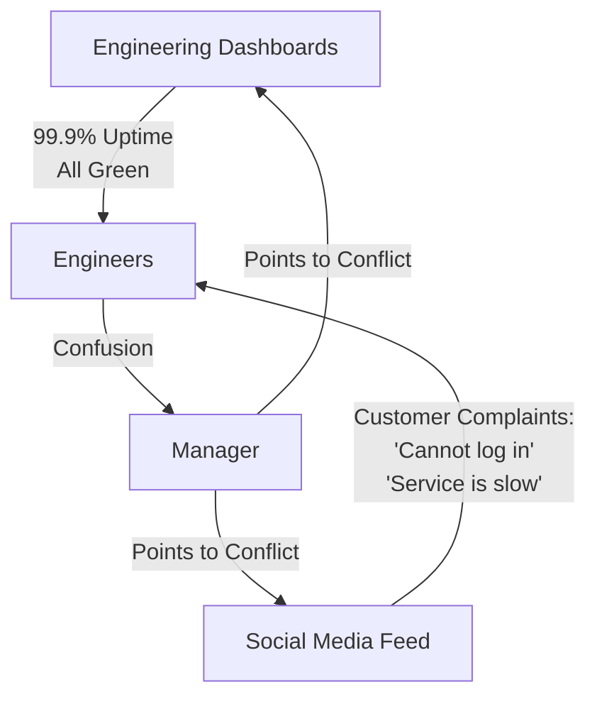

This illustration highlights the core conflict: the disparity between what the system metrics report and what the customers actually experience.

### Teaching Narrative

Reliability engineering begins with a fundamental shift in perspective: moving beyond infrastructure metrics to customer experience. Traditional monitoring focuses on system availability—whether servers are running, APIs are responding, and databases are online. But SRE reframes reliability as the customer's ability to successfully use your service. This panel illustrates the "green dashboard paradox," where technical metrics suggest everything is functioning while customers experience failures. True reliability is measured not by what our systems report, but by what our customers experience. This mindset shift is crucial for production support professionals transitioning to SRE roles—you must learn to distrust the dashboard and trust the customer.

### Common Example of the Problem

MegaBank's mobile payment service experienced a critical failure during a holiday shopping weekend, highlighting the "green dashboard paradox." The operations team's monitoring dashboards reported 99.98% server uptime, with database connections, API gateways, and load balancers all functioning normally. However, customers were unable to complete mobile payments, prompting a surge of complaints on social media and overwhelmed customer service lines. The issue stemmed from a subtle authentication timing mismatch between services, which prevented transaction completion. While the infrastructure metrics appeared healthy, the customer experience was severely impacted, leading to thousands of abandoned transactions and significant revenue loss.

To better illustrate the sequence of events and their impact, the timeline of the MegaBank incident is outlined below:

```mermaid
gantt
    title MegaBank Incident Timeline
    dateFormat HH:mm
    axisFormat %H:%M
    section Incident Progression
    Issue Begins :crit, start, 09:00, 30min
    Customer Complaints Surge :active, comp, 09:30, 1h
    War Room Activated :crit, warroom, 10:30, 1h
    Root Cause Identified :crit, rootcause, 11:30, 30min
    Fix Deployed :done, fix, 12:00, 1h
    Services Restored :done, restore, 13:00, 30min
```

This timeline demonstrates how the issue unfolded:

- **09:00**: The subtle authentication timing issue begins impacting transactions.
- **09:30**: Customers start flooding social media and customer service with complaints.
- **10:30**: The operations team convenes a war room to investigate the problem.
- **11:30**: Engineers identify the root cause—a timing mismatch between authentication services.
- **12:00**: A fix is deployed to resolve the issue.
- **13:00**: Services are fully restored, and mobile payments return to normal functionality.

This example underscores the need for monitoring that aligns with customer outcomes rather than solely infrastructure metrics. Despite the "all green" status on dashboards, MegaBank's customers experienced a service outage, demonstrating the importance of prioritizing customer-centric reliability metrics.

### SRE Best Practice: Evidence-Based Investigation

SRE practice requires measuring what actually matters to customers rather than what's convenient to measure technically. Evidence-based reliability investigation follows these principles:

1. **Customer-journey instrumentation**: Implement end-to-end monitoring that tracks complete user journeys (e.g., login → account view → transaction initiation → confirmation) rather than individual service health.

2. **Synthetic customer transactions**: Deploy automated systems that continuously perform the same actions real customers would, measuring success rates and performance from the customer perspective.

3. **Correlation analysis**: Establish real-time correlation between customer-reported issues and technical metrics to identify "invisible" failures where systems appear healthy but customer experience is degraded.

4. **Multi-dimensional health scoring**: Develop composite health metrics that combine traditional uptime with customer success rates, giving a more accurate picture of true service health.

5. **Customer feedback integration**: Create direct pipelines from customer service tools to engineering dashboards, ensuring customer-reported issues are immediately visible alongside technical metrics.

#### Evidence-Based Investigation Checklist

Use this checklist to apply evidence-based practices in your environment:

- [ ] Have we instrumented critical customer journeys end-to-end?
- [ ] Are synthetic transactions running continuously to mimic real customer actions?
- [ ] Do we have a system for correlating customer-reported problems with technical metrics?
- [ ] Have we defined and implemented multi-dimensional health scoring metrics?
- [ ] Is customer feedback directly integrated into our monitoring tools and dashboards?

In the MegaBank example, evidence-based investigation would have detected the authentication timing issue through synthetic transactions that mimicked customer payment flows, revealing the failure despite healthy infrastructure metrics.

### Banking Impact

The business impact of the "green dashboard paradox" is both immediate and long-term. The table below summarizes key consequences observed during MegaBank's payment outage, highlighting both financial and reputational effects:

| **Impact Type** | **Category** | **Details** | **Cost/Metric** |
| -------------------- | --------------------------- | ---------------------------------------------------------------------------------------------- | --------------------------------------- |
| **Immediate Impact** | Financial Loss | Lost transaction volume during the 4-hour customer-impacting incident | $3.7M |
| | Customer Support Costs | Over 2,200 support calls requiring escalation | $37,400 |
| | Emergency Engineering Costs | 42 person-hours of weekend work for incident resolution | $12,600 |
| **Long-term Impact** | Customer Trust Erosion | Decrease in mobile payment usage sustained for 3 weeks | 6% decline |
| | Competitive Disadvantage | Customer migrations to alternative payment providers | Unquantified but significant |
| | Regulatory Scrutiny | Triggered mandatory reporting requirements despite technical metrics suggesting minimal impact | Increased oversight and compliance risk |

This disconnect between technical metrics and real-world customer experience creates a dangerous delay in response. Engineering teams, relying on "green dashboards," often doubt customer reports, exacerbating the financial, operational, and reputational damage.

### Implementation Guidance

To redefine reliability through the customer lens, follow these actionable steps. The flowchart below provides a visual overview of the process and how each step connects to the next:

```mermaid
flowchart TD
    A[Start: Shift Perspective to Customer Experience] --> B[Map Critical Customer Journeys]
    B --> C[Identify Technical Components and Failure Points]
    C --> D[Implement Synthetic Transaction Monitoring]
    D --> E[Create Customer-Centric Dashboards]
    E --> F[Establish "Voice of Customer" Integrations]
    F --> G[Implement Executive-Level Reliability Reporting]
    G --> H[End: Continuous Feedback and Improvement]
```

#### Step-by-Step Breakdown:

1. **Map critical customer journeys**:\
   Identify and document the 5-7 most important customer journeys (e.g., account opening, money transfer, loan application) across all channels. For each journey:

   - Pinpoint the technical components involved.
   - Highlight potential failure points from the customer’s perspective.

2. **Implement synthetic transaction monitoring**:\
   Deploy automated testing tools to simulate these customer journeys every 1-5 minutes from outside your network. Measure:

   - Success rates.
   - Performance metrics.\
     Start with the highest-value transaction types and iterate.

3. **Create customer-centric dashboards**:\
   Develop monitoring dashboards that prioritize:

   - Customer journey success rates.
   - Task completion times.
   - Aggregated performance metrics.\
     Ensure alerts are configured for customer journey degradation rather than focusing solely on system-level failures.

4. **Establish "voice of customer" integrations**:\
   Integrate real-time feedback sources into your monitoring platforms, such as:

   - Social media monitoring feeds.
   - Customer service tickets.
   - App store reviews.\
     These provide early warnings for customer experience issues.

5. **Implement executive-level reliability reporting**:\
   Design weekly reports for leadership that emphasize customer experience metrics:

   - Journey success rates.
   - Task completion times.
   - Degradation trends.\
     This approach helps align organizational focus with customer-perceived reliability.

By following this process, teams can bridge the gap between traditional monitoring and a true customer-centric reliability strategy. Maintain ongoing feedback loops to refine each step and ensure continuous improvement.

## Panel 2: Customer Journey Mapping for Reliability

### Scene Description

A diverse team works around a conference table with a large customer journey map at the center. The map illustrates a banking customer's experience, starting from logging in to successfully completing a wire transfer. The journey is broken into distinct steps, such as authentication, account overview, initiating a wire transfer, and payment confirmation. Each step is represented by a node, with connecting lines showing the progression and dependencies between services.

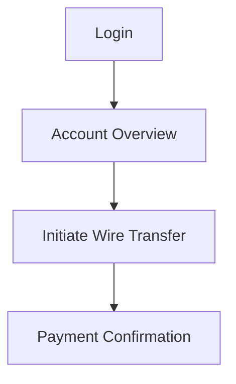

The diagram on the table highlights critical touchpoints across these steps, with annotations and markers indicating potential failure points. An SRE, holding a red marker, is circling high-risk areas on the map, such as delays during payment confirmation. A UX designer is pointing to the login step, discussing how even small friction here could impact customer satisfaction. Meanwhile, the product manager is adding sticky notes to the map, detailing the potential business impact of failures at various stages. Together, the team collaborates to prioritize reliability investments based on both technical severity and customer experience.

### Teaching Narrative

Customer journey mapping—a technique borrowed from user experience design—becomes a powerful tool for reliability engineering in a banking context. By visualizing every step a customer takes to complete a transaction, we identify critical reliability dependencies that might be missed in traditional service-level monitoring. This approach reveals that not all failures have equal impact; a minor issue early in the journey (like a slightly slow login) has different reliability implications than the same issue during payment confirmation. For banking systems, mapping journeys helps prioritize which services truly require higher reliability investments. This technique bridges the gap between technical metrics and business impact, helping production support teams understand why certain alerts deserve more urgent attention than others, even when the technical severity appears similar.

### Common Example of the Problem

Capital Finance, a major investment bank, struggled with inconsistent reliability prioritization across their wealth management platform. This issue became evident during a major market movement, where two simultaneous incidents highlighted the lack of a customer journey map to guide decision-making. Below is a timeline illustrating the sequence of events and their impact:

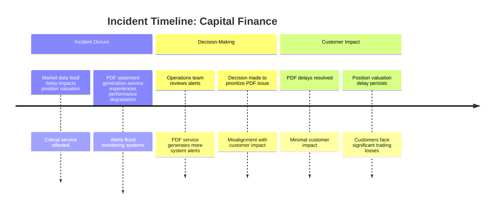

During this incident, the operations team prioritized the PDF statement generation service because it produced more system alerts, rather than assessing the customer impact of each issue. While the PDF delays were resolved quickly, they had minimal effect on customer outcomes. Meanwhile, the delay in market data feeds—critical for accurate position valuation—remained unresolved, leading to significant trading losses for clients relying on real-time data to make time-sensitive decisions.

Had a customer journey map been in place, it would have highlighted that real-time position valuation is a critical touchpoint for trading customers. This would have guided the team to focus on the market data feed issue first, aligning their response with the most significant customer impact.

### SRE Best Practice: Evidence-Based Investigation

SRE teams use structured customer journey mapping to transform reliability prioritization from opinion-based to evidence-based. Below is a checklist summarizing the key best practices for implementing this approach:

| Best Practice | Description | Actionable Steps |
| ------------------------------------ | --------------------------------------------------------------------------------------------------------------------------------- | ------------------------------------------------------------------------------------------------------------------------------ |
| **Cross-functional journey mapping** | Collaborate with engineers, product managers, UX designers, and customer service representatives to document customer journeys. | - Convene a diverse team.<br>- Identify customer goals and touchpoints.<br>- Document technical dependencies for each step. |
| **Criticality weighting** | Assign quantitative impact scores to journey stages based on business impact, customer perception, regulatory needs, and revenue. | - Develop a scoring rubric.<br>- Evaluate each stage using metrics.<br>- Highlight high-criticality stages for prioritization. |
| **Dependency visualization** | Map technical services to each journey stage to surface shared dependencies and potential failure cascades. | - Create a dependency matrix.<br>- Identify shared components.<br>- Analyze cascading risks. |
| **Historical impact analysis** | Review past incidents to identify patterns where disruptions caused significant customer or business impact. | - Compile incident data.<br>- Map incidents to journey stages.<br>- Document high-impact patterns. |
| **Recovery path mapping** | Document alternative customer paths for failed journey stages, identifying single points of failure with no alternatives. | - Trace fallback paths.<br>- Identify gaps in recovery paths.<br>- Prioritize mitigation efforts. |

#### Example Application

In Capital Finance's case, a proper journey map would have immediately illustrated that position valuation directly enabled critical customer decisions with substantial financial implications, while statement generation was a non-urgent supporting function.

### Banking Impact

The business consequences of failing to map customer journeys for reliability prioritization include:

| **Impact Type** | **Example** | **Resulting Consequences** |
| -------------------------- | ------------------------------------------------------------------ | ---------------------------------------------------------------------------------------------------------------- |
| **Quantifiable Impacts** | Prioritization error at Capital Finance | $4.2M in client trading losses, $970,000 in compensation payouts, and a 3% increase in client account transfers. |
| | Regulatory investigation following a critical payment failure | $350,000 in compliance costs and remediation efforts. |
| **Strategic Implications** | Misalignment between technical investment and business value | Engineering resources directed at low-impact services instead of critical customer touchpoints. |
| | Undefined differentiated SLAs and SLOs | Services with high customer impact lack appropriate reliability prioritization. |
| | Poor articulation of the business case for reliability investments | Difficulty securing stakeholder buy-in for critical reliability improvements. |

For financial institutions, journey mapping reveals that technical severity often poorly correlates with business impact. A seemingly minor technical glitch in a critical journey stage (e.g., payment authorization or trade execution) can have far greater consequences than a complete failure in a less critical service.

### Implementation Guidance

To implement effective customer journey mapping for reliability, follow these steps:

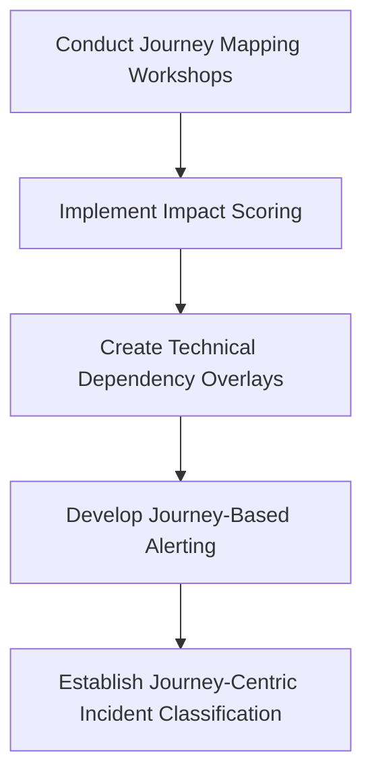

1. **Conduct journey mapping workshops**:\
   Schedule a series of 2-3 hour workshops bringing together technical teams, product owners, customer service representatives, and business stakeholders. For each major banking service (e.g., payments, loans, account management), create visual maps of the complete customer journey from initiation to completion.

2. **Implement impact scoring**:\
   Develop a quantitative scoring system (1-5) for each journey stage based on:

   - Revenue impact
   - Customer satisfaction impact
   - Regulatory consequences
   - Recovery options

   Use these scores to create a heat map of your most critical journey points.

3. **Create technical dependency overlays**:\
   For each journey map, create a corresponding technical service dependency map showing which systems support each customer step. Highlight services that support multiple critical journey stages, as these should receive the highest reliability investment.

4. **Develop journey-based alerting**:\
   Reconfigure monitoring systems to trigger differentiated alerts based on customer journey impact scores rather than treating all service degradations equally. Implement graduated response procedures based on journey criticality.

5. **Establish journey-centric incident classification**:\
   Update incident management procedures to classify and prioritize issues based on customer journey impact rather than technical severity. Train incident responders to quickly identify which journey stages are affected and their corresponding business impact.

## Panel 3: Crafting SLIs That Matter to Customers

### Scene Description

A whiteboard session where an experienced SRE is teaching junior team members. The whiteboard has several metrics crossed out (e.g., CPU utilization, memory usage, request counts) and replaced with customer-focused alternatives like transaction success rates and response times. A speech bubble asks, "But how do we know which metrics actually matter to customers?" The SRE points to the following text-based diagram, which illustrates the transition from technical metrics to customer-focused metrics:

```
Customer Journey -> Definition of "Working" -> Relevant Signals -> SLIs
     ↓                      ↓                     ↓                ↓
  "Can I                  "Successful         "Transaction       "99.9% of
 complete a               transaction         success rate       transactions
 transaction              completion          within <2 sec"     complete in
 quickly and              within required                       under 2 sec"
 securely?"               timeframes"
```

This diagram emphasizes the process of starting with the customer's perspective, defining what "working" means for them, identifying the signals that reflect this experience, and then crafting appropriate SLIs. By focusing on the customer journey, the team learns to derive metrics that truly matter to their users.

### Teaching Narrative

Service Level Indicators (SLIs) form the foundation of reliability measurement, but too often teams measure what's easy rather than what matters. In this panel, we explore how to craft meaningful SLIs that directly reflect customer experience. The key insight: start with the customer's definition of "working" and work backward to the appropriate technical metrics. For banking applications, "working" might mean successful transaction completion within regulatory timeframes, not just API availability. This approach transforms technical monitoring from infrastructure-centric to customer-centric metrics. We'll explore practical techniques for identifying the vital signals in banking systems, including critical customer pathways, transaction success rates, and time-based metrics that align with customer expectations. By reframing SLIs around customer experience, production support teams gain clarity on which alerts genuinely indicate customer impact.

### Common Example of the Problem

GlobalBank's trading platform team maintained an extensive monitoring system tracking over 200 technical metrics, including CPU utilization, memory usage, database connections, and network throughput. Their dashboards were sophisticated and detailed, providing minute-by-minute data on every component. Despite this comprehensive monitoring, they repeatedly failed to detect serious customer experience issues.

During one critical trading session, customers couldn't execute trades despite all technical metrics showing green. The investigation revealed that while all individual components were functioning within threshold limits, the end-to-end trade execution time had degraded from 300ms to over 3 seconds—a situation their component-level SLIs completely missed. This "invisible" performance degradation resulted in thousands of missed trading opportunities during a volatile market period, yet it never triggered a single alert because the team lacked SLIs that measured what actually mattered to customers: successful, timely trade execution.

#### Lessons Learned Checklist

- **Avoid component-only metrics:** Ensure monitoring isn't limited to individual system components without considering their impact on the overall service.
- **Focus on end-to-end performance:** Measure critical workflows that reflect the customer's experience, such as trade execution times or transaction success rates.
- **Define 'working' from the customer's perspective:** Identify what "working" means for the customer (e.g., timely trades, completed transactions) and align SLIs accordingly.
- **Include latency and success metrics:** SLIs should track both the time it takes to complete a customer action and the success rate of those actions.
- **Trigger alerts based on customer impact:** Design alerting thresholds that reflect disruptions to customer journeys, not just infrastructure anomalies.

### SRE Best Practice: Evidence-Based Investigation

SRE teams craft meaningful SLIs through a structured, evidence-based approach. The following table provides a clear breakdown of the steps involved:

| **Step** | **Description** | **Example** |
| ---------------------------------------- | --------------------------------------------------------------------------------------------------------------------------------------------------------------- | ------------------------------------------------------------------------------------------------------------------------------ |
| **1. Customer-defined success criteria** | Define what "working" means from the customer's perspective for each critical service. | For a trading platform: Successful order execution within expected timeframes, not just system availability. |
| **2. Journey stage decomposition** | Break down customer journeys into measurable stages, identifying specific success criteria for each stage. | Authentication under 500ms, order validation under 200ms, execution confirmation under 100ms. |
| **3. Critical aggregation windows** | Determine the appropriate time windows for measuring SLIs based on customer usage patterns and impact thresholds. | For trading systems: 10-second windows during market hours versus 1-minute windows during off-hours. |
| **4. Correlation analysis** | Analyze historical customer complaints against technical metrics to identify which indicators most accurately predicted customer-reported problems. | For GlobalBank: Identifying that end-to-end trade execution time correlates with customer dissatisfaction. |
| **5. SLI testing** | Validate potential SLIs by deliberately degrading specific aspects of the service and verifying that the SLIs detect degradation impacting customer experience. | Simulating delayed order execution to ensure the end-to-end trade execution time SLI detects the issue at the 95th percentile. |

By following these steps, SRE teams can align technical metrics with customer experience. For example, GlobalBank adopted end-to-end trade execution time as a critical SLI, measured at the 95th percentile in 10-second windows. This approach would have immediately detected performance degradation impacting customers, even when individual system components appeared to be functioning normally.

### Banking Impact

The business consequences of poorly designed SLIs include both immediate financial losses and long-term strategic disadvantages. To highlight the stark contrast, the following table provides a quantitative comparison of the impacts of poorly designed SLIs versus well-designed SLIs in a banking context:

| **Dimension** | **Poorly Designed SLIs** | **Well-Designed SLIs** |
| ----------------------------------- | ------------------------------------------------------------------------------------------------- | ---------------------------------------------------------------------------------- |
| **Financial Impact** | $3.2M in missed opportunities due to 4,200 failed trading attempts during a 17-minute degradation | $0 in missed opportunities as degradations are detected and mitigated proactively |
| **Customer Compensation** | $870,000 in compensation and relationship recovery costs | Minimal compensation costs due to early detection and resolution |
| **Customer Retention** | Increased churn as customers migrate to more reliable platforms | Higher retention as customers trust the platform's consistent performance |
| **Engineering Resource Allocation** | Wasted effort optimizing irrelevant metrics that don't reflect customer experience | Focused efforts on metrics that directly improve customer satisfaction and trust |
| **System Reliability Perception** | False confidence due to "green dashboards" that ignore customer-impacting issues | Accurate reliability insights aligned with actual customer experience |
| **Strategic Competitive Position** | Loss of competitive edge as dissatisfied customers impact brand reputation | Strengthened market position due to reliable and customer-centric service delivery |

**Quantifiable impacts**:

- For GlobalBank, the undetected trading platform degradation resulted in significant financial damage, including $3.2M in missed opportunities and $870,000 in recovery costs.
- In contrast, customer-centric SLIs can drastically reduce such losses by enabling proactive detection and resolution.

**Strategic implications**:

- Poorly designed SLIs cause misallocation of engineering resources and create false confidence in system reliability.
- Well-designed SLIs enable meaningful Service Level Objectives (SLOs), aligning business expectations with customer outcomes.
- For banking applications, where customer-impacting issues directly translate to financial losses, the stakes are particularly high. Proper monitoring not only prevents significant losses but also provides a competitive advantage by delivering on customer experience expectations.

### Implementation Guidance

To develop SLIs that genuinely reflect customer experience, follow these implementation steps. Use the checklist at the end to ensure no critical steps are missed.

1. **Conduct SLI workshops**\
   Bring together engineering, product, and customer service teams to identify what "working" means from the customer perspective for each critical service. Document the top 3-5 customer expectations for each major banking function (e.g., payments, trading, account management).

2. **Map expectations to measurable indicators**\
   For each customer expectation, define technically measurable SLIs. For example, if customers expect smooth account opening, create SLIs tracking completion rate, time-to-completion, and error frequency across the entire process.

3. **Implement end-to-end instrumentation**\
   Deploy instrumentation that measures complete customer transactions rather than just component health. This requires unique transaction identifiers that can be traced across all systems involved in fulfilling customer requests.

4. **Set appropriate aggregation windows**\
   Configure SLI measurement windows based on business impact. For high-frequency trading, measure in 10-second windows; for mortgage applications, daily windows might be appropriate. Ensure windows align with how quickly issues would impact customers.

5. **Validate with historical analysis**\
   Test new SLIs against historical incident data to confirm they would have detected known customer-impacting issues. Adjust thresholds and measurement approaches until your SLIs reliably identify customer experience degradation before it generates complaints.

______________________________________________________________________

#### Checklist: Crafting SLIs That Matter to Customers

- [ ] **Workshop Completed**: Customer expectations for each critical service identified and documented (3-5 per service).
- [ ] **Mapped SLIs**: Measurable indicators defined for all documented customer expectations.
- [ ] **Instrumentation Deployed**: End-to-end transaction tracing implemented with unique identifiers.
- [ ] **Aggregation Configured**: Measurement windows set appropriately for each service based on customer impact.
- [ ] **Historical Validation Done**: SLIs tested against past incidents; thresholds and measurement approaches adjusted as needed.

## Panel 4: The Reliability and Revenue Connection

### Scene Description

A boardroom meeting where an SRE presents a graph showing the correlation between transaction reliability drops and revenue impact. The graph is represented as follows:

```
Revenue Impact ($M)
  |
  |          *      
  |         *        
  |        *         
  |       *          
  |      *           
  |     *            
  |    *             
  |   *              
  |  *               
  | *                
  |*_________________________
        99.5%      100%
        Payment Reliability (%)

```

The graph demonstrates how even small reliability degradations trigger dramatic drops in transaction volume. Banking executives look concerned as one asks, "So you're saying a 0.5% decrease in payment reliability cost us $2.3 million last month?"

### Teaching Narrative

Reliability directly impacts revenue—a concept especially clear in banking environments. This panel explores how to quantify the business impact of reliability issues, creating a shared language between technical teams and executives. Unlike some industries where reliability impact is difficult to measure, banking offers direct metrics: transaction volumes, abandoned sessions, and support costs provide immediate financial feedback on reliability problems. We'll examine techniques for correlating reliability metrics with business performance, allowing teams to express technical risks in financial terms. This approach transforms the conversation from abstract technical concepts to concrete business impact, helping production support professionals articulate the value of reliability improvements. By establishing this connection, teams can secure appropriate resources for reliability investments and prioritize fixes based on business impact rather than technical severity alone.

### Common Example of the Problem

EastWest Banking Corporation struggled to secure executive support for reliability investments in their credit card processing platform. The technical team recognized systemic reliability risks in their aging infrastructure but couldn't effectively communicate the business case for upgrades. Their reliability justifications relied on technical metrics (reduced error rates, improved latency) that failed to resonate with business leaders focused on revenue and cost metrics.

When the system experienced a partial degradation (not a complete outage) during a major shopping event, transaction approval times increased from 2 seconds to 7 seconds. While systems remained "available" according to technical metrics, the business impact was severe—card usage dropped by 31% during the 3-hour degradation as customers switched to competitors' cards after experiencing delays. Despite having predicted this risk, the team had been unable to secure investment because they couldn't translate reliability concerns into revenue terms until after the costly incident occurred.

To illustrate the financial impact of this reliability issue, the following table summarizes key metrics before, during, and after the degradation:

| Metric | Normal Operation | During Degradation | Impact Summary |
| ------------------------------- | ---------------- | ------------------ | ------------------------------------------------------- |
| Transaction Approval Time | 2 seconds | 7 seconds | Approval delays caused customer frustration. |
| Card Usage (Transaction Volume) | 100% | 69% | 31% drop in usage as customers switched to competitors. |
| Revenue Loss (Estimated) | $0 | $1.2 million | Direct financial impact during the 3-hour window. |

This example demonstrates how presenting reliability issues in terms of financial metrics can bridge the gap between technical teams and business leaders, fostering alignment and prioritization of reliability investments.

### SRE Best Practice: Evidence-Based Investigation

SRE teams establish clear reliability-revenue connections through these evidence-based approaches. Use the following checklist as a quick reference to guide investigations:

#### Checklist: Evidence-Based Reliability Investigation

- [ ] **Transaction Funnel Analysis**\
  Track customer drop-off at each step of transaction processes. Correlate reliability metrics with completion rates to identify where degradations impact revenue.\
  *Example*: Approval delays beyond 3 seconds correlated with a 23% transaction abandonment rate for EastWest Banking.

- [ ] **Comparative Reliability Modeling**\
  Analyze transaction volumes during normal operations versus degraded periods. Normalize for time-of-day and seasonal patterns to isolate reliability impact.\
  *Key Insight*: Ensure data is adjusted for external factors like holiday spikes or maintenance windows.

- [ ] **Revenue Sensitivity Testing**\
  Conduct controlled A/B tests where selected traffic experiences slightly degraded performance. Measure the revenue impact of varying reliability levels.\
  *Pro Tip*: Use small, controlled samples to minimize customer dissatisfaction while gathering actionable results.

- [ ] **Customer Behavior Analysis**\
  Examine how reliability issues affect subsequent customer behavior. Measure not just immediate transaction abandonment but changes in future usage patterns.\
  *Consider*: Look for trends like reduced transaction frequency or long-term customer churn.

- [ ] **Competitive Reliability Benchmarking**\
  Compare reliability metrics across competitors using synthetic transactions. Correlate with market share movements to demonstrate competitive implications.\
  *Action Step*: Use these comparisons to frame reliability improvements as market differentiation.

By leveraging this checklist, SRE teams can systematically quantify the business impact of reliability issues, ensuring conversations with stakeholders remain focused on actionable and financially relevant outcomes.

### Banking Impact

The business consequences of failing to connect reliability to revenue include:

**Quantifiable impacts**:

- For EastWest Banking, the 3-hour degradation resulted in approximately 27,000 abandoned transactions
- Direct revenue loss calculated at $3.7M in transaction fees and interest
- Long-term impact analysis showed 4% of affected customers reduced card usage in subsequent months, representing an additional $11.2M in annualized revenue impact
- Competitive displacement as customers who experienced delays made a competitor's card their default payment method

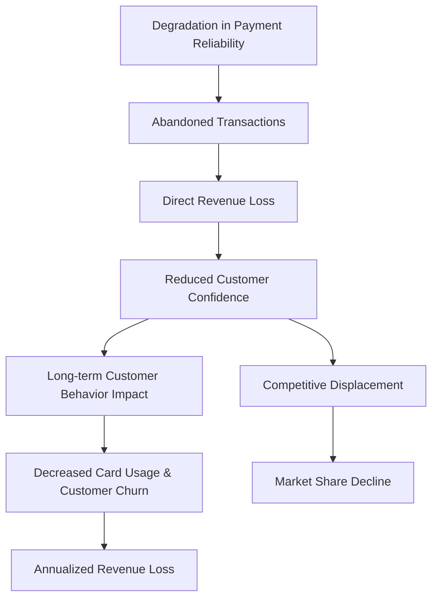

**Strategic implications**:

- Chronic underinvestment in reliability as business leaders lack clear financial justification for technical improvements
- Misalignment between technical priorities and business outcomes
- Inability to make data-driven tradeoffs between feature development and reliability investments
- Reactive rather than proactive investment patterns, with funding available only after costly incidents

In banking, the reliability-revenue connection is particularly direct because alternatives are readily available—customers can easily switch to different payment methods, banking providers, or investment platforms when experiencing reliability issues.

### Implementation Guidance

To effectively establish and communicate the reliability-revenue connection, follow this step-by-step process:

#### Step 1: Develop Financial Impact Models

- **Action**: Identify key banking services (e.g., payment processing, trading platforms).
- **Objective**: Translate reliability metrics into revenue terms.
  - For payment processing: Calculate the cost of transaction abandonment due to reliability issues.
  - For trading platforms: Quantify opportunity costs by modeling execution delays against market movements.
- **Outcome**: A clear financial model linking reliability metrics to business impact.

______________________________________________________________________

#### Step 2: Implement Correlation Dashboards

- **Action**: Design and deploy dashboards that correlate reliability and business KPIs in real time.
- **Objective**: Visualize relationships such as transaction success rates vs. completed payment volume and revenue.
- **Outcome**: A shared, data-driven view for technical teams and executives to monitor reliability's business impact.

**Text-Based Diagram:**

```
[Reliability Metrics] --> [Correlated with Business KPIs] --> [Dashboard for Real-Time Monitoring]
```

______________________________________________________________________

#### Step 3: Conduct Post-Incident Financial Analysis

- **Action**: After major reliability incidents, analyze the financial impact.
  - Quantify immediate revenue losses.
  - Assess customer behavior changes over subsequent weeks (e.g., reduced transaction volume).
- **Objective**: Provide a comprehensive business-focused post-mortem analysis.
- **Outcome**: Clear insights for executives to evaluate the cost of reliability failures.

______________________________________________________________________

#### Step 4: Establish Reliability-Adjusted Forecasting

- **Action**: Collaborate with finance teams to integrate reliability factors into revenue forecasts.
- **Objective**: Demonstrate how specific reliability improvements impact revenue projections.
- **Outcome**: A forward-looking financial model that justifies reliability investments.

**Mermaid Diagram:**

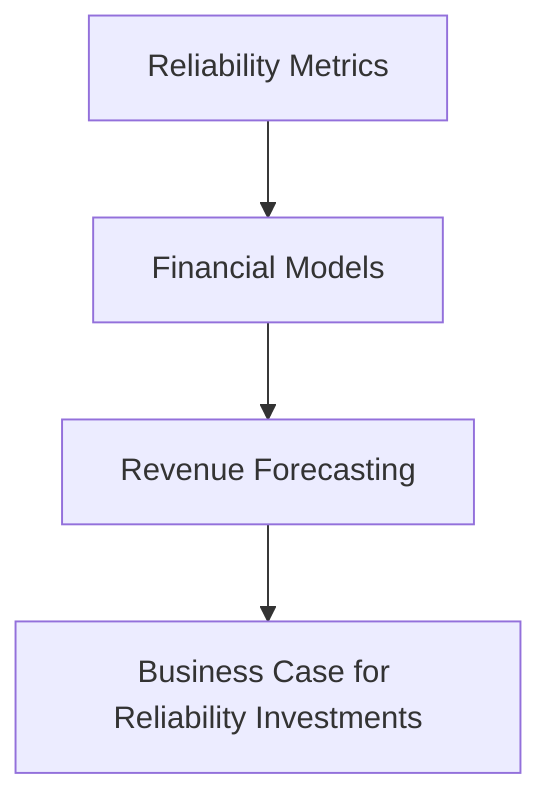

______________________________________________________________________

#### Step 5: Create Executive Reliability Reporting

- **Action**: Develop monthly reports tailored for executive leadership.
  - Emphasize business metrics such as revenue protected and customer retention impact.
  - Minimize technical jargon and focus on financial outcomes.
- **Objective**: Help leadership connect reliability efforts to tangible business value.
- **Outcome**: Increased executive buy-in and resource allocation for reliability initiatives.

______________________________________________________________________

By following these steps, teams can bridge the gap between technical reliability efforts and business outcomes, ensuring alignment across stakeholders and driving informed decision-making.

## Panel 5: Defining Reliability Targets with Error Budgets

### Scene Description

The session unfolds in a modern meeting room equipped with a large digital board, where SRE, product, and business teams collaborate to plan upcoming releases. The digital board prominently displays a visualization of the error budget as a segmented bar. The bar is divided into consumed and remaining portions, with color-coding to indicate the severity of consumption. Annotations highlight how recent feature deployments have impacted the budget, including notes on customer-facing consequences such as latency spikes or brief outages.

Below the main bar, a breakdown table categorizes the error budget usage by deployment events, linking each to key metrics like deployment date, affected services, and customer impact scores.

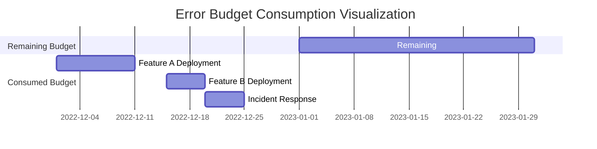

A product manager, gesturing toward the remaining segment of the bar, asks, "So we have this much reliability margin for our next release?" This sparks a discussion about upcoming priorities, with the visualization serving as the central reference point for aligning reliability goals with feature velocity.

### Teaching Narrative

Error budgets transform reliability from a binary state ("is the system up?") to a nuanced conversation about acceptable reliability thresholds. This approach acknowledges that 100% reliability is neither achievable nor necessary, replacing traditional uptime targets with a more sophisticated model. In banking environments, error budgets must account for regulatory requirements while recognizing that different services require different reliability levels. We'll explore how to establish appropriate error budgets for various banking functions—from core transaction processing (which may require 99.999% reliability) to informational services (which might tolerate 99.9%). This concept creates a framework for balancing reliability investments against feature velocity, allowing banks to innovate while maintaining appropriate reliability guardrails. For production support teams, error budgets provide context for incident response prioritization and help establish a common language with development teams about reliability expectations.

### Common Example of the Problem

FirstDigital Bank struggled with an unofficial "zero-downtime" policy across all their digital services, creating constant tension between development and operations teams. The lack of an objective framework for balancing reliability and innovation led to significant consequences during the launch of a new mobile investment platform. The table below summarizes the key events and outcomes:

| **Event** | **Details** | **Impact** |
| --------------------------------- | ----------------------------------------------------------------------------- | ---------------------------------------------------- |
| Unofficial "zero-downtime" policy | Operations rejected risky deployments; development teams felt restricted. | Constant friction between teams; no clear tradeoffs. |
| New platform release planned | Executive team announced a launch date for the mobile investment platform. | High pressure to meet the timeline. |
| Operations delays release | Operations delayed the launch by 6 weeks due to reliability concerns. | $7.2M lost in new customer acquisition. |
| Political decision-making | No error budgets to guide tradeoffs between reliability and feature velocity. | Frustration and inefficiency in decision-making. |
| Post-launch reliability issues | Despite the delays, the platform still faced reliability problems. | Customer dissatisfaction and reputational damage. |

This timeline reveals how the absence of error budgets can escalate conflicts, lead to costly delays, and ultimately fail to achieve either innovation goals or reliability standards. By adopting error budgets, FirstDigital Bank could have established clear reliability targets, enabling informed, data-driven decisions that balanced innovation with operational stability.

### SRE Best Practice: Evidence-Based Investigation

SRE teams implement error budgets through evidence-based methodologies. The following checklist and flowchart summarize the key steps to make this process actionable:

______________________________________________________________________

#### **Checklist: Implementing Error Budgets**

1. **Define Service-Specific SLOs**

   - Identify customer expectations and business requirements.
   - Tailor SLOs to the reliability needs of each service (e.g., 99.999% for core banking, 99.9% for informational services).

2. **Quantify Error Budgets**

   - Translate SLOs into measurable error budgets.
   - Example: 99.9% availability = 43.2 minutes of allowable downtime per month.

3. **Analyze Budget Allocation**

   - Review historical incident/deployment data.
   - Allocate budget across planned tasks (e.g., deployments, maintenance) and unplanned incidents.

4. **Implement Real-Time Tracking**

   - Set up monitoring to track error budget consumption.
   - Configure alerts for excessive consumption rates or budget exhaustion risks.

5. **Establish Policy-Driven Responses**

   - Define actions for when error budgets approach depletion.
   - Make decisions (e.g., freeze deployments, escalate fixes) based on pre-agreed policies.

______________________________________________________________________

#### **Flowchart: Evidence-Based Error Budget Implementation**

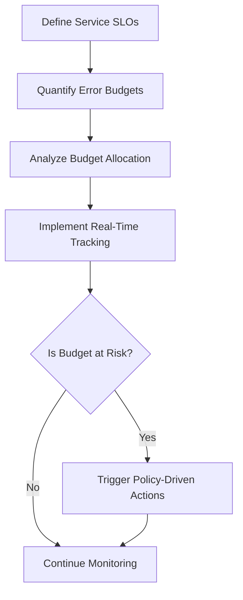

______________________________________________________________________

By following this structured approach, SRE teams can effectively implement and manage error budgets. For example, FirstDigital Bank could have applied these steps to their mobile investment platform launch, enabling a phased rollout that balanced feature velocity with reliability objectives.

### Banking Impact

The business impact of implementing error budgets in banking environments includes:

#### Quantifiable Benefits and Strategic Advantages

| **Category** | **Description** | **Key Metrics** |
| --------------------------- | --------------------------------------------------------------------------------------------------------- | --------------------------------------------------------------------- |
| **Deployment Frequency** | Increased deployment frequency while maintaining reliability targets | **+80-120%** |
| **Engineering Velocity** | Faster time-to-market for new features | **+25-35%** |
| **Resource Allocation** | Improved efficiency by focusing efforts based on error budget consumption rather than subjective concerns | **Higher resource utilization efficiency** |
| **Team Collaboration** | Shift from adversarial relationships to collaborative partnerships between development and operations | **Shared ownership of error budget responsibilities** |
| **Risk Decision-Making** | Data-driven approach to risk decisions aligned with business priorities | **Improved alignment of reliability investments with business goals** |
| **Executive Communication** | Clear and quantifiable communication of reliability status to leadership | **Enhanced transparency and reporting** |
| **Regulatory Compliance** | Demonstrable and quantitative system reliability management | **Regulatory advantage in audits and compliance** |

#### Service-Specific Reliability Investments

Error budgets are especially valuable in banking due to the varying reliability requirements across different services. Below is an example of how error budgets can guide reliability investments:

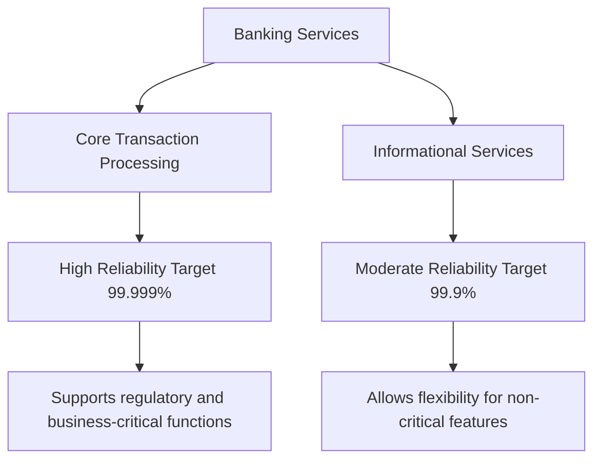

Key insights:

- **Core Transaction Processing**: Requires near-perfect reliability (e.g., 99.999%) due to its criticality and regulatory implications.
- **Informational Services**: Tolerates lower reliability thresholds (e.g., 99.9%) to enable faster innovation and cost efficiency.

By tailoring reliability investments based on service criticality, banks can optimize resource allocation, maintain compliance, and drive innovation without over-investing in non-critical areas.

### Implementation Guidance

To implement effective error budgets in your banking environment, follow these steps. Use the checklist provided to ensure a structured approach:

#### Step-by-Step Checklist for Error Budget Implementation

1. **Conduct SLO Workshops**

   - [ ] Assemble a cross-functional team of product, engineering, and business stakeholders.
   - [ ] Define Service Level Objectives (SLOs) for each major banking service.
     - [ ] Differentiate between critical processes (e.g., payments, trading, core banking).
     - [ ] Assign appropriate reliability levels to supporting services (e.g., informational sites, reporting tools).
   - [ ] Document finalized SLOs and ensure alignment across all teams.

2. **Calculate Service-Specific Error Budgets**

   - [ ] Translate each SLO into a measurable error budget.\
     Example: A 99.95% availability SLO for payments equals 21.6 minutes of downtime per month.
   - [ ] Document error budgets in accessible, centralized policies for reference.

3. **Implement Real-Time Budget Tracking**

   - [ ] Deploy monitoring tools to automatically track error budget consumption.
   - [ ] Configure alerts for predefined consumption thresholds:
     - [ ] 50% consumed
     - [ ] 75% consumed
     - [ ] 90% consumed
   - [ ] Ensure tracking systems forecast depletion rates for proactive responses.

4. **Establish Error Budget Policies**

   - [ ] Define actionable policies for different consumption levels:
     - Example: Pause feature deployments at 80% consumption to prioritize reliability improvements.
   - [ ] Communicate policies clearly to development and operational teams.

5. **Create Executive Reporting**

   - [ ] Design dashboards displaying error budget status across key services:
     - [ ] Use business-friendly visualizations for clarity.
     - [ ] Highlight trends and actionable insights.
   - [ ] Integrate these dashboards into planning and prioritization discussions.

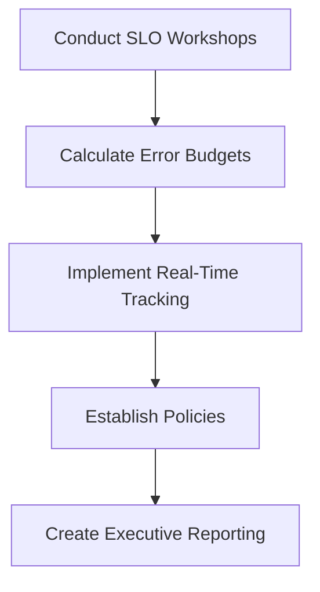

#### Example Usage Scenario:

- A payments service with a 99.95% SLO is tracked daily. At 75% budget consumption, alerts notify the team. They pause non-critical deployments and redirect efforts toward stability improvements before reaching critical thresholds.

## Panel 6: Reliability as a Competitive Advantage

### Scene Description

A lively collaboration unfolds between the marketing and SRE teams, exemplifying how cross-functional efforts drive business value. On one side of the room, a chart prominently displays the correlation between customer retention rates and service reliability, with a clear upward trend that sparks discussion. Adjacent to it, a competitive analysis board lists several banking competitors alongside their reliability metrics, with key areas of opportunity circled to highlight where improved reliability can create market differentiation. Marketing materials are spread across the table, featuring bold statistics that emphasize reliability as a core selling point.

Below is a conceptual diagram that captures the scene's key elements:

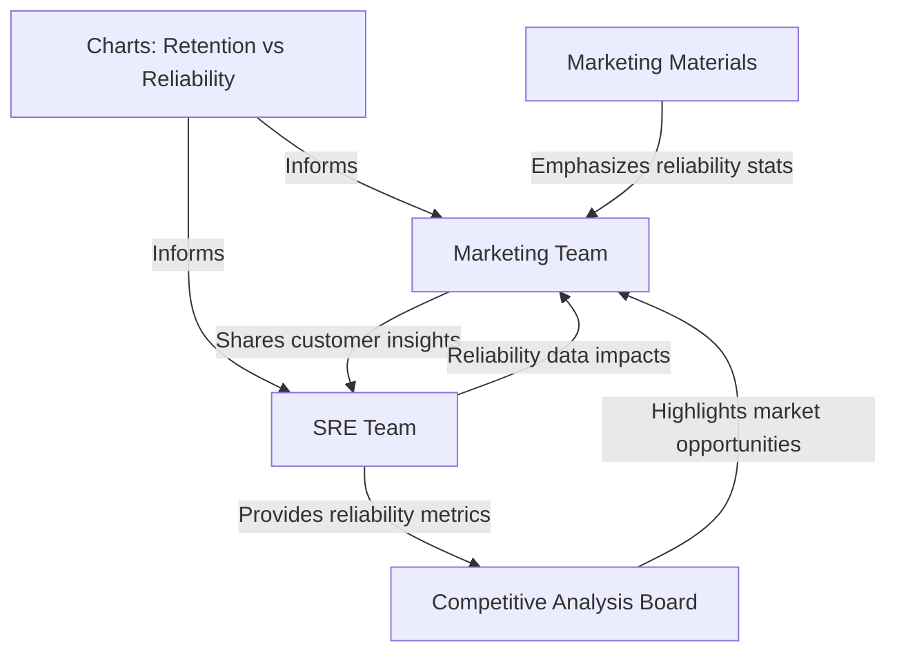

This visual representation underscores the dynamic exchange of ideas, with the marketing team leveraging technical insights to craft compelling customer narratives and the SRE team aligning their reliability improvements with business goals.

### Teaching Narrative

In the banking industry, reliability isn't just a technical requirement—it's a competitive differentiator. This panel explores how financial institutions leverage reliability as a market advantage, with case studies of banks that have turned reliability excellence into customer acquisition and retention strategies. We'll examine how reliability perceptions influence customer confidence, particularly in digital banking where trust directly correlates with usage. For production support teams transitioning to SRE roles, this perspective elevates their work from "keeping the lights on" to "delivering competitive advantage." This shift helps teams prioritize improvements that customers will notice and value, rather than focusing on technical metrics with limited customer visibility. By understanding reliability as a product feature rather than a technical constraint, SREs can better collaborate with product and marketing teams to emphasize reliability investments that drive business growth.

### Common Example of the Problem

RegionalBank and NationalBank competed directly in the same metropolitan markets, offering similar digital banking services with comparable features and fee structures. However, their approaches to reliability and the subsequent market outcomes differed significantly.

| Metric | RegionalBank | NationalBank |
| ------------------------------- | ------------------------ | ------------------------- |
| **Mobile Banking Availability** | 99.97% | 99.7% |
| **Response Times** | Sub-second | Variable, often >2s |
| **Customer Churn Rate** | 5% | 12% |
| **Top Customer Feedback** | "Reliable and fast" | "Frequent service issues" |
| **Marketing Focus** | Interest rates, features | Features, new services |
| **Investment in Reliability** | Moderate | Low |

Despite RegionalBank's clear reliability advantage—demonstrated by higher availability, faster response times, and lower churn—they failed to capitalize on this in their marketing strategy. Their advertising focused exclusively on interest rates and features, leaving their superior reliability largely invisible to potential customers.

Customer surveys revealed that those who switched from NationalBank to RegionalBank overwhelmingly cited reliability as their primary motivation. Yet, RegionalBank neglected to position this as a unique selling point. Conversely, NationalBank's product team continued prioritizing new features over addressing their reliability issues, not understanding the direct impact this had on customer attrition.

This misalignment led to resource misallocation on both sides: RegionalBank undervalued their reliability advantage in customer acquisition efforts, while NationalBank underestimated the business impact of their reliability shortcomings.

### SRE Best Practice: Evidence-Based Investigation

SRE teams establish reliability as a competitive advantage through evidence-based approaches. These approaches not only uncover actionable insights but also provide a data-driven foundation for prioritizing improvements. Use the following checklist to apply these practices effectively:

#### Evidence-Based Investigation Checklist

1. **Competitor Reliability Benchmarking**

   - [ ] Perform synthetic transactions to measure competitor service reliability.
   - [ ] Compare the data against your own reliability metrics.
   - [ ] Identify gaps or advantages to highlight in marketing and product positioning.

2. **Customer Attrition Analysis**

   - [ ] Investigate patterns in customer departures and correlate them with reliability issues.
   - [ ] Quantify the revenue impact of lost customers due to reliability gaps.
   - [ ] Use findings to prioritize reliability improvements tied to business outcomes.

3. **Reliability Preference Research**

   - [ ] Conduct surveys or interviews to understand customer expectations for reliability.
   - [ ] Assess willingness to pay (explicitly or through loyalty) for higher reliability levels.
   - [ ] Incorporate insights into product development and customer retention strategies.

4. **Feature vs. Reliability Tradeoff Studies**

   - [ ] Design experiments to test customer preferences between new features and improved reliability.
   - [ ] Measure the impact of each option on customer satisfaction and retention.
   - [ ] Use results to guide investment decisions for maximum customer value.

5. **Reliability Perception Mapping**

   - [ ] Measure actual reliability metrics alongside customer perception of reliability.
   - [ ] Identify gaps between technical performance and customer trust.
   - [ ] Focus improvements on the reliability factors most critical to customer confidence.

#### Example Applications

- For RegionalBank, conducting competitor reliability benchmarking provided concrete marketing differentiation data that highlighted their superior performance.
- NationalBank's customer attrition analysis uncovered the significant business cost of their reliability disadvantage, driving a renewed focus on reliability improvements.

By systematically following this checklist, SRE teams can align reliability investments with customer priorities, transforming reliability into a key driver of competitive advantage.

### Banking Impact

The business impact of recognizing reliability as a competitive advantage includes:

**Quantifiable Effects**:

- Analysis revealed that NationalBank's reliability issues contributed to a **4.3% higher customer churn rate** compared to RegionalBank.
- This translated to approximately **$14.2M in annual lost revenue** from departing customers.
- Customer acquisition costs increased by **23%** as NationalBank had to offer higher incentives to overcome reputation issues.
- For mobile banking users, a measurable **28% reduction in feature usage** occurred after experiencing two or more reliability incidents.

**Strategic Implications**:

- Missed market positioning opportunities when reliability advantages go unmeasured and unpromoted.
- Misaligned product investment when reliability's competitive impact isn't quantified.
- Inability to properly value reliability improvements in product roadmap decisions.
- Failure to leverage word-of-mouth referrals that typically follow from consistent reliability.

**Summary of Impacts**:

```mermaid
graph TD
    A[Reliability Issues] --> B[Higher Customer Churn (+4.3%)]
    A --> C[Lost Revenue ($14.2M/year)]
    A --> D[Increased Acquisition Costs (+23%)]
    A --> E[Reduced Feature Usage (-28%)]

    B --> F[Decreased Customer Loyalty]
    D --> F
    E --> F

    F --> G[Missed Market Differentiation]
    F --> H[Weakened Referral Growth]
    F --> I[Less Effective Product Investments]
```

In banking, where services are increasingly commoditized and digital interactions form the primary customer experience, **reliability has a greater impact on customer loyalty** than marginal feature differences or small price advantages. By quantifying and promoting reliability advantages, businesses can unlock significant market differentiation and improve customer trust.

### Implementation Guidance

To leverage reliability as a competitive advantage, implement these steps:

1. **Establish a competitor reliability monitoring program**: Deploy synthetic transaction testing against competitor banking platforms, measuring their reliability and performance on key customer journeys. Create weekly reports comparing your reliability metrics against competitor benchmarks.

2. **Conduct reliability-focused customer research**: Work with your market research team to specifically investigate how reliability impacts customer choice and loyalty. Include reliability scenarios in customer surveys and focus groups to quantify its importance relative to other banking attributes.

3. **Develop reliability marketing materials**: Partner with marketing to create specific messaging highlighting your reliability advantages with concrete metrics. Develop case studies featuring customers who value consistent performance over marginal feature differences.

4. **Implement "reliability superiority" tracking**: Create executive dashboards that track not just your absolute reliability but your relative position compared to competitors. Set goals for reliability differentiation in key customer journeys.

5. **Establish reliability experience innovations**: Identify opportunities to differentiate through reliability-focused features that competitors lack, such as transparent status pages, scheduled maintenance notifications, or performance guarantees with compensation for disruptions.

## Panel 7: Building Customer-Centric Alerting Systems

### Scene Description

An SRE is in the process of redesigning an alert dashboard to improve its usability and relevance. The old system prominently displays hundreds of technical alerts, categorized by service, creating overwhelming noise and making it difficult to identify customer-impacting issues. In contrast, the new design organizes fewer, consolidated alerts based on customer journey stages, such as "Account Login," "Funds Transfer," or "Transaction Processing."

Below is a simplified representation of the transition from the old to the new alerting system:

#### Old Dashboard

```
+---------------------------+
| Service: Payments         |
| - Alert: Error code 500   |
| - Alert: Timeout detected |
| Service: Core Banking     |
| - Alert: DB connection    |
| - Alert: High latency     |
| ...                       |
| (Hundreds more alerts)    |
+---------------------------+
```

#### New Dashboard (Customer-Centric)

```
+---------------------------+
| Customer Journey:         |
| - Stage: Funds Transfer   |
|   * Incident: Transfer Delays |
| - Stage: Transaction      |
|   * Incident: Processing Error |
| ...                       |
| (Fewer, focused alerts)   |
+---------------------------+
```

A timeline visualization further illustrates how the new system links multiple technical alerts to a single customer-impacting incident. For example:

#### Timeline View

```
[09:00 AM] DB connection alert      [Technical]
[09:01 AM] Error code 500 alert    [Technical]
[09:02 AM] Incident detected: Funds Transfer Delays [Customer Impact]
```

The team members are visibly relieved by the reduced alert noise, as the new system emphasizes clarity and customer impact over sheer technical detail, empowering them to respond more effectively to critical issues.

### Teaching Narrative

Alert fatigue remains one of the greatest challenges for production support teams, with traditional monitoring generating hundreds of notifications that obscure rather than illuminate customer impact. This panel introduces customer-centric alerting—a methodology that organizes and prioritizes alerts based on customer journey impact rather than technical severity. We'll explore practical techniques for alert consolidation, impact-based prioritization, and customer journey mapping in alerting systems. For banking environments, this means distinguishing between alerts that affect critical financial operations (payments, trading, core banking) and those affecting supplementary services. By implementing customer-centric alerting, teams can reduce alert noise while increasing focus on what truly matters to customers. This approach transforms traditional monitoring from a technical exercise to a customer advocacy function, helping production support professionals develop the customer-focused perspective essential to effective SRE practice.

### Common Example of the Problem

TrustNorth Bank's operations team was drowning in alerts—their monitoring systems generated an average of 740 alerts per day across their digital banking platform. Engineers maintained a 24/7 rotation to triage these alerts, yet still missed critical customer-impacting issues while drowning in non-actionable notifications.

The following timeline illustrates the sequence of events during a severe incident affecting mobile check deposits. It highlights how the technical categorization of alerts delayed the recognition of customer impact:

| **Time** | **Alert** | **Category** | **Action Taken** | **Customer Impact** |
| -------- | ----------------------------------------- | ------------------- | ------------------------------------------- | --------------------------------------- |
| 00:00 | Elevated CPU usage on non-critical system | Resource Monitoring | Investigated and deemed non-critical | None |
| 00:05 | Database I/O latency warning | Performance Alert | Logged for later investigation | Potential delay in transaction handling |
| 00:15 | API error rate spike | Application Alert | Restarted affected service | Minor interruptions in API responses |
| 00:20 | Queue backlog warning | Queue Monitoring | Assumed temporary and deprioritized | Increasing delays in deposit processing |
| 00:30 | Payment gateway timeout alert | Application Alert | Investigated, but no clear root cause found | Deposit transactions start failing |
| 00:40 | Multiple customer complaints reported | Customer Feedback | Escalated issue to incident response team | Customers unable to deposit checks |

Key Takeaways:

- **Alert Noise:** During the incident, 147 separate technical alerts were generated across various systems, many of which were unrelated to the root cause.
- **Delayed Recognition:** The team took 40 minutes to correlate the technical alerts with the customer journey impact, as no single alert indicated a critical problem.
- **Misaligned Priorities:** High-severity alerts from non-critical systems diverted attention from the developing deposit issue, worsening response time.

This example underscores how traditional monitoring systems, focused on technical categorization, can obscure the broader customer impact and lead to significant delays in addressing critical issues.

### SRE Best Practice: Evidence-Based Investigation

SRE teams implement customer-centric alerting through evidence-based methodologies. The following checklist provides step-by-step guidance for applying these best practices:

#### Checklist for Evidence-Based Alerting

1. **Alert Impact Classification**

   - Categorize alerts based on their impact on customer journeys, not just technical severity.
   - Use historical data to link alert types to measurable customer experience degradation.

2. **Alert Consolidation Analysis**

   - Identify clusters of related alerts that can be merged into single, customer-impacting notifications.
   - Include supporting technical details to ensure engineers have actionable context.

3. **Alert-to-Action Mapping**

   - Evaluate if each alert type drives specific operational responses.
   - Remove or suppress alerts that do not lead to meaningful action.

4. **Signal-to-Noise Optimization**

   - Analyze historical alert data to identify false positives or low-impact alerts.
   - Tune alert thresholds or eliminate noisy signals to improve relevance.

5. **Alert Hierarchy Implementation**

   - Design a tiered alert system:
     - **Critical Alerts**: Require immediate response to prevent or mitigate customer impact.
     - **Informational Alerts**: Provide context but do not require immediate action.

#### Example Workflow for Alert Consolidation

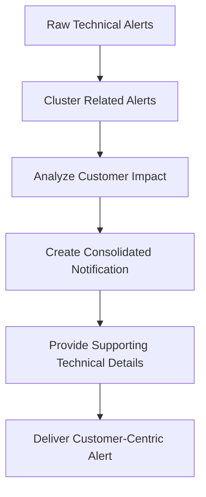

For TrustNorth Bank, applying this workflow transformed 147 separate technical alerts into a single "Mobile Deposit Journey Degraded" notification. This reduced noise and enabled the team to prioritize their response effectively, focusing on customer impact.

### Banking Impact

The business consequences of alert overload and technically-focused alerting include:

#### Quantifiable Impacts

| **Metric** | **Impact** |
| ------------------------ | ------------------------------------------------------------------------ |
| Affected Customers | 3,200 customers unable to process mobile deposits for 40 minutes |
| Financial Delays | $4.7M in deposits delayed, creating cash flow challenges |
| Refunds Issued | $67,000 in overdraft fee refunds due to delayed deposit processing |
| Resolution Time Increase | 35% longer resolution times caused by alert confusion |
| Support Call Volume | 180% increase during the incident, incurring $18,500 in additional costs |

#### Strategic Implications

To better understand how these metrics cascade into broader operational challenges, consider the following flow:

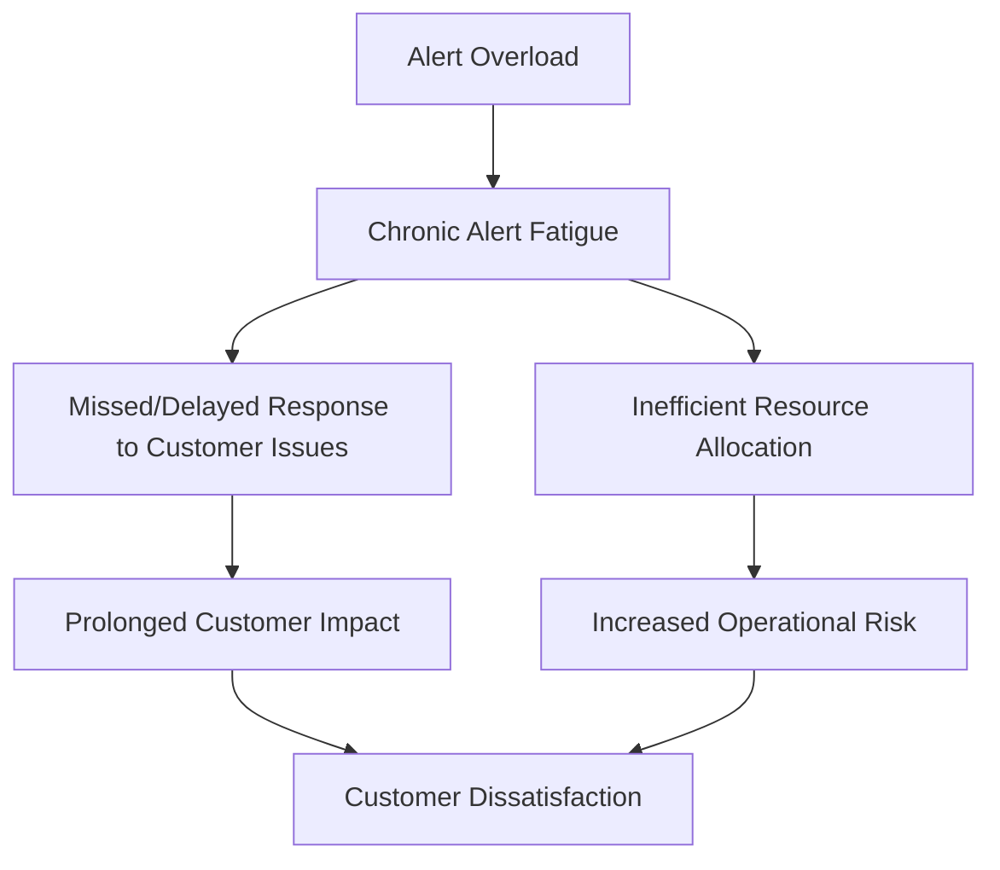

- **Chronic alert fatigue**: Teams become desensitized to constant notifications, reducing effectiveness in identifying critical incidents.
- **Inefficient resource allocation**: Engineering teams waste time on alerts with no customer impact, leading to slower resolution of critical issues.
- **Prolonged customer impact**: Delays in response exacerbate the consequences of disruptions, increasing customer frustration.
- **Increased operational risk**: Overwhelmed teams struggle to prioritize, leaving the organization more vulnerable to major incidents.

In banking, where incidents directly affect customers' financial transactions and access to funds, optimizing alerts based on customer impact is not just a technical improvement—it is a business imperative.

### Implementation Guidance

To build effective customer-centric alerting systems, follow these steps in sequential order. The flowchart below provides a high-level overview of the implementation process, followed by detailed descriptions of each step.

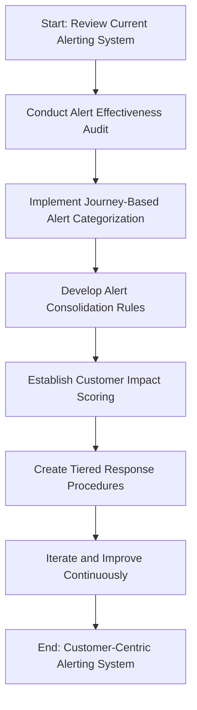

1. **Conduct an alert effectiveness audit**:\
   Review the last 90 days of alerts, categorizing each by customer impact, false positive rate, and action taken. Identify alerts that consistently led to customer-impacting issues versus those that rarely corresponded to real problems. Use this data to eliminate or downgrade low-value alerts.

2. **Implement journey-based alert categorization**:\
   Reorganize your alerting system to group notifications by customer journey rather than technical service. Create primary categories like "Account Access Journey," "Payment Processing Journey," and "Account Opening Journey" to contextualize alerts within customer experiences.

3. **Develop alert consolidation rules**:\
   Configure your monitoring systems to automatically consolidate related alerts into single notifications that provide a holistic view of an issue. For example, combine database latency, API timeout, and front-end error alerts into a single "Payment Processing Degraded" alert with supporting details.

4. **Establish customer impact scoring**:\
   Implement an automated scoring system that assigns customer impact levels to each alert based on the criticality of the affected journey, the percentage of customers potentially impacted, and the severity of the disruption. Use this score for alert prioritization.

5. **Create tiered response procedures**:\
   Develop graduated response procedures based on customer impact scores rather than technical severity. For high-impact alerts affecting critical journeys, implement automatic escalation and broader notification, while allowing lower-impact alerts to be handled through normal channels.

6. **Iterate and improve continuously**:\
   Regularly review the performance of your customer-centric alerting system. Gather feedback from stakeholders, analyze metrics like alert noise reduction and response times, and refine your categorization, consolidation, and scoring rules to ensure ongoing alignment with customer needs.
