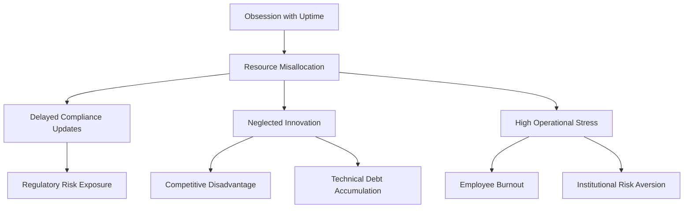
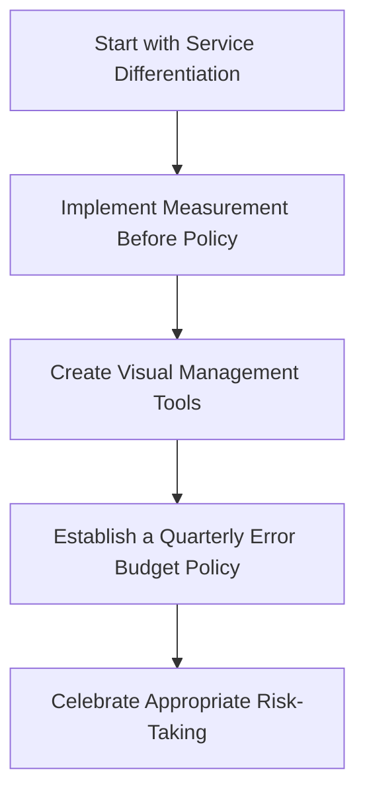
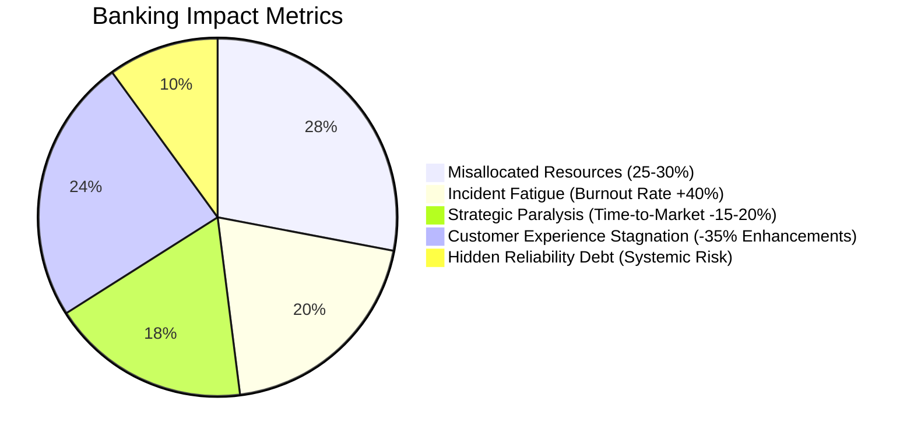
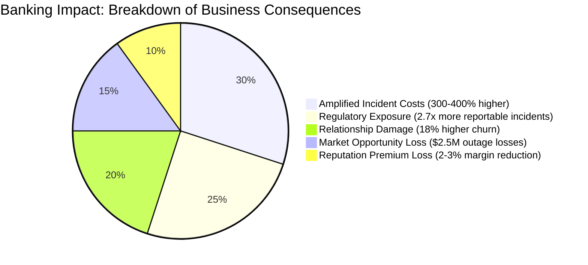
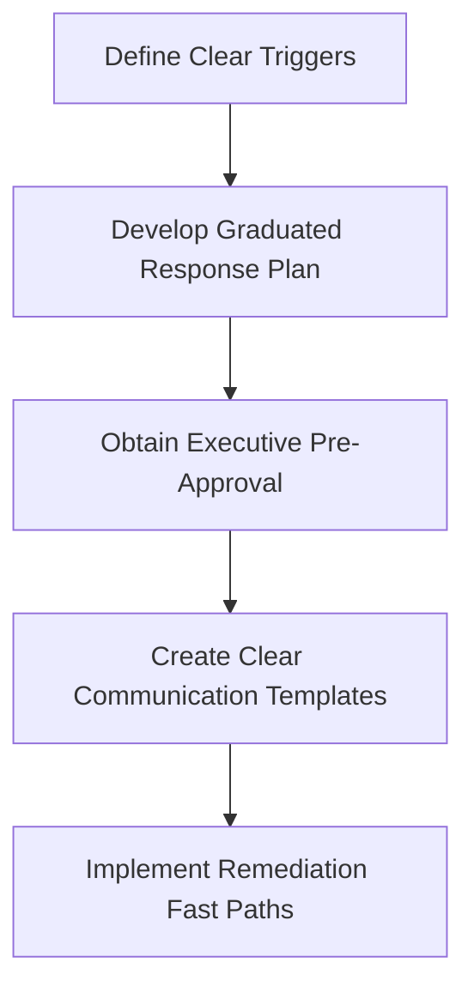
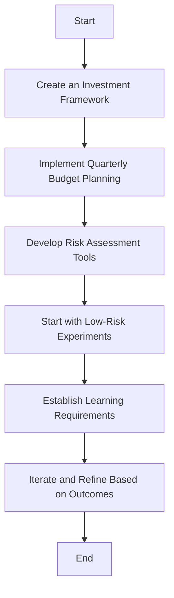
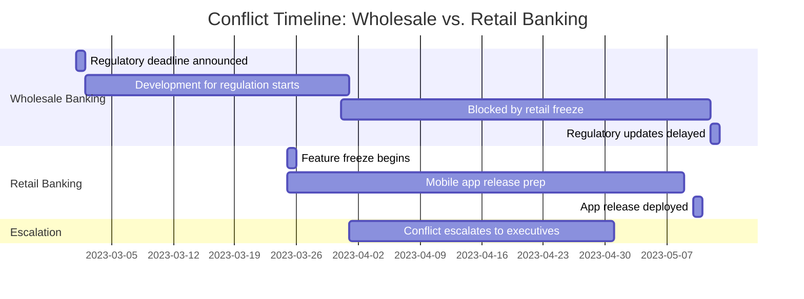
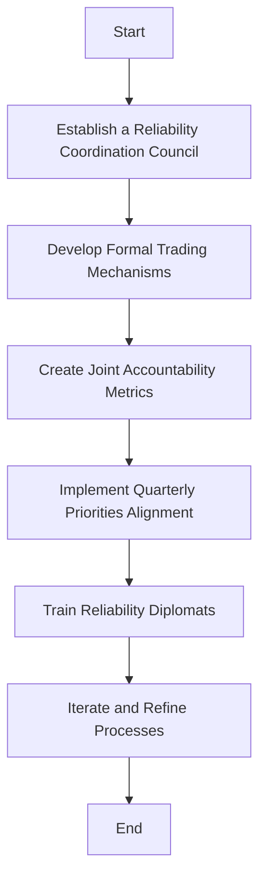

# Chapter 4: Error Budgets as Cultural Tools

## Chapter Overview

Welcome to the jungle, where chasing "five nines" is a religion and outages are career suicide. In this chapter, we burn the uptime idol and introduce error budgets as your new instrument of organizational sanity. Error budgets aren’t just a clever SRE trick—they’re the crowbar for prying open ossified, fear-driven cultures and replacing drama with data. We’ll show you how error budgets turn reliability from a dogmatic, soul-crushing pursuit into a rational business tool. By the end of this chapter, you’ll see error budgets not as a technical metric, but as the diplomatic currency, circuit breaker, and investment account that can finally stop your teams from eating each other alive over every blip, bug, and feature freeze.

If you think “perfect reliability” is a virtue, prepare to have your faith shattered and replaced with something far more profitable (and a lot less exhausting). Let’s get dangerous.

______________________________________________________________________

## Learning Objectives

- **Explain** why relentless uptime worship leads to stagnation, burnout, and business losses.
- **Distinguish** between service tiers and assign SLOs that actually align with business impact (not just tradition).
- **Quantify** error budgets and use them to make risk visible, actionable, and negotiable.
- **Implement** circuit breakers that kill heroics and politics in favor of automated, pre-agreed responses.
- **Invest** your error budget strategically, balancing reliability with innovation and competitive pressure.
- **Leverage** error budgets as organizational “diplomatic currency” to break down silos, allocate risk, and resolve cross-team conflicts before they hit the boardroom.

______________________________________________________________________

## Key Takeaways

- Chasing “perfect” reliability everywhere is the slowest way to lose customers, burn out staff, and fall behind your competitors. Stop it.
- Error budgets are the adult supervision your org desperately needs: they let you balance risk and reward with actual math, not gut feelings or escalation theater.
- All incidents do not deserve the same panic—error budgets let you nap through the noise and save your real energy for the stuff that matters.
- When the budget empties, the party stops. Circuit breakers kill feature work automatically—no more begging devs to care about your “P1s.”
- Hoarding your error budget is just as dumb as burning it all at once. Spend it where it buys customer value or learning, not on appeasing compliance zombies.
- Error budgets force business and tech to speak the same language about risk. If you’re still arguing, you’re not measuring.
- Siloed teams fighting over shared infrastructure? Use error budgets as chips on the negotiation table, not as weapons for escalation.
- If you aren’t using data to decide where your reliability dollars go, you’re subsidizing waste and masking risk. Enjoy your next board-level postmortem.
- An unused error budget is wasted opportunity; an overspent budget is a warning flare. Use both to your advantage.
- If your org’s first reaction to any error is “freeze everything,” you’re not managing risk—you’re running scared.

If you want to be the SRE who stops endless firefighting and actually moves the business, error budgets are your weapon. Wield them.

______________________________________________________________________

## Panel 1: From Uptime Obsession to Intelligent Risk Management

### Scene Description

A tense meeting room where Katherine, an SRE lead, stands at a whiteboard that's split into two sections:

```
+-------------------------+---------------------------+
| Traditional Reliability | Error Budget Visualization|
|-------------------------|---------------------------|
| 99.99% Uptime           | Service A: 40% Consumed  |
| (Red Circle)            | Service B: 60% Consumed  |
|                         | Service C: 20% Consumed  |
+-------------------------+---------------------------+
```

On the left side, the "99.99% uptime" metric is prominently displayed with a red circle around it, symbolizing the traditional mindset. On the right side, a colorful error budget visualization shows various services consuming portions of their allocated budgets. Development team members look bewildered, grappling with the unfamiliar concept, while operations staff appear defensive, clinging to the traditional approach. The room's atmosphere is charged with uncertainty as Katherine confidently gestures to the right side of the board, emphasizing the need for a shift in perspective.

### Teaching Narrative

The transition from production support to SRE requires a fundamental shift in how we think about reliability. Traditional banking operations obsess over maximizing uptime, creating a culture where any outage is considered a failure. This mindset, while well-intentioned, creates a high-stress environment that paradoxically reduces innovation and often doesn't actually improve customer experience.

Error budgets introduce a revolutionary concept: perfect reliability is not the goal. Instead, we quantify acceptable failure and use it as a tool to balance innovation and stability. By defining a "budget" of acceptable errors based on SLOs, we create a shared language between development and operations that changes the conversation from "no failures allowed" to "how should we spend our reliability budget?"

This panel introduces the core concept that error budgets aren't merely technical metrics—they're cultural tools that transform organizational dynamics by replacing fear-based decision making with data-driven risk management.

### Common Example of the Problem

In a major retail banking platform, the operations team maintained an absolute focus on "five nines" (99.999%) uptime for all services, regardless of their criticality. When a minor cosmetic issue in the account history view triggered a brief degradation, an entire release cycle was frozen for two weeks while exhaustive reviews were conducted. Meanwhile, critical customer features were delayed, including fraud protection enhancements that would have provided significant customer value. The development team grew increasingly frustrated as their velocity ground to a halt over what they perceived as a minor issue, while operations remained adamant that any reliability degradation was unacceptable. This rigid approach created tension between teams, slowed innovation, and paradoxically reduced overall system quality as developers became hesitant to touch any part of the system.

#### Comparison: Rigid Uptime Focus vs Balanced Error Budget Approach

| Aspect | Rigid Uptime Focus | Balanced Error Budget Approach |
| ------------------------ | ----------------------------------------------------------------------------------- | ---------------------------------------------------- |
| **Incident Handling** | Every issue, regardless of severity, freezes releases | Minor issues consume part of the error budget |
| **Impact on Innovation** | Delayed feature rollouts and reduced velocity | Faster delivery of high-value features |
| **Team Dynamics** | High tension between dev and ops teams | Collaborative decision-making between teams |
| **Risk Management** | Fear-based, avoiding all failures | Data-driven, accepting controlled risk |
| **Customer Value** | Focus on maintaining "perfect" uptime, often at the expense of feature enhancements | Reliability balanced with impactful feature delivery |

### SRE Best Practice: Evidence-Based Investigation

To transform this culture, SRE teams implement evidence-based reliability targets through systematic collection and analysis. Below is a checklist summarizing the four core evidence-based approaches:

| Evidence-Based Approach | Key Focus | Example Use Case |
| ----------------------------- | ------------------------------------------- | ---------------------------------------------------------------------------------------------------------------------------------- |
| **Customer Impact Data** | Measure actual customer experience metrics. | Transaction processing requires 99.99% reliability, while account history views may only need 99.9%. |
| **Competitive Analysis** | Benchmark reliability within the industry. | Identify that competitors balance feature richness with appropriate reliability, rather than aiming for perfection. |
| **Cost-Benefit Analysis** | Quantify the cost of "perfect" reliability. | Highlight diminishing returns on engineering hours and infrastructure costs beyond certain thresholds. |
| **User Expectation Research** | Survey and analyze user expectations. | Determine that customers expect higher reliability for critical services but tolerate lower reliability for non-critical features. |

#### Checklist: Applying Evidence-Based Investigation

- [ ] Collect customer experience metrics for all key services.
- [ ] Conduct competitive benchmarking to establish industry-aligned targets.
- [ ] Perform a cost-benefit analysis for reliability improvements.
- [ ] Survey users or analyze usage data to understand reliability expectations.
- [ ] Use gathered data to set SLOs that balance innovation and reliability.

These evidence-based approaches transform reliability from a subjective value judgment into an objective, data-driven business decision. By following this checklist, teams can align reliability efforts with both customer needs and organizational priorities.

### Banking Impact

The rigid pursuit of uniform high-reliability targets introduces several significant business impacts for financial institutions. Below is a concise summary of these impacts, designed to highlight the key takeaways for stakeholders:

#### 🏦 Business Impacts at a Glance:

- **Competitive Disadvantage**: Overemphasis on uptime for non-critical features can lead to competitors outpacing innovation, resulting in a digital banking market share decline of 2-3% annually.
- **Regulatory Risk Exposure**: Misaligned priorities divert resources from compliance and security, delaying critical updates and increasing exposure to regulatory penalties.
- **Technical Debt Accumulation**: Aging systems become entrenched as teams avoid modernization efforts, escalating maintenance costs and hindering scalability.
- **Employee Burnout**: Operations staff face 32% higher turnover rates due to alert fatigue and the relentless demand to eliminate all failures, regardless of their significance.
- **Institutional Risk Aversion**: A fear-driven culture stifles innovation, reducing the organization’s ability to launch new products or adapt to changing market needs.

#### Text Diagram: Reliability Impact Flow



By shifting focus from perfect reliability to intelligent risk management via error budgets, financial institutions can mitigate these impacts, creating a more balanced and innovative operational culture.

### Implementation Guidance

To implement error budgets in a banking environment, follow these actionable steps. The flowchart below provides a high-level overview of the process, followed by detailed explanations for each step.



1. **Start with Service Differentiation**:\
   Categorize services into tiers based on business criticality:

   - **P0**: Critical services like payment processing.
   - **P1**: Important services like account management.
   - **P2**: Non-critical features like informational dashboards.\
     Assign preliminary SLOs to each tier (e.g., 99.99% for P0, 99.9% for P1, 99.5% for P2) based on customer impact. These tiers help prioritize reliability efforts appropriately.

2. **Implement Measurement Before Policy**:\
   Deploy monitoring systems to track reliability against the defined SLO targets for at least 30 days.

   - Use this time to collect baseline data and identify natural reliability levels for each service.
   - Demonstrate to stakeholders how different services can operate at varying levels of reliability without negatively impacting customer satisfaction.

3. **Create Visual Management Tools**:\
   Develop dashboards to visualize error budget consumption by service.

   - Ensure that these dashboards include clear indicators for budget status (e.g., remaining budget as a percentage).
   - Make the dashboards accessible to both development and operations teams to foster a shared understanding of reliability metrics.

4. **Establish a Quarterly Error Budget Policy**:\
   Define and document a policy that governs the use of error budgets:

   - While error budgets remain, prioritize feature development.
   - When a budget is exhausted, shift focus entirely to reliability improvements.\
     Gain formal approval for this policy from both technology and business leadership to ensure alignment and accountability.

5. **Celebrate Appropriate Risk-Taking**:\
   Recognize and reward teams that effectively use their error budgets to deliver customer value.

   - Create incentive structures that encourage balanced risk-taking rather than an exclusive focus on uptime.
   - Highlight successes in organization-wide forums to reinforce the cultural shift towards intelligent risk management.

## Panel 2: Quantifying the Unquantifiable: Building Your First Error Budget

### Scene Description

A brightly lit banking operations center hums with activity. Raj, a former production support engineer now working as an SRE, sits at his desk, focused intently on his dual monitors. One screen displays a spreadsheet where Raj is calculating error rates and mapping them to customer impact. The spreadsheet has clear columns for "Error Type," "Failure Count," and "Customer Impact Percentage," with a cell highlighted showing a formula converting technical failures into the percentage of the error budget consumed.

Wei, a product manager, stands beside him, gesturing toward another screen. This monitor shows a dashboard filled with transaction processing metrics for the payment system: graphs of request throughput, error counts, and latency trends. A pie chart in the corner visualizes the remaining error budget as a percentage, with annotations highlighting critical incidents.

On the wall behind them, a large calendar is marked "Error Budget Period" with a 30-day cycle clearly outlined. Key dates are circled in red, indicating significant system events or maintenance windows. The calendar serves as a reminder of the time-bound nature of the error budget, emphasizing the need for careful balance between reliability and innovation.

Below is a simple text-based representation of the scene:

```
+----------------+   +--------------------------+   +-------------------+
| Spreadsheet:   |   | Dashboard:               |   | Calendar:          |
| - Error Type   |   | - Throughput graph       |   | [30-Day Period]    |
| - Failure Count|   | - Error count trends     |   | - Maintenance Days |
| - Customer %   |   | - Latency visualizations |   | - Key Events       |
| - Error Budget |   | - Remaining Budget Pie   |   | - Error Budget End |
+----------------+   +--------------------------+   +-------------------+
```

This setup illustrates a collaborative, data-driven environment where error budgets are not just theoretical but actively monitored, discussed, and applied to operational decisions.

### Teaching Narrative

For production support professionals, the concept of budgeting for errors often feels counterintuitive—even wrong. In banking especially, errors mean financial impact and potential regulatory scrutiny. However, error budgets transform reliability from a binary state (working/not working) into a consumable resource that can be measured, allocated, and strategically managed.

The mathematical foundation is simple yet powerful: if your SLO is 99.9% availability, then your error budget is 0.1% of all requests over your measurement period. This creates approximately 43 minutes of "allowed downtime" per month. But the true innovation isn't in the calculation—it's in creating a shared understanding of how much reliability is "enough" and what to do with this newfound flexibility.

This approach shifts operations from a reactive posture ("fix everything immediately") to a strategic one ("is this incident worth an immediate response or should we consume part of our budget?"). For production support transitioning to SRE, this represents a fundamental change in decision-making authority and responsibility.

### Common Example of the Problem

At a regional commercial bank, the treasury management platform was maintained under a strict "all alerts require immediate response" policy. This policy led to a recurring pattern of inefficiency and burnout, illustrated by the following sequence of events:

```mermaid
gantt
    title Incident Timeline: Minor Latency Alert (2AM)
    dateFormat HH:mm
    section Alert and Response
    Alert Detected :done, alert, 02:00, 5min
    Notify On-Call Engineer :done, notify, 02:05, 5min
    On-Call Engineer Investigates :done, investigate, 02:10, 10min
    Wake Up Additional Team Members :done, wakeup, 02:20, 10min
    Full Team Investigation :done, team_investigation, 02:30, 10min
    Latency Issue Self-Resolves :done, resolve, 02:40, 5min
    section Post-Incident
    Team Struggles to Recover Sleep :crit, sleep_loss, 02:45, 6h
    Planned Work Delayed :crit, delay, 08:45, 3h
```



This particular incident began when a minor latency increase in international wire transfers was detected at 2AM. Although there were no customer complaints or transaction failures, the on-call engineer was required to wake up three additional team members to investigate. After 20 minutes, the issue self-resolved without intervention. However, by that point, the team had already lost a full night's sleep.

The impact of this unnecessary escalation extended beyond the night of the incident:

1. **Sleep Deprivation**: The team struggled to recover, affecting their alertness and productivity.
2. **Delayed Planned Work**: Critical feature development was postponed to accommodate recovery time.
3. **Burnout Cycle**: This scenario repeated multiple times per month, contributing to long-term team fatigue and dissatisfaction.

Without a quantified error budget, the team lacked a structured framework to evaluate the urgency of such incidents. By treating every alert as equally critical, they remained locked in a reactive cycle that undermined both their well-being and their ability to deliver planned improvements.

### SRE Best Practice: Evidence-Based Investigation

To establish effective error budgets, SRE teams follow a systematic, evidence-based process. Below is a summarized checklist of the four key steps, including their actions and outcomes:

| Step | Key Actions | Key Outcomes |
| ----------------------------------- | ---------------------------------------------------------------------------------------------------------------------------------------------------------- | ------------------------------------------------------------------------------------------------------------------------------------------------------------- |
| **1. Service Performance Baseline** | - Gather historical performance data (e.g., transaction volumes, error rates, latency). <br>- Analyze seasonal or periodic trends. | - Clear definition of normal operational parameters. <br>- Identification of performance outliers. |
| **2. Customer Impact Correlation** | - Map incidents to customer feedback (e.g., complaints, support tickets, abandonment rates). <br>- Assess thresholds where customers perceive disruptions. | - Realistic reliability thresholds based on customer experience. <br>- Alignment of technical metrics with customer impact. |
| **3. Business Cycle Analysis** | - Examine transaction peaks during critical periods (e.g., month-end, tax season). <br>- Identify high-reliability windows. | - Dynamic error budgets aligned with business-critical timelines. <br>- Improved prioritization of resources for high-impact periods. |
| **4. Component Dependency Mapping** | - Map upstream and downstream service dependencies. <br>- Analyze cascading failure risks. | - Comprehensive understanding of service chain reliability needs. <br>- Tailored error budgets to account for interdependencies. |

This evidence-based approach ensures error budgets are grounded in real data rather than arbitrary standards. By following these steps, SRE teams can confidently allocate reliability resources where they matter most.

### Banking Impact

The absence of quantified error budgets creates significant business consequences for banking institutions. Below is a breakdown of these impacts, supported by a visual representation of their measurable effects:

1. **Misallocated Resources**: Without error budgets, banks typically overspend on reliability for non-critical services while underinvesting in critical areas, leading to inefficient use of approximately 25-30% of technology resources.

2. **Incident Fatigue**: Teams responding to every minor incident equally experience a 40% higher burnout rate, resulting in decreased effectiveness during genuinely critical incidents and increased employee turnover.

3. **Strategic Paralysis**: Without a framework to balance reliability and innovation, banks struggle to make risk-based decisions about technology investments, typically resulting in 15-20% slower time-to-market for new capabilities compared to competitors with matured error budget practices.

4. **Customer Experience Stagnation**: The fear of consuming unquantified "reliability" leads to excessive caution in user experience improvements, with banks implementing 35% fewer customer-facing enhancements annually than organizations with established error budget practices.

5. **Hidden Reliability Debt**: Without quantified measures, teams develop "shadow reliability" practices where they hide or downplay potential issues rather than addressing them transparently, increasing long-term systemic risk.

#### Quantified Impacts Overview



This pie chart illustrates the proportional weight of these impacts. For example:

- **Misallocated Resources** represent the largest inefficiency, consuming nearly a third of technology budgets.
- **Incident Fatigue** and **Customer Experience Stagnation** significantly hinder team effectiveness and customer satisfaction.
- **Strategic Paralysis** and **Hidden Reliability Debt** create long-term systemic challenges that erode operational and innovation capacity.

By adopting error budgets, banks can address these quantified inefficiencies, driving better resource allocation, improved team morale, and faster delivery of customer value.

### Implementation Guidance

To implement your first error budget in a banking environment, follow these practical steps. The process is illustrated in the flowchart below for clarity:

```mermaid
flowchart TD
    A[Start: Select a Pilot Service] --> B[Define SLI (e.g., successful deposits as a % of attempts)]
    B --> C[Establish Initial SLO (e.g., 99.5% success rate, 0.5% error budget)]
    C --> D[Build Consumption Tracking (daily error rate + projections)]
    D --> E[Create Decision Frameworks]
    E --> F[Review and Adjust Quarterly]
    F --> G[Expand to Additional Services]
    G --> H[End]
```

#### Step-by-Step Instructions:

1. **Select a Pilot Service**:\
   Begin with a moderate-criticality service like mobile check deposit instead of core transaction processing. Define a clear Service Level Indicator (SLI), such as "successful deposits as a percentage of attempts," that can be objectively measured.

2. **Establish the Initial SLO**:\
   Based on current performance and customer expectations, set a realistic Service Level Objective (SLO). For example, 99.5% successful mobile check deposits would establish a 0.5% error budget (approximately 3.6 hours per month where the service could be degraded).

3. **Build Consumption Tracking**:\
   Implement monitoring systems that track error budget consumption rates daily and provide projected monthly usage based on current trends. Create dashboards visible to both operations and development teams, fostering shared awareness and accountability.

4. **Create Decision Frameworks**:\
   Develop clear guidelines for how error budget consumption influences decision-making. Examples:

   - "If more than 50% of the budget remains, non-critical alerts can be handled during business hours."
   - "If less than 20% of the budget remains, all new feature development pauses."

5. **Review and Adjust Quarterly**:\
   Conduct formal reviews of the error budget policy and SLO targets every quarter. Adjust these based on customer feedback, business requirements, and team experience. Use these reviews to identify opportunities for improvement and gradually implement error budgets for additional services.

## Panel 3: When the Budget Empties: Implementing Circuit Breakers

### Scene Description

A bustling trading floor where alarms are sounding. The atmosphere is tense but focused. A large dashboard dominates the front of the room, displaying key metrics with an error budget bar prominently showing 98% consumed. Warnings flash in bold red, drawing everyone's attention. Below the error budget bar, a simplified decision tree is displayed, with the current branch highlighting "Error Budget Exhaustion Response."

Elena, the SRE on call, sits at her workstation, surrounded by multiple monitors. On one screen, a detailed protocol labeled "Error Budget Exhaustion Response" is open. She is calmly explaining the steps to a group of senior executives gathered around her desk. Her demeanor contrasts with the urgency in the room, as she points to a printed decision tree diagram on her desk to explain the predetermined response.

In the background, the development team is visibly reacting to the situation. Engineers are closing their laptops, pausing their deployment activities, and pivoting their attention toward reliability signals displayed on screens around the room. Their focus shifts entirely to investigating and addressing the reliability issues.

Below is a text-based representation of the decision tree diagram on the dashboard:

```
Error Budget Decision Tree:
├── Is Error Budget > 90%?
│   ├── No → Continue monitoring and normal activities
│   └── Yes → Initiate Error Budget Exhaustion Response
        ├── Freeze new feature deployments
        ├── Prioritize reliability improvements
        └── Communicate status to stakeholders
```

This structured and visualized approach ensures clarity in the protocol, reinforcing the automatic, non-negotiable response triggered by the depleted error budget.

### Teaching Narrative

The most powerful aspect of error budgets is what happens when they're depleted. Traditional operations often lack the authority to meaningfully change development behavior—but an empty error budget creates an automatic, non-negotiable circuit breaker that redirects organizational energy toward reliability.

For professionals transitioning from production support to SRE, this represents a profound shift in organizational dynamics. Instead of escalating issues and hoping for attention, error budgets create automatic consequences when reliability suffers. Once the budget is consumed, pre-agreed policies trigger—typically freezing new feature development until reliability improves.

This automatic circuit breaker transforms the relationship between operations and development. Rather than operations constantly competing with feature development for resources and attention, the error budget creates a feedback loop where reliability automatically becomes the priority when it falls below acceptable levels. This eliminates the need for heroics, escalations, and political maneuvering when systems aren't meeting their reliability targets.

### Common Example of the Problem

At a multinational investment bank, the trading platform team faced recurring stability issues before major quarterly releases. Despite repeated escalations from the operations team about increasing error rates and mounting technical debt, development continued to push forward with new features demanded by the business. This culminated in a 47-minute degradation during a volatile market day, affecting institutional clients' ability to execute trades and resulting in significant financial losses and relationship damage.

The following timeline illustrates the progression of events that led to this outage:

```mermaid
timeline
    title Outage Incident Timeline
    3 weeks ago: Operations flagged increased error rates and growing instability.
    2 weeks ago: Development prioritized quarterly feature roadmap over addressing technical debt.
    1 week ago: Operations escalated concerns, citing potential risks during high market activity.
    Day of Incident (9:00 AM): Volatile market conditions began, increasing platform load.
    Day of Incident (9:47 AM): Platform experienced a 47-minute degradation, impacting clients.
    Post-Incident: Evidence of instability indicators was presented, revealing missed opportunities to pivot resources to reliability.
```

This timeline illustrates the cause-and-effect relationship that led to the crisis. Without a mechanism to automatically pivot resources toward reliability when needed, the organization continued prioritizing features until the crisis forced their hand—a far more expensive approach than addressing issues proactively. The absence of a circuit breaker allowed technical debt to accumulate unchecked, ultimately resulting in operational and financial consequences.

### SRE Best Practice: Evidence-Based Investigation

To implement effective circuit breakers, SRE teams establish robust measurement and response frameworks. These evidence-based practices ensure circuit breakers trigger based on meaningful reliability signals rather than arbitrary thresholds. Use the following checklist to guide your implementation:

| Practice | Description | Key Questions to Ask |
| --------------------------- | ---------------------------------------------------------------------------------------------------------------------- | -------------------------------------------------------------------------------------------------------- |
| **Early Warning Systems** | Implement trend analysis on error budget consumption rates to create proactive alerts. | - Are there patterns in error budget consumption that indicate potential exhaustion? |
| | | - Are alerts configured to notify before critical thresholds are reached? |
| **Burn Rate Calculations** | Define burn rate thresholds using historical data to identify when consumption suggests systemic issues. | - What thresholds indicate anomalous consumption patterns? |
| | | - Are burn rates segmented by service or region for more targeted insights? |
| **Impact Pattern Analysis** | Categorize and analyze errors to differentiate between low-impact and high-impact issues requiring distinct responses. | - Have errors been categorized by type and impact? |
| | | - Are there specific patterns of concentrated failures that trigger different circuit breaker protocols? |
| **Verification Testing** | Conduct controlled testing after improvements to ensure underlying issues are resolved before resuming operations. | - Are the fixes validated under realistic load conditions? |
| | | - Has the system been tested to confirm reliability improvements? |

By systematically applying these practices, SRE teams can respond to reliability challenges with precision and ensure circuit breaker mechanisms operate effectively.

### Banking Impact

The absence of reliability circuit breakers creates significant business consequences in banking environments. The following breakdown highlights the key impacts, supported by a data-driven visualization:

#### Key Impacts of Missing Reliability Circuit Breakers:

1. **Amplified Incident Costs**:\
   Without automated circuit breakers, minor reliability issues frequently escalate into major incidents, increasing the average cost per incident by **300-400%** compared to organizations with proactive circuit breaker policies.

2. **Regulatory Exposure**:\
   Financial institutions without effective circuit breakers experience **2.7x more reportable incidents per year**, increasing regulatory scrutiny and the potential for enforcement actions.

3. **Relationship Damage**:\
   Major institutional clients often cite reliability concerns as a primary reason for reducing trading volume or switching providers. Relationship managers report **18% higher client churn rates** in the absence of effective reliability management.

4. **Market Opportunity Loss**:\
   During significant market events, platform instability can prevent clients from executing time-sensitive trades. One major bank estimated losses of **$2.5M in commissions during a single 30-minute outage**.

5. **Reputation Premium Loss**:\
   Banks with histories of trading platform instability often need to offer more competitive pricing to retain clients, reducing margin by **2-3%** compared to competitors with strong reliability records.

#### Data Visualization: Impact Breakdown



This visualization illustrates the relative weight of each impact area, emphasizing how the absence of circuit breakers disproportionately amplifies incident costs and regulatory exposure. Together, these factors erode revenue, regulatory standing, and client trust, underscoring the critical need for automated reliability safeguards.

### Implementation Guidance

To implement reliability circuit breakers in a banking environment, follow these practical steps. The process is outlined below, including a flowchart representation for clarity:



1. **Define Clear Triggers**:

   - Establish specific, measurable conditions that activate the circuit breaker. Examples include:
     - "90% error budget consumption"
     - "Three P1 incidents in a one-week period"
     - "Error budget burn rate exceeding 5% per day for three consecutive days"
   - Ensure triggers are data-driven and tied to observable reliability metrics.

2. **Develop a Graduated Response Plan**:

   - Create a tiered framework to manage escalating reliability risks:
     - At **70% budget consumption**: Implement enhanced testing requirements.
     - At **85% budget consumption**: Require senior approval for deployments.
     - At **95% budget consumption**: Freeze all non-reliability changes.
   - Each tier should include clear actions and responsible parties.

3. **Obtain Executive Pre-Approval**:

   - Secure formal sign-off from technology and business leadership on the circuit breaker policy.
   - Ensure all stakeholders understand and agree to the consequences of error budget depletion.
   - Document the policy to foster alignment and prevent disputes during activation.

4. **Create Clear Communication Templates**:

   - Develop standardized messaging to be used when circuit breakers activate. Include:
     - What triggered the breaker.
     - Expected impact on delivery timelines.
     - Criteria and timeline for resuming normal operations.
   - This ensures consistent communication across teams and stakeholders.

5. **Implement Remediation Fast Paths**:

   - Establish expedited approval processes for reliability improvements during circuit breaker periods.
   - Remove bureaucratic obstacles to recovery efforts, ensuring teams can focus on resolving issues quickly.
   - Streamline workflows to minimize delays in restoring acceptable reliability levels.

By following this structured approach, organizations can effectively integrate circuit breakers into their reliability practices, ensuring proactive and consistent responses to error budget depletion.

## Panel 4: Spending the Budget: From Conservation to Strategic Investment

### Scene Description

A product planning meeting unfolds in a collaborative and strategic atmosphere. At the front of the room, Tom, the product owner, stands beside a large screen displaying a chart that shows feature delivery velocity increasing over time. Next to him, Priya, the SRE lead, presents another chart illustrating error budget consumption at 40%, with visible fluctuations corresponding to release cycles.

The room is arranged to encourage teamwork and discussion. Development and operations team members sit together at round tables, actively engaging with a shared roadmap. They use colored dots to indicate the "budget impact" of different features, fostering a collective approach to decision-making.

Below is a simplified layout of the room for visualization:

```
          [ Large Screen ]
        (Feature Velocity Chart)
          (Error Budget Chart)

      Tom (Product Owner)    Priya (SRE Lead)
                |
-----------------------------------------------
|               Tables with Teams              |
| Round Table 1    Round Table 2   Round Table 3|
| Dev & Ops        Dev & Ops       Dev & Ops    |
-----------------------------------------------
```

This setup highlights the shift to a collaborative, strategic mindset, with all participants focused on maximizing innovation and reliability within the acceptable failure threshold.

### Teaching Narrative

Once teams understand error budgets, a subtle but powerful transition occurs: from treating the budget as something to conserve at all costs to viewing it as a strategic investment resource. This shift represents the maturation of SRE culture within an organization.

For banking professionals moving from production support to SRE, this concept may initially feel uncomfortable. Traditional banking operations incentivize minimizing all risk, which naturally leads to conserving as much of the error budget as possible. However, an unused error budget has no value—it represents reliability that customers didn't need and innovation opportunities left unexplored.

Mature SRE teams actively plan how to "spend" their error budget throughout a release cycle. This might mean deliberately taking on higher-risk deployments when the budget is healthy, running larger-scale chaos experiments to discover unknown failure modes, or accelerating feature delivery when competitive pressures demand it.

This strategic approach transforms error budgets from a technical metric into a business tool for managing calculated risks and opportunities. While traditional production support asks "how do we avoid all failures?", mature SRE teams ask "how do we best utilize our acceptable failure threshold to maximize both reliability and innovation?"

### Common Example of the Problem

At a digital-first retail bank, the mobile banking platform consistently maintained 99.97% reliability against a target of 99.9%, leaving significant error budget unused each quarter. Despite this buffer, the development process remained extremely conservative—each release underwent weeks of testing, features were deployed individually with extensive manual verification, and even minor UI changes required executive approval. This cautious approach led to slower feature delivery and limited innovation.

Meanwhile, fintech competitors operated with a more balanced strategy, accepting slightly lower reliability (99.9%) to enable faster delivery and innovation cycles. For example, fintech teams released new capabilities monthly, allowing them to rapidly adapt to market demands. This approach gradually eroded the bank's market position.

The contrast between the bank's practices and its competitors' strategies can be summarized as follows:

| **Aspect** | **Bank's Approach** | **Fintech Competitors' Approach** |
| ---------------------------- | ------------------------------------ | ----------------------------------- |
| **Reliability Target** | 99.97% (achieved consistently) | 99.9% |
| **Error Budget Utilization** | Minimal | Strategic |
| **Feature Delivery Speed** | Nine months per major feature | Monthly releases |
| **Testing Process** | Weeks of manual testing per release | Automated testing with quick cycles |
| **Approval Process** | Executive approval for minor changes | Decentralized and autonomous |
| **Market Responsiveness** | Slow response to competitors | Rapid adaptation to market trends |

This conservative approach became particularly problematic when a major competitor launched an instant money transfer feature that gained significant market attention. The bank's product team estimated that their development process would take nine months to deliver a comparable feature. In a post-mortem discussion, the team realized they had been optimizing for a reliability level far beyond what customers required or valued, at the expense of innovation and market responsiveness.

This example underscores the need to view error budgets as a resource for strategic investment. By striking the right balance between reliability and innovation, teams can remain competitive without compromising customer trust.

### SRE Best Practice: Evidence-Based Investigation

To transform error budgets into strategic investment tools, SRE teams implement systematic analysis methods. These methods ensure decisions are data-driven and aligned with organizational goals.

#### Checklist: Applying Evidence-Based Investigation Methods

Use this checklist to guide your team in adopting evidence-based investigation practices:

- **Release Impact Analysis**

  - [ ] Document projected reliability impact for upcoming releases.
  - [ ] Measure actual reliability changes post-release and compare them with projections.
  - [ ] Identify discrepancies and refine risk assessment processes.

- **Customer Value Mapping**

  - [ ] Conduct user research to identify high-value customer needs.
  - [ ] Analyze usage patterns to link reliability efforts with customer impact.
  - [ ] Develop a framework to justify error budget expenditures based on value delivery.

- **Comparative Risk Assessment**

  - [ ] Create a list of potential error budget investments (e.g., releases, chaos experiments).
  - [ ] Develop criteria for evaluating learning or value return per budget unit.
  - [ ] Prioritize activities that deliver the highest return on error budget usage.

- **Opportunity Cost Calculation**

  - [ ] Analyze historical data on unused error budgets.
  - [ ] Quantify missed innovation opportunities and their competitive impact.
  - [ ] Use findings to advocate for calculated risk-taking when budgets are underutilized.

By consistently applying these evidence-based methods, SRE teams can make informed, strategic decisions about how to utilize their error budgets effectively. This approach shifts the focus from conserving reliability at all costs to achieving a balanced, value-driven investment strategy.

### Banking Impact

The failure to strategically utilize error budgets creates significant business consequences for financial institutions. The following metrics highlight the tangible impact:

#### Innovation Gap

Banks that consistently maintain reliability far beyond their SLOs without reinvesting that buffer in accelerated innovation typically launch 40-60% fewer new features annually than competitors who strategically utilize their full error budget.

```mermaid
barChart
    title Annual Feature Launches
    axis x Features Launched
    axis y Banks
    Reliable > Threshold: 40
    Strategic Error Budget Use: 80
```

#### Market Share Erosion

Conservative banks that prioritize excessive reliability over feature velocity experience average market share declines of 2-3% annually as more agile competitors attract customers with innovative offerings.

```mermaid
lineChart
    title Market Share Decline Over 5 Years
    axis x Year
    axis y Market Share (%)
    Conservative Bank: 100, 97, 94, 91, 88
    Agile Competitor: 100, 102, 104, 106, 108
```

#### Risk Assessment Atrophy

Organizations that avoid intentional risk-taking lose the ability to accurately assess and manage risks, paradoxically increasing the likelihood of major incidents when changes eventually become unavoidable.

#### Competitive Blind Spots

Teams that don't use error budgets for experimentation and learning often miss emerging failure modes, resulting in 35% longer mean-time-to-resolve when novel incidents occur.

```mermaid
barChart
    title MTTR for Novel Incidents
    axis x MTTR (Hours)
    axis y Teams
    No Experimentation: 7
    Experimentation-Driven Teams: 4.5
```

#### Cultural Stagnation

Banking organizations that consistently conserve error budgets reinforce risk-averse cultures where maintaining the status quo is valued over improvement. This often leads to declining employee engagement scores and difficulty attracting top talent.

```mermaid
lineChart
    title Employee Engagement Scores
    axis x Year
    axis y Engagement Score (Out of 10)
    Risk-Averse Culture: 8.0, 7.5, 7.0, 6.5, 6.0
    Innovation-Driven Culture: 8.0, 8.2, 8.5, 8.7, 9.0
```

The data demonstrates how failing to strategically spend error budgets not only hinders innovation but also creates compounding risks, market disadvantages, and cultural challenges.

### Implementation Guidance

To implement strategic error budget investment in a banking environment, follow these practical steps. The process is outlined in the flowchart below, followed by detailed explanations for each step.



1. **Create an Investment Framework**\
   Develop a clear model for evaluating potential error budget investments. Define categories such as:

   - *Feature Acceleration*: Prioritize delivering customer-facing features faster.
   - *Technical Debt Reduction*: Allocate resources to address underlying issues that could hinder scalability or reliability.
   - *Controlled Experiments*: Run tests to explore system behaviors under specific conditions (e.g., chaos engineering).
   - *Infrastructure Modernization*: Invest in updating systems to improve long-term reliability.\
     Clearly specify criteria for evaluating and prioritizing initiatives within each category.

2. **Implement Quarterly Budget Planning**\
   Establish a recurring planning session where product managers, engineers, and SREs collaborate to allocate the error budget strategically. Treat it as a finite resource, balancing innovation opportunities with reliability requirements.

3. **Develop Risk Assessment Tools**\
   Create standardized templates to evaluate the potential impact of error budget utilization. These tools should include factors such as:

   - Risk level (low, medium, high)
   - Expected customer impact
   - Alignment with business goals
   - Estimated error budget consumption

4. **Start with Low-Risk Experiments**\
   Begin by using the error budget for controlled, low-risk initiatives. For example:

   - Conduct chaos engineering experiments during non-peak hours.
   - Simulate failure scenarios in a safe environment to uncover hidden risks.\
     These activities help build organizational confidence and refine processes for managing acceptable risk.

5. **Establish Learning Requirements**\
   Ensure every planned use of the error budget includes clear learning objectives, such as:

   - Identifying bottlenecks in deployment processes.
   - Understanding system limitations under stress.
   - Validating failure recovery mechanisms.\
     Follow up on these objectives with post-mortems and document the findings to share knowledge across teams.

6. **Iterate and Refine Based on Outcomes**\
   Regularly review the effectiveness of your error budget investments. Use metrics and qualitative feedback to identify areas for improvement in your framework, planning process, or risk assessment tools. Adjust your approach as the organization matures in its strategic use of error budgets.

## Panel 5: Error Budgets as Diplomatic Currency: Breaking Down Silos

### Scene Description

A large conference room where representatives from multiple banking divisions sit around a rectangular table, each with laptops and notepads in front of them. At the center of the room, a wall-mounted digital dashboard displays error budget allocations across key banking services:

- **Payments**: 85% consumed
- **Trading Platform**: 60% consumed
- **Mobile App**: 90% consumed
- **Core Banking**: 75% consumed

Below the dashboard, a projected calendar highlights quarterly planning cycles with error budget reset points clearly marked. The atmosphere is professional yet collaborative, with executives leaning forward attentively as Hector, now a senior SRE, facilitates the discussion.

The following table structure represents the room setup:

```
+------------------------------------------------+
|                                                |
|           Digital Dashboard & Calendar         |
|                                                |
+------------------------------------------------+
|                                                |
|   [Banking Division Representatives Table]     |
|                                                |
|   Hector (Facilitator) at the Head of Table    |
|                                                |
+------------------------------------------------+
```

Hector guides the negotiation as division leaders discuss trading portions of their error budgets to balance priorities. For example, the payment processing team proposes borrowing from the core banking platform's error budget during an upcoming critical upgrade, with a clear plan to reciprocate in the next deployment cycle. The executives appear engaged and solution-oriented, a testament to the collaborative reliability culture fostered by the error budget framework.

### Teaching Narrative

In mature SRE organizations, error budgets evolve beyond technical tools into a form of "diplomatic currency" that facilitates collaboration across organizational boundaries. This represents the highest evolution of error budgets as cultural tools.

For banking professionals transitioning to SRE, this concept represents a completely different approach to cross-team relationships. Traditional banking operations often struggle with siloed teams protecting their domains, creating friction when systems interact. Error budgets create a shared language for negotiating reliability requirements across dependent systems.

When multiple services or divisions share interconnected systems, error budgets can be allocated, traded, and negotiated across boundaries. A payment processing team might "borrow" from the error budget of the core banking platform during a critical upgrade, with the understanding that the favor will be returned during their next deployment window.

This transforms the error budget from a technical constraint into an organizational lubricant that helps teams collaborate around shared reliability goals. Beyond just measuring failure, error budgets become tools for aligning business priorities, managing trade-offs transparently, and creating a collaborative reliability culture that spans traditional organizational boundaries.

### Common Example of the Problem

At a global financial institution, the wholesale banking division and retail banking division operated on shared core infrastructure but maintained separate technology teams with independent release cycles. A conflict arose when the wholesale banking team needed to implement critical updates to comply with new regulatory requirements for institutional money transfers. Simultaneously, the retail banking team declared a feature freeze to prepare for a major mobile app release. With no framework for resolving the conflict, the situation escalated to C-level executives, causing significant delays and organizational friction. The regulatory implementation was delayed by six weeks, despite its critical importance.

The sequence of events is outlined below:



Without a mechanism like error budgets to facilitate negotiation, both teams defaulted to siloed decision-making. The wholesale team prioritized regulatory compliance, while the retail team focused on their product timeline. By trading portions of their error budgets, these divisions could have collaboratively aligned their priorities, ensuring regulatory compliance while minimizing disruption to the app release timeline. Instead, the lack of a shared framework led to political escalation and avoidable delays.

### SRE Best Practice: Evidence-Based Investigation

To establish error budgets as diplomatic currency, SRE teams implement systematic frameworks for cross-boundary collaboration. The following checklist summarizes the four key practices, making them actionable and easy to reference:

| Practice | Description | Key Outcome |
| -------------------------------- | ------------------------------------------------------------------------------------------------------------------------------- | ----------------------------------------------------------------------------------------------- |
| **Dependency Mapping Analysis** | Conduct thorough analysis of service interdependencies, quantifying how reliability in one service affects dependent services. | Creates visibility into the ripple effects of local decisions on interconnected systems. |
| **Shared Fate Metrics** | Implement consolidated dashboards to show how interconnected services affect each other's error budgets. | Encourages cross-team transparency and reliability optimization. |
| **Impact Distribution Analysis** | Use detailed incident review data to quantify how failures in shared components affect different business units asymmetrically. | Provides objective evidence for error budget allocation discussions. |
| **Value Stream Mapping** | Facilitate exercises that trace customer and business value flows across organizational boundaries. | Helps teams understand their role in the larger ecosystem and encourages holistic optimization. |

#### Checklist for Implementation

Use this checklist to ensure evidence-based investigation practices are effectively applied:

- [ ] Identify and document all critical service interdependencies.
- [ ] Develop and maintain a shared dashboard displaying consolidated error budget metrics across interconnected services.
- [ ] Conduct post-incident reviews to assess the asymmetric impact of failures on different business units.
- [ ] Organize value stream mapping sessions with cross-functional teams to trace end-to-end value delivery.

By following these practices, SRE teams replace subjective decision-making with data-driven collaboration, fostering a transparent and cooperative reliability culture across organizational silos.

### Banking Impact

The absence of cross-boundary error budget frameworks creates significant business impacts for financial institutions. The table below summarizes these impacts, showcasing the key areas of concern and their quantified effects:

| **Impact Area** | **Description** | **Quantified Effect** |
| ---------------------------------- | -------------------------------------------------------------------------------------------------- | -------------------------------------------------------------------------- |
| **Delayed Regulatory Compliance** | Lack of negotiation mechanisms for critical infrastructure access delays implementation timelines. | 40% longer implementation times, increasing compliance risk and penalties. |
| **Suboptimal Resource Allocation** | Siloed reliability management leads to uneven investment in system reliability. | 25-30% resource misallocation across systems. |
| **Cascading Incidents** | Unrecognized dependencies cause failures to propagate across multiple business units. | 3.5x more cascading incidents experienced. |
| **Extended Resolution Times** | Teams focus on defending boundaries rather than resolving customer impact during incidents. | 2.7x longer incident resolution times. |
| **Strategic Misalignment** | Divisions optimize locally without aligning with enterprise-wide priorities. | Technology investments fail to meet global business goals. |

These impacts highlight the critical need for adopting error budgets as a cross-organizational framework. By aligning reliability goals across divisions, financial institutions can mitigate these challenges and foster a culture of collaboration and shared accountability.

### Implementation Guidance

To implement error budgets as diplomatic currency in a banking environment, follow these practical steps. The flowchart below provides a step-by-step roadmap for clarity.

#### Step-by-Step Flowchart using Error Budgets as Diplomatic Currency:



#### Detailed Steps:

1. **Establish a Reliability Coordination Council**\
   Create a cross-functional team with representatives from each major business unit and technology division. This council should meet bi-weekly to review error budget status, negotiate cross-boundary reliability decisions, and ensure alignment across teams.

2. **Develop Formal Trading Mechanisms**\
   Implement a structured process for teams to request temporary error budget allocations from dependent services. Use standardized templates for requests, detailing the business justification, expected impact on reliability, and reciprocity agreements between teams.

3. **Create Joint Accountability Metrics**\
   Build executive dashboards that display error budget statuses across organizational boundaries. Include visualizations of lent and borrowed error budgets alongside the associated business outcomes to ensure transparency and foster trust between teams.

4. **Implement Quarterly Priorities Alignment**\
   Set up a regular cadence, such as quarterly planning sessions, where business units share upcoming strategic objectives and forecast reliability needs. This enables proactive error budget planning rather than reactive crisis-driven negotiations.

5. **Train Reliability Diplomats**\
   Develop specialized training programs for SREs who will act as facilitators during cross-boundary reliability negotiations. Training should include conflict resolution techniques, translating technical requirements into business value, and building consensus among diverse stakeholders.

6. **Iterate and Refine Processes**\
   Regularly review the effectiveness of the above mechanisms. Use feedback from the Reliability Coordination Council and participating teams to refine processes and improve the efficiency of error budget negotiations over time.
