# Chapter 5: Building a Blameless Culture

## Chapter Overview

Welcome to the bloodsport of banking tech: postmortems, blame games, and the Sisyphean quest for reliability. In this chapter, we torch the ancient rituals of finger-pointing and scapegoating, exposing them as the productivity sinkholes and talent repellents they truly are. If you think “blameless culture” is just more HR kumbaya, buckle up. We’ll dissect how blame poisons learning, why psychological safety isn’t just for snowflakes, and how incident reviews should fuel actual system change—not just fuel your cynicism. Prepare to bury “root cause” witch hunts and resurrect real accountability, where the only thing getting punished is systemic stupidity. If you want your bank to survive its next regulatory exam—or just keep your best engineers from rage-quitting—read on.

______________________________________________________________________

## Learning Objectives

- **Diagnose** the toxic symptoms of blame culture and its business impact in banking technology environments.
- **Implement** evidence-based incident investigation practices that focus on systems, not scapegoats.
- **Create** psychological safety so engineers actually report problems before they become outages (imagine!).
- **Facilitate** retrospectives that surface real insights instead of devolving into therapy sessions or passive-aggressive brawls.
- **Apply** the “Just Culture” framework to separate honest mistakes from reckless idiocy—and respond accordingly.
- **Transform** incident learnings into concrete, verified system improvements, not just bullet points in forgotten slide decks.
- **Embed** continuous improvement loops that make reliability gains stick and keep the regulatory wolves at bay.

______________________________________________________________________

## Key Takeaways

- Blame is operational debt. Every finger pointed is a lesson lost, a risk buried, and a resignation letter halfway written.
- “Root cause” hunting is for simpletons. In complex systems, failure is always a team sport—systems, process, and human messiness colliding.
- Psychological safety is not coddling. If your engineers are afraid to speak up, your mean time to resolution is about to balloon—and your compliance risk right along with it.
- “Blameless” ≠ “No accountability.” Real accountability means fixing the system, not finding your next sacrificial lamb.
- If your postmortems produce more action items than actual actions, you’re just burning payroll on group therapy.
- Incident learning that doesn’t lead to system change is just expensive navel-gazing. If nothing improves, neither will your uptime.
- Retrospectives without structure devolve into blame-fests or endless circular “discussions.” Facilitation isn’t optional—it’s insurance against stupidity.
- If you can’t track an improvement from insight to implementation, you might as well admit you’re in the “Groundhog Day” business.
- Regulators smell blame culture from a mile away. If your incident docs read like police reports, start prepping for your next audit… and a talent exodus.
- Just Culture isn’t a free pass for recklessness. It’s how you separate the “honest mistake” from “should never touch prod again.”
- If your reliability “improvements” add more process than resilience, congrats: you’ve just increased risk and annoyed everyone.
- No improvement loop? Enjoy paying for the same incident, over and over, until customers and engineers get wise and leave.

Welcome to the blameless revolution. Either you build the culture, or the incidents will build it for you—one outage, resignation, and regulatory slap at a time.

______________________________________________________________________

## Panel 1: The Aftermath - Understanding the Cost of Blame

### Scene Description

The conference room is filled with tension as a postmortem meeting unfolds following a major payment processing outage. The room is arranged with a rectangular table at its center, surrounded by multiple team members displaying defensive body language—crossed arms, slouched posture, and averted gazes. At the head of the table, a senior manager stands, pointing accusingly at a visibly distressed engineer sitting directly across.

Behind the manager, a large screen displays a timeline labeled "Incident Timeline," showing a deployment event followed shortly by a sharp drop in service performance, marked in red. To the left of the screen, a whiteboard prominently features the phrases "WHO caused this?" and "ROOT CAUSE" underlined multiple times in thick, uneven strokes, emphasizing a heightened sense of urgency and blame.

Below is a simplified text-based representation of the scene layout and key elements:

```
          [ INCIDENT TIMELINE ]
               Deployment ↓
     Service Degradation in Red

            "WHO caused this?"
+-----------------------------------------+
|                                         |
|   Team Members (Defensive Body Language)|
|                                         |
| Senior Manager -> Distressed Engineer   |
|                                         |
|   Team Members (Disengaged, Averting    |
|   Gazes, Looking at Laptops/Phones)     |
|                                         |
+-----------------------------------------+
          "ROOT CAUSE" (Underlined)
```

The atmosphere is marked by disengagement, as other engineers avoid eye contact, focusing instead on their laptops or phones, while the accusatory tone from the manager reinforces a culture of blame. The physical arrangement and visible artifacts in the room highlight the psychological pressure and lack of trust, setting the stage for exploring the destructive impact of blaming individuals in complex system failures.

### Teaching Narrative

The instinct to find someone to blame after a production incident is deeply ingrained in traditional IT cultures. This reaction stems from a fundamental misunderstanding of complex systems: the belief that failures have single, linear causes that can be traced to individual actions or decisions. In reality, production incidents in complex systems like banking platforms emerge from interactions between multiple components, processes, and conditions—what safety science calls "complex sociotechnical systems."

When we respond to incidents by seeking someone to blame, we create psychological danger that drives critical information underground. Engineers learn to hide mistakes, avoid documenting risks, and deflect responsibility—making future incidents not only more likely but potentially more severe. The blame response destroys the trust needed for continuous learning and improvement, ultimately increasing operational risk rather than reducing it.

Building a blameless culture starts with recognizing that human error is a symptom of system design, not a cause of system failure. The question "who broke it?" prevents us from asking more valuable questions like "how did our systems allow this to happen?" and "what can we learn to make our systems more resilient?" True reliability engineering requires shifting from a person-focused to a systems-focused perspective on failure.

### Common Example of the Problem

At a major investment bank, a critical trading platform experienced a 47-minute outage during peak market hours, resulting in approximately $3.2 million in lost transaction revenue. During the postmortem meeting, the CTO demanded to know "who pushed the change that caused this incident." The focus quickly narrowed on Elena, a mid-level developer who had deployed a configuration update the previous evening. While the timeline correlation seemed clear, the meeting devolved into interrogating Elena about why she hadn't followed an obscure testing procedure.

To better understand the systemic nature of the problem, consider the following timeline of events:

```mermaid
timeline
    title Incident Timeline
    2023-09-01 17:00 Configuration update deployed by Elena
    2023-09-01 17:10 Initial warning signs detected by monitoring system
    2023-09-01 17:15 Latent system condition triggered by new configuration
    2023-09-01 17:20 Service degradation begins; user complaints start
    2023-09-01 17:25 Incident escalated to on-call engineers
    2023-09-01 17:47 Full outage declared; rollback initiated
    2023-09-01 17:50 Services restored post-rollback
    2023-09-02 10:00 Postmortem meeting; blame focused on Elena
```

However, this blame-focused approach missed key systemic issues that contributed to the failure:

1. The testing procedure was documented in a wiki page that hadn't been updated in two years, making it difficult to follow or even discover.
2. Three similar deployments had succeeded previously because latent conditions hadn't aligned, obscuring potential risks.
3. The monitoring system had shown warning signs for weeks, but nobody was incentivized or empowered to investigate them.
4. The approval process for the change involved multiple senior stakeholders who signed off without identifying potential risks.

The aftermath was predictable: Elena requested a transfer to another team within two weeks, other engineers became reluctant to deploy changes or suggest improvements, and the underlying systemic vulnerabilities remained unaddressed. Three months later, a nearly identical outage occurred with a different engineer's deployment.

This sequence of events highlights how focusing on individual blame obscures opportunities to address systemic failures, ultimately increasing the likelihood of repeated incidents.

### SRE Best Practice: Evidence-Based Investigation

To overcome blame culture, SRE implements evidence-based investigation practices that focus on systemic factors rather than individual actions. The following checklist outlines five key practices to guide your incident reviews:

| **Practice** | **Description** | **Key Questions to Ask** |
| -------------------------------------------------- | --------------------------------------------------------------------------------------------------------------------------------------------------------------------- | ---------------------------------------------------------------------------------------------------------------------- |
| **1. Timeline Reconstruction Without Attribution** | Reconstruct detailed timelines of events, actions, and system behaviors without attributing actions to individuals. Focus on what happened, not who did it. | - What sequence of events led to the incident?<br>- What actions were taken, and how did the system respond? |
| **2. Counterfactual Analysis** | Explore "what if" scenarios to identify the constellation of factors necessary for the incident to occur. Demonstrate that single-person attribution is insufficient. | - What alternative scenarios could have prevented this incident?<br>- What factors needed to align for this to happen? |
| **3. Decision Context Exploration** | Investigate the context in which decisions were made, including available information, pressures, and rationale. Avoid hindsight bias. | - What information was available to engineers at the time?<br>- What constraints or pressures influenced decisions? |
| **4. Systemic Contributing Factor Analysis** | Use techniques like "5 Whys" to identify organizational, procedural, and technical factors that created conditions for failure. | - What systemic issues contributed to this incident?<br>- What processes or safeguards failed or were missing? |
| **5. Comparative Incident Analysis** | Review patterns across multiple incidents to highlight systemic issues. Show that similar failures occur regardless of individuals involved. | - Have similar incidents occurred before?<br>- Are there recurring patterns or common contributing factors? |

#### Quick Reference Checklist

Use this checklist during incident reviews to promote evidence-based investigation:

- [ ] Reconstruct the timeline without attributing actions to individuals.
- [ ] Conduct counterfactual analysis to explore "what if" scenarios.
- [ ] Analyze the decision context, avoiding hindsight bias.
- [ ] Identify systemic contributing factors using structured techniques.
- [ ] Compare this incident to similar past incidents for recurring patterns.

By following these practices, SREs can focus on systemic improvements that enhance resilience and reduce operational risk.

### Banking Impact

The blame culture approach to incidents creates significant business impacts for financial institutions. The table below summarizes key quantitative metrics observed in blame-oriented cultures compared to blameless cultures:

| **Impact Area** | **Blame-Oriented Culture** | **Blameless Culture** | **Difference** |
| ------------------------- | ----------------------------------------- | ---------------------------------------- | --------------------------------------------- |
| **Knowledge Suppression** | 40% of known risks go unreported | \<10% of risks go unreported | 4x higher risk suppression in blame culture |
| **MTTR (Recovery Time)** | 35-60% increase in MTTR | Reduced MTTR due to faster collaboration | 35-60% longer recovery in blame culture |
| **Talent Attrition** | 28% higher turnover rate among tech staff | Lower turnover, improved retention | +28% attrition in blame culture |
| **Regulatory Exposure** | Superficial analyses, repeated incidents | Deeper analyses, systemic improvements | Increased scrutiny and fines in blame culture |
| **Deployment Frequency** | 45% decrease after high-profile incidents | Stable or increased deployment rates | -45% deployment frequency in blame culture |

#### Key Observations:

1. **Knowledge Suppression**: Critical information about system weaknesses remains hidden as employees fear punishment. For example, one large bank estimated that 40% of known risks go unreported in blame-oriented teams.
2. **Increased Recovery Time**: Mean Time To Resolve (MTTR) for incidents increases by 35-60% in blame-oriented cultures, as team members hesitate to take decisive recovery actions or admit their observations.
3. **Talent Attrition**: Banks with strong blame cultures experience a 28% higher turnover rate among technical staff. Exit interviews often cite "fear of being blamed for incidents" as a primary reason for leaving.
4. **Regulatory Exposure**: Blame-oriented postmortems frequently result in shallow analyses that fail to address systemic issues, leaving banks vulnerable to repeated incidents, regulatory scrutiny, and potential fines.
5. **Innovation Paralysis**: Risk aversion sets in following high-profile blame incidents, with one banking technology organization reporting a 45% decrease in deployment frequency directly impacting the delivery of new business capabilities.

This quantitative data underscores the critical need for financial institutions to adopt blameless cultures, enabling improved collaboration, faster recovery, and greater organizational resilience.

### Implementation Guidance

Transforming a blame culture in banking technology organizations requires deliberate actions and consistent reinforcement. Use this step-by-step checklist to guide your implementation efforts:

1. **Reframe Leader Language**

   - Train leaders to use learning-oriented language, shifting from blame to understanding systemic factors.
   - Update postmortem templates and meeting guidelines with clear examples contrasting blame-oriented phrases (e.g., "Who broke it?") with learning-oriented ones (e.g., "What factors contributed?").
   - Practice this reframing during incident reviews and team discussions.

2. **Establish Blameless Reporting Mechanisms**

   - Implement anonymous near-miss and failure reporting systems.
   - Clearly communicate to teams that the purpose of reporting is learning, not punishment.
   - Dedicate regular time in team meetings to review reports, focusing strictly on systemic insights and improvement opportunities.

3. **Revise Incident Documentation**

   - Redesign incident report templates to emphasize systemic analysis:
     - Replace fields like "responsible individual" or "human error" with "contributing factors," "system conditions," and "improvement opportunities."
   - Include explicit guidelines prohibiting naming individuals in connection with mistakes.
   - Provide examples of well-documented incidents that focus on systems rather than people.

4. **Create Leadership Accountability**

   - Define metrics to measure leaders' success in fostering psychological safety:
     - Team feedback on safety and openness.
     - Rates of incident reporting and participation in postmortems.
     - Improvements derived from reported issues.
   - Integrate these metrics into leadership performance reviews to reinforce accountability.

5. **Demonstrate Changed Consequences**

   - Publicly recognize and reward individuals who report failures, near-misses, or system weaknesses.
   - Share case studies highlighting how transparent reporting led to system-wide improvements without personal blame.
   - Use these examples to build trust and reinforce the safety of reporting.

6. **Foster Ongoing Education and Training**

   - Organize regular workshops on working within complex sociotechnical systems and the principles of resilience engineering.
   - Train teams on how to conduct blameless postmortems and identify systemic causes of failure.
   - Encourage cross-functional learning sessions to share insights and foster collaboration.

7. **Monitor and Adapt**

   - Regularly evaluate the effectiveness of these initiatives through surveys, interviews, and incident trend analysis.
   - Collect feedback from teams on the psychological safety of reporting and postmortem processes.
   - Be prepared to refine policies and practices based on what is learned, ensuring continuous improvement.

#### Quick Reference Flow for Blameless Culture Implementation:

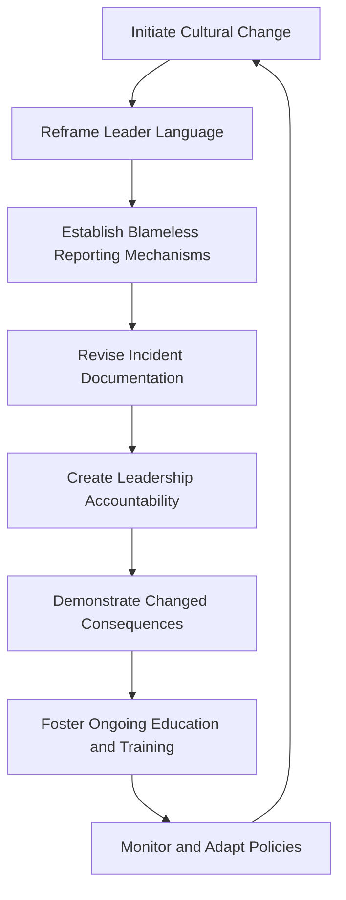

By following this structured approach, your organization can create a sustainable, blameless culture that prioritizes learning and resilience over fear and blame.

## Panel 2: The Safe Container - Creating Psychological Safety

### Scene Description

A different postmortem meeting for a similar incident. The room has a collaborative atmosphere with engineers gathered around a digital whiteboard. A facilitator stands beside a visualization showing system interactions rather than a linear timeline, fostering a shared understanding of the incident. People are actively engaged, with one engineer explaining what they observed during the incident while others ask curious questions. On a screen, the words "What happened?" and "How did the system behave?" are displayed prominently, encouraging a focus on system dynamics rather than individual fault. Sticky notes cover another wall, organized into clusters of "contributing factors" instead of "root causes." A manager is nodding supportively as a junior engineer explains a decision they made during the incident, signaling openness to learning.

Below is a text-based representation of the room setup to further illustrate the scene:

```
+-----------------------------------------------------+
|                                                     |
|   [ Digital Whiteboard ]                            |
|   (Visualization showing system interactions)       |
|                                                     |
|                                                     |
|   [ Screen ]                [ Sticky Notes Wall ]   |
|   "What happened?"          Contributing Factors:   |
|   "How did the system       - Cluster 1             |
|    behave?"                 - Cluster 2             |
|                             - Cluster 3             |
|                                                     |
|                                                     |
|   [ Facilitator ]    [ Engineers Engaged ]          |
|   - Asking questions, explaining observations       |
|                                                     |
|   [ Manager ]                                       |
|   - Nodding supportively toward junior engineer     |
|                                                     |
+-----------------------------------------------------+
```

This layout emphasizes the collaborative and supportive environment, with tools and roles clearly positioned to promote learning and transparency during the postmortem.

### Teaching Narrative

Psychological safety—the shared belief that team members won't be punished or humiliated for speaking up with ideas, questions, concerns, or mistakes—forms the foundation of a blameless culture. This concept, pioneered by Harvard researcher Amy Edmondson, has been identified by Google's Project Aristotle as the single most important factor in high-performing teams.

In the context of reliability engineering, psychological safety enables the transparent flow of information required to understand and improve complex systems. When engineers feel safe to share near-misses, unexpected behaviors, and their own mistakes without fear of retribution, the entire organization gains access to crucial data about system performance and failure modes that would otherwise remain hidden.

Creating psychological safety requires deliberate leadership actions. Leaders must model vulnerability by acknowledging their own mistakes, demonstrate curiosity rather than judgment when things go wrong, reward messengers rather than shooting them, and explicitly separate learning from evaluation. The language used in technical discussions transforms from "who screwed up" to "what happened in the system" and "what can we learn."

In banking environments where regulatory compliance and risk management are paramount, psychological safety might seem at odds with accountability. However, true accountability means creating systems where individuals can safely provide information that helps the organization learn and improve—not simply assigning blame after failures occur. Without psychological safety, banks operate with incomplete information about their operational risks, ironically increasing rather than decreasing their exposure to serious incidents.

### Common Example of the Problem

At a regional retail bank, the mobile banking authentication system experienced intermittent failures following a security upgrade. Users would occasionally receive incorrect "account locked" messages despite entering correct credentials. The operations team struggled to reproduce and resolve the issue for three weeks, with customer complaints steadily increasing.

During this period, a junior engineer named Michael had noticed unusual patterns in the authentication logs that might explain the behavior. However, his past experiences discouraged him from speaking up. In two previous incidents, his observations had been dismissed with comments like "let the senior architects handle the diagnosis" and "stick to your assigned tasks." In one meeting, he had even been told to "stop wasting everyone's time with theories" when he tried to share a potential connection he had observed.

As a result, Michael kept his observations to himself this time. When the root cause was finally discovered after 22 days of investigation, it matched exactly what Michael had noticed three weeks earlier. The organization lost three weeks of resolution time and damaged customer relationships because they had created an environment where a team member did not feel safe to share potentially valuable information.

#### Key Takeaways for Building Psychological Safety:

- **Encourage Contributions from All Levels**: Actively invite input from team members regardless of seniority. Valuable insights can come from anyone, including junior staff.
- **Respond with Curiosity, Not Judgment**: Avoid dismissive language or behaviors. Instead, ask open-ended questions to explore observations and ideas.
- **Acknowledge and Reward Information Sharing**: Publicly appreciate team members who surface unusual patterns, near-misses, or potential issues, even if they turn out unrelated.
- **Focus on System Behavior, Not Personal Blame**: Shift discussions from "who was responsible" to "what happened in the system" to foster collaborative problem-solving.
- **Model Vulnerability as a Leader**: Share your own mistakes and learning moments to demonstrate that it's safe to admit uncertainties or errors.

By integrating these practices, teams can avoid the costly consequences of suppressed insights and create a culture where everyone feels empowered to contribute to system reliability.

### SRE Best Practice: Evidence-Based Investigation

To build psychological safety, SRE teams implement evidence-based practices that create measurable improvements in information flow. The table below summarizes these practices, their goals, and example outcomes, providing a clear and actionable framework:

| **Practice** | **Goal** | **Example Outcome** |
| ----------------------------------- | ------------------------------------------------------------------------------------ | -------------------------------------------------------------------------------------- |
| **Psychological Safety Assessment** | Measure psychological safety levels across teams using validated surveys. | Identified that 70% of engineers feel comfortable sharing mistakes, up from 50%. |
| **Interaction Pattern Analysis** | Analyze team communication to ensure inclusivity and openness to diverse viewpoints. | Observed increased participation from junior engineers in incident reviews. |
| **Information Flow Mapping** | Identify bottlenecks and barriers in the flow of critical information. | Reduced average time for incident updates to reach stakeholders by 30%. |
| **Near-Miss Reporting Analysis** | Gather data on team members’ willingness to report potential issues anonymously. | Doubled the number of near-miss reports submitted within a quarter. |
| **Learning Lag Measurement** | Track delays between issue identification and escalation to decision-makers. | Decreased time from detection to decision by implementing clearer communication paths. |

By systematically applying these practices, SRE teams not only foster psychological safety but also improve operational reliability. For example, measuring learning lag can highlight systemic barriers that delay decision-making, while near-miss reporting analysis ensures critical insights into potential risks are captured early. These evidence-based approaches transform technical discussions into opportunities for collective learning and continuous improvement.

### Banking Impact

The absence of psychological safety creates significant business impacts for financial institutions. Below is a breakdown of key areas affected, along with a visualization to illustrate the comparative differences between low- and high-safety environments:

#### Key Impacts:

1. **Extended Problem Resolution**: Issues that could be quickly identified with full information sharing take 3-5x longer to resolve in psychologically unsafe environments, directly impacting customer experience and operational costs.

2. **Compliance Exposure**: In low-safety environments, 67% of potential compliance issues go unreported until they become severe, increasing regulatory risk and potential penalties.

3. **Innovation Deficit**: Banks with low psychological safety scores generate 41% fewer process improvement ideas and implement 58% fewer employee-suggested innovations than those with high safety scores.

4. **Increased Operational Risk**: Without psychological safety, approximately 70% of known operational risks go undocumented, creating invisible vulnerabilities in critical banking systems that eventually manifest as major incidents.

5. **Customer Impact**: The combination of slower issue resolution and hidden risks leads to customer-facing incidents lasting 2.3x longer on average, directly affecting customer satisfaction scores and increasing account closure rates by up to 8%.

#### Visualization:

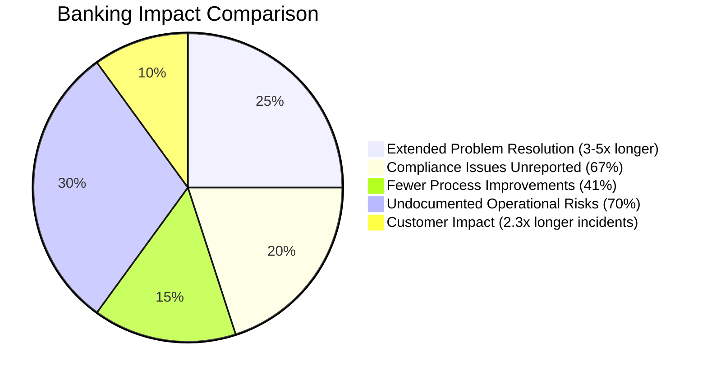

This visualization highlights the proportional weight of each impact area, emphasizing how the lack of psychological safety can cascade into broader organizational risks. By addressing these areas, financial institutions can significantly enhance both operational resilience and customer trust.

### Implementation Guidance

To build psychological safety in banking technology teams:

1. **Implement Leader Modeling**: Train and require leaders to regularly share their own mistakes and learning moments in team settings. Create structured opportunities such as "leadership learning moments" at the beginning of team meetings where managers share a recent error and what they learned from it.

2. **Establish Curiosity Norms**: Create and document explicit team norms that require responding to problems with curiosity instead of judgment. Develop a simple "response checklist" for issues that begins with questions like "What's interesting about this situation?" and "What might we learn here?" before any discussion of solutions or accountability.

3. **Create Idea Testing Frameworks**: Implement structured processes for testing ideas regardless of their source, such as "10-minute experiments" where any team member can propose a safe test of their theory during incident response. Document and socialize these frameworks to demonstrate that all perspectives are valued.

4. **Measure and Reward Information Sharing**: Develop metrics that track timely sharing of concerns, risks, and observations. Create recognition programs that publicly acknowledge team members who improve system understanding through their transparency, particularly when sharing potential problems or concerns.

5. **Separate Performance Evaluation From Learning**: Establish explicit policies that information shared during incident reviews, postmortems, and learning discussions cannot be used in performance evaluations. Document these policies formally and reference them at the beginning of every incident review to reinforce the separation.

## Panel 3: The Learning Mindset - Turning Incidents into Investments

### Scene Description

A large team room is set up to foster collaboration and learning, divided into distinct areas of activity. Engineers and business stakeholders are gathered around multiple digital displays that showcase key visualizations, including system architecture diagrams, incident timelines, and summarized learnings.

At the front of the room, a senior leader stands near a prominent board titled "Action Items and Investments." Tasks are being categorized into actionable items, with some marked for immediate implementation and others flagged for future investment.

On one side of the room, an engineer is actively demonstrating a new automated test that was developed in response to the incident, while another engineer highlights enhancements made to system monitoring. Near them, a product manager and an engineer are having a focused discussion about integrating reliability improvements into the upcoming sprint, mapping out specific changes on a shared whiteboard.

The layout and interactions can be represented as follows:

```
+----------------------------+----------------------------+
|                            |                            |
|   [Digital Display 1]      |   [Digital Display 2]      |
|   - System Architecture    |   - Incident Timeline      |
|                            |                            |
+----------------------------+----------------------------+
|                                                          |
|   [Board: Action Items and Investments]                 |
|   - Tasks Categorized: Immediate / Future Investments   |
|                                                          |
+----------------------------------------------------------+
|                                                          |
|   [Engineer 1]         [Senior Leader]         [Engineer 2] |
|   - Demonstrating      - Facilitating          - Enhanced   |
|     Auto-Tests                              Monitoring       |
+----------------------------------------------------------+
|                                                          |
|   [Product Manager]         [Engineer 3]                 |
|   - Sprint Planning          - Reliability Integration    |
|                                                          |
+----------------------------------------------------------+
```

The atmosphere is energetic and collaborative, resembling a hands-on workshop rather than a tribunal. Participants are actively engaged in discussions, problem-solving, and decision-making, transforming the incident review into a forward-looking exercise in organizational learning.

### Teaching Narrative

In traditional operational environments, incidents are viewed as failures to be avoided at all costs—unwelcome disruptions that reflect poorly on the organization and the individuals involved. This mindset treats reliability as a binary state: systems are either working or failing, with little nuance in between.

The SRE perspective fundamentally reframes incidents as valuable, if expensive, learning opportunities. When a system fails in an unexpected way, it reveals information about its behavior under stress that couldn't be predicted through analysis alone. This perspective shifts incidents from pure liabilities to be minimized into investments in organizational learning to be maximized.

This shift requires recognizing that perfect reliability is neither possible nor desirable in complex systems. The goal isn't to eliminate all failures but to create systems that fail in predictable, manageable ways and organizational cultures that extract maximum learning from each failure. In banking terms, this is similar to how loan defaults are not just losses to be avoided but sources of data that improve future lending decisions.

The learning mindset manifests in several key practices: detailed retrospectives focused on system improvement rather than blame assignment; sharing incident learnings broadly across teams; developing and testing hypotheses about system behavior; and allocating engineering time specifically for reliability improvements inspired by incidents. These practices transform the organizational response to failure from "how do we prevent this specific issue?" to "how do we become more resilient to entire classes of failure?"

Banking organizations that cultivate this learning mindset develop a competitive advantage through faster recovery from incidents, more resilient system design, and more effective allocation of engineering resources to reliability work that matters most to customer experience and business outcomes.

### Common Example of the Problem

A multinational bank's wealth management platform experienced an outage during end-of-quarter processing, preventing financial advisors from accessing client portfolio information for approximately four hours. The standard response followed a familiar pattern: an urgent all-hands response to restore service, a brief postmortem that identified a specific database query as the technical cause, and a targeted fix to optimize that particular query. Leadership considered the matter resolved, and teams returned to their regular work.

However, six months later, a nearly identical outage occurred, this time caused by a different query. A deeper investigation revealed the root cause: the database connection pooling configuration was unable to handle quarter-end reporting volumes. This systemic issue had gone unnoticed because the first postmortem narrowly focused on the immediate technical failure, missing the opportunity to analyze broader system behavior under load.

The timeline below illustrates how the organization’s approach overlooked a critical chance to improve system resilience:

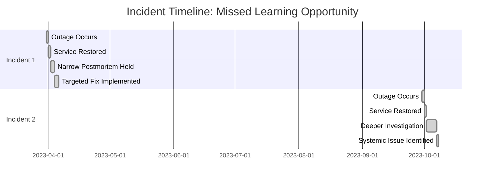

This reactive approach led to significant costs: two major outages that disrupted advisor productivity, harmed client satisfaction, and caused reputational damage in a competitive market where reliability is paramount. By failing to treat the first incident as a learning opportunity, the organization missed the chance to proactively address a systemic weakness and prevent future failures. This example underscores the importance of moving beyond narrow, incident-specific fixes to embrace a broader learning mindset focused on resilience and system-wide improvement.

### SRE Best Practice: Evidence-Based Investigation

To transform incidents into learning investments, SRE teams implement systematic investigation practices. Below is a checklist summarizing these practices to help teams apply them effectively:

| Practice | Description | Key Questions to Ask |
| --------------------------------------- | ---------------------------------------------------------------------------------------------------- | ---------------------------------------------------------------------------------------------------------------------------------- |
| **Learning-to-Cost Ratio Analysis** | Measure and optimize the balance between incident costs and the learning value extracted. | - What was the total cost of this incident (downtime, effort, impact)?<br>- What systemic insights or improvements were gained? |
| **Broader Pattern Recognition** | Identify recurring patterns across incidents to uncover deeper systemic issues. | - Are there similarities between this incident and past ones?<br>- What patterns or behaviors are emerging? |
| **Counterfactual Scenario Exploration** | Explore alternative scenarios to expand learning beyond what actually happened. | - What might have changed the outcome?<br>- How could different decisions or configurations have prevented this? |
| **Multi-Level Incident Classification** | Create taxonomies that capture technical, detection, response, and recovery dimensions. | - How can this incident be categorized across multiple dimensions?<br>- What insights do these classifications reveal? |
| **Improvement Effectiveness Tracking** | Track whether post-incident improvements prevent similar issues and validate learning effectiveness. | - Have implemented fixes reduced the likelihood or impact of recurrence?<br>- What metrics show the effectiveness of improvements? |

Use this checklist during incident reviews and retrospectives to ensure a structured, evidence-based approach to investigation and learning.

### Banking Impact

Failing to maximize learning from incidents creates significant business impacts for financial institutions. Below is a summary of key impacts and their relative scale, visualized to highlight the importance of adopting a learning-focused approach:

#### Key Impacts from Lack of Incident Learning

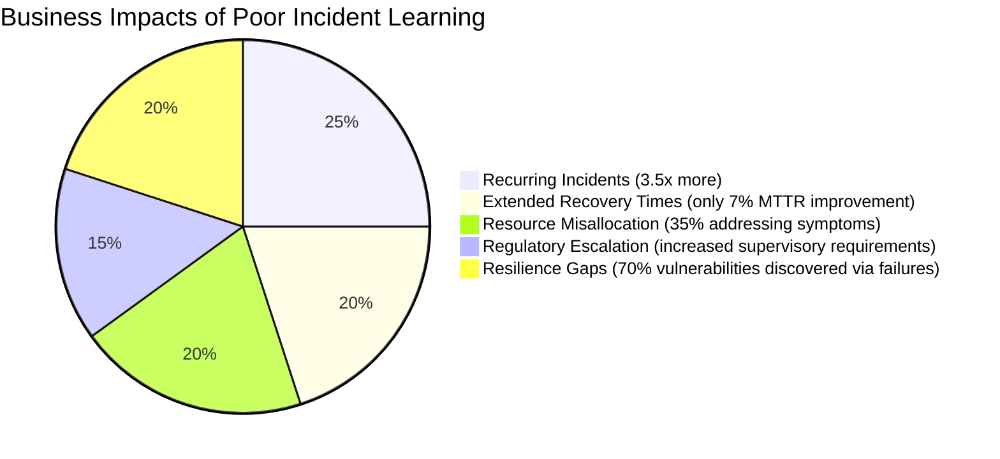

1. **Recurring Incidents**: Banks that don't implement a learning-focused approach experience 3.5x more repeat incidents of similar types, directly impacting customer satisfaction and operational costs.

2. **Extended Recovery Times**: Without systematic learning, the mean time to resolve similar incidents improves very little over time, with data showing only 7% improvement in resolution time versus 43% improvement in organizations with strong learning practices.

3. **Resource Misallocation**: Without deep incident learning, approximately 35% of reliability improvement investments address symptoms rather than underlying causes, resulting in poor return on technology investment.

4. **Regulatory Escalation**: Financial regulators increasingly request evidence of "safety learnings" after major incidents, with institutions unable to demonstrate robust learning practices facing enhanced supervisory requirements and potential penalties.

5. **Resilience Gaps**: Banks without effective incident learning practices typically discover 70% of their system vulnerabilities through customer-impacting failures rather than proactive identification, significantly increasing business impact.

### Implementation Guidance

To transform incidents into learning investments in a banking environment, follow this structured process:

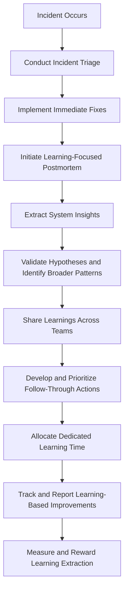

1. **Conduct Incident Triage and Implement Immediate Fixes**: Quickly stabilize the system and document high-level details of the incident to ensure immediate operational continuity.

2. **Initiate Learning-Focused Postmortem**: Redesign incident review templates to emphasize learning over blame. Include sections for "system insights gained," "hypotheses to explore," and "future scenarios prepared for." Minimize focus on technical fault identification alone.

3. **Extract System Insights**: Analyze the incident to uncover deeper systemic issues or patterns. Use this opportunity to challenge assumptions about system behavior and identify areas for improvement.

4. **Validate Hypotheses and Identify Broader Patterns**: Develop and test hypotheses about the system's behavior under stress. Look for recurring themes or patterns that may apply to other parts of the system.

5. **Share Learnings Across Teams**: Create structured mechanisms for disseminating incident learnings, such as monthly "incident learning reviews" where teams present key insights to a broader audience. Emphasize systemic patterns and cross-functional implications.

6. **Develop and Prioritize Follow-Through Actions**: Separate immediate fixes from long-term learning-based improvements. Use a tracking system to ensure follow-through on identified actions, with clear ownership and accountability.

7. **Allocate Dedicated Learning Time**: Formalize policies that ensure teams spend significant time analyzing and learning from incidents. For example, enforce a minimum 3:1 ratio between learning activities and immediate remediation work. Schedule dedicated learning workshops to focus on broader insights.

8. **Track and Report Learning-Based Improvements**: Implement tracking systems for learning-driven action items. Provide regular updates to leadership and ensure visibility of progress on these items.

9. **Measure and Reward Learning Extraction**: Develop metrics to evaluate the quality and impact of learnings extracted from incidents, such as "number of systemic improvements implemented" or "novel insights identified." Establish recognition programs to reward teams and individuals who excel in extracting and applying learnings.

By following this process, organizations can transform operational disruptions into strategic opportunities for growth, fostering a culture of resilience and continuous improvement.

## Panel 4: The Facilitated Retrospective - Structuring the Learning Process

### Scene Description

A structured postmortem session is in progress, with a clearly designated facilitator standing at a digital board. The digital board displays a template divided into several key sections:

- **Timeline:** A collaborative reconstruction of system events, human actions, and communication points.
- **Contributing Factors:** A space to list and analyze factors that influenced the incident without oversimplifying to single root causes.
- **Action Items:** A dedicated area for actionable follow-ups with clear ownership.
- **What We Still Don't Know:** A section to track unresolved questions and areas requiring further investigation.

The flow of activities during the retrospective can be visualized as follows:

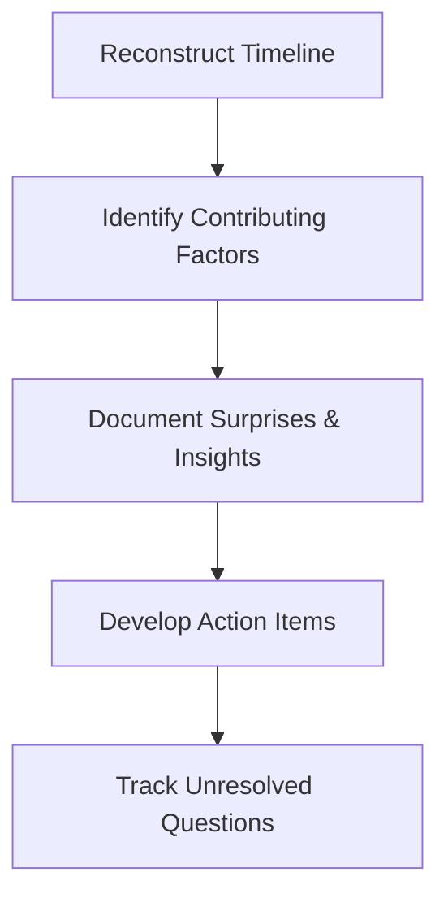

Team members actively contribute to the timeline, using different colored virtual sticky notes to represent diverse perspectives—such as operational, engineering, and customer-impact views. The facilitator ensures psychological safety, guiding the discussion toward systems thinking and away from blame. Meanwhile, a technical leader documents surprising aspects of the system's behavior that emerge during the analysis.

The atmosphere is focused and workshop-like, fostering collaboration and constructive dialogue as the team works together to uncover insights and actionable improvements.

### Teaching Narrative

Effective learning from incidents doesn't happen automatically—it requires structured processes that guide teams past human cognitive biases and organizational defense mechanisms. Facilitated retrospectives (also called postmortems, incident reviews, or learning reviews) provide this structure, transforming what could be contentious blame sessions into collaborative learning experiences.

The facilitator role is critical to this process. A skilled facilitator—someone who is not directly involved in the incident response—maintains psychological safety, ensures diverse perspectives are heard, guides the discussion toward systems thinking rather than blame, and helps the team discover patterns and insights they might otherwise miss. The facilitator acts as a guardian of the learning process, stepping in when discussion drifts toward blame or simplistic explanations.

Effective retrospectives follow a consistent structure while allowing flexibility for discovery. They typically include: reconstructing the incident timeline from multiple perspectives; identifying what went well and what could be improved; analyzing contributing factors rather than seeking single root causes; documenting surprises and unexpected system behaviors; and developing specific, actionable follow-up items with clear ownership.

For banking organizations, structured retrospectives serve both operational and regulatory purposes. Beyond improving system reliability, they create documented evidence of the organization's commitment to learning from incidents—documentation that can prove valuable during regulatory reviews. The retrospective process also helps identify potential compliance issues that might otherwise remain hidden, allowing them to be addressed proactively.

### Common Example of the Problem

A mid-sized commercial bank implemented a new treasury management platform to serve its business clients. Two weeks after launch, the platform experienced a significant disruption during high-volume hours, preventing clients from initiating wire transfers for approximately 90 minutes. After service was restored, the CTO called an urgent postmortem meeting.

The meeting quickly descended into chaos: the development vendor blamed the bank's infrastructure, internal teams pointed fingers at each other's components, and the project manager focused on defending the testing process. Senior executives grew increasingly frustrated as the discussion circled without producing clear insights or action items. After three hours, the meeting ended with a vague agreement to "improve testing" and "monitor the system more closely"—generic actions that failed to address the specific failure modes.

Six weeks later, a nearly identical outage occurred. In reviewing documentation from the first incident, the team discovered they had never identified the actual contributing factors due to the disorganized nature of their first retrospective. They had lost a critical opportunity to prevent a recurrence that damaged both client relationships and internal credibility.

#### Key Mistakes to Avoid: A Checklist

- **Lack of Facilitation**: No neutral facilitator was present to guide the discussion, resulting in unproductive blame-shifting and defensiveness.
- **Absence of a Structured Process**: The meeting lacked a clear framework to reconstruct the timeline, analyze contributing factors, or document action items.
- **Failure to Ensure Psychological Safety**: Team members were focused on defending their roles rather than collaborating to uncover insights.
- **Overlooking Systems Thinking**: Discussions were dominated by finger-pointing instead of exploring systemic interactions and underlying issues.
- **Vague Action Items**: The agreed-upon follow-ups were generic and lacked specificity, ownership, or measurable outcomes.
- **No Incident Follow-Up**: The team failed to revisit the action items or validate their effectiveness, missing the opportunity to prevent future incidents.

By avoiding these common pitfalls, teams can ensure their retrospectives lead to meaningful learning and improvements rather than recurring failures.

### SRE Best Practice: Evidence-Based Investigation

To implement effective facilitated retrospectives, SRE teams establish structured investigation approaches. The following table summarizes key best practices, their purpose, and the expected outcomes:

| **Best Practice** | **Purpose** | **Expected Outcomes** |
| --------------------------------------- | -------------------------------------------------------------------------------------------------------------------------------------- | ---------------------------------------------------------------------------------------------------------------- |
| **Cognitive Bias Identification** | Train facilitators to recognize and mitigate cognitive biases such as hindsight bias, fundamental attribution error, and recency bias. | More objective investigations that uncover root causes without being influenced by bias. |
| **Multi-Perspective Timeline Analysis** | Reconstruct incident timelines using multiple data sources to capture diverse perspectives on system events and human actions. | Composite views of incidents revealing how different parts of the system and organization experienced the event. |
| **Surprise-Driven Investigation** | Focus on identifying and analyzing surprising aspects of the incident that contradict team mental models. | Insights into gaps in understanding and system behavior that drive deeper learning opportunities. |
| **Counterfactual Success Analysis** | Examine why certain recovery attempts succeeded while others failed, rather than solely focusing on problems. | Identification of effective intervention strategies and techniques for future incidents. |
| **Action Effectiveness Prediction** | Apply structured prediction techniques to evaluate how well proposed actions could prevent or mitigate similar incidents. | More targeted and impactful improvement actions with a higher likelihood of reducing future risk. |

This structured approach ensures retrospectives are grounded in evidence, uncovering actionable insights that improve system reliability and team learning.

### Banking Impact

The absence of structured retrospectives creates significant business impacts for financial institutions. The following key metrics highlight the consequences:

| **Impact Area** | **Metric** | **Comparison** |
| -------------------------------- | ---------------------------------------------- | --------------------------------------- |
| Ineffective Remediation | 65% of actions fail to address systemic issues | 3.2x higher incident recurrence rate |
| Extended Meetings, Poor Outcomes | Meetings are 2.5x longer | 60% fewer actionable insights |
| Damaged Team Cohesion | 47% decrease in cross-team collaboration | Blame culture frequently observed |
| Missed Regulatory Insights | Only 30% of compliance issues identified | Increased exposure to regulatory action |
| Knowledge Siloing | 15% of insights shared across teams | Critical information remains isolated |

#### Visual Summary of Key Metrics

```mermaid
barChart
    title Banking Impact Metrics
    axisLabels ["Ineffective Remediation", "Extended Meetings", "Damaged Cohesion", "Missed Insights", "Knowledge Siloing"]
    series BankMetrics
    BankMetrics [3.2, 2.5, 47, 30, 15]
```

Structured retrospectives address these challenges by enabling root cause identification, fostering collaboration, and ensuring regulatory compliance, all while improving operational reliability. The metrics clearly demonstrate the tangible benefits of facilitated learning processes within banking organizations.

### Implementation Guidance

To implement effective facilitated retrospectives in a banking environment, follow these steps:

#### Checklist for Implementation

1. **Develop a Facilitator Corps**:

   - Identify and train dedicated incident review facilitators who are not directly responsible for the systems involved in incidents.
   - Provide training in:
     - Cognitive bias identification.
     - Group dynamics management.
     - Systems thinking frameworks.
   - Establish a formal certification process to ensure consistency in facilitation quality.

2. **Implement Standard Retrospective Templates**:

   - Design structured templates for significant incident reviews, including sections for:
     - Timeline reconstruction.
     - Multiple perspectives.
     - System behavior observations.
     - Contributing factors.
     - Action items.
   - Ensure templates:
     - Avoid blame language.
     - Avoid single root cause framing.
   - Mandate their use across all retrospectives.

3. **Establish Pre-Retrospective Preparation Protocols**:

   - Develop procedures to gather and organize data before retrospective meetings:
     - System logs.
     - Communication records.
     - Independent perspective statements from stakeholders.
   - Require preparation materials to be completed and distributed 24–48 hours before the meeting.

4. **Create Psychological Safety Mechanisms**:

   - Use specific protocols to protect psychological safety:
     - Start with explicit ground rules.
     - Enable anonymous contribution mechanisms for sensitive observations.
     - Grant facilitators authority to intervene when discussions drift toward blame.
   - Document these mechanisms in a retrospective playbook.

5. **Develop Follow-Through Systems**:

   - Create tracking systems for post-retrospective action items:
     - Separate them from regular work.
     - Highlight their connection to specific incidents and learnings.
   - Implement regular review cycles to:
     - Assess action item completion.
     - Evaluate the effectiveness of implemented changes before closing items.

#### Additional Notes

- Consistently review and iterate on the retrospective process to incorporate feedback from facilitators and participants.
- Align retrospective practices with regulatory and compliance requirements to ensure the process supports broader organizational objectives.

## Panel 5: The Systems Perspective - Beyond Human Error

### Scene Description

An engineering team is gathered around a display of a complex system visualization. The visualization illustrates multiple intersecting components, dependencies, and failure pathways. Instead of focusing on a single component or person, the team is collaboratively examining how different parts of the system interact.

- One engineer is tracing the path of a failed transaction through various interconnected services, identifying where it broke down.
- Another engineer is mapping out how defensive measures failed to intercept the issue, highlighting gaps in safeguards.
- A third engineer is demonstrating how monitoring systems showed green status (indicating normal operation) while customers were actively encountering errors.

On a nearby screen, a "Swiss cheese model" of accident causation has been diagrammed, visually aligning multiple "holes" in the system's layers of defense that allowed the failure to propagate. Post-it notes are scattered across the screens and whiteboards, each identifying contributing factors that emphasize systemic interactions rather than individual mistakes.

Below is a simplified representation of the scene:

```
+----------------+        +----------------+        +----------------+
| Service A      | -----> | Service B      | -----> | Service C      |
| (Transaction   |        | (Dependency    |        | (Failure Point |
| Entry Point)   |        | Interaction)  |        | Identified)    |
+----------------+        +----------------+        +----------------+
        |                                                       
        v                                                       
+----------------+                                            
| Monitoring     |                                            
| System         |                                            
| (Green Status) |                                            
+----------------+                                            

Swiss Cheese Model:
[Layer 1] -----> [Layer 2] -----> [Layer 3] -----> [System Failure]
[Defense]         [Defense]         [Defense]       
[Hole]            [Hole]            [Hole]          
```

This visualization underscores the interconnected nature of modern systems and the necessity of analyzing systemic interactions, rather than isolating blame to individual components or operators.

### Teaching Narrative

At the heart of blameless culture lies a fundamental shift in perspective: from viewing failures as the result of human error to understanding them as emergent properties of complex systems. This systems thinking approach recognizes that in modern technological environments, especially in banking systems with hundreds of interconnected components, incidents rarely have single, linear causes attributable to individual actions.

The systems perspective acknowledges that humans are components within larger sociotechnical systems that include technology, processes, organizational structures, and external pressures. When incidents occur, asking "who made a mistake?" provides far less insight than asking "what aspects of the system made this mistake more likely or failed to catch it?" This reframing directs attention to the context in which people operate rather than the individuals themselves.

This perspective draws from decades of research in safety science across high-risk industries like aviation, healthcare, and nuclear power. Key concepts include:

1. **Local Rationality**: People make decisions that make sense to them given their goals, understanding, and focus of attention at the time—even if those decisions look flawed in hindsight.

2. **Drift into Failure**: Systems gradually adapt to production pressures, normalizing deviance until conditions for failure are present without anyone noticing the increasing risk.

3. **Constraints and Trade-offs**: Operators constantly navigate competing goals like speed vs. thoroughness and cost vs. safety, making reasonable trade-offs that may contribute to incidents.

4. **Defense in Depth**: Multiple safeguards should exist so that no single point of failure can cause catastrophic outcomes.

In banking environments, adopting this systems perspective doesn't mean abandoning accountability—it means recognizing that meaningful accountability looks beyond individual blame to address the systemic conditions that shaped behavior and allowed errors to cause significant impacts.

### Common Example of the Problem

A large investment bank experienced a significant trading platform outage when a developer, Thomas, pushed a seemingly routine configuration change to production. The change contained an error in a critical parameter that caused the trading engine to gradually consume all available memory over several hours, eventually crashing the system during peak trading.

Initial response focused entirely on Thomas's mistake: why hadn't he caught the error? Why hadn't he followed testing protocols? Thomas was formally reprimanded, additional approval steps were added to the deployment process, and leadership considered the matter resolved.

Six months later, a nearly identical incident occurred with a different developer and parameter. Deeper investigation finally revealed multiple systemic issues that had been overlooked:

#### Checklist of Systemic Issues

- **Overly Complex Configuration**: The configuration format was unnecessarily complex, with similar parameters having dramatically different naming conventions and units.
- **Inadequate Testing Environment**: Testing environments failed to simulate critical production behaviors, such as memory consumption patterns under real-world loads.
- **Insufficient Monitoring**: Monitoring systems lacked alerts for gradual memory growth, focusing only on immediate spikes.
- **Risky Deployment Timing**: Routine changes were deployed at times (like late afternoon) when issues would surface during off-hours with reduced staffing.
- **Normalization of Deviance**: Similar issues had occurred before but were manually resolved without deeper investigation, leading to a false sense of safety.

By focusing solely on Thomas's "error," the organization missed the opportunity to address these systemic vulnerabilities. This approach virtually guaranteed that similar incidents would recur, independent of which individual was involved.

#### Systemic Flow Representation

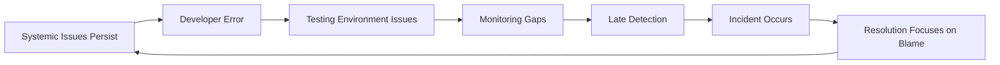

This example highlights the importance of shifting focus from individual blame to understanding how systemic conditions contribute to failures. Only by addressing these broader issues can organizations reduce the likelihood of recurrence and build more resilient systems.

### SRE Best Practice: Evidence-Based Investigation

To implement a systems perspective, SRE teams establish structured analysis approaches. The following table summarizes key practices, their purpose, and example use cases to improve clarity and practical application:

| **Practice** | **Purpose** | **Example Use Case** |
| ---------------------------------------------- | ------------------------------------------------------------------------------------------------------------------------------------------------------------------------ | --------------------------------------------------------------------------------------------------------------- |
| **Work-as-Done vs. Work-as-Imagined Analysis** | Identify gaps between documented procedures (work-as-imagined) and actual operational practices (work-as-done), revealing adaptation pressures and systemic constraints. | Comparing incident response runbooks to real on-call practices to uncover undocumented shortcuts or deviations. |
| **Safety Boundary Mapping** | Visualize how systems operate near safety thresholds by analyzing near-misses and incidents, identifying pressure points where small variations could lead to failure. | Mapping database transaction latencies during peak loads to highlight thresholds where query failures increase. |
| **Decision Context Reconstruction** | Recreate the information environment in which decisions were made during incidents, revealing how actions made sense at the time despite hindsight bias. | Conducting post-incident interviews with responders to understand why a rollback decision was delayed. |
| **Defense Analysis** | Map intended defensive measures (e.g., validations, reviews, tests) against their actual effectiveness, identifying patterns of failure or bypass mechanisms. | Reviewing failed CI/CD pipeline checks to uncover how invalid configurations bypassed automated tests. |
| **Comparative Incident Analysis** | Identify systemic patterns across multiple incidents, demonstrating that failures are structural rather than personal. | Analyzing recurring outages caused by misconfigured feature flags across different teams and services. |

By integrating these practices into incident analysis workflows, SRE teams can uncover systemic conditions, prioritize actionable insights, and drive improvements that enhance system resilience beyond individual accountability.

### Banking Impact

Failing to adopt a systems perspective creates significant business impacts for financial institutions. The following quantified effects illustrate the critical need for adopting systems thinking:

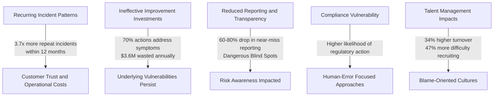

1. **Recurring Incident Patterns**: Banks that focus on human error rather than systemic factors experience 3.7x more repeat incidents of similar types within 12 months, directly impacting customer trust and operational costs.

2. **Ineffective Improvement Investments**: Without systems thinking, approximately 70% of post-incident actions address symptoms or add bureaucratic layers rather than resolving underlying vulnerabilities, wasting an estimated $3.6M annually in large financial institutions.

3. **Reduced Reporting and Transparency**: When individuals are blamed for incidents, reporting of near-misses and potential issues drops by 60-80%, creating dangerous blind spots in risk awareness.

4. **Compliance Vulnerability**: Regulators increasingly evaluate whether banks have systemic approaches to incident analysis, with institutions using human-error-focused approaches facing a higher likelihood of regulatory action after major incidents.

5. **Talent Management Impacts**: Financial institutions with blame-oriented cultures experience 34% higher turnover among technical specialists and 47% more difficulty recruiting experienced engineers compared to those with mature systems thinking approaches.

### Implementation Guidance

To implement a systems perspective in a banking environment, follow these structured steps:

#### Checklist for Implementation

1. **Develop Systems Thinking Training**

   - Create mandatory training for all technical leaders and incident investigators.
   - Cover key concepts such as local rationality, safety drift, and emergent properties.
   - Include practical exercises using sanitized versions of actual bank incidents to demonstrate systems analysis techniques.

2. **Implement Human Factors Review Process**

   - Establish a structured Human Factors Analysis process for all significant incidents.
   - Use standard templates to examine system conditions, pressures, constraints, and environmental factors that influenced decisions.

3. **Create Defense Visualization Tools**

   - Develop tools to visualize the multiple layers of defense in critical systems.
   - Use these tools to map how defenses failed during incidents, emphasizing systemic weaknesses over individual errors.

4. **Establish Leading Indicators Program**

   - Monitor systemic leading indicators like normalization of deviance or defensive control bypasses.
   - Create regular review processes to address these indicators before they escalate into major incidents.

5. **Revise Accountability Framework**

   - Shift accountability from blaming individuals to improving systemic conditions.
   - Document and train leaders on a framework that emphasizes learning and system-wide improvement over punitive measures.

#### Visual Representation: Defense in Depth Failure Mapping

To support systems analysis during incident reviews, consider the following conceptual flow:

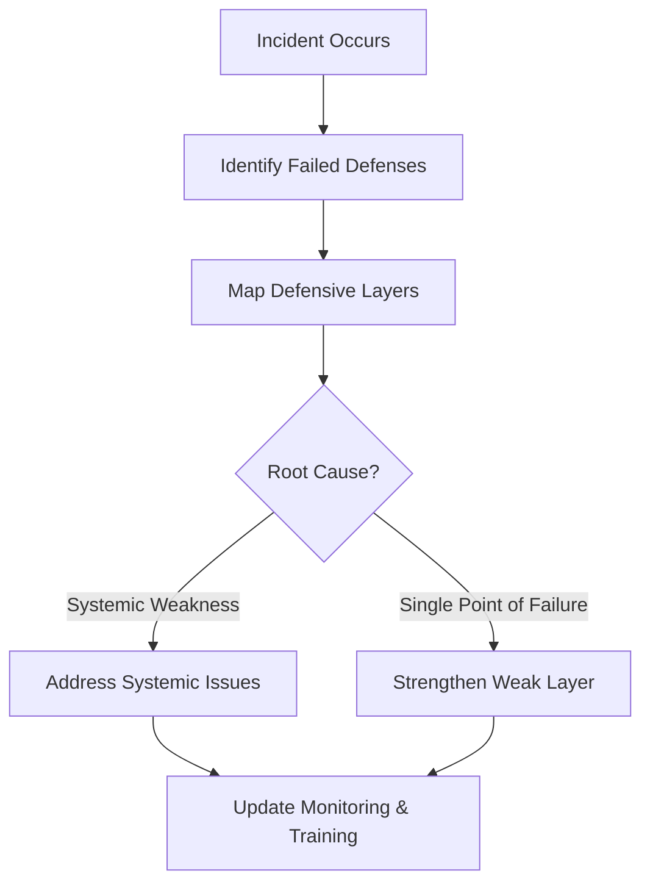

This process ensures a clear focus on systemic improvements, reinforcing the systems perspective at every step.

## Panel 6: The Just Culture - Balancing Accountability and Learning

### Scene Description

A leadership team is reviewing an incident where an engineer deployed code without following established procedures, resulting in a service outage. Instead of an immediate disciplinary response, they're using a decision tree diagram labeled "Just Culture Algorithm" to analyze the situation.

The decision tree outlines three key branches, each guiding a different organizational response:

- **Human Error**: Mistakes or slips without intent to deviate.
  - Response: Console the individual and identify system factors.
- **At-Risk Behavior**: Intentional deviation from procedures with perceived justification.
  - Response: Coach the individual and address systemic drivers of the behavior.
- **Reckless Behavior**: Conscious disregard for a substantial and unjustifiable risk.
  - Response: Consider disciplinary action and system improvements.

Below is a simplified representation of the decision tree under review:

```
          Start
            |
      Did they intend
        the action?
         /     \
      Yes       No
       |         |
  Was the risk   Human Error
  substantial?   -> Console + System Fix
       |
      Yes
       |
Was it justifiable?
     /     \
   Yes       No
    |         |
At-Risk   Reckless
Behavior  Behavior
-> Coach  -> Discipline
+ System   + System
Fix        Fix
```

Notes on the whiteboard show the team is also considering system factors contributing to the procedural violation, such as deadline pressure, unclear documentation, and conflicting priorities. A HR representative and a senior technical leader are collaboratively determining the appropriate response, balancing accountability with learning opportunities. In the background, the team is reviewing the deployment process itself to understand why the safeguards failed.

### Teaching Narrative

Building a blameless culture doesn't mean eliminating accountability—it means redefining accountability to focus on learning and improvement rather than punishment. The Just Culture framework, developed in healthcare and aviation, provides a balanced approach that acknowledges both individual responsibility and system factors in failures.

Just Culture distinguishes between different types of actions that might contribute to incidents:

1. **Human Error**: Inadvertent actions, slips, or mistakes where the person didn't intend to deviate from expected behavior. The appropriate response is to console the individual and examine the system factors that made the error possible or failed to catch it.

2. **At-Risk Behavior**: Choosing to deviate from safe practices, often with good intentions like meeting deadlines or working around system limitations. The response is to coach the individual while addressing the system conditions that incentivized the risk-taking.

3. **Reckless Behavior**: Conscious disregard for substantial and unjustifiable risk. These rare cases may warrant disciplinary action alongside system improvements.

This framework helps organizations move beyond both a blame culture (where individuals are scapegoated for system failures) and a blanket "no-blame" approach (which can seem to excuse all behavior regardless of intent). Instead, Just Culture creates accountability by:

- Establishing clear expectations for responsible behavior
- Creating an environment where people can report errors and concerns
- Focusing on learning from mistakes rather than punishing them
- Addressing system issues that contribute to human error
- Reserving disciplinary responses for truly reckless behavior

For banking institutions with strict regulatory requirements, Just Culture provides a structured way to demonstrate accountability while still maintaining the psychological safety needed for continuous improvement. Rather than undermining compliance, this approach strengthens it by bringing potential issues to light earlier and addressing systemic weaknesses before they lead to major incidents.

### Common Example of the Problem

At a global banking institution, an experienced engineer named Sarah circumvented the standard change approval process to implement an urgent fix to a fraud detection algorithm. She had identified a pattern being used by fraudsters to bypass verification checks, and with several large transactions pending, she felt immediate action was necessary. However, her change contained an unintended side effect that caused legitimate transactions to be erroneously flagged as suspicious for approximately 4 hours.

The organization's response fell into two camps: operations leadership wanted Sarah terminated for violating change control procedures, while the security team considered her a hero for addressing the fraud vulnerability. This inconsistent approach created confusion about organizational values and expectations. Some team members concluded that outcomes were what mattered (not process), while others believed process adherence was paramount regardless of intent.

The lack of a Just Culture framework led to inconsistent handling of the incident, with the final decision seemingly arbitrary rather than principled. This created unpredictability about how future actions would be judged, leading to both excessive risk aversion in some areas and reckless corner-cutting in others as teams tried to navigate unclear expectations.

#### Key Takeaways Checklist

- **Consistency Matters**: Ensure organizational responses to incidents are aligned with a clear framework to avoid confusion about values and expectations.
- **Implement a Structured Framework**: Use tools like the Just Culture Algorithm to distinguish between human error, at-risk behavior, and reckless behavior.
- **Focus on Intent and Systemic Factors**: Evaluate both the intent behind actions and the system conditions that may have contributed to the incident.
- **Avoid Arbitrary Decisions**: Make principled, transparent decisions to build trust and predictability about how similar situations will be handled in the future.
- **Balance Accountability and Learning**: Hold individuals accountable while addressing system weaknesses to enable improvement without fostering fear.

### SRE Best Practice: Evidence-Based Investigation

To implement Just Culture, SRE teams establish structured analysis and decision-making frameworks. These practices facilitate fair accountability by distinguishing between behavior types, assessing systemic pressures, and ensuring consistency in responses. The table below summarizes the five core practices:

| **Practice** | **Purpose** | **Example Application** |
| -------------------------------------------- | ------------------------------------------------------------------------- | ------------------------------------------------------------------------------------------------------------ |
| **Behavioral Choice Analysis** | Distinguish between human error, at-risk behavior, and reckless behavior. | Conducting structured interviews to determine whether an engineer's actions were inadvertent or intentional. |
| **Risk Visibility Assessment** | Evaluate which risks were apparent at the time decisions were made. | Comparing an engineer’s understanding of deployment risks pre-incident versus hindsight analysis. |
| **Incentive and Pressure Mapping** | Identify systemic pressures that may incentivize at-risk behaviors. | Analyzing deadline pressure and reward systems that push teams to bypass safeguards. |
| **Historical Response Consistency Analysis** | Ensure consistent accountability by comparing responses across incidents. | Reviewing past incident responses to ensure similar behaviors are addressed uniformly. |
| **System Improvement Tracking** | Measure the effectiveness of systemic changes post-incident. | Tracking how updated deployment processes reduce recurrence of similar errors. |

By integrating these practices, SRE teams align with Just Culture principles, fostering an environment where systemic factors are addressed, individual accountability is fair, and learning is prioritized.

### Banking Impact

The absence of a Just Culture framework creates significant business impacts for financial institutions. These impacts can be categorized into five critical areas:

#### Key Impacts and Data Representation

```
graph TD
    A[Banking Impact Areas] --> B[Inconsistent Risk Management]
    A --> C[Compliance Vulnerability]
    A --> D[Talent Management Challenges]
    A --> E[Reduced Innovation]
    A --> F[Delayed Problem Resolution]

    D --> G[42% Higher Turnover Among High Performers]
    E --> H[35% Lower Willingness to Innovate]
    F --> I[2.8x Longer to Resolve Issues]
```

1. **Inconsistent Risk Management**:\
   Without a clear distinction between error, at-risk behavior, and reckless action, banks experience widely varying risk-taking behaviors across teams. This leads to unpredictable operational risk profiles and uneven management of critical exposures.

2. **Compliance Vulnerability**:\
   Regulators increasingly evaluate organizational culture as part of risk assessments. Inconsistent approaches to accountability raise red flags about control effectiveness and may signal potential concealment of issues.

3. **Talent Management Challenges**:\
   Banks lacking clear accountability frameworks report **42% higher turnover** among high-performing technical staff. These employees cite uncertainty about how mistakes will be handled as a key factor in their decision to leave.

4. **Reduced Innovation**:\
   Organizations without Just Culture report **35% lower willingness** among teams to propose process improvements or technical innovations. Fear of how failures might be judged stifles creativity and directly impacts competitive capability.

5. **Delayed Problem Resolution**:\
   Without frameworks that distinguish errors from violations, banks take **2.8 times longer** to resolve recurring operational issues. This is often due to excessive resource allocation towards process controls rather than system-level improvements.

#### Summary of Business Impacts

Below is a text-based summary highlighting the comparative metrics:

| Impact Area | Metric/Outcome |
| ---------------------------- | ----------------------------------------- |
| Talent Management Challenges | 42% higher turnover among high performers |
| Reduced Innovation | 35% lower willingness to innovate |
| Delayed Problem Resolution | 2.8x longer issue resolution times |

By adopting a Just Culture framework, financial institutions can mitigate these impacts by fostering a balanced approach to accountability and learning, improving both operational resilience and employee engagement.

### Implementation Guidance

To successfully implement Just Culture in a banking environment, follow these five key steps. Use the checklist below to ensure comprehensive and consistent application:

#### Checklist for Implementing Just Culture:

- [ ] **Develop a Decision Algorithm**:

  - Create and document a clear decision tree for responding to actions contributing to incidents.
  - Explicitly distinguish between human error, at-risk behavior, and reckless behavior using specific criteria for each.
  - Ensure the framework is reviewed and approved by technical leadership and legal/HR departments.

- [ ] **Train Response Teams**:

  - Conduct mandatory training for all leaders responsible for accountability decisions post-incident.
  - Teach consistent application of the Just Culture framework with practical, case-based exercises.
  - Use sanitized real-world examples to build decision-making skills.

- [ ] **Integrate with Incident Review Process**:

  - Update incident review templates to include a dedicated Just Culture analysis section.
  - Categorize contributing actions explicitly in this section and document the rationale behind these classifications.

- [ ] **Create Systemic Response Requirements**:

  - Define policies ensuring all incidents involving human error or at-risk behavior lead to system improvements, not just individual coaching or consoling.
  - Track the implementation of these systemic improvements to completion.

- [ ] **Implement Consistency Reviews**:

  - Establish a quarterly review process with a cross-functional panel to evaluate the application of the Just Culture framework.
  - Identify inconsistencies in its use and refine application guidance for fair and predictable outcomes.

By following this checklist, organizations can embed Just Culture into their workflows, ensuring a balanced approach to accountability that emphasizes learning and system improvement while maintaining compliance with regulatory requirements.

## Panel 7: The Continuous Improvement Loop - From Insights to System Change

### Scene Description

A visualization of how incident learnings flow through the organization and transform into system improvements. On one wall, insights from recent retrospectives are categorized and prioritized. Engineers are mapping these insights to specific architecture changes, monitoring improvements, and process adjustments. A product manager and engineering lead are updating their roadmap to incorporate reliability work alongside feature development. In another area, a team is conducting a game day exercise simulating conditions from a previous incident to verify their improvements. Management is reviewing reliability metrics that show the impact of recent changes. The entire scene shows the journey from incident to insight to implementation to verification—a complete learning loop.

Below is a simplified flow diagram illustrating the continuous improvement loop:

```mermaid
graph TD
    A[Incident Occurs] --> B[Retrospective Analysis]
    B --> C[Insights Captured & Categorized]
    C --> D[Prioritized for Action]
    D --> E[Work Integrated into Development Cycles]
    E --> F[System Improvements Implemented]
    F --> G[Verification Activities (e.g., Game Days, Chaos Engineering)]
    G --> H[Metrics Reviewed by Management]
    H --> I[Feedback into Future Planning]
    I --> C
```

This diagram visually represents the flow of activities, emphasizing how each step connects back into the loop, ensuring continuous learning and improvement.

### Teaching Narrative

The ultimate test of a blameless culture isn't how it feels during retrospectives—it's whether the organization systematically transforms insights from incidents into meaningful system improvements. Without this final step, even the most psychologically safe postmortems become performative exercises that fail to increase reliability over time.

Creating a continuous improvement loop requires deliberately connecting incident learnings to the organization's planning, development, and operational processes. This connection ensures that insights about system weaknesses don't just become interesting anecdotes but drive concrete changes to architecture, code, monitoring, documentation, and work processes.

Key elements of an effective improvement loop include:

1. **Insight Capture**: Systematically documenting and categorizing lessons from incidents in accessible knowledge bases that prevent the same lessons from being painfully relearned.

2. **Prioritization**: Using impact analysis and risk assessment to determine which improvements will provide the greatest reliability benefits with available resources.

3. **Work Integration**: Incorporating reliability improvements into regular development cycles rather than treating them as separate "reliability projects."

4. **Verification**: Testing improvements through controlled experiments, chaos engineering, and simulation to ensure they address the identified weaknesses.

5. **Follow-Through**: Tracking the implementation and effectiveness of post-incident action items over time, with clear ownership and accountability.

6. **Meta-Learning**: Periodically reviewing the learning process itself to identify meta-patterns in how the organization responds to incidents.

For banking organizations, this improvement loop directly affects business outcomes. Every insight that translates into system improvements reduces operational risk, enhances customer experience, and decreases both the frequency and severity of future incidents. The organization's ability to learn from failures becomes a competitive advantage in an industry where reliability directly impacts customer trust and regulatory standing.

### Common Example of the Problem

A mid-sized bank conducted thorough, blameless postmortems after a series of online banking outages. These sessions generated valuable insights and produced detailed reports with specific recommendations. However, six months later, when examining why similar incidents continued to occur, they discovered a critical disconnection in their improvement process:

While 27 specific action items had been identified across multiple incident reviews, only 4 had been fully implemented. The remainder were either forgotten after the initial meeting, started but never completed, or documented in systems that nobody reviewed. Despite investing significant time in learning activities, the actual system changes needed to improve reliability never materialized.

Further investigation revealed several systemic issues, summarized in the table below:

| **Systemic Issue** | **Description** | **Impact** |
| ----------------------------------------- | --------------------------------------------------------------------------------------------------- | ------------------------------------------------------------------------------------------------- |
| Lack of Ownership | Action items were identified but lacked clear assignment to specific individuals or teams. | No accountability for follow-through, leading to incomplete or forgotten improvements. |
| Poor Integration into Workflows | Reliability improvements were not incorporated into sprint planning or broader development efforts. | Improvements treated as secondary priorities, delaying or derailing their implementation. |
| Absence of Verification Processes | No process to test or validate whether implemented changes effectively addressed the root cause. | Unvalidated improvements meant issues could reoccur despite attempted fixes. |
| Inaccessible Documentation | Action items were documented in tools or systems that were rarely accessed or reviewed. | Valuable insights were lost, requiring the organization to repeatedly relearn the same lessons. |
| Lack of Accountability for Follow-Through | No mechanisms to track the completion and success of post-incident improvements over time. | The organization failed to close the learning loop, fostering cynicism about reliability efforts. |

To illustrate the cascading effects of these issues, here’s a simplified flowchart of the breakdown in their improvement loop:

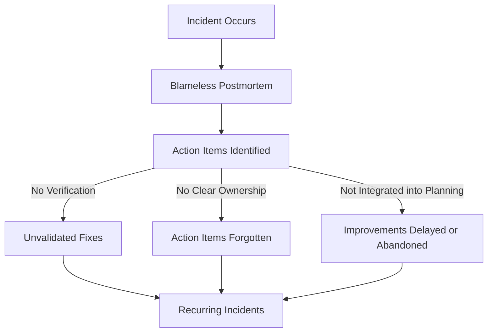

The result was a perverse scenario where the organization repeatedly learned the same lessons without becoming more reliable. This created cynicism about the value of blameless postmortems while allowing preventable incidents to continue.

### SRE Best Practice: Evidence-Based Investigation

To implement effective improvement loops, SRE teams establish structured processes. The following checklist organizes these processes into actionable steps that ensure investigations are evidence-based and lead to meaningful system improvements:

| **Step** | **Description** | **Key Questions** | **Outcome** |
| -------------------------------------- | --------------------------------------------------------------------------------------------------------------------------- | ------------------------------------------------------------------------------------------------- | ------------------------------------------------------------------------------------------------- |
| **Insight Implementation Tracking** | Measure the progression of improvement opportunities from identification to implementation. | Are insights being tracked through each stage of the improvement lifecycle? | Visibility into conversion rates from insights to system changes. |
| **Effectiveness Verification Testing** | Conduct controlled experiments, chaos engineering, or simulations to validate the success of implemented changes. | Did the improvement address the identified vulnerability effectively? | Evidence-based feedback on whether the improvement achieved its reliability goals. |
| **Opportunity Cost Analysis** | Quantify the cost of incidents and prevention efforts to prioritize high-value reliability improvements. | What is the cost of not addressing this issue, and what is the cost of implementing the solution? | Data-driven prioritization framework for reliability investments. |
| **Knowledge Distribution Analysis** | Assess how well incident learnings propagate across teams and systems to prevent repeat issues in other areas. | Are the lessons from incidents being shared effectively across the organization? | Insights that prevent similar issues across the organization, increasing system-wide reliability. |
| **Meta-Improvement Analysis** | Regularly review the improvement process to identify and address bottlenecks in the journey from insight to implementation. | Are there recurring obstacles in how the organization learns and improves from incidents? | Continuous refinement of the organization's learning and improvement processes. |

#### Example Workflow: Evidence-Based Investigation Loop

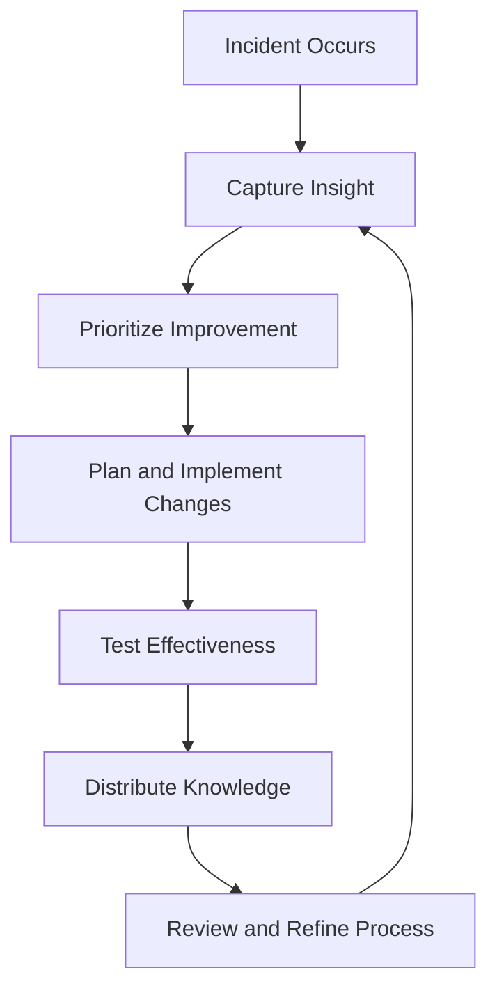

This structured approach ensures that every learning opportunity is tracked, verified, and leveraged to its fullest potential. By following these steps, SRE teams can systematically close the loop between insights and tangible system improvements, fostering a culture of continuous learning and reliability.

### Banking Impact

The failure to close the improvement loop creates significant business impacts for financial institutions. Below is a breakdown of key metrics, paired with a visual representation to illustrate the scale of these challenges:

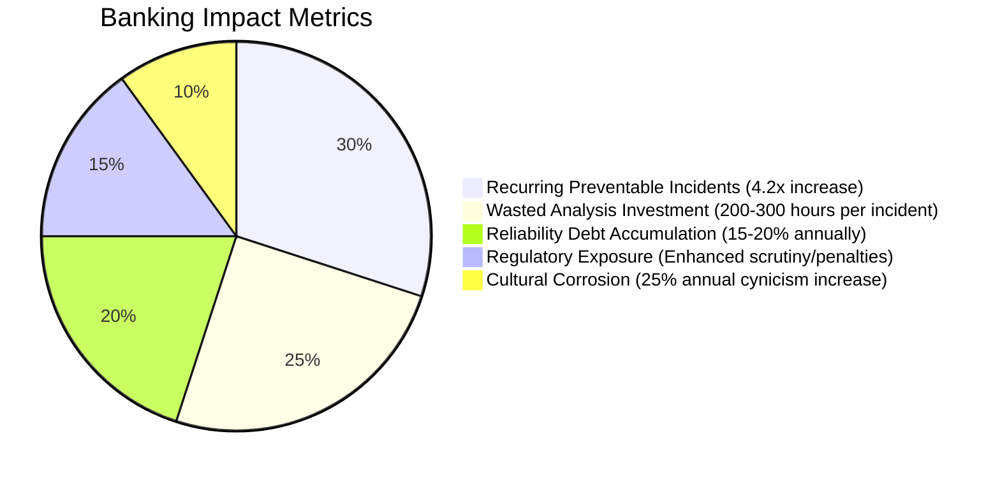

1. **Recurring Preventable Incidents**: Banks with broken improvement loops experience 4.2x more repeat incidents of types that had previously been analyzed and understood. This directly impacts customer experience and significantly increases operational costs.

2. **Wasted Analysis Investment**: Financial institutions typically invest 200-300 person-hours per major incident in analysis and learning activities. When improvements aren't implemented, this substantial investment yields no return.

3. **Reliability Debt Accumulation**: Without effective improvement loops, known system vulnerabilities accumulate at a rate of approximately 15-20% per year. This creates compounding risks that lead to larger, more complex failures over time.

4. **Regulatory Exposure**: Financial regulators increasingly require evidence that banks learn from incidents. Institutions unable to demonstrate completed improvement cycles face enhanced scrutiny and potential financial penalties.

5. **Cultural Corrosion**: When improvements repeatedly fail to materialize, organizational cynicism increases by approximately 25% per year, as measured in employee surveys. This leads to reduced reporting, disengagement, and a decline in proactive risk management.

This data highlights the cascading effects of failing to operationalize incident learnings, underscoring the critical importance of a robust continuous improvement loop for financial institutions.

### Implementation Guidance

To implement effective improvement loops in a banking environment, follow these steps:

#### Checklist for Implementation

1. **Insight-to-Action System**

   - [ ] Implement a dedicated system to track reliability insights from identification to implementation and verification.
   - [ ] Design workflows tailored for improvement items, separate from standard ticketing systems.
   - [ ] Create dashboards to monitor completion rates and aging of improvement tasks.

2. **Reliability Improvement Time Allocations**

   - [ ] Reserve 20-30% of each technology team's capacity for addressing reliability improvements.
   - [ ] Integrate this allocation into sprint planning tools and track adherence as a KPI.
   - [ ] Communicate the reserved capacity policy across teams to ensure alignment.

3. **Verification Protocols**

   - [ ] Standardize processes for testing implemented improvements, ensuring they address identified weaknesses.
   - [ ] Develop templates for verification plans that must be approved before closing improvement items.
   - [ ] Schedule recurring "game days" or simulations to verify reliability improvements under realistic conditions.

4. **Executive Accountability**

   - [ ] Conduct quarterly reviews with senior leadership to evaluate the improvement loop's effectiveness.
   - [ ] Track and present metrics such as insight-to-implementation conversion rates, aging of open items, and verification outcomes.
   - [ ] Integrate these metrics into the performance evaluations of technology leaders.

5. **Knowledge Base Integration**

   - [ ] Connect incident learnings to operational documentation, including runbooks, architecture diagrams, and training materials.
   - [ ] Schedule regular review cycles to ensure knowledge base updates remain current and relevant.
   - [ ] Make knowledge base content easily searchable and accessible across the organization.

#### Visualizing the Process

Here is a high-level representation of the continuous improvement loop:

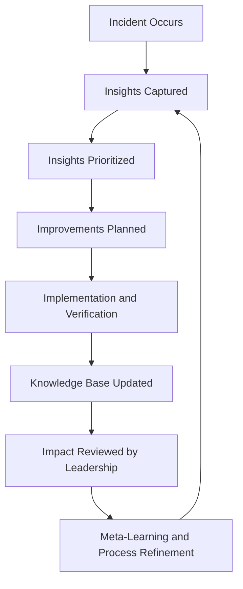

By using this checklist and following the process flow, organizations can ensure insights translate into meaningful system changes that improve reliability over time.
