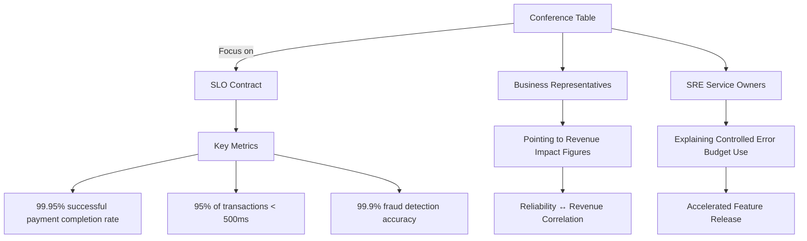

# Chapter 6: Service Ownership Models for Financial Systems

## Chapter Overview

Welcome to the SRE Hunger Games: Banking Edition. This chapter dismantles the delusion that you can keep your financial systems afloat with a patchwork of siloed teams, mystery meat ownership, and tribal knowledge hoarded by the “Rajivs” of the world. Here, service ownership isn’t a feel-good slogan—it’s a blood pact with your customers, your auditors, and your own sanity. You’ll see why “who owns this?” shouldn’t trigger a boardroom séance and why “we build it, we run it” isn’t just a bumper sticker for Kubernetes evangelists. Prepare to torch the blame game, rip out the duct tape, and face the harsh business reality: nobody cares if your database is fine if customers can’t deposit a check. If you’re allergic to accountability, this chapter will give you hives.

______________________________________________________________________

## Learning Objectives

- **Diagnose** the root causes of service failures in financial systems caused by fragmented ownership and silos.
- **Map** critical customer journeys end-to-end, exposing every gnarly dependency and orphaned integration.
- **Draw** sharp, explicit ownership boundaries in microservice architectures—no more “gray areas” for hot-potato problems.
- **Engineer** proactive service health practices and escape the hamster wheel of heroic incident response.
- **Build** and **grow** T-shaped teams that crush silos and actually own outcomes, not just their alphabet soup of acronyms.
- **Formulate** SLOs as enforceable contracts, not wishful thinking, that tie reliability to real business results.
- **Enforce** production readiness with the discipline of a drill sergeant—no more “YOLO” launches into prod.
- **Institutionalize** knowledge management so your team’s wisdom doesn’t retire or call in sick.

______________________________________________________________________

## Key Takeaways

- If “everyone owns it,” nobody owns it. Outages don’t care about your org chart.
- Siloed teams will let a $1.2M outage fester because “their part” works. Customers don’t care about your components.
- Microservices without clear boundaries are just new silos in disguise—now with extra finger-pointing.
- Reactive support is just a fancy way to say “we’re paid to hit the same wall every month.”
- T-shaped teams are your only insurance against project overruns, knowledge bottlenecks, and “not my job” syndrome.
- SLOs are your get-out-of-jail (or don’t-go-to-jail) card—tie them to customer value or prepare for a business facepalm.
- Production readiness isn’t a checklist; it’s your only defense against launching the Titanic (again).
- Lost knowledge isn’t just a training problem—it’s a seven-figure incident waiting to happen.
- Ownership without evidence-based investigation is just blame, with more paperwork.
- “We build it, we run it, we improve it” isn’t aspirational. It’s survival. If you want to keep your badge (and your bank’s reputation), act like it.

This isn’t a chapter for process tourists. It’s a playbook for SREs who want to sleep at night—and for leaders who know that “good enough” is a financial risk, not a strategy.

______________________________________________________________________

## Panel 1: The Responsibility Gap - From Siloed Support to End-to-End Ownership

### Scene Description

A large war room is abuzz with activity during a critical payment processing outage. The room is divided into distinct clusters:

- **Database Administrators**: Huddled around monitoring screens, analyzing queries and database health metrics.
- **Application Support Teams**: Reviewing application logs and searching for anomalies in the codebase.
- **Network Engineers**: Examining topology maps and tracking latency metrics across network nodes.
- **Business Representatives**: Pacing anxiously, monitoring customer impact, and fielding questions from stakeholders.

At the front of the room, a large wall screen displays an **Outage Timer** reading `47:00` minutes. Speech bubbles emerge from the clusters, highlighting the blame-shifting taking place:

- "The database is responding normally."
- "The application logs show no errors."
- "Network latency is within parameters."

In the center of the room, a frustrated executive stands with arms crossed, asking the pivotal question: **"Who actually owns this service?"** Silence fills the room as no one raises their hand.

Below is a simplified layout of the war room setup:

```plaintext
+-----------------------+-----------------------+
|  Database Admins      |  Application Support  |
|  [Monitoring Screens] |  [Log Analysis]       |
+-----------------------+-----------------------+
|  Network Engineers    |  Business Reps        |
|  [Topology Maps]      |  [Customer Impact]    |
+-----------------------+-----------------------+

              [Outage Timer: 47:00]

            Frustrated Executive: 
         "Who actually owns this service?"
```

The fragmented seating arrangement and divided focus visually represent the silos in traditional support models. Each team is focused on their own component, while the end-to-end ownership of the customer journey remains unclaimed.

### Teaching Narrative

The traditional model of specialized teams with narrowly defined responsibilities creates dangerous gaps in service ownership. In this critical incident, we see the fundamental problem that transitioning SREs must overcome: when everyone owns a piece, no one owns the whole. This fragmentation leads to prolonged outages, as each team confirms "their part" is working while the customer experience remains broken.

Service ownership in SRE represents a paradigm shift from component-based responsibility to end-to-end ownership. Instead of asking "Is my component working?" the SRE mindset asks "Is the customer's journey successful?" This requires breaking down the artificial boundaries between infrastructure, application code, database performance, and user experience. For production support professionals evolving into SRE roles, the most challenging transition is accepting accountability for outcomes rather than components.

### Common Example of the Problem

A major retail bank recently experienced a critical incident where mobile check deposits were failing for customers, but the root cause remained elusive for over four hours. The database team verified that all database servers were functioning normally with acceptable query times. The application support team confirmed the mobile app servers were running with no error logs. Network operations verified connectivity between all systems was intact with normal latency. Security confirmed no unusual activity or blocks. Meanwhile, thousands of customers were unable to deposit checks, and the bank's social media channels were flooded with complaints.

The actual issue? A certificate for a third-party image processing service had expired, causing mobile check images to fail validation silently. Because no single team was responsible for the end-to-end customer journey of mobile check deposits, each team verified their specific component in isolation and found no issues. The certificate renewal process fell between organizational gaps, with both security and application teams assuming the other was responsible for monitoring and renewal.

#### Timeline of the Incident

```mermaid
gantt
    title Incident Timeline: Mobile Check Deposit Failure
    dateFormat HH:mm
    axisFormat %H:%M

    section Incident Discovery
    Customer Complaints Begin           :active, des1, 08:00, 1h
    Social Media Escalations            :des2, after des1, 1h

    section Initial Investigation
    Database Team Verifies Query Times  :active, db, 09:30, 30m
    App Team Reviews Server Logs        :active, app, after db, 30m
    Network Team Confirms Connectivity  :active, net, after app, 30m
    Security Team Checks Activity       :active, sec, after net, 30m

    section Root Cause Identification
    Escalation to Third-party Services  :critical, root, 11:30, 1h
    Certificate Expiration Discovered   :critical, cert, after root, 30m

    section Resolution
    Certificate Renewed                 :done, fix, 12:30, 30m
    Mobile Check Deposits Restored      :done, restore, after fix, 30m
```

This timeline highlights the sequential delays caused by siloed ownership, as each team focused narrowly on their domain without considering the customer's end-to-end journey. The lack of a unified service owner prolonged the incident, preventing faster discovery of the expired certificate and resolution of the issue.

### SRE Best Practice: Evidence-Based Investigation

SRE investigations focus on the customer experience as the primary source of truth, working backward to identify failure points. In this case, proper service ownership would have started by confirming the customer-reported symptoms through direct testing of the mobile deposit journey. By tracing the complete transaction path across all components and examining each handoff point, the team would have quickly identified the certificate expiration as the root cause.

#### Evidence-Based Investigation Checklist

1. **Validate the reported issue:**

   - Reproduce the customer experience to confirm symptoms and scope.
   - Prioritize customer-facing functionality over internal metrics.

2. **Trace the end-to-end transaction path:**

   - Follow the complete flow across system boundaries.
   - Identify every handoff between components and teams.

3. **Test integration points independently:**

   - Verify APIs, third-party dependencies, and external services.
   - Isolate and confirm the behavior of each system interaction.

4. **Examine critical mechanisms systematically:**

   - Check certificate stores, authentication flows, and encryption layers.
   - Review recent changes to infrastructure, code, or configurations.

5. **Monitor real customer journeys:**

   - Implement "black box" tests to simulate end-user activity.
   - Continuously validate critical customer paths independently of internal health indicators.

Teams with mature service ownership embed these practices into their incident response workflows. By consistently applying evidence-based investigation, they minimize downtime and ensure a seamless customer experience. For instance, black-box testing would have immediately revealed that the deposit function was failing despite all component health metrics appearing normal.

#### Example Workflow: Evidence-Based Investigation


### Banking Impact

The business consequences of fragmented service ownership in this incident were severe. The table below summarizes the immediate and long-term impacts:

| **Category** | **Impact** |
| ------------------------- | --------------------------------------------------------------------------------------------------------- |
| **Transaction Delays** | $1.2 million in transaction value delayed across 8,400 check deposits |
| **Customer Actions** | 437 customers attempted to deposit the same check multiple times, creating reconciliation challenges |
| | An estimated 230 customers visited physical branches to complete deposits they couldn't perform on mobile |
| **Customer Support Load** | Call center volume increased 340%, with average wait times exceeding 28 minutes |
| **Reputation** | Social media sentiment about the bank dropped 27 percentage points during the incident |
| **Regulatory Compliance** | Regulatory reporting was required due to the extended outage of a critical banking function |
| **Long-Term Risks** | Slower innovation due to fragmented ownership model |
| | Higher operational costs from duplicated monitoring systems |
| | Decreased employee satisfaction due to prolonged incident response times |

This incident highlights not only the immediate operational and reputational damage but also the strategic risks posed by a siloed approach to service ownership. Transitioning to an end-to-end ownership model is essential to mitigate these impacts and ensure a more resilient and customer-focused operational posture.

### Implementation Guidance

To transition from siloed support to end-to-end service ownership, financial institutions should follow these steps. The process is visualized in the flowchart below, providing a clear path for implementation:


1. **Map critical customer journeys to technical components**: Create visual representations of each essential banking function (payments, deposits, transfers, loan applications) showing every technical component involved and their interdependencies. Identify ownership gaps at integration points.

2. **Implement service-based on-call rotations**: Restructure on-call responsibilities around customer-facing services rather than technical components. Ensure that first responders have sufficient access and knowledge to investigate across traditional boundaries.

3. **Create service-oriented dashboards**: Develop unified monitoring dashboards that show end-to-end health of customer journeys rather than component status. Include third-party dependencies and integration points on these dashboards.

4. **Establish service owner roles**: Designate specific individuals as accountable owners for each critical banking service, empowered to coordinate across traditional organizational boundaries and make decisions during incidents.

5. **Implement regular service reviews**: Conduct quarterly reviews of each critical service, bringing together all teams that contribute to its delivery to discuss reliability, performance, and improvement opportunities as a unified group.

This approach ensures a structured transition from fragmented support to complete service accountability, fostering a culture of ownership and collaboration.

## Panel 2: Defining Clear Ownership Boundaries in Microservice Architectures

### Scene Description

A digital banking architecture workshop. A diverse team is gathered around a large touchscreen displaying a complex microservice map of a mobile banking platform. The map includes clusters of services connected by arrows representing dependencies. The lead SRE is drawing red boundaries around these clusters, grouping related services into bounded contexts. Next to each boundary, she attaches virtual name cards indicating ownership teams.

The touchscreen display is structured as follows:


Team members are actively discussing, with speech bubbles showing questions like:

- "Where exactly does the payment service end and the notification service begin?"
- "Who's responsible when authentication works but authorization fails?"
- "How do we handle shared dependencies?"

On a nearby whiteboard, someone has written in bold letters:\
**Ownership = Service Perimeter + Customer Journey + Upstream Dependencies.**

The room buzzes with collaboration as the team refines the ownership boundaries and ensures alignment across the architecture.

### Teaching Narrative

In microservice architectures, defining ownership boundaries becomes both more critical and more challenging. As banking applications evolve from monoliths to distributed systems, the lines of responsibility become blurred. SREs must create explicit ownership definitions that encompass not just the service's code, but its entire operational footprint.

True service ownership means owning four dimensions: the core functionality, the customer journeys that depend on it, the critical upstream dependencies, and the service's operational characteristics. This "ownership diamond" replaces vague responsibility assignments with clear accountability. In financial services, this clarity becomes even more critical as regulatory requirements demand knowing exactly who is responsible for specific data flows and transaction types.

The SRE approach rejects both "ownership by proximity" (whoever is closest to the problem) and "ownership by expertise" (whoever knows the most about a component). Instead, it implements "ownership by impact" - assigning clear responsibility to those who can most effectively improve customer outcomes. For production support teams transitioning to SRE practices, this requires developing a much broader understanding of how services interconnect within the larger financial ecosystem.

### Common Example of the Problem

A major investment bank's new wealth management platform was built using a microservice architecture with over 40 discrete services. When clients attempted to execute trades based on advisor recommendations, they frequently encountered a frustrating situation where the trade would appear to be submitted successfully, but no confirmation would arrive, leaving them uncertain if their transaction was processed.

Investigation revealed a complex interaction failure between three separate microservices: the trading execution service, the notification service, and the messaging infrastructure. Below is a timeline diagram illustrating the sequence of events and failures that contributed to the issue:


In this scenario:

- The trading execution service successfully processed the trade and sent a completion event to the message broker.
- However, the notification service never received the event because the message broker's queue limits were exceeded by non-critical events from a third service.
- As a result, the client was left uncertain whether their trade had been completed.

When incidents like this occurred, three separate teams debated responsibility:

- The trading team insisted their service was functioning correctly, as trades were executing without error.
- The notification team argued they couldn't process events they never received.
- The messaging infrastructure team noted they were simply enforcing configured queue limits.

No single team had clear ownership of the end-to-end client notification experience, highlighting the critical need for well-defined ownership boundaries in microservice architectures.

### SRE Best Practice: Evidence-Based Investigation

Effective service ownership in microservice architectures requires formal boundary definitions with explicit handoff contracts. Evidence-based investigation revealed:

1. **Service dependency mapping**: Using distributed tracing and event flow analysis, SREs created complete dependency maps for critical customer journeys, identifying all services involved in trade confirmation.

2. **Handoff contract verification**: Testing each service interface against its documented contract revealed that the trading service wasn't implementing retries for failed message broker submissions.

3. **End-to-end transaction tracing**: Implementing correlation IDs across service boundaries allowed tracking individual trades through the entire system, pinpointing exactly where notifications were failing.

4. **Load testing with realistic scenarios**: Simulating actual client usage patterns revealed that the message broker configuration wasn't aligned with peak trading volumes.

5. **Message prioritization analysis**: Examining message patterns showed that critical notifications were competing equally with informational messages, without appropriate prioritization.

Organizations with mature service ownership implement formal "interface contracts" between services that specify exactly what each service is responsible for delivering, including performance characteristics, retry behaviors, and failure handling expectations.

#### Evidence-Based Investigation Checklist

For quick reference, follow these five steps to apply evidence-based investigation practices effectively:

- **Step 1: Map Dependencies**\
  Use distributed tracing and event flow analysis to create accurate service dependency maps.

- **Step 2: Verify Handoff Contracts**\
  Test service interfaces against documented contracts to ensure proper implementations.

- **Step 3: Trace Transactions End-to-End**\
  Implement correlation IDs for precise tracking across service boundaries.

- **Step 4: Conduct Realistic Load Testing**\
  Simulate actual user patterns to identify configuration misalignments.

- **Step 5: Analyze Message Prioritization**\
  Examine message patterns to ensure critical operations are prioritized appropriately.

### Banking Impact

The business impact of unclear ownership boundaries in microservice architectures is both measurable and significant. Below is a summary of key metrics, their impact, and the resulting consequences:

| Metric | Impact | Consequence |
| ------------------------------------------------------------------------------------------------------ | ----------------------------------------------------- | --------------------------------------------------------------------------------- |
| 14% of high-net-worth clients experienced missing trade confirmations during market volatility periods | Erosion of client trust in the platform's reliability | Several clients reduced their investment positions due to perceived instability |
| Average resolution time for incidents increased 340% compared to the previous monolithic system | Slower recovery from service disruptions | Prolonged outages led to customer dissatisfaction and revenue losses |
| $4.2 million in compensation paid to clients for duplicate trades caused by missing confirmations | Direct financial loss | Increased scrutiny from regulatory bodies and reduced profitability |
| Client satisfaction scores for the wealth management platform fell 18 points below target | Decline in customer loyalty | Negative impact on the bank's reputation as a leader in technological reliability |
| Regulatory audit findings cited lack of clear responsibility for transaction records | Failure to meet compliance standards | Risk of fines, penalties, and mandatory remediation efforts |
| Time-to-market for new features increased due to team debates over interface responsibilities | Reduced agility in responding to market demands | Loss of competitive edge in delivering innovative solutions |

These impacts collectively undermined the bank's reputation for technological reliability, particularly among high-net-worth clients. The inability to define clear ownership boundaries not only caused operational inefficiencies but also directly affected client relationships and regulatory compliance, highlighting the critical need for precise ownership definitions.

### Implementation Guidance

To establish clear ownership boundaries in microservice architectures, financial institutions should follow these structured steps:


1. **Identify service boundaries**: Determine clear boundaries for each microservice based on its core functionality, critical upstream dependencies, and the customer journeys it supports.

2. **Create service boundary documentation**: Develop formal documentation for each microservice that explicitly defines its boundaries, responsibilities, dependencies, and supported customer journeys. Use architecture diagrams to enhance clarity.

3. **Define formal service contracts**: Establish technical contracts between services that specify APIs, event formats, performance SLAs, retry policies, circuit breaker behaviors, and escalation paths in case of issues.

4. **Assign customer journey owners**: Designate specific individuals or teams responsible for managing and improving end-to-end customer experiences that span multiple microservices, ensuring they have cross-boundary coordination authority.

5. **Deploy tracing and monitoring**: Implement distributed tracing, correlation IDs, and end-to-end monitoring systems to provide visibility into service interactions and customer journey performance across boundaries.

6. **Conduct boundary-focused game days**: Regularly simulate failure scenarios at service boundaries to evaluate both technical resilience and team coordination. Use these exercises to refine ownership definitions and improve cross-team collaboration.

## Panel 3: From Reactive Response to Proactive Service Health

### Scene Description

A service health operations center is depicted with a "before" and "after" split-screen visualization, highlighting the stark contrast between reactive and proactive service health practices.

#### Before: Chaotic NOC

```
+----------------------------+
|        BEFORE: NOC         |
+----------------------------+
| Walls of red alerts        |
| Staff reacting to tickets  |
| Managers demanding updates |
+----------------------------+
```

- Walls of red alerts dominate the screens.
- NOC staff are frantically responding to a flood of tickets.
- Management is seen urgently demanding status updates on incidents.

#### After: Calm SRE Workspace

```
+----------------------------+
|      AFTER: SRE SPACE      |
+----------------------------+
| Dashboards:                |
|   - Customer journey       |
| Chaos engineering in action|
| Docs being updated         |
| Error Budget: 97.3% left   |
| Last Major Incident: 47d   |
+----------------------------+
```

- Engineers review dashboards displaying customer journey success rates.
- A team member conducts a proactive chaos engineering experiment on a payment service.
- Another team member updates service documentation.
- A clearly visible "Error Budget" display shows 97.3% remaining for the quarter.
- A "Last Major Incident" counter reads 47 days.

This visual juxtaposition emphasizes the transformative shift from a reactive, high-stress environment to a proactive, data-driven culture of service ownership.

### Teaching Narrative

The evolution from reactive support to proactive service ownership represents a fundamental mindset shift for banking technology teams. In the traditional model, success is measured by how quickly teams respond to failures. In the SRE service ownership model, success is measured by preventing those failures from occurring in the first place.

This shift requires redefining what "ownership" means in practical terms. Service owners take responsibility not just for responding to alerts, but for continuously improving reliability through code quality, infrastructure evolution, and operational excellence. They invest in observability rather than just monitoring, enabling them to understand system behavior deeply rather than simply detecting failures after they occur.

For financial institutions, this proactive stance is transformative. When trading platforms, payment processors, or core banking systems adopt true service ownership, the focus shifts from "time to restore" to "time between failures." Service owners become accountable for leading indicators (error budget consumption rates, deployment frequency, change failure rates) rather than lagging indicators (number of incidents, downtime percentages).

### Common Example of the Problem

A global bank's fraud detection system experienced regular performance degradations during month-end processing peaks. The traditional support model had established a well-rehearsed incident response: when transaction approvals slowed, the support team would add emergency computing capacity, restart specific services, and clear accumulated queues. The team prided themselves on their rapid response time, typically restoring normal operation within 30-45 minutes.

This reactive approach resulted in a predictable monthly cycle. The recurring nature of the problem can be visualized as follows:

```mermaid
flowchart TD
    A[Degradation begins during peak traffic] --> B[Alert triggered]
    B --> C[Incident response initiated]
    C --> D[Emergency actions taken (e.g., scaling, restarts)]
    D --> E[Service restored]
    E --> F[No root cause addressed]
    F --> A[Cycle repeats next month]
```

Although the team celebrated their efficiency in managing incidents, the reality was stark: thousands of legitimate customer transactions were delayed each month during these degradation periods. On average, 120 high-value transactions were declined due to timeout issues during each incident. Despite their ability to restore the system within 30-45 minutes, they never addressed the underlying cause of the performance degradation, perpetuating an inefficient and costly cycle.

### SRE Best Practice: Evidence-Based Investigation

Proactive service ownership requires moving beyond efficient response to addressing root causes. Organizations with mature service ownership implement regular "non-incident investigations"—dedicated time to understand system behavior during normal operations, identifying improvement opportunities before failures occur.

#### Evidence-Based Investigation Checklist

| Step | Description | Expected Outcome |
| -------------------------------------- | ------------------------------------------------------------------------------------------ | -------------------------------------------------------------------------------------------------- |
| **Workload Pattern Analysis** | Examine transaction patterns to identify trends, peaks, or anomalies. | Predictable surges or bottlenecks are identified, enabling targeted optimizations. |
| **Resource Utilization Trends** | Analyze historical data to uncover resource constraints or saturation points. | Pinpointed resource limits, such as exhausted connection pools or CPU/memory pressure. |
| **Configuration Optimization Testing** | Conduct controlled experiments in a staging environment to validate configuration changes. | Verified improvements in system behavior under simulated load conditions. |
| **Query Performance Evaluation** | Review database queries to identify inefficiencies or poorly performing patterns. | Optimized queries that reduce latency and improve scalability during peak loads. |
| **Capacity Forecasting Models** | Develop predictive models using transaction growth and system behavior trends. | Anticipated stress points and actionable insights for architectural changes or scaling strategies. |

#### Example Investigation Flow - Using Evidence to Drive Improvement


By following this structured approach, teams can systematically uncover and address reliability risks before they result in incidents, ensuring a proactive stance on service health.

### Banking Impact

The business and operational impacts of the reactive support model are summarized below:

| **Category** | **Impact** |
| ------------------------- | --------------------------------------------------------------------------------------------------------- |
| **Financial Loss** | $3.2 million in lost transaction revenue annually due to service issues. |
| **Transaction Declines** | ~1,400 legitimate high-value transactions incorrectly declined per year. |
| **Operational Workload** | 12% increase in manual review workload for the fraud operations team. |
| **Customer Satisfaction** | 23% lower satisfaction scores for customers transacting during outages. |
| **Emergency Costs** | Increased operational costs from emergency response and overtime staffing. |
| **Regulatory Scrutiny** | Heightened scrutiny due to recurring service degradations. |
| **Reputation Impact** | Corporate clients shifting critical transactions to competitors at month-end due to reliability concerns. |

This reactive approach not only led to measurable financial losses but also tarnished the bank's reputation and strained operational teams. Transitioning to a proactive SRE-driven service ownership model addresses these issues by focusing on preventing failures instead of merely reacting to them.

### Implementation Guidance

To transition from reactive response to proactive service health, financial institutions should follow these five actionable steps:

1. **Implement predictive monitoring**:

   - Deploy monitoring systems to identify trends and patterns before they become service-impacting events.
   - Configure alerts for unusual rates of change in key metrics, not just threshold violations.
   - Invest in tools that provide insights into system behavior and predict potential risks.

2. **Establish performance testing as a continuous process**:

   - Regularly simulate real-world conditions, including peak loads, unusual transaction patterns, and degraded dependency states.
   - Use test results to proactively identify areas for improvement.
   - Automate performance testing pipelines to ensure consistency and scalability.

3. **Create service health reviews**:

   - Conduct weekly reviews of key services, focusing on leading indicators like error rates, latency trends, resource utilization patterns, and deployment success rates.
   - Use these reviews to prioritize improvement work and identify risks early.
   - Ensure participation from cross-functional teams for comprehensive insights.

4. **Dedicate capacity for proactive improvements**:

   - Allocate at least 30% of engineering time to proactive reliability improvements, such as addressing technical debt and enhancing observability.
   - Use error budgets to dynamically adjust this allocation based on the current state of service health.
   - Track progress and impact through clearly defined metrics.

5. **Implement chaos engineering programs**:

   - Introduce a systematic approach to resilience testing by intentionally injecting controlled failures in pre-production and production environments.
   - Analyze findings to uncover hidden weaknesses and drive reliability enhancements.
   - Regularly evolve chaos scenarios to match the system's growth and complexity.

______________________________________________________________________

#### Quick Implementation Checklist

- [ ] **Predictive Monitoring**:

  - [ ] Monitoring tools deployed with predictive insights.
  - [ ] Alerts configured for unusual metric changes.

- [ ] **Continuous Performance Testing**:

  - [ ] Performance tests automated and running regularly.
  - [ ] Simulations include peak loads and degraded states.

- [ ] **Service Health Reviews**:

  - [ ] Weekly reviews conducted with focus on leading indicators.
  - [ ] Cross-team collaboration established for reviews.

- [ ] **Proactive Capacity Allocation**:

  - [ ] Minimum 30% engineering time allocated to reliability improvements.
  - [ ] Error budgets actively used to guide allocation.

- [ ] **Chaos Engineering Program**:

  - [ ] Controlled failure tests performed in production and pre-production.
  - [ ] Findings used to prioritize reliability work.

By following this checklist, teams can ensure they are systematically adopting practices that foster proactive service health and reliability.

## Panel 4: Building T-Shaped Teams for Service Ownership

### Scene Description

The war room of a banking technology team has been transformed into a dynamic collaboration space with modular workstations arranged to foster teamwork. Above each team member, floating icons symbolize their expertise - one engineer has database and security symbols, while another displays API and UI expertise indicators.

At the center of the room, a holographic display projects a detailed payment service architecture. The team is actively engaged in debugging a latency issue, with each member contributing insights from their areas of expertise. Surrounding the workstations, a large skills matrix is prominently displayed on the wall. The matrix uses vertical bars to represent each team member's depth in their specialty and horizontal bars to show their breadth across adjacent disciplines. Below the matrix, a bold sign reinforces the team philosophy: "We build it, we run it, we improve it."

To better visualize this environment, imagine the following layout as a text-based representation:

```
+---------------------------------------------------------+
|                      Skills Matrix                      |
|---------------------------------------------------------|
| Name          | Specialty    | Breadth Across Domains  |
|---------------|--------------|-------------------------|
| Engineer A    | Database     | Security, APIs          |
| Engineer B    | Security     | UI, Database            |
| Engineer C    | API          | Front-end, Security     |
+---------------------------------------------------------+

     [ "We build it, we run it, we improve it" ]
                      (Team Motto)
```

In the middle of the room:

```
   +---------------------------------------------+
   |          Holographic Payment Service        |
   |             (Latency Debugging)             |
   +---------------------------------------------+
```

Each team member works at modular desks surrounding the projection, wearing their "hats" of expertise while collaborating seamlessly across disciplines. This scene embodies the T-shaped team model, where depth and breadth combine to create a resilient, adaptable team.

### Teaching Narrative

True service ownership requires building teams with both deep expertise and broad capabilities - the "T-shaped" engineer model. The vertical bar of the T represents depth in a specific domain, while the horizontal bar represents breadth across adjacent domains. This model directly addresses the limitations of traditional siloed teams in financial services technology.

In high-performing service ownership teams, each member maintains their specialized knowledge (database optimization, security architecture, front-end performance) while developing sufficient understanding of adjacent domains to collaborate effectively. This doesn't mean everyone becomes an expert in everything - rather, it means everyone develops enough breadth to understand how their specialized work impacts the overall service.

For banking institutions, this team structure provides resilience without sacrificing expertise. When market volatility creates unexpected demand on trading platforms, T-shaped teams can respond cohesively rather than waiting for specialists from different organizational silos. When regulatory changes require rapid adaptation of compliance checks, these teams can implement changes holistically across the service boundary.

### Common Example of the Problem

A major commercial bank's corporate lending platform was maintained by specialized teams: a database team managing the data layer, a Java development team maintaining the application logic, a front-end team handling the user interface, and a separate operations team responsible for production hosting. When implementing regulatory changes to know-your-business (KYB) requirements, the bank faced significant delays and quality issues.

The project required changes across all layers of the stack: database schema modifications, business logic updates, UI changes, and infrastructure adjustments to support increased validation processing. Each specialized team worked independently on their component, leading to cascading inefficiencies and delays. The sequence of events is illustrated below:


Key inefficiencies and their impact:

- **Interface mismatches**: Independent development approaches led to rework on 40% of the changes, delaying integration.
- **Cross-layer misalignments**: Database changes optimized for storage efficiency caused application-layer performance bottlenecks.
- **Incompatible formats**: The front-end team collected required data in formats unsuitable for regulatory reporting, requiring late-stage adjustments.
- **Delayed performance testing**: Testing occurred only after all components were integrated, revealing critical issues too late for proper resolution.

The project missed its deadline by 63 days, required three emergency patches after launch, and still resulted in a system that loan officers found cumbersome to use. This example highlights how siloed teams can struggle to deliver cohesive solutions, especially for complex, multi-layered changes.

### SRE Best Practice: Evidence-Based Investigation

Organizations with mature service ownership build T-shaped teams that combine depth and breadth. Evidence-based investigation of successful transformations highlights the following key findings:

| Key Practice | Observations and Metrics |
| ------------------------------------- | -------------------------------------------------------------------------------------------------------------------------- |
| **Skills Mapping and Gap Analysis** | Systematic assessment reveals depth in specialized knowledge and breadth across domains, identifying cross-training needs. |
| **Knowledge Sharing Effectiveness** | T-shaped teams resolve cross-boundary issues 57% faster than siloed teams, especially for complex, multi-domain problems. |
| **Project Delivery Metrics** | Teams with balanced T-shaped skills deliver changes with 45% fewer defects and 60% shorter lead times. |
| **Collaboration Pattern Observation** | T-shaped teams engage in 3x more meaningful cross-discipline discussions during planning and implementation. |
| **Cognitive Load Assessment** | Cognitive load is distributed more effectively, preventing individual overload during critical changes. |

#### Mechanisms for Knowledge Diffusion

The most effective organizations implement deliberate strategies to encourage knowledge sharing and collaboration across specialties:

- **Paired Programming Across Domains**: Pairing engineers with different expertise fosters cross-training and mutual understanding.
- **Rotational Assignments**: Rotating roles periodically helps members develop broader skills while maintaining depth in their core domain.
- **Shared On-Call Responsibilities**: Distributing on-call duties across all team members ensures collective ownership and familiarity with service components.
- **Collective Ownership**: Promoting shared accountability for the entire service architecture strengthens team cohesion and resilience.

### Banking Impact

The business consequences of specialized silos versus T-shaped teams are summarized below:

| Metric | Siloed Teams | T-Shaped Teams | Improvement with T-Shaped Teams |
| ---------------------------------- | ------------------ | -------------- | ------------------------------- |
| Regulatory Schedule Overruns | 42% | 12% | 71% reduction |
| Post-Implementation Defect Rate | 3.5x higher | Baseline | Significant reduction |
| Customer-Reported Usability Issues | 2.7x more frequent | Baseline | Significant reduction |
| Time-to-Market for New Features | 58% longer | Baseline | Accelerated delivery |
| Employee Retention | 24% lower | Baseline | Improved retention |
| Operational Costs | 31% higher | Baseline | Reduced costs |

For the commercial lending platform specifically:


The total financial impact of delayed implementation and quality issues reached approximately $6.1 million. By adopting T-shaped team structures, the bank significantly mitigated these risks and achieved measurable improvements in efficiency, quality, and customer satisfaction.

### Implementation Guidance

To build effective T-shaped teams for service ownership, financial institutions should follow these steps. Use the accompanying checklist to track your team's progress:

1. **Create cross-functional team structures**

   - Reorganize technology teams around services rather than technical specialties.
   - Integrate developers, infrastructure specialists, security experts, and database administrators into cohesive service ownership teams.

   **Checklist:**

   - [ ] Service boundaries are clearly defined.
   - [ ] Teams include representatives from all critical domains.
   - [ ] Service ownership responsibilities are documented and agreed upon.

2. **Implement skills development programs**

   - Establish formal cross-training initiatives, including shadowing, mentorship, and structured learning paths.
   - Help specialists develop breadth across adjacent domains while maintaining their core expertise.

   **Checklist:**

   - [ ] Cross-training programs are designed and scheduled.
   - [ ] Team members have access to mentorship opportunities.
   - [ ] Skills gaps are periodically assessed and addressed.

3. **Adjust hiring and promotion criteria**

   - Update job descriptions, interview processes, and career advancement paths to value both technical depth and collaborative breadth.
   - Explicitly reward knowledge sharing and cross-domain learning.

   **Checklist:**

   - [ ] Job descriptions emphasize both depth and breadth.
   - [ ] Interviews include assessment of cross-domain collaboration skills.
   - [ ] Promotion criteria reward cross-functional contributions.

4. **Institute pair programming practices**

   - Establish regular pairing sessions across specialties to ensure knowledge diffusion.
   - Rotate team members and schedule dedicated time to prioritize these sessions.

   **Checklist:**

   - [ ] Pair programming sessions are scheduled with a clear rotation.
   - [ ] Team members from different specialties are actively participating.
   - [ ] Outcomes of pairing sessions are documented and shared.

5. **Revise on-call rotations**

   - Implement service-based on-call responsibilities, where team members take turns responding to all issues for their service.
   - Provide support documentation and backup resources to help responders address issues outside their specialty.

   **Checklist:**

   - [ ] On-call rotation schedules are service-focused.
   - [ ] Documentation for handling cross-domain issues is accessible and up-to-date.
   - [ ] Team members feel adequately supported during on-call duties.

### Summary of Progress

Below is a visual aid to monitor overall implementation:


Track these areas regularly to ensure your team evolves into a high-performing T-shaped structure, capable of owning, running, and improving services collaboratively.

## Panel 5: Service Level Objectives as Ownership Contracts

### Scene Description

A formal meeting takes place in a conference room between the digital banking product team and their SRE service owners. At the center of the table is a printed "Service Level Objective Contract" document, signed by both business and technical stakeholders. The contract prominently displays key metrics:

- **99.95% successful payment completion rate**
- **95% of transactions processed under 500ms**
- **99.9% fraud detection accuracy**

A large monitor on the wall displays a historical graph, showing SLO performance steadily trending upward over the past six months. Business representatives are pointing to accompanying revenue impact figures, which illustrate how reliability improvements have boosted transaction volume and profitability. Meanwhile, SREs are discussing a recent controlled error budget expenditure, explaining how it allowed them to accelerate a critical feature release while maintaining acceptable reliability levels.

Below is a conceptual representation of the meeting setup and key elements:



This setup emphasizes the collaborative nature of the meeting, where both teams align on priorities and trade-offs. The visual aids, such as the graph and contract, highlight the actionable connection between technical metrics and business outcomes, fostering a shared understanding of service ownership.

### Teaching Narrative

SLOs transform abstract service ownership into concrete, measurable commitments. They serve as the practical implementation of ownership principles, creating clear accountability for outcomes rather than activities. For banking systems, these aren't just technical metrics—they're promises with direct business impact.

The SRE approach to service ownership uses SLOs to define the boundary between reliability and feature velocity. When a service consistently meets its objectives, teams can invest more in new capabilities. When reliability degrades, resources shift toward stabilization. This creates a self-regulating system where ownership includes making appropriate trade-offs based on real customer impact.

For financial institutions, these SLO contracts become particularly powerful when they directly connect to business metrics. Payment processing reliability links to transaction volume and revenue, trading platform performance connects to customer satisfaction and retention, and fraud detection accuracy relates to loss prevention. By expressing service ownership through outcome-focused SLOs rather than process-focused KPIs, organizations create alignment between technical and business priorities.

### Common Example of the Problem

A retail bank's mortgage application platform operated without clearly defined service level objectives. The development team prioritized new features to compete with fintech challengers, while the operations team focused on stability and security. Without shared objectives, conflicting priorities emerged, leading to a range of issues summarized below:

| **Scenario** | **Conflicting Priorities** | **Impact** |
| ------------------------------------------------ | ----------------------------------------------------------------------------------------- | ---------------------------------------------------------------------------------------------------- |
| Streamlined document upload feature introduced | Development optimized for feature delivery, ignoring performance impacts | Latency increased application abandonment rates by 15%; no SLOs meant this was deemed acceptable. |
| Change freeze during seasonal home-buying peak | Operations prioritized stability, while development aimed to deliver competitive features | Deployment timing debates became subjective, frustrating teams and delaying critical business goals. |
| System performance degraded | No shared reliability targets to guide response priorities | Overreactions to minor issues and underreactions to serious degradations created inconsistency. |
| System fluctuated between stability and features | No alignment between reliability and feature velocity | Customer satisfaction varied wildly, eroding trust and frustrating business stakeholders. |

#### Timeline of Consequences


Without clear SLOs to establish shared priorities, these conflicts resulted in unpredictable system performance, dissatisfied customers, and frustrated internal teams. The lack of alignment highlighted the need for outcome-focused objectives to guide decision-making and trade-offs effectively.

### SRE Best Practice: Evidence-Based Investigation

Organizations with mature service ownership implement SLOs as formal contracts between technical teams and business stakeholders. Evidence-based investigation reveals successful approaches that ensure SLOs drive meaningful reliability and business outcomes.

#### Checklist: Five Steps for Evidence-Based Investigation

1. **Customer-Centric Metric Identification**

   - Analyze customer behavior data to identify key technical metrics that directly influence user outcomes.
   - Example: Mortgage application completion rates correlate with document upload success rate, page load times, and form submission reliability.

2. **Business Impact Correlation**

   - Use statistical analysis to quantify relationships between technical metrics and business outcomes.
   - Example: A 100ms increase in page load time reduces conversion by 4.3%, making performance SLOs a clear business priority.

3. **Historical Reliability Analysis**

   - Review at least 12 months of operational data to determine realistic reliability targets.
   - Avoid setting arbitrary or unattainable SLOs by aligning goals with proven system capabilities.

4. **Multi-Stakeholder Alignment Workshop**

   - Facilitate structured workshops with business, development, and operations teams to align on trade-offs between reliability and feature velocity.
   - Develop consensus-based error budgets that reflect shared priorities.

5. **SLO Implementation Verification**

   - Validate that chosen metrics are technically feasible to measure, alert on, and report against.
   - Ensure metrics are actionable and support timely decision-making.

#### Summary Process Flow


The most effective organizations formalize these findings in SLO contracts with clear error budget policies. These contracts explicitly outline how reliability failures will influence development priorities, ensuring both technical and business alignment.

### Banking Impact

The business consequences of undefined versus well-defined SLOs are both measurable and significant. Below is a summary of key outcomes:

```mermaid
barChart
    title Banking Impact: SLO-Driven Improvements
    xAxis Abandonment Rate, Emergency Fix Time, Customer Satisfaction Fluctuation, Revenue Predictability, Regulatory Accuracy, Operational Cost
    yAxis Improvement Percentage
    data
        "Reduced Abandonment Rate" 23
        "Reduced Emergency Fix Time" 42
        "Stabilized Customer Satisfaction" 19
        "Improved Revenue Predictability" 34
        "Enhanced Regulatory Accuracy" 29
        "Lowered Operational Costs" 18
```

- Mortgage applications with unpredictable performance saw **23% higher abandonment rates** than those with consistent, SLO-driven reliability.
- Development teams without clear error budgets spent an average of **42% more time on emergency fixes** versus planned improvements.
- **Customer satisfaction scores fluctuated by up to 27 points** month-to-month without SLOs, compared to just **8 points with SLO governance**—a stabilization of 19 points.
- **Revenue predictability improved by 34%** when SLOs stabilized transaction success rates.
- **Regulatory reporting accuracy improved by 29%** with clearly defined data consistency SLOs.
- **Cost of operations decreased by 18%** when objective reliability targets prevented both over-engineering and under-investment.

For the mortgage platform specifically, implementing formal SLOs increased application completion rates by **17%**, representing approximately **$2.4 million in additional monthly loan volume**.

This data highlights the transformative impact SLOs can have on financial services, creating tangible business value through stabilized reliability and enhanced operational efficiency.

### Implementation Guidance

To implement Service Level Objectives as ownership contracts, financial institutions can follow this step-by-step process:


1. **Identify Critical User Journeys**

   - Map essential customer experiences, such as payment completion or fraud detection.
   - Identify the technical metrics that directly impact these experiences.
   - Focus initial SLOs on customer-facing indicators rather than internal system metrics.

2. **Analyze Historical Performance**

   - Review at least 90 days of historical data to understand current reliability baselines.
   - Avoid arbitrary targets; instead, set business-appropriate reliability levels supported by data and customer expectations.

3. **Create Formal SLO Documents**

   - Develop explicit SLO contracts that include:
     - Reliability targets
     - Measurement methods
     - Reporting cadence
     - Error budget policies
   - Ensure contracts are signed by both technical and business stakeholders to reinforce shared accountability.

4. **Implement Error Budget Policies**

   - Define clear policies for what happens when error budgets are exceeded.
   - Examples include freezing feature deployments or dedicating resources to reliability improvements.
   - Gain executive support to ensure policies are enforceable and aligned with organizational priorities.

5. **Establish Regular SLO Reviews**

   - Conduct quarterly reviews to assess SLO performance, business impact, and error budget usage.
   - Adjust targets and policies as needed to reflect evolving business goals, customer expectations, and technical capabilities.
   - Use these reviews to strengthen alignment between technical teams and business stakeholders.

## Panel 6: Production Readiness as an Ownership Discipline

### Scene Description

A pre-launch review meeting for a new mobile banking feature is underway. The room reflects a lively yet structured contrast. On one side, developers, holding "Launch Now!" mugs, are brimming with excitement, ready to ship. On the other side, SRE service owners, wearing "Reliability First" badges and holding clipboards, are methodically conducting a readiness assessment.

At the center of the room is a large screen displaying a comprehensive production readiness checklist divided into six categories:

- **Observability**
- **Deployment Safety**
- **Capacity Planning**
- **Failure Modes**
- **Data Management**
- **Operational Procedures**

To visually represent the current status, the checklist uses color indicators:

- ✅ **Green** for completed items.
- 🟠 **Amber** for warnings requiring attention.
- ❌ **Red** for critical items that must be resolved before launch.

Below is a text-based representation of the scene setup:

```
+-------------------------------+-------------------------------+
| Developers (Excited)          | SRE Service Owners (Focused) |
| - "Launch Now!" mugs          | - "Reliability First" badges |
| - Eager expressions           | - Holding clipboards         |
+-------------------------------+-------------------------------+
                              |
                              v
               +-----------------------------------+
               | Comprehensive Readiness Checklist |
               |-----------------------------------|
               | Observability:         ✅          |
               | Deployment Safety:     🟠          |
               | Capacity Planning:     ✅          |
               | Failure Modes:         ❌          |
               | Data Management:       ✅          |
               | Operational Procedures:🟠         |
               +-----------------------------------+
                              |
                              v
      "What happens if the payment gateway timeouts increase during peak holiday shopping?"
      "How will we roll back if the feature causes unexpected database load?"
```

The scene captures the tension and collaboration required to ensure production readiness. Developers are pushing for speed, while SREs prioritize reliability, asking critical questions to preempt operational risks.

### Teaching Narrative

Production readiness reviews transform service ownership from a reactive stance to a proactive discipline. In traditional models, operations teams inherit systems with unknown operational characteristics and undocumented failure modes. In the SRE ownership model, service owners establish strict readiness requirements before accepting new features or services into production.

This disciplined approach to service evolution creates a fundamental shift in how banking technology teams operate. Rather than accepting the "throw it over the wall" handoff from development to operations, service owners participate throughout the development lifecycle, ensuring systems are designed for reliability, not just functionality.

For financial institutions, production readiness becomes particularly critical due to the high cost of failures. A trading algorithm that hasn't been properly load tested, a payment system without clear circuit breaker implementations, or a mobile banking feature without rollback procedures can create immediate financial and reputational damage. Service owners protect the organization by requiring evidence of readiness rather than promises of stability.

### Common Example of the Problem

A major investment bank launched a new cross-border payment feature for corporate clients without a thorough production readiness assessment. The feature had undergone functional testing and a security review, but several operational aspects remained unexamined. Within the first week, several critical issues emerged, leading to cascading failures:


**Summary of Issues:**

- **High Database Connection Usage:** During peak transaction periods, the service consumed excessive database connections, impacting other banking applications and causing widespread slowdowns.
- **Monitoring Blind Spot:** The implemented monitoring only tracked API availability, not transaction success rates, leaving operations blind to a 14% silent failure rate.
- **Third-Party Service Degradation:** When a third-party currency exchange service experienced degradation, the payment system lacked circuit breakers or fallback mechanisms, causing transactions to hang indefinitely.
- **Memory Exhaustion:** No capacity testing had been performed, and the system quickly exhausted memory allocations when transaction volumes reached just 40% of projected levels.
- **Rollback Challenges:** Rollback procedures failed to account for in-flight transactions, creating reconciliation nightmares during emergency fixes.

The resulting incidents forced the bank to suspend the service for 17 days while critical operational issues were addressed. This suspension severely damaged relationships with major corporate clients who had committed to the new service based on the announced launch date.

### SRE Best Practice: Evidence-Based Investigation

Organizations with mature service ownership implement formal production readiness assessment processes. Evidence-based investigation of successful approaches reveals key practices and their measurable benefits:

| **Practice** | **Description** | **Measured Benefit** |
| ------------------------------------------- | ------------------------------------------------------------------------------------------------ | ---------------------------------------------------------- |
| **Comprehensive readiness frameworks** | Structured reviews covering 8-10 operational domains (observability, capacity, resilience, etc.) | 74% reduction in post-launch incidents |
| **Progressive implementation verification** | Deployment strategies such as canary releases and traffic shifting | 82% fewer customer-impacting issues |
| **Failure mode identification** | Systematic failure mode and effects analysis (FMEA) before launch | 63% faster mean time to resolution (MTTR) for novel issues |
| **Operational procedure validation** | Validation of runbooks and emergency procedures through simulation exercises | 47% more effective incident response |
| **Dependencies and limits testing** | Testing for resource exhaustion and dependency failures during planning | 58% reduction in major service disruptions |

#### Summary Checklist for Evidence-Based Readiness

- [ ] Have all key operational domains been reviewed (e.g., observability, capacity, security)?
- [ ] Are progressive rollout strategies (e.g., canary deployments, traffic shifting) in place?
- [ ] Has a failure mode and effects analysis been conducted to identify potential risks?
- [ ] Have runbooks and emergency procedures been tested in simulations?
- [ ] Are dependency and resource limits explicitly tested and documented?

The most effective organizations treat production readiness as a collaborative process rather than a gate, with SREs working alongside development teams throughout the project lifecycle.

### Banking Impact

The business consequences of inadequate versus thorough production readiness are stark and measurable. Below is a comparative visualization highlighting key metrics:


Key Insights:

- **Incident Rates**: Services launched without formal readiness assessments experienced 340% more incidents in their first 30 days, leading to higher downtime and customer dissatisfaction.
- **Customer Adoption**: Reliability challenges during the first week drove a 27% drop in adoption rates, impacting growth trajectories.
- **Regulatory Risks**: Banks with recurring problematic launches faced heightened scrutiny, increasing compliance burdens and risking fines.
- **Operational Costs**: Emergency fixes resulted in a 215% spike in operational expenses in the quarter following unprepared launches.
- **Employee Morale**: Teams handling preventable post-launch crises reported 32% lower satisfaction, affecting long-term retention.
- **Release Velocity**: Hesitancy after problematic deployments led to a 45% drop in release velocity, slowing innovation.

For the cross-border payment feature specifically, the bank estimated total financial impact at **$3.7 million** in lost transaction revenue, emergency remediation costs, and client compensation. The reputational damage with key corporate clients, however, remains incalculable.

### Implementation Guidance

To implement production readiness as an ownership discipline, financial institutions should follow these steps:

______________________________________________________________________

#### **Production Readiness Checklist**

1. **Readiness Assessment Framework**

   - Develop a standardized checklist tailored to financial services, covering:
     - Observability (e.g., metrics, logs, traces)
     - Scalability and capacity planning
     - Resilience against failure modes
     - Security and compliance requirements
     - Operational procedures (e.g., runbooks, on-call rotations)
     - Rollback mechanisms and validation
   - Ensure the checklist is a living document updated with lessons learned.

2. **Integration into Development Lifecycle**

   - Conduct readiness reviews at key stages:
     - **Initial Design**: Validate production readiness considerations during architecture discussions.
     - **Mid-point Review**: Assess implementation progress against readiness criteria.
     - **Pre-launch Review**: Verify all readiness requirements are fully met.

3. **Progressive Deployment Strategies**

   - Require:
     - Canary deployments for incremental traffic exposure.
     - Feature flags to control functionality rollout.
     - Automated rollback mechanisms for rapid recovery.

4. **Failure Mode Analysis**

   - Document potential failure modes and their customer impacts.
   - Define mitigation strategies, covering:
     - Dependency failures
     - Latency thresholds
     - Resource exhaustion
   - Implement monitoring and alerting tied to these failure scenarios.

5. **Validation Through Simulation**

   - Organize game days to simulate:
     - Dependency outages
     - Traffic spikes and peak loads
     - Resource constraints (e.g., database limits, degraded services)
   - Assess team response and system recovery capabilities.

______________________________________________________________________

#### **Production Readiness Workflow**


- **Key Notes**:
  - Iterative readiness reviews ensure early detection of gaps.
  - Feedback loops allow continuous improvement and alignment with readiness criteria.
  - Simulation outcomes must meet defined success thresholds before launch approval.

By following this checklist and workflow, teams can systematically ensure production readiness while minimizing risks.

## Panel 7: Knowledge Management as a Service Ownership Responsibility

### Scene Description

A banking technology team's collaborative workspace is centered around a comprehensive digital "Service Knowledge Center," visually represented below. The workspace is dynamic, with team members actively contributing to its various sections. One engineer is recording the resolution steps from a recent incident, another is updating architecture diagrams following a deployment, while a third is creating a video walkthrough of debugging procedures for a complex transaction flow.

Multiple screens display different aspects of service documentation, including runbooks, architecture maps, dependency graphs, known failure modes, and performance characteristics. A timeline visualization highlights the team's knowledge capturing cadence, with consistent contributions after incidents, during feature deployments, and through scheduled documentation sprints.

The following diagram provides a conceptual layout of the workspace and its key components:


This visual representation emphasizes the interconnected nature of the workspace, where every contribution feeds into a living repository of knowledge. By maintaining this continuous flow of updates, the team ensures that their documentation remains an accurate and reliable asset.

### Teaching Narrative

In mature service ownership models, knowledge management becomes as important as code management. The collective understanding of how a service behaves, how it fails, and how to operate it represents a critical asset that SREs must actively cultivate. This principle directly challenges the traditional banking technology culture where expertise often remains locked in individual team members' minds.

Effective service owners recognize that undocumented knowledge creates operational risk. When troubleshooting procedures exist only in senior engineers' experience, when architecture decisions remain unrecorded, or when failure patterns aren't documented, the organization becomes vulnerable to personnel changes and complexity growth. In financial services, where complex systems process millions of transactions with regulatory oversight, this knowledge gap becomes a significant liability.

The SRE approach treats service documentation as a living artifact that evolves alongside the service itself. Rather than creating static documents that quickly become outdated, service owners establish sustainable knowledge management practices. Every incident becomes a documentation opportunity, every deployment updates architecture records, and every new team member identifies and fills knowledge gaps as part of their onboarding process. This continuous knowledge curation ensures that service ownership can transcend individual team members, creating institutional reliability rather than relying on individual heroes.

### Common Example of the Problem

A global bank's treasury management platform was maintained by a small team led by Rajiv, a senior engineer with 15 years of experience with the system. When Rajiv announced his retirement, the bank realized their vulnerability: much of the system's operational knowledge existed only in Rajiv's head. Specific challenges included:

- Critical troubleshooting procedures for reconciliation errors were undocumented and known only to Rajiv
- The system's complex interactions with 14 other bank services were partially documented in outdated diagrams
- Several workarounds for known limitations had been implemented over years but never properly documented
- Historical context for architectural decisions remained unrecorded, leading to repeated discussions about changes that had been previously considered and rejected
- When Rajiv was unavailable, incident response times increased by 320% as other team members struggled without his knowledge

Despite a six-month transition period, the bank experienced a 270% increase in incident resolution times and a 180% increase in failed changes after Rajiv's departure. Several critical incidents occurred because team members made changes without understanding historical context or system interdependencies.

Below is a timeline representation of the cascading effects caused by poor knowledge management:

```mermaid
gantt
    dateFormat  MM-DD-YYYY
    axisFormat  %b %Y
    title Impact of Poor Knowledge Management Timeline

    section Key Events
    Rajiv announces retirement         :milestone, m1, 01-01-2022, 0d
    Transition period begins           :active, t1, 01-01-2022, 6m
    Rajiv retires                      :milestone, m2, 06-30-2022, 0d

    section Operational Impact
    Increased incident response times  :crit, i1, m2, 3m
    Critical incidents occur           :crit, i2, 07-01-2022, 2m
    Failed changes escalate            :crit, i3, 07-01-2022, 3m

    section Knowledge Gaps
    Architectural confusion emerges    :active, k1, t1, 9m
    Repeated discussions on decisions  :active, k2, m2, 6m
    Increased system risks             :crit, k3, m2, 6m
```

This timeline highlights the key events and their cascading effects. The transition period was insufficient to mitigate the operational risks caused by undocumented knowledge. After Rajiv's departure, the team struggled to manage incidents and changes due to gaps in critical system knowledge, leading to increased risks, delays, and failures.

### SRE Best Practice: Evidence-Based Investigation

Organizations with mature service ownership implement systematic knowledge management practices. Evidence-based investigation reveals successful approaches summarized below:

| Practice | Description | Benefits |
| ------------------------------------------ | ------------------------------------------------------------------------------------------------------------------ | -------------------------------------------------------------------------------------------- |
| **Knowledge Inventory Assessment** | Analyze key knowledge areas (e.g., architecture rationale, dependencies, failure modes, recovery procedures). | Identifies gaps in critical documentation, ensuring comprehensive coverage of service needs. |
| **Tacit Knowledge Extraction** | Use structured interviews to extract operational insights from senior engineers, often revealing hidden knowledge. | Captures undocumented expertise, reducing reliance on individual team members. |
| **Documentation Effectiveness Evaluation** | Test different formats (e.g., text, diagrams, videos, interactive runbooks) for usability and clarity. | Improves accessibility and effectiveness of documentation, especially during incidents. |
| **Knowledge Usage Pattern Analysis** | Review access and usage patterns to ensure documentation is searchable, relevant, and context-sensitive. | Ensures that documentation is utilized effectively during high-pressure scenarios. |
| **Knowledge Decay Measurement** | Conduct periodic reviews and updates to measure and mitigate knowledge degradation over time. | Maintains accurate and up-to-date documentation, reducing operational risks. |

#### Checklist for Evidence-Based Investigation

- [ ] Perform a knowledge inventory assessment to identify critical documentation gaps.
- [ ] Conduct structured interviews with senior engineers to uncover tacit knowledge.
- [ ] User-test documentation formats to optimize for clarity and usability.
- [ ] Analyze documentation access patterns to improve searchability and relevance.
- [ ] Implement a review cycle to regularly update and validate documentation accuracy.

The most effective organizations implement "continuous documentation" practices integrated into regular workflows rather than treating documentation as a separate, periodic task.

### Banking Impact

The business consequences of poor versus effective knowledge management are stark. The table below compares key operational metrics between teams with effective knowledge management practices and those without:

| Metric | Teams with Effective Knowledge Management | Teams with Poor Knowledge Management | Difference (%) |
| --------------------------------------- | ----------------------------------------- | ------------------------------------ | -------------- |
| Incident Resolution Time | 2.5 hours | 7.9 hours | +215% |
| Probability of Incidents After Changes | 8% | 22% | +175% |
| Onboarding Time for New Team Members | 4 weeks | 17 weeks | +340% |
| Regulatory Risks Identified (per audit) | Low | High (89% more likely) | - |
| Operational Costs Due to Redundancy | Baseline | +27% higher | +27% |
| Innovation Velocity | Baseline | 35% slower | -35% |

#### Case in Point: Treasury Management Platform

For the bank's treasury management platform, the financial impact of poor knowledge transition was profound. Following the departure of a senior engineer:

- Direct incident costs, emergency consultant fees, and delays in enhancement delivery totaled approximately **$2.1 million**.
- The platform experienced a significant drop in team efficiency, as critical undocumented knowledge had to be recreated or rediscovered.
- Regulatory audits flagged multiple risks stemming from "insufficient understanding of systems," further compounding operational challenges.

This data underscores the critical role of robust, sustainable knowledge management practices in mitigating operational risks, reducing costs, and maintaining agility in the highly regulated and complex banking sector.

### Implementation Guidance

To implement knowledge management as a service ownership responsibility, financial institutions should follow these steps:

#### Checklist for Implementation

1. **Establish a Service Knowledge Framework**

   - Define a standardized structure for documentation:
     - Architecture diagrams
     - Service dependencies
     - Operational procedures
     - Known failure modes
     - Performance characteristics
     - Historical context (e.g., past incidents, major changes)
   - Ensure the framework is hosted on an accessible, searchable platform.

2. **Embed Documentation into Workflows**

   - Require:
     - Architecture updates after each deployment or change.
     - Incident resolution documentation as part of the postmortem process.
     - Runbook updates or verification during operational tasks.
   - Allocate dedicated time for documentation activities in sprints or operational schedules.

3. **Establish Peer Knowledge Reviews**

   - Set up regular review sessions:
     - Team members evaluate and improve each other's documentation.
     - Include hands-on testing with newer team members to validate clarity and usability.

4. **Develop and Maintain Knowledge Visualizations**

   - Use diagrams or visuals to represent:
     - System architecture
     - Service dependencies
     - Operational workflows
   - Treat these artifacts as living documents, updated alongside code changes.

5. **Practice Knowledge Rotation**

   - Rotate operational responsibilities among team members regularly.
     - Use struggles or slow task completion as indicators of undocumented knowledge.
     - Address gaps through immediate documentation updates or training sessions.

#### Step-by-Step Diagram for Workflow Integration

```mermaid
graph TD
    A[Start: Team Workflow] --> B[Code Deployment]
    B --> C[Update Architecture Diagrams]
    A --> D[Incident Resolution]
    D --> E[Document Resolution Steps]
    A --> F[Runbook Use or Update]
    F --> G[Verify Runbooks During Tasks]
    G --> H[Schedule Peer Reviews]
    E --> H
    C --> H
    H --> I[Knowledge Gaps Identified]
    I --> J[Documentation or Training]
    J --> K[End: Improved Knowledge Base]
```

By following this structured approach, financial institutions can ensure that knowledge management becomes a natural and sustainable part of service ownership, reducing operational risks and improving reliability.
