# Chapter 7: Collaborative On-Call Practices

## Chapter Overview

Welcome to Collaborative On-Call Practices, where we finally kill the lone-wolf SRE hero myth and bury it with the rest of your burnout-inducing, compliance-failing, career-shortening production support habits. This chapter is your crash course in why going solo in incident response is about as effective as bringing a butter knife to a gunfight—and just as likely to get you (and your business) hurt. We’ll dissect the cost of knowledge hoarding, the pain of documentation scavenger hunts, and the existential dread of waking up at 3AM to fix the same problem for the hundredth time. If you’re ready to swap martyrdom for teamwork, shadowing, and actual engineering progress, read on—because your business, your sleep schedule, and your sanity are all on the line.

______________________________________________________________________

## Learning Objectives

- **Recognize** the hidden costs and business risks of hero-based on-call models (spoiler: it’s more than sleep deprivation).
- **Implement** formal incident response roles and collaborative frameworks to turn chaos into coordinated action.
- **Design** living documentation systems and knowledge transfer processes that make incident response less of a scavenger hunt.
- **Establish** tiered response models so the right people get paged at the right time (and the wrong people stay asleep).
- **Adopt** follow-the-sun models for global teams, ensuring handovers don’t turn into 24-hour amnesia loops.
- **Create** structured on-call shadowing programs to level up your team without ritual hazing.
- **Foster** psychological safety, so engineers actually tell you what broke before the regulator finds out.
- **Engineer** your way out of toil by measuring, prioritizing, and automating away the repetitive pain.

______________________________________________________________________

## Key Takeaways

- The lone-hero model is a business liability, not a badge of honor. If your organization’s uptime depends on one person, you’re already losing—even if you don’t know it yet.
- Collaboration isn’t optional. Isolated incident response guarantees longer outages, higher costs, and the kind of knowledge loss that keeps auditors and HR busy.
- Formal roles during incidents aren’t bureaucratic—they’re life preservers. Incident Commander, Tech Lead, Scribe, and Comm Coordinator: accept no substitutes.
- Documentation is either a living artifact or a fossil. Outdated wikis and tribal knowledge turn every incident into a multi-hour escape room—without the fun or prize at the end.
- Tiered response models prevent both “too many cooks” and “not enough chefs.” Your best people shouldn’t get paged for every minor blip, but when the house is on fire, you want the right fire brigade.
- Global operations without real follow-the-sun = Groundhog Day for incidents. If you like re-investigating the same problem three times in 24 hours, keep those handovers shallow.
- Shadowing isn’t watching—it's doing. If your new hires are thrown in the deep end without a guide, they’ll drown, and so will your MTTR.
- Psychological safety is the foundation. No one learns from a blame game except lawyers and recruiters. If engineers can’t admit mistakes, you’ll repeat them until you run out of staff or luck.
- Toil is not a rite of passage. It’s operational debt. If you’re not engineering your way out of repetitive incidents, your competitors (and your attrition rate) will thank you.
- Business translation: Every hour you spend firefighting manually is an hour your competition spends building features, keeping customers, and sleeping soundly. Choose wisely.

______________________________________________________________________

## Panel 1: Beyond the Hero Model - Shared Responsibility

### Scene Description

In a dimly lit operations center at 2AM, we see Katherine, an exhausted on-call engineer, struggling alone with multiple alert screens. Her phone shows 17 unread messages, while dashboards display cascading failures across payment processing systems. In contrast, a second scene shows a modern SRE team in a virtual war room where four engineers collaborate on different aspects of the same incident—one analyzing logs, another communicating with stakeholders, a third running diagnostic tools, and a fourth coordinating the response. The contrast between isolation and collaboration is striking and deliberate.

### Teaching Narrative

The hero model of on-call—where a single engineer faces the chaos alone—creates unsustainable cognitive burden and limits incident response effectiveness. Collaborative on-call practices recognize that complex banking systems exceed any individual's comprehensive understanding. By distributing responsibilities across a team during incidents, we leverage diverse expertise, reduce response time, and create natural knowledge sharing opportunities. This collaborative approach ensures no single person becomes a critical point of failure and transforms incidents from individual burdens to team learning experiences. The transition from production support to SRE requires moving from "I need to solve this alone" to "We solve this together, with clear roles and responsibilities."

### Common Example of the Problem

In a major retail banking platform, the payment gateway integration team operated with a traditional "hero" on-call model. Sara, the most experienced engineer, was informally designated as the primary contact for all critical issues due to her deep knowledge of the system. When a major payment processing outage occurred during a holiday shopping period, Sara was the only responder despite being on vacation. With limited connectivity, she struggled to diagnose cascading failures across microservices while simultaneously fielding calls from executives and attempting to coordinate with third-party payment providers. With no established collaboration framework, other team members stood by helplessly, unable to effectively assist without Sara's contextual knowledge.

Below is a simplified sequence of events from that incident to illustrate the challenges of the hero model:

```text
Incident Timeline:
1. 00:00 - High transaction failure rates detected by monitoring systems.
2. 00:05 - Alerts sent to Sara, the on-call engineer, who is on vacation.
3. 00:15 - Sara acknowledges the alert but struggles with poor connectivity.
4. 00:30 - Executive team begins calling Sara, requesting updates.
5. 00:45 - Sara identifies cascading failures across three microservices but lacks access to all logs.
6. 01:00 - Third-party provider involvement delayed due to miscommunication.
7. 02:00 - Other team members attempt to assist but lack contextual knowledge.
8. 04:15 - Issue resolved after Sara coordinates a temporary fix, but customer transactions are heavily impacted.

Outcome:
- Duration: 4+ hours to resolution.
- Impact: $2.3 million in lost transactions, significant customer frustration.
- Human Cost: Sara experiences burnout, while the team feels powerless and disconnected.
```

This timeline highlights how reliance on a single individual can lead to delays, miscommunication, and a failure to leverage the full team's potential. It underscores the need for a collaborative incident response framework to distribute responsibilities, reduce pressure, and improve outcomes.

### SRE Best Practice: Evidence-Based Investigation

Evidence from high-performing SRE teams demonstrates that collaborative incident response significantly outperforms the hero model across all relevant metrics. Google's SRE practices reveal that incidents handled by structured collaborative teams show a 47% reduction in mean time to resolution compared to single-responder models. The key transformation is implementing formal incident response roles with clearly defined responsibilities.

#### Incident Response Roles and Responsibilities

| **Role** | **Primary Responsibilities** | **Key Focus** |
| ------------------------------ | --------------------------------------------------------------------------------------------------------------- | --------------------------------------- |
| **Incident Commander** | Coordinates the overall response, maintains situational awareness, and ensures the right resources are engaged. | Orchestration, resource alignment |
| **Technical Lead** | Directs the technical investigation and remediation efforts, making key technical decisions based on input. | Technical strategy, root cause analysis |
| **Communications Coordinator** | Manages stakeholder updates, ensures consistent messaging, and minimizes distractions for technical responders. | Communication, shielding team focus |
| **Scribe/Documentation** | Maintains a real-time record of the incident timeline, decisions, and action items for post-incident learning. | Context preservation, knowledge sharing |

This role-based approach transforms incident response from individual heroics to a coordinated team effort where each function is optimized for effectiveness. LinkedIn's SRE teams documented a 68% improvement in accurate diagnosis time after implementing structured collaborative roles, attributed to the diversity of perspectives and reduced cognitive load on individual responders.

### Banking Impact

The business consequences of maintaining hero-based on-call models in banking environments are severe and quantifiable. Below is a summary of key impacts, alongside a visual representation of the associated costs and risks:

1. **Extended Downtime Costs**: Financial institutions experience 35-50% longer outages with hero-based models, directly translating to lost transaction revenue and increased compensation costs.

2. **Knowledge Concentration Risk**: When critical system knowledge resides primarily with individual heroes, banks face significant operational risk from employee departure or unavailability, identified as a regulatory concern in recent OCC guidance.

3. **Decreased Incident Learning**: Hero-based responses typically result in 60% fewer documented learnings and systemic improvements, as individual responders lack bandwidth to analyze root causes while managing incidents.

4. **Compliance Vulnerability**: Regulatory requirements for incident documentation and analysis are more frequently missed in hero-based models, creating compliance exposure during regulatory examinations.

5. **Staff Retention Impact**: Banking institutions report 2.3x higher attrition rates among on-call personnel under hero models, with each lost senior engineer representing $180,000-$250,000 in replacement and training costs.

#### Quantified Impacts of Hero-Based Models in Banking

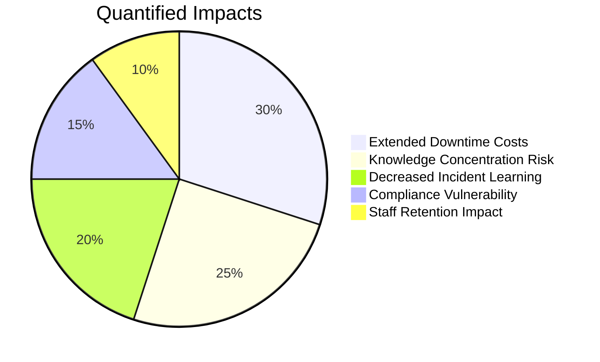

This chart illustrates the proportional breakdown of the major quantifiable impacts. Extended downtime contributes the largest share, directly affecting revenue and customer trust. Knowledge concentration risks and decreased incident learning further exacerbate long-term operational challenges. Together, these issues demonstrate the critical need for moving beyond the hero model to a collaborative, team-based approach in banking operations.

### Implementation Guidance

Transitioning from hero-based to collaborative on-call practices requires deliberate organizational change. Use the following steps and checklist to transform your on-call culture into a sustainable, collaborative model:

#### Practical Checklist for Implementation

- [ ] **Establish Formal Incident Roles**

  - Define clear roles (e.g., Incident Commander, Technical Lead, Communications Coordinator, Scribe) with documented responsibilities.
  - Develop and distribute role cards for quick reference during incidents.
  - Provide training programs to ensure team members are prepared for each role.

- [ ] **Implement Shadowing Program**

  - Pair experienced engineers with newer team members during incidents.
  - Set expectations for active participation from shadows rather than passive observation.
  - Rotate team members through roles to build diverse, broad capabilities.

- [ ] **Restructure Alerting and Escalation**

  - Redesign alerting systems to notify role-based teams rather than individuals.
  - Implement tiered escalation paths that bring in collaborative teams for major incidents.
  - Avoid piling responders onto incidents without a structure for collaboration.

- [ ] **Create Collaboration Infrastructure**

  - Establish virtual war rooms with standardized templates and dedicated communication channels (e.g., executive updates, technical investigation, customer impact assessments).
  - Use real-time, collaborative documentation tools to streamline incident management.

- [ ] **Measure Collaborative Effectiveness**

  - Track metrics such as:
    - Time-to-collaborative-response.
    - Percentage of multi-responder incidents.
    - Diversity in role rotation.
    - Quality of post-incident learning outcomes.
  - Review metrics quarterly and refine practices based on insights.

#### Text-Based Incident Workflow Representation

Below is a simple representation of how collaborative incident management can flow:

```
Incident Detected
     |
Role-Based Alerting
     |
Virtual War Room Initiated
     |
Roles Assigned:
  - Incident Commander
  - Technical Lead
  - Communications Coordinator
  - Scribe
     |
Collaborative Response
     |
Post-Incident Review
     |
Metrics Tracked & Practices Adjusted
```

By systematically following these steps and utilizing the practical checklist, organizations can successfully transition to a collaborative on-call model that improves resilience, reduces cognitive burden, and fosters team learning.

## Panel 2: Structured Knowledge Transfer - Documentation as Collaboration

### Scene Description

The scene depicts a split screen highlighting two contrasting approaches to handling the same critical trading platform incident:

**Left Panel:**\
A frantic new on-call engineer is overwhelmed, scrambling through a chaotic array of outdated wikis, fragmented chat logs, and scattered email threads, searching for relevant information. Alerts continue to pile up relentlessly, adding pressure and confusion.

**Right Panel:**\
A composed engineer works methodically, guided by a well-structured runbook. The runbook features:

- Embedded troubleshooting decision trees
- Clear system diagrams
- Historical incident references

Additionally, it includes defined escalation paths and a "known unknowns" section that points out areas requiring expert consultation, complete with contact information for subject matter experts.

Below is a simplified text-based representation of the split screen scenario:

```
+-----------------------------------------------------+
| Left: Frantic Search                                | Right: Calm Execution                           |
|-----------------------------------------------------|
| - Outdated wikis, chat logs, and emails             | - Well-structured runbook                      |
| - No clear troubleshooting strategy                | - Troubleshooting decision trees               |
| - Alerts piling up                                 | - System diagrams and historical references    |
| - High stress and confusion                        | - Clear escalation paths and SME contacts      |
+-----------------------------------------------------+
```

This visual comparison underscores the stark difference in outcomes when structured, collaborative documentation is in place versus when knowledge is fragmented and inaccessible.

### Teaching Narrative

Effective on-call collaboration begins before incidents occur through structured knowledge documentation. In traditional production support, knowledge often remains trapped in individual experts' minds or scattered across disconnected sources, creating high-stakes scavenger hunts during incidents. SRE practices treat documentation as a collaborative artifact that continuously evolves. Living runbooks, service catalogs, and decision trees externalize tacit knowledge, making the combined wisdom of the team available to anyone responding to an incident. This documentation isn't static—it represents an ongoing conversation among engineers about how systems behave, what failure modes exist, and which resolution strategies work. Well-structured knowledge artifacts transform on-call from isolated troubleshooting to standing on the shoulders of the entire team's collective experience.

### Common Example of the Problem

A major investment bank's equities trading platform experienced a critical latency issue during market hours. Alex, a recently onboarded on-call engineer, received the alert but had never worked on this particular system. The existing documentation consisted of a high-level architecture diagram from two years prior and fragmented wiki pages created by different team members using inconsistent formats. The most relevant troubleshooting guidance existed only in email threads between senior engineers who had since left the company.

The following timeline illustrates the sequence of events and delays caused by poor documentation:

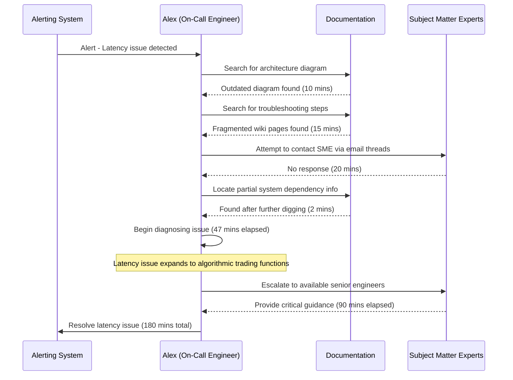

Without structured knowledge access, Alex spent 47 minutes just locating basic system information before even beginning diagnosis. During this delay, the latency issue expanded to affect algorithmic trading functions. By the time the issue was resolved three hours later, the bank had executed trades at non-optimal prices, resulting in approximately $1.2 million in avoidable losses and damaged client relationships with several institutional investors who missed critical execution windows.

### SRE Best Practice: Evidence-Based Investigation

Research from high-reliability organizations demonstrates that structured knowledge management dramatically improves incident outcomes. Netflix's SRE teams reduced mean time to resolution by 63% after implementing standardized, accessible documentation practices. The evidence points to several critical documentation patterns that enable effective on-call collaboration:

| Documentation Practice | Key Features | Benefits |
| ----------------------------------------- | --------------------------------------------------------------------------------- | -------------------------------------------------------------------------------------------------- |
| **Living Runbooks** | Continuously updated operational documents with decision trees and flows. | Enables responders to adapt to novel situations by capturing both "what to do" and "why to do it." |
| **Service Catalogs** | Centralized repositories of service metadata, ownership, and dependencies. | Reduces diagnostic time by 42% through quick access to essential context. |
| **Incident Pattern Libraries** | Categorized collections of past incidents with symptoms and contributing factors. | Resolves similar incidents 71% faster by transforming individual experience into shared knowledge. |
| **Collaborative Documentation Platforms** | Real-time, multi-author updates with version control and notification systems. | Improves documentation accuracy by 58% and reduces update friction. |
| **Knowledge Graph Approaches** | Explicit mapping of relationships between systems, teams, and failure modes. | Enhances navigation of complex environments, improving responder effectiveness. |

These patterns provide a foundation for evidence-based investigation during incidents, turning isolated troubleshooting into a collaborative effort. Below is a conceptual flow representing how structured documentation supports incident resolution:

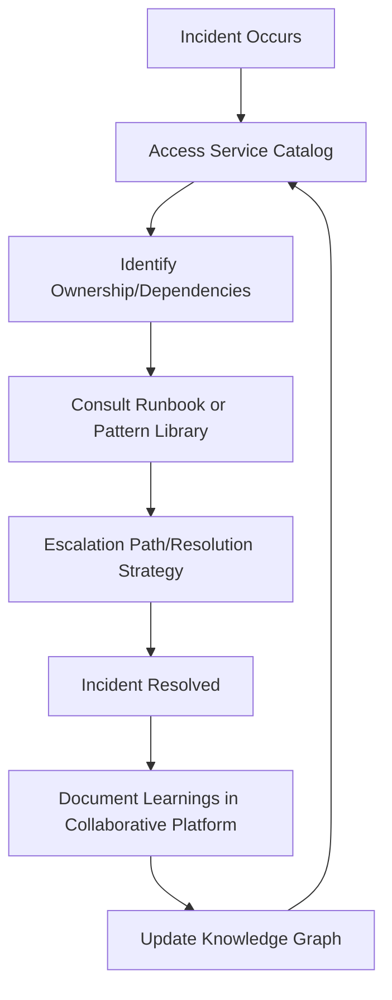

By investing in these documentation practices, teams can significantly reduce mean time to resolution (MTTR), improve accuracy, and foster a culture of continuous learning through shared knowledge.

### Banking Impact

Inadequate on-call knowledge management creates significant business impacts in banking environments. The table below summarizes key metrics that illustrate how fragmented or outdated documentation directly affects operational efficiency, compliance, and customer outcomes:

| **Impact Area** | **Description** | **Quantitative Impact** |
| ------------------------------------ | ----------------------------------------------------------------------------- | ---------------------------------------------------- |
| **Extended Time-to-Resolution** | Longer incident resolution times due to fragmented documentation. | 40-70% increase in time-to-resolution. |
| **Regulatory Exposure** | Documentation deficiencies cited by regulators during audits or examinations. | Increased risk of enforcement actions and fines. |
| **Escalation Overhead** | Increased reliance on senior staff due to unclear or incomplete runbooks. | $800-$1,500 per incident in diverted senior time. |
| **Inconsistent Customer Experience** | Variability in response quality due to non-standardized troubleshooting. | Unpredictable customer outcomes, affecting trust. |
| **Onboarding Inefficiency** | Longer ramp-up times for new engineers. | 60-90 additional days for new hires to be effective. |

These impacts highlight the critical need for structured, collaborative documentation practices. By addressing these gaps, banks can not only improve operational efficiency but also mitigate regulatory risks and enhance customer satisfaction.

### Implementation Guidance

Implement these five actions to transform on-call knowledge management in your organization. Use the checklist below as a practical guide to ensure effective adoption:

#### Checklist: Transforming On-Call Knowledge Management

- [ ] **Initiate Documentation Sprints**:

  - Schedule dedicated time (minimum quarterly) for teams to update and enhance documentation.
  - Focus on high-risk, frequently accessed systems first.
  - Define quality criteria: decision trees, dependency maps, and recovery procedures.

- [ ] **Implement "Update on Contact"**:

  - Enforce a policy requiring engineers to update documentation after using it during an incident, especially if gaps are identified.
  - Integrate this as a mandatory step in incident resolution workflows.

- [ ] **Create Template Frameworks**:

  - Develop standardized templates for runbooks, service descriptions, and troubleshooting guides.
  - Ensure templates include sections for:
    - Initial response steps.
    - Escalation criteria.
    - Known failure modes.

- [ ] **Establish Documentation Reviews**:

  - Make documentation quality a regular topic in service review meetings.
  - Conduct readiness drills where engineers solve simulated problems using only existing documentation, identifying gaps or improvements.

- [ ] **Build Knowledge Accessibility Tools**:

  - Implement robust search, cross-referencing, and tagging features across documentation platforms.
  - Integrate documentation links within monitoring tools to connect alerts with relevant resources.
  - Automate suggestions for documentation based on alert patterns.

#### Flow of Knowledge Management Enhancements

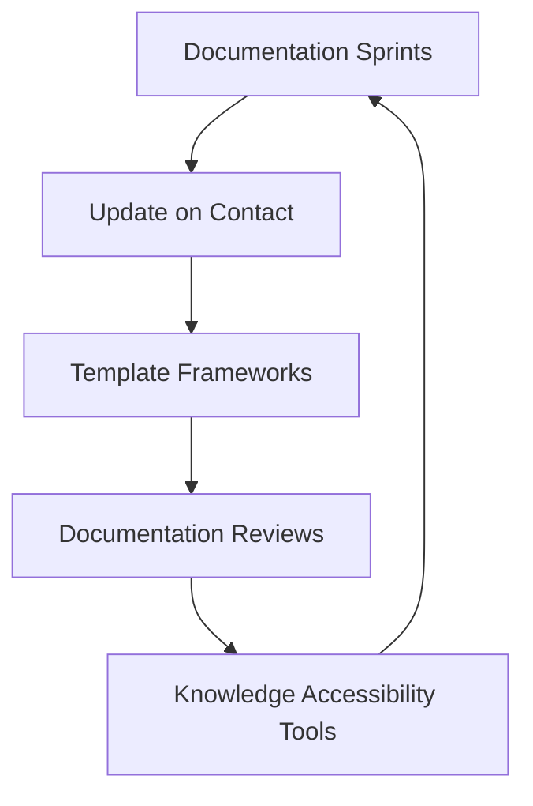

By following this checklist and adopting a continuous improvement mindset, your team can ensure documentation evolves as a collaborative, reliable resource that enhances on-call effectiveness.

## Panel 3: Tiered Response Models - Right People, Right Time

### Scene Description

An incident coordination dashboard shows a tier-based escalation in progress for a critical payment gateway failure. The visualization displays three concentric circles representing escalation tiers, with roles and actions clearly defined at each level:

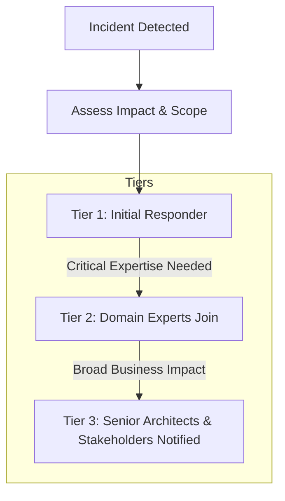

The dashboard also includes a timeline that tracks the incident progression, highlighting decision points for escalation between tiers. Real-time updates display role assignments as new responders join, with ownership indicators for distinct workstreams. This structured visualization ensures clear situational awareness and enables swift, informed decision-making at every stage of the incident response.

### Teaching Narrative

Effective collaborative on-call systems recognize that not every incident requires the same response magnitude or expertise profile. Tiered response models create structured escalation paths that bring in the right expertise at the right time, balancing comprehensive response against unnecessary disruption. Unlike traditional support models where escalation often means "passing the problem upward," SRE tiered responses are about assembling the optimal team composition based on incident characteristics. The model defines clear criteria for tier transitions, ensuring timely escalation without overreaction. This approach transforms on-call from binary individual accountability to a fluid team response that adapts to the incident's evolving nature. By establishing these frameworks in advance, we remove ambiguity about when to engage others and create predictable patterns that reduce coordination overhead during high-stress situations.

### Common Example of the Problem

A regional bank implemented a new mobile check deposit feature without a structured incident response model. The following timeline illustrates how the lack of a tiered model led to delays and inefficiencies during a critical incident:

```mermaid
gantt
    title Incident Response Timeline
    dateFormat HH:mm
    axisFormat %H:%M
    section Initial Response
    User complaints begin                :crit, start, 12:00, 10min
    On-call engineer assesses impact     :active, 12:10, 30min
    section Escalation Delays
    Engineer attempts isolated fixes     :active, 12:40, 20min
    Engineer contacts image processing team :crit, 13:00, 10min
    section Cross-Team Collaboration
    Image processing team identifies OCR issue :active, 13:10, 20min
    Vendor management team engaged       :crit, 13:30, 30min
    External OCR provider contacted      :active, 14:00, 30min
```

1. **12:00 - 12:10:** Users begin reporting intermittent failures with mobile check deposits. The on-call engineer is alerted and starts assessing the scope of the issue.
2. **12:10 - 12:40:** The engineer spends 30 minutes attempting to resolve the issue alone, lacking clear criteria for escalation or team engagement.
3. **12:40 - 13:00:** After isolated fixes fail, the engineer contacts the image processing team, delaying the response further.
4. **13:00 - 13:30:** The image processing team quickly identifies a dependency on a third-party OCR service experiencing degraded performance. However, they face additional delays in engaging the vendor management team due to unclear processes.
5. **13:30 - 14:00:** The vendor management team escalates to the external OCR provider, but by this time, the incident has affected thousands of users.

The lack of a predefined tiered response model resulted in significant inefficiencies:

- **Delayed Escalation:** Without clear criteria, the on-call engineer spent valuable time troubleshooting alone.
- **Fragmented Coordination:** Teams were engaged reactively and sequentially, rather than collaboratively.
- **Customer Impact:** Thousands of users were left without resolution or communication for over two hours.

This example underscores the importance of structured tiered response models. Such models ensure timely escalation, coordinated collaboration, and clear ownership at every stage of an incident.

### SRE Best Practice: Evidence-Based Investigation

Research from both technology and high-consequence industries demonstrates that structured tiered response models significantly improve incident outcomes. Organizations implementing formalized tiered response frameworks report the following benefits:

| **Benefit** | **Supporting Data** |
| ---------------------------------------- | ---------------------------------------------------------------------------------------------------------------------------- |
| **Faster Mean Time to Resolution** | Amazon's incident analysis shows a 56% reduction in resolution time for complex incidents. |
| **Reduction in Unnecessary Escalations** | Microsoft found a 47% decrease in senior team member disruptions while still ensuring critical incidents received attention. |
| **Improved Resource Utilization** | Netflix documented that tiered response models avoided both the "lone hero" problem and the "too many cooks" syndrome. |
| **More Accurate Initial Assessment** | High-reliability organizations reported a 62% improvement in incident classification accuracy. |
| **Better Stakeholder Experiences** | Customer satisfaction during incidents improved by 41% with tiered responses and dedicated communication resources. |

The most effective tiered response models include:

1. **Objective Severity Definitions**: Clear criteria for classifying incidents based on business impact, customer experience, and technical indicators rather than subjective assessment.
2. **Predefined Team Compositions**: Documented roles and team structures for each severity level, with automated tooling to assemble the right team based on the classification.
3. **Clear Escalation Triggers**: Specific conditions that trigger escalation between tiers, removing ambiguity about when to involve additional resources.
4. **Response Playbooks by Tier**: Standardized but flexible response approaches appropriate to each severity level, eliminating decision paralysis during incidents.

The following text-based flowchart illustrates how evidence-based practices integrate into a tiered response model:

```
Incident Occurs
    |
    v
Tier 1: Initial Responder
    |---> Assess Severity (Objective Criteria)
    |---> Classify Incident (Accuracy +62%)
    |
    v
Escalation Trigger Met?
    |                   |
    No                  Yes
    |                   |
    v                   v
Monitor & Resolve   Tier 2: Domain Experts
                        |---> Assemble Team (Predefined Roles)
                        |---> Apply Playbook
                        |
                        v
                    Tier 3: Senior Architects (if needed)
```

### Banking Impact

The business impact of inadequate tiered response models in banking environments includes:

- 🛡️ **Reputation Damage**\
  Inconsistent response to customer-facing incidents creates unpredictable experiences. Research shows banks with structured incident response recover customer trust 2.3x faster after outages.

- ⚖️ **Compliance Vulnerability**\
  Financial regulators increasingly expect documented and practiced incident response procedures with appropriate escalation protocols as part of operational resilience requirements.

- ⏳ **Resolution Delays**\
  Banks report 30-70% longer incident durations when using ad-hoc escalation versus structured tiered response, directly impacting financial transactions and customer experience.

- 💸 **Operational Inefficiency**\
  Overescalation creates unnecessary costs, estimated at $5,000-$12,000 per incident in senior leadership time. Conversely, underescalation leads to extended outages with direct revenue impact.

- 🎯 **Response Inconsistency**\
  Without tiered models, similar incidents receive dramatically different response approaches depending on which team members are involved, creating unpredictable outcomes and hindering systematic improvement.

### Implementation Guidance

Use the following checklist to establish an effective tiered response model. Each step includes actionable items to ensure clarity and ease of implementation:

#### Checklist for Tiered Response Model Implementation

- **1. Define Clear Severity Levels**

  - [ ] Create 3-5 incident severity tiers with objective classification criteria.
  - [ ] Base criteria on factors such as customer impact, transaction volume affected, security implications, and regulatory considerations.
  - [ ] Document specific examples for each tier to reduce classification ambiguity.

- **2. Map Response Teams to Tiers**

  - [ ] Design response team compositions for each severity level, specifying required and optional roles.
  - [ ] Identify domain experts and senior stakeholders aligned with each tier.
  - [ ] Set up automated notification templates that dynamically assemble teams based on incident classification.

- **3. Establish Escalation Triggers**

  - [ ] Define time-based triggers (e.g., unresolved incidents after X minutes).
  - [ ] Establish impact-based triggers (e.g., affecting more than Y customers or critical systems).
  - [ ] Incorporate complexity triggers (e.g., incidents involving multiple systems or cross-team dependencies).

- **4. Develop Tier-Specific Playbooks**

  - [ ] Create standardized response procedures for each tier, allowing flexibility for unique incidents.
  - [ ] Include communication templates tailored to the severity level.
  - [ ] Outline investigation approaches and decision-making frameworks appropriate to each tier.

- **5. Implement Regular Testing**

  - [ ] Schedule quarterly incident simulation exercises for each severity tier.
  - [ ] Rotate team members through different roles during simulations to broaden skill sets and response familiarity.
  - [ ] Review simulation outcomes to validate response patterns and identify improvement opportunities.

By following this checklist, teams can systematically implement a structured and adaptable tiered response model, ensuring the right expertise is engaged at the right time during incidents.

## Panel 4: Follow-the-Sun Models - Global Collaboration

### Scene Description

A world map illustrates banking operations centers distributed across multiple time zones. Arrows indicate the seamless flow of on-call handoffs following daylight progression, emphasizing the continuous nature of global collaboration. Below is a visual representation of the scenario using a Mermaid diagram to depict the interactions:

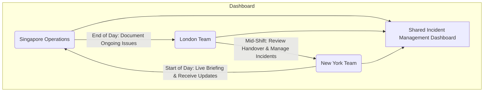

In this diagram:

- Singapore operations conclude their shift by documenting ongoing issues and sharing detailed notes.
- The London team, mid-shift, reviews these notes and actively manages incidents while adding context and updates.
- The New York team starts their day with a live video briefing, ensuring they are fully aligned with the latest developments.
- All teams contribute to a shared incident management dashboard that provides consistent tracking, with annotations building on the observations of the previous regions.

This visualization highlights the synchronized global effort, ensuring smooth transitions, maintained context, and continuous situational awareness across all regions.

### Teaching Narrative

As banking systems become globally integrated, traditional regional on-call models create artificial boundaries that fragment incident response and institutional knowledge. Follow-the-sun collaboration models recognize that reliability is a 24/7 global responsibility where teams across time zones function as a single distributed entity rather than isolated shifts. This approach transforms handovers from brief summaries to rich knowledge transfers that maintain context and momentum. Critical to this model is the shared understanding that on-call responsibilities aren't simply "passed" between regions but collaboratively managed across a global team with continuous situational awareness. This requires standardized communication protocols, consistent tooling, and a unified incident taxonomy that transcends regional differences. For organizations transitioning from production support to SRE practices, follow-the-sun represents a fundamental shift from "my region, my responsibility" to "our global systems, our shared responsibility."

### Common Example of the Problem

A multinational bank operating a global trading platform maintained separate on-call teams in Hong Kong, London, and New York, each responsible for their regional business hours with minimal overlap. When an authentication service began experiencing intermittent failures in the Asian market, the Hong Kong team investigated for several hours, identifying potential causes but not implementing a complete fix before their shift ended. Their handover to London consisted of a brief email and chat message summarizing findings. The London team, lacking the full context and investigation history, essentially restarted the diagnostic process, pursuing several paths the Hong Kong team had already eliminated. By the time the London team made progress, their shift was ending, and a similarly limited handover occurred with New York. This cycle repeated for nearly 30 hours, with each regional team effectively restarting the investigation rather than building on previous work.

Below is a timeline representation of how the fragmented approach caused delays and inefficiencies:

```mermaid
gantt
    title Fragmented Incident Resolution Timeline
    dateFormat  HH:mm
    axisFormat  %H:%M
    section Hong Kong
    Investigation and partial analysis :active, hk1, 09:00, 8h
    End of shift, incomplete handover    :crit, hk2, after hk1, 1h
    section London
    Restarting diagnostics, lost context :crit, ln1, after hk2, 7h
    Limited progress, handover to NY     :crit, ln2, after ln1, 1h
    section New York
    Restarting diagnostics again         :crit, ny1, after ln2, 8h
    End of loop, no resolution yet       :crit, ny2, after ny1, 1h
```

Meanwhile, the authentication issue spread to other regions, affecting high-value customers who experienced inconsistent trading capabilities across the day. The fragmented approach tripled the actual resolution time and created a disjointed customer experience as each region provided different status updates and estimated resolution times.

### SRE Best Practice: Evidence-Based Investigation

Organizations with mature follow-the-sun models consistently outperform regionally isolated teams across key reliability metrics. Research from global technology companies and financial institutions reveals several evidence-based practices. The table below summarizes these practices, their benefits, and supporting research for improved scannability and actionable insights:

| **Practice** | **Description** | **Benefits** | **Supporting Research** |
| ------------------------------------ | ------------------------------------------------------------------------------------------------------------------------- | ------------------------------------------------------------------------------------------------------ | ---------------------------------------------------------------------------------------- |
| **Continuous Knowledge Transfer** | Maintain continuous documentation of investigation status, attempted solutions, and current theories in shared platforms. | Reduces duplication of effort and ensures all regions have real-time visibility into incident context. | Studies from global tech companies show improved resolution times and reduced rework. |
| **Overlapping Transition Periods** | Implement 30-60 minute structured handover calls where outgoing and incoming teams actively collaborate. | Reduces incident resolution time by 37% through synchronous communication. | Google research on synchronous handovers highlights significant efficiency gains. |
| **Consistent Tooling and Processes** | Standardize incident management tools, documentation formats, and investigation approaches across regions. | Improves cross-region collaboration effectiveness by 64%. | Microsoft findings on standardized tooling and processes. |
| **Global Incident Ownership** | Maintain consistent incident commanders coordinating across regions while regional teams execute in their time zone. | Reduces context loss by 71% and ensures continuity of ownership and accountability. | Case studies from financial institutions show dramatic improvement in context retention. |
| **"One Team" Metrics** | Measure incident performance at the global level rather than regionally to build shared accountability. | Eliminates regional hand-off delays and fosters collaboration toward shared outcomes. | Industry benchmarks from leading organizations demonstrate success with shared metrics. |

These practices emphasize the importance of standardized protocols, real-time collaboration, and shared accountability. By embedding these principles into follow-the-sun models, organizations can achieve higher reliability and seamless global operations.

### Banking Impact

The business consequences of fragmented regional on-call models in banking include significant operational, customer, and compliance risks. Use the checklist below to quickly assess the impacts on your organization:

#### Checklist: Key Impacts of Fragmented Regional On-Call Models

- [ ] **Extended Resolution Timelines**: Are your incident durations 40-70% longer for issues spanning time zones? This directly impacts revenue, especially for time-sensitive services like trading platforms.
- [ ] **Inconsistent Customer Communication**: Are clients receiving contradictory status updates or resolution timelines from different regions, leading to erosion of customer confidence?
- [ ] **Repetitive Investigation Costs**: Is your organization wasting 30-50% of diagnostic effort re-investigating previously explored paths due to poor handover processes?
- [ ] **Global Client Dissatisfaction**: Are you meeting multinational client expectations for consistent service experiences across regions? Remember, 76% of clients cite global service consistency as a key factor in provider selection.
- [ ] **Regulatory Complexity**: Are fragmented incident responses making it harder to provide comprehensive timelines and resolution efforts to regulators, increasing compliance risks?

By addressing these areas, organizations can transition from fragmented regional responses to a streamlined, globally integrated incident management approach, ensuring better operational efficiency, customer satisfaction, and regulatory compliance.

### Implementation Guidance

Implement these five steps to establish effective follow-the-sun collaboration. The following step-by-step diagram outlines the process visually for clarity:

```mermaid
graph TD
    Step1[1. Implement Shared Incident Management Platforms] --> Step2[2. Establish Structured Handover Protocols]
    Step2 --> Step3[3. Standardize Global Processes]
    Step3 --> Step4[4. Institute Global On-Call Roles]
    Step4 --> Step5[5. Create "One Team" Metrics]
```

1. **Implement Shared Incident Management Platforms**:\
   Deploy globally accessible incident management tools that maintain investigation state, attempted solutions, and current status across regional handoffs. Ensure all documentation and communication occurs in these shared systems rather than regional tools.

2. **Establish Structured Handover Protocols**:\
   Create mandatory 30-minute overlap periods between regional teams with specific handover templates covering current status, attempted solutions, planned next steps, and known blockers. Record these sessions for asynchronous access by other team members.

3. **Standardize Global Processes**:\
   Develop uniform incident classification, investigation approaches, and escalation procedures across all regions. Create shared runbooks and response playbooks that work across time zones rather than region-specific documentation.

4. **Institute Global On-Call Roles**:\
   Implement 24-hour incident commander roles for significant incidents who maintain continuity while working with regional teams. Define clear ownership boundaries between global coordination and regional execution functions.

5. **Create "One Team" Metrics**:\
   Establish shared performance metrics across all regions including global time-to-resolution, handoff effectiveness, and knowledge reuse rates. Conduct regular retrospectives that include members from all regional teams to identify cross-region improvement opportunities.

## Panel 5: On-Call Shadowing - Experiential Learning

### Scene Description

Two engineers sit side by side at a workstation, surrounded by a setup designed for efficient incident response. In front of them are multiple monitoring screens displaying critical metrics, logs, and alerts related to a developing incident in the bank's fraud detection system. The experienced engineer narrates her thought process out loud, methodically navigating through dashboards, logs, and diagnostic tools. The shadowing engineer actively listens, asking clarifying questions as needed, and records observations in a structured template with sections for symptoms, investigation approaches, tools used, and decision points.

On the nearby whiteboard, a "shadow rotation schedule" is prominently displayed, showing all team members cycling through shadowing experiences with different senior engineers over the next month. Below is a simplified representation of the setup:

```
+------------------+------------------+------------------+------------------+
| Monitoring       | Logs            | Dashboards       | Alerts           |
| Screen 1         | Screen 2        | Screen 3         | Screen 4         |
+------------------+------------------+------------------+------------------+
   ^                                                                        
   |                                                                        
   |                                                                        
+-------------------------+   +-------------------------+                   
| Experienced Engineer    |   | Shadowing Engineer      |                   
| Verbalizes thought      |   | Takes notes, asks       |                   
| process and decisions   |   | questions, documents    |                   
+-------------------------+   +-------------------------+                   

Whiteboard: Shadow Rotation Schedule                                        
-------------------------------------                                       
| Week 1: Engineer A -> Engineer B   |                                      
| Week 2: Engineer C -> Engineer D   |                                      
| Week 3: Engineer E -> Engineer F   |                                      
| Week 4: Engineer G -> Engineer H   |                                      
-------------------------------------                                       
```

This layout emphasizes the collaborative dynamic, with the experienced engineer providing context and the shadowing engineer actively engaging in the learning process. The structured notes and rotation schedule ensure continuity and systematic knowledge transfer across the team.

### Teaching Narrative

On-call expertise isn't developed through documentation alone—it requires guided experiential learning that traditional production support models rarely formalize. Structured shadowing programs pair experienced and newer engineers during real incidents, transforming tribal knowledge into explicit learning. Unlike passive observation, effective shadowing involves the experienced responder verbalizing their mental models and decision frameworks while the shadow actively questions and documents the process. This creates a cognitive apprenticeship where intuitive expertise becomes systematically transferable. For teams transitioning to SRE practices, implementing formal shadow rotations acknowledges that reliable incident response is a skill developed through deliberate practice, not just accumulated experience. This approach breaks down the common "sink-or-swim" mentality of traditional on-call onboarding while creating a continuous knowledge transfer mechanism that strengthens the entire team's capabilities.

### Common Example of the Problem

A commercial banking division implemented a new treasury management platform with sophisticated cash flow forecasting capabilities. The small team of platform specialists who developed the system also handled on-call support, with new team members expected to learn through exposure to incidents. When Raj joined the team, he was added to the on-call rotation after just two weeks of general orientation.

His first solo on-call shift included a major incident where the cash forecasting algorithm began generating erroneous projections for several large corporate clients. Without prior guided experience, Raj struggled to:

- Navigate the complex monitoring systems.
- Locate relevant logs to identify root causes.
- Understand the algorithm's normal behavioral patterns.

He attempted to engage other team members, but their ad-hoc guidance consisted mainly of tool-specific instructions rather than diagnostic approaches or system-level understanding. The incident took over five hours to resolve, during which several corporate clients made cash management decisions based on incorrect forecasts, resulting in unnecessary short-term loans and associated fees.

In the post-incident review, it became clear that Raj lacked not just specific system knowledge but also the structured investigative approach that experienced team members had developed through years of informal exposure.

#### Key Lessons and Actionable Takeaways:

1. **Structured Onboarding Matters**: New engineers require guided on-call preparation through shadowing or similar programs to build confidence and competence.
2. **Focus on Diagnostic Frameworks**: Effective incident response demands a structured investigation approach, not just familiarity with tools.
3. **Encourage Knowledge Transfer**: Tribal knowledge must be systematically shared through mechanisms like shadow rotations and live narrations of thought processes.
4. **Minimize Sink-or-Swim Scenarios**: Placing new engineers in solo on-call roles without adequate preparation increases risk and reduces team effectiveness.
5. **Post-Incident Reviews Are Critical**: Use reviews to identify gaps in onboarding, system understanding, and response frameworks to continuously improve team capability.

### SRE Best Practice: Evidence-Based Investigation

Research from high-reliability organizations demonstrates that formalized shadowing programs dramatically outperform informal knowledge transfer approaches. Evidence-based best practices include:

| Best Practice | Description | Impact Percentage (Improvement) |
| --------------------------------------- | ------------------------------------------------------------------------------------------------------------------- | --------------------------------------------- |
| **Structured Cognitive Apprenticeship** | The experienced engineer verbalizes their thought process ("thinking aloud") instead of just demonstrating actions. | +73% Knowledge Transfer |
| **Active vs. Passive Shadowing** | Shadows take specific assigned responsibilities during incidents rather than passively observing. | +68% Skill Development |
| **Diverse Shadow Experiences** | Rotating shadows across different responders for exposure to varied problem-solving approaches. | Greater adaptability, qualitative improvement |
| **Progressive Responsibility Models** | Gradual increase in ownership for shadows across sessions to build confidence and competency. | +57% Competency Development |
| **Structured Reflection Practices** | Documenting reflections post-shadowing to solidify learning and improve knowledge retention. | +64% Knowledge Retention |

#### Key Components of Formalized Shadowing Programs:

- **Defined Shadow Progression**:
  - Clear pathways from initial observation to assisted response, culminating in independent action under supervision.
- **Shadow Learning Artifacts**:
  - Standardized documentation templates for shadows to capture symptoms, investigation methods, tools used, decisions made, and post-incident insights.
- **Verbalization Protocols**:
  - Primary responders are expected to narrate their thought process, enhancing transparency and understanding for the shadow.
- **Bilateral Feedback Mechanisms**:
  - Structured debriefs where primary responders and shadows exchange feedback, discuss what worked well, and identify areas for improvement.

By adopting these evidence-based practices, SRE teams can transform shadowing from informal, ad-hoc observation into a structured, impactful learning experience, significantly enhancing team-wide incident response capabilities.

### Banking Impact

The business impact of inadequate experiential learning in banking on-call environments includes:

#### Key Metrics Summary:

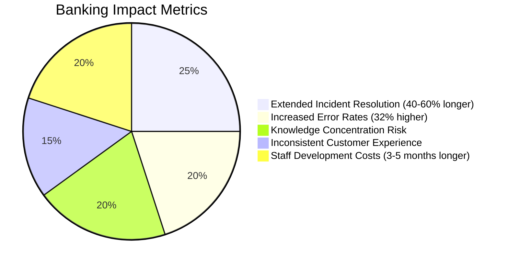

1. **Extended Incident Resolution**: Financial institutions report 40-60% longer resolution times when inexperienced responders handle incidents without proper shadowing preparation, directly impacting service availability and transaction processing.

2. **Increased Error Rates**: Banks experience a 32% higher rate of human error during incident response from responders without structured shadowing experience, potentially compounding initial incidents.

3. **Knowledge Concentration Risk**: Without effective knowledge transfer, critical response capabilities remain concentrated in a small number of experienced team members, creating significant business continuity risk.

4. **Inconsistent Customer Experience**: Lack of standardized response approaches leads to variable incident handling quality, creating unpredictable customer experiences during service disruptions.

5. **Staff Development Costs**: Banking institutions report 3-5 months longer time-to-proficiency for on-call staff without structured shadowing programs, representing significant operational inefficiency in specialized teams.

### Implementation Guidance

Use the following step-by-step checklist to establish an effective on-call shadowing program. These steps ensure the program is systematic, scalable, and impactful for both shadowing engineers and primary responders.

#### Checklist: Building an On-Call Shadowing Program

1. **Define Shadow Roles and Responsibilities**

   - [ ] Document clear responsibilities for both primary responders and shadows during incidents.
   - [ ] Establish progressive shadow levels:
     - Observation: Passive learning through note-taking and structured observation.
     - Assisted Response: Shadows assist primary responders under guidance.
     - Supervised Action: Shadows take the lead in responding with oversight.
   - [ ] Define specific criteria for advancement between levels.

2. **Design a Structured Shadow Rotation Schedule**

   - [ ] Create a formal shadow rotation schedule covering all team members.
   - [ ] Ensure shadows rotate across:
     - Multiple primary responders to learn diverse techniques.
     - Various incident types for broader exposure to scenarios.
   - [ ] Review and adjust the schedule quarterly to accommodate team changes and workloads.

3. **Develop Standardized Shadow Documentation Templates**

   - [ ] Create templates for shadows to record observations during incidents, including:
     - Symptoms and high-level incident descriptions.
     - Investigation approaches and tools used.
     - Key decision points and their rationales.
     - Follow-up questions and additional learning points.
   - [ ] Ensure templates are easy to access and fill out during high-pressure scenarios.

4. **Establish Verbalization Protocols for Primary Responders**

   - [ ] Train responders to verbalize their thought processes by:
     - Articulating mental models and decision frameworks.
     - Explaining "why" decisions are made, alongside "what" actions are taken.
   - [ ] Provide a set of guiding prompts, such as:
     - "What do you think is causing the issue?"
     - "Why are you prioritizing this action?"
     - "What are the risks of this approach?"
   - [ ] Encourage responders to practice verbalization during non-critical incidents to build confidence.

5. **Introduce Post-Shadow Reflection Sessions**

   - [ ] Schedule 15-30 minute debriefs immediately after shadowing sessions.
   - [ ] Structure reflections to include:
     - Reviewing the incident response step-by-step.
     - Identifying learning opportunities for both the shadow and primary responder.
     - Documenting insights for broader team sharing.
   - [ ] Use these sessions to track shadow progression and provide feedback.

#### Flowchart: Shadowing Program Workflow

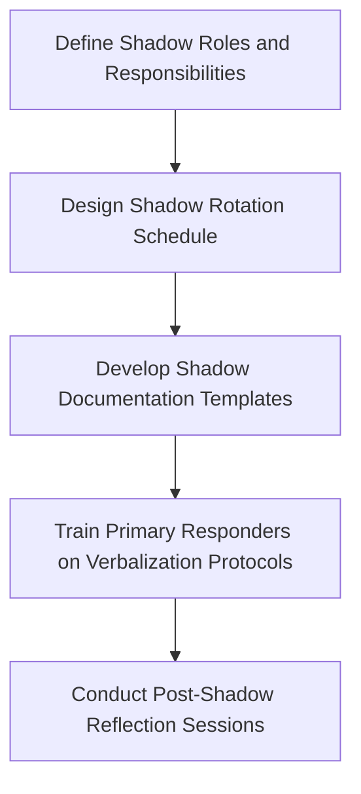

By following this checklist and workflow, teams can implement a robust on-call shadowing program that fosters experiential learning, improves incident response capabilities, and facilitates effective knowledge transfer.

## Panel 6: Psychological Safety in On-Call - Foundation for Collaboration

### Scene Description

A team retrospective session focuses on a major incident that occurred the previous week. On a digital whiteboard, we see the following sections:

```
+--------------------------+
|      Digital Whiteboard  |
+--------------------------+
| What Went Well           |
| - Prompt communication   |
| - Effective escalation   |
|                          |
| What Could Improve       |
| - Runbook gaps noted     |
| - Delayed decision-making|
|                          |
| Action Items             |
| - Update runbook with    |
|   lessons from production|
|   incident               |
+--------------------------+
```

The manager is visibly engaged and pointing to an action item that reads "Update runbook with lessons from production incident." A junior engineer who was on-call during the incident is openly discussing a decision that extended the incident duration, without defensive body language. Other team members ask clarifying questions without blame language, focused on system improvements rather than individual critique.

### Teaching Narrative

Collaborative on-call cannot thrive without psychological safety—the shared belief that team members won't be punished or humiliated for speaking up with ideas, questions, concerns, or mistakes. In traditional production support environments, on-call incidents often become sources of blame and reputational risk, driving defensive behaviors and information hiding. SRE practices recognize that incidents represent valuable learning opportunities that require transparent sharing of what happened, including decisions that may have extended or complicated the response. This transparency depends on leadership that consistently demonstrates that incidents reflect system fragility, not individual failure. For teams transitioning to SRE, building psychological safety means deliberately changing how we speak about incidents—from "Who caused this?" to "What system conditions enabled this?" This cultural foundation transforms on-call from a high-stress individual burden to a supported team activity where learning outweighs blame.

### Common Example of the Problem

A major investment bank's trading platform experienced a significant outage during market hours when Marco, a relatively new on-call engineer, implemented a configuration change that had unintended consequences. During the incident response, Marco initially hesitated to admit his involvement, fearing career repercussions in the bank's traditionally blame-oriented culture. This hesitation acted like a clogged communication pipeline: the critical flow of information needed to diagnose the issue was blocked, delaying the team's understanding of what had changed and extending the diagnostic phase by nearly 40 minutes.

When Marco eventually disclosed his action, leadership's response focused on why he had made the change without proper approval rather than examining the systemic factors that made the change seem reasonable at the time. This created a "broken feedback loop," where the team's focus was misdirected toward assigning fault rather than learning from the incident. The post-mortem centered on "human error" and resulted in additional procedural controls, which only added friction to the system without addressing its underlying brittleness.

Over time, the team's psychological safety eroded further. Team members became increasingly reluctant to take initiative during incidents, frequently escalating minor issues to senior staff and avoiding documentation of potential risks. Without the free exchange of ideas or shared learning, the system became more fragile. Six months later, a nearly identical configuration issue caused another outage, but the previous incident's lessons had been lost—evidence of how a broken feedback loop can perpetuate systemic failures when psychological safety is absent.

### SRE Best Practice: Evidence-Based Investigation

Research across high-reliability organizations demonstrates that psychological safety is the foundation of effective incident response and organizational learning. Google's Project Aristotle identified psychological safety as the most critical factor in team effectiveness, with particularly strong correlation to incident management performance.

Evidence-based practices for building psychological safety in on-call contexts, along with their outcomes, are summarized below:

| **Practice** | **Description** | **Key Outcomes** | **Improvement Percentage** |
| ------------------------------------- | --------------------------------------------------------------------------------------------------- | -------------------------------------------------------------------------------------------------- | ------------------------------------------------------- |
| **Blameless Postmortem Methodology** | Structured reviews that focus on system factors rather than individual blame. | More complete information sharing during incident analysis; more systemic improvements identified. | 78% more complete sharing, 64% systemic improvements. |
| **Leader Behavior Modeling** | Leaders openly discuss their own mistakes and uncertainties to set a tone of learning and openness. | Increased psychological safety, resulting in improved incident reporting timeliness. | 56% increase in team safety scores. |
| **Systems-Focused Language Patterns** | Training teams to discuss incidents using system-focused, not person-focused, language. | Improved error reporting; reduction in repeat incidents. | 47% improvement in reporting, 34% reduction in repeats. |
| **Hindsight Bias Mitigation** | Explicitly addressing hindsight bias during incident reviews to ensure fair analysis of decisions. | Higher rates of voluntary error disclosure; more comprehensive incident documentation. | 52% higher disclosure rates. |
| **Learning-Oriented Metrics** | Measuring incident learning outcomes instead of only focusing on downtime reduction. | Proactive identification of potential failures before impacting customers. | 63% improvement in proactive failure detection. |

This table highlights how adopting evidence-based practices not only fosters psychological safety but also improves team and system performance. By integrating these approaches, SRE teams can ensure that incidents become opportunities for growth and resilience.

### Banking Impact

The business consequences of psychological safety deficits in banking on-call environments include:

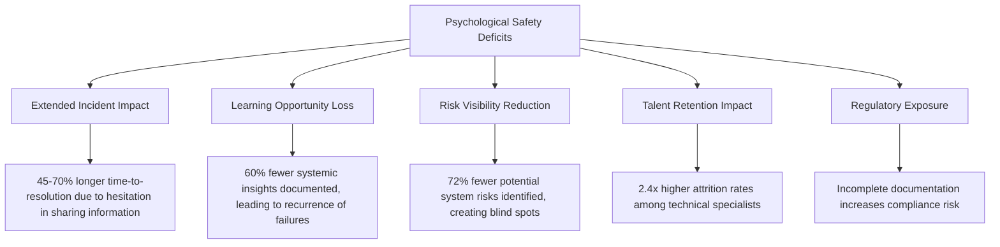

1. **Extended Incident Impact**\
   Financial institutions with low psychological safety experience **45-70% longer time-to-resolution** for incidents involving human actions, as team members hesitate to share potentially relevant information.

2. **Learning Opportunity Loss**\
   Banks report that **blame-oriented cultures document 60% fewer systemic insights** from incidents, leading to higher rates of recurrence for similar failures.

3. **Risk Visibility Reduction**\
   Studies show that teams with low psychological safety identify and document **72% fewer potential system risks**, creating blind spots in risk management programs.

4. **Talent Retention Impact**\
   Financial institutions with blame-oriented incident cultures experience **2.4x higher attrition rates** among technical specialists, particularly affecting critical institutional knowledge retention.

5. **Regulatory Exposure**\
   Post-incident reviews that focus on blame rather than systems understanding create incomplete documentation that **fails to satisfy regulatory expectations** for comprehensive incident analysis, potentially increasing compliance risk.

### Implementation Guidance

Use the following checklist to build psychological safety in on-call practices. Each step includes actionable items to ensure clarity and ease of implementation:

#### **Step 1: Reframe Language Patterns**

- [ ] Train all team members, especially leaders, on systems-focused communication.
- [ ] Replace blame-oriented questions (e.g., "Who made this change?") with systems-oriented ones (e.g., "What factors made this change seem appropriate?").
- [ ] Create and distribute a quick reference guide for constructive language patterns during incidents.

#### **Step 2: Implement Blameless Postmortem Structure**

- [ ] Adopt formal blameless review methodologies with facilitator training and structured templates.
- [ ] Focus incident reviews explicitly on systemic factors rather than individual actions.
- [ ] Ensure leadership actively participates in postmortems and visibly supports the blameless approach.

#### **Step 3: Recognize and Reward Transparency**

- [ ] Develop a formal process to recognize team members for identifying risks, acknowledging mistakes, or sharing near-miss experiences.
- [ ] Make this recognition visible across the organization to reinforce the importance of transparency.
- [ ] Regularly communicate examples of transparency being rewarded to foster a culture of openness.

#### **Step 4: Address Hindsight Bias**

- [ ] Include explicit discussions about hindsight bias in all incident reviews.
- [ ] Emphasize understanding decisions based on the information available at the time, rather than judging outcomes retroactively.
- [ ] Create training materials to help team members identify and counter hindsight bias effectively.

#### **Step 5: Measure Psychological Safety**

- [ ] Conduct regular anonymous surveys to assess psychological safety, using validated instruments.
- [ ] Track key metrics such as:
  - Time-to-acknowledge mistakes.
  - Incident reporting latency.
  - Near-miss disclosure rates.
- [ ] Use survey results and metrics to continuously monitor and improve psychological safety practices.

## Panel 7: On-Call Engineering - Reducing Future Pain

### Scene Description

An SRE team is gathered around a "Toil Board," a visual representation of metrics from the past month's on-call incidents. The board is divided into sections that categorize incidents by frequency, response time, and resolution complexity. Sticky notes are placed on specific incident types, each containing automation ideas to address recurring issues.

Next to the Toil Board is a prioritization matrix on a whiteboard. The matrix is split into four quadrants: "Low Pain, Low Frequency," "High Pain, Low Frequency," "Low Pain, High Frequency," and "High Pain, High Frequency." The top-right quadrant ("High Pain, High Frequency") is emphasized with engineering projects mapped to address the most impactful issues.

A team calendar is also displayed, showing dedicated "toil reduction" time blocks interspersed between on-call rotations. This structured time is reserved for implementing improvements identified during incident reviews.

One engineer is seen updating a dashboard that tracks "toil reduction progress." The dashboard includes a graph displaying a downward trend in the number of alerts for specific categories, signaling the team's success in reducing toil.

Below is a simplified representation of the setup:

```
+------------------------+       +-------------------------------+
|        Toil Board      |       |   Prioritization Matrix       |
|------------------------|       |-------------------------------|
| Frequency | Response   |       |               | High Pain     |
| Time      | Complexity |       |               |               |
|------------------------|       |               |   [Projects]  |
| Sticky Notes w/ Ideas  |       |   Low Pain    |---------------|
|                        |       |               |               |
+------------------------+       |               | High Frequency|
                                 +-------------------------------+

+------------------------------------------+
|            Team Calendar                 |
|------------------------------------------|
| Mon: Incident Review                     |
| Tues: Toil Reduction Time                |
| ...                                      |
+------------------------------------------+

+------------------------------------------+
|        Toil Reduction Progress           |
|------------------------------------------|
| Alert Category A: ▄▄▄▄▄▄▄▄▅▃▂▁           |
| Alert Category B: ▄▄▄▄▄▄▅▃▁               |
| ...                                      |
+------------------------------------------+
```

This setup fosters a collaborative and systematic approach to identifying, prioritizing, and resolving sources of toil, ensuring that on-call experiences directly inform engineering priorities.

### Teaching Narrative

The most mature collaborative on-call practice is systematically eliminating the need for human intervention through continuous improvement. Traditional production support often accepts on-call pain as an inevitable cost of doing business, but SRE views frequent alerts as engineering problems to be solved. By instrumenting and analyzing on-call activities, patterns of toil become visible and addressable through automation, better detection mechanisms, and system redesign. This approach transforms on-call from a reactive stance to a proactive engineering discipline where each incident becomes data that drives system improvement. For teams transitioning to SRE, implementing structured "toil reduction" practices signals that the organization values both immediate incident response and the engineering work that prevents future incidents. The collaborative element emerges as teams collectively identify, prioritize, and address the highest-impact improvement opportunities, creating a virtuous cycle where on-call experiences directly shape engineering priorities.

### Common Example of the Problem

A commercial bank's payment processing team operated under a traditional production support model where on-call engineers routinely handled dozens of alerts each week. A recurring issue involved transaction batch processing failures that required manual intervention to restart failed jobs and reconcile partially processed transactions. This occurred approximately three times weekly, typically taking 1-2 hours to resolve each time and often happening outside business hours. Despite the pattern being well-established over 18 months, the team considered these incidents "normal operational issues" rather than engineering problems to be solved. Engineers documented each occurrence and developed efficient manual procedures but never allocated time to address the underlying causes.

The frequent alerts led to on-call fatigue, with team members requesting transfers to other departments and reporting weekend plans regularly disrupted by these predictable but persistent issues. When management finally calculated the operational cost, they discovered the team had spent over 450 hours in the past year manually handling these recurring incidents—equivalent to nearly three months of a full-time engineer's productivity, not counting the impact on team morale and the business risk of continued manual intervention.

#### Visualization of the Problem

| **Metric** | **Details** |
| --------------------------- | --------------------------------------------------------------------------- |
| **Frequency of Issue** | ~3 times per week |
| **Time Spent per Incident** | 1-2 hours |
| **Annual Hours Spent** | ~450 hours |
| **Operational Cost Impact** | Nearly 3 months of a full-time engineer's productivity |
| **Team Impact** | On-call fatigue, morale decline, weekend disruptions, and transfer requests |

#### Timeline of the Issue

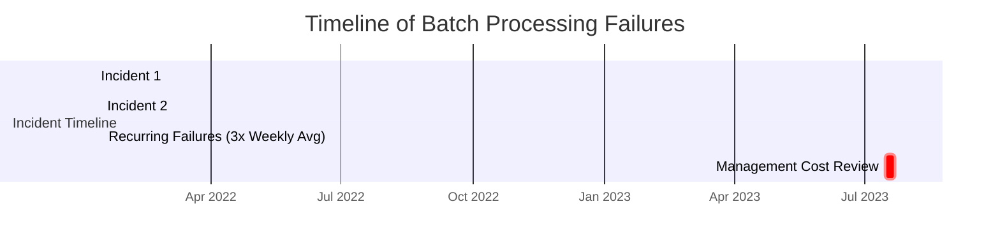

This table and timeline illustrate the recurring nature and the significant operational costs of failing to address the underlying engineering problem, emphasizing the need for systematic toil reduction efforts.

### SRE Best Practice: Evidence-Based Investigation

Organizations with mature on-call engineering practices demonstrate significantly better reliability outcomes and engineer satisfaction. Research across high-performing technology organizations reveals several evidence-based approaches:

#### Key Evidence-Based Practices

1. **Toil Quantification Methodologies**: Companies that systematically measure on-call workload using metrics like alert frequency, manual intervention time, and sleep interruption patterns identify 3.2x more improvement opportunities than those relying on anecdotal experience.

2. **Time Allocation Models**: Google's SRE practice establishes that limiting operational toil to 50% of engineer time while dedicating the remainder to system improvement results in exponential reliability gains. Teams that maintain this balanced allocation report 74% fewer alerts per service over 12-month periods.

3. **Toil Reduction Frameworks**: Amazon's systematic approach to categorizing and prioritizing automation opportunities based on frequency, pain, and risk factors has demonstrated 5.2x ROI on engineering time invested in toil reduction.

4. **Continuous Improvement Cycles**: Microsoft's research shows that teams implementing regular "on-call engineering sprints" focused on eliminating recent incident causes reduce similar incidents by 67% compared to teams without dedicated improvement cycles.

5. **Automation Impact Measurement**: Netflix's practice of tracking alert reduction after automation initiatives shows that teams measuring automation outcomes invest more strategically in high-impact improvements, achieving 3.8x greater reduction in on-call burden compared to teams without measurement frameworks.

#### Checklist for Evidence-Based On-Call Improvement

| Practice | Key Actions | Expected Outcome |
| ----------------------------- | ------------------------------------------------------------------------------------------ | ------------------------------------------------------------------------------------------ |
| Toil Quantification | Measure alert frequency, manual intervention time, and sleep disruption. | Uncover 3.2x more improvement opportunities. |
| Balanced Time Allocation | Limit operational toil to 50% of engineering time; dedicate the remainder to improvements. | Achieve 74% fewer alerts per service annually. |
| Toil Reduction Framework | Categorize and prioritize automation by frequency, pain, and risk. | Deliver 5.2x ROI on engineering time for toil reduction projects. |
| Continuous Improvement Cycles | Schedule and execute regular sprints to address recent incident causes. | Reduce similar incidents by 67%. |
| Automation Impact Measurement | Track alert reduction and outcomes after automation initiatives. | Achieve 3.8x greater reduction in on-call burden by investing in high-impact improvements. |

#### Implementation Patterns for Success

- **Dedicated Improvement Time**: Allocate 20-30% of engineering capacity specifically for reducing on-call burden.
- **Prioritization Frameworks**: Use structured methods to evaluate and prioritize alert patterns by impact, frequency, and automation feasibility.
- **Engineering Backlog Integration**: Merge on-call improvement work into the main engineering backlog, avoiding separate "operations work" streams.
- **Success Measurement**: Define clear metrics to track progress, such as alert reduction, mean-time-to-resolution (MTTR), and automation coverage.

By systematically following these practices and leveraging the checklist, teams can transform on-call pain points into actionable engineering priorities that drive lasting system improvements.

### Banking Impact

The business impact of neglecting on-call engineering in banking environments is significant. Below is a data visualization summarizing the key statistics and their implications:

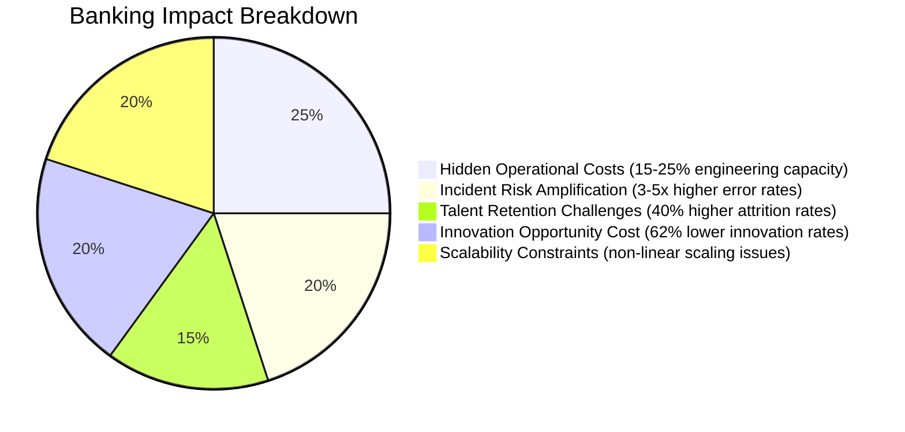

#### Key Insights:

1. **Hidden Operational Costs**: Manual intervention for recurring alerts consumes 15-25% of total engineering capacity, equating to $150,000-$400,000 annually per small to medium team in direct labor costs.
2. **Incident Risk Amplification**: Human intervention introduces 3-5x higher error rates compared to automation, compounding risks in financial systems where precision is critical.
3. **Talent Retention Challenges**: Excessive on-call burdens lead to 40% higher attrition rates, with each lost engineer costing $80,000-$150,000 in recruitment and onboarding.
4. **Innovation Opportunity Cost**: Teams spending over 70% of their time on operational toil see a 62% drop in innovation and feature delivery, weakening their competitive edge in digital banking.
5. **Scalability Constraints**: Current manual patterns may work at low transaction volumes but create scaling bottlenecks as digital banking adoption grows, threatening long-term growth.

This data underscores the necessity of reducing toil and transitioning to proactive, automated engineering solutions. Addressing these areas not only improves operational efficiency but also drives innovation, reduces risk, and enhances overall business scalability.

### Implementation Guidance

To establish effective on-call engineering practices, follow these five steps. Use the checklist below as a structured guide for implementation:

#### Implementation Checklist

1. **Implement Toil Measurement**

   - [ ] Track on-call activities: alert frequency, response time, resolution methods, and sleep interruption patterns.
   - [ ] Create monthly dashboards visualizing data by service and issue type.
   - [ ] Analyze patterns to identify high-frequency or high-complexity incidents.

2. **Allocate Dedicated Improvement Time**

   - [ ] Reserve at least 20% of engineering capacity for on-call burden reduction.
   - [ ] Schedule regular "on-call engineering sprints" focused on high-impact alert patterns.
   - [ ] Ensure team buy-in and leadership support for dedicated improvement efforts.

3. **Create Prioritization Framework**

   - [ ] Design a prioritization matrix considering frequency, resolution time, business impact, and automation feasibility.
   - [ ] Score recurring issues using the matrix to identify top priorities.
   - [ ] Regularly review the matrix to ensure alignment with evolving system needs.

4. **Build Success Metrics**

   - [ ] Define key success metrics: alert reduction rate, mean time between failures (MTBF), and engineering time reclaimed.
   - [ ] Establish a baseline for each metric to measure progress.
   - [ ] Track and update metrics monthly to demonstrate value and adjust priorities.

5. **Integrate with Engineering Workflow**

   - [ ] Add on-call improvement stories to the primary development backlog.
   - [ ] Use the same prioritization process as feature development for visibility and recognition.
   - [ ] Highlight on-call contributions in team performance reviews to reinforce their importance.

#### Step-by-Step Flow

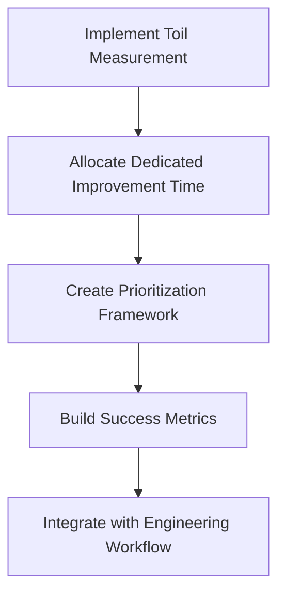

This step-by-step checklist and flow ensure a systematic approach to reducing on-call toil while embedding these improvements into the team's ongoing engineering practices.
