# Chapter 8: Communication Patterns During Incidents

## Chapter Overview

Welcome to the dark art of incident communication in SRE: the difference between a coordinated, high-stakes rescue and a clown car pileup. This chapter strips away the feel-good fairy tales and dives straight into the ugly, lucrative reality—where every “maybe” costs thousands, every siloed update fuels regulatory bonfires, and one misplaced blame can tank your talent pipeline. We’re not here for kumbaya trust falls; we’re here to weaponize communication patterns so your next outage doesn’t become a career-ending fiasco (or a headline in the Financial Times). If you want to stop hemorrhaging money, customers, and sanity every time the pager goes off, read on. Otherwise, enjoy the next compliance fine.

______________________________________________________________________

## Learning Objectives

- **Establish** bulletproof, standardized incident kickoff communications that actually prevent chaos, not just check a box.
- **Deploy** the 3x3 status update model to keep stakeholders informed (and off your back) without drowning in technical trivia or endless meetings.
- **Orchestrate** incident response like an air traffic controller—separating command from control and ensuring nobody flies blind.
- **Enforce** precision language that slices through ambiguity, so your team actually solves the problem instead of chasing ghosts.
- **Segment** stakeholder communications so each group gets what they need—no more, no less—and stops pestering your engineers mid-incident.
- **Model** and **enforce** blameless communication patterns, turning postmortems into learning opportunities instead of witch hunts.
- **Implement** robust follow-the-sun handover protocols that don’t lose critical context every time someone’s shift ends (or starts drinking).

______________________________________________________________________

## Key Takeaways

- Unstructured incident comms are a tax on your business—measured in dollars, churn, compliance fines, and public humiliation. Ignore at your peril.
- The first 15 minutes of an incident decide whether you’re running a rescue operation or a multi-team farce. Standardize your kickoff or pay in pain.
- The 3x3 status model isn’t just “nice”—it’s a shield against executive confusion, regulatory screwups, and resource wastage.
- If your “incident commander” is also deep in the logs, you’re not leading—you’re gambling with outcomes. Separate coordination from troubleshooting, full stop.
- Vague language is the silent killer of resolution speed. “Seems slow” is not a metric, it’s an invitation to a wild goose chase.
- Spray-and-pray updates to every channel don’t inform—they overwhelm, confuse, and create backchannel chaos. Tier your messages, or expect interruptions.
- Blame in comms is a surefire way to suppress information, drive away talent, and guarantee repeat failures. Focus on systems, not scapegoats.
- Shift handovers without formal protocols are a reset button on your incident. Want to double your resolution time and triple your compliance risk? Skip the handover checklist.
- Regulatory bodies don’t care about your feelings. They care about timely, accurate, and precise incident reporting. Sloppy comms = big fines.
- Your customers notice lousy communication more than the outage. If you can’t tell them what’s happening, they’ll find a bank that will.

You want SRE maturity? Nail your incident comms. Everything else is just firefighting with gasoline.

______________________________________________________________________

## Panel 1: The Incident First Responder - Structured Communication Kickoff

### Scene Description

A monitoring alert shows a payment processing error spike. Katherine, the on-call SRE, is at her desk with multiple screens, arranged to maximize visibility across systems. On the leftmost screen, a monitoring dashboard displays real-time error metrics with a noticeable spike in payment processing failures. The center screen shows a partially completed incident announcement template, with fields such as "Incident Summary", "Impact", and "Next Steps" being filled in methodically. The right screen shows a communication tool where Katherine is setting up a dedicated incident response channel.

Below is a textual representation of Katherine's workspace layout:

```
+-------------------+-----------------------+-------------------+
| Monitoring Alerts | Incident Template    | Communication Tool |
| Error Spikes      | Key Fields:          | Dedicated Channel  |
| Metrics Dashboard | - Summary            | Setup in Progress  |
|                   | - Impact             |                    |
|                   | - Next Steps         |                    |
+-------------------+-----------------------+-------------------+
```

The clock on the wall reads 2:17 PM. Katherine's focused yet calm expression underscores the importance of maintaining composure during critical moments. Her efficient setup highlights the structured approach to incident response, enabling her to handle multiple tasks simultaneously while adhering to best practices.

### Teaching Narrative

Effective incident management begins with structured communication. When an SRE first responds to an incident, their initial communication sets the tone and framework for the entire response. The difference between production support and SRE approaches becomes immediately apparent: while production support might dive straight into technical troubleshooting, an SRE first establishes clear communication channels and structures. This involves creating a dedicated incident channel, using standardized templates for the initial announcement, and ensuring all key information is captured from the beginning. The goal is to reduce cognitive load during high-stress situations by having predefined communication patterns that the team automatically follows, freeing mental resources for actual problem-solving.

### Common Example of the Problem

#### Incident Timeline of Missteps

Below is a timeline illustrating the sequence of missteps during a recent trading platform incident at Meridian Investment Bank. This highlights how the lack of structured communication led to confusion, inefficiency, and delays:


#### Key Consequences

- **Customer Service Department**: Blindsided by customer calls about failed trades, initiating independent investigations without coordination.
- **Operations Team**: Began troubleshooting network issues under the assumption they were the root cause, unaware of the database investigation.
- **Compliance Department**: Left uninformed for nearly an hour, delaying critical regulatory reporting obligations.

#### Lessons Learned

Without a structured kickoff:

- Teams worked in silos, duplicating efforts and making conflicting assumptions.
- Communication gaps led to delayed awareness of critical issues.
- The overall incident resolution time was significantly extended.

This example underscores the importance of initiating a structured communication plan immediately, ensuring all stakeholders are aligned and coordinated from the start.

### SRE Best Practice: Evidence-Based Investigation

Evidence shows that the first 15 minutes of incident response are critical for establishing effective coordination. Elite SRE teams implement structured communication kickoffs through standardized incident declaration templates that create common understanding from the outset. Research conducted across 250 financial institutions showed that teams using standardized incident declaration protocols reduced mean time to resolution by 37% compared to those without formalized kickoff procedures.

The most effective incident kickoffs should follow this evidence-based checklist:

#### Incident Kickoff Checklist:

1. **Incident Identification**

   - Assign a unique tracking ID for the incident.
   - Ensure the ID is referenced in all communications.

2. **Severity Classification**

   - Determine severity level based on predefined criteria.
   - Communicate the severity level clearly to stakeholders.

3. **Initial Impact Assessment**

   - Provide a concise summary of the observed impact (known and suspected).
   - Highlight affected systems, services, or users.

4. **Team Roster and Roles**

   - Identify the initial response team.
   - Assign clear roles (e.g., Incident Commander, Communication Lead, Technical Lead).

5. **Communication Channels**

   - Create and share access to a dedicated incident channel (e.g., chat, bridge line).
   - Establish clear protocols for communication flow.

6. **Update Schedule**

   - Set a regular cadence for status updates (e.g., every 15 or 30 minutes).
   - Share expectations for updates with all stakeholders.

7. **Current Action Items**

   - List immediate actions to be taken.
   - Assign owners to each action item and track progress.

By standardizing this information in the first communication, teams create shared context that significantly reduces coordination overhead throughout the incident lifecycle. Adopting this checklist ensures a methodical and repeatable approach to incident management, improving both efficiency and outcomes.

### Banking Impact

Unstructured incident kickoffs in banking environments directly impact the bottom line through multiple dimensions. The following table summarizes these impacts, along with examples and statistics to illustrate the severity of uncoordinated responses:

| **Impact Area** | **Description** | **Example/Statistic** |
| ------------------------------ | ------------------------------------------------------------------------------------------------------- | ------------------------------------------------------------------------------------------------------------------- |
| **Extended Trading Downtimes** | Delayed coordination during trading platform incidents results in significant revenue losses. | Each minute of downtime costs approximately $42,000-$170,000 in transaction revenue for mid-sized investment banks. |
| **Compliance Penalties** | Failure to notify regulatory teams within mandated timeframes can lead to substantial fines. | Tier 1 banks face fines exceeding $500,000 under MiFID II for missing incident disclosure deadlines. |
| **Customer Attrition** | Poor communication during outages drives clients to switch providers, leading to revenue losses. | 28% of institutional clients cite "poor communication during outages" as a primary reason for changing providers. |
| **Reputational Damage** | Ineffective communication doubles the reputational harm compared to the technical issue itself. | Reputational effects can last up to 18 months, as indicated by the Banking Trust Barometer. |
| **Recovery Costs** | Uncoordinated early response inflates total incident costs through inefficiencies and prolonged impact. | Total incident costs increase by 40-60% due to duplicated efforts and conflicting remediation attempts. |

By implementing structured communication from the outset, these impacts can be mitigated, ensuring faster resolution, reduced costs, and improved stakeholder confidence.

### Implementation Guidance

1. **Create Standardized Declaration Templates**: Develop incident announcement templates with predefined fields for severity, impact, response team, and communication channels. Include dropdown selections for common banking systems (payment processors, trading platforms, core banking, etc.) and impact categories (financial, customer, regulatory) to ensure consistency.

2. **Implement Automated Channel Creation**: Configure your incident management platform to automatically create dedicated communication channels when incidents are declared, with appropriate stakeholders pre-populated based on the affected systems and severity level. Ensure these channels integrate with existing tools like Slack, Teams or your banking-approved messaging platform.

3. **Establish Role-Based Response Protocols**: Define clear first responder procedures with checklists for the first 15 minutes of an incident. Train all on-call staff in these procedures with quarterly refreshers and simulation exercises focused specifically on kickoff effectiveness.

4. **Deploy Communication Decision Trees**: Create visual decision trees that guide first responders through communication requirements based on incident characteristics. Include regulatory notification thresholds and required timeframes specific to banking regulations like GDPR, PSD2, or regional banking authorities.

5. **Measure Kickoff Effectiveness**: Implement metrics that track time-to-first-communication, completeness of initial announcements, and stakeholder acknowledgment rates. Review these metrics after each incident to continuously improve your kickoff protocols. Compare actual notification times against regulatory requirements to identify compliance risks.

## Panel 2: Status Updates - The 3x3 Communication Model

### Scene Description

A virtual war room is in progress, with faces on video tiles arranged in a grid. At the center of the collaboration effort is a shared document displaying the 3x3 template, which is divided into three clear sections: "What We Know," "What We Don't Know," and "What We're Doing Next." The template is actively being updated by team members as they contribute notes to their respective sections. The incident commander, Marcus, is wearing a headset and speaking, guiding the team through the structured status update process. A large timer, prominently displayed, indicates that exactly 10 minutes have passed since the last update, reinforcing the disciplined cadence of communication.

Below is a simplified textual representation of the war room setup:

```
+---------------------------------------+
|           Virtual War Room            |
+---------------------------------------+
| [Video Tiles: Team Members]           |
| [Video Tile: Incident Commander (IC)] |
+---------------------------------------+
| Shared Collaborative Document:        |
| +-----------------------------+       |
| | What We Know               |       |
| |                           |       |
| |---------------------------|       |
| | What We Don't Know        |       |
| |                           |       |
| |---------------------------|       |
| | What We're Doing Next     |       |
| |                           |       |
| +-----------------------------+       |
|                                       |
| [Large Timer: 10:00 Elapsed]          |
+---------------------------------------+
```

This structured and visualized setup ensures that all participants stay informed, focused, and aligned on the incident priorities while adhering to the 3x3 communication model.

### Teaching Narrative

Regular, structured status updates are crucial for incident coordination, but they must be efficient and informative without becoming time sinks. The 3x3 communication model provides a framework that prevents both information overload and dangerous information gaps. Unlike traditional status meetings that may meander through technical details, the SRE approach focuses on three critical dimensions with strict time discipline: clearly stating what is known with certainty, explicitly acknowledging what remains unknown, and specifying concrete next actions with owners and timeframes. This model prevents both false certainty ("everything is fine") and unnecessary vagueness ("we're looking into it") that plague traditional incident communication. By timeboxing updates and using consistent formats, teams maintain situational awareness without derailing the actual resolution work.

### Common Example of the Problem

During a recent core banking system incident at First National Commerce Bank, status updates quickly descended into technical discussions about database query performance. Executive stakeholders joined hourly calls only to hear engineers debating technical minutiae without clear statements about customer impact or resolution timelines. When the CEO asked for a simple status update, five different team members provided conflicting information, leading to confusion and delays.

The following table highlights the conflicting statements and their impacts during the incident:

| **Team Member** | **Statement Provided** | **Impact** |
| ---------------------- | ----------------------------------------------------- | -------------------------------------------------------------------- |
| Engineer 1 | "The issue has been resolved." | Gave false confidence to executives, delaying further investigation. |
| Engineer 2 | "We're still investigating the root cause." | Highlighted ongoing uncertainty, contradicting previous statements. |
| Engineer 3 | "More systems might be affected." | Created unnecessary alarm and broadened the scope of concern. |
| Customer Service Lead | "We have no actionable updates for clients." | Left customer-facing teams unprepared to address inquiries. |
| Communications Manager | "Our external statement suggests everything is fine." | Risked reputational damage due to overly optimistic messaging. |

This misalignment of updates resulted in a lack of situational awareness across teams. While engineers debated technical specifics, neither customer impact nor resolution timelines were clearly communicated. The absence of a structured framework like the 3x3 communication model compounded the issue, allowing the conversation to devolve into isolated technical silos rather than a coordinated response.

By adopting the 3x3 model, such situations can be avoided, ensuring all updates clearly articulate **what is known, what is unknown, and what actions are next**, reducing confusion and improving decision-making across all stakeholders.

### SRE Best Practice: Evidence-Based Investigation

Analysis of high-performing incident response teams reveals that structured, concise status updates significantly improve resolution outcomes. Google's SRE teams pioneered the 3x3 model, which has been adapted for financial services environments with documented success. A study of 120 major banking incidents showed that teams using structured status update frameworks reduced average resolution time by 24% and decreased stakeholder confusion by 57% compared to teams using ad-hoc updates.

The most effective status updates follow these evidence-based principles:

- Strict timeboxing (typically 10 minutes maximum)
- Clear delineation between facts, assumptions, and unknowns
- Explicit next steps with owners and deadlines
- Stakeholder-appropriate language with defined technical terms
- Consistent cadence established at incident start
- Written summaries distributed immediately after verbal updates

#### Evidence-Based Status Update Checklist:

Use this checklist to ensure updates are structured and actionable:

1. **Timebox Adherence**

   - ☐ Was the update completed within the 10-minute limit?
   - ☐ Was the timer restarted for the next interval?

2. **Clarity of Known Information**

   - ☐ Are all facts presented supported by evidence?
   - ☐ Are assumptions explicitly labeled as such?

3. **Transparency of Unknowns**

   - ☐ Are all gaps in knowledge clearly acknowledged?
   - ☐ Are there no unverified statements or unwarranted certainty?

4. **Next Steps Defined**

   - ☐ Does the update include concrete actions?
   - ☐ Are owners and deadlines specified for each action?

5. **Language and Communication Style**

   - ☐ Is technical language appropriate for the stakeholder audience?
   - ☐ Are any terms that could be ambiguous clearly defined?

6. **Follow-Up Documentation**

   - ☐ Was a written summary distributed immediately after the update?
   - ☐ Does the summary accurately reflect the verbal update?

By following this checklist, teams can implement a structured approach that ensures alignment, reduces confusion, and creates a "single source of truth" throughout the incident lifecycle, benefiting all stakeholders regardless of their technical background or organizational role.

### Banking Impact

Ineffective status updates in banking incidents directly impact business outcomes through:

1. **Delayed Executive Decision-Making**: When executives lack clear status information, critical business decisions (like activating backup processing centers or issuing public statements) are delayed, extending impact durations by an average of 43 minutes per incident.

2. **Regulatory Reporting Failures**: Ambiguous internal updates lead to incomplete or inaccurate regulatory filings. Banking regulators issued $47M in combined penalties to financial institutions in 2023 specifically citing "failure to maintain accurate internal incident communications."

3. **Resource Misallocation**: Without clear status information, banks frequently over-allocate expensive technical resources to incidents, with studies showing an average of 30% more engineer-hours consumed when using unstructured updates versus structured frameworks.

4. **Customer Trust Erosion**: Customer satisfaction scores drop 3.2x faster when contact centers cannot provide consistent, accurate information during outages, directly impacting customer retention and lifetime value.

5. **Escalation Overhead**: Poor status communication triggers excessive escalations, with one major bank reporting that implementing structured status updates reduced executive escalations by 62% and decreased "executive shadowing" time by 78%.

#### Quantitative Impact Overview

The following bar chart highlights key metrics associated with the business impact of ineffective status updates in banking incidents:

```mermaid
barChart
    title Banking Incident Impacts
    axis X Impact Area
    axis Y Magnitude
    "Decision Delay (avg mins)" : 43
    "Regulatory Penalties ($M)" : 47
    "Engineer-Hours Overused (%)" : 30
    "Customer Satisfaction Drop (x)" : 3.2
    "Exec Escalation Reduction (%)" : -62
    "Shadowing Time Reduction (%)" : -78
```

### Implementation Guidance

1. **Create 3x3 Update Templates**: Develop standardized templates for incident updates with three clear sections: "What We Know," "What We Don't Know," and "What We're Doing Next." Tailor these templates to the needs of your domain. For example, in a banking incident, include specific subsections for:

   - **Customer Impact**: Clearly outline which services or transactions are affected and the estimated number of impacted customers.
   - **Regulatory Considerations**: Highlight any potential compliance risks or required notifications to regulatory bodies.
   - **Current Workarounds**: Document temporary measures in place to mitigate impact (e.g., manual transaction processing).

   **Example 3x3 Update Template (Banking Incident):**

   ```
   What We Know:
   - Service disruptions are affecting online banking logins for ~25% of users.
   - Root cause is suspected to be related to a recent database schema migration.
   - Customer service call volume has increased by 40% in the last hour.

   What We Don't Know:
   - Whether the issue is isolated to specific regions or global.
   - The full scope of impact on transaction processing.
   - Estimated time to resolution (pending root cause confirmation).

   What We're Doing Next:
   - Conducting root cause analysis – Owner: Database Team Lead (ETA: 15 minutes for next update).
   - Preparing a regulatory impact assessment – Owner: Compliance Officer (ETA: 30 minutes).
   - Scaling up customer service staffing – Owner: Operations Manager (In Progress).
   ```

2. **Implement Strict Timeboxing**: Configure your incident management platform to automatically schedule recurring updates at appropriate intervals based on incident severity (e.g., 30 minutes for high severity, 60 minutes for medium). Set timers during updates and train facilitators to enforce time boundaries. For example, allocate no more than 3 minutes per section in the 3x3 update to maintain focus and momentum.

3. **Establish Update Discipline**: Train all incident responders in the 3x3 model through regular simulations. Provide role-specific guidelines to ensure team members prepare concise, actionable information before updates. For example:

   - **Database Team**: Provide current query performance metrics and logs.
   - **Network Team**: Share network latency and connectivity checks.
   - **Application Team**: Highlight error rates and impacted endpoints.

4. **Deploy Multi-Channel Distribution**: Configure automated distribution of status updates across multiple channels. Use the same 3x3 template to create:

   - Detailed updates for technical responders in incident channels.
   - Concise executive summaries for leadership.
   - Simplified updates for customer service teams.
   - Compliant language for regulatory notifications.

5. **Measure Update Effectiveness**: Implement post-incident surveys to evaluate the quality and utility of status updates. Track metrics such as:

   - Time spent in updates vs. overall resolution time.
   - Stakeholder comprehension rates (e.g., survey results from leadership or customer service).
   - Consistency and accuracy of information distributed across channels.
     Use these insights to refine your 3x3 templates and update protocols continuously.

## Panel 3: The Role of the Incident Commander - Communication Orchestration

### Scene Description

An incident war room is in full swing with multiple conversations happening. The incident commander, Priya, stands slightly apart, maintaining a holistic view of the situation. She's clearly directing traffic - pointing to one engineer to continue a technical investigation while signaling another to prepare an external communication. On a whiteboard behind her is a clear separation of communication channels: internal technical, executive updates, and customer communications, each with owners assigned.

### Teaching Narrative

Effective incident management requires a dedicated incident commander whose primary responsibility is communication orchestration rather than direct technical troubleshooting. This represents a significant shift from traditional production support models where the most technically skilled person often leads the response. In the SRE model, the incident commander maintains situational awareness across multiple workstreams, ensures information flows to the right people at the right time, and prevents communication bottlenecks. They operate as an air traffic controller – not flying the planes themselves but ensuring all pilots have the information they need to operate safely. This separation of concerns ensures that both technical resolution and stakeholder communication receive appropriate attention, preventing the common failure mode where external communication is neglected until after resolution.

### Common Example of the Problem

During a payment gateway outage at Eastern Regional Bank, the lead architect who discovered the issue naturally assumed command and began deep technical troubleshooting. As the bank's most knowledgeable payment systems expert, he became completely absorbed in database query analysis. Meanwhile, critical communication and coordination tasks were neglected, which created a cascading series of failures. The timeline below illustrates how the situation unfolded:

```mermaid
gantt
    title Incident Response Breakdown Timeline
    dateFormat  HH:mm
    axisFormat  %H:%M
    section Technical Investigation
    Lead architect starts database query analysis        :active, t1, 00:00, 2h
    Redundant troubleshooting by teams                  :crit, t2, 00:30, 1h 30m
    section Customer Service
    Improvised explanations to clients                  : t3, 00:15, 1h 45m
    section Executive Updates
    Conflicting updates sent to executives              : t4, 00:45, 1h 15m
    section External Communications
    Inaccurate statement drafted without review         : t5, 01:00, 1h
    section Regulatory Inquiry
    Regulators request status update; no coherent response :crit, t6, 02:00, 30m
    section Incident Duration
    Incident extended by fragmented efforts             : t7, 00:00, 5h
```



Key issues included:

- **Customer Service**: Without clear guidance, representatives provided inconsistent and improvised explanations to frustrated clients, increasing reputational damage.
- **Executive Updates**: The executive team received conflicting updates from different engineers due to a lack of centralized communication, leading to confusion and delayed decision-making.
- **External Communications**: An inaccurate external statement was drafted without proper technical review, further compounding customer trust issues.
- **Regulatory Response**: When regulators called two hours into the incident, no one could provide a coherent status update because all senior technical staff were deeply engaged in remediation tasks.

This lack of communication orchestration extended the incident for hours longer than necessary, highlighting the critical need for a dedicated incident commander to manage information flow and prevent these cascading failures.

### SRE Best Practice: Evidence-Based Investigation

Research into high-performing incident response organizations consistently shows that dedicated incident command produces superior outcomes. A landmark study by the DevOps Research and Assessment (DORA) team found that organizations with dedicated incident commanders who focus on coordination rather than technical resolution experience 47% faster mean time to resolution and 64% higher stakeholder satisfaction scores.

The evidence points to these critical practices:

| **Practice** | **Description** | **Benefit** |
| -------------------------------------------- | --------------------------------------------------------------------------------- | ----------------------------------------------- |
| Clear separation between command and control | Distinguishing coordination (command) from technical resolution (control). | Prevents role overlap, reduces confusion. |
| Commanders focused on information flow | Prioritizing communication and situational awareness over direct troubleshooting. | Faster resolution through better alignment. |
| Formalized handoff procedures | Ensuring smooth transitions between rotating commanders. | Maintains continuity in incident response. |
| Standardized communication protocols | Defining and enforcing consistent communication standards. | Improves clarity and reduces misunderstandings. |
| Pre-defined escalation paths | Establishing clear escalation workflows for critical scenarios. | Speeds up decision-making under pressure. |
| Regular situation summary broadcasts | Conducting periodic updates to all stakeholders. | Enhances transparency and trust. |

Elite SRE teams train dedicated incident commanders who may not be the most senior technical staff but excel at communication orchestration, situational awareness, and decision facilitation—a fundamental shift from the "best engineer leads" model common in traditional operations.

### Banking Impact

The lack of dedicated incident command in banking environments creates significant business impacts. Below is a breakdown of key quantitative impacts associated with ineffective communication orchestration in incident management:

#### Key Metrics and Impacts

| **Impact Area** | **Metric** | **Outcome** |
| ----------------------------- | ------------------------------------------------- | ------------------------------------------------------------------------ |
| **Extended Resolution Times** | Average +3.2 hours for severe incidents | Revenue impact: $18,000-$200,000 per hour depending on affected service. |
| **Compliance Failures** | 3.4x higher missed regulatory reporting deadlines | Average $275,000 in penalties per incident. |
| **Resource Inefficiency** | 40-60% redundant work during major outages | Hundreds of wasted engineering hours per incident. |
| **Communication Breakdowns** | 23% increase in support contacts during incidents | 17% increase in churn intent among affected users. |
| **Reputational Damage** | 2.7x greater negative media coverage | Direct impact on brand perception and customer acquisition costs. |

#### Visualizing the Impact

The following bar graph highlights the relative scale of these impacts:

```mermaid
barChart
    title Banking Impact Metrics
    x-axis Impact Areas
    y-axis Severity (Relative Scale)
    data
        "Resolution Times" : 3.2
        "Compliance Failures" : 3.4
        "Resource Inefficiency" : 40
        "Communication Breakdowns" : 23
        "Reputational Damage" : 2.7
```

This visualization underscores how a lack of proper incident command exacerbates operational inefficiencies, compliance risks, and customer dissatisfaction, ultimately leading to tangible financial and reputational losses. By adopting a structured communication orchestration model, banks can mitigate these impacts and enhance overall incident management effectiveness.

### Implementation Guidance

#### Checklist for Implementing an Effective Incident Commander Role

1. **Establish a Dedicated Commander Role**

   - Define the incident commander position in your response framework.
   - Focus responsibilities on coordination, communication orchestration, and decision facilitation rather than technical troubleshooting.
   - Develop and deliver targeted training for the role, emphasizing:
     - Situational awareness.
     - Stakeholder management.
     - Clear and concise communication.

2. **Implement Communication Router Protocols**

   - Design structured communication flows with predefined escalation paths.
   - Define guidelines for stakeholder-specific updates:
     - **Internal Technical Teams:** Investigation progress and technical details.
     - **Executives:** High-level status updates and business impacts.
     - **Customers:** Simple, transparent updates about service impact and resolution timelines.
   - Prepare templates for:
     - Regulatory updates.
     - Executive briefings.
     - Customer notifications.

3. **Create Commander Rotation Procedures**

   - Establish clear handoff protocols for long-running incidents:
     - Use situation summary templates to ensure seamless transitions.
     - Track open issues and assign ownership during handoffs.
     - Notify stakeholders of role transitions to maintain alignment.
   - Conduct regular simulations to practice and refine handoff procedures.

4. **Deploy Command Support Tools**

   - Implement dashboards that provide:
     - Real-time visibility into technical progress, stakeholder updates, and regulatory deadlines.
     - Alerts for communication obligations based on incident severity or duration.
   - Integrate collaboration tools to centralize updates and decisions.
   - Configure tools to prioritize clarity and accessibility for the incident commander.

5. **Measure Command Effectiveness**

   - Define metrics to evaluate incident command performance:
     - **Information Flow Rate:** Time taken to disseminate critical updates.
     - **Stakeholder Alignment Scores:** Satisfaction and clarity ratings from key stakeholders.
     - **Communication Timeliness:** Adherence to defined timelines for updates.
   - Conduct incident retrospectives focused on the incident commander’s role:
     - Identify strengths and areas for improvement.
     - Gather feedback from both technical and non-technical stakeholders.

#### Quick Reference: Incident Command Implementation Flow


By following this checklist and implementation flow, your organization can ensure that incident commanders are equipped to effectively orchestrate communication and maintain organizational alignment during high-pressure incidents.

## Panel 4: Precision Language - Reducing Cognitive Load

### Scene Description

Two engineers are discussing a database issue during an incident. Below is a visual representation of the scene:

```
+----------------------------------------------------+
|                                                    |
|  Engineer 1: "The database seems kind of slow,     |
|               maybe we should check it out?"       |
|                                                    |
|               (Vague Language)                     |
|                                                    |
|                                                    |
|  Engineer 2: "DB write latency has increased       |
|               from 15ms to 250ms over the last     |
|               10 minutes, affecting payment        |
|               submission. I'm checking             |
|               connection pool metrics now."        |
|                                                    |
|               (Precise Language)                  |
|                                                    |
+----------------------------------------------------+

        [Team Member Thought Bubble]
  "Now I clearly understand the impact and
   next steps for resolving the issue."
```

This contrast illustrates how vague language can lead to ambiguity, while precise language ensures clarity and shared understanding among all team members.

### Teaching Narrative

During high-stress incidents, every word matters. SREs cultivate precision language to reduce the cognitive load on the entire team. This means eliminating ambiguous terms like "seems," "maybe," or "probably" in favor of specific, measurable observations. It also means standardizing terminology for system components and behaviors across the organization. This precision dramatically reduces misunderstandings that extend incident duration. Unlike casual conversation, incident communication requires removing implied context and assumptions, instead explicitly stating observations, actions, and needs. This practice ensures that distributed team members with varying levels of context can quickly build an accurate mental model of the situation without needless clarification questions that waste precious resolution time.

### Common Example of the Problem

During a mobile banking authentication incident at Westland Financial, an engineer reported that "the system seems slow and customers might be having some trouble logging in." This vague description triggered a series of costly misunderstandings. Below is a timeline showing how the lack of precision cascaded into delays and confusion:

```mermaid
sequenceDiagram
    participant Engineer as Engineer
    participant Network as Network Team
    participant DBAdmin as Database Admins
    participant AppTeam as Application Team
    participant Senior as Senior Engineer

    Engineer->>Network: "System seems slow, check connectivity?"
    Engineer->>DBAdmin: "Customers might be having login trouble, check queries?"
    Engineer->>AppTeam: "Could this be related to recent deployments?"
    Network->>Engineer: "No network issues found."
    DBAdmin->>Engineer: "Query performance looks normal."
    AppTeam->>Engineer: "No suspicious deployments."
    Senior->>Engineer: "What exactly is slow?"
    Engineer->>Senior: "Authentication API response times are up."
    Senior->>Engineer: "Details?"
    Engineer->>Senior: "Response time: 200ms → 3000ms. 40% failures with error code X."
    Senior->>Network: "Focus on authentication service connection pool."
    Note over Engineer,Network,DBAdmin,AppTeam,Senior: 30 minutes lost due to vague initial communication.
```

When the senior engineer clarified the specifics—authentication API response times increasing from 200ms to 3000ms, with 40% of login attempts failing due to a specific error code—the team immediately narrowed their focus to the authentication service's connection pool. This precise information resolved the incident far more efficiently, but only after 30 critical minutes were wasted on misdirected troubleshooting caused by the initial imprecise report.

This example demonstrates how vague language during an incident creates unnecessary cognitive load, delays resolution, and increases the risk of prolonged customer impact.

### SRE Best Practice: Evidence-Based Investigation

Cognitive load research demonstrates that precise language significantly improves incident response effectiveness. Studies of high-performing SRE teams show they use standardized terminology, specific metrics, and unambiguous descriptions to reduce misinterpretation. Financial institutions that implemented precision language protocols reported 34% fewer clarifying questions during incidents and 28% faster convergence on accurate problem diagnosis.

Evidence-based precision language practices include:

- Using exact measurements rather than subjective assessments ("latency increased from 100ms to 1500ms" versus "the system is slow")
- Specifically naming components with their standardized identifiers
- Stating explicit error messages and response codes rather than general descriptions
- Quantifying impact with precise scope and percentages
- Clearly separating observations from hypotheses
- Using consistent terminology across all communication channels

#### Precision Language Checklist for Evidence-Based Investigation

Use this checklist to ensure precise communication during incident investigation:

1. **Metrics and Measurements**: Are you using exact numerical values and timeframes (e.g., "error rate increased from 0.1% to 3% in the last 5 minutes")?
2. **Component Identification**: Are all system components referred to by their standardized names or identifiers?
3. **Error Specificity**: Have you included explicit error messages, response codes, or logs (e.g., "HTTP 503 – Service Unavailable")?
4. **Impact Quantification**: Is the scope of the issue quantified (e.g., "affecting 25% of user requests")?
5. **Observation vs Hypothesis**: Are you distinguishing observations ("service is returning 503 errors") from hypotheses ("might be a misconfigured load balancer")?
6. **Terminology Consistency**: Are you using the agreed-upon terms and definitions established by your team or organization?

Organizations that standardize technical language and train teams in precision communication show measurably improved coordination during complex incidents, with an average 37% reduction in mean time to resolution for similar incidents.

### Banking Impact

Imprecise communication during banking incidents creates substantial business impacts. The table below summarizes five key impacts along with their associated statistics:

| Impact | Description | Statistic |
| ------------------------------------- | ---------------------------------------------------------------------------------------------------- | -------------------------------------------------------------------------------------- |
| **Investigation Misdirection** | Vague incident descriptions lead to misdirected troubleshooting efforts, increasing resolution time. | Average of **42 minutes** wasted per major incident in financial services. |
| **Escalation Overhead** | Ambiguous status updates result in excessive executive escalations and coordination overhead. | **3.7x more** executive escalations and clarification requests. |
| **Improper Risk Assessment** | Lack of precision causes miscategorization of incident severity, leading to resource misallocation. | Bank risk officers frequently miscategorize severity, impacting responses. |
| **Customer Communication Errors** | Imprecise internal descriptions result in inaccurate information shared with customers. | **68% of customer communication errors** stem from internal imprecision. |
| **Regulatory Reporting Deficiencies** | Ambiguous documentation fails to meet regulatory standards, incurring penalties. | **43% of enforcement actions** cite imprecise reporting; **$31M** in penalties (2023). |

By adopting precision language practices, banking organizations can mitigate these impacts, reduce resolution times, and improve communication across technical, executive, and regulatory audiences.

### Implementation Guidance

1. **Create a Technical Lexicon**: Develop a standardized terminology guide for your banking systems that defines precise terms for components, behaviors, and metrics. Include specific guidance for describing common failures in payment processing, authentication, and core banking systems. Make this lexicon easily accessible during incidents through digital references and chatbot lookups.

2. **Implement Communication Templates**: Design structured formats for reporting observations that prompt precision, with fields for exact metrics, specific components, error codes, and quantified customer impact. Create dropdown selectors for common banking systems to ensure consistent naming.

3. **Conduct Precision Language Training**: Develop focused training modules on precision communication during incidents. Include exercises where team members practice converting vague statements into precise observations. Incorporate banking-specific scenarios like payment processing delays, authentication failures, and regulatory reporting requirements.

4. **Deploy Real-time Communication Coaches**: Assign dedicated "communication coaches" during major incidents who monitor conversations and prompt for clarity when vague language appears. Empower these coaches to interrupt and ask for specifics when ambiguous terms are used.

5. **Measure Language Precision**: Review incident communications during post-mortems specifically for language precision. Track metrics like "time spent in clarification" and "misdirected investigation due to ambiguity." Use natural language processing tools to analyze incident chats and identify common patterns of imprecise language for targeted improvement.

## Panel 5: Stakeholder Communication Tiers - Right Information, Right Audience

### Scene Description

A large screen displays a multi-tier communication strategy in action during a major incident. At the center of the visual, a flow diagram illustrates the distinct communication paths for various stakeholder groups:

- **Technical Teams**: Receive detailed diagnostic information through direct channels (e.g., incident dashboards or Slack alerts). This tier includes highly technical language and real-time data to facilitate troubleshooting.
- **Executives**: Access high-level business impact metrics and estimated resolution times via summary reports or concise email updates. The language here is strategic and focused on overall business implications.
- **Customer Service Teams**: Obtain specific updates on affected functionality and workaround instructions through pre-formatted templates or knowledge base updates. Messaging is clear, actionable, and customer-facing.

Below the flow diagram, messaging templates for each audience are displayed on the screen, highlighting the differences in language patterns, information density, and update frequency. The visualization reinforces how each tier is tailored to its audience, ensuring stakeholders receive the right information at the right time without causing information overload or critical gaps.

### Teaching Narrative

Not all incident communication should be identical. SRE practices establish distinct communication tiers for different stakeholders, each with appropriate information density, technical detail, and update frequency. This tiered approach replaces the common anti-pattern where either everyone receives overly technical updates that most can't act on, or worse, technical teams receive watered-down information missing critical details. By establishing audience-appropriate templates and channels in advance, SREs ensure each stakeholder group receives precisely the information they need to fulfill their role during the incident, no more and no less. This practice prevents both information overload and the dangerous gaps that occur when stakeholders seek information through back channels, potentially disrupting the resolution process.

### Common Example of the Problem

During a core banking system degradation at Global Commerce Bank, a single incident update channel broadcast the same messages to everyone—from database engineers to the executive team to customer service representatives. This caused significant communication breakdowns across stakeholder groups:

| Stakeholder Group | Key Issues | Impact |
| ----------------------- | -------------------------------------------------------------------------------------------- | ------------------------------------------------------------------------------------------- |
| **Technical Teams** | Overloaded with non-technical queries from business stakeholders. | Delayed troubleshooting and frequent context switching due to clarifying jargon. |
| **Executives** | Overwhelmed by highly technical updates with no clear business impact or resolution context. | Inability to make informed decisions or communicate effectively with external stakeholders. |
| **Customer Service** | Lacked actionable information to address client concerns. | Turned to engineers for clarification, disrupting critical resolution efforts. |
| **Compliance Officers** | Missed regulatory reporting triggers buried in technical jargon. | Risked non-compliance due to failure to meet reporting requirements. |

This one-size-fits-all communication approach satisfied no one. Some stakeholders faced information overload, while others were left without the specific details needed for their roles. The resulting confusion and inefficiencies disrupted the resolution process and prolonged the incident's impact.

### SRE Best Practice: Evidence-Based Investigation

Research on incident communication effectiveness consistently shows that stakeholder-specific information tiering significantly improves outcomes. A comprehensive study of financial services incident management found that organizations with formalized communication tiers experienced 47% higher stakeholder satisfaction and 29% fewer disruptive information requests during incidents.

The evidence supports these tiering practices:

- Distinct information channels for technical, business, and customer service stakeholders
- Pre-defined templates tailored to each audience's needs and vocabulary
- Consistent translation of technical metrics into business impact statements
- Appropriate update frequencies based on stakeholder roles
- Designated communicators trained in audience-appropriate messaging
- Feedback mechanisms to identify information gaps for each tier

#### Checklist: Implementing Evidence-Based Communication Tiers

Use the following checklist to apply these practices in your organization effectively:

1. **Define Stakeholder Groups**

   - Identify key stakeholder groups (e.g., technical teams, business executives, customer service teams).
   - Clarify each group’s information needs and roles during an incident.

2. **Establish Communication Channels**

   - Set up dedicated communication channels for each stakeholder group.
   - Ensure channels are secure and easily accessible during incidents.

3. **Develop Audience-Specific Templates**

   - Create templates tailored to each audience’s level of technical expertise and vocabulary.
   - Include placeholders for critical details such as impact, status updates, and next steps.

4. **Translate Technical Metrics**

   - Ensure technical information is translated into meaningful business impact statements for non-technical stakeholders.
   - Use clear, concise language to avoid misinterpretation.

5. **Set Update Frequencies**

   - Define update cadences based on stakeholder roles (e.g., more frequent for technical teams, less frequent but higher-level for executives).
   - Communicate expected update intervals in advance to manage expectations.

6. **Train Designated Communicators**

   - Assign specific team members as communicators for each stakeholder group.
   - Provide training in audience-appropriate messaging techniques.

7. **Implement Feedback Loops**

   - Establish mechanisms to collect feedback from stakeholders after incidents.
   - Regularly review and refine communication strategies to address identified gaps.

Organizations that implement these structured communication tiers report significant reductions in resolution disruptions caused by stakeholders seeking information through unofficial channels or interrupting technical teams for clarification.

### Banking Impact

Inadequate stakeholder communication tiering during banking incidents creates direct business consequences. The following table organizes these impacts alongside their associated metrics and outcomes:

| **Business Consequence** | **Metrics/Indicators** | **Impacts** |
| ----------------------------------- | ----------------------------------------------------------------------------------------------------------- | --------------------------------------------------------------------------------------------------------------------- |
| **Executive Decision Delays** | Average delay of 37 minutes in critical decisions (e.g., disaster recovery, public communications). | Slower response to incidents, delayed customer accommodations, and increased organizational risk. |
| **Compliance Reporting Failures** | 2.8x more missed compliance reporting deadlines; $180,000 average regulatory penalty per incident. | Financial losses and reputational damage due to preventable regulatory breaches. |
| **Customer Experience Degradation** | 73% longer call handling times; 42% lower first-contact resolution rates during outages. | Increased customer frustration, higher churn rates, and amplified reputational damage. |
| **Technical Disruption** | Up to 35% of incident time spent responding to stakeholder information requests instead of resolution. | Prolonged outage durations and reduced efficiency of technical teams during critical recovery periods. |
| **Post-Incident Trust Erosion** | 67% of executives cite communication failures as a primary source of post-incident organizational friction. | Damaged cross-functional trust and long-term organizational inefficiencies stemming from poor incident communication. |

By addressing these consequences through clearly defined communication tiers, banking institutions can mitigate these impacts, enhance operational efficiency, and preserve stakeholder trust during major incidents.

### Implementation Guidance

#### Step-by-Step Workflow for Tiered Communication Strategy Implementation


1. **Define Clear Stakeholder Tiers**

   - Identify all potential stakeholders involved in incident response and map them into distinct communication tiers.
   - For banking environments, typical tiers include:
     - *Technical Responders*: Require detailed diagnostic data.
     - *Executive Leadership*: Need high-level business impact and resolution timelines.
     - *Customer Service & Communications/PR*: Focus on affected functionality and customer messaging.
     - *Compliance/Regulatory*: Require regulatory impact and reporting details.
     - *Business Unit Leaders*: Need financial exposure and operational impact summaries.
   - Document specific information needs and roles for each tier.

2. **Create Tier-Specific Templates**

   - Develop communication templates tailored to the needs of each stakeholder tier.
   - Include banking-specific fields such as:
     - "Current Customer Impact"
     - "Regulatory Reporting Status"
     - "Financial Exposure Estimates"
   - Ensure technical responder templates focus on root cause analysis, logs, and diagnostics.

3. **Implement Multi-Channel Distribution**

   - Configure your incident management platform to route updates to appropriate channels automatically.
   - Establish dedicated communication channels (e.g., Slack channels, email lists, SMS groups) for each tier.
   - Prevent information cross-contamination by segmenting updates per audience.

4. **Assign Tier Liaison Roles**

   - Designate trained team members as communication liaisons for each tier.
   - Responsibilities include:
     - Translating technical details into tier-appropriate updates.
     - Acting as primary points of contact for questions within their tier.
   - Ensure liaisons shield technical responders from interruptions while maintaining information flow.

5. **Conduct Tier Satisfaction Assessments**

   - After each incident, survey stakeholders in all tiers to assess the effectiveness of communication.
   - Evaluate metrics such as:
     - "Information Usefulness"
     - "Update Frequency Appropriateness"
     - "Question Frequency by Tier"
   - Use this data to refine templates, roles, and distribution strategies.

6. **Refine Strategy Based on Feedback**

   - Continuously improve the tiering strategy by incorporating feedback from satisfaction assessments.
   - Update templates, workflows, and training as needed to address gaps or inefficiencies.

## Panel 6: Blameless Communication - Language Patterns That Build Trust

### Scene Description

A postmortem meeting is in progress. On a shared screen, we see before/after examples of incident communication. The "before" example shows blame-oriented language: "John's deployment caused the outage." The "after" shows blameless language: "The deployment process lacked sufficient verification steps to catch the configuration error." The team is actively discussing how language patterns during the incident itself set the stage for effective learning afterward.

To clarify the distinction between blame-oriented and blameless language, the following table is displayed on the shared screen:

| **Aspect** | **Blame-Oriented Language** | **Blameless Language** |
| ---------------------- | --------------------------------------- | ----------------------------------------------------------------------------------------------- |
| **Focus** | Individual actions | System/process issues |
| **Example Statement** | "John's deployment caused the outage." | "The deployment process lacked sufficient verification steps to catch the configuration error." |
| **Impact on Team** | Creates defensiveness; reduces openness | Encourages collaboration; fosters psychological safety |
| **Learning Potential** | Limits root cause exploration | Promotes system-level insights and improvements |

The team uses this table as a discussion tool to reinforce how adopting blameless language patterns during incidents can enhance learning, collaboration, and overall system reliability.

### Teaching Narrative

The language used during incidents directly shapes an organization's ability to learn from them. SRE practices emphasize blameless communication patterns that focus on systems and processes rather than individual actions. This approach recognizes that human errors are inevitable and are themselves symptoms of system design rather than root causes to be eliminated. Unlike traditional environments where communication often implicitly or explicitly assigns blame ("Who made this change?"), SRE communication focuses on understanding the current system state and how to improve it ("What verification steps could have caught this earlier?"). By establishing these communication patterns during incidents, teams build the psychological safety essential for honest information sharing, which directly impacts resolution time and future prevention.

### Common Example of the Problem

During a trading platform incident at Capital Investment Bank, communication quickly focused on identifying who was responsible rather than understanding system behavior. Messages like "Who pushed that change?" and "Which team owns this component?" dominated the conversation. When it became apparent that a junior developer had deployed code without proper testing, they became defensive and withheld critical information about the changes made, fearing career repercussions. Team members spent valuable time deflecting responsibility rather than collaborating on solutions. In the aftermath, documentation was sanitized to protect individuals, preventing genuine learning. Similar incidents recurred three times in the following quarter because the underlying systemic issues—inadequate testing procedures and deployment safeguards—were never addressed due to the focus on individual blame.

#### Checklist: Identifying Blame-Oriented Patterns

Use this checklist to identify common signs of blame-oriented communication patterns in your organization:

- **Focus on individuals instead of systems**: Conversations center on "who" rather than "what" or "how."
- **Defensive behaviors**: Individuals withhold information or deflect responsibility out of fear of repercussions.
- **Sanitized documentation**: Post-incident records omit critical details to shield individuals from blame.
- **Recurring issues**: Similar incidents happen repeatedly because underlying systemic causes are not addressed.
- **Lack of collaboration**: Team energy is spent assigning fault rather than problem-solving.
- **Fear-driven culture**: Team members are hesitant to speak openly about mistakes or concerns.

By recognizing these patterns, teams can start shifting toward blameless communication that fosters trust, psychological safety, and genuine learning.

### SRE Best Practice: Evidence-Based Investigation

Research on high-reliability organizations demonstrates that blameless communication directly improves incident outcomes and organizational learning. Studies across industries show that teams practicing blameless communication experience 78% higher rates of critical information sharing during incidents and 64% more comprehensive identification of contributing factors afterward.

Evidence supports these specific practices and their associated benefits:

| **Practice** | **Benefit** |
| ---------------------------------------------------------------------------- | --------------------------------------------------------------------------- |
| Use system-focused rather than person-focused language | Encourages collaboration and reduces defensiveness |
| Describe what happened rather than who did what | Promotes clarity and focuses on the sequence of events |
| Discuss how processes allowed errors rather than who made errors | Identifies systemic improvements rather than attributing blame |
| Focus on future prevention rather than past mistakes | Shifts focus to constructive actions and mitigates recurrence |
| Emphasize learning opportunities over corrective actions against individuals | Builds psychological safety and fosters a culture of continuous improvement |
| Maintain consistent blameless language across all communication channels | Ensures alignment and trust across teams during and after incidents |

Organizations that establish blameless communication as a core practice report significantly more comprehensive incident analysis, more effective preventive measures, and measurable reductions in incident recurrence rates.

### Banking Impact

Blame-oriented communication during banking incidents creates substantial negative business impacts. The following data highlights key areas of impact, supported by a visual representation for clarity:

#### Key Data Points

1. **Information Suppression**: Blame-oriented language reduces critical information sharing by up to **58%**, directly increasing mean time to resolution and extending customer impact.
2. **Incomplete Root Cause Analysis**: Banks with blame-focused cultures report **3.2x higher recurrence rates** for similar failure modes, indicating inadequate systemic improvements following incidents.
3. **Talent Retention Challenges**: Financial institutions with blame-oriented incident practices experience **47% higher technical staff turnover**, with exit interviews citing "blame culture during incidents" as a primary reason for departure.
4. **Risk Management Blindness**: **71%** of regulatory assessments of major banking failures found that blame-oriented cultures contributed to known risks being unreported prior to significant incidents.
5. **Innovation Suppression**: Blame-focused incident handling leads to **43% lower rates of process improvement suggestions** and **67% fewer proactive risk reports** from technical teams, increasing operational risk exposure.

#### Visual Representation of Impacts


By visualizing these statistics, the systemic consequences of blame-oriented communication become clearer. Shifting to a blameless communication model not only mitigates these risks but also fosters a culture of trust, collaboration, and continuous improvement.

### Implementation Guidance

1. **Develop Blameless Language Guidelines**: Create explicit communication frameworks that guide teams toward system-focused language. Provide specific examples of how to reframe common blame statements in blameless terms. For example:

   - Blame-Oriented: "John's deployment caused the outage."
   - Blameless: "The deployment process lacked sufficient verification steps to catch the configuration error."
   - Blame-Oriented: "Who missed the compliance deadline?"
   - Blameless: "What gaps in our compliance tracking process led to the missed deadline?"
     Use banking-specific scenarios such as deployment issues, configuration changes, and compliance oversight to illustrate these reframes effectively.

2. **Implement Communication Reviews**: Train incident commanders and communication liaisons to identify and redirect blame-oriented language in real-time during incidents. Provide specific intervention phrases and techniques to shift focus:

   - Example Intervention: "Let's focus on the system conditions that allowed this to happen."
   - Example Intervention: "How can we better understand the sequence of events and contributing factors?"
     Conduct mock incident drills where participants practice redirecting blame-oriented statements toward system-focused discussions.

3. **Create Blameless Templates**: Design incident response templates with built-in language patterns that naturally guide teams toward blameless framing. Include prompts to structure discussions around systemic factors:

   - **Prompt Example**: "What were the contributing conditions within the system that allowed this to occur?"
   - **Prompt Example**: "What improvements can we make to prevent similar occurrences?"
   - **Template Example**:
     ```
     **Incident Overview**:
     - What happened?
     - What was the system state before the incident?

     **Contributing Factors**:
     - Which processes or conditions contributed to this outcome?

     **Improvement Opportunities**:
     - What changes can we make to improve system resilience?
     ```

4. **Conduct Leadership Modeling Training**: Provide specialized training for executives and managers on modeling blameless communication, particularly during high-stress banking incidents. Include practice scenarios involving sensitive situations like:

   - **Scenario Example**: A compliance violation where leadership reframes "Who is responsible for this?" to "What gaps in our compliance process led to this?"
   - **Scenario Example**: A system outage where leadership shifts from "Why wasn't this caught earlier?" to "What system checks could help us catch this earlier in the future?"
     Role-play exercises can reinforce how to lead with curiosity and focus on learning rather than assigning fault.

5. **Measure Psychological Safety**: Implement regular assessments of team psychological safety before, during, and after incidents. Use both qualitative and quantitative methods to capture actionable insights:

   - **Metric Example**: "Rate your comfort level in reporting mistakes on a scale of 1-10."
   - **Metric Example**: "How often do you withhold information during incidents due to fear of blame?"
   - **Survey Prompt Example**: "Describe a recent incident discussion. Did you feel safe sharing your perspective? Why or why not?"
     Use these metrics to identify patterns, target specific improvement areas, and track progress in fostering a culture of trust and psychological safety.

## Panel 7: Follow-the-Sun Communications - Handover Protocols

### Scene Description

Two SREs from different time zones are conducting a structured incident handover. The outgoing engineer in New York is following a checklist while walking through current status with the incoming engineer in Singapore. A shared document shows a formal handover template with sections for incident timeline, current theories, attempted solutions, and planned next steps. Both engineers are adding notes and clarifying points to ensure complete knowledge transfer before responsibility shifts.

#### Handover Workflow

The structured handover process follows these key steps:


Each step ensures critical context is transferred, leveraging the checklist and shared document as central tools for maintaining continuity. This workflow minimizes the risk of miscommunication or context loss during the transition.

### Teaching Narrative

For incidents that span multiple shifts or time zones, structured handover communication becomes essential. SRE practices establish formal protocols for transferring incident context between teams that go far beyond traditional "handover notes." These protocols include synchronous knowledge transfer sessions, standardized documentation templates, and explicit acknowledgment of ownership transition. Unlike production support models that may rely on individual diligence for handovers, SRE approaches treat handovers as critical control points in incident management that require the same rigor as technical changes. This structured approach prevents the common failure mode where context is lost during transitions, resulting in repeated investigations, contradictory actions, or missed follow-ups that extend incident duration and impact.

### Common Example of the Problem

During a prolonged payment processing issue at Global Financial Services, an incident that began in the London office continued through shift changes to the New York and Singapore teams. The London team left minimal notes in the incident channel before signing off, requiring the New York team to spend their first two hours re-investigating issues the London team had already ruled out. Critical context about attempted fixes and their results wasn't transferred, leading the Singapore team to retry approaches that had already failed. A customer impact mitigation put in place by London was unknowingly rolled back by Singapore, creating a second outage for customers who had been temporarily restored. When London came back online the next day, they had to rebuild their understanding of the incident's evolution over the past 16 hours, effectively starting from scratch despite being the original responders.

This example highlights the importance of a structured handover. Below is a checklist of information that should have been transferred during the handover to prevent these issues:

#### Handover Checklist

1. **Incident Timeline**
   - Key timestamps and events (e.g., when the issue began, milestones reached, and major changes implemented).
2. **Current Status**
   - Overview of the system's current state (e.g., services affected, customer impact mitigations in place).
3. **Theories and Investigations**
   - Active hypotheses regarding the root cause.
   - Tests or diagnostic steps completed and their results.
4. **Attempted Solutions**
   - Fixes that have been tried, including:
     - Exact steps taken.
     - Outcomes and any unintended side effects.
5. **Planned Next Steps**
   - Specific actions to be taken by the incoming team.
   - Prioritized tasks or areas for investigation.
6. **Ownership Acknowledgment**
   - Confirmation from the incoming team that they understand the current state and are ready to take over.

By adhering to this checklist, teams can ensure that critical context is preserved during handovers, reducing the risk of redundant efforts, conflicting actions, and extended incident resolution times.

### SRE Best Practice: Evidence-Based Investigation

Research on global incident response effectiveness consistently shows that formalized handover protocols significantly improve outcomes for incidents spanning multiple shifts or time zones. Organizations with structured handover processes experience 64% lower rates of repeated investigation work and 73% faster resolution continuation after shift transitions.

Evidence supports these handover practices:

| Practice | Description | Impact |
| ----------------------------------------- | -------------------------------------------------------------------------- | ------------------------------------------------------------------------------------- |
| Synchronous knowledge transfers | Real-time, person-to-person handovers for active incidents | Reduces miscommunication and ensures critical context is immediately clarified |
| Comprehensive handover templates | Standardized forms to capture incident timelines, theories, actions, etc. | Ensures consistency across shifts and reduces missing or incomplete information |
| Dedicated handover time | Time specifically allocated for structured handovers, not rushed exchanges | Improves accuracy and completeness of information transfer |
| Explicit acknowledgment of ownership | Incoming teams formally accept responsibility for the incident | Prevents ambiguity around accountability and ensures clear ownership |
| Recorded handovers | Sessions recorded for complex incidents | Allows for later review and reduces the need to re-explain details during escalations |
| Clear documentation of decision rationale | Notes that explain *why* actions were taken, not just *what* was done | Prevents repeated mistakes and supports faster resolution by leveraging prior context |

Organizations that implement formal follow-the-sun protocols report significant reductions in the "investigation restart" effect commonly seen in traditional support models, where each new shift essentially begins the troubleshooting process anew.

### Banking Impact

Poor handover practices in global banking operations create direct business impacts that can cascade into severe organizational consequences. The following illustrates how these issues propagate:


#### Key Data Points Supporting the Impact

1. **Extended Resolution Timeframes**: Financial institutions without formal handover protocols experience an average of 2.7 hours of duplicated investigation work per shift transition during major incidents, directly extending customer impact duration.

2. **Compliance Tracking Failures**: Regulatory reviews of major banking incidents found that 64% of reporting timeline violations occurred during shift transitions when compliance tracking responsibilities weren't explicitly transferred.

3. **Customer Communication Inconsistency**: Banks reported 3.2x higher rates of contradictory customer communications during incidents spanning multiple shifts when formal handover processes weren't followed.

4. **Solution Regression**: Analysis of extended banking incidents revealed that 27% experienced solution regression during shift transitions, where progress made by one team was inadvertently reversed by the next due to incomplete knowledge transfer.

5. **Escalation Cycles**: Without structured handovers, each new shift typically re-escalates issues to higher management, creating what one global bank termed "daily restart syndrome" where executive teams experienced the same escalation cycle with each regional team.

### Implementation Guidance

#### Checklist for Effective Handover Protocol Implementation

Use the following checklist to ensure structured and reliable handover processes in follow-the-sun incident management:

1. **Standardized Handover Templates**

   - Develop handover documents with the following sections:
     - Incident timeline
     - Current status
     - Attempted solutions
     - Pending actions
     - Decision context
   - Include specialized sections for:
     - Regulatory reporting status
     - Customer impact assessments
     - Executive communication history

2. **Synchronous Handover Procedures**

   - Schedule overlapping shift periods dedicated to handover activities.
   - Conduct live handover calls for active incidents, ensuring the following are covered:
     - Key updates on incident status
     - Outstanding tasks and pending decisions
     - Ownership acknowledgment by the incoming team

3. **Handover Documentation Systems**

   - Configure incident management tools to:
     - Prompt for structured handover documentation at shift boundaries.
     - Require explicit acknowledgment (e.g., digital signing) by the incoming team.

4. **Follow-the-Sun Simulations**

   - Plan regular simulations of global handovers using mock incidents.
   - Focus on:
     - Information continuity between teams
     - Identifying gaps in the handover process
   - Include observers to evaluate the effectiveness of knowledge transfer.

5. **Handover Effectiveness Metrics**

   - Track the following metrics:
     - Time lost to re-investigation
     - Information continuity scores
     - Solution regression instances
   - Conduct retrospectives on major incidents, emphasizing global collaboration and handover performance.

______________________________________________________________________

#### Visual Overview: Handover Workflow


