# Chapter 9: Learning from Incidents

## Chapter Overview

Welcome to the SRE School of Hard Knocks, where the only thing dumber than making a mistake is refusing to learn from it. This chapter takes a flamethrower to the tired “root cause” blame game and replaces it with a forensic fascination for how complex failures actually unfold. Forget the hunt for a single villain; here, incidents are treated like crime scenes in a soap opera—messy, multi-faceted, and starring both humans and machines in equal parts. We’ll dig into why banks keep stepping on the same rakes, why postmortems usually collect dust, and why psychological safety isn’t just a feel-good HR slogan—it's the difference between fixing problems and just pretending you did. If you’re ready to stop playing “Whack-a-Mole: Outage Edition” and start building a system that actually gets smarter with every screw-up (and even every unexpected win), you’re in the right place. Buckle up: this is reliability with teeth.

______________________________________________________________________

## Learning Objectives

- **Diagnose** complex incidents using a contributing factors approach instead of settling for a single “root cause” scapegoat.
- **Facilitate** blameless, evidence-based postmortems that drive real organizational learning, not just paper trails.
- **Engineer** psychological safety so your team tells the truth about what broke, instead of what they think leadership wants to hear.
- **Dissect** incidents using multi-perspective analysis—technical, process, human, and business—until the full, ugly picture comes into focus.
- **Operationalize** continuous improvement loops that actually close, so fixes make it to production before the next disaster.
- **Build** organizational memory that survives team churn and connects the dots across repeated incidents and near-misses.
- **Extract** actionable insights from success, not just failure, so you can repeat what works instead of just avoiding pain.

______________________________________________________________________

## Key Takeaways

- The “root cause” is a myth. There’s always a tangle of factors, and if you’re still looking for a single villain, you’re the problem.
- Postmortems aren’t TPS reports. If they’re not driving change, they’re just corporate fan fiction.
- Blame kills learning. If your engineers are only honest on anonymous surveys, your incident reviews are doomed.
- A timeline is just the start—real analysis means understanding why people did what they did, not just when they did it.
- Action items without tracking are wishful thinking. “We’ll fix it someday” is how you end up on the front page of the Financial Times (for all the wrong reasons).
- Organizational amnesia is expensive. If you’re solving the same problem for the third time, congratulations: you’ve just funded your own anti-pattern.
- Only studying failure is self-defeating. If you don’t know why things go right, you won’t keep getting lucky.
- Regulators aren’t fooled by superficial analysis. If you can’t show how you’re learning and improving, expect fines, not high-fives.
- Every incident is a tuition payment to the school of reliability. The only thing worse than paying is refusing to learn.

Now go forth. Break things, study the wreckage, and actually get better. Or keep doing what you’re doing and enjoy your next outage. Your choice.

______________________________________________________________________

## Panel 1: Beyond Root Cause - The Incident as a Learning System

### Scene Description

In a softly lit conference room, Katherine (SRE lead) is facilitating a postmortem meeting after a major payment processing outage. The traditional "root cause" section of their template has been replaced with "contributing factors." On the wall, a complex diagram shows multiple intersecting factors with no single "root" highlighted. Team members from development, operations, and business sit around the table, actively engaged rather than defensive. A senior executive observes from the corner, noticeably more curious than angry.

### Teaching Narrative

Incidents are not puzzles with a single missing piece but complex socio-technical events that emerge from interactions between components, processes, and people. The traditional production support approach seeks a "root cause" to assign responsibility and implement a fix. In contrast, the SRE approach treats incidents as learning systems—opportunities to uncover how the organization actually functions under stress. This fundamental shift moves us from blame-oriented "who broke it?" to discovery-oriented "what can we learn about our systems?" The richest learning comes not from finding the one broken component but from understanding how multiple contributing factors created the conditions where failure became possible or even likely.

### Common Example of the Problem

During a peak trading day, GlobalBank's foreign exchange platform experienced a four-hour degradation where trades were delayed by up to 45 minutes. The traditional investigation focused exclusively on finding the "smoking gun" – ultimately identifying a database index that had been removed during a routine update. The DBA who removed the index was reprimanded, the index was restored, and the incident was considered "resolved." Six weeks later, a nearly identical incident occurred. Despite fixing the supposed "root cause," the actual system weaknesses remained unaddressed: inadequate testing procedures, poor communication between development and operations teams, insufficient monitoring of critical customer journeys, and deployment processes that allowed high-risk changes during peak trading hours.

The sequence of events can be visualized as follows:

```mermaid
graph TD
    A[Routine Update] --> B[Database Index Removed]
    B --> C[Platform Degradation: 45-min Trade Delays]
    C --> D[Investigation Focuses on "Smoking Gun"]
    D --> E[DBA Reprimanded]
    E --> F[Index Restored]
    F --> G[Incident Considered "Resolved"]
    G --> H[Identical Incident 6 Weeks Later]
    H --> I[Missed Opportunities for System Learning]
    I --> J[Unaddressed System Weaknesses: Testing, Communication, Monitoring, Deployment Risks]
```

By focusing narrowly on a single root cause rather than the broader contributing factors, the organization failed to identify and address the systemic conditions that allowed the failure. This approach missed the opportunity to strengthen multiple aspects of their socio-technical system, leaving them vulnerable to recurrence.

### SRE Best Practice: Evidence-Based Investigation

The SRE approach to incident analysis utilizes a contributing factors framework that explores multiple dimensions of system failure. Instead of asking "what was the root cause?" we ask questions like:

1. **Technical Factors**: What components interacted in unexpected ways? What assumptions about system behavior proved incorrect?
2. **Process Factors**: What organizational processes contributed to the incident or hindered response? How did deployment, monitoring, or escalation procedures influence outcomes?
3. **Structural Factors**: How did team boundaries, knowledge silos, or organizational structure affect the incident?
4. **Human Factors**: What cognitive biases affected decision-making? What pressures influenced actions before and during the incident?
5. **External Factors**: What customer behaviors, third-party dependencies, or market conditions played a role?

To make this framework actionable during incident analysis, teams can use the following checklist to ensure a thorough, evidence-based investigation:

**Checklist for Contributing Factors Analysis:**

- [ ] **Technical Factors**
  - [ ] Identify unexpected interactions between components.
  - [ ] Verify assumptions about system behavior.
  - [ ] Check for gaps in system documentation or understanding.
- [ ] **Process Factors**
  - [ ] Review deployment, monitoring, and escalation procedures.
  - [ ] Analyze delays or inefficiencies in response processes.
  - [ ] Identify areas where automation failed or was missing.
- [ ] **Structural Factors**
  - [ ] Map team boundaries and communication paths.
  - [ ] Identify knowledge silos or lack of cross-functional collaboration.
  - [ ] Assess how organizational structure influenced escalation or resolution.
- [ ] **Human Factors**
  - [ ] Evaluate decision-making under stress or uncertainty.
  - [ ] Identify cognitive biases (e.g., confirmation bias, overconfidence).
  - [ ] Examine how workload or pressure influenced actions.
- [ ] **External Factors**
  - [ ] Assess the role of customer interactions or unusual usage patterns.
  - [ ] Review third-party dependencies or integrations.
  - [ ] Consider market or environmental conditions impacting the system.

This multifaceted analysis is supported by techniques such as timeline reconstruction from multiple perspectives, identifying coordination breakdowns, mapping information flows during the incident, and examining how system design influenced human decision-making. By systematically gathering evidence across these dimensions, SRE teams develop a comprehensive understanding of how the system actually behaves, rather than how it was intended to behave.

### Banking Impact

The financial impact of incomplete incident analysis extends far beyond the immediate outage costs. For banking institutions, the failure to identify systemic weaknesses carries severe consequences. The table below summarizes key impacts, their implications, and estimated costs:

| **Impact Area** | **Implications** | **Examples/Estimated Costs** |
| ---------------------------- | -------------------------------------------------------------------------------------------------------------- | ---------------------------------------------------------------------- |
| **Recurring Incidents** | Similar failures recur when only symptoms are addressed, compounding customer trust erosion with each event. | $15-20 million annually in direct outage expenses and remediation. |
| **Regulatory Scrutiny** | Increased oversight and penalties from financial regulators for insufficient systemic improvements. | Fines and compliance costs ranging from $1-5 million per incident. |
| **Competitive Disadvantage** | Competitors with mature learning systems recover faster and prevent repeat issues, gaining market reliability. | Loss of market share and customer churn due to perceived instability. |
| **Operational Inefficiency** | Resources are wasted repeatedly fixing the same issues instead of addressing root patterns. | Estimated 10-15% budget inefficiency in IT operations annually. |
| **Risk Accumulation** | Unaddressed systemic weaknesses compound, increasing the likelihood of catastrophic failures. | Potential for multimillion-dollar losses from critical system outages. |

For a typical mid-sized bank, recurring incidents from unaddressed systemic issues can cost tens of millions annually in direct expenses, customer compensation, and remediation efforts. Additionally, the long-term impact of damaged customer trust and reputational harm can far exceed these immediate costs, further underscoring the need for comprehensive incident analysis and organizational learning.

### Implementation Guidance

To transform your incident analysis approach from root cause hunting to systemic learning:

1. **Revise Postmortem Templates**: Replace "root cause" sections with "contributing factors" frameworks that explicitly prompt examination of technical, process, environmental, and human dimensions. For example, one organization revised their postmortem template to include sections like "Sequence of Events," "Contributing Factors" (categorized by technical, organizational, and human factors), and "What Went Well." They also added prompts such as "How did existing safeguards perform?" and "What unexpected behaviors occurred?"

2. **Implement Facilitated Analysis Sessions**: Train dedicated facilitators in systems thinking who can guide postmortem discussions away from blame and toward learning. A financial services company, for instance, established a small team of trained facilitators who rotate across teams to lead postmortems. By having external facilitators, they noticed a significant shift in tone, as discussions moved from defensive to collaborative. Facilitators used open-ended questions like "What surprised us during this incident?" to encourage deeper insights.

3. **Create a Contributing Factors Library**: Develop a taxonomy of common contributing factors specific to your systems that teams can reference during analysis. For example, a payment processing team created a library of contributing factors, including categories like "Configuration Drift," "Monitoring Gaps," and "Unclear Handoffs." Over time, they identified recurring patterns, such as the impact of undocumented dependencies, and used this library to inform training and tooling improvements.

4. **Establish Executive Learning Reviews**: Schedule quarterly sessions where senior leadership reviews patterns and themes across incidents rather than details of individual events. One organization implemented these reviews with a structured agenda: a summary of recurring themes, examples of systemic improvements implemented, and a discussion of cross-team dependencies. These sessions not only aligned leadership on priorities but also increased funding for proactive risk reduction efforts.

5. **Measure Learning Effectiveness**: Track metrics that reflect learning quality rather than just incident counts. For instance, a technology company supplemented their traditional availability SLIs with metrics such as "Time-to-Detect Similar Issues," "Percentage of Action Items Addressed," and "Frequency of Cross-Team Incidents." They visualized these metrics in a dashboard alongside incident trends, enabling them to demonstrate the business impact of learning and prioritize investments in systemic improvements.

## Panel 2: The Anatomy of Effective Postmortems

### Scene Description

A split-screen visual comparison highlights two contrasting postmortem styles:

**Left Panel: Traditional Postmortem**

- **Sections**: "Root Cause," "Responsible Team," and a simple Timeline.
- **Content**: Focused solely on identifying blame and documenting the sequence of events.
- **Style**: Minimalist text, limited context, no visuals.

**Right Panel: SRE-Style Postmortem**

- **Sections**: "Contributing Factors," "What Went Well," "What Went Poorly," "Where We Got Lucky," "Action Items," and a detailed Timeline with multiple perspectives.
- **Content**: Rich narrative with screenshots, data visualizations, and contributions from multiple team members.
- **Style**: Comprehensive, collaborative, and action-oriented.

Below the panels:

- **Interaction**: Two engineers are reviewing both documents side-by-side.
- **Visual Cue**: Lightbulbs appear above their heads as they recognize the richer learning potential of the SRE approach.

**Diagram Representation**:

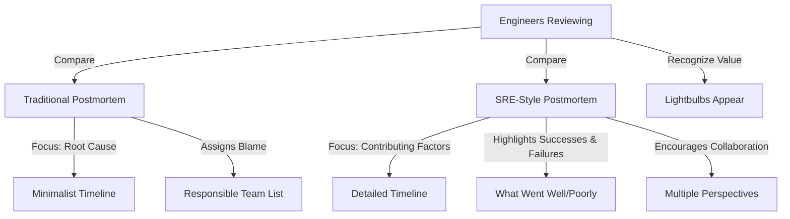

This layout visually underscores the contrast in depth, focus, and collaborative value between the two approaches.

### Teaching Narrative

Postmortems (or "incident reviews") are the primary vehicle for organizational learning from incidents. Traditional production support approaches often treat postmortems as perfunctory documentation exercises aimed at satisfying management that "something has been done." The SRE approach transforms postmortems into powerful learning artifacts that drive systemic improvement. Effective postmortems are blameless, thorough, timely, and action-oriented. They capture not just what broke but how the incident was detected, diagnosed, and mitigated. They explore not just technological failures but team coordination, communication challenges, and unexpected system behaviors. Perhaps most importantly, they identify what went well alongside what went poorly—creating a complete picture of organizational response rather than merely cataloging failures.

### Common Example of the Problem

Capital Credit Union completed a major core banking system migration that experienced several service disruptions during the first week. The postmortem document contained just three sections: "Issue" (briefly describing customer impact), "Root Cause" (identifying a configuration error in the load balancer), and "Resolution" (documenting the configuration change that fixed the immediate problem). The entire document was less than one page, completed by a single engineer, and filed away with minimal distribution. Three critical aspects of the migration nearly failed but were saved by last-minute interventions that went undocumented.

Six months later, when planning another major migration, the team had no record of these near-misses or the improvised solutions that prevented disaster. The new migration repeated many of the same mistakes, but this time without the fortuitous interventions, resulting in a three-day outage that affected all digital banking services and cost the institution millions in recovery efforts and customer compensation.

#### A Comparison of Traditional vs. SRE-Style Postmortems

| Aspect | Traditional Postmortem | SRE-Style Postmortem |
| -------------------------- | ----------------------------------------------- | ------------------------------------------------------------------------------------------- |
| **Incident Scope Covered** | Focuses on immediate issue resolution | Explores full lifecycle: detection, diagnosis, mitigation |
| **Key Sections** | "Issue," "Root Cause," "Resolution" only | Adds "Contributing Factors," "What Went Well," "What Went Poorly," and "Where We Got Lucky" |
| **Near-Misses Documented** | Rarely documented | Actively highlighted to learn from avoided failures |
| **Collaboration** | Single engineer writes report | Multi-perspective contributions from team members |
| **Distribution** | Minimal, often filed away | Broadly shared as a learning artifact |
| **Outcome** | Repeated mistakes; lack of systemic improvement | Drives systemic improvement and prevents recurrence |

This comparison highlights the limitations of the traditional approach, which often results in repeated errors and missed opportunities for organizational learning, versus the richer insights and proactive improvements fostered by the SRE-style postmortem.

### SRE Best Practice: Evidence-Based Investigation

Effective postmortem documents follow a comprehensive structure designed to capture the full range of incident learnings. Use the checklist below to ensure your postmortem covers all critical components:

#### Postmortem Checklist: Eight Essential Components

1. **Incident Summary**

   - ☐ Provide a brief executive overview.
   - ☐ Include impact duration, affected services, and customer experience.

2. **Timeline Reconstruction**

   - ☐ Create a detailed chronology from multiple perspectives.
   - ☐ Identify when the issue began, key decision points, and customer impact periods.

3. **Detection Analysis**

   - ☐ Explain how the issue was discovered.
   - ☐ Evaluate whether detection mechanisms worked as expected.
   - ☐ Highlight opportunities for monitoring improvements.

4. **Contributing Factors Analysis**

   - ☐ Systematically examine all factors influencing the incident.
   - ☐ Include technical systems, processes, communication patterns, and organizational structures.

5. **What Went Well**

   - ☐ Document effective responses and resilience mechanisms.
   - ☐ Recognize positive team behaviors during the incident.

6. **What Went Poorly**

   - ☐ Provide an honest assessment of challenges during the response.
   - ☐ Address communication breakdowns and system weaknesses revealed by the incident.

7. **Where We Got Lucky**

   - ☐ Identify near-misses and fortunate circumstances.
   - ☐ Acknowledge risks that may not be mitigated in future incidents.

8. **Action Items**

   - ☐ List specific, assigned, and timebound improvements.
   - ☐ Focus on systemic issues rather than immediate symptoms.

This checklist ensures your postmortem captures both a narrative understanding of what happened and actionable insights to prevent similar incidents. By following these practices, the document transforms from a simple record into a valuable learning artifact that drives meaningful, systemic improvements.

### Banking Impact

Poorly structured postmortems create significant business risks for financial institutions:

1. **Knowledge Evaporation**: Critical insights remain trapped in individuals' memories rather than becoming organizational knowledge, creating dangerous dependencies on specific people.

2. **Remediation Gaps**: Without comprehensive analysis, improvements address only the most visible symptoms while leaving underlying vulnerabilities intact.

3. **Wasted Recovery Investments**: Resources are allocated ineffectively when partial understanding drives improvement priorities.

4. **Siloed Learning**: Insights gained by one team fail to benefit other areas of the organization facing similar challenges.

5. **Regulatory Exposure**: Superficial postmortems fail to satisfy increasingly stringent regulatory requirements for incident analysis and systemic improvement.

#### Business Impact Visualized

The adoption of comprehensive postmortem practices has yielded measurable benefits for global banking institutions. Over an 18-month period, organizations saw:

- A **35-40% reduction** in recurring incidents.
- Up to a **45% reduction** in Mean Time to Resolution (MTTR) for novel incidents.

Below is a visual representation of these improvements:

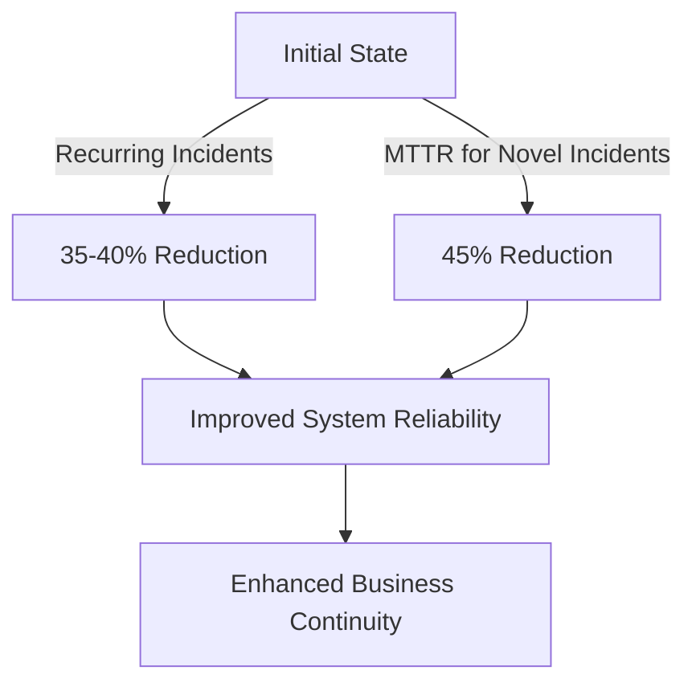

By investing in structured, blameless, and thorough postmortems, financial institutions not only mitigate risks but also position themselves for long-term operational resilience and regulatory compliance.

### Implementation Guidance

To implement effective postmortem practices in your organization, follow these steps:

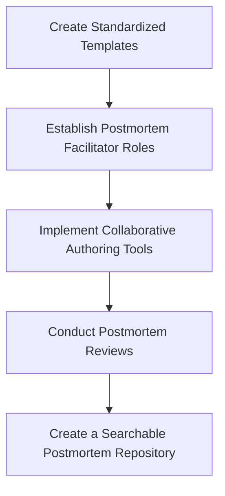

1. **Create Standardized Templates**\
   Develop and mandate comprehensive postmortem templates that prompt thorough analysis across all dimensions. Include specific guidance questions in each section to help authors explore beyond obvious technical factors.

2. **Establish Postmortem Facilitator Roles**\
   Designate and train facilitators who aren't involved in incident response to guide the postmortem process. Facilitators ensure objective and thorough analysis, maintaining a blameless, constructive environment.

3. **Implement Collaborative Authoring Tools**\
   Use digital platforms that enable simultaneous input from multiple perspectives. This allows different teams to contribute their observations to a shared timeline and analysis, enriching the collective understanding.

4. **Conduct Postmortem Reviews**\
   Establish regular sessions where completed postmortems are presented to a wider audience. These reviews provide opportunities for additional insights, ensure the quality and completeness of the analysis, and foster organizational learning.

5. **Create a Searchable Postmortem Repository**\
   Implement a knowledge base where postmortems are categorized, tagged, and made searchable. This repository enables pattern recognition across incidents, facilitates knowledge sharing, and supports long-term systemic improvement.

## Panel 3: Psychological Safety - The Foundation of Incident Learning

### Scene Description

A developer named Marcus is speaking in a postmortem meeting, visibly uncomfortable but determined. He explains a configuration change he made that contributed to the incident. Rather than facing accusation, he receives nodding support from his manager and thoughtful questions from colleagues aimed at understanding the context of his decision.

The room setup reinforces the psychological safety principles in action:

```
Postmortem Meeting Room Layout:
------------------------------------
|                                  |
|  [Screen Displaying]             |
|  "Learning Policy"               |
|                                  |
|   Manager            Colleagues  |
|       ^                   ^      |
|       |                   |      |
| Marcus ---> Explains ---> Facilitator
|                                  |
| [Whiteboard: Notes systemic      |
|  factors: "Unclear Documentation"|
|  and "Deployment Pressure"]      |
------------------------------------
```

The SRE facilitator stands near the whiteboard, visibly noting systemic factors such as "unclear documentation" and "deployment pressure," shifting focus from the individual to the environment. One screen prominently displays the company's "Learning Policy," which explicitly states that human error is never a root cause and that individuals will not be punished for honest mistakes.

This setup highlights the deliberate effort to create an environment of trust, where individuals feel safe to share mistakes and uncertainties, enabling deeper organizational learning.

### Teaching Narrative

Psychological safety is the bedrock upon which all incident learning is built. Without it, crucial details remain hidden, defensive behaviors emerge, and the organization learns only superficial lessons. Production support professionals often operate in environments where errors are seen as individual failures rather than systemic ones. The SRE approach recognizes that blame is antithetical to learning—the more we blame, the less we discover. Creating psychological safety requires explicit policies that separate performance management from incident analysis, leadership that models vulnerability, and facilitators who actively redirect blame-oriented discussions toward systems thinking. True psychological safety is evident not when people claim it exists, but when individuals voluntarily share their mistakes, uncertainties, and fears without hesitation because they trust this information will be used for learning rather than punishment.

### Common Example of the Problem

At Metropolitan Savings Bank, a critical batch processing failure delayed overnight account updates, affecting morning balances for thousands of customers. The following table summarizes the sequence of events and highlights the impact of psychological safety failures:

| **Timeline** | **Event/Decision** | **Consequence** | **Notes on Psychological Safety** |
| -------------------------- | --------------------------------------------------------------------- | ----------------------------------------------------------------------------------------------- | ------------------------------------------------------------------------- |
| Initial Failure | Batch processing failure occurs, delaying account updates. | Thousands of customers see incorrect balances in the morning. | Incident begins, but systemic issues remain unexamined. |
| Postmortem Meeting | Operations manager asks, "Who made this change without approval?" | Junior engineer remains silent for fear of career repercussions. | Fear of blame prevents disclosure of critical details. |
| Misdiagnosis | Team identifies unrelated configuration issue as the cause. | Fixes are implemented that do not address the real problem. | Psychological safety deficit leads to a superficial root cause analysis. |
| Recurrence (3 weeks later) | Same failure occurs with greater severity. | $1.2 million in recovery costs and significant damage to customer trust. | Missed opportunity to learn from the initial incident exacerbates impact. |
| Anonymous Tip Received | Team is informed deployment pressure caused skipped validation steps. | Underlying systemic issue is finally identified but only after significant damage has occurred. | Psychological safety failure delayed accurate diagnosis and resolution. |

This example illustrates that when individuals fear blame, they withhold essential information, leading to incomplete understanding of incidents. Without psychological safety, organizations risk repeated failures, higher costs, and lost learning opportunities.

### SRE Best Practice: Evidence-Based Investigation

Building psychological safety for effective incident learning requires systematic approaches that shift focus from individual blame to system understanding. The following checklist summarizes best practices for evidence-based investigation:

#### Checklist: Evidence-Based Investigation for Incident Learning

- **Use Learning-Focused Language:**

  - Replace blame-centric terms like "human error" with system-centric terms like "system behavior."
  - Discuss "contributing factors" instead of "root cause" to emphasize complexity.

- **Apply the Local Rationality Principle:**

  - Assume individuals' actions were rational given their context, goals, and knowledge at the time.
  - Investigate influencing factors, such as unclear documentation, team pressures, or tooling limitations.

- **Separate Learning from Accountability:**

  - Explicitly distinguish incident reviews (focused on system improvement) from performance reviews (focused on individual accountability).
  - Reinforce that the purpose of incident analysis is learning, not punishment.

- **Encourage Counterfactual Curiosity:**

  - Ask "what if" questions to explore potential system vulnerabilities.
  - Avoid fixating solely on the specific path the incident took; consider alternative scenarios.

- **Integrate Multiple Perspectives:**

  - Actively seek input from diverse roles and viewpoints to enrich understanding.
  - Encourage participants to share how the system appeared to them at the time of the incident.

- **Foster Trust and Psychological Safety:**

  - Ensure all participants feel safe sharing uncertainties, mistakes, and insights.
  - Reiterate that honesty contributes to system improvement, not blame.

These approaches help create environments where complete information surfaces naturally, enabling deeper learning and more effective system improvements.

### Banking Impact

The business impact of psychological safety (or its absence) is profound for financial institutions:

1. **Information Quality**: Without psychological safety, organizations make decisions based on sanitized, incomplete information that omits critical details about system weaknesses.

2. **Near-Miss Invisibility**: Potential disasters that were narrowly averted remain unreported, eliminating valuable learning opportunities before catastrophic failures occur.

3. **Frontline Insights Lost**: Customer-facing staff and technical first responders often have the clearest view of system weaknesses but are least likely to speak up in blame-oriented cultures.

4. **Innovation Suppression**: Teams become risk-averse, avoiding creative solutions that might fail and focusing instead on maintaining the status quo regardless of effectiveness.

5. **Response Speed**: During active incidents, blame concerns create hesitation and communication barriers that directly extend outage duration.

Below is a visualization showing the quantitative benefits of high psychological safety in financial services incident management:

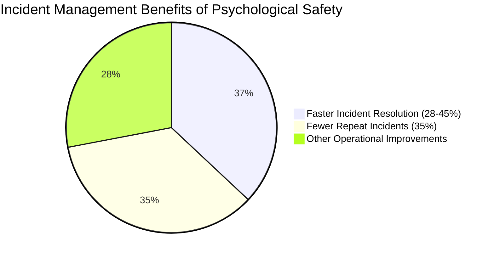

Research in financial services organizations demonstrates these measurable outcomes. Teams with high psychological safety resolve incidents 28-45% faster and experience 35% fewer repeat incidents than teams with low psychological safety. These improvements directly reduce operational costs, minimize downtime, and enhance customer experience, making psychological safety not just a cultural priority but a business imperative.

### Implementation Guidance

To build psychological safety for effective incident learning in your organization:

1. **Establish a Formal Learning Policy**: Create and prominently communicate an organizational policy that explicitly separates incident learning from blame and disciplinary processes. This policy should be endorsed by executive leadership and referenced at the start of every incident review.

2. **Train Leaders in Vulnerability Modeling**: Provide coaching for managers and senior engineers on how to demonstrate vulnerability by openly sharing their own mistakes and uncertainties, creating permission for others to do the same.

3. **Implement Facilitation Techniques**: Train postmortem facilitators in specific methods to redirect blame-oriented discussions, such as the "5 Whys to Systems" approach that transforms individual-focused questions into systems-focused ones.

4. **Create Anonymous Reporting Channels**: Establish mechanisms for team members to safely report near-misses, concerns, and system weaknesses without attribution until psychological safety strengthens.

5. **Measure and Reward Learning Behaviors**: Track and recognize behaviors that contribute to organizational learning—such as identifying previously unknown risks, suggesting systemic improvements, or raising questions about accepted practices—rather than just rewarding error-free performance.

## Panel 4: Incident Analysis - Beyond the Timeline

### Scene Description

The SRE team is conducting a facilitated analysis session two days after an incident. The room is set up to encourage collaboration and deep analysis. Below is a text-based visualization of the physical and social environment during the session:

```
+------------------------------------------------------------------------------------+
|                                Incident Analysis Room                              |
|                                                                                    |
|  [Timeline of Events]    [System Architecture Diagrams]    [Metric Graphs]         |
|  +------------------+     +---------------------------+     +-------------------+  |
|  | Detailed events  |     | Components and flows      |     | Key anomalies     |  |
|  | and timestamps   |     | in the system            |     | over time         |  |
|  +------------------+     +---------------------------+     +-------------------+  |
|                                                                                    |
|  [Sticky Notes Wall]   Facilitator (center): Highlights key points                 |
|  +-----------------+   using colored markers for surprising behaviors,             |
|  | Observations    |   coordination challenges, and detection opportunities.       |
|  | and Questions   |                                                              |
|  +-----------------+                                                              |
|                                                                                    |
|  Participants:                                                                     |
|    - Customer Support Representative: Explains user impact.                       |
|    - Database Administrator: Discusses capacity decisions.                        |
|    - Product Manager: Shares business context of a recent feature launch.         |
|    - Junior Engineer: Observes and reflects on the revealed system complexity.     |
+------------------------------------------------------------------------------------+
```

The walls are covered with artifacts—a detailed timeline, system architecture diagrams, graphs showing anomalous metrics, and sticky notes capturing observations and questions. Multiple perspectives are being integrated: a customer support representative describes user impact, a database administrator explains capacity decisions, and a product manager shares business context about a recent feature launch. The facilitator uses different colored markers to emphasize surprising behaviors, coordination challenges, and detection opportunities across the timeline. A junior engineer, standing near the sticky notes wall, looks astonished at the complexity being revealed in a system she once thought she understood.

### Teaching Narrative

Incident analysis goes far beyond constructing an accurate timeline—it seeks to understand why actions made sense to people at the time, how information flowed during the response, and what systemic pressures shaped decision-making. Traditional approaches often focus narrowly on technical details, missing the human and organizational dimensions that are equally critical to understanding and preventing future incidents. Effective SRE incident analysis incorporates multiple perspectives, examines counterfactual scenarios ("what if" questions), identifies detection and mitigation barriers, and uncovers hidden dependencies. It distinguishes between proximate causes (the technical trigger) and systemic causes (the organizational conditions that made the incident possible or worsened its impact). This deeper analysis transforms incidents from simple technical failures into windows that reveal how your complex socio-technical system actually behaves—information that cannot be obtained any other way.

### Common Example of the Problem

Eastcoast Bank's mobile application suffered intermittent outages over three days, affecting approximately 30% of customer login attempts. The initial incident analysis consisted of a technical team reviewing logs and identifying a database connection pool exhaustion as the immediate cause. They increased the connection pool size and considered the incident resolved. However, the timeline only documented when alerts fired and what actions were taken, without exploring why the connection pool became exhausted in the first place. A month later, a more severe outage occurred, exposing the limitations of this superficial analysis.

The table below compares the initial superficial analysis with the later comprehensive review, highlighting the missed opportunities for deeper understanding:

| Aspect | Initial Superficial Analysis | Later Comprehensive Review |
| --------------------------- | -------------------------------------------------- | ------------------------------------------------------------------ |
| **Focus** | Technical trigger (connection pool exhaustion) | Systemic causes (e.g., marketing campaign, user behavior) |
| **Scope** | Immediate technical resolution | Cross-functional dynamics and organizational factors |
| **Information Flow** | Logs and alerts analyzed in isolation | Included input from customer service and business teams |
| **Root Cause Exploration** | Stopped at proximate cause | Investigated upstream triggers and systemic pressures |
| **Detection Opportunities** | Focused on reactive fixes | Identified early warning signals ignored due to communication gaps |
| **Outcome** | Temporary fix, repeat incident with greater impact | Insights to prevent recurrence and address systemic issues |

The comprehensive review revealed that a seemingly unrelated marketing campaign had changed customer behavior patterns, causing usage spikes that exceeded design parameters. Additionally, early warning signs had been noticed by customer service representatives but never reached the technical team due to communication barriers. By moving beyond the timeline and integrating multiple perspectives, the team uncovered hidden dependencies and systemic issues, ultimately transforming their understanding of the incident and the socio-technical system as a whole.

### SRE Best Practice: Evidence-Based Investigation

Comprehensive incident analysis techniques that go beyond timeline reconstruction include:

1. **Multi-Perspective Reconstruction**: Gathering accounts from all stakeholders—technical teams, customer support, business units, and even customers when possible—to build a multidimensional understanding of the incident.

2. **Systemic Factor Analysis**: Using structured frameworks like STAMP (Systems-Theoretic Accident Model and Processes) or Dekker's "Field Guide to Understanding Human Error" to identify how organizational structures, incentives, and processes influenced the incident.

3. **Decision Context Mapping**: Reconstructing the information available to decision-makers at key points to understand why actions made sense at the time rather than judging them with hindsight bias.

4. **Coordination and Communication Analysis**: Examining how information flowed (or failed to flow) between teams, tools, and individuals during both the incident formation and response phases.

5. **Counterfactual Exploration**: Identifying "near misses" where slight differences in conditions could have prevented the incident or made it significantly worse, revealing system brittleness and resilience points.

#### Checklist for Evidence-Based Incident Analysis

To ensure a thorough and actionable investigation, use this checklist to apply the above techniques consistently:

- [ ] **Gather Multi-Perspective Inputs**: Have you included perspectives from all relevant stakeholders (technical, business, customer-facing, and end-users, if possible)?
- [ ] **Analyze Systemic Factors**: Have you used a structured framework to uncover organizational and systemic contributors to the incident?
- [ ] **Map Decision Contexts**: Have you reconstructed key decision points and considered the information available to decision-makers at those times?
- [ ] **Review Communication Flows**: Have you identified gaps or failures in communication and coordination during the incident's lifecycle?
- [ ] **Explore Counterfactual Scenarios**: Have you examined "what if" scenarios to identify possible near misses or points of systemic resilience?

These techniques and the accompanying checklist create a three-dimensional view of incidents that reveals not just what happened but why it happened and what system changes would most effectively prevent recurrence.

### Banking Impact

Superficial incident analysis creates substantial business risks for financial institutions:

1. **Chronic Vulnerability**: Addressing only technical symptoms leaves underlying systemic weaknesses intact, creating the potential for more severe future incidents.

2. **Resolution Inefficiency**: Resources are wasted implementing superficial fixes that fail to address root problems, requiring repeated remediation efforts.

3. **Risk Blindness**: Leadership makes strategic decisions without awareness of actual operational risks, potentially increasing system fragility through otherwise sensible business initiatives.

4. **Regulatory Exposure**: Financial regulators increasingly expect sophisticated incident analysis that addresses systemic factors, creating compliance risk for institutions with superficial practices.

5. **Customer Trust Erosion**: Repeated incidents that share common causes signal to customers that the institution lacks control over its systems, directly impacting relationship strength.

The cascading effects of superficial analysis can be visualized as follows:

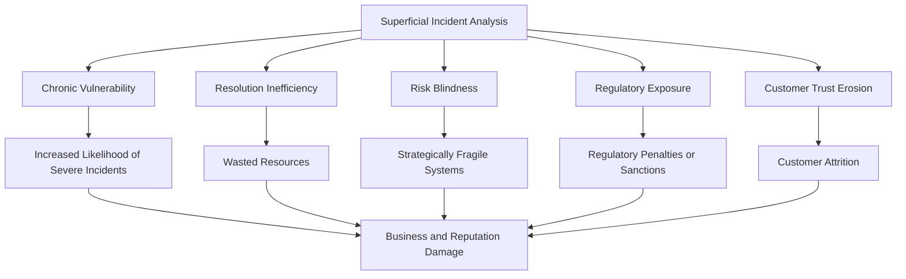

Financial institutions with mature analysis practices typically achieve:

- **40-60% reduction in serious incidents** within 12-18 months.
- **25-35% improvement in mean time to resolution** through improved system understanding.

These improvements directly enhance operational efficiency, regulatory compliance, and customer experience, demonstrating the tangible benefits of addressing systemic factors in incident analysis.

### Implementation Guidance

To implement advanced incident analysis practices in your organization:

1. **Develop Analysis Frameworks**:\
   Create structured analysis guides that prompt exploration beyond technical factors to organizational, process, and human dimensions. These frameworks should include specific questions for different incident types.

2. **Establish Multi-Stakeholder Analysis Sessions**:\
   Design and implement facilitated sessions that bring together diverse perspectives—operations, development, business, customer service, compliance—to analyze significant incidents collaboratively.

3. **Create Visualization Standards**:\
   Develop templates for visual representations of incidents that go beyond chronological timelines to show information flows, decision points, and system interactions.

4. **Implement Analysis Tools**:\
   Adopt tools specifically designed for comprehensive incident analysis that support collaborative timeline construction, factor categorization, and pattern identification across multiple incidents.

5. **Train Analysis Facilitators**:\
   Develop dedicated expertise in incident analysis facilitation, with trained individuals who understand both technical systems and human factors, and can guide teams through structured analysis processes.

#### Advanced Incident Analysis Workflow

Below is a high-level flowchart illustrating the key steps to implement advanced incident analysis practices:

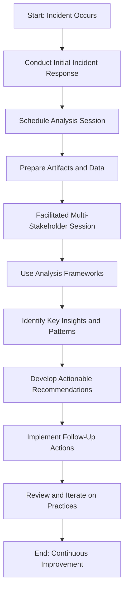

This workflow emphasizes the iterative nature of incident analysis, integrating preparation, collaboration, and follow-up to ensure both technical and organizational learning.

## Panel 5: From Insights to Action - The Continuous Improvement Loop

### Scene Description

```markdown
### Scene Description

```

Kanban Board: "Reliability Improvements"

______________________________________________________________________

| Incident Ref | Proposed Improvement | Expected Impact | Estimated Effort | Status |
| ------------ | ---------------------- | --------------------------- | ---------------- | ---------------- |
| INC-1234 | Add detailed runbook | Faster recovery | Low | Quick Win |
| INC-5678 | Upgrade monitoring | Better alerts | Medium | Strategic Invest |
| INC-9012 | Investigate Error Logs | Add detailed runbook faster | Low | |

```


```

### Teaching Narrative

Learning without action creates the illusion of progress while leaving systems vulnerable to repeat failures. The SRE approach creates a continuous improvement loop that transforms incident insights into prioritized, tracked, and measured improvements. Unlike traditional models where remediation focuses narrowly on preventing an exact recurrence of the specific incident, SRE improvement strategies address systemic issues that could manifest in multiple ways. Effective improvement processes balance quick tactical fixes with strategic investments in architectural resilience. They recognize that not all improvements involve code—enhanced observability, clearer documentation, improved collaboration processes, and knowledge sharing can be equally valuable. Most importantly, they close the loop by measuring whether improvements actually achieved their intended effects, creating an evidence-based approach to reliability enhancement.

### Common Example of the Problem

Regional Investment Bank conducted thorough postmortems after a high-severity trading platform outage, identifying 14 contributing factors and generating 23 specific improvement recommendations. These were documented in a comprehensive report shared with leadership. However, six months later, a follow-up review uncovered systemic issues in executing these improvements:

| Recommendation ID | Description | Status | Potential Impact of Non-Implementation |
| ----------------- | ----------------------------------- | --------------- | ------------------------------------------------------- |
| 1 | Improve failover mechanisms | Not Implemented | Increased risk of prolonged outages during failovers |
| 2 | Enhance database replication | Not Implemented | Higher likelihood of data inconsistency during failures |
| 3 | Update incident response runbooks | Implemented | Improved team response times |
| 4 | Strengthen API rate-limiting | Not Implemented | Risk of performance degradation under high load |
| 5 | Conduct regular chaos engineering | Not Implemented | Lack of preparedness for unanticipated failure modes |
| ... | ... | ... | ... |
| 23 | Improve monitoring alert thresholds | Not Implemented | Higher probability of delayed issue detection |

Out of the 23 recommendations, only three were implemented, while the remaining 20 were assigned to various teams but repeatedly deprioritized in favor of feature development. The absence of a tracking mechanism or accountability system led to these recommendations fading into the background amidst competing priorities.

When another major incident occurred, investigation revealed that 9 of the unimplemented improvements (e.g., failover mechanisms, database replication, and API rate-limiting) would likely have prevented or significantly reduced the impact of the second incident. As a result, the bank incurred approximately $3.7 million in direct costs and faced increased regulatory scrutiny for failing to address known system weaknesses.

This example underscores the criticality of not just identifying improvements but ensuring their execution through prioritization, tracking, and accountability.

### SRE Best Practice: Evidence-Based Investigation

Effective improvement management systems include several key components, which can be summarized in the following checklist for practical application:

| **Component** | **Description** | **Key Questions** |
| ------------------------------------- | -------------------------------------------------------------------------------------------------------------------------- | ------------------------------------------------------------------------------------------------------------------ |
| **Action Classification Framework** | Categorize improvements based on impact type (preventative vs. detective), scope (localized vs. systemic), and complexity. | - Is this a preventative or detective improvement?<br>- Does this address a localized issue or a systemic one? |
| **Balanced Prioritization Model** | Balance quick wins (high impact, low effort) with strategic investments (high impact, high effort) to ensure progress. | - What is the expected impact and effort for this improvement?<br>- How does this align with team priorities? |
| **Cross-Functional Ownership Model** | Assign clear ownership across teams for improvements addressing systemic issues spanning multiple domains. | - Who owns this improvement?<br>- Are the right teams involved to address cross-domain concerns? |
| **Implementation Tracking System** | Track improvement progress visibly, with regular reviews and escalation paths for stalled work. | - Is the progress of this improvement visible to stakeholders?<br>- Are there clear escalation paths for blockers? |
| **Effectiveness Measurement Process** | Validate whether improvements deliver the intended reliability benefits, creating a feedback loop for future actions. | - How will we measure the success of this improvement?<br>- Did this improvement achieve the desired outcomes? |

These elements create a closed-loop system that transforms incident insights into measurable reliability enhancements rather than allowing them to remain as documentation artifacts with no practical impact.

By following this structured approach, teams can ensure that their improvement processes are actionable, prioritized effectively, and continuously validated for their impact on system reliability.

### Banking Impact

Failure to implement improvement loops creates significant business consequences for financial institutions:

1. **Resource Waste**: Investments in incident analysis generate no return when insights aren't implemented, effectively throwing away the learning opportunities that incidents provide.

2. **Incident Recurrence**: Known vulnerabilities remain unaddressed, leading to repeat incidents that damage customer trust and create preventable recovery costs.

3. **Team Morale Degradation**: Engineering teams become cynical about incident reviews when they see the same issues recurring without meaningful improvement, reducing future engagement in the learning process.

4. **Competitive Disadvantage**: Financial institutions that effectively implement reliability learnings gain significant advantages in both operational efficiency and customer experience over those that don't.

5. **Regulatory Risk**: Financial regulators increasingly expect evidence that institutions learn from incidents and implement appropriate improvements, creating compliance exposure when improvement loops are incomplete.

Research highlights the measurable benefits of structured improvement processes:

```mermaid
barChart
    title Impact of Mature Improvement Processes
    axisTitleX Categories
    axisTitleY Percentage Reduction (%)
    ["Repeat Incidents", "Major Incident Frequency"]
    [50, 35]
```

Financial institutions with mature improvement processes experience up to:

- **45-55% fewer repeat incidents**: Addressing systemic vulnerabilities reduces the likelihood of recurring failures.
- **30-40% reduction in major incident frequency**: Strategic investments in architectural resilience and process improvements mitigate high-impact events over time.

### Implementation Guidance

To implement effective improvement loops in your organization, follow these steps:

#### Checklist for Setting Up Improvement Loops

1. **Create a Dedicated Improvement Backlog**

   - Establish a specific backlog for reliability improvements, separate from feature development.
   - Define a clear prioritization framework and allocate dedicated resources.

2. **Implement Regular Improvement Reviews**

   - Schedule periodic sessions to:
     - Review progress on ongoing improvements.
     - Address blockers impeding progress.
     - Incorporate new insights from recent incidents into improvement plans.

3. **Develop Impact Assessment Frameworks**

   - Design structured methods to:
     - Estimate the potential reliability impact of proposed improvements.
     - Use data-driven approaches to prioritize effectively.

4. **Establish Executive Sponsorship**

   - Secure leadership commitment by:
     - Regularly reporting on improvement metrics.
     - Demonstrating the business impact of completed reliability enhancements.

5. **Integrate with Work Management Systems**

   - Embed improvement tracking into existing tools (e.g., Kanban boards, ticketing systems) to:
     - Increase visibility and accountability.
     - Ensure improvements remain part of routine workflows.

6. **Measure Success and Close the Loop**

   - Define metrics to evaluate whether improvements achieve their intended outcomes.
   - Continuously refine processes based on measurable results.

#### Example Workflow (Text-Based Representation)

```
[Incident Occurs] --> [Postmortem Analysis] --> [Insights Identified] --> 
[Improvement Backlog Updated] --> [Impact Assessment & Prioritization] --> 
[Improvement Implemented] --> [Effectiveness Measured] --> [Process Refined]
```

## Panel 6: Organizational Memory - Patterns Across Incidents

### Scene Description

The SRE team is conducting a quarterly review of incidents. On a large display, they've mapped incidents by service, impact type, and contributing factors. The display reveals clusters and patterns that aren't visible when examining incidents individually. Below is a conceptual representation of the mapping:

```
graph TD
    A[Service A] -->|High Latency| P1[Incident 1]
    A -->|Error Rate| P2[Incident 2]
    B[Service B] -->|DB Connection| P3[Incident 3]
    B -->|DB Connection| P4[Incident 4]
    C[Service C] -->|Config Change| P5[Incident 5]
    C -->|Config Change| P6[Incident 6]
    P3 -->|Shared Cause| P4
```

One engineer is presenting a "meta-analysis" that connects three seemingly unrelated incidents (P3, P4, and another) through a common thread related to database connection handling. Another team member is maintaining a "knowledge base" of incident patterns. This knowledge base is displayed on a tablet, showcasing categorized lessons and recurring themes, such as "Database Connection Issues" and "Configuration Changes".

Meanwhile, a timeline visualization highlights how lessons from past incidents helped mitigate a recent event. The timeline emphasizes how organizational memory plays a key role in early detection and mitigation:

```
Timeline:
[2021 Q4] Incident P3 --> [2022 Q1] Incident P4 --> [2022 Q3] Mitigated Incident
```

A team member points to the timeline and remarks, "We've seen this pattern before, which is why we caught it early this time." The scene demonstrates how structured incident reviews and shared knowledge lead to proactive responses and a stronger organizational memory.

### Teaching Narrative

Individual incidents provide valuable lessons, but the richest insights emerge from identifying patterns across multiple incidents over time. Traditional production support approaches often treat each incident as a discrete event, missing the opportunity to identify systemic weaknesses that manifest in different ways. The SRE approach builds organizational memory through meta-analysis of incidents, tracking of recurring patterns, and knowledge sharing mechanisms that preserve and distribute learnings. This longitudinal view reveals which services are most problematic, which types of changes trigger incidents most frequently, and which contributing factors appear repeatedly despite remediation efforts. Building effective organizational memory requires structured approaches to incident categorization, accessible records of past incidents and their lessons, and regular review sessions that look across incidents rather than drilling into individual cases.

### Common Example of the Problem

Over 18 months, First National Bank experienced seven separate incidents involving their customer onboarding platform. Each incident was handled by different engineers, with separate postmortems conducted and specific fixes implemented. No one noticed that all seven incidents shared a common underlying pattern: they all involved data synchronization issues between the customer authentication system and account provisioning services. Each fix addressed the specific synchronization scenario that caused the immediate incident, but no one recognized the architectural weakness causing the recurring pattern. Only when a new SRE joined the team and reviewed historical incidents did the pattern become visible. The engineering cost of addressing the seven individual symptoms exceeded $400,000, while the architectural redesign that ultimately resolved the underlying issue cost just $85,000. Additionally, the repeated incidents created a poor onboarding experience for thousands of new customers, with an estimated customer acquisition impact of $1.2 million in lost revenue.

#### Incident Summary Table

| Incident # | Symptoms | Immediate Fix Implemented | Shared Underlying Issue |
| ---------- | ---------------------------------------------------- | -------------------------------------------- | ------------------------------------ |
| 1 | Delayed account creation for new users | Adjusted timeout settings in authentication | Data synchronization between systems |
| 2 | Duplicate account creation for some customers | Added duplicate-checking logic | Data synchronization between systems |
| 3 | Missing authentication tokens for new accounts | Implemented retry logic for token generation | Data synchronization between systems |
| 4 | Partial onboarding data visible in customer portal | Increased logging and monitoring | Data synchronization between systems |
| 5 | Accounts created without associated billing profiles | Added manual reconciliation process | Data synchronization between systems |
| 6 | Onboarding API returning inconsistent responses | Updated API schema and validation rules | Data synchronization between systems |
| 7 | Failure to provision accounts during peak traffic | Increased database connection pool size | Data synchronization between systems |

#### Problem Visualization

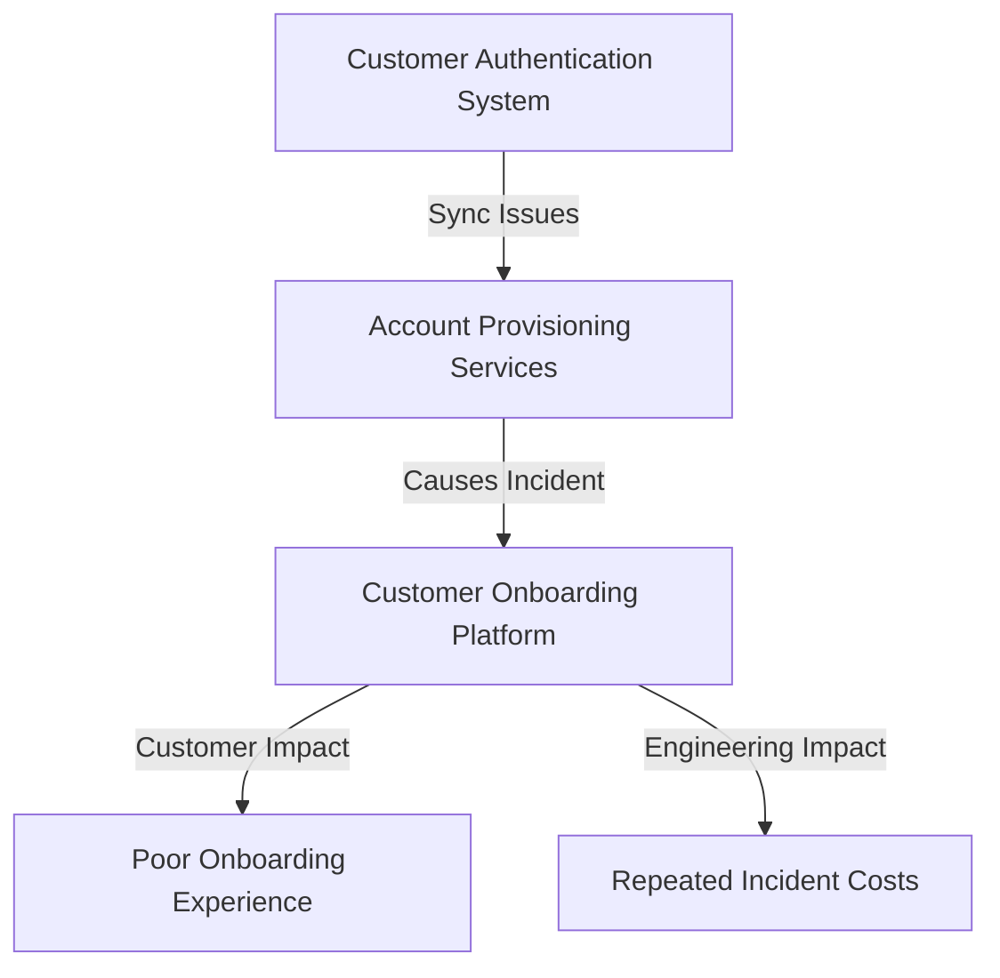

This visualization and table highlight how isolated fixes failed to address the systemic weakness in data synchronization. The architectural redesign ultimately resolved the shared issue, reducing both customer and engineering impacts.

### SRE Best Practice: Evidence-Based Investigation

Building effective organizational memory requires systematic approaches to incident knowledge management. The following checklist summarizes key best practices for evidence-based investigation, providing actionable steps for teams to follow:

| **Best Practice** | **Description** | **Actionable Steps** |
| ----------------------------------- | ------------------------------------------------------------------------------------------------------------------------------ | -------------------------------------------------------------------------------------------------------------------------------- |
| **Incident Taxonomies** | Structured classification systems for incidents that enable pattern recognition across services, components, and time periods. | - Define consistent categories (e.g., service, impact type, root cause).<br>- Regularly update taxonomies based on new findings. |
| **Comparative Analysis Techniques** | Methods from safety science and accident investigation to identify common patterns across seemingly unrelated incidents. | - Perform cross-incident reviews.<br>- Use techniques like the "5 Whys" or fault tree analysis to uncover systemic issues. |
| **Knowledge Base Architecture** | Information systems for capturing, categorizing, and retrieving incident learnings in ways that highlight patterns and trends. | - Use tagging and metadata for easy retrieval.<br>- Ensure knowledge base is searchable and accessible to all team members. |
| **Longitudinal Review Processes** | Regular meta-analysis sessions to identify systemic patterns invisible when examining incidents individually. | - Schedule quarterly or biannual review sessions.<br>- Use visualizations (e.g., timelines, heatmaps) to detect trends. |
| **Predictive Pattern Recognition** | Leveraging historical incident patterns to identify early indicators of potential future incidents before they escalate. | - Monitor for recurring signals or triggers.<br>- Apply machine learning or statistical models for early anomaly detection. |

These approaches transform isolated incident learnings into a connected body of knowledge, providing much deeper insights into system behavior than individual incident analysis alone.

### Banking Impact

Weak organizational memory creates significant business consequences for financial institutions:

1. **Repeated Remediation Costs**: Organizations repeatedly invest in fixing symptoms while missing opportunities to address underlying causes, multiplying engineering costs.

2. **Extended Incident Response Times**: Without pattern recognition, each incident is treated as novel, extending resolution time and increasing customer impact.

3. **Fragmented System Understanding**: Knowledge about system behavior remains trapped in individual experiences rather than becoming institutional wisdom.

4. **Vulnerability to Personnel Changes**: When incident knowledge resides primarily in people rather than systems, staff turnover creates dangerous knowledge gaps.

5. **Missed Strategic Opportunities**: Without pattern recognition, organizations fail to identify high-leverage architectural or process changes that could prevent entire classes of incidents.

Financial institutions with mature organizational memory systems typically reduce incident resolution times by 35-50% for recurring patterns and decrease incident frequency by 25-40% through identification and remediation of underlying systemic issues.

#### Cost-Benefit Comparison: Weak vs. Strong Organizational Memory

| Dimension | Weak Organizational Memory | Strong Organizational Memory |
| ---------------------------- | -------------------------------------------- | ---------------------------------------------- |
| **Incident Resolution Time** | Prolonged due to lack of pattern recognition | Reduced by 35-50% for recurring issues |
| **Incident Frequency** | High due to recurring systemic issues | Reduced by 25-40% through systemic remediation |
| **Engineering Costs** | Repeated costs for symptom-based fixes | Lower costs due to root cause identification |
| **System Understanding** | Fragmented and siloed | Institutional and widely accessible |
| **Impact of Staff Turnover** | High risk of knowledge gaps | Knowledge preserved in systems and processes |
| **Strategic Opportunities** | Frequently missed | Identified and acted upon proactively |

This comparison highlights the tangible benefits of investing in organizational memory systems. Beyond cost savings, strong organizational memory enables financial institutions to operate more reliably, adapt to challenges effectively, and build resilience over time.

### Implementation Guidance

To build effective organizational memory in your institution, follow these structured steps:

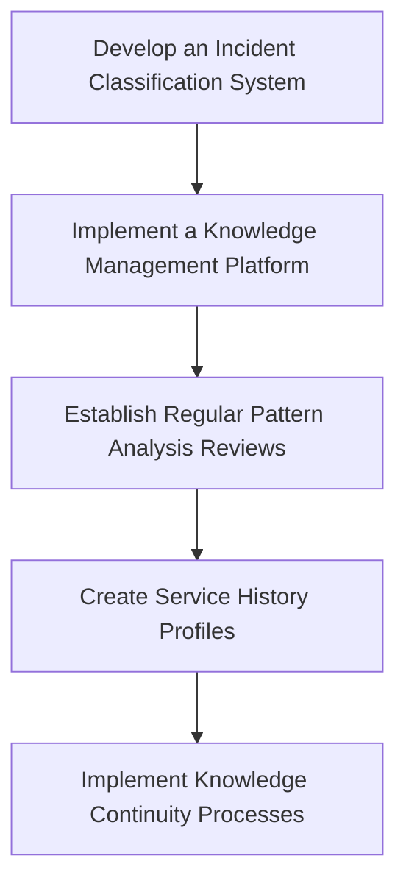

1. **Develop an Incident Classification System**:\
   Create a taxonomy specifically for your banking systems that categorizes incidents by affected services, contributing factors, detection methods, and resolution approaches. This enables consistent pattern recognition and helps identify systemic issues.

2. **Implement a Knowledge Management Platform**:\
   Deploy tools designed for incident knowledge capture and retrieval. Ensure the platform includes features to support pattern recognition, cross-incident comparison, and easy access to historical data.

3. **Establish Regular Pattern Analysis Reviews**:\
   Schedule quarterly sessions dedicated to meta-analysis across incidents. Include representatives from all technical teams to collaboratively identify cross-domain patterns and systemic weaknesses.

4. **Create Service History Profiles**:\
   Develop and maintain "reliability profiles" for each critical banking service. These profiles should track incident patterns, known vulnerabilities, and historical improvements to provide a comprehensive view of each service's operational history.

5. **Implement Knowledge Continuity Processes**:\
   Establish structured handover procedures to ensure incident knowledge transfers effectively during team changes. This prevents critical insights from being lost during staff transitions and preserves institutional learnings.

## Panel 7: Learning Beyond Failure - The Role of Success Analysis

### Scene Description

A diverse team is gathered for an unusual meeting labeled "Success Analysis." Instead of reviewing a failure, they're analyzing a major product launch that went unexpectedly smoothly despite high technical complexity. The facilitator guides them through questions like "Why did this go well when similar projects struggled?" and "What practices should we preserve and amplify?" On the whiteboard, they're mapping out the factors that contributed to success—early involvement of operations, incremental deployment, comprehensive observability, and clear rollback criteria. Team members look energized rather than drained, contrasting with the typical post-incident exhaustion.

### Teaching Narrative

Organizations fixated solely on learning from failures miss half the picture—understanding why things go right is equally valuable. Traditional approaches assume success is the default state and only failure requires analysis, but the SRE perspective recognizes that success in complex systems is actually the result of countless adaptations, adjustments, and skillful interventions that often go unrecognized. Success analysis (sometimes called "appreciative inquiry") examines cases where things went unexpectedly well despite challenging conditions. It identifies resilience mechanisms—both technical and human—that can be deliberately reinforced. By balancing failure analysis with success analysis, organizations develop a more complete understanding of their systems' behavior and avoid the cognitive bias of focusing exclusively on negative events. This balanced approach also helps combat the psychological toll of working only on problems and builds a culture that recognizes and amplifies effective practices rather than merely eliminating deficient ones.

### Common Example of the Problem

Transcontinental Bank successfully completed a merger of two major core banking platforms with minimal customer impact, despite the high complexity and risk of such an integration. The project was considered a success, with executive leadership quickly moving focus to the next strategic initiative. However, no formal analysis of why this complex project succeeded was conducted, and the practices that enabled this success were not documented or standardized.

The following timeline illustrates the sequence of events and the contrasting outcomes between the two migrations:

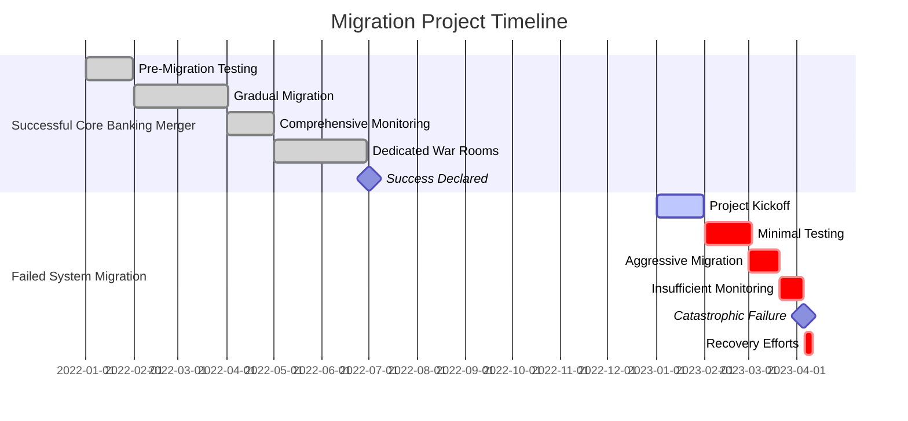

Six months after the successful merger, a similar but smaller system migration failed catastrophically, resulting in five days of severe customer disruption. Many of the practices that enabled the successful merger—detailed pre-migration testing, gradual customer migration, comprehensive monitoring, and dedicated war rooms with cross-functional expertise—had not been transferred to the team handling the second migration. This lack of knowledge propagation occurred because the organization had no mechanism for analyzing and sharing the factors that contribute to success.

The failed migration cost approximately $7.3 million in recovery efforts and customer compensation, while creating lasting damage to the bank's reputation for reliability. This stark contrast highlights the importance of success analysis in capturing and institutionalizing effective practices before they are lost.

### SRE Best Practice: Evidence-Based Investigation

Effective success analysis methodologies are critical for uncovering the often-overlooked factors that contribute to successful outcomes. The following table summarizes key methodologies, their descriptions, and the unique benefits they provide:

| **Methodology** | **Description** | **Key Benefits** |
| ------------------------------------- | --------------------------------------------------------------------------------------------------------------------- | ---------------------------------------------------------------------------------------------------- |
| **Appreciative Inquiry Framework** | A structured approach that identifies what worked well, why it worked, and how these practices can be expanded. | Encourages a strengths-based mindset and helps scale effective practices to other teams or projects. |
| **Resilience Engineering Techniques** | Methods from safety science focusing on how systems and teams adapt successfully to challenging conditions. | Highlights adaptive capacities and resilience mechanisms that may otherwise go unnoticed. |
| **Positive Deviance Analysis** | Identifying teams or services that consistently outperform peers in reliability metrics and studying their practices. | Reveals replicable patterns of success and fosters cross-team learning. |
| **Success Factor Cataloging** | Creating taxonomies of technical, procedural, and cultural elements that contribute to success. | Provides a reusable knowledge base for designing future systems and improving operational practices. |
| **Counterfactual Success Analysis** | Examining situations where failures could have reasonably occurred but were prevented. | Illuminates hidden resilience mechanisms and helps refine preventive strategies. |

By leveraging these methodologies, teams can systematically investigate success and develop actionable insights into the strengths of their systems. Below is a simple checklist to guide practitioners during a success analysis session:

**Checklist for Evidence-Based Success Analysis**

- [ ] Clearly define the success event and why it is worth analyzing.
- [ ] Gather a diverse team of stakeholders, including technical, operational, and leadership perspectives.
- [ ] Utilize at least one structured methodology (e.g., Appreciative Inquiry, Positive Deviance Analysis).
- [ ] Document technical, procedural, and cultural factors contributing to success.
- [ ] Identify adaptive behaviors or resilience mechanisms that prevented potential failures.
- [ ] Discuss how identified practices can be preserved, amplified, or applied to other contexts.
- [ ] Share findings across teams to build organizational knowledge and foster a culture of learning.

These tools and practices enable organizations to move beyond reacting to failures and toward proactively reinforcing the conditions for success.

### Banking Impact

Neglecting success analysis creates significant missed opportunities for financial institutions:

1. **Unrecognized Competitive Advantages**: Organizations fail to identify and leverage unique operational strengths that could provide market differentiation.

2. **Fragile Success Patterns**: Without explicit recognition and reinforcement, successful practices often erode over time or fail to propagate across the organization.

3. **Defensive Culture Development**: Teams focused exclusively on avoiding failure develop risk-averse mindsets that can inhibit innovation and continuous improvement.

4. **Reliability Tribal Knowledge**: Success factors remain as implicit knowledge held by experienced team members rather than becoming explicit organizational practices.

5. **Missed Reinforcement Opportunities**: Without understanding why things go right, organizations cannot deliberately strengthen the practices that contribute to success.

#### Quantified Benefits of Balanced Learning Approaches

Financial institutions that implement balanced learning approaches—studying both failure and success—typically achieve:

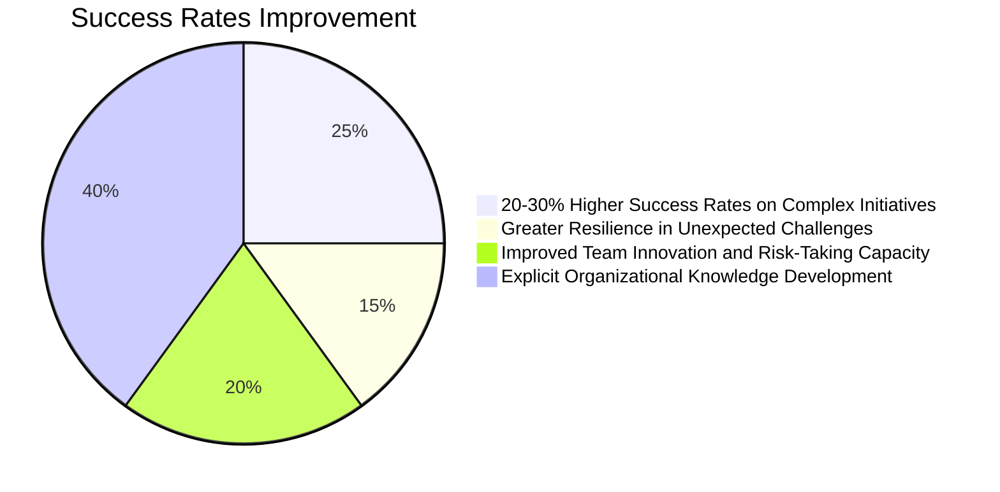

This balanced approach not only drives higher success rates on complex technology initiatives but also fosters organizational resilience, amplifies innovation, and ensures that effective practices are codified for sustained long-term impact.

### Implementation Guidance

To implement effective success analysis in your organization, follow these steps systematically:

#### Checklist for Success Analysis Implementation:

- [ ] **Define Success Criteria**

  - Identify scenarios where success warrants formal analysis (e.g., seamless complex deployments, rapid incident resolutions, handling unexpected loads effectively).
  - Set thresholds or triggers for initiating success analysis sessions.

- [ ] **Develop Analysis Templates**

  - Create structured templates with prompts to explore contributing factors:
    - Technical aspects (e.g., automation, tooling, observability).
    - Procedural elements (e.g., early involvement, testing strategies).
    - Human factors (e.g., communication, decision-making under pressure).

- [ ] **Schedule Regular Success Reviews**

  - Allocate dedicated time for success analysis, ensuring it becomes a routine practice.
  - Use a consistent cadence (e.g., quarterly or after major projects) to reinforce the habit.

- [ ] **Document and Share Insights**

  - Integrate findings into existing knowledge management systems (e.g., wikis, postmortem tools).
  - Ensure success patterns are easily accessible alongside incident learnings.

- [ ] **Train Teams on Success Recognition**

  - Provide training to help teams identify and document resilience mechanisms, including "near-failures" that were averted.
  - Encourage awareness of practices that contribute to everyday system stability.

#### Step-by-Step Process Flow:

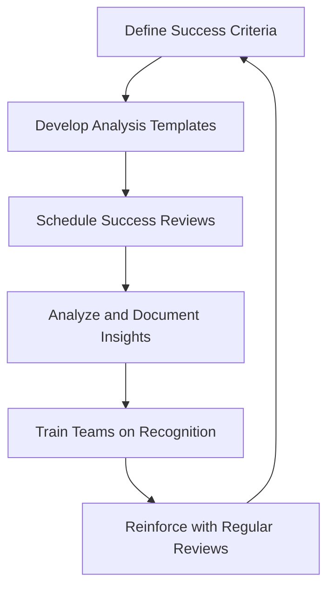

By following this checklist and process flow, organizations can systematically implement success analysis, enabling them to amplify effective practices and build resilience across their systems.
