# Chapter 10: Reliability as a Product Feature

## Chapter Overview

Welcome to the chapter where the myth that “customers don’t care about reliability” gets hauled out back and shot. Here, we don’t treat reliability as the awkward stepchild of product development—relegated to the bottom of the backlog, only remembered when Twitter is on fire and support phones are melting. Instead, we’re putting reliability front and center, where it belongs: as a product feature with business weight, customer expectations, and real financial consequences. If you think reliability is just “keeping the lights on,” prepare to have that illusion broken—possibly with the subtlety of a sledgehammer. We’ll dissect how banks (and anyone else with existential uptime needs) get burned by treating reliability as an afterthought, and show you how to weaponize evidence, error budgets, and operational design to make sure “it works” isn’t the least you can say about your product. Ready to stop being the canary in the coal mine? Let’s get clinical.

______________________________________________________________________

## Learning Objectives

- **Articulate** why reliability is a non-negotiable product feature, not an operational afterthought.
- **Quantify** the direct business impacts (money, reputation, regulatory pain) of reliability failures in financial services.
- **Translate** technical reliability metrics into language that executives and product owners actually care about.
- **Design** user experiences that don’t leave customers guessing (or rage-quitting) when things go sideways.
- **Implement** error budgets to force accountability and discipline into product vs. reliability trade-offs.
- **Integrate** operational requirements into the earliest stages of product design, not bolted on after the fact.
- **Manage** reliability work as part of the main product backlog, with clear value statements and prioritization.
- **Foster** a culture where reliability advocacy isn’t just an SRE’s Sisyphean task but an organization-wide instinct.

______________________________________________________________________

## Key Takeaways

- Reliability is the oxygen of product features: nobody asks for it, but everyone notices when it disappears—and suffocates your business.
- Chasing shiny features while underinvesting in reliability is how banks go from “trusted institution” to “Twitter meme” in a week.
- “It works most of the time” isn’t a selling point; it’s a warning label.
- If you can’t tie reliability metrics to dollars, churn, or regulatory fines, expect your requests for improvement budget to die on the altar of “feature velocity.”
- Error budgets: the only thing standing between you and endless “just ship it” arguments. Use them, or prepare to live in incident hell.
- Graceful degradation and honest status messages aren’t nice-to-haves—they’re the difference between annoyed customers and furious ex-customers.
- Operational design is not optional. If your ops team needs a Ouija board to debug your system, you’ve already failed.
- Reliability stories without business value or acceptance criteria are just technical debt in disguise—destined for the backlog graveyard.
- Siloed reliability ownership means SREs get roasted for failures nobody else saw coming. Spread the responsibility or enjoy your burnout.
- Measuring, reporting, and celebrating reliability as a first-class product outcome is how you get buy-in—otherwise, it’s just another invisible cost center.
- In banking, every reliability misstep gets magnified: more money lost, more customers gone, more auditors sniffing around. Treat reliability as a feature, or the market will do it for you—permanently.

Now go forth and treat reliability like the profit-preserving, customer-saving, competitive weapon it actually is. Or keep rolling the dice—just don’t be surprised when your luck (and your uptime) runs out.

______________________________________________________________________

## Panel 1: The Feature That Customers Don't Request (Until It's Gone)

### Scene Description

A busy financial services meeting room is arranged as follows:

```
+-------------------------+-------------------------+
|                         |                         |
|      Digital Board      |     Product Team        |
|   (Customer Requests)   |  (Discussing Features)  |
|                         |                         |
+-------------------------+-------------------------+
|                         |                         |
|                         |                         |
|                         |                         |
|                         |                         |
|                         |                         |
|                         |                         |
|        Katherine        |                         |
|     (SRE in Corner,     |                         |
|   Monitoring Stability  |                         |
|      and Complaints)    |                         |
+-------------------------+-------------------------+
```

The product manager stands near the digital board, enthusiastically highlighting new UI features, payment options, and integration capabilities explicitly requested by customers. The product team, seated nearby, is engaged in brainstorming and discussion. In the corner, Katherine (SRE) quietly studies a separate dashboard displaying system stability metrics and patterns of customer complaints.

This layout emphasizes the striking contrast between the lively energy around new feature development and Katherine's focused attention on the silent yet critical reliability metrics that underpin the product's success.

### Teaching Narrative

Reliability is the invisible product feature that customers rarely explicitly request but implicitly expect. In traditional product development, teams prioritize tangible features with clear user stories and explicit customer requests. However, reliability fundamentally underpins the customer experience in ways that only become apparent through absence. This panel introduces the concept of "reliability as a product feature" - emphasizing that resilience, performance, and availability aren't just operational concerns but are core product attributes that directly impact customer satisfaction, retention, and business outcomes. For banking systems particularly, reliability isn't optional - it's the foundation upon which all other features depend, and must be planned, prioritized, and resourced accordingly in the product development lifecycle.

### Common Example of the Problem

A mid-sized retail bank launched a redesigned mobile banking application with significant fanfare. The app featured an elegant new UI, biometric authentication options, personalized financial insights, and integrated budgeting tools—all highly requested features in customer surveys. The product team celebrated the successful launch as user downloads spiked. However, within three weeks, the bank faced a severe reputation crisis as the application experienced intermittent transaction failures during peak usage periods. While the app completed most transactions successfully, approximately 2% of fund transfers would appear to fail on the frontend while still processing on the backend, creating duplicate transactions and balance discrepancies. Customer service call volume increased by 320%, app store ratings plummeted from 4.7 to 2.3 stars, and social media filled with complaints. Despite all the innovative features, customers simply wanted an app that reliably executed basic financial transactions. The product team had prioritized visible features that customers explicitly requested while underinvesting in the implicit expectation of reliability.

#### Checklist: Key Failure Points to Watch For

- **Transaction Failures:**
  - Incomplete or incorrect processing of transactions (e.g., duplicate charges, balance mismatches).
  - High failure rates during peak usage times.
- **Customer Complaints:**
  - Sudden spikes in call center volume related to core functionality issues.
  - Negative feedback trends on social media platforms or forums.
- **App Ratings and Reviews:**
  - Significant drops in app store ratings following new feature releases.
  - Recurring themes in reviews highlighting reliability or performance issues.
- **Monitoring and Alerts:**
  - Missed or ignored alerts from reliability dashboards (e.g., error rate increases, latency spikes).
  - Lack of proactive incident detection or response mechanisms.
- **Impact on Trust:**
  - Evidence of customer dissatisfaction impacting brand reputation or retention.
  - Negative word-of-mouth or media coverage resulting from reliability issues.

By proactively addressing these failure points, teams can ensure that reliability remains a foundational priority, even amidst the excitement of delivering new features.

### SRE Best Practice: Evidence-Based Investigation

The SRE approach to addressing the disconnect between perceived and actual reliability is to implement reliability measurement as a first-class product metric. Leading organizations quantify reliability through a combination of practices that focus on user experience and data-driven insights:

| **Practice**                        | **Description**                                                                                                                        | **Benefits**                                                                                      | **Example Metrics**                                           |
| ----------------------------------- | -------------------------------------------------------------------------------------------------------------------------------------- | ------------------------------------------------------------------------------------------------- | ------------------------------------------------------------- |
| Comprehensive User Journey Tracking | Monitoring full transaction paths from initiation to confirmation across all services, with attention to edge cases and failure modes. | Identifies weak points in the user journey, ensuring seamless end-to-end transaction reliability. | Transaction success rate, latency per user journey step.      |
| Experience-Based SLIs/SLOs          | Defining Service Level Indicators that reflect user-perceived reliability rather than purely technical metrics.                        | Aligns reliability goals with user expectations and business outcomes.                            | Successful transaction completion rate, error-free API calls. |
| Reliability Friction Detection      | Implementing monitoring that detects user hesitation, repeated attempts, and abandonment patterns.                                     | Proactively uncovers hidden reliability issues affecting user behavior.                           | Retry rates, abandonment rates, time-to-completion.           |
| Sentiment Analysis Integration      | Correlating system monitoring with customer feedback from app reviews, support tickets, and social media.                              | Provides qualitative context for reliability metrics and uncovers issues not visible in logs.     | Volume of reliability-related complaints, sentiment scores.   |
| Customer Reliability Surveys        | Conducting targeted research to measure customer perception of system reliability.                                                     | Offers direct insight into customer trust and system credibility.                                 | Survey scores on system reliability, Net Promoter Scores.     |

The evidence consistently shows that applications with reliability problems see significantly higher abandonment rates regardless of feature richness. For example, analysis of banking application usage patterns reveals that after a single failed transaction, customer usage frequency drops by an average of 68% for the following 30 days. Cross-industry research further demonstrates that reliability issues have approximately three times the negative impact on Net Promoter Scores compared to missing features.

### Banking Impact

The business consequences of treating reliability as a secondary concern are particularly severe in banking contexts. The cascading effects of reliability failures touch multiple dimensions, from financial to regulatory to competitive and operational impacts.

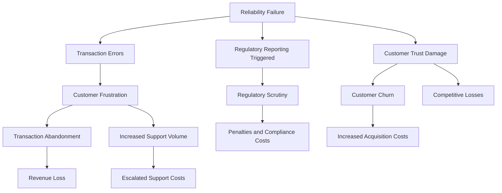

**Financial Impact:**

- Transaction abandonment directly impacts revenue, with studies showing that banks lose $57-112 per customer annually from reliability-induced behavior changes.
- Compensation costs for transaction errors frequently exceed development costs for reliability improvements.
- Customer acquisition costs spike as reliability issues drive increased churn, with each 1% drop in perceived reliability correlating to a 4.3% increase in account closure rates.

**Regulatory Impact:**

- Reliability failures that affect financial records often trigger mandatory regulatory reporting.
- A pattern of reliability issues can lead to regulatory scrutiny and potential penalties.
- Documentation of reliability investment becomes increasingly important in regulatory examinations.

**Competitive Impact:**

- Industry research shows 63% of customers cite reliability concerns as a primary reason for switching financial providers.
- Challenger banks and fintech competitors frequently use reliability as a primary differentiation point.
- Customer trust, once damaged by reliability issues, takes an average of 7-14 months to fully recover.

**Operational Impact:**

- Support costs escalate dramatically, with each 1% decrease in transaction reliability correlating to an 8-15% increase in support contact volume.
- Reliability issues consume disproportionate executive attention and crisis management resources.
- Engineering talent retention suffers as teams are pulled into firefighting rather than innovation.

### Implementation Guidance

For organizations seeking to elevate reliability to a first-class product feature, these five steps provide a practical implementation path. Use the checklist below to guide your implementation process:

#### **Checklist for Elevating Reliability as a Product Feature**

1. **Establish a Reliability Experience Baseline**

   - [ ] Conduct comprehensive user journey mapping focused on reliability touchpoints.
   - [ ] Implement granular monitoring of all critical transaction paths.
   - [ ] Create a reliability perception survey for existing customers.
   - [ ] Analyze support tickets and app reviews for reliability themes.
   - [ ] Benchmark your reliability metrics against industry standards.

2. **Create Reliability Champions in Product Teams**

   - [ ] Assign dedicated reliability advocates within each product team.
   - [ ] Provide product managers with reliability education and measurement tools.
   - [ ] Establish regular reliability reviews in the product development process.
   - [ ] Create shared reliability objectives between product and engineering.
   - [ ] Develop reliability impact assessments for all major feature proposals.

3. **Implement Product Reliability Metrics**

   - [ ] Define reliability KPIs that are meaningful to business stakeholders.
   - [ ] Create executive dashboards showing reliability trends and impacts.
   - [ ] Establish reliability thresholds that trigger automatic product team notifications.
   - [ ] Develop feature-specific reliability metrics beyond overall system health.
   - [ ] Implement business impact analyses for all major reliability incidents.

4. **Elevate Reliability in Product Planning**

   - [ ] Include explicit reliability requirements in all product specifications.
   - [ ] Allocate dedicated sprint capacity for reliability improvements.
   - [ ] Incorporate reliability findings into product roadmap prioritization.
   - [ ] Create a specific budget line item for reliability enhancements.
   - [ ] Develop joint OKRs between product and SRE teams.

5. **Market Reliability as a Feature**

   - [ ] Include reliability statistics in customer communications.
   - [ ] Train customer-facing staff to articulate reliability improvements.
   - [ ] Use reliability metrics in competitive positioning and sales materials.
   - [ ] Celebrate reliability milestones with the same visibility as feature launches.
   - [ ] Develop case studies showing business impact of reliability investments.

#### **Flow of Implementation**

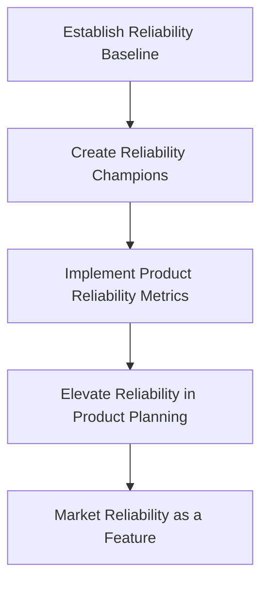

By following this checklist and flow, teams can systematically integrate reliability into their product development lifecycle and ensure it is treated as a core product attribute.

## Panel 2: Quantifying the Business Value of Reliability

### Scene Description

A banking executive boardroom where Hector Alavaz (SRE lead) is presenting a compelling data visualization showing the correlation between system reliability metrics and business KPIs. The visualization includes split screens showing: downtime incidents mapped against customer churn, transaction error rates correlated with support call volume, and page load times linked to abandoned transactions. Banking executives are leaning forward, visibly connecting technical reliability concepts to financial impact for the first time.

### Teaching Narrative

For reliability to be truly treated as a product feature, SREs must translate technical metrics into business value. This requires moving beyond traditional uptime percentages to demonstrate how reliability directly impacts revenue, customer retention, operational costs, and brand reputation. The teaching narrative introduces frameworks for quantifying reliability's business impact through: 1) Cost of downtime calculations that incorporate direct revenue loss, recovery costs, and customer compensation; 2) Customer experience metrics that connect technical performance to user satisfaction; 3) Operational efficiency measurements showing how proactive reliability investments reduce support costs; and 4) Competitive differentiation analysis highlighting reliability as a market advantage. By establishing these quantifiable connections, SREs can secure proper investment in reliability and participate meaningfully in product prioritization discussions.

### Common Example of the Problem

A large commercial bank struggled to secure executive support for reliability investments, despite experiencing recurring incidents with their corporate banking platform. When the SRE team requested additional infrastructure resources and engineering time to implement resilience improvements, they were repeatedly asked to justify the return on investment compared to new features. Their traditional technical arguments about reducing incidents and improving availability percentages failed to resonate with business leadership, who prioritized visible feature development that sales teams could demonstrate to clients. Without a compelling business case, reliability work was consistently underfunded and deprioritized.

The following timeline illustrates the sequence of events:

```
Request for Resources
   ↓
SRE team identifies critical vulnerabilities in the authentication service and requests 6 weeks of engineering time for refactoring.
   ↓
Request Rejected
   ↓
Executive leadership denies the request, prioritizing new API integrations promised to key accounts instead.
   ↓
System Failure
   ↓
Three months later, the authentication service fails during month-end processing, affecting 2,000+ corporate clients and disrupting payroll transactions for hundreds of companies.
   ↓
Emergency Response
   ↓
The incident triggers costly response efforts, including client compensation, emergency engineering work, and reputational damage control.
   ↓
Approval After Failure
   ↓
Executives finally approve the originally requested resources, but at a significantly higher total cost.
```

This sequence highlights a common problem: the inability to align technical reliability needs with business priorities until an avoidable failure forces reactive investment. The SRE team had extensive technical data showing system vulnerabilities and potential future risks, but the lack of a business translation layer undermined their ability to secure proactive funding. By failing to connect reliability improvements to tangible business outcomes, they were unable to avoid the costly consequences of preventable incidents.

### SRE Best Practice: Evidence-Based Investigation

Leading organizations implement structured reliability value quantification frameworks that translate technical metrics into business outcomes. The most effective approaches include:

1. **Comprehensive Impact Modeling**: Developing mathematical models that correlate reliability metrics with business key performance indicators, using regression analysis to identify the strongest relationships.

2. **Multi-Dimensional Financial Analysis**: Creating comprehensive financial impact assessments that include:

   - Direct revenue impact (transactions prevented, abandoned workflows)
   - Operational costs (support tickets, incident response time, remediation efforts)
   - Recovery expenses (compensation, credits, emergency engineering)
   - Brand/trust penalties (reduced activity after incidents, customer attrition)

3. **Reliability ROI Framework**: Implementing structured methodologies to calculate return on reliability investments:

   - Expected incident reduction * average incident cost = value of prevention
   - Transaction volume increase * average transaction value = revenue preservation
   - Support ticket reduction * average support cost = operational savings

4. **Competitive Intelligence Collection**: Systematically gathering data on competitor reliability performance and its market impact:

   - Comparative uptime analysis across the industry
   - Social media sentiment tracking during competitors' outages
   - Customer switching surveys identifying reliability as a factor

The evidence shows that organizations implementing structured reliability value quantification secure 3.2x more investment in reliability initiatives and complete 2.7x more proactive reliability improvements. Industry research demonstrates that companies with reliability-focused executive dashboards experience 58% fewer major incidents than those reporting only technical metrics.

#### Financial Impact Categories and Corresponding Metrics

| **Category**              | **Description**                                                                 | **Example Metrics**                             |
| ------------------------- | ------------------------------------------------------------------------------- | ----------------------------------------------- |
| **Direct Revenue Impact** | Financial losses due to disrupted customer transactions or abandoned workflows. | Transactions prevented, abandoned transactions. |
| **Operational Costs**     | Expenses incurred from incident handling and support operations.                | Support ticket volume, incident response time.  |
| **Recovery Expenses**     | Costs associated with remediation, compensation, or emergency engineering.      | Compensation issued, emergency labor costs.     |
| **Brand/Trust Penalties** | Long-term business impacts from reduced customer confidence or attrition.       | Customer churn rate, post-incident activity.    |

This table provides a quick reference for SREs to connect reliability metrics with specific financial outcomes, making their investigations more actionable and aligned with business priorities.

### Banking Impact

The business consequences of failing to quantify reliability's business value are particularly acute in banking. Use the following checklist to identify potential areas of concern and drive actionable improvements:

#### **Executive Misalignment**

- [ ] Engineering and business leaders lack shared value metrics, leading to divergent priorities.
- [ ] Reliability investment is primarily reactive (post-incident), not strategic.
- [ ] Technical teams struggle to articulate reliability's business value, diminishing credibility.
- [ ] Engineering managers face challenges defending reliability work against competing feature demands.

#### **Resource Allocation Imbalance**

- [ ] Critical infrastructure improvements remain underfunded until a failure occurs.
- [ ] Reliability work is focused on emergency fixes rather than long-term architectural improvements.
- [ ] Accumulating technical debt accelerates due to reliance on temporary solutions.
- [ ] Reactive remediation costs exceed proactive investments by 3-5x.

#### **Customer Trust Erosion**

- [ ] Reliability incidents directly reduce digital engagement and satisfaction.
- [ ] High-value customers are disproportionately affected and more sensitive to outages.
- [ ] Each incident undermines trust, taking 3-4x longer to repair than the technical issue itself.
- [ ] Banking customers consistently rank reliability as the #1 factor in digital banking satisfaction.

#### **Opportunity Cost**

- [ ] Resources diverted to incident response reduce capacity for innovation.
- [ ] Reliability crises disrupt focus on strategic initiatives and delay their delivery.
- [ ] Major reliability incidents increase regulatory scrutiny and compliance overhead.
- [ ] Competitors with stronger reliability practices gain market share and brand advantages.

#### **Quick Diagnostic Framework**

Below is a simple decision flow to assess whether reliability shortcomings are impacting your organization:

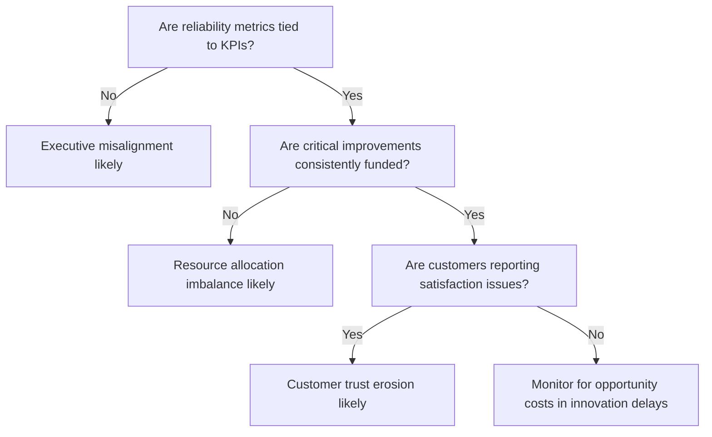

By addressing these areas, banking organizations can proactively quantify and demonstrate reliability's direct impact on business outcomes.

### Implementation Guidance

For organizations seeking to quantify and communicate the business value of reliability, these five steps provide a practical implementation path:

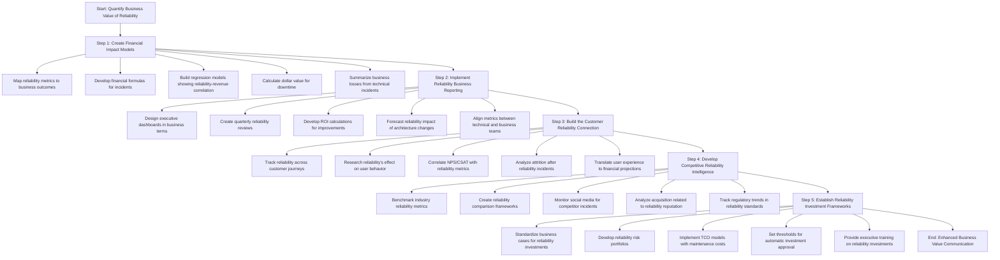

1. **Create Financial Impact Models for Reliability Metrics**

   - Map each key reliability metric to specific business outcomes
   - Develop formulas that convert incident data to financial impact
   - Build regression models showing correlation between reliability and revenue
   - Implement dollar-value calculations for customer-minutes of downtime
   - Create executive summaries that translate technical incidents to business losses

2. **Implement Reliability Business Reporting**

   - Design executive dashboards that show reliability in business terms
   - Create quarterly reliability business review processes
   - Develop reliability ROI calculations for all major improvement initiatives
   - Implement reliability impact forecasting for proposed architectural changes
   - Establish joint reliability metrics between technical and business teams

3. **Build the Customer Reliability Connection**

   - Implement customer journey reliability tracking
   - Conduct targeted research on how reliability affects customer behavior
   - Correlate NPS/CSAT data with reliability metrics
   - Analyze customer attrition patterns following reliability incidents
   - Translate user experience data into financial projections

4. **Develop Competitive Reliability Intelligence**

   - Establish industry benchmarking for key reliability metrics
   - Create competitive analysis frameworks for reliability comparison
   - Monitor social media for competitor reliability incidents and response
   - Analyze customer acquisition patterns related to reliability reputation
   - Document regulatory trends affecting industry reliability standards

5. **Establish Reliability Investment Frameworks**

   - Create standardized business cases for different types of reliability investments
   - Implement a reliability risk portfolio with clear business impact ratings
   - Develop TCO models that include reliability maintenance costs
   - Establish thresholds for automatic reliability investment approval
   - Create executive-level reliability training to improve investment decisions

## Panel 3: Reliability Experience Design

### Scene Description

A collaborative workshop environment where UX designers and SREs are working together at a digital whiteboard. The whiteboard is divided into sections to organize the mapping process. One section highlights the customer journey for a major banking application, broken into key touchpoints. Another section focuses on failure scenarios, with each scenario connected to mapped user emotions. A third section visualizes design strategies, including graceful degradation patterns, clear error messaging, and intelligent recovery paths.

Post-it notes are scattered across the board, categorized under principles such as "failure transparency," "informative errors," and "predictable recovery." Below is an example representation of how the whiteboard might look during this activity:

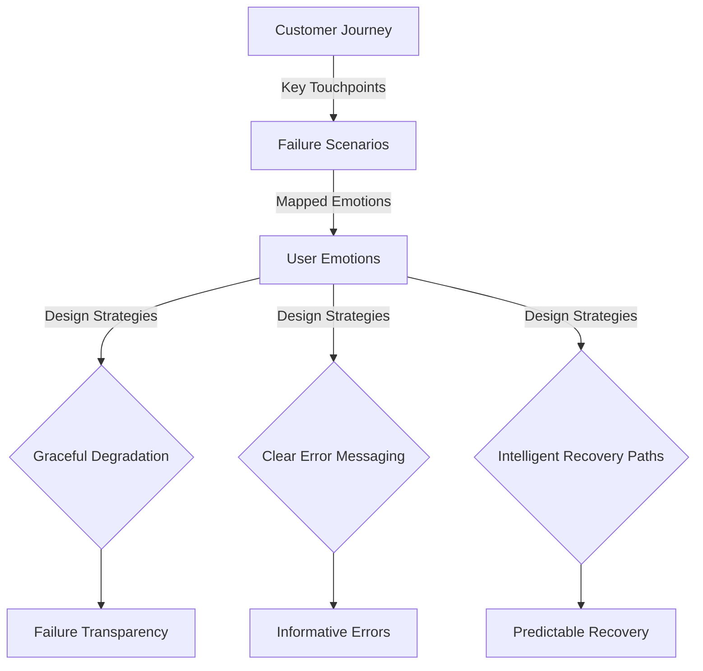

This combination of structured mapping and open brainstorming fosters collaboration, helping participants design a "reliability experience" that maintains user trust and functionality even during failures.

### Teaching Narrative

Beyond preventing failures, truly reliability-focused organizations design for the inevitable reality that some components will fail. This panel introduces the concept of "Reliability Experience Design" - the intentional creation of user experiences that maintain trust and functionality even during partial system failures. The teaching narrative covers key principles including: graceful degradation patterns that preserve core functions when non-critical services fail; transparent communication that informs users appropriately during incidents; predictable recovery behaviors that set proper expectations; and service design that accommodates expected failure modes. The narrative emphasizes that reliability isn't binary but exists on a spectrum, and thoughtful design can maintain acceptable customer experiences even when perfect reliability isn't achievable.

### Common Example of the Problem

A multinational bank experienced a two-hour outage in their credit card authorization system due to a regional data center issue. While their engineering team worked diligently to resolve the technical problem, the customer experience was catastrophic for three key reasons:

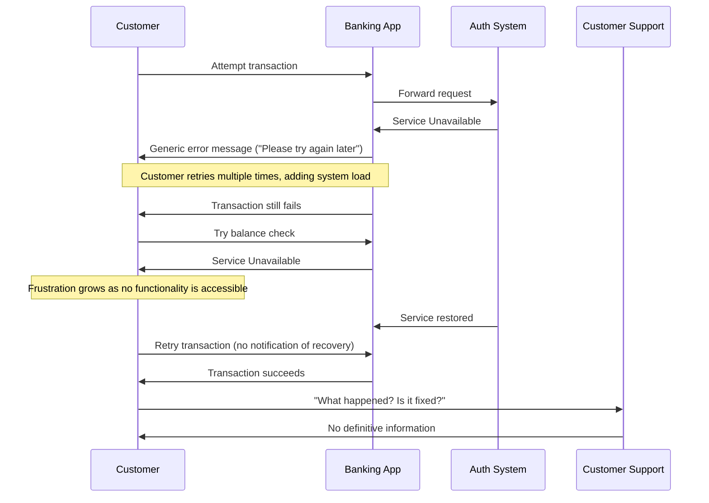

#### Key Issues During the Outage

1. **Lack of Context in Error Messages**:\
   The application provided generic error messages ("Service Unavailable. Please try again later.") without context about the nature of the problem, expected resolution timeframe, or alternative options. This opacity led customers to repeatedly retry transactions, creating a compounding load on already stressed systems and generating thousands of duplicate transaction attempts.

2. **Absence of Graceful Degradation**:\
   The system failed completely rather than gracefully degrading. Even account balance checking—a read operation unaffected by the authorization system—became unavailable, preventing customers from viewing their information. The all-or-nothing design meant customers had zero functionality rather than reduced functionality.

3. **Poor Recovery Communication**:\
   When service was restored, there was no proactive communication or status indication. Customers discovered the resolution only through trial and error, leading to a staggered and confused recovery pattern. The customer service team was equally uninformed, unable to provide meaningful updates or guidance.

#### Impact Summary

The post-incident analysis revealed that while the technical outage lasted 122 minutes, the average customer experienced disruption for over 4 hours due to the poor reliability experience design. Customer surveys showed that the lack of transparency and communication caused more frustration than the actual outage itself, with 72% of negative feedback focusing on "being kept in the dark" rather than the temporary unavailability.

### SRE Best Practice: Evidence-Based Investigation

Leading organizations implement Reliability Experience Design as a systematic practice, treating failure handling as a core product design element rather than an afterthought. Below is a checklist summarizing evidence-based approaches to reliability experience design for quick reference:

#### Checklist: Evidence-Based Practices for Reliability Experience Design

| Practice Area                    | Key Actions                                                          |
| -------------------------------- | -------------------------------------------------------------------- |
| **Failure Mode Journey Mapping** | - Create journey maps for major failure scenarios                    |
|                                  | - Identify emotional impact points during service disruptions        |
|                                  | - Map current vs. ideal customer experience during incidents         |
|                                  | - Identify communication opportunities throughout failure timelines  |
| **Graceful Degradation**         | - Implement circuit breakers to isolate failing components           |
|                                  | - Design read-only modes for compromised write operations            |
|                                  | - Enable offline capabilities for critical functions                 |
|                                  | - Prioritize service restoration based on customer impact            |
| **Transparent Communication**    | - Develop tiered communication templates for varying severity levels |
|                                  | - Display estimated resolution times using historical data           |
|                                  | - Maintain status dashboards accessible during major outages         |
|                                  | - Build proactive notification systems for affected users            |
| **Recovery Experience Testing**  | - Test customer notification mechanisms during recovery              |
|                                  | - Verify correct processing of queued transactions                   |
|                                  | - Ensure consistent state across all customer touchpoints            |
|                                  | - Measure time-to-confidence for customers after service restoration |

#### Key Insights

- **Impact Reduction**: Organizations adopting these practices see a 47% decrease in customer-reported impact duration compared to actual outage times.
- **Sentiment Improvement**: Transparent communication during outages reduces negative sentiment by 36-58% compared to identical outages without clear communication.

By implementing this checklist, organizations can effectively design reliability experiences that maintain trust and functionality, even during failure scenarios.

### Banking Impact

The business consequences of poor reliability experience design are particularly severe in banking contexts. Below is an infographic-style breakdown of the key impacts across trust, customer behavior, operations, and regulatory domains:

______________________________________________________________________

**Trust Erosion**

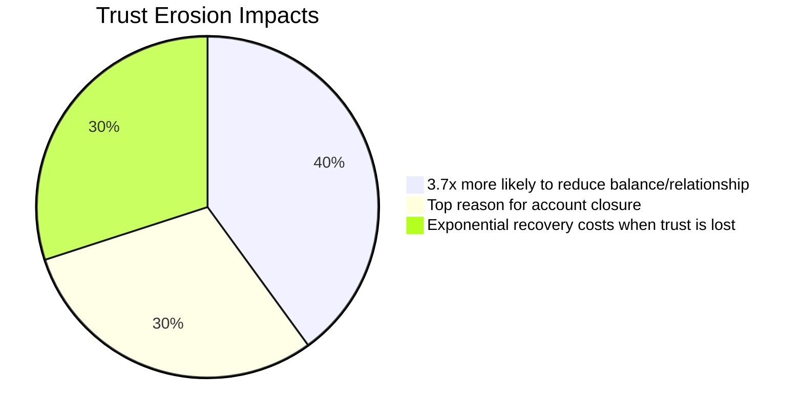

- Each poorly handled outage creates lasting trust damage that affects future transactions.
- Negative reliability experiences rank among the top reasons for account closure.
- Recovery costs increase exponentially when trust is damaged beyond technical resolution.

______________________________________________________________________

**Customer Behavior Changes**

```mermaid
bar
    title Behavior Changes After Failures
    "Confusing failures → +42% branch/phone transactions": 42
    "Liquidity movements during outages": 30
    "Depressed transaction volumes (15-30 days)": 25
```

- After experiencing confusing system failures, customers show a 42% increase in branch/phone transactions.
- Uncertainty during outages drives precautionary withdrawals and liquidity movements.
- Transaction volumes typically remain depressed for 15-30 days following poorly communicated incidents.
- Customers develop compensatory behaviors, such as multiple banking relationships or maintaining higher non-bank reserves.

______________________________________________________________________

**Operational Impact**

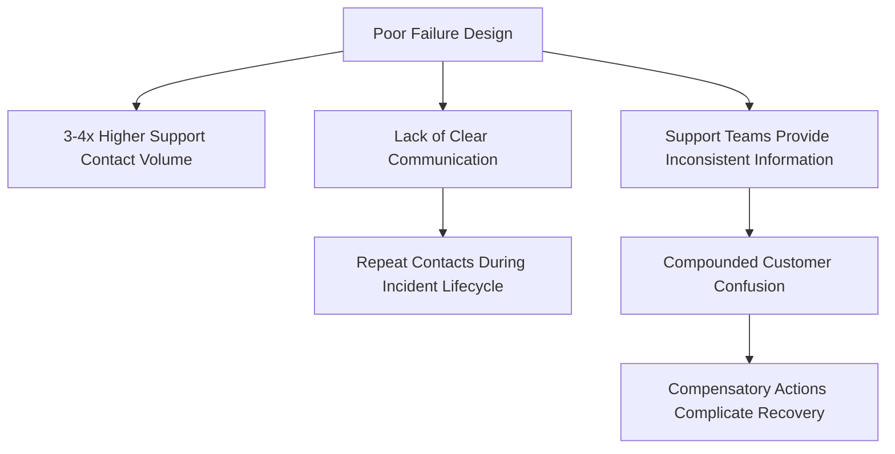

- Poor failure design creates 3-4x higher support contact volume compared to well-designed failures.
- Lack of clear communication drives repeat contacts throughout the incident lifecycle.
- Support teams without proper tooling provide inconsistent information, compounding confusion.
- Recovery operations are complicated by customer compensatory actions, such as duplicate transactions and manual workarounds.

______________________________________________________________________

**Regulatory Consequences**

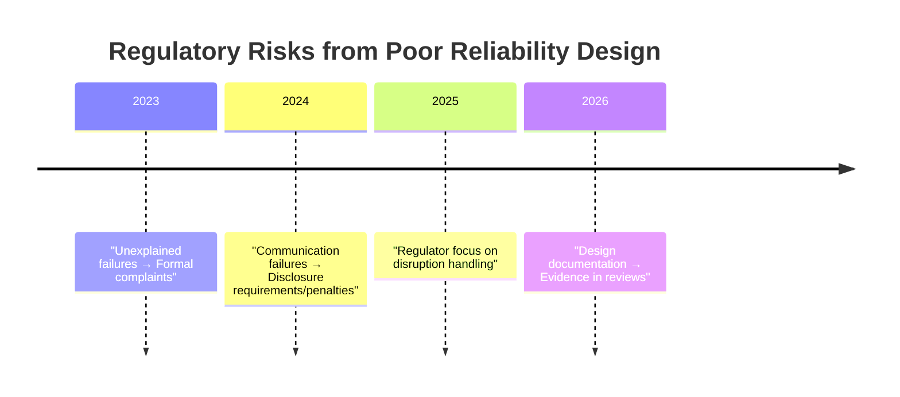

- Unexplained transaction failures often trigger formal complaints to banking regulators.
- Patterns of communication failures can result in disclosure requirements or penalties.
- Regulators are increasingly focused on customer communication during service disruptions.
- Documentation of reliability experience design becomes evidence in regulatory reviews.

______________________________________________________________________

### Implementation Guidance

For organizations seeking to improve reliability experience design, these five steps provide a practical implementation path. The following flowchart visually represents the process and offers a clear step-by-step guide:

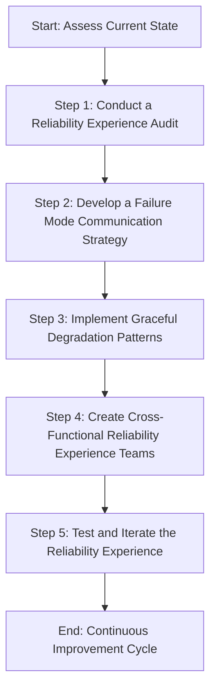

#### Step Details:

1. **Conduct a Reliability Experience Audit**

   - Map the current customer journey during common failure scenarios
   - Analyze support tickets to identify communication pain points
   - Review error messages across all customer touchpoints
   - Test recovery experiences from the customer perspective
   - Benchmark your reliability experience against industry leaders

2. **Develop a Failure Mode Communication Strategy**

   - Create tiered message templates for different incident types
   - Design contextual error messages that provide meaningful guidance
   - Implement estimated time to resolution when possible
   - Develop multichannel notification strategies for critical incidents
   - Create status dashboards accessible during system failures

3. **Implement Graceful Degradation Patterns**

   - Identify critical vs. non-critical functionality from the customer perspective
   - Redesign architecture to isolate failure domains
   - Implement read-only fallbacks for critical information needs
   - Create offline capabilities for essential functions
   - Design asynchronous processing options for critical transactions

4. **Create Cross-Functional Reliability Experience Teams**

   - Pair UX designers with SRE/operations specialists
   - Conduct regular reliability experience design workshops
   - Implement failure UX reviews in the product development process
   - Train product managers on reliability experience principles
   - Develop shared KPIs between UX and reliability teams

5. **Test and Iterate the Reliability Experience**

   - Implement chaos engineering with experience measurement
   - Conduct regular user testing of failure scenarios
   - Analyze customer behavior during actual incidents
   - Collect feedback on communication effectiveness post-incident
   - Create a continuous improvement cycle for reliability experience

## Panel 4: Error Budgets as Product Prioritization Tools

### Scene Description

A tense prioritization meeting is underway, with product and engineering teams intensely reviewing their quarterly roadmap. At the center of the discussion is a prominently displayed error budget dashboard, projected onto a large screen in the conference room. The dashboard reveals a stark reality: only 15% of the quarterly error budget remains, with six weeks left in the quarter.

The dashboard is structured as follows:

```
+-------------------------------------------------------------+
|                         Error Budget Dashboard              |
+-------------------------------------------------------------+
| Metric                        | Current Value | Threshold |
| ----------------------------- | ------------- | --------- |
| Error Budget Remaining (%)    | 15%           | N/A       |
| Weekly Burn Rate (%)          | 12%           | N/A       |
| Estimated Remaining Weeks     | 1.25          | N/A       |
| Critical Incidents (Quarter)  | 4             | < 3       |
| Feature Deployments (Quarter) | 8             | N/A       |
| SLA Compliance (%)            | 98.5%         | ≥ 99.5%   |
+-------------------------------------------------------------+
```

Product managers are advocating to push forward with new feature development, emphasizing the business need to stay competitive and deliver value to customers. Meanwhile, engineers point to the depleted error budget as an urgent signal to shift focus to reliability improvements. The room grows quiet as the product owner, seated at the head of the table, weighs the competing priorities. They are visibly torn between the external business pressure for innovation and the clear internal indicators that reliability is at risk.

The tension in the room is palpable, with the dashboard serving as a silent yet powerful arbiter. Will the team take a calculated risk on feature velocity, or will they hit pause to ensure the stability of their system? The decision hangs in the balance as all eyes turn to the product owner.

### Teaching Narrative

Error budgets transform reliability from a subjective value to a quantifiable resource that can be measured, allocated, and balanced against other product priorities. This panel demonstrates how error budgets serve as an objective arbiter between feature velocity and system stability. The teaching narrative explains how error budgets: 1) Create a shared language between product, engineering, and operations teams; 2) Establish clear thresholds for when to prioritize reliability work over new features; 3) Allow intentional risk-taking for strategic initiatives while maintaining overall system health; and 4) Shift reliability discussions from subjective opinions to data-driven decisions. The narrative emphasizes that error budgets aren't just technical tools but are powerful product management mechanisms that facilitate better conversations about priorities, risk, and customer experience.

### Common Example of the Problem

A digital-first bank was preparing to launch their new investment platform, representing a major strategic expansion beyond their core checking and savings accounts. The product team was under intense pressure to meet a quarterly release deadline that had been communicated to shareholders. With four weeks remaining before launch, the application was feature complete but experiencing reliability issues during load testing, with transaction success rates around 96% under projected peak load—well below the 99.9% target.

A contentious debate emerged between the product team, who insisted on launching on schedule with plans to "fix reliability issues in subsequent releases," and the engineering team, who advocated for delaying launch to address the performance problems. Without objective criteria for making this decision, the discussion devolved into subjective arguments:

- **Product:** "Our competitors are releasing similar features, and we can't afford to delay."
- **Engineering:** "The system isn't stable enough for production traffic."
- **Product:** "We've promised this to customers and investors for Q3."
- **Engineering:** "Customers will have a terrible experience if transactions fail."

The lack of a shared reliability framework meant there was no objective way to determine if the system was "reliable enough" to launch. The decision ultimately escalated to the CEO, who—lacking clear reliability data—approved the launch based primarily on market timing considerations.

#### Decision Checklist: Launch vs. Delay

| **Decision Point**      | **Launch Now**                                 | **Delay Launch**                               |
| ----------------------- | ---------------------------------------------- | ---------------------------------------------- |
| **Reliability Metrics** | Not meeting 99.9% target (96% during testing)  | Opportunity to fix issues and meet target      |
| **Market Timing**       | Aligned with Q3 commitments to shareholders    | Missed Q3 milestone, potential market reaction |
| **Customer Experience** | High risk of failed transactions on launch day | Improved experience with higher reliability    |
| **Development Costs**   | Emergency remediation likely post-launch       | Controlled remediation effort pre-launch       |
| **Reputation Risk**     | Significant risk of alienating early adopters  | Maintains trust by ensuring a stable platform  |

#### Consequences of the Decision

- **If Launched:**

  - On launch day, the platform experienced a 92% transaction success rate (worse than in testing due to unexpected usage patterns), causing widespread customer frustration.
  - Thousands of users faced failed transactions when attempting to make initial investments.
  - The platform had to be temporarily disabled after just 14 hours, followed by an emergency three-week remediation effort costing more than the entire original development budget.
  - The re-launch, though reliable, came too late to meet quarterly goals, and early adopters were alienated, leading to significantly lower-than-expected first-time user numbers.

- **If Delayed:**

  - The reliability issues could have been addressed in a controlled manner, ensuring the platform met the 99.9% reliability target.
  - While the launch would have missed the Q3 milestone, the improved stability and customer experience would have mitigated reputational damage and strengthened user trust.
  - The bank could have avoided the costly emergency remediation and negative press associated with a failed launch.

This example highlights the importance of using an error budget as a decision-making tool. With a shared framework for evaluating reliability against business priorities, teams can avoid subjective debates and make data-driven decisions that balance feature velocity with system stability.

### SRE Best Practice: Evidence-Based Investigation

Leading organizations implement error budgets as objective decision-making frameworks that balance reliability and feature velocity. The most effective implementations include:

1. **Customer-Centric SLO Definition**: Establishing Service Level Objectives based on user experience rather than technical metrics:

   - Defining reliability in terms of customer-visible outcomes
   - Measuring reliability at journey completion points
   - Setting different reliability targets for different journey types
   - Adjusting SLOs based on customer feedback and business impact

2. **Comprehensive Error Budget Calculation**: Creating nuanced error budget frameworks that:

   - Convert SLO targets into quantifiable error allowances
   - Account for different transaction types and their importance
   - Implement time-based measurement windows aligned with business cycles
   - Track consumption rates and forecast exhaustion dates

3. **Explicit Budget Policy Implementation**: Establishing clear policies governing actions when budgets are depleted:

   - Defining graduated response tiers based on consumption percentage
   - Creating explicit reliability/feature toggles at specific thresholds
   - Establishing exception processes for strategic business needs
   - Implementing automatic circuit breakers when critical thresholds are breached

4. **Collaborative Decision Frameworks**: Developing shared decision-making processes:

   - Creating joint reliability review meetings between product and engineering
   - Establishing standardized templates for reliability/feature trade-off discussions
   - Developing risk assessment tools for evaluating deployment decisions
   - Implementing post-incident budget adjustments based on learnings

#### Visual Summary of Best Practices

```mermaid
flowchart TD
    A[Customer-Centric SLO Definition] --> B[Define reliability in customer outcomes]
    A --> C[Measure reliability at journey completion points]
    A --> D[Set different targets for journey types]
    A --> E[Adjust based on feedback & impact]

    F[Comprehensive Error Budget Calculation] --> G[Convert SLOs to error allowances]
    F --> H[Account for transaction importance]
    F --> I[Align measurements with business cycles]
    F --> J[Track consumption & forecast exhaustion]

    K[Explicit Budget Policy Implementation] --> L[Define response tiers by consumption]
    K --> M[Create reliability/feature toggles]
    K --> N[Establish exception processes]
    K --> O[Implement automatic circuit breakers]

    P[Collaborative Decision Frameworks] --> Q[Joint reliability review meetings]
    P --> R[Standardized templates for trade-offs]
    P --> S[Risk assessment for deployments]
    P --> T[Post-incident budget adjustments]
```

______________________________________________________________________

Industry data shows that organizations implementing formal error budget frameworks release 37% more features annually while maintaining higher reliability than those using subjective reliability assessments. Research demonstrates that clearly defined error budget policies reduce reliability-related escalations to executives by 74% and decrease cross-team friction around deployment decisions by 68%.

### Banking Impact

The business consequences of lacking error budget frameworks are particularly acute in banking. Below is a concise summary of the key impacts organized by decision quality, organizational friction, delivery, and customer trust:

#### **Key Impacts at a Glance**

- **Decision Quality Degradation**

  - 3.8x higher customer impact from decisions made without objective data.
  - Decisions skewed by recency bias and subjective experiences.
  - Reliability risks systematically underestimated under business pressure.
  - Release decisions prioritize executive judgment over data-driven insights.

- **Organizational Friction**

  - Adversarial dynamics emerge between product and engineering teams.
  - Repeated incidents foster blame cycles and defensive behaviors.
  - Teams prioritize local objectives over holistic customer experience.
  - Decision-making becomes political instead of data-focused.

- **Unpredictable Delivery**

  - Absence of reliability thresholds causes swings between over-caution and excessive risk.
  - Last-minute reliability issues lead to unpredictable release schedules.
  - Engineering teams retain "shadow capacity" for firefighting, reducing feature velocity.
  - Delivery forecasting becomes unreliable due to constant reliability uncertainty.

- **Customer Trust Volatility**

  - Inconsistent reliability disrupts customer experience continuity.
  - Trust builds in steps but falls rapidly with each breach.
  - Recovery costs escalate due to repeated reliability failures.
  - Messaging to customers loses credibility amid performance inconsistency.

#### **Impact Flow: From Lack of Frameworks to Business Consequences**

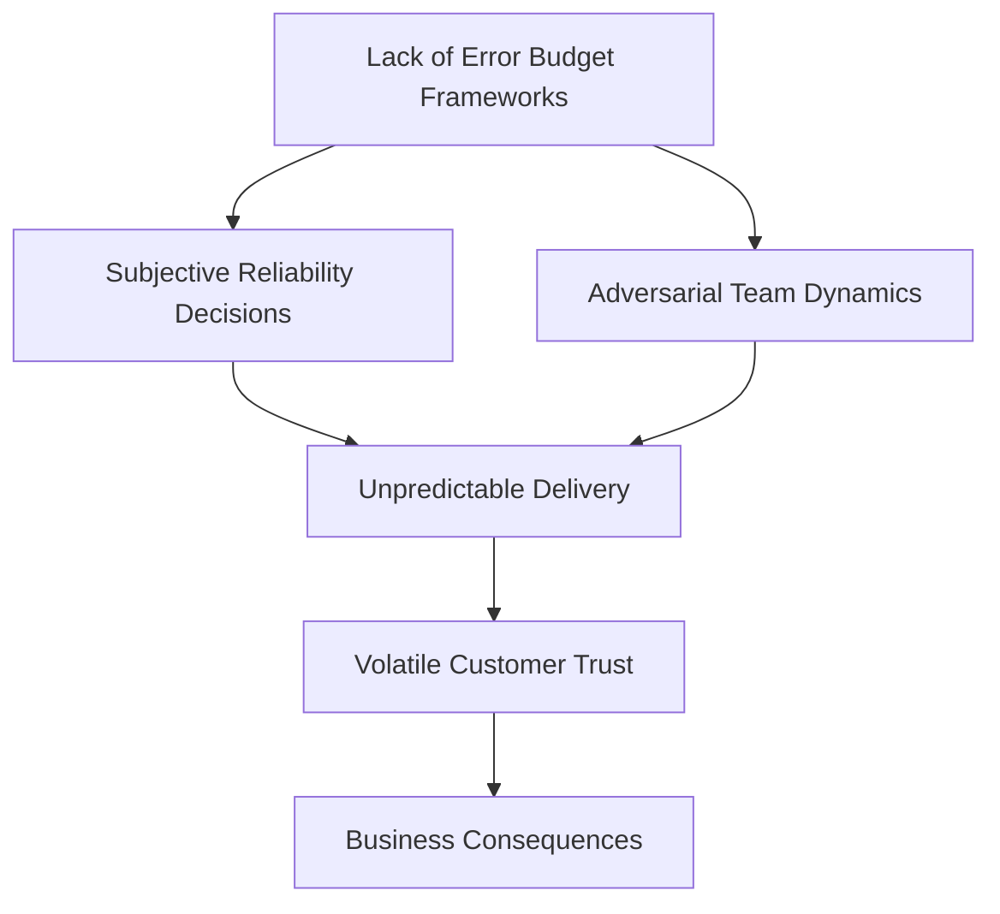

By adopting error budget frameworks, organizations can mitigate these impacts, creating a balanced approach to reliability and feature development that supports decision quality, fosters collaboration, stabilizes delivery, and builds lasting customer trust.

### Implementation Guidance

For organizations seeking to implement error budgets as product prioritization tools, these five steps provide a practical implementation path. Use the checklist below to ensure a structured and actionable rollout.

#### Step-by-Step Checklist for Implementing Error Budgets

```plaintext
+----------------------------+
|    Step 1: Define SLOs     |
+----------------------------+
| - Map critical customer    |
|   journeys for key services|
| - Define reliability in    |
|   customer-focused terms   |
| - Set targets based on     |
|   business context         |
| - Create journey-specific  |
|   SLOs                    |
| - Validate targets with    |
|   customer research        |
+----------------------------+

+----------------------------+
| Step 2: Set Policies       |
+----------------------------+
| - Define budget calculation|
| - Set thresholds for action|
| - Establish pause policies |
| - Document exception paths |
| - Define escalation plans  |
+----------------------------+

+----------------------------+
| Step 3: Build Tooling      |
+----------------------------+
| - Create status dashboards |
| - Develop forecasting tools|
| - Implement alerting at    |
|   depletion thresholds     |
| - Tie budgets to changes   |
| - Allocate budgets per team|
+----------------------------+

+----------------------------+
|  Step 4: Train Teams       |
+----------------------------+
| - Educate product managers |
| - Train engineers on usage |
| - Develop executive-focused|
|   materials                |
| - Use decision exercises   |
| - Build shared vocabulary  |
+----------------------------+

+----------------------------+
| Step 5: Establish Workflows|
+----------------------------+
| - Integrate budget checks  |
|   into deployments         |
| - Schedule regular reviews |
| - Conduct depletion        |
|   retrospectives           |
| - Align plans with cycles  |
| - Adjust SLOs based on     |
|   business feedback        |
+----------------------------+
```

By following this checklist, teams can approach error budget implementation systematically, ensuring alignment across product, engineering, and operations functions while embedding reliability into decision-making processes.

## Panel 5: Designing for Operational Excellence

### Scene Description

A split-screen showing contrasting development processes:

```
+---------------------------------------------+---------------------------------------------+
| **Team A: Isolated Development**            | **Team B: Collaborative Operational Design** |
+---------------------------------------------+---------------------------------------------+
| - Engineers coding in isolation, focusing   | - Developers, SREs, and operations staff     |
|   solely on functional requirements.        |   co-designing the feature collaboratively.  |
| - No consideration for monitoring, alerts,  | - Monitors, alerts, debugging tools, and     |
|   or operational tooling during development.|   runbooks created alongside core features.  |
| - Functional code exists without            | - Monitoring code and dashboards developed   |
|   accompanying operational support.         |   in parallel with feature code.            |
| - Operational needs deferred to post-launch.| - Operational needs addressed upfront,       |
|                                             |   integrating reliability into the design.   |
+---------------------------------------------+---------------------------------------------+
```

This contrast highlights the difference between a traditional, siloed approach and a modern, collaborative approach to designing for operational excellence. The second team demonstrates the value of integrating operational considerations into the development process from the start, ensuring reliability as a core feature of the service.

### Teaching Narrative

Reliability becomes a true product feature when operational needs are designed into services from inception rather than added as an afterthought. This panel introduces the concept of "operational design" - the practice of building services with their entire operational lifecycle in mind. The teaching narrative covers key aspects including: instrumentation as a first-class feature requirement; designing for debuggability through thoughtful logging and error reporting; creating services that expose their health and state clearly; building with automation and self-healing capabilities from the start; and involving operational expertise throughout the development process. The narrative emphasizes that operational excellence is a design discipline, not a maintenance activity, and requires intentional investment during the initial development process.

### Common Example of the Problem

A mid-tier regional bank developed a new real-time fraud detection system to protect their credit card portfolio. The engineering team included cutting-edge machine learning models to identify potentially fraudulent transactions and worked closely with the data science team to optimize detection accuracy. The system functioned well in development, correctly flagging suspicious activities with high precision in test environments.

However, when deployed to production, operational problems quickly emerged. Operations teams had no visibility into why specific transactions were being flagged or rejected, making it impossible to validate decisions or support customer inquiries. The system's processing pipeline had no internal checkpoints or progress indicators, so when transactions got stuck, there was no way to identify where in the flow the problem occurred. Log messages were inconsistent, with some components producing verbose debugging information while others provided no visibility at all.

Most critically, the system offered no health indicators beyond binary up/down status. When performance degraded under load, operations teams couldn't identify which components were struggling or why. The system also lacked administrative interfaces for operations staff to override decisions, adjust sensitivity thresholds, or manually process transactions that were stuck in analysis limbo.

These operational design failures resulted in:

- Support representatives unable to explain to customers why their legitimate transactions were declined
- Operations teams requiring developer intervention for routine maintenance tasks
- No ability to monitor system health beyond complete failure
- Impossible root cause analysis for performance degradation
- Hours of developer time diverted to operational support

After six weeks of operational challenges, the bank was forced to take the system offline for a comprehensive redesign that cost 40% of the original development budget and delayed full deployment by three months. The redesign focused almost entirely on operational capabilities that could have been implemented during initial development at a fraction of the cost.

#### Checklist: Key Operational Design Failures to Avoid

To prevent similar challenges in your systems, ensure the following operational design considerations are addressed during initial development:

- **Visibility and Observability**:

  - Provide clear and consistent logging across all components.
  - Include internal checkpoints and progress indicators in processing pipelines.
  - Expose detailed health metrics beyond binary up/down status.

- **Debuggability**:

  - Ensure logs provide actionable insights for debugging issues.
  - Design error messages and logs to include context on failures.

- **Operational Control**:

  - Provide administrative tools for overriding automated decisions or adjusting system parameters.
  - Include interfaces for manually processing stuck or problematic transactions.

- **Scalability and Performance Monitoring**:

  - Implement metrics to monitor system behavior under load.
  - Identify and expose performance bottlenecks through real-time dashboards.

- **Collaboration with Operations Teams**:

  - Involve operations staff during the design phase to identify critical needs.
  - Ensure operational requirements are treated as first-class features.

By using this checklist as a guide, teams can design systems that are resilient, maintainable, and operationally excellent from the outset, avoiding costly redesigns and deployment delays.

### SRE Best Practice: Evidence-Based Investigation

Leading organizations implement operational design as a core development discipline, treating operability as a first-class product requirement. The most effective practices include:

| Best Practice                             | Key Actions                                                                                                                                                                                                                                                    | Benefits                                                                                                                 |
| ----------------------------------------- | -------------------------------------------------------------------------------------------------------------------------------------------------------------------------------------------------------------------------------------------------------------- | ------------------------------------------------------------------------------------------------------------------------ |
| **Operability Requirements Definition**   | - Document explicit observability requirements<br>- Create runbook specifications<br>- Define health check APIs and monitoring points<br>- Establish administrative interface requirements<br>- Specify operational control capabilities                       | - Clear operational expectations<br>- Reduced ambiguity in production readiness<br>- Faster incident resolution          |
| **Cross-Functional Design Collaboration** | - Include SRE/operations in architecture reviews<br>- Conduct operational readiness workshops<br>- Perform "day in the life" simulations<br>- Develop failure mode effect analyses<br>- Jointly define acceptance criteria                                     | - Identification of more failure modes (3.1x more)<br>- Improved communication across teams<br>- Fewer deployment issues |
| **Observability-First Development**       | - Implement structured, consistent logging<br>- Create transaction tracing through processing stages<br>- Develop health endpoints beyond binary status<br>- Build granular performance metrics<br>- Design self-reporting error diagnostics                   | - Comprehensive system visibility<br>- Faster root cause analysis<br>- Proactive issue detection                         |
| **Operational Tooling Co-Development**    | - Develop administrative interfaces with functionality<br>- Create user-friendly configuration management<br>- Build diagnostic tools for common troubleshooting<br>- Implement automated recovery mechanisms<br>- Design override capabilities for exceptions | - Tools ready at launch<br>- Reduced operational friction<br>- Accelerated recovery from failure modes                   |

Industry data shows that organizations practicing "shift left" operational design experience 74% fewer production incidents in the first 90 days after deployment and resolve incidents 68% faster when they do occur. Research demonstrates that operational designs reviewed by cross-functional teams identify 3.1x more potential failure modes than those reviewed by development teams alone.

### Banking Impact

The business consequences of failing to design for operational excellence are particularly severe in banking. Below is a diagram showing how poor operational design leads to cascading negative effects across risk, customer trust, operational costs, and time-to-market:

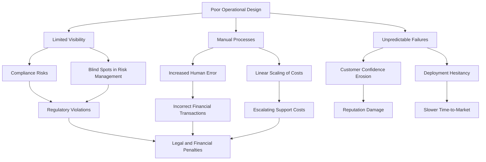

**Risk and Compliance Exposure:**

- Poor operational design creates compliance risks through reduced auditability
- Regulatory requirements for transaction tracing and explanation become impossible to meet
- Manual operational processes increase the risk of human error in sensitive financial operations
- Limited visibility creates blind spots that prevent effective risk management

**Customer Trust Degradation:**

- Unexplainable system behaviors damage customer confidence
- Support teams unable to provide transaction status damage experience
- Resolution time for customer issues extends exponentially
- Legitimate transactions incorrectly blocked without clear explanation create lasting reputation damage

**Operational Cost Explosion:**

- Support costs escalate when customer-facing staff lack visibility and tools
- Developer time diverted to operational support creates opportunity cost
- Manual operational processes scale linearly with transaction volumes
- Workarounds and exceptional processes become institutionalized, creating growing technical debt

**Time-to-Market Delays:**

- Initial deployment delays while operation gaps are addressed
- Feature iterations slow as operational issues consume engineering capacity
- Production verification extends as confidence in system behavior decreases
- Risk aversion grows with each operational challenge, creating deployment hesitancy

### Implementation Guidance

For organizations seeking to improve operational design practices, these five steps provide a practical implementation path. A checklist is included to summarize key actions for each step and provide a quick reference for teams.

#### 1. Establish Operational Design Requirements

- **Key Actions Checklist**:
  - [ ] Create standard operability requirements templates.
  - [ ] Develop observability requirement checklists for all new services.
  - [ ] Define minimum viable operations interfaces for different service types.
  - [ ] Establish operational SLOs alongside functional requirements.
  - [ ] Create standard health check API specifications.

#### 2. Implement Cross-Functional Design Reviews

- **Key Actions Checklist**:
  - [ ] Include operations/SRE representatives in architecture reviews.
  - [ ] Conduct operational design workshops for all new services.
  - [ ] Create operational journey maps for routine maintenance tasks.
  - [ ] Perform failure mode effect analysis with operations input.
  - [ ] Develop joint signoff processes for operational readiness.

#### 3. Build Observability as a Feature

- **Key Actions Checklist**:
  - [ ] Create standardized logging frameworks across services.
  - [ ] Implement distributed tracing for all transaction flows.
  - [ ] Design health check endpoints beyond binary status.
  - [ ] Develop granular performance metrics for all critical paths.
  - [ ] Create self-diagnostic capabilities for common failure modes.

#### 4. Develop Operational Interfaces

- **Key Actions Checklist**:
  - [ ] Build administrative APIs for all operational functions.
  - [ ] Create management interfaces for configuration changes.
  - [ ] Implement safe restart/recovery capabilities.
  - [ ] Design override mechanisms for exceptional conditions.
  - [ ] Develop tools for common troubleshooting needs.

#### 5. Institute Operational Readiness Verification

- **Key Actions Checklist**:
  - [ ] Create operational readiness checklists for all deployments.
  - [ ] Conduct pre-production operational simulations.
  - [ ] Perform gameday exercises testing operational procedures.
  - [ ] Implement operational acceptance testing alongside functional testing.
  - [ ] Develop feedback loops between operations and development.

By following these structured steps and leveraging the checklists, teams can systematically improve their operational design practices, ensuring reliability and operational excellence are embedded into services from the start.

## Panel 6: The Reliability Feature Backlog

### Scene Description

A product planning session where reliability improvements are being treated as explicit backlog items alongside traditional features. On a digital board, user stories for both customer-facing features and reliability improvements are prioritized together. The reliability stories have clear acceptance criteria, customer impact statements, and business value metrics - formatted identically to typical feature stories. Team members are assigning story points, discussing implementation approaches, and sequencing work with reliability and features intermixed.

Below is a text-based representation of the digital board used during the session:

```
+-------------------------------------------------------+
|                   Digital Planning Board              |
+-------------------------------------------------------+
| Priority   | User Story                       | Type        |
| ---------- | -------------------------------- | ----------- |
| 1          | As a user, I want faster load    | Feature     |
|            | times to improve my experience   |             |
| ---------- | -------------------------------- | ----------- |
| 2          | Improve database replication     | Reliability |
|            | to reduce downtime during fail   |             |
|            | overs.                           |             |
| ---------- | -------------------------------- | ----------- |
| 3          | Add multi-factor authentication  | Feature     |
|            | to enhance security.             |             |
| ---------- | -------------------------------- | ----------- |
| 4          | Optimize log aggregation to      | Reliability |
|            | improve troubleshooting speed.   |             |
+-------------------------------------------------------+

Key actions happening in the scene:
- Team members are discussing the above stories, assigning story points (e.g., 3 points for feature stories, 5 points for reliability stories).
- Discussions focus on balancing priorities between features and reliability improvements.
- Implementation approaches for reliability stories, such as database replication, are being debated with an emphasis on customer impact and business value.
- The board dynamically reflects updates as stories are prioritized and sequenced for upcoming sprints.
```

### Teaching Narrative

For reliability to be treated as a product feature, it must be managed with the same rigor and methodology as traditional features. This panel demonstrates how to integrate reliability work into standard product management practices. The teaching narrative emphasizes five key approaches, summarized below for quick reference:

| **Approach**                                       | **Description**                                                                                                   | **Key Considerations**                                                                                |
| -------------------------------------------------- | ----------------------------------------------------------------------------------------------------------------- | ----------------------------------------------------------------------------------------------------- |
| **1. Writing effective reliability user stories**  | Craft user stories with clear acceptance criteria that define measurable outcomes for reliability improvements.   | Ensure stories focus on observable behavior and outcomes.                                             |
| **2. Quantifying customer and business impact**    | Assess and articulate the value of reliability improvements in terms of customer experience and business metrics. | Use metrics like reduced downtime, improved SLAs, or customer satisfaction scores.                    |
| **3. Breaking down large reliability initiatives** | Decompose reliability goals into smaller, manageable, and estimable work items.                                   | Apply standard techniques like vertical slicing or dependency mapping.                                |
| **4. Balanced prioritization methodologies**       | Integrate functional and non-functional requirements into a unified prioritization process.                       | Consider business goals, customer needs, and technical risks when sequencing work.                    |
| **5. Measuring and demonstrating value delivered** | Track and present tangible outcomes of reliability investments using empirical data.                              | Use metrics such as error rate reductions, uptime improvements, or decreased incident response times. |

These approaches ensure that reliability work becomes sustainable by embedding it into the same frameworks and processes used for product features, rather than treating it as separate "technical debt" or "maintenance" activities. Below is a checklist to guide the application of these practices:

#### Quick Checklist for Managing Reliability as a Feature

- [ ] Write user stories for reliability improvements with clear, measurable acceptance criteria.
- [ ] Define customer impact and business value for each reliability improvement.
- [ ] Break down large reliability initiatives into smaller, actionable tasks.
- [ ] Balance prioritization of reliability and functional requirements using a unified framework.
- [ ] Measure and report the outcomes of reliability work to demonstrate its value.

By following this structured approach, teams can seamlessly integrate reliability improvements into their product development lifecycle.

### Common Example of the Problem

A digital banking division at a large financial institution consistently struggled with making meaningful reliability improvements. Despite recurring incidents affecting their bill payment platform, reliability work remained perpetually at the bottom of the product backlog. When the SRE team advocated for database resilience improvements and redundant payment processing pathways, these items were categorized as "technical debt" or "infrastructure improvements" and separated from the customer-facing feature backlog.

During quarterly planning, product managers allocated 80-90% of capacity to new features while assigning minimal resources to reliability. The engineering team attempted to embed small reliability improvements within feature work, but this approach proved insufficient for addressing architectural issues. When they proposed dedicated sprints for reliability, product leadership pushed back, claiming they couldn't "stop delivering customer value for technical work."

The reliability work lacked the same level of definition and business justification as features. While feature stories included detailed acceptance criteria, user value statements, and business impact analyses, reliability items consisted of vague technical descriptions like "improve database resilience" without quantified customer benefit or clear acceptance criteria.

This disconnect culminated in a major incident during tax season when the bill payment system experienced a 7-hour outage due to database connection exhaustion—precisely the issue the SRE team had attempted to prioritize. The incident cost the bank an estimated $3.2M in support costs, customer compensation, and emergency remediation, far exceeding the cost of the proposed preventative improvements. Only after this major failure did reliability work receive proper prioritization, but by then the bank had already suffered significant financial and reputational damage.

#### Timeline of Events

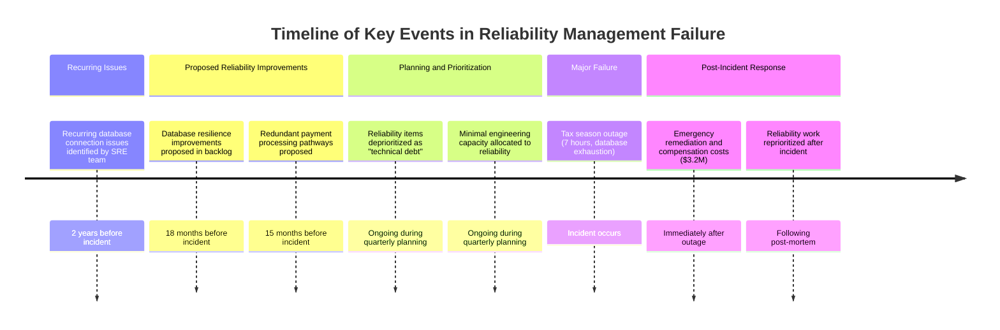

This timeline illustrates how recurring issues, deprioritization of proposed improvements, and insufficient planning ultimately led to a preventable major outage. The visual sequence underscores the importance of integrating reliability work into standard prioritization processes to avoid costly failures.

### SRE Best Practice: Evidence-Based Investigation

Leading organizations manage reliability improvements using the same product management practices as customer-facing features. The most effective approaches include:

1. **Reliability Story Creation**: Developing well-structured reliability user stories:

   - Writing stories from the customer perspective ("As a customer, I want consistent transaction processing during peak periods.")
   - Creating clear, testable acceptance criteria for reliability improvements
   - Defining explicit value statements that quantify customer and business impact
   - Breaking large reliability initiatives into estimable, sprint-sized stories
   - Applying the same level of detail and rigor as feature stories

   #### Example Table: Poorly Written vs. Well-Written Reliability Stories

   | Poorly Written Story                   | Well-Written Story                                                                                                            |
   | -------------------------------------- | ----------------------------------------------------------------------------------------------------------------------------- |
   | "Fix the database performance issues." | "As a customer, I want query response times to remain under 200ms during peak load, so I can complete transactions quickly."  |
   | "Improve system reliability by 10%."   | "As a customer, I want 99.95% system availability during business hours, so I can trust the service for critical tasks."      |
   | "Reduce error rates in the API."       | "As an API consumer, I want a 0.1% error rate for all requests, ensuring consistent and reliable integration with my system." |

   By framing stories in this way, teams create clarity around customer impact, measurable outcomes, and testable acceptance criteria.

2. **Integrated Backlog Management**: Maintaining a unified product backlog:

   - Incorporating reliability stories within the main product backlog
   - Using consistent prioritization frameworks for all work types
   - Applying the same estimation techniques to reliability and feature work
   - Tracking reliability and feature velocity with the same metrics
   - Creating explicit dependencies between reliability improvements and features

   #### Example of an Integrated Backlog (Excerpt)

   ```
   Sprint Backlog:
   1. Feature: "As a user, I want to filter search results by category, so I can find what I need faster."
   2. Reliability: "As a customer, I want the system to handle 10,000 concurrent users without timeouts, so I can shop during sales events."
   3. Feature: "As an admin, I want to export data in CSV format, so I can analyze usage trends offline."
   4. Reliability: "As a customer, I want 99.9% uptime for payment processing, so I can trust my transactions will go through."
   ```

3. **Value-Based Prioritization**: Implementing objective prioritization frameworks:

   - Developing scoring models that balance customer value, business impact, and technical risk
   - Creating ROI calculations for reliability improvements
   - Implementing cost-of-delay analysis for reliability work
   - Using incident data to quantify the cost of reliability gaps
   - Creating risk-adjusted prioritization that accounts for reliability debt

   #### Example: Prioritization Scoring Model

   ```
   Scoring Criteria:
   - Customer Impact: 1-5 (Low to High)
   - Business Value: 1-5 (Low to High)
   - Technical Risk Reduction: 1-5 (Low to High)
   - Urgency (Cost of Delay): 1-5 (Low to High)

   Example Scored Items:
   1. Reliability Story: "Ensure 99.95% availability for API" - Score: 18 (High priority)
   2. Feature: "Add new reporting dashboard" - Score: 14 (Medium priority)
   3. Reliability Story: "Reduce error rates during peak load" - Score: 16 (High priority)
   ```

4. **Balanced Capacity Allocation**: Explicitly allocating capacity for reliability:

   - Establishing target allocation ratios between feature and reliability work
   - Implementing minimum reliability investment thresholds
   - Creating separate but visible tracking for reliability velocity
   - Measuring reliability debt accumulation and retirement rates
   - Adjusting allocations based on system health indicators

   #### Example: Capacity Allocation Diagram

   ```mermaid
   pie title Sprint Capacity Allocation
   "Feature Work": 70
   "Reliability Work": 30
   ```

   Regularly monitoring these allocations ensures sufficient focus on reliability while still delivering customer-facing features.

Industry data shows that organizations with integrated reliability backlogs complete 3.2x more proactive reliability improvements and experience 58% fewer major incidents than those treating reliability as separate "technical debt." Research demonstrates that teams allocating 20-30% of capacity to reliability work actually deliver more customer value over time due to reduced incident-related disruption.

### Banking Impact

The business consequences of failing to properly manage reliability work are particularly acute in banking. Below is a concise summary of the key impacts:

#### **Reliability Debt Accumulation**

- Issues compound over time, leading to fragile systems.
- Small problems cascade into large-scale failures.
- Recovery from failures grows increasingly complex and costly.

#### **Distorted Resource Allocation**

- Engineering focus shifts disproportionately to visible feature work.
- Frequent incidents consume bandwidth, displacing planned improvements.
- Shadow work arises as engineers embed reliability fixes within feature tasks.

#### **Unpredictable Delivery**

- Incident disruptions derail roadmap execution.
- Erratic feature delivery and declining release quality.
- Risk aversion develops due to unstable system foundations.

#### **Customer Experience Degradation**

- Frequent disruptions erode trust in core financial functions.
- Customers defect as reliability issues undermine platform usability.
- Brand reputation suffers, shifting from innovative to unreliable.

______________________________________________________________________

#### **Impact Flow Representation**

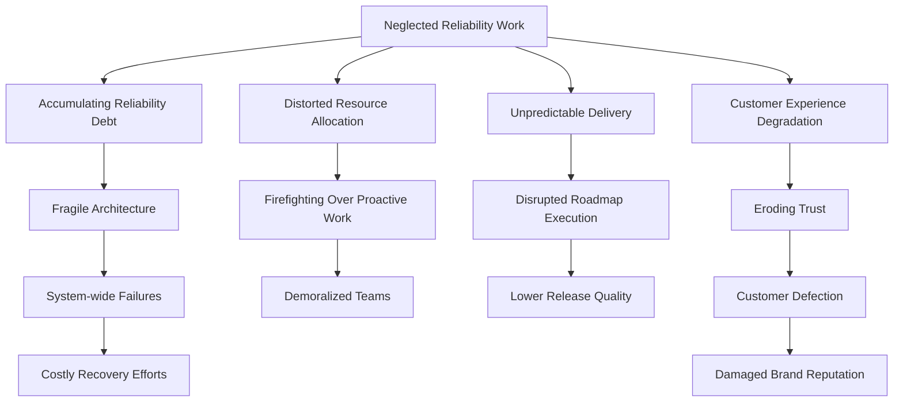

### Implementation Guidance

For organizations seeking to better manage reliability work through standard product practices, these five steps provide a practical implementation path. The following checklist and flowchart summarize the key actions to streamline adoption:

______________________________________________________________________

#### **Checklist for Reliability Work Integration**

1. **Create Reliability Story Standards**

   - [ ] Develop templates for reliability user stories.
   - [ ] Create guidelines for writing customer-focused reliability acceptance criteria.
   - [ ] Implement value quantification frameworks for reliability improvements.
   - [ ] Train product and engineering teams on reliability story creation.
   - [ ] Build example libraries of well-structured reliability stories.

2. **Implement Integrated Backlog Management**

   - [ ] Consolidate reliability work into the main product backlog.
   - [ ] Apply consistent prioritization frameworks across work types.
   - [ ] Develop shared estimation techniques for all work.
   - [ ] Ensure visibility for reliability stories during sprint planning.
   - [ ] Track reliability and feature completion rates systematically.

3. **Establish Value-Based Prioritization**

   - [ ] Create scoring models to objectively assess reliability ROI.
   - [ ] Conduct incident cost analyses to quantify reliability gaps.
   - [ ] Develop business impact assessments for reliability improvements.
   - [ ] Use risk-adjusted prioritization frameworks for decision-making.
   - [ ] Translate technical risks into clear business impact metrics.

4. **Allocate Explicit Reliability Capacity**

   - [ ] Define target allocation ratios (e.g., 70% features, 30% reliability).
   - [ ] Set minimum reliability investment thresholds per sprint.
   - [ ] Track and manage reliability debt over time.
   - [ ] Develop dashboards showing ongoing reliability investments.
   - [ ] Use system health metrics to trigger capacity adjustments.

5. **Measure Reliability Work Effectiveness**

   - [ ] Perform before/after measurements for all reliability improvements.
   - [ ] Create dashboards showcasing reliability trends and progress.
   - [ ] Track incident reduction metrics tied to specific improvements.
   - [ ] Calculate ROI for completed reliability investments.
   - [ ] Establish feedback loops to refine reliability story definition.

______________________________________________________________________

#### **Flowchart for Reliability Integration Process**

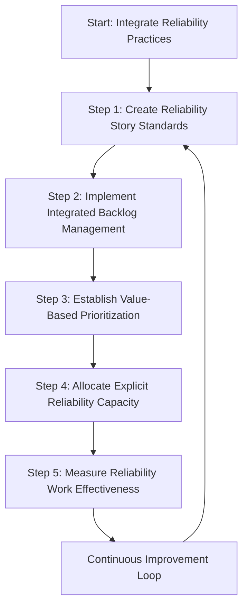

______________________________________________________________________

By following this structured approach and referencing the checklist and flowchart during planning sessions, teams can effectively integrate reliability work into standard product management practices, ensuring long-term sustainability and value delivery.

## Panel 7: A Culture of Reliability Advocacy

### Scene Description

A quarterly business review where multiple team members from different roles - product manager, UX designer, developer, QA engineer, and SRE - are all highlighting reliability aspects in their portions of the presentation. Rather than reliability being siloed to the SRE section, it's woven throughout discussions of product strategy, customer feedback, development progress, and future roadmap. Banking executives are nodding approvingly as reliability is clearly positioned as a core competitive advantage and business driver.

#### Reliability Integration Across Roles in the Quarterly Business Review

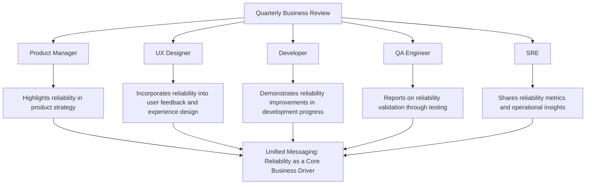

### Teaching Narrative

Ultimately, reliability becomes a true product feature when advocacy for it extends beyond the SRE team to become a shared organizational value. This panel explores how to build a culture where reliability is everyone's responsibility. The teaching narrative covers: creating shared ownership models where product, development, and operations all hold responsibility for reliability outcomes; developing reliability champions across different organizational functions; integrating reliability metrics into executive reporting alongside business KPIs; celebrating reliability successes as visibly as feature launches; and establishing reliability as a core brand value rather than a technical concern. The narrative emphasizes that the most mature reliability cultures are those where SREs aren't the sole advocates for reliability, but rather are specialists in a broader organizational commitment to reliability excellence.

### Common Example of the Problem

A large investment bank struggled with persistent reliability issues in their trading platforms despite substantial technical investments. The fundamental problem wasn't technical but cultural: reliability was viewed exclusively as the responsibility of the SRE team, with other stakeholders focused solely on their specialized concerns.

Product managers defined success through feature delivery and ignored reliability implications in their planning. Developers measured their contribution by code shipped, not system stability. Executive reporting highlighted transaction volume and new capabilities but omitted reliability metrics. When outages occurred, the organization looked exclusively to the SRE team to "fix reliability" while other teams continued with business as usual.

This siloed approach created multiple dysfunctions:

- Product managers pushed for aggressive timelines without considering reliability impacts.
- Developers optimized for feature velocity over operability.
- QA processes focused on functionality rather than resilience.
- Customers received mixed messages about the organization's reliability commitment.
- SREs became isolated reliability advocates without organizational support.

The breaking point came during a critical market volatility period when the trading platform experienced three significant outages in two weeks. Post-incident analysis revealed that multiple teams had identified potential reliability risks but didn't feel empowered to raise them as critical concerns. Developers had noted potential concurrency issues but prioritized meeting delivery deadlines. Product managers had deprioritized performance testing to meet market deadlines. Even customer feedback highlighting performance concerns had been classified as "enhancement requests" rather than critical issues.

This cultural failure cost significantly more than any technical failure, with the bank losing an estimated $47M in trading revenue and customer attrition following the outages.

#### Checklist: Key Cultural Failures to Identify in Your Organization

Use this checklist to assess whether similar cultural issues may be impacting your organization:

- [ ] **Siloed Ownership**: Is reliability viewed as the sole responsibility of SREs rather than a shared responsibility across teams?
- [ ] **Misaligned Metrics**: Are success metrics for different roles (e.g., product managers, developers, executives) excluding reliability considerations?
- [ ] **Lack of Empowerment**: Do team members feel unable to escalate or prioritize reliability concerns over delivery deadlines?
- [ ] **Narrow QA Focus**: Is QA primarily focused on functional correctness without testing for resilience or performance under stress?
- [ ] **Mixed Customer Messaging**: Are customers receiving conflicting signals about the importance of reliability to your organization?
- [ ] **Reactive Approach**: Are reliability risks only addressed after major incidents, instead of proactively as part of planning and development?

Identifying one or more of these issues may indicate a cultural gap that could lead to reliability problems. Proactively addressing these areas can help prevent costly failures and foster a stronger culture of reliability advocacy.

### SRE Best Practice: Evidence-Based Investigation

Leading organizations create cultures where reliability advocacy extends across all functions rather than residing solely with SRE teams. The most effective approaches include:

| **Best Practice**                         | **Description**                                                                                | **Benefits**                                                                                                                         | **Implementation Examples**                                                                                                                                                                                           |
| ----------------------------------------- | ---------------------------------------------------------------------------------------------- | ------------------------------------------------------------------------------------------------------------------------------------ | --------------------------------------------------------------------------------------------------------------------------------------------------------------------------------------------------------------------- |
| **Shared Reliability Ownership Models**   | Establish explicit reliability responsibilities across all roles.                              | - Enhanced accountability across teams.<br>- Reduced silos in incident response.<br>- Improved collaboration.                        | - Create clear reliability accountabilities for each function.<br>- Develop cross-functional reliability working groups.<br>- Establish reliability champions in each department.                                     |
| **Integrated Reliability Metrics**        | Embed reliability measures throughout organizational reporting.                                | - Data-driven decision-making.<br>- Improved visibility into reliability performance.<br>- Alignment with business KPIs.             | - Include reliability KPIs in executive dashboards.<br>- Integrate reliability metrics into product success measures.<br>- Develop team-level reliability scorecards.                                                 |
| **Reliability Celebration Mechanisms**    | Reinforce a culture of reliability by recognizing and celebrating achievements in reliability. | - Increased motivation and morale.<br>- Cultural reinforcement of reliability as a value.<br>- Positive feedback loops.              | - Celebrate reliability milestones with the same visibility as feature launches.<br>- Share reliability success stories in company communications.<br>- Implement recognition programs for reliability contributions. |
| **Cross-Functional Reliability Programs** | Establish organizational initiatives that foster reliability across diverse teams.             | - Broader organizational alignment on reliability goals.<br>- Accelerated reliability improvements.<br>- Strengthened collaboration. | - Create dedicated reliability improvement time across all teams.<br>- Develop mentorship programs pairing SREs with other functions.<br>- Establish reliability communities of practice.                             |

**Key Insight:**\
Industry data shows that organizations with dispersed reliability advocacy experience 64% fewer major incidents than those where reliability is solely an SRE concern. Research demonstrates that teams with explicit reliability objectives across all functions implement 3.7x more proactive reliability improvements than those where reliability is a specialized responsibility.

### Banking Impact

The business consequences of siloed reliability advocacy are particularly severe in banking:

**Reliability Blindspots:**

- Critical reliability risks go unnoticed outside specialized teams
- Reliability implications of business decisions remain unexplored
- Early warning signs visible to various stakeholders aren't consolidated
- Cross-functional reliability opportunities are missed
- Systemic issues spanning multiple teams remain unaddressed

**Organizational Misalignment:**

- Different functions optimize for conflicting objectives
- Product roadmaps fail to incorporate reliability investments
- Technical teams become frustrated by reliability deprioritization
- SREs become isolated "reliability police" rather than enablers
- Executives receive fragmented and incomplete reliability information

**Visualizing the Impact of Misalignment:**

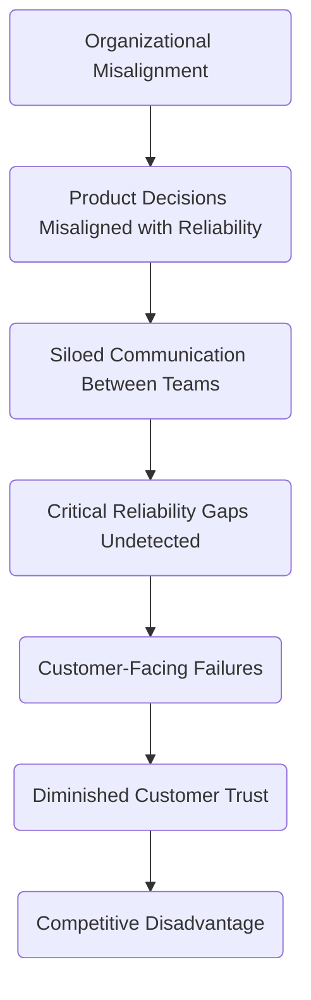

**Diminished Customer Trust:**

- Inconsistent messaging about reliability commitments
- Products marketed with insufficient reliability capabilities
- Customer-facing staff underprepared for reliability discussions
- Reliability becomes a reactive concern rather than a brand value
- Market perception develops of unreliable but feature-rich offerings

**Competitive Disadvantage:**

- Organizations fail to leverage reliability as a market differentiator
- Competitors with reliability-centric cultures gain market share
- Reliability improvements happen too slowly to match market demands
- Marketing misses opportunities to highlight reliability strengths
- Reliability crises create disproportionate reputational damage

### Implementation Guidance

For organizations seeking to build cultures of reliability advocacy, these five steps provide a practical implementation path. Use the following checklist to guide your implementation and ensure key actions are addressed:

#### **Checklist for Building a Culture of Reliability Advocacy**

______________________________________________________________________

**1. Establish Cross-Functional Reliability Responsibilities**

- [ ] Define specific reliability accountabilities for each role.
- [ ] Create shared reliability objectives across departments.
- [ ] Incorporate reliability components in all job descriptions.
- [ ] Form cross-functional reliability working groups.
- [ ] Launch a reliability champions program across departments.

______________________________________________________________________

**2. Integrate Reliability Metrics Throughout Reporting**

- [ ] Add reliability KPIs to executive dashboards.
- [ ] Include reliability measures in product success metrics.
- [ ] Develop team-level reliability scorecards.
- [ ] Incorporate reliability components into performance reviews.
- [ ] Create comprehensive reliability reporting visible to all stakeholders.

______________________________________________________________________

**3. Create Reliability Celebration Mechanisms**

- [ ] Celebrate reliability milestones with the same visibility as feature launches.
- [ ] Implement recognition programs for reliability contributions.
- [ ] Share reliability success stories in company communications.
- [ ] Acknowledge post-incident prevention and mitigation efforts.
- [ ] Showcase ongoing reliability improvements organization-wide.

______________________________________________________________________

**4. Implement Cross-Functional Reliability Programs**

- [ ] Allocate dedicated reliability improvement time for all teams.
- [ ] Appoint reliability ambassadors in each department.
- [ ] Establish mentorship programs pairing SREs with other functions.
- [ ] Develop reliability-focused communities of practice.
- [ ] Organize cross-team reliability hackathons and innovation events.

______________________________________________________________________

**5. Build Reliability Into Organizational Identity**

- [ ] Embed reliability into company values and mission statements.
- [ ] Highlight reliability commitments in marketing and sales materials.
- [ ] Train customer-facing staff on reliability messaging.
- [ ] Secure executive sponsorship for reliability initiatives.
- [ ] Position reliability as a core brand attribute.

______________________________________________________________________

By following this checklist, organizations can ensure that reliability advocacy is woven into the fabric of their culture, making it a shared responsibility and a key driver of business success.
