# Chapter 11: Automation as a Reliability Multiplier

## Chapter Overview

Welcome to the brutal reality of SRE in banking: automation isn’t just a “nice to have”—it’s the only way to stop drowning in the endless sea of manual drudgery, regulatory red tape, and avoidable 3 AM wake-up calls. This chapter is less “Zen and the Art of SRE” and more “How to Stop Being the Human Failsafe for a System Designed by Sadists.” If you’re still clinging to runbooks and heroics, you’re the reliability equivalent of a medieval doctor using leeches. We’ll torch the myth that “manual means safer,” expose the opportunity costs of toil, and show you how automation isn’t just a time-saver—it’s the only lifeline to sanity, scalability, and business survival in financial services. If you’re ready to trade your pager-induced insomnia for a culture that values prevention over firefighting, keep reading. If not, enjoy your next compliance audit and don’t forget to send HR your resignation letter template.

______________________________________________________________________

## Learning Objectives

- **Identify** sources of operational toil and quantify their true cost (including the stuff your manager pretends is “strategic”).
- **Apply** evidence-based methods to justify and prioritize automation targets, so you can automate what matters—not just what’s easy.
- **Differentiate** between automation maturity levels (from duct-taped scripts to actual self-healing systems) and **map** your processes to this hierarchy.
- **Design** automation guardrails that prevent your scripts from turning into financial weapons of mass destruction.
- **Integrate** observability data into feedback loops, so your automation actually gets smarter (unlike most meeting attendees).
- **Calculate** automation ROI using business-relevant metrics—think risk reduction, compliance, and resilience, not just “engineer hours saved.”
- **Drive** a cultural shift from firefighting to fire prevention, reclaiming your time and your dignity.
- **Implement** automation governance frameworks that keep regulators happy without reducing engineering to a bureaucratic crawl.

______________________________________________________________________

## Key Takeaways

- Toil isn’t just tedious—it’s the corporate equivalent of lighting money (and talent) on fire. If you’re proud of your “runbook expertise,” you’re a bottleneck, not a hero.
- Automation is a spectrum, not a checkbox. If your “automation” still requires someone to SSH in at 3 AM, you’re not automating—you’re delegating misery.
- Evidence always trumps anecdotes. Track where the pain is, or you’ll just automate the wrong things (and still get paged).
- Scripts are a start, but don’t confuse them with reliability. If your system can’t heal itself, you’re just making the inevitable outage faster.
- Guardrails aren’t bureaucracy—they’re what stop your automation from taking the system (and your job prospects) down with it.
- Observability is wasted if it doesn’t drive automated action. Dashboards don’t fix outages; automated feedback loops do.
- If you’re pitching automation as “saving engineer hours,” prepare for a budget rejection. Quantify risk reduction, compliance wins, and actual business impact—or stay stuck in the stone age.
- Culture eats process for breakfast. If your team is still in firefighting mode a year from now, you’ve automated nothing but your own misery.
- Compliance doesn’t have to be the enemy of automation; in fact, done right, it’s your best defense against both downtime and handcuffs.
- Your goal isn’t to automate yourself out of a job—it’s to automate yourself into a job you don’t hate.

In short: automate with purpose, measure what matters, and stop glorifying heroic toil. Your future self—and your sleep schedule—will thank you.

______________________________________________________________________

## Panel 1: The Toil Trap - Recognizing Manual Work That Consumes SRE Resources

### Scene Description

In a dimly lit banking operations center, Katherine sits surrounded by multiple monitors, manually restarting several payment processing services. Dark circles under her eyes tell the story of repeated 3 AM wake-up calls. On her desk sits a thick binder labeled "Manual Procedures" next to a half-empty coffee cup. Her phone shows five missed calls from other team members handling different parts of the system. A whiteboard in the background tracks "Incidents This Month" with alarming frequency, while a clock on the wall shows 4:37 AM.

Below is a simplified representation of Katherine's workspace to illustrate the toil environment:

```
+-------------------------------------------+
|                 Monitors                  |
|    [Service Restart Window 1] [Logs]     |
|    [Service Restart Window 2] [Alerts]   |
+-------------------------------------------+
|                                           |
|   Desk:                                   |
|   -------------------------------------   |
|   | Manual Procedures Binder   | ☕     | |
|   -------------------------------------   |
|                                           |
|   Phone: 5 Missed Calls                   |
|                                           |
+-------------------------------------------+
|                                           |
|   Whiteboard (Background):                |
|   -------------------------------------   |
|   | Incidents This Month: 15          |   |
|   -------------------------------------   |
|                                           |
|   Clock: 4:37 AM                          |
+-------------------------------------------+
```

This layout emphasizes the fragmented, high-pressure environment Katherine is managing and highlights the physical and mental toll of repetitive manual tasks.

### Teaching Narrative

Toil is the SRE term for manual, repetitive work that brings no enduring value and scales linearly with service growth. When SREs spend their days firefighting through manual procedures, they cannot focus on building systems that prevent fires in the first place. The banking industry is particularly susceptible to toil traps due to risk aversion, compliance requirements, and the critical nature of financial services.

Identifying toil requires honest assessment of where your team spends time. The key indicators include:

- Repetitive procedures performed weekly or more frequently
- Manual verification steps that could be automated
- Human approval gates that rarely reject changes
- Recurring incidents with identical remediation steps
- Multiple team members performing the same task in different systems

The greatest risk of toil isn't just wasted effort—it's the opportunity cost of improvements never made. Every hour spent on manual remediation is an hour not spent preventing the need for remediation altogether.

### Common Example of the Problem

At First National Bank, the payment gateway team faces a recurring issue where the transaction routing service occasionally becomes unresponsive after processing high volumes of credit card authorizations. The standard procedure to address this issue involves the following steps:

#### Manual Remediation Checklist

1. **Verify Transaction Logs**

   - Access the logging dashboard.
   - Identify any anomalies or errors in the transaction logs.
   - Confirm that the unresponsiveness correlates with high transaction volume.

2. **Restart Application Server**

   - Log into the affected server.
   - Execute a manual restart of the application service.
   - Monitor the system for any errors during the restart process.

3. **Clear Cache Entries**

   - Access the cache management interface.
   - Identify and clear specific cache entries related to the transaction routing service.
   - Verify the cache is functioning normally post-clearance.

4. **Verify Downstream Connections**

   - Run connectivity tests to multiple downstream systems.
   - Ensure all systems reestablish communication successfully.
   - Address any lingering connectivity issues if detected.

5. **Send Status Updates**

   - Notify stakeholders (e.g., operations, compliance teams) of the issue resolution.
   - Provide a summary of steps taken and confirm the system is operational.

This process takes approximately 45 minutes and occurs 3-4 times weekly, primarily during peak shopping periods. The team maintains a 30-page runbook for this procedure, requiring engineers to follow each step meticulously to avoid compliance violations.

#### Visualizing the Workflow

Below is a flow diagram to illustrate the inefficiencies of this process:

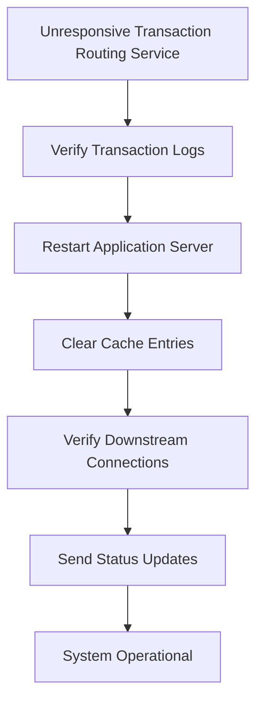

#### The Cost of Toil

Three engineers have become "experts" at this restart procedure, making them the default targets for 2 AM pages. These repeated interruptions prevent them from working on a redesign that could eliminate the problem entirely. The opportunity cost of being trapped in this cycle of operational toil continues to grow, leaving the team unable to focus on long-term improvements.

### SRE Best Practice: Evidence-Based Investigation

An evidence-based approach to identifying and quantifying toil begins with data collection rather than anecdotes. Progressive SRE teams implement systematic measurement through several techniques, each offering unique benefits and actionable insights.

| **Evidence-Based Approach** | **Description** | **Benefits** | **Implementation Tips** |
| -------------------------------- | -------------------------------------------------------------------------------- | ----------------------------------------------------------------------------------- | ---------------------------------------------------------------------------------------------- |
| **Time Studies** | Recording precise time spent on manual activities across team members. | Quantifies operational burden and highlights high-toil tasks. | Use time-tracking tools integrated with ticketing systems for accuracy. |
| **Activity Journals** | Engineers log and categorize daily tasks as toil, engineering, or overhead. | Establishes baseline metrics and identifies trends over time. | Provide a structured template to ensure consistency across team members. |
| **Toil Heat Maps** | Visual representations of when and where manual interventions occur. | Reveals patterns and clusters not apparent in individual incident reports. | Use data from incident management systems or logs to build a chronological and team-based map. |
| **Scalability Analysis** | Measures how manual effort grows with system size, transaction volume, or users. | Projects future toil burdens and supports prioritization of automation investments. | Regularly review scaling metrics during architecture and planning discussions. |
| **Opportunity Cost Calculation** | Quantifies missed engineering improvements due to operational toil. | Provides a financial and reliability perspective to support automation proposals. | Translate impact into measurable business outcomes (e.g., time saved, reduced downtime). |

When Capital One implemented this evidence-based approach, they discovered that 67% of their incident response team's time was consumed by just three categories of repetitive tasks, none of which required human judgment. This data-driven insight broke through years of assumptions about "necessary manual work" and catalyzed an automation initiative that ultimately reduced on-call interruptions by 73%.

### Banking Impact

The business consequences of the toil trap extend far beyond engineer frustration. Below is a summary of the major impacts on financial institutions, presented with key metrics for better clarity:

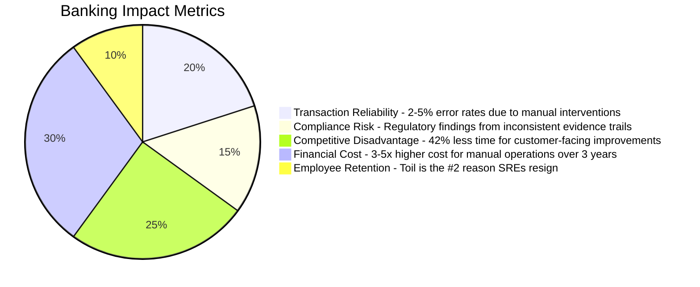

1. **Transaction Reliability**: Manual interventions introduce human error during critical financial processing, with data showing error rates of 2-5% even among experienced operators following detailed runbooks.

2. **Compliance Risk**: Manual procedures create inconsistent evidence trails for regulatory audits, with one major bank receiving a significant regulatory finding due to inconsistencies in how different engineers documented the same recovery procedures.

3. **Competitive Disadvantage**: Financial institutions trapped in operational toil innovate more slowly, with research showing that banks with high manual operations allocate 42% less time to customer-facing improvements compared to industry leaders.

4. **Financial Cost**: The fully-loaded cost of 24/7 manual operations typically exceeds automation investments by 3-5x over a three-year period, with one regional bank documenting $3.7M in annual savings after automating just their top five manual processes.

5. **Employee Retention**: SRE talent is increasingly scarce in financial services, with exit interviews showing that excessive toil is the second leading cause of resignation among senior reliability engineers.

### Implementation Guidance

To escape the toil trap, follow these five actionable steps. Use the checklist and flow diagram below to guide your implementation process.

______________________________________________________________________

#### **Checklist for Reducing Toil**

- [ ] **Implement Toil Tracking**
  - [ ] Standardize a logging method for manual tasks.
  - [ ] Categorize toil types (e.g., restarts, verification, reporting).
  - [ ] Track 100% of operational activities for at least one month.
- [ ] **Establish a Toil Budget**
  - [ ] Set a cap of 50% of engineering time for toil.
  - [ ] Make the budget visible and enforce it as strictly as error budgets.
  - [ ] Define escalation processes for exceeding the budget.
- [ ] **Prioritize Automation Targets**
  - [ ] Use the formula (Frequency × Duration × Urgency) to rank tasks.
  - [ ] Focus on automating high-urgency, high-frequency tasks first.
- [ ] **Create Automation Time Blocks**
  - [ ] Schedule uninterrupted 4-hour blocks twice weekly for automation work.
  - [ ] Protect these blocks with escalation required for interruptions.
  - [ ] Rotate on-call duties to ensure equitable access to automation time.
- [ ] **Develop Automation Design Patterns**
  - [ ] Build a library of reusable automation components.
  - [ ] Include patterns for banking-specific tasks (e.g., credential rotation, audit logging).
  - [ ] Standardize security controls within automation patterns.

______________________________________________________________________

#### **Step-by-Step Flow Diagram**

```mermaid
graph TD
    A[Start] --> B[Log Toil Activities]
    B --> C[Categorize Toil Types]
    C --> D[Track 100% for 1 Month]
    D --> E[Set Toil Budget]
    E --> F[Cap at 50% of Time]
    F --> G[Define Escalation Paths]
    G --> H[Identify Automation Targets]
    H --> I[Calculate ROI (F × D × U)]
    I --> J[Prioritize High-Impact Tasks]
    J --> K[Schedule Automation Time Blocks]
    K --> L[Protect and Rotate Time Blocks]
    L --> M[Build Automation Patterns]
    M --> N[Standardize Across Teams]
    N --> O[End]
```

By following this structured approach, your team can systematically reduce toil, enabling SREs to focus on long-term improvements that enhance system reliability and scalability.

## Panel 2: The Automation Hierarchy - From Scripts to Self-Healing Systems

### Scene Description

A modern banking technology center with Luis demonstrating a whiteboard diagram to other SREs. The diagram features a pyramid divided into five levels, each labeled with a stage of the automation hierarchy:

```
        Self-Healing Systems
         -------------------
        Closed-Loop Automation
         -------------------
          Orchestration
         -------------------
       Workflow Automation
         -------------------
             Scripts
```

Luis points to sticky notes affixed to the whiteboard, each representing specific banking processes such as "Account Reconciliation" and "Fraud Detection." Arrows connect the sticky notes to corresponding levels of the pyramid, showing their current automation maturity. Team members are engaged, taking notes on tablets while asking clarifying questions.

Through the glass wall, monitoring screens display dashboards of banking services. Compared to Panel 1, the dashboards show fewer critical alerts, emphasizing the reliability improvements achieved by advancing through the automation hierarchy. The scene conveys both collaborative learning and the tangible impact of automation on system stability.

### Teaching Narrative

Automation exists on a maturity spectrum that determines its reliability impact. At the most basic level, scripts convert manual commands into repeatable procedures—valuable, but still requiring human triggering and supervision. At the highest level, self-healing systems detect deviations from expected behavior and remediate without human intervention.

The automation hierarchy in reliability engineering follows this progression:

1. **Scripts** - Converting manual steps into code (e.g., restart scripts, data verification tools)
2. **Workflow Automation** - Connecting multiple scripts with decision logic and handoffs
3. **Orchestration** - Coordinating complex processes across multiple systems with dependency awareness
4. **Closed-Loop Automation** - Implementing detection-decision-action cycles with human oversight
5. **Self-Healing Systems** - Creating systems that maintain desired state without intervention

As you move up this hierarchy, the reliability multiplier increases dramatically—not just by eliminating manual work, but by reducing the human reaction time from incident detection to resolution. In banking systems, where downtime directly impacts financial transactions, this time reduction translates directly to preserved customer trust and reduced financial losses.

### Common Example of the Problem

Metropolitan Commercial Bank's mortgage processing platform illustrates the limitations of lower-level automation. Their overnight batch processing system frequently experiences data integration failures when receiving updates from third-party credit bureaus. The team has developed scripts that verify file integrity, correct common formatting errors, and restart processing jobs—but these scripts must be manually triggered and supervised by an analyst.

When integration failures occur, the current process works like this:

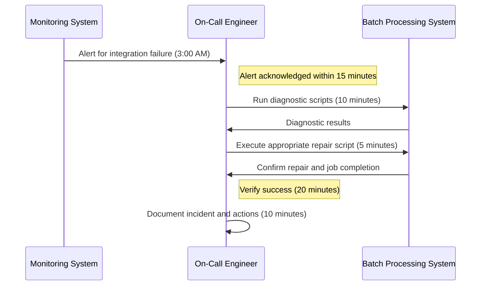

Even with automated scripts, the process still requires 60 minutes of human involvement and results in a 60-minute delay in resolution. This is a significant liability for a system that directly impacts next-day mortgage closing appointments. The inefficiencies stem from the reliance on human intervention for detection, decision-making, and execution, underscoring the need for higher levels of automation.

### SRE Best Practice: Evidence-Based Investigation

Organizations following best practices evaluate their automation maturity through structured evidence gathering. Below is a checklist summarizing the five key steps for evidence-based investigation, ensuring actionable insights:

| Step | Description | Key Outputs |
| -------------------------------------- | --------------------------------------------------------------------------------------------------------------------------------------------------------- | ----------------------------------------------------- |
| **1. Automation Inventory Assessment** | Catalog all existing automation tools, scripts, and workflows. Classify them by the five-level maturity model using clear criteria. | Comprehensive inventory with maturity classifications |
| **2. Time-to-Resolution Analysis** | Measure the full incident lifecycle, breaking down time spent in detection, response, diagnosis, remediation, and verification. Identify automation gaps. | Detailed breakdown of time spent per phase |
| **3. Human Decision Mapping** | Document decision trees followed by operators during incidents. Identify decisions requiring human judgment versus those with predictable patterns. | Mapped decision trees with automation candidates |
| **4. Dependency Visualization** | Create service dependency maps to understand orchestration needs for higher-level automation. | Visualized dependency map for critical services |
| **5. Success Rate Measurement** | Track automation reliability by analyzing false positives (unnecessary actions) and false negatives (missed issues). Establish improvement metrics. | Metrics on automation accuracy and performance |

#### Example: Evidence-Based Investigation in Action

When JPMorgan Chase conducted this analysis on their trading platform incident response, they discovered:

- **78% of human decisions** during common incidents followed predictable patterns that could be automated.
- Only **23% of these patterns** had been automated, primarily due to organizational inertia rather than technical challenges.

This structured approach allows organizations to systematically identify automation opportunities, prioritize based on impact, and address gaps efficiently.

### Banking Impact

The business impact of advancing through the automation hierarchy is substantial, with quantifiable benefits at each level of maturity. The following table summarizes key metrics and real-world outcomes observed in banking systems:

| **Impact Area** | **Metric/Outcome** | **Example** |
| ------------------------------- | ------------------------------------------------------------------------------------------------------------------------------------------------------------------ | ----------------------------------------------------------------------------------------------------------------------------------- |
| **Resolution Time Compression** | Incident resolution times reduced by **40-60%** per automation level. Self-healing systems respond in seconds compared to 30+ minutes for human-initiated scripts. | A major bank reduced critical incident resolution time from **45 minutes to under 2 minutes** by implementing self-healing systems. |
| **Consistency Improvement** | Error rates reduced by up to **91%** through automated workflows that eliminate human variation. | A credit card processor cut payment reconciliation errors by **91%** after deploying orchestrated automation. |
| **Scaling Capability** | Enabled transaction volume increases of **300%** without additional staffing. | A digital bank supported a **300% increase in transactions** with the same operational team using closed-loop automation. |
| **Compliance Advantage** | Regulatory reporting preparation times reduced from **3 weeks to 3 hours** with automated audit trails. | A regional bank achieved **consistent, comprehensive audit trails** for compliance using orchestrated automation. |
| **Competitive Intelligence** | Banks at the highest automation maturity release customer-facing features **3.7x faster** than those relying on basic scripts. | Automation freed engineering time, enabling one institution to accelerate innovation cycles and gain a competitive edge. |

By leveraging advanced automation, banks not only reduce downtime and operational costs but also unlock strategic advantages. These improvements directly enhance customer trust, support rapid scaling, and strengthen the institution’s market position in an increasingly competitive financial landscape.

### Implementation Guidance

To advance through the automation hierarchy, follow these five actionable steps. The progression can be visualized as a step-by-step journey, with each step building on the foundation of the previous one:

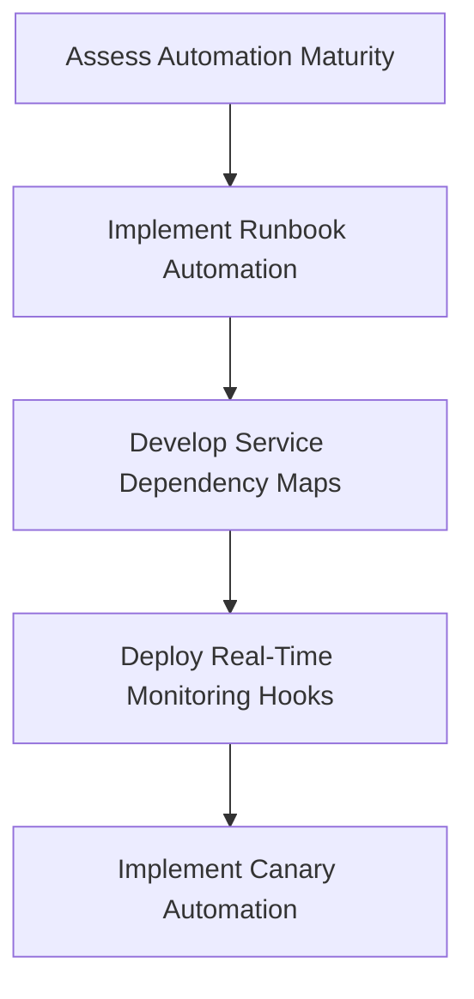

1. **Assess Automation Maturity**: Begin by mapping all current operational procedures to the five-level hierarchy. Identify what percentage of your operations falls into each category (e.g., Scripts, Workflow Automation, etc.). Set explicit quarterly targets to shift operations toward higher levels of automation (e.g., reduce Level 1 script reliance from 60% to 40% within two quarters).

2. **Implement Runbook Automation**: Automate your three most frequently used operational runbooks. Use tools like Rundeck, Ansible, or internal platforms to convert consistent, well-documented procedures into workflows. Include validation steps to ensure accuracy and build confidence in the automation.

3. **Develop Service Dependency Maps**: Create detailed visualizations of how your services interconnect. Include timing dependencies, data flows, and failure impact relationships. These maps are critical for orchestration and should encompass both technical and business process dependencies.

4. **Deploy Real-Time Monitoring Hooks**: Enhance your observability platform to expose real-time metrics and state information via APIs. Prioritize capturing "known good state" indicators that automated systems can reference for remediation. These hooks are essential for enabling closed-loop automation and self-healing.

5. **Implement Canary Automation**: Test automation processes on less-critical systems before applying them to critical ones. Choose components that share characteristics with mission-critical services and monitor reliability, false positive rates, and unexpected behaviors over at least 30 days. Use these insights to refine the automation before scaling up.

## Panel 3: Balancing Safety and Speed - The Guardrails Approach to Automation

### Scene Description

A split-screen view illustrates two complementary scenarios:

**Left Panel:**\
Hector is analyzing a complex automation system. The code features multiple highlighted "circuit breaker" points represented by red and green indicators. Green indicates normal thresholds, while red marks areas where anomalies would trigger an automated pause. Safety thresholds are annotated with labels like "CPU Usage Limit: 80%" and "Transaction Deviation Tolerance: ±5%". Below the code, a flowchart outlines the decision process for handling anomalies, structured as follows:

```
Start --> Check Thresholds --> [Threshold Exceeded?] --> Yes --> Trigger Circuit Breaker --> Alert Human
                                     |
                                     No
                                     |
                                Proceed Deployment
```

**Right Panel:**\
The team is conducting a retrospective meeting, reviewing an incident timeline. A horizontal timeline chart displays key events, such as:

- **09:05:** Deployment begins
- **09:07:** Anomaly detected (spike in transaction errors)
- **09:08:** Circuit breaker engaged
- **09:09:** Rollback initiated

Above the timeline, digital screens compare metrics for automated and manual deployments. The automated deployment graph shows fewer incidents and a higher volume of successful rollouts compared to the manual deployment graph, underscoring the safety and efficiency of automation.

This dual visualization emphasizes the reliability of guardrails in action, demonstrating how automation enhances safety while maintaining speed and scalability.

### Teaching Narrative

Automation skepticism in banking often stems from valid concerns: What if the automated system makes catastrophic mistakes at machine speed? The guardrails approach addresses this by building safety mechanisms directly into automation systems.

Effective automation guardrails include:

- **Blast Radius Limitations**: Restricting what systems can be modified simultaneously
- **Progressive Deployment**: Automatically rolling out changes to increasingly larger scopes
- **Automatic Verification**: Checking system health at each stage before proceeding
- **Circuit Breakers**: Automatically pausing when anomalies exceed thresholds
- **Controlled Rollbacks**: Returning to known-good states when verification fails

The most sophisticated automation doesn't eliminate human judgment—it amplifies it by encoding that judgment into systems that can apply it consistently, rapidly, and at scale. This approach transforms automation from a risky proposition to a safety-enhancing one.

In banking environments, where "first, do no harm" is paramount, guardrails-based automation actually increases safety compared to manual processes, which are inherently vulnerable to human error, especially during high-stress incidents or middle-of-the-night responses.

### Common Example of the Problem

Investment United Bank's deployment process for their trading platform illustrates the tension between safety and speed. Under pressure to deliver competitive features, the development team needs to deploy updates frequently. However, risk-averse operations teams, concerned about maintaining the stability of a platform that processes $2 billion in daily transactions, have implemented a cautious, human-heavy approval process.

The table below compares the current manual deployment process with an automated guardrails-based process to highlight key inefficiencies and potential improvements:

| **Process Step** | **Manual Deployment** | **Guardrails-Based Automation** |
| ---------------------- | --------------------------------------------------------------------------------- | -------------------------------------------------------------------------------------------------------- |
| **Code Approvals** | Three manual approvals required before staging deployment, introducing delays | Automated policy checks ensure code meets pre-defined standards before proceeding |
| **Staging Testing** | Manual sign-off from QA, security, and operations | Automatic verification pipelines test for security, functionality, and compliance |
| **Deployment Timing** | Weekend-only deployment windows (2 AM - 6 AM Sundays) | Progressive deployments can occur anytime, with smaller changes reducing risk |
| **Component Updates** | One component deployed at a time with manual health checks between each | Circuit breakers monitor health metrics and pause deployment automatically when anomalies are detected |
| **Regression Testing** | Full regression test suite executed manually after each component update | Incremental testing integrated into progressive rollouts, reducing redundant testing |
| **Rollback Decisions** | Requires VP-level approval, causing delays during critical incidents | Controlled rollbacks automatically return to a known-good state when thresholds for failure are exceeded |
| **Deployment Effort** | 18-22 hours of combined human effort per deployment | Minimal human intervention required; time reduced significantly |
| **Release Frequency** | Monthly release cycles | Multiple daily releases supported safely through automation |
| **Incident Response** | Full rollback requires extensive stakeholder coordination and manual intervention | Automated rollback and incident alerts allow rapid recovery with minimal disruption |

This manual process not only consumes 18-22 hours of effort per deployment but also limits the team to monthly release cycles. In contrast, digital-native competitors deploy multiple times daily, outpacing Investment United Bank in both speed and responsiveness. After a recent deployment failure that required a full rollback, leadership tightened the process further, exacerbating delays and reducing the ability to respond rapidly to market changes or security threats.

### SRE Best Practice: Evidence-Based Investigation

SRE teams that successfully balance safety and speed follow evidence-based practices to design appropriate guardrails. Below is a step-by-step checklist and flowchart to guide teams in implementing these practices:

#### Checklist: Evidence-Based Investigation Steps

1. **Failure Mode Analysis**

   - Review past incidents.
   - Identify conditions that should trigger circuit breakers.
   - Analyze metrics to pinpoint early, reliable problem indicators.

2. **Progressive Exposure Measurement**

   - Deploy changes progressively in stages (e.g., canary releases).
   - Collect data on deployment scope vs. incident detection time.
   - Optimize the sequence and scope of canary deployment stages.

3. **Decision Latency Tracking**

   - Measure human approval delays vs. automated check durations.
   - Evaluate safety/speed tradeoffs using precise, quantitative metrics.

4. **Guardrail Effectiveness Verification**

   - Use controlled fault injection to test circuit breakers and rollback systems.
   - Perform regular validation of safety mechanisms.

5. **False Positive/Negative Analysis**

   - Track occurrences of false positives and negatives in safety systems.
   - Refine thresholds using observed data to improve trigger accuracy.

#### Flowchart: Evidence-Based Guardrail Design

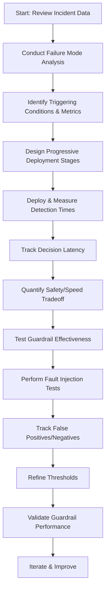

#### Real-World Impact

Goldman Sachs applied these evidence-based techniques to their trading platform deployment automation. By replacing subjective human approvals with data-driven, automated verification stages, they reduced deployment time by 87% while increasing overall safety. This demonstrates how a structured, evidence-based approach can transform automation into a safety-enhancing process.

### Banking Impact

The business impact of well-designed guardrails extends throughout the organization. Below is a summary of key metrics demonstrating the transformative effects of automation with guardrails in banking environments:

#### Deployment Risk Reduction

Properly implemented guardrails reduce deployment-related incidents by 70-90%, while increasing deployment frequency. For example, one major bank reduced failed deployments from 8% to under 1%.

```mermaid
barChart
    title Deployment Risk Reduction
    axis x Failed Deployments (%)
    axis y Before vs After
    "Before Guardrails": 8
    "After Guardrails": 1
```

#### Market Responsiveness

Accelerated deployment capabilities enable faster responses to market conditions. Automated guardrails allowed one investment bank to implement regulatory changes 73% faster than their manual-process competitors.

```mermaid
barChart
    title Regulatory Change Implementation Speed
    axis x Implementation Time (Days)
    axis y Manual vs Automated
    "Manual Process": 22
    "Automated with Guardrails": 6
```

#### Security Vulnerability Exposure

Automated, guardrail-protected deployment pipelines reduce the time security patches remain undeployed. Banks using automation reduced their mean time to patch critical vulnerabilities from 45 days to under 7 days.

```mermaid
barChart
    title Mean Time to Patch Critical Vulnerabilities
    axis x Time to Patch (Days)
    axis y Before vs After
    "Before Guardrails": 45
    "After Guardrails": 7
```

#### Operational Cost Efficiency

Despite initial investments, guardrail automation typically yields 3-5x ROI over three years. For instance, one regional bank documented $4.2M in annual savings after implementation.

```mermaid
barChart
    title Annual Savings from Guardrail Automation
    axis x Savings ($M)
    axis y Implementation Benefit
    "Without Guardrails": 0
    "With Guardrails": 4.2
```

#### Talent Utilization

Engineering teams freed from manual approvals and verification steps can focus on higher-value activities. Banks implementing advanced guardrails report a 42% increase in feature development velocity.

```mermaid
barChart
    title Feature Development Velocity Increase
    axis x Increase (%)
    axis y Before vs After
    "Before Guardrails": 0
    "After Guardrails": 42
```

These data points illustrate how guardrails not only enhance safety and reduce risk but also unlock significant operational, financial, and strategic benefits across banking organizations.

### Implementation Guidance

To implement effective automation guardrails, follow these five actionable steps:

1. **Identify Critical Metrics**:\
   Determine 3-5 key health indicators for each major service that reliably predict stability. Focus on customer-impacting metrics (e.g., transaction success rates, response times, error rates) rather than infrastructure-only metrics. These metrics will serve as your circuit breaker conditions. For instance, in a payment processing service, you might define the following metrics:

   - Transaction Success Rate (`>= 99.8%`)
   - Average Response Time (`<= 500ms`)
   - Error Rate (`<= 0.2%`)

   ```json
   {
     "service_name": "payment-processor",
     "circuit_breaker_metrics": {
       "transaction_success_rate": ">=99.8",
       "avg_response_time_ms": "<=500",
       "error_rate": "<=0.2"
     }
   }
   ```

2. **Implement Progressive Deployment**:\
   Configure your deployment automation to roll out changes in stages (e.g., 5%, 20%, 50%, 100% of traffic or servers). Each stage should include automated verification of health metrics before proceeding. Below is a sample progressive deployment configuration using a CI/CD pipeline YAML snippet:

   ```yaml
   stages:
     - deploy-5-percent
     - verify-5-percent
     - deploy-20-percent
     - verify-20-percent
     - deploy-50-percent
     - verify-50-percent
     - deploy-100-percent

   deploy-5-percent:
     script:
       - deploy_service --traffic=5%
   verify-5-percent:
     script:
       - check_metrics --timeout=15m

   deploy-20-percent:
     script:
       - deploy_service --traffic=20%
   verify-20-percent:
     script:
       - check_metrics --timeout=30m
   ```

   Set observation timeframes for each stage to ensure stability (e.g., 15 minutes at 5%, 30 minutes at 20%).

3. **Deploy Automatic Circuit Breakers**:\
   Implement automated mechanisms that pause deployments or trigger rollbacks when key metrics deviate from thresholds. Below is an example of a circuit breaker configuration in a service orchestration tool:

   ```yaml
   circuit_breaker:
     failure_threshold: 3
     recovery_timeout: 300
     conditions:
       - metric: transaction_success_rate
         operator: "<"
         value: 99.8
       - metric: avg_response_time
         operator: ">"
         value: 500
       - metric: error_rate
         operator: ">"
         value: 0.2
   ```

   This configuration pauses the deployment if any of the metrics deviate beyond the defined thresholds for 3 consecutive checks.

4. **Create Verification APIs**:\
   Develop health check endpoints for all services that return detailed status information. These endpoints should allow automated systems to evaluate service health. For example, a health check API response might look like this:

   ```json
   {
     "status": "healthy",
     "metrics": {
       "transaction_success_rate": 99.9,
       "avg_response_time_ms": 450,
       "error_rate": 0.1
     }
   }
   ```

   Ensure these APIs are robust and provide actionable insights rather than simple up/down indicators.

5. **Establish Guardrail Governance**:\
   Document clear policies for modifying or overriding guardrails, including required approvals and risk assessments. Treat guardrails as critical infrastructure with a formal change management process. Below is a sample policy outline:

   ```
   Guardrail Governance Policy:
   - All guardrail changes must be reviewed by the SRE team.
   - High-risk overrides (e.g., disabling circuit breakers) require approval from the Incident Commander.
   - Weekly audits to review guardrail performance and adjust thresholds based on recent incidents.
   ```

## Panel 4: Observability-Driven Automation - Building Feedback Loops

### Scene Description

In a modern NOC, Maya is working at a standing desk with three large monitors arranged side by side:

- **Left Monitor**: Displays a dashboard with anomaly detection, highlighting unusual patterns in payment processing latency. Key metrics such as transaction throughput, error rates, and processing times are prominently visualized.
- **Center Monitor**: Shows an automated investigation system, actively following a decision tree. This system is gathering data from distributed sources, including logs, traces, and metrics, to diagnose the root cause of anomalies.
- **Right Monitor**: Presents automated remediation recommendations. These include confidence scores, potential impacts of actions, and a notification indicating that a low-risk fix has already been implemented. Higher-risk actions are queued, awaiting manual approval.

Below is a conceptual layout of Maya's setup:

```
+------------------+------------------+------------------+
|                  |                  |                  |
|  Anomaly         |  Automated       |  Remediation     |
|  Detection       |  Investigation   |  Recommendations |
|  Dashboard       |  System          |  Panel           |
|                  |                  |                  |
+------------------+------------------+------------------+

Key Features:
- Detection-to-resolution time visualized as a timeline, demonstrating a reduction from hours to minutes over the past quarter.
- Integration of real-time telemetry and historical analysis to improve decision-making.
- Notifications for automated low-risk fixes and pending high-risk approvals.
```

This setup exemplifies how observability-driven automation reduces response times and empowers proactive incident management, allowing Maya to focus on higher-level decision-making.

### Teaching Narrative

The most powerful reliability automations are those deeply integrated with observability systems, creating closed feedback loops that can detect, diagnose, and potentially resolve issues with minimal human intervention.

Observability-driven automation follows these principles:

- **Data-Rich Detection**: Using SLI telemetry to identify deviations from expected behavior
- **Contextual Investigation**: Automatically gathering related logs, metrics, and traces
- **Pattern Recognition**: Applying past incident knowledge to new symptoms
- **Graduated Response**: Implementing low-risk mitigations immediately while escalating higher-risk decisions
- **Continuous Learning**: Recording outcomes to improve future automated decisions

This approach means your automated systems get smarter over time, learning from each incident to better detect and respond to the next one. The SRE team's expertise becomes encoded in the automation, allowing their judgment to scale beyond what manual processes could achieve.

For banking systems, this creates powerful risk reduction by ensuring that common failure modes are addressed consistently and rapidly, often before they impact customers—particularly critical for high-frequency trading platforms and real-time payment systems where seconds matter.

### Common Example of the Problem

Global Financial Services operates a credit card authorization platform processing 15,000 transactions per second during peak hours. Their observability system captures hundreds of metrics but struggles to translate this data into automated action. The current process and its inefficiencies can be summarized as follows:

| **Step** | **Action** | **Time Impact** | **Pain Point** |
| --------------------------- | --------------------------------------------------------------------------------------------- | -------------------- | ---------------------------------------------------------------------------------------------- |
| **1. Detection** | Operators visually scan dashboards for anomalies across dozens of screens | 5-15 minutes delay | Relies on human attention, prone to fatigue, and introduces delays in spotting critical issues |
| **2. Investigation** | Operators manually check logs, run queries, and correlate patterns | 10-30 minutes delay | Requires accessing multiple disconnected systems, increasing complexity and time to insight |
| **3. Diagnosis** | Operators compare findings to historical incidents and runbooks | Varies by experience | Highly dependent on operator expertise, leading to inconsistent quality and slower resolutions |
| **4. Remediation** | Operators execute manual fixes for identified issues | Case-specific | Manual execution delays response; low-severity issues often ignored due to bandwidth limits |
| **5. Post-Incident Review** | Findings are documented in tickets, but rarely inform future detection or response automation | Minimal value added | Lack of feedback loops means lessons learned are not encoded into systems for future benefit |

#### Workflow Visualization

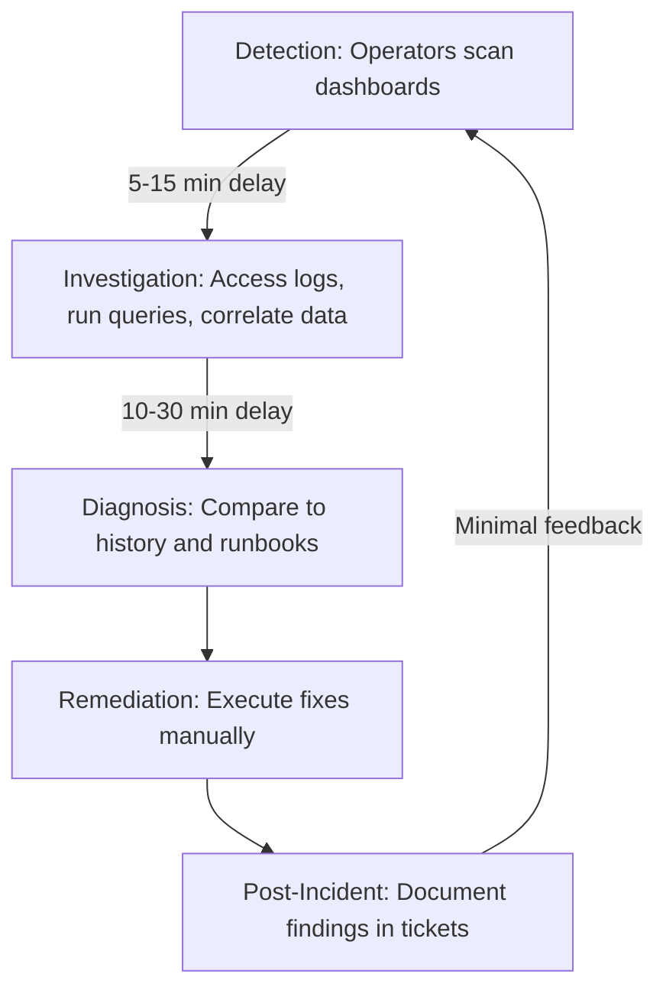

This human-centric approach creates several critical inefficiencies:

- Detection is delayed because it depends on operators noticing visual anomalies.
- Investigation is time-consuming and fragmented due to disconnected systems.
- Diagnosis quality is inconsistent and influenced by operator experience and fatigue.
- Repeated incidents are not leveraged for proactive automation, leading to redundant effort.
- Low-severity issues are often neglected due to limited operator bandwidth.

Despite significant investment in observability tools, the organization fails to fully utilize the data for automated responses. This results in avoidable customer impacts, increased operational costs, and missed opportunities for optimization.

### SRE Best Practice: Evidence-Based Investigation

Leading SRE organizations implement observability-driven automation through systematic approaches. The following checklist summarizes best practices and their benefits for easier reference and practical application:

| Step | Description | Benefits |
| --------------------------------- | -------------------------------------------------------------------------------------------------------------------------------------------------------------------------------------------------------- | ----------------------------------------------------------------------------------------------- |
| **Incident Pattern Analysis** | Mine historical incident data to identify recurring patterns. Quantify the percentage of incidents that follow known patterns versus novel scenarios. Prioritize automation for high-frequency patterns. | Enables focus on automating the most impactful scenarios, reducing recurring manual effort. |
| **Response Decision Mapping** | Document detailed decision trees from expert responders. Include specific queries, evaluated data points, and thresholds triggering actions. | Encodes expert knowledge into repeatable processes, ensuring consistent responses to incidents. |
| **Automation Confidence Scoring** | Develop frameworks to assess automation confidence based on signal clarity, historical precedent, and impact potential. Use these scores to decide between automated action and human review. | Balances risk and efficiency by ensuring automation acts only when confidence is high. |
| **Feedback Loop Instrumentation** | Capture outcomes of both automated and manual actions. Structure this data to continuously improve response algorithms. | Facilitates learning from every incident, improving the system’s intelligence over time. |
| **Graduated Autonomy Testing** | Gradually increase automation authority through controlled experiments. Start with recommendations only, then supervised automation, and finally autonomous operation. | Builds trust in automation through iterative validation, minimizing risks during deployment. |

#### Example in Practice: Bank of America

When Bank of America applied these evidence-based practices to their online banking platform, they discovered that 82% of incidents followed one of just 37 distinct patterns. Each pattern had well-defined investigation and mitigation paths, enabling targeted automation efforts that significantly reduced resolution times and improved overall reliability.

### Banking Impact

The business impact of observability-driven automation includes significant improvements across key operational metrics. Below is a summary table highlighting these achievements, paired with real-world examples from leading banks:

| **Impact Area** | **Metric/Result** | **Bank Example** |
| ---------------------------------- | -------------------------------------------------------------------- | --------------------------------------------------------------------------------------------------- |
| **Time-to-Resolution Compression** | MTTR reduced by **60-85%** for known patterns | Citibank: Resolution time for payment processing incidents reduced from **47 minutes to 8 minutes** |
| **Incident Prevention** | **72% reduction** in service disruptions | Digital Bank: Emerging issues preemptively addressed before becoming customer-impacting incidents |
| **Consistency Improvement** | **94% consistency** in problem identification | Wells Fargo: Standardized diagnostic algorithms eliminated variation in troubleshooting approaches |
| **Coverage Expansion** | Monitoring scope increased from **50 to 750+ metrics** | TD Bank: Expanded observability coverage enabled by automated analysis systems |
| **Operational Efficiency** | ROI exceeding **5x** within two years, with significant cost savings | HSBC: Achieved **$7.3M annual savings** in retail banking operations |

These metrics illustrate how observability-driven automation transforms banking operations, enabling faster resolution, proactive prevention, and measurable financial benefits. Through these enhancements, banks ensure greater reliability and customer satisfaction, especially for critical systems like high-frequency trading and real-time payments.

### Implementation Guidance

To implement observability-driven automation, follow these five actionable steps. The diagram below illustrates how these steps interconnect to form a closed feedback loop.

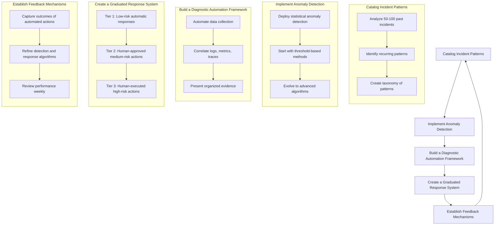

#### Step-by-Step Breakdown:

1. **Catalog Incident Patterns**:

   - Analyze your last 50-100 incidents to uncover recurring patterns.
   - Develop a structured taxonomy of incident types, including detection signals, diagnostic steps, and resolution actions.
   - Prioritize high-frequency, well-understood patterns with clear resolution paths for initial automation.

2. **Implement Anomaly Detection**:

   - Deploy statistical anomaly detection mechanisms on key SLIs.
   - Start with simple threshold-based detection (e.g., 3 standard deviations from baseline).
   - Gradually adopt more sophisticated algorithms as performance data accumulates and detection signatures are refined.

3. **Build a Diagnostic Automation Framework**:

   - Automate the execution of common diagnostic procedures when anomalies are detected.
   - Focus on automating data collection and correlation steps currently done manually.
   - Ensure the system organizes evidence for operators rather than presenting raw data.

4. **Create a Graduated Response System**:

   - Design a tiered framework for automated responses:
     - **Tier 1**: Automatic execution of low-risk actions (e.g., simple restarts, data collection).
     - **Tier 2**: Require human approval for medium-risk actions (e.g., configuration changes, traffic shifting).
     - **Tier 3**: Reserve high-risk actions (e.g., complex recovery operations) for human execution.

5. **Establish Feedback Mechanisms**:

   - Collect structured feedback on every automated action, documenting whether it resolved the issue, required manual intervention, or caused additional problems.
   - Use this feedback to refine detection and response algorithms.
   - Conduct weekly reviews of automation performance and apply updates to improve accuracy and reliability.

This iterative approach ensures your automation becomes progressively smarter over time, encoding the expertise of your SRE team and reducing detection-to-resolution time.

## Panel 5: The Automation Investment Equation - Calculating ROI Beyond Time Savings

### Scene Description

A meeting room where Katherine is presenting to a mixed group of engineering and business stakeholders. On the screen is a dashboard titled "Automation Investment Equation," prominently displaying key metrics:

- **Incident Reduction**: 73% reduction in customer-impacting incidents.
- **Mean Time to Resolution**: Improved by 40%.
- **Customer Impact Prevention**: Tangible reduction in service disruptions.
- **SRE Capacity Reclaimed**: 25% of operational time redirected to strategic improvements.

Below the dashboard, a before/after bar chart illustrates the transformation in key reliability metrics following specific automation initiatives:

```
Before/After Chart
------------------
Metric                     Before     After
-------------------------- ---------- ----------
Incident Rate              High       Low
Mean Time to Resolution    Slow       Fast
Operational Costs          High       Reduced
SRE Focus on Strategy      Limited    Expanded
------------------
```

The audience is particularly captivated by a slide showing the payment processing automation case study. A clear process flow comparison highlights the impact:

```
Automation Impact Flow
======================
Manual Workflow:          Error Detection -> Human Triage -> Manual Fix -> Recovery
Automated Workflow:       Error Detection -> Automated Fix -> Recovery
```

In the room, the business stakeholders nod in agreement as Katherine explains how this automation not only slashed operational costs but also minimized customer-facing downtime, demonstrating the tangible benefits of investing in reliability automation.

### Teaching Narrative

Justifying automation investments requires speaking both engineering and business languages. The automation investment equation goes far beyond simple time-saving calculations to capture the full business impact of reliability automation.

A comprehensive automation ROI assessment includes:

- **Incident Reduction Value**: Fewer incidents means less customer impact and recovery costs
- **Resolution Time Compression**: Faster recoveries directly reduce business impact
- **Consistency Premium**: Eliminating variation in how procedures are performed
- **Scale Enablement**: Handling growing transaction volumes without growing the team
- **Focus Multiplication**: Increasing time spent on strategic reliability improvements
- **Knowledge Preservation**: Capturing expert processes that survive team changes

In banking systems, automation ROI calculations must also include risk reduction, compliance benefits, and audit advantages. When properly quantified, these often reveal that the highest-value automation opportunities aren't in the most frequent tasks, but in the highest-risk processes where human error would have catastrophic consequences.

The most mature SRE teams track "reliability leverage"—a measure of how much system reliability improves relative to the human effort invested in maintaining it. Automation is the primary way to increase this leverage, allowing small teams to support increasingly critical systems.

### Common Example of the Problem

Continental Trust Bank's automation proposal stalled for three consecutive budget cycles because the team relied exclusively on engineer time savings to justify investments. Their proposal highlighted specific manual tasks and their associated time and cost:

| Task | Annual Hours | Fully-Loaded Hourly Cost | Annual Cost |
| ------------------------------------ | ------------ | ------------------------ | ------------ |
| Certificate renewals and rotation | 520 | $120 | $62,400 |
| User access reviews and provisioning | 780 | $120 | $93,600 |
| Month-end reconciliation procedures | 940 | $120 | $112,800 |
| Backup verification and validation | 650 | $120 | $78,000 |
| **Total** | **2,890** | **$120** | **$346,800** |

With an estimated automation development cost of $425,000, the simple ROI calculation showed a projected annual savings of $346,800, resulting in a 15-month payback period. While these numbers captured time savings effectively, they failed to provide a comprehensive view of the broader business value.

The narrowly-focused business case was repeatedly rejected as "not compelling enough" compared to customer-facing feature investments. Key areas overlooked included:

- **Risk Reduction**: Quantifying the cost of potential compliance failures or security breaches mitigated by automation
- **Error Rate Reduction**: Highlighting the financial and reputational impact of human errors in critical processes
- **Scalability Benefits**: Demonstrating how automation enables growth without proportional headcount increases
- **Compliance Improvements**: Showcasing auditability and adherence to regulatory requirements

In budget reviews, the team relied on anecdotal evidence for these aspects rather than quantified metrics. This lack of a comprehensive business case led to the continued reliance on manual operations, despite significant hidden costs and risks.

### SRE Best Practice: Evidence-Based Investigation

Elite SRE organizations build compelling automation business cases through comprehensive evidence gathering. To ensure a structured and actionable approach, use the following checklist of evidence-gathering strategies:

#### Evidence-Gathering Checklist for Automation Business Cases

1. **Total Cost of Incidents Analysis**

   - Conduct structured post-incident reviews.
   - Document all costs, including:
     - Lost transaction revenue.
     - Recovery expenses.
     - Customer compensation.
     - Regulatory penalties.
     - Reputational damage (quantified via customer attrition data).

2. **Error Rate Measurement**

   - Systematically track error rates in manual procedures.
   - Use observability data and process audits to:
     - Establish baseline error frequencies.
     - Quantify severities to project potential risk reduction.

3. **Scalability Modeling**

   - Create data-backed projections for operational costs.
   - Compare manual versus automated approaches under expected business growth:
     - Highlight the non-linear scaling advantages of automation.

4. **Customer Impact Quantification**

   - Correlate system reliability metrics with:
     - Customer experience measurements.
     - Retention rates.
     - Revenue impact.
   - Establish the direct business value of improved system availability.

5. **Compliance Efficiency Assessment**

   - Document time spent on:
     - Audit preparation.
     - Evidence collection.
     - Findings remediation for manual processes.
   - Project compliance efficiency gains from automation adoption.

______________________________________________________________________

#### Real-World Application: TD Bank Case Study

When TD Bank implemented this evidence-based approach for their automation business cases, they discovered that direct time savings represented only 23% of the total business value. The remaining value was distributed across:

- Reduced risk exposure (41%).
- Improved compliance posture (17%).
- Enhanced scalability (19%).

This comprehensive approach completely transformed their investment prioritization, allowing them to focus on high-impact automation opportunities.

### Banking Impact

The comprehensive business impact of automation investments includes:

1. **Risk Exposure Reduction**: Properly quantified, risk reduction often represents the largest value component.\
   **Case Study**: A major bank achieved a 94% reduction in certificate expiration incidents, preventing outages and compliance violations. Historical impact data valued this improvement at $4.2M annually, demonstrating how automating high-risk processes protects both customer trust and financial stability.

2. **Compliance Efficiency**: Automated processes with integrated compliance controls reduce audit preparation time and improve findings resolution.\
   **Case Study**: Barclays automated access certification processes, reducing audit preparation time by 75% and improving closure rates. This resulted in £2.3M annual savings in compliance costs, while enhancing audit readiness and reducing regulatory risk.

3. **Error Elimination**: Human error in critical financial procedures can lead to significant monetary losses, which automation directly addresses.\
   **Case Study**: Chase automated its reconciliation procedures, which previously experienced a 2.3% error rate. This effort delivered $9.7M in annual prevention value by eliminating costly manual errors in high-frequency transactions.

4. **Time-to-Market Acceleration**: Automation in CI/CD pipelines and testing environments expedites feature delivery and enhances competitiveness.\
   **Case Study**: BBVA implemented deployment automation, achieving a 67% reduction in deployment lead time. This acceleration enabled faster delivery of customer-facing features, strengthening their position in a rapidly evolving market.

5. **Operational Resilience**: Automated procedures ensure consistent performance under varying conditions, providing a resilience premium.\
   **Case Study**: Santander calculated a €3.6M "resilience premium" during a period of 23% staff attrition. Automation preserved operational capabilities despite reduced staffing, underscoring its value in maintaining reliability during workforce challenges.

By examining these cases, it becomes clear that automation delivers value far beyond time savings, addressing critical priorities like risk reduction, compliance, and resilience in high-stakes banking environments.

### Implementation Guidance

To build compelling automation investment cases, follow these five actionable steps. The process is summarized in the flowchart below for clarity:

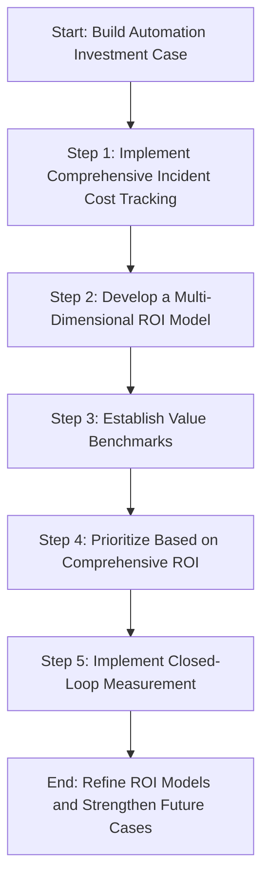

#### Step 1: Implement Comprehensive Incident Cost Tracking

For each major incident, document all associated costs, including lost revenue, recovery expenses, customer compensation, regulatory impact, and reputation damage. Use consistent templates to ensure completeness. Maintain a rolling 12-month database of these costs to support ROI calculations.

#### Step 2: Develop a Multi-Dimensional ROI Model

Create a standardized spreadsheet model that incorporates all seven value dimensions:

- Direct time savings (hours × fully loaded cost)
- Incident reduction (frequency × average cost)
- Resolution time compression (hours saved × cost per hour of downtime)
- Error elimination (error rate × average remediation cost)
- Scalability benefits (projected growth × marginal manual cost)
- Compliance improvements (audit preparation time × cost + findings reduction)
- Knowledge preservation (expert attrition risk × replacement cost)

#### Step 3: Establish Value Benchmarks

For each critical system, establish baseline metrics that will demonstrate automation value:

- Current MTTR (Mean Time To Resolve) for common incidents
- Manual procedure error rates from quality reviews
- Time required for standard compliance activities
- Historical customer impact data for similar issues

Use these as "before" metrics to project and eventually measure "after" improvements.

#### Step 4: Prioritize Based on Comprehensive ROI

Rank automation opportunities using the complete ROI model rather than just time savings. Create a prioritized backlog that balances quick wins (high value, low effort) with strategic investments (transformative but higher effort). Use consistent scoring to maintain objectivity.

#### Step 5: Implement Closed-Loop Measurement

After implementing each automation, meticulously track actual outcomes across all value dimensions. Compare projected versus actual benefits quarterly and refine your ROI models based on real results. Use this growing body of evidence to strengthen future business cases.

## Panel 6: From Firefighting to Fire Prevention - The Cultural Transformation

### Scene Description

A side-by-side comparison illustrates the team's cultural transformation:

**Left Panel: Firefighting Mode**

- **Visual Elements**:
  - Team members surrounded by cluttered desks with ringing pagers and flashing alert dashboards.
  - A chaotic atmosphere with engineers visibly stressed, typing frantically on their keyboards.
  - Sticky notes with urgent tasks like "Fix Payment Gateway Outage" and "Investigate Latency Spike" scattered around.
- **Metrics**:
  - High on-call interruptions.
  - Frequent post-incident meetings with little time for proactive improvements.

**Right Panel: Proactive Reliability Mode**

- **Visual Elements**:
  - Team gathered calmly around a whiteboard, discussing reliability strategies and planning improvements.
  - Nearby screens displaying automated dashboards with green indicators and historical uptime trends.
  - Task boards showing planned initiatives like "Payment Gateway Self-Healing v2" and "Automated Canary Analysis."
  - A wall calendar displaying consistent working hours with no weekend emergencies.
- **Metrics**:
  - Significant reduction in on-call interruptions.
  - Increased project completion rates.
  - Evidence of better work-life balance.

**Progression Diagram: Cultural Transformation**

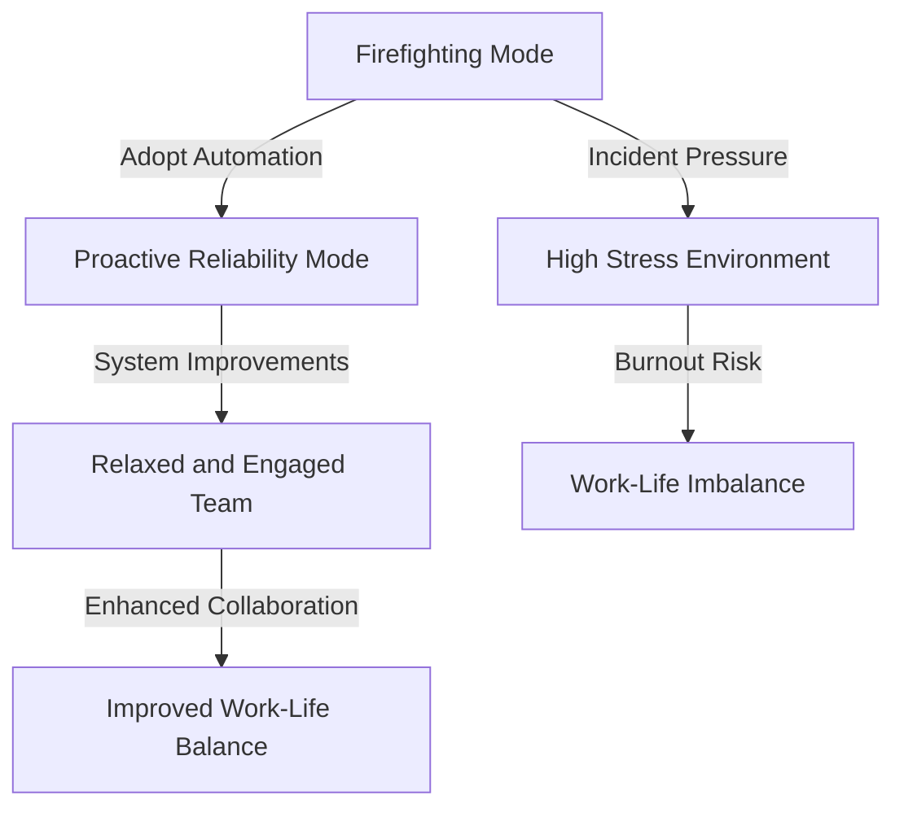

This progression visually captures the team's journey from reactive firefighting to a proactive, automation-driven reliability culture.

### Teaching Narrative

The ultimate goal of automation in reliability engineering isn't just efficiency—it's transforming how teams work and what they focus on. This represents a cultural shift from responding to failures to building systems that don't fail in the first place.

Signs of successful automation culture include:

- **Proactive Metrics**: Teams track "problems prevented" not just "problems fixed"
- **Time Allocation**: Engineers spend most hours on improvement, not maintenance
- **Learning Orientation**: Incidents become opportunities to improve automation
- **Risk Comfort**: Teams confidently implement changes through well-tested automation
- **Tool Craftsmanship**: Building and improving automation tools becomes a valued skill
- **On-Call Experience**: Responders guide automated systems rather than performing manual tasks

For production support teams transitioning to SRE in banking environments, this cultural transformation can be challenging but rewarding. The key mindset shift is viewing automation not as "making my current job faster" but as "changing what my job is"—elevating the human role from performing procedures to designing systems that perform procedures optimally.

When this transformation succeeds, the result is better for both the business and the team: more reliable systems, happier customers, lower costs, and more intellectually engaging work for engineers who spend their time solving new problems rather than repeatedly addressing the same ones.

### Common Example of the Problem

Atlantic Financial's credit card fraud detection team exemplifies the firefighting trap. Their 24/7 operation centers around responding to suspected fraud alerts generated by their detection systems. The team of 18 specialists spends over 90% of their time on repetitive investigation procedures, which can be summarized as follows:

| Step | Manual Action | Inefficiency |
| --------------------------- | ----------------------------------------------------------------------- | ------------------------------------------------------------------------------------------- |
| **1. Alert Processing** | Each alert triggers a manual review process | High volume of alerts leads to constant context switching and cognitive fatigue |
| **2. Data Gathering** | Specialists access multiple systems to gather transaction history | Fragmented systems require time-consuming navigation and manual correlation |
| **3. Pattern Verification** | Standard verification scripts are run to check for known fraud patterns | Scripts are executed manually, limiting throughput and increasing the chance of human error |
| **4. Documentation** | Results are manually documented in case management systems | Repetition introduces delays and inconsistencies in record-keeping |
| **5. Decision Execution** | Decisions (approve/decline/escalate) are manually implemented | Manual updates to systems increase latency and risk of operational mistakes |

The impact of this manual process is severe. Despite hiring top talent with advanced degrees in data science and financial crime, the team has devolved into a procedural response unit. Turnover has reached 37% annually, with exit interviews consistently citing "mundane work" and "lack of innovation opportunity" as primary reasons for leaving. Meanwhile, the backlog of fraud detection improvements—pattern recognition algorithms, machine learning models, and automated verification systems—remains untouched because the team never escapes the daily response cycle.

The vicious cycle is illustrated below:

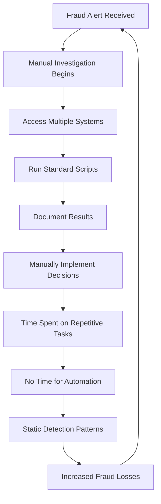

As the team remains trapped in this cycle, fraud losses have steadily increased. Sophisticated criminals exploit the static detection patterns that the team lacks time to evolve. Breaking this cycle requires a shift to proactive automation, allowing the team to focus on building and refining intelligent systems instead of being consumed by repetitive manual tasks.

### SRE Best Practice: Evidence-Based Investigation

Organizations that successfully transform from firefighting to fire prevention follow evidence-based approaches. These approaches rely on data to identify bottlenecks, prioritize proactive improvements, and measure the impact of changes. Below is a checklist summarizing key practices for evidence-based investigation:

#### Checklist for Evidence-Based Investigation

- **Time Allocation Analysis**

  - [ ] Use time tracking integrated with ticketing systems to log how engineering hours are spent.
  - [ ] Categorize time into reactive (firefighting) vs. proactive (improvement) work.
  - [ ] Establish a baseline to identify opportunities for shifting focus toward proactive tasks.

- **Interrupt-Driven Work Quantification**

  - [ ] Analyze pager data, calendar meetings, and task interruptions for frequency and duration.
  - [ ] Measure the cognitive cost of context-switching using focus-time tracking tools.
  - [ ] Quantify the hidden impact of interruptions on overall productivity.

- **Improvement Impact Measurement**

  - [ ] Implement tracking to monitor incident rates before and after reliability improvements.
  - [ ] Compare metrics like Mean Time Between Failures (MTBF) to validate the effectiveness of proactive changes.
  - [ ] Document and communicate successes to reinforce the value of prevention-focused work.

- **Cultural Survey Assessment**

  - [ ] Conduct anonymous surveys to assess job satisfaction, psychological safety, and innovation opportunities.
  - [ ] Use standardized questions to establish a cultural baseline for comparison over time.
  - [ ] Share findings with leadership to align cultural improvements with organizational goals.

- **Knowledge Work Effectiveness Analysis**

  - [ ] Track how much time specialists spend on tasks requiring their unique expertise.
  - [ ] Identify routine or repetitive work that could be automated or delegated.
  - [ ] Prioritize automating low-value tasks to maximize the application of specialized skills.

#### Case in Action: Capital One's Fraud Operations Team

When Capital One's fraud operations team conducted an evidence-based assessment, they discovered that their Level 3 specialists—with advanced degrees and 10+ years of experience—spent only 12% of their time applying their unique expertise. The remaining 88% of their time was consumed by routine tasks that could be automated. By addressing this imbalance, the team significantly increased both productivity and job satisfaction.

Use this checklist as a guide to implement evidence-based investigation within your own organization. By turning insights into actions, you can drive your team’s transformation from firefighting to fire prevention.

### Banking Impact

The business impact of transforming from reactive to proactive extends throughout the organization. The following table summarizes key quantitative outcomes observed in banking environments after implementing a "prevention first" reliability model:

| **Impact Area** | **Observed Outcome** | **Example** |
| ---------------------------- | ------------------------------------------------------------------------------------------------- | ------------------------------------------------------------------------------------------------- |
| **Incident Reduction** | 60-80% reduction in customer-impacting incidents within 18 months. | USAA documented a 73% decrease in critical incidents after their "prevention first" initiative. |
| **Innovation Acceleration** | 3-5x faster delivery of customer-facing innovations, freeing teams from firefighting. | Danske Bank increased feature delivery velocity by 340% after automating their operational model. |
| **Risk Profile Improvement** | 92% reduction in security breaches by proactively addressing vulnerabilities before exploitation. | A multinational bank credited their proactive security shift for this improvement. |
| **Talent Acquisition** | 47% higher application rates for technical positions and 58% higher job offer acceptance rates. | Banks with prevention-focused cultures gain a competitive advantage in talent recruitment. |
| **Cost Efficiency** | 40-60% lower operational costs compared to firefighting teams. | Bank of Montreal saved $3.2M annually while improving customer experience metrics. |

This transformation not only reduces risks and costs but also enhances innovation velocity and talent acquisition, positioning banks for long-term success in competitive markets.

### Implementation Guidance

To transform from firefighting to fire prevention, follow these five actionable steps. The workflow below visually represents the process, highlighting the key actions and their sequence for cultural transformation.

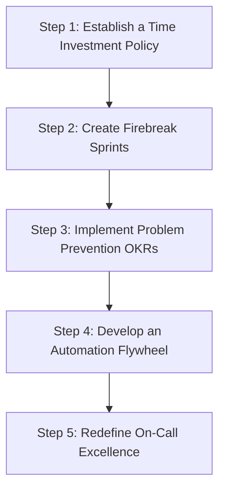

#### Step 1: Establish a Time Investment Policy

- Implement a formal policy requiring engineers to spend at least 40% of their time on proactive improvements rather than reactive work.
- Incorporate this policy into job descriptions, performance reviews, and team charters.
- Track this metric weekly and share progress with the organization to ensure accountability.

#### Step 2: Create Firebreak Sprints

- Schedule regular "firebreak" sprints, occurring every 4-6 weeks, where feature development is paused.
- Dedicate these periods to reliability improvements, technical debt reduction, and automation.
- Allow interruptions only for the most critical production issues, ensuring the team stays focused.

#### Step 3: Implement Problem Prevention OKRs

- Establish Objectives and Key Results (OKRs) to measure prevention effectiveness rather than response efficiency. Example metrics include:
  - Percentage reduction in recurring incidents
  - Number of automated remediations implemented
  - Mean time between failures (MTBF)
  - Percentage of issues detected before customer impact
- Integrate these metrics into team performance evaluations to reinforce their importance.

#### Step 4: Develop an Automation Flywheel

- Create a self-reinforcing cycle for continuous improvement:
  - After resolving any incident, conduct a 30-minute "prevention session."
  - Identify and document the specific changes that would have prevented the incident.
  - Break these changes into actionable tasks and schedule them for the next sprint.
  - Celebrate "incident extinction" when recurring issues are eliminated entirely.

#### Step 5: Redefine On-Call Excellence

- Shift the recognition and rewards for on-call work:
  - Celebrate on-call shifts with zero manual interventions.
  - Reward engineers who automate themselves out of routine tasks.
  - Assign "automation scout" roles to identify opportunities for improvement.
  - Enforce a "no repeat incidents" policy, prioritizing recurring issues as top tasks.
  - Share on-call success stories in team and organizational meetings to reinforce cultural values.

The workflow above provides a clear path to transition from reactive firefighting to proactive fire prevention, enabling teams to achieve sustainable reliability and operational excellence.

## Panel 7: Automation Governance - Balancing Innovation with Control

### Scene Description

A collaborative workshop unfolds where SREs and compliance/security team members are gathered around a digital whiteboard displaying the "Automation Governance Framework." The framework visually maps how automation changes flow through key stages: development, testing, approval, and production. To the side, one screen showcases detailed audit logs of automated actions, while another screen displays a risk assessment matrix categorizing automation types by their associated risks and controls.

The digital whiteboard is annotated with key principles, including "Compliant by Design" and "Auditable Automation," emphasizing the integration of governance into automation processes. A banking regulator representative is present, observing with approval as they take notes on how the framework balances regulatory requirements with innovation.

Below is a simplified text-based representation of the digital whiteboard setup to illustrate the relationships between the key components:

```
+-------------------------------------------+
|         Automation Governance Framework   |
|                                           |
|  Development ---> Testing ---> Approval   |
|       ---> Production                     |
|                                           |
|   Notes:                                  |
|   - Compliant by Design                   |
|   - Auditable Automation                  |
+-------------------------------------------+

Screens:
---------------------------------------------
|  Audit Logs      |  Risk Assessment Matrix |
|  (Automated      |  (Risk vs. Control)     |
|  Actions &       |                         |
|  Outcomes)       |                         |
---------------------------------------------
```

This visual framework fosters collaboration between engineering and governance teams, ensuring automation is both innovative and compliant. The workshop exemplifies how mature SRE practices embed governance into automation to meet regulatory requirements while maintaining operational efficiency.

### Teaching Narrative

In highly regulated environments like banking, automation must satisfy both engineering and governance requirements. Rather than treating compliance as a barrier to automation, mature SRE teams build governance directly into their automation frameworks.

Key principles of automation governance include:

- **Authentication & Authorization**: Clearly defined permissions for what systems can change what
- **Non-repudiation**: Tamper-proof logs of all automated actions and their outcomes
- **Change Classification**: Risk-based approval workflows based on change type and scope
- **Testing Validation**: Automated verification of both functional and security requirements
- **Separation of Duties**: Design-time controls to prevent single points of compromise
- **Emergency Procedures**: Clearly defined processes for human override when needed

The most successful banks don't view automation and compliance as competing concerns—they recognize that well-designed automation actually enhances compliance through consistency, comprehensive logging, and elimination of manual errors in regulated processes.

For SREs transitioning from production support in banking environments, this governance-aware approach to automation helps navigate organizational resistance by addressing legitimate risk and compliance concerns while still delivering the reliability benefits of automation.

### Common Example of the Problem

Western United Bank's automation initiative stalled in a prolonged compliance review after their initial deployment attempt was rejected by regulators. The SRE team had developed automated database maintenance procedures to improve reliability and performance, but failed to integrate governance requirements into their design. Key issues identified included:

| **Key Issue** | **Impact** | **Potential Solution** |
| -------------------------------------------------------------------------------- | --------------------------------------------------------------------------------------- | ---------------------------------------------------------------------------------------------------------- |
| Automation scripts ran with elevated privileges without granular permissions | Increased risk of unauthorized or unintended changes to critical systems | Implement role-based access controls (RBAC) with least privilege principles for automation workflows |
| No separation existed between development and execution environments | Increased risk of introducing untested or insecure changes into production | Enforce strict separation of development, staging, and production environments with controlled handoffs |
| Audit logging captured only high-level actions, not detailed before/after states | Limited traceability and inability to fully reconstruct changes during audits | Enhance logging to include detailed state changes and integrate with tamper-proof audit systems |
| No formal risk assessment or classification framework guided approval processes | Inconsistent or inappropriate approval workflows for automation changes | Introduce a formal risk classification matrix to define approval workflows based on change impact and risk |
| Emergency override procedures lacked appropriate controls and documentation | Potential for misuse or lack of accountability during critical incidents | Design and document emergency override procedures with strict controls and logging of all override actions |
| Testing focused on functionality rather than security and compliance validation | Failure to identify compliance gaps or security vulnerabilities in automation processes | Expand testing frameworks to include compliance and security validation alongside functional tests |

After receiving regulatory findings, the compliance team implemented strict controls requiring manual review and approval of all automation changes. This created a 6-8 week delay for any automation deployment, effectively killing the initiative's momentum. Engineering teams reverted to manual procedures, viewing compliance as an insurmountable obstacle rather than a design requirement.

The core tension revealed a common problem: SRE teams designed for engineering excellence while compliance teams designed for risk mitigation, with neither group effectively integrating the other's concerns into a unified approach.

### SRE Best Practice: Evidence-Based Investigation

Organizations that successfully balance innovation and control follow evidence-based governance practices. These practices ensure compliance is integrated into automation frameworks while minimizing unnecessary friction. Use the checklist below to guide your implementation:

#### **Checklist: Evidence-Based Governance Practices**

- [ ] **Compliance Requirement Mapping**: Systematically analyze regulatory requirements to:

  - Identify specific technical controls needed in automation systems.
  - Establish explicit traceability between regulations and automation design features.

- [ ] **Risk-Based Classification Framework**: Develop data-driven models to:

  - Classify automation changes based on objective risk factors (e.g., systems affected, transaction types, data sensitivity, change scope).
  - Scale controls to actual risk rather than applying them uniformly.

- [ ] **Control Effectiveness Measurement**: Implement mechanisms to:

  - Quantitatively assess how well governance controls mitigate risks.
  - Identify control gaps and redundancies through scenario testing and historical analysis.

- [ ] **Governance Friction Analysis**: Measure the time and effort impact of compliance controls by:

  - Identifying high-friction points in the automation lifecycle.
  - Redesigning controls to maintain security while reducing engineering burden.

- [ ] **Automated Compliance Verification**: Shift compliance verification left by:

  - Developing automated test suites that validate compliance requirements during development.
  - Reducing reliance on manual checks at the deployment stage.

#### **Case Study: Morgan Stanley**

When Morgan Stanley implemented these evidence-based approaches for their trading platform automation governance, they discovered that 72% of compliance-related deployment delays stemmed from just three control points. By automating these controls, they eliminated the delays without compromising effectiveness.

This structured, evidence-based approach empowers SRE teams to enhance both innovation and compliance, ensuring automation governance becomes a driver of reliability rather than a bottleneck.

### Banking Impact

The business impact of well-designed automation governance includes:

1. **Regulatory Confidence**: Properly governed automation typically receives faster regulatory approval with fewer findings. For example, Citibank reduced audit findings related to change management by 83% after implementing their integrated governance framework.

2. **Deployment Acceleration**: Despite adding governance controls, well-designed frameworks actually accelerate overall deployment velocity. TD Bank reduced mean time to production from 45 days to 12 days by replacing unpredictable manual reviews with consistent automated verification.

3. **Compliance Cost Efficiency**: Automation with integrated compliance controls reduces ongoing governance costs by 50-70%. Royal Bank of Canada documented $5.8M in annual savings for compliance operations after adopting their "Compliant by Design" automation approach.

4. **Reduced Security Incidents**: Governance-aware automation strengthens security posture. JP Morgan Chase reported a 67% reduction in privileged access incidents after implementing their governance-integrated automation platform.

5. **Risk Management Effectiveness**: Banks with mature automation governance demonstrate more accurate risk identification and prioritization. Barclays improved their risk prediction accuracy by 78% through the adoption of an evidence-based classification framework.

#### Visualizing the Impact

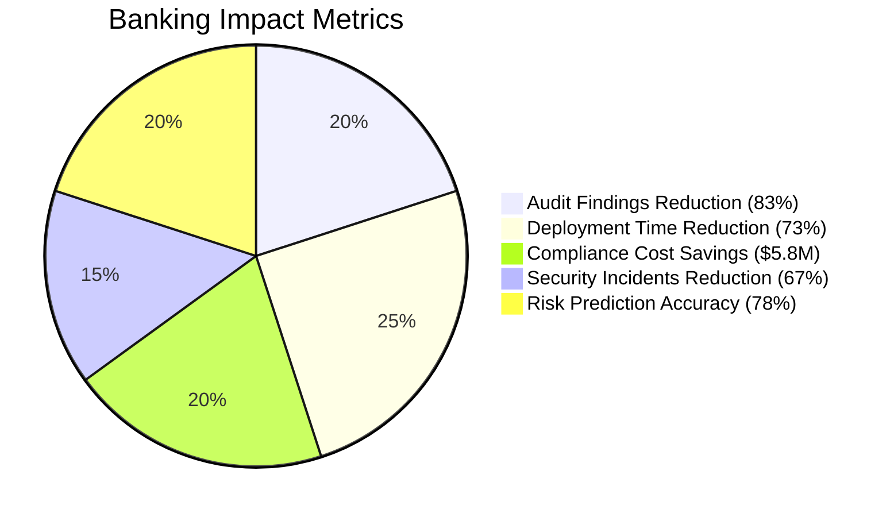

The pie chart above highlights key metrics from leading banks that showcase the tangible benefits of automation governance. These data points underscore how a strategic focus on governance not only satisfies compliance but also unlocks operational efficiencies and risk mitigation.

### Implementation Guidance

To implement effective automation governance, follow these five actionable steps. The following step-by-step diagram provides a visual representation of the process:

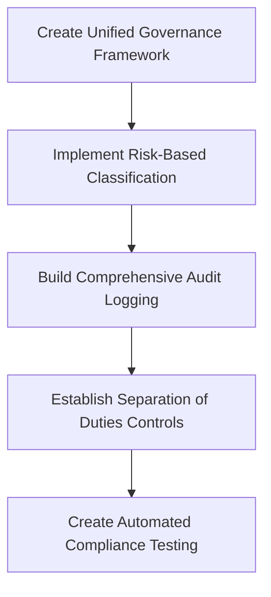

1. **Create a Unified Governance Framework**\
   Establish a cross-functional team with equal representation from engineering, security, and compliance to develop an integrated automation governance framework.

   - Document specific requirements from all three perspectives.
   - Create explicit mappings between regulatory mandates and technical controls.
   - Develop this as a reusable blueprint for all automation initiatives.

2. **Implement Risk-Based Classification**\
   Develop a structured risk assessment model for automation that classifies changes into at least three tiers based on:

   - Systems affected (criticality, data sensitivity).
   - Change scope (narrow/targeted vs. broad/systemic).
   - Business process impact (customer-facing vs. internal).
   - Transaction types involved (monetary vs. informational).\
     Create clearly documented approval workflows for each risk tier, with controls proportional to risk.

3. **Build Comprehensive Audit Logging**\
   Design a centralized, tamper-evident logging system for all automated actions that captures:

   - What action was taken (with detailed parameters).
   - Who/what initiated the action (authentication source).
   - When the action occurred (precise timestamps).
   - Why the action was taken (linking to approvals or incident tickets).
   - Before and after states (for change tracking).\
     Implement automated compliance reporting that mines this data for regulatory requirements.

4. **Establish Separation of Duties Controls**\
   Implement technical controls that enforce separation between:

   - Development and deployment environments.
   - Normal operations and emergency procedures.
   - Approval and execution permissions.\
     Design your architecture so that no single individual can develop, approve, and execute high-risk automation without appropriate checks and balances.

5. **Create Automated Compliance Testing**\
   Develop automated test suites that verify compliance requirements alongside functional testing:

   - Permission boundary tests (verify proper authorization limits).
   - Audit log validation (ensure complete activity capture).
   - Separation of duties verification (confirm control effectiveness).
   - Emergency procedure validation (test override controls).\
     Integrate these tests into CI/CD pipelines to identify compliance issues before deployment.
