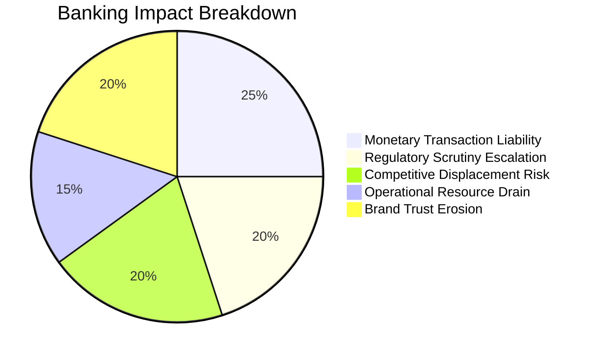
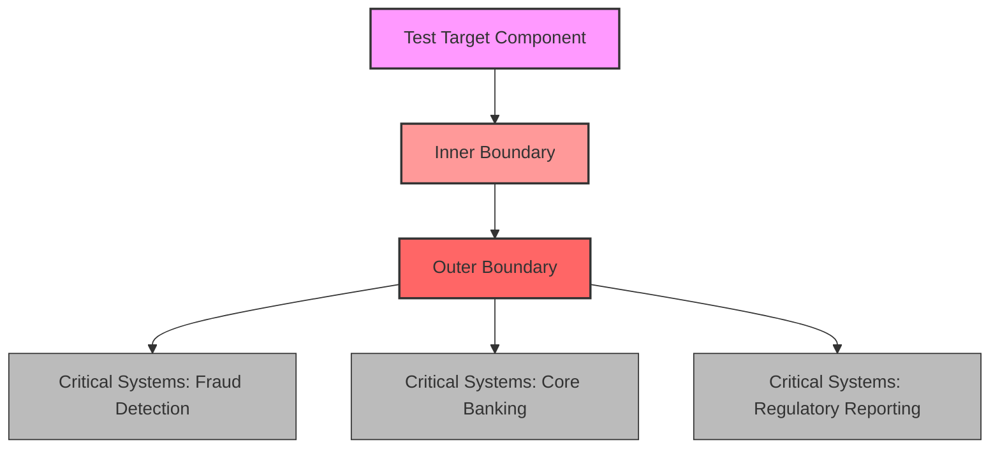
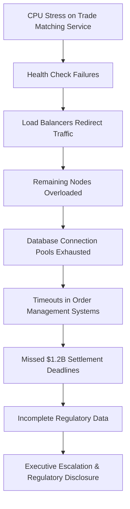
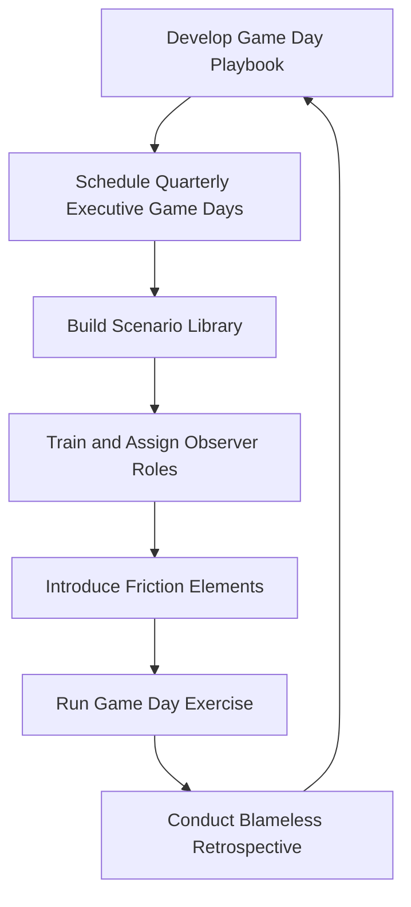
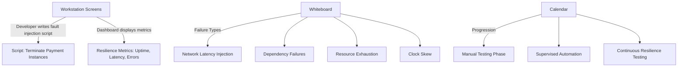
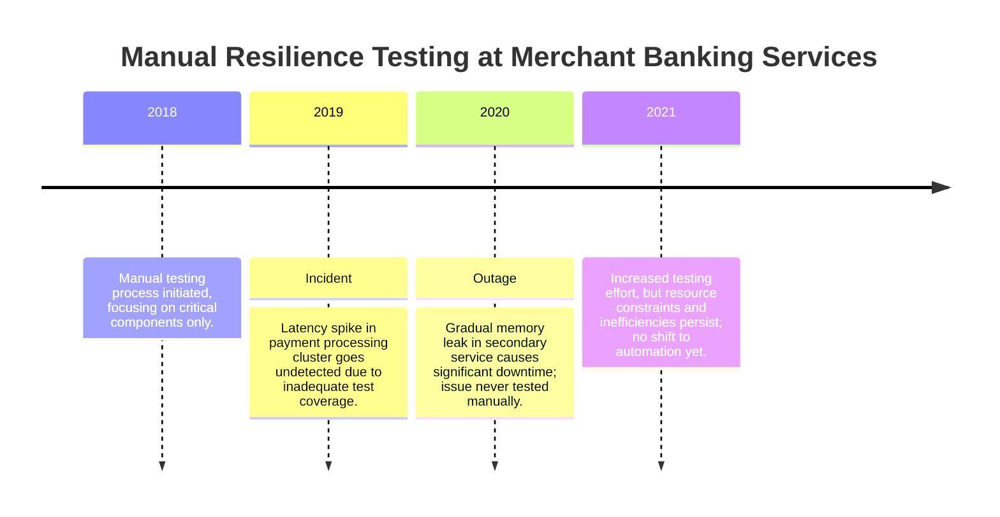
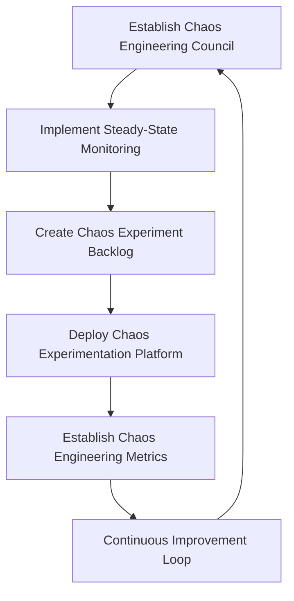

# Chapter 12: Resilience Testing in Banking Environments

## Chapter Overview

Welcome to the resilience testing chapter for banking—where the stakes aren’t just uptime, but millions of dollars, regulatory wrath, and your brand’s survival. If you think your QA regime is bulletproof because you run load tests and boast 98% code coverage, this chapter is your rude awakening. Banks don’t get to “fail fast” without headlines or compliance officers breathing down their necks. Here, resilience isn’t a box-ticking exercise. It’s a full-contact sport, played with real money and reputational blood in the water. Get ready to unlearn your safe, predictable test plans. We’re diving into deliberate sabotage, controlled chaos, and the harsh reality that most “resilient” banking systems are as fragile as a house of cards in a hurricane. And yes, we’ll show you how to fix it—if you have the backbone.

______________________________________________________________________

## Learning Objectives

- **Shift** your mindset from “avoid failure” to “engineer for inevitable disaster.”
- **Design** and **run** resilience tests that expose the gaps your QA missed—before your customers (and regulators) do.
- **Apply** evidence-based forensics to prioritize, execute, and analyze resilience tests with surgical precision.
- **Contain** the blast radius of your experiments so you don’t become the next industry cautionary tale.
- **Orchestrate** Game Days that stress-test both your infrastructure and your humans—because PagerDuty doesn’t fix communication breakdowns.
- **Automate** fault injection to move from “quarterly chaos theater” to continuous, meaningful resilience validation.
- **Operationalize** chaos engineering to discover the unknown unknowns and make your systems stronger with every test.
- **Measure** what matters: connect technical resilience to business impact, regulatory relief, and customer trust.

______________________________________________________________________

## Key Takeaways

- Traditional QA gives you a false sense of security. Your “perfect” test coverage won’t save you from complex, real-world outages.
- Resilience testing is about breaking things on purpose. If that makes you uncomfortable, banking isn’t going to get any easier for you.
- Controlled chaos isn’t reckless—it’s the only way to find out how you’ll fail before reality does it for you.
- Evidence beats anecdotes. If your resilience program is built on gut instinct or “that’s how we’ve always done it,” start budgeting for incident response overtime.
- Blast radius control is non-negotiable. One “oops” in production, and your next chaos experiment will be a regulatory audit.
- Game Days aren’t for fun—they’re for exposing the fact that your “well-documented” procedures fall apart under real pressure.
- Automated fault injection is the difference between “testing what we had time for” and “testing what actually matters.” Manual-only shops are living in the Stone Age.
- Chaos Engineering means you’re hunting for the ugly, hidden failure modes—not just validating your pretty redundancy diagrams.
- No metrics, no credibility. If you can’t tie resilience work to business results, your funding will dry up faster than a production database under memory leak.
- Regulators, executives, and customers don’t care about how hard you tried—they care about how little they notice when things go wrong. Build resilience that’s invisible to them, or be prepared to explain why you didn’t.

______________________________________________________________________

This chapter is a blueprint for SREs who want to keep their jobs and their banks out of the headlines. Ignore it at your own risk.

______________________________________________________________________

## Panel 1: The Unexpected Outage - Beyond Traditional Test Cases

### Scene Description

A banking operations center at 3:15 PM on a Friday. Multiple support engineers frantically respond to alerts as a payment processing system unexpectedly fails during peak volume. On wall-mounted displays, transaction success rates plummet from 99.9% to 42% in minutes. Katherine, a seasoned SRE, stands in front of the main dashboard looking contemplative rather than panicked, comparing the failure pattern to documentation in her hand labeled "Last Quarter's Chaos Engineering Report."

#### Event Timeline

```
3:15 PM: Alerts begin triggering in the payment processing system.
3:16 PM: Transaction success rates drop from 99.9% to 87%. Engineers start investigating.
3:18 PM: The failure snowballs, with success rates plummeting further to 42%.
3:20 PM: Katherine identifies a familiar failure pattern from past chaos engineering exercises.
3:22 PM: Engineers isolate the likely root cause and initiate mitigation steps.
```

#### Key Indicators Displayed on Dashboards

- **Transaction Success Rate:** Dropped from 99.9% to 42% in under 5 minutes.
- **Alert Count:** Spiked from normal (0-2 per minute) to over 50 per minute.
- **Processing Latency:** Increased by 300%, causing cascading delays in dependent workflows.

#### Key Observations

- Katherine's composed demeanor highlights the importance of preparation and familiarity with past failure scenarios.
- The rapid escalation from minor alerts to severe impact underscores the criticality of monitoring and quick response.

### Teaching Narrative

Resilience testing represents a fundamental shift from traditional QA testing. While conventional testing verifies that systems work as designed under ideal conditions, resilience testing deliberately introduces adverse conditions to verify systems behave acceptably under stress. For production support professionals transitioning to SRE roles, this requires a perspective change: deliberately causing controlled failures becomes a proactive defense strategy rather than something to avoid. The foundation of resilience testing is the acknowledgment that in complex distributed systems, failures are inevitable—the question is not if failures will occur, but when and how the system will respond when they do. By intentionally introducing controlled failures during planned testing windows, we can identify weaknesses, develop proper recovery mechanisms, and build confidence in our system's ability to withstand unexpected disruptions before they impact customers.

### Common Example of the Problem

First National Bank's mobile payment platform experienced a catastrophic outage during Black Friday shopping hours, processing only 42% of attempted transactions for nearly 90 minutes before full service was restored. Post-incident analysis revealed that the failure occurred due to an unexpected interaction between three conditions:

| Failure Condition                                                  | Individual Test Conducted                                 | Missed Interaction Scenario                                                 |
| ------------------------------------------------------------------ | --------------------------------------------------------- | --------------------------------------------------------------------------- |
| Transaction volume exceeded historical peaks by 35%                | Load testing at 150% of expected volume                   | Volume spike coincided with other failure triggers, amplifying the impact.  |
| Database connection pool reached its configured maximum            | Unit tests verified handling of maximum connection limits | High volume overwhelmed the connection pool, triggering cascading delays.   |
| Failover mechanism to a secondary database cluster never activated | Standard failover scenarios tested in isolation           | Failover failed to initiate under high load and pool exhaustion conditions. |

Despite rigorous traditional testing, including load testing, unit tests with 98% code coverage, and full integration testing in staging environments, this specific failure scenario was never detected. The production support team had meticulously tested all components individually and verified standard failover scenarios, but never simulated the precise combination of conditions that occurred in production.

The incident cost the bank an estimated $3.7 million in lost transaction fees, customer compensation, and emergency response costs. More significantly, social media sentiment analysis showed a 27% decrease in customer confidence scores, with many users publicly switching to competitor banking apps.

### SRE Best Practice: Evidence-Based Investigation

The most effective SRE teams approach resilience testing through systematic evidence gathering rather than intuition or anecdotes. Below are the key practices that form the foundation of an evidence-based investigation:

1. **Failure Mode and Effects Analysis (FMEA)**:

   - Conduct structured workshops to identify potential failure points.
   - Assess likelihood and impact, scoring each scenario to prioritize testing efforts.

2. **Dependency Mapping**:

   - Create comprehensive visualizations of all system dependencies.
   - Identify critical paths, single points of failure, and implicit assumptions about system behavior.

3. **Historical Incident Pattern Analysis**:

   - Mine past incidents for common patterns and unexpected system behaviors.
   - Focus on scenarios that traditional testing failed to detect, categorizing them by failure type.

4. **Recovery Path Instrumentation**:

   - Implement detailed telemetry to track recovery mechanisms.
   - Include timing metrics for each stage of recovery processes for better insight.

5. **Resilience Gap Analysis**:

   - Compare current resilience capabilities against industry benchmarks and regulatory requirements.
   - Identify specific areas where improvements would have the most significant impact.

#### Actionable Checklist: Evidence-Based Investigation

- [ ] Schedule an FMEA workshop with cross-functional teams to identify and prioritize failure scenarios.
- [ ] Develop or update system dependency maps, ensuring all critical paths and assumptions are clearly documented.
- [ ] Review historical incident data for recurring patterns and overlooked system behaviors.
- [ ] Verify recovery mechanisms are instrumented with telemetry, including detailed timing metrics.
- [ ] Conduct a resilience gap analysis to benchmark against industry standards and prioritize improvement areas.

By applying these practices, teams can transition from reactive to proactive system resilience, ensuring they are prepared for the inevitable complexities of distributed systems. For example, Morgan Stanley's adoption of this approach revealed that 78% of their most severe outages were caused by unexpected interactions between components that had been individually tested but not tested together under specific conditions.

### Banking Impact

The business consequences of inadequate resilience testing extend far beyond immediate outage costs. The following diagram summarizes the key dimensions of financial, regulatory, and customer trust impacts, along with real-world examples:



1. **Monetary Transaction Liability**: Banks face unique financial responsibility for failed transactions, with regulatory requirements to compensate customers for damages. One major bank incurred $4.2M in customer compensation costs for a single 47-minute payment processing outage.

2. **Regulatory Scrutiny Escalation**: Unexpected outages trigger regulatory reporting requirements and often lead to increased oversight. After experiencing two major trading platform disruptions, a global investment bank was placed under a regulatory consent order requiring external audits of all change management processes at an annual cost exceeding $5M.

3. **Competitive Displacement Risk**: Modern banking customers have increasingly low tolerance for unreliability. Market research indicates that 31% of customers who experience transaction failures during critical financial events will open accounts with competitor institutions within 90 days.

4. **Operational Resource Drain**: Unplanned outages create massive operational burden beyond the immediate response. One regional bank calculated that each major incident consumed over 750 person-hours in response, analysis, reporting, and remediation activities.

5. **Brand Trust Erosion**: Financial institutions depend heavily on customer trust. Sentiment analysis by J.D. Power shows that a single significant outage can reduce brand trust metrics by up to 27%, requiring 6-8 months of perfect operation to recover to baseline levels.

### Implementation Guidance

To implement effective resilience testing beyond traditional QA approaches, follow these five actionable steps:

1. **Establish a Failure Catalog**: Create a comprehensive database of potential failure scenarios drawn from historical incidents, near-misses, postmortem insights, and team brainstorming sessions. Categorize these scenarios by system component, potential impact, and likelihood. Make this catalog accessible to all engineering teams and incorporate review of relevant scenarios into all design and implementation discussions.

2. **Implement Regular Game Days**: Schedule monthly half-day "game day" exercises where a cross-functional team deliberately introduces a specific failure scenario from your catalog into a production-like environment. Rotate the scenario focus each session (network failures, database issues, third-party outages, etc.) and include representatives from all teams that would be involved in actual incident response.

3. **Deploy Failure Injection Mechanisms**: Develop controlled methods to inject failures into test and staging environments. Begin with simple scenarios like process termination and network latency, then progress to more complex failures like data corruption and race conditions. Create a standard library of failure injection tools that any team can apply to their services.

4. **Create a Resilience Scorecard**: Develop objective metrics to measure system resilience based on recovery time, degradation characteristics, and failure detection efficiency. Establish baseline measurements and set incremental improvement targets. Make these scores visible in team dashboards and review them alongside traditional reliability metrics in service reviews.

5. **Implement "Resilience Champions"**: Designate and train resilience specialists within each engineering team. These champions receive advanced training in chaos engineering principles, lead resilience testing activities, and advocate for resilience considerations during design and development. Create a cross-team community of practice where these champions share learnings and best practices monthly.

## Panel 2: Designing the Experiment - Hypothesis-Driven Failure Testing

### Scene Description

A team meeting room with whiteboard walls covered in system diagrams. Hector Alavaz leads a diverse group of engineers as they map out a banking system's critical paths. On the whiteboard, they've written:

```
HYPOTHESIS:
If the primary payment gateway experiences 30% packet loss, the automatic failover to the secondary gateway will complete within 8 seconds, preventing customer transaction timeouts.
```

Below the hypothesis, a diagram is sketched showing the system's critical components, including the primary and secondary payment gateways, with arrows indicating traffic flow. Sticky notes are placed next to specific components, identifying potential failure points like:

- "Packet loss threshold here"
- "Timeout risk here"
- "Failover trigger here"

Team members are actively annotating the diagram, discussing dependencies and risks. Meanwhile, in the corner of the room, a compliance officer reviews a document titled *Safe Testing Boundaries*, ensuring that planned tests align with regulatory standards.

Here’s a simplified text-based representation of the whiteboard setup:

```
[Client Devices] --> [Primary Payment Gateway] --> [Processing System]
                             |
                             v
                  [Secondary Payment Gateway]
```

Sticky notes are scattered around the diagram, highlighting areas of interest. The collaborative atmosphere emphasizes structured risk analysis and shared understanding of the system's behavior under stress.

### Teaching Narrative

Effective resilience testing begins with a clear hypothesis—a testable prediction about how your system will behave under specific failure conditions. This scientific approach transforms chaotic "let's break things and see what happens" into structured learning. Unlike production support's reactive troubleshooting, SRE resilience testing anticipates failure modes through carefully constructed experiments. Each hypothesis should identify: the system component being tested, the specific failure condition being introduced, the expected system behavior during failure, measurable success criteria, and potential customer impact if the system doesn't respond as expected. This hypothesis-driven approach ensures that every test has a clear purpose and measurable outcomes. For banking systems, well-formed hypotheses are particularly critical as they help demonstrate to regulatory stakeholders that resilience testing is not reckless experimentation but rather methodical risk management designed to protect customer assets and maintain service integrity.

### Common Example of the Problem

Capital Markets Bank attempted resilience testing of their bond trading platform without clear hypotheses, resulting in inconclusive results and wasted effort. Their approach consisted of:

1. The SRE team building general failure injection tools
2. Scheduling a full-day "chaos testing" session
3. Randomly selecting components to "break" during the session
4. Observing system behavior and documenting results
5. Fixing issues discovered during testing

This unstructured approach created several problems. The following table summarizes the issues and their consequences:

| **Issue**                            | **Description**                                                                | **Consequence**                                                               |
| ------------------------------------ | ------------------------------------------------------------------------------ | ----------------------------------------------------------------------------- |
| Ambiguous test results               | Results lacked clarity and were difficult to interpret                         | Reduced confidence in findings and wasted effort on inconclusive observations |
| Contradictory findings               | Some results conflicted with prior observations                                | Created confusion and undermined trust in the testing process                 |
| Testing artifacts vs. genuine issues | Unclear whether observed behaviors were due to tests or actual system problems | Impeded root cause analysis and slowed resolution                             |
| Poor documentation of findings       | Findings lacked actionable recommendations                                     | Limited the ability to prioritize and implement meaningful improvements       |
| Stakeholder skepticism               | Stakeholders questioned the value of the exercise                              | Reduced buy-in and support for future resilience testing                      |
| Compliance concerns                  | Methodology lacked rigor and transparency                                      | Raised red flags about adherence to regulatory expectations                   |

#### Checklist: Avoiding Unstructured Testing Pitfalls

To prevent similar issues, ensure resilience testing follows these guidelines:

- [ ] Define a clear hypothesis for each test, specifying:
  - The system component being tested
  - The failure condition being introduced
  - The expected system behavior and measurable success criteria
- [ ] Create a test plan to guide the experiment and ensure consistency
- [ ] Validate test results against the hypothesis to confirm their relevance
- [ ] Document findings with clear recommendations and next steps
- [ ] Communicate results to stakeholders to build consensus and confidence
- [ ] Involve compliance officers early to align testing methodology with regulations

By adopting a structured, hypothesis-driven approach, teams can avoid the inefficiencies and risks of ad hoc resilience testing and focus on meaningful improvements to system reliability.

### SRE Best Practice: Evidence-Based Investigation

Best-in-class SRE teams approach hypothesis formation through systematic evidence gathering:

1. **Incident Hypothesis Mining**: Analyzing past incidents to identify assumed system behaviors that proved incorrect, then formulating explicit hypotheses to test these assumptions under controlled conditions.

2. **Mental Model Mapping**: Conducting structured interviews with team members to document their mental models of how systems should behave under stress, identifying inconsistencies and assumptions that require validation.

3. **Fault Tree Analysis**: Creating detailed fault trees for critical failure scenarios, working backward from potential customer-impacting events to identify causal chains and formulate hypotheses for each significant branch.\
   **Example:** During a failure analysis of a payment processing system, a fault tree revealed that a delayed database replication event could cascade into transaction queuing issues, causing customer-facing timeouts. A hypothesis was formed: "If database replication delays exceed 500ms, the payment queue will exceed its maximum threshold in under 10 seconds, leading to transaction rejections." This hypothesis was tested under controlled conditions, highlighting a need for queue-size alerting and faster failover mechanisms.

4. **Recovery Path Instrumentation**: Implementing specialized monitoring that captures detailed timing and state information during recovery processes, providing quantitative baselines for hypothesis formation.

5. **Hypothesis Quality Scoring**: Evaluating proposed hypotheses against objective criteria including specificity, measurability, system coverage, and business relevance to ensure testing efforts focus on high-value experiments.

When Goldman Sachs implemented this evidence-based approach for their trading platform, they discovered that 73% of incident postmortems contained implied hypotheses about system behavior that had never been explicitly tested, creating significant resilience gaps.

### Banking Impact

The business consequences of hypothesis-driven resilience testing include measurable benefits across multiple dimensions. The table below summarizes key impacts along with relevant metrics from real-world implementations:

| **Impact Area**                | **Description**                                                              | **Example Metrics**                                                       |
| ------------------------------ | ---------------------------------------------------------------------------- | ------------------------------------------------------------------------- |
| **Regulatory Confidence**      | Satisfies stringent regulatory requirements for operational resilience.      | - 83% reduction in regulatory findings during reviews.                    |
| **Incident Prevention ROI**    | Prevents significant incidents annually, reducing outage costs.              | - $14.6M in avoided outage costs.<br>- 7-12 incidents prevented per year. |
| **Recovery Time Optimization** | Improves MTTR through targeted recovery mechanism testing.                   | - 35-60% improvement in MTTR.                                             |
| **Change Risk Reduction**      | Reduces incidents caused by system changes, enabling safer feature rollouts. | - 40-70% reduction in change-related incidents.                           |
| **Resource Optimization**      | Enhances efficiency by focusing on critical scenarios and components.        | - 62% more efficient use of testing resources.                            |

By quantifying these impacts, financial institutions can clearly articulate the value of hypothesis-driven resilience testing, both internally to stakeholders and externally to regulators. This structured approach reinforces the commitment to protecting customer assets, maintaining service integrity, and ensuring operational excellence in the banking sector.

### Implementation Guidance

To implement effective hypothesis-driven resilience testing, follow these five actionable steps:

1. **Create a Hypothesis Template**: Develop a standardized format for resilience testing hypotheses that includes: component under test, failure condition being introduced, expected behavior, success criteria, measurement method, and business impact if expectations aren't met. Create a digital repository of all hypotheses, including results and follow-up actions.

2. **Implement Hypothesis Workshops**: Conduct quarterly cross-functional workshops where engineering, operations, and business teams collaboratively develop hypotheses about system resilience. Structure these as 2-hour sessions focused on specific system areas with clear outputs: 5-10 well-formed hypotheses ready for testing.

3. **Develop a Hypothesis Prioritization Framework**: Create an objective scoring system for hypotheses based on: potential business impact, likelihood of occurrence, confidence in current understanding, and implementation complexity. Use this system to rank hypotheses and create a testing roadmap that balances quick wins with high-impact complex scenarios.

4. **Implement Peer Review Process**: Establish a structured review process where hypotheses are evaluated by engineers not involved in their creation. Train reviewers to identify unstated assumptions, ambiguous success criteria, and measurement challenges. Require all hypotheses to pass peer review before testing.

5. **Create Hypothesis-Result Feedback Loops**: After testing each hypothesis, document results in a structured format that explicitly answers: Was the hypothesis confirmed or refuted? What unexpected behaviors were observed? What assumptions need revision? What new hypotheses emerged? Review these findings in team meetings and use them to generate follow-up hypotheses for future testing.

## Panel 3: The Blast Radius - Containing the Impact of Resilience Tests

### Scene Description

A security operations center with engineers monitoring a testing dashboard. Multiple screens show real-time metrics of a banking authentication service under controlled stress. A prominently displayed diagram shows concentric circles around a "test target" component, with clearly defined boundaries highlighted in red labeled "BLAST RADIUS - DO NOT CROSS." The outermost boundary shows connections to critical systems that must remain untouched: fraud detection, core banking, and regulatory reporting. A timer counts down the remaining test window as engineers compare real-time metrics against predefined abort thresholds.

Below is a conceptual representation of the blast radius using a Mermaid diagram:



This diagram illustrates the concentric circles of the blast radius, starting with the test target at the center. The inner and outer boundaries represent layers of isolation, with critical systems positioned outside the blast radius to avoid unintended impact.

### Teaching Narrative

When transitioning from production support to SRE, one of the most challenging concepts to embrace is deliberately introducing failure into production systems. The key to doing this safely is understanding and controlling the "blast radius"—the scope of potential impact from your resilience test. Unlike isolated QA environments, resilience testing often occurs in production or production-like environments where real damage is possible. Properly containing the blast radius requires: identifying system boundaries and dependencies, establishing clear isolation mechanisms, defining explicit abort criteria, implementing real-time monitoring of impact spread, and maintaining ready rollback capabilities. Banking environments require especially careful blast radius management due to the interconnected nature of financial systems and regulatory requirements for system stability. The SRE approach differs fundamentally from production support here—instead of responding to unplanned incidents with unlimited impact, we're creating planned, limited-impact scenarios with predefined safety mechanisms. This controlled approach allows us to build resilience without creating the very outages we're trying to prevent.

### Common Example of the Problem

Investment Banking Corporation attempted their first chaos engineering exercise on their securities settlement system without proper blast radius controls, resulting in an unplanned outage that escaped the intended test boundary. Their approach consisted of:

1. Selecting the trade matching service for resilience testing
2. Scheduling a 2-hour test window during lower trading volume
3. Introducing CPU stress to the service to test degraded performance
4. Observing system behavior as load increased

Without proper blast radius controls, the test produced cascading failures:



What was intended as a controlled experiment affected critical business operations, required executive escalation, and triggered regulatory disclosure requirements. The sequence of cascading failures is summarized below:

| Failure Point                        | Impact                                              |
| ------------------------------------ | --------------------------------------------------- |
| Health check failures                | Stressed nodes became unavailable                   |
| Load balancers redirected traffic    | Increased load on remaining nodes                   |
| Overloaded nodes                     | Resource exhaustion and degraded performance        |
| Database connection pool exhaustion  | Upstream systems unable to complete transactions    |
| Timeout cascades in order management | Failed order processing and missed settlement times |
| Missed settlement deadlines          | Financial and reputational damage                   |
| Incomplete regulatory reporting      | Non-compliance and mandatory disclosure             |

The team had failed to identify key dependencies, establish containment mechanisms, or define clear abort conditions. As a result, the entire resilience testing program was suspended for six months while new controls were developed.

### SRE Best Practice: Evidence-Based Investigation

Elite SRE teams implement blast radius control through systematic evidence gathering and analysis. Below is a checklist summarizing the five key evidence-based practices to ensure safe and effective resilience testing:

#### Evidence-Based Investigation Checklist:

- [ ] **Dependency Analysis Instrumentation**\
  Deploy specialized monitoring tools to map real-time call patterns between services, uncovering undocumented dependencies that may not be evident in architecture diagrams.

- [ ] **Impact Propagation Modeling**\
  Analyze historical incident data and build models to understand how failures spread through systems, identifying high-risk pathways that require targeted containment.

- [ ] **Fault Injection Calibration**\
  Perform graduated stress tests, incrementally increasing failure pressure to measure system responses and define precise thresholds for safe testing levels.

- [ ] **Containment Mechanism Verification**\
  Test and validate isolation mechanisms such as bulkheads, circuit breakers, and rate limiters to ensure they effectively constrain failure propagation during tests.

- [ ] **Canary Analysis Automation**\
  Implement automated systems to monitor and compare control versus experimental groups during tests, immediately flagging deviations that suggest boundary breaches.

By following this checklist, SRE teams can systematically reduce the risk of unintended impact during resilience tests. For example, when Deutsche Bank adopted these practices, dependency instrumentation revealed that 31% of their critical services had undocumented dependencies. Addressing these findings prevented test-induced failures from propagating beyond their intended boundaries.

### Banking Impact

Proper blast radius control in resilience testing is critical for minimizing business consequences in the banking sector. The table below summarizes key impacts and their quantified effects:

| **Impact Area**               | **Description**                                                                         | **Quantified Impact**                                                              |
| ----------------------------- | --------------------------------------------------------------------------------------- | ---------------------------------------------------------------------------------- |
| **Regulatory Compliance**     | Prevents resilience tests from triggering mandatory regulatory reporting events.        | Estimated savings of $350,000 per quarter in compliance-related costs.             |
| **Customer Experience**       | Avoids customer-visible disruptions, reducing churn rates and maintaining trust.        | Customers are 3x more likely to switch banks after unexpected outages.             |
| **Market Risk Limitation**    | Protects trading and investment platforms from market exposure risks during testing.    | Valued at $7.3M per testing cycle based on average open position values.           |
| **Resilience Program Health** | Prevents organizational resistance due to failed tests escaping containment.            | Containment failures can delay resilience initiatives by 6-12 months.              |
| **Reputation Preservation**   | Reduces impact of technical failures on institutional reputation and public perception. | On average, 7 months required to recover from publicly visible technical failures. |

By containing the blast radius effectively, banks can conduct resilience tests safely while avoiding these costly and damaging outcomes.

### Implementation Guidance

To implement effective blast radius controls for resilience testing, follow these five actionable steps:

1. **Create Resilience Testing Zones**: Segment your architecture into explicit testing zones with defined isolation boundaries. Document these zones in architecture diagrams and configuration management systems. Classify zones based on criticality (e.g., Tier 1/2/3) and establish different testing protocols for each tier, with stricter controls for higher-criticality zones.

2. **Implement Multi-Level Kill Switches**: Deploy emergency termination capabilities at multiple levels of your testing infrastructure. Create automated kill switches that trigger based on predefined metrics (e.g., error rates exceeding 5%, latency above 300ms, queue depth beyond 1000) and manual kill switches accessible to all test observers. Test these kill switches monthly.

3. **Establish Blast Radius Monitoring**: Deploy specialized monitoring specifically for tracking blast radius containment during tests. Focus on metrics that would indicate containment breaches: unexpected traffic patterns, resource consumption in adjacent systems, and error rates in downstream services. Configure real-time alerts for these metrics during test windows.

4. **Develop a Progressive Testing Protocol**: Create a staged approach to resilience testing that gradually expands scope and impact. Begin with isolated test environments, progress to production-like staging with production data volumes, then move to limited production testing during off-peak hours, and finally conduct carefully controlled tests during normal operations. Document success criteria for advancing between stages.

5. **Create a Pre-Flight Checklist**: Develop a mandatory verification checklist that must be completed before any resilience test. Include: current system health verification, dependency confirmation, containment mechanism testing, rollback plan validation, stakeholder notification, and explicit abort criteria. Require documented sign-off on this checklist from both technical and business owners before proceeding with any test.

## Panel 4: Game Day - Orchestrating Human and Technical Responses

### Scene Description

A pre-launch review meeting for a new mobile banking feature is underway. The room setup reflects the contrast between two groups: developers eager to ship and SRE service owners conducting a thorough readiness assessment. Developers are depicted with animated expressions and "Launch Now!" mugs, while the SREs are shown with clipboards and "Reliability First" badges, emphasizing their methodical approach.

At the center of the room, a large screen displays a comprehensive readiness checklist divided into six key categories:

```plaintext
+-----------------------------+
|       Readiness Checklist   |
+-----------------------------+
| ✅ Observability            |
| ✅ Deployment Safety        |
| 🟡 Capacity Planning        |
| 🔴 Failure Modes            |
| 🟡 Data Management          |
| 🔴 Operational Procedures   |
+-----------------------------+
```

- ✅ Green: Ready
- 🟡 Amber: Requires Attention
- 🔴 Red: Critical Issue

Speech bubbles float around the room, highlighting the active dialogue. An SRE points to the "Failure Modes" category and asks, "What happens if the payment gateway timeouts increase during peak holiday shopping?" Another SRE follows up with, "How will we roll back if the feature causes unexpected database load?" These questions underscore the meticulous focus on identifying and mitigating potential risks before launch.

The scene captures the tension and collaboration required to balance the excitement of shipping with the discipline of ensuring reliability, setting the stage for a robust Game Day exercise.

### Teaching Narrative

Resilience testing is not solely about technical systems—it's equally about testing and strengthening the human response systems. Game Days are structured exercises that combine technical resilience testing with incident response rehearsal, creating a holistic view of your organization's ability to maintain service during disruptions. Unlike traditional disaster recovery tests that focus on technical failover, Game Days evaluate both systems and people under pressure. They differ significantly from the unplanned firefighting familiar to production support teams by creating safe spaces to practice response, experiment with new approaches, and deliberately strengthen institutional knowledge. The core components of an effective Game Day include: realistic scenarios based on past incidents or predicted failures, clear exercise objectives beyond just "fixing the problem," assigned observer roles to document responses, artificial constraints that challenge the team, and most importantly, a blameless retrospective to capture learnings. In banking environments, where high-pressure incident response often involves multiple teams and communication chains, Game Days are particularly valuable for building the muscle memory needed for efficient coordination during real emergencies.

### Common Example of the Problem

Eastern Trust Bank's digital banking platform experienced a severe outage during a product launch that exposed critical gaps in their incident response capabilities. Despite extensive technical testing, the organization was unprepared for the human aspects of the incident. Below is a timeline of the outage progression, highlighting key failures and their impact:

```mermaid
gantt
    title Outage Timeline - Eastern Trust Bank
    dateFormat HH:mm
    axisFormat %H:%M
    section Deployment and Initial Issues
    Feature Deployment Completed :done, 09:37, 5min
    Unexpected Load Surge Detected :active, 09:42, 10min
    Database Connections Begin Failing :crit, 09:52, 10min
    section Response Challenges
    Alerts Sent to Multiple Teams :09:52, 5min
    Uncoordinated Bridge Calls :10:00, 30min
    Contradictory Exec Updates :10:30, 15min
    Incorrect Customer Service Info :10:45, 30min
    section Resolution Attempts
    Rollback Identified :done, 10:07, 5min
    Rollback Procedures Fail :crit, 10:12, 10min
    Incident Fully Resolved :done, 14:25, 4hr 13min
```



**Key Sequence of Events:**

1. The incident began at 9:37 AM when a new mobile check deposit feature was deployed.
2. Transaction volumes quickly exceeded capacity projections by 340%.
3. Database connections began failing under the unexpected load.
4. Multiple teams received different alerts without coordination.
5. Three separate bridge calls formed without awareness of each other.
6. Executives received contradictory status updates.
7. Customer service provided incorrect information to customers.
8. Rollback procedures failed due to configuration errors.
9. The incident lasted 4.7 hours despite a technical fix being identified within 25 minutes.

**Post-Incident Analysis:**
While individual components functioned as designed under stress, the human response systems failed catastrophically. Teams had never practiced coordinated response to complex scenarios, resulting in communication breakdowns, delayed decisions, and ineffective recovery actions. Despite having talented engineers and robust technical systems, the organization's inability to orchestrate a unified response compounded the incident's duration and impact.

### SRE Best Practice: Evidence-Based Investigation

Elite SRE organizations prepare for effective Game Days through systematic evidence gathering. The following table summarizes five key evidence-based practices and their benefits to improve incident response and organizational resilience:

| Practice                              | Description                                                                                                                                                                   | Benefits                                                                                      |
| ------------------------------------- | ----------------------------------------------------------------------------------------------------------------------------------------------------------------------------- | --------------------------------------------------------------------------------------------- |
| **Incident Response Observation**     | Deploy trained observers during incidents to document communication patterns, decision points, information flows, and coordination challenges not captured in technical logs. | Identifies hidden coordination issues and areas for process improvement.                      |
| **Decision Latency Analysis**         | Measure the time between when information becomes available and when decisions are made during incidents. Identify factors causing delays in effective response.              | Reduces response times by addressing bottlenecks in decision-making processes.                |
| **Communication Pattern Mapping**     | Record and analyze communication during incidents to uncover information silos, repeated questions, contradictory understandings, and coordination failures.                  | Enhances cross-team communication and reduces misunderstandings during high-pressure events.  |
| **Knowledge Distribution Assessment** | Test how effectively critical system knowledge is distributed across team members through structured interviews and scenario evaluations.                                     | Ensures more team members can respond effectively, reducing reliance on specific individuals. |
| **Scenario Realism Validation**       | Compare proposed Game Day scenarios to historical incidents to ensure exercises reflect real-world complexity, ambiguity, and pressure.                                       | Improves the accuracy and relevance of training scenarios, increasing preparedness.           |

**Case Study:** When HSBC implemented these evidence-based approaches to Game Day design, analysis revealed that 64% of their extended outages were caused primarily by human coordination failures rather than technical recovery challenges. This insight transformed their resilience program by shifting focus toward improving cross-team collaboration and decision-making efficiency.

### Banking Impact

The business consequences of effective Game Day exercises extend throughout the organization, delivering measurable improvements across critical operational and strategic areas. Below is a summary of key impacts, supported by quantitative data:

#### Incident Duration Reduction

- Financial institutions implementing regular Game Days report **40-65% reductions** in mean time to resolution for complex incidents.
- Example: One major bank reduced average outage duration from **3.2 hours to 68 minutes** after implementing quarterly exercises.

#### Regulatory Compliance Enhancement

- Well-documented Game Day programs satisfy increasingly stringent regulatory requirements for operational resilience testing.
- Banks with robust exercise documentation have achieved a **70-90% reduction** in regulatory findings related to incident response and readiness.

#### Customer Impact Minimization

- Improved response coordination leads to fewer customer-visible effects during incidents.
- Example: A retail bank documented a **57% reduction** in customer-impacting minutes despite no change in underlying incident frequency.

#### Cross-Team Coordination Improvement

- Regular Game Days foster collaboration across previously siloed teams, enhancing both incident response and routine operations.
- Measurable improvements in collaboration extend to project delivery timelines and daily operational efficiency.

#### Reputation Protection Value

- Faster incident resolution preserves brand reputation, reducing negative customer sentiment.
- Analysis shows incidents resolved in under **60 minutes generate 85% fewer negative social media mentions** compared to those exceeding 3 hours.

#### Visualizing the Impact

The following bar chart summarizes the key quantitative benefits of Game Day exercises:

```mermaid
%% Mermaid Bar Chart
bar
    title Banking Impact Metrics
    x-axis Metrics
    y-axis Improvement Percentage
    "Incident Duration Reduction" : 65
    "Regulatory Findings Reduction" : 90
    "Customer-Impacting Minutes Reduction" : 57
    "Reputation Protection (Fewer Negative Mentions)" : 85
```

### Implementation Guidance

To implement effective Game Day exercises, follow these five actionable steps. Use the checklist below to ensure you cover all critical components:

#### Game Day Implementation Checklist

1. **Develop a Game Day Playbook**

   - [ ] Create a standardized template for planning resilience exercises.
   - [ ] Include sections for:
     - Scenario design.
     - Roles and responsibilities.
     - Communication channels.
     - Success criteria.
     - Retrospective processes.
   - [ ] Ensure the playbook is accessible and reusable across teams.

2. **Implement Quarterly Executive Game Days**

   - [ ] Schedule quarterly sessions with executive stakeholders and technical teams.
   - [ ] Focus on high-impact scenarios testing:
     - Communication flows between leadership and technical teams.
     - Decision-making under pressure.
     - External communication strategies.
   - [ ] Limit sessions to 3 hours with clearly defined objectives.

3. **Create a Scenario Library**

   - [ ] Develop a collection of at least 20 realistic incident scenarios.
   - [ ] Base scenarios on:
     - Historical incidents.
     - Near misses.
     - Identified risks.
   - [ ] Include for each scenario:
     - Detailed technical injection plans.
     - Expected timeline.
     - Specific learning objectives.
   - [ ] Maintain and rotate scenarios regularly in the exercise program.

4. **Establish Dedicated Observer Roles**

   - [ ] Train team members to act as observers during exercises.
   - [ ] Use a structured observation template to document:
     - Communication patterns.
     - Decision points.
     - Information flows.
     - Team dynamics.
   - [ ] Focus observations on human factors rather than technical details.
   - [ ] Rotate observer roles to build observation skills organization-wide.

5. **Implement "Friction Injection"**

   - [ ] Introduce realistic organizational challenges, such as:
     - Key personnel being unavailable.
     - Communication tools failing.
     - Incomplete or contradictory information.
     - Intense time pressure.
   - [ ] Document friction elements explicitly in scenario plans.
   - [ ] Track team adaptation to these challenges during exercises.

#### Game Day Workflow Diagram



By following this checklist and workflow, teams can systematically plan, execute, and learn from Game Day exercises, ensuring both technical and human systems are resilient under pressure.

## Panel 5: Fault Injection - Moving from Manual to Automated Resilience Testing

### Scene Description

A software development environment is depicted, showcasing the transition from manual to automated resilience testing. The setup includes the following key elements:

1. **Workstation Screens**:

   - One screen displays a developer actively writing a script to randomly terminate instances in the payment processing cluster.
   - Another screen shows a live dashboard monitoring resilience metrics, such as system uptime, latency, and error rates, during automated tests.

2. **Whiteboard**:

   - A whiteboard lists the different failure types being programmed:
     - **Network Latency Injection**
     - **Dependency Failures**
     - **Resource Exhaustion**
     - **Clock Skew**

3. **Calendar**:

   - A calendar outlines the progression of testing phases:
     - **Manual Testing Phase**
     - **Supervised Automation**
     - **Continuous Resilience Testing**

Below is a diagram representing the environment:



This environment visually captures the interplay between manual scripting, automated monitoring, and the evolving mindset from manual resilience testing to continuous fault injection practices.

### Teaching Narrative

As SRE practices mature, resilience testing evolves from manual, human-orchestrated exercises to automated, programmatic fault injection. This progression represents a key difference between traditional production support approaches and modern SRE: the systematic codification of failure testing. Fault injection frameworks allow teams to introduce precisely controlled failure conditions into systems through code rather than manual intervention. These frameworks typically implement various failure modes: network partition and degradation, service dependency failures, resource exhaustion, state corruption, or timing and clock issues. The automation of resilience testing brings several advantages: increased testing frequency, more consistent test execution, reduced human error, precise control over failure conditions, and the ability to integrate resilience testing into CI/CD pipelines. For banking systems, automated fault injection enables more thorough testing while actually reducing risk through increased precision and control. This approach allows teams to shift from infrequent, large-scale resilience tests to continuous verification of resilience properties—much like the shift from quarterly manual penetration testing to continuous security scanning.

### Common Example of the Problem

Merchant Banking Services struggled with inconsistent, labor-intensive resilience testing for their card processing platform. Their manual approach created several challenges, leading to inefficiencies and gaps in coverage. The table below summarizes these challenges, their corresponding impacts, and an illustrative example:

| **Challenge**                                   | **Impact**                                                       | **Example**                                                                                     |
| ----------------------------------------------- | ---------------------------------------------------------------- | ----------------------------------------------------------------------------------------------- |
| Infrequent testing due to extensive preparation | Limited ability to detect issues early                           | Testing was limited to once per quarter, delaying identification of critical vulnerabilities.   |
| High resource requirements                      | Significant operational overhead                                 | Each test consumed 8-12 engineers and ~400 person-hours, reducing availability for other tasks. |
| Variability in test execution                   | Inconsistent test results and reduced reliability of findings    | Results varied based on who performed specific actions.                                         |
| Poor documentation                              | Lack of repeatability and difficulty in post-test analysis       | Procedures and results were inconsistently recorded, complicating incident investigations.      |
| Limited test coverage                           | Failure to detect issues in non-critical or secondary components | Subtle issues like memory leaks in secondary services were overlooked.                          |
| Difficulty simulating nuanced failure modes     | Inability to replicate real-world conditions                     | Scenarios like latency spikes or partial degradations were not tested effectively.              |
| Lack of reproducibility                         | Challenges in verifying and improving resilience over time       | Test scenarios could not be reliably reproduced for iterative improvements.                     |

#### Timeline of Key Events



Despite significant investment, the manual nature of their testing program meant coverage remained limited. For example, when a major outage occurred due to a gradual memory leak in a secondary service, post-incident analysis revealed this component had never been included in resilience testing because it wasn't considered "critical enough" to warrant the limited testing resources. The organization found themselves in a paradoxical situation: they couldn't test everything manually but couldn't determine what to prioritize without more comprehensive testing.

### SRE Best Practice: Evidence-Based Investigation

Organizations implementing automated fault injection follow evidence-based approaches to ensure robust and precise resilience testing. The following checklist provides a practical guide for applying these best practices:

#### Checklist: Steps for Evidence-Based Fault Injection

1. **Failure Mode Cataloging**

   - Document all observed and theoretical failure modes across systems.
   - Create a centralized database as the foundation for fault injection scenarios.
   - Regularly update the catalog to reflect new insights and incident learnings.

2. **Failure Signal Analysis**

   - Analyze telemetry data from past incidents to identify key failure signatures.
   - Ensure fault injection simulates real-world failure patterns, including subtle degradation and cascading effects.
   - Validate that injected failures align with actual production behaviors.

3. **Progressive Automation Assessment**

   - Identify manual testing activities suitable for automation, starting with high-frequency, highly reproducible tests.
   - Prioritize automation efforts based on safety, complexity, and value to resilience goals.
   - Pilot automation in low-risk environments before scaling.

4. **Blast Radius Verification**

   - Instrument systems to monitor and enforce blast radius boundaries during fault injection.
   - Validate isolation mechanisms to prevent unintended cross-system impacts.
   - Establish automated safeguards for containment testing.

5. **Fault Coverage Measurement**

   - Define metrics to measure the percentage of failure modes covered by automated tests.
   - Track coverage over time to identify gaps and prioritize new fault injection scenarios.
   - Use coverage metrics as a key quality indicator for resilience testing programs.

#### Example: American Express Case Study

When American Express applied these evidence-based practices, they found that manual testing covered only 23% of historically observed failure modes. By transitioning to automated fault injection, they safely increased coverage to over 70%, significantly enhancing their system's resilience.

#### Text-Based Workflow for Implementation

```text
[Start]
   |
   v
[Catalog Failure Modes]
   |
   v
[Analyze Failure Signals]
   |
   v
[Evaluate Automation Potential] --> [Pilot Testing in Low-Risk Areas]
   |
   v
[Verify Blast Radius Isolation] --> [Implement Instrumentation]
   |
   v
[Measure Fault Coverage] --> [Track & Improve Over Time]
   |
   v
[Continuous Resilience Testing]
   |
[End]
```

This structured approach helps teams ensure that their automated fault injection efforts are methodical, measurable, and aligned with real-world system behaviors.

### Banking Impact

Automated fault injection has had transformative impacts on banking systems by enhancing resilience, reducing operational overhead, and accelerating innovation. The table below highlights key metrics comparing resilience testing outcomes before and after automation across major banking institutions:

| Metric                                 | Before Automation                                                               | After Automation                                                                            | Example Bank    |
| -------------------------------------- | ------------------------------------------------------------------------------- | ------------------------------------------------------------------------------------------- | --------------- |
| **Resilience Coverage**                | Limited to common failure scenarios, often based on manual prioritization.      | Comprehensive testing across 5.7x more failure modes.                                       | Goldman Sachs   |
| **Reproducibility for Verification**   | Inconsistent reproduction of failure scenarios, reliant on manual execution.    | Consistent and precise scenario reproduction enabling 94% reduction in recurring incidents. | JP Morgan Chase |
| **Operational Burden**                 | High engineering hours required for infrequent tests.                           | 83% reduction in testing-related engineering hours with a 400% increase in test frequency.  | Citibank        |
| **Release Cycles**                     | Longer release cycles due to high deployment risk and manual resilience checks. | 42% faster feature deployments with automated pre-deployment resilience testing.            | Bank of America |
| **Preemptive Vulnerability Detection** | Vulnerabilities often detected only after incidents occur.                      | 68% reduction in severity-1 incidents due to early detection of resilience gaps.            | Wells Fargo     |

This shift from manual to automated resilience testing has enabled banking institutions to adopt a proactive approach to resilience engineering. By integrating fault injection into CI/CD pipelines, banks can continuously verify resilience properties, reduce risk, and maintain high availability while accelerating innovation.

### Implementation Guidance

To implement effective automated fault injection testing, follow these five actionable steps:

1. **Build a Fault Injection Library**: Develop a collection of reusable fault injection components for common failure types in banking systems. Start with the most frequently observed issues: network latency, API timeouts, resource exhaustion, and dependency failures. Create well-documented, parameterized modules that can be used across different services. Implement proper validation to ensure each injection method works as expected.

2. **Implement Progressive Deployment**: Roll out automated fault injection in phases, beginning with non-critical services in test environments, then progressing to staging environments with production-like loads, and finally to controlled production testing. Document clear criteria for advancing between phases, including success metrics and safety verification requirements.

3. **Create Fault Injection as Code**: Implement infrastructure-as-code approaches for resilience testing, where fault scenarios are defined in version-controlled configuration files. These should specify what failures to inject, timing parameters, target scope, abort conditions, and expected behavior. This approach ensures reproducibility and allows peer review of test scenarios. Below is an example of a fault injection scenario defined using code:

   ```yaml
   # fault-injection-scenario.yaml
   scenario_name: "Simulate Network Latency"
   failures:
     - type: "network_latency"
       target: "payment-service"
       parameters:
         delay_ms: 500
         jitter_ms: 100
         packet_loss_percent: 5
   timing:
     start_after: "5s"
     duration: "1m"
   scope:
     environment: "staging"
     instances: 50%
   abort_conditions:
     - error_rate_exceeds: 2%
     - recovery_time_exceeds: "30s"
   expected_behavior:
     - "Service maintains successful transaction rate above 98%."
     - "Error budget impact remains within acceptable thresholds."
   ```

   This YAML file defines a fault injection scenario that introduces controlled network latency to 50% of instances in the payment service within a staging environment. Abort conditions and expected behaviors are explicitly stated to ensure precise control and reproducibility.

4. **Integrate with CI/CD Pipelines**: Add automated resilience verification to your deployment process. Implement pre-promotion gates that automatically test new code against common failure scenarios before allowing deployment to production. Start with basic tests (service restarts, dependency failures) and gradually expand to more complex scenarios. For example, you can use a CI/CD pipeline configuration file to trigger fault injection tests:

   ```yaml
   # ci-cd-pipeline.yaml
   stages:
     - name: "Test Resilience"
       steps:
         - run: "inject-fault --config fault-injection-scenario.yaml"
         - run: "verify-resilience-metrics --thresholds thresholds.json"
   ```

   This pipeline ensures that resilience tests are an integral part of the deployment process, preventing unstable code from reaching production.

5. **Establish Continuous Resilience Monitoring**: Deploy specialized dashboards that track resilience metrics over time: recovery time from injected failures, error budget impact, detection time for artificial issues, and failure response consistency. Use these metrics to identify resilience degradation early, similar to performance regression testing. Below is a simple ASCII representation of a resilience monitoring workflow:

   ```
   +-------------------+       Inject Faults
   | Resilience Tests  | -------------------+
   +-------------------+                    |
             |                              v
             |                    +-------------------+
             +------------------> | Monitoring System |
                                  +-------------------+
                                             |
                                             v
                                  +---------------------+
                                  | Resilience Metrics  |
                                  | Dashboard           |
                                  +---------------------+
   ```

   Ensure the monitoring system collects and visualizes data in real-time, enabling quick identification and remediation of resilience issues.

## Panel 6: Chaos Engineering - Building Antifragile Banking Systems

### Scene Description

An engineering team's workspace is depicted with a collaborative and dynamic atmosphere. At the center of the scene is a large wall display showcasing the architecture of a new digital banking platform. The architecture diagram is annotated with detailed post-it notes, marking components that have been hardened through previous chaos experiments. Metrics accompany these annotations, illustrating improved recovery times and other resilience gains achieved over iterative testing.

Surrounding the display are posters emphasizing key concepts such as "Principles of Chaos Engineering" and "Antifragility in Financial Systems," serving as constant reminders of the team's mission. Engineers are gathered around a table, deeply engaged in analyzing the results of automated chaos experiments that ran overnight. A report summary highlights unexpected resilience gaps in seemingly redundant systems, sparking discussions on areas requiring further testing and improvement.

Below is a simplified textual representation of the architecture diagram and its annotations:

```
+--------------------------+
|  Digital Banking System  |
+--------------------------+
         |
         | [Service A]  <--- "Hardened: Recovery time improved by 20%"
         |
         +--> [Service B]  <--- "New gap detected: Latency spike under load"
         |
         +--> [Service C]  <--- "Hardened: Dependency redundancy validated"
         |
         +--> [Service D]  <--- "Pending experiment: Simulate regional outage"
```

This combination of visualization, metrics, and collaborative review highlights the iterative nature of Chaos Engineering in building antifragile financial systems.

### Teaching Narrative

Chaos Engineering represents the most advanced form of resilience testing, moving beyond verification of known recovery mechanisms to discover unknown weaknesses. While traditional resilience testing confirms that systems respond to anticipated failures as expected, Chaos Engineering introduces more unpredictable failure patterns to uncover systemic weaknesses and hidden dependencies. This approach embodies a key SRE principle that production support professionals must embrace: complex systems have failure modes that cannot all be predicted and must be discovered through experimentation. The goal of Chaos Engineering is not just resilience but antifragility—the property of systems that get stronger when stressed. In banking environments, where stability is paramount, Chaos Engineering must be approached carefully, with a focus on building deep system understanding rather than creating chaos for its own sake. The practice builds upon other resilience testing methods with additional elements: extended steady-state monitoring to establish baseline behavior, randomized variable injection to simulate real-world unpredictability, and experiment automation that can safely run without constant human supervision. For financial institutions, Chaos Engineering offers a path to convert brittle, failure-prone systems into robust platforms that maintain stability even during unexpected events.

### Common Example of the Problem

Digital Banking Corporation discovered fundamental resilience flaws in their new mobile platform despite extensive traditional testing. Their architecture included redundant components designed for high availability:

1. Load-balanced application servers across three availability zones
2. Primary and secondary database clusters with automatic failover
3. Multiple payment gateway integrations with fallback routing
4. Redundant authentication services with hot standby
5. Auto-scaling infrastructure for handling demand spikes

Traditional disaster recovery testing validated that each redundant component functioned correctly when tested individually. However, when a regional cloud outage affected multiple services simultaneously, the platform experienced a complete failure despite its supposedly resilient design. Post-incident analysis revealed several unexpected weaknesses:

- Authentication failover worked correctly but increased latency by 700ms
- The increased authentication latency triggered timeouts in transaction processing
- Timeout errors filled application logs, obscuring the root cause
- Monitoring systems showed individual components as "green" despite end-to-end failures
- Recovery procedures conflicted with each other when executed simultaneously

These complex interactions between supposedly independent systems remained undiscovered until a real incident because no testing had explored scenario combinations or sought to identify unknown vulnerabilities. The organization realized they had built redundancy without true resilience.

#### Architecture and Failure Analysis Table

| **Component**                     | **Designed Resilience**                          | **Failure Observed**                                  | **Impact**                                                  |
| --------------------------------- | ------------------------------------------------ | ----------------------------------------------------- | ----------------------------------------------------------- |
| Load-balanced application servers | Distribute load across three availability zones  | Regional outage led to cascading failures             | Complete failure of user-facing services                    |
| Authentication services           | Redundant with hot standby                       | Failover increased latency by 700ms                   | Triggered transaction timeouts and degraded user experience |
| Database clusters                 | Automatic failover between primary and secondary | Failover functioned but caused write delays           | Slowed critical operations such as payment processing       |
| Payment gateway integrations      | Multiple gateways with fallback routing          | Gateway fallback introduced variable processing times | Inconsistent transaction success rates                      |
| Monitoring systems                | Individual component health checks               | Reported "green" despite end-to-end failure           | Misleading signals delayed root cause identification        |
| Recovery procedures               | Documented and pre-tested                        | Conflicts during simultaneous execution               | Prolonged downtime and further destabilization              |

#### High-Level Failure Flow Diagram

```mermaid
flowchart TD
    A[Regional Cloud Outage] --> B[Authentication Failover]
    B --> C[Increased Latency (+700ms)]
    C --> D[Transaction Timeouts]
    D --> E[Filled Application Logs]
    E --> F[Root Cause Obscured]
    D --> G[Monitoring Reports "Green"]
    F --> H[Delayed Incident Response]
    G --> H
    H --> I[Complete Platform Failure]
```

This example highlights the need for Chaos Engineering to test not just individual component failures but also interactions between components under complex, unpredictable conditions. By simulating real-world scenarios, organizations can uncover hidden dependencies and design systems that are truly resilient rather than superficially redundant.

### SRE Best Practice: Evidence-Based Investigation

Organizations implementing mature Chaos Engineering practices follow evidence-based approaches to uncover hidden vulnerabilities and improve system resilience. The following checklist summarizes the key steps and their outcomes:

| **Step**                                       | **Description**                                                                                                                                               | **Outcome**                                                                                     |
| ---------------------------------------------- | ------------------------------------------------------------------------------------------------------------------------------------------------------------- | ----------------------------------------------------------------------------------------------- |
| **1. Steady State Pattern Analysis**           | Collect extended baseline measurements of normal system behavior across hundreds of metrics to define "healthy" operation and detect subtle degradations.     | Well-defined system health baselines and early detection of small anomalies.                    |
| **2. Systemic Vulnerability Mapping**          | Apply complex systems theory and accident analysis techniques to identify emergent behaviors and interaction points invisible in component-level testing.     | Identification of hidden systemic vulnerabilities and interaction risks.                        |
| **3. Hypothesis Disprove Models**              | Construct experiments to challenge assumptions by attempting to disprove rather than confirm beliefs about system resilience.                                 | Discovery of overlooked failure modes and confirmation or refutation of resilience assumptions. |
| **4. Recovery Pattern Analysis**               | Measure and categorize how systems recover from perturbations, analyzing recovery shapes (e.g., immediate, oscillating, degraded) for architectural insights. | Improved understanding of recovery dynamics and architectural weaknesses.                       |
| **5. Randomized Testing Efficacy Measurement** | Compare structured vs. randomized testing to measure the discovery rate of "unknown unknowns" across different chaos strategies.                              | Quantifiable insights into the effectiveness of various chaos testing methods.                  |

#### Practical Example: Netflix's Evidence-Based Chaos Engineering

Netflix implemented these evidence-based practices and found that **47%** of their most significant resilience improvements addressed issues not predicted in initial planning but revealed through systematic chaos experimentation. This underscores the critical importance of evidence-based investigation in building antifragile systems.

### Banking Impact

The business consequences of mature Chaos Engineering programs include:

1. **Unknown Vulnerability Discovery**\
   Chaos Engineering regularly identifies critical vulnerabilities missed by traditional testing.\
   Example: Capital One reported that 38% of their highest-severity resilience issues were discovered exclusively through chaos experiments.

   ```mermaid
   pie title Vulnerabilities Discovered Through Chaos Engineering
   "Traditional Testing": 62
   "Chaos Experiments": 38
   ```

2. **Recovery Time Improvement**\
   Systems subjected to regular chaos testing show significantly faster recovery from real incidents.\
   Example: HSBC documented a 72% reduction in mean time to recovery (MTTR) across services in their chaos program.

   ```mermaid
   bar
   title MTTR Reduction with Chaos Testing
   "Before Chaos Testing" : 100
   "After Chaos Testing" : 28
   ```

3. **Confidence-Driven Innovation**\
   Enhanced resilience verification enables more rapid innovation.\
   Example: TD Bank increased deployment frequency by 340% after implementing comprehensive chaos testing while simultaneously reducing incident rates.

   ```mermaid
   bar
   title Deployment Frequency Increase with Chaos Testing
   "Before Chaos Testing" : 100
   "After Chaos Testing" : 440
   ```

4. **Operational Cost Reduction**\
   Despite investment in chaos capabilities, the overall operational cost typically decreases.\
   Example: Barclays reported a 47% reduction in incident-related expenses within 18 months of implementation.

   ```mermaid
   pie title Reduction in Incident-Related Expenses
   "Incident Costs Before Chaos Testing": 53
   "Savings from Chaos Testing": 47
   ```

5. **Resilience Differentiation**\
   Leading banks are beginning to market their chaos-verified resilience as a customer benefit.\
   Example: Research shows that 63% of corporate banking customers now consider technical resilience a top-three selection criterion.

   ```mermaid
   pie title Customer Priorities for Bank Selection
   "Technical Resilience": 63
   "Other Factors": 37
   ```

### Implementation Guidance

To implement effective Chaos Engineering practices, follow this step-by-step checklist designed to ensure systematic adoption and execution:

______________________________________________________________________

#### **Step-by-Step Checklist for Chaos Engineering Implementation**

1. **Establish a Chaos Engineering Council**

   - [ ] Form a cross-functional team with representatives from:
     - Platform Engineering
     - Application Development
     - Security
     - Compliance
     - Business Units
   - [ ] Define team responsibilities: chaos strategy, experiment design, and safety oversight.
   - [ ] Schedule biweekly meetings to:
     - Review experiment results.
     - Prioritize future chaos initiatives based on business risk and customer impact.

2. **Implement Steady-State Monitoring**

   - [ ] Deploy monitoring tools to track critical services' steady-state behavior.
   - [ ] Capture at least four weeks of normal operation data with high granularity.
   - [ ] Use statistical methods to:
     - Define "normal" ranges for key metrics.
     - Establish baselines for experiment validation.

3. **Create a Chaos Experiment Backlog**

   - [ ] Develop a prioritized list of chaos experiments by considering:
     - Business risk.
     - Architectural assumptions.
     - Historical incidents.
   - [ ] For each experiment, document:
     - Clear hypothesis.
     - Scope definition.
     - Steady-state validation methods.
     - Abort criteria.
   - [ ] Estimate business impact for each experiment outcome to aid prioritization.

4. **Deploy a Chaos Experimentation Platform**

   - [ ] Implement a platform capable of:
     - Experiment scheduling.
     - Blast radius enforcement.
     - Automated abort logic.
     - Result recording.
     - Integration with observability tools.
   - [ ] Start with controlled, time-limited experiments before progressing to continuous chaos testing.

5. **Establish Chaos Engineering Metrics**

   - [ ] Define metrics to evaluate program effectiveness, such as:
     - Vulnerability discovery rate.
     - Mean time to recovery (MTTR) improvement.
     - Incident frequency reduction.
     - Recovery automation coverage.
   - [ ] Review metrics quarterly with leadership to:
     - Assess progress.
     - Justify continued investment in chaos engineering.

______________________________________________________________________

#### **Process Overview Diagram**



Use this checklist and iterative diagram to guide your organization's Chaos Engineering journey, ensuring alignment with business goals and operational safety.

## Panel 7: Resilience Testing Metrics - Measuring Improvement Over Time

### Scene Description

A quarterly review meeting where an SRE team presents results from their resilience testing program to executive stakeholders. Slides show year-over-year improvements in key resilience metrics, summarized as follows:

| Metric                                | Before Program Implementation | After Program Implementation | Improvement       |
| ------------------------------------- | ----------------------------- | ---------------------------- | ----------------- |
| Mean Time to Detect Critical Failures | 12 min                        | 3 min                        | 75% Faster        |
| Regional Failover Success Rate        | 82%                           | 99.8%                        | Near-Perfect Rate |
| Dependency Failure Recovery           | 17 min                        | 4 min                        | 76% Faster        |
| Game Day Mean Time to Repair          | 52 min                        | 14 min                       | 73% Faster        |
| Unexpected Production Incidents       | 24                            | 7                            | 70% Reduction     |

The most prominent metric, "Unexpected Production Incidents," highlights a 70% reduction after resilience program implementation. Banking executives are nodding approvingly while reviewing a document titled "Resilience Testing ROI: Customer Trust and Regulatory Compliance."

### Teaching Narrative

A mature resilience testing program requires meaningful metrics to guide improvement and demonstrate value. The transition from production support to SRE involves a shift from measuring reactive response (MTTR, incident counts) to measuring proactive resilience (recovery success rates, fault tolerance thresholds). Effective resilience metrics focus on both the technical system capabilities and the human response systems. Key categories include: direct resilience measurements (recovery time, failure detection speed, graceful degradation effectiveness), program effectiveness metrics (number of weaknesses identified, percentage of critical paths tested), and business impact indicators (prevented incidents, customer impact avoided, compliance requirements satisfied). Financial institutions face unique challenges in measuring resilience, as many benefits are counterfactual—incidents that never happened because weaknesses were proactively addressed. The most compelling resilience metrics for banking leaders often combine technical measurements with business outcomes: reduced fraud loss during degraded operations, maintained transaction throughput during regional failures, or compliance posture improvements recognized by regulators. By systematically tracking these metrics over time, SRE teams can demonstrate how intentional resilience testing transforms reactive incident management into proactive risk reduction—a critical narrative when justifying investment in resilience programs to banking executives and regulatory stakeholders.

### Common Example of the Problem

Global Financial Group struggled to maintain executive support for their resilience testing program due to inadequate metrics. Their approach featured several critical flaws:

1. **Focusing exclusively on activity metrics rather than outcomes:**

   - Number of resilience tests performed
   - Engineer hours spent on testing activities
   - Components covered by testing
   - Test scenarios executed

2. **Failing to connect testing to business impact:**

   - No tracking of incidents prevented
   - No measurement of recovery improvements
   - No correlation with customer experience
   - No quantification of regulatory benefits

3. **Treating all metrics with equal importance:**

   - Presenting dozens of technical metrics without prioritization
   - Not highlighting key indicators for executive attention
   - Mixing leading and lagging indicators without distinction

#### Checklist: Avoiding Common Pitfalls in Resilience Metrics

Use the following checklist to ensure your resilience testing metrics are impactful and aligned with business goals:

- [ ] Are your metrics focused on **outcomes**, not just activities?\
  *(e.g., recovery time improvements, failure detection speed, incidents prevented)*
- [ ] Do your metrics clearly demonstrate **business impact**?\
  *(e.g., customer trust, regulatory compliance, operational continuity during failures)*
- [ ] Have you prioritized **key metrics** that resonate with executive stakeholders?\
  *(e.g., reduced unexpected incidents, regional failover success rate)*
- [ ] Are you balancing **leading indicators** (proactive signals) and **lagging indicators** (results-based measurements)?
- [ ] Can your metrics tell a compelling story of progress and ROI over time?\
  *(e.g., year-over-year improvements, cost savings due to avoided incidents)*

The absence of these considerations led to quarterly reviews where executives couldn't determine if the program was delivering meaningful value. When budget constraints required cost reductions, the resilience program was cut by 60% because the team couldn't effectively demonstrate its business impact. Ironically, this occurred just as the program was beginning to deliver significant improvements that weren't being measured effectively.

### SRE Best Practice: Evidence-Based Investigation

Elite organizations measure resilience effectiveness through systematic evidence gathering. The table below summarizes five key best practices, providing descriptions and real-world examples to illustrate their application:

| **Practice**                           | **Description**                                                                                                                                          | **Example**                                                                                                   |
| -------------------------------------- | -------------------------------------------------------------------------------------------------------------------------------------------------------- | ------------------------------------------------------------------------------------------------------------- |
| **Resilience Benchmark Development**   | Establishing industry-specific baselines through peer comparison, historical incident analysis, and regulatory expectations to define "good" resilience. | Mastercard developed benchmarks by analyzing historical outages and aligning with regulatory standards.       |
| **Counterfactual Incident Analysis**   | Estimating avoided incidents by reviewing remediated vulnerabilities and comparing against historical patterns to quantify the value of prevention.      | Mastercard quantified that addressing key vulnerabilities prevented 7 high-severity incidents annually.       |
| **Business Impact Correlation**        | Linking resilience metrics to business outcomes like customer retention, transaction volume, and fraud loss to demonstrate value beyond technical gains. | Mastercard found that a 10% resilience score improvement yielded a 4.7% drop in customer-impacting incidents. |
| **Recovery Pattern Measurement**       | Implementing telemetry to capture recovery behavior during tests and incidents, enabling precise, time-based improvement tracking.                       | Mastercard used detailed telemetry to reduce dependency recovery time from 17 minutes to 4 minutes.           |
| **Resilience Investment ROI Modeling** | Building valuation models that quantify the impact of resilience investments across dimensions like incident reduction, compliance, and customer trust.  | Mastercard’s ROI modeling showed a 3.2% increase in transaction approval rates post-resilience improvements.  |

When Mastercard implemented these evidence-based approaches to resilience measurement, they were able to demonstrate that each 10% improvement in their aggregate resilience score correlated with a 4.7% reduction in customer-impacting incidents and a 3.2% improvement in transaction approval rates.

### Banking Impact

The business consequences of effective resilience measurement are significant and multifaceted. Below is a summary of the five key impacts, presented as a text diagram for clarity and emphasis:

```
+-------------------------------+
|       Banking Impact          |
+-------------------------------+
| 1. Sustained Investment       |
|    - Demonstrated ROI         |
|    - Example: JPMorgan Chase  |
|      maintained full funding  |
|      through 2 cost-cutting   |
|      cycles (5.3x ROI).       |
+-------------------------------+
| 2. Regulatory Improvement     |
|    - Positive influence on    |
|      regulatory assessments.  |
|    - Example: Global bank     |
|      achieved $4.7M annual    |
|      relief via resilience    |
|      enhancements.            |
+-------------------------------+
| 3. Customer Trust             |
|    - Resilience correlated    |
|      with customer confidence.|
|    - Example: USAA linked     |
|      resilience to industry-  |
|      leading NPS.             |
+-------------------------------+
| 4. Insurance Cost Reduction   |
|    - Reduced cyber insurance  |
|      premiums through         |
|      incident mitigation.     |
|    - Example: Citibank saved  |
|      23% annually.            |
+-------------------------------+
| 5. Competitive Differentiation|
|    - Leveraged resilience     |
|      in customer acquisition. |
|    - Example: Bank of America |
|      won $1.2B treasury       |
|      management contract.     |
+-------------------------------+
```

This structured overview highlights how resilience metrics directly tie into measurable business outcomes. By connecting technical achievements to financial and strategic benefits, SRE teams can effectively communicate the value of resilience programs to banking executives and stakeholders.

### Implementation Guidance

To implement effective resilience measurement, follow these five actionable steps. Use the checklist provided to ensure comprehensive execution:

______________________________________________________________________

#### **Resilience Measurement Implementation Checklist**

1. **Create a Multi-Level Metrics Framework**:

   - [ ] Develop a hierarchical structure with three layers:
     - Executive metrics (5-7 business-focused measures like incident reduction percentage, customer impact minutes, and compliance posture improvement)
     - Program metrics (10-15 operational indicators like test coverage, vulnerability discovery rate, and mean time to recovery improvement)
     - Technical metrics (detailed measurements for engineering teams covering specific resilience properties)
   - [ ] Document clear definitions for each metric, including:
     - Calculation methods
     - Data sources
     - Update frequency

2. **Implement Counterfactual Measurement**:

   - [ ] Design a vulnerability severity scoring system to estimate the impact of unaddressed weaknesses.
   - [ ] Validate this model by comparing predicted impacts to actual production outcomes.
   - [ ] Report results in business terms as "Potential Customer Impact Avoided."

3. **Establish Resilience Baselines and Targets**:

   - [ ] Determine the following for each key metric:
     - Current performance (baseline)
     - Industry benchmark (where available)
     - Regulatory minimum (if applicable)
     - Target improvement (6 and 12 months)
   - [ ] Create dashboards displaying:
     - Progress tracking
     - Trend lines
   - [ ] Review and adjust targets quarterly based on observed improvements and evolving business priorities.

4. **Correlate With Business Outcomes**:

   - [ ] Develop analytics connecting resilience metrics to business indicators:
     - Customer retention rates
     - Transaction volumes during stress periods
     - Fraud detection efficacy during degraded operations
     - Application completion rates across conditions
   - [ ] Translate these correlations into financial terms for executive stakeholders.

5. **Create Resilience Scorecards**:

   - [ ] Prepare quarterly scorecards tailored to different audiences:
     - Executive summary (1-page business impacts and key improvements)
     - Program overview (3-5 pages summarizing major initiatives and outcomes)
     - Technical detail (comprehensive metrics for engineering teams)
   - [ ] Include both quantitative metrics and qualitative narratives explaining the significance of improvements.
   - [ ] Highlight progress in terms of business impact and regulatory value.

______________________________________________________________________

By following this checklist, SRE teams can systematically build and maintain a robust resilience measurement program that highlights both technical and business value. This structured approach ensures clarity, consistency, and alignment with organizational goals.
