# Chapter 13: Measuring Cultural Evolution in Reliability

## Chapter Overview

Welcome to the jungle gym of reliability culture, where green dashboards lull you into a false sense of security and nobody admits mistakes until the regulators are at the door. This chapter rips off the “99.99% uptime” band-aid and exposes the festering wound underneath: a culture that measures everything except what matters. If your idea of “measurement” is counting how many times your team doesn’t screw up—congratulations, you’re tracking your own extinction. Real SREs know that what’s rotting your systems isn’t a missing semicolon, it’s a culture of blame, silence, and metrics gaming. In banking, where regulatory vultures circle and customer trust dies at the speed of a tweet, ignoring cultural indicators is professional malpractice. Here, you’ll learn to weaponize cultural metrics, predict disasters before they go live, and turn measurement into a living, breathing force for business survival. Forget vanity numbers. It's time to measure what actually keeps the lights on and the auditors off your back.

______________________________________________________________________

## Learning Objectives

- **Identify** key cultural indicators that predict reliability risks before technical metrics even blink.
- **Distinguish** between lagging technical metrics and leading cultural signals—know what keeps you ahead of the next outage.
- **Measure** psychological safety and knowledge sharing using concrete, repeatable methods (no trust falls required).
- **Implement** learning-focused post-incident review frameworks that kill blame and birth insight.
- **Establish** joint reliability contracts between development and operations, including security and compliance—finally burying the “not my problem” excuse.
- **Develop** dashboards and reporting systems that integrate technical and cultural metrics for executives who think SLOs are a new crypto coin.
- **Continuously refine** your measurement systems so your metrics don’t become the next source of technical debt or regulatory embarrassment.
- **Translate** reliability data into business narratives that secure funding, drive strategic decisions, and maybe—just maybe—get leadership to pay attention.

______________________________________________________________________

## Key Takeaways

- Uptime dashboards are the fig leaf of reliability—covering everything except the real risks.
- If your only cultural metric is “nobody screamed this week,” you’re cruising toward a high-profile meltdown.
- Psychological safety isn’t a feel-good HR poster; it’s the difference between early detection and a multi-million dollar incident.
- “Mean time to blame” is obsolete—start measuring “mean time to learning” if you want resilience, not scapegoats.
- Siloed metrics breed finger-pointing, slow recovery, and regulatory fines nobody wants to expense—merge your metrics or enjoy the fallout.
- Leading indicators aren’t just “nice to have”—they’re the smoke alarm for your next reliability fire.
- Static metrics are zombie metrics: they look alive but just eat your brains—and your improvement budgets.
- If executives can’t understand your reliability story, don’t expect investment when things break. Contextless metrics = chronic underfunding.
- Treating measurement as a one-off project is like changing your oil once and calling it “maintenance.” Metrics must evolve or your systems won’t.
- In banking, cultural failures cost more than tech failures—regulators, customers, and your best engineers will all walk away if you ignore this.
- You can’t PowerPoint your way out of a reliability crisis. But you can use the right metrics—cultural and technical—to prevent one.

______________________________________________________________________

## Panel 1: Beyond Green Dashboards: The Cultural Metrics Revolution

### Scene Description

A diverse team is gathered in a modern conference room with large screens displaying various dashboards. The central display prominently features traditional uptime metrics in green—clean and reassuring—but the side screens draw more attention. One screen shows a "blameless post-mortem count" trend line steadily climbing, another displays a "time to restore service" graph with a visible downward trend indicating improvement, and a third highlights a "proactive changes implemented" bar chart with consistent growth. Katherine, a senior SRE, stands near the side screens, gesturing toward the cultural metrics as she explains their significance.

The room’s layout reflects the focus on collaboration and transparency: the team is seated around a circular table, fostering open discussion, while several members look toward the side screens with expressions ranging from curiosity to skepticism. To the side, a banking executive pauses in the doorway, their surprise evident as they take in the unfamiliar sight of human-centric metrics prominently displayed alongside traditional technical data.

Below is a conceptual representation of the scene dynamics and dashboard layout:

```mermaid
graph TD
    A[Central Uptime Metrics Screen (Green)] -->|Traditional Metric| B[Side Dashboard 1: Blameless Post-Mortem Count]
    A -->|Traditional Metric| C[Side Dashboard 2: Time to Restore Service]
    A -->|Traditional Metric| D[Side Dashboard 3: Proactive Changes Implemented]
    E[Team Around Circular Table] -->|Discussion| B
    E -->|Discussion| C
    E -->|Discussion| D
    F[Senior SRE (Katherine)] -->|Explanation| B
    F -->|Explanation| C
    F -->|Explanation| D
    G[Banking Executive in Doorway] -->|Surprised Observation| B
    G -->|Surprised Observation| C
    G -->|Surprised Observation| D
```

### Teaching Narrative

Cultural evolution in reliability engineering requires measurement to guide improvement, but traditional metrics often fail to capture the human elements that drive reliability. Many organizations transitioning to SRE practices make the mistake of measuring only technical outcomes (availability percentages, incident counts) while ignoring cultural indicators that predict future reliability performance. This creates a dangerous blind spot: your systems might appear healthy today while your reliability culture deteriorates silently beneath the surface.

Effective reliability cultures understand that measurable cultural indicators—psychological safety scores, knowledge-sharing metrics, proactive change rates, and collaborative decision patterns—provide leading indicators of system reliability that often precede technical metrics by months or even years. By developing a balanced cultural-technical measurement approach, organizations can identify reliability risks before they manifest in customer-impacting incidents.

### Common Example of the Problem

First National Bank's digital transformation team celebrated six consecutive months of 99.99% uptime across their new mobile banking platform. Dashboards throughout their operations center glowed green, and leadership proudly reported these metrics to shareholders. However, beneath this apparent success, warning signs were emerging undetected: engineers were increasingly reluctant to suggest improvements for fear of disrupting the system, incident post-mortems had become perfunctory and blame-oriented, and knowledge about system behaviors remained siloed in the minds of senior engineers.

The following timeline illustrates how these cultural weaknesses culminated in a catastrophic failure:

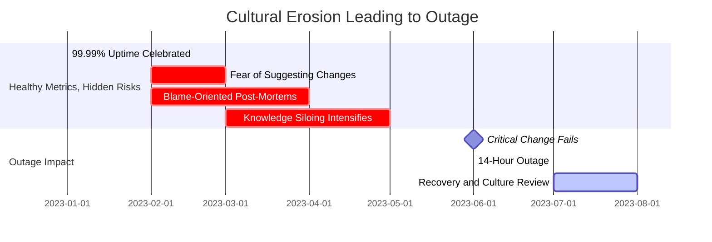

When a critical infrastructure change failed in June 2023, these compounding cultural weaknesses resulted in a catastrophic 14-hour outage. The team, despite their previously "perfect" technical metrics, was ill-equipped to respond efficiently. No dashboard had captured the cultural erosion that preceded the technical failure, highlighting the blind spots of traditional reliability measurement.

### SRE Best Practice: Evidence-Based Investigation

Elite SRE organizations supplement technical metrics with cultural measurements that provide early warning of reliability risks. The evidence-based approach uses multi-dimensional measurement to create a comprehensive picture of reliability culture health. Below is a checklist summarizing key practices for implementing evidence-based investigation:

| **Best Practice** | **Description** | **Example Tools/Methods** |
| ----------------------------------- | ---------------------------------------------------------------------------------------------------- | ------------------------------------------------------------- |
| **Balanced Metric Portfolios** | Maintain dashboards that display both technical (SLIs/SLOs, error rates) and cultural indicators. | SLI/SLO monitoring tools, post-mortem quality scoring systems |
| **Cultural Leading Indicators** | Measure psychological safety, knowledge-sharing, and continuous improvement to predict future risks. | DORA metrics, team surveys, retrospectives |
| **Structured Framework Assessment** | Conduct regular assessments using structured frameworks to evaluate cultural health. | Westrum’s typology, cultural maturity models |
| **Comparative Benchmarking** | Participate in industry benchmarking to contextualize internal metrics against peers. | Industry benchmarking reports, peer group collaborations |
| **Integrated Reporting Systems** | Present cultural and technical metrics side-by-side in reporting systems for leadership visibility. | Integrated dashboards, executive-level reporting platforms |

#### Evidence-Based Investigation Checklist

Use the following checklist to ensure your SRE practice incorporates evidence-based investigation effectively:

- [ ] Are both technical (e.g., SLIs, error rates) and cultural metrics (e.g., psychological safety, post-mortem quality) included in dashboards?
- [ ] Are cultural leading indicators (e.g., knowledge-sharing, continuous improvement activities) being monitored and reviewed regularly?
- [ ] Is your organization conducting structured cultural assessments at defined intervals?
- [ ] Have you benchmarked your cultural and technical metrics against peer organizations or industry standards?
- [ ] Are cultural and technical metrics integrated into reporting systems for executive reviews?

By adopting these best practices, organizations can enhance their ability to predict and mitigate reliability risks, creating a more resilient and proactive reliability culture.

### Banking Impact

The business consequences of neglecting cultural metrics in banking environments are substantial. The following visualization highlights key impacts observed between organizations with strong cultural metrics and those without:

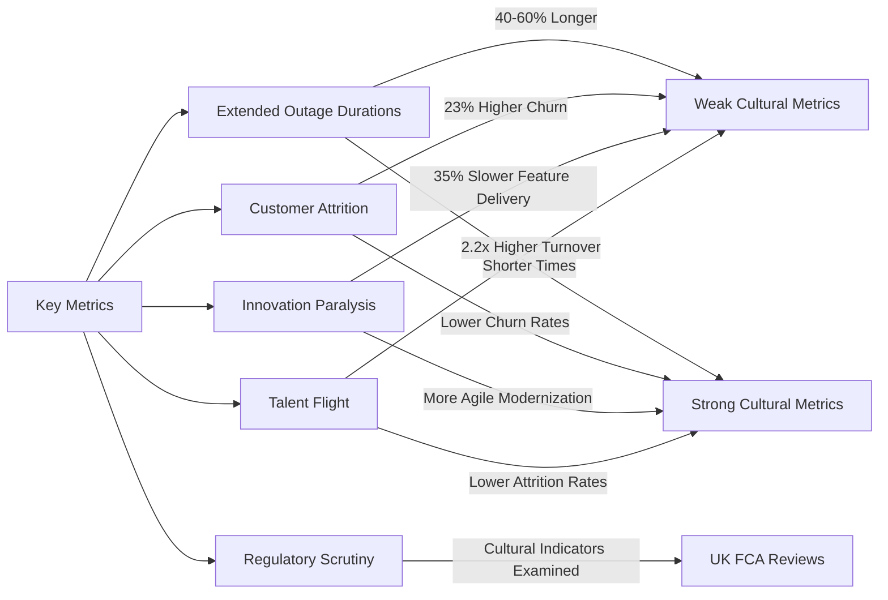

1. **Extended Outage Durations**: Banks measuring only technical metrics experience incident resolution times 40-60% longer than those measuring both technical and cultural indicators, according to Financial Services Information Sharing and Analysis Center (FS-ISAC) data.

2. **Regulatory Scrutiny**: Following major service disruptions at financial institutions, regulators increasingly examine cultural factors alongside technical root causes. The UK's FCA now specifically reviews "cultural indicators" during incident investigations.

3. **Customer Attrition**: For retail banking, the combination of service disruptions and poor recovery directly impacts customer retention. Research from Forrester shows that banks with weak reliability cultures experience 23% higher customer churn rates following major incidents.

4. **Innovation Paralysis**: Financial institutions with strong technical metrics but weak cultural metrics report 35% slower feature delivery and 47% lower willingness to modernize legacy systems due to fear-based decision-making.

5. **Talent Flight**: Banks with poor reliability cultures experience 2.2x higher turnover among senior engineers, creating knowledge gaps that directly threaten system stability regardless of current technical performance.

### Implementation Guidance

To implement a balanced cultural-technical measurement approach in your banking organization, follow these actionable steps:

#### Checklist for Implementation

- [ ] **Create a Cultural Metrics Working Group**

  - Form a cross-functional team including SREs, developers, operations, risk management, and leadership.
  - Define cultural metrics relevant to your organization.
  - Schedule bi-weekly meetings with clear deliverables focused on metric definition and implementation.

- [ ] **Deploy Psychological Safety Survey Cycles**

  - Use validated tools (e.g., Amy Edmondson's psychological safety assessment) to measure team interpersonal risk-taking.
  - Conduct surveys quarterly and ensure anonymity to encourage honest feedback.
  - Track trends over time and analyze correlations with incident frequency and severity.

- [ ] **Develop a Knowledge Flow Dashboard**

  - Visualize knowledge-sharing behaviors such as documentation contributions, cross-team training sessions, or mentoring activities.
  - Set baseline expectations and focus on tracking trends rather than absolute numbers.
  - Use the dashboard to identify gaps and encourage proactive knowledge-sharing.

- [ ] **Integrate Cultural Metrics into Executive Reporting**

  - Add cultural health indicators to existing reliability reports for leadership reviews.
  - Create executive-friendly visualizations to demonstrate the relationship between cultural indicators and business outcomes.
  - Use these reports to reinforce the importance of cultural metrics in driving reliability improvements.

- [ ] **Establish Metric Evolution Reviews**

  - Schedule quarterly reviews of the measurement system to assess effectiveness.
  - Identify which metrics are driving meaningful improvements and refine or retire those that aren't.
  - Create a formal process to introduce new metrics aligned with evolving organizational goals.

#### Step-by-Step Overview

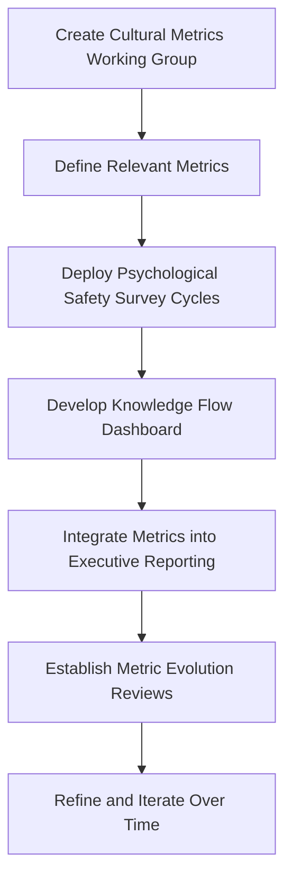

By following this structured approach, your organization can build a sustainable and actionable framework for balancing cultural and technical measurement, ensuring long-term reliability and resilience.

## Panel 2: Psychological Safety as a Reliability Metric

### Scene Description

A post-incident review meeting is underway in a banking operations center. The room is arranged with a central table surrounded by chairs, where team members are seated with laptops open. On one wall, digital screens display system status graphs, which are gradually stabilizing as the incident is resolved. Another wall features a series of charts tracking team metrics, such as "incident detection time" steadily decreasing over months and "average contributors per post-mortem" increasing.

In the center of the room, the team lead is facilitating the discussion, standing near a shared digital whiteboard where team members are actively contributing to a document. Each team member lists their own actions during the incident without hesitation. A junior engineer has just admitted to making a configuration change that contributed to the problem. They appear relieved, as the team lead nods appreciatively and categorizes the admission under a "contributing factors" section rather than a "root cause" section.

Below is a simplified diagram representing the meeting setup:

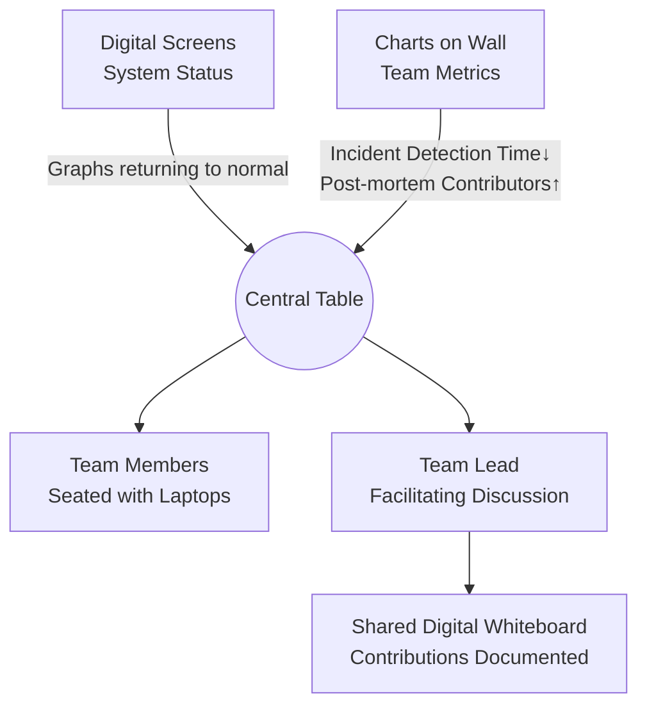

This collaborative and transparent environment highlights the team's high level of psychological safety, fostering open admission of mistakes and proactive learning.

### Teaching Narrative

Psychological safety—the shared belief that team members can take interpersonal risks without facing humiliation or blame—serves as perhaps the most critical cultural metric for reliability excellence. In low-safety environments, engineers hide mistakes, delay reporting issues, and avoid documenting known system weaknesses, creating perfect conditions for catastrophic failures. The fundamental challenge for transitioning organizations is that psychological safety can't be mandated; it must be cultivated, measured, and continuously reinforced.

Measuring psychological safety requires both quantitative and qualitative approaches: tracking speaking time distribution in meetings, monitoring post-mortem contribution diversity, measuring time-to-acknowledge mistakes, and conducting anonymous safety surveys. When reliability teams establish high psychological safety, they experience faster incident detection (problems are reported earlier), more thorough post-incident learning, and significantly more proactive risk identification. For banking environments where regulatory pressures often create blame-oriented cultures, psychological safety metrics become especially powerful predictors of future system reliability.

### Common Example of the Problem

At Metropolitan Financial Services, a mid-sized trading platform experienced intermittent throughput issues during peak market hours. For six weeks, the senior engineer responsible for a recent code deployment observed concerning patterns in system behavior but hesitated to raise them, fearing blame for the issues would fall on his team. When directly asked about system health during status meetings, he repeatedly reported "all systems operating normally" despite his private concerns. When the system eventually failed during a high-volume trading session, causing $1.8 million in unfilled orders, the post-incident investigation revealed that multiple team members had noticed warning signs but felt unsafe reporting them. The organization had measured every technical aspect of the trading platform but had no mechanism to detect the psychological safety deficit that allowed small concerns to grow into a major incident.

#### Key Takeaways & Red Flags Checklist

**Key Takeaways:**

- Psychological safety gaps can amplify small issues into large-scale failures.
- Lack of open communication often stems from fear of blame or reprisal.
- Metrics for technical systems are insufficient without parallel metrics for team dynamics.
- Post-incident reviews should evaluate both technical failures and cultural contributors.

**Red Flags to Watch For:**

- Team members hesitating or avoiding discussions about potential system issues.
- Consistently vague or overly positive system health updates during meetings.
- A culture of assigning blame rather than focusing on systemic improvements.
- Multiple individuals independently observing and ignoring the same warning signs.
- Lack of diverse contributions or open acknowledgments during post-mortem reviews.

### SRE Best Practice: Evidence-Based Investigation

High-performing SRE organizations treat psychological safety as a measurable, improvable system property rather than an abstract cultural concept. Evidence-based approaches include:

1. **Incident Time-to-Disclosure Tracking**: Leading organizations like Goldman Sachs measure the time between when someone first notices a potential issue and when they report it. Shorter times indicate higher psychological safety.

2. **Contribution Pattern Analysis**: Companies including Stripe analyze meeting transcripts and chat logs to measure speaking distribution and response patterns, identifying whether diverse perspectives are being shared and how ideas from junior team members are received.

3. **Safety-Adjusted Post-Incident Analysis**: Forward-thinking organizations measure not just the completion of post-mortems but their quality using metrics like "number of contributing factors identified," "actions taken by leadership in response to incidents," and "willingness to document unknown aspects of system behavior."

4. **Anonymous Near-Miss Reporting Systems**: Aviation-inspired anonymous reporting systems allow team members to report concerns without identification. The volume and quality of these reports serve as direct measurements of psychological safety.

5. **Safety Perception Differential**: The gap between how leaders perceive safety levels and how individual contributors experience them provides a powerful metric. Regular surveys measuring this gap help identify misalignment between leadership perception and team reality.

### Banking Impact

The business consequences of psychological safety deficits in banking reliability teams include significant impacts across detection, risk management, compliance, innovation, and resource allocation. The table below summarizes key metrics derived from industry studies:

| **Impact Area** | **Metric** | **Source** |
| ------------------------------ | --------------------------------------------------------------------------------------- | ---------------------------------------- |
| **Delayed Incident Detection** | Low psychological safety teams detect incidents 3.7x slower on average. | BITS Financial Services Roundtable |
| **Increased Operational Risk** | 42% higher operational risk costs due to preventable incidents escalating. | Oliver Wyman Risk Management Consultancy |
| **Compliance Vulnerability** | Psychological safety deficits cited in 28% of compliance breaches. | OCC Regulatory Examinations |
| **Innovation Constraints** | 37% less experimentation with new reliability approaches in low-safety environments. | Industry Benchmarks |
| **Risk Misallocation** | Up to 65% of risk budgets spent on non-optimal mitigations due to misreported concerns. | McKinsey Study |

These metrics highlight how deficits in psychological safety directly contribute to increased costs, reduced efficiency, and diminished resilience. Addressing these gaps is critical for banking institutions aiming to enhance reliability and meet regulatory expectations.

### Implementation Guidance

To implement psychological safety as a reliability metric in your banking organization, follow these steps:

#### Checklist for Implementation

- [ ] **Establish a Safety Survey Baseline**

  - Conduct anonymous quarterly psychological safety surveys using validated instruments.
  - Analyze results at both team and organizational levels.
  - Focus on identifying gaps between leadership perception and individual contributor experience.

- [ ] **Create Blameless Post-Mortem Guidelines**

  - Develop documented criteria for conducting blameless reviews, including language guidelines and facilitation protocols.
  - Train incident facilitators on these practices.
  - Use post-meeting surveys to measure adherence, asking participants, "How safe did you feel sharing your perspective?"

- [ ] **Implement Speaking Time Analytics**

  - Use tools to analyze speaking patterns during incident reviews and planning sessions.
  - Set targets for balanced participation distribution.
  - Regularly review and track data to ensure diverse contributions.

- [ ] **Develop Leadership Safety Behaviors Scorecard**

  - Define measurable leadership behaviors that enhance psychological safety, e.g., "responds constructively to bad news" or "acknowledges own mistakes."
  - Provide quarterly feedback to leaders based on these metrics.
  - Encourage leaders to model and reinforce safety behaviors.

- [ ] **Launch Anonymous Concern Reporting System**

  - Implement a system for reporting reliability concerns, near-misses, and improvement suggestions anonymously.
  - Measure the volume and quality of submissions.
  - Pay close attention to reports highlighting systemic issues as a key indicator of psychological safety.

#### Summary Flowchart

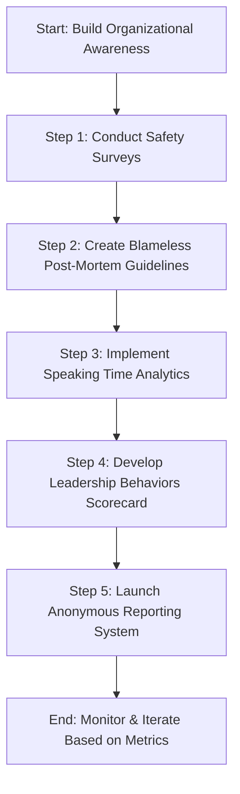

By following this checklist and iterating based on collected metrics, your organization can systematically cultivate a culture of psychological safety, leading to greater reliability and resilience in your banking operations.

## Panel 3: From "Mean Time to Blame" to "Mean Time to Learn"

### Scene Description

A timeline visualization dominates a war room wall, mapping a recent payment processing incident from detection through resolution. The timeline is annotated with key learning moments rather than pointing to individual actions. Below is a text-based representation of the timeline and key dashboard elements to enhance understanding:

```
+-------------------+----------------------+-------------------+
| Detection         | Key Learning Moment | Resolution        |
+-------------------+----------------------+-------------------+
| 0 min: Alert      | 7 min: Insight 1    | 25 min: Fix Deployed |
| Triggered         | "Root cause tied    |                   |
|                   | to configuration    |                   |
|                   | error."             |                   |
+-------------------+----------------------+-------------------+
|                   | 15 min: Insight 2   |                   |
|                   | "Improvement to     |                   |
|                   | monitoring."        |                   |
+-------------------+----------------------+-------------------+
```

Team members are seen adding sticky notes to specific points on the timeline, capturing insights such as, "Reduce false positives in alerting" and "Improve rollback procedures," rather than assigning responsibility. Above the timeline, a digital dashboard prominently displays the following key metrics:

```
+------------------------------------+
| Dashboard Metrics                 |
+------------------------------------+
| Time to First Learning: 7 minutes |
| Total Documented Learnings: 12    |
| Knowledge Base Contributions      |
| (Weekly Trend): ▲ Increasing      |
+------------------------------------+
```

In the corner of the room, a senior manager observes quietly, taking notes rather than directing the process. This visual and collaborative setup reinforces a culture of shared learning and continuous improvement.

### Teaching Narrative

How organizations respond to failure provides the clearest measurement of reliability culture maturity. Immature reliability cultures measure incident response by "mean time to resolution" while focusing organizational energy on finding someone to blame. By contrast, elite reliability organizations measure "mean time to learning"—how quickly valuable insights are extracted, documented, and shared following an incident or near-miss.

This shift requires establishing new measurement frameworks that track learning velocity: how quickly incidents generate documented insights, how effectively these learnings propagate across teams, and how consistently these lessons translate into system improvements. Banking environments face unique challenges in this transition due to compliance requirements that often emphasize root cause analysis over systemic understanding. The most successful financial institutions navigate this tension by satisfying regulatory requirements while maintaining internal learning-focused metrics that drive actual reliability improvements.

### Common Example of the Problem

Continental Banking Group's mobile payment system experienced an intermittent transaction failure affecting approximately 5% of customer payments. Their traditional incident metrics showed impressive numbers: the issue was detected within 2 minutes, a response team assembled within 5 minutes, and full service restoration achieved within 47 minutes. Leadership commended the team's efficiency, and the incident was marked "resolved" with the root cause identified as "improper configuration change by Team A." However, no systematic learning occurred. The post-mortem focused exclusively on identifying who made the change and implementing approval gates to prevent similar errors. Six weeks later, an almost identical failure occurred through a different vector because the team had measured only resolution speed, not learning quality. The fundamental configuration vulnerability remained unaddressed because the organization's metrics rewarded quick fixes rather than deep understanding.

The table below illustrates the key differences between the traditional approach and a learning-focused approach to incident management:

| **Metric** | **Traditional Approach** | **Learning-Focused Approach** |
| -------------------------- | ------------------------------------------------------ | -------------------------------------------------------- |
| **Primary Measurement** | Mean Time to Resolution (MTTR) | Mean Time to Learning (MTTL) |
| **Incident Focus** | Restoring service as quickly as possible | Extracting actionable insights to improve reliability |
| **Root Cause Analysis** | Assign responsibility to an individual/team | Understand systemic factors and contributing conditions |
| **Post-Mortem Output** | Blame assignment and prevention gates | Documented learnings, shared across teams |
| **Long-Term Impact** | Recurring incidents due to unaddressed systemic issues | Reduced recurrence through improved system understanding |
| **Cultural Reinforcement** | Efficiency and individual accountability | Collaboration and continuous improvement |

By emphasizing resolution speed alone, Continental Banking Group failed to address the systemic vulnerabilities in their configuration management process. A learning-focused approach could have uncovered these broader issues, preventing similar failures and improving overall system reliability.

### SRE Best Practice: Evidence-Based Investigation

Elite reliability organizations implement learning-focused measurement systems that transform incidents from embarrassments to valuable investments. Evidence-based approaches include:

1. **Learning Velocity Metrics**: Organizations like Monzo Bank measure "time to first insight" and "time to documented learning" as primary incident metrics, with targets that emphasize rapid knowledge extraction alongside service restoration.

2. **Knowledge Artifact Quality Assessment**: Forward-thinking organizations evaluate post-incident documents based on structured quality criteria: systemic focus, actionability of insights, absence of blame language, and identification of multiple contributing factors.

3. **Knowledge Propagation Tracking**: Leading financial institutions measure how effectively incident learnings spread throughout the organization using metrics like documentation access rates, cross-team learning session participation, and implementation of similar fixes in analogous systems.

4. **Learning-Focused Facilitation**: Elite organizations train and deploy specialized incident learning facilitators who are measured not on incident resolution time but on the quality and quantity of insights generated through the review process.

5. **Resolution Quality Over Speed**: Research from MIT's Initiative on the Digital Economy shows that organizations focusing on systemic understanding rather than quick fixes experience 28% fewer repeat incidents and more rapid reliability maturation over time.

#### Checklist: Evidence-Based Investigation Practices

- [ ] Track "time to first insight" and "time to documented learning" as key incident metrics.
- [ ] Evaluate post-incident documentation for systemic focus, actionable insights, absence of blame, and comprehensive factor analysis.
- [ ] Measure and improve knowledge propagation using metrics like documentation access rates and cross-team learning participation.
- [ ] Train and deploy incident learning facilitators focused on generating high-quality insights.
- [ ] Prioritize systemic understanding over speed to prevent repeat incidents and drive reliability improvements.

### Banking Impact

The business consequences of prioritizing resolution over learning in banking reliability include:

1. **Recurring Incidents**: Financial institutions focused solely on resolution metrics experience 3.2x more repeat incidents than those measuring learning quality, according to a Financial Services Technology Consortium study.

2. **Misallocated Engineering Resources**: Banks optimizing for resolution time rather than learning depth spend an average of 37% more on incident response while achieving 23% less systemic improvement, according to Deloitte Financial Services research.

3. **Technical Debt Accumulation**: Organizations measuring only "time to restore" make 2.7x more short-term fixes that create technical debt compared to those that measure learning quality, leading to significantly higher maintenance costs.

4. **Customer Experience Volatility**: Banks with learning-focused metrics experience more consistent customer satisfaction scores with fewer volatility spikes following incidents, according to J.D. Power banking satisfaction data.

5. **Regulatory Scrutiny**: Financial regulators increasingly examine the quality of post-incident learning during examinations. The ECB's banking supervision team now explicitly reviews "demonstrated learning from operational incidents" as part of their supervisory assessment.

#### Visualizing Banking Impacts

```mermaid
barChart
    title Banking Reliability: Learning vs. Resolution Metrics
    orientation horizontal
    data
        "Metric": ["Recurring Incidents", "Incident Response Costs", "Systemic Improvement", "Technical Debt", "Customer Satisfaction"],
        "Prioritizing Resolution": [3.2, 37, -23, 2.7, "Volatile"],
        "Prioritizing Learning": [1.0, 0, 0, 1.0, "Consistent"]
```

**Key Notes**:

- **Recurring Incidents**: Banks prioritizing learning metrics reduce repeat incidents (baseline: 1.0).
- **Incident Response Costs**: Focus on learning eliminates unnecessary cost increases (+37% for resolution-focused banks).
- **Systemic Improvement**: Learning-focused organizations achieve steady progress (baseline: 0), while resolution-focused banks lag (-23%).
- **Technical Debt**: Learning-oriented teams maintain controlled debt accumulation (baseline: 1.0) compared to rapid debt growth (2.7x) in resolution-focused teams.
- **Customer Satisfaction**: Learning-focused banks deliver consistent satisfaction, avoiding volatility spikes post-incident.

By shifting focus to learning, financial institutions can improve reliability outcomes across engineering efficiency, customer experience, and regulatory compliance.

### Implementation Guidance

To shift from resolution-focused to learning-focused metrics in your banking organization, follow these steps:

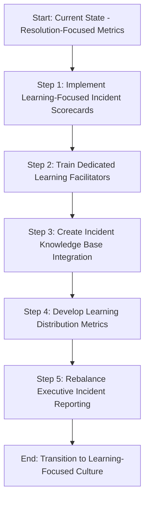

1. **Implement Learning-Focused Incident Scorecards**\
   Create and deploy measurement systems that track learning quality alongside resolution time. Include metrics like "unique insights generated," "actions identified beyond direct fix," and "cross-team learning opportunities created."

2. **Train Dedicated Learning Facilitators**\
   Develop a specialized role responsible for maximizing learning from incidents. Provide these facilitators with specific training in learning extraction techniques and measure their effectiveness by the quality of insights generated.

3. **Create Incident Knowledge Base Integration**\
   Establish clear processes for incorporating incident learnings into searchable knowledge repositories. Measure both contribution frequency and knowledge base utilization rates to ensure learnings are both captured and accessed.

4. **Develop Learning Distribution Metrics**\
   Implement systems to track how effectively learnings spread through the organization. Measure attendance at knowledge-sharing sessions, document access rates across teams, and implementation of learnings in analogous systems.

5. **Rebalance Executive Incident Reporting**\
   Modify incident reporting templates for leadership reviews to give equal weight to learning outcomes and resolution metrics. Create standardized visualization formats that highlight insights gained alongside traditional restoration time metrics.

By following these steps, you can effectively transition from a resolution-focused to a learning-focused reliability culture, driving systemic improvements and fostering a more resilient organization.

## Panel 4: Balancing the Operations-Development Reliability Contract

### Scene Description

A visual split-screen illustrates the dynamic interaction between operations and development teams, with a "reliability contract" prominently projected in the center. On the left, operations engineers are shown reviewing alerting thresholds and on-call schedules. On the right, developers focus on code quality metrics and deployment frequency data. Between the two teams, a shared dashboard displays "joint reliability metrics," such as error budget consumption rates, deployment recovery time, and feature flag usage statistics. Team leaders from both sides are depicted shaking hands while reviewing quarterly reliability objectives, with banking compliance officers in the background nodding in approval.

Below is a visual representation of the scene using a Mermaid diagram for clarity:

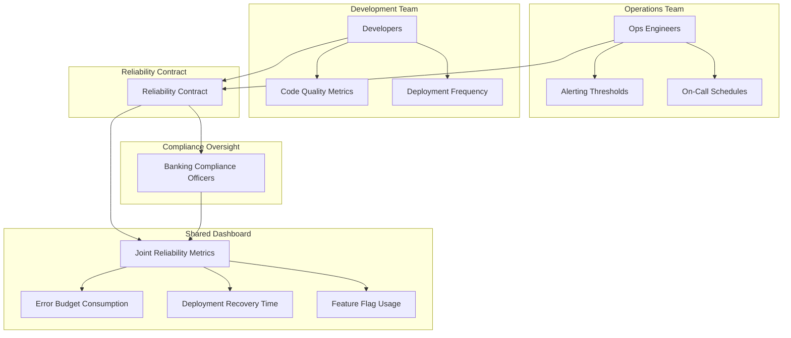

This diagram visually reinforces the collaborative structure and shared accountability outlined in the reliability contract, demonstrating the interconnected roles of both teams alongside compliance oversight.

### Teaching Narrative

Reliability culture requires breaking down the traditional divide between operations and development teams—a separation particularly entrenched in banking institutions. The measurable manifestation of this cultural shift appears in what we call the "reliability contract," a shared accountability framework with metrics owned jointly by operations and development groups.

Measuring this cultural evolution requires tracking collaboration indicators: cross-team pairing hours, shared on-call responsibilities, unified error budget ownership, and joint reliability planning sessions. The most telling metric is often "time to cross-functional response"—how quickly incidents mobilize the right people regardless of organizational boundaries. Banking organizations face additional complexity integrating security and compliance teams into this shared framework, but successful institutions develop three-way contracts where security controls become part of the measured reliability agreement rather than operating in isolation.

### Common Example of the Problem

Mercantile Financial's new consumer lending platform launched with separate performance metrics for development and operations teams. Development tracked feature delivery velocity and story point completion, while operations measured system uptime and incident response time. Following the launch, a pattern emerged: the development team would deploy new features every two weeks, causing a spike in incidents that the operations team would scramble to resolve. Operations began pushing for slower release cycles, while development argued for maintaining velocity to meet business commitments. Both teams met their individual metrics—development delivered features on schedule, and operations maintained required uptime—yet the overall system reliability suffered. Customer loan processing times fluctuated wildly, and satisfaction scores plummeted. Neither team's metrics reflected this customer impact, and neither felt accountable for the end-to-end experience.

#### Misalignment Between Development and Operations Metrics

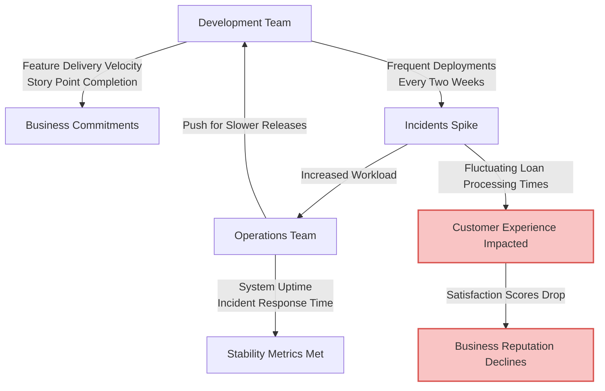

This diagram illustrates how misaligned metrics create a feedback loop that ignores the customer experience. Development focuses on velocity, leading to frequent deployments and incident surges, while operations concentrates on maintaining uptime and response times. Both teams achieve their individual goals but fail to address the systemic issue, resulting in degraded customer satisfaction and business reputation.

### SRE Best Practice: Evidence-Based Investigation

High-performing reliability organizations implement shared metrics and joint accountability structures that bridge traditional operational boundaries. Evidence-based approaches include:

1. **Unified Error Budget Framework**: Organizations like Capital One implement shared error budget models where development velocity and operational stability trade off explicitly, with both teams measured on staying within budget rather than maximizing their individual metrics.

2. **Cross-Functional Performance Reviews**: Leading financial institutions modify performance evaluation systems to include cross-team metrics, ensuring development teams are partly measured on operational outcomes and operations teams on feature delivery success.

3. **Joint Planning Ceremonies**: Forward-thinking organizations track participation in cross-functional planning sessions, measuring not just attendance but meaningful contribution from both operations and development perspectives.

4. **Shared On-Call Rotations**: Elite reliability organizations implement and measure the effectiveness of shared on-call responsibilities, tracking how often developers participate in incident response and how frequently operations contributes to development decisions.

5. **Three-Dimensional Contracts**: Organizations like ING have extended the traditional dev-ops contract to include security and compliance as equal partners, measuring how effectively these functions integrate into the development and operations lifecycle rather than functioning as gatekeepers.

**Checklist for Evidence-Based Investigation:**

- [ ] Define a unified error budget framework and track adherence by both development and operations teams.
- [ ] Integrate cross-functional metrics into performance reviews for development and operations staff.
- [ ] Schedule and monitor participation and contribution in joint planning ceremonies.
- [ ] Establish shared on-call rotations and measure developer involvement in incident response.
- [ ] Extend the reliability contract to include security and compliance, ensuring their processes are integrated and measurable.

### Banking Impact

The business consequences of maintaining siloed reliability metrics in banking are significant, with measurable impacts across critical operational dimensions. The table below summarizes key metrics and their quantified effects:

| **Metric** | **Impact** | **Source** |
| ----------------------------------- | ------------------------------------------------------------------------------------------------------------------------------------- | ---------------------------------------------- |
| **Deployment Volatility** | 4.2x more post-deployment incidents in banks with separate dev-ops metrics, impacting customer experience during critical operations. | FS-ISAC data |
| **Extended Recovery Times** | 68% longer to resolve complex incidents requiring cross-functional cooperation. | Forrester study on banking incident management |
| **Regulatory Compliance Gaps** | Siloed reliability responsibilities contribute to 42% of operational risk events examined by regulators. | Federal Reserve operational risk analysis |
| **Inefficient Resource Allocation** | 28% higher overall technology costs due to over-investment in manual controls and development speed premiums. | Internal financial audits |
| **Customer Journey Disruptions** | 57% higher customer abandonment rates for financial products crossing traditional dev-ops boundaries. | Product performance reviews |

These metrics illustrate the high cost of fragmentation in banking reliability practices. Addressing these issues through unified reliability contracts not only improves operational efficiency but also reduces compliance risks and enhances the customer experience.

### Implementation Guidance

To implement balanced reliability contracts in your banking organization, follow this step-by-step process:

#### Step-by-Step Process Diagram

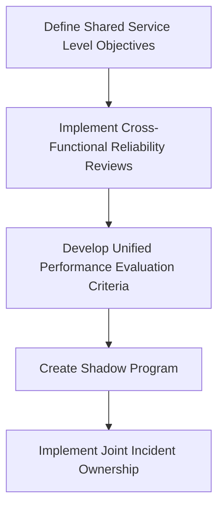

#### Detailed Steps

1. **Define Shared Service Level Objectives**\
   Establish joint SLOs that both development and operations teams are measured against. Ensure these metrics reflect customer experience outcomes rather than internal team activities, with particular focus on end-to-end journey reliability.

2. **Implement Cross-Functional Reliability Reviews**\
   Create a regular (bi-weekly) forum where development, operations, security, and compliance teams jointly review reliability metrics. Institute a "no blame" policy for these reviews, focusing on system improvement rather than team performance.

3. **Develop Unified Performance Evaluation Criteria**\
   Modify performance review processes to include shared metrics that cut across traditional boundaries. Ensure development teams are evaluated partly on operational outcomes and operations teams on enabling development velocity.

4. **Create Shadow Program**\
   Establish a formal "shadow rotation" where team members regularly spend time embedded in partner teams. Track both participation rates and knowledge transfer outcomes from these rotations.

5. **Implement Joint Incident Ownership**\
   Revise incident management processes to require both development and operations participation from the start of any significant incident. Measure "time to full team assembly" and the diversity of perspectives included in both response and review activities.

## Panel 5: Leading Indicators: The Proactive Measurement Revolution

### Scene Description

A team is gathered around a "Reliability Early Warning System" dashboard that displays unusual metrics. These include:

- **Question Count During Planning**
- **Deployment Hesitation Patterns**
- **Configuration Change Volume**
- **Documentation Search Frequency**

The dashboard is organized into sections that highlight trends and anomalies, with color-coded indicators signaling areas of concern.

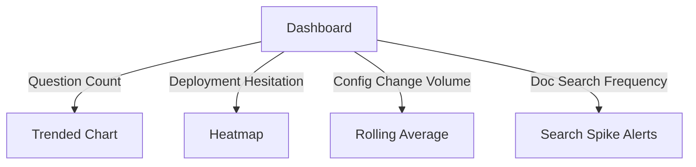

A senior SRE is explaining the significance of these metrics to banking executives, who look intrigued but slightly confused. On a nearby whiteboard, a graph illustrates how spikes in these leading indicators preceded major incidents by weeks. The graph is annotated with key points where interventions could have mitigated risks.

Below the graph, a junior team member is adding a new proposed indicator to the board labeled **"Cross-Team Communication Frequency Drop"**, represented as a downward trendline with a question mark indicating its potential predictive value. The team is actively discussing the feasibility and impact of incorporating this new indicator into the dashboard.

### Teaching Narrative

Elite reliability cultures measure what happens before incidents rather than just counting failures after they occur. This shift to leading cultural indicators represents perhaps the most significant measurement evolution in modern reliability practice. By tracking the human behaviors and team interactions that typically precede incidents, organizations can intervene before small cultural issues grow into major reliability failures.

Effective leading cultural indicators include: declining rates of challenging questions in planning meetings, decreasing cross-team communication frequency, rising deployment hesitation, documentation neglect patterns, and reduced blameless reporting of near-misses. Banking environments benefit particularly from measuring "compliance anxiety"—how regulatory requirements affect engineering decision-making—as this often predicts where corners might be cut. Organizations that successfully implement leading cultural indicators typically detect reliability risks 3-5 weeks before they would appear in technical monitoring systems, creating critical intervention windows that prevent customer-impacting failures.

### Common Example of the Problem

AssetBank's wealth management platform experienced no major incidents for three consecutive quarters, leading executives to praise the "rock-solid reliability" of their systems. However, beneath the surface, several behavioral patterns had emerged undetected. These behaviors, summarized below, went unnoticed due to the absence of leading cultural indicators:

| Behavioral Pattern | Observed Change | Impact on Incident |
| ---------------------------------------- | --------------------------------- | ---------------------------------------------------------------------------------- |
| Spontaneous architecture review sessions | Decreased scheduling frequency | Reduced opportunity to proactively identify and address design flaws. |
| Code review comments | Dropped by 73% | Lowered peer-driven quality control and knowledge sharing. |
| Documentation updates | Occurred half as frequently | Outdated resources hampered troubleshooting efforts during the incident. |
| Communication channels | Shifting to formal-only platforms | Stifled collaboration and slowed problem resolution during high-stress situations. |

These behavioral shifts created a brittle organizational foundation. When a market volatility event triggered unexpected system behavior, the team's degraded collaboration capabilities resulted in a 7-hour resolution time for what should have been a 30-minute fix. The timeline below highlights how these patterns unfolded and contributed to the incident:

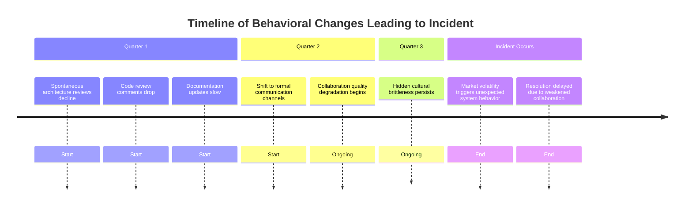

This example illustrates how unnoticed cultural degradation over three quarters contributed to a catastrophic failure. Leading cultural indicators, if tracked, could have flagged these issues weeks ahead, providing an opportunity for intervention and prevention.

### SRE Best Practice: Evidence-Based Investigation

Elite reliability organizations implement leading cultural indicators that predict potential reliability issues before they manifest as incidents. Evidence-based approaches include:

| Evidence-Based Approach | Key Metric(s) Monitored | Predictive Value |
| -------------------------------------- | ------------------------------------------------------------------------------------------------------------------ | ---------------------------------------------------------------------------------------------------- |
| **Collaboration Pattern Analysis** | Communication frequency, breadth, and timing of cross-team interactions | Identifies potential silos or communication breakdowns that typically precede incidents |
| **Question Frequency Monitoring** | Number and nature of questions during planning sessions, code reviews, and architecture discussions | Declining question rates often indicate reduced scrutiny or engagement, predicting reliability risks |
| **Change Pattern Measurement** | Change volume, small commits vs. large batches, timing patterns (e.g., last-minute changes, deployment hesitation) | Detects unhealthy change behaviors or confidence issues that could lead to incidents |
| **Documentation Interaction Tracking** | Frequency of documentation access, updates, and references | Neglect of documentation often precedes knowledge-related incidents |
| **Near-Miss Reporting Rates** | Voluntary reporting rates of near-misses and concerns | Declining reporting rates predict increased likelihood of major incidents |

#### Quick Checklist for Evidence-Based Investigation

- [ ] Analyze cross-team communication patterns for signs of silos or breakdowns.
- [ ] Monitor question frequency in key discussions to identify declining engagement or scrutiny.
- [ ] Measure change patterns, including small vs. large commits and deployment confidence indicators.
- [ ] Track documentation interaction metrics to detect potential knowledge gaps.
- [ ] Evaluate near-miss reporting rates and encourage blameless reporting culture to surface concerns early.

By systematically applying these evidence-based approaches, organizations can gain foresight into cultural and process issues, enabling timely interventions that prevent reliability failures.

### Banking Impact

The business consequences of relying solely on lagging indicators in banking reliability include:

1. **Preventable Major Incidents**: Financial institutions using leading cultural indicators prevent an average of 14 major incidents annually that would otherwise impact customers, according to a BITS Financial Services Roundtable study.

2. **Extended Recovery Times**: Banks relying exclusively on lagging indicators experience 3.2x longer incident resolution times when major issues occur, due to degraded collaboration capabilities that weren't detected in advance.

3. **Compliance Failure Prediction**: Analysis from banking regulators shows that 76% of significant compliance failures are preceded by detectable changes in behavioral patterns 4-8 weeks before the actual breach.

4. **Ineffective Investment Timing**: Organizations without leading indicators typically invest in reliability improvements reactively after major incidents, when costs are 4-7x higher than preventative investments made earlier based on cultural warnings.

5. **Customer Trust Erosion**: Financial institutions experiencing "surprise" major incidents report customer trust metrics declining by 23-28%, compared to 7-10% when customers perceive the bank anticipated and communicated potential issues in advance.

#### Key Metrics Comparison

The following visualization highlights the contrast between organizations that implement leading cultural indicators and those that rely solely on lagging indicators:


#### Summary Table: Leading vs. Lagging Indicators

| Metric | Leading Indicators | Lagging Indicators |
| -------------------------------------- | ------------------ | ------------------ |
| Preventable Major Incidents | 14 annually | 0 |
| Incident Recovery Times | Standard | 3.2x longer |
| Compliance Failure Prediction Accuracy | 76% | Not measurable |
| Investment Cost Efficiency | Preventative (1x) | Reactive (4-7x) |
| Customer Trust Impact | Decline: 7-10% | Decline: 23-28% |

### Implementation Guidance

To implement leading cultural indicators in your banking organization, follow this step-by-step process illustrated below:

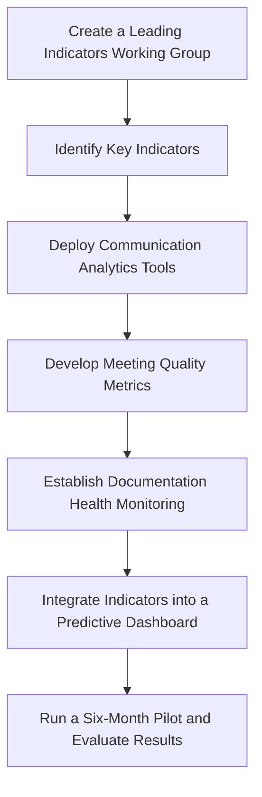

1. **Create a Leading Indicators Working Group**: Assemble a cross-functional team responsible for identifying, measuring, and refining leading cultural indicators. Include representatives from development, operations, security, compliance, and business units to ensure diverse perspectives.

2. **Identify Key Indicators**: Collaboratively determine which leading cultural indicators are most relevant to your organization. Examples include cross-team communication frequency, planning session question diversity, deployment hesitation patterns, and documentation health metrics.

3. **Deploy Communication Analytics Tools**: Implement tools that analyze metadata from collaboration platforms to measure the frequency, breadth, and timing of interactions between teams. Define baselines and set alert thresholds for deviations that might indicate emerging silos or misalignments.

4. **Develop Meeting Quality Metrics**: Design measurement frameworks for critical meetings such as planning sessions and architecture reviews. Track metrics like question diversity, decision challenge frequency, and participation distribution to evaluate the health of engineering collaboration.

5. **Establish Documentation Health Monitoring**: Introduce systems to monitor documentation creation, updates, and usage across teams. Develop visualization tools to identify areas where documentation is becoming outdated or underutilized.

6. **Integrate Indicators into a Predictive Dashboard**: Build a dashboard that consolidates 5-7 leading cultural indicators most relevant to your organization. Ensure the dashboard provides actionable insights and is accessible to key stakeholders.

7. **Run a Six-Month Pilot and Evaluate Results**: Test the predictive dashboard over a six-month period. Compare the leading indicators to traditional technical metrics, analyzing their effectiveness in predicting and preventing reliability risks. Use findings to refine the indicators and processes further.

## Panel 6: The Continuous Improvement Measurement Framework

### Scene Description

A retrospective session is underway with team members gathered around a circular timeline visually represented as a loop. The timeline spans the past six months of reliability work, highlighting key "measurement recalibration" points at regular intervals. These points mark moments where metrics were evaluated and adjusted to ensure continued relevance.

Below is a simplified representation of the circular timeline:

```
      Recalibration 1        Recalibration 2
             |                     |
             v                     v
     [Metric Retired]     [Metric Modified]
              \                   /
               \                 /
                6-Month Reliability Timeline
               /                 \
     [Metric Introduced]         [Metric Evolved]
             ^                     ^
             |                     |
      Recalibration 3        Recalibration 4
```

Surrounding the timeline, team members are dynamically engaged in discussions. Various charts are displayed, showcasing how reliability metrics have evolved—some retired, others modified, and new ones introduced. The team is actively plotting the next phase of measurement evolution, carefully reviewing how each change has aligned with reliability improvements.

A banking compliance officer is also present, contributing to the discussion by ensuring internal metrics align with external regulatory reporting requirements. This integration of compliance and adaptability demonstrates how progressive organizations balance static compliance needs with the evolving demands of practical reliability.

### Teaching Narrative

The most overlooked aspect of reliability culture measurement is measuring the measurement system itself. Reliability cultures stagnate when their metrics become static, creating dangerous blind spots as technology and organizational needs evolve. Elite reliability organizations treat their measurement frameworks as living systems that require regular evaluation and refinement.

Effective meta-measurement tracks metric utilization (are people actually using these numbers?), decision influence (do these metrics affect real decisions?), and improvement correlation (do changes in these metrics predict reliability outcomes?). This requires establishing regular "metric retrospectives" where teams assess which measurements still drive improvement and which have lost their effectiveness. In banking environments, where regulatory metrics often remain fixed regardless of their practical value, successful organizations maintain dual measurement systems: compliance metrics that satisfy external requirements and evolving practical metrics that drive actual reliability improvements.

### Common Example of the Problem

Eastern Trust Bank implemented a comprehensive set of reliability metrics following a major mobile banking outage. For eighteen months, teams rigorously tracked and reported on these measurements: incident counts, mean time to resolution (MTTR), deployment frequency, and change failure rate. Initially, these metrics drove significant improvements in system reliability. However, as the platform matured and the organization evolved, teams continued measuring the exact same indicators despite diminishing returns.

The following table illustrates the lifecycle of these metrics, their initial impact, and the eventual issues that arose:

| **Metric** | **Initial Impact** | **Eventual Issues** |
| ---------------------------------- | ------------------------------------------------------------------------------------ | ------------------------------------------------------------------------------------------------------------- |
| **Incident Counts** | Highlighted areas of instability, enabling teams to reduce the frequency of outages. | Teams focused on minimizing reported incidents, sometimes avoiding necessary reporting of edge-case failures. |
| **Mean Time to Resolution (MTTR)** | Encouraged faster incident response, improving customer experience. | Quick fixes became prioritized over addressing root causes, leading to recurring issues. |
| **Deployment Frequency** | Increased release cadence, fostering innovation and faster delivery of features. | Engineers began splitting changes into artificially small deployments to maintain high frequency metrics. |
| **Change Failure Rate** | Reduced the risk of failed changes, improving overall confidence in releases. | Failed integrations with third parties and data consistency issues were overlooked, as they weren’t captured. |

As shown above, while these metrics initially drove positive outcomes, their static nature eventually led to unintended consequences. Engineers began optimizing for the metrics themselves rather than actual customer outcomes—breaking changes into artificially small deployments to maintain "good" deployment frequency numbers or resolving incidents with quick fixes to preserve MTTR statistics.

Meanwhile, new reliability challenges emerged around third-party integration stability and data consistency that weren’t captured in the original metrics. The static measurement system had become an obstacle to improvement rather than an enabler, and reliability progress plateaued despite continued investment.

To overcome this, Eastern Trust Bank needed to embrace a dynamic measurement framework that could evolve as their systems and challenges changed.

### SRE Best Practice: Evidence-Based Investigation

Elite reliability organizations implement measurement evolution systems that ensure their metrics remain relevant and effective. Evidence-based approaches include the following best practices, summarized in the checklist and table below:

#### Checklist for Evidence-Based Investigation

- [ ] Conduct periodic **Metric Effectiveness Reviews** to evaluate relevance, actionability, and customer outcome correlation.
- [ ] Develop a **Measurement Evolution Framework** with clear criteria for retiring, modifying, or introducing metrics.
- [ ] Perform regular **Decision Influence Tracking** to identify metrics driving meaningful actions versus performative reporting.
- [ ] Maintain **Compliance-Operational Metric Separation** to address both external regulatory needs and internal improvement goals.
- [ ] Ensure **Metric Diversity Insurance** by balancing technical, process, and cultural dimensions in your measurement portfolio.

#### Summary Table of Evidence-Based Practices

| Practice | Description | Benefits |
| --------------------------------- | ------------------------------------------------------------------------------- | ------------------------------------------------------------------------------------------ |
| Metric Effectiveness Reviews | Quarterly evaluations of metrics' actionability, relevance, and outcome impact. | Identifies outdated or ineffective metrics, ensuring alignment with customer outcomes. |
| Measurement Evolution Framework | Formal process for retiring, modifying, and introducing metrics. | Provides a structured approach to keep metrics aligned with evolving organizational needs. |
| Decision Influence Tracking | Auditing metrics to determine their impact on decision-making. | Ensures metrics drive real actions and avoids reliance on performative data. |
| Compliance-Operational Separation | Separation of regulatory metrics and practical, evolving operational metrics. | Balances external reporting requirements with internal reliability improvements. |
| Metric Diversity Insurance | Using diverse metrics across technical, process, and cultural dimensions. | Maintains long-term improvement momentum and avoids blind spots. |

By following these practices, organizations can ensure their measurement systems remain dynamic, actionable, and aligned with both operational goals and external compliance requirements.

### Banking Impact

The business consequences of static measurement systems in banking reliability are profound. Below is a summary of key challenges, supported by data and their implications:

#### Key Challenges and Impacts

1. **Improvement Plateaus**

   - Static reliability metrics lead to stagnation.
   - Financial institutions with static metrics see improvement plateaus after **12-18 months**, while those with evolving frameworks sustain reliability gains for **36+ months**.
   - _Source: Forrester Financial Services Research_

2. **Metric Gaming Behaviors**

   - Teams optimize for outdated metrics rather than true reliability outcomes.
   - Results in superficial improvements that fail to enhance customer experience.

3. **Emerging Risk Blindness**

   - Static measurement systems fail to account for new risk categories.
   - According to FS-ISAC, **68% of major incidents** at such institutions arise from unmeasured risk dimensions.

4. **Misaligned Resource Allocation**

   - Outdated metrics lead to misdirected investments.
   - Up to **40% of reliability investments** are misallocated, often funding already-optimized areas while ignoring emerging challenges.

5. **Regulatory Disconnect**

   - Static internal metrics fail to keep pace with evolving regulatory focus areas.
   - This creates compliance gaps when regulations outpace the institution's measurement adjustments.

#### Visual Overview: Challenges and Consequences

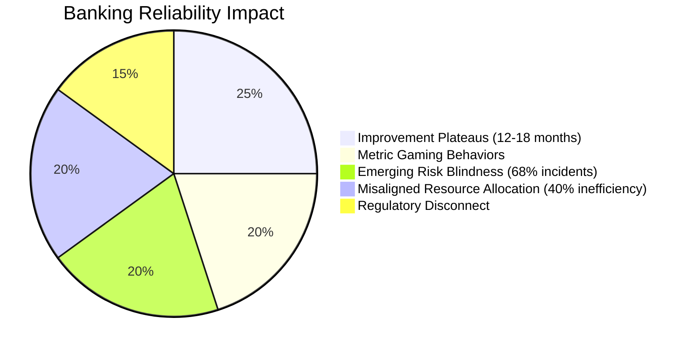

#### Summary

Banks that fail to evolve their measurement frameworks face cascading consequences, from stagnating reliability improvements to regulatory non-compliance. To achieve sustained success, financial institutions must adopt dynamic, dual measurement systems that balance compliance needs with practical reliability optimization.

### Implementation Guidance

To implement continuous improvement measurement frameworks in your banking organization, follow these structured steps:

```mermaid
flowchart TD
    A[Start: Establish Quarterly Metric Reviews] --> B[Evaluate Metrics Against Criteria]
    B --> C[Document Decisions: Maintain, Modify, or Retire Metrics]
    C --> D[Create Metric Lifecycle Documentation]
    D --> E[Track Purpose, History, Effectiveness, and Retirement Criteria]
    E --> F[Make Documentation Accessible to Stakeholders]
    F --> G[Implement "Metrics in Waiting"]
    G --> H[Track 3-5 Shadow Metrics for Validation]
    H --> I[Validate Before Formal Adoption]
    I --> J[Deploy Metric Influence Surveys]
    J --> K[Collect Feedback on Decision Influence and Performative Metrics]
    K --> L[Adjust Measurement System Based on Feedback]
    L --> M[Develop Dual Tracking Systems]
    M --> N[Separate Compliance Metrics from Improvement Metrics]
    N --> O[Document and Communicate Measurement System Purpose]
    O --> P[Iterate and Refine Quarterly]
    P --> Q[End: Continuous Improvement Achieved]
```

#### Detailed Steps:

1. **Establish Quarterly Metric Reviews**:\
   Implement a formal quarterly review process to evaluate all reliability metrics using criteria such as actionability, decision influence, gaming susceptibility, and correlation with business outcomes. Document decisions to maintain, modify, or retire each metric.

2. **Create Metric Lifecycle Documentation**:\
   Develop a system to track the complete lifecycle of each metric. This should include its original purpose, modification history, current effectiveness, and retirement criteria. Ensure this documentation is accessible to all reliability stakeholders.

3. **Implement "Metrics in Waiting"**:\
   Maintain a pipeline of 3-5 potential new metrics that address emerging reliability dimensions. These "shadow metrics" should be tracked but not yet used for decision-making, allowing for thorough validation before formal adoption.

4. **Deploy Metric Influence Surveys**:\
   Conduct lightweight, quarterly surveys to ask teams which metrics influence their decisions and which they consider performative. Use this feedback to prioritize adjustments to the measurement system.

5. **Develop Dual Tracking Systems**:\
   Create separate tracking systems for compliance-required metrics and operational improvement metrics. Evaluate and adjust these systems on different cycles. Clearly document the distinct purposes of compliance and improvement metrics to all stakeholders.

6. **Iterate Quarterly**:\
   Use insights from reviews, surveys, and stakeholder feedback to refine the measurement framework continuously. Ensure the process is repeated quarterly to adapt to evolving organizational and technological needs.

## Panel 7: From Measurement to Meaning: The Reliability Storytelling Framework

### Scene Description

A quarterly business review meeting shows technical and business leaders engaged with reliability data presented not as isolated metrics but as an integrated narrative. Screen displays combine technical indicators with cultural measurements into a coherent story of reliability evolution. Presenters are connecting key metrics to specific business outcomes: customer retention improvements, regulatory compliance achievements, and cost reductions from avoiding incidents. Banking executives are engaged and asking questions about future reliability investments rather than focusing solely on past incidents.

The narrative is supported by a visual timeline that charts the organization's progression in reliability metrics:

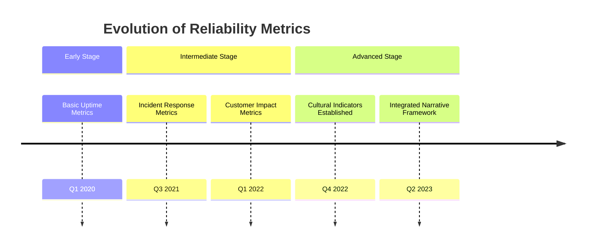

This timeline showcases how the organization has evolved from tracking basic uptime metrics to developing sophisticated cultural indicators that integrate technical and business outcomes. These visuals help the audience grasp the maturity journey and clearly connect past progress to future opportunities. Charts accompanying the timeline highlight trends in reliability improvements, reinforcing the importance of continued investment in both technical and cultural dimensions of reliability.

### Teaching Narrative

The ultimate test of reliability culture measurement isn't the sophistication of its metrics but whether those numbers drive meaningful organizational change. Many technically advanced reliability organizations fail to influence business decisions because they collect the right data but present it without context or narrative structure. Mature reliability cultures develop what we call "reliability storytelling frameworks" that transform raw metrics into compelling narratives that drive executive action.

Effective reliability storytelling involves several key components that ensure metrics are actionable and meaningful:

#### Checklist for Effective Reliability Storytelling:

- **Connect Metrics to Business Outcomes**: Clearly link technical and cultural measurements to tangible business results, such as customer retention, regulatory compliance, or cost savings.
- **Demonstrate Trends Over Time**: Highlight reliability trends and evolutions rather than focusing solely on isolated incidents or static snapshots.
- **Provide Clear Decision Paths**: Translate measurement insights into specific, actionable recommendations that guide strategy and investment decisions.
- **Develop Reliability Translators**: Cultivate individuals capable of interpreting complex metrics and framing them in a way that resonates with non-technical stakeholders.
- **Integrate Technical and Cultural Metrics**: Combine uptime and performance indicators with cultural measurements to provide a holistic view of reliability.
- **Establish Regular Storytelling Forums**: Create recurring opportunities, such as quarterly reviews, where reliability narratives are shared and discussed as part of strategic planning.

In banking environments, where reliability directly impacts regulatory standing and customer trust, these storytelling frameworks are particularly powerful. They help secure resources for both cultural and technical improvements that might otherwise appear as optional investments, ensuring reliability efforts are aligned with broader organizational goals.

### Common Example of the Problem

Capital Investment Bank's SRE team meticulously collected comprehensive reliability data spanning both technical and cultural dimensions. Their quarterly reports included detailed metrics on everything from error budgets to psychological safety scores, backed by rigorous analysis and visualization. However, presenting these reports to executives often felt like handing over a 1,000-page novel without a plot—rich with detail but lacking the narrative thread to make it compelling.

During budget meetings, executives' eyes glazed over at slides packed with unfamiliar metrics and technical terminology. The presentations, while data-rich, failed to connect the dots between reliability measurements and business priorities such as revenue protection, customer retention, competitive differentiation, and regulatory compliance. Without a clear story tying the data to these outcomes, the reports were perceived as dense technical documents rather than actionable insights. Consequently, critical reliability investments were consistently underfunded, dismissed as "technical nice-to-haves" instead of recognized as strategic imperatives. This missed opportunity underscored the critical need for translating raw metrics into narratives that resonate with decision-makers.

### SRE Best Practice: Evidence-Based Investigation

Elite reliability organizations implement frameworks that transform technical measurements into business-compelling narratives. Evidence-based approaches include:

1. **Business Outcome Mapping**: Organizations like Barclays systematically map reliability metrics to specific business outcomes, creating clear visualizations that show how changes in technical and cultural measurements affect revenue, customer retention, and operational efficiency.

2. **Executive Translation Layers**: Forward-thinking institutions create specialized "reliability translators" who serve as bridges between technical metrics and business understanding, developing both the language skills and visualization tools needed to make reliability data meaningful to non-technical stakeholders.

3. **Narrative-Driven Reporting**: Leading organizations structure reliability reporting as coherent stories with clear themes, supporting evidence, and explicit recommendations rather than collections of disparate metrics.

4. **Comparative Business Benchmarking**: Elite reliability teams include industry comparison data in their narratives, showing how the organization's reliability performance compares to competitors on business-relevant dimensions rather than just technical metrics.

5. **Staged Disclosure Approaches**: Research on executive decision-making shows that multilayered information presentation—beginning with business implications before revealing technical details—significantly improves comprehension and action among senior stakeholders.

### Banking Impact

The business consequences of failing to translate reliability metrics into meaningful business narratives include significant financial, operational, and cultural challenges. The table below summarizes these consequences and their quantitative impacts for clarity:

| **Consequence** | **Description** | **Quantitative Impact** |
| -------------------------------- | -------------------------------------------------------------------------------------------------------- | ---------------------------------------------------------------------------------------------------------- |
| **Chronic Underinvestment** | Financial institutions struggle to secure adequate funding for reliability initiatives. | 35-40% less funding for critical reliability efforts compared to organizations with strong narratives. |
| **Reactive Resource Allocation** | Funding is often allocated only after major incidents, leading to higher costs for reactive solutions. | Post-incident improvements cost 3-5x more than preventative investments. |
| **Misaligned Prioritization** | Reliability investments are directed toward visible but less critical systems rather than key platforms. | Critical systems often miss out on necessary reliability funding. |
| **Executive Disconnect** | Lack of compelling reliability narratives results in limited executive engagement in planning sessions. | Executives participate in only 23% of reliability planning sessions, versus 78% with strong frameworks. |
| **Talent Retention Challenges** | SRE teams feel undervalued when their work is not aligned with strategic business goals. | Turnover rates are 2.3x higher, with "lack of organizational impact" being a primary reason for departure. |

These challenges highlight the critical need for effective reliability storytelling frameworks. By connecting reliability metrics to business outcomes, financial institutions can address underinvestment, improve resource allocation, align priorities, enhance executive engagement, and foster talent retention.

### Implementation Guidance

To implement effective reliability storytelling frameworks in your banking organization, follow this actionable checklist:

#### Checklist for Implementation:

1. **Develop Business Impact Translation Maps**:

   - Create mapping documents that explicitly connect each reliability metric to specific business outcomes.
   - Standardize language to explain how changes in metrics impact revenue, customer experience, operational efficiency, and regulatory compliance.

2. **Create a Reliability Storytelling Template**:

   - Design a standardized reporting template to present reliability data as a coherent narrative.
   - Include sections for:
     - Business context
     - Key trends
     - Notable changes
     - Explicit recommendations for actions or investments.

3. **Establish Executive Reliability Reviews**:

   - Schedule quarterly executive sessions dedicated to reliability as a strategic business function.
   - Use these forums to showcase reliability narratives with clear links to business priorities such as customer retention, regulatory goals, or cost savings.

4. **Train Reliability Translators**:

   - Identify team members with both technical expertise and strong communication skills.
   - Provide training in:
     - Data visualization techniques
     - Executive communication strategies
     - Business impact analysis for reliability metrics.

5. **Implement a Multi-Level Reporting Structure**:

   - Develop a tiered reporting system tailored to different audiences:
     - **Executive Summaries**: Focused on business outcomes and high-level insights.
     - **Management Reports**: Containing actionable insights and intermediate detail.
     - **Technical Deep-Dives**: Providing granular data for practitioners.
   - Ensure consistent narrative threads connect all reporting levels.

#### Implementation Flow (Text Representation):

```
[Develop Translation Maps] --> [Design Storytelling Template] --> [Train Translators] --> [Establish Executive Reviews] --> [Multi-Level Reporting]
```

By following this checklist, your organization can transform raw reliability metrics into meaningful narratives that drive strategic decisions and foster a mature reliability culture.
