# Chapter 14: Reliability and Regulatory Compliance

## Chapter Overview

Welcome to the world where regulatory compliance and reliability finally stop pretending they’re strangers at a cocktail party. This chapter rips the dusty clipboard out of the compliance officer’s hands and forces compliance to become an engineering discipline—one that’s automated, observable, and as relentless as a risk manager on a caffeine binge. Forget the old ritual of death-by-audit—here, SREs get to turn regulatory headaches into data problems, bake compliance into pipelines, weaponize chaos engineering for real control testing, and integrate regulatory reporting into incident response before the lawyers even know what happened. If you’re allergic to manual checklists, human error, and late-night compliance fire drills, buckle up. We’re about to turn compliance from a bureaucratic tax into an engineering superpower.

______________________________________________________________________

## Learning Objectives

- **Reframe** compliance as an engineering problem, not just a paperwork parade.
- **Map** regulatory requirements to observable, continuously monitored system signals.
- **Automate** evidence collection, reporting, and compliance verification (because your time is too valuable for screenshots).
- **Integrate** risk tolerance and error budgets to create a common language between SREs and regulators.
- **Inject** compliance controls into chaos engineering experiments for authentic, not theatrical, control validation.
- **Express** compliance policies as code, enforce them in pipelines, and version-control your way out of governance hell.
- **Embed** regulatory reporting into incident response workflows so you never miss a deadline (or a fine).
- **Shift compliance left** by adding automated checks to every stage of your deployment pipeline.

______________________________________________________________________

## Key Takeaways

- Treating compliance as “someone else’s problem” is a direct route to seven-figure fines, public embarrassment, and wasted weekends.
- Manual evidence collection is the tech equivalent of shoveling coal—automate or get buried.
- If your compliance process can’t keep up with your delivery pipeline, your next big product launch is already late (and probably non-compliant).
- Point-in-time audits are a fairy tale; real-world compliance is continuous, ruthless, and should be as observable as uptime.
- “Policy as code” isn’t just trendy—it's the difference between catching violations before prod and reading about them in a regulator’s findings.
- Chaos engineering without compliance validation is just expensive theater; test what regulators actually care about, not just what’s easy to break.
- Regulatory reporting is not a side quest—integrate it into incident response or enjoy your new hobby: writing apology letters to regulators.
- Late-stage compliance fixes create more technical debt than a decade of bad architecture decisions.
- Cross-functional collaboration isn’t optional—if SREs and compliance don’t talk, your auditors will have a field day.
- In the world of SRE, continuous compliance isn’t a buzzword—it’s how you keep your job and your company’s reputation intact.

Now, go forth and automate compliance like your bonuses depend on it—because they probably do.

______________________________________________________________________

## Panel 1: Compliance as an Engineering Challenge

### Scene Description

A tense meeting room where an SRE team and compliance officers are reviewing a stack of regulatory documentation. On a whiteboard, Katherine points to a Venn diagram labeled:

```
       Reliability Engineering
         +-------------+
         |             |
         |  Overlap:   |
         | Continuous  |
         | Compliance  |
         | Validation  |
         |             |
         +-------------+
 Regulatory Requirements
```

Meanwhile, another SRE stands beside a large monitor displaying an observability dashboard. The dashboard showcases an automated compliance report with real-time metrics, such as "Control Validation Success Rate: 98%" and "Non-Conformance Incidents: 2 (Resolved)." The compliance officers exchange surprised but intrigued glances, leaning forward to take a closer look as the SRE explains how these tools streamline regulatory audits.

### Teaching Narrative

Reliability and compliance are often viewed as separate domains—one technical, one bureaucratic—but effective SRE practices transform compliance from a documentation burden into an engineering challenge. When we apply engineering rigor to regulatory requirements, we can automate evidence collection, continuously validate compliance controls, and build guardrails that prevent violations rather than just documenting them after the fact. This shift from manual compliance verification to automated, continuous compliance validation represents a fundamental evolution in how financial institutions approach regulatory obligations.

### Common Example of the Problem

At GlobalBank, the quarterly PCI DSS compliance audit was dreaded by both engineering and compliance teams. The process was plagued with inefficiencies and stress, consuming approximately 600 person-hours and frequently yielding preventable audit findings. Below is a summarized timeline of the audit process and the associated challenges:

#### Timeline of the Quarterly PCI DSS Audit Process

1. **Week 1–2: Evidence Collection**

   - Engineers manually gather evidence from multiple systems:
     - Screenshot configurations.
     - Export access logs.
     - Compile change management records from various tools.
   - **Pain Point:** Disparate systems and manual effort lead to delays and inconsistent data quality.

2. **Week 3: Reconciliation and Validation**

   - Compliance team reconciles collected evidence against regulatory requirements.
   - **Pain Point:** Gaps in evidence often surface, requiring urgent and reactive remediation.

3. **Week 4: Final Review and Submission**

   - Teams finalize the audit package and address any last-minute findings.
   - **Pain Point:** Critical evidence, such as logs, may be missing due to misconfigured retention policies, causing major audit findings.

#### Key Pain Points Checklist

- [ ] Evidence resides in disparate systems, requiring manual collection.
- [ ] High risk of human error during evidence gathering and reconciliation.
- [ ] Misconfigured policies (e.g., log retention) lead to missing critical data.
- [ ] Lack of continuous compliance validation results in reactive firefighting.

This reactive, labor-intensive process highlights the need for an automated, engineering-driven approach to compliance. By implementing continuous visibility and guardrails, organizations can prevent issues like overwritten logs and streamline compliance efforts.

### SRE Best Practice: Evidence-Based Investigation

The SRE approach reframes compliance as a data problem rather than a documentation exercise. By applying observability principles to regulatory requirements, advanced organizations like NetFinance built compliance telemetry directly into their infrastructure. Their engineering team mapped each PCI DSS control to specific, measurable signals: configuration state, access patterns, network segmentation status, and encryption validation. These signals were continuously collected through the same observability pipeline used for operational monitoring, creating a persistent compliance evidence store with tamper-evident integrity verification.

When investigating a potential compliance gap, their SREs followed a structured process:

1. Identifying the applicable regulatory controls and their technical implementations
2. Reviewing historical compliance telemetry to establish baseline compliance state
3. Examining deviations from baseline, with precise timestamps and change attribution
4. Correlating compliance changes with approved change management records
5. Determining the scope and duration of any non-compliant states

Below is an example workflow diagram that illustrates this process:

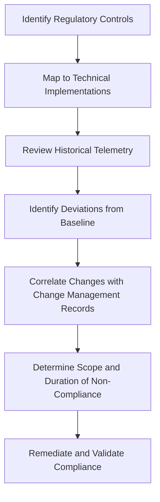

Additionally, the following example code snippet demonstrates how compliance telemetry for encryption validation could be captured and mapped:

```python
import hashlib
import json
from datetime import datetime

# Example function to validate encryption compliance of a file
def validate_encryption(file_path, expected_hash):
    with open(file_path, 'rb') as file:
        file_data = file.read()
        computed_hash = hashlib.sha256(file_data).hexdigest()
        compliance_status = (computed_hash == expected_hash)

    telemetry_entry = {
        "timestamp": datetime.utcnow().isoformat() + "Z",
        "control": "PCI-DSS 3.5.1 - Encryption Validation",
        "file_path": file_path,
        "expected_hash": expected_hash,
        "computed_hash": computed_hash,
        "status": "Compliant" if compliance_status else "Non-Compliant"
    }

    # Persist telemetry record to evidence store (example)
    with open("compliance_telemetry.json", "a") as telemetry_store:
        telemetry_store.write(json.dumps(telemetry_entry) + "\n")

    return compliance_status

# Example usage
file_path = "/secure/data/file.txt"
expected_hash = "abc123...def456"  # Replace with actual hash
if not validate_encryption(file_path, expected_hash):
    print(f"Non-compliance detected for {file_path}. Immediate action required.")
```

This evidence-based approach dramatically reduced investigative time while providing conclusive findings supported by immutable telemetry data rather than point-in-time manual checks. In one case, this system allowed NetFinance to detect an unauthorized configuration change within minutes rather than waiting for the quarterly audit, enabling immediate remediation before any sensitive data was exposed.

### Banking Impact

The business consequences of treating compliance as separate from engineering are severe and multifaceted. Below is a comparison of traditional compliance approaches versus engineering-driven compliance outcomes:

| **Impact Area** | **Traditional Compliance** | **Engineering-Driven Compliance** |
| -------------------------- | ------------------------------------------------------------------------------------------------------------------------------------------------------------ | ------------------------------------------------------------------------------------------------------- |
| **Direct Financial Costs** | $3.2M annually on audit preparation and remediation. Over 40% of technology staff time diverted to compliance activities during audit periods. | 64% reduction in compliance costs due to automation and streamlined processes. |
| **Opportunity Cost** | Product launches delayed by 2-3 months per year due to compliance freezes, impacting revenue and competitiveness. | Compliance guardrails enable continuous delivery with no delays to product launches. |
| **Reputational Damage** | Failed audits led to regulatory findings becoming public, reducing new account openings by 17% in the following quarter. | Continuous compliance validation prevents audit failures and bolsters public trust. |
| **Regulatory Penalties** | A missed data protection violation persisted for 7 months, resulting in a $1.8M fine. | Automated controls and real-time monitoring prevent violations before they occur. |
| **Customer Impact** | Compliance-related change freezes delayed critical system upgrades, causing performance degradation, slower transactions, and increased customer complaints. | Proactive compliance ensures system upgrades are timely, improving performance and customer experience. |

By treating compliance as an engineering challenge, banks can significantly reduce costs, accelerate audit readiness, maintain regulatory integrity, and enhance customer satisfaction. This approach transforms compliance into a competitive advantage rather than a burdensome obligation.

### Implementation Guidance

#### Checklist for Implementing Continuous Compliance

**Step 1: Map Regulatory Requirements to Observable Signals**

- [ ] Analyze each regulatory requirement to identify system states or behaviors that demonstrate compliance.
- [ ] Define specific, measurable signals for continuous monitoring (e.g., encryption settings, access control states).
- [ ] Create a compliance inventory mapping each regulatory control to its observable evidence.
- [ ] Prioritize implementation based on regulatory importance and audit history.
- [ ] Document technical specifications for each compliance signal to ensure consistent implementation.

**Step 2: Instrument Systems for Compliance Telemetry**

- [ ] Extend existing observability instrumentation to capture compliance-specific data.
- [ ] Implement persistent logging with tamper-evident storage for compliance-relevant evidence.
- [ ] Create automated tests to validate correct functioning of compliance instrumentation.
- [ ] Verify all telemetry includes precise timestamps and change attribution.
- [ ] Deploy continuous verification to detect gaps in telemetry collection.

**Step 3: Build Compliance Dashboards and Alerting**

- [ ] Develop real-time dashboards displaying the status of all regulatory controls.
- [ ] Implement alerting mechanisms for compliance deviations with appropriate severity levels.
- [ ] Design compliance views tailored to engineers, compliance officers, and auditors.
- [ ] Ensure dashboards link directly to underlying evidence for quick verification.
- [ ] Establish automated notification workflows for compliance status changes.

**Step 4: Automate Evidence Collection and Reporting**

- [ ] Build automated report generation tools to compile evidence in regulatory formats.
- [ ] Develop compliance evidence APIs for use by internal and external auditors.
- [ ] Schedule evidence snapshot creation in alignment with reporting cycles.
- [ ] Create self-service compliance verification tools for product teams to use pre-deployment.
- [ ] Implement anomaly detection systems to flag potential compliance gaps proactively.

**Step 5: Establish Compliance-as-Code Practices**

- [ ] Use infrastructure-as-code with embedded compliance validation.
- [ ] Maintain a version-controlled compliance policy repository.
- [ ] Write automated tests for compliance rules to run in CI/CD pipelines.
- [ ] Develop a compliance knowledge base accessible to engineering teams.
- [ ] Set up joint engineering-compliance review processes for compliance-as-code implementations.

______________________________________________________________________

#### Step-by-Step Flow Diagram with Key Actions

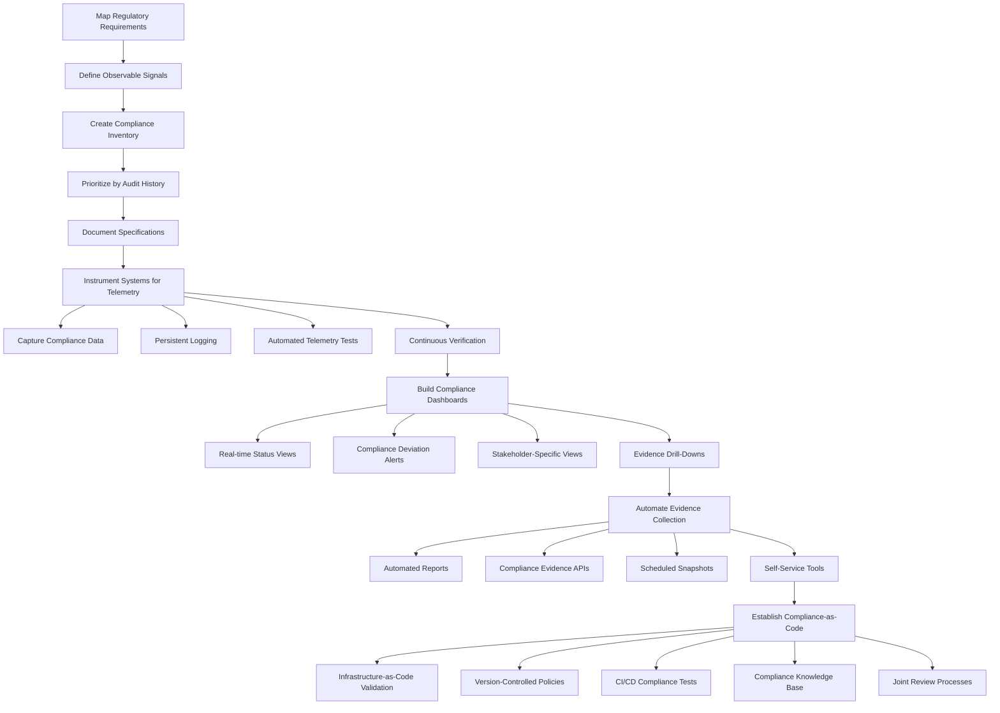

## Panel 2: Observability as Evidence

### Scene Description

An auditor sits with Hector as he demonstrates their observability platform. The screen displays a dashboard organized into three primary sections:

1. **Transaction Monitoring**: Displays live transaction flow metrics and flags anomalies.
2. **Data Privacy Controls**: Highlights compliance adherence with data handling policies.
3. **System Access Logs**: Shows user access events with clear audit trails.

Hector navigates to a "Compliance Evidence Trail" tab, revealing a historical log with tamper-evident timestamps for key compliance events:

```
+------------------+---------------------+-------------------------+
| Event Type       | Timestamp           | Status                  |
+------------------+---------------------+-------------------------+
| Access Granted   | 2023-10-01 10:12:34 | Verified (Tamper-Free) |
| Data Archived    | 2023-10-01 10:15:22 | Verified (Tamper-Free) |
| Policy Updated   | 2023-10-01 10:20:08 | Verified (Tamper-Free) |
+------------------+---------------------+-------------------------+
```

The auditor takes notes as Hector explains how the platform continuously collects and organizes this data for compliance needs. In the background, other team members work normally, unaffected by the audit process, illustrating the non-disruptive nature of the system.

### Teaching Narrative

Traditional regulatory compliance relies on point-in-time assessments and manual evidence collection, creating a discontinuous and resource-intensive process. SRE observability practices fundamentally reshape this approach by treating compliance evidence as a continuous data stream rather than a periodic artifact. By instrumenting systems to automatically capture compliance-relevant telemetry—access patterns, data handling procedures, processing timelines—we transform observability from an operational tool into a compliance evidence engine. This shift allows financial institutions to move from "preparing for audits" to maintaining continuous compliance readiness, dramatically reducing the operational overhead of regulatory requirements while simultaneously improving the quality and reliability of compliance evidence.

### Common Example of the Problem

SecureFinance was under increasing regulatory scrutiny for its anti-money laundering (AML) controls. During a regulatory examination, examiners requested evidence that all international wire transfers over $10,000 were being properly screened against watch lists within the required 30-minute window. The compliance team struggled to provide this evidence, as their transaction monitoring system kept performance metrics but not detailed processing timelines for individual transactions.

The following timeline illustrates the labor-intensive steps taken by the compliance and IT teams to address the examiner's request:

```mermaid
gantt
    dateFormat  HH:mm
    title Timeline of Manual Investigation Process
    section Day 1
    Request Received                :done, r1, 09:00, 1h
    Identify Relevant Databases     :active, r2, 10:00, 2h
    Draft Custom Queries            :active, r3, 12:00, 3h
    Correlate Transaction IDs       :active, r4, 15:00, 4h
    section Day 2
    Cross-Validate Data             :active, r5, 09:00, 5h
    Estimate Screening Times        :active, r6, 14:00, 3h
    section Day 3
    Summarize Findings              :active, r7, 09:00, 2h
    Prepare Report for Examiners    :active, r8, 11:00, 4h
```

This ad-hoc investigation took three full days of intensive effort, during which IT staff had to manually query databases, stitch together data from disparate systems, and estimate screening times based on indirect evidence. Despite their efforts, the results were inconclusive, and the examiners issued a regulatory finding that the bank could not prove consistent compliance with AML screening requirements. As a result, the bank was forced to implement a costly remediation plan including manual transaction reviews until a better monitoring solution could be implemented.

### SRE Best Practice: Evidence-Based Investigation

Continental Trust Bank applied SRE observability principles to transform their AML compliance approach. They implemented distributed tracing across their entire transaction processing pipeline, creating end-to-end visibility into every step of international wire transfers. Each transaction generated a continuous trace that tracked its journey from initiation through validation, screening, approval, and settlement, with precise timestamps at each stage.

When investigating compliance with AML screening requirements, their SREs followed this evidence-based approach:

1. Querying their observability platform for all international wires above the threshold amount.
2. Analyzing the distribution of screening times across transactions, flagging any outliers.
3. Examining the complete trace for any delayed transactions to identify processing bottlenecks.
4. Correlating screening performance with system resource utilization and deployment changes.
5. Generating statistical evidence of overall compliance percentage and trend analysis.

**Checklist: Evidence-Based Investigation Steps**

- [ ] Identify the scope of investigation (e.g., transaction type, threshold amounts, or timeframe).
- [ ] Query the observability platform for relevant transactions and telemetry data.
- [ ] Analyze key metrics (e.g., screening times, completion rates) and flag anomalies or outliers.
- [ ] Trace and review problematic transactions to pinpoint bottlenecks or unexpected behavior.
- [ ] Cross-reference findings with system events, such as resource usage or recent deployments.
- [ ] Summarize findings in a compliance report, including trend analysis and transaction-level evidence.
- [ ] Validate that required compliance thresholds (e.g., screening time SLAs) are consistently met.

This observability-driven approach provided irrefutable evidence that 99.97% of qualifying transactions were screened within the required timeframe, with the ability to drill down into any specific transaction's complete history. When auditors requested evidence, they could instantly generate compliance reports with transaction-level details rather than searching for and assembling data reactively.

### Banking Impact

The business consequences of inadequate compliance observability are substantial and extend beyond regulatory findings. Below is a summary of the before-and-after impacts for banks adopting observability-driven compliance practices:

| **Impact Area** | **Traditional Compliance (Before)** | **Observability-Driven Compliance (After)** |
| ------------------------ | ----------------------------------------------------------------- | ---------------------------------------------------------------- |
| **Audit Overhead** | ~22,000 person-hours annually spent on manual evidence collection | 79% reduction in audit preparation time |
| **Response to Findings** | Average of 17 business days to investigate and respond | Real-time evidence availability reduces response time to hours |
| **False Positives** | 43% of suspicious activity reports deemed unnecessary | Precision telemetry reduces false positives by 58% |
| **Customer Friction** | 2.8% of international payments incorrectly flagged | Transaction-level observability minimizes incorrect flags |
| **Competitive Position** | New product launches delayed by 14 months behind competitors | Continuous compliance readiness accelerates innovation timelines |

Banks implementing these practices not only streamline their regulatory workflows but also enhance their ability to fine-tune compliance rules without increasing risk exposure. This transformation leads to a significant reduction in operational overhead, improved regulatory outcomes, and a more agile competitive stance in the market.

### Implementation Guidance

1. **Implement Compliance-Focused Instrumentation**

   - Map each regulatory requirement to specific data points needed for evidence
   - Extend application instrumentation to capture compliance-specific metadata
   - Implement distributed tracing across regulatory-sensitive transaction flows
   - Create unique compliance trace identifiers that follow transactions across systems
   - Ensure all compliance-relevant events include timestamps, user context, and system state

2. **Build Tamper-Evident Evidence Storage**

   - Implement append-only storage for compliance telemetry with cryptographic verification
   - Create data retention policies aligned with regulatory evidence requirements
   - Establish role-based access controls for compliance data with comprehensive audit logging
   - Implement automated verification of evidence integrity with alerting for any anomalies
   - Deploy immutable backups of compliance evidence with geographic redundancy

3. **Develop Compliance Observability Dashboards**

   - Create real-time visualization of compliance-relevant metrics and events
   - Implement trend analysis to show compliance patterns over time
   - Build drill-down capabilities from high-level compliance status to transaction-level evidence
   - Design specialized views for different regulations (AML, PCI, GDPR, etc.)
   - Establish automated anomaly detection for compliance metrics with appropriate alerting

4. **Create Automated Evidence Collection Mechanisms**

   - Develop self-service evidence extraction tools for compliance teams
   - Implement scheduled evidence snapshots aligned with regulatory reporting cycles
   - Create API endpoints for auditor access to compliance evidence
   - Build templated reports that match regulatory submission formats
   - Establish automated evidence validation to ensure completeness before submission

5. **Implement Continuous Compliance Verification**

   - Deploy automated testing of compliance controls with synthetic transactions
   - Create continuous verification of evidence collection to detect instrumentation gaps
   - Implement compliance thresholds with alerting for potential violations
   - Establish automated reconciliation between control expectations and observed behavior
   - Deploy anomaly detection systems to identify potential compliance issues before they become violations

## Panel 3: Error Budgets and Risk Tolerance

### Scene Description

A risk management committee meeting is in progress, featuring Katherine presenting a dashboard projected onto the wall. The dashboard includes a key chart that illustrates SLOs aligned with regulatory thresholds, alongside a visualization of how their error budget policy correlates with regulatory risk tolerance levels. Below is a simplified representation of the dashboard layout:

```
+-----------------------------------------------+
|               Reliability Dashboard           |
+-------------------+---------------------------+
| SLO Metrics       | Regulatory Thresholds     |
| ------------------|---------------------------|
| Service A: 99.5%  | Threshold A: 99.0%        |
| Service B: 98.7%  | Threshold B: 98.5%        |
| Service C: 99.2%  | Threshold C: 99.0%        |
+-------------------+---------------------------+
| Chart: Error Budget vs. Risk Tolerance Levels |
| (Line graph showing error budget consumption) |
+-----------------------------------------------+
```

Across the room, the CTO and Chief Risk Officer are nodding in approval, visibly aligning on the presented data. A regulator observer sits in the corner, diligently taking detailed notes. On the adjacent wall, a comparison poster is displayed. It contrasts "Yesterday's Risk Appetite Meeting," which relied on traditional qualitative risk ratings (e.g., "High," "Medium," "Low"), with today's approach, which emphasizes quantitative, data-driven metrics. Below is a textual representation of the poster:

```
+-------------------------------------------+
|          Risk Appetite Comparison         |
+-------------------+-----------------------+
| Yesterday         | Today                 |
| ------------------|-----------------------|
| - High risk       | - SLO: 99.5%         |
| - Medium risk     | - Error Budget: 2.5% |
| - Low risk        | - Alerts: 3 active   |
| - Subjective      | - Measurable         |
+-------------------+-----------------------+
```

### Teaching Narrative

Regulatory frameworks require financial institutions to define, measure, and manage risk—but traditional risk management is often qualitative and disconnected from engineering reality. SRE's error budget approach provides a quantitative framework that can align technical reliability measurements with regulatory risk tolerance. By expressing regulatory thresholds as SLOs and tracking compliance through error budgets, we create a common language between engineering, risk management, and regulators. This transforms abstract discussions about "adequate controls" into concrete, measurable reliability targets that can be monitored, alerted on, and continuously validated through the same tooling that supports operational reliability.

### Common Example of the Problem

CapitalEdge Bank's risk management committee maintained a qualitative "Risk Appetite Statement" as required by regulators. This document included vague statements like "low tolerance for payment processing disruptions" and "minimal appetite for data protection risks," but provided no specific metrics for measuring compliance with these standards. During a significant payment outage that lasted 47 minutes, the incident response team had no clear guidance on whether this event exceeded the bank's risk tolerance or what regulatory reporting might be required. The CIO argued the incident was within acceptable parameters, while the Chief Risk Officer believed it constituted a reportable event. This disagreement led to delayed regulatory notification, as teams debated the interpretation of "low tolerance" without quantitative benchmarks. When regulators eventually learned of the incident, they cited the bank for inadequate risk management practices and failure to report a significant operational event promptly. The bank was required to implement enhanced monitoring and more frequent regulatory reporting, increasing compliance costs substantially.

| **Aspect** | **Qualitative Risk Appetite Statement** | **Quantitative SLO-Based Approach** |
| ---------------------------------- | ----------------------------------------------------------- | -------------------------------------------------------------------------------------------------------------- |
| **Payment Processing Disruptions** | "Low tolerance for payment processing disruptions." | SLO: 99.95% availability for payment processing, allowing up to ~21.6 minutes of downtime per month. |
| **Data Protection Risks** | "Minimal appetite for data protection risks." | SLO: 99.99% success rate for data encryption and access control validations, allowing up to ~4.3 minutes/year. |
| **Incident Response Guidance** | Ambiguous; based on subjective interpretation of tolerance. | Clear: Incident exceeding SLO thresholds triggers predefined escalation and reporting workflows. |
| **Regulatory Compliance** | Reactive; dependent on post-incident debates. | Proactive: Automated alerts for SLO violations ensure timely regulatory reporting. |
| **Cost of Compliance** | Increased due to manual reviews and reactive corrections. | Reduced through continuous monitoring and automated reporting tied to SLOs. |

This comparison highlights the limitations of qualitative risk appetite statements, which often lack actionable detail, versus the clarity and operational alignment provided by SLO-based approaches. By adopting quantitative reliability metrics, organizations like CapitalEdge Bank can prevent misinterpretation, reduce response delays, and lower compliance costs while meeting regulatory expectations.

### SRE Best Practice: Evidence-Based Investigation

TrustCore Bank implemented a quantitative risk management framework by adapting SRE error budget concepts to regulatory compliance. They translated their regulatory risk appetite statements into specific Service Level Objectives (SLOs) with clear error budgets. For example, their qualitative statement of "high reliability required for payment processing" was converted to a measurable SLO of 99.99% availability with a 4.38-minute monthly error budget.

When investigating compliance with their risk tolerance framework, their SREs followed this evidence-based approach, summarized in the checklist below:

#### Checklist: Steps for Evidence-Based Investigation

- **Monitor Continuously**: Regularly track SLO performance against defined risk tolerance thresholds to detect deviations early.
- **Assess Error Budget Consumption**: Measure error budget usage rates across critical services to identify potential breaches.
- **Correlate Incidents with Impact**: Link error budget depletion to specific incidents and assess their customer impact.
- **Evaluate Remediation Effectiveness**: Analyze whether post-incident remediation actions successfully preserved remaining error budgets.
- **Validate Compliance Statistically**: Compare actual reliability performance to regulatory commitments, using statistical confidence intervals for accuracy.

#### Example in Practice

During one significant incident, this framework provided immediate clarity: a 3-minute payment gateway disruption consumed 68% of its weekly error budget but remained within regulatory risk tolerance thresholds. This quantitative approach enabled clear, data-driven decisions about incident severity, regulatory reporting requirements, and appropriate response measures without subjective debate.

### Banking Impact

The business consequences of qualitative risk management approaches create significant challenges for financial institutions:

- **Inconsistent Risk Decisions**: AtlanticBank's qualitative approach led to inconsistent escalation decisions, with similar incidents treated differently depending on which executives were involved in assessment.
- **Regulatory Friction**: Vague risk definitions resulted in 14 disputes with regulators over reportable incidents in a single year, damaging the bank's regulatory relationships.
- **Over-investment in Controls**: Without quantitative measures, the bank defaulted to maximum control implementation, spending approximately $7.2M annually on unnecessary controls for low-risk services.
- **Customer Experience Trade-offs**: Uncertain risk boundaries led to conservative decision-making that prioritized risk avoidance over customer experience, resulting in measurable decreases in digital banking adoption rates.
- **Operational Confusion**: During incidents, teams lacked clear guidance on appropriate response levels, leading to either over-mobilization for minor issues or under-response to significant risks.

Banks that transitioned to quantitative risk frameworks reported the following improvements:

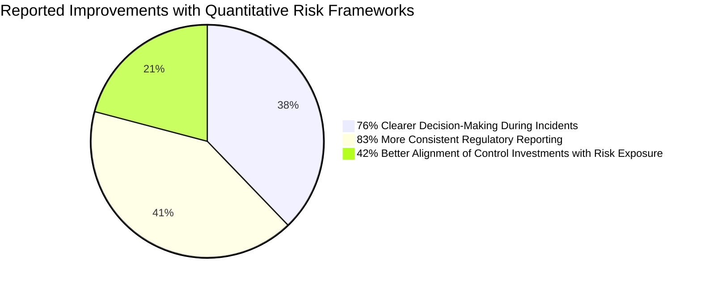

By aligning risk decisions with measurable reliability data, these institutions not only strengthened regulatory relationships but also optimized their operational and customer-facing strategies.

### Implementation Guidance

#### Step 1: Map Regulatory Risk Requirements to SLOs

- **Input:** Regulatory guidance, risk appetite statements.
- **Process:**
  - Identify implicit reliability requirements from regulatory documents.
  - Define measurable SLOs aligned with regulatory thresholds.
  - Establish error budgets reflecting acceptable risk tolerance.
  - Create a mapping document linking regulatory requirements to SLOs.
  - Determine acceptable error budget consumption rates.
- **Output:** Mapped SLOs and error budgets aligned with regulatory expectations.

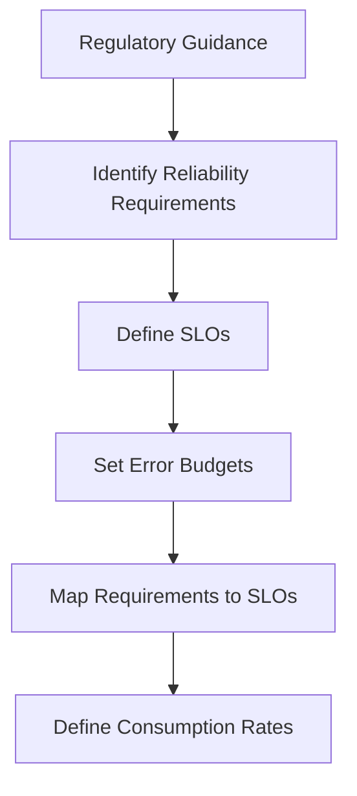

#### Step 2: Implement Risk-Based Error Budget Tracking

- **Input:** SLOs, error budgets, monitoring systems.
- **Process:**
  - Deploy monitoring to track error budget consumption against thresholds.
  - Set up graduated alerting for depletion rates.
  - Define triggers for regulatory reporting based on consumption.
  - Build dashboards showing compliance via error budget metrics.
  - Deploy anomaly detection for unusual consumption patterns.
- **Output:** Real-time tracking and alerting system for error budgets.

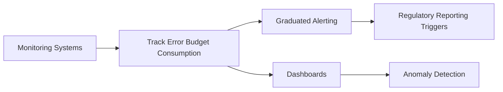

#### Step 3: Develop Risk Governance Processes Using Error Budgets

- **Input:** Error budgets, escalation policies, reporting templates.
- **Process:**
  - Define escalation procedures for budget thresholds.
  - Schedule regular review meetings with risk stakeholders.
  - Translate error budgets into risk management reports.
  - Establish policies for regulatory notifications.
  - Document a process for adjusting SLOs based on regulatory updates.
- **Output:** Risk governance framework incorporating error budgets.

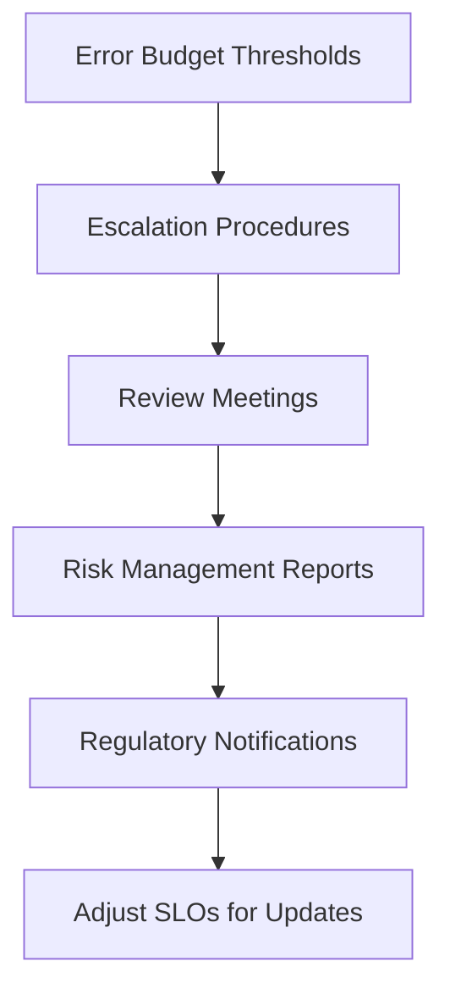

#### Step 4: Build Automated Risk Compliance Reporting

- **Input:** SLO data, reporting systems.
- **Process:**
  - Automate risk compliance report generation from SLO data.
  - Create executive dashboards showing risk status.
  - Develop trend analysis for risk posture over time.
  - Automate notifications for risk threshold violations.
  - Preserve evidence for regulatory reporting based on error budget events.
- **Output:** Automated reporting and evidence preservation system.

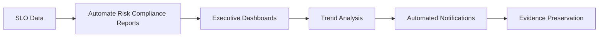

#### Step 5: Establish Cross-Functional Risk Management

- **Input:** Engineering and risk team collaboration, training programs.
- **Process:**
  - Share ownership of error budgets between technical and risk teams.
  - Conduct regular reviews of SLO alignment with regulations.
  - Deliver training on quantitative risk management.
  - Create feedback loops to refine budgets post-incident.
  - Document the error budget approach for regulatory understanding.
- **Output:** Cross-functional collaboration and shared understanding of risk.

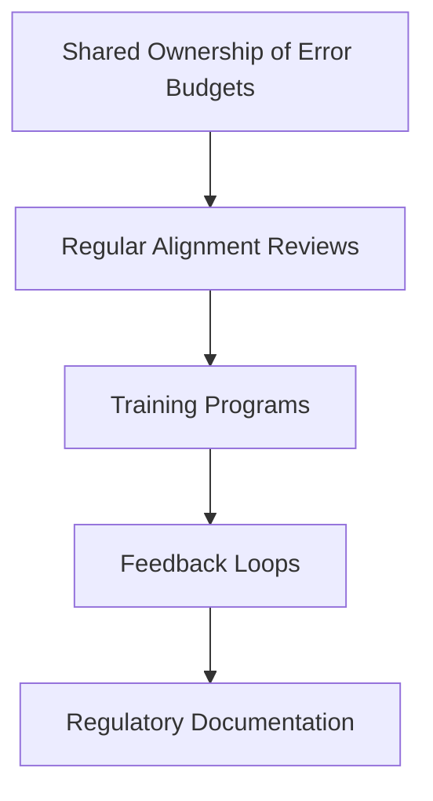

## Panel 4: Chaos Engineering Meets Compliance Testing

### Scene Description

A carefully orchestrated chaos engineering exercise is underway. Screens display a real-time simulation of deliberate fault injection into a payment processing system while automated compliance checks run simultaneously. In the center of the room, a prominent dashboard showcases critical metrics:

- **Regulatory Control Testing**: A gauge tracking the validation status of key regulatory controls.
- **System Reliability Metrics**: Charts displaying error rates, latency, and recovery times during the fault injection.
- **Compliance Evidence Collection**: A progress bar indicating the completion of compliance documentation for this exercise.

To the side, compliance officers and SREs work together, monitoring system responses and documenting how control mechanisms perform under stress. In the corner, a whiteboard lists the regulatory requirements being tested, organized into categories such as "Data Integrity," "Transaction Availability," and "Incident Reporting."

Below is a simplified text-based representation of the dashboard layout:

```
+---------------------------------------------+
|               Chaos Engineering             |
|                 Dashboard                   |
+---------------------------------------------+
| Regulatory Control Testing: 85% validated   |
|---------------------------------------------|
| Reliability Metrics:                        |
| - Error Rate: 2.3%                          |
| - Latency: 120ms                            |
| - Recovery Time: 15s                        |
|---------------------------------------------|
| Compliance Evidence Collection: 60% done    |
+---------------------------------------------+
```

The combination of live metrics, collaborative documentation, and tracking of regulatory requirements provides a comprehensive view of system resilience and compliance in a single, unified exercise.

### Teaching Narrative

Regulations require financial institutions to regularly test controls and validate system resilience—typically through artificial, scheduled exercises that poorly reflect real-world conditions. SRE's chaos engineering practices offer a more effective approach: controlled experiments that verify both system reliability and regulatory controls under realistic conditions. By integrating compliance validation into chaos experiments, we transform separate testing regimes into a unified resilience program. This approach not only improves the quality of compliance evidence but also ensures that regulatory controls function as expected during actual system disruptions, not just during scripted tests. The result is a deeper, more authentic verification of regulatory requirements that simultaneously builds system resilience.

### Common Example of the Problem

RegionalTrust Bank conducted their annual business continuity testing as required by regulatory guidelines. This exercise consisted of a planned, scripted failover to their disaster recovery site during a weekend maintenance window. The test was considered successful when basic connectivity was established and sample transactions could be processed through backup systems.

Six weeks later, an actual regional power outage forced an unplanned failover to the same disaster recovery infrastructure. Despite the successful test, the live incident revealed numerous issues: authentication systems failed to redirect properly, database replication had fallen behind creating data inconsistency, and payment processing capacity was insufficient for normal business volumes. These failures resulted in a 4.7-hour outage for critical banking services, affecting thousands of customers and triggering regulatory reporting requirements.

The post-incident investigation revealed that the scripted test had failed to identify these weaknesses because it didn't reflect realistic conditions or traffic patterns, used sample data rather than full production volumes, and tested components in isolation rather than validating end-to-end functionality.

| Aspect | Scripted Test Outcome | Actual Incident Outcome |
| ---------------------------- | ---------------------------------------------- | ---------------------------------------------------- |
| **Authentication Systems** | Redirect appeared functional under test | Redirection failed for live user sessions |
| **Database Replication** | Replication delays were not simulated | Data inconsistencies due to lagging replication |
| **Traffic Patterns** | Sample data with minimal traffic was used | Production traffic overwhelmed infrastructure |
| **End-to-End Functionality** | Tested components in isolation | Interdependent failures disrupted services |
| **Customer Impact** | No real customer data or transactions involved | Thousands of customers experienced a 4.7-hour outage |

This comparison highlights the limitations of traditional scripted exercises in identifying systemic vulnerabilities. By failing to replicate real-world conditions, such tests often provide a false sense of security, leaving critical weaknesses unaddressed until exposed by actual incidents.

### SRE Best Practice: Evidence-Based Investigation

DigitalFirst Bank revolutionized their compliance testing approach by integrating regulatory control validation into their chaos engineering program. Instead of treating business continuity and disaster recovery testing as separate compliance exercises, they incorporated these requirements into systematic resilience experiments. Their chaos engineering platform was extended to include specific assertions for regulatory controls, with automatic evidence collection for compliance documentation.

When investigating the effectiveness of their regulatory controls, their SREs followed this methodology:

#### Step-by-Step Process:

1. **Define Hypotheses**

   - Develop explicit hypotheses about control effectiveness under various failure conditions.
   - Example: "If a primary database zone fails, the fraud detection system will maintain real-time monitoring."

2. **Design Chaos Experiments**

   - Build experiments to test both technical resilience and regulatory compliance.
   - Include regulatory control assertions in the experiment plan.

3. **Execute Fault Injection**

   - Run controlled fault injection across progressively larger system boundaries.
   - Start with small-scale components and expand to end-to-end system tests.

4. **Collect Evidence**

   - Simultaneously gather system metrics (e.g., latency, failover success) and compliance evidence (e.g., logs proving regulatory controls were triggered).
   - Ensure all evidence automatically maps to regulatory requirements.

5. **Collaborate and Analyze**

   - Work with compliance stakeholders to analyze resilience gaps and determine control effectiveness.
   - Document findings and align them with regulatory reporting needs.

#### Checklist for Evidence-Based Investigation:

- [ ] Clearly define hypotheses for control behaviors under failure conditions.
- [ ] Include regulatory assertions in chaos experiment planning.
- [ ] Inject faults methodically, scaling from component-level to full-system tests.
- [ ] Ensure automated collection of both technical metrics and compliance evidence.
- [ ] Validate and analyze findings with compliance and operational stakeholders.

#### Example Outcome:

During one chaos experiment simulating a zone failure in their cloud infrastructure, this approach revealed that while core transaction processing properly failed over, their fraud detection systems experienced unexpected latency that would have violated regulatory requirements for real-time monitoring. This discovery allowed them to address the compliance vulnerability before it manifested in an actual incident, while generating continuous compliance evidence for their regulatory commitments.

### Banking Impact

The business consequences of artificial compliance testing approaches create substantial risks and operational inefficiencies. Below is a summary of the key metrics highlighting these issues and the advantages of integrating compliance validation into chaos engineering:

#### Business Risks of Artificial Testing

| Metric | Impact |
| ----------------------- | ---------------------------------------------------------------------- |
| **False Confidence** | $2.8M in direct losses from a major outage (e.g., SovereignBank case). |
| **Duplicative Testing** | 3,400+ engineer hours wasted annually on redundant testing efforts. |
| **Inadequate Coverage** | Only 30-40% of critical system interactions validated. |
| **Compliance Findings** | Regulatory actions due to gaps in business continuity preparedness. |
| **Resource Contention** | Friction between compliance and resilience priorities. |

#### Benefits of Chaos Engineering Integration

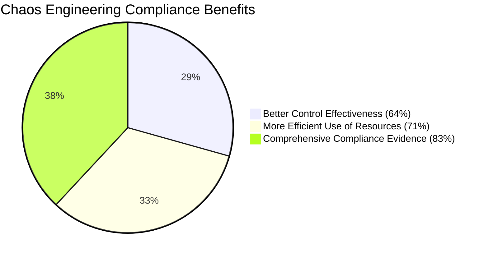

By transitioning to unified chaos engineering and compliance validation practices, banks have achieved significant improvements:

- **64%** better control effectiveness during actual incidents.
- **71%** more efficient use of engineering resources.
- **83%** more comprehensive compliance evidence for regulatory examinations.

This integrated approach not only reduces operational inefficiencies but also ensures that regulatory controls perform effectively during real-world disruptions.

### Implementation Guidance

To streamline the implementation process, the following steps outline a structured approach to integrating chaos engineering with compliance testing. A flowchart is included for visual clarity.

#### Step-by-Step Process

1. **Map Regulatory Testing Requirements to Chaos Experiments**

   - Analyze regulatory requirements for system resilience and control testing.
   - Identify specific compliance assertions that can be validated through chaos engineering.
   - Create a compliance test catalog mapping regulatory requirements to specific chaos experiments.
   - Develop test coverage metrics to ensure comprehensive validation of compliance requirements.
   - Establish validation criteria that satisfy both resilience and regulatory perspectives.

2. **Design Dual-Purpose Chaos Experiments**

   - Develop chaos experiment templates that include compliance validation components.
   - Create fault injection scenarios that specifically target regulated functions.
   - Implement evidence collection mechanisms within chaos engineering platforms.
   - Design graduated testing approaches that scale from component-level to service-level validation.
   - Establish clear abort criteria that protect both system stability and compliance status.

3. **Build Compliance Evidence Collection Into Chaos Platforms**

   - Extend chaos engineering platforms to automatically capture compliance-relevant evidence.
   - Implement structured metadata that maps experiment results to regulatory requirements.
   - Create compliance-specific telemetry during chaos experiments.
   - Establish automated evidence repositories with appropriate retention policies.
   - Develop compliance attestation capabilities based on experiment results.

4. **Implement Cross-Functional Chaos Programs**

   - Create joint chaos engineering teams including SREs and compliance specialists.
   - Establish shared planning processes for resilience and compliance testing.
   - Develop common success criteria that satisfy both technical and regulatory requirements.
   - Implement joint review sessions for experiment results and findings.
   - Create unified reporting that addresses both resilience and compliance audiences.

5. **Establish Continuous Compliance Validation**

   - Deploy frequent, small-scale chaos experiments focusing on specific compliance controls.
   - Implement automated compliance assertion testing in regular chaos experiments.
   - Create progressive testing schedules that regularly validate all compliance requirements.
   - Establish compliance dashboards showing validation coverage and results over time.
   - Develop trend analysis capabilities to track control effectiveness across experiments.

#### Process Flowchart

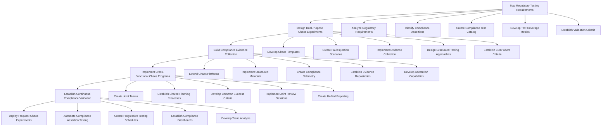

## Panel 5: Automated Governance Through Policy as Code

### Scene Description

An engineering team is seated around a workstation, actively reviewing code from a repository labeled "Compliance as Code." The setup includes:

- **Screen 1**: Displays infrastructure code with embedded policy checks, showing lines of YAML or JSON with inline comments referencing compliance rules.
- **Screen 2**: Shows automated compliance tests running in a CI/CD pipeline, with statuses like "Passed," "Failed," and "In Progress" alongside timestamps.
- **Collaboration**: A compliance officer and a developer are huddled together, discussing and translating a new regulatory requirement into code snippets.
- **Background Dashboard**: A prominent dashboard highlights key metrics:
  - "Policy Violations Prevented This Month: 37"
  - "Manual Compliance Reviews Avoided: 142"

Below is a conceptual layout of the scene:

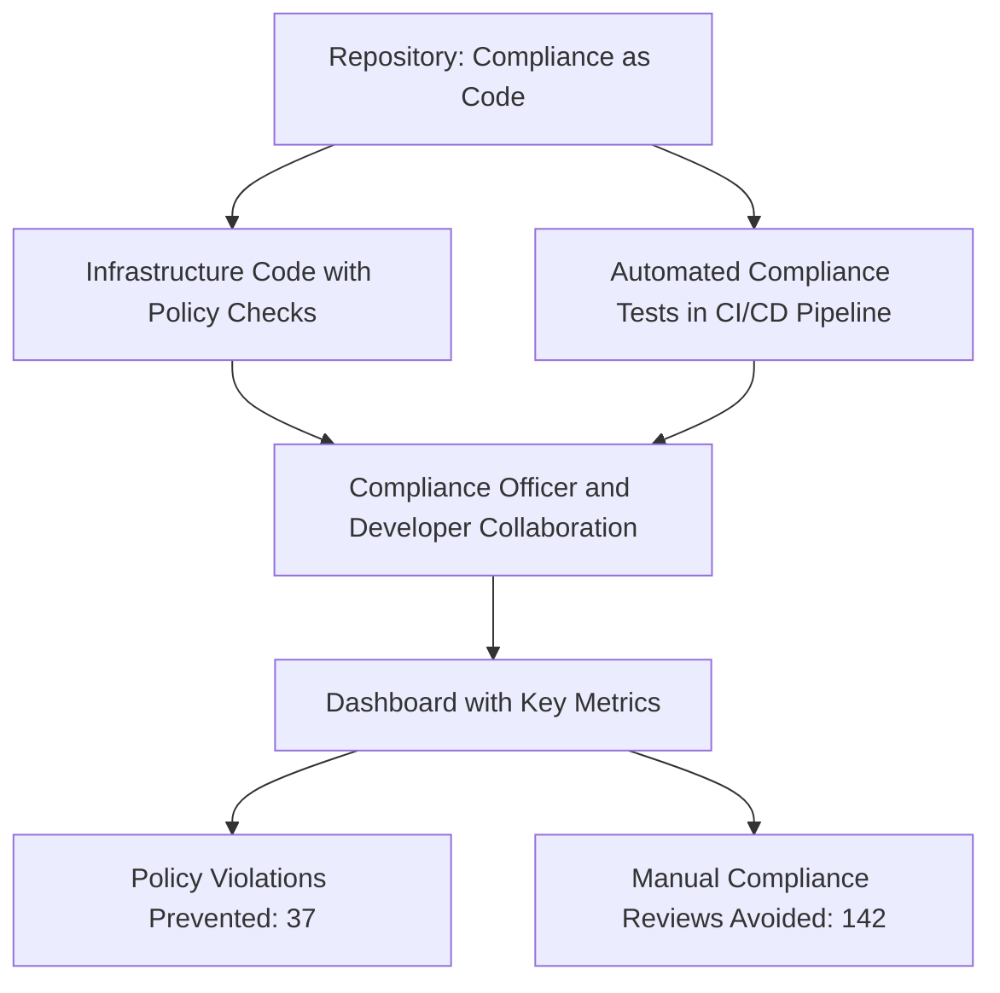

This visualization emphasizes the interconnected nature of policy as code, automation, and real-time metrics, providing a clear and engaging depiction of the workflow.

### Teaching Narrative

Traditional compliance governance relies on manual policy enforcement and review processes that create friction and delay while still allowing violations to occur. SRE practices enable us to codify regulatory requirements as automated policies that can be version-controlled, tested, and continuously enforced. By expressing compliance requirements as code—embedded in infrastructure definitions, CI/CD pipelines, and runtime environments—we can prevent violations rather than detecting them after the fact. This approach transforms governance from a gating process to guardrails that guide development while maintaining velocity. The result is stronger compliance with less friction, allowing engineering teams to move quickly while still operating within regulatory boundaries.

### Common Example of the Problem

InvestBank struggled with enforcing their data residency requirements for customer information. Financial regulations required that certain customer data remain within the country of origin, but their manual governance process couldn't effectively enforce this policy. The compliance team maintained a spreadsheet of data classification guidelines and reviewed architecture diagrams before deployment, but this approach had significant gaps.

Below is a timeline outlining the sequence of events that led to the compliance failure:

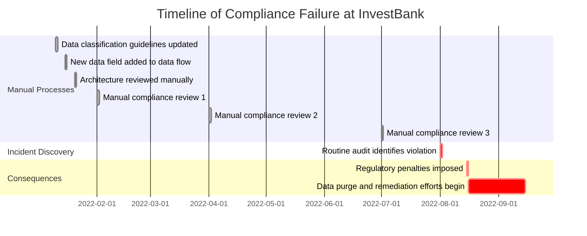

The critical failure stemmed from the violation going undetected for seven months. During this time, a new data field was added to an existing data flow without recognizing its classification implications. Despite three manual compliance reviews, the issue persisted because the manual review process lacked the technical depth to identify the problem.

Ultimately, the violation was discovered during a routine audit, revealing that personally identifiable information (PII) for customers in regulated markets was being replicated to an analytics database in a different geographic region—a clear regulatory violation. This oversight resulted in significant regulatory penalties, a requirement to purge improperly stored data, and costly remediation measures to prevent recurrence.

### SRE Best Practice: Evidence-Based Investigation

MetroFinancial implemented a "policy as code" approach to governance, transforming their regulatory requirements into programmatically enforced rules. They created a compliance policy repository where requirements were expressed as code, tested like any other software component, and automatically enforced throughout their systems. Their data residency requirements were implemented as automated checks in their CI/CD pipeline, infrastructure provisioning tools, and runtime monitors.

When investigating compliance with data residency requirements, their SREs used this evidence-based approach:

1. Reviewing policy definition code to verify the implementation matched regulatory requirements
2. Examining policy enforcement logs showing validation results across all systems
3. Analyzing detected policy violations and prevention actions with precise attribution
4. Correlating policy evolution with changing regulatory requirements over time
5. Measuring the effectiveness of automated enforcement compared to previous manual processes

#### Example: Policy Definition Code

Below is an example of a policy-as-code definition for enforcing data residency in AWS:

```hcl
policy "enforce-data-residency" {
  description = "Ensure all S3 buckets are created in the 'eu-west-1' region to comply with EU data residency requirements."

  rule {
    resource = "aws_s3_bucket"
    condition = "resource.aws_s3_bucket.region == 'eu-west-1'"
    error_message = "S3 bucket must be created in the 'eu-west-1' region to comply with data residency requirements."
  }
}
```

#### Example: Policy Enforcement Log

Here is an example log entry from the CI/CD pipeline when a compliance violation is detected:

```
[2023-10-18 14:23:45] POLICY VIOLATION: enforce-data-residency
Resource: aws_s3_bucket.my_app_bucket
Violation: S3 bucket region is 'us-east-1', but must be 'eu-west-1'
Action: Deployment blocked
Resolution: Update the 'region' field in the Terraform configuration to 'eu-west-1'
```

During one investigation, this evidence-based approach quickly identified that a proposed database migration would have violated data residency requirements, but was automatically blocked by the policy enforcement system. The CI/CD pipeline failed the deployment with a specific explanation of which data fields violated which policies and regulatory requirements. This prevented a compliance violation before it occurred while providing precise guidance on how to modify the design to maintain compliance.

### Banking Impact

The business consequences of manual governance approaches create substantial challenges for financial institutions. Below is a comparison of key metrics before and after implementing automated governance through policy as code:

| **Metric** | **Before (Manual Governance)** | **After (Automated Governance)** | **Improvement** |
| ---------------------------- | -------------------------------------------- | ----------------------------------------- | --------------------------------- |
| **Deployment Delays** | Average of 12 business days per deployment | Reduced to 2 business days per deployment | **84% faster deployment cycles** |
| **Innovation Barriers** | 38% of proposed features abandoned | 8% of proposed features abandoned | **79% reduction in abandonments** |
| **Inconsistent Enforcement** | Frequent inconsistencies due to human errors | Uniform enforcement across all policies | **100% consistency achieved** |
| **Compliance Violations** | 14 significant violations in one year | 1 minor violation in one year | **92% reduction in violations** |
| **Resource Inefficiency** | 23% of tech staff time on compliance tasks | 5% of tech staff time on compliance tasks | **76% lower compliance overhead** |

By automating governance through policy as code, banks not only reduced deployment delays and compliance violations but also freed up engineering resources to focus on value-generating activities. This approach fosters innovation, ensures consistent enforcement, and strengthens regulatory compliance, transforming governance from a bottleneck into a development enabler.

### Implementation Guidance

To successfully implement Automated Governance through Policy as Code, follow these structured steps. Use the checklist and visual representation provided to ensure clarity and actionable progress.

#### **Step 1: Create a Policy as Code Repository**

- [ ] Establish a version-controlled repository for compliance policies expressed as code
- [ ] Select or develop a policy language/framework suitable for your environment
- [ ] Implement automated testing to verify policy definitions for correctness
- [ ] Map regulatory requirements clearly to their corresponding policy implementations
- [ ] Set up change management processes with appropriate approval workflows

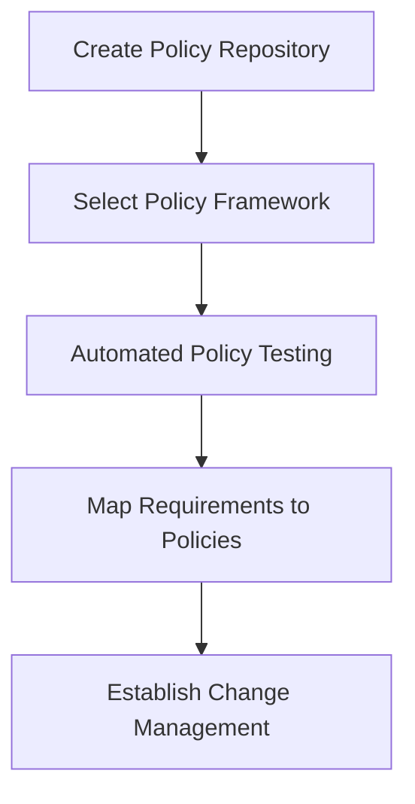

#### **Step 2: Implement Automated Policy Enforcement**

- [ ] Integrate policy validation into CI/CD pipelines to block non-compliant deployments
- [ ] Embed policy checks into infrastructure provisioning tools (e.g., Terraform, CloudFormation)
- [ ] Deploy runtime monitoring for continuous policy compliance
- [ ] Configure automated remediation for specific violations where feasible
- [ ] Enable logging and notifications for all policy evaluations

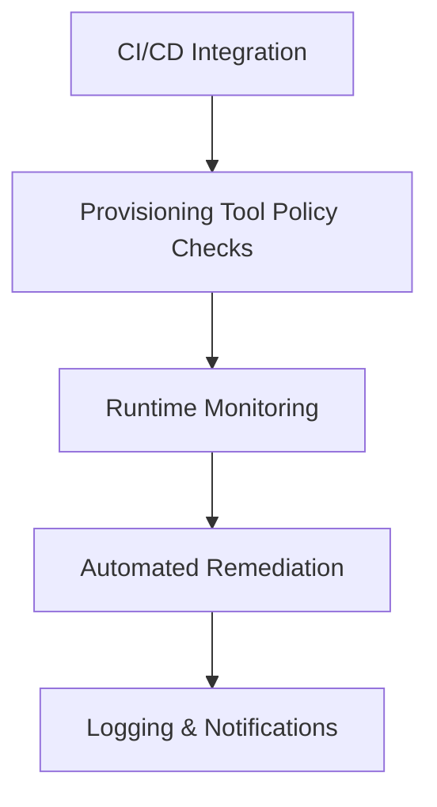

#### **Step 3: Build Compliance Verification Tools**

- [ ] Provide self-service tools for developers to pre-validate compliance
- [ ] Develop visual policy explorers for better understanding of applicable requirements
- [ ] Implement impact analysis tools to assess the effect of policy changes
- [ ] Build automated testing frameworks to validate policy effectiveness
- [ ] Create compliance simulation environments to test enforcement

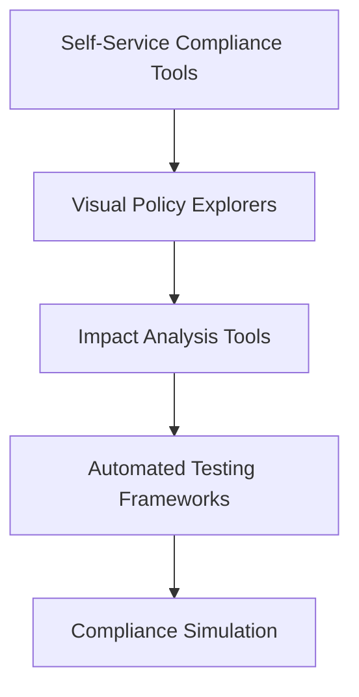

#### **Step 4: Establish Cross-Functional Policy Development**

- [ ] Foster collaboration between compliance experts and engineers
- [ ] Develop workflows to translate regulatory language into codified policies
- [ ] Conduct regular reviews of policy effectiveness with stakeholders
- [ ] Implement feedback loops to refine policies based on practical outcomes
- [ ] Create training programs on Policy as Code for both engineering and compliance teams

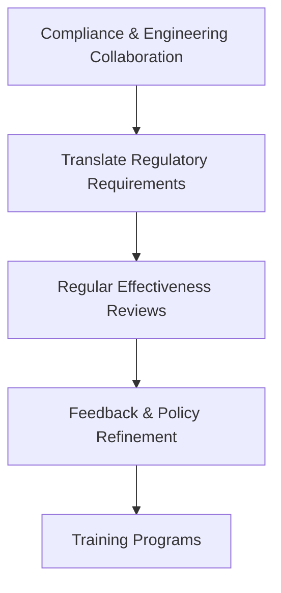

#### **Step 5: Create Compliance Analytics Capabilities**

- [ ] Build dashboards to visualize compliance metrics across systems
- [ ] Enable trend analysis for policy violations and enforcement actions
- [ ] Measure the impact of automated governance on development velocity
- [ ] Translate technical compliance data into regulatory reporting formats
- [ ] Implement anomaly detection to identify unusual violation patterns

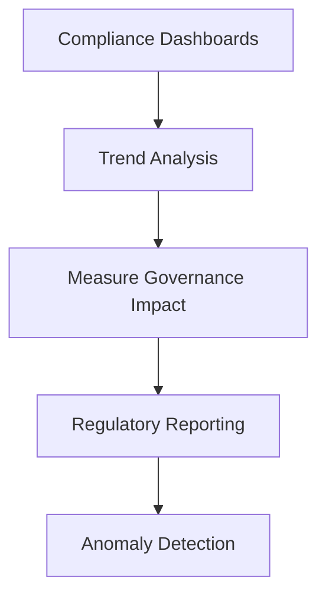

## Panel 6: Incident Response Meets Regulatory Reporting

### Scene Description

An incident war room where an SRE team is managing a system disruption. The room is set up to foster collaboration and streamline both technical resolution and regulatory compliance. Below is a representation of the key elements in the war room:

#### Layout of the War Room

```
+----------------------------+----------------------------+----------------------------+
|     Operational Dashboards | Regulatory Reporting       | Compliance Timeline        |
|     (System Metrics, Logs) | Requirements Checklist     | (Technical & Notification  |
|                            | (Auto-populated in real-   | Deadlines with Status      |
|                            | time based on incident)    | Indicators)                |
+----------------------------+----------------------------+----------------------------+
|                                                                  Incident Commander     |
|                        SRE Team (Managing Disruption)                                  |
|                                                                  Regulatory Liaison     |
+----------------------------------------------------------------------------------------+
```

- **Operational Dashboards**: Display live system metrics, error logs, and performance indicators critical for diagnosing the disruption.
- **Regulatory Reporting Requirements Checklist**: Automatically populated in real-time as the incident unfolds, ensuring compliance obligations are tracked alongside resolution efforts.
- **Compliance Timeline**: Highlights key technical milestones and regulatory notification deadlines, with status indicators showing the progress of both.

The Regulatory Liaison works closely with the Incident Commander, preparing real-time updates for regulators and ensuring the compliance timeline remains on track. This integrated setup allows technical and regulatory workflows to operate in harmony, minimizing distractions while maintaining compliance.

### Teaching Narrative

Financial regulations impose strict incident notification and reporting requirements, traditionally managed as separate processes from technical incident response. SRE incident management practices can integrate regulatory reporting into the core incident response workflow, ensuring that compliance obligations are met without distracting from technical resolution. By treating regulatory reporting as a first-class incident response function—with defined roles, procedures, and automation—we align technical and compliance activities. This integration ensures that regulatory obligations become a natural extension of incident management rather than a competing priority, allowing institutions to maintain compliance even during critical system disruptions.

### Common Example of the Problem

During a major service disruption at FrontierBank, the technical incident response team was fully engaged in restoring core banking services. The incident began at **9:17 AM** when database performance degraded, affecting customer-facing applications. The response team followed their technical playbook, focusing exclusively on service restoration. It wasn't until **4:45 PM**—over seven hours into the incident—that someone questioned whether regulatory notification was required. This triggered an urgent parallel workstream to determine reporting obligations across multiple jurisdictions.

The compliance team, having minimal visibility into the technical details, struggled to assess the incident's scope and impact accurately. They eventually determined that four different regulatory bodies required notification, with deadlines that had already passed. The bank was forced to make late notifications, explaining not only the incident itself but also the delayed reporting. This resulted in regulatory findings, enhanced oversight requirements, and reputational damage that exceeded the impact of the technical incident itself. Post-incident analysis revealed that reporting requirements were known but treated as a separate, secondary concern rather than an integral part of incident management.

#### Timeline Visualization

```mermaid
gantt
    title FrontierBank Incident Timeline
    dateFormat HH:mm
    axisFormat %H:%M
    section Incident Response
    Incident Begins                  :done, start, 09:17, 0h
    Technical Diagnosis              :active, diag, 09:30, 1h
    Core Service Restoration Efforts :crit, restore, 10:30, 6h
    section Regulatory Reporting
    Reporting Realization            :crit, realize, 16:45, 0h
    Reporting Workstream Begins      :active, workstream, 16:50, 2h
    Missed Regulatory Deadlines      :done, missed, 14:00, 0h
    Late Notifications Sent          :done, notify, 18:50, 0h
    section Impact
    Regulatory Findings Issued       :done, findings, 18:30, 0h
    Enhanced Oversight Enforced      :active, oversight, 19:00, 0h
    Reputational Damage Recorded     :crit, reputation, 19:30, 0h
```

This timeline underscores the consequences of delayed regulatory reporting. Key moments—such as the realization of reporting obligations at **4:45 PM** and missed deadlines earlier in the afternoon—highlight the misalignment between technical incident response and compliance workflows. The outcomes, including regulatory findings and reputational damage, serve as a cautionary tale for treating regulatory reporting as an afterthought.

### SRE Best Practice: Evidence-Based Investigation

UnionDigital Bank integrated regulatory reporting directly into their incident management framework, treating compliance notification as a parallel workstream within their response process. Their incident command structure included a dedicated Regulatory Liaison role activated for all severity 1 and 2 incidents, with automated assessment tools to determine reporting requirements based on incident characteristics.

#### Workflow Diagram: Evidence-Based Incident Investigation with Regulatory Integration

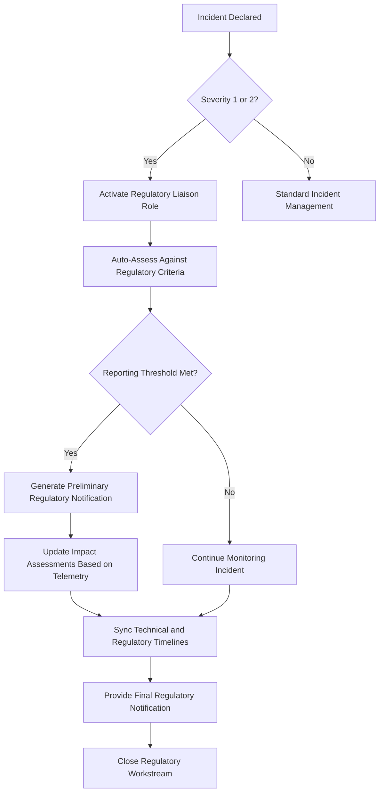

#### Checklist: Steps for Evidence-Based Investigation

01. **Declare Incident**: Ensure the incident is logged and categorized by severity.
02. **Assess Severity**: Determine if the incident qualifies as severity 1 or 2.
03. **Activate Regulatory Liaison**: Engage the Regulatory Liaison for eligible incidents.
04. **Automate Assessment**: Use tools to evaluate the incident against reporting criteria.
05. **Threshold Check**: Determine whether regulatory notification is required.
06. **Prepare Notifications**: Generate preliminary notifications with classification details.
07. **Update Impact Assessments**: Continuously refine assessments based on telemetry.
08. **Synchronize Timelines**: Align technical resolution milestones with regulatory deadlines.
09. **Submit Notifications**: Provide real-time updates to regulators as required.
10. **Close Compliance Workstream**: Ensure all regulatory obligations are fulfilled before closing the incident.

#### Case Example: Payment Processing Disruption

During a recent payment processing disruption, this integrated approach enabled UnionDigital Bank to:

- Notify appropriate regulators within 27 minutes of incident declaration.
- Provide evolving impact assessments as the situation developed.
- Maintain full compliance with regulatory notification requirements.
- Focus technical resources on service restoration without distraction.

Regulatory authorities specifically commended their transparent, timely communication compared to previous incidents.

### Banking Impact

The business consequences of treating regulatory reporting as separate from incident response create significant risks, as illustrated below:

| **Category** | **Statistics/Examples** | **Impact** |
| --------------------------- | ------------------------------------------------------------------------------------------------- | ----------------------------------------------------------------------------- |
| **Reporting Violations** | NorthernTrust faced penalties exceeding **$1.2M** in a year for late/insufficient reporting. | Severe financial repercussions and reputational damage. |
| **Extended Outages** | Incident duration increased by **37%** when technical teams were diverted to regulatory tasks. | Prolonged customer impact and operational disruption. |
| **Regulatory Relationship** | Delayed and inconsistent reporting led to increased scrutiny and more frequent examinations. | Heightened oversight, creating additional operational and compliance burdens. |
| **Inaccurate Reporting** | **41%** of reportable incidents had errors in impact assessments (overstated/understated). | Credibility issues with regulators and potential legal exposure. |
| **Duplicative Effort** | Teams spent an additional **25 hours per major incident** reconstructing timelines post-incident. | Resource drain, delaying post-mortems and slowing overall recovery efforts. |

#### Comparative Benefits of Integration

Banks adopting integrated regulatory response processes achieved the following improvements:

```mermaid
pie title Compliance and Operational Benefits
    "92% Notification Deadline Compliance": 92
    "64% Improved Accuracy in Initial Assessments": 64
    "47% Reduction in Post-Incident Documentation Efforts": 47
```

By aligning technical and compliance workflows, institutions not only mitigate penalties and regulatory risks but also improve operational efficiency and incident response outcomes.

### Implementation Guidance

1. **Integrate Regulatory Requirements Into Incident Process**

   - Map all regulatory reporting requirements across applicable jurisdictions
   - Create incident classification rubrics that incorporate regulatory thresholds
   - Develop integrated incident response playbooks with embedded regulatory steps
   - Establish clear decision trees for determining reporting requirements
   - Create templatized notification formats pre-approved by legal and compliance teams

2. **Implement the Regulatory Liaison Role**

   - Define specific responsibilities and qualifications for the Regulatory Liaison
   - Create training programs covering both incident management and regulatory requirements
   - Develop liaison-specific tools and dashboards for regulatory assessment
   - Establish clear handoff protocols between technical teams and the Regulatory Liaison
   - Create documentation templates specific to the liaison role

3. **Build Automated Regulatory Assessment Tools**

   - Develop systems that automatically evaluate incidents against reporting criteria
   - Create impact assessment tools that translate technical metrics to regulatory categories
   - Implement automated timeline tracking for regulatory deadlines
   - Build notification generation tools with appropriate templates by regulation type
   - Develop evidence collection automation specific to regulatory requirements

4. **Establish Integrated Communication Processes**

   - Create unified communication plans covering both technical and regulatory stakeholders
   - Develop synchronized internal and external notification procedures
   - Implement documentation systems that serve both technical and regulatory needs
   - Establish secure communication channels for sensitive regulatory information
   - Create escalation paths for regulatory decisions within the incident command structure

5. **Implement Post-Incident Regulatory Processes**

   - Develop automated generation of regulatory post-incident reports
   - Create systems to track regulatory commitments made during incident response
   - Establish follow-up procedures for ongoing regulatory communications
   - Implement lessons learned processes specific to regulatory aspects of incidents
   - Create feedback loops to improve regulatory response based on regulator input

## Panel 7: Continuous Compliance through Deployment Pipelines

### Scene Description

The scene showcases a deployment pipeline, visually represented as a series of stages: Development → Build → Test → Staging → Production. Each stage includes automated compliance checks running in parallel with traditional quality tests:

- **Development**: Code is authored and commits trigger the pipeline. Compliance checks validate static code analysis for regulatory adherence.
- **Build**: The application is compiled, and dependency checks ensure third-party libraries meet compliance standards.
- **Test**: Functional, security, and compliance-specific tests run to identify issues early.
- **Staging**: A pre-production environment where the "Compliance Pre-Deployment Report" is generated, highlighting any potential regulatory violations.
- **Production**: Final compliance validation occurs before deployment.

Below is a simplified representation of the pipeline process:

```mermaid
graph TD
    A[Development] --> B[Build]
    B --> C[Test]
    C --> D[Staging]
    D --> E[Production]
    subgraph Compliance Checks
        A --> F[Static Code Analysis]
        B --> G[Dependency Validation]
        C --> H[Compliance-Specific Tests]
        D --> I[Compliance Pre-Deployment Report]
        E --> J[Final Compliance Validation]
    end
```

In the background of the scene, a compliance officer is seen collaborating with a developer, explaining a specific regulatory requirement that impacts their code. This highlights the integration of human oversight alongside automated tools to ensure thorough understanding and alignment with compliance standards.

### Teaching Narrative

Traditional compliance verification happens after systems are built and deployed, creating expensive rework when violations are discovered. SRE practices enable "shifting left" compliance validation by integrating regulatory checks into every stage of the development and deployment process. By automating compliance verification in CI/CD pipelines, we catch and fix violations early—when they're cheapest to address. This continuous compliance approach transforms regulatory requirements from post-deployment constraints into design-time guardrails. The result is systems that are compliant by design rather than through remediation, dramatically reducing both compliance risk and the cost of meeting regulatory requirements.

### Common Example of the Problem

InnovateBank was preparing to launch a new mobile payment feature that included biometric authentication. The development team built the feature according to functional requirements, and it passed all quality assurance tests. However, the compliance review came too late in the process, leading to significant delays and rework. Here's a timeline of events that highlights the problem:

```mermaid
gantt
    title InnovateBank's Mobile Payment Feature Timeline
    dateFormat  YYYY-MM-DD
    section Development
    Feature Design and Development       :done, des1, 2023-01-01, 2023-02-15
    Quality Assurance Testing            :done, qa1, 2023-02-16, 2023-02-28
    section Compliance Review
    Pre-Deployment Compliance Review     :crit, active, comp1, 2023-03-01, 2023-03-03
    Emergency Remediation Effort         :crit, rem1, after comp1, 2023-03-04, 2023-04-15
    section Outcome
    Original Release Date                :milestone, m1, 2023-03-04, 1d
    Delayed Release Date                 :milestone, m2, 2023-04-15, 1d
```

During the compliance review phase, the compliance team identified multiple regulatory issues:

- Biometric templates were stored in a way that violated data protection regulations.
- Required user disclosures about biometric data usage were missing.
- Mandated authentication fallback mechanisms were not implemented.

These findings triggered an emergency remediation effort, but the regulatory issues were too significant to resolve before the original launch date. As a result, the release was delayed by six weeks while the development team redesigned major components to meet compliance requirements.

The impact of this delay was substantial:

- Missed market opportunities due to delayed feature availability.
- Wasted marketing expenditures tied to the original launch timeline.
- Rework costs estimated at $380,000.

A post-mortem revealed the root cause: developers had little visibility into specific regulatory requirements during the design and implementation phases, and compliance verification occurred too late in the development process to prevent costly rework. This example underscores the importance of integrating compliance validation throughout the development lifecycle to avoid such issues.

### SRE Best Practice: Evidence-Based Investigation

AssetCore Bank implemented continuous compliance validation throughout their development and deployment pipeline. They created a "compliance as code" framework that expressed regulatory requirements as automated tests and validations integrated at every stage of development. Compliance requirements were treated as first-class specifications alongside functional requirements, with automated verification beginning from the earliest development phases.

When ensuring compliance through their deployment pipeline, their SREs followed this approach:

1. Running automated compliance validation on code commits to identify issues immediately
2. Performing compliance-specific static analysis focusing on regulatory requirements
3. Deploying test environments with compliance verification instrumentation
4. Executing automated compliance scenarios as part of integration testing
5. Conducting final compliance validation with regulatory-specific test suites before production deployment

#### Example Compliance Test Code Snippet

Below is an example of a compliance test expressed as code to verify that personally identifiable information (PII) is encrypted and stored correctly:

```python
import pytest
from compliance_library import check_encryption, check_data_retention_policy

# Test to ensure sensitive fields are encrypted
def test_pii_encryption():
    sensitive_fields = ["ssn", "credit_card_number", "email"]
    for field in sensitive_fields:
        assert check_encryption(field), f"Field {field} is not encrypted"

# Test to validate data retention policies
def test_data_retention():
    retention_period = 365  # Days
    assert check_data_retention_policy(retention_period), "Data retention policy violated"
```

#### Checklist: Continuous Compliance Implementation

To implement a similar "compliance as code" framework, follow this checklist:

- [ ] Define regulatory requirements as testable specifications (e.g., PII encryption, data retention policies)
- [ ] Integrate compliance tests into the CI/CD pipeline at multiple stages:
  - [ ] Code commit validation
  - [ ] Static analysis for regulatory issues
  - [ ] Integration and system testing
- [ ] Use test environments with compliance verification instrumentation to simulate regulatory conditions
- [ ] Maintain a catalog of reusable compliance test suites for common regulatory requirements
- [ ] Automate reporting to provide developers and stakeholders a clear compliance overview

#### Real-World Impact

During development of a biometric authentication feature, this approach identified potential regulatory issues on the second day of development. Automated tests flagged non-compliant data storage patterns in the initial implementation, suggested compliant alternatives, and verified that required disclosure mechanisms were implemented. By detecting and addressing these issues early in the development cycle, the feature launched on schedule with full regulatory compliance, avoiding costly delays and rework.

### Banking Impact

The business consequences of late-stage compliance verification create significant challenges for financial institutions. Below is a comparison of key metrics before and after implementing continuous compliance through deployment pipelines:

| **Metric** | **Traditional Approach** | **Continuous Compliance Approach** | **Improvement** |
| ---------------------------------------------------- | -------------------------------------- | ----------------------------------------- | ------------------------- |
| **Development Effort Spent on Compliance Rework** | 31% of development effort | 7% of development effort | **76% reduction** |
| **Average Time-to-Market Delay** | 7.2 weeks per feature | 1.1 weeks per feature | **84% faster** |
| **Engineering Capacity Diverted to Unplanned Fixes** | 42% of capacity | 8% of capacity | **81% reduction** |
| **Compliance Issues Post-Release** | 8% of released features | 0.6% of released features | **92% fewer issues** |
| **First-Time Compliance Pass Rate** | 54% during regulatory examinations | 92% during regulatory examinations | **70% increase** |
| **Technical Debt from Compliance Fixes** | High, due to rushed late-stage changes | Low, with compliance integrated in design | **Significantly reduced** |

By shifting compliance verification left and integrating it into CI/CD pipelines, banks like CommerceCapital Bank transformed compliance from a costly, reactive process into a proactive, design-time safeguard. This approach not only reduces regulatory risk but also accelerates delivery timelines and improves engineering efficiency.

### Implementation Guidance

1. **Implement Automated Compliance Testing**

   - Create a compliance test suite covering key regulatory requirements
   - Implement static analysis tools focused on regulatory compliance patterns
   - Develop dynamic testing for compliance-specific behaviors
   - Create compliance validation for infrastructure and configuration
   - Establish automated security and privacy compliance verification

2. **Integrate Compliance Into Every Pipeline Stage**

   - Add compliance checks to developer workflows and IDE tools
   - Implement pre-commit hooks for basic compliance verification
   - Create compliance-specific CI/CD pipeline stages
   - Develop staged compliance validation appropriate to each development phase
   - Implement blocking compliance gates for critical regulatory requirements

3. **Build Compliance Feedback Mechanisms**

   - Create developer-friendly compliance error messages with remediation guidance
   - Implement compliance dashboards showing status across projects
   - Develop trending and analytics for common compliance issues
   - Create self-service compliance validation tools for development teams
   - Establish fast feedback loops for compliance questions

4. **Implement Compliance as Requirements**

   - Integrate regulatory requirements into user stories and acceptance criteria
   - Create compliance requirement libraries accessible to product and development teams
   - Develop compliance-specific acceptance tests as executable specifications
   - Establish traceability between regulatory requirements and implementation
   - Create verification matrices showing compliance coverage

5. **Establish Continuous Compliance Improvement**

   - Analyze compliance issues to identify root causes and patterns
   - Create targeted training based on common compliance challenges
   - Develop reusable components implementing compliant patterns
   - Establish feedback loops from regulatory changes to pipeline validation
   - Create compliance champions within development teams
