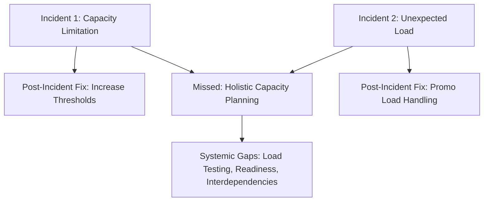
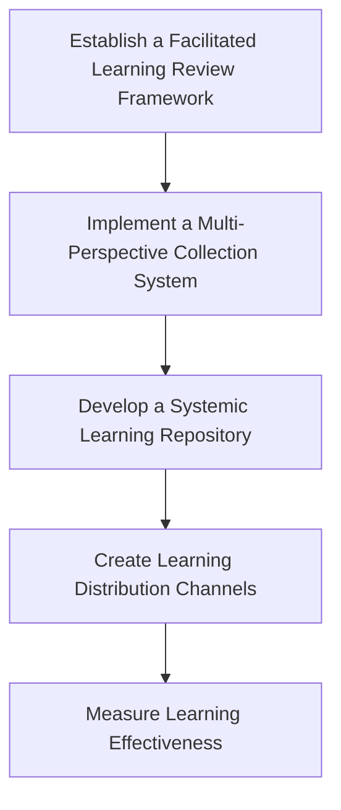
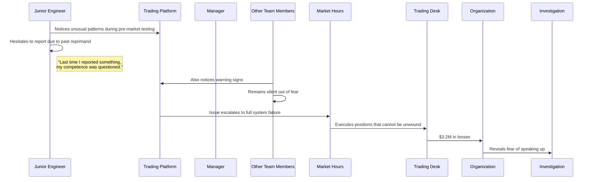
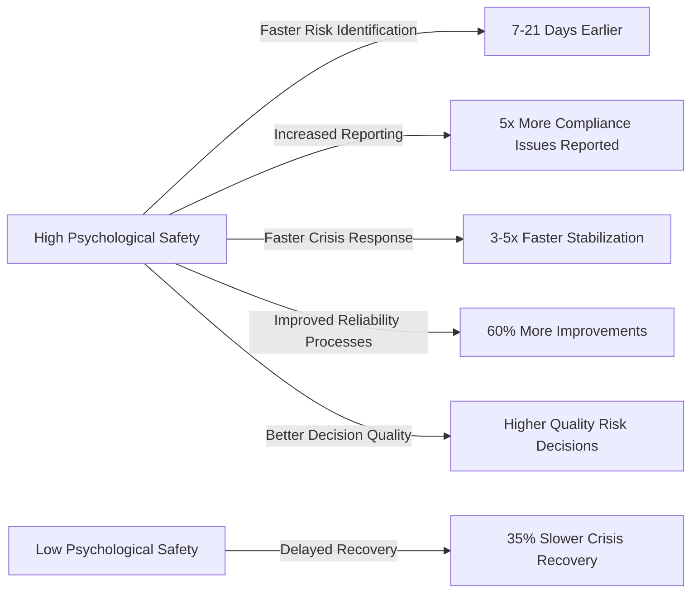
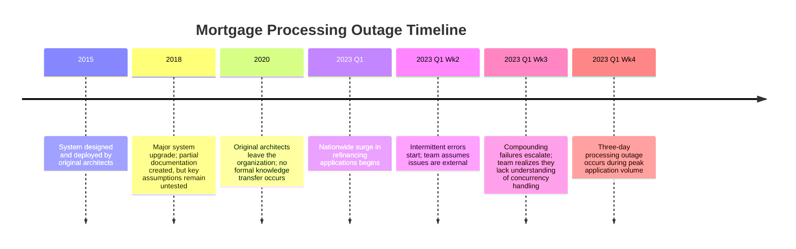
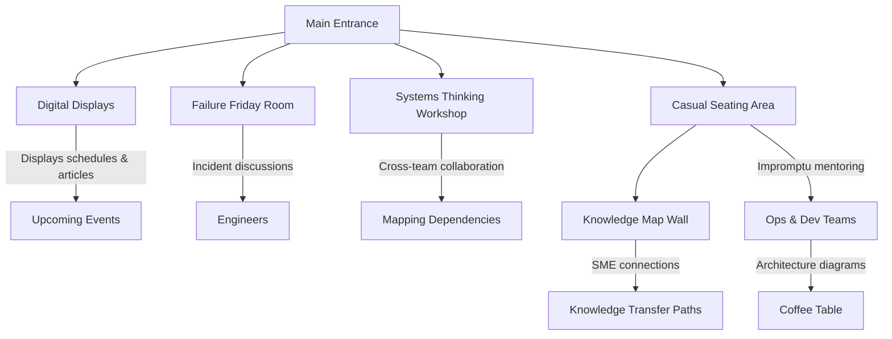
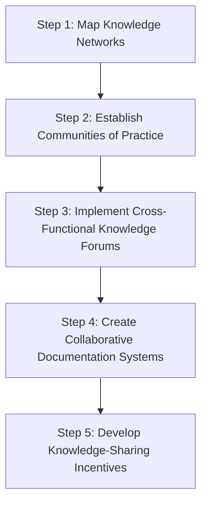
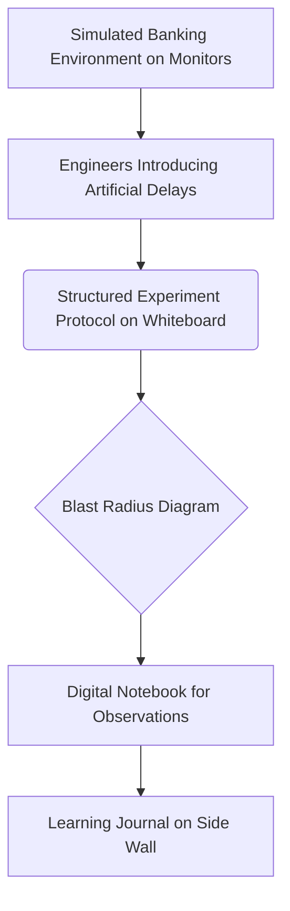
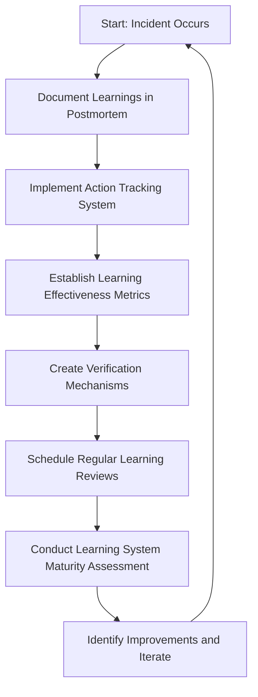

# Chapter 15: Building Learning Organizations

## Chapter Overview

Welcome to the dirty little secret of banking tech: most organizations treat learning like a box-ticking exercise, then act surprised when the same outages keep coming back for more punishment. This chapter cuts through the ceremonial incident reviews, the corporate "lessons learned" charades, and the tribal knowledge hoarding that keeps your engineers fixing the same mess—again and again. If your idea of learning is a PowerPoint and a pat on the back, prepare to be offended.

Here, we torch the myths of “root cause” and “heroic fixes,” expose the business cost of not learning, and show how SREs build organizations that actually improve. We’ll show you how to extract actionable insight from incidents, foster psychological safety so people actually speak up, dismantle knowledge silos, and create feedback loops that do more than just look pretty on dashboards. In banking, failing to learn is a crime against both uptime and the bottom line. So grab your incident retros, your skepticism, and your sense of humor—let’s build a learning organization that actually learns.

______________________________________________________________________

## Learning Objectives

- **Diagnose** why traditional incident reviews fail and how SREs extract real organizational learning from failures.
- **Implement** evidence-based investigation methods that capture systemic factors, not just technical trivia.
- **Cultivate** psychological safety so your team isn’t afraid to say, “Hey, this looks bad.”
- **Embed** a culture of inquiry that values tough questions over comfortable (and often wrong) assumptions.
- **Design** knowledge diffusion networks that puncture silos and prevent the Groundhog Day of outages.
- **Run** continuous, controlled experiments to discover failure modes before your customers do.
- **Close** learning loops with measurable feedback systems that actually drive improvement.
- **Scale** learning across teams, regions, and continents, so every mistake is only made once—globally.

______________________________________________________________________

## Key Takeaways

- If your incident review sounds like a police interrogation, enjoy your repeat outages and engineer attrition.
- Root cause analysis is the IT equivalent of blaming the intern; systemic investigation is where the real learning (and business value) happens.
- “Psychological safety” isn’t HR fluff—without it, critical signals stay buried until they become million-dollar failures.
- The only thing riskier than experimenting is not experimenting—your customers are beta testing your ignorance either way.
- Most banks have more knowledge silos than they have compliance checklists. If your teams don’t share, you’re paying for every solution three times.
- Feedback loops without action tracking are just dashboards for your executive wallpaper. If you’re not measuring learning, you’re not learning.
- Scaling learning isn’t about adding more SharePoint folders; it’s about deliberate architecture and incentives that make knowledge spread faster than failure.
- The business cost of not learning is measured in lost revenue, regulatory smackdowns, and customers who never come back. If that doesn’t get your attention, nothing will.
- If you think “learning organization” means more meetings, congratulations—you’ve already failed. This is about changing how you survive and win in a world that punishes ignorance and rewards adaptation.

______________________________________________________________________

## Panel 1: From Incidents to Insights

### Scene Description

A diverse team sits in a bright meeting room with large windows overlooking the banking district. The walls are covered with visualization boards showing recent incident timelines, system diagrams, and sticky notes with insights. In the center, Katherine, an SRE lead, stands beside Hector Alavaz, a former production support specialist now transitioning to SRE. They're reviewing a complex timeline of a recent payment processing outage. On the screen, a "Lessons Learned" document is being collaboratively edited in real-time as team members contribute insights rather than assigning blame.

### Teaching Narrative

Learning organizations don't just respond to incidents—they systematically extract insights from them. Traditional incident reviews focus on "what broke" and "who fixed it," creating a narrow view that misses broader patterns and systemic improvements. In mature SRE practice, every incident becomes a valuable learning opportunity through structured reflection. This requires shifting from viewing incidents as failures to seeing them as investments in organizational knowledge. The key difference lies in how incidents are documented, analyzed, and shared: learning organizations create living documents that capture not just technical details but cognitive processes, decision points, and systemic factors. They focus on narrative understanding rather than timeline reconstruction, asking "why did reasonable actions make sense at the time?" instead of "what went wrong?" This approach transforms incidents from isolated events into organizational learning assets.

### Common Example of the Problem

A major retail bank experienced a critical incident when their mobile payment platform failed during a holiday shopping weekend. The traditional post-incident review focused exclusively on the technical root cause—a capacity limitation in their payment gateway that couldn't handle the transaction volume. The "fix" implemented was simply to increase capacity thresholds.

Six months later, a nearly identical outage occurred during another high-volume period, but with a different technical trigger. Because the previous review had focused narrowly on the specific technical failure rather than the broader systemic issues, the team had missed critical insights about their capacity planning process, load testing practices, and holiday readiness procedures. The organization's approach to incident analysis had prevented them from seeing the deeper patterns that would have allowed them to prevent the second outage.

#### Visual Comparison of Incident Reviews

| **Aspect**                        | **Incident 1**                                | **Incident 2**                                 | **Missed Opportunity**                             |
| --------------------------------- | --------------------------------------------- | ---------------------------------------------- | -------------------------------------------------- |
| **Technical Trigger**             | Payment gateway capacity limitation           | Unexpected load from new promotional feature   | Lack of holistic capacity planning across systems  |
| **Focus of Post-Incident Review** | Root cause: insufficient capacity             | Root cause: unexpected load                    | Failure to recognize shared systemic patterns      |
| **Action Taken**                  | Increased payment gateway capacity thresholds | Isolated improvement to promo load handling    | No comprehensive updates to load testing practices |
| **Systemic Factors Overlooked**   | Capacity planning process, holiday readiness  | Interdependencies between promotional features | Cross-functional readiness and proactive scaling   |

#### Systemic Issues Diagram



This comparison and diagram emphasize how narrowly-focused incident reviews can lead to repeated failures. By addressing systemic gaps like capacity planning, load testing practices, and readiness procedures, the organization could transform these incidents into actionable insights that prevent future outages.

### SRE Best Practice: Evidence-Based Investigation

SRE organizations replace narrow root-cause analysis with evidence-based investigation methods that capture systemic factors. The Learning Review methodology, adapted from aviation safety practices, focuses on understanding the full context in which incidents occur rather than identifying a single failure point. Key principles include:

1. **Collecting multiple perspectives**: Gathering accounts from everyone involved to create a comprehensive understanding of what happened and why decisions made sense at the time.

2. **Timeline reconstruction with cognitive annotations**: Building detailed timelines that include not just system events but also what people knew, believed, and were trying to achieve at each point.

3. **Identifying "second stories"**: Looking beyond the obvious "first story" (e.g., "engineer made a configuration error") to reveal the underlying conditions that made that error possible or even likely.

4. **Counterfactual analysis**: Exploring how small changes in conditions might have led to different outcomes, revealing leverage points for improvement.

5. **Surprise identification**: Focusing specifically on events that surprised team members, as these reveal gaps between mental models and system realities.

Evidence from organizations that implement this approach shows a dramatic reduction in repeat incidents—Google's SRE teams report that learning-focused reviews reduce similar incidents by over 70%, compared to traditional root-cause analysis that typically reduces recurrence by only 30%.

#### Checklist for Evidence-Based Investigation

To efficiently conduct evidence-based investigations, follow this step-by-step checklist:

- **Step 1: Gather diverse perspectives**

  - Interview all key participants involved in the incident.
  - Document their actions, decisions, and reasoning during the event.

- **Step 2: Reconstruct the timeline**

  - Create a detailed sequence of events, incorporating system logs, human actions, and cognitive factors.
  - Annotate the timeline with what was known and believed at the time.

- **Step 3: Identify the "second story"**

  - Go beyond surface-level issues to uncover systemic conditions or patterns that contributed to the incident.
  - Ask: "What factors made this outcome likely or inevitable?"

- **Step 4: Perform counterfactual analysis**

  - Explore alternate scenarios by varying small details of the incident.
  - Identify points of leverage where changes could have prevented the issue.

- **Step 5: Highlight surprises**

  - Pinpoint moments that deviated from expectations or mental models.
  - Use these insights to improve system understanding and training.

- **Step 6: Document findings and share lessons**

  - Create a living document capturing the investigation process, insights, and actionable recommendations.
  - Share it across teams to foster organizational learning.

By applying this checklist, teams can systematically extract deeper insights from incidents and turn them into actionable knowledge that drives meaningful improvements.

### Banking Impact

The financial consequences of limited learning from incidents are severe in banking environments. When financial institutions fail to extract systemic insights from incidents, they face:

1. **Recurring revenue loss**: A major European bank estimated that repeat incidents from insufficient learning cost them €14.5 million in direct revenue loss over 18 months.

2. **Compounding reputation damage**: Customer research shows that a single outage reduces trust by approximately 7%, but a repeated similar outage reduces trust by 23%—demonstrating that customers are particularly intolerant of banks that "don't learn from mistakes."

3. **Regulatory scrutiny escalation**: Regulatory bodies now explicitly examine whether financial institutions demonstrate learning from incidents. The FCA has increased penalties by an average of 40% for institutions that experience repeat incidents of similar nature.

4. **Operational inefficiency**: Banks that focus only on immediate fixes spend 3-4 times more engineering hours responding to incidents than those that address systemic factors, according to industry benchmarks.

5. **Talent retention challenges**: Exit interviews from multiple financial institutions show that engineers cite "repeatedly fixing the same problems" as a top reason for leaving, creating a talent drain that further impacts reliability.

#### Visualizing the Impact

```mermaid
barChart
    title Banking Incident Impact
    axis X Financial and Operational Consequences
    axis Y Severity (Relative Scale)
    "Recurring Revenue Loss" : 8
    "Reputation Damage" : 7
    "Regulatory Scrutiny" : 9
    "Operational Inefficiency" : 6
    "Talent Retention Challenges" : 5
```

This visualization highlights the relative severity of the identified consequences, emphasizing why systemic learning is critical for financial institutions. By addressing root causes and adopting a learning-focused incident response process, banks can mitigate these risks and build long-term resilience.

### Implementation Guidance

#### Overview Flowchart

Below is an overview flowchart illustrating the recommended implementation steps and their relationships:



#### Step-by-Step Guidance

1. **Establish a Facilitated Learning Review Framework**

   - Create a structured protocol for conducting post-incident reviews that focuses on learning.
   - Train dedicated facilitators who are not directly involved in the incident.
   - Develop templates that guide teams toward systemic understanding rather than blame.
   - Schedule reviews 3-5 days after incidents to allow reflection but maintain freshness.
   - Ensure psychological safety by explicitly separating performance management from incident learning.

2. **Implement a Multi-Perspective Collection System**

   - Create mechanisms to capture perspectives from all participants, including those not directly involved in response.
   - Use structured prompts that focus on decision contexts rather than outcomes.
   - Collect perspectives before the group review to prevent groupthink.
   - Include perspectives from customer support, business units, and other stakeholders.
   - Document contradictions in perspectives as valuable learning opportunities rather than "inaccuracies."

3. **Develop a Systemic Learning Repository**

   - Establish a searchable knowledge base of incident learnings.
   - Tag incidents with systemic patterns and contributing factors rather than just technical components.
   - Include links between related incidents to build pattern recognition.
   - Make the repository accessible across the organization, not just within SRE teams.
   - Build reporting capabilities that highlight recurring patterns across incidents.

4. **Create Learning Distribution Channels**

   - Establish regular forums for sharing incident learnings across teams.
   - Create incident learning summaries targeted at different audiences (executive, technical, business).
   - Develop visualization techniques that communicate systemic factors effectively.
   - Institute "learning champions" who facilitate knowledge transfer between teams.
   - Integrate incident learnings into onboarding and training materials.

5. **Measure Learning Effectiveness**

   - Track reduction in repeat incidents as a key metric.
   - Measure improvements in time-to-detection for similar issues.
   - Survey team members about their understanding of systemic factors.
   - Monitor the implementation rate of systemic recommendations versus technical fixes.
   - Create feedback loops to evaluate and improve the learning process itself.

## Panel 2: Creating Psychological Safety

### Scene Description

The bank's executive boardroom hosts an unusual scene. The CTO stands at the front beside a projection showing "Reliability Learning Review" with a senior engineer who is openly discussing a major mistake they made that contributed to a trading platform outage. Rather than appearing defensive, the engineer looks comfortable as they explain their thought process. The executives are leaning forward, engaged and asking thoughtful questions about systemic factors rather than individual actions. On a whiteboard, someone has written "Focus on learning, not blaming" and "The question is not 'who', but 'how'." A junior team member is visibly taking notes, looking empowered rather than fearful.

### Teaching Narrative

Psychological safety forms the foundation of any learning organization—without it, critical information remains hidden and improvement is impossible. In high-consequence environments like banking systems, team members often fear reporting problems, admitting mistakes, or questioning processes due to potential career repercussions. This creates dangerous information gaps that prevent systemic improvement. True reliability requires creating environments where people can speak honestly about failures, near-misses, and concerns without fear of punishment or humiliation. Leaders establish psychological safety by modeling vulnerability, responding productively to failures, emphasizing systemic improvement over individual blame, and visibly valuing honest communication over perfect performance. When team members see that sharing difficult information leads to improvement rather than punishment, information flows increase dramatically, enabling the organization to address problems that would otherwise remain hidden until they cause major incidents.

### Common Example of the Problem

At a major investment bank, a junior engineer noticed unusual patterns in their high-frequency trading platform's behavior during pre-market testing. Having previously been reprimanded for raising "false alarms," the engineer hesitated to report the anomaly. By the time the issue manifested as a full system failure during market hours, the trading desk had already executed positions that couldn't be unwound, resulting in $3.2 million in losses. A post-incident investigation revealed that at least three other team members had also noticed warning signs but remained silent due to fear of appearing incompetent or being blamed if they were wrong. The organization's lack of psychological safety had directly prevented early detection and mitigation of a costly failure.

The sequence of events can be summarized as follows:



This timeline highlights how a single point of hesitation, amplified by a culture lacking psychological safety, can cascade into significant business consequences. By addressing systemic issues and fostering an environment where team members feel safe to report anomalies early, organizations can prevent such failures and build a more resilient system.

### SRE Best Practice: Evidence-Based Investigation

The most effective SRE organizations systematically build psychological safety through structured practices rather than simply encouraging it through values statements. Google's Project Aristotle research identified psychological safety as the most critical factor in high-performing teams, and subsequent research has developed evidence-based approaches to measuring and improving it in technical organizations.

Below is a summary of five key evidence-based approaches, their purpose, and expected outcomes:

| **Approach**                          | **Purpose**                                                                                          | **Expected Outcomes**                                                                                 |
| ------------------------------------- | ---------------------------------------------------------------------------------------------------- | ----------------------------------------------------------------------------------------------------- |
| **Safety Climate Assessment**         | Measure psychological safety across teams using validated survey instruments.                        | Identify specific barriers to open communication and areas requiring improvement.                     |
| **Leader Behavior Analysis**          | Observe and evaluate how leaders respond to failures, mistakes, and bad news.                        | Provide actionable feedback to leaders on behaviors that enhance or undermine psychological safety.   |
| **Communication Pattern Measurement** | Analyze team interactions, including conversational turn-taking and response to dissenting opinions. | Gain insights into how ideas are shared and ensure inclusive, respectful team dynamics.               |
| **Incident Response Evaluation**      | Review handling of unexpected events to assess focus on learning versus blame.                       | Promote learning-focused responses, improving systemic reliability and reducing fear of repercussion. |
| **Near-Miss Reporting Analysis**      | Track voluntary reports of problems that did not yet cause incidents.                                | Increase early detection of potential issues, fostering a proactive reliability culture.              |

Organizations that implement these measurement-based approaches show 4-5 times higher rates of early problem detection and significantly reduced time to resolve incidents. By creating an environment where team members freely share information without fear of repercussions, these practices enable continuous improvement and long-term systemic reliability.

### Banking Impact

The absence of psychological safety creates specific business impacts in banking environments:

1. **Delayed Risk Identification**: Financial institutions with low psychological safety typically identify material risks 7-21 days later than those with high safety, directly increasing exposure.

2. **Compliance Vulnerabilities**: Without psychological safety, employees are 5 times less likely to report potential compliance issues, creating significant regulatory exposure.

3. **Crisis Response Degradation**: During financial market disruptions, teams with low psychological safety take 3-5 times longer to stabilize systems, as critical information remains siloed.

4. **Innovation Suppression**: Banks with low psychological safety show 60% fewer implemented improvements to reliability processes, as team members avoid suggesting changes.

5. **Decision Quality Reduction**: Risk committees in low-safety environments make demonstrably poorer decisions due to incomplete information and artificial consensus.

A study of financial institutions after the 2008 crisis found that banks with higher psychological safety recovered over 35% faster and implemented more effective controls against future crises than their low-safety counterparts.



This visualization highlights the stark differences between environments with high and low psychological safety, emphasizing the critical business impacts for banks.

### Implementation Guidance

To effectively create psychological safety within your organization, use the following checklists to guide implementation across five key areas:

______________________________________________________________________

#### **1. Leader Response Transformation**

- **Training & Preparation**

  - Train leaders to respond constructively to failures and bad news.
  - Practice specific response scripts for handling problem reports.

- **Behavior During Problem Reporting**

  - Enforce a "no interruption" rule when issues are being presented.
  - Focus questions on systemic factors, not individual actions.

- **Feedback & Review**

  - Establish processes to review leaders’ behavior during incidents and learning reviews.

**Checklist:**

- [ ] Have all leaders completed psychological safety response training?
- [ ] Are response scripts practiced regularly in simulations?
- [ ] Is a "no interruption" rule consistently applied during problem discussions?
- [ ] Are systemic factors emphasized over individual blame in executive reviews?
- [ ] Is leader behavior reviewed post-incident for alignment with psychological safety principles?

______________________________________________________________________

#### **2. Establish Psychological Safety Measurement**

- **Assessment & Visibility**

  - Conduct quarterly psychological safety assessments using validated tools.
  - Use dashboards to track team-level safety trends over time.

- **Analytics & Feedback**

  - Correlate safety metrics with incident detection and resolution data.
  - Collect anonymous feedback on specific meetings and interactions.

- **Normalization**

  - Share comparative safety data across teams to encourage improvement.

**Checklist:**

- [ ] Are quarterly psychological safety assessments conducted and reviewed?
- [ ] Do team dashboards display current and historical safety trends?
- [ ] Are safety metrics correlated with operational performance (e.g., incident response)?
- [ ] Is anonymous feedback regularly gathered about key interactions?
- [ ] Are safety trends shared across teams to promote awareness and normalization?

______________________________________________________________________

#### **3. Create Structured Communication Practices**

- **Inclusive Input**

  - Use "round-robin" input gathering to ensure all voices are heard.
  - Assign explicit devil's advocate roles to normalize constructive disagreement.

- **Facilitation**

  - Separate idea generation from evaluation during discussions.
  - Train moderators to intervene when communication patterns become unsafe.

- **Resources**

  - Develop checklists for facilitating high-stakes discussions on system risks.

**Checklist:**

- [ ] Are "round-robin" techniques used in key meetings to ensure inclusion?
- [ ] Are devil's advocate roles assigned for critical discussions?
- [ ] Do facilitators separate idea generation from idea evaluation?
- [ ] Are moderators trained to manage unsafe communication dynamics?
- [ ] Are facilitation checklists available and used for high-stakes discussions?

______________________________________________________________________

#### **4. Implement Celebration of Speaking Up**

- **Recognition Programs**

  - Formalize recognition for team members who identify problems early.
  - Highlight stories where raising concerns led to system improvements.

- **Cultural Reinforcement**

  - Establish "good catch" programs to reward near-miss reporting.
  - Publicly acknowledge leaders who respond well to difficult news.

- **Visual Messaging**

  - Create artifacts that reinforce the importance of speaking up.

**Checklist:**

- [ ] Are team members formally recognized for identifying problems early?
- [ ] Are success stories about speaking up shared across the organization?
- [ ] Is there an active "good catch" program for near-miss reporting?
- [ ] Are leaders publicly acknowledged for constructive responses to bad news?
- [ ] Are visual artifacts promoting speaking-up behaviors prominently displayed?

______________________________________________________________________

#### **5. Develop Failure Response Protocols**

- **Documentation & Training**

  - Create clear, documented protocols for responding to different failure types.
  - Train teams in blameless explanation techniques to describe failures.

- **System Improvement Focus**

  - Implement after-action reviews that prioritize systemic learning.
  - Develop feedback loops to evaluate how failures were handled.

- **Consistency**

  - Use a standardized "failure response checklist" for issue handling.

**Checklist:**

- [ ] Are failure response protocols documented and accessible to all teams?
- [ ] Have teams received training in blameless explanation techniques?
- [ ] Are after-action reviews conducted with a focus on system improvement?
- [ ] Are feedback mechanisms in place to assess handling of failures?
- [ ] Is a failure response checklist consistently used during incidents?

______________________________________________________________________

## Panel 3: Building a Culture of Inquiry

### Scene Description

An open-concept office space is divided into three distinct areas, each fostering a culture of inquiry through active collaboration and visible learning tools. Below is a labeled text diagram to help visualize the layout and interactions:

```
+-----------------------+-----------------------+
|                       |                       |
|  Pair Programming     |   Whiteboard Area     |
|  - Senior & Junior    |   - Team mapping      |
|    engineer debugging |     complex system    |
|    authentication     |     flow              |
|  - Socratic questions |   - Sticky notes for  |
|    guide the process  |     gaps/assumptions  |
|                       |                       |
+-----------------------+-----------------------+
|                       Entrance                |
|  Question Board       - Physical board for    |
|  - Ongoing technical  |   team inquiries      |
|    & process queries  | - Questions flagged   |
|  - Leadership flags   |   as "great" by       |
|    "great questions"  |   leadership          |
|                       |                       |
+-----------------------------------------------+
|                       |                       |
|  "Did You Know?"      |                       |
|  Digital Displays     |                       |
|  - Rotating insights  |                       |
|    from investigations|                       |
|                       |                       |
+-----------------------+-----------------------+
```

1. **Pair Programming Corner**: A senior and junior engineer collaborate while debugging an authentication service issue. The senior engineer encourages learning by asking Socratic questions rather than providing direct answers, promoting critical thinking and deeper understanding.

2. **Whiteboard Area**: A team gathers around a whiteboard, mapping a complex system flow. Sticky notes highlight knowledge gaps and assumptions that require validation. The focus here is on shared understanding and uncovering blind spots.

3. **Question Board at the Entrance**: A physical board displays ongoing technical and process inquiries from team members. Leadership actively engages by flagging certain submissions as "great questions," reinforcing the value of curiosity and thoughtful inquiry.

4. **"Did You Know?" Digital Displays**: Throughout the office, digital screens rotate insights from recent investigations and discoveries, creating a visible, shared repository of learning.

This layout illustrates how the physical environment supports a culture of inquiry, making learning and questioning integral to daily work.

### Teaching Narrative

Learning organizations cultivate systematic inquiry as a daily practice, not just during incidents. Traditional banking technology teams often operate from historical knowledge and established procedures, creating a false sense of certainty about complex systems. SRE practices instead embed continuous questioning into everyday work through techniques like assumption testing, exploratory analysis, and deliberate investigation of "normal" operations. This culture of inquiry makes unknown unknowns visible before they become incidents. Teams that excel at reliability regularly ask questions like "What don't we understand about this system?" and "How might our current mental models be incomplete?" They treat questions as valuable intellectual assets rather than signs of incompetence. By normalizing not-knowing and rewarding curiosity, organizations develop more accurate understanding of their systems and can address gaps proactively. The most reliable organizations are those where asking good questions is as valued as having answers, and where leadership demonstrates that learning has higher status than already-knowing.

### Common Example of the Problem

A major retail bank's mortgage processing platform had functioned reliably for years, leading most team members to consider it a "solved system" that rarely needed attention. The team operated with unquestioned assumptions about its behavior and dependencies. When a nationwide surge in mortgage refinancing applications hit during a period of falling interest rates, the system began experiencing intermittent failures that baffled the team. Initial investigation revealed significant knowledge gaps: no one on the current team fully understood how the system handled concurrent loads across its distributed components. The original architects had left years ago, leaving behind outdated design documents from three major versions earlier that formed the basis of the team's mental models.

The following timeline illustrates the sequence of events leading to the outage:



Without a culture that encouraged questioning assumptions about even seemingly "stable" systems, the organization had developed dangerous knowledge gaps. The result was a major disruption during a critical business period, causing a three-day outage and a competitive disadvantage as customers moved to other lenders who could handle the surge in demand. This example highlights the consequences of failing to embed systematic inquiry into daily operations and assumptions.

### SRE Best Practice: Evidence-Based Investigation

Leading SRE organizations implement structured inquiry practices based on research from high-reliability industries like aviation and nuclear power. These approaches systematically surface knowledge gaps before they cause incidents:

1. **Assumption Testing Protocols**: Formalized processes for identifying and validating assumptions about system behavior through targeted investigation rather than waiting for failures.

2. **Pre-Mortem Analysis**: Structured workshops where teams imagine potential future failures and work backward to identify current knowledge gaps that could contribute to those scenarios.

3. **Investigation Rotation Programs**: Dedicated time for engineers to explore systems outside their immediate responsibility, bringing fresh perspectives and questions to taken-for-granted components.

4. **Ignorance Mapping**: Collaborative exercises that explicitly document what teams don't know about their systems, creating visibility into knowledge gaps.

5. **Normal Operation Investigations**: Studies of systems during successful operation to understand factors contributing to reliability, rather than waiting for failures to learn.

#### Evidence-Based Investigation Checklist

Use this checklist to implement evidence-based investigation practices in your team:

- [ ] **Identify Assumptions**

  - List all assumptions about system behavior.
  - Prioritize assumptions most critical to reliability.
  - Validate assumptions through structured testing or observation.

- [ ] **Conduct a Pre-Mortem Analysis**

  - Schedule regular team workshops to explore "what could go wrong?"
  - Document potential failure scenarios and contributing knowledge gaps.
  - Develop action plans to address identified gaps.

- [ ] **Rotate Investigators**

  - Assign engineers to investigate systems outside their usual scope.
  - Encourage documentation of fresh insights and questions.
  - Share findings with the team to identify overlooked risks.

- [ ] **Map Ignorance**

  - Facilitate team sessions to explicitly list "what we don’t know."
  - Categorize unknowns by impact and urgency.
  - Use the map to guide learning and exploratory efforts.

- [ ] **Analyze Normal Operations**

  - Regularly study systems during periods of stability.
  - Identify factors contributing to normal operation reliability.
  - Document findings to reinforce mental models and improve resilience.

Organizations that implement these systematic inquiry practices report 40-60% improvements in their ability to predict and prevent major incidents, and knowledge gap identification rates 5-8 times higher than traditional approaches.

### Banking Impact

The absence of a questioning culture creates specific business consequences in banking environments. A comparative analysis underscores the tangible impact of fostering a culture of inquiry:

#### Key Metrics Comparison: High-Inquiry vs. Low-Inquiry Organizations

| Metric                              | High-Inquiry Organizations               | Low-Inquiry Organizations          | Impact                                                                                                        |
| ----------------------------------- | ---------------------------------------- | ---------------------------------- | ------------------------------------------------------------------------------------------------------------- |
| **Systemic Risk Discovery Rate**    | 60-70%                                   | 20-30%                             | High-inquiry organizations identify more systemic risks proactively, reducing incident likelihood.            |
| **Change Failure Rate**             | 1-2x                                     | 3-4x                               | Robust questioning mitigates unidentified assumptions, lowering change failure risks.                         |
| **Expertise Dependency**            | Distributed across teams                 | Concentrated on individuals        | Inquiry cultures reduce reliance on specific individuals, ensuring operational continuity during transitions. |
| **Adaptation Rates During Change**  | Rapid (adaptive response 40% faster)     | Slower (50-60% lower rate)         | Inquiry enables faster responses to market or organizational changes.                                         |
| **Regulatory Compliance Findings**  | Fewer findings (higher "risk awareness") | More findings (undocumented risks) | Strong inquiry reduces regulatory vulnerabilities by surfacing hidden risks.                                  |
| **Digital Transformation Outcomes** | 62% fewer critical incidents             | Higher incident rates              | Inquiry cultures maintain stability during large-scale transformations.                                       |

#### Additional Insights

1. **Systemic Risk Blindness**: Financial institutions without inquiry cultures typically discover only 20-30% of their systemic risks before incidents occur, compared to 60-70% in high-inquiry organizations.
2. **Change Risk Amplification**: Banks with weak questioning practices experience 3-4 times higher change failure rates, as unidentified assumptions lead to unexpected consequences.
3. **Adaptability Reduction**: Financial institutions facing rapid market changes show 50-60% slower adaptation rates when lacking systematic inquiry processes.
4. **Compliance Vulnerability**: Regulatory examinations increasingly focus on "risk awareness," with banks lacking questioning cultures receiving more findings related to undocumented risks.

A comparative study of banks during digital transformation initiatives found that those with strong inquiry cultures completed transformations with 62% fewer critical incidents while maintaining 45% higher transaction success rates during transition periods.

### Implementation Guidance

To operationalize a culture of inquiry, follow these steps with the corresponding checklist for each:

1. **Establish Structured Assumption Testing**

   - [ ] Create a formal assumption register for each critical system
   - [ ] Schedule quarterly assumption testing exercises for high-value services
   - [ ] Develop protocols for validating assumptions through observation and experimentation
   - [ ] Train teams in techniques for surfacing implicit assumptions
   - [ ] Implement "assumption audits" during system changes and enhancement planning

2. **Implement Regular Pre-Mortem Sessions**

   - [ ] Schedule pre-mortem workshops before major releases and during planning cycles
   - [ ] Develop facilitation guides that focus on knowledge gaps rather than just risks
   - [ ] Create documentation templates to capture identified uncertainties
   - [ ] Assign investigation tasks for high-priority knowledge gaps
   - [ ] Track and resolve questions identified during pre-mortems

3. **Create Investigation Time Allocations**

   - [ ] Establish a "10% time" policy for system exploration and investigation
   - [ ] Create rotation programs where engineers explore unfamiliar systems
   - [ ] Develop guides to structure exploratory learning activities
   - [ ] Host knowledge-sharing sessions where investigation findings are presented
   - [ ] Track and celebrate valuable discoveries from investigation time

4. **Develop a Question Visibility System**

   - [ ] Create physical and digital "question boards" for posting uncertainties
   - [ ] Schedule regular "unknown unknowns" sessions to surface questions
   - [ ] Establish a taxonomy to categorize different types of questions
   - [ ] Design a value system that rewards asking impactful questions
   - [ ] Track question resolution and document resulting system improvements

5. **Institute Leadership Modeling Practices**

   - [ ] Train leaders to demonstrate comfort with not knowing
   - [ ] Set up executive "learning journals" to share with teams
   - [ ] Encourage leaders to publicly revise their understanding
   - [ ] Implement "reverse mentoring" programs where junior staff educate leaders
   - [ ] Recognize and reward leaders who actively foster a culture of inquiry

## Panel 4: Knowledge Diffusion Networks

### Scene Description

A bank's technology campus is designed as a dynamic hub for knowledge-sharing activities, fostering collaboration across teams. Below is a conceptual representation of the campus layout, highlighting key activities and their locations:



- **Failure Friday Room**: Engineers convene here to discuss recent incidents, analyzing failures over lunch to extract valuable lessons.
- **Systems Thinking Workshop**: A collaborative space where individuals from various teams map dependencies and identify systemic risks.
- **Digital Displays**: Strategically placed throughout the campus, these screens showcase upcoming knowledge-sharing events and recently published internal articles.
- **Casual Seating Area**: A flexible environment for impromptu mentoring sessions. For example, an operations team member might guide a developer through architecture diagrams laid out on the coffee table.
- **Knowledge Map Wall**: A visual representation of subject matter experts (SMEs) across domains. Connecting lines indicate the transfer paths of critical knowledge, encouraging outreach and collaboration.

This layout ensures that knowledge flows seamlessly through formal sessions, informal interactions, and digital channels, creating a vibrant ecosystem of learning and innovation.

### Teaching Narrative

Effective learning organizations create intentional pathways for knowledge to flow across traditional boundaries. Financial institutions often struggle with knowledge silos, where critical information about systems and practices remains trapped within specific teams or individuals. This creates dangerous single points of failure and prevents cross-pollination of ideas. SRE practices establish formal and informal knowledge diffusion networks through mechanisms like cross-team rotations, communities of practice, shared documentation systems, and regular knowledge exchange forums. These networks ensure that insights gained in one part of the organization become available to all relevant parties. The key differentiator is treating knowledge as an organizational asset rather than individual property, with systems designed for maximum distribution rather than controlled access. Organizations that excel at reliability implement specific knowledge diffusion practices: facilitated cross-team learning reviews, technical exchange programs, collaborative documentation platforms, and recognition systems that reward knowledge sharing rather than knowledge hoarding.

### Common Example of the Problem

A global investment bank maintained separate teams for their retail banking platform, trading systems, and wealth management applications. Each team developed their own solutions for similar problems, including monitoring, deployment automation, and disaster recovery. When a severe infrastructure failure affected their primary data center, each team had different levels of recovery success. Here is a timeline illustrating the recovery times and outcomes for each team:

```mermaid
gantt
    title Team Recovery Timeline During Data Center Failure
    dateFormat  HH:mm
    axisFormat  %H:%M
    section Retail Banking Platform
    Recovery Completed :done, 00:00, 08:00
    section Trading Systems
    Recovery Ongoing   :active, 08:00, 40:00
    Recovery Completed :done, 40:00, 48:00
    section Wealth Management Platform
    Recovery Ongoing   :active, 48:00, 88:00
    Recovery Completed :done, 88:00, 96:00
```

The retail banking platform was restored within 8 hours, while the trading system took nearly two days (48 hours) to fully recover, and the wealth management platform required four days (96 hours). Post-incident analysis revealed that the retail banking team had developed sophisticated resilience practices based on previous incidents, but this knowledge remained trapped within their team. The trading and wealth management teams had experienced similar issues months earlier but had developed less effective recovery procedures.

This lack of knowledge sharing came at a significant cost. Throughout the organization, critical reliability knowledge existed but wasn't flowing between teams. The siloed approach ultimately cost the bank an estimated $28 million in lost transactions and reputational damage. Such losses could have been largely avoided if the retail team's advanced recovery practices had been shared and implemented across all teams.

### SRE Best Practice: Evidence-Based Investigation

High-reliability organizations implement deliberate knowledge diffusion strategies based on network theory and organizational learning research. These evidence-based approaches create multiple interconnected pathways for reliability knowledge to flow throughout the organization. Below is a checklist summarizing these practices, their benefits, and tips for implementation:

| Practice                             | Benefits                                                                                                  | Implementation Tips                                                                                          |
| ------------------------------------ | --------------------------------------------------------------------------------------------------------- | ------------------------------------------------------------------------------------------------------------ |
| **Knowledge Network Mapping**        | - Identifies bottlenecks and knowledge silos.<br>- Pinpoints bridge-builders for improved knowledge flow. | - Use tools like graph visualization software.<br>- Regularly update maps to reflect organizational changes. |
| **Community of Practice Structures** | - Encourages cross-functional collaboration.<br>- Fosters continuous learning across boundaries.          | - Define clear goals and domains for each community.<br>- Provide facilitation and dedicated resources.      |
| **Expertise Locator Systems**        | - Reduces time spent searching for experts.<br>- Improves incident resolution speed.                      | - Implement searchable internal directories.<br>- Use tags or profiles to highlight areas of expertise.      |
| **Multi-Modal Knowledge Sharing**    | - Accommodates diverse learning styles.<br>- Increases accessibility to critical knowledge.               | - Combine formats like workshops, documentation, and mentoring.<br>- Tailor approaches to team needs.        |
| **Cross-Team Incident Analysis**     | - Extracts broader insights from incidents.<br>- Reduces repeated issues through shared learnings.        | - Invite participants from multiple teams.<br>- Document lessons learned in a shared repository.             |

Organizations implementing these structured knowledge diffusion approaches show measurable improvements, including:

- **3-5x faster adoption of best practices across teams.**
- **40-60% reduction in repeated incidents.**
- **Significantly faster incident resolution times** due to broader access to relevant expertise.

By leveraging these evidence-based strategies, organizations can treat knowledge as a shared asset, ensuring it flows seamlessly across boundaries to enhance overall reliability and resilience.

### Banking Impact

Siloed knowledge creates specific business consequences in banking environments. The table below compares key outcomes between banks with effective knowledge diffusion networks and those with ineffective ones:

| **Impact Area**                | **Effective Knowledge Diffusion**                                      | **Ineffective Knowledge Diffusion**                                                  |
| ------------------------------ | ---------------------------------------------------------------------- | ------------------------------------------------------------------------------------ |
| **Recovery Time Disparity**    | Consistent recovery times across systems during major incidents.       | 4-8 times greater variance in recovery times.                                        |
| **Solution Reinvention Costs** | Minimal duplication of effort, maximizing engineering capacity.        | 15-20% of engineering capacity spent redeveloping existing solutions.                |
| **Customer Experience**        | Reliable and consistent performance across all banking products.       | Unpredictable and inconsistent reliability profiles.                                 |
| **Regulatory Response**        | Unified and efficient implementation of compliance requirements.       | Fragmented responses increasing compliance costs and risks.                          |
| **Expertise Vulnerability**    | Knowledge distributed across teams, reducing single points of failure. | Critical knowledge concentrated in specific individuals, creating operational risks. |

A comparative analysis of financial institutions during major system transformations found that:

- Banks with effective knowledge diffusion networks completed similar projects **30% faster**.
- These banks experienced **40% fewer critical incidents** during implementation phases.

By fostering robust knowledge diffusion networks, financial institutions can mitigate operational risks, improve system reliability, and enhance overall efficiency.

### Implementation Guidance

#### Step-by-Step Flowchart for Implementing Knowledge Diffusion Networks



1. **Map Knowledge Networks**

   - Conduct a formal analysis of current knowledge flows using surveys and metadata.
   - Identify key knowledge brokers who already connect different parts of the organization.
   - Visualize knowledge clusters and gaps to target improvement efforts.
   - Create network health metrics that can be tracked over time.
   - Present findings to leaders to drive awareness of current limitations.

2. **Establish Communities of Practice**

   - Create formal reliability-focused communities that span organizational boundaries.
   - Assign dedicated facilitators and executive sponsors.
   - Allocate specific time and resources for community activities.
   - Develop charter documents that clarify purpose and outcomes.
   - Implement a regular cadence of activities with clear knowledge-sharing goals.

3. **Implement Cross-Functional Knowledge Forums**

   - Establish regular "Failure Friday" sessions where incidents are discussed openly.
   - Create technical exchange programs where team members temporarily join other groups.
   - Implement a "reliability roadshow" that brings key learnings to different teams.
   - Develop mentoring programs that cross organizational boundaries.
   - Schedule regular dependency mapping workshops with diverse participation.

4. **Create Collaborative Documentation Systems**

   - Implement shared knowledge platforms accessible across organizational boundaries.
   - Establish documentation standards that focus on understandability rather than formality.
   - Create incentives for contributing to and improving shared documentation.
   - Develop metadata systems that make relevant knowledge discoverable.
   - Implement regular review cycles to keep information current.

5. **Develop Knowledge-Sharing Incentives**

   - Create recognition systems that reward effective knowledge sharing.
   - Include knowledge diffusion activities in performance evaluations.
   - Implement "teaching bonuses" for individuals who effectively share expertise.
   - Track and celebrate measurable improvements from knowledge sharing.
   - Create visible career paths that value knowledge diffusion skills.

## Panel 5: Continuous Experimentation

### Scene Description

A specially designated "Reliability Lab" within the bank is depicted as a collaborative workspace where a team conducts a controlled experiment. The setup is designed to facilitate systematic exploration of system behaviors:

- **Monitors**: Display a simulated banking environment, enabling real-time observations of how artificial delays affect transaction processing systems.
- **Whiteboard**: Features a structured experiment protocol that includes:
  - Hypothesis
  - Test conditions
  - Measurement methods
  - Safety parameters
- **Blast Radius Diagram**: Illustrates the potential systems affected by the experiment and outlines containment strategies to ensure any disruptions remain controlled.
- **Digital Notebook**: Team members record observations in a shared platform, fostering collaborative documentation and analysis as the experiment progresses.
- **Learning Journal**: Mounted on a side wall, this journal tracks previous experiments—both successful and unsuccessful—documenting insights and follow-up actions for future reference.

The layout of the Reliability Lab can be visualized as follows:



This setup emphasizes the structured and scientific approach of the experiment, with clear boundaries and tools for safe exploration of unexpected behaviors.

### Teaching Narrative

Learning organizations systematically expand their knowledge through deliberate experimentation rather than waiting for production incidents to reveal system behaviors. Traditional banking operations avoid experimentation due to perceived risk, but this approach actually increases danger by leaving critical questions unanswered until real failures occur. SRE practices instead establish safe frameworks for continuous experimentation that build organizational understanding of complex systems. These experiments range from game days and chaos engineering exercises to A/B testing of operational procedures. The differentiating factor is the scientific approach: forming explicit hypotheses, designing controlled tests, gathering systematic observations, and synthesizing results into organizational knowledge. By creating bounded conditions where unexpected behaviors can be discovered safely, organizations dramatically increase their ability to anticipate and prevent production problems. Effective experimentation requires balancing innovation with appropriate safeguards—establishing clear boundaries, implementing abort conditions, and starting with limited scope before expanding. The most reliable organizations see controlled experiments not as luxuries but as essential investments in system understanding.

### Common Example of the Problem

A mid-sized regional bank had implemented a new cloud-based payment processing platform to replace their legacy system. The migration was successful, and initial performance testing showed the system handling peak loads with acceptable response times. However, the team had never tested how the system would behave under partial failure conditions, such as when some components were degraded but not completely failed.

Six months after launch, during a period of high transaction volume, a network issue caused increased latency between application tiers. Without understanding how the system behaved under these conditions, the team made a critical mistake: they restarted services attempting to fix the issue, which actually compounded the problem by triggering a cascade of failures across dependent systems. What should have been a minor degradation became a complete outage lasting 4.5 hours.

Below is a simplified sequence of events that illustrates how the outage unfolded:

```mermaid
graph TD
    A[Network Issue] --> B[Increased Latency Between Tiers]
    B --> C[Service Restart Attempt]
    C --> D[Increased Load on Dependencies]
    D --> E[Cascade Failure Across Systems]
    E --> F[Complete Outage (4.5 Hours)]
```

Post-incident analysis revealed that if the team had previously conducted controlled experiments with network degradation, they would have discovered that the system required no intervention during such conditions and would recover automatically once network performance improved. The absence of experimentation meant they had to learn this lesson during a production incident at significant cost to both the bank and its customers.

### SRE Best Practice: Evidence-Based Investigation

Elite reliability organizations implement structured experimentation programs based on scientific methods adapted for complex software systems. These approaches systematically build knowledge while managing risk:

1. **Hypothesis-Driven Testing**: Formalized processes for developing testable hypotheses about system behavior and designing experiments to validate or refute them.

2. **Controlled Fault Injection**: Techniques for safely introducing failures into systems to understand resilience characteristics and failure modes before they occur in production.

3. **Graduated Experimental Approach**: Methods for starting with small, low-risk experiments and progressively expanding scope based on increased understanding and confidence.

4. **Observability-Enhanced Experimentation**: Integration of advanced monitoring and observability tools to capture detailed system behavior during experiments.

5. **Synthetic User Journey Testing**: Continuous verification of critical customer journeys under various degraded conditions to understand the user impact of different failure modes.

Organizations implementing mature experimentation practices report 50-70% reductions in "novel" incident types, as many potential failures are discovered and mitigated through controlled experiments before affecting customers.

#### Checklist for Evidence-Based Investigation

Use the following checklist to ensure your experimentation practices align with SRE best practices:

- [ ] Clearly define a hypothesis for the experiment.

  - What system behavior are you testing?
  - What outcome(s) will support or refute the hypothesis?

- [ ] Design and document a controlled fault injection plan.

  - What failure(s) will you introduce?
  - How will you ensure safety and minimize risk?

- [ ] Start with a small, scoped experiment.

  - Have you defined the "blast radius"?
  - What are your abort conditions?

- [ ] Enable observability tools to capture system behavior.

  - Are metrics, logs, and traces configured to monitor the experiment?
  - How will you analyze the captured data?

- [ ] Test critical user journeys under degraded conditions.

  - Which customer-facing workflows are included?
  - What insights are needed to improve user experience?

By following this checklist, organizations can operationalize evidence-based investigations, ensuring experiments are systematic, safe, and actionable.

### Banking Impact

The absence of structured experimentation creates specific business consequences in banking environments:

1. **Unexpected Failure Mode Costs**: Financial institutions without experimentation programs typically discover 70-80% of system failure modes through customer-impacting incidents rather than controlled testing.

2. **Extended Recovery Times**: Banks with limited understanding of system behavior under partial failure conditions experience 3-5 times longer recovery times during complex incidents.

3. **Excessive Risk Aversion**: Without safe experimentation frameworks, organizations tend to avoid beneficial changes due to uncertainty about their impacts.

4. **Ineffective Investments**: Financial institutions make suboptimal reliability investments when they lack empirical data about actual system weaknesses.

5. **Regulatory Exposure**: Banking regulators increasingly expect evidence of proactive resilience testing rather than purely reactive incident management.

#### Comparative Metrics: Banks With vs. Without Experimentation Practices

| Metric                                       | Banks With Experimentation Practices | Banks Without Experimentation Practices  |
| -------------------------------------------- | ------------------------------------ | ---------------------------------------- |
| **Transaction Success Rate**                 | 99.95%                               | 92.3%                                    |
| **Average Recovery Time (Complex Incident)** | 30 minutes                           | 2-3 hours                                |
| **Discovery of Failure Modes**               | 80%+ discovered via controlled tests | 70-80% discovered via incidents          |
| **Change Implementation Risk**               | Low, due to validated safeguards     | High, leading to excessive risk aversion |
| **Regulatory Non-Compliance Incidents**      | Rare                                 | Frequent                                 |

This comparative analysis highlights the tangible benefits of robust experimentation practices in banking environments. By proactively testing system behaviors and understanding failure modes in controlled conditions, organizations significantly reduce downtime, improve customer experiences, and meet regulatory expectations. The data underscores that safe experimentation is not merely an operational enhancement but a strategic necessity for modern financial institutions.

### Implementation Guidance

1. **Establish an Experimentation Framework**

   - Create formal guidelines for designing and executing safe experiments
   - Develop templates for experiment proposals with risk assessment components
   - Establish clear approval paths for different experiment types
   - Implement success criteria and abort conditions for all experiments
   - Create a repository of experiment patterns that can be reused

2. **Build a Progressive Testing Environment**

   - Create isolated environments for initial experiments
   - Develop synthetic transaction generators that mimic customer behavior
   - Implement controlled access to production-like data sets
   - Establish "dark launch" capabilities for testing in production contexts
   - Create automated comparison tools to verify experiment results

3. **Develop Fault Injection Capabilities**

   - Implement tools for introducing controlled network degradation
   - Create service degradation mechanisms that can be precisely controlled
   - Develop dependency failure simulators for critical system components
   - Establish resource contention tools that create realistic constraints
   - Build timing and latency manipulation capabilities

   **Sample Code Snippet: Network Degradation Using Chaos Toolkit**

   ```python
   from chaoslib.network import block_dns, delay_network

   # Introduce a network delay of 300ms to simulate latency issues
   delay_network(
       delay=300,
       jitter=50,  # Random jitter to simulate real-world variability
       duration=60,  # Duration of the fault injection in seconds
       target="service-a.internal",  # Targeted service by hostname
       port=443  # Targeted port
   )

   # Optionally block DNS resolution for the target service
   block_dns(
       duration=60,  # Duration of the DNS block in seconds
       target="service-a.internal"
   )
   ```

4. **Implement Game Day Exercises**

   - Schedule regular game days with specific learning objectives
   - Create realistic scenarios based on potential failure modes
   - Assign observation roles to capture learning during exercises
   - Develop facilitation guides that focus on knowledge discovery
   - Establish post-game analysis protocols to synthesize findings

5. **Create Experimentation Knowledge Management**

   - Establish a formal repository for experiment results
   - Develop knowledge graph connections between related experiments
   - Create visualization tools that communicate findings effectively
   - Implement regular review cycles to identify patterns across experiments
   - Develop mechanisms to incorporate findings into system design

## Panel 6: Feedback Loops and Measurable Learning

### Scene Description

The quarterly reliability review meeting is centered around a "Learning Metrics Dashboard," displayed prominently on a shared screen. Leadership and team members are engaged, discussing trends in key learning indicators such as:

- **Time to Detect and Resolve Incidents**
- **Percentage of Repeat Incidents**
- **Knowledge Base Utilization Rates**
- **Team Learning Satisfaction Scores**

A designated section on the dashboard, labeled **"Closed Loops,"** highlights specific improvements implemented based on previous learnings, with accompanying before/after metrics to demonstrate measurable impact.

Facilitation techniques are actively employed, ensuring all voices are heard during discussions. A **"learning advocate"** is present to ensure that observed insights are translated into actionable outcomes. Meanwhile, a wall-mounted screen displays a **"Learning Roadmap"**—a visual timeline that connects past insights to future improvement initiatives, emphasizing a continuous learning cycle.

Below is a simplified text-based representation of the scene setup:

```
+-----------------------------------------------+
|                     SCREEN                    |
| Learning Metrics Dashboard             |
| -------------------------------------- |
| Key Indicators:                        |
| - Time to Detect and Resolve Incidents |
| - Percentage of Repeat Incidents       |
| - Knowledge Base Utilization Rates     |
| - Team Learning Satisfaction Scores    |
|                                        |
| [Closed Loops: Before/After Metrics]   |
+-----------------------------------------------+

+------------------+      +--------------------+
| Leadership Team  |      | Team Members       |
| (engaged in      |      | (sharing insights, |
| discussion)      |      | guided by          |
|                  |      | facilitation)      |
+------------------+      +--------------------+

+-----------------------------------------------+
| WALL-MOUNTED SCREEN                            |
| Learning Roadmap                    |
| ----------------------------------- |
| Past Insights -> Future Initiatives |
| (e.g., improved documentation,      |
| reduced resolution times)           |
+-----------------------------------------------+
```

This setup reinforces the importance of visibility and engagement in creating actionable feedback loops, with clear connections between insights, actions, and measurable outcomes.

### Teaching Narrative

Learning organizations create measurable feedback loops that convert insights into observable improvements. Many organizations collect lessons but fail to complete the learning cycle by implementing and measuring changes. True SRE practice establishes closed-loop systems that track how organizational insights lead to specific improvements, which are then measured for effectiveness. This requires defining metrics that reflect learning outcomes rather than just operational states. Examples include reduction in repeat incidents, decreased time to resolve novel problems, improvement in system documentation quality, and team confidence in handling complex scenarios. The key practice is making learning visible through intentional measurement—tracking how specific insights change behaviors, processes, and systems, then validating whether those changes produced the intended results. Organizations that excel at reliability implement formal feedback systems: action tracking from incident reviews, regular measurement of learning effectiveness, and systematic assessment of knowledge gaps. By treating learning as a measurable process rather than an assumed outcome, these organizations continuously validate and improve their learning systems themselves.

### Common Example of the Problem

A large corporate bank conducted thorough post-incident reviews after each major outage of their treasury management platform. These reviews generated insightful observations and thoughtful recommendations, which were documented in a knowledge management system. However, the organization had no mechanism to track whether these recommendations were implemented or effective.

An audit of the past two years' incidents revealed alarming statistics:

| Metric                                       | Value                                                      |
| -------------------------------------------- | ---------------------------------------------------------- |
| High-priority recommendations unimplemented  | 78%                                                        |
| Recurring issues identified                  | 64%                                                        |
| Estimated financial cost of repeated outages | $45M in delayed payments and lost interest                 |
| Notable incidents                            | Critical authentication system failed 3 times in 18 months |

When a critical authentication system failed for the third time in 18 months, executives were shocked to discover that the exact same root cause had been identified twice before, with clear remediation steps documented but never implemented. Without closed feedback loops connecting insights to actions and measurements, the organization was experiencing the same failures repeatedly despite having already discovered how to prevent them. The repeated treasury platform outages severely damaged the bank's reputation in a highly competitive market segment.

### SRE Best Practice: Evidence-Based Investigation

Elite reliability organizations implement structured feedback systems based on systems theory and quality improvement methodologies. These approaches ensure that learning translates into measurable improvements:

1. **Closed-Loop Action Tracking**: Systems that connect incident insights to specific improvement actions, implementation verification, and effectiveness measurement.

2. **Learning Effectiveness Measurement**: Metrics and evaluation approaches that assess whether organizational learning is occurring and creating intended outcomes.

3. **Improvement Validation Testing**: Methods for verifying that implemented changes actually address the identified issues under realistic conditions.

4. **Knowledge Gap Assessment**: Systematic approaches to identifying and prioritizing areas where organizational understanding needs strengthening.

5. **Learning System Evaluation**: Meta-analysis processes that examine the effectiveness of the learning system itself and drive continuous improvement.

To make these best practices actionable, use the following checklist to guide evidence-based investigations:

#### Evidence-Based Investigation Checklist

- [ ] **Identify Insights**: Document key learnings from incidents, retrospectives, or reviews.
- [ ] **Define Actions**: Specify improvement actions linked to the insights and assign ownership.
- [ ] **Track Progress**: Use a closed-loop system to monitor the implementation and completion of actions.
- [ ] **Measure Impact**: Evaluate learning effectiveness with metrics such as reductions in repeat incidents or faster resolution times.
- [ ] **Validate Improvements**: Test whether implemented changes resolve the targeted issues under realistic conditions.
- [ ] **Assess Knowledge Gaps**: Regularly analyze areas of weak understanding and prioritize learning initiatives.
- [ ] **Review the Learning System**: Periodically evaluate the overall system for capturing and applying learnings, ensuring it evolves and improves.

Organizations implementing these robust feedback loop systems demonstrate 70-80% reductions in repeat incidents, 30-50% improvements in mean time to resolve novel problems, and significantly higher team confidence in handling complex scenarios.

### Banking Impact

The absence of closed learning loops creates specific business consequences in banking environments. The table below compares the impacts of weak versus strong feedback systems across key dimensions:

| **Dimension**                | **Weak Feedback Systems**                                                                | **Strong Feedback Systems**                                                 |
| ---------------------------- | ---------------------------------------------------------------------------------------- | --------------------------------------------------------------------------- |
| **Recurring Incident Costs** | 3-5x higher rates of repeat incidents; each recurrence costing 120-150% of the original. | Significant reduction in repeat incidents; cost of recurrence minimized.    |
| **Engineering Resources**    | 30-40% of engineering capacity wasted on rediscovering/readdressing known issues.        | Engineering focus shifts to innovation; minimal time spent on rediscovery.  |
| **Compliance Remediation**   | Regulatory findings remain open longer; higher recurrence rates.                         | Faster closure of regulatory findings; recurrence rates drop significantly. |
| **Customer Confidence**      | Transaction volumes decline after repeated similar incidents.                            | Increased customer trust and retention due to demonstrated improvements.    |
| **Competitive Position**     | Slower innovation cycles; higher operational costs.                                      | Faster innovation cycles; more efficient operations and cost advantages.    |

An analysis of digital banking transformation initiatives highlights the tangible benefits of strong feedback systems. Organizations with robust learning loops completed similar projects with 40% fewer critical defects and maintained 25-30% higher customer satisfaction during transition periods.

### Implementation Guidance

The following steps outline the process for establishing and maintaining effective feedback loops for measurable learning. A visual representation of the workflow is provided below to aid understanding.



1. **Implement Action Tracking Systems**

   - Create a formal system for tracking post-incident recommendations.
   - Assign clear ownership for each improvement action.
   - Establish validation requirements that verify implementation.
   - Develop metrics to measure the effectiveness of implemented changes.
   - Create executive visibility into action completion rates.

2. **Establish Learning Effectiveness Metrics**

   - Define clear metrics for measuring organizational learning.
   - Track repeat incident rates as a primary learning indicator.
   - Measure time-to-resolve for novel versus familiar problems.
   - Survey team confidence in handling various scenario types.
   - Create dashboards that visualize learning trends over time.

3. **Create Verification Mechanisms**

   - Implement testing protocols for validating improvements.
   - Develop synthetic transaction testing for critical scenarios.
   - Create chaos engineering experiments that verify resilience.
   - Establish game day exercises to validate team response improvements.
   - Implement automated regression testing for fixed issues.

4. **Institute Regular Learning Reviews**

   - Schedule quarterly reviews of learning effectiveness.
   - Analyze patterns across multiple incidents and improvements.
   - Evaluate the quality and impact of implemented changes.
   - Identify systemic barriers to effective learning.
   - Create improvement plans for the learning system itself.

5. **Develop Learning System Maturity Assessment**

   - Create a maturity model for organizational learning capabilities.
   - Conduct regular assessments against the maturity model.
   - Benchmark learning effectiveness against industry standards.
   - Identify specific improvement opportunities in learning processes.
   - Measure progress in learning system maturity over time.

The diagram above illustrates the iterative nature of the process, emphasizing how each step builds on the previous one and feeds back into the system to drive continuous improvement.

## Panel 7: Learning at Scale

### Scene Description

A global banking organization's virtual "Reliability Summit" connects reliability teams across multiple regions and business units. The summit operates through a hybrid model, blending digital and physical collaboration spaces to ensure seamless participation. Digital collaboration boards dynamically display shared challenges and solutions being mapped across different contexts, while physical locations host teams adding sticky notes to local boards that synchronize in real-time with the global view.

Below is a conceptual representation of the setup for the "Reliability Summit":

```
+-----------------------------+       +-----------------------------+
| Digital Collaboration Board|       | Physical Location Board     |
| (Global View)              |       | (Regional Contributions)    |
| - Shared Challenges        |       | - Sticky Notes              |
| - Mapped Solutions         |<----->| - Local Context             |
| - Live Synchronization      |       | - Synchronized Updates      |
+-----------------------------+       +-----------------------------+

    ↕                                ↕
+-----------------------------+       +-----------------------------+
| Regional Metrics Dashboard  |       | Case Study Presentations    |
| (Side-by-Side Comparison)   |       | (Global Applicability)      |
| - Learning Opportunities    |       | - Local Reliability Gains   |
| - No Competitive Framing    |       | - Cross-Region Potential    |
+-----------------------------+       +-----------------------------+
```

Participants also engage in knowledge exchange through structured initiatives. For example, a prominently displayed "Cross-Pollination Program" poster highlights engineers temporarily embedded in different regions to share expertise and propagate best practices. Leadership actively participates by asking insightful questions, fostering an environment of collaboration rather than command-and-control.

This integrated setup ensures that insights gained anywhere become accessible everywhere, creating a cohesive learning ecosystem that accelerates the organization's collective reliability improvements.

### Teaching Narrative

Learning organizations create structures that scale learning beyond individual teams to the entire enterprise. Large financial institutions often struggle with "localized learning"—insights gained in one area fail to benefit the wider organization, leading to repeated mistakes and duplicated efforts across different business units. Mature SRE practice implements systems for scaling learning horizontally (across teams) and vertically (across organizational levels). This requires deliberate mechanisms like federated learning repositories, cross-team communities of practice, global incident review systems, and structured knowledge exchange programs. The key differentiator is treating organizational learning as an intentionally designed system rather than hoping it will occur naturally. Organizations that excel at reliability establish specific scaling mechanisms: centralized knowledge platforms with distributed contribution models, formal sharing of post-incident reviews, global working groups for common challenges, and technology-enabled collaboration that transcends geographical and organizational boundaries. By creating these learning ecosystems, organizations ensure that insights gained anywhere become available everywhere, dramatically accelerating their collective reliability improvement.

### Common Example of the Problem

A multinational bank operated retail banking services across 14 countries, with each regional division maintaining independent technology teams and systems. The following table highlights a recurring issue that exemplifies the challenge of localized learning in the organization:

| **Region**    | **Incident Description**                                 | **Time to Diagnose & Resolve** | **Root Cause**                                                                    | **Impact**                                                                                             |
| ------------- | -------------------------------------------------------- | ------------------------------ | --------------------------------------------------------------------------------- | ------------------------------------------------------------------------------------------------------ |
| Europe        | Severe authentication failure on mobile banking platform | 18 hours                       | Interaction issue between identity provider and backend systems during peak load  | Outage during peak hours, affecting millions of customers and requiring emergency engineering efforts. |
| Asia-Pacific  | Nearly identical authentication failure                  | 22 hours                       | Same interaction issue as Europe, rediscovered independently                      | Prolonged downtime, repeated engineering effort, significant customer dissatisfaction.                 |
| North America | Backend system crash under high traffic                  | 15 hours                       | Similar load-related interaction issue identified after extensive troubleshooting | Service disruption, high engineering cost, and preventable customer churn.                             |
| South America | Mobile platform failure during promotional event         | 20 hours                       | Root cause traced to same backend interaction problem                             | Lost revenue due to failed transactions during a high-demand period.                                   |

#### Aggregated Impact

- **Total Repeated Incidents Over the Year:** 7
- **Total Outage Hours:** Over 200
- **Estimated Cost of Duplicated Effort:** Millions in engineering hours
- **Customer Impact:** Significant service disruptions across all regions, leading to trust erosion and reputational damage.

The table demonstrates how the absence of cross-regional learning mechanisms resulted in repeated failures, duplicated engineering effort, and avoidable customer impact. The organization lacked systems to share knowledge across geographical boundaries, leading to inefficiencies and preventable outages.

### SRE Best Practice: Evidence-Based Investigation

Elite global organizations implement structured approaches to scaling learning based on network theory and knowledge management research. These methods ensure that insights benefit the entire organization rather than remaining isolated:

1. **Federated Knowledge Architecture**: Systems that balance local context with global accessibility, ensuring that learnings can be discovered and applied across organizational boundaries.

2. **Cross-Context Translation Processes**: Methods for extracting generalizable principles from context-specific incidents, making insights applicable across different environments.

3. **Distributed Contribution Models**: Approaches that enable teams throughout the organization to contribute to shared knowledge while maintaining quality and consistency.

4. **Global Learning Governance**: Structures that coordinate learning activities across organizational boundaries without creating bureaucratic barriers to knowledge flow.

5. **Scaled Retrospective Methods**: Techniques for conducting effective learning reviews that span multiple teams, geographies, and organizational levels.

#### Checklist for Evidence-Based Investigation

To put these practices into action, use the following checklist as a guide:

- [ ] **Establish a Federated Knowledge Architecture**

  - Implement tools that enable centralized knowledge sharing with localized customization.
  - Ensure the system supports discoverability across teams and regions.

- [ ] **Develop Cross-Context Translation Processes**

  - Create templates or guidelines for distilling generalizable insights from specific incidents.
  - Train teams on adapting learnings to diverse operational contexts.

- [ ] **Enable Distributed Contribution Models**

  - Define contribution standards to maintain quality and consistency.
  - Encourage broad participation by lowering barriers to contribution (e.g., lightweight submission processes).

- [ ] **Implement Global Learning Governance**

  - Form cross-functional working groups to oversee knowledge-sharing initiatives.
  - Set clear expectations for collaboration without introducing unnecessary bureaucracy.

- [ ] **Adopt Scaled Retrospective Methods**

  - Standardize retrospective formats to simplify cross-team participation.
  - Use technology to facilitate retrospectives that include distributed teams.

Organizations implementing these approaches demonstrate 4-5 times faster propagation of best practices across the enterprise, 50-70% reductions in duplicative problem-solving, and significantly more consistent reliability profiles across different business units.

### Banking Impact

The inability to scale learning creates specific business consequences in banking environments:

1. **Inconsistent Customer Experience**: Large financial institutions with weak learning scaling show 300-500% greater variance in reliability metrics across different regions and business units.

2. **Duplicated Engineering Investment**: Banks typically spend 25-35% of their engineering capacity solving problems that have already been solved elsewhere in the organization.

3. **Delayed Innovation Adoption**: Without effective scaling mechanisms, proven reliability improvements take 4-8 times longer to propagate throughout the enterprise.

4. **Competitive Disadvantage**: Financial institutions with fragmented learning show significantly slower responses to market changes and competitive threats compared to those with effective learning scaling.

5. **Regulatory Complexity**: Organizations struggle to implement consistent responses to global regulatory requirements when learning remains localized.

#### Quantitative Impact Overview

```mermaid
barChart
  title Quantitative Impacts of Weak Learning Scaling
  axis X Impact Categories
  axis Y Percentage / Factor
  "Customer Experience Variance" : 300, 500
  "Duplicated Engineering Effort" : 25, 35
  "Innovation Propagation Delay" : 4, 8
  "Response Speed to Challenges" : 60, 70
```

An analysis of multinational banks found that those with mature learning scaling mechanisms maintained more consistent customer satisfaction scores across regions and responded 60-70% faster to industry-wide challenges than those with fragmented learning systems.

### Implementation Guidance

1. **Create a Global Knowledge Architecture**

   - Implement a federated knowledge platform accessible across organizational boundaries
   - Develop taxonomy and metadata systems that support cross-context discovery
   - Create translation processes that extract generalizable principles from specific incidents
   - Establish quality standards that balance accessibility with accuracy
   - Implement search and recommendation systems that surface relevant insights

2. **Establish Cross-Regional Learning Forums**

   - Create regular global reliability summits that bring together diverse perspectives
   - Implement virtual communities of practice organized around common challenges
   - Develop case study formats that highlight cross-applicable learnings
   - Schedule regular cross-team learning exchanges
   - Create facilitation approaches that work across cultural and geographical boundaries

3. **Implement Engineer Exchange Programs**

   - Establish formal rotation programs that place engineers in different contexts
   - Create "reliability ambassadors" who facilitate knowledge transfer
   - Develop structured knowledge capture processes for returning rotational staff
   - Implement mentoring pairings that cross organizational boundaries
   - Create virtual embedded roles that allow participation across teams

4. **Develop Organizational Learning Metrics**

   - Create measurements for learning propagation speed across the organization
   - Track consistency of key reliability metrics across different units
   - Measure reduction in duplicate problem-solving
   - Implement assessments of knowledge accessibility and application
   - Create dashboards that visualize organizational learning health

5. **Establish Learning Governance Structures**

   - Create a global learning council with representation across the organization
   - Develop clear roles and responsibilities for scaling learning
   - Implement incentive systems that reward cross-boundary knowledge sharing
   - Establish review processes that identify learning scaling opportunities
   - Create executive sponsorship models that support learning at scale
