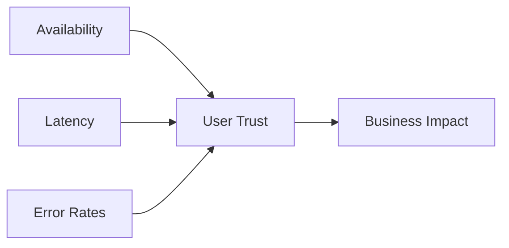
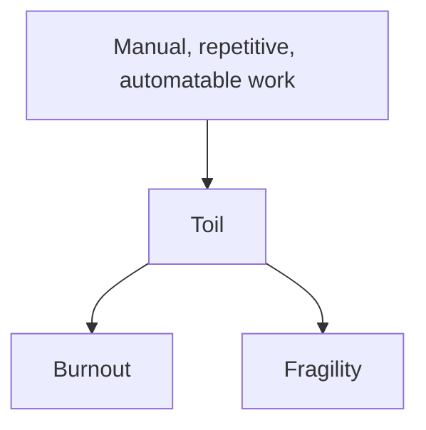
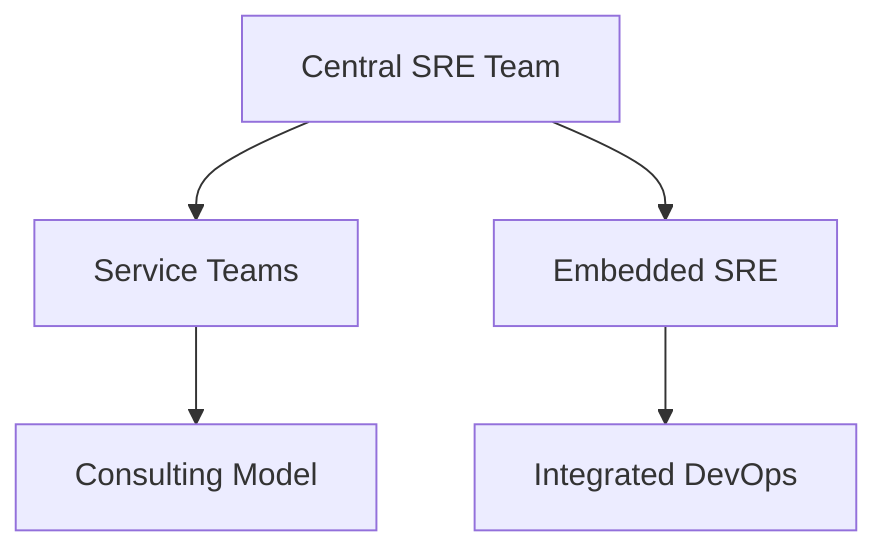

**Day 9. The human layer.**  
All your metrics, logs, traces, dashboards, SLOs, and tail-sampled observability pipelines mean nothing if your **culture** is broken.

Today Hector Alavaz returns—not to talk about tools, but about **the people, processes, and pain** that define real reliability.  
Because SRE isn’t just what you ship. It’s what you *live* with after 2 a.m.

---

# 🧱 **Day 9: Reliability Culture & Engineering Maturity**

**Character:** Hector Alavaz – Mexico City  
**Style:** Battle-hardened, jaded, deeply invested in doing things right  
**Vibe:** “If you want reliable systems, build reliable teams.”

---

## 🎯 Learning Objectives

### 🔍 Beginner
- Define “reliability” as a practice, not a result  
- Understand what “toil” is and why it’s dangerous  
- Recognize readiness gaps in services before production

### 🧩 Intermediate
- Apply SRE team models: embedded, centralized, consulting  
- Conduct Production Readiness Reviews (PRRs)  
- Design processes to reduce alert fatigue and operational overload

### 💡 SRE-Level
- Build maturity models to evaluate observability and incident response  
- Measure and reduce toil across service lifecycles  
- Engineer cultural feedback loops (postmortem > action > validation)

---

## 💥 Incident Hook: “The Microservice That Wasn’t Ready”

> “A team launched a new service. They had logs, metrics, alerts—but no runbook.  
> On-call was paged 3 nights in a row for the same issue.  
> Each night, a different engineer responded.  
> Each one tried a different thing.  
> The incident resolved—but *the system* didn’t change.  
> Six weeks later? The service was migrated to another team.  
> It failed again.”

---

## 🧠 Core Concepts

### 🔹 What Is “Reliability”?

> Reliability is **user trust** in your system’s ability to respond *correctly and consistently*.

---

### 🔹 What is Toil?

🧠 If you do it twice and it’s boring, it’s probably toil.

Examples:
- Manually restarting pods
- Digging through logs by hand
- Responding to alerts with known fixes

---

### 🔹 Production Readiness Review (PRR) Checklist

| Category        | Questions                               |
| --------------- | --------------------------------------- |
| Monitoring      | Are metrics, logs, and traces in place? |
| Alerting        | Are SLOs defined? Are alerts tested?    |
| Documentation   | Is there a runbook or FAQ?              |
| Ownership       | Who owns this in off-hours?             |
| Dependency Risk | Are upstream SLAs known?                |
| Rollback        | Can you revert easily?                  |

---

### 🔹 SRE Team Models

- **Central**: One team supports everyone’s reliability  
- **Embedded**: SREs live with product teams  
- **Consulting**: SREs are reliability coaches

🧠 Pick based on company maturity and number of services.

---

### 🔹 Reliability Maturity Model

| Level                        | Description                             |
| ---------------------------- | --------------------------------------- |
| **Ad Hoc**                   | “We have some alerts”                   |
| **Reactive**                 | “We page the right team eventually”     |
| **Proactive**                | “We have SLOs and incident timelines”   |
| **Predictive**               | “We prevent outages with risk analysis” |
| **Reliability-as-a-Product** | “Users trust us, and we iterate fast”   |

---

## 🧪 Simulation Exercise

You’re leading a PRR for a new service.

You’re given:
- Dashboards exist, but no SLOs  
- Alerts are duplicated across 3 channels  
- Runbooks are 6 months out of date  
- On-call rotation hasn’t been tested

📌 **Task:**
- Identify readiness gaps  
- Propose fixes  
- Assign a reliability maturity level (use chart)

---

## 🛠 Tool Concepts (Optional)

### Toil Reduction Examples

- Automate alert acknowledgment for known issues  
- Add context to alerts with links to runbooks and dashboards  
- Track operational hours spent per service and graph over time

🧠 Reliability isn’t free. You *engineer* it, or you suffer.

---

## 🕳️ Common Pitfalls

- Releasing to prod without ownership  
- Believing metrics = observability  
- Thinking “uptime” is the only metric  
- Ignoring postmortem action items  
- Burning out high-performers through endless toil

---

## 📜 Hector Alavaz’s Commandments

1. “You don’t build reliable systems. You build teams who do.”  
2. “Toil is debt. And interest is paid in burnout.”  
3. “A service without a runbook isn’t a service. It’s a trap.”

---

## 🤝 Handoff to Tomorrow

> “You’ve built a reliable system—and a culture to support it.  
> But how do you know it’ll survive the next deploy?  
> Day 10: The Capstone. Chaos, correlation, and cross-pillar confidence.”

---

## 📦 Day 9 Artifacts

- ✅ Mermaid Diagrams:
    - Reliability Inputs to Impact
    - Toil → Burnout Chain
    - SRE Team Models
    - Maturity Model Flow
- ✅ PRR Template Table
- ✅ Simulation: Readiness Review & Maturity Scoring
- ✅ Commandments, pitfalls, strategic notes

---

Ready for the big one?

**Day 10: Capstone**—a simulated incident that brings together *everything* you've taught:  
observability, alerting, SLOs, correlation, response, and cultural maturity.

Let me know if you want to build that finale—or render Day 9 first.