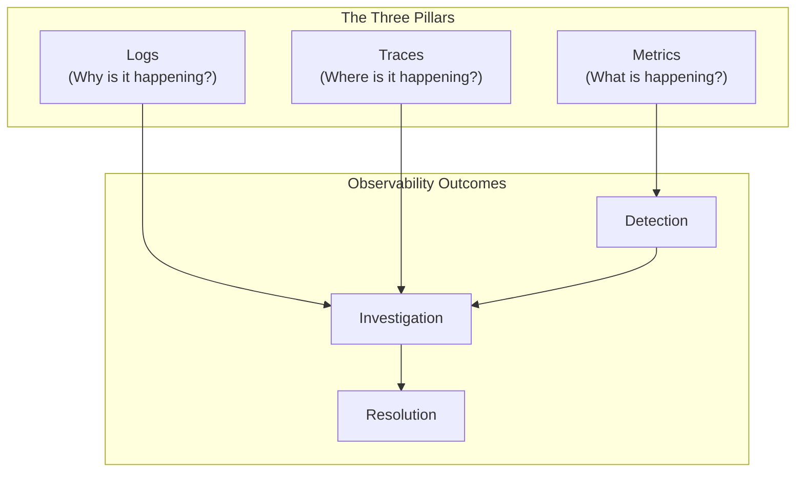
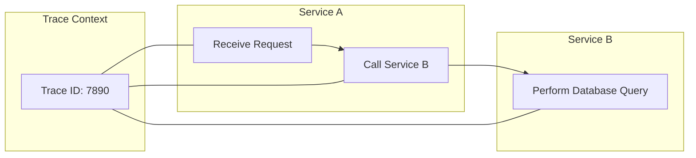
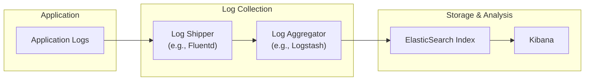
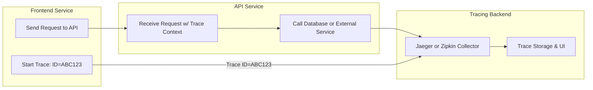
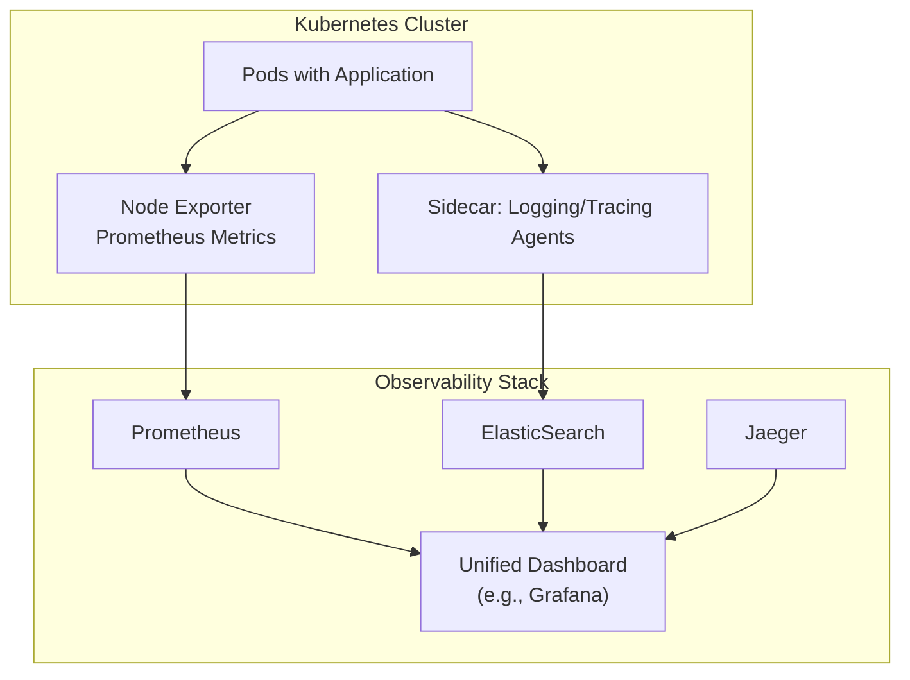

# Day 1 SRE Observability Answer Sheet 

generated according to day-01-sre-answersheet-prompt.md . Each answer entry restates the question (including diagrams), provides the correct answer, and includes explanations, SRE perspectives, tool comparisons, and additional insights.

---

## Answer 1: [Observability Overview]
🔍 Beginner | Multiple Choice | Diagram-Based

**Question:** Examine the following basic overview of observability pillars and outcomes:

Which statement best describes the roles of these pillars in a typical SRE workflow?

A. Metrics show root-cause details, logs provide usage trends, and traces reveal system capacity  
B. Metrics highlight system status, logs help diagnose causes, and traces pinpoint path details  
C. Only logs and traces matter for detection, while metrics are rarely useful  
D. Traces always handle large-scale capacity planning, while metrics track debug messages  

**Correct Answer:** B

**Explanation:**  
- Metrics highlight overall system health (e.g., resource usage, throughput, error rates).  
- Logs explain why a problem occurs by capturing specific events or error messages.  
- Traces reveal how a request flows end-to-end across services, pinpointing where delays or failures arise.  
Combined, they help detect issues, investigate their root cause, and resolve them quickly.

**Why other options are incorrect:**
- **Option A:** Logs generally capture events and potential errors, not just usage trends. Metrics more directly reflect usage trends.  
- **Option C:** Metrics are fundamental to detection (e.g., alerting on CPU usage or error rates).  
- **Option D:** Traces do help investigate performance and bottlenecks, but capacity planning typically leverages metrics and logs as well.

**Tool Comparison Note:**  
In Prometheus + Grafana, you gather metrics for dashboards and alerts; with ELK (Elasticsearch, Logstash, Kibana), you store and analyze logs; and with Jaeger, you visualize traces. Each pillar addresses a different facet but all combine for robust observability.

**Knowledge Connection:**  
Day 1 emphasizes how metrics, logs, and traces each answer distinct questions about system behavior, forming the “three pillars” of observability.

**SRE Perspective:**  
An SRE uses these pillars to quickly identify issues (metrics), drill into specifics (logs), and follow request paths (traces) for rapid incident resolution.

**Additional Insight:**  
In large microservice deployments, setting up automated alerts on key metrics while correlating logs and traces can drastically reduce mean time to detection (MTTD) and mean time to resolution (MTTR).

**Visual Explanation:**  
No additional diagram needed; the question’s own Mermaid diagram clearly demonstrates how each pillar leads to detection, investigation, and resolution.

---

## Answer 2: [Metrics Fundamentals]
🔍 Beginner | Multiple Choice

**Question:** Which of the following statements about **metrics** in an observability context is most accurate?

A. They are always stored as raw text lines without any aggregation  
B. They typically represent numeric measurements over time, such as CPU usage or request counts  
C. They are only meaningful for on-premise environments and cannot be used in cloud settings  
D. They cannot be used to set alerts or thresholds for SRE teams  

**Correct Answer:** B

**Explanation:**  
Metrics are numerical measurements that track system state over time, such as CPU usage, memory consumption, or the number of HTTP requests. These values are aggregated in time-series databases and are crucial for dashboards, trend analysis, and alerting.

**Why other options are incorrect:**
- **Option A:** Metrics are typically stored in time-series form (e.g., Prometheus), not as raw text lines.  
- **Option C:** They are essential for both on-premise and cloud environments.  
- **Option D:** Metrics are the basis for setting up alerts (e.g., CPU above 80% for 5 minutes).

**Tool Comparison Note:**  
Prometheus is a popular tool for collecting and storing metrics, while systems like Graphite or InfluxDB offer similar functionality. The approach is consistent whether on-prem or in the cloud.

**Knowledge Connection:**  
Day 1 emphasizes how metrics provide quick insights into system health, forming the “what is happening” pillar of observability.

**SRE Perspective:**  
SREs rely on metrics-based alerts (RED/USE methods) to detect issues early and respond rapidly.

**Additional Insight:**  
Define clear metrics naming conventions and label usage to ensure you can break down and filter metric data effectively in large systems.

---

## Answer 3: [Logs vs. Metrics]
🔍 Beginner | Multiple Choice

**Question:**  
An SRE notices a spike in **error rates** for a microservice running in a Kubernetes cluster. Which pillar of observability most directly helps them identify **why** the errors are occurring?

A. Metrics  
B. Logs  
C. Synthetic checks  
D. Dashboards  

**Correct Answer:** B

**Explanation:**  
Logs capture detailed event information, including error messages or stack traces, revealing precisely why an error happens. While metrics show that error rates are spiking, logs provide the context and causes behind those errors.

**Why other options are incorrect:**
- **Option A:** Metrics show the “what” (in this case, an error rate spike) but not the deeper cause.  
- **Option C:** Synthetic checks can help confirm functionality from an external perspective but do not explain the root cause.  
- **Option D:** Dashboards display data from metrics/logs/traces; they don’t inherently provide the “why.”

**Tool Comparison Note:**  
In an ELK Stack scenario, Kibana can be used to browse and search logs for error details. In Splunk or Graylog, logs are similarly aggregated and queried for root cause analysis.

**Knowledge Connection:**  
Day 1 covers how each pillar addresses a different dimension. Metrics point to a problem’s existence, logs clarify its nature, and traces clarify where it happens.

**SRE Perspective:**  
Reading logs is often the first step after seeing an alert triggered by metrics. SREs then correlate log data to confirm the nature of the errors.

**Additional Insight:**  
Ensure logs have enough structure or contextual fields (like request ID, user ID) so they can be quickly filtered to identify relevant events.

---

## Answer 4: [Distributed Traces]
🔍 Beginner | Multiple Choice | Diagram-Based

**Question:**  
Consider the partial distributed tracing flow for a request through two microservices:

In this scenario, which statement best explains the purpose of **Trace ID**?

A. It is used to group all logs from the same container  
B. It uniquely identifies the network route between two hosts  
C. It links related operations across services into a single end-to-end transaction view  
D. It triggers an autoscaling event whenever the ID repeats  

**Correct Answer:** C

**Explanation:**  
A trace ID serves as a unique identifier that groups all spans (operations) of a single request flow across multiple services, enabling an end-to-end view of how the request proceeds. This helps with debugging or performance tuning.

**Why other options are incorrect:**
- **Option A:** Logs can use the same trace ID for correlation, but that’s not its sole function.  
- **Option B:** The trace ID identifies the overall request flow, not just a single network route.  
- **Option D:** Autoscaling logic does not revolve around repeated trace IDs.

**Tool Comparison Note:**  
Jaeger, Zipkin, and OpenTelemetry-based solutions all rely on trace IDs to correlate spans. Each platform might have specific ways of generating and propagating these IDs.

**Knowledge Connection:**  
Day 1 highlights how traces clarify the “where” dimension: which service or component is causing slowdowns or errors.

**SRE Perspective:**  
Traces are vital for quickly isolating problematic calls in microservices at scale, especially under high concurrency.

**Additional Insight:**  
Ensure each service passes along the trace header (e.g., “uber-trace-id” for Jaeger) so the entire flow remains connected.

---

## Answer 5: [Monitoring vs. Observability]
🔍 Beginner | True/False

**Question:**  
Monitoring alone can fully replace the need for logs and traces when diagnosing complex, multi-service issues in production.

A. True  
B. False  

**Correct Answer:** B (False)

**Explanation:**  
Monitoring (usually metrics-based) helps identify that a problem exists (e.g., CPU spike or error rate increase), but deeper troubleshooting for multi-service, distributed issues typically requires logs and traces. These provide contextual event data and end-to-end transaction views that monitoring alone can’t offer.

**Tool Comparison Note:**  
While tools like Prometheus focus on metrics, a modern observability stack integrates metrics (Prometheus), logs (ELK Stack), and traces (Jaeger) for comprehensive insight.

**Knowledge Connection:**  
Day 1 underscores that monitoring focuses on known problems and patterns, whereas observability aims to handle unknown or unexpected scenarios using logs and traces.

**SRE Perspective:**  
In an SRE environment, relying solely on metrics can lead to missing key root-cause details, lengthening incident resolution times.

**Additional Insight:**  
Hybrid approaches exist, like logs that feed metrics (log-based metrics) or partial instrumentation. However, standard practice is to leverage all three pillars.

---

## Answer 6: [Metrics Collection]
🔍 Beginner | Fill-in-the-Blank

**Question:**  
Complete the following statement:

“In a typical Prometheus setup, the server ________ the `/metrics` endpoints of target services at defined intervals to collect numeric data.”

A. Pushes  
B. Scrapes  
C. Logs  
D. Overwrites  

**Correct Answer:** B – Scrapes

**Explanation:**  
Prometheus uses a pull-based model, where it “scrapes” instrumented endpoints (like `/metrics`) on a schedule. This design helps centralize scheduling and reduce complexity for the target services.

**Why other options are incorrect:**
- **Option A (Pushes):** The default Prometheus model is pull, not push.  
- **Option C (Logs):** “Scraping” is not the same as logging; logs are separate textual data.  
- **Option D (Overwrites):** Prometheus doesn’t overwrite endpoints, it queries them at intervals.

**Tool Comparison Note:**  
While Prometheus is pull-based by default, some systems (like InfluxDB or Telegraf) can use push-based approaches. Observability solutions vary in how they gather metrics.

**Knowledge Connection:**  
Day 1 covers how metrics are typically collected. Prometheus’s pull model is a hallmark design choice that shapes how instrumentation is exposed by microservices.

**SRE Perspective:**  
Knowing how metrics are collected affects network design and firewall rules. SREs ensure the Prometheus server can scrape each service securely and reliably.

**Additional Insight:**  
In dynamic environments (e.g., Kubernetes), service discovery ensures Prometheus automatically updates its scrape targets.

---

## Answer 7: [Logs & Formats]
🔍 Beginner | Matching

**Question:**  
Match each **logging approach** in Column A with its main characteristic or advantage in Column B.

Column A:  
1. Structured Logging  
2. Unstructured Logging  
3. Log Sampling  
4. Log Shippers (e.g., Filebeat)

Column B:  
A. Outputs text without a fixed field format, making automatic parsing more difficult  
B. Reduces logging overhead by forwarding only a subset of messages under heavy load  
C. Emits key-value pairs or JSON to simplify searching and filtering  
D. Collects log files from an application and sends them to a centralized system  

**Correct Matches:**
1 → C  
2 → A  
3 → B  
4 → D  

**Explanation:**  
1. Structured logging (C) uses JSON or key-value pairs, making queries and correlation easier.  
2. Unstructured logging (A) is typically free-form text, less standardized.  
3. Log sampling (B) is a technique to handle log volume by only collecting some fraction of messages.  
4. A log shipper (D) like Filebeat or Fluent Bit reads local logs and sends them to a central aggregator.

**Tool Comparison Note:**  
ELK Stack, Splunk, or Graylog all benefit significantly from structured logs. Log shipping can be implemented via Filebeat or Fluentd.

**Knowledge Connection:**  
Day 1 highlights that structured logs facilitate better searching and correlation, while unstructured logs can hamper quick root cause analysis.

**SRE Perspective:**  
High log volume can overwhelm systems, so sampling or shipping are crucial. SREs must maintain enough data to diagnose issues without incurring excessive costs or performance hits.

**Additional Insight:**  
Ensure you track essential fields (e.g., severity, timestamp, trace ID) in structured logs to speed up filtering and correlation.

---

## Answer 8: [Metrics Types]
🧩 Intermediate | Multiple Choice

**Question:**  
A metric that **only increases** (never decreases) over time, often used to track the number of requests served, is typically called:

A. Gauge  
B. Counter  
C. Histogram  
D. Duration  

**Correct Answer:** B

**Explanation:**  
A counter is a metric that monotonically increases, useful for counting events like requests or errors. After a service restart, counters often reset to zero, but they never decrement during normal operation.

**Why other options are incorrect:**
- **Option A (Gauge):** A gauge can go up or down (e.g., memory usage).  
- **Option C (Histogram):** A histogram accumulates counts over buckets to measure distributions (e.g., latencies).  
- **Option D (Duration):** This is not a standard metric type but rather a measure of time.

**Tool Comparison Note:**  
Prometheus specifically labels metrics as `counter`, `gauge`, or `histogram`. Other systems use similar concepts but might name them differently.

**Knowledge Connection:**  
Day 1 covers core metric types. Counters are central to tracking volumes (like total requests) in the RED method (Rate, Errors, Duration).

**SRE Perspective:**  
SREs rely on counters to assess service throughput or error frequencies. Monitoring these can reveal trends or anomalies quickly.

**Additional Insight:**  
To get rates from counters, you often compute the derivative over time (e.g., `increase(counter[1m])` in PromQL).

---

## Answer 9: [Log Processing Pipelines]
🧩 Intermediate | Multiple Choice

**Question:**  
Which of the following best describes how a **centralized log processing pipeline** (e.g., ELK Stack) might help an SRE during an incident?

A. It ensures all logs are deleted after a fixed time to save storage space  
B. It disallows any form of indexing or searching to keep data hidden  
C. It aggregates logs from multiple services in one place, allowing easier filtering and correlation  
D. It guarantees full transaction traces without needing any instrumentation  

**Correct Answer:** C

**Explanation:**  
A centralized pipeline ingests logs from various sources, indexes them, and makes them searchable in one location. This significantly aids incident troubleshooting because SREs can filter and correlate events across multiple services quickly.

**Why other options are incorrect:**
- **Option A:** While retention policies may exist, that’s not the main benefit for incident response.  
- **Option B:** Central pipelines typically enable robust searching, not disallow it.  
- **Option D:** Full transaction traces require instrumentation. Logs alone don’t provide an end-to-end trace.

**Tool Comparison Note:**  
Elasticsearch, Splunk, or Loki-based pipelines all unify log data, simplifying cross-service correlation. Each differs in storage format, query languages, and scaling strategies.

**Knowledge Connection:**  
Day 1 includes how logs feed into a single aggregator, facilitating fast event correlation for multi-service environments.

**SRE Perspective:**  
Centralized logging is critical to quickly identify which service or component is failing. SREs set up well-defined indexing and dashboards to accelerate root-cause analysis.

**Additional Insight:**  
Ensure logs are enriched (e.g., with environment or container metadata) so they can be correlated with relevant metrics and traces.

---

## Answer 10: [SRE Alerting Basics]
🧩 Intermediate | True/False

**Question:**  
A properly tuned **RED** (Rate, Errors, Duration) metrics dashboard can provide early warnings of service degradation before customers notice issues.

A. True  
B. False  

**Correct Answer:** A (True)

**Explanation:**  
The RED method focuses on request Rate, error counts, and request Duration. Monitoring these metrics helps detect anomalies (e.g., spikes in errors or rising latencies) before they escalate into major customer impact.

**Tool Comparison Note:**  
Prometheus-based dashboards often track the RED metrics. Tools like Grafana display these in real-time, triggering alerts if thresholds are exceeded.

**Knowledge Connection:**  
Day 1’s coverage of metrics frameworks includes the RED method as a standard approach for microservices.

**SRE Perspective:**  
By alerting on error rates and latencies, SREs proactively address incipient failures, keeping SLAs intact.

**Additional Insight:**  
Combining the RED method with logs or traces can confirm if an issue is localized or systemic.

---

## Answer 11: [Tracing Context Propagation]
🧩 Intermediate | Fill-in-the-Blank

**Question:**  
Complete the following statement:

“When implementing distributed tracing in a microservices environment, each service must properly forward the ________ headers to allow trace continuity across calls.”

A. Configuration  
B. Billing  
C. Trace Context  
D. Authorization  

**Correct Answer:** C – Trace Context

**Explanation:**  
Distributed tracing requires that each service propagate trace context headers (e.g., `traceparent`, `uber-trace-id`) to maintain continuity of the trace across process boundaries. Without passing these headers, spans won’t link into a single coherent trace.

**Why other options are incorrect:**
- **Option A (Configuration):** That’s not how trace continuity is maintained.  
- **Option B (Billing):** Irrelevant to cross-service tracing.  
- **Option D (Authorization):** Access tokens or auth headers don’t handle trace linking.

**Tool Comparison Note:**  
Whether using Jaeger, Zipkin, or OpenTelemetry, the principle is the same: keep the trace ID flowing. The exact header names vary slightly by implementation.

**Knowledge Connection:**  
Day 1 emphasizes how context propagation is critical to stitching together a distributed trace across multiple services.

**SRE Perspective:**  
From an SRE standpoint, lacking trace continuity complicates root-cause analysis for multi-service performance issues.

**Additional Insight:**  
Ensure developers and frameworks (e.g., Spring Cloud Sleuth, OpenTelemetry for Python/Go/Java) automatically handle trace headers to reduce instrumentation overhead.

---

## Answer 12: [Metrics vs. Logs Matching]
🧩 Intermediate | Matching

**Question:**  
Match each **observability pillar** in Column A with the most **common usage** in Column B.

**Column A:**  
1. Metrics  
2. Logs  

**Column B:**  
A. Storing structured or unstructured text entries that record specific events  
B. Representing numerical time-series data that can be aggregated and alerted on  

*(Use each letter only once, for a total of 2 matches.)*

**Correct Matches:**
1 → B  
2 → A  

**Explanation:**  
- **Metrics (B)**: Numeric time-series, aggregated and used for performance or error monitoring.  
- **Logs (A)**: Text-based entries capturing event details or error messages.

**Tool Comparison Note:**  
Prometheus, Graphite, or Datadog handle metrics, while logs are typically handled by ELK, Splunk, or Loki.

**Knowledge Connection:**  
Day 1’s fundamentals: metrics are numeric counters/gauges, logs are textual event data.

**SRE Perspective:**  
SREs watch both metrics for system-level health and logs for deeper diagnostics. This synergy shortens incident resolution.

**Additional Insight:**  
Converting logs to ephemeral metrics (e.g., log-based metrics) can unify monitoring, but you lose textual detail.

---

## Answer 13: [Logs Pipeline Flow]
🧩 Intermediate | Multiple Choice | Diagram-Based

**Question:**  
Examine the simplified log processing pipeline:

Which statement best describes this workflow?

A. The logs are automatically converted to metrics and sent to Prometheus  
B. The application receives logs from Elasticsearch and stores them on disk  
C. The log shipper and aggregator parse and enrich log data before indexing it  
D. Kibana directly ships logs to the aggregator for real-time ingestion  

**Correct Answer:** C

**Explanation:**  
A typical pipeline has a log shipper (e.g., Fluentd) forward logs to a central aggregator (e.g., Logstash), which can parse/enrich them before indexing in Elasticsearch. Kibana then provides a UI to search and visualize those logs.

**Why other options are incorrect:**
- **Option A:** This describes metrics conversion, but the diagram shows logs going to Elasticsearch for indexing, not Prometheus.  
- **Option B:** The application produces logs, not receives them from Elasticsearch.  
- **Option D:** Kibana queries Elasticsearch; it doesn’t directly ingest logs.

**Tool Comparison Note:**  
Fluentd vs. Filebeat vs. Logstash all perform similar shipping/aggregation roles, with variations in configuration. Kibana is a popular front-end for Elasticsearch logs.

**Knowledge Connection:**  
Day 1 highlights that a consistent log pipeline architecture ensures logs from many services can be correlated and visualized in one place.

**SRE Perspective:**  
Centralizing logs speeds up root-cause analysis during incidents. SREs should ensure each pipeline step is monitored for potential bottlenecks.

**Additional Insight:**  
Consider adding structure or metadata at aggregator stage (like Logstash filters) to ease subsequent queries in Kibana.

---

## Answer 14: [RED Method Steps]
🧩 Intermediate | Ordering

**Question:**  
Arrange the following steps to implement the **RED method** for an SRE team:

A. Configure dashboards showing request rate, error counts, and response times  
B. Define thresholds for acceptable error rates and latencies  
C. Identify key endpoints or microservices to monitor  
D. Set up alerts that trigger when thresholds are exceeded  

**Correct Order:** C, A, B, D

**Explanation:**  
1. **(C)** Identify which microservices or endpoints matter most.  
2. **(A)** Configure dashboards to track Rate, Errors, and Duration.  
3. **(B)** Decide on thresholds that define “unacceptable” performance or errors.  
4. **(D)** Implement alerts so SREs receive notifications when metrics exceed thresholds.

**Tool Comparison Note:**  
Prometheus + Grafana often handle RED metrics, with alerting configured in Alertmanager. Other solutions follow a similar approach.

**Knowledge Connection:**  
Day 1 explains the RED method for microservices, focusing on the big three metrics that define service health.

**SRE Perspective:**  
Following a structured approach ensures consistent coverage of critical endpoints and quick detection of performance degradation.

**Additional Insight:**  
Review thresholds periodically as your service usage evolves to avoid alert fatigue or blind spots.

---

## Answer 15: [Advanced Metrics Visualization]
💡 Advanced/SRE | Multiple Choice

**Question:**  
Which approach is typically **most** effective for analyzing high-cardinality metrics (e.g., per-customer or per-session data) in a large-scale AWS environment?

A. Storing raw high-cardinality metrics locally on each instance with no central aggregator  
B. Using a specialized metrics platform like Prometheus with dimensional labeling and carefully set retention  
C. Converting all metrics to logs and using a generic text search tool  
D. Avoiding any kind of metric collection to reduce overhead  

**Correct Answer:** B

**Explanation:**  
High-cardinality metrics can explode in volume, so using a specialized time-series database (e.g., Prometheus) with labeling capabilities helps maintain clarity. Properly limiting retention, applying relabeling, or using hierarchical dashboards can keep data manageable while still capturing necessary detail.

**Why other options are incorrect:**
- **Option A:** Storing locally prevents centralized analysis and correlation.  
- **Option C:** Converting metrics to logs for searching is possible but typically loses the time-series structure and can be expensive.  
- **Option D:** Disabling metrics entirely hampers troubleshooting and capacity planning.

**Tool Comparison Note:**  
Prometheus, VictoriaMetrics, M3, or Datadog can handle high-cardinality use cases with appropriate strategies (e.g., rollups or chunk storage). Each has unique cost and performance trade-offs.

**Knowledge Connection:**  
Day 1 advanced topics mention cardinality concerns and how to tune data collection at scale.

**SRE Perspective:**  
SREs balance performance overhead (storing huge amounts of data) versus the granularity needed to understand unique customer sessions or usage patterns.

**Additional Insight:**  
Consider implementing a short retention for raw metrics plus aggregated, longer-term data for trend analysis. This preserves detail for recent events while controlling costs.

---

## Answer 16: [Sampling Strategies]
💡 Advanced/SRE | True/False

**Question:**  
**Statement**: In distributed tracing, using a 100% trace sampling rate is always the best practice for large-scale production environments.

A. True  
B. False  

**Correct Answer:** B (False)

**Explanation:**  
Capturing every single trace can be prohibitively expensive and produce overwhelming data in high-volume systems. Strategic sampling (e.g., probability sampling, adaptive sampling) can reduce overhead while preserving enough data for effective troubleshooting.

**Tool Comparison Note:**  
Jaeger and Zipkin allow configurable sampling strategies. OpenTelemetry also supports various sampling policies, such as head-based or tail-based sampling.

**Knowledge Connection:**  
Day 1 advanced tracing coverage includes sampling strategies to manage overhead, especially in large-scale deployments.

**SRE Perspective:**  
SREs weigh the cost and performance impacts of storing traces at scale against the risk of missing important details in lower-sampled scenarios.

**Additional Insight:**  
Tail-based sampling can be used to keep only traces that show errors or high latency, providing targeted insights while limiting storage.

---

## Answer 17: [Horror Story Lessons]
💡 Advanced/SRE | Fill-in-the-Blank

**Question:**  
Complete the following statement:

“One common ‘horror story’ is when logs grow faster than expected, leading to ________ of the logging system and causing missed or delayed entries.”

A. Over-provisioning  
B. Saturation  
C. Encryption  
D. Rotation  

**Correct Answer:** B – Saturation

**Explanation:**  
Excessive log volume can saturate the ingestion pipeline or storage. Once the system is saturated, logs may be dropped or severely delayed, undermining incident response.

**Why other options are incorrect:**
- **Option A (Over-provisioning):** That might be a mitigation, not the problem scenario.  
- **Option C (Encryption):** Not related to exceeding system capacity.  
- **Option D (Rotation):** Log rotation helps manage local disk usage, but doesn’t prevent ingestion pipeline saturation.

**Tool Comparison Note:**  
ELK-based environments can saturate if indexing throughput is exceeded. Solutions like Splunk or Loki must also handle large volumes carefully.

**Knowledge Connection:**  
Day 1 includes real-world horror stories about unbounded logging. Excess log traffic can degrade overall observability.

**SRE Perspective:**  
SREs must plan capacity and possibly implement log sampling or dynamic rate limiting to avoid losing critical logs.

**Additional Insight:**  
Setting ingestion rate limits and monitoring pipeline health can avert log meltdown scenarios.

---

## Answer 18: [Distributed Tracing Architecture]
💡 Advanced/SRE | Multiple Choice | Diagram-Based

**Question:**  
Consider the advanced tracing architecture:

Which statement best captures the purpose of the **Tracing Backend** in this setup?

A. It auto-corrects buggy code in the API service  
B. It aggregates and visualizes trace spans for end-to-end request insights  
C. It blocks network calls until the backend approves each step  
D. It replaces logs entirely by storing only performance metrics  

**Correct Answer:** B

**Explanation:**  
The tracing backend (Jaeger, Zipkin, etc.) receives spans from instrumented services, links them via the trace ID, and presents a UI to analyze each step of a request’s flow. This helps identify bottlenecks or errors in distributed systems.

**Why other options are incorrect:**
- **Option A:** The tracing backend doesn’t modify code.  
- **Option C:** It doesn’t gate network calls; it collects data asynchronously.  
- **Option D:** Tracing does not replace logs. They serve distinct purposes.

**Tool Comparison Note:**  
Jaeger, Zipkin, AWS X-Ray, or New Relic APM each offer ways to visualize distributed traces, though their ingestion and user interfaces differ.

**Knowledge Connection:**  
Day 1 discusses how the backend database and UI let SREs query traces, examine latency, and see which microservices are causing slowdowns.

**SRE Perspective:**  
When investigating performance anomalies, an SRE checks the tracing UI to see where the request is stalling or encountering errors.

**Additional Insight:**  
Ensure each service is instrumented so the tracing backend has complete data. Otherwise, the trace might appear incomplete.

---

## Answer 19: [Logs to SLO Enforcement]
💡 Advanced/SRE | Ordering

**Question:**  
You’re implementing a process to **convert log-based data** into actionable **Service Level Objectives (SLOs)**. Arrange these steps in logical order:

A. Determine acceptable error and latency thresholds to define the SLO  
B. Collect structured logs with relevant response codes and timestamps  
C. Visualize SLO compliance in a dedicated dashboard  
D. Extract metrics from logs (e.g., parse response codes and durations)  

**Correct Order:** B, D, A, C

**Explanation:**  
1. **(B)** Gather logs containing relevant info like status codes and latencies.  
2. **(D)** Convert or parse logs into metrics for error rates or response times.  
3. **(A)** Define SLO thresholds for errors/latencies.  
4. **(C)** Display SLO compliance in a dashboard.

**Tool Comparison Note:**  
Using log-to-metrics conversions (e.g., Logstash or Loki+Promtail) allows you to define SLIs (e.g., 99.9% of requests < 200ms) from your logs. Tools differ in how easily they integrate logs with SLO dashboards (e.g., Grafana, Splunk Observability).

**Knowledge Connection:**  
Day 1 covers how logs can feed critical data into metrics for performance SLOs, bridging logging and metrics pillars.

**SRE Perspective:**  
SREs focus on SLOs that reflect user experience. Log-based metrics help measure real user traffic, not synthetic tests.

**Additional Insight:**  
Automating the log parsing step is key; manual approaches won’t scale. Keep SLO definitions clear and versioned in code.

---

## Answer 20: [Unified Observability Diagram]
💡 Advanced/SRE | Multiple Choice | Diagram-Based

**Question:**  
Observe this high-level architecture for unifying **metrics, logs, and traces** in a Kubernetes environment:

Which statement **best** describes this unified approach?

A. The application pods send all data directly to Grafana without intermediate storage  
B. Logs, metrics, and traces are collected via sidecars or exporters and sent to specialized backends, then visualized in a central dashboard  
C. Prometheus forcibly converts logs and traces into numeric metrics so that Jaeger is unnecessary  
D. Elasticsearch automatically deploys new sidecar pods whenever CPU usage spikes  

**Correct Answer:** B

**Explanation:**  
In a comprehensive observability architecture, each pillar is captured by specialized collectors/exporters. Metrics go to Prometheus, logs to Elasticsearch, and traces to Jaeger. Grafana (or a similar UI) unifies these data sources.

**Why other options are incorrect:**
- **Option A:** Data does not go directly to Grafana. Grafana queries backends like Prometheus/Elasticsearch/Jaeger.  
- **Option C:** Prometheus does not convert logs or traces; it only handles metrics.  
- **Option D:** Elasticsearch does not dynamically spawn sidecars based on resource usage.

**Tool Comparison Note:**  
This architecture is typical in Kubernetes: Prometheus for metrics, ELK for logs, Jaeger for traces, with Grafana or Kibana for dashboards. Other distributions (e.g., OpenShift) have variants but the concept remains the same.

**Knowledge Connection:**  
Day 1 emphasizes synergy among the three pillars. Kubernetes integrates well with these stacks using sidecar patterns or node exporters.

**SRE Perspective:**  
Such a unified approach ensures SREs have a single vantage point to cross-reference logs, metrics, and traces. This drastically shortens incident triage times.

**Additional Insight:**  
Automating sidecar injection (e.g., via Istio or sidecar container methods) ensures consistent data collection across all pods.

---

**End of Day 1 SRE Observability Training: Answer Sheet**