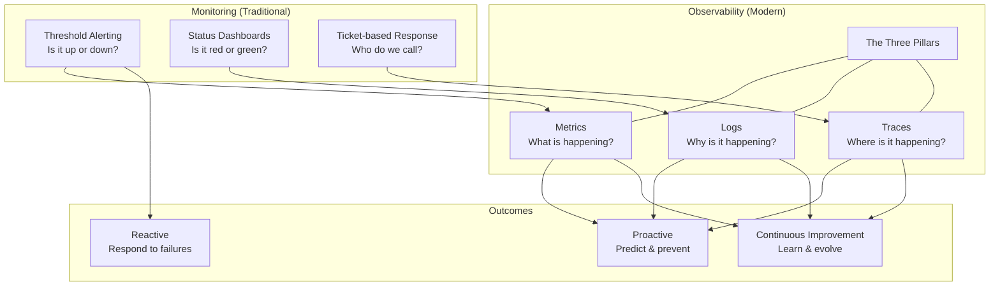
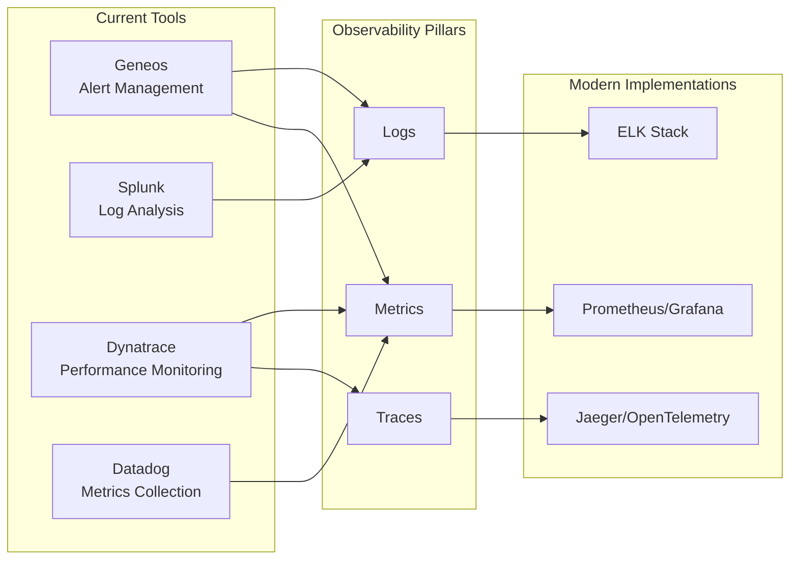
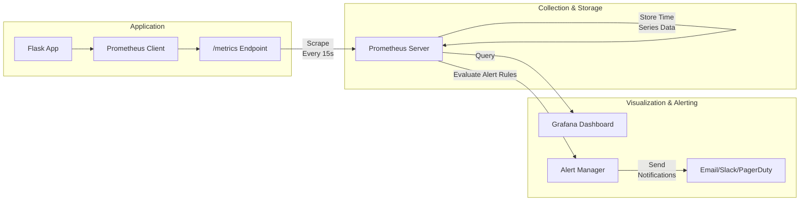
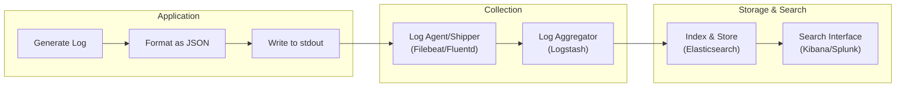
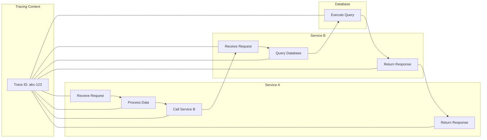
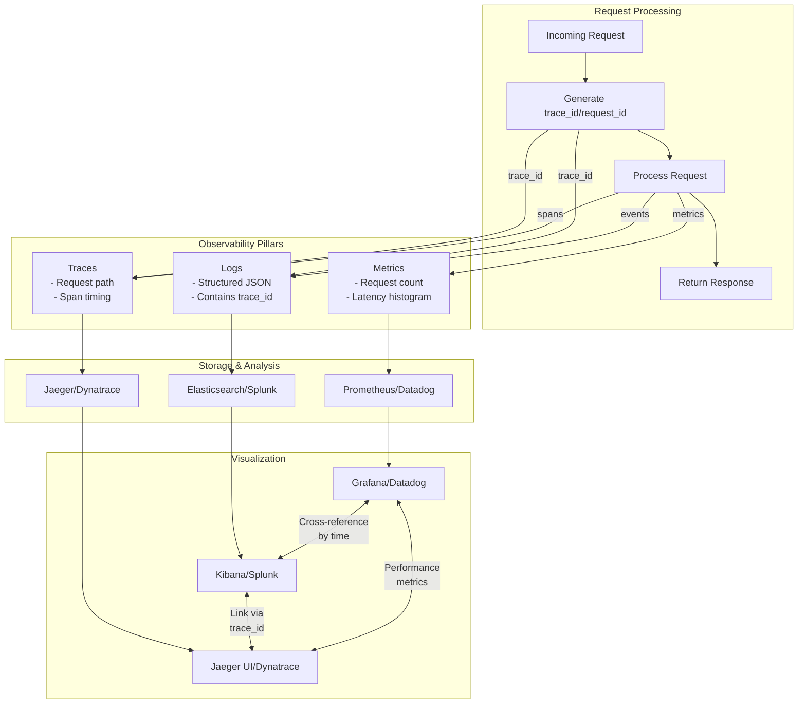
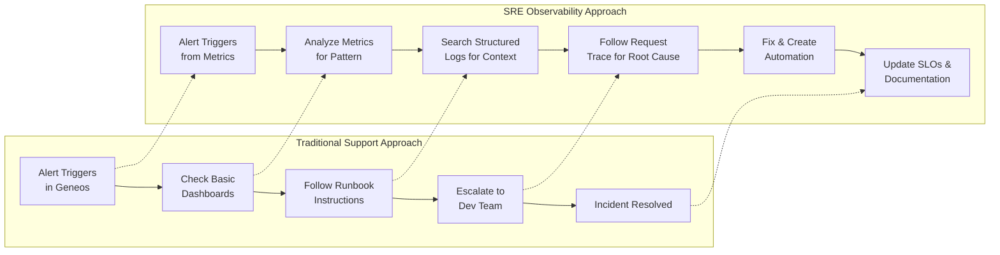
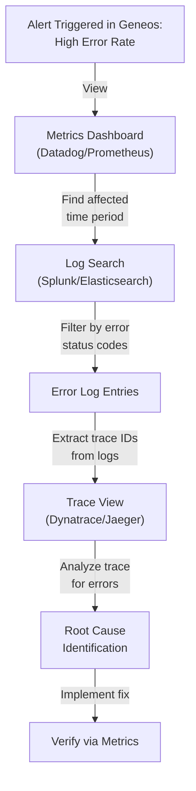

# 📊 Comprehensive Prompt: Day 1 Observability Training Module for Production Support Professionals

## 🎯 Purpose & Overview

This prompt will guide the creation of a comprehensive, engaging, and practical Day 1 training module on the Three Pillars of Observability: Metrics, Logs, and Traces. The resulting material should serve as production-ready onboarding content that builds expertise from production support to SRE-level through a practical, step-by-step approach centered around real-world incidents and their resolutions. The training should create clear bridges between participants' existing monitoring tools and modern observability practices.

## 👥 Target Audience

Production support professionals transitioning to SRE roles (ages 23-58, with 2-20 years of experience) who currently use Geneos as their primary monitoring tool, pulling data from Splunk, Dynatrace, and Datadog. These learners need to understand modern observability concepts to effectively implement monitoring and troubleshooting strategies. This is the first day of a comprehensive observability training program that will help them evolve from reactive monitoring to proactive observability practices.

## 🧱 Learning Approach

Use a "brick-by-brick" teaching methodology that:
- Starts with fundamentals and progressively builds complexity
- Makes concepts tangible through real-world incidents and "horror stories with happy endings"
- Creates direct connections between existing tools (Geneos, Splunk, Dynatrace, Datadog) and modern observability concepts
- Reinforces learning with visual aids (diagrams), code examples, and hands-on exercises
- Offers tiered content for different experience levels (🔍 Beginner, 🧩 Intermediate, 💡 Advanced/SRE)
- Encourages empathy and humor when describing real-world operational challenges
- Centers learning around actual incident scenarios rather than abstract theory
- Validates existing monitoring expertise while building new observability skills

## 📋 Content Requirements

### Required Module Structure

1. **Introduction: From Monitoring to Observability**
   - Begin with a compelling incident story that highlights the limitations of traditional monitoring vs. observability
   - Explain observability using the "Observe, Test, Evaluate, Take Action" framework
   - Clearly distinguish between monitoring and observability while validating the importance of both
   - Show how existing tools (Geneos, Splunk, Dynatrace, Datadog) map to the Three Pillars concept
   - Provide a tool mapping table showing existing monitoring tools and their observability counterparts
   - Introduce a fictional company ("TechNow") transitioning from legacy monitoring to modern observability
   - Introduce recurring characters including:
     - A production support specialist transitioning to SRE
     - An experienced SRE mentor
     - A developer learning about observability
     - A business stakeholder affected by incidents
   - Visual: Include a Three Pillars Overview Diagram showing relationships between pillars and outcomes
   - Video Placeholder: {{VIDEO_LINK_INTRO}}
   - Learning Objectives: List 4 measurable objectives for each tier (Beginner, Intermediate, Advanced/SRE)

2. **Core Concept: Metrics (The Quantified View)**
   - **Mindset Transition**: Begin with comparing Geneos/Datadog metrics approach to Prometheus-style metrics
   - **Incident First**: Begin with a metrics-related incident at "TechNow" that shows:
     - The initial alert in Geneos/Datadog
     - The limitations of basic dashboard metrics
     - How dimensional metrics provided deeper insights
   - 🔍 Beginner: Provide an intuitive analogy (e.g., car dashboard), define metrics types (counters, gauges, histograms)
   - 🧩 Intermediate: Explain practical implementation, visualization techniques, RED/USE methods
   - 💡 Advanced/SRE: Discuss advanced concerns like cardinality issues, alerting strategies, and system performance impact
   - **Knowledge Bridge**: Compare Datadog metrics collection to Prometheus, highlighting similarities and differences
   - Visual: Include diagrams showing metrics collection flow and comparison of metric types
   - Implementation Comparison: Table comparing metrics across familiar platforms (Datadog, Prometheus, InfluxDB)
   - **Horror Story Framework**:
     - Setting: "TechNow" during a service degradation detected in Geneos
     - Crisis: The metrics-related incident that occurred
     - Confusion: Limitations of basic threshold alerts
     - Discovery: How dimensional metrics revealed the pattern
     - Resolution: Implementation of improved metrics
     - Lesson: Key takeaway about metrics-based observability
   - **Practical Migration**: Steps to enhance existing Datadog metrics with more observability-focused approaches
   - Video Placeholder: {{VIDEO_LINK_METRICS}}

3. **Core Concept: Logs (The Narrative Thread)**
   - **Mindset Transition**: Begin with comparing Splunk logs to structured logging approaches
   - **Incident First**: Begin with a log-related incident at "TechNow" involving the same characters and systems:
     - Initial investigation with traditional Splunk searches
     - Challenges with unstructured logs
     - How structured logging transformed troubleshooting
   - 🔍 Beginner: Provide an intuitive analogy (e.g., journey journal), explain log levels and basic logging
   - 🧩 Intermediate: Teach structured JSON logs, log aggregation techniques
   - 💡 Advanced/SRE: Show advanced log querying, correlation with metrics and traces, performance considerations
   - **Knowledge Bridge**: Compare Splunk queries to ELK Stack, highlighting transferable skills and new concepts
   - Visual: Include diagrams showing log processing pipeline and structured vs. unstructured logs comparison
   - Implementation Comparison: Table comparing logging approaches (Splunk, ELK Stack, Graylog)
   - **Horror Story Framework**:
     - Setting: Follow-up incident at "TechNow" with hard-to-search logs
     - Crisis: A logging-related issue that compounds or relates to previous incident
     - Confusion: Challenges due to poor logging practices
     - Discovery: How structured logging revealed the root cause
     - Resolution: Implementation of better logging
     - Lesson: Key takeaway about the importance of quality logs
   - **Practical Migration**: How to implement structured logging while maintaining Splunk compatibility
   - Video Placeholder: {{VIDEO_LINK_LOGS}}

4. **Core Concept: Traces (The Request's Journey)**
   - **Mindset Transition**: Begin with comparing Dynatrace's approach to distributed tracing with OpenTelemetry
   - **Incident First**: Begin with a complex distributed systems issue at "TechNow":
     - Initial monitoring with Dynatrace showing symptoms
     - Limitations of isolated service views
     - How end-to-end tracing provided the full picture
   - 🔍 Beginner: Provide an intuitive analogy (e.g., GPS tracking), explain spans, trace IDs, and visualization
   - 🧩 Intermediate: Demonstrate trace context propagation and implementation in distributed systems
   - 💡 Advanced/SRE: Discuss sampling strategies, overhead considerations, and complex debugging techniques
   - **Knowledge Bridge**: Compare Dynatrace's PurePath to OpenTelemetry tracing, highlighting similarities and differences
   - Visual: Include diagrams showing distributed trace flow, span hierarchy, and trace context propagation
   - Implementation Comparison: Table comparing tracing approaches (Dynatrace, Jaeger, Zipkin)
   - **Horror Story Framework**:
     - Setting: Major incident at "TechNow" affecting multiple services
     - Crisis: Complex, intermittent failures in a distributed system
     - Confusion: Metrics and logs providing incomplete picture
     - Discovery: How tracing revealed the complex interaction failure
     - Resolution: Cross-service fixes implemented
     - Lesson: Key takeaway about end-to-end visibility
   - **Practical Migration**: How to implement distributed tracing while leveraging existing Dynatrace implementation
   - Video Placeholder: {{VIDEO_LINK_TRACES}}

5. **Integrating the Three Pillars: The Support-to-SRE Evolution**
   - Begin with a complex incident initially detected in Geneos that requires all three pillars
   - Show the evolution from a traditional support response to an SRE-driven investigation
   - Provide a practical incident response framework that shows:
     - How alerts from Geneos/Datadog trigger initial response
     - How logs from Splunk provide immediate context during triage
     - How traces from Dynatrace help pinpoint exact failure points
     - The communication flow during incidents
   - Provide a decision framework for implementing all three pillars together while leveraging existing tools
   - Show how metrics, logs, and traces correlate using shared IDs and timestamps
   - Demonstrate a workflow for investigating incidents using all three pillars
   - Identify common integration patterns and anti-patterns
   - Visual: Include diagrams showing three pillars integration and incident investigation flow
   - Video Placeholder: {{VIDEO_LINK_INTEGRATION}}

6. **Hands-On Exercises / Tiered Challenges**
   - Structure exercises as incident simulations mirroring production support scenarios
   - 🔍 Beginner: Investigate a simulated incident beginning with Geneos alerts; implement simple metrics in Flask
   - 🧩 Intermediate: Debug a problem starting with Splunk logs; implement structured logging
   - 💡 Advanced/SRE: Solve a complex distributed systems issue using all three pillars, beginning with a Dynatrace alert
   - Provide clear setup instructions and success criteria for each exercise
   - Include exercises that connect existing tools to new observability practices

7. **Tool Migration Roadmap**
   - Provide practical guidance for gradually implementing observability while using existing tools
   - Show how to get more observability value from current Geneos/Splunk/Dynatrace/Datadog implementations
   - Present phased adoption strategies rather than complete tool replacement
   - Create a maturity model for evolving from monitoring to observability
   - Include a skills transfer map highlighting which production support skills directly transfer to SRE

8. **Code Implementation Examples**
   - Frame each implementation example as a solution to a specific incident type
   - **Beginner Implementation**: Basic Metrics with Python Flask to detect performance issues
   - **Intermediate Implementation**: Adding Structured Logging to debug error patterns
   - **Advanced Implementation**: Adding Distributed Tracing to solve complex service interaction issues
   - Each example should build on the previous one, showing the progression of a complete observability solution
   - Include comments that highlight connections to existing tooling knowledge

9. **Real-World Scenarios**
   - **Scenario 1**: Detecting and Diagnosing a Performance Issue initially spotted in Geneos
   - **Scenario 2**: Tracking Down an Intermittent Error starting with Splunk logs
   - **Scenario 3**: Resolving a complex service interaction problem using Dynatrace and beyond
   - Each scenario should continue the "TechNow" narrative and involve the recurring characters
   - Show practical application of all three pillars to solve a realistic problem
   - Emphasize the evolution from a traditional support approach to an SRE observability approach

10. **War Room Simulation**
    - Conclude the training with a comprehensive "War Room Simulation" that:
      - Presents a complex, realistic incident scenario at "TechNow" initially detected in Geneos
      - Guides learners through the detection, investigation, and resolution process
      - Shows the limitations of traditional monitoring approaches
      - Requires the use of all three pillars in concert
      - Includes decision points with consequences
      - Provides a realistic timeline pressure element
    - Include a post-incident review template and analysis
    - Show how observability data drives permanent improvements
    - Contrast traditional "fix and forget" with SRE "learn and improve" approaches

### Narrative Framework Requirements

1. **Consistent Company and Characters**
   - Create a fictional but realistic company ("TechNow") that is transitioning from traditional monitoring to observability:
     - A clear business model (e.g., financial services platform)
     - A defined architecture (microservices, databases, etc.)
     - Current monitoring setup featuring Geneos, Splunk, Dynatrace, and Datadog
     - Recurring characters with distinct roles:
       - Maya: Production support specialist transitioning to SRE (primary POV character)
       - Raj: Experienced SRE mentor guiding the observability transformation
       - Tyler: Developer who struggles with ops concepts but is learning
       - Sarah: Business stakeholder affected by incidents who needs clear communication
   - Reference these characters consistently throughout all incidents and examples
   - Show their growth and learning as monitoring evolves into observability

2. **Connected Incident Narrative**
   - Make each incident story connect to previous ones:
     - Begin with incidents detected through traditional monitoring
     - Show the limitations of reactive approaches
     - Demonstrate how observability principles transform incident response
     - Reference past incidents when introducing new problems
     - Show how previous solutions helped detect new issues faster
     - Build complexity throughout the narrative
     - Demonstrate incremental improvements in observability practices

3. **Transition Story Framework**
   - For each pillar, include a narrative that follows this pattern:
     - Setting: Brief context of "TechNow" and the current monitoring approach
     - Initial Alert: How the incident was first detected in existing tools
     - Traditional Response: Initial troubleshooting using current practices
     - Limitations: Where traditional monitoring falls short
     - Observability Insight: How modern observability principles transform the approach
     - Resolution: How the improved approach resolved the issue
     - Lesson: Key takeaway about the monitoring-to-observability journey

### Required Code Examples

For each pillar, include fully functional Python code examples that learners can run themselves:

**1. Beginner Implementation: Basic Metrics with Python Flask**
```python
from flask import Flask, request
import time
from prometheus_client import Counter, Histogram, generate_latest

app = Flask(__name__)

# Define metrics
REQUEST_COUNT = Counter('app_requests_total', 'Total request count', ['method', 'endpoint'])
REQUEST_LATENCY = Histogram('app_request_latency_seconds', 'Request latency in seconds', ['endpoint'])

@app.before_request
def before_request():
    # Store request start time
    request.start_time = time.time()

@app.after_request
def after_request(response):
    # Record request metrics
    request_latency = time.time() - request.start_time
    REQUEST_COUNT.labels(method=request.method, endpoint=request.path).inc()
    REQUEST_LATENCY.labels(endpoint=request.path).observe(request_latency)
    return response

@app.route('/')
def hello():
    return "Hello World!"

@app.route('/metrics')
def metrics():
    return generate_latest()

if __name__ == '__main__':
    app.run(host='0.0.0.0', port=5000)
```

**2. Intermediate Implementation: Adding Structured Logging**
```python
import structlog
import logging
import time
import uuid
from flask import Flask, request, g
from prometheus_client import Counter, Histogram, generate_latest

# Configure structured logging
logging.basicConfig(level=logging.INFO)
structlog.configure(
    processors=[
        structlog.stdlib.add_log_level,
        structlog.processors.TimeStamper(fmt="iso"),
        structlog.processors.JSONRenderer()
    ],
    logger_factory=structlog.stdlib.LoggerFactory(),
)

logger = structlog.get_logger()
app = Flask(__name__)

# Define metrics (same as before)
REQUEST_COUNT = Counter('app_requests_total', 'Total request count', ['method', 'endpoint'])
REQUEST_LATENCY = Histogram('app_request_latency_seconds', 'Request latency in seconds', ['endpoint'])

@app.before_request
def before_request():
    # Generate request ID for correlation
    request.request_id = str(uuid.uuid4())
    # Store request start time
    request.start_time = time.time()
    # Create request-scoped logger
    g.logger = logger.bind(request_id=request.request_id, endpoint=request.path)
    g.logger.info("Request started", method=request.method, path=request.path)

@app.after_request
def after_request(response):
    # Record request metrics
    request_latency = time.time() - request.start_time
    REQUEST_COUNT.labels(method=request.method, endpoint=request.path).inc()
    REQUEST_LATENCY.labels(endpoint=request.path).observe(request_latency)
    
    g.logger.info("Request completed", 
                 status_code=response.status_code, 
                 duration_ms=request_latency*1000)
    return response

@app.route('/')
def hello():
    g.logger.info("Processing hello request")
    return "Hello World!"

@app.route('/metrics')
def metrics():
    return generate_latest()

if __name__ == '__main__':
    app.run(host='0.0.0.0', port=5000)
```

**3. Advanced Implementation: Adding Distributed Tracing**
```python
import time
import uuid
import structlog
import logging
from flask import Flask, request, g
from prometheus_client import Counter, Histogram, generate_latest
from opentelemetry import trace
from opentelemetry.exporter.jaeger.thrift import JaegerExporter
from opentelemetry.sdk.resources import SERVICE_NAME, Resource
from opentelemetry.sdk.trace import TracerProvider
from opentelemetry.sdk.trace.export import BatchSpanProcessor
from opentelemetry.instrumentation.flask import FlaskInstrumentor

# Configure structured logging (same as before)
logging.basicConfig(level=logging.INFO)
structlog.configure(
    processors=[
        structlog.stdlib.add_log_level,
        structlog.processors.TimeStamper(fmt="iso"),
        structlog.processors.JSONRenderer()
    ],
    logger_factory=structlog.stdlib.LoggerFactory(),
)
logger = structlog.get_logger()

# Configure OpenTelemetry tracing
resource = Resource(attributes={SERVICE_NAME: "example-flask-app"})
trace.set_tracer_provider(TracerProvider(resource=resource))
jaeger_exporter = JaegerExporter(
    agent_host_name="localhost",
    agent_port=6831,
)
span_processor = BatchSpanProcessor(jaeger_exporter)
trace.get_tracer_provider().add_span_processor(span_processor)
tracer = trace.get_tracer(__name__)

app = Flask(__name__)
FlaskInstrumentor().instrument_app(app)

# Define metrics (same as before)
REQUEST_COUNT = Counter('app_requests_total', 'Total request count', ['method', 'endpoint'])
REQUEST_LATENCY = Histogram('app_request_latency_seconds', 'Request latency in seconds', ['endpoint'])

@app.before_request
def before_request():
    # Get trace context
    span = trace.get_current_span()
    trace_id = format(span.get_span_context().trace_id, '032x')
    span_id = format(span.get_span_context().span_id, '016x')
    
    # Generate request ID (using trace ID)
    request.request_id = trace_id
    # Store request start time
    request.start_time = time.time()
    
    # Create request-scoped logger with trace context
    g.logger = logger.bind(
        request_id=request.request_id,
        trace_id=trace_id,
        span_id=span_id,
        endpoint=request.path
    )
    g.logger.info("Request started", method=request.method, path=request.path)

@app.after_request
def after_request(response):
    # Record request metrics
    request_latency = time.time() - request.start_time
    REQUEST_COUNT.labels(method=request.method, endpoint=request.path).inc()
    REQUEST_LATENCY.labels(endpoint=request.path).observe(request_latency)
    
    g.logger.info("Request completed", 
                 status_code=response.status_code, 
                 duration_ms=request_latency*1000)
    return response

@app.route('/')
def hello():
    with tracer.start_as_current_span("process_hello") as span:
        span.set_attribute("custom.tag", "example")
        g.logger.info("Processing hello request")
        # Simulate some work
        time.sleep(0.01)
        return "Hello World!"

@app.route('/metrics')
def metrics():
    return generate_latest()

if __name__ == '__main__':
    app.run(host='0.0.0.0', port=5000)
```

### Required Diagram Types

Include these Mermaid diagrams to enhance understanding of the concepts:

**1. Monitoring to Observability Evolution Diagram**


**2. Tool Mapping Diagram**


**3. Metrics Collection Flow Diagram**


**4. Log Processing Pipeline Diagram**


**5. Distributed Trace Flow Diagram**


**6. Three Pillars Integration Diagram**


**7. Support-to-SRE Evolution Diagram**


**8. Incident Investigation Flow Diagram**


### Diagram Creation Guidelines

When creating Mermaid diagrams for the training module, follow these formatting rules to ensure proper rendering:

1. Always enclose node labels in quotes if they contain special characters like `()`, `:`, or HTML tags like `<br/>`. Example: `A["Node with (Parentheses)"]`.
2. Use self-closing `<br/>` tags for line breaks within node labels, inside the quotes. Example: `B["First Line<br/>Second Line"]`.
3. Always wrap subgraph titles in quotes. Example: `subgraph "My Subgraph"`.
4. Place each connection/arrow (`-->`, `---`) on its own line for clarity.
5. Do not add raw text immediately after a subgraph declaration; put text inside nodes.
6. Keep characters like `#`, `?` inside quotes if needed within labels.
7. Simplify complex diagrams or break them down if necessary.

## ✅ Format & Style Guidelines

1. **Section Structure**
   - Use consistent headings and subheadings for easy navigation
   - Include clear transitions between sections that maintain the narrative flow
   - Organize content from fundamental to advanced concepts
   - Connect each new concept to the ongoing "TechNow" storyline
   - Make explicit connections between existing tool knowledge and new concepts

2. **Visual Elements**
   - Use emojis consistently to indicate different sections and concept tiers (🔍 Beginner, 🧩 Intermediate, 💡 Advanced/SRE)
   - Format Mermaid code blocks properly using the ```mermaid syntax
   - Ensure all tables have consistent column widths and properly aligned headers
   - Include visuals of "TechNow" systems where appropriate
   - Create tool comparison visuals showing current tools alongside modern alternatives

3. **Code Examples**
   - Use consistent formatting for code blocks, including syntax highlighting for Python
   - Include step-by-step explanations for each code example
   - Show the progressive evolution of code from basic to advanced implementations
   - Frame each code example as a solution to a specific incident type
   - Include comments that explain connections to existing tooling knowledge

4. **Narrative Elements**
   - Include realistic "horror stories with happy endings" for each pillar following the specified framework
   - Use the same fictional company ("TechNow") and recurring characters throughout all examples
   - Build a progressive narrative where each incident connects to previous ones
   - Use empathy and occasional humor to make technical content more relatable
   - Emphasize practical problem-solving rather than theory alone
   - Show the journey from traditional monitoring to modern observability

## 🔥 Implementation Suggestions

1. **Knowledge Transfer Emphasis**
   - Validate existing monitoring expertise while building on it
   - Use phrases like "You already understand X from your Geneos experience, and here's how it relates to Y in the observability world"
   - Highlight transferable skills from production support to SRE roles
   - Create a skills mapping table showing production support skills and their SRE equivalents

2. **Tool Bridge Building**
   - Include specific comparisons between existing tools and modern observability platforms
   - Show how Dynatrace's PurePath approach maps to distributed tracing concepts
   - Explain how Splunk's logging concepts transfer to structured logging practices
   - Connect Datadog's metrics capabilities to Prometheus-style metrics
   - Create configuration examples that work with both existing and new tools

3. **Mindset Transition Focus**
   - Frame the narrative around moving from reactive monitoring to proactive observability
   - Show the evolution of thinking, not just the technical implementation
   - Emphasize the shift from "Is it up or down?" to "Why is it behaving this way?"
   - Contrast ticket-based support with SRE continuous improvement

4. **Practical Migration Path**
   - Include guidance on how to start implementing observability while using existing tools
   - Show how to get more observability value from current Splunk/Dynatrace/Datadog implementations
   - Present phased adoption strategies rather than complete tool replacement
   - Provide concrete next steps for after the training

## 📝 Final Invocation

Create a comprehensive Day 1 SRE training module on the Three Pillars of Observability (metrics, logs, traces) specifically designed for production support professionals transitioning to SRE roles. This audience currently uses Geneos as their primary monitoring tool, pulling data from Splunk, Dynatrace, and Datadog. 

Follow a narrative-driven, incident-centric approach that builds bridges between existing monitoring tools and modern observability practices. Build around a fictional but realistic company ("TechNow") with recurring characters whose story progresses throughout the module. Each concept should be introduced through a real incident scenario that demonstrates its practical value, following the "monitoring to observability transition" framework.

The module should include:
- Clear connections between existing tools (Geneos, Splunk, Dynatrace, Datadog) and modern observability concepts
- Detailed explanations of each pillar with tiered learning objectives
- Practical Python code examples for implementation
- Clear Mermaid diagrams illustrating key concepts and workflows
- Realistic incident narratives showing the evolution from traditional monitoring to modern observability
- Hands-on exercises structured as incident simulations
- A War Room simulation that brings all concepts together
- Video placeholders for multimedia integration
- Tool migration roadmaps and knowledge transfer guidance

The resulting training material should be comprehensive enough to serve as a standalone learning resource while maintaining accessibility for production support professionals with diverse experience levels. Most importantly, it should teach observability through the lens of real operational problems and their solutions, making the concepts both engaging and immediately applicable within their current tooling environment.