# 📊 SRE Training Module - Observability Fundamentals: Day 1 - Three Pillars of Observability

## 🧑‍🏫 Role
You are an expert SRE instructor creating a comprehensive training module on the fundamentals of observability. Your materials build expertise from beginner to SRE-level. Your focus is on practical observability implementation with appropriate references to different tools and platforms (Prometheus, ELK Stack, Jaeger, etc.).

## 🎯 Objective
Create a comprehensive, visually engaging Day 1 module on the Three Pillars of Observability that:
- Explains the fundamental concepts of metrics, logs, and traces with rich, detailed visuals
- Provides clear explanations of how each pillar contributes to overall observability
- Shows implementation examples with practical code samples (primarily Python)
- Includes realistic examples of how observability solves real-world problems
- Emphasizes visual learning aids for diverse learning styles (ages 23-60)
- Incorporates real-world SRE principles around reliability and incident response
- Ensures smooth transitions between complexity tiers with explicit knowledge scaffolding

## 👥 Target Audience
Beginners to Intermediate SREs and DevOps practitioners (ages 23-58, with 2-20 years of experience) who need to understand observability concepts to effectively implement monitoring and troubleshooting strategies. This is the first day of a comprehensive observability training program.

## 📚 Required Sections

### 📌 Introduction
* Begin with an "Observe, Test, Evaluate, and Take Action" framework overview applied to observability
* Enthusiastic welcome explaining why observability matters for modern systems
* Clear explanation of the three pillars: metrics, logs, and traces
* Real-world scenario demonstrating how proper observability helps resolve incidents
* Visual concept map showing the relationship between the three pillars
* Brief explanation of the journey from basic monitoring to comprehensive observability

[Include a Three Pillars Overview Diagram here showing their relationships]

### 🎯 Learning Objectives by Tier
* Include 4 objectives for each tier (🔍 Beginner, 🧩 Intermediate, 💡 Advanced/SRE)
* Each objective should be measurable and directly relevant to observability implementation
* Ensure objectives cover different aspects of the three pillars

### 📚 Core Concept: Metrics
* 🔍 **Beginner Analogy:** Simple real-world comparison (like car dashboard gauges)
* 🖼️ **Visual Representation:** Clear Mermaid diagram illustrating metric collection flow
* 🔬 **Technical Explanation:** Definition, types (counters, gauges, histograms), and purpose
* 💼 **Support/SRE Application:** How metrics enable monitoring and alerting
* 🔄 **System Impact:** Performance considerations of metric collection
* ⚠️ **Common Misconceptions:** Explicit warnings about misunderstandings
* 📊 **Implementation Comparison:** Table showing how metrics work in different platforms

[Include a Metrics Collection Flow Diagram here]
[Include a Metric Types Comparison Diagram here]

### 📚 Core Concept: Logs
* 🔍 **Beginner Analogy:** Simple real-world comparison (like journey journal)
* 🖼️ **Visual Representation:** Clear Mermaid diagram illustrating log processing flow
* 🔬 **Technical Explanation:** Definition, structure, levels, and purpose
* 💼 **Support/SRE Application:** How logs enable debugging and troubleshooting
* 🔄 **System Impact:** Performance considerations of logging
* ⚠️ **Common Misconceptions:** Explicit warnings about misunderstandings
* 📊 **Implementation Comparison:** Table showing how logging works in different platforms

[Include a Log Processing Pipeline Diagram here]
[Include a Structured vs. Unstructured Logs Comparison Diagram here]

### 📚 Core Concept: Traces
* 🔍 **Beginner Analogy:** Simple real-world comparison (like GPS tracking a trip)
* 🖼️ **Visual Representation:** Clear Mermaid diagram illustrating distributed tracing
* 🔬 **Technical Explanation:** Definition, spans, context propagation, and purpose
* 💼 **Support/SRE Application:** How traces enable performance analysis and debugging
* 🔄 **System Impact:** Performance considerations of tracing
* ⚠️ **Common Misconceptions:** Explicit warnings about misunderstandings
* 📊 **Implementation Comparison:** Table showing how tracing works in different platforms

[Include a Distributed Trace Flow Diagram here]
[Include a Span Hierarchy Diagram here]

### 🔄 Integrating the Three Pillars
* Decision framework for implementing all three pillars
* Visual workflow showing how the pillars connect
* Implementation examples with Python code
* Common integration patterns and anti-patterns

[Include a Three Pillars Integration Diagram here]
[Include an Incident Investigation Flow Diagram here]

### 🔨 Hands-On Exercises
* 🔍 Beginner exercises on identifying which pillar to use for specific questions
* 🧩 Intermediate exercises on evaluating existing observability implementations
* 💡 Advanced/SRE exercises on designing comprehensive observability strategies

## 💻 Code Implementation Examples

### 🔍 Beginner Implementation: Basic Metrics with Python Flask
* Provide the Python code example for implementing basic metrics
* Include step-by-step explanation of how the code works
* Explain expected output and how to interpret metrics data

```python
from flask import Flask, request
import time
from prometheus_client import Counter, Histogram, generate_latest

app = Flask(__name__)

# Define metrics
REQUEST_COUNT = Counter('app_requests_total', 'Total request count', ['method', 'endpoint'])
REQUEST_LATENCY = Histogram('app_request_latency_seconds', 'Request latency in seconds', ['endpoint'])

@app.before_request
def before_request():
    # Store request start time
    request.start_time = time.time()

@app.after_request
def after_request(response):
    # Record request metrics
    request_latency = time.time() - request.start_time
    REQUEST_COUNT.labels(method=request.method, endpoint=request.path).inc()
    REQUEST_LATENCY.labels(endpoint=request.path).observe(request_latency)
    return response

@app.route('/')
def hello():
    return "Hello World!"

@app.route('/metrics')
def metrics():
    return generate_latest()

if __name__ == '__main__':
    app.run(host='0.0.0.0', port=5000)
```

[Include a Sequence Diagram showing request metrics collection]
[Include a Component Diagram showing metrics pipeline]

### 🧩 Intermediate Implementation: Adding Structured Logging
* Build on the previous example by adding structured logging
* Explain the importance of structured logging and request IDs
* Show how logs and metrics can be correlated

```python
import structlog
import logging
import time
import uuid
from flask import Flask, request, g
from prometheus_client import Counter, Histogram, generate_latest

# Configure structured logging
logging.basicConfig(level=logging.INFO)
structlog.configure(
    processors=[
        structlog.stdlib.add_log_level,
        structlog.processors.TimeStamper(fmt="iso"),
        structlog.processors.JSONRenderer()
    ],
    context_class=dict,
    logger_factory=structlog.stdlib.LoggerFactory(),
)

logger = structlog.get_logger()
app = Flask(__name__)

# Define metrics
REQUEST_COUNT = Counter('app_requests_total', 'Total request count', ['method', 'endpoint'])
REQUEST_LATENCY = Histogram('app_request_latency_seconds', 'Request latency in seconds', ['endpoint'])

@app.before_request
def before_request():
    # Generate request ID for correlation
    request.request_id = str(uuid.uuid4())
    # Store request start time
    request.start_time = time.time()
    # Create request-scoped logger
    g.logger = logger.bind(request_id=request.request_id, endpoint=request.path)
    g.logger.info("Request started", method=request.method, path=request.path)

@app.after_request
def after_request(response):
    # Record request metrics
    request_latency = time.time() - request.start_time
    REQUEST_COUNT.labels(method=request.method, endpoint=request.path).inc()
    REQUEST_LATENCY.labels(endpoint=request.path).observe(request_latency)
    
    g.logger.info("Request completed", 
                 status_code=response.status_code, 
                 duration_ms=request_latency*1000)
    return response

@app.route('/')
def hello():
    g.logger.info("Processing hello request")
    return "Hello World!"

@app.route('/metrics')
def metrics():
    return generate_latest()

if __name__ == '__main__':
    app.run(host='0.0.0.0', port=5000)
```

[Include a Log Processing Pipeline Diagram]
[Include a Sequence Diagram showing log generation during request handling]

### 💡 Advanced Implementation: Adding Distributed Tracing
* Complete the observability picture by adding tracing
* Show how trace context propagates through the application
* Demonstrate the correlation between all three pillars

```python
import time
import uuid
import structlog
import logging
from flask import Flask, request, g
from prometheus_client import Counter, Histogram, generate_latest
from opentelemetry import trace
from opentelemetry.exporter.jaeger.thrift import JaegerExporter
from opentelemetry.sdk.resources import SERVICE_NAME, Resource
from opentelemetry.sdk.trace import TracerProvider
from opentelemetry.sdk.trace.export import BatchSpanProcessor
from opentelemetry.instrumentation.flask import FlaskInstrumentor

# Configure structured logging
logging.basicConfig(level=logging.INFO)
structlog.configure(
    processors=[
        structlog.stdlib.add_log_level,
        structlog.processors.TimeStamper(fmt="iso"),
        structlog.processors.JSONRenderer()
    ],
    context_class=dict,
    logger_factory=structlog.stdlib.LoggerFactory(),
)

logger = structlog.get_logger()

# Configure OpenTelemetry tracing
resource = Resource(attributes={SERVICE_NAME: "example-flask-app"})
trace.set_tracer_provider(TracerProvider(resource=resource))
jaeger_exporter = JaegerExporter(
    agent_host_name="localhost",
    agent_port=6831,
)
span_processor = BatchSpanProcessor(jaeger_exporter)
trace.get_tracer_provider().add_span_processor(span_processor)
tracer = trace.get_tracer(__name__)

app = Flask(__name__)
FlaskInstrumentor().instrument_app(app)

# Define metrics
REQUEST_COUNT = Counter('app_requests_total', 'Total request count', ['method', 'endpoint'])
REQUEST_LATENCY = Histogram('app_request_latency_seconds', 'Request latency in seconds', ['endpoint'])

@app.before_request
def before_request():
    # Get trace context
    span = trace.get_current_span()
    trace_id = format(span.get_span_context().trace_id, '032x')
    span_id = format(span.get_span_context().span_id, '016x')
    
    # Generate request ID (using trace ID)
    request.request_id = trace_id
    # Store request start time
    request.start_time = time.time()
    
    # Create request-scoped logger with trace context
    g.logger = logger.bind(
        request_id=request.request_id,
        trace_id=trace_id,
        span_id=span_id,
        endpoint=request.path
    )
    g.logger.info("Request started", method=request.method, path=request.path)

@app.after_request
def after_request(response):
    # Record request metrics
    request_latency = time.time() - request.start_time
    REQUEST_COUNT.labels(method=request.method, endpoint=request.path).inc()
    REQUEST_LATENCY.labels(endpoint=request.path).observe(request_latency)
    
    g.logger.info("Request completed", 
                 status_code=response.status_code, 
                 duration_ms=request_latency*1000)
    return response

@app.route('/')
def hello():
    with tracer.start_as_current_span("process_hello") as span:
        span.set_attribute("custom.tag", "example")
        g.logger.info("Processing hello request")
        # Simulate some work
        time.sleep(0.01)
        return "Hello World!"

@app.route('/metrics')
def metrics():
    return generate_latest()

if __name__ == '__main__':
    app.run(host='0.0.0.0', port=5000)
```

[Include a Distributed Trace Flow Diagram]
[Include a Three Pillars Integration Sequence Diagram]

## Real-World Scenarios

### Scenario 1: Detecting and Diagnosing a Performance Issue
* Detailed walkthrough of using all three pillars to diagnose a latency spike
* Show how metrics detect the issue, logs provide context, and traces pinpoint the root cause
* Include specific Python code and tool screenshots

[Include a Scenario Flow Diagram showing the investigation process]

### Scenario 2: Tracking Down an Intermittent Error
* Detailed walkthrough of using all three pillars to diagnose an intermittent error
* Show how metrics reveal a pattern, logs provide error context, and traces show the failure path
* Include specific Python code and tool screenshots

[Include a Scenario Flow Diagram showing the investigation process]

## Required Diagrams

Include the following Mermaid diagrams to enhance understanding of the code examples and concepts:

### Conceptual Diagrams
1. **Three Pillars Overview Diagram**: A flow diagram showing how metrics, logs, and traces work together
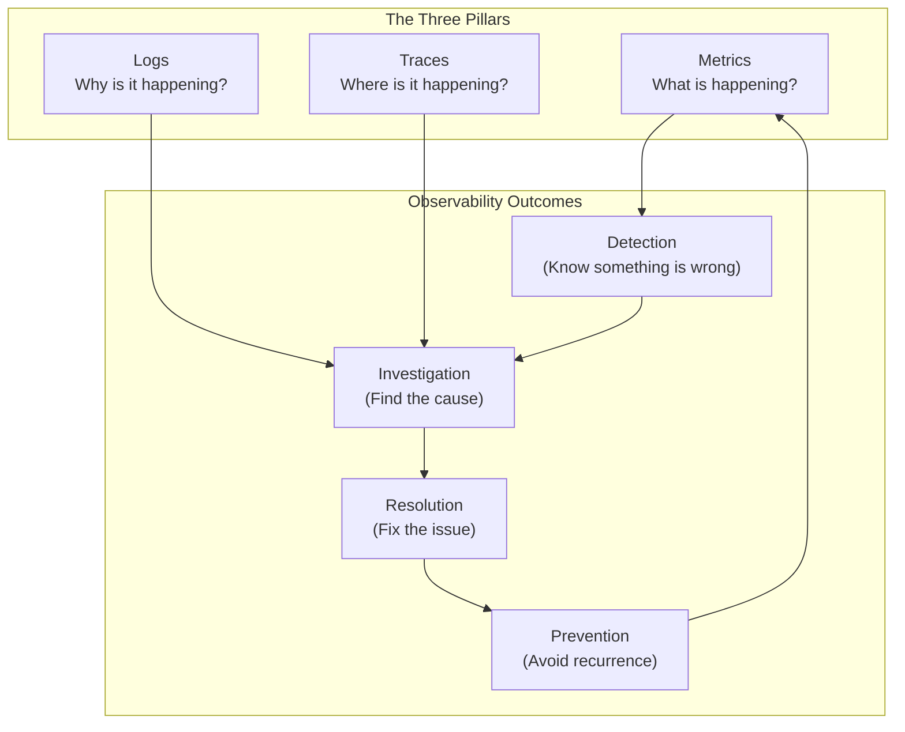

2. **Observability Maturity Model**: A progressive diagram showing different levels of observability implementation
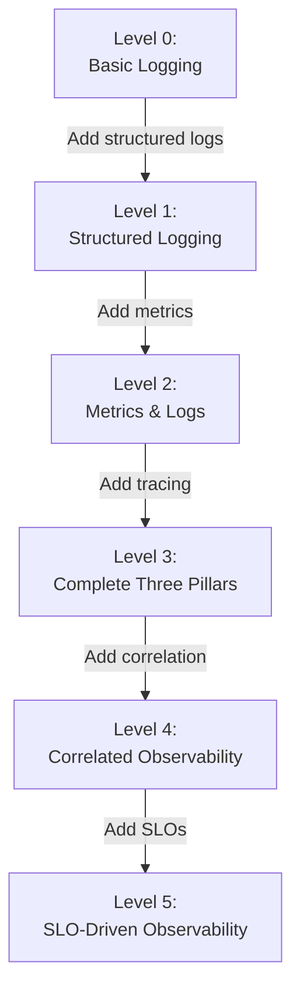

3. **Data Flow Diagram**: A high-level diagram showing how observability data flows through collection, storage, and visualization

### Metrics Implementation Diagrams
1. **Metrics Collection Flow**: Show how metrics move from application to Prometheus to Grafana
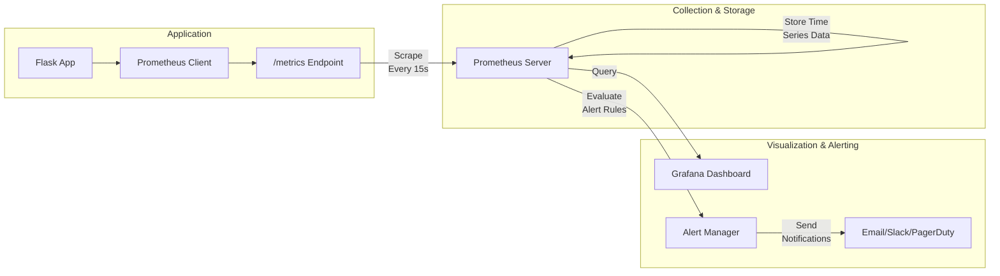

2. **Metric Types Comparison**: Visually compare counters, gauges, and histograms
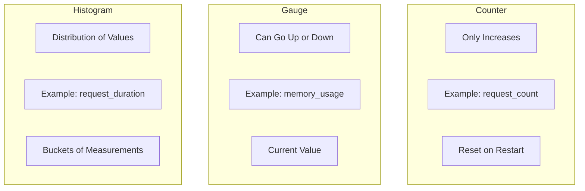

3. **Request Metrics Sequence**: Show how timing and counting metrics are recorded during a request
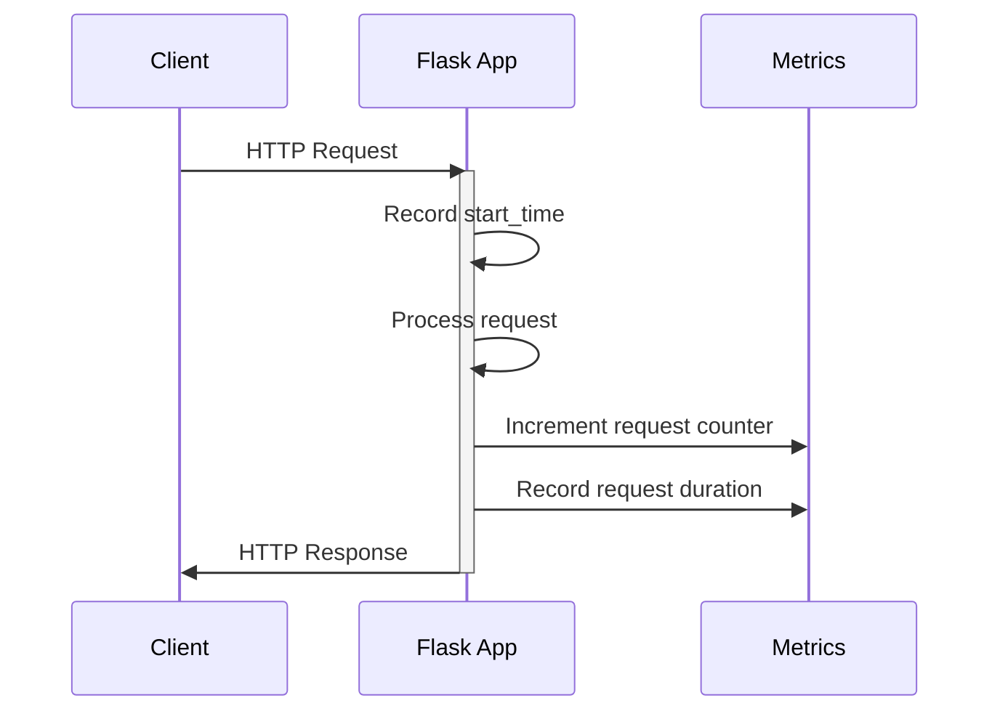

### Logging Implementation Diagrams
1. **Log Processing Pipeline**: Show the journey of a log from application to search interface
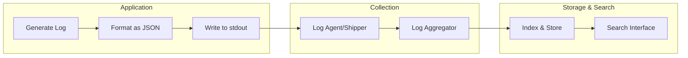

2. **Structured vs. Unstructured Logs**: Compare the two approaches visually
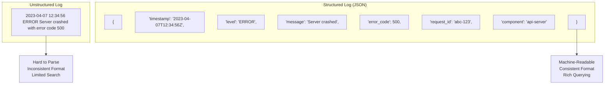

3. **Log Levels Hierarchy**: Show the relationship between different log severity levels
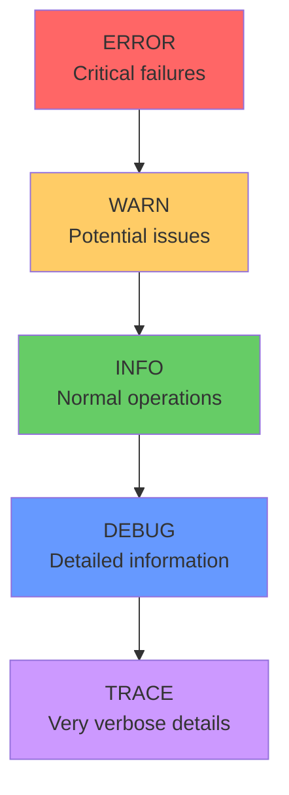

### Tracing Implementation Diagrams
1. **Distributed Trace Flow**: Show how a trace follows a request across services
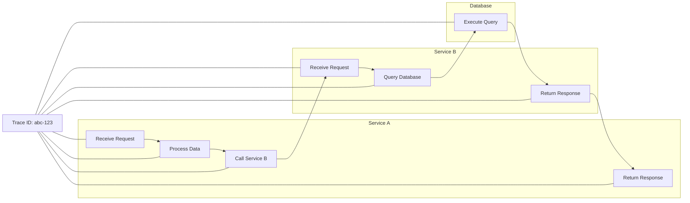

2. **Span Hierarchy**: Visualize parent-child relationships in spans
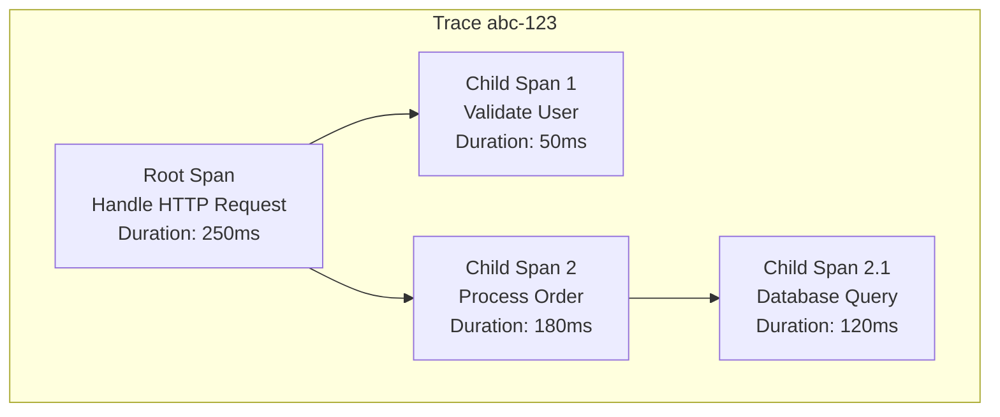

3. **Trace Context Propagation**: Show how trace IDs are maintained across service boundaries
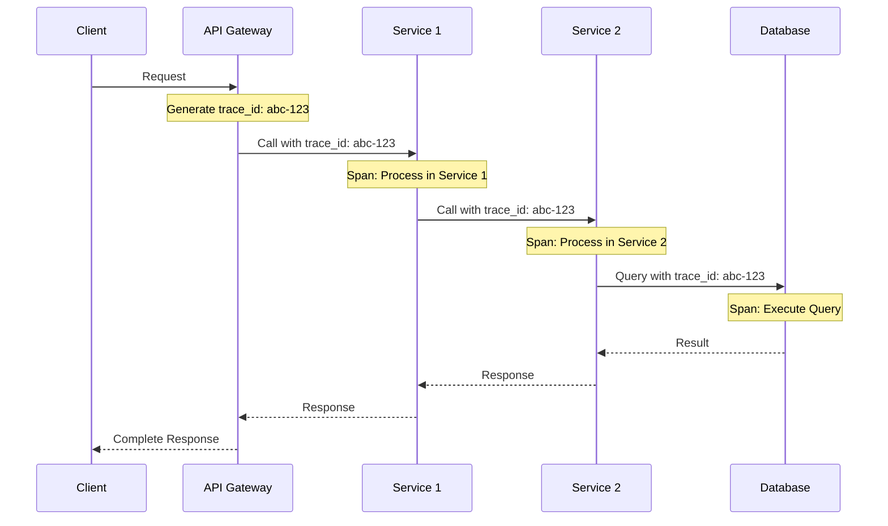

### Integration Diagrams
1. **Three Pillars Integration**: Show how metrics, logs, and traces connect via IDs and timestamps
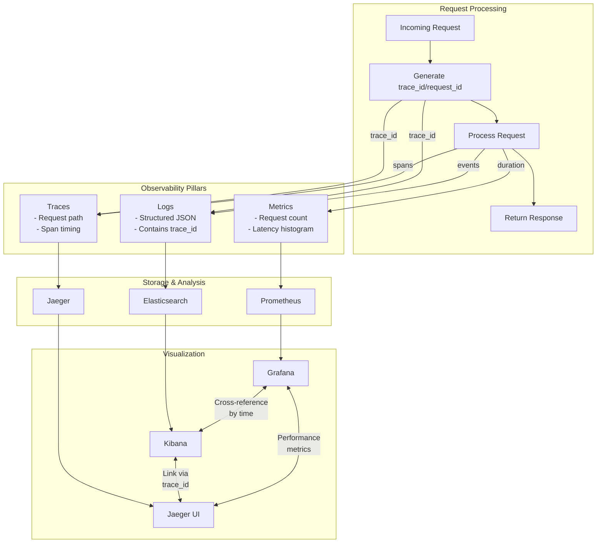

2. **Incident Investigation Flow**: Demonstrate the process of using all three pillars to diagnose an issue
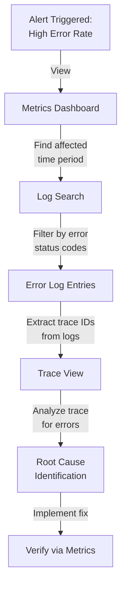

### Code Example Diagrams
For each Python code example, include:
1. A sequence diagram showing the execution flow
2. A component diagram showing interactions between application and observability systems
3. A visualization mockup showing what the resulting data would look like in monitoring tools

## Mermaid Diagram Generation Guidelines

When creating Mermaid diagrams for the training module, follow these formatting rules to ensure proper rendering:

1. **Always Enclose Node Labels in Quotes**
   * If a node label has **parentheses** `( )`, **colons** `:`, or **HTML tags** like `<br/>`, wrap it in quotes:
   ```
   A["Sequential Scan"]
   B["Index: customers_email_idx"]
   C["Line1<br/>Line2"]
   ```

2. **Use Self-Closing `<br/>` Tags**
   * For line breaks in node labels, use `<br/>` (with a slash) instead of `<br>`.
   * Keep them inside quotes: `["Line1<br/>Line2"]`.

3. **Subgraph Titles**
   * Always wrap subgraph titles in quotes:
   ```
   subgraph "Query Execution Plan"
     S1["Sequential Scan"]
     S2["Index Scan"]
   end
   ```

4. **Use Separate Lines for Each Arrow or Connection**
   * Place each connection on its own line:
   ```
   A --> B
   B --> C
   ```
   * Avoid: `A --> B --> C`

5. **No Raw Text Immediately After `subgraph`**
   * Add nodes for text inside subgraphs instead of raw text:
   ```
   subgraph "Index Structure"
     N["B-tree index diagram"]
   end
   ```

6. **Avoid Ambiguous Characters in the Flow**
   * Keep characters like `#`, `?`, or additional punctuation inside quotes if needed.

7. **Simplify Complex Diagrams**
   * Break down complex relationships into simpler sections.
   * Test diagrams incrementally to ensure proper rendering.

## ✅ Formatting Requirements

* Use emojis consistently to indicate different sections and concept tiers (🔍 Beginner, 🧩 Intermediate, 💡 Advanced/SRE)
* Create clear Mermaid diagrams for visual representation of observability concepts and flows
* Format Mermaid code blocks properly using the ```mermaid syntax
* Ensure all tables have consistent column widths and properly aligned headers
* Use consistent formatting for code blocks, including syntax highlighting for Python
* Include clear transitions between sections
* Organize content with hierarchical headings for easy navigation

Remember to maintain the "brick by brick" learning approach, ensuring each concept builds logically on previous ones and that specific implementation details enhance rather than overwhelm the fundamental concepts.

## Invocations Statement
Generate a comprehensive Day 1 observability training module focused on the Three Pillars of Observability (metrics, logs, and traces). Follow the "brick by brick" learning approach, introducing fundamental concepts and building to advanced SRE-level techniques.

Include detailed explanations of each pillar, how they interrelate, and practical implementation examples using Python. Structure the content with clear visual aids, properly formatted Mermaid diagrams for all key concepts, and examples at beginner (🔍), intermediate (🧩), and SRE (💡) levels.

Create the specified Mermaid diagrams to visualize data flow, component interactions, and implementation patterns. For each code example, include sequence diagrams showing execution flow and component diagrams showing system interactions.

Ensure all sections have thorough implementation details while maintaining accessibility for learners with diverse experience levels (ages 23-58, experience 2-20 years).