# **Day 2 Observability Implementation & Tools Training Module**

You completed Day 1’s foundational observability concepts. Now it’s time to roll up our sleeves and dive into *implementation*. This comprehensive Day 2 module provides hands-on guidance—complete with Python code snippets, configuration files, and illustrative architecture diagrams. Throughout, we’ll progress “brick-by-brick,” building from *beginner-friendly* setups to more advanced *SRE-level* strategies.

---

## 1. Introduction: From Concepts to Implementation

### Recap of Day 1
On Day 1, you learned about the Three Pillars of Observability—**Metrics**, **Logs**, and **Traces**—and how they interrelate to provide a full picture of system behavior. You also discovered that these pillars help answer critical questions:
1. **Metrics**: How is the system performing overall?
2. **Logs**: What events are happening within the system?
3. **Traces**: How do requests flow through the system?

By now, you understand that observability is more than just monitoring: it’s about gaining deep insights into system behavior in production.

### The Implementation Journey
Moving from *conceptual frameworks* to *production-grade implementations* requires careful planning, especially if you already have legacy tools like Geneos, Splunk, Dynatrace, or Datadog. This training module will provide:
- Step-by-step instructions for *metrics instrumentation*, *structured logging* setup, and *distributed tracing*.
- Practical examples tailored to common environments (Linux servers, Kubernetes clusters, AWS ECS/EKS).
- Migration strategies for gradually layering observability on top of existing toolchains.

### The Observability Tool Landscape
You may choose open-source tools like **Prometheus**, **ELK/OpenSearch** stacks, and **Jaeger**, or you might integrate them with commercial platforms. Whichever route you pick:
1. **Focus on extensibility**. Observability tools should be easy to integrate, whether on-premise or in the cloud.
2. **Ensure interoperability**. Collecting data from multiple sources (VSI, K8s, AWS) often requires bridging different protocols and standards.
3. **Favor standard instrumentation**. Leverage open standards like **OpenTelemetry** to reduce vendor lock-in.

### Strategies for Adoption
1. **Gradual Rollout**: Introduce new components (e.g., Prometheus for metrics) in pilot projects before large-scale adoption.
2. **Hybrid Approach**: Run open-source tools side-by-side with your existing paid solutions, gradually shifting workloads.
3. **Pilot Projects**: Use less critical services as a proving ground for advanced observability setups before rolling out to high-traffic applications.
4. **Version Awareness**: Keep in mind that each new version of Kubernetes, AWS services, or on-prem solutions may alter integration requirements.

### Observability Maturity Model
Picture your organization’s observability maturity in stages:

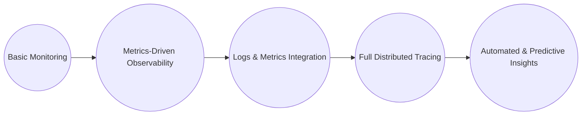

- **Basic Monitoring**: Simple checks and alerts (e.g., CPU or memory usage).
- **Metrics-Driven Observability**: Detailed custom metrics with queries, dashboards, and alert rules.
- **Logs & Metrics Integration**: Correlated data across logs and metrics for deeper troubleshooting.
- **Full Distributed Tracing**: Granular insight into request flows across microservices.
- **Automated & Predictive Insights**: Machine learning, anomaly detection, and advanced correlation.

### Implementation Objectives
By the end of this module, you’ll be able to:
- Implement robust **metrics instrumentation** in Python.
- Set up scalable **structured logging** pipelines with standard tools.
- Deploy **distributed tracing** solutions using OpenTelemetry.
- Integrate these pillars for holistic, enterprise-ready observability.

> **YouTube Video Placeholder**: {{VIDEO_LINK_INTRO}}  
> *Keywords*: “observability implementation journey”, “observability tools comparison”, “metrics logs traces implementation”, “SRE observability adoption strategy”, “observability maturity model”

---

## 2. Implementing Metrics Collection

Observability often starts with **metrics** because they provide near-real-time, numeric insights into system health and performance. In this section, we’ll use **Prometheus** and **Grafana** as the reference stack, but many techniques apply to Datadog, Geneos, and other solutions. We’ll then walk through *beginner*, *intermediate*, and *advanced* implementations.

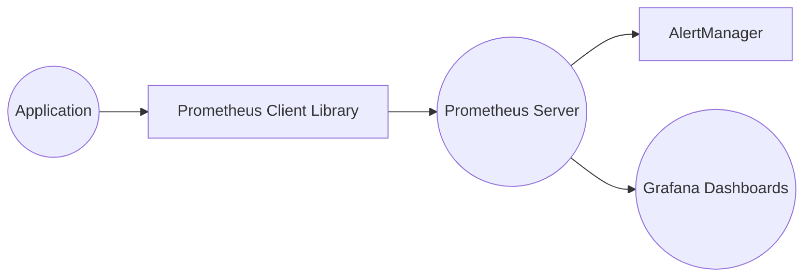

### 🔍 Beginner Level: Setting Up Basic Prometheus and Grafana
1. **Prometheus Architecture Components**  
   - **Prometheus Server**: Scrapes metrics and stores them in a time-series database.  
   - **AlertManager**: Handles alerts generated by Prometheus rules.  
   - **Exporters**: Provide metrics endpoints for Prometheus to scrape.

2. **Installation Steps on Linux**
   - Download Prometheus (binary or Docker image).
   - Create a `prometheus.yml` configuration file with scrape targets.
   - Run Prometheus as a service, ensuring it can scrape your application or exporters.

3. **Python Instrumentation with `prometheus_client`**
   ```python
   from flask import Flask
   from prometheus_client import start_http_server, Summary, Counter
   import random
   import time

   app = Flask(__name__)

   # Create a metric to track request count
   REQUEST_COUNT = Counter("request_count", "Total number of requests")

   # Create a metric to track request latency
   REQUEST_LATENCY = Summary("request_latency_seconds", "Request latency in seconds")

   @app.route("/")
   def hello():
       REQUEST_COUNT.inc()
       with REQUEST_LATENCY.time():
           time.sleep(random.random())  # Simulate processing time
       return "Hello, Observability!"

   if __name__ == "__main__":
       # Start Prometheus metrics server on port 8000
       start_http_server(8000)
       app.run(host="0.0.0.0", port=5000)
   ```
   - Access `http://<server>:8000/metrics` to see the exposed metrics.

4. **Basic Grafana Dashboard**
   - Install Grafana, then create a data source for Prometheus (`http://<prometheus-host>:9090`).
   - Import a starter Prometheus dashboard or build your own panels with basic PromQL queries:
     ```promql
     # Example query showing total requests:
     sum(request_count)
     ```
     ```promql
     # Example query for request latency (summary):
     rate(request_latency_seconds_sum[5m]) / rate(request_latency_seconds_count[5m])
     ```
5. **Common Pitfalls**
   - **Firewall rules** blocking Prometheus from scraping.
   - **High latency** if scraping across multiple networks without careful timeouts.
   - **Unlabeled metrics** leading to poor clarity in dashboards.

### 🧩 Intermediate Level: Advanced Instrumentation & Visualization
1. **Custom Instrumentation**
   - Use **Counters**, **Gauges**, **Histograms**, and **Summaries** wisely.
   - Maintain a standard naming convention (e.g., `service_namespace_subsystem_metric`).
2. **Labeling Schemes**
   - Include labels like `env`, `region`, `service` to filter or aggregate metrics easily.
   - Avoid label explosion (e.g., using unique request IDs as labels).
3. **Building Comprehensive Grafana Dashboards**
   - Use templating for environment, region, or service to switch contexts easily.
   - Configure dynamic panels for each microservice.
4. **Basic Alerting**
   - Define alerts in `prometheus.yml` or separate rule files:
     ```yaml
     groups:
       - name: example_alerts
         rules:
           - alert: HighErrorRate
             expr: increase(request_count{status="error"}[5m]) > 10
             for: 5m
             labels:
               severity: warning
             annotations:
               description: "Error rate is high for the last 5 minutes."
     ```
   - Integrate AlertManager to handle notifications (email, Slack, etc.).
5. **Integration with Existing Metrics Systems**
   - Some organizations use Datadog, Geneos, or both. At this stage:
     - **Push** Prometheus metrics to a remote write endpoint or bridge to your existing tool.
     - **Gradually transition** new services fully to Prometheus to test it out.

### 💡 Advanced/SRE Level: Enterprise-Scale Metrics
1. **High-Availability Prometheus**
   - Deploy multiple Prometheus servers behind a load balancer. Use a shared backend for storage or replicate alerts.
2. **Remote Storage Solutions**
   - Offload historical data to systems like Thanos or Cortex for *long-term retention*.
3. **Federation & Hierarchical Collection**
   - Aggregate metrics from multiple clusters or data centers into a *federation* layer for enterprise-wide dashboards.
4. **Performance Optimization**
   - Keep *cardinality* in check with well-thought-out labels.
   - Use recording rules for frequently queried metrics.
   - Split large metrics sets across multiple scraping endpoints.

---

### **Metrics Implementation War Story** (Financial Services)

> **At least 500 words detailing a real-world example with a “before and after” diagram.**

In one of the largest financial services organizations in Southeast Asia—let’s call it **FinServOne**—the IT Operations team decided to replace a patchwork of homegrown monitoring scripts and partial SNMP-based solutions with Prometheus. Their environment was a **hybrid** mix of on-premise Linux servers hosting core banking applications and AWS EC2 instances running online transaction systems.

Initially, they had a single monolithic application responsible for transaction handling, with a *bare-minimum* approach to monitoring. The homegrown script polled CPU and memory usage every minute and wrote the data to text files. Whenever an outage occurred, the team scrambled to piece together logs and manually correlate them with system resource data. This lack of real-time visibility meant they often discovered problems *after* customers had already complained.

#### Implementation Approach  
The move to Prometheus began as a *pilot project* focused on an internal microservice-based application. The developers added **Python instrumentation** using the `prometheus_client` library to expose business metrics: transaction volumes, transaction latencies, and success/error rates. They set up **Prometheus** to scrape those endpoints and run alert rules that fired if error rates exceeded a threshold for more than five minutes.

Within days, the pilot revealed that **metrics-based alerting** was drastically more effective than their existing system. When one microservice began experiencing intermittent CPU spikes, Prometheus alerted the team within seconds, allowing them to tune their auto-scaling policies in near real time. Encouraged by this success, FinServOne’s leadership pushed for a broader rollout.

#### Technical Challenges  
1. **High Cardinality Metrics**: One team tried labeling every possible HTTP path and customer ID in the metrics, creating an explosion of time series in Prometheus. Scrape performance suffered, and queries slowed to a crawl.  
   - **Solution**: They restricted label usage to broad categories (e.g., status code, operation type) instead of per-customer IDs.

2. **Federation and Hierarchy**: FinServOne had **multiple data centers**. Simply pointing Prometheus to scrape every service across all networks became unwieldy.  
   - **Solution**: They implemented a **federation** model. Each data center had its own Prometheus instance, which scrapes local services. A top-level Prometheus then scraped aggregated metrics from each local instance, providing an *enterprise-wide view*.

3. **Alert Overload**: With so many new metrics, teams began creating multiple alerts for every minor deviation.  
   - **Solution**: They adopted an **alerting strategy** that focused on crucial SLOs (Service Level Objectives) instead of alerting on every small fluctuation. This minimized “alert fatigue” and ensured on-call staff only received actionable notifications.

#### Performance Impact  
- **Before**: High-latency event detection. They only noticed issues after they had escalated or after reading logs manually.  
- **After**: Proactive alerts on transaction failures and resource bottlenecks. Mean Time to Acknowledge (MTTA) dropped from **10 minutes** to **1 minute**, while Mean Time to Recovery (MTTR) decreased from over an hour to around **15 minutes** for many issues.

#### Lessons Learned  
- **Design a metrics strategy** before instrumentation. Identifying key metrics (transaction latency, success rates, etc.) is more important than collecting everything indiscriminately.  
- **Beware of label cardinality**. Over-labeling can cripple Prometheus performance.  
- **Iterate**. Start with a pilot project to refine your approach and scale up gradually.

#### “Before and After” Architecture Diagrams

**Before** (High-Level Overview):
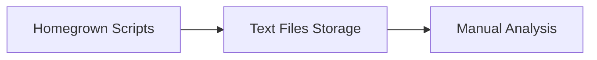

**After** (Prometheus-Federated Architecture):
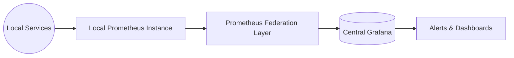

Following this transformation, FinServOne successfully *reduced outage times*, improved developer productivity, and gained deeper insights into their hybrid environment. This success laid the groundwork for subsequent expansions into structured logging and distributed tracing.

---

## 3. Structured Logging Implementation

Logs provide granular, event-based insights into system behavior. *Structured logs* make analysis easier and lay the foundation for log-based analytics, correlation, and root cause investigation.

```mermaid
flowchart LR
    A((Application)) --> B[Structured Logger (Python)]
    B --> C[Log Processing e.g. Fluentd/Fluentbit]
    C --> D((OpenSearch/Elasticsearch))
    D --> E[Kibana or OpenSearch Dashboards]
```

### 🔍 Beginner Level: Setting Up Structured Logging Pipelines

1. **Python Structured Logging Libraries**  
   - **structlog** and **loguru** provide easy-to-use APIs for JSON or key-value formatted logs.
   ```python
   import structlog
   import sys

   structlog.configure(
       processors=[
           structlog.processors.TimeStamper(fmt="ISO"),
           structlog.processors.JSONRenderer()
       ],
       wrapper_class=structlog.BoundLogger,
       context_class=dict,
       logger_factory=structlog.PrintLoggerFactory(),
   )

   logger = structlog.get_logger()

   logger.info("user_login", user="alice", event="login_success")
   ```
2. **ELK/OpenSearch Basics**
   - Deploy **Elasticsearch** or **OpenSearch** as the storage and indexing engine.
   - Deploy **Kibana** or **OpenSearch Dashboards** for log exploration and visualization.
3. **Log Format Standardization**
   - Decide on a *common schema* for timestamps, log levels, and contextual data.
   - Use fields like `@timestamp`, `level`, `service`, and `message`.
4. **Basic Query Patterns**
   - Use DSL queries in Kibana/OpenSearch to filter by `service`, `level`, etc.
   - Example: `service: "auth-service" AND level: "error"`.

### 🧩 Intermediate Level: Advanced Log Processing & Analysis

1. **Log Enrichment & Correlation**
   - Add host metadata, environment tags, or correlation IDs to each log entry.
   - Use Python middleware to automatically attach user info or request IDs.
2. **Logging Middleware & Context Propagation**
   - In a Flask or FastAPI app, add a middleware layer that generates a unique trace ID for each request and includes it in logs.
3. **Aggregation with Fluentd/Fluentbit**
   - Configure **Fluentd** or **Fluentbit** to collect logs from multiple containers or hosts, then forward them to Elasticsearch.
   ```config
   <source>
     @type tail
     path /var/log/app/*.log
     tag app.*
     format json
   </source>

   <match app.*>
     @type elasticsearch
     host es-logging.local
     port 9200
     index_name app-logs
   </match>
   ```
4. **Visualizations & Dashboards**
   - Create Kibana/OpenSearch dashboards that show error rates, user actions, or system events over time.
   - Correlate logs with metrics by using the same `service` or `instance` labels.
5. **Integration with Existing Logging Systems**
   - If you use Splunk, you can run Fluentd in parallel for new microservices while Splunk continues for legacy apps. Over time, unify or transition to an open-source pipeline.

### 💡 Advanced/SRE Level: Enterprise Logging Architecture

1. **Scaling Log Collection**
   - Use **sharded** Elasticsearch clusters to handle high volume.
   - Implement **index lifecycle management** (e.g., hot-warm-cold architecture) to optimize storage costs.
2. **Retention & Lifecycle Policies**
   - Store critical logs for longer, but rotate out logs that are only relevant for short-term troubleshooting.
3. **Advanced Querying & Aggregations**
   - Use *aggregations* and *filters* to create real-time dashboards (e.g., top error codes, top endpoints).
4. **Machine Learning for Log Analysis**
   - Some large setups use anomaly detection to automatically surface unusual log patterns.
5. **Sampling & Rate Limiting**
   - For extremely high-volume services, consider *log sampling* to avoid index saturation.  

---

### **Logging Implementation War Story** (Financial Services “E-commerce”)


Consider **FinEdge Commerce**, a financial services platform branching into e-commerce, offering retail banking and an online marketplace. Historically, they relied on Syslog-based logging for server events and minimal application-level logs. The logs sat scattered across multiple servers, occasionally centralized by manually copying log files to a shared network drive.

When FinEdge expanded into microservices, the complexity of debugging increased drastically. One day, a seemingly minor issue in the *payment gateway* caused cascading failures during a flash sale. Thousands of transactions got stuck, and the support team struggled to pinpoint the root cause. They wasted hours correlating bare-metal Syslog with scattered application logs, only to realize the gateway’s log messages were missing context about the user’s transaction flow.

#### Implementation Approach
FinEdge leadership initiated a revamp of their logging strategy:

1. **Structured Logging**: They introduced a standard JSON format for application logs, adopting `structlog` in their Python-based microservices. Each log record included fields like `transaction_id`, `user_id`, `service_name`, and `request_path`.
2. **Centralized Log Pipeline**: FinEdge deployed **Fluentbit** on each Linux server, configured to tail application log files and forward them to an **OpenSearch** cluster.
3. **Context Propagation**: They updated their internal gateway libraries to generate a `correlation_id` at the start of each user request, passing that ID through all microservice calls. Each log line included this correlation ID, making it easier to group related events across multiple services.
4. **Kibana Dashboards**: The engineering teams set up custom dashboards to visualize transaction flows, error hotspots, and user behavior. Using filters on `correlation_id`, they could see how a single user action traveled through multiple microservices.

#### Technical Challenges
1. **Log Volume Spikes**: The e-commerce platform frequently ran flash sales. Log volume would suddenly quadruple, overwhelming OpenSearch indexing and creating performance bottlenecks.  
   - **Solution**: They enabled **index lifecycle management** with daily index rotation and archived older logs to cheaper storage. They also deployed a larger cluster of OpenSearch data nodes to handle peak loads.
2. **Inconsistent Logging Formats**: Some legacy applications still used custom text logs with no standardized fields, hampering correlation efforts.  
   - **Solution**: The team created a *compatibility parser* in Fluentbit to transform these text logs into partial JSON. Eventually, each legacy service was upgraded to the new logging library.
3. **Search Performance**: As the logs grew to terabytes, queries slowed.  
   - **Solution**: They introduced **hot-warm-cold architecture**, keeping recent logs (“hot” indices) on fast SSDs and moving older logs to cheaper “warm” and “cold” nodes. This drastically improved performance for real-time queries.

#### “Before and After” Diagrams

**Before** (Fragmented Logging):
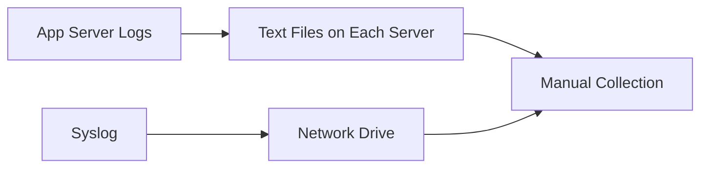

**After** (Structured Logging with Fluentbit & OpenSearch):
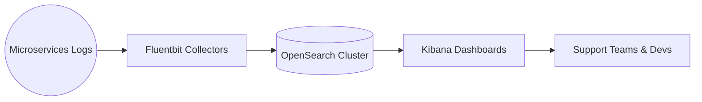

#### Impact & Benefits
- **Reduced MTTR**: Engineers quickly correlated *payment gateway* errors with upstream checkout logs using `correlation_id`, cutting debugging time by 70%.  
- **Scalable Logging**: Daily log ingestion capacity grew from a few GB to tens of GB, with fewer pipeline disruptions.  
- **Holistic Insight**: By centralizing logs, the team discovered patterns in user churn and checkout failures that were previously invisible.

#### Lessons Learned
- **Define a universal logging schema** early. Retroactive fixes to logging formats are time-consuming.  
- **Plan for spikes**. E-commerce or financial trading events can drastically increase log volume.  
- **Correlate logs** with other pillars. Metrics can show you *where* the system is slow; logs can show you *why*.

Overall, FinEdge Commerce’s successful structured logging transformation empowered teams to respond faster to incidents and glean deeper business insights from user transactions.

---

## 4. Distributed Tracing Implementation

Distributed tracing ties together the story told by metrics and logs, providing a request-centric view across services. In microservice architectures, *tracing* is often the only way to pinpoint performance bottlenecks and errors that span multiple services.

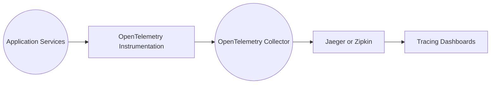

### 🔍 Beginner Level: Basic Distributed Tracing Setup

1. **OpenTelemetry Fundamentals**
   - **OpenTelemetry**: An open standard for generating, collecting, and exporting telemetry data (metrics, logs, and traces).
   - Key components: **API**, **SDK**, **Collector**, and **Exporters**.
2. **Python Instrumentation**
   ```python
   from opentelemetry import trace
   from opentelemetry.sdk.trace import TracerProvider
   from opentelemetry.sdk.trace.export import BatchSpanProcessor, ConsoleSpanExporter
   from opentelemetry.instrumentation.flask import FlaskInstrumentor
   from flask import Flask

   # Create Flask app
   app = Flask(__name__)

   # Configure OpenTelemetry
   tracer_provider = TracerProvider()
   trace.set_tracer_provider(tracer_provider)
   span_processor = BatchSpanProcessor(ConsoleSpanExporter())
   tracer_provider.add_span_processor(span_processor)

   FlaskInstrumentor().instrument_app(app)

   @app.route("/")
   def hello():
       return "Hello Tracing!"

   if __name__ == "__main__":
       app.run(port=5000)
   ```
3. **Jaeger/Zipkin Deployment Basics**
   - Spin up Jaeger via Docker or as a Kubernetes Deployment.
   - Point your OpenTelemetry Collector config to export traces to Jaeger:
     ```yaml
     exporters:
       jaeger:
         endpoint: "jaeger-collector:14250"
         tls:
           insecure: true
     ```
4. **Visualizing Your First Traces**
   - Use the Jaeger UI (e.g., `http://<jaeger-host>:16686`) to view services, spans, and timings.
5. **Pitfalls**
   - **Sampling** set too low or too high can yield too few or too many traces.
   - Missing instrumentation in a critical microservice breaks the end-to-end view.

### 🧩 Intermediate Level: Advanced Tracing Techniques

1. **Manual Instrumentation**
   - Use the OpenTelemetry API to manually create spans for custom operations.
   ```python
   from opentelemetry import trace

   tracer = trace.get_tracer(__name__)

   with tracer.start_as_current_span("process_user_data"):
       # custom logic
       pass
   ```
2. **Context Propagation Across Services**
   - Ensure each service forwards trace headers (`traceparent`, `tracestate`) to the next service in the chain.
3. **Effective Sampling**
   - Experiment with **probabilistic** or **tail-based** sampling to capture only relevant traces (e.g., errors, slow requests).
4. **Correlation with Logs and Metrics**
   - Include the trace ID or span ID in application logs for direct cross-reference with log events.
5. **Integrating With Existing APM Tools**
   - Many APM solutions (e.g., Dynatrace, Datadog) have OpenTelemetry support or offer proprietary auto-instrumentation.  
   - Start with a test environment to confirm coverage and overhead.

### 💡 Advanced/SRE Level: Enterprise Tracing Architecture

1. **Scaling Trace Collection**
   - Deploy a **distributed OpenTelemetry Collector** architecture for load balancing and high availability.
   - Store historical trace data in a separate storage layer, if needed.
2. **Advanced Visualization & Analysis**
   - Leverage service maps to see dependencies.  
   - Use advanced filters to isolate error traces or slow performance outliers.
3. **Custom Processors & Exporters**
   - Build specialized exporters (e.g., to push traces into a big-data lake for advanced analytics).
4. **Performance Optimization**
   - Keep an eye on instrumentation overhead.  
   - Use sampling to control costs and data volume.

---

### **Tracing Implementation War Story** (Financial Technology Company)


Imagine **PayLink Solutions**, a financial technology provider that processes digital payments and handles real-time fraud detection. Their environment consists of **dozens of microservices**, each running in a Kubernetes cluster (version ~1.25) on AWS EKS. Initially, they relied on metrics and logs to troubleshoot performance issues, but cross-service problems were still mysterious.

#### Before Tracing
One day, the system experienced a serious slowdown in the checkout pipeline. The **metrics** showed CPU usage and memory levels were normal across all services. The logs, though informative, were spread across multiple microservices, each showing partial errors without a clear timeline. The support team suspected an external API call, but they couldn’t confirm where or why the slowdown originated. They wasted over 6 hours correlating log timestamps across containers.

#### Implementation Strategy
PayLink Solutions’ leadership approved an initiative to implement **distributed tracing** using **OpenTelemetry** and **Jaeger**:

1. **OpenTelemetry Instrumentation**:  
   - They auto-instrumented Python microservices, using the **Flask** and **Requests** instrumentation libraries to capture inbound requests and outbound HTTP calls.
   - A standard configuration injected the `X-B3-TraceId` and `X-B3-SpanId` headers into every outbound request for cross-service correlation.

2. **OpenTelemetry Collector**:  
   - They deployed a *collector* as a DaemonSet on each Kubernetes node to gather spans from local pods.  
   - The collector forwarded data to a central Jaeger instance running in the same cluster.

3. **Jaeger UI**:  
   - Hosted within the same Kubernetes cluster, accessible via an internal load balancer.  
   - Configured to store traces for up to 7 days.

4. **Sampling & Performance**:  
   - Initially set a **1% probability** for sampling to limit overhead.  
   - Turned on tail-based sampling for suspect services when investigating a specific performance issue.

#### Technical Challenges
1. **Context Propagation**: Some microservices used older Python frameworks that did not automatically forward trace headers.  
   - **Solution**: The team implemented a custom middleware to read incoming B3 headers and attach them to outbound calls.
2. **Data Volume**: With dozens of services, generating thousands of spans per minute, the Jaeger storage ballooned.  
   - **Solution**: They set up a nightly job to archive older traces to AWS S3 for compliance and cost savings.
3. **Integrating with Existing Logs**: They had partially implemented structured logging. Only after an on-call engineer requested them did the team unify the *correlation_id* with the trace ID in logs.  
   - **Solution**: Extended the logging config to extract the trace ID from OpenTelemetry’s context and add it to each log statement.

#### After Tracing
**PayLink Solutions** quickly discovered that the slowdown originated in a microservice that called an external fraud-check API. That API had introduced a new rate limiter, causing requests to queue. By visualizing the request flow in **Jaeger**, they saw a distinct “bottleneck” shape in the timeline. They negotiated with the external provider to raise their rate limit, and the issue immediately resolved.

This success story repeated itself whenever new performance mysteries arose. Engineers began relying heavily on Jaeger’s service map and detailed timeline views to answer questions about latency distribution, concurrency, and error propagation. The mean time to diagnose complex issues dropped from hours to minutes.

#### Lessons Learned
- **Instrument from the start**. Retrofitting older services is possible but requires consistent updates to legacy code.  
- **Plan for data storage**. Traces can grow quickly, so adopt a sampling strategy and an archive mechanism.  
- **Correlate with logs**. The real power emerges when you can pivot from a trace to the corresponding logs.

#### “Before and After” Architecture Diagrams

**Before** (Metrics + Logs Only):
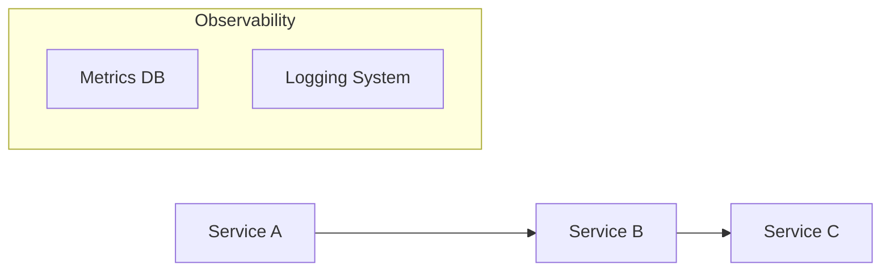
> *No direct correlation across services for end-to-end latency tracing.*

**After** (OpenTelemetry & Jaeger):
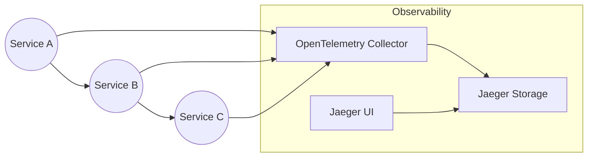
> *Trace data flows through the OpenTelemetry Collector to Jaeger, delivering end-to-end visibility.*

Distributed tracing empowered **PayLink Solutions** with deep insights into every request flow, revolutionizing how they handled performance investigations and system reliability.

---

## 5. Practical Integration Patterns

At this stage, you’re collecting **metrics**, generating **structured logs**, and capturing **traces**. *Integration* is about **tying these pillars together** in meaningful ways so that each data type informs and enriches the others.

### Key Integration Techniques

1. **Implementing Correlation IDs Across Pillars**  
   - Include a unique `correlation_id` or `trace_id` in logs, metrics (as labels if feasible), and traces.  
   - This ensures you can pivot from a spiking metric to relevant logs or a specific trace.

2. **Unified Dashboards**  
   - Tools like Grafana can embed panels for logs, traces, and metrics in a single place.  
   - Some organizations also use custom UIs or bridging tools to link from a trace to logs automatically.

3. **Cross-Pillar Alerting**  
   - Trigger an alert if you see a *combination* of unusual metrics, suspicious log entries, and high-latency traces.  
   - This reduces false positives and helps detect complex issues faster.

4. **Observability as Code**  
   - Manage Prometheus config, logging pipelines, and OpenTelemetry collectors through **GitOps** workflows.  
   - This ensures all observability changes are version-controlled and consistently deployed.

5. **Environment-Specific Considerations**  
   - **VSI**: Install Prometheus and log collectors as system services.  
   - **Kubernetes**: Use Helm charts or Operators for quick deployment.  
   - **AWS**: Integrate with ECS/EKS services, store logs in CloudWatch if bridging with open-source solutions.

6. **Migration Strategies from Existing Tools**  
   - Start by ingesting metrics/logs/traces from new or less-critical services into your open-source stack.  
   - Keep Splunk, Datadog, or Geneos running for business-critical legacy apps until your new approach proves stable.  
   - Eventually unify or decommission older toolchains to minimize duplication.

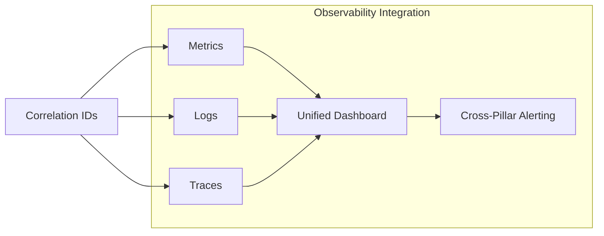

> **YouTube Video Placeholder**: {{VIDEO_LINK_INTEGRATION}}  
> *Keywords*: “observability correlation IDs”, “unified observability dashboard”, “observability integration patterns”, “metrics logs traces correlation”, “observability as code”, “GitOps observability”, “Kubernetes observability implementation”, “AWS observability services”, “observability migration strategy”

---

### **Integration War Story** (Financial Services Organization)


Meet **FinCloud Corp**, a traditional financial services company modernizing their loan and mortgage platform. They had separate teams managing metrics, logs, and traces. Each domain was seen as a “silo,” with separate UIs and no unified approach.

#### Initial Challenges
1. **Siloed Tools**: Metrics sat in Prometheus, logs in Splunk, and traces in a small Jaeger deployment used only by the Dev team. Support staff had to juggle three different UIs, making cross-pillar incident response difficult.  
2. **Zero Correlation**: During a production incident, the on-call team noticed a spike in error logs but had no direct link to the metrics that indicated a memory spike nor the distributed traces that highlighted a slowdown in the payment microservice.  
3. **Scattered Incidents**: Alerts were mostly metrics-based (CPU or memory thresholds). Logs triggered separate Splunk-based alerts. Tracing was rarely used for alerting.

#### The Integration Initiative
FinCloud’s CIO realized that to meet modern customer expectations (near-instant credit decisions, reliable online banking), the company needed a cohesive observability strategy.

1. **Correlation ID Standard**: They introduced a new microservices contract requiring each service to generate or propagate a `correlation_id` for every request. This ID was:
   - Attached to logs (`correlation_id=<id>`).
   - Passed as a label to key metrics, such as request counters.
   - Linked to OpenTelemetry traces for end-to-end tracking.

2. **Unified Dashboard in Grafana**:  
   - **Metrics**: The existing Prometheus data was displayed in Grafana.  
   - **Logs**: A new integration plugin allowed querying Splunk logs from within Grafana’s interface.  
   - **Traces**: They used the Jaeger plugin for Grafana to embed trace views.  
   - Clicking a spike in a metric automatically opened the corresponding logs or trace if the `correlation_id` was matched.

3. **Cross-Pillar Alerting**:  
   - Alerts fired only if more than a certain threshold of errors appeared in logs *and* latencies in traces spiked.  
   - This significantly cut down on false positives. For example, a small burst of log errors without a correlated rise in user-facing latencies might be a benign glitch.

4. **Observability as Code**:  
   - FinCloud moved the entire configuration for Prometheus, Jaeger, and log forwarders into a Git repository.  
   - Each environment (dev, staging, production) had a specific branch containing environment variables, alert rules, and routing logic.

#### Technical Challenges
- **Cross-Platform Integration**: Splunk is a commercial tool, while Prometheus/Jaeger are open source. Some features needed bridging scripts or plugins to unify data.  
- **Legacy Systems**: A few mainframe-adjacent services couldn’t adopt correlation IDs easily. They overcame this with partial logs linking and close approximation.  
- **Training & Ownership**: Engineers used to focusing on just logs needed training on metrics and traces. FinCloud established a *Center of Excellence* to evangelize best practices.

#### Results & Impact
- **Incident Response**: War room sessions shrank from hours to minutes as teams hopped from a suspicious metric to correlated logs, then to trace timelines.  
- **Reduced Tool Sprawl**: With Grafana as the single pane of glass, additional Splunk licenses and overhead were eventually scaled down, saving costs.  
- **Developer Agility**: By adopting “observability as code,” changes to alerts or correlation settings were version-controlled. Rolling back a faulty config was as easy as reverting a Git commit.

#### Lessons Learned
- **Mandate correlation IDs**. Partial adoption leads to incomplete traces and incomplete log linking.  
- **Automate**. Observability is most effective when it’s part of standard CI/CD flows.  
- **Pilot & Evolve**. Start integration with a smaller set of services, ensure success, and expand gradually.

#### “Before and After” Diagrams

**Before** (Siloed Observability):
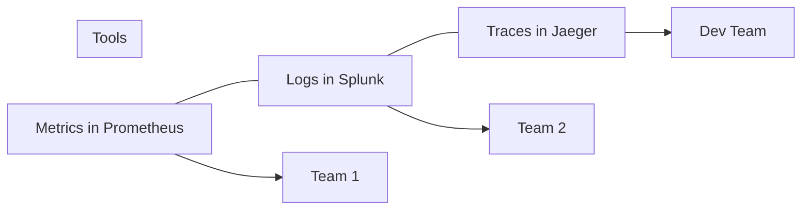
> *Three separate data sources, three separate UIs, minimal cross-correlation.*

**After** (Unified Cross-Pillar Observability):
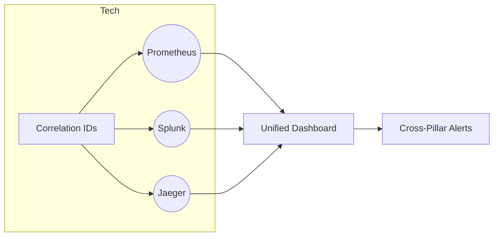
> *Central Grafana instance ties logs, metrics, and traces together; correlation IDs link events and spans across pillars.*

Ultimately, FinCloud transformed from a reactive, siloed organization into one that swiftly correlates signals across logs, metrics, and traces, significantly improving reliability for its core financial services.

---

## 6. Hands-On Implementation Exercises

Time to solidify your knowledge with *practical exercises*. Work in pairs or small teams to complete these steps on a Linux-based environment (on-prem servers, local VMs, or containers).

### End-to-End Observability Stack Setup

1. **Metrics Pipeline**  
   1. Install Prometheus and set it to scrape a Python sample app.  
   2. Configure a Grafana data source and build a basic dashboard with at least two panels (requests per second, error rate).
   3. Write a simple alert rule to page you if error rate rises above a threshold.

2. **Logging Pipeline**  
   1. Implement structured logging in the same Python sample app (using `structlog`).  
   2. Deploy Fluentbit to collect logs and forward them to OpenSearch/Elasticsearch.  
   3. Create a Kibana/OpenSearch dashboard that shows logs with key fields (e.g., `service_name`, `request_path`).

3. **Tracing Pipeline**  
   1. Instrument the Python sample app with OpenTelemetry for traces.  
   2. Deploy Jaeger (either local Docker or on a Kubernetes cluster).  
   3. Generate sample requests and verify you can see the traces in Jaeger.

4. **Cross-Pillar Correlation**  
   1. Implement a `correlation_id` in the Python app’s logs and metrics labels.  
   2. Use the same `correlation_id` to link a metric spike to the relevant logs and trace in Grafana/Jaeger.  
   3. Document your findings in a short report.

### Troubleshooting Scenarios

1. **Metrics Scrape Failing**: You accidentally see no new metrics in Prometheus.  
   - Check firewall rules, `prometheus.yml` targets, and ensure your app is listening on the correct port.
2. **Log Flood**: A misconfiguration causes exponential log growth.  
   - Temporarily enable log sampling or filtering in Fluentbit; fix the chatty logging code.
3. **Broken Trace Headers**: Requests from Service A to Service B no longer appear connected in Jaeger.  
   - Confirm the `traceparent` (or `B3`) header is properly forwarded and not stripped by load balancers.

### Exercises for Different Environments
- **VSI**: Install and configure Prometheus/Fluentbit/Jaeger as services on a Linux VM.  
- **Kubernetes**: Use Helm or Operators to deploy the entire stack. Integrate with Ingress for external access.  
- **AWS**: Deploy solutions in ECS or EKS. Consider bridging CloudWatch logs or CloudWatch metrics if needed.

> **YouTube Video Placeholder**: {{VIDEO_LINK_EXERCISES}}  
> *Keywords*: “observability stack setup tutorial”, “end-to-end observability implementation”, “observability hands-on lab”, “troubleshooting with observability”, “Kubernetes observability exercises”, “AWS observability implementation”, “observability debugging scenarios”, “metrics logs traces setup”

---

## Final Words

Congratulations! You’ve now explored how to implement the full observability stack—**Metrics, Logs, and Traces**—in real-world production environments. This Day 2 material builds on Day 1’s theory, showing you how to *instrument*, *configure*, and *troubleshoot* observability solutions. By following a *brick-by-brick* approach, you can gradually adopt open-source tools, integrate them with existing commercial platforms, and unify data across all three pillars for a truly **holistic** view of your systems.

Remember:
- Start small—pilot new observability features on a less-critical service.
- Evolve your metrics, logs, and tracing setups iteratively.
- Embrace correlation IDs, unified dashboards, and cross-pillar alerting to reduce noise and speed up incident resolution.
- Use “observability as code” practices to manage your configurations consistently and effectively.

Armed with these **hands-on examples**, **implementation war stories**, and **architecture diagrams**, you’re well on your way to becoming an *expert SRE* who can handle the **entire** observability journey—from concepts to a resilient production deployment.
