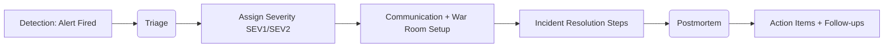
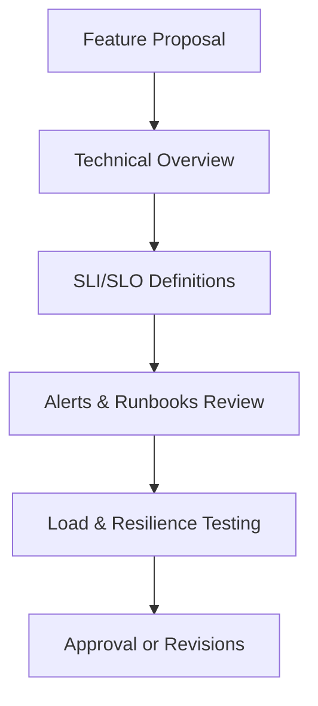

# **Day 3 Training: From Observability Warrior to SRE Superhero!**

Congratulations, brave travelers—you’ve survived Days 1 and 2 of this observability odyssey. You’ve equipped yourself with logs, metrics, and traces, and you’ve practiced implementing them. Now, it’s time to **operationalize** these tools and ascend to the ranks of true SRE champions. Ready your flasks of coffee (or energy drinks), because we’re about to combine technical excellence with a dash of humor, practical advice, and a hearty dose of real-world “I’ve seen things you wouldn’t believe…” wisdom.

---

## **1. Introduction: Evolving from Observability Wizard to SRE Champion**

You’ve spent two days learning how to monitor systems, gather data, and glean insights. Observability wizards can conjure dashboards and parse logs like arcane runes. But an **SRE champion** goes beyond ephemeral sorcery. SRE means turning those logs and metrics into **actionable reliability strategies**—so your users keep smiling and you aren’t pinned awake at 3 AM for nonsense.

### **1.1 From “Is It Broken?” to “How Broken Is It, and Does Anyone Care?”**
- **Observability Wizard**: Finds out if something is on fire.  
- **SRE Champion**: Quantifies exactly how much is on fire, whether the fire’s within acceptable bounds, and how to respond if it crosses the line.

### **1.2 Error Budgets: Explaining to Executives Who Want 100% Uptime**
- **Reality**: 100% is a myth (like a unicorn that keeps raising your cloud bill).  
- **Error Budgets**: Provide breathing room for innovation. If your SLO is 99.9%, that 0.1% downtime is your “budget” to handle the inevitable.

### **1.3 War Stories: SRE Transformations Gone Right… and Wrong**
- **Beautiful**: Teams that wholeheartedly adopt SLOs, set realistic budgets, and see improved user happiness.  
- **Messy**: Organizations that demand five nines but invest zero in reliability, leading to ironically frequent outages.

### **1.4 What to Expect in Each Tier**
- **🔍 Beginner**: Core concepts. Enough to get your feet wet without drowning.  
- **🧩 Intermediate**: Trickier use cases, multi-faceted strategies.  
- **💡 Advanced/SRE**: Big leagues. Org-wide frameworks, predictive analysis, and bridging business and tech constraints.

**📺 YouTube Video Placeholder: {{VIDEO_LINK_INTRO}}**  
*Keywords: "SRE practices introduction", "observability operationalization", "reliability engineering culture", "SLO SLI SLA basics", "error budget fundamentals", "SRE organizational maturity"*

---

## **2. The Art & Science of SLOs: Setting Reliability Targets That Won’t Get You Fired**

SLOs (Service Level Objectives) are your shining beacon in the dark sea of production unpredictability. They keep you and your users aligned on what “good enough” means, so you’re not chasing perfection and burning out.

### **2.1 🔍 Beginner Level: SLO Foundations**
1. **Translating Raw Metrics into Meaningful SLIs**  
   - **Tip**: Focus on user-facing pain (latency, error rate, throughput).  
   - **Trap**: Don’t drown in 1,000 metrics. Pick the 1-3 that matter most.

2. **Setting Realistic SLO Targets**  
   - 100% is an illusion, 99.9% might be your sweet spot.  
   - Start with your historical baseline. If you’re hitting 99.7%, target 99.7–99.8% initially.

3. **SLI vs. SLO vs. SLA**  
   - **SLI**: The measured metric (e.g., request latency).  
   - **SLO**: The target for that metric (e.g., 99.9% requests under 300 ms).  
   - **SLA**: The contractual vow, often with legal/financial consequences.

4. **Your First Error Budget**  
   - Permission to be imperfect.  
   - If your SLO is 99.9%, that 0.1% failure is your “budget.”

5. **Avoid the “Too Many Metrics” Trap**  
   - Resist the temptation to define an SLO for everything.  
   - Keep it user-centric.

---

### **2.2 🧩 Intermediate Level: SLO Artistry**
1. **Multi-Dimensional SLOs**  
   - E.g., for a streaming service: 99.9% availability **and** 95% of viewers see <2s startup time.  
   - Reflects real user experience better than a single metric.

2. **Alerting That Won’t Wake You Unnecessarily**  
   - Alert only when error budget consumption is too high or trending poorly.  
   - Helps avoid “Oops, 3 AM spam alerts for transient blips.”

3. **The Error Budget Negotiation**  
   - If reliability dips, slow feature rollouts to replenish the budget.  
   - When you have budget left, innovate freely!

4. **Creating Executive-Friendly Dashboards**  
   - Keep them clean. Green = Good, Red = Bad. If an exec can read it in 10 seconds, you win.

5. **War Story**: When SLOs Revealed Surprising Behaviors  
   - True tale: A chat service discovered that slow push notifications were the real cause of user churn, not connection errors.

---

### **2.3 💡 Advanced/SRE Level: SLO Mastery**
1. **Organization-Wide SLO Frameworks**  
   - Provide consistent templates, calculations, and review processes.  
   - Ensure every service speaks the same SLO “language.”

2. **Tiered SLOs**  
   - Not every service is mission-critical. Different tiers get different SLO levels.  
   - Minimizes overhead on less critical services.

3. **Complex Error Budget Policies**  
   - Automated gating of releases if you consume 50% of budget in 10 days.  
   - Shared budgets across microservices for holistic reliability.

4. **Predictive Reliability & Forecasting**  
   - Use historical SLO compliance to predict future usage spikes or potential meltdown.  
   - Budget your resources (and your time) accordingly.

5. **Dealing with SLO Skeptics**  
   - Show them data, then show them user satisfaction improvements.  
   - Error budgets are the universal translator for business vs. engineering friction.

---

### **2.4 Sample Python Code: Calculating SLIs and Error Budgets**

```python
import random

def calculate_sli_and_error_budget(requests=10000, slo=0.999):
    failures = 0
    for _ in range(requests):
        # 0.1% chance of failure
        if random.random() < 0.001:
            failures += 1
    
    availability = 1 - (failures / requests)
    error_budget = 1 - slo
    budget_consumed = max(0, (availability - slo) * -1)

    print(f"SLI (Availability): {availability * 100:.2f}%")
    print(f"SLO Target: {slo * 100:.2f}%")
    print(f"Error Budget: {error_budget * 100:.2f}%")
    print(f"Budget Consumed: {budget_consumed * 100:.2f}%")

if __name__ == "__main__":
    calculate_sli_and_error_budget()
```

**Configuration Example** (Prometheus + Alertmanager for SLO-Based Alerts):
```yaml
groups:
- name: SLO_Alerts
  rules:
  - alert: HighErrorBudgetConsumption
    expr: rate(http_requests_failed[5m]) / rate(http_requests_total[5m]) > 0.001
    for: 15m
    labels:
      severity: warning
    annotations:
      summary: "High error budget consumption"
      description: "Investigate potential SLO breach. Error rate above 0.1% threshold."
```

---

**📺 YouTube Video Placeholder: {{VIDEO_LINK_SLO_IMPLEMENTATION}}**  
*Keywords: "implementing SLOs", "SLI metrics selection", "error budget calculation", "SLO dashboard creation", "multi-dimensional SLOs", "SLO-based alerting", "error budget policy examples", "SLO measurement Python", "reliability metrics"*

---

## **3. The Incident Management Dojo: From Chaos to Coordination**

When everything goes sideways, do you scramble and point fingers, or calmly orchestrate a resolution? A great incident management process can be the difference between a mere hiccup and an all-out meltdown.

### **3.1 🔍 Beginner Level: Survival Basics**
1. **Incident Detection That Actually Works**  
   - Leverage your logs, metrics, and traces to catch anomalies.  
   - Connect to an on-call tool (PagerDuty, Opsgenie) for immediate response.

2. **Severity Levels That Make Sense**  
   - Not everything is SEV1. Decide carefully (SEV1 = major outage, SEV3 = minor user annoyance).

3. **Documentation to Save You at 3 AM**  
   - Keep runbooks simple. If they’re 10 pages, you won’t read them while half-asleep.

4. **On-Call Rotations That Won’t Burn You Out**  
   - Rotate fairly. Give people time to recover.  
   - Clear escalation paths if the on-call can’t fix it alone.

5. **Your First Postmortem**  
   - Blamelessness is key. Don’t punish, learn!

---

### **3.2 🧩 Intermediate Level: Incident Mastery**
1. **Playbooks That Don’t Gather Digital Dust**  
   - Keep them updated. Link them directly to alerts so they’re used in the heat of battle.

2. **Automating the Boring Parts**  
   - Chatbots that open Zoom/Teams, gather logs automatically, or spin up war rooms.  
   - Helps you focus on actual troubleshooting, not admin tasks.

3. **Effective Communication Patterns**  
   - Everyone in one channel. Keep side convos minimal.  
   - Regular “state of the incident” updates prevent confusion.

4. **Balancing On-Call Load**  
   - Track how many pages each person gets. Rebalance to avoid fatigue.

5. **Postmortems People Want to Attend**  
   - Focus on root causes and solutions, not blame or shame.  
   - If people learn, they’ll keep showing up.

---

### **3.3 💡 Advanced/SRE Level: Incident Leadership**
1. **Scalable Incident Response**  
   - Large organizations need advanced triage with specialized roles (Incident Commander, Communications Lead, etc.).

2. **Finding Patterns in the Chaos**  
   - Use historical incident data to spot recurring themes.  
   - Target big or repeated issues for permanent fixes.

3. **Chaos Engineering**  
   - Proactive “practice incidents” to strengthen your resilience.  
   - Start with small blasts before going nuclear.

4. **Long-Term Learning**  
   - Evaluate how well you responded, not just how quickly you restored service.  
   - Build a continuous improvement loop.

5. **Culture That Turns Incidents into Growth**  
   - Celebrate improvement! Turn near-disasters into war stories that shape better systems.

---

### **3.4 Practical Incident Workflow (Sample)**



**Short YAML Snippet for Incident Routing**:
```yaml
incident_management:
  severity:
    SEV1: "Critical outage, immediate response"
    SEV2: "Major degradation, respond in <30 minutes"
  auto_escalation:
    - engineering_lead
    - sre_lead
  runbook_links:
    - service: "payment_gateway"
      doc: "http://docs.internal/runbooks/payment_incident.md"
```

---

**📺 YouTube Video Placeholder: {{VIDEO_LINK_INCIDENT_MANAGEMENT}}**  
*Keywords: "observability incident response", "SRE on-call best practices", "incident severity classification", "incident management automation", "blameless postmortems", "incident communication patterns", "game day exercises", "chaos engineering basics", "incident analysis techniques"*

---

## **4. Taming the Observability Beast: Scaling Without Breaking the Bank**

We love data… until the cloud bill arrives. Observability must scale responsibly, or your CFO will dispatch a different kind of “incident” on your budget.

### **4.1 🔍 Beginner Level: Cost Control 101**
1. **Understanding Where the Money Goes**  
   - Log ingestion, metric storage, tracing. Each can explode if unchecked.

2. **The Art of Sampling**  
   - You don’t need every single log line from 10 million daily requests.  
   - 10% sampling might suffice—and store 100% of errors.

3. **Retention Policies**  
   - Keep the last 7 or 14 days hot, archive older logs to cheaper storage.

4. **“Nice to Have” vs. “Need to Have” Data**  
   - If no one uses it, stop paying for it!

---

### **4.2 🧩 Intermediate Level: Advanced Optimization**
1. **Tiered Observability**  
   - Tier 1 (critical) = full retention, real-time alerts. Tier 3 (low priority) = partial sampling, short retention.

2. **Smart Sampling**  
   - Dynamic strategies that capture spikes or anomalies in greater detail.  
   - Ensures you don’t miss the interesting stuff.

3. **Data Compression Techniques**  
   - Aggregated metrics for historical trends, raw data only for last few days.

4. **Making Teams Aware of Their Observability Footprint**  
   - “Showback” or “chargeback” models. Everyone owns their data costs.

---

### **4.3 💡 Advanced/SRE Level: Observability Economics**
1. **Observability as a Platform**  
   - Provide a single place for logs, metrics, traces. Let teams self-serve while monitoring usage.

2. **Cost Modeling**  
   - Predict usage growth and plan expansions (or reductions).  
   - Present data to execs in business-friendly language.

3. **Governance That Helps, Not Hinders**  
   - Standards for new instrumentation. Keep the sanity, but don’t stifle innovation.

4. **Architecture Patterns for Scale**  
   - Sharding, region-based log storage, multi-level caching.  
   - Avoid single monolithic solutions that grow out of control.

---

### **4.4 Example Cost Analysis Snippet**

```python
import pandas as pd

# Hypothetical monthly usage data
data = {
    'Team': ['Payments', 'Catalog', 'Analytics', 'Mobile'],
    'LogVolumeGB': [700, 300, 1200, 200],
    'MetricsCount': [2000, 1000, 5000, 800]
}
df = pd.DataFrame(data)

# Approximate cost calculations
df['LogCostUSD'] = df['LogVolumeGB'] * 0.10
df['MetricsCostUSD'] = df['MetricsCount'] * 0.02
df['TotalCostUSD'] = df['LogCostUSD'] + df['MetricsCostUSD']

print(df)
```

**Possible Output**:
```ts
        Team  LogVolumeGB  MetricsCount  LogCostUSD  MetricsCostUSD  TotalCostUSD
0   Payments          700          2000        70.0           40.00         110.0
1    Catalog          300          1000        30.0           20.00          50.0
2  Analytics         1200          5000       120.0          100.00         220.0
3     Mobile          200           800        20.0           16.00          36.0
```

---

**📺 YouTube Video Placeholder: {{VIDEO_LINK_SCALING_COST}}**  
*Keywords: "observability cost management", "scaling observability infrastructure", "observability data sampling", "log retention optimization", "trace sampling strategies", "observability as a service", "metrics storage optimization", "observability data lifecycle", "observability governance"*

---

## **5. Reliability Culture: Making SRE a Superpower, Not a Burden**

Even the most advanced tools flop if the people using them resist. Building an SRE culture is part persuasion, part leadership, and part consistent follow-through.

### **5.1 🔍 Beginner Level: Cultural Foundations**
1. **Selling Reliability to the “Just Ship It” Crowd**  
   - Emphasize how fewer outages = happier users (and fewer 3 AM pages).  
   - Show small wins to build trust.

2. **Features vs. Stability**  
   - Use error budgets to negotiate. If reliability dips below the threshold, slow down features to recover.

3. **Reducing Toil**  
   - The grunt work that doesn’t add lasting value. Automate it!  
   - Freed time = more creative solutions.

4. **Dev & Ops Collaboration**  
   - Share runbooks, create cross-functional squads.  
   - Make reliability everyone’s job.

---

### **5.2 🧩 Intermediate Level: Cultural Growth**
1. **Embedded vs. Central SRE Teams**  
   - Embedded: SREs in each product team.  
   - Central: One big SRE group advising all.  
   - Hybrid: A bit of both. Each has pros/cons.

2. **Production Readiness Reviews (PRRs)**  
   - Check SLO alignment, runbooks, on-call coverage **before** shipping.  
   - Catch potential disasters early.

3. **Teaching Devs to Love Observability**  
   - Provide easy-to-use instrumentation libraries.  
   - Show them how metrics reveal performance insights that help them build better features.

4. **Communities of Practice**  
   - Internal Slack channels, monthly meetups, or “brown-bag” sessions.  
   - Encourage knowledge-sharing across teams.

---

### **5.3 💡 Advanced/SRE Level: Cultural Leadership**
1. **Scaling SRE Across Large Orgs**  
   - Formal charters, consistent funding, dedicated leadership.  
   - Emphasize SRE as a strategic function, not just ops with a fancy name.

2. **Reliability as Competitive Edge**  
   - When your product rarely goes down, word spreads.  
   - Customers trust you, churn drops.

3. **Executive Engagement**  
   - Present reliability metrics (SLO compliance, incidents resolved) in weekly or monthly reviews.  
   - Show how SRE drives real business value.

4. **Measuring Cultural Transformation**  
   - Track time to adopt new SRE practices, # of blameless postmortems, etc.  
   - Watch how employees feel about on-call and reliability work.

---

### **5.4 Example Production Readiness Review Template**



---

**📺 YouTube Video Placeholder: {{VIDEO_LINK_SRE_CULTURE}}**  
*Keywords: "SRE culture adoption", "reliability engineering teams", "production readiness review", "toil reduction strategies", "SRE collaboration patterns", "scaling SRE practices", "SRE maturity assessment", "DevOps to SRE transition", "reliability leadership"*

---

## **6. Shift-Left Reliability: Catching Problems Before They Catch You**

Waiting for production to discover your issues? That’s so last year. Shift-left reliability means building observability and resilience checks into your development process.

### **6.1 🔍 Beginner Level: Development Integration**
1. **Moving Observability to Dev/QA**  
   - Instrument your app in dev to see if new code breaks everything.  
   - Catch big errors before they go live.

2. **Observability Testing in CI/CD**  
   - Basic load tests. Check for latency or error rate spikes.  
   - Quick feedback loops for devs.

3. **Designing Systems That Talk to You**  
   - Structured logging, consistent metrics naming.  
   - Make it easier to trace requests from end to end.

---

### **6.2 🧩 Intermediate Level: Observability-First Development**
1. **SRE Collaboration in Each Sprint**  
   - Plan SLOs with dev tasks.  
   - Proactively identify reliability concerns.

2. **Synthetic Testing**  
   - “User-like” queries in staging or canary environments.  
   - If a new feature breaks synthetic tests, you fix it before real users see it.

3. **Pre-Production Reliability Validation**  
   - Chaos experiments in staging: artificially degrade a database connection.  
   - See if your system can handle partial failures gracefully.

---

### **6.3 💡 Advanced/SRE Level: Reliability by Design**
1. **Influencing Architecture Early**  
   - SRE input at design reviews: e.g., “We’ll need these metrics, these fallback mechanisms.”  
   - Bake reliability in from day one, instead of retrofitting it later.

2. **Chaos Engineering**  
   - Systematic fault injection.  
   - Build “muscle memory” so teams know how to respond swiftly.

3. **Observability-Driven Dev Environments**  
   - Mirror production’s observability in dev environments.  
   - Provide real-time feedback as code is written and tested.

---

### **6.4 CI/CD Example with Observability Validation**

```yaml
stages:
  - build
  - test
  - observe
  - deploy

observe:
  stage: observe
  script:
    - echo "Running Observability Checks..."
    - python run_tests.py --check-latency --check-errors
  only:
    - merge_requests
```

**Explanation**:  
- After basic build and test, a dedicated **observe** stage checks real-time performance metrics in a staging environment.  
- If latency or error rate is too high, pipeline fails.

---

**📺 YouTube Video Placeholder: {{VIDEO_LINK_ODD}}**  
*Keywords: "observability driven development", "shift left monitoring", "CI/CD observability", "synthetic monitoring", "pre-production reliability testing", "chaos engineering implementation", "resilience testing", "testable system design", "observable architecture patterns"*

---

## **7. The SRE Journey: Putting It All Together**

Now for the grand finale: uniting everything—SLOs, incident management, scaling strategies, cultural transformation, and shift-left reliability—into one unstoppable SRE machine.

### **7.1 End-to-End SRE Transformation Case Study**
- **Scenario**: A large e-commerce site struggling with frequent outages during major sales events.  
- **Solution**: Defined SLOs for checkout and search latencies, built automated incident management, introduced cost-optimized observability, and embedded SRE champions in each product team.  
- **Result**: Reduced SEV1 incidents by 60%, lowered observability costs by 25%, and improved developer happiness because on-call nightmares plummeted.

### **7.2 Roadmaps for Different Organization Sizes**
- **Small Startup**: Start with a single SLO, a simple on-call rotation, and cost-savvy logging.  
- **Mid-Sized Org**: Introduce tiered SLOs, advanced incident automations, partial chaos engineering.  
- **Enterprise**: Full-blown SRE teams, robust error budget policies, multi-region observability, and high-level exec buy-in.

### **7.3 Measuring Success Beyond Uptime**
- **User Sentiment**: NPS scores or app reviews.  
- **Team Health**: On-call load, burnout levels, churn.  
- **Business Metrics**: Revenue protection, brand reputation, fewer fire drills.

### **7.4 Tools & Templates to Kick-Start Your Own SRE Practice**
- SLO starter kits (Python scripts, dashboard configs)  
- Incident playbooks with war room checklists  
- Postmortem templates that emphasize learning  
- Observability budgets and sampling strategies  
- Culture assessment surveys to measure readiness

---

**📺 YouTube Video Placeholder: {{VIDEO_LINK_CAPSTONE}}**  
*Keywords: "complete SRE implementation", "reliability engineering practice", "SRE roadmap", "observability strategy end to end", "SRE practice measurement", "reliability improvement framework", "integrated observability platform", "SRE evolution strategy", "SRE toolchain integration"*

---

# **War Stories from the SRE Trenches**

Below are four case studies with a healthy mix of humor, lessons learned, and practical tips:

### **The SLO Revolution: How We Stopped Arguing About Reliability**
- **Setup**: A chat app where devs insisted “we need 99.999% uptime!”  
- **Struggle**: Engineering chaos without meaningful reliability data.  
- **SLO Introduction**: Chose availability (99.9%) and message send latency (<300 ms for 95% of messages).  
- **Aha Moment**: Error budgets helped devs prioritize bug fixes before adding more chat emojis.  
- **Outcome**: Less bickering, fewer Sev1 incidents, happier end-users who got faster message sends.

### **Incident Management Transformation: From Blame to Fame**
- **Painful Past**: War rooms turning into finger-pointing fests. People dreaded on-call.  
- **Shift**: Adopted blameless postmortems, shared chat channels, rotating incident commander role.  
- **Lessons Learned**: People became open about mistakes once they realized they wouldn’t be crucified.  
- **Improvements**: MTTR dropped from an average 2 hours to 30 minutes, morale soared.

### **Observability at Scale: Taming the Data Monster**
- **Initial Shock**: After a massive traffic spike, the monthly logging bill quadrupled. CFO not amused.  
- **Creative Fix**: Tiered data retention, dynamic sampling, and cost showbacks to dev teams.  
- **Results**: 25% overall cost reduction with minimal impact on incident detection.  
- **Key Takeaway**: You don’t need to store everything. Focus on quality, not quantity, of data.

### **SRE Culture: Converting the Non-Believers**
- **Corporate Legacy**: “We’ve always done it this way…”  
- **Change Agents**: Embedded SREs in each department, monthly reliability meetups, strong leadership backing.  
- **Hurdles**: Initially, devs saw reliability tasks as “extra overhead.”  
- **Culture Win**: Over a year, reliability became a source of pride and a key selling point to clients.  
- **Metric**: 40% fewer P0/P1 incidents, plus improved cross-team camaraderie.

---

# **Final Words**

You’ve made it through an **epic** Day 3. If you’re feeling both excited and slightly terrified, you’re on the right track. Embracing the SRE mindset is a journey of continuous improvement, measured risk, and “I told you so” moments that (hopefully) come less and less often at 3 AM.

- **Remember**:  
  1. **SLOs** keep you honest about what matters most to users.  
  2. **Incident Management** processes tame the chaos.  
  3. **Scaling Observability** responsibly protects both your uptime and your budget.  
  4. **Reliability Culture** cements it all so people actually embrace these practices.  
  5. **Shift-Left** ensures you find problems before they blindside you in production.

Go forth, heroic SREs-in-training. May your error budgets remain healthy, your on-call rotations calm, and your services ever more reliable. You’ve got this!

---

### **Hands-On Exercises Recap**

1. **Define a Tiered SLO** for one critical service and one non-critical service.  
2. **Create an Incident Playbook** for a known recurring issue.  
3. **Perform a Quick Cost Analysis** on your existing observability logs.  
4. **Run a Production Readiness Review** on an upcoming feature.  
5. **Implement a CI Step** that fails if latency or error rates exceed thresholds in staging.

---

> **“Sometimes the only difference between heroism and foolishness is whether it worked.”**  
> — An SRE who definitely never shipped a bug to prod… probably.

Now, go out there and put these insights to work—your journey to SRE stardom is just beginning!