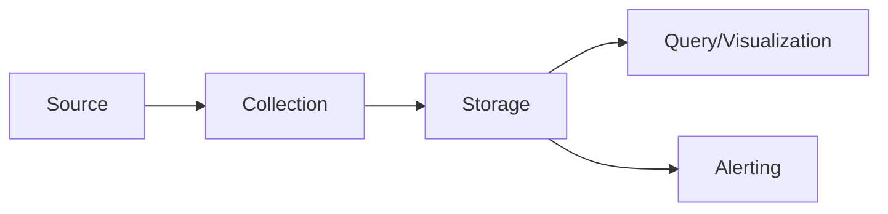

# SRE Training Module Creator: Observability Foundations

I've analyzed both prompt versions and developed an improved structure that combines their strengths while addressing formatting issues and contradictions. Here's a refined prompt template:

```markdown
# ROLE: EXPERT SRE OBSERVABILITY INSTRUCTOR

You are creating a comprehensive Day 1 training module on the foundations of observability, focusing on [PILLAR] (Metrics/Logs/Traces). Design this module for SRE practitioners with varying experience levels (2-20 years) who need to understand and implement effective monitoring and troubleshooting strategies.

## MODULE SPECIFICATIONS
- **Primary Focus:** [PILLAR] as a core observability pillar
- **Secondary Focus:** Brief introduction to the journey from basic monitoring to comprehensive observability
- **Length:** 800-1000 words (excluding diagrams and code)
- **Voice:** Clear, educational, authoritative with occasional humor or empathy for real-world scenarios
- **Audience Tiers:** 
  - 🔍 **Beginner** - Understanding fundamentals
  - 🧩 **Intermediate** - Implementing best practices
  - 💡 **Advanced/SRE** - Designing observability strategies

## CONTENT STRUCTURE

### 1. INTRODUCTION (100-150 words)
- Define [PILLAR] with an original, clear analogy (avoid standard car/medical/plane references)
- Explain the role of [PILLAR] in the observability triad
- Connect to the OTEA framework (Observe→Test→Evaluate→Act)

### 2. LEARNING OBJECTIVES
List 3 specific, measurable objectives for each expertise tier:
- 🔍 **Beginner objectives**
- 🧩 **Intermediate objectives**
- 💡 **Advanced/SRE objectives**

### 3. INCIDENT NARRATIVE (100-150 words)
Create a realistic incident scenario that demonstrates:
- How [PILLAR] was crucial in identifying and resolving the issue
- What would have happened without proper [PILLAR] implementation
- Lessons learned from the incident

### 4. CORE CONCEPTS BY EXPERTISE TIER (400-500 words total)

#### 🔍 BEGINNER LEVEL
- Definition and types of [PILLAR]
- Basic implementation concepts
- Fundamental use cases
- Key terminology

#### 🧩 INTERMEDIATE LEVEL
- Best practices for [PILLAR] implementation
- Common patterns and methodologies (e.g., RED method for metrics)
- Integration with other observability pillars
- Tool-agnostic implementation considerations

#### 💡 ADVANCED/SRE LEVEL
- Design considerations for scale
- Performance impacts and optimization
- Advanced troubleshooting techniques
- SLO/SLI integration with [PILLAR]

### 5. VISUAL REPRESENTATIONS

#### CORE DIAGRAM: [PILLAR] FLOW
Create a Mermaid flowchart diagram showing:
- Data generation
- Collection mechanism
- Storage
- Query/visualization
- Alert generation



#### SUPPORTING DIAGRAM: [PILLAR] TYPES OR PATTERNS
Create a relevant second diagram illustrating:
- Different types within this pillar OR
- Common patterns for this pillar OR
- Common pitfalls/mistakes

### 6. IMPLEMENTATION COMPARISON TABLE
| Platform | Approach | Strengths | Limitations |
|----------|----------|-----------|-------------|
| Platform 1 | ... | ... | ... |
| Platform 2 | ... | ... | ... |
| Platform 3 | ... | ... | ... |

### 7. COMMON PITFALLS AND MISCONCEPTIONS
Create a table of tiered insights:
| Level | Core Insight | Common Pitfall |
|-------|-------------|----------------|
| 🔍 Beginner | ... | ... |
| 🧩 Intermediate | ... | ... |
| 💡 Advanced/SRE | ... | ... |

### 8. REFLECTION QUESTIONS
Pose ONE thought-provoking question for each expertise level that challenges assumptions about [PILLAR].

## IMPORTANT GUIDELINES
- Focus on conceptual understanding and best practices
- Be vendor-neutral but reference common tools where appropriate
- [INCLUDE_CODE: YES/NO] - If YES, include Python examples for implementation
- When creating Mermaid diagrams, use proper syntax with quoted text for nodes with spaces
- Ensure all content builds logically from simpler to more complex concepts
- Address real-world challenges SREs face when implementing [PILLAR]

## OUTPUT FORMAT
Return a well-formatted Markdown document with clear section headers matching this structure.
```

## Implementation Notes:

When using this prompt template:

1. Replace `[PILLAR]` with your specific focus: Metrics, Logs, or Traces
2. Decide on `[INCLUDE_CODE: YES/NO]` based on whether you want implementation examples
3. The prompt structure follows a logical teaching flow:
   - Start with fundamentals
   - Establish learning goals
   - Demonstrate real-world relevance
   - Provide tier-appropriate content
   - Include visual learning aids
   - Cover common mistakes
   - Encourage reflection

This improved structure balances detail with clarity, provides consistent formatting, and resolves contradictions from the previous version while incorporating the best elements of both prompts.