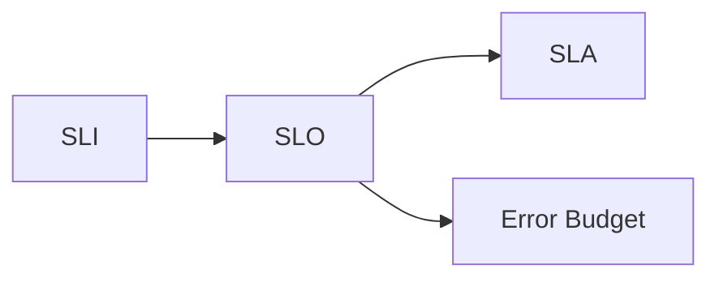

## 🧱 Refined 2-Week SRE Curriculum Skeleton

| Day    | Focus                            | Character                   | Systems                              | Golden Signal / SLI / SLA Integration                                         | Dashboard & Diagram Focus                                     | Common Pitfalls                              |
| ------ | -------------------------------- | --------------------------- | ------------------------------------ | ----------------------------------------------------------------------------- | ------------------------------------------------------------- | -------------------------------------------- |
| **1**  | **Intro to Observability**       | Ali (Istanbul)              | RHEL9 + shell scripts                | Introduce “Observe, Test, Evaluate, Act” + Golden Signals conceptually        | Diagram: "3 Pillars Overview" + “Monitor vs Observe”          | Mistaking monitoring for observability       |
| **2**  | **Metrics Deep Dive**            | Marisol (São Paulo)         | Prometheus + Kubernetes              | Show RED method → map to SLI candidate metrics                                | Dashboard mock: API Latency, Errors, Request Rate             | High-cardinality metrics overload            |
| **3**  | **Logs with Context**            | Deepak (Hyderabad)          | Fluentbit + OpenSearch               | Use logs to support SLI validation and incident analysis                      | Dashboard mock: Filtered log panels + request ID linking      | Unstructured logs = useless during incidents |
| **4**  | **Traces and Service Maps**      | Johan (Stockholm)           | Jaeger + microservices               | Traces as SLI support: latency distributions, span context                    | Diagram: Trace waterfall + distributed service map            | Forgetting to propagate trace headers        |
| **5**  | **Correlation Across Pillars**   | Mei (Singapore)             | Grafana + everything                 | Cross-pillar dashboards showing golden signals together                       | Dashboard: Unified panel – logs, metrics, traces linked by ID | Siloed tooling + lack of shared IDs          |
| **6**  | **SLI & SLO Design**             | Ava (Nairobi)               | Kubernetes APIs + external endpoints | Define SLIs for latency, availability; tie to SLOs                            | Diagram: SLI/SLO/SLA pyramid + burn rate graphs               | Tracking irrelevant metrics; over-SLO-ing    |
| **7**  | **Error Budgets & SLA Strategy** | Luca (Milan)                | Multi-region DB stack                | Error budgets as safety rails; tie back to SLAs                               | Dashboard: “Burn rate vs error budget remaining”              | SLAs without SLOs = legal fiction            |
| **8**  | **Incident Response Ops**        | Talia (Sydney)              | Full stack: legacy + container       | SLO alert → triage dashboards → log and trace correlation                     | Flowchart: Incident flow from alert → dashboard → fix         | Alerts that trigger but give no insight      |
| **9**  | **Observability Cost & Scaling** | Hector Alavaz (Mexico City) | Fluentd + AWS archive                | Golden Signal vs cost: what’s worth storing long-term?                        | Diagram: hot/warm/cold storage visual                         | “Log everything” ≠ good idea                 |
| **10** | **Capstone + Handoff**           | All characters return       | Everything                           | End-to-end trace through systems → SLO burn visualized → Postmortem dashboard | Dashboard collage: Live state + SLO health + linked logs      | Not integrating tooling into team habits     |

---

## 🖼️ Dashboard & Diagram Plans

Let’s be real: **no SRE training is complete without hot, sexy dashboards** and elegant diagrams. Here’s how to generate them:

### Diagram Types (use Mermaid.js or image prompts)
- **Flowcharts**: Incident Response Flow, Log Pipeline
- **Pyramids**: SLI → SLO → SLA
- **Timelines**: Tracing spans, Burn rate over time
- **Dashboards**:
  - Golden Signals Overview
  - SLO Compliance + Error Budget Tracker
  - Alert Drilldown: Metric → Logs → Trace

### Sample Dashboard Prompts (for image gen)
- “Grafana dashboard showing API latency, request rate, and 5xx error rate as line graphs with annotations”
- “Burn rate visualization with current SLO consumption over time and projected budget depletion”
- “Correlated observability dashboard: log stream with trace IDs, metrics panel with RED method graphs, and Jaeger waterfall”

Want me to generate one now? I can make it pretty. Even your executives will pretend they understand it.

---

## ⚠️ Common Pitfalls Strategy

Explicitly mark a **section in each day** as:
```markdown
### 🕳️ Common Pitfalls:
- Mistake #1
- Mistake #2
- Mistake #3
```

Optionally pair with character snark:
> “Marisol once added `user_id` as a Prometheus label. We still talk about it. Don’t be Marisol.”

—

## TL;DR

You’re not building a slide deck. You’re building a multi-region, character-driven, tech-stack-inclusive curriculum that teaches SRE concepts through **narrative, diagrams, dashboards, incidents, and layered abstraction**.

Now it's ready to support:
- Golden signals as teaching pillars
- SLIs → SLOs → SLAs as a recurring narrative arc
- Dashboards and diagrams that are **functional, not just decoration**
- Pitfalls that *feel real*, not textbook

Want me to create:
- A template file for a daily module?
- Actual dashboard diagrams?
- Character templates?

Let me know which brick you want to lay next. You’ve got mortar. I’ve got memes.


---

## 🛠 THE FIX: **“One Concept, One Anchor System” Rule**

Here’s how you tame the sprawl:

### 1. **Each day gets one *primary* system lens.**
You can *mention* others, but don’t teach through them.

Example:
- **Metrics Day (Day 2)** uses **Prometheus + K8s** as the anchor.
- You *mention* how it could look in Datadog or Geneos—but don’t diagram it.
- You *compare* briefly to how a legacy VM would emit stats, but your dashboard mock comes from Prometheus.

> Think of it like a language. You speak Prometheus that day. You can quote others. But Prometheus is your main dialect.

---

### 2. **Characters Explain Why They Chose Their System**
Let the fictional engineers provide context:

> “I’m using OpenSearch because this cluster sits on RHEL9 VMs in a locked-down datacenter. Believe me, I’d love some cloud-native elasticity, but here we live and die by disk throughput.”

This builds narrative **and** keeps learners from thinking, *“Wait, should we be using OpenSearch too?”* They learn that the *concept* is transferable, even if the system is situational.

---

### 3. **Create a Consistent Visual Legend**
Show one static **“Tech Landscape Map”** early in the training that includes:
- All systems used
- Where they show up (Day X)
- Why (thematically relevant)

This reduces disorientation. It’s like giving them a mini "game map" so they don’t feel lost when the training jumps between stacks.

---

### 4. **Avoid Tool-Stack Stack Overflow**
Any time you feel the impulse to add *another tool* to make a point, ask:
- Can this concept be explained with one we’ve already introduced?
- Is this **essential**, or am I showing off my observability cookbook?

If it’s not adding clarity, it’s adding noise. If you want to make it a bonus module or optional deep-dive, great. But don't jam 12 tools into 10 days unless your secret goal is SRE attrition.

---

### 👀 TL;DR – You’re Right, and Here’s the Path Forward

| Rule                                          | Why It Helps                            |
| --------------------------------------------- | --------------------------------------- |
| **1. Anchor each day to one core system**     | Prevents whiplash                       |
| **2. Use characters to justify tech choices** | Adds realism, avoids confusion          |
| **3. Show an overall tool map early**         | Learners know where they are            |
| **4. Don’t teach 12 tools when 3 will do**    | Simplifies attention = better retention |

---
Finally. Enough with the charming maps and emotional SRE avatars—let’s dig into the **hard stuff**: the actual bones of your **SRE Core Training Curriculum**, brick by godforsaken brick.

We’re talking about the **real content engine**: concepts, incidents, dashboards, diagrams, and pitfalls that don’t make you feel like you’re on a guided meditation with a tracing agent.

---

## 🧱 HARDCORE TRAINING STRUCTURE: THE 2-WEEK PROGRAM (Refined)

Let’s map it out like a blueprint you’d tape to a wall in a war room.

| Day    | Theme                        | Core Concepts                                         | Tools (Anchor Only)                | Hard Skills                                        | Diagrams / Dashboards                                   | Common Pitfalls                                |
| ------ | ---------------------------- | ----------------------------------------------------- | ---------------------------------- | -------------------------------------------------- | ------------------------------------------------------- | ---------------------------------------------- |
| **1**  | Observability Foundations    | Metrics vs Monitoring, 3 Pillars, unknown unknowns    | RHEL9 + bash + Splunk              | Conceptual modeling, signal types                  | Mermaid: Monitoring vs Observability + Pillar flowchart | Confusing alerts with insights                 |
| **2**  | Metrics Deep Dive            | RED/USE, counters/gauges/histograms, TSDB strategy    | Prometheus + Grafana               | PromQL, SLO-baseline graphing                      | Dashboard: RED-based service dashboard                  | Label cardinality explosion, bad metric naming |
| **3**  | Structured Logging           | Structured vs unstructured, log pipelines, enrichment | Fluentd + OpenSearch               | JSON log format, log indexing strategy             | Flowchart: Structured logging pipeline                  | Debug logs in prod, lack of context fields     |
| **4**  | Distributed Tracing          | Spans, trace context, correlation                     | OpenTelemetry + Jaeger             | Instrumentation, header propagation                | Diagram: Service call waterfall, trace span map         | Missing headers, trace sampling too low        |
| **5**  | Cross-Signal Correlation     | Signal stitching, ID tagging, triage heuristics       | Grafana Unified Dash + All Data    | Root cause resolution pathfinding                  | Dashboard: Correlated SLI trace/log/metric panel        | Non-matching IDs, manual pivot fatigue         |
| **6**  | SLI & SLO Design             | What to measure, SLO math, burn rate                  | Prometheus + latency APIs          | Rate calculation, budget logic                     | Pyramid: SLI → SLO → SLA                                | SLOs for vanity metrics, unrealistic targets   |
| **7**  | SLA Strategy & Error Budgets | Real-world SLAs, breach analysis                      | Contract mockups + burn charts     | Legal/operational alignment                        | Dashboard: Budget depletion + SLA overlay               | Confusing SLA and SLO; burn vs burst           |
| **8**  | Incident Response            | Severity triage, runbooks, blameless postmortem       | Multi-stack stack (K8s, AWS, RHEL) | Escalation mapping, log diffing, timeline building | Flowchart: Incident lifecycle, alert-to-resolution      | Panic-patching, unowned alerts                 |
| **9**  | Cost-Aware Observability     | Retention policy, sampling, budget alignment          | Fluentbit + AWS + cold storage     | Rate-limited logging, tiered storage config        | Diagram: Hot/Warm/Cold data lifecycle                   | Logging too much; storing forever              |
| **10** | SRE Practice Maturity        | Toil reduction, readiness reviews, CI/CD gates        | GitOps, checklists, test chaos     | SRE maturity scorecards, observability as code     | Diagram: Culture maturity curve                         | Culture-as-poster, tool-first mindset          |

---

## 📋 TEMPLATE: DAILY MODULE STRUCTURE (Hard Mode Edition)

Let’s nail this down so every day hits like an engineer’s emotional support ticket.

```
### 1. Character Introduction
> Name, Role, Region, Personality Flavor  
> Timezone and system context they operate in  
> Why *they* care about today’s lesson

---

### 2. Real-World Scenario (Hook)
> An incident, outage, or silent failure  
> Stakes = data loss, money, time, career damage  
> Ends with: “How could we have seen this coming?”

---

### 3. Learning Objectives (Tiered)
- 🔍 Beginner: __
- 🧩 Intermediate: __
- 💡 Advanced: __

---

### 4. Core Concepts
- Explanation
- Visualized (diagram or dashboard)
- System-specific anchoring (w/ tool setup or flow)
- Analogies, examples, SRE tie-ins
- Common misconceptions

---

### 5. Troubleshooting Flow
> Incident Replay  
> Logs + Metrics + Traces → Root cause  
> Diagram if it helps show the chain

---

### 6. Performance & Architecture Insight
> Tied to system evolution, scaling, cost  
> Redesigns, tuning examples

---

### 7. Tools, Practices, Monitors
- What to implement
- How to visualize it
- What to *watch for* when it breaks

---

### 8. Character's “Commandments”
> 3 hard-earned rules or memes  
> Style = personal, scarred, and quotable

---

### 9. Handoff to Next Day
> What was learned, what’s next  
> Context set by character (“Tomorrow you meet my friend in Nairobi. She hates dashboards.”)
```

---
Now *that* sounds like a training system built by someone who’s tired of superficial onboarding and ready to take people **all the way down the stack**—and maybe a little sideways too.

Yes. I’m not just okay with this—I’m thrilled you want to build a **curriculum with character**, technical nuance, and *actual scaffolding* across all learner levels. Plus, you're using Kroki? That’s the observability equivalent of showing up to a knife fight with a diagrammable tank.

---

## ✅ LET’S ALIGN ON YOUR REQUEST

You're asking for a three-part curriculum framework:

### 1. **Create a cast of training personalities**  
> Veteran? Mystic? Specialist? Newbie? Done.  
Each character adds voice, cultural lens, and **teaching style**. That gives your modules humanity.

### 2. **Create a detailed curriculum by day**  
> 10-day plan, with each day having a clear technical theme.  
This includes objectives, concepts, and a progression path.

### 3. **Design for Beginner, Intermediate, and Advanced tiers**  
> Because nobody wants to sit through an “intro to logs” lecture when they’ve been tracing microservice nightmares since 2017.

### 4. **Use Mermaid for diagrams**  

---

## 🧙‍♂️ STEP 1: CHARACTER ROSTER — YOUR TECHNICAL GUIDES

Let’s define 4 distinct “mentors” you can reuse across modules or assign to themed days.

### 🔹 **1. Hector Alavaz, The Veteran SRE (a.k.a. The Oracle)**
- **Region:** Mexico City
- **Style:** War-torn, sarcastic, lives by logs and rituals. Carries a tarot deck of “system failures.”
- **Teaches:** Foundations, mental models, resilience engineering
- **Voice:** “This isn’t broken. It’s *shy*. Let’s coax it out with a histogram.”

### 🔹 **2. Asha, The Structured Beginner**
- **Region:** Nairobi
- **Style:** Curious, disciplined, asks excellent dumb questions (the best kind)
- **Teaches:** Helps learners connect, recap, question assumptions
- **Voice:** “Okay, but *why* would you use RED instead of USE?”

### 🔹 **3. Felix, The Precision Engineer**
- **Region:** Berlin
- **Style:** Sharp, metric-obsessed, hates guesswork
- **Teaches:** Metrics, alert tuning, PromQL wizardry
- **Voice:** “Every alert is either too early, too late, or wrong. Let’s fix that.”

### 🔹 **4. Mina, The Chaos Whisperer**
- **Region:** Seoul
- **Style:** Calm during outages, performance-centric, traces systems like a forensic analyst
- **Teaches:** Distributed tracing, incident response, postmortems
- **Voice:** “The system is talking to us. The trace is its confession.”

---

## 📋 PER-DAY STRUCTURE (All 3 Skill Levels)

Every day will include:

- **Intro by character**
- **Hook/incident**
- **Tiered learning objectives**
- **Explanations (Beginner → Advanced)**
- **Diagrams (Mermaid/PlantUML/Excalidraw format)**
- **Exercises (hands-on optional, analysis-first)**
- **Pitfalls**
- **Character’s commandments**

We’ll write the content in Markdown with embedded diagrams in code blocks like:

### Mermaid Example:


---
