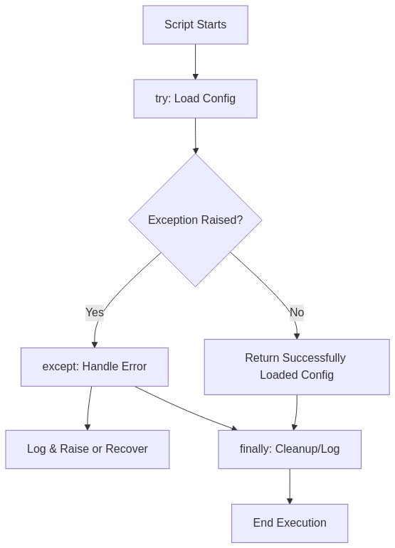
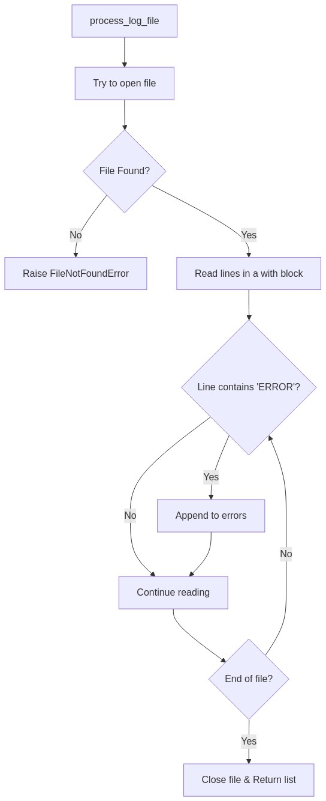
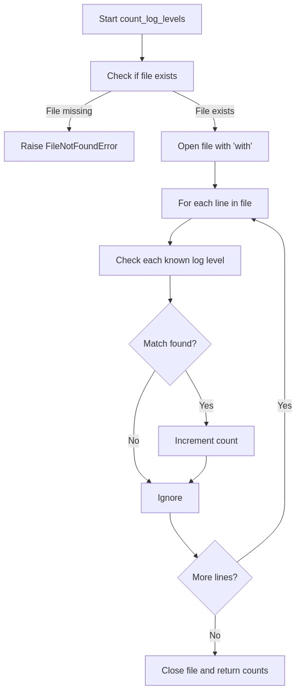
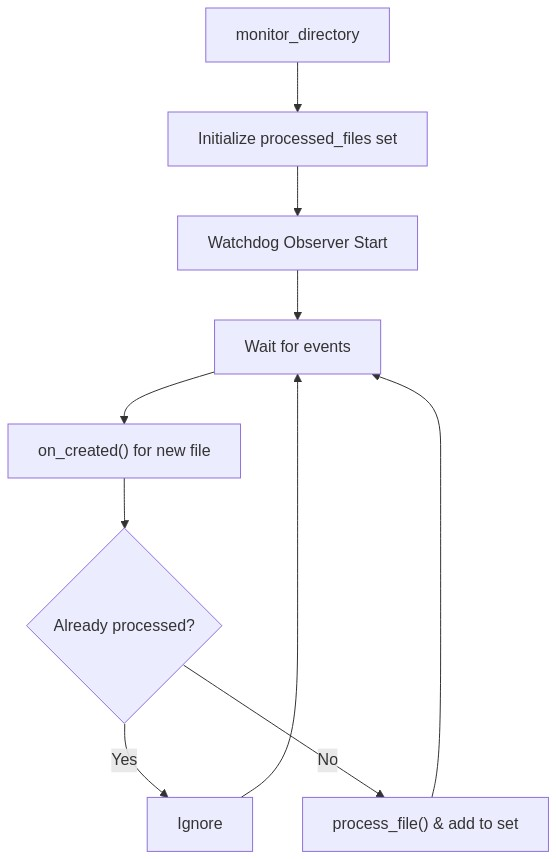
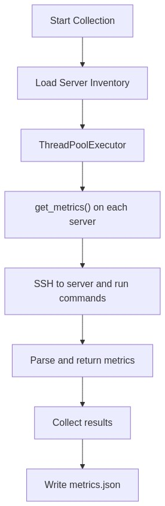
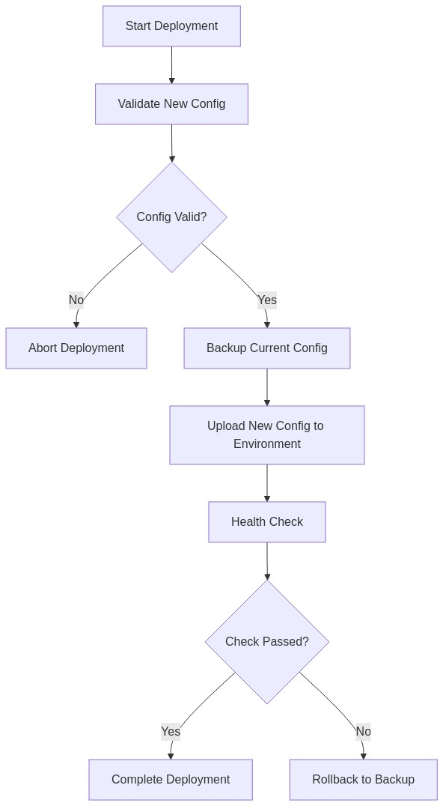
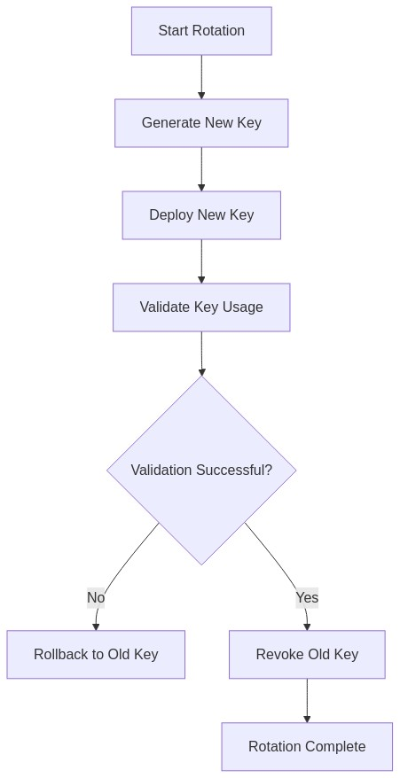

# Scripting Quiz – Comprehensive Answer Sheet  
 (Answer Sheet Prompt)  
 (Basic Scripting Quiz)

Below is a complete answer sheet for the **Basic Scripting Quiz**. 

## Conceptual Questions (1–5)

---

## Answer 1: Error Handling in Python

**Question (Conceptual Question 1)**  
Why is error handling important in scripts, and what techniques can you use in Python to handle errors gracefully?  
- Describe at least three error handling mechanisms in Python and when each should be used.  
- *Hint: Consider `try-except`, `try-finally`, and custom exceptions.*  

**Answer Overview**  
Error handling is crucial for preventing script crashes, maintaining reliability, and ensuring meaningful error information is logged for quick troubleshooting.  

**Detailed Answer**  
In an SRE environment, scripts often run without user supervision, so robust error handling ensures that failures are either automatically recovered or safely logged. Python provides several mechanisms:

1. **Try-Except**  
   - Primary method to catch specific exceptions and handle them gracefully.  
   - Recommended when you need to trap known errors (e.g., `FileNotFoundError`) and take corrective actions or log details.

2. **Try-Finally**  
   - Ensures that cleanup actions occur regardless of whether an exception is raised.  
   - Useful for closing resources like file handles or network connections in every scenario.

3. **Custom Exceptions**  
   - You can define domain-specific exception classes by extending Python’s built-in exceptions.  
   - Enhances clarity by signaling particular failure modes relevant to your application or environment.

**Example Code:**
```python
import logging

class ConfigurationError(Exception):
    """Raised when configuration validation fails."""
    pass

def load_config(filename):
    config = {}
    try:
        with open(filename, 'r') as f:
            # Parse config (simplified)
            for line in f:
                if '=' in line:
                    key, value = line.strip().split('=', 1)
                    config[key] = value
        
        # Example validation check
        if 'API_KEY' not in config:
            raise ConfigurationError("Missing 'API_KEY' in config")
        
    except FileNotFoundError:
        logging.error(f"Config file {filename} not found.")
        raise
    except ConfigurationError as ce:
        logging.error(f"Configuration error: {ce}")
        raise
    finally:
        logging.info("Attempted to load configuration.")
    
    return config
```

**SRE Perspective**  
- Proper error handling ensures automated scripts do not silently fail and increase operational toil.  
- Logging errors with sufficient context accelerates incident response.  
- In large-scale environments, unhandled exceptions in a single script can cause cascading failures, so robust handling reduces system-wide impact.

**Common Pitfalls**  
1. Catching overly broad exceptions (`except Exception:`) without re-raising or logging.  
2. Omitting a `finally` block for resource cleanup.  
3. Hiding or ignoring important error details in logs, making troubleshooting difficult.  
4. Failing to implement fallback paths or retries for transient errors.

**Advanced Considerations**  
- **Exception Chaining** (`raise NewException from OriginalException`) to retain root cause.  
- **Context Managers** for structured resource handling (`with` statement).  
- **Exception Groups** (Python 3.11+) to handle multiple concurrent exceptions.  

**Visual Explanation:**  





---

## Answer 2: Common SRE Script Use Cases

**Question (Conceptual Question 2)**  
What are some typical use cases for writing quick Bash/Python scripts in an SRE environment?  
- Explain how automation scripts can improve reliability and reduce toil.  
- *Hint: Think about tasks like log parsing, monitoring, and deployment automation.*  

**Answer Overview**  
SREs create small scripts to automate repetitive tasks, improve reliability, reduce manual toil, and standardize operational processes.  

**Detailed Answer**  
1. **Log Parsing and Analysis**  
   - Quickly scan logs for errors, warnings, or patterns.  
   - Helps in root-cause analysis and detecting anomalies.  

2. **Monitoring and Alerting**  
   - Collect metrics (CPU, memory usage, disk I/O) and feed them to monitoring systems.  
   - Automate threshold alerts to reduce manual checks.  

3. **Deployment and Configuration Automation**  
   - Push updates, configurations, or new code to multiple servers consistently.  
   - Reduces manual steps and ensures a repeatable, reliable process.  

4. **Data Transformation and Reporting**  
   - Convert data from one format to another (CSV, JSON, etc.) for system integration.  
   - Summarize results or generate quick reports for on-call teams.  

5. **Periodic Maintenance Tasks**  
   - Cleanup scripts (removing old files, rotating logs).  
   - Database backups or health checks.  

**SRE Perspective**  
By automating these tasks, SREs reduce manual work (toil), minimize human error, and build reproducible processes. This aligns with SRE principles of reducing incident frequency and impact while improving system reliability.  

**Common Pitfalls**  
- Over-engineering a script instead of using existing tools or services.  
- Failing to handle edge cases, such as large files or network interruptions.  
- Storing credentials insecurely in scripts.  

**Advanced Considerations**  
- Integrating scripts with CI/CD pipelines for continuous automation.  
- Using container-based approaches (Docker) to package scripts with dependencies.  
- Embracing an “infrastructure as code” mindset with tools like Terraform or Ansible.  

---

## Answer 3: Handling Sensitive Credentials

**Question (Conceptual Question 3)**  
When working with sensitive credentials in scripts, what security measures should you consider?  
- List at least four best practices for handling sensitive information in scripts.  
- *Hint: Consider encryption, environment variables, and secure storage solutions.*  

**Answer Overview**  
Protecting sensitive data is essential to maintain security and compliance. Certain best practices prevent leaks and unauthorized access to critical credentials.  

**Detailed Answer**  
1. **Use Environment Variables or Secrets Managers**  
   - Avoid hardcoding passwords or tokens in scripts.  
   - Tools like AWS Secrets Manager, HashiCorp Vault, or Azure Key Vault can securely store and rotate credentials.  

2. **Encrypt Sensitive Data at Rest**  
   - If credentials must be stored on disk, use encryption (e.g., GPG-encrypted files).  
   - Ensure only authorized users or processes can decrypt.  

3. **Limit File Permissions**  
   - Restrict read/write permissions on key files to the owning user or service account.  
   - Avoid world-readable (e.g., `chmod 600`) files that contain credentials.  

4. **Rotate Credentials Regularly**  
   - Implement rotation policies for API keys, certificates, and passwords.  
   - Automated rotation reduces the risk window if credentials are compromised.  

5. **Secure Transmission**  
   - Use SSH, TLS, or other encrypted channels for any data in transit.  

**SRE Perspective**  
In a production environment, credentials are often the key to controlling and manipulating critical infrastructure. A compromise can lead to severe breaches, downtime, or data loss. Implementing robust secrets handling reduces operational and security risks, aligning with SRE objectives of reliability and safety.  

**Common Pitfalls**  
- Committing credentials to version control (e.g., Git).  
- Sharing credentials casually across team channels without encryption.  
- Allowing credentials to remain valid indefinitely.  

**Advanced Considerations**  
- Implement just-in-time access workflows.  
- Use ephemeral tokens or short-lived credentials to reduce exposure.  
- Integrate with hardware security modules (HSMs) for enhanced cryptographic operations.  

---

## Answer 4: Python Shell Execution Methods

**Question (Conceptual Question 4)**  
Explain the difference between `os.system()`, `subprocess.call()`, and `subprocess.run()` for executing shell commands in Python.  
- When would you choose one method over the others?  
- *Hint: Think about the need for capturing output, error handling, and security.*  

**Answer Overview**  
Python provides multiple ways to invoke shell commands, each with different levels of control, security, and output handling.  

**Detailed Answer**  
1. **`os.system()`**  
   - Executes a command in a subshell. Returns the exit status.  
   - No direct way to capture command output.  
   - Considered less secure and less flexible than `subprocess`.  

2. **`subprocess.call()`**  
   - Part of the `subprocess` module, it runs a command, waits for it to complete, and returns the return code.  
   - Limited ability to capture output directly. Must redirect output to files or pipes if needed.  

3. **`subprocess.run()`**  
   - More modern and recommended API for running commands.  
   - Returns a `CompletedProcess` object with `stdout`, `stderr`, and `returncode`.  
   - Allows timeouts, more advanced error handling, piping, environment control, etc.  

**When to Use Each**  
- **`os.system()`**: Rarely recommended; only for trivial cases when no output capture is needed.  
- **`subprocess.call()`**: For simpler scripts needing return codes but not necessarily advanced output handling.  
- **`subprocess.run()`**: Preferred for modern scripts; offers robust error handling, output capture, and advanced features (e.g., passing environment variables securely).  

**SRE Perspective**  
- Using `subprocess.run()` is more reliable and flexible for automation.  
- Capturing and logging stdout/stderr is important for troubleshooting.  
- Security concerns arise if arguments are user-supplied; must sanitize or avoid shell expansion.  

**Common Pitfalls**  
- Failing to check return codes (leading to silent failures).  
- Passing user input directly to a shell call, risking command injection.  
- Not handling timeouts, causing scripts to hang.  

**Advanced Considerations**  
- Using `shlex.split()` to safely split command strings.  
- Handling asynchronous subprocess operations with `asyncio.create_subprocess_exec()` in Python 3+.  
- Using environment dictionaries to isolate or override environment variables.  

---

## Answer 5: Context Managers in Python

**Question (Conceptual Question 5)**  
What are context managers in Python (`with` statements), and why are they especially important when working with files?  
- Provide an example of using a context manager with file operations.  
- *Hint: Consider automatic resource management and exception handling.*  

**Answer Overview**  
Context managers automate setup/teardown steps, ensuring resources are released properly even if exceptions occur. They simplify resource management (e.g., opening/closing files).  

**Detailed Answer**  
- A **context manager** defines how to set up a resource and how to clean it up.  
- When you use a `with` statement, Python automatically calls `__enter__()` upon entry and `__exit__()` upon exit.  
- Crucial for file operations, network connections, locks, etc., to avoid resource leaks if exceptions are raised.  

**Example Code:**
```python
def read_file(filepath):
    with open(filepath, 'r') as f:
        data = f.read()
    return data
```
- Here, `open(filepath, 'r')` is the setup step (`__enter__()`), and automatically closing the file is the teardown step (`__exit__()`).  

**SRE Perspective**  
Scripts that fail to close files can exhaust file descriptors, degrade performance, and cause application errors in production. Automated resource cleanup ensures reliability and simplifies code maintenance.  

**Common Pitfalls**  
- Forgetting to close resources manually if not using `with`.  
- Using `with` incorrectly by performing operations outside the scope, leading to referencing closed files.  

**Advanced Considerations**  
- **Custom Context Managers**: Implement with `class MyResource: def __enter__(...): ... def __exit__(...): ...`.  
- **`contextlib` module**: Provides decorators like `@contextmanager` to quickly build context managers with generator syntax.  

**Visual Explanation:**  


---

## Code Analysis (6–8)

---

## Answer 6: Log File Processing Issues

**Question (Code Analysis Question 6)**  
Review the following code. What issues or potential bugs do you see?

```python
def process_log_file(filename):
    log_file = open(filename, 'r')
    content = log_file.read()
    errors = []
    
    for line in content.split('\n'):
        if 'ERROR' in line:
            errors.append(line)
    
    print(f"Found {len(errors)} errors")
    return errors
```
- *Hint: Consider resource management and potential exceptions.*  

**Answer Overview**  
The code opens a file but never closes it, reads the entire file into memory, and lacks error handling.  

**Code Issues**  
1. **No Context Manager / No File Close**  
   - Using `open(filename, 'r')` without `with` can leak file descriptors.  
2. **Memory Inefficiency**  
   - `content = log_file.read()` loads the entire file, possibly large logs, into memory.  
3. **No Error Handling**  
   - Fails if the file does not exist or permissions are denied.  
4. **Hardcoded Error String**  
   - Checking `'ERROR' in line` might produce false positives (e.g., “ERRORFREE”).  

**Improved Solution:**
```python
import logging

def process_log_file(filename):
    """
    Processes a log file to find lines containing "ERROR".
    Returns a list of matching lines.
    """
    errors = []
    
    try:
        with open(filename, 'r', encoding='utf-8') as log_file:
            for line in log_file:
                if 'ERROR' in line:
                    errors.append(line.rstrip('\n'))
    except FileNotFoundError:
        logging.error(f"File not found: {filename}")
        raise
    except PermissionError:
        logging.error(f"Permission denied for file: {filename}")
        raise
    except Exception as e:
        logging.error(f"Unexpected error: {e}")
        raise
    
    logging.info(f"Found {len(errors)} errors in {filename}")
    return errors
```

**Explanation of Improvements**  
- **Use `with`**: Ensures the file is closed automatically.  
- **Line-by-Line Read**: Allows efficient handling of large files.  
- **Logging & Exception Handling**: Provides better visibility and error response.  

**SRE Perspective**  
- Proper resource management avoids descriptor exhaustion in production.  
- Handling file I/O errors gracefully reduces operational overhead (less toil).  
- Logging is essential for debugging incidents.  

**Additional Considerations**  
- Optionally use a regex for more precise matches.  
- Consider partial reading or streaming if logs are huge.  

**Visual Explanation:**  





---

## Answer 7: Environment Variables & Subprocess Execution

**Question (Code Analysis Question 7)**  
What will happen when the following script is run? Explain any issues.

```python
import os
import sys

def set_config():
    os.environ['APP_ENV'] = 'production'
    print(f"Environment set to {os.environ['APP_ENV']}")

if __name__ == "__main__":
    config_file = sys.argv[1]
    with open(config_file, 'r') as f:
        config = f.read()
    set_config()
    os.system(f"./start_app.sh {config_file}")
```
- *Hint: Consider command-line arguments, environment variables, and subprocess execution.*  

**Answer Overview**  
This script reads a configuration file, sets an environment variable, and uses `os.system()` to call a shell script. Potential issues revolve around ephemeral environment variable usage, lack of error handling, and the simplistic `os.system()` approach.  

**Detailed Answer**  
1. **Command-Line Arguments**  
   - Script expects `config_file` to be passed as `sys.argv[1]`. If not provided, it will crash.  
2. **Reading Config File**  
   - The entire config file content is read into `config`, but never used except for passing the filename to `start_app.sh`.  
3. **Environment Variable Scope**  
   - `os.environ['APP_ENV']` is set to `production`. However, `os.system()` starts a new shell that inherits environment variables from the parent process.  
   - The environment variable will be available inside `start_app.sh`, provided that shell inherits parent environment.  
4. **`os.system()` Limitations**  
   - It doesn’t capture output.  
   - Offers limited error handling (only an exit code).  
5. **No Exception Handling**  
   - If `config_file` does not exist, an exception is raised without a friendly error message.  

**SRE Perspective**  
- Relying on environment variables for config can be fragile if shells differ in how they inherit environment.  
- A robust approach would use `subprocess.run()` with explicit error checks or direct arguments to the script instead of environment variables.  
- Minimally, add exception handling for missing files.  

**Additional Considerations**  
- Evaluate whether environment variables or command-line flags are the best approach.  
- If `start_app.sh` needs the config content, pass it or parse it properly, not just the filename.  
- Potential security concern if `config_file` is not validated before being passed to `os.system()`.  

**Visual Explanation:**  


---

## Answer 8: CSV Processing Improvements

**Question (Code Analysis Question 8)**  
Analyze the following CSV processing code. What improvements would you make?

```python
import csv

def filter_users(csv_file, min_age):
    with open(csv_file, 'r') as f:
        reader = csv.reader(f)
        header = next(reader)
        
        age_index = header.index('age')
        result = []
        
        for row in reader:
            if int(row[age_index]) >= min_age:
                result.append(row)
    
    with open('filtered_users.csv', 'w') as f:
        writer = csv.writer(f)
        writer.writerow(header)
        writer.writerows(result)
```
- *Hint: Consider error handling, resource management, and code efficiency.*  

**Answer Overview**  
This code filters users based on age but lacks robust error handling, uses a fixed output filename, and assumes all rows have a valid 'age' field.  

**Code Issues**  
1. **No Exception Handling**  
   - If the CSV is missing the `age` column or has invalid data, the script may crash.  
2. **Hardcoded Output Filename**  
   - Limited flexibility. Should allow specifying output paths or return the filtered data.  
3. **Limited Data Validation**  
   - Assumes every row can be converted to an integer for `min_age`.  
4. **Encoding & Locale**  
   - No specified encoding, which can cause issues on certain files.  

**Improved Solution:**
```python
import csv
import logging
from typing import List

def filter_users(csv_file: str, min_age: int, output_file: str = 'filtered_users.csv') -> List[List[str]]:
    """
    Filters rows in a CSV based on a minimum age criterion.
    
    Args:
        csv_file: Path to the input CSV file.
        min_age: Minimum age threshold.
        output_file: Path to the output CSV file (default: 'filtered_users.csv').

    Returns:
        A list of filtered rows (including the header).
    """
    filtered_rows = []
    
    try:
        with open(csv_file, 'r', encoding='utf-8') as f:
            reader = csv.reader(f)
            header = next(reader)
            
            if 'age' not in header:
                raise ValueError("CSV must include 'age' column")
            
            age_index = header.index('age')
            filtered_rows.append(header)
            
            for row in reader:
                try:
                    if int(row[age_index]) >= min_age:
                        filtered_rows.append(row)
                except ValueError:
                    logging.warning(f"Skipping row with invalid age: {row}")
                    
    except FileNotFoundError:
        logging.error(f"CSV file not found: {csv_file}")
        raise
    except Exception as e:
        logging.error(f"Error filtering CSV: {e}")
        raise
    
    # Write to the output file
    try:
        with open(output_file, 'w', newline='', encoding='utf-8') as f:
            writer = csv.writer(f)
            writer.writerows(filtered_rows)
    except Exception as e:
        logging.error(f"Failed to write output file: {e}")
        raise
    
    return filtered_rows
```

**Explanation of Improvements**  
- **Error Handling**: Handles `FileNotFoundError` and invalid data more gracefully.  
- **Encoding**: Uses `utf-8`, a common default.  
- **Configurable Output**: Allows specifying the output filename.  
- **Logging**: Improves observability.  

**SRE Perspective**  
- Avoids runtime surprises by validating column names and data.  
- Logs warnings on invalid rows to aid in diagnosing data quality issues.  
- Allows flexible integration into broader SRE pipelines (e.g., run daily to filter user data).  

**Additional Considerations**  
- Could store results in memory or stream them out if files are large.  
- Consider using `pandas` for more robust CSV handling and advanced transformations.  

---

## Coding Challenges (9–12)

---

## Answer 9: Log Level Counter

**Question (Coding Challenge 9)**  
Write a Python function that takes a log file path and returns a dictionary with counts of different log levels (INFO, WARNING, ERROR, etc.).  
- The function should handle files that don’t exist and properly close file resources.  
- *Example: Given a log file with lines containing "INFO", "WARNING", and "ERROR", the function should return `{'INFO': 10, 'WARNING': 5, 'ERROR': 2}`.*  

**Solution Approach**  
1. Read the log file line by line for efficiency.  
2. Track occurrences of known levels in a dictionary.  
3. Handle file-related exceptions gracefully.  
4. Return a dictionary summarizing counts.  

**Complete Solution:**
```python
import os
import logging
from typing import Dict
from collections import defaultdict

def count_log_levels(log_file_path: str) -> Dict[str, int]:
    """
    Counts log level occurrences in a log file.
    
    Args:
        log_file_path: Path to the log file
    
    Returns:
        A dictionary with log levels as keys and their counts as values.
    """
    log_levels = {'INFO', 'WARNING', 'ERROR', 'DEBUG', 'CRITICAL'}
    counts = defaultdict(int)
    
    if not os.path.isfile(log_file_path):
        logging.error(f"File not found: {log_file_path}")
        raise FileNotFoundError(f"Log file not found: {log_file_path}")
    
    try:
        with open(log_file_path, 'r', encoding='utf-8') as f:
            for line in f:
                for level in log_levels:
                    # Simple substring check; could be replaced with regex for stricter matching
                    if level in line:
                        counts[level] += 1
    except Exception as e:
        logging.error(f"Failed to read log file: {e}")
        raise
    
    return dict(counts)
```

**Solution Walkthrough**  
- We define a set of common log levels to look for.  
- For each line, we check for these substrings and increment counters.  
- The function raises an exception if the file is missing.  

**Testing Approach**  
- **Happy Path**: Lines with “INFO”, “WARNING”, “ERROR” appear.  
- **No File**: Expect a `FileNotFoundError`.  
- **Empty File**: Returns zero counts for all levels.  
- **Mixed Case**: If logs might contain uppercase/lowercase variants, we might need a case-insensitive approach.  

**SRE Perspective**  
- Useful in quick debugging or building custom log analysis tools.  
- Minimizes manual searching for log anomalies.  
- Logging results can feed into alerting pipelines.  

**Optimization Opportunities**  
- Use regular expressions with word boundaries for more accurate matches.  
- For extremely large logs, consider streaming or parallel processing.  

**Alternative Approaches**  
- **Shell-based** (`grep` pipelines) if environment is consistent, but less portable.  
- **Pandas** for advanced analytics or grouping.  

**Visual Explanation:**  





---

## Answer 10: Safely Updating JSON Configuration

**Question (Coding Challenge 10)**  
Create a script that safely updates a JSON configuration file with new values.  
- The script should preserve existing configuration, update only specified fields, and handle file locking to prevent race conditions.  
- *Example: Given a JSON file with configuration settings, the script should update specific fields without altering others.*  

**Solution Approach**  
1. **Read Existing JSON**: Load the current config into a dictionary.  
2. **File Locking**: Prevent multiple processes from editing at the same time.  
3. **Update Fields**: Overwrite or add keys from an update dictionary.  
4. **Write Back**: Write the updated dictionary to the file.  

**Complete Solution:**
```python
import json
import fcntl
import logging
from typing import Dict

def update_json_config(config_path: str, updates: Dict[str, any]) -> None:
    """
    Safely updates a JSON configuration file with new values.
    
    Args:
        config_path: Path to the JSON config file
        updates: Dictionary of key-value pairs to update
    """
    logging.basicConfig(level=logging.DEBUG)
    
    with open(config_path, 'r+') as f:
        # Acquire an exclusive lock
        fcntl.flock(f, fcntl.LOCK_EX)
        
        try:
            # Load existing configuration
            config_data = json.load(f)
        except json.JSONDecodeError:
            logging.warning(f"Config file {config_path} is empty or invalid JSON. Starting with empty config.")
            config_data = {}
        
        # Update specified fields
        for key, value in updates.items():
            config_data[key] = value
        
        # Reset file pointer and truncate
        f.seek(0)
        f.truncate()
        
        # Write updated configuration
        json.dump(config_data, f, indent=2)
        
        # Release the lock by closing
        fcntl.flock(f, fcntl.LOCK_UN)
```

**Solution Walkthrough**  
1. **File Locking**: We use `fcntl.flock` to secure an exclusive lock, preventing concurrent writes.  
2. **JSON Loading**: We handle cases where the file might be empty or invalid JSON.  
3. **Updating Fields**: We apply the new values to the loaded dictionary.  
4. **Writing Back**: We truncate the file and dump the updated config in JSON format.  

**Testing Approach**  
- **Valid Existing JSON**: Ensures only specified fields are updated.  
- **Invalid/Empty File**: Script must handle gracefully.  
- **Concurrent Access**: Two processes attempt to update simultaneously. The second should wait for the first lock to be released.  

**SRE Perspective**  
- Safely updating configuration files in production is critical: a race condition could corrupt config, causing service downtime.  
- Locking is essential when multiple deployment or automation processes run in parallel.  
- Logging changes helps with auditing.  

**Optimization Opportunities**  
- For extremely large configs, consider partial updates or specialized data stores.  

**Alternative Approaches**  
- Use a central config service or distributed key-value store instead of local JSON.  
- Use Python’s `portalocker` library for cross-platform file locking.  

---

## Answer 11: Command-Line Argument Parsing

**Question (Coding Challenge 11)**  
Implement a function that parses command-line arguments for a script that processes log files.  
- It should accept parameters for input file, output file, log level filter, and date range.  
- Use `argparse` and include appropriate help text and error handling.  
- *Example: The script should be able to run with arguments like `--input log.txt --output result.txt --level ERROR --start-date 2023-01-01 --end-date 2023-01-31`.*  

**Solution Approach**  
1. **Use `argparse.ArgumentParser`** to define arguments and help text.  
2. **Parse Known Arguments** such as `--input`, `--output`, `--level`, `--start-date`, `--end-date`.  
3. **Validate** if necessary (e.g., check date formats).  

**Complete Solution:**
```python
import argparse
import sys
import datetime
import logging

def parse_args(argv=None):
    parser = argparse.ArgumentParser(
        description="Process log files with optional filtering by level and date range."
    )
    
    parser.add_argument("--input", "-i", required=True, help="Path to the input log file.")
    parser.add_argument("--output", "-o", required=True, help="Path to the output file for results.")
    parser.add_argument("--level", "-l", default="INFO", help="Log level to filter (e.g., INFO, WARNING, ERROR).")
    parser.add_argument("--start-date", "-s", help="Start date (YYYY-MM-DD).")
    parser.add_argument("--end-date", "-e", help="End date (YYYY-MM-DD).")
    
    args = parser.parse_args(argv)
    
    # Optional: Validate date formats
    if args.start_date:
        try:
            datetime.datetime.strptime(args.start_date, "%Y-%m-%d")
        except ValueError:
            logging.error("Invalid start date format. Use YYYY-MM-DD.")
            sys.exit(1)
    
    if args.end_date:
        try:
            datetime.datetime.strptime(args.end_date, "%Y-%m-%d")
        except ValueError:
            logging.error("Invalid end date format. Use YYYY-MM-DD.")
            sys.exit(1)
    
    return args
```

**Solution Walkthrough**  
- **`argparse.ArgumentParser`** sets a script description.  
- Each argument has flags, required or optional, and help text.  
- We do minimal validation on date formats, exiting gracefully if invalid.  

**Testing Approach**  
- Test with valid arguments: `--input log.txt --output result.txt --level ERROR`.  
- Test with missing arguments: should raise an error.  
- Test with invalid date formats.  

**SRE Perspective**  
- Standardizing argument parsing ensures consistent usage across teams.  
- Clear help text reduces confusion and operational errors.  
- Using date filters helps in log triage for specific time windows, reducing noise.  

**Optimization Opportunities**  
- More advanced date/time handling (e.g., time zones).  
- Validation if the file exists before proceeding.  

**Alternative Approaches**  
- Using click or Typer for more modern CLI frameworks in Python.  

---

## Answer 12: Directory Monitoring

**Question (Coding Challenge 12)**  
Write a script to monitor a directory for new files and process them when they appear.  
- Include proper error handling and logging.  
- Ensure the script doesn’t process the same file twice.  
- *Hint: Consider using libraries like `watchdog` for monitoring file system events.*  

**Solution Approach**  
1. Use **watchdog** to watch for file creation events.  
2. Maintain a **set** of processed files to avoid duplicates.  
3. Process each newly created file.  

**Complete Solution:**
```python
import os
import logging
import time
from watchdog.observers import Observer
from watchdog.events import FileSystemEventHandler

logging.basicConfig(level=logging.INFO)

class NewFileHandler(FileSystemEventHandler):
    def __init__(self, processed_files):
        self.processed_files = processed_files
    
    def on_created(self, event):
        if not event.is_directory:
            file_path = event.src_path
            if file_path not in self.processed_files:
                logging.info(f"New file detected: {file_path}")
                self.processed_files.add(file_path)
                self.process_file(file_path)
    
    def process_file(self, file_path):
        try:
            # Placeholder for file processing logic
            logging.info(f"Processing file: {file_path}")
            # ...
        except Exception as e:
            logging.error(f"Error processing file {file_path}: {e}")

def monitor_directory(directory):
    processed_files = set()
    event_handler = NewFileHandler(processed_files)
    observer = Observer()
    observer.schedule(event_handler, path=directory, recursive=False)
    observer.start()
    
    logging.info(f"Monitoring directory: {directory}")
    try:
        while True:
            time.sleep(1)
    except KeyboardInterrupt:
        observer.stop()
    observer.join()

if __name__ == "__main__":
    import sys
    if len(sys.argv) < 2:
        print(f"Usage: {sys.argv[0]} <directory_to_monitor>")
        sys.exit(1)
    
    monitor_directory(sys.argv[1])
```

**Solution Walkthrough**  
- **Observer** and **EventHandler** from `watchdog` handle file creation.  
- **`processed_files`** prevents reprocessing the same file.  
- Script runs indefinitely until interrupted.  

**Testing Approach**  
- Create new files in the monitored directory and watch logs.  
- Confirm that second creation of the same file name is not reprocessed.  
- Test with large directories to ensure no performance issues.  

**SRE Perspective**  
- Automates ingestion of new log files, backups, or data sets.  
- Minimizes manual checks and potential errors in file-based workflows.  
- Logging ensures accountability if new files fail to process.  

**Optimization Opportunities**  
- Parallel processing of new files if file size is large.  
- Event filtering by file extension or size.  

**Alternative Approaches**  
- Simple polling approach if watchdog is not available, though less efficient.  

**Visual Explanation:**  





---

## Application Questions (13–15)

---

## Answer 13: Multi-Server Metrics Collection

**Question (Application Question 13)**  
As an SRE, you need to create a script that collects system metrics from multiple servers. What approach would you take?  
- Discuss authentication, data collection, error handling, and output formatting.  
- *Example: Use SSH for authentication, collect metrics using tools like `top` or `vmstat`, handle connection errors, and format the output in JSON or CSV.*  

**Solution Overview**  
We want a **secure, scalable,** and **reliable** script that collects CPU, memory, disk, or custom metrics from multiple servers, typically over SSH, then formats them for analysis.  

**Detailed Solution**  
1. **Server Inventory**  
   - Maintain a list or config file with server hostnames, ports, user accounts, and SSH keys.  
2. **Authentication**  
   - Prefer **SSH key-based** auth for automation, possibly with an SSH agent.  
   - Ensure robust credential handling (no plain-text passwords in scripts).  
3. **Data Collection**  
   - Use standard Linux commands like `vmstat`, `top -bn1`, or specialized collectors (e.g., `iostat`).  
   - Parse results to gather metrics of interest (CPU %, memory usage, etc.).  
4. **Error Handling**  
   - Handle network timeouts and partial failures.  
   - Log all errors for later troubleshooting.  
   - Continue collecting from other servers if one fails.  
5. **Output Formatting**  
   - JSON (flexible, easily parsed) or CSV (simple for many data tools).  
   - Include timestamps, server identifiers, or tags for correlation.  

**Implementation Considerations**  
1. **Parallelization**: Use threads or async to scale to many servers.  
2. **Resource Impact**: Polling commands should be lightweight or scheduled at off-peak times.  
3. **Frequency**: Decide on intervals (e.g., 60 seconds) or run on demand.  

**Sample Implementation:**
```python
import paramiko
import logging
import json
import concurrent.futures

logging.basicConfig(level=logging.INFO)

def get_metrics(server_info):
    hostname = server_info['hostname']
    username = server_info['username']
    key_path = server_info['key_path']
    metrics = {'server': hostname}
    
    try:
        ssh = paramiko.SSHClient()
        ssh.set_missing_host_key_policy(paramiko.AutoAddPolicy())
        ssh.connect(hostname, username=username, key_filename=key_path, timeout=10)
        
        # CPU usage
        stdin, stdout, stderr = ssh.exec_command("top -bn1 | grep '%Cpu' | awk '{print $2+$4}'")
        metrics['cpu_percent'] = stdout.read().decode().strip()
        
        # Memory usage
        stdin, stdout, stderr = ssh.exec_command("free -m | awk '/Mem:/ {print ($3/$2)*100.0}'")
        metrics['mem_percent'] = stdout.read().decode().strip()
        
        ssh.close()
        
    except Exception as e:
        logging.error(f"Error retrieving metrics for {hostname}: {e}")
        metrics['error'] = str(e)
    
    return metrics

def collect_all_metrics(servers, output_file='metrics.json'):
    all_metrics = []
    with concurrent.futures.ThreadPoolExecutor(max_workers=10) as executor:
        futures = {executor.submit(get_metrics, s): s for s in servers}
        for fut in concurrent.futures.as_completed(futures):
            all_metrics.append(fut.result())
    
    with open(output_file, 'w') as f:
        json.dump(all_metrics, f, indent=2)
    
    logging.info(f"Metrics written to {output_file}")
```

**Security Considerations**  
- Store SSH keys securely with correct file permissions.  
- Restrict user permissions to only necessary commands.  
- Sanitize any command arguments if user input is involved.  

**Scaling and Performance**  
- For large fleets, break servers into batches.  
- Consider advanced tooling like Prometheus node exporters.  

**Integration with SRE Tooling**  
- Output can feed into dashboards (Grafana) or alerts (Alertmanager).  
- Combine with periodic cron jobs or orchestrations (Airflow).  

**Visual Explanation:**  





---

## Answer 14: Safe Multi-Environment Deployment

**Question (Application Question 14)**  
You need to automate the deployment of a configuration file to multiple environments (dev, staging, prod). How would you design a script to do this safely?  
- Address environment-specific configurations, validation, and rollback capabilities.  
- *Example: Use environment variables for configuration, validate the configuration before deployment, and implement rollback in case of failure.*  

**Solution Overview**  
A deployment script for multiple environments must handle environment-specific details, verify correctness, and allow a quick rollback if something fails.  

**Detailed Solution**  
1. **Environment Abstraction**  
   - Use a single config file with environment-specific sections, or separate config files for each environment.  
2. **Validation**  
   - Validate syntax (JSON/YAML parsing).  
   - Perform environment checks (e.g., verifying connectivity).  
3. **Deployment Steps**  
   - Stage the config on target servers.  
   - Perform backups of existing config.  
   - Swap in the new config or update relevant services.  
4. **Rollback Mechanism**  
   - If deployment fails or validation after deployment fails, revert to the backed-up config.  
5. **Logging & Monitoring**  
   - Log each step for troubleshooting.  
   - Possibly run tests or health checks after deployment to confirm success.  

**Implementation Considerations**  
1. **Parallel or Serial**: Decide if dev, staging, and prod are updated in parallel or in order.  
2. **Access & Permissions**: Securely manage credentials for each environment.  
3. **Atomic Updates**: Aim to prevent partial updates that could break the service.  

**Sample Implementation:**
```python
import os
import shutil
import logging

def deploy_config(env, config_path, remote_server):
    """
    Deploy a config file to a specific environment with rollback capability.
    """
    logging.info(f"Deploying config {config_path} to {env} environment on {remote_server}")
    
    # Backup existing file
    backup_path = config_path + ".bak"
    try:
        if os.path.exists(config_path):
            shutil.copy2(config_path, backup_path)
        
        # Validate new config
        if not validate_config(config_path):
            raise ValueError("New config is invalid.")
        
        # Upload to the environment (placeholder for scp/rsync/SSH logic)
        upload_file(config_path, remote_server)
        
        # Validate service or environment post-deployment
        if not health_check(remote_server):
            raise RuntimeError("Post-deployment health check failed.")
        
        logging.info(f"Deployment to {env} environment successful.")
    
    except Exception as e:
        logging.error(f"Deployment failed for {env}: {e}")
        # Rollback
        if os.path.exists(backup_path):
            shutil.move(backup_path, config_path)
            rollback_remote_config(backup_path, remote_server)
        raise

def validate_config(config_path):
    # Example placeholder
    return True

def upload_file(config_path, remote_server):
    # Example placeholder
    pass

def health_check(remote_server):
    # Example placeholder
    return True

def rollback_remote_config(backup_path, remote_server):
    # Example placeholder
    pass
```

**Security Considerations**  
- Restrict write permissions.  
- Use environment-specific credentials that are least privileged.  
- Encrypt sensitive data at rest and in transit.  

**Scaling and Performance**  
- For large organizations with many environments, integrate with orchestration tools like Terraform or Ansible.  

**Visual Explanation:**  





---

## Answer 15: API Key/Credential Rotation

**Question (Application Question 15)**  
Describe how you would create a script to automate the rotation of API keys or credentials.  
- What security considerations and error handling would be important?  
- How would you ensure continuity of service during the rotation?  
- *Example: Use secure storage for keys, handle errors during key rotation, and ensure the service can switch to new keys without downtime.*  

**Solution Overview**  
Automating credential rotation involves generating new credentials, updating relevant services or configurations, verifying the new credentials work, and revoking old ones only after a successful handover.  

**Detailed Solution**  
1. **Generate a New Key**  
   - Use an API or secure method to create a new key or secret.  
2. **Update Service Configuration**  
   - Deploy the new key to relevant services or config files.  
   - Implement a phased approach: load new credentials alongside the old ones if possible.  
3. **Validation**  
   - Test the new key by performing an action that only the new key can do.  
4. **Revoke Old Key**  
   - Once verified, revoke the old key to prevent security risks.  
5. **Logging & Audit**  
   - Log all key rotation attempts and results for compliance.  

**Security Considerations**  
- **Access Controls**: Only a secure, privileged automation process should rotate keys.  
- **Atomicity**: For zero downtime, services should read new credentials before old ones are revoked.  
- **Encryption**: Keys at rest must be encrypted or stored in a secrets manager.  

**Ensuring Continuity**  
1. **Phased Deployment**: Update systems to accept both old and new keys for a short overlap period.  
2. **Graceful Swap**: Switch traffic to the new key, confirm success, then retire the old key.  
3. **Monitoring**: Watch for increased error rates or authentication failures after rotation.  

**Sample Implementation:**
```python
import logging

def rotate_api_key(service_name, key_manager):
    """
    Automates rotation of an API key for a given service.
    """
    logging.info(f"Starting API key rotation for {service_name}")
    
    old_key = key_manager.get_current_key(service_name)
    new_key = key_manager.generate_new_key(service_name)
    
    # Deploy new key to the service
    deploy_key(service_name, new_key)
    
    # Validate new key
    if not validate_service_access(service_name, new_key):
        logging.error("New key validation failed. Rolling back.")
        rollback_key(service_name, old_key)
        return False
    
    # Revoke old key
    key_manager.revoke_key(service_name, old_key)
    logging.info(f"Successfully rotated API key for {service_name}")
    return True
```

**SRE Perspective**  
- Regular key rotations reduce exposure if keys are compromised.  
- Minimizes manual processes that are error-prone, consistent with reducing toil.  
- Detailed logs aid in auditing and incident response.  

**Visual Explanation:**  





---


This concludes the **Scripting Quiz Answer Sheet**. By following these best practices and examples, you can develop robust, maintainable, and secure scripts that align with SRE principles of reliability, observability, and minimal toil.