# Basic Scripting Answer Sheet

## Table of Contents

1. [Conceptual Questions (1–5)](#conceptual-questions-1–5)  
   1. [Question 1: Error Handling in Python](#question-1-error-handling-in-python)  
   2. [Question 2: Common SRE Script Use Cases](#question-2-common-sre-script-use-cases)  
   3. [Question 3: Handling Sensitive Credentials](#question-3-handling-sensitive-credentials)  
   4. [Question 4: Python Shell Execution Methods](#question-4-python-shell-execution-methods)  
   5. [Question 5: Context Managers in Python](#question-5-context-managers-in-python)

2. [Code Analysis (6–8)](#code-analysis-6–8)  
   1. [Question 6: Log File Processing Issues](#question-6-log-file-processing-issues)  
   2. [Question 7: Environment Variables & Subprocess Execution](#question-7-environment-variables--subprocess-execution)  
   3. [Question 8: CSV Processing Improvements](#question-8-csv-processing-improvements)

3. [Coding Challenges (9–12)](#coding-challenges-9–12)  
   1. [Question 9: Log Level Counter](#question-9-log-level-counter)  
   2. [Question 10: Safely Updating JSON Configuration](#question-10-safely-updating-json-configuration)  
   3. [Question 11: Command-Line Argument Parsing](#question-11-command-line-argument-parsing)  
   4. [Question 12: Directory Monitoring](#question-12-directory-monitoring)

4. [Application Questions (13–15)](#application-questions-13–15)  
   1. [Question 13: Multi-Server Metrics Collection](#question-13-multi-server-metrics-collection)  
   2. [Question 14: Safe Multi-Environment Deployment](#question-14-safe-multi-environment-deployment)  
   3. [Question 15: API Key/Credential Rotation](#question-15-api-keycredential-rotation)

5. [Glossary (15 Terms)](#glossary-15-terms)

6. [Conclusion](#conclusion)

---

## Conceptual Questions (1–5)

---

### Question 1: Error Handling in Python

> **Why is error handling important in scripts, and what techniques can you use in Python to handle errors gracefully?**  
> *Hint: Consider `try-except`, `try-finally`, and custom exceptions.*

#### Answer Overview
Error handling is vital for **preventing script crashes**, **maintaining reliability**, and **providing meaningful error information** for rapid troubleshooting. In Python, developers typically rely on **try-except** blocks, **try-finally**, and **custom exceptions** to manage and recover from errors without halting execution unnecessarily.

#### Detailed Answer
In SRE-focused scripts—often running unattended—**robust error handling** prevents unexpected termination that could lead to cascading failures. Python’s main error-handling approaches are:

1. **try-except**  
   - Used to catch specific exceptions such as `FileNotFoundError` and either handle or log them.  
   - Prevents abrupt crashes by allowing fallback or cleanup.

2. **try-finally**  
   - Guarantees a block of code runs whether an exception occurs or not.  
   - Ideal for resource cleanup (closing files, releasing connections).

3. **Custom Exceptions**  
   - Derived from built-in exception classes to represent domain-specific errors (e.g., `ConfigurationError`).  
   - Improves clarity and helps separate general Python errors from application-specific issues.

A careful mix of these approaches ensures a graceful response to operational anomalies, maintaining service reliability.

#### Example Usage:
```python
import logging

class ConfigurationError(Exception):
    """Raised when configuration validation fails."""
    pass

def load_config(filename):
    config = {}
    try:
        with open(filename, 'r') as f:
            # Parse config (simplified)
            for line in f:
                if '=' in line:
                    key, value = line.strip().split('=', 1)
                    config[key] = value
        
        # Example validation
        if 'API_KEY' not in config:
            raise ConfigurationError("Missing 'API_KEY' in config")

    except FileNotFoundError:
        logging.error(f"Config file {filename} not found.")
        raise
    except ConfigurationError as ce:
        logging.error(f"Configuration error: {ce}")
        raise
    finally:
        logging.info("Attempted to load configuration.")
    
    return config
```
#### Example Output
```
ERROR:root:Config file myconfig.ini not found.
INFO:root:Attempted to load configuration.
Traceback (most recent call last):
  ...
FileNotFoundError: [Errno 2] No such file or directory: 'myconfig.ini'
```

#### Testing Approach
1. **Valid Config File**: Verifies normal operation.  
2. **Missing File**: Ensures `FileNotFoundError` is raised and logged.  
3. **Invalid Config**: Triggers `ConfigurationError`.  

#### SRE Perspective
- **Reliability**: Unhandled exceptions in production can lead to partial or total outages.  
- **Observability**: Proper logging with meaningful error messages accelerates incident resolution.  
- **Automation**: Scripts can automatically retry or fallback when certain recoverable errors occur.

#### Best Practices
- Use **specific exception catching** (e.g., `except ValueError`) rather than catching all.  
- Include **descriptive log messages** for easier debugging.  
- **Always** clean up resources (files, sockets) even on failure.  
- Log exceptions **with stack traces** when you need deeper diagnostics.  
- In large codebases, consider a **global exception handler** for top-level fail-safe reporting.

#### Common Pitfalls (Table)
| Pitfall                  | Issue                                             | Better Approach                                        |
|--------------------------|---------------------------------------------------|--------------------------------------------------------|
| Catching `Exception`     | Masks details and can hide critical errors        | Catch specific exceptions or re-raise with context     |
| Omitting `finally` block | May cause resource leaks (e.g., unclosed files)   | Always use `with` or `finally` for guaranteed cleanup  |
| Swallowing exceptions    | Loses valuable debugging data                     | Log errors or store them for later analysis           |
| No fallback/retry logic  | Script crashes on transient errors               | Implement retries or fallback if feasible             |

#### Advanced Considerations
- **Exception Chaining** (`raise NewException from OriginalException`) to preserve root cause.  
- **Context Managers** for structured resource usage (`with open(...) as f`).  
- **Async exception handling** in asynchronous code (e.g., `asyncio` tasks).

#### Visual Explanation
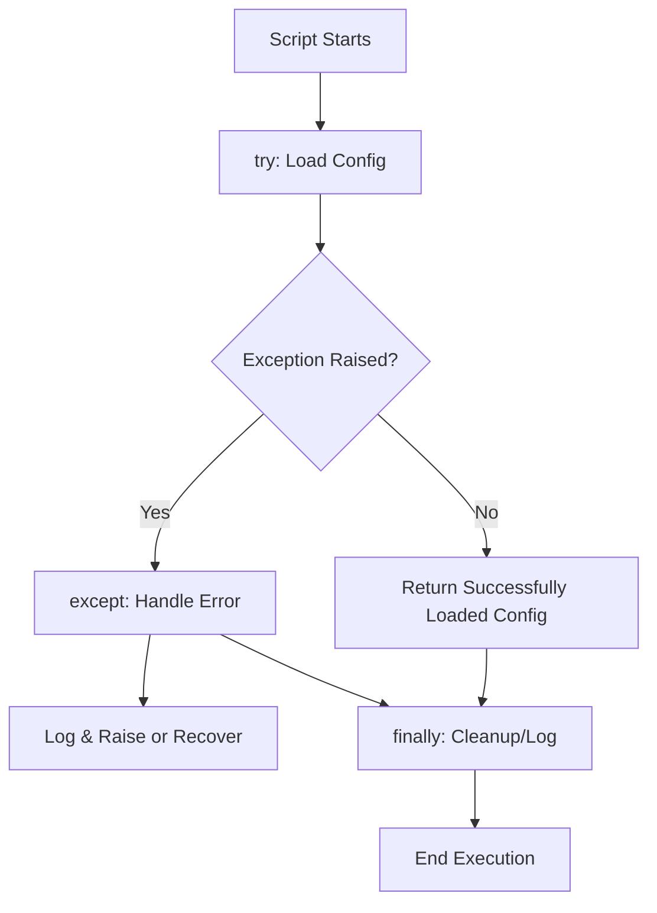

#### Key Takeaways
- **Plan** for errors proactively rather than reactively.  
- **Always** log meaningful messages.  
- **Clean up** resources reliably.  
- **Custom exceptions** clarify domain-specific failure modes.  
- **Graceful handling** boosts resilience in production environments.

---

### Question 2: Common SRE Script Use Cases

> **What are some typical use cases for writing quick Bash/Python scripts in an SRE environment?**  
> *Hint: Think about tasks like log parsing, monitoring, and deployment automation.*

#### Answer Overview
**SREs** frequently rely on **small, purpose-built scripts** to automate routine tasks, reduce human toil, and enforce consistent operational processes.

#### Detailed Answer
Typical tasks that benefit from quick scripting include:

- **Log Parsing & Analysis**: Quickly analyze large log files to find errors or anomalies.  
- **Monitoring & Alerting**: Gather system metrics (CPU, RAM) and push them to monitoring systems.  
- **Deployment Automation**: Roll out updates or configuration changes to multiple hosts in a standardized manner.  
- **Data Transformation**: Convert data between formats for easier integration (CSV ↔ JSON).  
- **Periodic Maintenance**: Rotate logs, remove stale data, back up databases, etc.

These efforts **reduce manual repetitive work**, minimize human error, and increase consistency.

#### Example Usage:
```python
import sys

def parse_logs_for_errors(logfile):
    """Quick script to parse logs and print lines containing 'ERROR'."""
    with open(logfile, 'r') as f:
        for line in f:
            if 'ERROR' in line:
                print(line.rstrip())

if __name__ == "__main__":
    if len(sys.argv) < 2:
        print("Usage: python parse_logs.py <logfile>")
        sys.exit(1)
    parse_logs_for_errors(sys.argv[1])
```

#### Example Output
```
ERROR: Connection timeout at ...
ERROR: Unable to open file ...
```

#### Testing Approach
1. **Small Test Log**: Ensures detection of lines containing “ERROR.”  
2. **Nonexistent File**: Verifies error handling.  
3. **Empty Log**: Verifies no output is produced.

#### SRE Perspective
- **Toil Reduction**: Automating repeated tasks yields more time for engineering improvements.  
- **Consistency**: Scripts ensure each run behaves identically.  
- **Incident Triage**: Quick custom queries on logs reduce MTTR (Mean Time to Repair).

#### Best Practices
- Keep scripts **simple**—use one script per well-defined task.  
- Maintain a central **repository** of scripts for easy team access and versioning.  
- Integrate scripts with **logging** for better observability.  
- Validate **arguments** and **input** for safety and clarity.  
- Consider a **CI/CD** approach (even for scripts) to catch errors early.

#### Common Pitfalls (Table)
| Pitfall                    | Issue                                                     | Better Approach                              |
|----------------------------|-----------------------------------------------------------|----------------------------------------------|
| Hardcoding credentials     | Security vulnerabilities                                  | Use environment variables or secrets manager |
| Large single script        | Difficult to maintain or debug                            | Break logic into modular functions           |
| No version control         | No collaboration or traceability                         | Store scripts in Git or other VCS            |
| Over-engineering           | Delays solving actual problem                            | Start small, expand as needed                |

#### Advanced Considerations
- Using **configuration management** systems (Ansible, Chef) to replace many manual scripts.  
- **Scheduled tasks** with cron or systemd timers for automated runs.  
- Containerizing scripts to ensure consistent runtime environments.

#### Visual Explanation


#### Key Takeaways
- **Automation** is key to scaling SRE work.  
- **Small scripts** handle routine tasks effectively.  
- Proper **logging** and **version control** are essential for script reliability.  
- **Iterate** on scripts based on operational feedback.  
- **Use specialized tools** when tasks grow more complex.

---

### Question 3: Handling Sensitive Credentials

> **When working with sensitive credentials in scripts, what security measures should you consider?**  
> *Hint: Consider encryption, environment variables, and secure storage solutions.*

#### Answer Overview
**Protecting credentials** is a cornerstone of secure systems administration. Proper **storage, transmission, and rotation** of secrets ensures resilience against unauthorized access.

#### Detailed Answer
1. **Use Environment Variables or Secrets Managers**  
   - Avoid embedding credentials in code.  
   - Services like AWS Secrets Manager or HashiCorp Vault provide rotation and restricted access.

2. **Encrypt Data at Rest**  
   - If credentials must exist on disk, store them encrypted.  
   - Restrict permissions so only authorized processes can decrypt.

3. **Rotate Credentials Regularly**  
   - Minimizes risk window in case keys leak.  
   - Automate rotation via scripts or secrets manager APIs.

4. **Limit File Permissions**  
   - Use strict ownership (e.g., `chmod 600` on sensitive files).  
   - Keep secrets in separate, secured directories if possible.

5. **Secure Transmission**  
   - Employ TLS/SSL or SSH tunnels for transferring credentials or configuration files across the network.

#### Example Usage:
```python
import os

def get_api_key():
    # Example: retrieving from environment (placeholder)
    return os.getenv("API_KEY", "NOT_FOUND")
```

#### Example Output
```
# On the shell:
$ export API_KEY=mysupersecretkey
$ python myscript.py
```
*(The script itself prints nothing, but it can use the environment variable to authenticate.)*

#### Testing Approach
1. **Check with & without** environment variables set.  
2. **Attempt** to handle invalid or revoked credentials gracefully.  
3. **Verify** file-based credentials are unreadable by unauthorized users.

#### SRE Perspective
- **Security** vulnerabilities can lead to production outages or data breaches.  
- **Confidence** in environment is essential for stable, long-running services.  
- Minimizes toil from investigating credential leaks or repeated reconfigurations.

#### Best Practices
- **Never** commit secrets to version control.  
- Leverage a **central secrets management** solution.  
- **Encrypt** backups containing secrets.  
- **Monitor** logs for accidental credential exposure.  
- Provide **least privilege** for any service accounts or tokens.

#### Common Pitfalls (Table)
| Pitfall                           | Issue                                                  | Better Approach                           |
|-----------------------------------|--------------------------------------------------------|-------------------------------------------|
| Hardcoding credentials in scripts | Can accidentally leak in logs or commits              | Use environment variables or Vault        |
| Infrequent rotation               | Prolonged exposure if compromised                     | Automate frequent rotations              |
| Broad file permissions            | Potential read by unauthorized users                  | Lock down with minimal read access       |
| Storing plaintext secrets in Git  | Permanent record in version history                   | Use .gitignore or dedicated secret store |

#### Advanced Considerations
- **Ephemeral tokens**: Time-limited keys for short sessions.  
- **Hardware Security Modules (HSMs)** for highest-trust environments.  
- **Zero Trust** approach: never assume any network segment is secure.

#### Visual Explanation


#### Key Takeaways
- **Never** embed credentials directly in code.  
- **Automate** secret management and rotation.  
- **Limit exposure** by restricting file/system permissions.  
- **Monitor** for accidental leaks.  
- Strong secrets handling is **crucial** for reliability and security.

---

### Question 4: Python Shell Execution Methods

> **Explain the difference between `os.system()`, `subprocess.call()`, and `subprocess.run()` for executing shell commands in Python. When would you choose one method over the others?**  
> *Hint: Think about the need for capturing output, error handling, and security.*

#### Answer Overview
Python offers multiple ways to run shell commands. The **`os.system()`** function is simple but limited, while the **`subprocess`** module provides more robust control and output handling.

#### Detailed Answer
1. **os.system()**  
   - Runs a command in a subshell and returns an exit status.  
   - Minimal features for capturing or controlling I/O.  
   - Generally **not recommended** for new code due to security and flexibility concerns.

2. **subprocess.call()**  
   - A simpler function that executes a command, waits for it to complete, returns the return code.  
   - Doesn’t capture stdout/stderr by default.  
   - More flexible than `os.system()` but less so than `subprocess.run()`.

3. **subprocess.run()**  
   - **Recommended modern interface** for running shell commands.  
   - Returns a `CompletedProcess` object containing `stdout`, `stderr`, and `returncode`.  
   - Supports advanced functionalities like timeouts, environment variables, and input data.

#### Comparison Table
| Method              | Return Value                            | Output Capture | Security / Flexibility | Recommended Use Cases                   |
|---------------------|-----------------------------------------|---------------|------------------------|-----------------------------------------|
| `os.system()`       | Exit status (int)                       | No            | Low                    | Very simple commands, legacy code       |
| `subprocess.call()` | Return code (int)                       | No (by default)| Medium                 | Quick calls without output capturing    |
| `subprocess.run()`  | `CompletedProcess` (stdout, stderr, rc) | Yes           | High                   | Most modern usage, advanced features    |

#### Example Usage:
```python
import subprocess

# Example using subprocess.run()
result = subprocess.run(["ls", "-l"], capture_output=True, text=True)
if result.returncode == 0:
    print("Command Output:")
    print(result.stdout)
else:
    print(f"Command failed with return code {result.returncode}")
```

#### Example Output
```
Command Output:
-rw-r--r--  1 user user 1234 Apr 10 14:32 script.py
-rw-r--r--  1 user user  567 Apr 10 14:00 notes.txt
```

#### Testing Approach
1. **Successful Command**: Confirm normal behavior.  
2. **Nonexistent Command**: Validate error handling.  
3. **Timeout** (in advanced usage): Ensure the code stops if the command hangs.

#### SRE Perspective
- **Logging** and **error checks** are critical in large-scale operations; `subprocess.run()` provides robust control.  
- Ensures you can capture and store output for auditing and debugging.  
- Minimizes the risk of shell injection by passing command parameters as lists rather than strings.

#### Best Practices
- Use `subprocess.run()` in **non-shell mode** whenever possible.  
- Always **validate user input** if building command strings dynamically.  
- **Check** `returncode` to detect failures early.  
- **Log** both stdout and stderr if relevant to reliability.  
- For advanced concurrency, consider **asyncio** or `subprocess.Popen()`.

#### Common Pitfalls (Table)
| Pitfall                                           | Issue                                                   | Better Approach                  |
|---------------------------------------------------|---------------------------------------------------------|----------------------------------|
| Using `os.system()` with user input               | Vulnerable to command injection                         | Use `subprocess.run(..., shell=False)` |
| Not checking exit codes                            | Silent failures in production                           | Always examine `returncode`      |
| Overly broad shell commands                       | Hard to maintain, prone to quoting/escaping errors      | Pass arguments as a list         |
| Mixing text/bytes incorrectly                     | Can cause decode errors in Python 3                     | Use `text=True` or `universal_newlines=True` |

#### Advanced Considerations
- **Async Subprocess**: `asyncio.create_subprocess_exec()` for parallel commands.  
- **Pipes & Redirection**: Chain commands or capture partial results.  
- **Environment Control**: Pass `env` dict to isolate or customize environment variables.

#### Visual Explanation
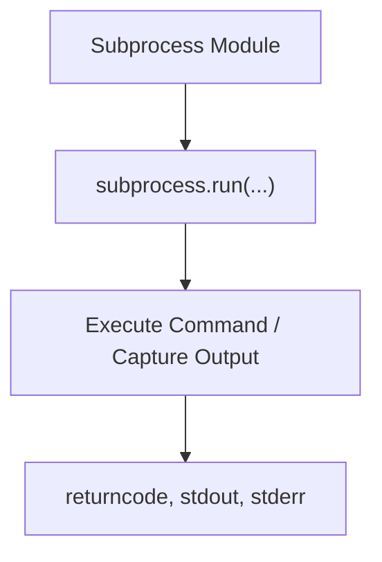

#### Key Takeaways
- **`os.system()`** is simplistic and rarely recommended.  
- **`subprocess.call()`** is a straightforward stepping stone.  
- **`subprocess.run()`** is the modern, flexible choice.  
- Always handle return codes and potential **command injection** issues.  
- Logging and capturing output help with **troubleshooting** in SRE contexts.

---

### Question 5: Context Managers in Python

> **What are context managers in Python (`with` statements), and why are they especially important when working with files?**  
> *Hint: Consider automatic resource management and exception handling.*

#### Answer Overview
**Context managers** allow you to define **setup** and **teardown** logic, ensuring resources like files or network connections are **properly closed** even if exceptions occur.

#### Detailed Answer
- A **context manager** is an object that implements the `__enter__()` and `__exit__()` methods.  
- In file operations, using a `with open(...) as f:` block guarantees that **files are closed automatically** when exiting the block, preventing resource leaks.  
- This pattern also provides a **clean, readable** way to manage resources.

#### Example Usage:
```python
def read_file(filepath):
    with open(filepath, 'r') as f:
        data = f.read()
    return data
```

#### Example Output
```
Hello, world!
This is the content of the file.
```
*(Assuming the file contains these lines.)*

#### Testing Approach
1. **Valid File**: Reads and returns file content.  
2. **Nonexistent File**: Check exception handling.  
3. **Permissions Issue**: Confirm it raises an appropriate error.

#### SRE Perspective
- **Resource exhaustion** from unclosed file handles can cause application failures under heavy load.  
- Ensures reliability by removing the possibility of leftover connections or handles.  
- Code simplicity means fewer mistakes in production automation scripts.

#### Best Practices
- **Always** use `with` for file operations.  
- Write **custom context managers** to simplify consistent setup/teardown logic (e.g., open DB connections).  
- Log or track usage for **critical** resources (files, sockets).  
- Keep blocks **short** to reduce confusion.  
- Use **contextlib** to create context managers with generator syntax for complex resources.

#### Common Pitfalls (Table)
| Pitfall                           | Issue                                   | Better Approach                                  |
|-----------------------------------|-----------------------------------------|--------------------------------------------------|
| Manual open/close without `with`  | Risk of forgetting to close resources   | Use `with` for guaranteed closure                |
| `__exit__` swallows exceptions    | Harder to debug issues                  | Log/raise appropriately in `__exit__()`          |
| Performing too many actions in one `with` block | Hard to manage resources individually | Keep contexts small and self-contained           |
| Nested `with` statements without clarity | Confusion about scope/lifetime | Use separate blocks or contextlib utilities      |

#### Advanced Considerations
- **Custom context managers** using `@contextlib.contextmanager` decorators.  
- **Context manager stacking** for multiple resource handling.  
- Combining context managers with **async** (e.g., `async with` in asyncio).

#### Visual Explanation


#### Key Takeaways
- **Context managers** reduce risk of resource leaks.  
- The `with` statement is **cleaner** and more **reliable** than manual open/close.  
- Ensuring **proper cleanup** is crucial in SRE for stable production environments.  
- Keep **blocks short** for clarity.  
- **Custom context managers** handle more advanced setups (locks, transactions).

---

## Code Analysis (6–8)

---

### Question 6: Log File Processing Issues

> **Review the following code. What issues or potential bugs do you see?**

```python
def process_log_file(filename):
    log_file = open(filename, 'r')
    content = log_file.read()
    errors = []
    
    for line in content.split('\n'):
        if 'ERROR' in line:
            errors.append(line)
    
    print(f"Found {len(errors)} errors")
    return errors
```

> *Hint: Consider resource management and potential exceptions.*

#### Answer Overview
This code has multiple shortcomings: **no resource cleanup**, **memory inefficiency**, **lack of error handling**, and **assumptions** about log size.

#### Detailed Answer
1. **No Context Manager**: Fails to close the file if an exception occurs.  
2. **Memory Inefficiency**: `read()` loads the entire file into memory, problematic for large logs.  
3. **No Error Handling**: Could crash if file is missing or unreadable.  
4. **Hardcoded Search**: Merely `ERROR` substring might yield false positives (“ERRORFREE”).

#### Example Usage:
```python
import logging

def process_log_file(filename):
    """Processes a log file to find lines containing 'ERROR'."""
    errors = []
    
    try:
        with open(filename, 'r', encoding='utf-8') as log_file:
            for line in log_file:
                if 'ERROR' in line:
                    errors.append(line.rstrip('\n'))
    except FileNotFoundError:
        logging.error(f"File not found: {filename}")
        raise
    except PermissionError:
        logging.error(f"Permission denied for file: {filename}")
        raise
    except Exception as e:
        logging.error(f"Unexpected error: {e}")
        raise
    
    logging.info(f"Found {len(errors)} errors in {filename}")
    return errors
```

#### Example Output
```
ERROR:root:File not found: missing.log
Traceback (most recent call last):
    ...
FileNotFoundError
```

#### Testing Approach
1. **File Exists**: Confirm it captures lines containing `ERROR`.  
2. **Missing File**: Validates error logging and re-raising.  
3. **Permission Issue**: Triggers `PermissionError`.

#### SRE Perspective
- Resource leaks degrade reliability over time.  
- Efficient line-by-line processing is critical in production systems with large logs.  
- Logging fosters better operational visibility.

#### Best Practices
- **Always** use `with open(...)`.  
- Split large logs line by line instead of reading them at once.  
- Check for **file existence** before opening.  
- Provide **informative log messages**.  
- Consider **regex** if partial matches or false positives are a concern.

#### Common Pitfalls (Table)
| Pitfall               | Issue                                             | Better Approach                        |
|-----------------------|---------------------------------------------------|----------------------------------------|
| No `with` statement   | Possible file descriptor leaks                    | Use context managers for guaranteed close |
| Loading entire file   | High memory usage for large logs                 | Process line-by-line for efficiency   |
| Lack of exception handling | Crash or silent failure in production           | Wrap in try-except with logging        |
| Overly broad substring search | May catch undesired lines                 | Use exact matches or regex boundaries |

#### Advanced Considerations
- **Regex** for more precise matching (e.g., `re.search(r"\bERROR\b", line)`).  
- **Multithreading** or **multiprocessing** for large-scale log processing.  
- Ingesting logs into a central aggregator (e.g., Elasticsearch) for advanced analytics.

#### Visual Explanation
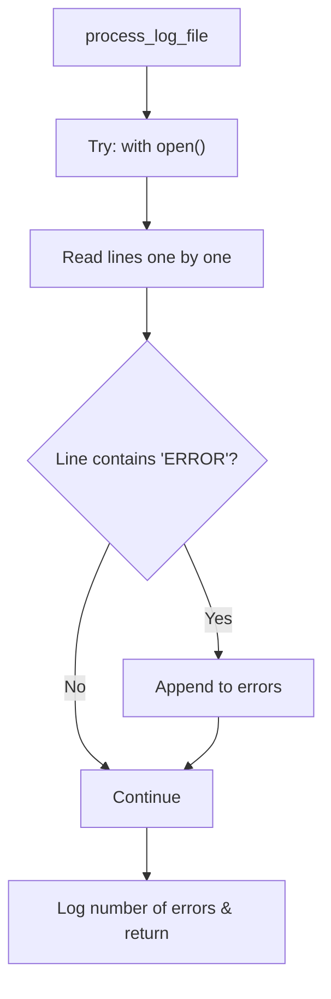

#### Key Takeaways
- **Use context managers** to avoid resource leaks.  
- Read **line-by-line** for large files.  
- **Log** both success and failure cases.  
- Expand your matching approach (regex, or more sophisticated searching).  
- Good error handling is essential for **SRE** readiness.

---

### Question 7: Environment Variables & Subprocess Execution

> **What will happen when the following script is run? Explain any issues.**

```python
import os
import sys

def set_config():
    os.environ['APP_ENV'] = 'production'
    print(f"Environment set to {os.environ['APP_ENV']}")

if __name__ == "__main__":
    config_file = sys.argv[1]
    with open(config_file, 'r') as f:
        config = f.read()
    set_config()
    os.system(f"./start_app.sh {config_file}")
```

> *Hint: Consider command-line arguments, environment variables, and subprocess execution.*

#### Answer Overview
This script **reads a config file, sets `APP_ENV` to `production`,** then uses `os.system()` to run `start_app.sh` with the config filename. Potential issues include **lack of error handling**, the simplistic **os.system()** call, and ephemeral usage of environment variables.

#### Detailed Answer
1. **Command-Line Arguments**  
   - The script assumes `config_file` is passed in as `sys.argv[1]`. If not, it crashes.  

2. **Reading Config**  
   - The script reads the entire config but doesn’t actually parse or use the content.  

3. **Environment Variable Scope**  
   - `os.environ['APP_ENV']` is set within the Python process. The new shell spawned by `os.system()` inherits environment variables by default, so `start_app.sh` should see `APP_ENV=production`.  
   - However, if the shell script spawns further shells without preserving environment, the variable might be lost.

4. **os.system() Limitations**  
   - **No direct output capture** or robust error handling.  
   - Return code is all you get, if you check it (this script does not).

5. **No Exception Handling**  
   - Fails on missing or invalid `config_file`.  
   - No error-checking for `os.system()` return value.

#### Example Usage:
```python
import os
import sys

def set_config():
    os.environ['APP_ENV'] = 'production'
    print(f"Environment set to {os.environ['APP_ENV']}")

if __name__ == "__main__":
    if len(sys.argv) < 2:
        print("Usage: python deploy.py <config_file>")
        sys.exit(1)
    
    config_file = sys.argv[1]
    
    try:
        with open(config_file, 'r') as f:
            config = f.read()  # Potentially parse or use it
    except Exception as e:
        print(f"Error reading {config_file}: {e}")
        sys.exit(1)
    
    set_config()
    
    ret = os.system(f"./start_app.sh {config_file}")
    if ret != 0:
        print(f"start_app.sh returned non-zero exit code: {ret}")
        sys.exit(1)
    
    print("Deployment script completed successfully.")
```

#### Example Output
```
Environment set to production
Deployment script completed successfully.
```

#### Testing Approach
1. **Missing config file**: Check for error messages.  
2. **start_app.sh fails**: Confirm non-zero exit code handling.  
3. **Shell environment**: Inspect if `APP_ENV` is indeed `production` in `start_app.sh`.

#### SRE Perspective
- Relying heavily on environment variables can be fragile if processes are chained.  
- SREs often prefer **subprocess.run()** for robust error checks, logging, and output handling.  
- Proper error handling is vital for smooth CI/CD pipelines.

#### Best Practices
- **Validate** arguments and the config file’s existence.  
- Use **subprocess.run()** for improved control of errors, outputs, and environment passing.  
- If possible, parse the config file and pass only **necessary data** to the shell script.  
- **Log** the success/failure of invoked commands.  
- Maintain **consistency** across scripts (shared library or approach).

#### Common Pitfalls (Table)
| Pitfall               | Issue                                  | Better Approach                             |
|-----------------------|----------------------------------------|---------------------------------------------|
| No checks on `argv`   | Script crashes with `IndexError`       | Validate command-line arguments             |
| No `subprocess` usage | Harder to capture logs or errors       | Use `subprocess.run()` with error handling  |
| Inheriting environment blindly | Potential security or config confusion | Pass environment dictionary explicitly      |
| Not validating `start_app.sh` result code | Silent failures                        | Check `returncode` or use robust logging    |

#### Advanced Considerations
- For security, consider **shell=False** with a list of args in `subprocess.run([“./start_app.sh”, config_file])`.  
- **CI/CD integration**: store logs in artifact repositories for debugging.  
- Leverage config file **parsing** to pass only valid data to scripts.

#### Visual Explanation
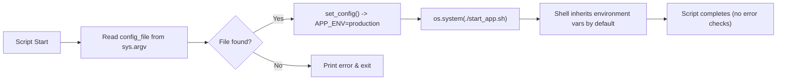

#### Key Takeaways
- If you need environment variables across multiple shells, **ensure** each shell inherits them or pass them explicitly.  
- `os.system()` is limited; prefer **subprocess.run()**.  
- Always check **return codes** to detect failed deployments.  
- Provide **error handling** for missing arguments and file access.  
- **Log** each step for clarity in production usage.

---

### Question 8: CSV Processing Improvements

> **Analyze the following CSV processing code. What improvements would you make?**

```python
import csv

def filter_users(csv_file, min_age):
    with open(csv_file, 'r') as f:
        reader = csv.reader(f)
        header = next(reader)
        
        age_index = header.index('age')
        result = []
        
        for row in reader:
            if int(row[age_index]) >= min_age:
                result.append(row)
    
    with open('filtered_users.csv', 'w') as f:
        writer = csv.writer(f)
        writer.writerow(header)
        writer.writerows(result)
```

> *Hint: Consider error handling, resource management, and code efficiency.*

#### Answer Overview
While this code works for basic filtering, it **hardcodes output**, lacks **error handling**, and **assumes** valid age data. Making it more robust and configurable is key.

#### Detailed Answer
1. **No Exception Handling**  
   - Crashes if `csv_file` doesn’t exist, is invalid, or lacks an `age` column.  
2. **Hardcoded Output Filename**  
   - Limits reusability. Accept an output path as a parameter.  
3. **Limited Data Validation**  
   - `int(row[age_index])` might fail if the CSV has non-integer values in the `age` field.  
4. **No Logging**  
   - Debugging is harder if issues arise (invalid CSV, missing headers, etc.).

#### Example Usage:
```python
import csv
import logging

def filter_users(csv_file, min_age, output_file='filtered_users.csv'):
    """
    Filters a CSV based on a minimum age requirement.
    """
    filtered_rows = []
    
    try:
        with open(csv_file, 'r', encoding='utf-8') as f:
            reader = csv.reader(f)
            header = next(reader)
            
            if 'age' not in header:
                raise ValueError("CSV missing 'age' column")
            
            age_idx = header.index('age')
            filtered_rows.append(header)
            
            for row in reader:
                try:
                    if int(row[age_idx]) >= min_age:
                        filtered_rows.append(row)
                except ValueError:
                    logging.warning(f"Skipping invalid row: {row}")
    except FileNotFoundError:
        logging.error(f"File not found: {csv_file}")
        raise
    except Exception as e:
        logging.error(f"Error filtering CSV: {e}")
        raise
    
    try:
        with open(output_file, 'w', newline='', encoding='utf-8') as f:
            writer = csv.writer(f)
            writer.writerows(filtered_rows)
    except Exception as e:
        logging.error(f"Failed to write output file: {e}")
        raise
```

#### Example Output
```
WARNING:root:Skipping invalid row: ['Alice', 'unknown']
ERROR:root:File not found: users.csv
```

#### Testing Approach
1. **Normal CSV**: Confirm correct filtering.  
2. **Missing File**: Should log and raise `FileNotFoundError`.  
3. **Corrupt CSV**: Should handle partial data gracefully.

#### SRE Perspective
- Data validation prevents incomplete or incorrect data from propagating.  
- Clear logging simplifies incident diagnosis.  
- Large user data sets must be handled efficiently, so consider streaming or chunk processing if needed.

#### Best Practices
- **Validate** critical columns and data types.  
- Use **logging** for better observability.  
- Accept **configurable** output filenames.  
- Provide **exceptions** or return codes for error states.  
- If large dataset, consider **iterating** row-by-row or use frameworks like **pandas**.

#### Common Pitfalls (Table)
| Pitfall                 | Issue                               | Better Approach                                    |
|-------------------------|-------------------------------------|----------------------------------------------------|
| Hardcoding output file  | Lack of flexibility                 | Parameterize output_file                           |
| No data validation      | Potential crashing on bad data      | Check row length and parse fields safely           |
| No error handling       | Silent or abrupt script failure     | Wrap operations in try-except blocks, log details  |
| Large CSV read in memory| High memory usage for huge datasets | Process in streaming mode or smaller chunks        |

#### Advanced Considerations
- Integrate with a **data pipeline** or **ETL** processes.  
- Apply **pandas** or database queries for complex filtering.  
- Write **unit tests** to ensure coverage for edge cases.

#### Visual Explanation
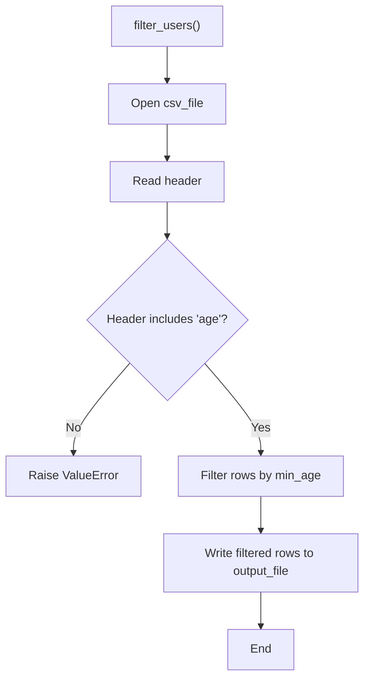

#### Key Takeaways
- Always **validate** CSV structure and data types.  
- Provide **error handling** to manage missing or invalid files gracefully.  
- **Log** warnings for partial row issues instead of failing outright.  
- Keep scripts **configurable** (filenames, parameters).  
- In large production systems, consider **streaming or specialized libraries** for efficiency.

---

## Coding Challenges (9–12)

---

### Question 9: Log Level Counter

> **Write a Python function that takes a log file path and returns a dictionary with counts of different log levels (INFO, WARNING, ERROR, etc.).**  
> *Example: Given a log file with lines containing "INFO", "WARNING", and "ERROR", the function should return `{'INFO': 10, 'WARNING': 5, 'ERROR': 2}`.*

#### Answer Overview
We need a **lightweight approach** to parse a log file line-by-line, **count specified log levels**, and handle file-related errors.

#### Detailed Answer
1. **Identify Common Log Levels**: Typically, `INFO`, `DEBUG`, `WARNING`, `ERROR`, `CRITICAL`.  
2. **Line-by-Line Reading**: Efficient for large files and prevents memory overuse.  
3. **Error Handling**: Check if file exists and handle exceptions.  
4. **Return**: A dictionary keyed by log level, valued by occurrence count.

#### Example Usage:
```python
import os
import logging
from collections import defaultdict
from typing import Dict

def count_log_levels(log_file_path: str) -> Dict[str, int]:
    """
    Counts occurrences of specific log levels (INFO, WARNING, ERROR, etc.) in a log file.
    """
    log_levels = {'INFO', 'WARNING', 'ERROR', 'DEBUG', 'CRITICAL'}
    counts = defaultdict(int)
    
    if not os.path.isfile(log_file_path):
        logging.error(f"File not found: {log_file_path}")
        raise FileNotFoundError(f"Log file not found: {log_file_path}")
    
    with open(log_file_path, 'r', encoding='utf-8') as f:
        for line in f:
            for level in log_levels:
                # Basic substring check
                if level in line:
                    counts[level] += 1
    
    return dict(counts)
```

#### Example Output
```
{
  "INFO": 14,
  "WARNING": 2,
  "ERROR": 3,
  "DEBUG": 5,
  "CRITICAL": 0
}
```

#### Testing Approach
1. **Sample Log** containing known counts.  
2. **Missing File**: Expect `FileNotFoundError`.  
3. **Mixed Log Levels**: Ensure correct tallies.

#### SRE Perspective
- Quick scanning of logs for frequency of warnings or errors helps in **incident analysis**.  
- Reduces toil by automating otherwise manual counting tasks.  
- Could feed results to a **monitoring system** for alert thresholds.

#### Best Practices
- **Regex** for more accurate log level extraction (with boundaries).  
- Use **logging** for internal errors or unusual lines.  
- Possibly run in a **cron job** to continuously collect metrics.  
- If performance is crucial, consider buffering or streaming optimizations.  
- Store results in a **time-series database** or aggregator for trending.

#### Common Pitfalls (Table)
| Pitfall                               | Issue                                                 | Better Approach                           |
|---------------------------------------|-------------------------------------------------------|-------------------------------------------|
| Checking log level via raw substring  | May catch partial matches (e.g., "DEBUGGER")          | Use regex boundaries or parse known format |
| No handling of unknown log levels     | Misses other levels or custom ones                    | Optionally store unknown in a fallback key |
| Skipping large logs in memory         | Not a big concern line-by-line but must remain mindful| For extremely large logs, stream carefully |

#### Advanced Considerations
- Consider a **structured log format** (JSON) for direct parsing.  
- Integrate with an aggregator (e.g., **Elastic Stack**, Splunk) for enterprise-level logging analysis.  
- Expand the script to track timestamps or other metadata.

#### Visual Explanation
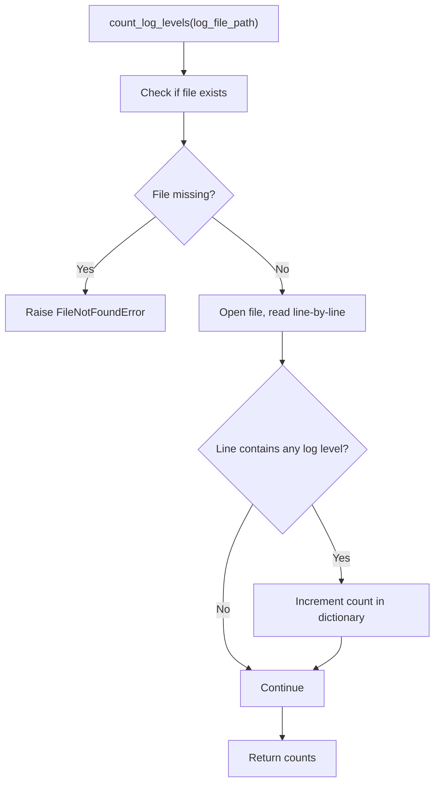

#### Key Takeaways
- Substring or **regex** approach for counting known levels.  
- Handling missing file or invalid log path is crucial.  
- Summaries of log levels give quick **insights** for SRE monitoring.  
- Keep code **flexible** for different log level patterns.

---

### Question 10: Safely Updating JSON Configuration

> **Create a script that safely updates a JSON configuration file with new values.**  
> *The script should preserve existing configuration, update only specified fields, and handle file locking to prevent race conditions.*

#### Answer Overview
**Safe updates** to a JSON config require **loading existing data**, merging changes, and **locking** the file so multiple processes can’t overwrite each other.

#### Detailed Answer
1. **Lock the File** for exclusive access with tools like `fcntl` (on Unix) or `portalocker` (cross-platform).  
2. **Load Existing JSON**: Start with the current config.  
3. **Apply Updates**: Overwrite or add new keys.  
4. **Write & Unlock**: Save final config atomically before releasing the lock.

#### Example Usage:
```python
import json
import fcntl
import logging
from typing import Dict, Any

def update_json_config(config_path: str, updates: Dict[str, Any]) -> None:
    """
    Safely updates a JSON configuration file with new values.
    """
    logging.debug(f"Starting update for {config_path}")
    
    with open(config_path, 'r+') as f:
        # Acquire exclusive lock
        fcntl.flock(f, fcntl.LOCK_EX)
        
        try:
            # Load existing JSON
            try:
                config_data = json.load(f)
            except json.JSONDecodeError:
                logging.warning(f"{config_path} is empty or invalid JSON. Starting fresh.")
                config_data = {}
            
            # Apply updates
            for k, v in updates.items():
                config_data[k] = v
            
            # Reset file pointer and truncate
            f.seek(0)
            f.truncate()
            
            # Write updated JSON
            json.dump(config_data, f, indent=2)
            logging.info(f"Config updated successfully for {config_path}")
        except Exception as e:
            logging.error(f"Error updating config: {e}")
            raise
        finally:
            # Release the lock (automatically on close as well)
            fcntl.flock(f, fcntl.LOCK_UN)
```

#### Example Output
```
WARNING:root:my_config.json is empty or invalid JSON. Starting fresh.
INFO:root:Config updated successfully for my_config.json
```

#### Testing Approach
1. **Valid JSON**: Overwrite certain keys.  
2. **Invalid JSON**: Confirm script warns and starts with empty config.  
3. **Concurrent Write**: Attempt parallel updates; second call waits for the lock.

#### SRE Perspective
- **Atomic writes** reduce the chance of partial, corrupt configs in production.  
- Locking is crucial if multiple processes or automation tasks might edit the file simultaneously.  
- Logging changes aids in auditing and debugging configuration issues.

#### Best Practices
- Use **file locking** or a central config service to avoid collisions.  
- **Validate** that updates have correct data types.  
- Keep backup copies or version control for easy rollback.  
- Parse JSON carefully to avoid silent truncation or corruption.  
- For multi-node setups, a **distributed config store** might be more robust.

#### Common Pitfalls (Table)
| Pitfall                  | Issue                                          | Better Approach                                  |
|--------------------------|------------------------------------------------|--------------------------------------------------|
| No file locking          | Race conditions where multiple writers clash   | Use fcntl or other locks to ensure exclusivity   |
| Overwriting entire JSON  | Potential to lose unrelated settings           | Load, merge, and only update relevant fields     |
| No error handling        | Silent failures lead to broken config          | Wrap in try-except blocks and log details        |
| Large config in memory   | Could be slow or high memory usage             | Use streaming approach if the file is very large |

#### Advanced Considerations
- For **Windows** compatibility, `fcntl` might not be available—use `portalocker`.  
- Integrate with a **CI/CD** pipeline where config changes pass tests.  
- Consider a **transaction-like** approach with backups for easy rollback.

#### Visual Explanation
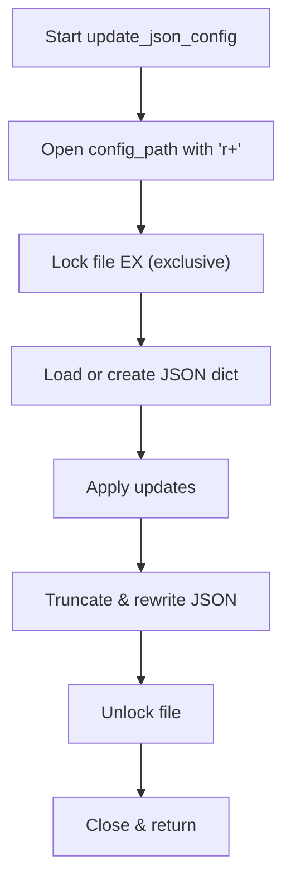

#### Key Takeaways
- **File locking** is essential in multi-process environments.  
- Merging updates preserves **existing fields**.  
- **Robust error handling** prevents silent config corruption.  
- Use a **logging** approach to track changes.  
- For large or distributed environments, consider **central config** solutions.

---

### Question 11: Command-Line Argument Parsing

> **Implement a function that parses command-line arguments for a script that processes log files.**  
> *It should accept parameters for input file, output file, log level filter, and date range.*

#### Answer Overview
Using the **argparse** module standardizes argument parsing, ensuring **descriptive usage messages** and **consistent** handling of user input.

#### Detailed Answer
1. **argparse.ArgumentParser**: Create an instance with a helpful description.  
2. **Define Arguments**: `--input`, `--output`, `--level`, `--start-date`, `--end-date`.  
3. **Validate**: Check date formats if necessary.  
4. **Return**: An object with parsed arguments to drive the script logic.

#### Example Usage:
```python
import argparse
import sys
import datetime
import logging

def parse_args(argv=None):
    parser = argparse.ArgumentParser(
        description="Process log files with optional filtering by level and date range."
    )
    
    parser.add_argument("--input", "-i", required=True, help="Path to the input log file.")
    parser.add_argument("--output", "-o", required=True, help="Path to the output file for results.")
    parser.add_argument("--level", "-l", default="INFO", help="Log level to filter (e.g., INFO, WARNING, ERROR).")
    parser.add_argument("--start-date", "-s", help="Start date (YYYY-MM-DD).")
    parser.add_argument("--end-date", "-e", help="End date (YYYY-MM-DD).")
    
    args = parser.parse_args(argv)
    
    # Optional: Validate date formats
    for date_arg in ("start_date", "end_date"):
        value = getattr(args, date_arg)
        if value:
            try:
                datetime.datetime.strptime(value, "%Y-%m-%d")
            except ValueError:
                logging.error(f"Invalid date format for --{date_arg.replace('_','-')}. Use YYYY-MM-DD.")
                sys.exit(1)
    
    return args
```

#### Example Output
```
usage: script.py --input INPUT --output OUTPUT [--level LEVEL] [--start-date START_DATE] [--end-date END_DATE]
```

#### Testing Approach
1. **Valid Args**: Provide all required fields, confirm no errors.  
2. **Missing Args**: Ensure parser raises usage error.  
3. **Invalid Date**: Confirm it logs an error and exits.

#### SRE Perspective
- Clear, standardized CLI usage fosters consistency among team members.  
- Minimizes guesswork or confusion, thus **reducing toil**.  
- Easy to integrate with automation frameworks that pass known arguments.

#### Best Practices
- Provide **help text** for each argument.  
- Validate critical arguments (e.g., dates, file paths).  
- Keep argument parsing in a **separate function** from main logic.  
- Return a structured object or dictionary for easy reference.  
- Consider **default values** for optional arguments (e.g., log level).

#### Common Pitfalls (Table)
| Pitfall                  | Issue                                          | Better Approach                             |
|--------------------------|------------------------------------------------|---------------------------------------------|
| No `required=True` for mandatory args | Script runs with incomplete data                     | Mark crucial arguments as required          |
| Overly complex arg parsing in main()  | Hard to test or maintain                            | Use dedicated parser function               |
| Vague or missing help text            | Users have no clue how to run the script            | Add descriptive help messages               |
| Failing to validate date format       | May pass a random string, leading to runtime errors | Validate or handle parse errors gracefully  |

#### Advanced Considerations
- Use advanced libraries like **click** or **Typer** for more user-friendly CLI.  
- Integrate with **subcommands** if script handles multiple tasks.  
- Provide **default** date range if not specified, or run a prompt for missing data.

#### Visual Explanation
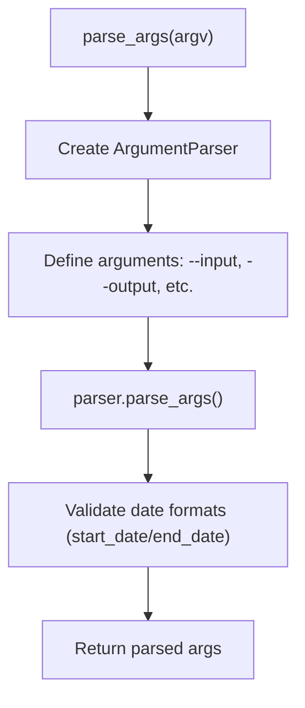

#### Key Takeaways
- **Argparse** standardizes CLI input in Python.  
- Provide **helpful** usage instructions and **descriptive** argument names.  
- Validate input to avoid **ambiguous errors** later.  
- Keep parsing **modular** for clarity in SRE scripts.  
- Integrate date/time checks or other validations to reduce runtime failures.

---

### Question 12: Directory Monitoring

> **Write a script to monitor a directory for new files and process them when they appear.**  
> *Include proper error handling and logging. Ensure the script doesn’t process the same file twice.*

#### Answer Overview
Monitoring directories in real-time often leverages packages like **watchdog** in Python. We then mark processed files in a **set** to avoid duplicates.

#### Detailed Answer
1. **watchdog** Observers: Listen for file creation events in the target directory.  
2. **Event Handler**: When a file is created, check if it’s new.  
3. **Process File**: Perform the needed logic (e.g., parse or move the file).  
4. **Add to Processed List**: Avoid reprocessing.  
5. **Error Handling & Logging**: Log exceptions if processing fails.

#### Example Usage:
```python
import time
import logging
from watchdog.observers import Observer
from watchdog.events import FileSystemEventHandler

class NewFileHandler(FileSystemEventHandler):
    def __init__(self, processed_files):
        self.processed_files = processed_files

    def on_created(self, event):
        if not event.is_directory:
            file_path = event.src_path
            if file_path not in self.processed_files:
                self.processed_files.add(file_path)
                self.process_file(file_path)
    
    def process_file(self, file_path):
        try:
            logging.info(f"Processing new file: {file_path}")
            # Placeholder for real processing
        except Exception as e:
            logging.error(f"Error processing file {file_path}: {e}")

def monitor_directory(directory):
    processed_files = set()
    event_handler = NewFileHandler(processed_files)
    observer = Observer()
    observer.schedule(event_handler, directory, recursive=False)
    observer.start()
    
    try:
        while True:
            time.sleep(1)
    except KeyboardInterrupt:
        observer.stop()
    observer.join()

if __name__ == "__main__":
    import sys
    if len(sys.argv) < 2:
        print(f"Usage: {sys.argv[0]} <directory_to_monitor>")
        sys.exit(1)
    
    logging.basicConfig(level=logging.INFO)
    monitor_directory(sys.argv[1])
```

#### Example Output
```
INFO:root:Processing new file: /tmp/monitor/new_file.txt
```

#### Testing Approach
1. **Create New Files**: Observe the log output.  
2. **Duplicate Names**: Confirm the script ignores second creations with the same path.  
3. **Permission Errors**: Attempt to place files in directories lacking sufficient permissions.

#### SRE Perspective
- **Automation** of ingest pipelines: e.g., every new log file triggers an indexing script.  
- Minimizes manual oversight, thus **reducing toil**.  
- Observability with logging ensures quick resolution if errors arise.

#### Best Practices
- Thoroughly **log** each file’s processing outcome.  
- Use **persistent tracking** (e.g., a small database) if the script restarts.  
- Consider **recursive** monitoring for subdirectories if needed.  
- **Error handling** must catch partial processing or parse failures.  
- For large-scale usage, cluster solutions or message queues might be more robust.

#### Common Pitfalls (Table)
| Pitfall                  | Issue                                          | Better Approach                    |
|--------------------------|------------------------------------------------|------------------------------------|
| Not storing processed files | Risk reprocessing files on script restart   | Use a DB or persistent store if required |
| Not handling file rename/move events | Some watchers only track creation events     | Listen for other events or re-check FS    |
| Large directories or high create rate | Could lag or miss events under heavy load    | Possibly scale watchers or use specialized tools |

#### Advanced Considerations
- **Queueing** system to handle high-volume file events.  
- Use **hashing** or checksums to ensure uniqueness instead of just file path.  
- Integrate with **cloud storage** triggers if using S3 or similar.

#### Visual Explanation
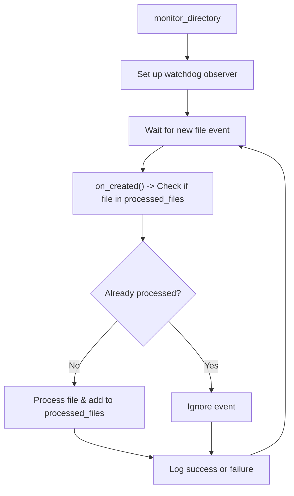

#### Key Takeaways
- **Watchdog** provides real-time file system event handling.  
- Track **processed_files** to prevent duplicates.  
- Logging is crucial for **operational visibility**.  
- Consider **persistence** if restarts are common.  
- In high-scale scenarios, a more robust **distributed approach** might be required.

---

## Application Questions (13–15)

---

### Question 13: Multi-Server Metrics Collection

> **As an SRE, you need to create a script that collects system metrics from multiple servers. What approach would you take?**  
> *Discuss authentication, data collection, error handling, and output formatting.*

#### Answer Overview
A robust multi-server script typically uses **SSH key-based authentication**, a **parallel approach** to gather metrics from each host, **solid error handling**, and a consistent **output format** like JSON or CSV.

#### Detailed Answer
1. **Server Inventory**: A file or database listing hostnames, SSH keys, and credentials.  
2. **Authentication**: Prefer **SSH key-based** (public/private key) for secure, automated logins.  
3. **Data Collection**: Running commands (`top -bn1`, `vmstat`, or custom scripts) to gather CPU, memory, disk usage.  
4. **Parallel Execution**: Use threads or async to scale across many servers.  
5. **Error Handling & Logging**: Catch timeouts, unreachable hosts, or command failures.  
6. **Output Formatting**: Store results in a JSON file or CSV for easy downstream processing.

#### Example Usage:
```python
import paramiko
import json
import logging
import concurrent.futures

logging.basicConfig(level=logging.INFO)

def get_metrics(server):
    hostname = server['hostname']
    username = server['username']
    key_path = server['key_path']
    metrics = {'server': hostname}
    
    try:
        ssh = paramiko.SSHClient()
        ssh.set_missing_host_key_policy(paramiko.AutoAddPolicy())
        ssh.connect(hostname, username=username, key_filename=key_path, timeout=10)
        
        # CPU usage (example)
        stdin, stdout, stderr = ssh.exec_command("top -bn1 | grep '%Cpu' | awk '{print $2 + $4}'")
        metrics['cpu_percent'] = stdout.read().decode().strip()
        
        # Memory usage (example)
        stdin, stdout, stderr = ssh.exec_command("free -m | awk '/Mem:/ {print ($3/$2)*100.0}'")
        metrics['mem_percent'] = stdout.read().decode().strip()
        
        ssh.close()
    except Exception as e:
        logging.error(f"Error retrieving metrics from {hostname}: {e}")
        metrics['error'] = str(e)
    
    return metrics

def collect_all_metrics(servers, output_file='metrics.json'):
    all_metrics = []
    with concurrent.futures.ThreadPoolExecutor(max_workers=10) as executor:
        futures = [executor.submit(get_metrics, s) for s in servers]
        for fut in concurrent.futures.as_completed(futures):
            all_metrics.append(fut.result())
    
    with open(output_file, 'w', encoding='utf-8') as f:
        json.dump(all_metrics, f, indent=2)
    
    logging.info(f"Metrics written to {output_file}")
```

#### Example Output
```json
[
  {
    "server": "server1.example.com",
    "cpu_percent": "5.3",
    "mem_percent": "67.2"
  },
  {
    "server": "server2.example.com",
    "cpu_percent": "12.6",
    "mem_percent": "80.1"
  }
]
```

#### Testing Approach
1. **Valid Servers**: Confirm normal metrics retrieval.  
2. **Offline Host**: Logs error, includes error key in results.  
3. **Timeout**: Trigger by intentionally blocking to ensure robust error handling.

#### SRE Perspective
- Collecting metrics across multiple hosts is a core SRE activity for **visibility** and **capacity planning**.  
- Automating the process with parallelism drastically **reduces toil**.  
- Ensures reliability by detecting potential issues early (e.g., high CPU usage).

#### Best Practices
- Use a **configuration file** for host details.  
- Implement **retries** for transient network errors.  
- Integrate with a **central logging** or monitoring system for deeper analysis.  
- Secure private keys with **minimal file permissions**.  
- Consider **pipelining** results to time-series databases (Prometheus, InfluxDB).

#### Common Pitfalls (Table)
| Pitfall                | Issue                                                   | Better Approach               |
|------------------------|---------------------------------------------------------|-------------------------------|
| Hardcoded credentials  | Security risks                                          | Use environment variables or Vault |
| Serial iteration       | Very slow for large server fleets                       | Use threading or async        |
| No error handling      | Missed data if a single host fails                      | Catch exceptions, log errors  |
| Storing raw credentials in code | Potential leak if code is shared or versioned publicly | Keep secrets in dedicated store |

#### Advanced Considerations
- Use **performance metrics** libraries or a standard aggregator (Prometheus Node Exporter).  
- Script-based approach can fill **gaps** or handle specialized metrics not covered by common exporters.  
- For large fleets, add **batching** or a **work queue** approach.

#### Visual Explanation
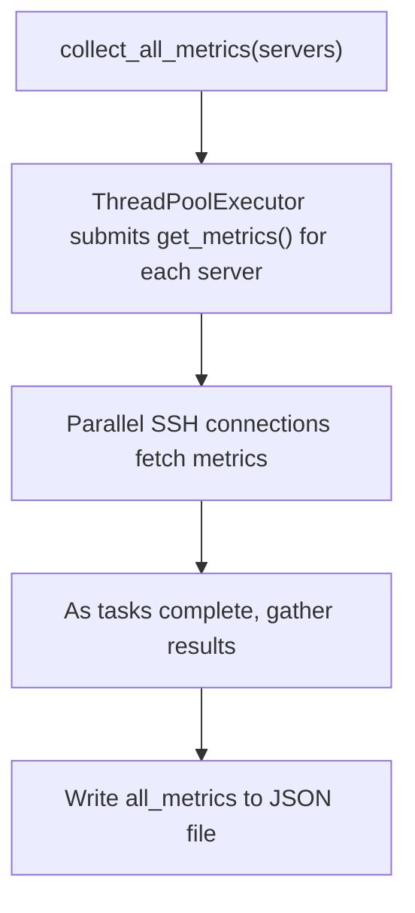

#### Key Takeaways
- **SSH-based** parallel metrics collection for multi-server environments.  
- Always handle **failures** gracefully and log them.  
- Storing output in **JSON** or CSV aids further analysis.  
- Keep **security** in mind for credentials and server details.  
- This approach is **extensible** for additional metrics (disk usage, network stats, etc.).

---

### Question 14: Safe Multi-Environment Deployment

> **You need to automate the deployment of a configuration file to multiple environments (dev, staging, prod). How would you design a script to do this safely?**  
> *Address environment-specific configurations, validation, and rollback capabilities.*

#### Answer Overview
A safe multi-environment deployment script must handle **differences in environment config**, **validate** before final deployment, and provide a **rollback** path if something fails.

#### Detailed Answer
1. **Environment Abstraction**  
   - Separate config for dev, staging, prod.  
   - Possibly a single file with environment-specific sections.

2. **Validation**  
   - Check file format (JSON/YAML).  
   - Confirm environment connectivity or prerequisites (e.g., service is accessible).

3. **Deployment Steps**  
   - **Backup existing config** on target.  
   - Copy or apply new config.  
   - If integrated with a service, restart or signal the service to load new config.

4. **Rollback**  
   - If post-deployment checks fail, restore the **previous** config.  
   - Log or alert on the failure.

5. **Logging & Auditing**  
   - Log each step for traceability.  
   - Possibly store logs in a central place.

#### Example Usage:
```python
import os
import shutil
import logging

def deploy_config(env, config_path, remote_server):
    """
    Deploy a config file to a given environment with rollback.
    """
    logging.info(f"Deploying config {config_path} to {env} on {remote_server}")
    
    backup_path = config_path + ".bak"
    
    try:
        if os.path.exists(config_path):
            shutil.copy2(config_path, backup_path)
        
        if not validate_config(config_path):
            raise ValueError("New config is invalid")
        
        upload_file(config_path, remote_server)
        
        if not health_check(remote_server):
            raise RuntimeError("Health check failed post-deployment")
        
        logging.info(f"Deployment to {env} successful.")
    except Exception as e:
        logging.error(f"Deployment failed for {env}: {e}")
        if os.path.exists(backup_path):
            shutil.move(backup_path, config_path)
            rollback_remote_config(backup_path, remote_server)
        raise

def validate_config(config_path):
    # Placeholder for real validation
    return True

def upload_file(config_path, remote_server):
    # Placeholder for scp/rsync/SSH logic
    pass

def health_check(remote_server):
    # Placeholder for verifying service is up with new config
    return True

def rollback_remote_config(backup_path, remote_server):
    # Revert on remote server
    pass
```

#### Example Output
```
INFO:root:Deploying config prod_config.yaml to PROD on myserver.example.com
ERROR:root:Deployment failed for PROD: Health check failed post-deployment
```

#### Testing Approach
1. **Dev Environment**: Quick test with minimal risk.  
2. **Staging**: Full environment check.  
3. **Simulate Failure**: Forcibly fail health checks to confirm rollback.

#### SRE Perspective
- Automated, consistent deployments across environments ensure reliability.  
- Rollbacks mitigate risk by quickly reverting changes.  
- Clear logs help with root-cause analysis if an environment’s deployment fails.

#### Best Practices
- Parameterize **paths, environment** details, and service endpoints.  
- Build a **pipeline** that progresses dev → staging → prod automatically.  
- Perform **health checks** or smoke tests post-deployment.  
- Keep deployment logs in a **central** system for auditing.  
- Minimize **downtime** with an atomic or rolling approach.

#### Common Pitfalls (Table)
| Pitfall                  | Issue                                                        | Better Approach                               |
|--------------------------|--------------------------------------------------------------|-----------------------------------------------|
| Single config for all env| Overwrites environment-specific values                      | Maintain separate or layered config           |
| No health check          | Undetected broken deployments leading to undiscovered outages | Always do post-deployment validation          |
| Missing rollback steps   | If deployment fails, environment is left broken             | Backup old config and revert if checks fail   |
| Deploy all at once       | Potential widespread outage if config is faulty             | Deploy in phases (dev → staging → prod)       |

#### Advanced Considerations
- Use a **blue-green** or **canary** deployment strategy for seamless transitions.  
- Integrate with **orchestration** (Terraform, Ansible) for infrastructure as code.  
- Store config versions in **Git** for traceability and easy rollback.

#### Visual Explanation
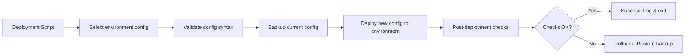

#### Key Takeaways
- **Separate** environment configs reduce confusion.  
- Validation and health checks **before** finalizing.  
- **Rollback** is crucial to prevent extended outages.  
- **Logging** every step helps SRE teams debug.  
- This approach fosters **safe, repeatable** multi-environment deployments.

---

### Question 15: API Key/Credential Rotation

> **Describe how you would create a script to automate the rotation of API keys or credentials.**  
> *Address security considerations, error handling, and ensuring continuity of service.*

#### Answer Overview
Automating credential rotation involves **generating new keys**, **validating** them in service, and then **revoking** the old keys only after confirming success, ensuring no downtime or broken service.

#### Detailed Answer
1. **Generate New Key**  
   - Use an API or secrets manager to create a new credential.  
   - Keep it protected (e.g., store in Vault).

2. **Deploy New Credential**  
   - Update config files or environment variables to use the new key.  
   - Use a **phased approach** (service reads both old and new keys initially if possible).

3. **Validation**  
   - Test an operation that only the new key can do (e.g., calling a specific endpoint).

4. **Revoke Old Key**  
   - Once the new key is confirmed working, remove or disable the old key.  
   - This avoids security exposures if the old key is compromised.

5. **Logging & Auditing**  
   - Record every key rotation, who initiated it, and the success/failure for compliance.  
   - In production, notifications or alerts might be triggered for changes to credentials.

#### Example Usage:
```python
import logging

def rotate_api_key(service_name, key_manager):
    """
    Automates rotation of an API key for a given service using a hypothetical key_manager.
    """
    logging.info(f"Starting API key rotation for {service_name}")
    
    old_key = key_manager.get_current_key(service_name)
    new_key = key_manager.generate_new_key(service_name)
    
    # Deploy new key
    deploy_key(service_name, new_key)
    
    # Validate new key usage
    if not validate_service_access(service_name, new_key):
        logging.error("New key validation failed. Rolling back.")
        rollback_key(service_name, old_key)
        return False
    
    # Revoke old key
    key_manager.revoke_key(service_name, old_key)
    logging.info(f"Successfully rotated API key for {service_name}")
    return True

def deploy_key(service_name, new_key):
    # Implementation depends on environment
    pass

def validate_service_access(service_name, key):
    # Attempt an action requiring the new key
    return True

def rollback_key(service_name, old_key):
    # Revert to the old key
    pass
```

#### Example Output
```
INFO:root:Starting API key rotation for PaymentGateway
ERROR:root:New key validation failed. Rolling back.
```

#### Testing Approach
1. **Successful Rotation**: Ensure new key works, old key revoked.  
2. **Failed Validation**: Script reverts to old key.  
3. **Multiple Services**: Ensure concurrency or sequential rotation for each service.

#### SRE Perspective
- Timely **key rotation** reduces vulnerability windows if a credential leaks.  
- Minimizes **toil** by automating a frequent but error-prone manual process.  
- Thorough logs ensure an **audit trail** for compliance and incident reviews.

#### Best Practices
- Integrate with a **secrets manager** that supports short-lived or auto-rotating keys.  
- **Validate** the new key thoroughly before revoking the old one.  
- **Alert** on rotation status to ensure staff are aware of changes.  
- Keep a **playbook** for manual fallback if automated rotation fails.  
- Consider **phased** rollout (service can accept both keys) for zero downtime.

#### Common Pitfalls (Table)
| Pitfall                         | Issue                                            | Better Approach                                     |
|---------------------------------|--------------------------------------------------|-----------------------------------------------------|
| Revoking old key too early      | Service interruption if new key not fully tested | Validate new key usage before revoking old one      |
| No backup of old key            | Hard to revert if new key fails in production    | Keep old key until confirmation or a set fallback   |
| No logging or monitoring        | Hard to trace issues if something goes wrong     | Log each rotation event and monitor key usage       |
| Hardcoding secret keys in code  | Security risk if repos are public or widely shared | Store them in a secure secrets manager, not in code |

#### Advanced Considerations
- **Ephemeral keys**: Rotate frequently and automatically expire.  
- Use **hardware security modules (HSMs)** for cryptographic operations.  
- **Zero-downtime** approaches via partial environment updates or canary testing.

#### Visual Explanation
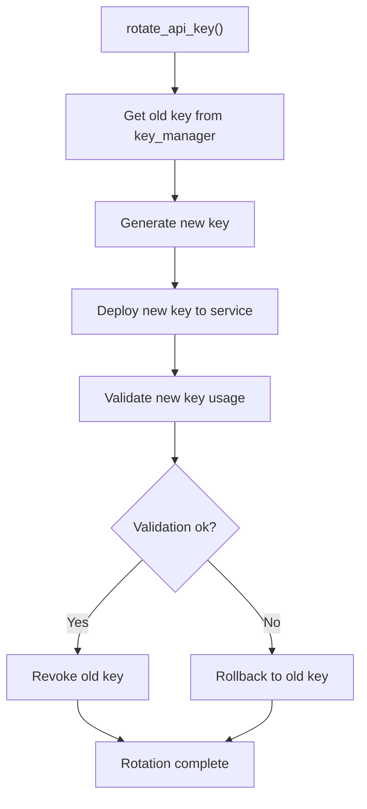

#### Key Takeaways
- Rotate keys in a **staged** approach to avoid downtime.  
- Thorough **validation** prevents post-rotation surprises.  
- Always **log** each step for auditing.  
- Integrated with a **secrets manager** is strongly recommended.  
- Reduces risk exposure if keys are compromised.

---

## Glossary (15 Terms)

Below are **15 technical terms** used throughout this document, with concise definitions.

1. **SRE (Site Reliability Engineering)**: A discipline that applies software engineering principles to infrastructure and operations problems, focusing on reliability, automation, and reducing toil.  
2. **Toil**: Repetitive, manual operational work that scales with service growth, which SREs aim to minimize.  
3. **Context Manager**: A Python structure (`with` statement) that encapsulates resource setup and teardown logic automatically.  
4. **Exception Chaining**: In Python, `raise ... from ...` to preserve the original exception context.  
5. **Subprocess Module**: Python’s library for spawning new processes, connecting to their I/O, and retrieving return codes.  
6. **File Locking**: Mechanisms (like `fcntl.flock`) to ensure exclusive file access, preventing race conditions.  
7. **Configuration File**: A file containing settings or parameters for applications or services.  
8. **JSON**: JavaScript Object Notation, a lightweight data-interchange format often used for configs and data exchange.  
9. **Regex (Regular Expressions)**: Patterns used for matching strings or substrings in text.  
10. **Deployment Pipeline**: A process or workflow for promoting code/config changes through multiple environments (dev → staging → prod).  
11. **Rollback**: Reverting to a known good state/config if a deployment or upgrade fails.  
12. **SSH**: Secure Shell protocol used for secure remote login and command execution.  
13. **Secrets Manager**: A service or tool (like HashiCorp Vault or AWS Secrets Manager) that securely stores and manages sensitive credentials.  
14. **Watchdog**: A Python library that monitors file system events (create, modify, delete) in real time.  
15. **Concurrency**: The ability to run multiple operations simultaneously (using threads, async, or processes), especially relevant in parallel data collection or processing.

---

## Conclusion

In this enhanced **SRE Scripting Documentation**, we covered:

1. **Conceptual Best Practices**: Error handling, credential management, scripting use cases.  
2. **Concrete Code Analysis**: Common pitfalls, resource handling, output formatting.  
3. **Practical Coding Challenges**: Log parsing, JSON config updates, directory monitoring.  
4. **Applied SRE Scenarios**: Multi-server metrics, multi-environment deployments, credential rotations.

By unifying **robust error handling**, **secure credentials**, **automated testing**, and **structured logging**, your scripts become more **reliable**, **maintainable**, and **aligned with SRE principles**. With each incremental improvement—like using context managers, file locks, or advanced `subprocess` capabilities—you reduce operational risk and **improve system reliability** for your organization.