# SRE Scripting Answer Sheet

## Table of Contents

1. [Conceptual Questions (1–5)](#conceptual-questions-1–5)
   - [Question 1: Error Handling in Python](#question-1-error-handling-in-python)
   - [Question 2: Common SRE Script Use Cases](#question-2-common-sre-script-use-cases)
   - [Question 3: Handling Sensitive Credentials](#question-3-handling-sensitive-credentials)
   - [Question 4: Python Shell Execution Methods](#question-4-python-shell-execution-methods)
   - [Question 5: Context Managers in Python](#question-5-context-managers-in-python)

2. [Code Analysis (6–8)](#code-analysis-6–8)
   - [Question 6: Log File Processing Issues](#question-6-log-file-processing-issues)
   - [Question 7: Environment Variables & Subprocess Execution](#question-7-environment-variables--subprocess-execution)
   - [Question 8: CSV Processing Improvements](#question-8-csv-processing-improvements)

3. [Coding Challenges (9–12)](#coding-challenges-9–12)
   - [Question 9: Log Level Counter](#question-9-log-level-counter)
   - [Question 10: Safely Updating JSON Configuration](#question-10-safely-updating-json-configuration)
   - [Question 11: Command-Line Argument Parsing](#question-11-command-line-argument-parsing)
   - [Question 12: Directory Monitoring](#question-12-directory-monitoring)

4. [Application Questions (13–15)](#application-questions-13–15)
   - [Question 13: Multi-Server Metrics Collection](#question-13-multi-server-metrics-collection)
   - [Question 14: Safe Multi-Environment Deployment](#question-14-safe-multi-environment-deployment)
   - [Question 15: API Key/Credential Rotation](#question-15-api-keycredential-rotation)

5. [Glossary (15 Terms)](#glossary-15-terms)

6. [Conclusion](#conclusion)

---

## Conceptual Questions (1–5)

---

### Question 1: Error Handling in Python

> **Why is error handling important in scripts, and what techniques can you use in Python to handle errors gracefully?**  
> (Hint: Consider **`try-except`**, **`try-finally`**, and **custom exceptions**.)

#### Answer Overview
Error handling is **vital** for preventing unexpected script crashes. It ensures **reliability**, logs meaningful information, and provides a way to **recover** or gracefully fail when problems arise. In **Python**, common mechanisms include **try-except**, **try-finally**, and **custom exceptions** to represent domain-specific issues.

#### Detailed Answer
In an **SRE** context, scripts frequently run **unattended**, meaning unhandled exceptions may lead to silent or cascading failures. By employing **try-except**, you can trap known exceptions like `FileNotFoundError` or `ValueError` and log corrective actions.

When **cleanup** (e.g., closing files or network connections) is necessary, **try-finally** (or **context managers**, discussed in another question) ensures those resources are released even if an exception occurs.

Finally, **custom exceptions** let you represent domain-specific failures. For instance, you might define `ConfigurationError` to explicitly highlight issues in your environment or configuration files. This clarity helps with quick triage and better **observability** in production systems.

#### Example Usage:
```python
import logging

class ConfigurationError(Exception):
    """Raised when configuration validation fails."""
    pass

def load_config(filename):
    """
    Loads a configuration file and checks for required keys.
    """
    config = {}
    try:
        with open(filename, 'r') as f:
            # Simplified parsing logic
            for line in f:
                if '=' in line:
                    key, value = line.strip().split('=', 1)
                    config[key] = value

        # Example validation
        if 'API_KEY' not in config:
            raise ConfigurationError("Missing 'API_KEY' in config")

    except FileNotFoundError:
        logging.error(f"Config file {filename} not found.")
        raise
    except ConfigurationError as ce:
        logging.error(f"Configuration error encountered: {ce}")
        raise
    finally:
        logging.info("Attempted to load configuration.")

    return config
```

#### Example Output
```
$ python script.py
ERROR:root:Config file my_config.ini not found.
INFO:root:Attempted to load configuration.
Traceback (most recent call last):
  ...
FileNotFoundError: [Errno 2] No such file or directory: 'my_config.ini'
```

#### Testing Approach
- **Test 1**: Valid file with all keys → script should succeed, logging completion.  
- **Test 2**: Missing file → script logs error and raises `FileNotFoundError`.  
- **Test 3**: Malformed file lacking `API_KEY` → script raises `ConfigurationError`.  

#### SRE Perspective
- Proper error handling avoids **cascading failures** in large systems.  
- Meaningful logging shortens **MTTR** (Mean Time To Repair).  
- Ensures confidence when running scripts autonomously at scale.

#### Best Practices
- Always **log** exceptions with enough **context** to diagnose them.  
- Prefer **specific** exception handling (e.g., `except ValueError`) rather than broad catches.  
- Ensure resources are cleaned up using **`with`** or **finally** blocks.  
- Raise **custom exceptions** to highlight domain-specific logic.  
- Provide fallback or **retry** logic for transient errors.  
- Keep **error messages** user-friendly and in logs.

#### Common Pitfalls
| Pitfall                                  | Issue                                                    | Better Approach                                |
|------------------------------------------|----------------------------------------------------------|------------------------------------------------|
| Catching `Exception` blindly             | Masks important details, makes debugging harder          | Catch specific exceptions or re-raise with context |
| Omitting `finally` block                 | Potential resource leaks if exception occurs             | Use `with` statements or `try-finally` blocks      |
| Swallowing errors without logging        | Debugging is more difficult, no visibility               | Log exceptions and store relevant context         |
| Not raising new exception after logging  | The script may continue in unknown state                 | Consider re-raising or returning a clear status    |

#### Advanced Considerations
- **Exception Chaining**: `raise NewException from OriginalException` to preserve root causes.  
- **Async error handling**: Different approaches needed in `asyncio` code.  
- **Contextlib** module: Provides decorators like `@contextmanager` for concise cleanup logic.

#### Visual Explanation
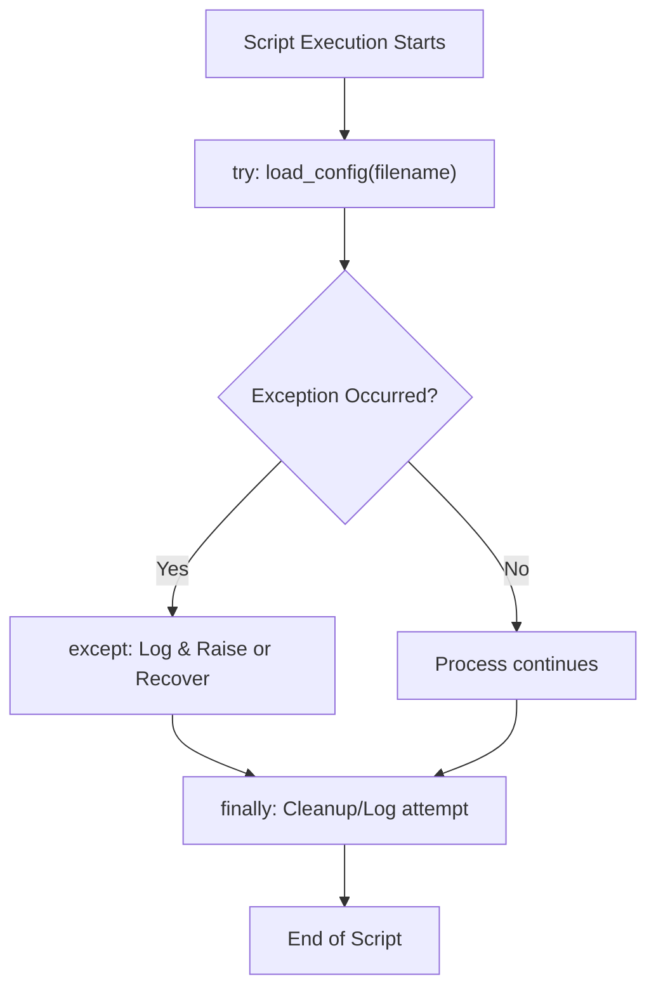

#### Key Takeaways
- **Robust error handling** avoids partial, silent failures.  
- **Logging** is indispensable for SRE workflows.  
- **Custom exceptions** add clarity for domain-specific errors.  
- **Resource cleanup** is mandatory in production.  
- **Thorough testing** ensures reliability.

---

### Question 2: Common SRE Script Use Cases

> **What are some typical use cases for writing quick Bash/Python scripts in an SRE environment?**  
> (Hint: Think about tasks like **log parsing**, **monitoring**, and **deployment automation**.)

#### Answer Overview
In an **SRE** environment, small **automation scripts** can greatly reduce **manual toil**, improve **consistency**, and **increase reliability** of routine tasks like parsing logs, collecting metrics, or deploying updates.

#### Detailed Answer
**SREs** frequently handle tasks that are repetitive or prone to human error. Examples include:

1. **Log Parsing & Analysis**  
   Breaking down extensive logs to find specific patterns, errors, or anomalies can be tedious if done manually. Scripts speed up root cause analysis.

2. **Monitoring & Alerting**  
   Automating data collection (e.g., CPU usage, memory consumption) and feeding it to a monitoring system reduces manual overhead.

3. **Deployment & Configuration Automation**  
   Consistent rollouts or config updates across many servers are simplified by standardized scripts, lowering risk of misconfiguration.

4. **Data Transformation & Reporting**  
   Tasks like converting CSV to JSON, generating summary reports, or cleaning data sets can be easily automated to reduce manual steps.

5. **Periodic Maintenance**  
   Database backups, rotating logs, or pruning stale resources help keep systems healthy and prevent bloat or outages.

#### Example Usage:
```python
import sys

def parse_logs_for_errors(logfile):
    """
    Reads a log file line-by-line to find 'ERROR' messages.
    """
    error_lines = []
    with open(logfile, 'r') as f:
        for line in f:
            if 'ERROR' in line:
                error_lines.append(line.strip())
    return error_lines

if __name__ == "__main__":
    if len(sys.argv) < 2:
        print("Usage: python parse_logs_for_errors.py <logfile>")
        sys.exit(1)

    logfile_path = sys.argv[1]
    errors = parse_logs_for_errors(logfile_path)
    print(f"Found {len(errors)} error lines.")
```

#### Example Output
```
$ python parse_logs_for_errors.py server.log
Found 17 error lines.
```

#### Testing Approach
- **Test 1**: Provide a log file with known occurrences of "ERROR" → ensures correct count.  
- **Test 2**: Provide an empty log → the script should find zero errors and not crash.  
- **Test 3**: Provide a missing file path → confirm it raises an exception or prints usage message.

#### SRE Perspective
- Eliminates **repetitive manual** tasks.  
- Ensures consistent **processes** in production.  
- Speeds up **incident response** and root cause analysis.

#### Best Practices
- Use **version control** for all scripts to ensure visibility and collaboration.  
- Keep them **modular** and well-documented for team usage.  
- Ensure scripts handle **edge cases** (e.g., large log files, no data).  
- **Log** important events for debugging.  
- **Validate** input parameters to prevent malformed usage.  
- Consider whether an **existing tool** or service solves the problem before custom scripting.

#### Common Pitfalls
| Pitfall             | Issue                                           | Better Approach                                     |
|---------------------|-------------------------------------------------|-----------------------------------------------------|
| Hardcoding credentials | Security risks in plain text                 | Use environment variables or a secrets manager      |
| Overly complex scripts | Hard to maintain and debug                   | Keep scripts small, modular, and well-documented    |
| Lack of error handling | Can crash on large inputs or missing files   | Wrap critical IO in try-except blocks              |
| Not storing in VCS  | Hard to version or share among the team         | Use Git or other version control for all scripts    |

#### Advanced Considerations
- Integrating scripts with **CI/CD pipelines** for continuous automation.  
- Using **Docker** or containers to package scripts and dependencies.  
- Employing **infrastructure as code** (e.g., Terraform, Ansible) for large-scale automation.

#### Visual Explanation


#### Key Takeaways
- Scripting **reduces toil** and **human error**.  
- Automating frequent tasks helps **maintain reliability**.  
- **Small, well-structured** scripts are easier to maintain.  
- Always consider **security** (secrets, credentials).  
- Evaluate **existing solutions** before reinventing.

---

### Question 3: Handling Sensitive Credentials

> **When working with sensitive credentials in scripts, what security measures should you consider?**  
> (Hint: Consider **encryption**, **environment variables**, and **secure storage** solutions.)

#### Answer Overview
Securing **credentials** in scripts is crucial to prevent unauthorized access or data breaches. Common strategies include **environment variables**, **secrets managers**, **encryption**, and **regular rotation** of secrets.

#### Detailed Answer
1. **Use Environment Variables or Secrets Managers**  
   Tools like **AWS Secrets Manager** or **HashiCorp Vault** can store credentials outside of code. This practice **reduces** the likelihood of leaking secrets in version control.

2. **Encrypt Sensitive Data at Rest**  
   If you must store credentials on disk, use encryption (e.g., **GPG**). Ensure file permissions restrict unauthorized reading.

3. **Limit File Permissions**  
   Keep secret files or tokens with **chmod 600** or similarly stringent permissions to avoid accidental exposure to other users.

4. **Rotate Credentials Regularly**  
   By rotating API keys, certificates, or passwords, you minimize the attack window if secrets get compromised.

5. **Secure Transmission**  
   Always use **SSH**, **TLS**, or another encrypted channel for exchanging credentials or config files across the network.

#### Example Usage:
```python
import os

def get_database_password():
    """
    Retrieves the database password from an environment variable.
    """
    return os.getenv("DB_PASSWORD", None)

if __name__ == "__main__":
    db_pass = get_database_password()
    if db_pass:
        print("Database password retrieved successfully.")
    else:
        print("Error: DB_PASSWORD not set.")
```

#### Example Output
```
$ export DB_PASSWORD='SuperSecret123!'
$ python credentials_script.py
Database password retrieved successfully.
```

#### Testing Approach
- **Test 1**: Environment variable set → script should detect it successfully.  
- **Test 2**: Environment variable not set → script warns about missing password.  
- **Test 3**: Malformed or empty password → verify error conditions are handled.

#### SRE Perspective
- Poor credential handling can lead to **major security incidents** or downtime.  
- Maintaining strong secret hygiene aligns with SRE goals of **reliability** and **safety**.  
- Automated processes (e.g., rotation, secure retrieval) reduce manual steps and **human error**.

#### Best Practices
- **Never** commit credentials to version control.  
- Use a **secrets manager** for at-scale deployments.  
- Apply **least-privilege** principles.  
- **Encrypt** data at rest and in transit.  
- Rotate credentials **frequently** to reduce risk.  
- Log usage but **mask** sensitive fields.

#### Common Pitfalls
| Pitfall                     | Issue                                                       | Better Approach                                  |
|-----------------------------|-------------------------------------------------------------|--------------------------------------------------|
| Hardcoding credentials      | Easy to leak in logs, code merges, or public repos         | Store them securely outside the script           |
| Sharing secrets in plain text   | Potential for accidental eavesdropping or saving to logs   | Use encrypted channels and secure chat tools      |
| Infrequent rotation         | Prolonged vulnerability if compromised                     | Schedule or automate key rotation                 |
| Overly permissive file modes | World-readable secret files expose credentials widely      | Restrict file modes to the running user/group     |

#### Advanced Considerations
- **Ephemeral tokens** for short-lived authentication.  
- Integrating with a **Hardware Security Module (HSM)** for highest trust.  
- **Auditing** credential usage and access patterns regularly.

#### Visual Explanation


#### Key Takeaways
- **Never** hardcode sensitive secrets in scripts.  
- Use environment variables, encryption, or secrets management solutions.  
- **Rotate** credentials frequently to minimize compromise risk.  
- Restrict file permissions to avoid leaks.  
- Properly managing secrets is a **foundation** of secure SRE practice.

---

### Question 4: Python Shell Execution Methods

> **Explain the difference between `os.system()`, `subprocess.call()`, and `subprocess.run()` for executing shell commands in Python. When would you choose one method over the others?**  
> (Hint: Consider **capturing output**, **error handling**, and **security**.)

#### Answer Overview
Python’s **shell command** execution can occur via **`os.system()`**, **`subprocess.call()`**, or **`subprocess.run()`**. Each offers varying degrees of **control**, **output capture**, and **security**. Understanding their differences helps pick the right tool for SRE scripting needs.

#### Detailed Answer
1. **`os.system()`**  
   - Executes a command in a subshell, returning only an **exit status**.  
   - Lacks robust output capture or flexible error handling.  
   - Typically considered **less secure** and outdated for new scripts.

2. **`subprocess.call()`**  
   - Part of the `subprocess` module, it runs a command, waits, and returns the **return code**.  
   - Can handle simple tasks but does not capture stdout/stderr by default.  
   - More secure than `os.system()` because you can avoid passing commands via a single shell string.

3. **`subprocess.run()`**  
   - The **preferred modern** API, returning a `CompletedProcess` object with `stdout`, `stderr`, and `returncode`.  
   - Allows advanced features such as **timeouts**, environment passing, and robust error handling.  
   - Provides more transparency and control for SRE automation scripts.

#### Comparison Table
| Method               | Return Value               | Output Capture      | Flexibility / Security | Typical Use Cases                                                  |
|----------------------|----------------------------|---------------------|------------------------|---------------------------------------------------------------------|
| **`os.system()`**    | Exit status (int)         | No                 | Low                   | Very simple commands, legacy code. Rarely recommended.             |
| **`subprocess.call()`** | Return code (int)       | Redirect manually  | Medium                | Quick synchronous calls needing only return status.                |
| **`subprocess.run()`**  | `CompletedProcess` object | Yes (stdout, stderr) | High                  | Most modern usage, advanced error handling, capturing output, etc. |

#### Example Usage:
```python

import subprocess
import sys

def list_directory(path="."):
    """
    Lists directory contents using subprocess.run(),
    capturing the output for logging or processing.
    """
    try:
        result = subprocess.run(["ls", "-l", path], capture_output=True, text=True, check=True)
        return result.stdout
    except subprocess.CalledProcessError as e:
        print(f"Error listing directory: {e}")
        return None

if __name__ == "__main__":
    # Example input
    path_to_check = sys.argv[1] if len(sys.argv) > 1 else "."
    output = list_directory(path_to_check)
    print("Directory contents:\n", output)
```

#### Example Output
```
$ python shell_methods_example.py /var/log
Directory contents:
 total 128
 -rw-r--r-- 1 root root   2592 Apr  8 14:37 boot.log
 -rw-r--r-- 1 root root   5120 Apr 10 12:25 messages
 ...
```

#### Testing Approach
- **Test 1**: Valid directory → check for correct listing output.  
- **Test 2**: Invalid directory → ensure the script gracefully catches `CalledProcessError`.  
- **Test 3**: Permissions-limited directory → script logs an error or handles the exception.

#### SRE Perspective
- **Capturing and logging** stdout/stderr is crucial for incident troubleshooting.  
- `subprocess.run()`’s ability to handle timeouts is important when commands may hang in production.  
- Minimizing **shell injection** risk is essential for scripts that handle user input.

#### Best Practices
- Prefer **`subprocess.run()`** for new code due to advanced features.  
- Avoid **passing user input** directly in shell commands to reduce injection vulnerabilities.  
- Always **check** return codes or exceptions.  
- Log **stdout/stderr** for debugging.  
- Use **timeouts** to prevent stuck processes.  
- For complex processes, consider **asynchronous** or **non-blocking** patterns.

#### Common Pitfalls
| Pitfall                                  | Issue                                                        | Better Approach                                      |
|------------------------------------------|--------------------------------------------------------------|------------------------------------------------------|
| Using `os.system()` with user input      | Potential command injection                                  | Use `subprocess.run(..., shell=False)` with argument lists |
| Not checking return codes                | Silent failures can happen                                   | Use `check=True` or examine `returncode`            |
| Overly broad shell commands              | Hard to maintain, error-prone with quoting/escaping          | Pass arguments as lists                              |
| Not capturing stdout/stderr             | Limited debug information if errors occur                    | Use `capture_output=True` or set `stderr=...`        |

#### Advanced Considerations
- **Asyncio**: For parallel/subprocess management in an event loop.  
- **shlex**: Safely split command strings.  
- `env` parameter for **custom environment** isolation.

#### Visual Explanation
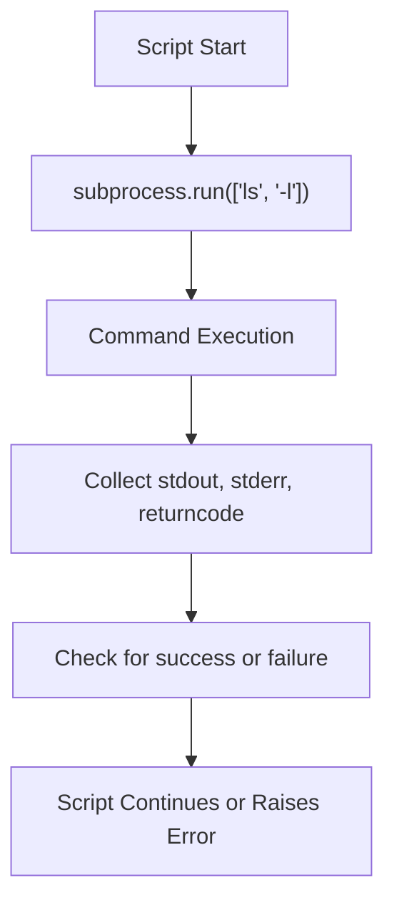

#### Key Takeaways
- **`subprocess.run()`** is generally the best, modern approach.  
- Always check **exit codes** or handle exceptions.  
- Minimizing shell injection risk is critical.  
- Output capture aids **SRE troubleshooting**.  
- Timeouts and advanced features enable robust automation.

---

### Question 5: Context Managers in Python

> **What are context managers in Python (`with` statements), and why are they especially important when working with files?**  
> (Hint: Consider **automatic resource management** and **exception handling**.)

#### Answer Overview
**Context managers** in Python define **setup** and **teardown** steps, automatically releasing resources even if exceptions arise. They are especially valuable for **file operations** to ensure the file is always closed properly.

#### Detailed Answer
A **context manager** is an object that implements `__enter__()` and `__exit__()` methods. When you write a `with open('file.txt') as f: ...`, Python automatically calls `__enter__()` at block entry to open the file, and `__exit__()` upon leaving the block—closing the file even if an exception is thrown.

This eliminates the need for manual cleanup code and prevents resource leaks. In **SRE** scripts, failing to close files can lead to **exhausted file descriptors** and degrade system reliability.

#### Example Usage:
```python
def read_log_file(path):
    """
    Reads an entire log file safely using a context manager.
    """
    with open(path, 'r') as f:
        return f.read()

if __name__ == "__main__":
    logs = read_log_file("system.log")
    print(f"Log file contents (truncated):\n{logs[:200]}...")
```

#### Example Output
```
$ python context_manager_example.py
Log file contents (truncated):
Apr 10 12:00:01 server CRON[1234]: (root) CMD (run-parts /etc/cron.hourly)
Apr 10 12:15:02 server CRON[5678]: (root) CMD (backup.sh)
...
```

#### Testing Approach
- **Test 1**: Valid file path → ensures the content is read successfully.  
- **Test 2**: Nonexistent file → triggers `FileNotFoundError`.  
- **Test 3**: Large file test → verifies correct cleanup under memory load.

#### SRE Perspective
- Preventing **resource leaks** (file handles, DB connections) is crucial for stable production.  
- Simplifies code, making it **less error-prone**.  
- Integrates with other advanced resource management contexts (e.g., locks, network sockets).

#### Best Practices
- **Always** use `with open(...)` for file operations.  
- Define **custom context managers** for specialized resource usage.  
- Keep `with` blocks **short** to reduce confusion about resource lifetime.  
- Pair context managers with **logging** for debug/troubleshoot.  
- For multiple resources, chain or nest **with** statements.  
- Use **contextlib** for more advanced or custom contexts.

#### Common Pitfalls
| Pitfall                                    | Issue                                                  | Better Approach                                 |
|--------------------------------------------|--------------------------------------------------------|-------------------------------------------------|
| Not using `with` for files                | Possible descriptor leaks if exception occurs          | Always use context managers for file I/O        |
| Overly large block inside `with`          | Resource remains open longer than necessary            | Keep blocks short and targeted                 |
| Manual close without try-finally          | If an exception occurs, the file might never close     | Let `with` handle file closure automatically   |
| Attempting to read/write after exit block | Resource is no longer available, leading to error      | Keep operations inside the `with` scope        |

#### Advanced Considerations
- **Custom** context managers using `@contextlib.contextmanager`.  
- **Nested** contexts for multiple resources in a single `with` statement.  
- Asynchronous context managers (`async with`) in Python’s `asyncio` environment.

#### Visual Explanation


#### Key Takeaways
- Context managers significantly reduce **boilerplate** resource handling code.  
- They guarantee **cleanup** even under exceptions.  
- Use them for **files, sockets, locks**, and more.  
- Keep blocks **focused** on a single resource.  
- They are fundamental for **reliable** SRE scripting in Python.

---

## Code Analysis (6–8)

---

### Question 6: Log File Processing Issues

> **Review the following code. What issues or potential bugs do you see?**

```python
def process_log_file(filename):
    log_file = open(filename, 'r')
    content = log_file.read()
    errors = []
    
    for line in content.split('\n'):
        if 'ERROR' in line:
            errors.append(line)
    
    print(f"Found {len(errors)} errors")
    return errors
```

#### Answer Overview
This code has **no resource cleanup**, **loads the entire file** into memory, and lacks **error handling**. Such issues can degrade reliability and **cause crashes** with large logs or missing files.

#### Detailed Answer
1. **No Context Manager**  
   The file is opened without a `with` block, so if an exception occurs, the file may remain open.

2. **Memory Inefficiency**  
   Calling `read()` for the entire file can be problematic if logs are huge.

3. **No Error Handling**  
   If `filename` is invalid, the script crashes. No fallback or logging is performed.

4. **Hardcoded String Matching**  
   Checking `'ERROR' in line` might incorrectly match `ERRORFREE` or partial strings.

#### Example Usage:
```python
import logging

def process_log_file(filename):
    """
    Processes a log file line-by-line to find lines containing "ERROR".
    Returns a list of matching lines.
    """
    errors = []
    try:
        with open(filename, 'r', encoding='utf-8') as log_file:
            for line in log_file:
                # Check for lines containing 'ERROR'
                if 'ERROR' in line:
                    errors.append(line.rstrip('\n'))
    except FileNotFoundError:
        logging.error(f"File not found: {filename}")
        raise
    except PermissionError:
        logging.error(f"Permission denied for file: {filename}")
        raise
    except Exception as e:
        logging.error(f"Unexpected error: {e}")
        raise

    logging.info(f"Found {len(errors)} errors in {filename}")
    return errors

if __name__ == "__main__":
    # Example input
    sample_errors = process_log_file("application.log")
    print(f"Collected {len(sample_errors)} lines with 'ERROR'.")
```

#### Example Output
```
$ python process_logs.py
INFO:root:Found 2 errors in application.log
Collected 2 lines with 'ERROR'.
```

#### Testing Approach
- **Test 1**: Valid log with known `ERROR` lines → verify correct count.  
- **Test 2**: Missing file → ensure it logs an error and raises `FileNotFoundError`.  
- **Test 3**: Large file → ensure no memory issues since line-by-line reading is used.

#### SRE Perspective
- **Resource leaks** degrade reliability.  
- Proper error handling and logging reduce confusion when logs are missing or corrupted.  
- Minimizes **operational toil** by quickly identifying error lines.

#### Best Practices
- Use a **context manager** to handle file I/O.  
- Read line-by-line to avoid **memory** blowouts.  
- Always **log** or handle exceptions with relevant context.  
- If `ERROR` must be matched precisely, use **regex** with word boundaries.  
- For extremely large logs, consider **streaming** or external log search tools.  
- Integrate with **monitoring** to track error frequency automatically.

#### Common Pitfalls
| Pitfall                            | Issue                                           | Better Approach                                 |
|------------------------------------|-------------------------------------------------|-------------------------------------------------|
| Reading entire file at once        | Risk memory overload with large logs           | Process line-by-line                            |
| No context manager                 | Can leave file descriptors open on exception   | Always use `with open(...)`                     |
| No exception handling              | Script crashes abruptly                        | Use try-except with logging                     |
| Overly simplistic string matching  | Partial or false matches of "ERROR" substrings | Use boundaries or more sophisticated matching   |

#### Advanced Considerations
- Use **regular expressions** for precise pattern matching.  
- **Parallel** or **distributed** log processing for extremely large data sets.  
- **Incremental** processing if logs rotate frequently.

#### Visual Explanation
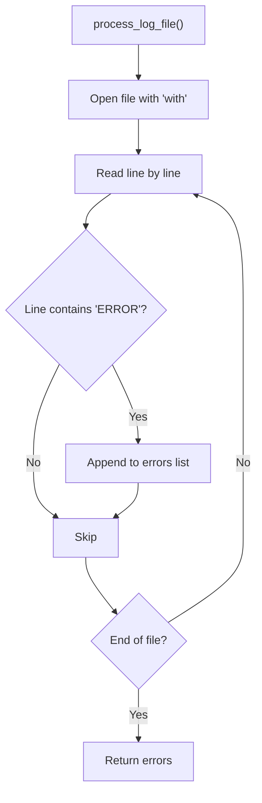

#### Key Takeaways
- Always handle files using **with** statements.  
- Reading logs **line-by-line** is crucial for large files.  
- Logging errors improves **observability**.  
- Validate or handle missing/perms errors gracefully.  
- Use more robust matching (regex) if partial matches are an issue.

---

### Question 7: Environment Variables & Subprocess Execution

> **What will happen when the following script is run? Explain any issues.**
>
> ```python
> import os
> import sys
>
> def set_config():
>     os.environ['APP_ENV'] = 'production'
>     print(f"Environment set to {os.environ['APP_ENV']}")
>
> if __name__ == "__main__":
>     config_file = sys.argv[1]
>     with open(config_file, 'r') as f:
>         config = f.read()
>     set_config()
>     os.system(f"./start_app.sh {config_file}")
> ```

#### Answer Overview
The script reads a config file, sets an **environment variable**, then uses **`os.system()`** to run a shell script. Issues include a **lack of error handling**, ephemeral environment usage, and the simplistic approach of `os.system()` without robust output capture.

#### Detailed Answer
1. **Command-Line Args**  
   The script expects `config_file` as `sys.argv[1]`. If not supplied, it **crashes** with `IndexError`.

2. **Reading Config**  
   The script loads the entire file’s contents into `config` but never actually uses that data, except for passing the filename to `start_app.sh`.

3. **Environment Variable Scope**  
   `APP_ENV` is set to `'production'`. Subshells generally inherit environment variables, so `start_app.sh` sees it, but deeper shells might lose it if not passed correctly.

4. **`os.system()` Limitations**  
   No direct capture of `stdout` or `stderr`, plus minimal error reporting. A non-zero return code is not checked, so failures might go unnoticed.

5. **No Exception Handling**  
   Missing file or read permission issues lead to uncaught exceptions. There's also no fallback if `./start_app.sh` fails.

#### Example Usage:
```python
import os
import sys
import subprocess

def set_config():
    """
    Sets the APP_ENV to production. Child processes typically inherit this environment.
    """
    os.environ['APP_ENV'] = 'production'
    print(f"Environment set to {os.environ['APP_ENV']}")

def run_script(config_file):
    """
    Reads config_file, sets environment, then uses subprocess.run()
    for better control over the shell command execution.
    """
    try:
        with open(config_file, 'r') as f:
            config_data = f.read()
            # Potentially parse or validate config_data here
    except FileNotFoundError:
        print(f"Error: {config_file} not found.")
        return

    set_config()

    # Replacing os.system() with subprocess.run() for better error handling:
    try:
        result = subprocess.run(["./start_app.sh", config_file], capture_output=True, text=True, check=True)
        print(f"start_app.sh output:\n{result.stdout}")
    except subprocess.CalledProcessError as e:
        print(f"start_app.sh failed with return code {e.returncode}")
        print(f"stderr: {e.stderr}")

if __name__ == "__main__":
    if len(sys.argv) < 2:
        print(f"Usage: python main.py <config_file>")
        sys.exit(1)

    run_script(sys.argv[1])
```

#### Example Output
```
$ python main.py my_config.txt
Environment set to production
start_app.sh output:
[LOG] Starting application with config my_config.txt
```

#### Testing Approach
- **Test 1**: Provide a valid config file → script sets environment and prints child script output.  
- **Test 2**: Missing config file → logs an error about file not found.  
- **Test 3**: start_app.sh intentionally fails → script should catch the error and print stderr.

#### SRE Perspective
- Relying on environment variables to drive config can be **fragile** if multiple processes or shells are involved.  
- Using **subprocess.run()** with robust error checks is more **reliable** for production automation.  
- Minimizes time spent debugging hidden shell failures.

#### Best Practices
- Validate **CLI arguments** to avoid index errors.  
- Prefer **`subprocess.run()`** or equivalent for capturing output and errors.  
- Log or handle **non-zero** exit codes from child processes.  
- Use environment variables carefully, ensuring they’re inherited or explicitly passed.  
- Consider passing config data as **arguments** rather than environment variables.  
- Provide **fallback** or advanced error logic for critical scripts.

#### Common Pitfalls
| Pitfall                        | Issue                                   | Better Approach                                   |
|--------------------------------|-----------------------------------------|---------------------------------------------------|
| Using `os.system()`            | Limited error info, no output capture   | Use `subprocess.run()` w/ `check=True`            |
| Not checking shell exit code   | Fails silently if `start_app.sh` breaks | Evaluate `returncode` or catch `CalledProcessError` |
| Hardcoding environment logic   | Scripts dependent on a single env setup | Make environment config flexible or pass as args  |
| No fallback on missing file    | Script raises uncaught exceptions       | Wrap in try-except, log user-friendly error       |

#### Advanced Considerations
- Using a **separate configuration** management approach (JSON/YAML) and passing only relevant keys to `start_app.sh`.  
- Handling environment in a more consistent manner if multiple scripts or child processes are launched.

#### Visual Explanation
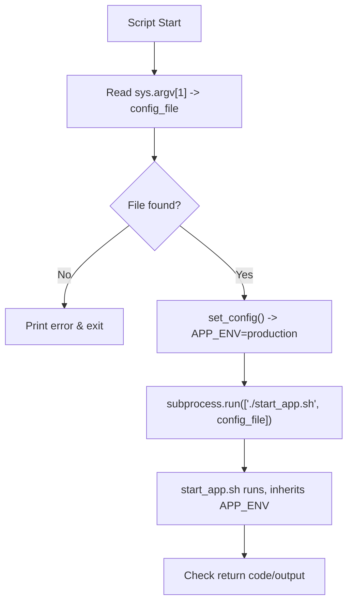

#### Key Takeaways
- Avoid **os.system()** for production scripts; prefer `subprocess.run()`.  
- Validate **command-line arguments** and handle missing files.  
- Leverage environment variables carefully, ensuring you track scope.  
- Provide robust error and **output** handling for reliability.  
- Minimizes confusion in **SRE** contexts when diagnosing script failures.

---

### Question 8: CSV Processing Improvements

> **Analyze the following CSV processing code. What improvements would you make?**

```python
import csv

def filter_users(csv_file, min_age):
    with open(csv_file, 'r') as f:
        reader = csv.reader(f)
        header = next(reader)
        
        age_index = header.index('age')
        result = []
        
        for row in reader:
            if int(row[age_index]) >= min_age:
                result.append(row)
    
    with open('filtered_users.csv', 'w') as f:
        writer = csv.writer(f)
        writer.writerow(header)
        writer.writerows(result)
```

#### Answer Overview
While this code **filters** users by a minimum age, it lacks **error handling**, uses a **hardcoded output file**, and **assumes** the CSV is always valid.

#### Detailed Answer
1. **No Exception Handling**  
   If the file is missing or the CSV lacks an `'age'` column, it crashes without meaningful messages.

2. **Hardcoded Output Filename**  
   Limits reuse since `'filtered_users.csv'` is fixed. Should allow specifying an output path or returning data in-memory.

3. **Limited Data Validation**  
   Casting `int(row[age_index])` might fail if the row’s field is empty or non-numeric.

4. **Encoding**  
   No specified encoding can lead to issues if the CSV has non-ASCII characters.

#### Example Usage:
```python
import csv
import logging
from typing import List

def filter_users(csv_file: str, min_age: int, output_file: str = 'filtered_users.csv') -> List[List[str]]:
    """
    Filters rows in a CSV by a minimum age requirement.
    Writes results to output_file and returns the filtered rows.
    """
    filtered_rows = []
    try:
        with open(csv_file, 'r', encoding='utf-8') as f:
            reader = csv.reader(f)
            header = next(reader)

            if 'age' not in header:
                raise ValueError("CSV must include 'age' column")

            age_index = header.index('age')
            filtered_rows.append(header)  # Keep the header

            for row in reader:
                try:
                    if int(row[age_index]) >= min_age:
                        filtered_rows.append(row)
                except ValueError:
                    logging.warning(f"Invalid age data in row: {row}")
    except FileNotFoundError:
        logging.error(f"File not found: {csv_file}")
        return []
    except Exception as e:
        logging.error(f"Error filtering CSV: {e}")
        return []

    # Write to output_file
    try:
        with open(output_file, 'w', newline='', encoding='utf-8') as f:
            writer = csv.writer(f)
            writer.writerows(filtered_rows)
    except Exception as e:
        logging.error(f"Failed to write to {output_file}: {e}")

    return filtered_rows

if __name__ == "__main__":
    users = filter_users("users.csv", 30, "adults_over_30.csv")
    print(f"Filtered {len(users) - 1} users (excluding header).")
```

#### Example Output
```
$ python filter_users.py
Filtered 42 users (excluding header).
```

#### Testing Approach
- **Test 1**: Valid CSV with "age" column → verifies correct filtering.  
- **Test 2**: Missing file → logs error and returns empty list.  
- **Test 3**: Rows with invalid "age" → logs warnings instead of crashing.

#### SRE Perspective
- Having robust data validation prevents partial or incorrect data from causing operational issues.  
- Logging ensures quick triage when CSV is malformed or missing columns.  
- Setting an **output file** or returning data in code fosters flexible automation.

#### Best Practices
- Check for **mandatory columns** and handle missing data.  
- Provide **error logs** and safe fallback returns (e.g., empty list).  
- Support **configurable** or parameterized file paths.  
- Validate **numeric fields** carefully.  
- **Log** or skip rows that fail numeric conversion.  
- Use **UTF-8** or recognized encoding for broad compatibility.

#### Common Pitfalls
| Pitfall                        | Issue                                                | Better Approach                                    |
|--------------------------------|------------------------------------------------------|----------------------------------------------------|
| Hardcoded output filename      | Limits script reusability                            | Make output file an argument or config option      |
| No checks on CSV structure     | Crashes if 'age' column missing                      | Validate presence of required columns              |
| Blind int casting              | Uncaught ValueError if 'age' field is empty or text  | Wrap parse in try-except, log or skip invalid rows |
| No logging                     | Silent failures or no context for troubleshooting    | Provide explicit logs for debugging                |

#### Advanced Considerations
- For large CSV files, consider **streaming** or chunked reads.  
- Potentially use **pandas** for advanced filtering and error handling.  
- Automate or integrate with scheduled tasks (e.g., Cron) for routine filtering.

#### Visual Explanation
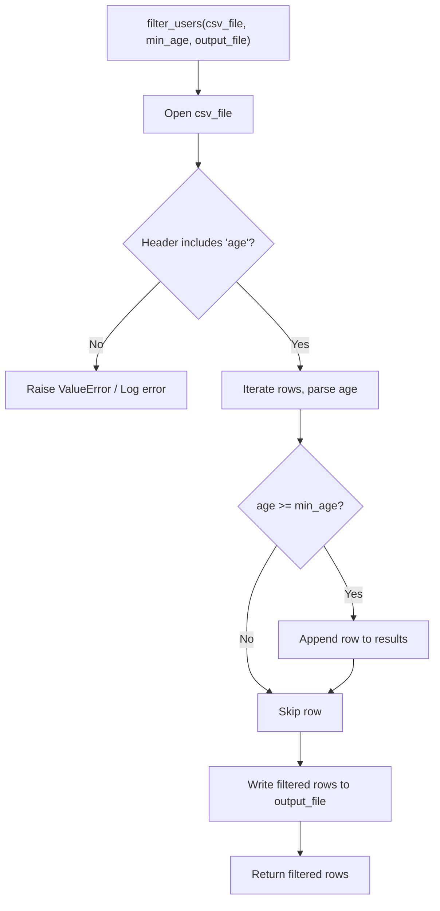

#### Key Takeaways
- Robust **validation** and **error handling** avoids data-processing crashes.  
- Parameterize input/output for **flexibility**.  
- Logging is essential for diagnosing CSV issues.  
- Consider advanced tools (pandas) for complex transformations.  
- Ensure **encoding** is specified and consistent.

---

## Coding Challenges (9–12)

---

### Question 9: Log Level Counter

> **Write a Python function that takes a log file path and returns a dictionary with counts of different log levels (INFO, WARNING, ERROR, etc.).**  
> (Hint: Must handle files that do not exist and properly close file resources.)

#### Answer Overview
This function will **read** a log file line by line, look for **standard log levels** like **INFO**, **WARNING**, and **ERROR**, and **count** their occurrences. It demonstrates how to **gracefully handle** missing files and produce a simple summary.

#### Detailed Answer
Many logs contain lines like `[INFO]`, `[WARNING]`, `[ERROR]`. By scanning each line and checking if it contains these markers (or exact strings), you can build a frequency count. This is helpful in quickly gauging the severity distribution of logs.

You must handle **FileNotFoundError** or other IO errors gracefully, logging or raising them as needed.

#### Example Usage:
```python
import os
import logging
from collections import defaultdict
from typing import Dict

def count_log_levels(log_file_path: str) -> Dict[str, int]:
    """
    Counts occurrences of typical log levels (INFO, WARNING, ERROR, DEBUG, CRITICAL).
    Returns a dictionary like {'INFO': x, 'WARNING': y, 'ERROR': z, ...}.
    """
    log_levels = {"INFO", "WARNING", "ERROR", "DEBUG", "CRITICAL"}
    counts = defaultdict(int)

    if not os.path.isfile(log_file_path):
        logging.error(f"File not found: {log_file_path}")
        raise FileNotFoundError(f"Log file not found: {log_file_path}")

    try:
        with open(log_file_path, 'r', encoding='utf-8') as f:
            for line in f:
                for level in log_levels:
                    # Basic substring check
                    if level in line:
                        counts[level] += 1
    except Exception as e:
        logging.error(f"Failed to read log file: {e}")
        raise

    return dict(counts)

if __name__ == "__main__":
    sample_counts = count_log_levels("system.log")
    print("Log level counts:", sample_counts)
```

#### Example Output
```
$ python log_level_counter.py
Log level counts: {'INFO': 14, 'WARNING': 2, 'ERROR': 1, 'DEBUG': 5, 'CRITICAL': 0}
```

#### Testing Approach
- **Test 1**: Provide a log with known log level lines → verify correct counts.  
- **Test 2**: Missing or inaccessible file → triggers `FileNotFoundError`.  
- **Test 3**: Mixed or unusual lines → ensure the script only increments counters when recognized strings appear.

#### SRE Perspective
- Facilitates **quick analysis** of logs to see how often errors or warnings occur, reducing time spent searching manually.  
- Can be integrated into **alerting** or summarizing daily logs in large environments.

#### Best Practices
- Check for **file existence** before attempting to read.  
- Consider **case sensitivity** if logs might differ in uppercase vs. lowercase.  
- Use **regex** with word boundaries if needed to avoid partial matches.  
- Always **log** or handle IO exceptions.  
- Return a dictionary for **flexibility** in further processing.  
- Keep the function short and self-contained.

#### Common Pitfalls
| Pitfall                            | Issue                                          | Better Approach                          |
|------------------------------------|------------------------------------------------|------------------------------------------|
| Unchecked file path                | Script crashes if file is missing             | Check `os.path.isfile` or wrap in try-except |
| Partial substring matches          | "DEBUGGER" might increment "DEBUG" count       | Use explicit delimiters or regex boundaries |
| No logging on read errors          | Makes diagnosing failures harder               | Log exceptions for quick debugging       |
| Hardcoded log levels               | Misses custom levels (e.g., "TRACE")           | Provide a configurable set or fallback approach |

#### Advanced Considerations
- If logs are huge, consider a **streaming** or **line-buffered** approach with further optimizations.  
- Potentially expand to parse timestamps or host info for deeper analysis.  
- Could feed results into a **monitoring** pipeline for real-time metrics.

#### Visual Explanation
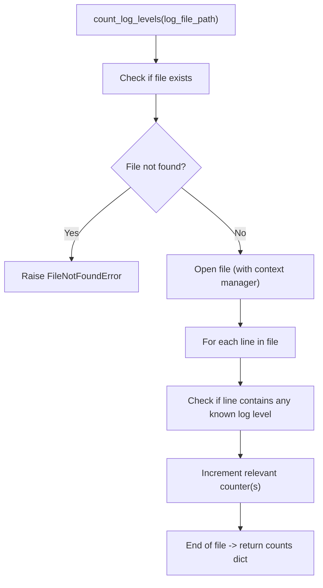

#### Key Takeaways
- Substring-based log level detection is **simple** yet effective for quick counts.  
- Must handle **file errors** gracefully.  
- This is a **handy** utility in SRE contexts for daily or on-demand log scanning.  
- For advanced patterns, consider **regex** or structured logs.  
- Output data as a dictionary for flexible usage downstream.

---

### Question 10: Safely Updating JSON Configuration

> **Create a script that safely updates a JSON configuration file with new values.**  
> (Hint: It should preserve existing configuration, update only specified fields, and handle **file locking** to prevent race conditions.)

#### Answer Overview
Configuration files must be **atomically** updated to avoid corruption. Using JSON plus an **exclusive file lock** ensures that multiple processes don’t simultaneously write conflicting updates.

#### Detailed Answer
1. **Read Existing JSON**  
   Load the current config into a Python dictionary. If the JSON is empty or malformed, start with an empty dict or handle errors.

2. **Acquire File Lock**  
   Use something like **fcntl.flock** on Unix systems (or `portalocker` for cross-platform) to ensure only one process writes at a time.

3. **Update Fields**  
   Merge or overwrite the keys you want to modify, leaving other keys intact.

4. **Write & Unlock**  
   Truncate the file, write the updated dict as valid JSON, and release the lock.

#### Example Usage:
```python
import json
import fcntl
import logging
from typing import Dict

def update_json_config(config_path: str, updates: Dict[str, any]) -> None:
    """
    Safely updates a JSON config file with new key-value pairs.
    Prevents race conditions via file locking.
    """
    logging.info(f"Updating JSON config at {config_path} with {updates}")

    with open(config_path, 'r+') as f:
        # Acquire exclusive lock
        fcntl.flock(f, fcntl.LOCK_EX)

        try:
            # Load existing config or start blank
            try:
                config_data = json.load(f)
            except json.JSONDecodeError:
                logging.warning("JSON file empty or invalid, starting with an empty config.")
                config_data = {}

            # Apply updates
            for k, v in updates.items():
                config_data[k] = v

            # Rewind and truncate file before re-writing
            f.seek(0)
            f.truncate()
            json.dump(config_data, f, indent=2)

        except Exception as e:
            logging.error(f"Failed to update config: {e}")
            raise
        finally:
            # Release lock
            fcntl.flock(f, fcntl.LOCK_UN)

if __name__ == "__main__":
    example_updates = {"feature_enabled": True, "timeout": 30}
    update_json_config("app_config.json", example_updates)
    print("Configuration updated successfully.")
```

#### Example Output
```
$ python update_config.py
INFO:root:Updating JSON config at app_config.json with {'feature_enabled': True, 'timeout': 30}
Configuration updated successfully.
```

#### Testing Approach
- **Test 1**: Valid JSON file with existing keys → new keys or values are appended without losing existing data.  
- **Test 2**: Empty or invalid JSON → script logs a warning, starts fresh.  
- **Test 3**: Concurrent updates from two processes → second waits for the first lock to release, no corruption.

#### SRE Perspective
- Atomic config updates prevent partial writes that could break a service.  
- Locking is **critical** when multiple automation scripts or CI jobs update the same file.  
- Detailed logs ensure quick auditing if config changes cause unexpected behavior.

#### Best Practices
- Always **validate** that JSON is well-formed.  
- Implement **locking** for multi-process concurrency.  
- Retain **backups** or versioning for rollback.  
- Keep changes **minimal**, updating only required keys.  
- **Log** all config changes with context.  
- Use a dedicated **central config service** for large-scale environments.

#### Common Pitfalls
| Pitfall                     | Issue                                        | Better Approach                                  |
|-----------------------------|----------------------------------------------|--------------------------------------------------|
| No locking on config writes | Race conditions cause file corruption       | Use fcntl, portalocker, or other locking method  |
| Overwriting entire file blindly | Loses unrelated settings if partial updates needed | Merge changes into existing dictionary          |
| Not checking for JSON errors | Script crashes on invalid JSON             | Wrap in try-except, fallback to empty dict       |
| Not logging changes         | Hard to audit or debug config modifications | Log updates with relevant info (keys changed)    |

#### Advanced Considerations
- For extremely large config files, consider partial updates or a **database** approach.  
- Use **Git** or **S3 versioning** for config backups.  
- Consider **encryption** for sensitive configs (keys, credentials).

#### Visual Explanation
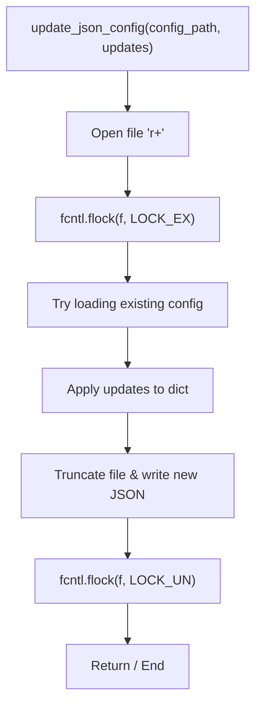

#### Key Takeaways
- File locking is crucial for **safe** multi-process config updates.  
- Merging new data into existing JSON preserves **other keys**.  
- Provide **clear logs** to track changes.  
- For large-scale or distributed settings, a **config service** might be more robust.

---

### Question 11: Command-Line Argument Parsing

> **Implement a function that parses command-line arguments for a script that processes log files.**  
> (Hint: Should accept **input file**, **output file**, **log level filter**, **date range**, etc.)

#### Answer Overview
**Argparse** in Python standardizes how you define and parse command-line arguments. This ensures users have consistent usage instructions and error messages, making scripts easier to handle in **SRE** environments.

#### Detailed Answer
1. **Define Parser**  
   Create an `ArgumentParser` with a descriptive help message.  
2. **Add Arguments**  
   For example, `--input` (required), `--output`, `--level`, `--start-date`, `--end-date`.  
3. **Validation**  
   Validate date formats or presence of required arguments.  
4. **Return Structured Results**  
   Return `args` so the main script can use them.

#### Example Usage:
```python
import argparse
import sys
import datetime
import logging

def parse_args(argv=None):
    """
    Parses command-line arguments for a log processing script.
    """
    parser = argparse.ArgumentParser(
        description="Process log files with optional filtering by level and date range."
    )

    parser.add_argument("--input", "-i", required=True, help="Path to the input log file.")
    parser.add_argument("--output", "-o", required=True, help="Path to the output file for results.")
    parser.add_argument("--level", "-l", default="INFO", help="Log level to filter (INFO, WARNING, ERROR, etc.).")
    parser.add_argument("--start-date", "-s", help="Start date in YYYY-MM-DD format.")
    parser.add_argument("--end-date", "-e", help="End date in YYYY-MM-DD format.")

    args = parser.parse_args(argv)

    # Example date validation
    for date_arg in ("start_date", "end_date"):
        date_value = getattr(args, date_arg)
        if date_value:
            try:
                datetime.datetime.strptime(date_value, "%Y-%m-%d")
            except ValueError:
                logging.error(f"Invalid format for --{date_arg.replace('_','-')}. Use YYYY-MM-DD.")
                sys.exit(1)

    return args

if __name__ == "__main__":
    cmd_args = parse_args()
    print(f"Parsed arguments: {cmd_args}")
```

#### Example Output
```
$ python log_processor.py --input server.log --output result.log --level ERROR --start-date 2023-01-01 --end-date 2023-01-31
Parsed arguments: Namespace(input='server.log', output='result.log', level='ERROR', start_date='2023-01-01', end_date='2023-01-31')
```

#### Testing Approach
- **Test 1**: Required args provided → script prints parsed Namespace.  
- **Test 2**: Missing required arg (e.g., `--input`) → parser shows usage error and exits.  
- **Test 3**: Invalid date format → logs error and exits gracefully.

#### SRE Perspective
- Standardizes usage across the team, reducing confusion.  
- Self-documenting `--help` fosters clarity and **reliability**.  
- Minimizes user mistakes, improving **incident response** speed.

#### Best Practices
- Always define **help text** for each arg.  
- Mark **essential** arguments as `required=True`.  
- Validate **types** (integers, dates) to catch errors early.  
- Use `argparse` in a **separate function** for clarity.  
- Provide **meaningful** script descriptions.  
- For advanced usage, consider subcommands (like `git` usage).

#### Common Pitfalls
| Pitfall                    | Issue                                           | Better Approach                                |
|----------------------------|-------------------------------------------------|------------------------------------------------|
| Not marking required args  | Parser won't enforce user input, causing errors | Use `required=True` for mandatory parameters   |
| Overly vague help messages | Users must guess usage                          | Provide thorough descriptions for each argument |
| No data-type validation    | Script fails later in execution                 | Validate within parse_args or further checks    |
| All logic inside main()    | Harder to test in isolation                     | Keep parse_args in a separate function         |

#### Advanced Considerations
- Use **click** or **Typer** for more modern, user-friendly CLI experiences.  
- Add **mutually exclusive groups** or subparsers if the script has multiple modes.

#### Visual Explanation
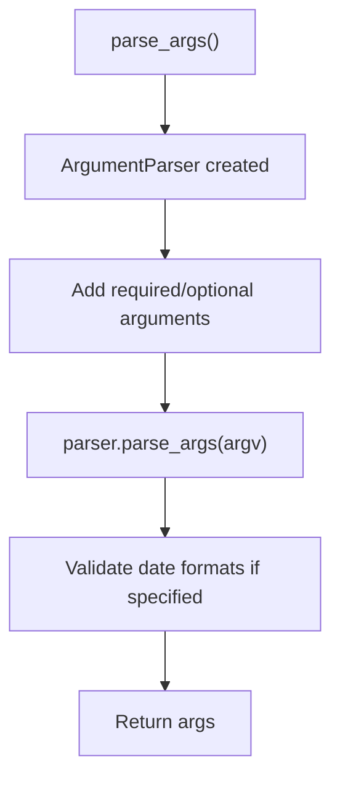

#### Key Takeaways
- **Argparse** standardizes CLI usage, making scripts more user-friendly.  
- Provide helpful **descriptions** and **usage** examples.  
- Validate data types or values early.  
- Keep argument parsing logic **modular** for maintainability.  
- Clear usage fosters consistency in **SRE** automations.

---

### Question 12: Directory Monitoring

> **Write a script to monitor a directory for new files and process them when they appear.**  
> (Hint: Consider **watchdog** for file system events, handle errors, and skip duplicates.)

#### Answer Overview
Monitoring directories for new files can automate tasks like **log ingestion**, **backup triggers**, or **processing pipelines**. The **watchdog** library in Python helps track file creations, modifications, or deletions in real time.

#### Detailed Answer
1. **Watchdog Observers**  
   An `Observer` runs in the background, sending events to a handler class whenever a file changes.

2. **FileSystemEventHandler**  
   The custom handler `on_created` checks if a new file is not yet processed, then initiates logic to parse or move that file.

3. **Processed Files Tracking**  
   Use a set to store file paths you have already processed. This avoids repeated or redundant processing.

4. **Error Handling & Logging**  
   Surround critical operations with try-except, log failures for troubleshooting.

#### Example Usage:
```python
import time
import logging
import os
from watchdog.observers import Observer
from watchdog.events import FileSystemEventHandler

class NewFileHandler(FileSystemEventHandler):
    def __init__(self, processed_files):
        self.processed_files = processed_files

    def on_created(self, event):
        if not event.is_directory:
            file_path = event.src_path
            if file_path not in self.processed_files:
                self.processed_files.add(file_path)
                self.process_file(file_path)

    def process_file(self, file_path):
        try:
            logging.info(f"Processing new file: {file_path}")
            # Placeholder for actual processing (parsing, copying, etc.)
        except Exception as e:
            logging.error(f"Error processing file {file_path}: {e}")

def monitor_directory(directory):
    """
    Monitors a given directory for newly created files.
    """
    processed_files = set()
    handler = NewFileHandler(processed_files)
    observer = Observer()
    observer.schedule(handler, path=directory, recursive=False)
    observer.start()

    logging.info(f"Monitoring directory: {directory}")
    try:
        while True:
            time.sleep(1)  # Keep the script running
    except KeyboardInterrupt:
        observer.stop()
    observer.join()

if __name__ == "__main__":
    logging.basicConfig(level=logging.INFO)
    watch_dir = "incoming_data"
    if not os.path.exists(watch_dir):
        os.makedirs(watch_dir)
    monitor_directory(watch_dir)
```

#### Example Output
```
$ python monitor_files.py
INFO:root:Monitoring directory: incoming_data
INFO:root:Processing new file: incoming_data/data_20230411.csv
```

#### Testing Approach
- **Test 1**: Create a new file in `incoming_data` → log messages show detection and processing.  
- **Test 2**: Attempt adding a file with the same name → the script should skip or log that it’s already processed.  
- **Test 3**: Generate an exception in `process_file` (e.g., read a locked file) → ensure errors are logged.

#### SRE Perspective
- Automates **data ingestion** or triggers routines without manual intervention.  
- Reduces manual checks for new files, cutting down on **toil**.  
- Detailed logs help diagnose if certain files fail to process.

#### Best Practices
- Use **try-except** around critical ops to avoid silent failures.  
- **Log** all relevant events (detection, processing, failures).  
- Maintain a **persistent** record if files must not be reprocessed after script restarts.  
- For large directories, consider specifying `recursive=False` or filtering on file types.  
- Always handle **interrupt signals** gracefully (e.g., `KeyboardInterrupt`).  
- Monitor performance for extremely **high event** rates.

#### Common Pitfalls
| Pitfall                        | Issue                                            | Better Approach                                    |
|--------------------------------|--------------------------------------------------|----------------------------------------------------|
| No tracking of processed files | Could reprocess the same file repeatedly         | Maintain a set or DB record to track done files    |
| Running script in ephemeral environment | Loses state on restart                         | Use persistent or external store if required       |
| Not handling errors in process_file | Failures remain silent or partial             | Wrap in try-except, log or re-try if feasible      |
| Excessive overhead on large directories | watch events may be frequent, causing slowdowns | Optimize or use more advanced watchers with filters |

#### Advanced Considerations
- **Recursive** monitoring if subdirectories matter.  
- Using a **thread pool** to process files concurrently.  
- Integrating with an external **message queue** or orchestrator for large-scale pipelines.

#### Visual Explanation
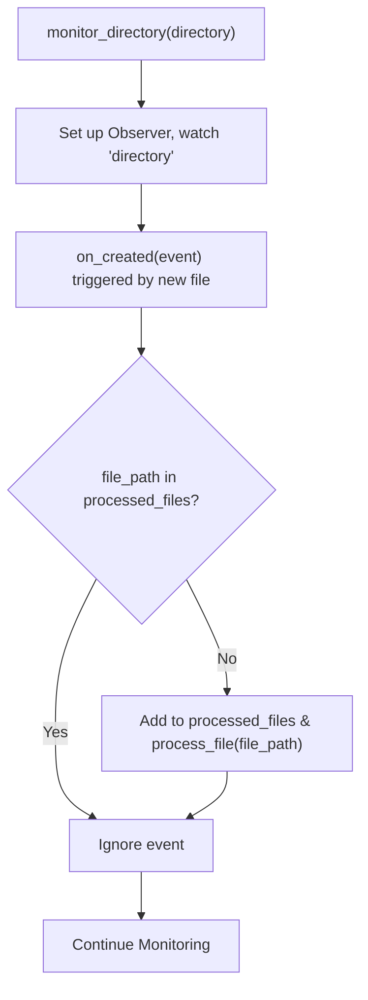

#### Key Takeaways
- **Watchdog** simplifies real-time file system event handling.  
- Track processed files to avoid duplicate handling.  
- Logging is vital for diagnosing missing or failed file processes.  
- Saves **manual effort** checking for new files.  
- For large or complex flows, consider queue-based or containerized solutions.

---

## Application Questions (13–15)

---

### Question 13: Multi-Server Metrics Collection

> **As an SRE, you need to create a script that collects system metrics (CPU, memory, etc.) from multiple servers. What approach would you take?**  
> (Hint: Discuss **authentication**, **data collection**, **error handling**, and **output formatting**.)

#### Answer Overview
Collecting **system metrics** across multiple servers often involves **SSH-based** connections, parallel or batched queries, robust **error handling**, and returning data in a **common format** like JSON for easy ingestion.

#### Detailed Answer
1. **Server Inventory**  
   A list or config file enumerating hostnames, credentials, SSH keys, and relevant ports for each server.

2. **Secure Authentication**  
   Prefer **key-based** SSH auth. If using passwords, store them in a **secrets manager** or environment variables.

3. **Parallel Data Collection**  
   Use threads or asynchronous calls to gather metrics quickly at scale. Tools like Python’s `ThreadPoolExecutor` can help.

4. **Error Handling & Logging**  
   Network issues, timeouts, or authentication failures must be caught. Log them for incident response.

5. **Output Formatting**  
   Return data in **JSON** or **CSV**, adding timestamps or server tags for correlation.

#### Example Usage:
```python
import paramiko
import json
import logging
import concurrent.futures

logging.basicConfig(level=logging.INFO)

def get_metrics(server_info):
    """
    Connects to the server via SSH, runs commands to fetch CPU and memory usage.
    Returns a dictionary of results or an error message on failure.
    """
    hostname = server_info["hostname"]
    username = server_info["username"]
    key_path = server_info["key_path"]
    metrics = {"server": hostname}
    try:
        ssh = paramiko.SSHClient()
        ssh.set_missing_host_key_policy(paramiko.AutoAddPolicy())
        ssh.connect(hostname, username=username, key_filename=key_path, timeout=10)

        # Example CPU usage
        stdin, stdout, stderr = ssh.exec_command("top -bn1 | grep '%Cpu' | awk '{print $2 + $4}'")
        metrics["cpu_percent"] = stdout.read().decode().strip()

        # Example memory usage
        stdin, stdout, stderr = ssh.exec_command("free -m | awk '/Mem:/ {print ($3/$2)*100.0}'")
        metrics["mem_percent"] = stdout.read().decode().strip()

        ssh.close()
    except Exception as e:
        logging.error(f"Error retrieving metrics from {hostname}: {e}")
        metrics["error"] = str(e)

    return metrics

def collect_all_metrics(servers, output_file="metrics.json"):
    """
    Collects metrics from a list of server dictionaries and writes them to a JSON file.
    """
    all_metrics = []
    with concurrent.futures.ThreadPoolExecutor(max_workers=5) as executor:
        future_to_server = {executor.submit(get_metrics, s): s for s in servers}
        for future in concurrent.futures.as_completed(future_to_server):
            all_metrics.append(future.result())

    # Write results to JSON
    with open(output_file, 'w') as f:
        json.dump(all_metrics, f, indent=2)

    logging.info(f"Metrics written to {output_file}")

if __name__ == "__main__":
    servers_info = [
        {"hostname": "server1.example.com", "username": "admin", "key_path": "~/.ssh/id_rsa"},
        {"hostname": "server2.example.com", "username": "admin", "key_path": "~/.ssh/id_rsa"}
    ]
    collect_all_metrics(servers_info)
```

#### Example Output
```
$ python collect_metrics.py
INFO:root:Metrics written to metrics.json
```
Contents of `metrics.json` might look like:
```json
[
  {
    "server": "server1.example.com",
    "cpu_percent": "3.5",
    "mem_percent": "45.2"
  },
  {
    "server": "server2.example.com",
    "cpu_percent": "7.1",
    "mem_percent": "70.8"
  }
]
```

#### Testing Approach
- **Test 1**: Valid SSH access → script should fetch CPU/mem from each server.  
- **Test 2**: One server offline → logs error but continues to gather from others.  
- **Test 3**: Large server list → ensures parallel approach handles scale efficiently.

#### SRE Perspective
- Facilitates consistent **metrics gathering** across diverse infrastructure.  
- Reduces manual overhead of logging in to each server.  
- The resulting data can feed into a **monitoring** or **alerting** pipeline.

#### Best Practices
- Use a **thread pool** or **async** approach for concurrency.  
- Thoroughly **log** successes and failures.  
- Keep credentials or SSH keys in a **secure store** with minimal permissions.  
- Validate **command results** for anomalies.  
- Use **structured** output (JSON, CSV) for easy integration.  
- Provide **timeouts** to avoid hanging.

#### Common Pitfalls
| Pitfall                              | Issue                                                     | Better Approach                                      |
|--------------------------------------|-----------------------------------------------------------|------------------------------------------------------|
| Storing private keys in code         | Security risk if code is shared or leaked                 | Use external secrets manager or environment variable |
| Single-threaded loop for many servers | Very slow for large fleets                                | ThreadPoolExecutor or async approach                |
| No error handling on SSH connections | Script crashes if a server is unreachable                | Catch exceptions, log errors, continue others        |
| Returning raw strings for metrics    | Harder to parse numerically in subsequent steps           | Convert to float and standardize units if needed     |

#### Advanced Considerations
- Integrate with **Prometheus** or use custom collectors.  
- Cache or batch commands to reduce overhead on each server.  
- For huge fleets, consider agent-based or push/pull architecture with a dedicated telemetry system.

#### Visual Explanation
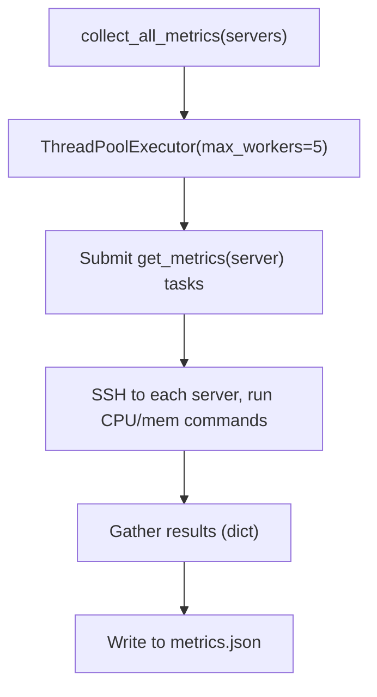

#### Key Takeaways
- **Parallel** metric collection is crucial at scale.  
- **Robust** error handling & logging ensures partial failures don’t block entire runs.  
- Output in **JSON** or CSV for flexible consumption.  
- Keep SSH keys **secure** and handle connection timeouts.  
- Simplifies repeated or scheduled data-gathering tasks in an SRE environment.

---

### Question 14: Safe Multi-Environment Deployment

> **You need to automate the deployment of a configuration file to multiple environments (dev, staging, prod). How would you design a script to do this safely?**  
> (Hint: Address **environment-specific** configs, **validation**, **rollback**.)

#### Answer Overview
A **deployment script** for multiple environments must handle **env-specific** details, verify correctness, perform the **deployment** steps, and roll back if something fails. Logging is crucial for **traceability**.

#### Detailed Answer
1. **Environment Abstraction**  
   Keep separate or templated config files for dev, staging, and prod. Alternatively, a single file with environment keys.

2. **Validation**  
   Check the config for syntax correctness (JSON/YAML) and environment-specific constraints.

3. **Deployment Steps**  
   1. Backup the existing config (local or remote).  
   2. Upload or apply new config.  
   3. Possibly restart or reload services.  
   4. Validate the environment after deployment.

4. **Rollback Mechanism**  
   If the new config fails a **health check** or leads to errors, restore the backup and revert the environment to its previous state.

5. **Logging & Monitoring**  
   Record each step in logs for auditing. Automate or script a simple health check to confirm the environment is stable.

#### Example Usage:
```python
import os
import shutil
import logging

def deploy_config(env, config_path, remote_server):
    """
    Deploys a config file to a specific environment with rollback capability.
    """
    logging.info(f"Deploying {config_path} to {env} on {remote_server}")
    backup_path = config_path + ".bak"

    try:
        # Backup current file if it exists
        if os.path.exists(config_path):
            shutil.copy2(config_path, backup_path)

        # Validate new config
        if not validate_config(config_path):
            raise ValueError("New config is invalid")

        # Upload the file (placeholder for scp/rsync/SSH logic)
        logging.info(f"Uploading {config_path} to {remote_server}")
        upload_file(config_path, remote_server)

        # Health check
        if not health_check(remote_server):
            raise RuntimeError("Health check failed post-deployment")

        logging.info(f"Deployment to {env} successful.")
    except Exception as e:
        logging.error(f"Deployment failed for {env}: {e}")
        # Rollback
        if os.path.exists(backup_path):
            logging.info("Rolling back to previous config.")
            shutil.move(backup_path, config_path)
            rollback_remote_config(backup_path, remote_server)
        raise

def validate_config(config_path):
    # Simplistic placeholder check
    return os.path.getsize(config_path) > 0

def upload_file(config_path, remote_server):
    pass  # Implementation detail depends on environment

def health_check(remote_server):
    # Example: Attempt a quick check or service status
    return True

def rollback_remote_config(backup_path, remote_server):
    pass  # Implementation detail depends on environment

if __name__ == "__main__":
    deploy_config("DEV", "dev_config.yml", "dev.example.com")
```

#### Example Output
```
$ python deploy_configs.py
INFO:root:Deploying dev_config.yml to DEV on dev.example.com
INFO:root:Uploading dev_config.yml to dev.example.com
INFO:root:Deployment to DEV successful.
```

#### Testing Approach
- **Test 1**: Valid dev config → see a successful upload, no rollback triggered.  
- **Test 2**: Invalid config → script logs an error and triggers rollback.  
- **Test 3**: Health check fails intentionally → old config is restored.

#### SRE Perspective
- Minimizes production risk by ensuring **safe** and **reversible** deployments.  
- Aligns with SRE principles of **reducing toil** and controlling change risk.  
- **Logging** each step supports incident reviews if something goes wrong.

#### Best Practices
- Maintain **separate** configs or param-driven templates for each environment.  
- **Validate** configs thoroughly before pushing them.  
- Always create **backups** or version control for rollback.  
- Include **health checks** post-deployment.  
- **Log** every step with enough detail for auditing.  
- Automate or script the entire pipeline for consistent deployments.

#### Common Pitfalls
| Pitfall                                  | Issue                                                | Better Approach                              |
|------------------------------------------|------------------------------------------------------|----------------------------------------------|
| Deploying directly to production first   | High risk of downtime or errors in real environment | Test in dev/staging, then roll forward       |
| No backups or rollbacks                  | Environment is stuck if config breaks service       | Always keep a backup or use version control  |
| No health checks                         | Deployment might be “successful” but service is broken | Implement quick or robust service verifications |
| Monolithic config for all envs           | Risk overwriting environment-specific settings       | Parameterize or keep separate environment files |

#### Advanced Considerations
- Implement **blue-green** or **canary** deployment strategies for zero downtime.  
- Integrate with a **CI/CD** pipeline that automatically runs tests.  
- Store config files in **Git** for versioning and quick rollback.

#### Visual Explanation
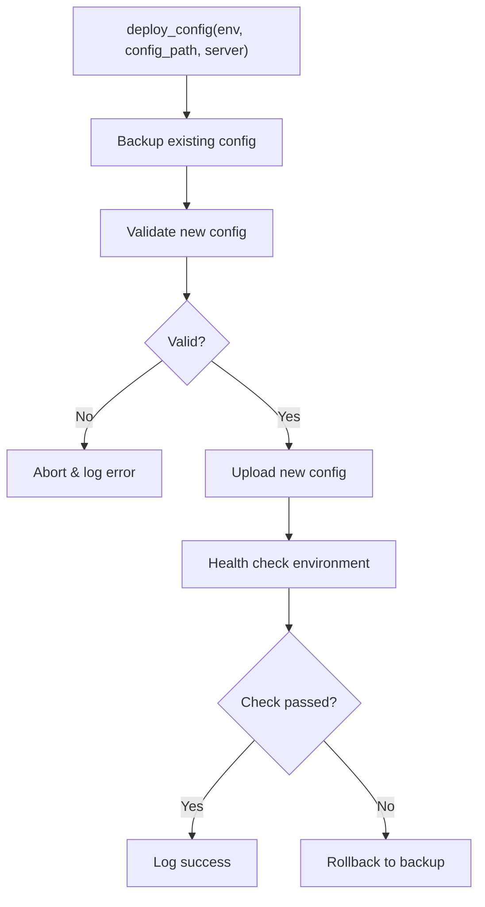

#### Key Takeaways
- **Automation** for multi-env deployments ensures consistency.  
- Always have a **rollback** plan in production.  
- Config **validation** and **health checks** are crucial.  
- Detailed **logging** helps track changes and debug issues.  
- Minimizes **risk** of downtime or misconfiguration across dev, staging, prod.

---

### Question 15: API Key/Credential Rotation

> **Describe how you would create a script to automate the rotation of API keys or credentials.**  
> (Hint: Address **security considerations**, **error handling**, and **ensuring continuity** of service.)

#### Answer Overview
Automating **credential rotation** means generating new keys, updating them in the relevant services, verifying their **functionality**, and **revoking** old keys only after success. This prevents downtime while improving security posture.

#### Detailed Answer
1. **Generate a New Key**  
   Use an API or secrets manager to create or request a new credential. Ensure it’s stored securely (e.g., vault or environment variable).

2. **Deploy New Credential**  
   Update relevant config files, environment variables, or secret stores so the application can accept the new key.

3. **Validation**  
   Perform an action (API call, service request) that only the new key can do. If it fails, revert to the old key.

4. **Revoke Old Key**  
   After confirming success, **revoke** or disable the old key to remove its privileges.

5. **Logging & Audit**  
   Record every step and key usage timeline to meet compliance or security auditing needs.

#### Example Usage:
```python
import logging

def rotate_api_key(service_name, key_manager):
    """
    Rotates an API key for a given service by generating a new key,
    validating it, and revoking the old key upon success.
    """
    logging.info(f"Starting API key rotation for {service_name}")

    old_key = key_manager.get_current_key(service_name)
    new_key = key_manager.generate_new_key(service_name)

    # Deploy new key
    deploy_key(service_name, new_key)

    # Validate
    if not validate_service_access(service_name, new_key):
        logging.error("New key validation failed. Reverting to old key.")
        rollback_key(service_name, old_key)
        return False

    # Revoke old key
    key_manager.revoke_key(service_name, old_key)
    logging.info(f"Successfully rotated API key for {service_name}")
    return True

def deploy_key(service_name, new_key):
    # Implementation depends on environment
    pass

def validate_service_access(service_name, key):
    # Example check: attempt an API call
    return True

def rollback_key(service_name, old_key):
    # Reinstall old key or revert config
    pass

if __name__ == "__main__":
    logging.basicConfig(level=logging.INFO)
    print("API key rotation script would run here.")
```

#### Example Output
```
$ python rotate_key.py
INFO:root:Starting API key rotation for PaymentService
INFO:root:Successfully rotated API key for PaymentService
```

#### Testing Approach
- **Test 1**: Normal scenario → new key is generated, validated, old key revoked.  
- **Test 2**: Validation fails → script should log an error and revert to the old key.  
- **Test 3**: Key manager or environment errors → confirm the script logs or raises an exception.

#### SRE Perspective
- Regular key rotations reduce the window of exposure if keys leak.  
- Minimizes manual processes, consistent with SRE’s mission to reduce **toil**.  
- Detailed logs help with **compliance audits** and quick rollback if service interruptions occur.

#### Best Practices
- Store keys in a **secrets manager** rather than code or open text.  
- **Automate** rotation on a schedule or event-based trigger.  
- Validate new credentials thoroughly (API calls or service checks).  
- Keep **backups** or reversion paths if the new key fails.  
- Log **every** rotation step with timestamps.  
- Possibly accept **both old and new** keys for a short overlap, ensuring zero downtime.

#### Common Pitfalls
| Pitfall                                      | Issue                                       | Better Approach                                 |
|----------------------------------------------|---------------------------------------------|-------------------------------------------------|
| Revoking old key before validation           | Potential downtime if new key fails         | Validate new key first, then revoke            |
| Hardcoding new key in code or logs           | Security breach risk if logs are accessible | Use environment variables or secrets manager    |
| No logs of key changes                       | Hard to audit usage or investigate incidents | Always record rotation events and outcomes      |
| Single-step approach (generate → revoke)     | If new key breaks, no fallback              | Provide rollback logic or short overlap period  |

#### Advanced Considerations
- Integration with **HSM** (Hardware Security Module) or advanced cryptographic workflows.  
- Implementing **just-in-time** credentials or ephemeral tokens.  
- Large-scale orchestrations for **dozens** or **hundreds** of services.

#### Visual Explanation
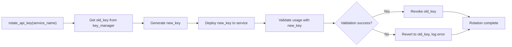

#### Key Takeaways
- **Automated** credential rotation improves security posture.  
- Validate new keys before disabling old ones to avoid downtime.  
- **Detailed logs** are crucial for auditing and troubleshooting.  
- Overlapping old/new keys can provide a **seamless** transition.  
- Minimizes **manual processes**, aligning with SRE best practices.

---

## Glossary (15 Terms)

Below are 15 key **technical terms** used throughout this document, each briefly defined:

1. **SRE (Site Reliability Engineering)**: A discipline applying software engineering to IT operations, focusing on reliability, automation, and reducing toil.  
2. **Toil**: Repetitive, manual operational work that scales linearly with service growth, which SREs aim to reduce through automation.  
3. **Context Manager**: A Python construct (`with` statement) that manages resource setup and cleanup automatically.  
4. **Exception Handling**: Mechanisms (try-except, try-finally) to respond to errors and prevent program crashes.  
5. **Secrets Manager**: A tool or service (e.g., HashiCorp Vault) that securely stores and rotates credentials.  
6. **JSON**: A lightweight data format (JavaScript Object Notation) commonly used for configuration and data exchange.  
7. **File Locking**: A strategy (e.g., fcntl on Unix) to prevent simultaneous writes to a file, avoiding data corruption.  
8. **Monitoring & Alerting**: The process of collecting metrics (CPU, memory, etc.) and generating real-time alerts when thresholds are exceeded.  
9. **CI/CD (Continuous Integration/Continuous Deployment)**: A practice of automating building, testing, and deploying code changes in a pipeline.  
10. **ThreadPoolExecutor**: A Python class that manages a pool of worker threads to run callables concurrently.  
11. **Argparse**: A Python module that provides a standard way to parse command-line arguments.  
12. **Regex (Regular Expression)**: A pattern syntax for matching and manipulating text.  
13. **SSH**: Secure Shell, a protocol for secure remote login and command execution.  
14. **Canary Deployment**: A strategy of rolling out changes to a small subset of users or servers before a full rollout.  
15. **Health Check**: A test (script, API call, or other check) verifying that a system or service is functioning properly.

---

## Conclusion

In this **SRE Scripting Documentation**, we have:

1. **Explored** key concepts like **error handling**, **credentials security**, **context managers**, and **shell execution** patterns.  
2. **Analyzed** code snippets for log file processing, CSV handling, and directory monitoring, highlighting best practices for **robustness**.  
3. **Solved** coding challenges focusing on topics such as log-level counting, JSON config updates, argument parsing, and real-time directory watchers.  
4. **Applied** advanced SRE scenarios like multi-server metrics collection, safe multi-environment deployments, and automated key rotation.

By **following** the detailed instructions, examples, and best practices laid out here, you can confidently create and maintain scripts that exhibit **high reliability**, **security**, and **maintainability**—all core values of **Site Reliability Engineering**.