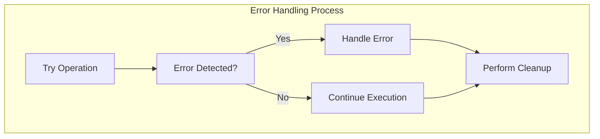
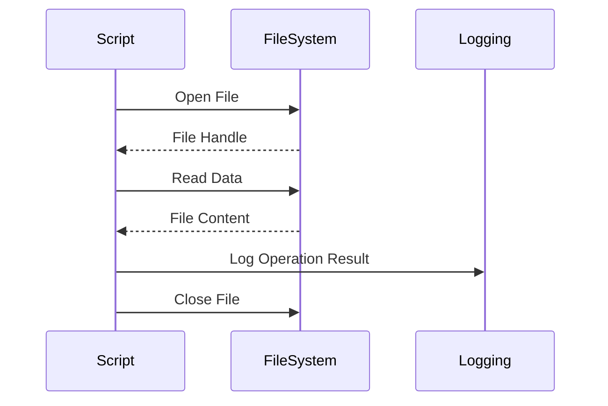
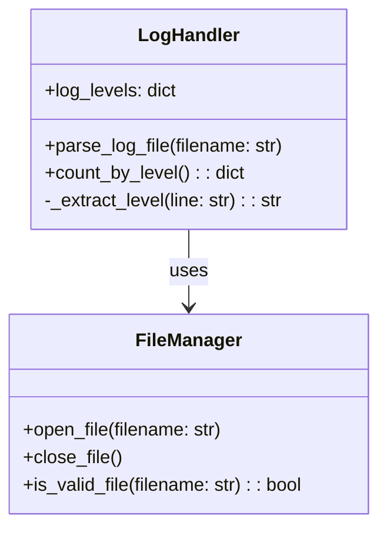
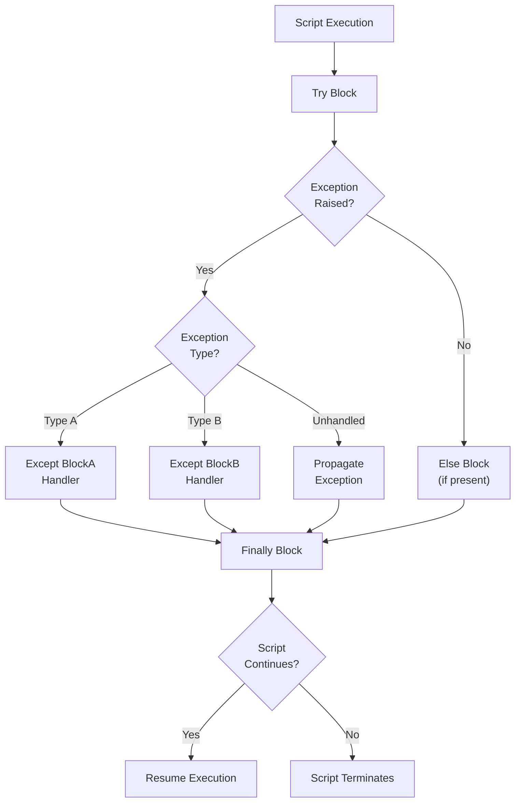
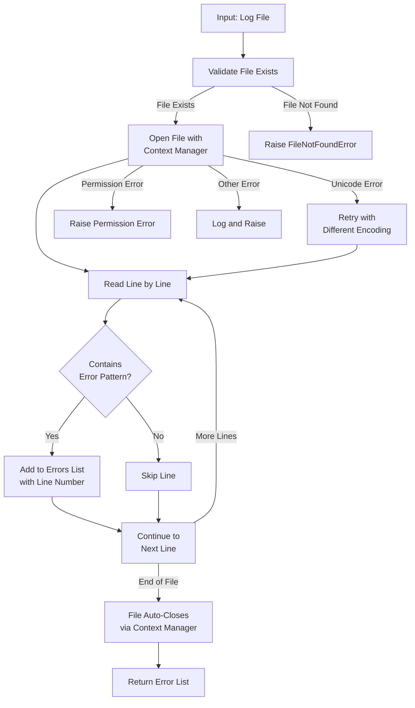
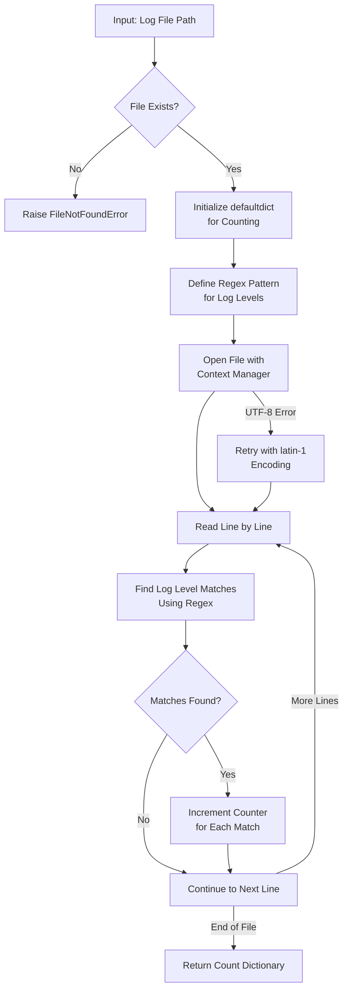
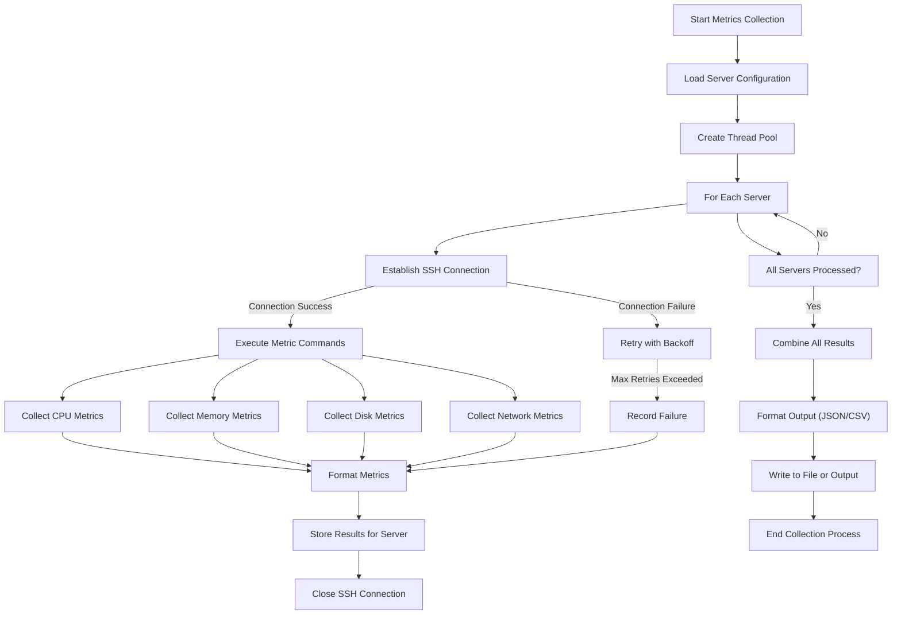

# 🔑 SRE Scripting Training Module - Answer Sheet Generator

## 🧑‍🏫 Role
You are an expert scripting instructor creating a comprehensive answer sheet for the provided scripting quiz questions, with Python as the primary focus. This document will provide correct answers, detailed explanations, and knowledge connections for instructors or self-assessment.

## 🎯 Objective
Review the provided quiz questions and create a detailed answer sheet that:
- Provides thorough model answers for each quiz question
- Explains key concepts and best practices relevant to each question
- Includes code examples with proper annotations and explanations
- Connects answers to fundamental scripting principles
- Highlights SRE-specific applications and considerations
- Offers alternative approaches where relevant
- Includes Python and Bash comparisons where applicable
- Maintains consistent formatting throughout
- Provides visual aids (flowcharts, diagrams) for complex concepts

## 📝 Answer Sheet Structure Requirements

For each quiz question in the provided document, provide:

1. **Question Number and Section:** Repeat the question number and section (Conceptual, Code Analysis, Coding Challenges, or Application)
2. **Question Text:** Repeat the full question text including any code snippets
3. **Answer Overview:** Provide a brief summary of the key points (1-2 sentences)
4. **Detailed Answer:** Provide a comprehensive answer that fully addresses all aspects of the question
5. **Code Solution:** Where applicable, include fully functional code with detailed comments
6. **SRE Perspective:** Connect this question to specific SRE practices and real-world scenarios
7. **Common Pitfalls:** Identify common mistakes or misconceptions related to the question
8. **Advanced Considerations:** Include deeper insights or advanced techniques related to the topic
9. **Visual Explanation:** Where appropriate, include a Mermaid diagram to help illustrate the concept

## Answer Format Templates

### Conceptual Question Answer Format
```
## Answer [X]: [Topic]

**Question:** [Full question text]

**Answer Overview:** [Brief summary of key points]

**Detailed Answer:**
[Comprehensive explanation addressing all parts of the question]

**Example Code:**
```python
# Well-commented example code demonstrating the concept
def example_function():
    # Detailed comments explaining what's happening
    try:
        # Operation that might fail
        result = risky_operation()
    except Exception as e:
        # Error handling with explanation
        logging.error(f"Operation failed: {e}")
    finally:
        # Cleanup operations
        cleanup_resources()
```

**SRE Perspective:**
[How this concept applies to SRE principles and practices]

**Common Pitfalls:**
[List of common mistakes and how to avoid them]

**Advanced Considerations:**
[Deeper insights or advanced techniques]

**Visual Explanation:** (if appropriate)
```mermaid
[Appropriate diagram code]
```
```

### Code Analysis Answer Format
```
## Answer [X]: [Topic]

**Question:**
```python
[Original code from question]
```

**Answer Overview:** [Brief summary of issues identified]

**Code Issues:**
1. [Issue 1]: [Detailed explanation]
2. [Issue 2]: [Detailed explanation]
3. [Issue 3]: [Detailed explanation]

**Improved Solution:**
```python
# Improved version of the code with detailed comments
def improved_function():
    # Comments explaining improvements
    try:
        with open(filename, 'r') as file:
            # Better implementation
    except FileNotFoundError:
        # Proper error handling
```

**Explanation of Improvements:**
[Detailed explanation of why the improvements matter]

**SRE Perspective:**
[How these improvements relate to reliability, observability, or other SRE principles]

**Additional Considerations:**
[Edge cases, performance implications, or security considerations]

**Visual Explanation:** (if appropriate)
```mermaid
[Appropriate diagram code]
```
```

### Coding Challenge Answer Format
```
## Answer [X]: [Topic]

**Question:** [Full question text]

**Solution Approach:**
[Step-by-step explanation of the solution approach]

**Complete Solution:**
```python
# Complete, well-commented solution code
def solution_function(parameter1, parameter2):
    """
    Detailed docstring explaining function purpose and parameters
    
    Args:
        parameter1: Description of parameter1
        parameter2: Description of parameter2
        
    Returns:
        Description of return value
        
    Raises:
        Exceptions that might be raised
    """
    # Detailed implementation with comments explaining logic
    result = []
    
    # Error handling
    try:
        # Main logic
    except Exception as e:
        # Exception handling
        
    return result
```

**Solution Walkthrough:**
[Line-by-line explanation of key parts of the solution]

**Testing Approach:**
[How to test this solution, including sample test cases]

**SRE Perspective:**
[How this solution applies to SRE work]

**Optimization Opportunities:**
[Potential ways to make the solution more efficient or robust]

**Alternative Approaches:**
[Other valid ways to solve the problem]

**Visual Explanation:** (if appropriate)
```mermaid
[Appropriate diagram code]
```
```

### Application Question Answer Format
```
## Answer [X]: [Topic]

**Question:** [Full question text]

**Solution Overview:**
[Brief summary of the approach]

**Detailed Solution:**
[Comprehensive explanation of the solution with focus on SRE applications]

**Implementation Considerations:**
1. [Consideration 1]: [Explanation]
2. [Consideration 2]: [Explanation]
3. [Consideration 3]: [Explanation]

**Sample Implementation:**
```python
# Sample implementation code with detailed comments
def implementation_example():
    # Comments explaining SRE-specific considerations
    
    # Authentication handling
    
    # Error detection and recovery
    
    # Logging and monitoring integration
```

**Security Considerations:**
[Security best practices relevant to this scenario]

**Scaling and Performance:**
[How this solution would scale in production environments]

**Integration with SRE Tooling:**
[How this solution would integrate with monitoring, alerting, etc.]

**Visual Explanation:** (if appropriate)
```mermaid
[Appropriate diagram code]
```
```

## Python Focus Requirements

Ensure explanations focus on Python scripting concepts and include:

1. **Python-specific syntax and idioms** that demonstrate Pythonic solutions
2. **Python standard library usage** with emphasis on modules relevant to SRE work
3. **Python best practices** for error handling, logging, and resource management
4. **Python performance considerations** where relevant
5. **Python vs. Bash comparisons** for SRE scripting tasks
6. **Asynchronous programming** with asyncio for applicable scenarios

## SRE Focus Requirements

For the SRE perspective section, include relevant insights about:

1. **Reliability implications** of different scripting approaches
2. **Observability considerations** related to the question topic
3. **Automation strategies** that align with SRE principles
4. **Scaling considerations** for scripts in production environments
5. **Security best practices** for automation scripts in privileged environments
6. **Error budgets** and how script reliability contributes to service reliability
7. **Toil reduction** strategies through effective scripting practices

## Mermaid Diagram Guidelines for Answer Explanations

When creating diagrams for answer explanations, use appropriate Mermaid syntax based on the type of visualization needed:

1. **Flowcharts** for algorithm or process explanations:


2. **Sequence Diagrams** for interaction explanations:


3. **Class Diagrams** for code structure explanations:


For all Mermaid diagrams, follow these formatting guidelines:

1. **Always enclose node labels in quotes** if they contain special characters or spaces
2. **Use self-closing `<br/>` tags** for line breaks in node labels
3. **Wrap subgraph titles in quotes**
4. **Place each connection on a separate line**
5. **Keep diagrams simple and focused** on the concept being explained

Enhance diagram-based question explanations by:
1. Adding visual cues to highlight important components
2. Including step numbers for process flows
3. Using color coding to distinguish different types of operations
4. Illustrating error paths alongside happy paths

## Example Answers

Below are sample answers for one question from each category to demonstrate the expected format and depth:

### Conceptual Question Example

```
## Answer 1: Error Handling in Python

**Question:** Why is error handling important in scripts, and what techniques can you use in Python to handle errors gracefully?
   - Describe at least three error handling mechanisms in Python and when each should be used.
   - *Hint: Consider `try-except`, `try-finally`, and custom exceptions.*

**Answer Overview:** Error handling is critical in scripts to prevent unexpected termination and ensure graceful degradation while providing meaningful feedback for troubleshooting.

**Detailed Answer:**
Error handling is essential in scripts, especially in an SRE context, because unhandled errors can lead to service disruptions, data corruption, and inadequate observability. In production environments, scripts often run unattended, making proper error handling the difference between automatic recovery and complete failure.

Python offers several powerful error handling mechanisms:

1. **Try-Except Blocks**: The most fundamental error handling mechanism in Python. The `try` block contains code that might raise an exception, while the `except` block catches and handles specific exceptions.

   This should be used when:
   - You can anticipate specific errors and have appropriate recovery strategies
   - You need to perform different actions based on different error types
   - You want to log or report errors without terminating execution

2. **Try-Except-Else-Finally**: An extended version of the try-except block.
   - The `else` clause executes when no exceptions occur in the try block
   - The `finally` clause always executes, regardless of whether an exception occurred

   This should be used when:
   - You need to ensure resources are properly released (in the `finally` block)
   - You want to separate error-prone code from successful-case code (using `else`)
   - You need to perform cleanup operations regardless of success or failure

3. **Custom Exceptions**: Python allows you to define your own exception classes by inheriting from built-in exception classes.

   These should be used when:
   - Built-in exceptions don't adequately describe your error condition
   - You want to provide domain-specific error information
   - You need to group related errors in a hierarchy for easier handling

**Example Code:**
```python
import logging
import os
from typing import Dict, Any

# Custom exception for domain-specific errors
class ConfigurationError(Exception):
    """Raised when configuration issues prevent operation"""
    pass

def load_configuration(filename: str) -> Dict[str, Any]:
    """
    Load configuration from a file with comprehensive error handling
    
    Args:
        filename: Path to configuration file
        
    Returns:
        Dictionary containing configuration
        
    Raises:
        ConfigurationError: If the configuration is invalid
    """
    config = {}
    
    try:
        # Potentially risky operations
        with open(filename, 'r') as file:
            # Process file content (simplified example)
            for line in file:
                if '=' in line:
                    key, value = line.strip().split('=', 1)
                    config[key.strip()] = value.strip()
                    
        # Validate configuration (minimal example)
        if 'api_endpoint' not in config:
            raise ConfigurationError("Missing required 'api_endpoint' configuration")
            
    except FileNotFoundError as e:
        # Specific handling for missing file
        logging.error(f"Configuration file not found: {filename}")
        raise ConfigurationError(f"Configuration file not found: {filename}") from e
        
    except PermissionError as e:
        # Specific handling for permission issues
        logging.error(f"Permission denied when accessing configuration: {filename}")
        raise ConfigurationError(f"Permission denied when accessing configuration") from e
        
    except Exception as e:
        # Generic fallback for unexpected errors
        logging.error(f"Unexpected error loading configuration: {str(e)}")
        raise
        
    else:
        # Executes only if no exceptions were raised
        logging.info(f"Successfully loaded configuration from {filename}")
        
    finally:
        # Always executes, used for cleanup operations
        logging.debug(f"Configuration loading attempt completed for {filename}")
    
    return config
```

**SRE Perspective:**
In an SRE context, proper error handling is directly tied to service reliability. Scripts that handle errors gracefully can:

1. **Minimize impact radius**: Contain failures to the smallest possible component
2. **Support auto-remediation**: Trigger fallback mechanisms or self-healing procedures  
3. **Provide actionable alerts**: Generate meaningful error messages that accelerate debugging
4. **Ensure observability**: Log appropriate context for post-incident analysis
5. **Prevent cascading failures**: Fail safely without triggering dependent system failures

Without proper error handling, automation scripts can become a significant source of production incidents, working against SRE principles of reliability and toil reduction.

**Common Pitfalls:**
1. **Catching too broadly**: Using `except:` or `except Exception:` without re-raising can mask critical errors
2. **Ignoring exceptions**: Catching exceptions but not handling them appropriately
3. **Missing cleanup code**: Not using `finally` blocks for resource cleanup
4. **Insufficient logging**: Failing to log the full context of an error
5. **Nested try-except blocks**: Creating complex, hard-to-follow error handling flows

**Advanced Considerations:**
1. **Context Managers**: Implementing the `__enter__` and `__exit__` methods to create custom context managers for the `with` statement
2. **Chained Exceptions**: Using `raise ... from e` syntax to preserve exception chains
3. **Exception Groups**: In Python 3.11+, using `ExceptionGroup` to handle multiple exceptions together
4. **Traceback Manipulation**: Using the `traceback` module to capture and format detailed error information
5. **Global Exception Handlers**: Setting `sys.excepthook` for handling otherwise unhandled exceptions

**Visual Explanation:**

```

### Code Analysis Example

```
## Answer 6: Log File Processing Issues

**Question:** Review the following code. What issues or potential bugs do you see?

```python
def process_log_file(filename):
    log_file = open(filename, 'r')
    content = log_file.read()
    errors = []
    
    for line in content.split('\n'):
        if 'ERROR' in line:
            errors.append(line)
    
    print(f"Found {len(errors)} errors")
    return errors
```

**Answer Overview:** The code has several critical issues including resource management problems, lack of error handling, inefficient file processing, and limited functionality.

**Code Issues:**
1. **Resource Management**: The file is opened but never closed, which can lead to resource leaks, especially if the function is called multiple times.

2. **No Error Handling**: The code doesn't handle potential exceptions such as `FileNotFoundError`, `PermissionError`, or encoding issues.

3. **Memory Inefficiency**: Reading the entire file into memory with `.read()` is inefficient for large log files, which can potentially cause memory issues.

4. **Simplistic Error Detection**: Using a simple string match with `'ERROR' in line` might catch false positives (e.g., "ERRORLESS" or comments about errors).

5. **Limited Output**: The function only prints a count and returns error lines without timestamps or context, limiting its usefulness.

**Improved Solution:**
```python
import os
import logging
from typing import List, Optional

def process_log_file(filename: str, error_pattern: str = 'ERROR') -> List[str]:
    """
    Process a log file and extract lines containing error messages.
    
    Args:
        filename: Path to the log file
        error_pattern: String pattern to identify errors (default: 'ERROR')
        
    Returns:
        List of error lines from the log file
        
    Raises:
        FileNotFoundError: If the specified file doesn't exist
        PermissionError: If the file can't be accessed due to permissions
    """
    errors = []
    
    # Validate file exists before attempting to open
    if not os.path.isfile(filename):
        logging.error(f"Log file not found: {filename}")
        raise FileNotFoundError(f"Log file not found: {filename}")
    
    try:
        # Use context manager for automatic resource cleanup
        with open(filename, 'r', encoding='utf-8') as log_file:
            # Process file line by line instead of loading everything into memory
            for line_num, line in enumerate(log_file, 1):
                line = line.strip()
                # More precise error detection with word boundaries
                if f" {error_pattern} " in f" {line} ":
                    # Store more context with the error
                    errors.append(f"Line {line_num}: {line}")
    
    except UnicodeDecodeError as e:
        logging.warning(f"Encoding issue in {filename}: {e}")
        # Try with a different encoding as fallback
        with open(filename, 'r', encoding='latin-1') as log_file:
            for line_num, line in enumerate(log_file, 1):
                line = line.strip()
                if f" {error_pattern} " in f" {line} ":
                    errors.append(f"Line {line_num}: {line}")
    
    except PermissionError:
        logging.error(f"Permission denied when accessing log file: {filename}")
        raise
    
    except Exception as e:
        logging.error(f"Unexpected error processing log file {filename}: {e}")
        raise
    
    logging.info(f"Found {len(errors)} errors in {filename}")
    return errors
```

**Explanation of Improvements:**
1. **Resource Management**: Using `with` statement (context manager) ensures the file is properly closed even if an exception occurs.

2. **Error Handling**: Added explicit exception handling for common file operations errors with appropriate error messages.

3. **Memory Efficiency**: Processing the file line by line instead of reading the entire content at once makes it suitable for large log files.

4. **Better Error Detection**: Added word boundary check and made the error pattern configurable for more flexibility.

5. **Enhanced Context**: Added line numbers to the error messages for easier reference and troubleshooting.

6. **Type Hints and Documentation**: Added type hints and docstrings to make the function's purpose and usage clearer.

7. **Logging**: Replaced print statements with proper logging that can be configured and integrated with application-wide logging.

**SRE Perspective:**
From an SRE standpoint, the improved version addresses several reliability concerns:

1. **Resource Efficiency**: Properly manages system resources, preventing potential resource exhaustion
2. **Observability**: Adds proper logging that can be integrated with monitoring systems
3. **Resilience**: Handles common failure modes gracefully with appropriate fallbacks
4. **Maintainability**: Better structured and documented for easier maintenance by oncall engineers
5. **Scalability**: Processes files line-by-line, making it suitable for logs of any size

In a production environment, log processing is often critical for incident detection and analysis. A robust log processor is essential for maintaining service reliability through effective monitoring and troubleshooting.

**Additional Considerations:**
1. **Regular Expressions**: For more complex log patterns, consider using regex instead of simple string matching
2. **Streaming Processing**: For continuously growing logs, consider using a file-watching approach rather than one-time processing
3. **Contextual Analysis**: Consider capturing lines before and after errors to provide more context
4. **Multi-file Support**: Extend the function to process multiple log files or entire directories
5. **Performance Optimization**: For very large files, consider parallel processing or generator-based approaches

**Visual Explanation:**

```

### Coding Challenge Example

```
## Answer 9: Log Level Counter

**Question:** Write a Python function that takes a log file path and returns a dictionary with counts of different log levels (INFO, WARNING, ERROR, etc.).
   - The function should handle files that don't exist and properly close file resources.
   - *Example: Given a log file with lines containing "INFO", "WARNING", and "ERROR", the function should return `{'INFO': 10, 'WARNING': 5, 'ERROR': 2}`.*

**Solution Approach:**
This solution requires parsing a log file line by line to identify and count different log levels. The key challenges are:
1. Safely handling file operations with proper resource management
2. Effectively identifying log levels in different log formats
3. Handling edge cases like non-existent files, empty files, or invalid formats
4. Ensuring efficient processing for potentially large log files

**Complete Solution:**
```python
import os
import re
import logging
from typing import Dict, Optional, Set, Pattern
from collections import defaultdict

def count_log_levels(log_file_path: str, custom_levels: Optional[Set[str]] = None) -> Dict[str, int]:
    """
    Count occurrences of different log levels in a log file.
    
    Args:
        log_file_path: Path to the log file
        custom_levels: Optional set of custom log level strings to look for
                      (default: None, which uses standard levels)
    
    Returns:
        Dictionary with log levels as keys and their counts as values
        
    Raises:
        FileNotFoundError: If the specified file doesn't exist
    """
    # Default log levels to search for (common in most logging systems)
    default_levels = {'DEBUG', 'INFO', 'WARNING', 'WARN', 'ERROR', 'CRITICAL', 'FATAL'}
    
    # Use custom levels if provided, otherwise use defaults
    levels_to_count = custom_levels if custom_levels is not None else default_levels
    
    # Create regex pattern to match log levels
    # This pattern looks for whole words that match our log levels
    pattern = re.compile(r'\b(' + '|'.join(levels_to_count) + r')\b')
    
    # Initialize counters with default count 0
    level_counts = defaultdict(int)
    
    # Check if file exists
    if not os.path.isfile(log_file_path):
        logging.error(f"Log file not found: {log_file_path}")
        raise FileNotFoundError(f"Log file not found: {log_file_path}")
    
    try:
        # Use context manager to ensure the file is properly closed
        with open(log_file_path, 'r', encoding='utf-8') as log_file:
            # Process the file line by line
            for line in log_file:
                # Find all matches in the current line
                matches = pattern.findall(line)
                
                # Increment counters for each log level found
                for level in matches:
                    level_counts[level] += 1
                    
    except UnicodeDecodeError:
        # Fallback to a different encoding if UTF-8 fails
        logging.warning(f"UTF-8 decoding failed for {log_file_path}, trying with latin-1")
        with open(log_file_path, 'r', encoding='latin-1') as log_file:
            for line in log_file:
                matches = pattern.findall(line)
                for level in matches:
                    level_counts[level] += 1
    
    # Convert defaultdict to regular dict before returning
    return dict(level_counts)

# Example usage:
def example():
    try:
        result = count_log_levels('/var/log/application.log')
        print(f"Log level counts: {result}")
        
        # Example with custom levels
        custom_result = count_log_levels('/var/log/application.log', 
                                         custom_levels={'INFO', 'ALERT', 'EMERGENCY'})
        print(f"Custom log level counts: {custom_result}")
        
    except FileNotFoundError as e:
        print(f"Error: {e}")
```

**Solution Walkthrough:**

1. **Function Definition**: The function accepts a log file path and an optional set of custom log levels.

2. **Regular Expression Pattern**: We create a regex pattern that matches whole words (using word boundaries `\b`) that exactly match our log levels. This prevents false positives like matching "INFO" in "INFORMATION".

3. **Defaultdict Usage**: Using `defaultdict(int)` allows us to increment counters without explicitly initializing them, making the code cleaner.

4. **File Existence Check**: We verify the file exists before attempting to open it, providing a clear error message if it doesn't.

5. **Resource Management**: The `with` statement ensures the file is properly closed even if an exception occurs.

6. **Line-by-Line Processing**: Instead of loading the entire file into memory, we process it line by line, making the function suitable for large log files.

7. **Encoding Fallback**: If UTF-8 decoding fails, we attempt to read the file with latin-1 encoding, which can handle any byte sequence.

8. **Return Value**: We convert the `defaultdict` to a regular `dict` before returning, providing a cleaner API.

**Testing Approach:**
To thoroughly test this function, consider these test cases:

1. **Normal Case**: Log file with various levels in different frequencies
2. **Empty File**: Log file exists but is empty
3. **Missing File**: Non-existent log file path
4. **Custom Levels**: Using the custom_levels parameter
5. **No Matches**: Log file without any of the specified log levels
6. **Large File**: Performance test with a very large log file
7. **Different Encodings**: Files with non-UTF-8 encoding
8. **Edge Format Cases**: Logs with unusual formatting or line endings

Example test file content:
```
2023-04-01 12:34:56 INFO User login successful
2023-04-01 12:35:23 WARNING Unusual login pattern detected
2023-04-01 12:36:45 ERROR Database connection failed
2023-04-01 12:37:12 INFO Configuration loaded
2023-04-01 12:38:01 ERROR Failed to send notification
2023-04-01 12:39:30 INFO Session terminated
```

Expected result: `{'INFO': 3, 'WARNING': 1, 'ERROR': 2}`

**SRE Perspective:**
This log analysis function is directly applicable to several SRE responsibilities:

1. **Incident Analysis**: Quickly assessing log severity distributions helps identify problematic services
2. **Alerting Thresholds**: The counts can be used to set or adjust alerting thresholds
3. **Service Health Metrics**: Error rates derived from these counts can be valuable SLIs
4. **Capacity Planning**: Tracking log volume growth helps predict storage and processing needs
5. **Observability**: Integrating this with monitoring systems improves overall system visibility

An SRE could extend this function to run continuously or on a schedule, feeding metrics into monitoring systems to detect abnormal error patterns or sudden spikes in certain log levels.

**Optimization Opportunities:**
1. **Parallel Processing**: For very large logs, consider using `multiprocessing` to analyze chunks in parallel
2. **Streaming Analysis**: Implement a version that watches log files in real-time using `watchdog`
3. **Memory Optimization**: For extremely large files, consider a chunked reading approach
4. **Performance Tuning**: Compile the regex pattern once outside the function if reusing the function
5. **Contextual Analysis**: Extend to capture context around specific log levels for deeper analysis

**Alternative Approaches:**
1. **Using `grep` and `wc` with Subprocess**: For simple cases, shell commands can be faster
   ```python
   import subprocess
   
   def count_log_levels_shell(log_file_path, levels=None):
       levels = levels or ['INFO', 'WARNING', 'ERROR']
       results = {}
       
       for level in levels:
           cmd = f"grep -c '\\b{level}\\b' {log_file_path}"
           output = subprocess.check_output(cmd, shell=True, text=True)
           results[level] = int(output.strip())
           
       return results
   ```

2. **Using Pandas**: For more complex log analysis
   ```python
   import pandas as pd
   
   def count_log_levels_pandas(log_file_path, levels=None):
       # Read log file into DataFrame
       df = pd.read_csv(log_file_path, sep='\s+', header=None)
       
       # Combine all columns to handle different log formats
       df['full_text'] = df.astype(str).agg(' '.join, axis=1)
       
       # Count log levels
       results = {}
       for level in levels or ['INFO', 'WARNING', 'ERROR']:
           results[level] = df['full_text'].str.contains(f'\\b{level}\\b').sum()
           
       return results
   ```

**Visual Explanation:**

```

### Application Question Example

```
## Answer 13: System Metrics Collection

**Question:** As an SRE, you need to create a script that collects system metrics from multiple servers. What approach would you take?
    - Discuss authentication, data collection, error handling, and output formatting.
    - *Example: Use SSH for authentication, collect metrics using tools like `top` or `vmstat`, handle connection errors, and format the output in JSON or CSV.*

**Solution Overview:**
A robust system metrics collection script for SRE purposes should securely connect to multiple servers, collect relevant performance data, handle errors gracefully, and output the data in a format suitable for analysis and visualization.

**Detailed Solution:**
Creating an effective system metrics collection script involves several key components:

1. **Server Inventory Management**:
   - Maintain a configuration file or database with server details
   - Group servers by role, environment, or data center
   - Store connection information (hostname, port, authentication method)

2. **Authentication Approaches**:
   - SSH key-based authentication is preferred over password authentication
   - Use an SSH agent for secure key management
   - Consider service accounts with limited permissions for metric collection
   - Implement credential rotation and audit logging

3. **Metric Collection Strategy**:
   - Define critical metrics based on the Golden Signals (latency, traffic, errors, saturation)
   - Use native Linux tools (`top`, `vmstat`, `iostat`, `netstat`) for basic metrics
   - Consider specialized tools like `node_exporter` for Prometheus-compatible metrics
   - Implement both point-in-time and interval-based collection
   - Include system-specific metrics based on server roles (e.g., JVM stats for Java applications)

4. **Error Handling and Reliability**:
   - Implement timeouts for all operations
   - Handle network connectivity issues gracefully
   - Use retries with exponential backoff for transient failures
   - Log all collection failures for later investigation
   - Continue processing other servers when one fails

5. **Data Storage and Output Formatting**:
   - Format data in a structured format (JSON, CSV, or Prometheus format)
   - Include timestamps and server identifiers with all metrics
   - Consider time-series database integration (InfluxDB, Prometheus)
   - Implement data rotation/archiving for long-term storage

**Implementation Considerations:**
1. **Concurrency**: Collect from multiple servers in parallel to reduce total collection time
2. **Resource Impact**: Ensure the collection process doesn't impact server performance
3. **Scalability**: Design for hundreds or thousands of servers
4. **Configuration Management**: Make metric collection parameters easily configurable
5. **Integration**: Design for integration with existing monitoring systems

**Sample Implementation:**
```python
#!/usr/bin/env python3
"""
multi_server_metrics.py - Collect system metrics from multiple servers

This script connects to multiple servers via SSH, collects system metrics,
and outputs the data in JSON format for further processing.
"""

import os
import sys
import json
import time
import yaml
import logging
import argparse
import concurrent.futures
from datetime import datetime
from typing import Dict, List, Any, Optional, Tuple
import paramiko
from tenacity import retry, stop_after_attempt, wait_exponential

# Configure logging
logging.basicConfig(
    level=logging.INFO,
    format='%(asctime)s - %(name)s - %(levelname)s - %(message)s',
    handlers=[
        logging.FileHandler("metrics_collector.log"),
        logging.StreamHandler()
    ]
)
logger = logging.getLogger("metrics_collector")

# Commands to collect different metrics
METRIC_COMMANDS = {
    "cpu": "top -bn1 | grep '%Cpu' | awk '{print $2+$4+$6}'",
    "memory": "free -m | grep 'Mem:' | awk '{print $3/$2 * 100.0}'",
    "disk": "df -h / | grep -v Filesystem | awk '{print $5}' | sed 's/%//g'",
    "load": "cat /proc/loadavg | awk '{print $1, $2, $3}'",
    "network": "netstat -tun | grep ESTABLISHED | wc -l",
    "processes": "ps aux | wc -l"
}

class Server:
    """Represents a server for metrics collection"""
    
    def __init__(self, name: str, hostname: str, port: int = 22, 
                 username: str = None, key_file: str = None):
        self.name = name
        self.hostname = hostname
        self.port = port
        self.username = username or os.getenv("SSH_USERNAME")
        self.key_file = key_file or os.getenv("SSH_KEY_FILE") or os.path.expanduser("~/.ssh/id_rsa")
        
    def __str__(self) -> str:
        return f"Server({self.name}: {self.hostname}:{self.port})"

class MetricsCollector:
    """Collects metrics from multiple servers"""
    
    def __init__(self, config_file: str, output_format: str = "json"):
        """
        Initialize the metrics collector
        
        Args:
            config_file: Path to the YAML configuration file
            output_format: Format for the output (json or csv)
        """
        self.config_file = config_file
        self.output_format = output_format
        self.servers = self._load_servers()
        
    def _load_servers(self) -> List[Server]:
        """Load server configuration from YAML file"""
        try:
            with open(self.config_file, 'r') as file:
                config = yaml.safe_load(file)
                
            servers = []
            for server_config in config.get('servers', []):
                server = Server(
                    name=server_config['name'],
                    hostname=server_config['hostname'],
                    port=server_config.get('port', 22),
                    username=server_config.get('username'),
                    key_file=server_config.get('key_file')
                )
                servers.append(server)
                
            return servers
            
        except Exception as e:
            logger.error(f"Failed to load server configuration: {e}")
            sys.exit(1)
    
    @retry(stop=stop_after_attempt(3), wait=wait_exponential(multiplier=1, min=2, max=30))
    def _connect_to_server(self, server: Server) -> paramiko.SSHClient:
        """
        Establish SSH connection to a server with retry logic
        
        Args:
            server: Server object with connection details
            
        Returns:
            Paramiko SSH client with established connection
            
        Raises:
            Exception: If connection fails after retries
        """
        client = paramiko.SSHClient()
        client.set_missing_host_key_policy(paramiko.AutoAddPolicy())
        
        try:
            client.connect(
                hostname=server.hostname,
                port=server.port,
                username=server.username,
                key_filename=server.key_file,
                timeout=10
            )
            return client
        except Exception as e:
            logger.error(f"Failed to connect to {server.name} ({server.hostname}): {e}")
            raise
    
    def _execute_command(self, client: paramiko.SSHClient, command: str) -> str:
        """Execute command on the server and return output"""
        try:
            stdin, stdout, stderr = client.exec_command(command, timeout=30)
            return stdout.read().decode('utf-8').strip()
        except Exception as e:
            logger.warning(f"Command execution failed: {command}, Error: {e}")
            return "N/A"
    
    def collect_server_metrics(self, server: Server) -> Dict[str, Any]:
        """
        Collect all metrics from a single server
        
        Args:
            server: Server object to collect metrics from
            
        Returns:
            Dictionary containing the collected metrics
        """
        metrics = {
            "server_name": server.name,
            "hostname": server.hostname,
            "timestamp": datetime.now().isoformat(),
            "metrics": {},
            "status": "success"
        }
        
        try:
            client = self._connect_to_server(server)
            
            # Collect all configured metrics
            for metric_name, command in METRIC_COMMANDS.items():
                metrics["metrics"][metric_name] = self._execute_command(client, command)
                
            # Add uptime as a basic health check
            metrics["metrics"]["uptime"] = self._execute_command(client, "uptime -p")
            
            client.close()
            
        except Exception as e:
            logger.error(f"Failed to collect metrics from {server.name}: {e}")
            metrics["status"] = "error"
            metrics["error_message"] = str(e)
            
        return metrics
    
    def collect_all_metrics(self) -> List[Dict[str, Any]]:
        """
        Collect metrics from all servers in parallel
        
        Returns:
            List of dictionaries containing metrics from all servers
        """
        all_metrics = []
        
        # Use ThreadPoolExecutor for parallel collection
        with concurrent.futures.ThreadPoolExecutor(max_workers=10) as executor:
            future_to_server = {executor.submit(self.collect_server_metrics, server): server 
                                for server in self.servers}
            
            for future in concurrent.futures.as_completed(future_to_server):
                server = future_to_server[future]
                try:
                    metrics = future.result()
                    all_metrics.append(metrics)
                    if metrics["status"] == "success":
                        logger.info(f"Successfully collected metrics from {server.name}")
                    else:
                        logger.warning(f"Failed to collect metrics from {server.name}")
                except Exception as e:
                    logger.error(f"Exception collecting metrics from {server.name}: {e}")
                    all_metrics.append({
                        "server_name": server.name,
                        "hostname": server.hostname,
                        "timestamp": datetime.now().isoformat(),
                        "status": "error",
                        "error_message": str(e)
                    })
        
        return all_metrics
    
    def output_metrics(self, metrics: List[Dict[str, Any]], output_file: Optional[str] = None) -> None:
        """
        Output the collected metrics in the specified format
        
        Args:
            metrics: List of metric dictionaries
            output_file: Optional file to write the output to
        """
        if self.output_format == "json":
            output = json.dumps(metrics, indent=2)
        elif self.output_format == "csv":
            # Create CSV header and rows (simplified implementation)
            header = ["server_name", "hostname", "timestamp", "status"]
            for metric in metrics[0]["metrics"].keys():
                header.append(f"metric_{metric}")
                
            rows = []
            for server_metrics in metrics:
                row = [
                    server_metrics["server_name"],
                    server_metrics["hostname"],
                    server_metrics["timestamp"],
                    server_metrics["status"]
                ]
                
                if server_metrics["status"] == "success":
                    for metric_value in server_metrics["metrics"].values():
                        row.append(metric_value)
                else:
                    # Fill with N/A for failed collections
                    row.extend(["N/A"] * len(metrics[0]["metrics"]))
                
                rows.append(",".join(row))
                
            output = "\n".join([",".join(header)] + rows)
        else:
            logger.error(f"Unsupported output format: {self.output_format}")
            return
        
        if output_file:
            with open(output_file, 'w') as f:
                f.write(output)
            logger.info(f"Metrics written to {output_file}")
        else:
            print(output)

def main():
    """Main entry point for the script"""
    parser = argparse.ArgumentParser(description="Collect system metrics from multiple servers")
    parser.add_argument("--config", required=True, help="Path to server configuration YAML file")
    parser.add_argument("--output-format", choices=["json", "csv"], default="json",
                       help="Output format (default: json)")
    parser.add_argument("--output-file", help="Path to output file (stdout if not specified)")
    args = parser.parse_args()
    
    # Create collector and gather metrics
    collector = MetricsCollector(args.config, args.output_format)
    
    start_time = time.time()
    logger.info(f"Starting metrics collection from {len(collector.servers)} servers")
    
    metrics = collector.collect_all_metrics()
    collector.output_metrics(metrics, args.output_file)
    
    elapsed = time.time() - start_time
    logger.info(f"Metrics collection completed in {elapsed:.2f} seconds")

if __name__ == "__main__":
    main()
```

**Security Considerations:**
1. **SSH Key Management**: Store private keys securely with appropriate permissions
2. **Least Privilege**: Use accounts with minimal necessary permissions
3. **Secured Connection**: Ensure SSH is configured securely on all servers
4. **Sensitive Data**: Avoid collecting or storing sensitive information
5. **Output Security**: Consider encryption for output files containing operational data

**Scaling and Performance:**
1. **Parallelization**: Using `ThreadPoolExecutor` enables concurrent metric collection
2. **Timeout Handling**: All operations have appropriate timeouts to prevent blocking
3. **Connection Pooling**: Consider maintaining persistent SSH connections for repeated collections
4. **Batch Processing**: Group servers by region or network proximity
5. **Compression**: Implement data compression for large metric sets

**Integration with SRE Tooling:**
1. **Prometheus Integration**: Format metrics for direct scraping by Prometheus
2. **Alerting**: Configure threshold-based alerting using collected metrics
3. **Dashboards**: Feed metrics into Grafana or similar visualization tools
4. **Anomaly Detection**: Implement statistical analysis to detect abnormal patterns
5. **Incident Response**: Trigger automated remediation based on metric values

**Visual Explanation:**

```

## Additional Resources and References

When creating this answer sheet, provide relevant resources that SREs can use to deepen their understanding of Python scripting:

1. **Documentation and References:**
   - Python Official Documentation: https://docs.python.org/3/
   - The SRE Book by Google: https://sre.google/sre-book/table-of-contents/
   - Real Python Tutorials: https://realpython.com/

2. **Standard Library Modules Particularly Useful for SREs:**
   - `argparse` - Command-line argument parsing
   - `logging` - Logging facility
   - `pathlib` - Object-oriented filesystem paths
   - `subprocess` - Subprocess management
   - `concurrent.futures` - Managing concurrent tasks
   - `asyncio` - Asynchronous I/O

3. **Recommended External Libraries:**
   - `paramiko` - SSH implementation
   - `requests` - HTTP library
   - `tenacity` - Retry library
   - `pyyaml` - YAML parsing
   - `prometheus_client` - Prometheus metrics
   - `psutil` - System monitoring utilities
   - `watchdog` - File system monitoring

Include reminders about best practices throughout the answer sheet:
- Follow PEP 8 style guidelines
- Use type hints for better code documentation
- Write comprehensive docstrings
- Implement proper error handling
- Include detailed logging
- Consider resource constraints
- Write unit tests for all scripts
